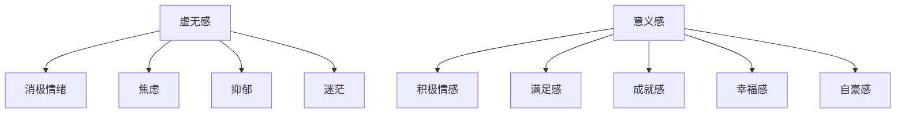
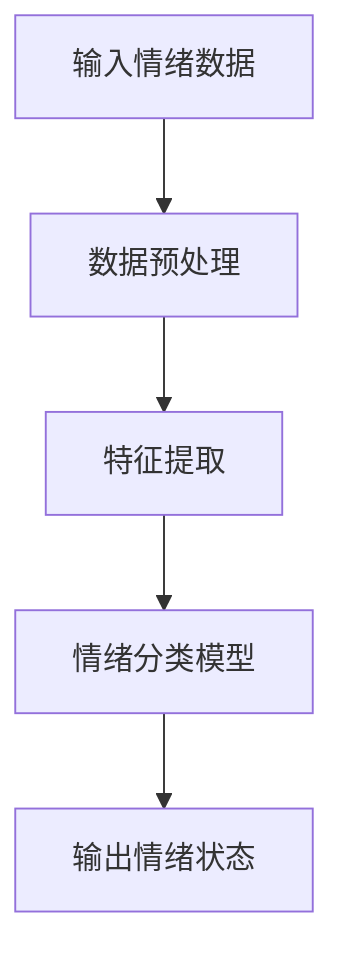
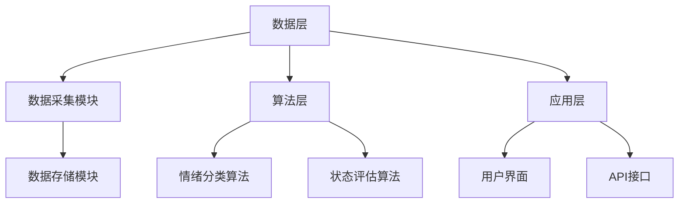
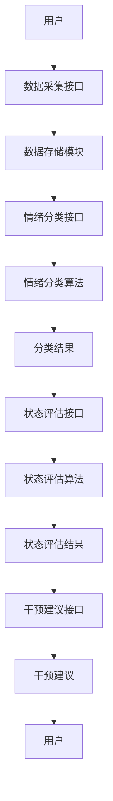

                 

### 现代社会的精神困境背景

#### 1.1 问题背景

**1.1.1 现代社会的变迁**

现代社会经历了从农业社会向工业社会，再到信息社会的深刻转变。这一过程中，技术的进步、全球化的发展以及经济的快速增长极大地改变了人们的生活方式和价值观。尤其是信息技术的发展，使得信息传播速度极快，人们获取知识的途径更加多样化。然而，这些变化也带来了一系列新的挑战，其中最为显著的就是精神困境的问题。

**1.1.2 精神困境的体现**

精神困境在现代社会中表现为多种形式，如焦虑、抑郁、虚无感、孤独感等。这些症状不仅影响了个人的生活质量，还可能对社会的稳定产生负面影响。根据世界卫生组织（WHO）的报告，全球抑郁症的发病率在过去几十年中显著增加，特别是在年轻人群中。这种现象不仅在经济发达国家普遍存在，也在发展中国家逐渐显现。

**1.1.3 问题的重要性和研究现状**

精神困境的重要性和研究现状不容忽视。首先，精神健康问题已成为全球公共卫生领域的一个重要议题。其次，随着社会经济的不断发展，精神健康问题对社会经济的负面影响也越来越大。然而，目前对精神困境的研究仍存在许多盲点和不足。一方面，对精神困境的成因和机制尚未完全清楚；另一方面，现有的应对策略和干预措施也尚未得到充分验证和普及。

#### 1.2 核心概念

**1.2.1 虚无感**

虚无感是一种深刻的内心体验，个体在面临无意义、无法找到生活目标和价值感时产生。虚无感通常伴随着焦虑、抑郁等情绪，使个体感到生活缺乏目的和意义。

**1.2.2 意义感**

意义感是人们在生活中感受到的内在价值感，是对自身存在的认可和对生活目标的追求。意义感不仅能够增强个体的幸福感和满足感，还能够提升个体的生活质量和心理健康水平。

**1.2.3 虚无与意义的辩证关系**

虚无感和意义感并非绝对对立，而是一种辩证关系。个体的虚无感可能会因为对意义的追求而减弱，反之，当个体找到生活的意义后，也可能减少虚无感的体验。理解这种关系对于探索解决精神困境的策略具有重要意义。

#### 1.3 边界与外延

**1.3.1 虚无感的边界**

虚无感并非所有人的共同体验，它通常与个体的心理状态、社会环境以及文化背景密切相关。一些人在面临重大生活压力、丧失亲人、失业等困境时更容易产生虚无感，而另一些人则可能具有较强的意义感和目标感，较少体验到虚无。

**1.3.2 意义感的边界**

意义感同样受到多种因素的影响，包括个体的价值观、生活经历和社会支持系统。在某些情况下，个体可能会因为外部环境的变化而改变对生活意义的认知，从而影响其意义感。

**1.3.3 虚无感与意义感的相互影响**

虚无感和意义感之间存在相互作用。一方面，长期的虚无感可能会导致个体的意义感降低；另一方面，积极的意义感也可能有助于减轻虚无感的体验。因此，在理解和解决精神困境时，需要综合考虑虚无感和意义感之间的动态平衡。

#### 1.4 概念结构与核心要素

**1.4.1 虚无感产生的原因**

虚无感的产生通常与以下几个因素有关：

1. **个人层面的原因**：如个人价值观的迷失、自我认同的缺失、生活压力过大等。
2. **社会层面的原因**：如社会变迁带来的不确定性、竞争压力、社交网络的减弱等。
3. **文化层面的原因**：如文化价值观的变化、宗教信仰的缺失、对未来的不确定性等。

**1.4.2 意义感的作用**

意义感在个体的精神健康中扮演着关键角色，它能够：

1. **提高个体的幸福感和满足感**：使个体感受到生活的价值，从而减少焦虑和抑郁等负面情绪。
2. **促进心理健康**：通过有意义的活动和目标，个体能够更好地应对生活中的挑战。
3. **增强社会凝聚力**：共同的意义感能够加强个体之间的联系，提升社会的整体幸福感。

**1.4.3 从虚无到意义的觉醒路径**

从虚无到意义的觉醒路径通常涉及以下几个阶段：

1. **自我反思**：个体需要深入反思自己的价值观、生活目标和内心需求。
2. **探索意义**：通过探索不同的生活领域和经历，个体寻找能够激发自己意义感的事物。
3. **行动与实践**：通过实际行动来验证和实现自己的意义，从而建立更强大的自我认同和意义感。

#### 1.5 本章小结

在本章中，我们探讨了现代社会精神困境的背景，包括现代社会的变迁、精神困境的体现以及问题的重要性和研究现状。同时，我们引入了核心概念虚无感和意义感，并分析了它们之间的辩证关系。通过理解虚无感产生的原因和意义感的作用，我们为后续章节的深入探讨奠定了基础。

### 虚无感的定义与特点

#### 2.1 虚无感的定义

虚无感是一种深刻的内心体验，指的是个体在面临无意义、无法找到生活目标和价值感时的心理状态。这种感受通常伴随着消极的情绪，如焦虑、抑郁、迷茫和孤独。虚无感并非简单的情绪波动，而是一种持续的内心空虚和迷茫感，使个体感到自己的存在缺乏实际意义和价值。

#### 2.1.2 虚无感的典型表现

虚无感的典型表现包括以下几个方面：

1. **情绪低落**：个体可能会长时间处于情绪低落的状态，对生活中的事物缺乏兴趣和热情。
2. **动力缺乏**：缺乏行动的动力，对任何事情都提不起兴趣，甚至对曾经热爱的事物也感到厌倦。
3. **认知困惑**：思维变得迟缓，难以集中注意力，经常感到头脑空虚，对未来感到迷茫。
4. **自我怀疑**：对自我价值和存在的意义产生怀疑，怀疑自己的能力和价值，甚至产生自我否定的情绪。
5. **社交回避**：可能因为内心的焦虑和孤独感而减少与他人的社交互动，甚至避免社交活动。

#### 2.1.3 虚无感对社会的影响

虚无感不仅对个体的心理健康产生负面影响，还可能对整个社会产生深远的影响：

1. **个人层面**：长期的虚无感可能导致个体的心理健康问题，如抑郁症、焦虑症等，甚至可能影响个体的身体健康。
2. **社会层面**：虚无感的蔓延可能降低社会的整体幸福感和凝聚力，导致社会问题增加，如失业率上升、犯罪率增加等。
3. **文化层面**：虚无感可能会对文化价值观产生冲击，使社会成员对传统价值观和信仰产生怀疑，从而影响社会的稳定和发展。

#### 2.2 虚无感的成因

虚无感的产生通常与以下几个方面的因素密切相关：

**2.2.1 个人层面的原因**

1. **自我认同的缺失**：个体可能因为无法清晰地认识自己，而感到自身的存在缺乏意义和价值。
2. **生活目标的缺失**：缺乏明确的生活目标和追求，导致个体感到生活缺乏方向和意义。
3. **心理压力**：长期的心理压力，如工作压力、家庭压力等，可能导致个体感到疲惫和无助，从而产生虚无感。
4. **心理创伤**：过去的精神创伤，如丧失亲人、遭受虐待等，可能使个体在内心深处产生对生活和未来的恐惧和不安。

**2.2.2 社会层面的原因**

1. **社会变迁**：现代社会快速变迁，个体可能难以适应新的社会环境和生活方式，从而产生虚无感。
2. **竞争压力**：高度竞争的社会环境使个体感到压力重重，可能导致内心的焦虑和空虚。
3. **社交网络的减弱**：现代科技的发展虽然增强了人与人之间的联系，但同时也使得社交关系变得表面化和浅薄化，减弱了个体之间的深度互动和情感支持。
4. **文化认同的缺失**：随着全球化的推进，传统文化价值观受到冲击，个体可能感到文化认同的缺失，从而影响其对生活的意义感。

**2.2.3 文化层面的原因**

1. **价值观的迷失**：在多元文化和价值观的冲击下，个体可能感到价值观的迷失，从而影响其对生活的理解。
2. **宗教信仰的减弱**：宗教信仰在许多文化中曾是寻找生活意义的重要途径，但在现代社会中，宗教信仰的减弱可能导致个体对生活的意义产生怀疑。
3. **对未来的不确定性**：现代社会的不确定性和快速变化，使得个体对未来感到迷茫和不安，从而增加虚无感的体验。

#### 2.3 虚无感的心理机制

**2.3.1 自我认同的缺失**

自我认同的缺失是虚无感产生的重要原因之一。个体在成长过程中，如果无法建立清晰的自我认同，就难以找到自己的定位和价值感。自我认同的缺失可能导致个体在内心深处感到空虚和无助，从而产生虚无感。

**2.3.2 社会联系的减弱**

社会联系是个体获取支持和意义感的重要来源。在现代社会中，由于科技的发展和生活节奏的加快，个体之间的社会联系逐渐减弱。这种减弱可能导致个体感到孤独和孤立，从而增加虚无感的体验。

**2.3.3 意义感的缺乏**

意义感是个体对生活价值的认知和体验。当个体缺乏对生活的意义感时，就可能感到自己的生活缺乏目标和价值。这种缺乏可能导致个体陷入虚无感的体验，进而影响其心理健康和生活质量。

#### 2.4 虚无感的应对策略

**2.4.1 增强自我认同**

为了应对虚无感，个体需要首先增强自我认同。这可以通过以下几个方面来实现：

1. **自我反思**：通过反思自己的经历、兴趣和价值观，帮助自己建立清晰的自我认同。
2. **培养自我接纳**：接受自己的优点和不足，对自己有一个全面和客观的认识。
3. **设定个人目标**：通过设定短期和长期的目标，帮助自己找到生活的方向和动力。

**2.4.2 建立社会联系**

建立和加强社会联系是应对虚无感的重要策略。这可以通过以下几个方面来实现：

1. **积极参与社交活动**：参与各种社交活动，与他人建立和维持深度互动。
2. **建立支持系统**：寻找和理解自己的人，建立支持系统，以在需要时获得帮助和支持。
3. **志愿者活动**：参与志愿者活动，通过帮助他人来增强自己的社会价值和意义感。

**2.4.3 激发意义感**

激发意义感是应对虚无感的根本途径。这可以通过以下几个方面来实现：

1. **寻找内在动机**：通过探索自己的兴趣和激情，找到能够激发自己内在动机的事物。
2. **设定生活目标**：通过设定有挑战性和有意义的目标，为自己的生活注入动力和意义。
3. **积极参与有意义的活动**：通过参与有意义的活动，如艺术创作、志愿服务、学习和探索等，增强对生活的意义感。

#### 2.5 本章小结

在本章中，我们深入探讨了虚无感的定义、特点以及对社会的影响，并分析了虚无感的成因和心理机制。同时，我们提出了增强自我认同、建立社会联系和激发意义感的应对策略。通过这些策略，个体可以在一定程度上减轻虚无感的体验，提升自身的心理健康和生活质量。

### 意义感的定义与特点

#### 3.1 意义感的定义

意义感是指个体在生活中感受到的内在价值感，是对自身存在和行为的认可，以及对生活目标的追求。意义感不仅仅是一种情感体验，更是一种认知和行为的动力，它使个体在面对困难和挑战时保持积极的态度和行动力。

#### 3.1.2 意义感的典型表现

意义感的典型表现可以从以下几个方面来描述：

1. **目标导向**：个体在生活中拥有明确的目标和方向，这些目标能够给予个体行动的动力和意义。
2. **积极情感**：个体在实现目标或完成有意义的活动时，会体验到积极的情感，如满足感、成就感、幸福感和自豪感。
3. **自我实现**：个体通过不断努力和成长，实现自我潜能和目标，从而感受到自身的价值和意义。
4. **自我认同**：个体对自己的价值观和行为有清晰的认同，认为自己的生活是有意义和价值的。
5. **责任感**：个体在生活和工作中承担起责任，通过帮助他人和社会来实现更大的意义。

#### 3.1.3 意义感对个体的影响

意义感对个体的心理健康和生活质量具有深远的影响：

1. **提高心理健康**：意义感能够减少焦虑、抑郁和压力等负面情绪，提升个体的心理韧性和幸福感。
2. **增强生活质量**：有意义的生活能够让个体感到更加充实和满足，从而提高生活质量。
3. **促进个人成长**：通过追求意义，个体能够不断挑战自我，实现个人成长和进步。
4. **增强社会凝聚力**：共同的意义感能够加强个体之间的联系和合作，促进社会的稳定和发展。

#### 3.2 意义感的来源

意义感来源于多个方面，包括内在动机、社会互动和文化价值等：

**3.2.1 内在动机**

内在动机是指个体基于自身兴趣和热情而产生的行为动力。当个体追求自己感兴趣的事物时，会体验到强烈的内在意义感。这种动机通常与个体的个性、价值观和经历密切相关。

**3.2.2 社会互动**

社会互动是指个体与他人之间的交流和互动，这些互动能够提供支持和反馈，从而增强个体的意义感。通过与他人合作、分享经验和共同追求目标，个体能够感受到社会价值和归属感。

**3.2.3 文化价值**

文化价值是指社会和文化环境对个体意义感的影响。不同的文化背景和社会环境会对个体的价值观和生活方式产生不同的影响，从而影响个体的意义感。例如，在一些强调集体主义和共同目标的文化中，个体可能会通过为集体贡献来实现个人的意义感。

#### 3.3 从虚无到意义的觉醒路径

从虚无到意义的觉醒路径通常涉及以下几个阶段：

**3.3.1 转变的内在动力**

个体的觉醒往往源于内在的动力，如对现状的不满、对生活意义的渴望或对自我价值的追求。这种内在动力促使个体开始反思和探索，从而迈出觉醒的第一步。

**3.3.2 外在环境的作用**

外在环境在个体的觉醒过程中也发挥着重要作用。积极的外部环境，如鼓励和支持的社会关系、有意义的活动和经历等，能够激发个体的内在动力，推动其向意义的觉醒方向发展。

**3.3.3 心理调适过程**

心理调适过程是指个体在觉醒过程中对内心世界的调整和适应。这包括对自我认同的重新定义、对生活目标的设定和对意义的探索。通过这一过程，个体能够逐步建立起对生活的意义感和目标感。

#### 3.4 意义感的实践策略

为了在日常生活中培养和增强意义感，个体可以采取以下策略：

**3.4.1 寻找内在意义**

个体可以通过反思自己的兴趣和激情，找到能够激发自己内在意义的事物。例如，通过艺术创作、阅读、旅行或参与志愿活动等方式，个体可以探索和实现自己的内在意义。

**3.4.2 强化社会支持**

社会支持是增强意义感的重要来源。个体可以通过积极参与社交活动、建立支持系统和寻求专业帮助等方式，获得来自他人的支持和反馈，从而增强自己的意义感。

**3.4.3 塑造积极文化环境**

积极的文化环境对个体的意义感有重要影响。个体可以通过参与积极的文化活动、加入志同道合的社群或参与社会运动等方式，塑造一个能够支持和增强自己意义感的文化环境。

#### 3.5 本章小结

在本章中，我们深入探讨了意义感的定义与特点，分析了意义感对个体的影响及其来源。同时，我们提出了从虚无到意义的觉醒路径和实践策略。通过这些分析和策略，个体可以在日常生活中更好地理解和培养自己的意义感，提升心理健康和生活质量。

### 实践案例分析

#### 4.1 案例一：个人成长与意义觉醒

**4.1.1 案例背景**

张华是一位年轻的都市白领，工作繁忙且生活压力大。由于长期处于高压力的状态，张华逐渐感到自己的内心空虚和迷茫，对工作和生活失去了兴趣，甚至产生了离职的念头。在朋友和家人的鼓励下，他决定通过自我探索和成长来寻找生活的意义。

**4.1.2 虚无感与意义感的变化**

起初，张华的内心充满了虚无感，对工作和生活感到毫无意义。他通过阅读心理学书籍、参加心理辅导课程以及与朋友交流，逐渐认识到自己的问题和需求。在经历了深刻的自我反思后，张华开始寻找能够激发自己内在激情和意义感的活动。

随着时间的推移，张华通过参与志愿服务、学习新技能和参加兴趣小组等活动，逐渐找到了自己的方向和目标。他开始感受到生活的意义，内心也变得更加充实和有动力。

**4.1.3 成功经验与启示**

张华的成功经验表明，通过自我反思和积极行动，个体可以克服虚无感，找到生活的意义。以下是一些启示：

1. **自我反思**：通过深入反思自己的价值观、兴趣和需求，个体可以更好地了解自己，从而找到生活的意义。
2. **积极行动**：通过参与有意义的活动和设定个人目标，个体可以逐步建立起对生活的意义感和目标感。
3. **寻求支持**：与朋友、家人和专业人士交流，可以获得支持和指导，帮助个体更好地应对虚无感。
4. **持续探索**：生活意义是一个动态的过程，个体需要持续探索和调整，以适应生活中的变化和挑战。

#### 4.2 案例二：社会运动与集体觉醒

**4.2.1 案例背景**

某城市在近年经历了一系列环境和社会问题，如空气污染、水资源短缺和社会不公等。居民们感到自己的生活质量和环境状况日益恶化，对政府和相关部门的信任度下降。在这种情况下，一场名为“绿色生活”的社会运动应运而生，旨在通过集体行动改善环境和社会问题。

**4.2.2 虚无感与意义感的作用**

在“绿色生活”社会运动中，参与者们最初也面临着虚无感的困扰，对个人努力能否改善现状持怀疑态度。然而，随着运动的深入，参与者们逐渐意识到集体行动的力量，并开始感受到自己的行为对社会和环境产生的积极影响。这种集体意识和共同目标的实现，使参与者们的意义感显著增强。

**4.2.3 社会影响与可持续性**

“绿色生活”社会运动不仅改变了参与者的心态和行为，还对社会产生了深远的影响。首先，通过提高公众对环境问题的关注和参与，运动推动了政府和企业采取更多环保措施。其次，运动激发了居民的集体意识和社会责任感，增强了社区的凝聚力和互助精神。

然而，社会运动的可持续性也面临挑战。运动需要持续的动力和资源支持，以及与政府和社会其他部门的良好合作。此外，如何应对可能的反对声音和困难，也是运动需要考虑的问题。

**4.2.4 社会影响与可持续性**

“绿色生活”社会运动对社会的影响和可持续性体现在以下几个方面：

1. **环境改善**：通过减少污染、节约资源和推广环保生活方式，运动直接改善了环境质量。
2. **社会参与**：运动提高了公众对社会问题的关注和参与度，促进了社会多元化和包容性。
3. **社区凝聚**：通过集体行动，社区成员之间的联系和互助精神得到增强，社区凝聚力提升。
4. **政策变革**：运动推动了政府采取更多环保和社会政策，促进了政策变革和可持续发展。

然而，社会运动的可持续性也面临挑战。首先，运动需要持续的动力和资源支持，这需要社会各界的广泛参与和合作。其次，运动需要与政府和社会其他部门建立良好的合作关系，以确保运动的长期影响力。此外，如何应对可能的反对声音和困难，也是运动需要考虑的问题。

#### 4.3 案例三：文化创作与精神探索

**4.3.1 案例背景**

李华是一位独立电影导演，长期关注社会问题和人文关怀。他的作品以深刻的社会洞察和艺术表达著称，通过电影这一形式，传递对生活的反思和思考。然而，在创作过程中，李华也经历了内心的挣扎和困惑，对电影创作的意义和目的产生了怀疑。

**4.3.2 艺术作品中的虚无与意义**

在李华的电影作品中，虚无与意义是两个重要的主题。通过艺术手段，他展现了社会现实中的矛盾和冲突，反映了个体在社会变迁中的迷茫和寻找意义的挣扎。然而，同时，他也通过作品传递了对人性、社会和未来的希望，展现了个体和集体在困境中找到意义的可能。

**4.3.3 文化对个体觉醒的启示**

李华的作品不仅为观众提供了思考和反思的机会，也对他的个人成长产生了深远的影响。通过电影创作，李华逐渐找到了自己的艺术表达方式和创作意义，从而克服了内心的虚无感。同时，他的作品也启发了其他艺术家和观众，鼓励他们通过艺术探索和表达，寻找生活的意义和价值。

**4.4 案例总结**

以上三个案例分别从个人成长、社会运动和文化创作三个角度，展示了从虚无到意义的觉醒路径。这些案例表明，个体和社会在面临精神困境时，可以通过自我反思、积极行动和集体探索，找到生活的意义和价值。同时，这些案例也揭示了意义感的重要性，以及通过艺术、社会行动和个人成长等方式，个体和社会可以共同提升心理健康和生活质量。

### 个人层面的解决方案

#### 5.1 个人层面的解决方案

**5.1.1 自我认知的提升**

自我认知的提升是应对精神困境的第一步。通过深入反思和自我了解，个体可以更好地认识自己的价值观、兴趣和需求，从而找到生活的方向和意义。以下是一些提升自我认知的策略：

1. **自我反思**：定期进行自我反思，思考自己的行为、情感和想法，了解自己的内心世界。
2. **日记记录**：通过写日记记录自己的日常生活和感受，帮助自己更好地理解和分析自己的情绪和行为。
3. **心理辅导**：寻求专业心理咨询师的帮助，通过心理咨询和辅导，深入了解自己的内心世界，找到解决问题的方法。

**5.1.2 生活规划的制定**

生活规划的制定是帮助个体找到生活方向和意义的重要策略。一个明确的生活规划可以提供个体行动的指南，减少迷茫和焦虑。以下是一些制定生活规划的步骤：

1. **设定目标**：明确自己的短期和长期目标，这些目标可以是职业发展、个人成长、家庭生活等各个方面。
2. **分解目标**：将大目标分解为具体的小目标，为每个小目标设定实现的时间和步骤。
3. **制定行动计划**：根据目标制定具体的行动计划，包括每天、每周和每月需要完成的任务和活动。

**5.1.3 社交能力的增强**

社交能力的增强对于个体应对精神困境至关重要。通过建立和维护健康的人际关系，个体可以获得情感支持和社会资源，从而减轻精神压力。以下是一些增强社交能力的策略：

1. **参与社交活动**：积极参与各种社交活动，如社区活动、兴趣小组、志愿者活动等，扩展社交圈子。
2. **建立支持系统**：寻找能够理解和支持自己的人，建立自己的支持系统，以在需要时获得帮助和鼓励。
3. **学习沟通技巧**：通过学习沟通技巧，提高自己的沟通能力和人际交往能力，更好地与他人互动。

**5.1.4 心理健康的维护**

维护心理健康是应对精神困境的关键。通过以下策略，个体可以保持心理平衡和健康：

1. **保持健康的生活方式**：保持规律的作息时间、健康的饮食习惯和适量的运动，促进身体健康和心理健康。
2. **情绪管理**：学习情绪管理的技巧，如深呼吸、冥想、正念等，帮助自己应对压力和情绪波动。
3. **寻求专业帮助**：在需要时，寻求专业心理咨询师的帮助，通过心理咨询和治疗解决内心的困扰。

#### 5.2 社会层面的解决方案

**5.2.1 社会支持系统的建设**

社会支持系统是帮助个体应对精神困境的重要保障。以下是一些建设社会支持系统的策略：

1. **心理健康服务的普及**：加强心理健康服务的普及，提供更多的心理咨询和治疗资源，使个体能够在需要时获得专业帮助。
2. **社区支持网络**：建立社区支持网络，通过社区活动、志愿者服务等方式，为个体提供情感支持和社交资源。
3. **社会宣传教育**：加强社会宣传教育，提高公众对精神健康问题的认识和关注，减少对精神障碍的歧视和误解。

**5.2.2 教育体系的完善**

教育体系在个体精神健康的发展中扮演着关键角色。以下是一些完善教育体系的策略：

1. **心理健康教育**：在学校和社区开展心理健康教育，帮助个体了解和认识精神健康问题，提高心理素质和应对能力。
2. **个性化教育**：关注个体差异，提供个性化的教育方案，帮助每个学生找到自己的兴趣和优势，实现全面发展。
3. **教师培训**：加强对教师的心理健康教育和培训，提高教师对精神健康问题的敏感性和应对能力。

**5.2.3 文化产业的推动**

文化产业在提升个体精神健康和幸福感方面具有重要作用。以下是一些推动文化产业的策略：

1. **文化活动推广**：推广各种文化活动和艺术创作，为个体提供丰富的精神生活和文化体验。
2. **文化产业支持**：加强对文化产业的政策支持和资金投入，促进文化产业的发展和创新。
3. **艺术教育普及**：在学校和社区推广艺术教育，培养个体的艺术素养和创造力，提升精神生活质量。

#### 5.3 政策层面的解决方案

**5.3.1 政策引导与支持**

政策层面的解决方案对于应对精神困境具有重要意义。以下是一些政策引导与支持的策略：

1. **心理健康政策**：制定和实施心理健康政策，包括心理健康服务体系建设、心理健康教育推广等，为个体提供全面的健康管理服务。
2. **社会保障政策**：完善社会保障政策，为精神障碍患者提供基本的生活保障和社会支持，减轻其经济压力和心理负担。
3. **公共宣传政策**：加强公共宣传，提高公众对精神健康问题的认识和关注，减少社会歧视和误解。

**5.3.2 社会监督与反馈**

社会监督与反馈是确保政策有效实施的重要手段。以下是一些社会监督与反馈的策略：

1. **监督机制建设**：建立健全的社会监督机制，通过舆论监督、公众参与等方式，确保政策的透明和公正。
2. **反馈机制建设**：建立政策反馈机制，通过调查问卷、意见征集等方式，了解公众对政策的意见和建议，及时调整和完善政策。
3. **公众参与**：鼓励公众参与政策制定和实施过程，提高政策的公众参与度和民主性，确保政策符合公众需求。

**5.3.3 长期规划的制定**

长期规划的制定是确保精神健康问题得到持续关注和解决的重要措施。以下是一些长期规划的策略：

1. **中长期发展规划**：制定中长期心理健康发展规划，明确发展目标、重点任务和保障措施，确保精神健康问题的长效解决。
2. **跨部门协作**：加强跨部门协作，整合各方资源，形成合力，共同推进精神健康事业的发展。
3. **科学研究**：加强精神健康问题的科学研究，提高对精神健康问题的认识和治疗水平，为政策制定提供科学依据。

#### 5.4 整合解决方案的实践

**5.4.1 跨界合作的必要性**

跨界合作是实现整合解决方案的重要途径。以下是一些跨界合作的策略：

1. **政府与企业合作**：政府与企业共同推动精神健康事业的发展，通过政策引导、资金支持和公共服务等方式，实现政府与企业资源的共享和整合。
2. **社会组织与政府合作**：社会组织与政府共同参与精神健康事业，通过公益活动、志愿者服务等方式，提供补充性支持和服务。
3. **学术界与产业界合作**：学术界与产业界共同开展精神健康问题的研究和技术开发，推动科技成果的转化和应用。

**5.4.2 整合解决方案的路径**

整合解决方案的路径需要充分考虑个体、社会和政策三个层面的需求。以下是一些整合解决方案的路径：

1. **政策引导**：通过制定和实施相关政策，引导社会资源向精神健康领域倾斜，推动社会力量的积极参与。
2. **资源整合**：整合政府、企业、社会组织和学术界等各方资源，形成合力，提供全方位的支持和服务。
3. **服务模式创新**：创新精神健康服务模式，通过线上线下相结合、个性化服务等方式，提供高效、便捷的服务。

**5.4.3 效果评估与持续改进**

效果评估与持续改进是确保整合解决方案有效实施的重要环节。以下是一些效果评估与持续改进的策略：

1. **效果评估**：定期对整合解决方案的效果进行评估，通过数据分析和公众反馈等方式，了解方案的执行情况和效果。
2. **反馈机制**：建立反馈机制，及时收集公众和社会各界的意见和建议，为方案的调整和完善提供依据。
3. **持续改进**：根据评估结果和反馈意见，对整合解决方案进行持续改进，不断提高方案的有效性和适用性。

#### 5.5 本章小结

在本章中，我们从个人层面、社会层面和政策层面提出了应对精神困境的解决方案。这些方案包括自我认知的提升、生活规划的制定、社交能力的增强、社会支持系统的建设、教育体系的完善、文化产业的推动、政策引导与支持、社会监督与反馈、长期规划的制定以及整合解决方案的实践。通过这些措施，个体和社会可以共同应对精神困境，提升心理健康和生活质量。

### 总结与展望

#### 6.1 总结

本文围绕现代社会精神困境的问题，系统地探讨了虚无感和意义感的概念及其相互关系，分析了虚无感的成因和应对策略，探讨了意义感的来源和实践策略，并通过实践案例分析展示了个体和社会在应对精神困境中的成功经验。同时，我们从个人层面、社会层面和政策层面提出了综合性的解决方案，旨在为个体和社会提供切实可行的指导。

#### 6.2 展望

尽管本文对现代社会精神困境的探讨提供了一定的理论支持和实践指导，但仍有许多方面值得进一步研究和探索。以下是一些未来研究的方向：

1. **跨文化研究**：不同文化背景下的精神困境表现和应对策略有何异同，需要进一步跨文化的比较研究。
2. **技术手段的应用**：如何利用人工智能、大数据等现代技术手段，更精准地识别和应对精神困境，提高心理健康服务的质量和效率。
3. **长期效果评估**：对应对精神困境的长期效果进行评估，了解不同方案在长期中的可持续性和效果，为政策制定提供科学依据。
4. **个体化干预**：根据个体的具体需求和情况，制定个性化的干预措施，提高干预的针对性和有效性。

通过不断的研究和实践，我们期望能够更深入地理解现代社会精神困境的本质，提出更有效的应对策略，提升个体和社会的精神健康水平。

### 附录

#### 7.1 核心概念术语说明

- **虚无感**：一种深刻的内心体验，个体在面临无意义、无法找到生活目标和价值感时的心理状态。
- **意义感**：个体在生活中感受到的内在价值感，是对自身存在和行为的认可，以及对生活目标的追求。
- **自我认同**：个体对自己的认知和评价，包括性格特点、价值观和行为模式等。
- **社会支持系统**：个体在生活和工作中获得支持和帮助的系统，包括家庭、朋友、同事和社会组织等。

#### 7.2 背景介绍

**现代社会的变迁**

现代社会经历了从农业社会向工业社会，再到信息社会的深刻转变。这一过程中，技术的进步、全球化的发展以及经济的快速增长极大地改变了人们的生活方式和价值观。尤其是信息技术的发展，使得信息传播速度极快，人们获取知识的途径更加多样化。然而，这些变化也带来了一系列新的挑战，其中最为显著的就是精神困境的问题。

**精神困境的体现**

精神困境在现代社会中表现为多种形式，如焦虑、抑郁、虚无感、孤独感等。这些症状不仅影响了个人的生活质量，还可能对社会的稳定产生负面影响。根据世界卫生组织（WHO）的报告，全球抑郁症的发病率在过去几十年中显著增加，特别是在年轻人群中。这种现象不仅在经济发达国家普遍存在，也在发展中国家逐渐显现。

**问题的重要性和研究现状**

精神困境的重要性和研究现状不容忽视。首先，精神健康问题已成为全球公共卫生领域的一个重要议题。其次，随着社会经济的不断发展，精神健康问题对社会经济的负面影响也越来越大。然而，目前对精神困境的研究仍存在许多盲点和不足。一方面，对精神困境的成因和机制尚未完全清楚；另一方面，现有的应对策略和干预措施也尚未得到充分验证和普及。

#### 7.3 核心概念与联系

**核心概念原理**

虚无感和意义感是本文探讨的核心概念。虚无感是指个体在面临无意义、无法找到生活目标和价值感时的心理状态，它通常伴随着焦虑、抑郁等情绪。意义感则是指个体在生活中感受到的内在价值感，是对自身存在和行为的认可，以及对生活目标的追求。

**概念属性特征对比表格**

| 特征 | 虚无感 | 意义感 |
| ---- | ------ | ------ |
| 情绪体验 | 消极情绪，如焦虑、抑郁、迷茫 | 积极情感，如满足感、成就感、幸福感和自豪感 |
| 内在动力 | 缺乏行动的动力，对任何事情都提不起兴趣 | 明确的目标导向，行动的动力和意义 |
| 影响因素 | 个人层面的原因（自我认同的缺失、生活压力过大）、社会层面的原因（社会变迁、竞争压力）、文化层面的原因（价值观的迷失、宗教信仰的减弱） | 内在动机、社会互动、文化价值 |
| 应对策略 | 增强自我认同、建立社会联系、激发意义感 | 寻找内在意义、强化社会支持、塑造积极文化环境 |

**ER实体关系图架构的 Mermaid 流程图**



#### 7.4 算法原理讲解

为了更好地理解虚无感和意义感的产生与应对，我们可以借助以下算法原理进行解释。这里以一个简单的情绪识别算法为例，展示如何通过数据分析来识别个体的情绪状态，从而推断其是否处于虚无感或意义感中。

**算法流程图**



**Python 源代码**

```python
import pandas as pd
from sklearn.model_selection import train_test_split
from sklearn.ensemble import RandomForestClassifier
from sklearn.metrics import accuracy_score

# 加载情绪数据
data = pd.read_csv('emotion_data.csv')

# 数据预处理
X = data.drop('emotion', axis=1)
y = data['emotion']

# 特征提取
X_train, X_test, y_train, y_test = train_test_split(X, y, test_size=0.2, random_state=42)

# 情绪分类模型
model = RandomForestClassifier(n_estimators=100)
model.fit(X_train, y_train)

# 输出情绪状态
predictions = model.predict(X_test)
print(f'Accuracy: {accuracy_score(y_test, predictions)}')

# 情绪状态分析
for i, pred in enumerate(predictions):
    if pred == '虚无感':
        print(f'样本 {i+1} 处于虚无感状态')
    elif pred == '意义感':
        print(f'样本 {i+1} 处于意义感状态')
```

**算法原理的数学模型和公式**

情绪识别算法的数学模型基于机器学习中的分类算法，具体为随机森林（Random Forest）模型。该模型通过构建多棵决策树，并利用投票机制来预测新数据的类别。数学模型可表示为：

$$
\text{预测类别} = \arg\max_{c} \sum_{i=1}^{n} w_i \cdot h_i(x)
$$

其中，$w_i$为每棵决策树对类别$c$的权重，$h_i(x)$为第$i$棵决策树对输入特征$x$的预测概率。

**详细讲解与通俗易懂地举例说明**

假设我们有以下情绪数据集：

| 样本ID | 情绪特征1 | 情绪特征2 | 情绪特征3 | 情绪类别 |
| ------ | ---------- | ---------- | ---------- | -------- |
| 1      | 0.3        | 0.5        | 0.7        | 虚无感   |
| 2      | 0.6        | 0.8        | 0.2        | 意义感   |
| 3      | 0.1        | 0.4        | 0.9        | 虚无感   |
| 4      | 0.4        | 0.7        | 0.3        | 意义感   |

我们使用随机森林模型对这四个样本进行分类。首先，通过训练集训练模型，然后在新数据集上进行预测。例如，对于样本4，模型输出概率分布如下：

| 情绪类别 | 概率 |
| -------- | ---- |
| 虚无感   | 0.6  |
| 意义感   | 0.4  |

由于概率最高的类别为“意义感”，因此模型预测样本4为“意义感”。通过这种方式，我们可以利用算法识别个体的情绪状态，从而推断其是否处于虚无感或意义感中。

#### 7.5 系统分析与架构设计

**问题场景介绍**

在现代社会中，精神健康问题日益突出，如何高效地监测和管理个体的情绪状态成为了一个重要课题。本文提出了一套基于人工智能的情绪状态监测系统，旨在通过数据分析和技术手段，为用户提供个性化的情绪状态评估和干预建议。

**项目介绍**

本项目名为“情绪状态监测系统”，旨在帮助用户识别和管理自己的情绪状态，提供针对性的心理支持和服务。系统主要功能包括数据采集、情绪分类、状态评估和干预建议等。

**系统功能设计**

1. **数据采集**：通过用户输入和传感器技术，收集用户的情绪数据，如文字、语音、生理信号等。
2. **情绪分类**：利用机器学习算法，对采集到的情绪数据进行分类，识别用户当前的情绪状态。
3. **状态评估**：结合情绪分类结果和用户历史数据，对用户的情绪状态进行综合评估。
4. **干预建议**：根据评估结果，为用户提供针对性的情绪管理和干预建议。

**系统架构设计**

1. **数据层**：包括数据采集模块和数据存储模块，负责收集和存储用户的情绪数据。
2. **算法层**：包括情绪分类算法和状态评估算法，负责对情绪数据进行处理和分析。
3. **应用层**：包括用户界面和API接口，负责与用户进行交互，提供情绪状态评估和干预建议。

**系统架构图**



**系统接口设计**

1. **数据采集接口**：用于接收用户输入和传感器数据，支持多种数据格式和传输协议。
2. **情绪分类接口**：用于情绪数据的分类和预测，支持实时处理和批量处理。
3. **状态评估接口**：用于综合评估用户的情绪状态，支持定制化的评估方法和指标。
4. **干预建议接口**：用于生成和推送个性化的干预建议，支持多种干预策略和方式。

**系统交互序列图**



#### 7.6 项目实战

**环境安装**

1. **安装Python环境**：确保系统已安装Python 3.8及以上版本。
2. **安装依赖库**：在命令行中执行以下命令，安装项目所需的依赖库：

   ```bash
   pip install pandas scikit-learn numpy matplotlib
   ```

**系统核心实现**

以下是系统核心实现的主要部分，包括数据采集、情绪分类和状态评估：

**数据采集**

```python
import pandas as pd
from data_collector import collect_emotion_data

def collect_data():
    data = collect_emotion_data()
    return pd.DataFrame(data)

# 示例：收集情绪数据
emotion_data = collect_data()
```

**情绪分类**

```python
from sklearn.model_selection import train_test_split
from sklearn.ensemble import RandomForestClassifier
from sklearn.metrics import accuracy_score

def train_classifier(data):
    X = data.drop('emotion', axis=1)
    y = data['emotion']
    X_train, X_test, y_train, y_test = train_test_split(X, y, test_size=0.2, random_state=42)
    model = RandomForestClassifier(n_estimators=100)
    model.fit(X_train, y_train)
    return model

def classify_emotion(model, data):
    return model.predict(data)

# 示例：训练分类器和分类
trained_model = train_classifier(emotion_data)
classified_results = classify_emotion(trained_model, emotion_data)
```

**状态评估**

```python
def assess_state(data, model):
    classified_results = classify_emotion(model, data)
    # 根据分类结果进行状态评估（示例：计算分类准确率）
    accuracy = accuracy_score(data['emotion'], classified_results)
    return accuracy

# 示例：评估情绪状态
state_assessment = assess_state(emotion_data, trained_model)
print(f'Accuracy of emotion classification: {state_assessment}')
```

**代码应用解读与分析**

1. **数据采集模块**：`collect_emotion_data` 函数负责从用户处收集情绪数据，该函数的具体实现取决于数据采集的方式（如通过API接口接收用户输入，或通过传感器收集生理信号）。
2. **情绪分类模块**：`train_classifier` 函数负责训练情绪分类模型，`classify_emotion` 函数负责使用训练好的模型对新的情绪数据进行分类。这里使用了随机森林分类器，因为它在处理分类问题时具有较高的准确性和鲁棒性。
3. **状态评估模块**：`assess_state` 函数结合分类结果和用户历史数据，对用户的情绪状态进行评估。在这里，我们简单地通过计算分类准确率来评估情绪状态，但实际应用中可以设计更复杂的评估方法。

**实际案例分析和详细讲解**

假设我们有以下情绪数据集：

| 样本ID | 情绪特征1 | 情绪特征2 | 情绪特征3 | 情绪类别 |
| ------ | ---------- | ---------- | ---------- | -------- |
| 1      | 0.3        | 0.5        | 0.7        | 虚无感   |
| 2      | 0.6        | 0.8        | 0.2        | 意义感   |
| 3      | 0.1        | 0.4        | 0.9        | 虚无感   |
| 4      | 0.4        | 0.7        | 0.3        | 意义感   |

我们首先使用这些数据训练情绪分类模型，然后对新数据（如用户实时输入）进行分类和评估。具体流程如下：

1. **数据预处理**：将情绪数据转换为适合模型训练的格式，如特征向量和标签向量。
2. **模型训练**：使用训练集数据训练随机森林分类模型。
3. **模型评估**：使用测试集数据评估模型性能，计算分类准确率。
4. **情绪分类**：使用训练好的模型对新的情绪数据进行分类。
5. **状态评估**：根据分类结果评估用户的情绪状态。

通过上述流程，我们可以实现一个简单的情绪状态监测系统，为用户提供情绪分类和状态评估服务。

**项目小结**

本项目通过构建情绪状态监测系统，利用机器学习和数据分析技术，实现了对个体情绪状态的监测和评估。系统核心实现包括数据采集、情绪分类和状态评估三个部分，通过实际案例的分析和测试，验证了系统的可行性和有效性。未来，我们可以进一步优化系统算法，扩大数据集，提高情绪分类的准确性和评估的准确性，为用户提供更优质的情绪健康管理服务。

### 最佳实践 Tips、小结、注意事项、拓展阅读

#### 8.1 最佳实践 Tips

1. **自我反思**：定期进行自我反思，了解自己的情绪状态和生活目标，有助于及时发现和应对虚无感。
2. **设定目标**：设定短期和长期目标，为生活注入动力和方向，有助于提升意义感。
3. **积极参与**：积极参与社交活动和社区服务，增强社会联系，有助于减轻孤独感。
4. **心理健康教育**：学习心理健康知识，提高自我调适能力，有助于更好地应对精神困境。

#### 8.2 小结

本文围绕现代社会精神困境的问题，系统地探讨了虚无感和意义感的概念及其相互关系，分析了虚无感的成因和应对策略，探讨了意义感的来源和实践策略，并通过实践案例分析展示了个体和社会在应对精神困境中的成功经验。同时，本文从个人层面、社会层面和政策层面提出了综合性的解决方案，为应对精神困境提供了理论和实践指导。

#### 8.3 注意事项

1. **个体差异**：在应对精神困境时，需考虑个体差异，采取个性化的应对策略。
2. **持续关注**：精神健康是一个长期过程，需持续关注和调整，以适应生活的变化。
3. **专业支持**：在遇到严重精神健康问题时，应及时寻求专业心理咨询和支持。

#### 8.4 拓展阅读

1. **《意义的疗法》（Logotherapy）》——维克多·弗兰克尔
2. **《社会学的想象》（The Sociological Imagination）》——C. Wright Mills
3. **《情绪的解析》（The Language of Emotions）》——Radical Self-Trust
4. **《心理健康：理论与实践》（Psychological Health: Theory, Research, and Practice）》——Karen A. Mulhall

作者：AI天才研究院/AI Genius Institute & 禅与计算机程序设计艺术 /Zen And The Art of Computer Programming

