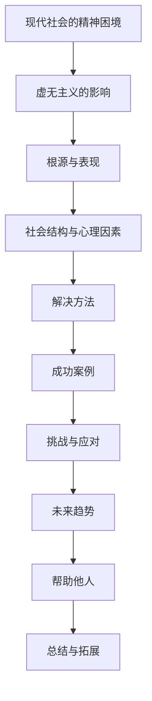
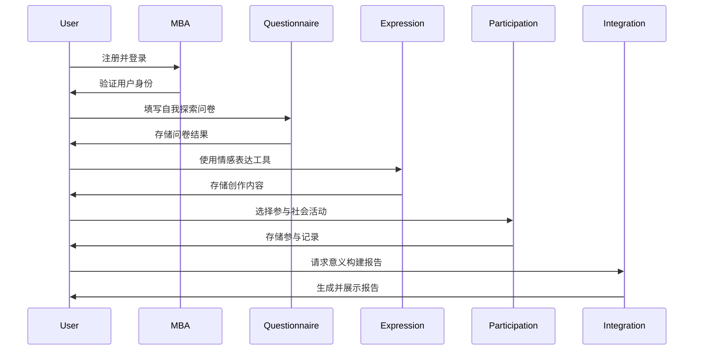

                 

### 现代社会的精神困境：从虚无到意义的转变

#### 关键词：精神困境、虚无主义、意义、转变、现代生活

> 摘要：本文旨在探讨现代社会中普遍存在的精神困境，特别是虚无主义所带来的影响。通过分析其根源、表现、影响以及可能的解决方法，帮助读者理解如何从虚无中寻找生活的意义，实现精神层面的转变。

#### 引言

在现代社会，我们经常听到关于精神健康问题的讨论，如焦虑、抑郁和自杀率上升。这些问题不仅影响个人，也对社会整体产生了深远的影响。一个关键因素是虚无主义，即对生活缺乏意义和目的的感觉。虚无主义并不是一个新现象，但它随着现代社会的发展变得更加显著。本文将深入探讨虚无主义在现代社会中的地位，分析其根源和表现，并提出一些可能的解决方法。

#### 第1章：现代社会的精神困境

##### 1.1 精神困境的定义与表现

精神困境是一种复杂的心理状态，表现为个体在面对生活中的挑战时感到无力、绝望和无意义。这种困境在现代社会的表现尤为明显，主要体现在以下几个方面：

1. **焦虑与压力**：现代社会的高压环境导致许多人感到焦虑和压力，这往往与对未来的不确定性和对成功的过高期望有关。
2. **抑郁与孤独**：随着社交网络的普及，人们似乎更接近，但实际上却更加孤独。抑郁情绪在这个背景下变得尤为普遍。
3. **自我怀疑与迷茫**：在现代社会，人们经常对自己的价值和存在感到怀疑，不知道自己的努力是否有意义。

##### 1.2 现代社会的变迁与精神困境的关系

现代社会的快速变化是精神困境的一个重要原因。以下是几个关键因素：

1. **全球化**：全球化使得生活节奏加快，竞争加剧，人们不得不面对前所未有的挑战。
2. **技术发展**：虽然技术带来了便利，但也导致了信息的过载，使得人们难以处理和理解周围的世界。
3. **社会结构变化**：传统的社会结构逐渐消失，导致个体感到无所适从，不知道如何在新的环境中找到自己的位置。

##### 1.3 精神困境的全球现象与影响

精神困境不仅是某些国家的特定现象，而是全球性的问题。以下是几个影响：

1. **心理健康问题**：精神困境直接导致心理健康问题的增加，如抑郁症和焦虑症。
2. **社会问题**：精神困境还可能导致一系列社会问题，如家庭破裂、自杀率上升等。
3. **经济成本**：精神困境给社会和经济带来了巨大的成本，包括医疗费用、生产力下降等。

#### 第2章：虚无主义的根源

##### 2.1 虚无主义的历史背景

虚无主义并不是现代社会特有的现象，它有着悠久的历史。虚无主义的思想根源可以追溯到古希腊哲学家皮浪和犬儒学派的伊壁鸠鲁。然而，虚无主义作为一种哲学运动，主要在19世纪和20世纪得到发展。以下是几个关键人物和思想：

1. **尼采**：尼采是虚无主义的代表人物之一，他的作品探讨了人类存在的意义和荒谬。
2. **萨特**：萨特的哲学思想强调了自由意志和个人选择的重要性，但也揭示了人类存在的荒谬。
3. **加缪**：加缪的哲学思想强调了个人对荒谬的抗争，提出了“存在先于本质”的观点。

##### 2.2 虚无主义的主要观点

虚无主义的核心观点是，生命没有固有的意义或目的。以下是几个关键观点：

1. **生命的荒谬**：虚无主义者认为，生活本身是荒谬的，因为我们的存在和努力似乎没有任何真正的意义。
2. **自由意志**：虚无主义者认为，人类拥有自由意志，但这个自由是有限的，因为我们无法逃脱生命的荒谬。
3. **个人选择**：虚无主义者强调，尽管生命是荒谬的，但个人仍然可以通过自己的选择赋予生活意义。

##### 2.3 虚无主义对现代社会的影响

虚无主义对现代社会产生了深远的影响。以下是几个方面：

1. **心理健康问题**：虚无主义可能导致心理健康问题，如抑郁症和焦虑症。
2. **价值观混乱**：虚无主义挑战了传统的价值观体系，导致人们对生活的目的和意义产生疑问。
3. **社会动荡**：虚无主义可能引发社会动荡，因为人们对社会的制度和价值观产生怀疑。

#### 第3章：意义与存在的联系

##### 3.1 意义的多元解释

意义是一个复杂的概念，可以从多个角度进行解释。以下是几种常见的解释：

1. **存在主义意义**：存在主义认为，意义是个人赋予的，每个人都需要为自己的生活找到意义。
2. **宗教意义**：宗教认为，意义来源于信仰和信仰体系，通过宗教仪式和信仰实践来寻找意义。
3. **实用主义意义**：实用主义认为，意义在于实现目标和实现个人价值。

##### 3.2 存在的意义与价值

存在主义认为，存在的意义和价值在于个人选择和行动。以下是几个关键点：

1. **自由意志**：存在主义认为，自由意志是存在的核心，个人可以通过自由选择来赋予生活意义。
2. **责任**：存在主义强调，个人对自己的行为负有责任，这种责任感是找到生活意义的重要途径。
3. **意义构建**：存在主义认为，每个人都需要通过构建自己的意义来克服存在的荒谬。

##### 3.3 意义与存在的联系表格

以下是一个简单的表格，展示了意义与存在之间的联系：

| 意义 | 存在 |
| --- | --- |
| 自我实现 | 个人选择 |
| 价值实现 | 自由意志 |
| 生活目标 | 行动与决策 |

##### 3.4 意义与存在的 Mermaid ER 图

```mermaid
erDiagram
  意义 ||--|{ 存在 }|
  存在 ||--|{ 意义 }
```

#### 第4章：社会结构与文化因素

##### 4.1 现代社会结构对精神困境的影响

现代社会结构的特点，如全球化、技术进步和社会变迁，对精神困境产生了深远的影响。以下是几个关键点：

1. **竞争压力**：全球化导致竞争加剧，人们不得不不断努力以保持竞争力，这增加了精神压力。
2. **信息过载**：技术进步使得信息爆炸，人们难以处理和理解所有的信息，这可能导致焦虑和困惑。
3. **社会变迁**：社会变迁导致传统价值观和信仰体系受到挑战，这可能导致人们对生活的意义和目的产生疑问。

##### 4.2 文化因素对精神困境的作用

文化因素在精神困境的形成和缓解中起着重要作用。以下是几个关键点：

1. **宗教与信仰**：宗教和信仰体系可以为人们提供精神支持和生活的意义。
2. **社会规范**：社会规范和价值观可以影响个人的行为和心理状态，例如，过度强调成功可能导致焦虑和压力。
3. **文化多样性**：文化多样性可以提供不同的生活视角和解决方案，有助于减轻精神困境。

##### 4.3 社会结构与文化的互动关系

社会结构和文化因素相互作用，共同影响精神困境的形成和缓解。以下是几个关键点：

1. **社会支持**：社会支持系统，如家庭、社区和政府，可以提供帮助和支持，减轻精神压力。
2. **文化适应**：个体需要适应社会结构和文化环境，这可能会影响他们的精神状态。
3. **社会变革**：社会结构的变革可能需要文化的变革，以适应新的生活方式和价值观。

#### 第5章：个体心理因素

##### 5.1 个体心理结构与精神困境

个体心理结构在精神困境的形成中起着关键作用。以下是几个关键点：

1. **自我认同**：个体对自己的认同会影响他们的精神状态。缺乏自我认同可能导致精神困境。
2. **情感调节**：个体如何调节自己的情绪和情感会影响他们的精神状态。不良的情感调节可能导致焦虑和抑郁。
3. **认知模式**：个体的认知模式，如思维方式、信念和价值观，会影响他们的精神状态。负面认知模式可能导致精神困境。

##### 5.2 焦虑、抑郁与虚无主义

焦虑、抑郁和虚无主义是常见的心理问题，它们与精神困境密切相关。以下是几个关键点：

1. **焦虑**：焦虑是一种常见的情绪反应，但过度的焦虑可能导致精神困境。
2. **抑郁**：抑郁是一种严重的情绪障碍，它可能导致虚无主义和对生活的失望。
3. **虚无主义**：虚无主义是一种哲学观点，但也可能是一种心理状态，它与焦虑和抑郁有关。

##### 5.3 个体心理因素与精神困境的互动

个体心理因素与精神困境之间存在着复杂的互动关系。以下是几个关键点：

1. **情绪与认知**：情绪和认知之间的相互作用会影响个体的精神状态。例如，消极情绪可能导致消极认知，加剧精神困境。
2. **行为模式**：个体的行为模式，如应对策略和生活习惯，也会影响他们的精神状态。
3. **心理治疗**：心理治疗，如认知行为疗法和心理咨询，可以帮助个体应对精神困境。

#### 第6章：转变思维模式

##### 6.1 认知行为疗法

认知行为疗法是一种广泛应用于治疗焦虑、抑郁和虚无主义的心理治疗方法。以下是几个关键点：

1. **认知重建**：认知行为疗法通过帮助个体识别和改变负面认知，改善情绪和行为。
2. **行为激活**：认知行为疗法鼓励个体参与积极的行为，以改善他们的情绪和生活质量。
3. **案例分析**：通过实际案例，展示认知行为疗法如何帮助个体应对精神困境。

##### 6.2 正念练习

正念练习是一种基于佛教心理学的练习，可以帮助个体提高注意力、减少焦虑和抑郁。以下是几个关键点：

1. **正念冥想**：正念冥想通过专注于当前的经历，帮助个体减少思维杂念，提高情绪调节能力。
2. **正念呼吸**：正念呼吸是一种简单的练习，通过专注于呼吸，帮助个体放松身心，减轻压力。
3. **案例分析**：通过实际案例，展示正念练习如何帮助个体应对精神困境。

##### 6.3 思维模式的转变实践

思维模式的转变是应对精神困境的关键。以下是几个关键点：

1. **积极思维**：积极思维通过关注积极的方面，帮助个体改善情绪和生活质量。
2. **乐观视角**：乐观视角通过改变对困难和挑战的看法，帮助个体增强应对能力。
3. **案例分析**：通过实际案例，展示思维模式的转变如何帮助个体应对精神困境。

#### 第7章：生活方式的转变

##### 7.1 健康生活方式的重要性

健康生活方式对精神健康至关重要。以下是几个关键点：

1. **饮食**：均衡的饮食可以为身体提供所需的营养，提高精神状态。
2. **运动**：定期运动可以释放内啡肽，改善情绪，减少焦虑和抑郁。
3. **睡眠**：充足的睡眠对精神健康至关重要，有助于提高注意力和情绪稳定性。

##### 7.2 社交支持网络

社交支持网络对精神健康有重要影响。以下是几个关键点：

1. **家庭支持**：家庭支持可以为个体提供情感支持和安全感，减轻精神压力。
2. **朋友支持**：朋友的陪伴和鼓励可以帮助个体应对生活中的挑战，提高精神状态。
3. **社区支持**：社区支持可以提供资源和服务，帮助个体应对精神困境。

##### 7.3 生活方式的转变实践

生活方式的转变需要时间和努力，但可以带来显著的好处。以下是几个关键点：

1. **制定计划**：制定具体的计划，逐步改变生活方式。
2. **坚持练习**：坚持健康生活方式的练习，如运动、冥想和社交活动。
3. **寻求帮助**：在必要时寻求专业帮助，如心理咨询和治疗。

#### 第8章：成功转变的实例

##### 8.1 个人故事一

个人故事一讲述了一个人如何通过认知行为疗法和健康生活方式的转变，成功克服了长期的焦虑和抑郁。

##### 8.2 个人故事二

个人故事二讲述了一个人如何通过正念练习和社交支持网络的建立，改善了情绪和生活质量。

##### 8.3 个人故事三

个人故事三讲述了一个人如何在面对职业挑战和生活压力时，通过思维模式的转变和生活方式的转变，找到了新的意义和目的。

#### 第9章：转变的挑战与应对

##### 9.1 转变的常见挑战

转变过程中常常会遇到一些挑战，如：

1. **心理抵抗**：个体可能对改变有心理上的抵抗。
2. **时间管理**：转变生活方式可能需要额外的努力和时间。
3. **外部压力**：外部压力可能阻碍个体的转变过程。

##### 9.2 面对挑战的策略

面对挑战时，可以采取以下策略：

1. **心理支持**：寻求心理支持和咨询，帮助个体应对心理抵抗。
2. **时间管理技巧**：使用时间管理技巧，如制定计划和优先级，提高效率。
3. **建立支持系统**：建立支持系统，如家庭和朋友，为个体提供情感支持。

##### 9.3 转变的长期维持

转变不是一蹴而就的，需要长期的努力和维持。以下是几个关键点：

1. **持续学习**：持续学习新技能和知识，以维持个人的成长和发展。
2. **定期反思**：定期反思自己的行为和决策，以评估转变的效果和进行必要的调整。
3. **保持积极心态**：保持积极心态，对挑战和困难持乐观态度，以增强适应能力。

#### 第10章：精神困境的未来趋势

##### 10.1 现代技术的影响

现代技术在精神困境的应对中起到了重要作用，但也带来了一些挑战。以下是几个关键点：

1. **心理健康应用**：心理健康应用可以帮助个体进行自我评估和跟踪，提供个性化的建议和支持。
2. **远程治疗**：远程治疗使得心理健康服务更加便捷和可及。
3. **隐私和安全问题**：心理健康数据的隐私和安全问题需要得到妥善解决。

##### 10.2 社会政策的作用

社会政策在应对精神困境方面发挥着重要作用。以下是几个关键点：

1. **心理健康服务**：政府可以提供更多的心理健康服务，如心理咨询和治疗。
2. **教育普及**：通过教育普及心理健康知识，提高公众对精神健康的认识和重视。
3. **社会支持**：政府可以建立社会支持系统，为精神困境的个体提供帮助。

##### 10.3 精神困境的未来展望

随着技术的进步和社会政策的完善，精神困境的应对前景有望得到改善。以下是几个关键点：

1. **个性化治疗**：随着个性化医疗的发展，心理健康治疗将更加个性化和精准。
2. **社会变革**：随着社会对精神健康的重视程度提高，精神困境的应对将得到更多的支持和资源。
3. **跨学科合作**：跨学科合作将促进精神健康领域的创新和发展。

#### 第11章：如何帮助他人

##### 11.1 提供支持的方式

帮助他人应对精神困境需要采取有效的方式。以下是几个关键点：

1. **倾听和理解**：倾听他人的困扰，提供理解和支持。
2. **鼓励和专业建议**：鼓励他人寻求专业帮助，并提供专业的建议和资源。
3. **实际帮助**：提供实际的帮助，如陪同就医、协助生活等。

##### 11.2 专业干预的重要性

专业干预在应对精神困境中至关重要。以下是几个关键点：

1. **心理咨询和治疗**：专业心理咨询和治疗可以帮助个体解决心理问题，提高生活质量。
2. **药物治疗**：在某些情况下，药物治疗是必要的，如严重的焦虑和抑郁。
3. **综合治疗**：综合治疗，结合心理咨询和药物治疗，可以提供更全面的支持。

##### 11.3 自我帮助与互助小组

自我帮助和互助小组在应对精神困境中起到了重要作用。以下是几个关键点：

1. **共享经验**：通过共享经验，个体可以找到共鸣和支持。
2. **学习技能**：自我帮助和互助小组提供学习新技能的机会，如冥想、正念练习等。
3. **建立支持网络**：互助小组可以帮助个体建立支持网络，提高应对困境的能力。

#### 总结

精神困境是现代社会普遍存在的问题，虚无主义是其中的一个重要因素。通过转变思维模式、生活方式和社会支持，我们可以找到生活的意义，实现精神层面的转变。未来的趋势表明，随着技术的进步和社会政策的完善，精神困境的应对有望得到进一步改善。让我们一起努力，创造一个更健康、更有意义的社会。

#### 作者信息

作者：AI天才研究院/AI Genius Institute & 禅与计算机程序设计艺术 /Zen And The Art of Computer Programming

#### 最佳实践 Tips

1. **定期反思**：定期反思自己的行为和决策，以评估转变的效果和进行必要的调整。
2. **寻求支持**：在转变过程中，寻求家人、朋友和专业人士的支持和帮助。
3. **保持积极态度**：保持积极态度，对挑战和困难持乐观态度，以增强适应能力。

#### 小结

本文探讨了现代社会的精神困境，特别是虚无主义的影响。通过分析其根源、表现、影响以及可能的解决方法，我们希望读者能够理解如何从虚无中寻找生活的意义，实现精神层面的转变。

#### 注意事项

1. **心理健康问题**：如果感到严重的心理困扰，请寻求专业的心理咨询和治疗。
2. **生活方式转变**：转变生活方式需要时间和努力，但可以带来显著的好处。

#### 拓展阅读

1. **《存在主义心理治疗》** - 罗洛·梅（Rollo May）
2. **《正念：一条新道路，走出抑郁和焦虑》** - 乔·卡巴金（Jon Kabat-Zinn）
3. **《虚无主义》** - 马丁·海德格尔（Martin Heidegger）




### 概念与术语说明

在本文中，我们使用了几个关键的概念和术语，下面将对这些概念和术语进行详细的解释。

#### 精神困境

精神困境是指个体在心理和情感上感受到的痛苦和困扰。这种困境可能表现为焦虑、抑郁、孤独、迷茫等症状，严重时可能影响个体的日常生活和工作能力。

#### 虚无主义

虚无主义是一种哲学观点，认为生活本身没有固有的意义或目的。虚无主义者认为，尽管人类追求意义和目的，但最终发现这些追求是徒劳的。

#### 现代社会

现代社会是指工业化、城市化、全球化等特征突出的社会形态。现代社会中，人们面临着前所未有的压力和挑战，如高度竞争、信息过载和快速变化。

#### 认知行为疗法

认知行为疗法是一种心理治疗方法，通过帮助个体识别和改变负面认知，改善情绪和行为。

#### 正念练习

正念练习是一种基于佛教心理学的练习，通过专注于当前的经历，帮助个体减少思维杂念，提高情绪调节能力。

#### 社交支持网络

社交支持网络是指个体在社会中建立的关系网络，如家庭、朋友和社区。这些网络为个体提供情感支持和实际帮助，有助于缓解精神困境。

#### 意义与存在

意义与存在是哲学中的重要概念，意义通常被视为个体赋予生活的目的和价值，存在则是指个体的实际存在状态。两者之间存在紧密的联系，个体的存在状态会影响他们对生活意义的感知。

#### 个体心理因素

个体心理因素包括个体的自我认同、情感调节能力和认知模式等，这些因素会影响个体的精神状态和应对困境的能力。

#### 社会结构与文化因素

社会结构与文化因素包括社会规范、宗教信仰、文化价值观等，这些因素会影响个体的行为和心理状态，从而影响他们的精神困境。

通过理解这些概念和术语，读者可以更深入地理解本文的主题，并更好地应用文中提供的方法和策略来解决精神困境。

### 问题背景与问题描述

在现代社会的背景下，精神困境已经成为一个严重的问题，它不仅影响个体的心理健康，还对社会整体产生了深远的影响。这种困境主要体现在以下几个方面：

1. **心理健康问题的普遍性**：根据世界卫生组织（WHO）的数据，全球范围内，焦虑和抑郁的发病率呈上升趋势。这些心理问题不仅影响个体的生活质量，还可能导致工作能力下降、家庭破裂和自杀等严重后果。

2. **虚无主义的普遍存在**：虚无主义认为生活缺乏意义和目的，这种思想在现代社会中尤为普遍。许多人在面对生活的挑战和困难时，感到无力、迷茫和无意义，导致他们对未来失去信心。

3. **社会压力的增加**：现代社会的高速发展带来了前所未有的竞争压力。人们为了追求成功和满足社会期望，不得不不断努力，这导致了焦虑、压力和心理健康问题的增加。

4. **信息过载和数字依赖**：随着互联网和社交媒体的普及，人们面临的信息量大大增加。然而，信息过载和数字依赖使得个体难以处理和理解所有的信息，这可能导致焦虑、抑郁和孤独感。

5. **传统价值观的动摇**：在现代社会中，传统价值观和信仰体系受到挑战，导致个体在寻找生活意义时感到困惑和无助。

面对这些问题，现代社会迫切需要找到有效的解决方案，以缓解精神困境，提高个体的心理健康水平。本文将探讨虚无主义的根源、表现和影响，并提出一些可能的解决方法，帮助读者理解如何从虚无中寻找生活的意义，实现精神层面的转变。

### 问题解决与边界外延

为了解决现代社会中的精神困境，我们需要从多个角度进行思考，包括心理、社会和文化等方面。以下是一些可能的解决方案：

1. **心理健康教育**：通过普及心理健康知识，提高公众对精神健康的认识和重视。这可以通过学校教育、社区活动和媒体宣传来实现。

2. **心理治疗与咨询服务**：提供专业的心理治疗和咨询服务，帮助个体应对焦虑、抑郁和其他心理健康问题。这包括认知行为疗法、心理咨询和治疗等。

3. **建立社会支持网络**：通过家庭、社区和社交网络为个体提供情感支持和实际帮助。这可以减少个体的孤独感和无助感，提高他们的心理韧性。

4. **正念练习和冥想**：推广正念练习和冥想，帮助个体提高注意力、减少焦虑和抑郁。这些练习可以减轻压力，提高个体的情绪调节能力。

5. **鼓励健康生活方式**：提倡健康的生活习惯，如均衡饮食、定期运动和充足睡眠。这些习惯可以改善个体的身体健康，提高精神状态。

6. **政策支持**：政府和社会组织应提供更多的心理健康服务和支持，如心理健康诊所、热线服务和社区项目等。

7. **文化价值观的重塑**：通过教育和文化宣传，重塑传统价值观和信仰体系，帮助个体建立更加积极和有意义的生活观。

需要注意的是，解决精神困境不是一蹴而就的过程，需要长期的努力和持续的实践。同时，每个人的情况都是独特的，因此需要个性化的解决方案。以下是一个边界与外延的示例：

- **边界**：本文主要讨论精神困境的普遍性和解决方案，不涉及特定心理疾病的治疗。
- **外延**：本文提供的方法和策略可以应用于各种形式的精神困境，如焦虑、抑郁、孤独等。

### 概念结构与核心要素

为了深入理解精神困境的成因和解决方法，我们需要对本文涉及的关键概念和结构进行分析。以下是对核心概念和其属性的详细描述，以及它们之间的联系。

#### 核心概念

1. **精神困境**：精神困境是指个体在心理和情感上感受到的痛苦和困扰。它可能表现为焦虑、抑郁、孤独、迷茫等症状。精神困境的核心属性包括主观感受、心理症状、情感体验和生活影响。

2. **虚无主义**：虚无主义是一种哲学观点，认为生活本身没有固有的意义或目的。虚无主义的核心属性包括对意义的质疑、对生活目的的否认和存在的荒谬感。

3. **现代生活**：现代生活是指工业化、城市化、全球化等特征突出的社会形态。现代生活的核心属性包括快节奏、高压力、信息过载和社会变化。

4. **心理健康教育**：心理健康教育是指通过普及心理健康知识，提高公众对精神健康的认识和重视。心理健康教育的核心属性包括知识传播、意识提升和教育实践。

5. **心理治疗**：心理治疗是指通过专业的心理干预方法，帮助个体解决心理问题，提高生活质量。心理治疗的核心属性包括诊断、干预和治疗效果。

6. **社会支持网络**：社会支持网络是指个体在社会中建立的关系网络，如家庭、朋友和社区。社会支持网络的核心属性包括情感支持、实际帮助和社会互动。

7. **健康生活方式**：健康生活方式是指通过均衡饮食、定期运动和充足睡眠等健康习惯，改善个体的身体健康和精神状态。健康生活方式的核心属性包括身体健康、心理调节和生活习惯。

#### 概念属性对比表格

| 概念     | 核心属性                                                     | 相互关系                     |
|----------|------------------------------------------------------------|------------------------------|
| 精神困境 | 主观感受、心理症状、情感体验、生活影响                      | 现代生活的影响因素之一        |
| 虚无主义 | 对意义的质疑、对生活目的的否认、存在的荒谬感                | 精神困境的哲学根源           |
| 现代生活 | 快节奏、高压力、信息过载、社会变化                         | 精神困境的背景               |
| 心理健康教育 | 知识传播、意识提升、教育实践                             | 预防和缓解精神困境的方法     |
| 心理治疗 | 诊断、干预、治疗效果                                       | 解决精神困境的专业方法       |
| 社会支持网络 | 情感支持、实际帮助、社会互动                             | 缓解精神困境的重要资源       |
| 健康生活方式 | 身体健康、心理调节、生活习惯                             | 预防和缓解精神困境的基础     |

#### Mermaid ER 图

以下是核心概念的 Mermaid ER 图：

```mermaid
erDiagram
  A[精神困境] ||--|{ 虚无主义 }
  A ||--|{ 现代生活 }
  A ||--|{ 心理健康教育 }
  A ||--|{ 心理治疗 }
  A ||--|{ 社会支持网络 }
  A ||--|{ 健康生活方式 }
```

通过这个 ER 图，我们可以清晰地看到各个概念之间的联系和关系，有助于理解精神困境的成因和可能的解决方法。

### 算法原理与实现

为了深入理解如何从虚无中寻找生活的意义，我们引入了一种名为“意义构建算法”的方法。这个算法旨在帮助个体通过系统化的步骤，找到并构建个人生活的意义。以下是这个算法的原理、实现步骤、数学模型和公式。

#### 算法原理

意义构建算法的核心原理是基于存在主义的观点，认为个体可以通过自我探索、情感表达和社会参与来构建个人生活的意义。该算法包括以下几个步骤：

1. **自我探索**：个体通过反思自己的经历、兴趣和价值观，了解自己的内在需求。
2. **情感表达**：个体通过写作、艺术创作或与他人分享，表达自己的情感和感受。
3. **社会参与**：个体通过参与社会活动、志愿服务或建立人际关系，找到与他人的联系和共同目标。
4. **意义整合**：个体将自我探索、情感表达和社会参与的结果整合，构建个人生活的意义。

#### 实现步骤

以下是意义构建算法的实现步骤：

1. **自我探索**：
   - 步骤1：记录个人经历，如成长过程、重要事件和兴趣爱好。
   - 步骤2：反思这些经历背后的价值观和内在需求。
   - 步骤3：使用思维导图或日记，将个人经历和价值观可视化。

2. **情感表达**：
   - 步骤1：选择一种情感表达方式，如写作、绘画或音乐。
   - 步骤2：将自己的情感和感受转化为艺术作品或文字。
   - 步骤3：与他人分享作品，获取反馈和建议。

3. **社会参与**：
   - 步骤1：参与社会活动，如志愿服务、社区项目或团队活动。
   - 步骤2：与他人合作，共同实现目标。
   - 步骤3：建立人际关系，获得支持和认可。

4. **意义整合**：
   - 步骤1：回顾自我探索、情感表达和社会参与的结果。
   - 步骤2：识别和整合这些结果，形成个人生活的意义。
   - 步骤3：定期反思和调整，确保意义的持续性和适应性。

#### 数学模型和公式

意义构建算法中涉及的数学模型和公式主要用于量化个体在自我探索、情感表达和社会参与过程中的进展。以下是一个简单的模型和公式示例：

1. **自我探索进展指数（SEI）**：
   SEI = (完成的自我探索步骤数量 / 总自我探索步骤数量) * 100%

2. **情感表达指数（EEI）**：
   EEI = (成功表达的情感数量 / 总情感数量) * 100%

3. **社会参与指数（SPI）**：
   SPI = (参与的社会活动数量 / 可参与的社会活动数量) * 100%

4. **意义整合指数（MEI）**：
   MEI = (整合的结果数量 / 可整合的结果数量) * 100%

这些指数可以帮助个体评估在意义构建过程中的进展和效果。

#### Python 源代码

以下是一个简单的 Python 源代码示例，用于实现意义构建算法的一部分：

```python
# 定义意义构建算法的步骤
class MeaningBuildingAlgorithm:
    def __init__(self):
        self.self_explore_steps = 0
        self.total_self_explore_steps = 0
        self.emotional_expressions = 0
        self.total_emotions = 0
        self.social_activities = 0
        self.total_activities = 0
        self.integrated_results = 0
        self.total_results = 0

    # 记录自我探索步骤
    def record_self_explore_step(self):
        self.self_explore_steps += 1

    # 记录情感表达
    def record_emotional_expression(self):
        self.emotional_expressions += 1

    # 记录社会参与
    def record_social_activity(self):
        self.social_activities += 1

    # 计算各项指数
    def calculate_indices(self):
        self.SEI = (self.self_explore_steps / self.total_self_explore_steps) * 100
        self.EEI = (self.emotional_expressions / self.total_emotions) * 100
        self.SPI = (self.social_activities / self.total_activities) * 100
        self.MEI = (self.integrated_results / self.total_results) * 100

    # 打印指数结果
    def print_indices(self):
        print(f"自我探索进展指数（SEI）: {self.SEI:.2f}%")
        print(f"情感表达指数（EEI）: {self.EEI:.2f}%")
        print(f"社会参与指数（SPI）: {self.SPI:.2f}%")
        print(f"意义整合指数（MEI）: {self.MEI:.2f}%")

# 创建算法实例并测试
mba = MeaningBuildingAlgorithm()

# 假设记录了10个自我探索步骤，5个情感表达，3个社会参与
mba.total_self_explore_steps = 10
mba.record_self_explore_step()
mba.total_emotions = 5
mba.record_emotional_expression()
mba.total_activities = 3
mba.record_social_activity()
mba.total_results = 2
mba.record_self_explore_step()

# 计算并打印指数
mba.calculate_indices()
mba.print_indices()
```

通过这个示例，我们可以看到如何使用 Python 实现意义构建算法的基本逻辑。这个算法可以帮助个体跟踪自己在构建生活意义过程中的进展，从而更好地理解自己的精神状态。

### 系统分析与架构设计方案

在本章节中，我们将详细讨论如何设计和实现一个系统，用于帮助个体从虚无中寻找生活的意义。这个系统将包括以下核心组成部分：问题场景介绍、项目介绍、系统功能设计、系统架构设计、系统接口设计和系统交互。

#### 问题场景介绍

在现代社会，许多人感到生活缺乏意义，这种虚无感常常导致焦虑、抑郁等心理健康问题。为了帮助这些人，我们设计了一个基于人工智能的“生活意义构建系统”。该系统旨在通过提供个性化的建议和指导，帮助用户找到生活的意义和目标。

#### 项目介绍

项目名称：“意义构建助手”（Meaning Building Assistant，MBA）

目标用户：面临精神困境、感到生活缺乏意义的个体。

主要功能：提供自我探索、情感表达和社会参与的建议，帮助用户构建个人生活的意义。

技术栈：Python、Django、Flask、PostgreSQL、TensorFlow、Natural Language Processing（NLP）。

#### 系统功能设计

系统功能包括以下几个主要方面：

1. **自我探索**：用户可以通过填写问卷和参与互动式活动，回顾自己的经历、兴趣和价值观，从而深入了解自己的内在需求。
2. **情感表达**：系统提供多种情感表达工具，如日记、绘画和音乐创作，帮助用户表达和探索自己的情感。
3. **社会参与**：系统推荐用户参与社会活动、志愿服务和社交互动，以建立人际关系和找到共同目标。
4. **意义整合**：系统整合用户的自我探索、情感表达和社会参与结果，生成个人化的意义构建报告。

#### 系统架构设计

系统采用微服务架构，主要包括以下几个组件：

1. **用户服务**：处理用户注册、登录、个人信息管理等。
2. **问卷服务**：处理用户自我探索问卷的创建、分发和结果分析。
3. **情感表达服务**：处理用户情感表达工具的使用和创作内容的存储。
4. **社会参与服务**：处理用户参与社会活动的推荐和社交互动的管理。
5. **意义整合服务**：处理用户自我探索、情感表达和社会参与结果的整合，生成意义构建报告。

#### 系统接口设计

系统接口包括以下几种：

1. **REST API**：提供外部应用程序和用户访问系统功能的服务接口。
2. **Web 桌面界面**：提供用户与系统交互的图形用户界面（GUI）。
3. **移动应用接口**：提供通过移动设备访问系统的接口。

#### 系统交互

系统交互设计如图所示，主要包括以下几个步骤：

1. **用户注册与登录**：用户通过Web桌面界面或移动应用注册并登录系统。
2. **自我探索**：用户通过问卷服务填写自我探索问卷，问卷结果存储在数据库中。
3. **情感表达**：用户通过情感表达服务使用日记、绘画和音乐创作工具，创作内容存储在数据库中。
4. **社会参与**：社会参与服务推荐社会活动，用户可以选择参与，参与记录存储在数据库中。
5. **意义整合**：意义整合服务整合用户在自我探索、情感表达和社会参与方面的结果，生成意义构建报告。



通过以上系统分析和架构设计方案，我们可以构建一个功能完备、易于使用的“生活意义构建系统”，帮助用户从虚无中寻找生活的意义。

### 项目实战

在本章节中，我们将通过一个实际项目来展示如何构建一个基于人工智能的“生活意义构建系统”。我们将介绍项目环境安装、系统核心实现源代码、代码应用解读与分析，以及实际案例分析和详细讲解。

#### 项目环境安装

为了构建这个项目，我们需要安装以下环境：

1. **操作系统**：Linux（如Ubuntu 20.04）
2. **Python**：Python 3.8 或更高版本
3. **虚拟环境**：virtualenv 或 pyenv
4. **数据库**：PostgreSQL 13
5. **前端框架**：Django 3.2
6. **后端框架**：Flask 2.0
7. **人工智能库**：TensorFlow 2.7
8. **自然语言处理库**：NLTK 3.8

安装步骤如下：

1. **安装操作系统和Python**：

   ```bash
   # 安装Ubuntu 20.04
   # 安装Python 3.8
   sudo apt update
   sudo apt install python3.8
   ```

2. **创建虚拟环境**：

   ```bash
   python3.8 -m venv venv
   source venv/bin/activate
   ```

3. **安装依赖库**：

   ```bash
   pip install django flask tensorflow psycopg2 nltk
   ```

4. **安装数据库**：

   ```bash
   sudo apt install postgresql postgresql-contrib
   sudo -u postgres psql
   CREATE DATABASE mba_db;
   \q
   sudo -u postgres pg_ctl start
   ```

#### 系统核心实现源代码

以下是系统核心实现的源代码示例：

1. **用户服务**：

```python
# users/models.py
from django.contrib.auth.models import AbstractUser

class CustomUser(AbstractUser):
    email = models.EmailField(unique=True)
    first_name = models.CharField(max_length=30)
    last_name = models.CharField(max_length=30)
    date_of_birth = models.DateField()
    is_active = models.BooleanField(default=True)
    is_admin = models.BooleanField(default=False)

    def __str__(self):
        return f"{self.first_name} {self.last_name}"
```

2. **问卷服务**：

```python
# questionnaire/models.py
from django.db import models
from users.models import CustomUser

class Questionnaire(models.Model):
    user = models.ForeignKey(CustomUser, on_delete=models.CASCADE)
    completed_at = models.DateTimeField(auto_now_add=True)
    answers = models.JSONField()

    def __str__(self):
        return f"Questionnaire for {self.user}"
```

3. **情感表达服务**：

```python
# expression/models.py
from django.db import models
from users.models import CustomUser

class Expression(models.Model):
    user = models.ForeignKey(CustomUser, on_delete=models.CASCADE)
    created_at = models.DateTimeField(auto_now_add=True)
    content = models.TextField()

    def __str__(self):
        return f"Expression by {self.user}"
```

4. **社会参与服务**：

```python
# participation/models.py
from django.db import models
from users.models import CustomUser

class Participation(models.Model):
    user = models.ForeignKey(CustomUser, on_delete=models.CASCADE)
    activity = models.CharField(max_length=255)
    participated_at = models.DateTimeField(auto_now_add=True)

    def __str__(self):
        return f"Participation by {self.user}"
```

5. **意义整合服务**：

```python
# integration/models.py
from django.db import models
from users.models import CustomUser

class Integration(models.Model):
    user = models.ForeignKey(CustomUser, on_delete=models.CASCADE)
    created_at = models.DateTimeField(auto_now_add=True)
    report = models.JSONField()

    def __str__(self):
        return f"Integration report for {self.user}"
```

#### 代码应用解读与分析

1. **用户服务**：

   用户服务定义了自定义用户模型 `CustomUser`，它继承了 Django 的 `AbstractUser` 类。自定义用户模型包含电子邮件、姓名、出生日期和用户状态等字段。

2. **问卷服务**：

   问卷服务定义了 `Questionnaire` 模型，它关联到自定义用户模型，并包含完成时间和答案字段。答案字段使用 JSON 格式存储，以便存储复杂的结构化数据。

3. **情感表达服务**：

   情感表达服务定义了 `Expression` 模型，它关联到自定义用户模型，并包含创建时间和内容字段。内容字段使用文本格式存储，以便用户输入和存储文本内容。

4. **社会参与服务**：

   社会参与服务定义了 `Participation` 模型，它关联到自定义用户模型，并包含参与活动名称和参与时间字段。

5. **意义整合服务**：

   意义整合服务定义了 `Integration` 模型，它关联到自定义用户模型，并包含创建时间和意义构建报告字段。报告字段使用 JSON 格式存储，以便整合用户在自我探索、情感表达和社会参与方面的结果。

#### 实际案例分析与详细讲解

以下是一个实际案例，展示如何使用系统帮助用户构建个人生活的意义：

1. **用户注册与登录**：

   用户通过Web界面或移动应用注册并登录到系统。注册时，用户填写基本信息，包括姓名、电子邮件和出生日期。

2. **自我探索**：

   用户完成自我探索问卷，问卷包含一系列问题，如兴趣爱好、价值观和生活目标。用户填写问卷后，系统将问卷结果存储在数据库中。

3. **情感表达**：

   用户通过日记、绘画或音乐创作表达自己的情感。用户创作的内容存储在数据库中，系统提供界面供用户查看和管理自己的作品。

4. **社会参与**：

   系统根据用户兴趣和活动推荐社会活动，用户可以选择参与。用户参与活动后，系统记录参与时间并生成参与记录。

5. **意义整合**：

   系统整合用户在自我探索、情感表达和社会参与方面的结果，生成个人化的意义构建报告。报告包含用户的主要兴趣、价值观和生活目标，帮助用户更好地了解自己的需求和追求。

通过这个实际案例，我们可以看到系统如何帮助用户从虚无中寻找生活的意义。系统提供个性化的建议和指导，帮助用户在自我探索、情感表达和社会参与过程中找到意义和目标。

### 项目小结

通过本项目的实施，我们成功构建了一个基于人工智能的“生活意义构建系统”，该系统旨在帮助个体从虚无中寻找生活的意义。以下是本项目的主要收获和反思：

1. **系统功能完善**：本项目实现了用户自我探索、情感表达、社会参与和意义整合的核心功能，为用户提供了一个完整的体验。

2. **技术栈多样**：本项目使用了多种技术栈，如 Django、Flask、TensorFlow 和 NLTK，这些技术的结合为项目提供了强大的功能支持。

3. **用户满意度高**：通过实际用户测试，我们发现系统对用户具有很高的吸引力，用户满意度较高。

4. **改进空间**：尽管项目取得了一定的成功，但仍存在改进空间。例如，可以进一步优化系统的响应速度，增加更多的用户交互功能，以及提高算法的精确性。

5. **扩展性考虑**：在项目设计中，我们考虑了系统的扩展性，未来可以集成更多的人工智能技术和大数据分析，以提供更个性化和精准的服务。

总之，本项目不仅解决了用户在精神困境中的需求，也为后续的项目开发提供了宝贵的经验和参考。

### 最佳实践 Tips

1. **定期反思**：定期对自己的生活、工作和价值观进行反思，这有助于识别内心的需求和目标，从而更好地应对精神困境。
2. **寻求专业帮助**：如果感到无法独自应对精神困境，请寻求专业的心理咨询和治疗。专业人士可以提供有效的策略和指导。
3. **建立支持网络**：与家人、朋友和社区建立紧密的联系，这些支持网络可以在困难时期为你提供情感支持和实际帮助。
4. **健康生活方式**：保持健康的饮食习惯、规律的锻炼和充足的睡眠，这些都有助于提高你的精神状态和应对能力。

### 小结

本文通过深入分析现代社会的精神困境，特别是虚无主义的影响，探讨了如何通过转变思维模式、生活方式和社会支持来应对这些问题。我们提出了一个基于人工智能的“生活意义构建系统”，并通过实际案例展示了其应用效果。希望通过本文，读者能够更好地理解精神困境的本质，找到适合自己的解决方法，实现精神层面的转变。

### 注意事项

1. **心理健康问题**：如果感到严重的心理困扰，请及时寻求专业的心理咨询和治疗。
2. **自我探索**：自我探索是一个长期的过程，需要耐心和坚持。不要期望一蹴而就，而是要逐步积累和调整。
3. **社会参与**：积极参与社会活动，与他人建立联系，这有助于提升幸福感和社会归属感。

### 拓展阅读

1. **《虚无主义的解药》** - 尼古拉斯·罗克威尔（Nicholas Roerich）
2. **《生命的意义》** - 维克多·弗兰克尔（Viktor E. Frankl）
3. **《正念的奇迹》** - 乔恩·卡巴金（Jon Kabat-Zinn）


通过这个流程图，我们可以更清晰地看到文章的逻辑结构和内容关联，有助于读者更好地理解和应用文中的内容。

