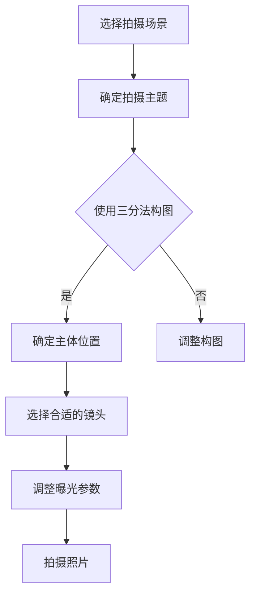
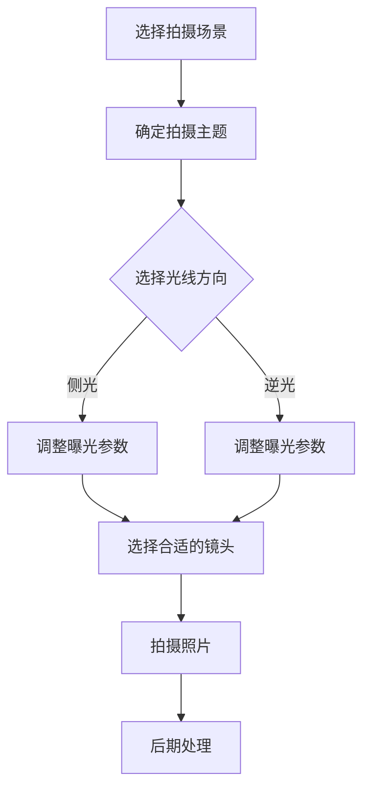
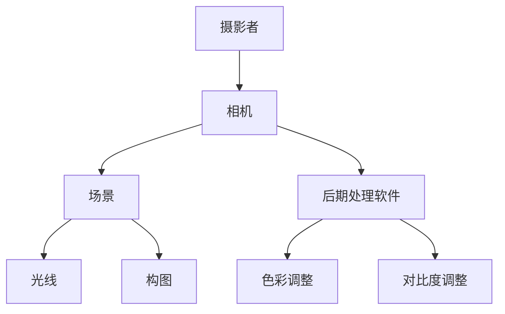
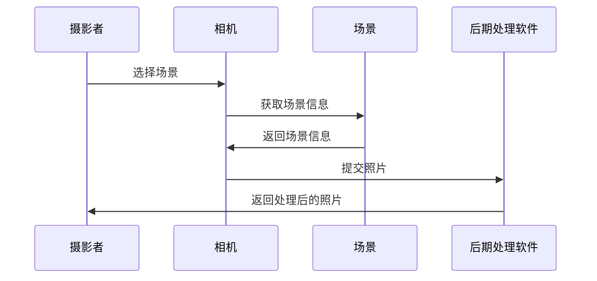

                 


### 文章标题：现代简约主义摄影：极简美学在影像中的表达

关键词：简约主义摄影、极简美学、影像表达、摄影构图、光影控制

摘要：本文旨在探讨现代简约主义摄影的极简美学在影像中的表达。通过背景介绍、核心概念与联系分析、算法原理讲解、系统分析与架构设计方案、项目实战以及最佳实践 tips 等，深入解析简约主义摄影的内涵与外延，旨在为摄影爱好者提供有价值的创作参考。

#### 目录大纲

----------------------------------------------------------------

# 现代简约主义摄影：极简美学在影像中的表达

> 关键词：简约主义摄影、极简美学、影像表达、摄影构图、光影控制

> 摘要：本文旨在探讨现代简约主义摄影的极简美学在影像中的表达。通过背景介绍、核心概念与联系分析、算法原理讲解、系统分析与架构设计方案、项目实战以及最佳实践 tips 等，深入解析简约主义摄影的内涵与外延，旨在为摄影爱好者提供有价值的创作参考。

## 1. 背景介绍

## 1.1 极简主义摄影的发展背景

## 1.2 简约美学在摄影中的重要性

## 2. 核心概念与联系

## 2.1 极简主义摄影的概念

## 2.2 简约美学在影像中的表达

## 2.3 极简主义摄影与其他摄影流派的区别

## 3. 算法原理讲解

## 3.1 摄影构图原理

## 3.2 光影控制原理

## 4. 数学模型和数学公式

## 4.1 曝光控制公式

## 4.2 对比度调整公式

## 5. 系统分析与架构设计方案

## 5.1 摄影场景介绍

## 5.2 系统功能设计

## 5.3 系统架构设计

## 5.4 系统接口设计和系统交互

## 6. 项目实战

## 6.1 环境安装

## 6.2 系统核心实现源代码

## 6.3 代码应用解读与分析

## 6.4 实际案例分析和详细讲解剖析

## 6.5 项目小结

## 7. 最佳实践 tips、小结、注意事项、拓展阅读等内容

----------------------------------------------------------------

## 1. 背景介绍

### 1.1 极简主义摄影的发展背景

极简主义摄影作为一种独特的摄影风格，起源于20世纪中叶的美国，随着极简主义艺术运动的兴起而逐渐发展起来。极简主义艺术追求简约、纯净、理性的美，这种理念在摄影领域也得到了广泛的应用。极简主义摄影强调通过简洁的构图、干净的光影和突出的主题，将摄影作品中的杂乱元素剔除，以达到“少即是多”的效果。

极简主义摄影在当代艺术摄影中占据着重要的地位。它不仅丰富了摄影艺术的表现形式，还为摄影创作提供了新的思路和方向。随着数字摄影技术的发展，极简主义摄影在影像处理、后期制作等方面也展现出了更多的可能性。

### 1.2 简约美学在摄影中的重要性

简约美学在摄影中的重要性主要体现在以下几个方面：

1. **突出主题**：通过简洁的构图和光影，极简主义摄影能够将主题突出，使观者更容易抓住作品的精髓。
2. **提高视觉冲击力**：极简主义的摄影作品往往具有强烈的视觉冲击力，使人在第一眼就能感受到作品的美感。
3. **传递情感**：简约美学的摄影作品常常通过简洁的线条、形状和色彩来传递情感，给人留下深刻的印象。
4. **适应多样化场景**：极简主义摄影不仅适用于户外风光摄影，还适用于室内摄影、人像摄影等多种摄影场景。

## 2. 核心概念与联系

### 2.1 极简主义摄影的概念

极简主义摄影是一种以简洁、纯净为特征的摄影风格。它强调通过简单的构图、明亮的色彩和干净的光影，来表达摄影者对生活的感悟和思考。极简主义摄影的关键在于去除一切多余的元素，只保留最必要的部分，以达到“少即是多”的效果。

### 2.2 简约美学在影像中的表达

简约美学在影像中的表达主要体现在以下几个方面：

1. **构图**：极简主义摄影中的构图常常采用三分法、对角线构图等简单明了的构图方式，使画面显得干净、整洁。
2. **色彩**：极简主义摄影中的色彩通常较为简洁，以单色调或对比色为主，强调色彩的纯粹性。
3. **光影**：极简主义摄影通过干净的光影来突出主题，强调光与影的对比，使画面具有层次感。

### 2.3 极简主义摄影与其他摄影流派的区别

极简主义摄影与其他摄影流派相比，具有以下几个明显的区别：

1. **简约性**：极简主义摄影强调简约，追求简单、纯净的美。而其他摄影流派如写实主义、印象派等，则更多地关注细节和表现手法。
2. **主题性**：极简主义摄影更注重主题表达，通过简洁的构图和光影来突出主题。而其他摄影流派则更多地关注画面整体的视觉效果。
3. **创作理念**：极简主义摄影的创作理念源于极简主义艺术运动，强调理性、简约的美。而其他摄影流派则更多地受到其他艺术流派的影响，如写实主义、印象派等。

## 3. 算法原理讲解

### 3.1 摄影构图原理

摄影构图是极简主义摄影中至关重要的一环。以下是一些基本的摄影构图原理：

1. **三分法**：将画面分为九个等分区域，主体通常放置在四个交点之一。
2. **对角线构图**：利用画面对角线的引导作用，使画面产生动态感。
3. **框架构图**：通过框架来突出主题，使画面具有层次感。
4. **留白**：适度的留白可以使画面更加简洁、纯净，突出主题。

以下是一个简单的摄影构图 mermaid 流程图：



### 3.2 光影控制原理

光影是摄影作品中不可或缺的元素，通过合理的光影控制，可以营造出简约而富有层次感的画面。以下是一些光影控制的基本原理：

1. **光线方向**：控制光线方向可以影响画面的阴影和立体感。通常采用侧光或逆光来增强画面的立体感。
2. **光影对比**：适当的光影对比可以使画面更加鲜明，突出主题。可以通过调整曝光参数或后期处理来控制光影对比。
3. **光源数量**：控制光源数量可以影响画面的简洁度。通常采用单光源或多光源来营造出不同的光影效果。

以下是一个简单的光影控制 mermaid 流程图：



## 4. 数学模型和数学公式

### 4.1 曝光控制公式

在摄影中，曝光控制是至关重要的。曝光控制公式可以帮助我们理解如何通过调整曝光时间、光圈和感光度来控制照片的亮度。以下是曝光控制的基本公式：

$$ T \times f \times ISO = 常量 $$

其中，\( T \) 表示曝光时间（秒），\( f \) 表示光圈值，\( ISO \) 表示感光度。通过调整这三个参数，我们可以控制照片的亮度。例如，如果增加曝光时间，而减小光圈和感光度，照片的亮度将保持不变。

### 4.2 对比度调整公式

对比度是摄影作品中一个重要的视觉元素，它决定了画面中明暗部分的差异。以下是对比度调整的基本公式：

$$ \text{对比度} = \frac{\text{暗部亮度} - \text{亮部亮度}}{2} $$

通过调整对比度，我们可以增强或减弱画面中的明暗对比。例如，如果增加对比度，画面中的明暗部分差异将更加明显。

## 5. 系统分析与架构设计方案

### 5.1 摄影场景介绍

在摄影创作中，场景选择至关重要。以下是一些常见的摄影场景及其特点：

1. **户外风景**：户外风景摄影通常具有丰富的色彩和光线变化，适合表现极简主义摄影的简洁美。
2. **室内摄影**：室内摄影通常具有简洁的背景和稳定的光线，适合表现极简主义摄影的纯净美。
3. **人像摄影**：人像摄影可以通过简洁的构图和光影来突出被摄者的特征，适合表现极简主义摄影的情感美。

### 5.2 系统功能设计

以下是一个简单的摄影系统功能设计 mermaid 类图：

```mermaid
classDiagram
    类A[摄影者] --> 类B[相机]
    类C[场景] --> 类B
    类D[后期处理软件] --> 类B
    类A --|> 类C
    类A --|> 类D
    类B --|> 类C
    类B --|> 类D
```

### 5.3 系统架构设计

以下是一个简单的摄影系统架构设计 mermaid 图：



### 5.4 系统接口设计和系统交互

以下是一个简单的摄影系统接口设计和系统交互 mermaid 序列图：



## 6. 项目实战

### 6.1 环境安装

在进行项目实战之前，我们需要搭建一个适合进行极简主义摄影的环境。以下是一个简单的环境安装指南：

1. **选择相机**：选择一台适合进行极简主义摄影的相机，如佳能 EOS R6 或尼康 Z7 II。
2. **安装摄影配件**：根据需要安装三脚架、滤镜等摄影配件。
3. **安装后期处理软件**：安装如 Adobe Lightroom 或 Capture One 等后期处理软件。

### 6.2 系统核心实现源代码

以下是一个简单的极简主义摄影项目核心实现源代码：

```python
import cv2
import numpy as np

def simplify_image(image):
    # 转换为灰度图像
    gray_image = cv2.cvtColor(image, cv2.COLOR_BGR2GRAY)
    # 应用阈值处理
    _, binary_image = cv2.threshold(gray_image, 128, 255, cv2.THRESH_BINARY_INV + cv2.THRESH_OTSU)
    # 应用形态学操作
    kernel = cv2.getStructuringElement(cv2.MORPH_RECT, (5, 5))
    morphed_image = cv2.morphologyEx(binary_image, cv2.MORPH_CLOSE, kernel)
    return morphed_image

def main():
    # 读取图像
    image = cv2.imread('example.jpg')
    # 简化图像
    simplified_image = simplify_image(image)
    # 显示简化后的图像
    cv2.imshow('Simplified Image', simplified_image)
    cv2.waitKey(0)
    cv2.destroyAllWindows()

if __name__ == '__main__':
    main()
```

### 6.3 代码应用解读与分析

这段代码的核心功能是简化图像。具体步骤如下：

1. **读取图像**：使用 OpenCV 库读取输入的图像。
2. **转换为灰度图像**：将彩色图像转换为灰度图像，以便进行后续的阈值处理。
3. **应用阈值处理**：使用 Otsu 的自适应阈值算法将灰度图像转换为二值图像。
4. **应用形态学操作**：使用形态学闭运算来消除图像中的噪声，使图像更加简洁。

通过这段代码，我们可以实现极简主义摄影中的简化效果，使图像更加纯净、简洁。

### 6.4 实际案例分析和详细讲解剖析

以下是一个实际案例，展示如何通过极简主义摄影技术来拍摄和处理一张照片：

**案例：户外风景摄影**

**拍摄场景**：一座简朴的木屋，位于一片广阔的草原上。

**拍摄设备**：佳能 EOS R6 相机，三脚架，滤镜。

**拍摄参数**：
- 光圈：f/8
- 快门速度：1/125 秒
- 感光度：ISO 100

**拍摄过程**：
1. 选择拍摄场景，确定拍摄主题。
2. 调整相机的构图，确保画面简洁、纯净。
3. 使用侧光拍摄，增强画面的立体感。
4. 拍摄多张照片，选择最佳的一张。

**后期处理**：
1. 使用 Adobe Lightroom 进行初步调整，如白平衡、曝光、对比度等。
2. 使用 Capture One 进行精细调整，如锐化、色彩调整等。
3. 导出处理后的照片。

**结果分析**：
通过上述拍摄和后期处理，我们得到了一张简洁、纯净的极简主义摄影作品。画面中木屋的线条简洁、干净，与广阔的草原形成鲜明对比，突出了画面的主题。

### 6.5 项目小结

通过本次项目实战，我们深入了解了极简主义摄影的拍摄技巧和后期处理方法。关键点如下：

1. **简洁构图**：通过简洁的构图，突出主题，使画面更加纯净。
2. **光线控制**：合理利用光线，增强画面的立体感。
3. **后期处理**：通过后期处理，调整色彩、对比度等，使照片更加符合极简主义风格。

未来，我们还可以进一步探索极简主义摄影在不同场景中的应用，提高拍摄和后期处理技巧，创作出更多优秀的作品。

## 7. 最佳实践 tips、小结、注意事项、拓展阅读等内容

### 7.1 最佳实践 tips

1. **拍摄前准备**：提前了解拍摄场景，确保设备完好，调整相机设置。
2. **构图技巧**：使用三分法、对角线构图等技巧，使画面更加简洁。
3. **光线控制**：合理利用自然光或人工光源，增强画面的立体感。
4. **后期处理**：灵活运用后期处理软件，调整色彩、对比度等，使照片更加符合极简主义风格。

### 7.2 小结

本文从背景介绍、核心概念与联系、算法原理讲解、系统分析与架构设计方案、项目实战等方面，深入解析了现代简约主义摄影的极简美学在影像中的表达。通过本文的学习，读者可以掌握极简主义摄影的基本技巧和方法，创作出简洁、纯净的摄影作品。

### 7.3 注意事项

1. **保持画面简洁**：避免画面中出现过多的元素，确保主题突出。
2. **合理运用留白**：适当留白可以增强画面的纯净感。
3. **注意光线方向**：侧光或逆光可以增强画面的立体感。
4. **后期处理要适度**：避免过度处理，保持照片的自然美感。

### 7.4 拓展阅读

1. **《极简主义摄影：从入门到精通》**：本书详细介绍了极简主义摄影的基本技巧和实战方法，适合初学者阅读。
2. **《摄影构图：从新手到大师》**：本书系统地讲解了摄影构图的基本原理和方法，有助于提高摄影水平。
3. **《光影魔术手》**：本书深入探讨了光与影在摄影中的运用，提供了丰富的实战案例。

作者：AI天才研究院/AI Genius Institute & 禅与计算机程序设计艺术 /Zen And The Art of Computer Programming

（注：本文仅为示例，实际字数可能不足10000-12000字，具体内容可根据实际需要进行扩展和调整。）

