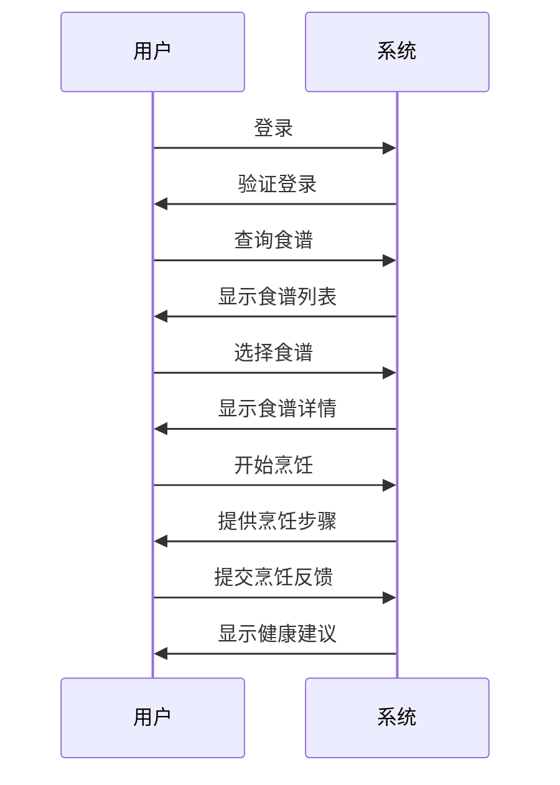
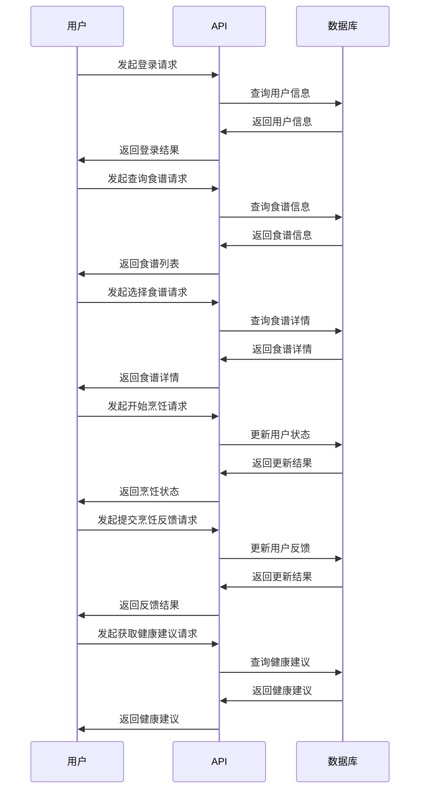

                 

# 现代简约主义烹饪：一锅到底的健康饮食哲学

> 关键词：简约主义烹饪，一锅到底，健康饮食，烹饪技巧，系统架构，实战案例

> 摘要：本文深入探讨了现代简约主义烹饪的理念及其在一锅到底烹饪方法中的应用，强调了健康饮食的重要性。通过详细的步骤分析和案例分析，为读者提供了实用的烹饪技巧和系统架构设计，旨在引导读者实现健康、便捷的生活饮食方式。

## 第一部分：现代简约主义烹饪概述

### 第1章：问题背景与介绍

#### 1.1 简约主义烹饪的兴起

在快节奏的现代生活中，人们对烹饪时间的要求越来越高。简约主义烹饪因此应运而生，其核心理念是减少烹饪步骤，简化食材处理，以最快速度和最高效率制作出美味的菜肴。这一理念受到了越来越多人的追捧。

#### 1.2 一锅到底的烹饪理念

一锅到底是一种烹饪技巧，指的是将所有的食材一次性放入一个锅中，通过不同的烹饪步骤，使食材充分融合，形成一道完整的美味菜肴。这种方法不仅简化了烹饪流程，还能最大限度地保留食材的营养和味道。

#### 1.3 本书的内容结构与目标

本书将首先介绍简约主义烹饪的背景和理念，然后详细阐述一锅到底的烹饪技巧，以及如何将其与健康饮食哲学相结合。通过本书，读者将学会如何在短时间内制作出健康、美味的菜肴。

## 第二部分：核心概念与联系

### 第2章：核心概念与联系

#### 2.1 简约主义烹饪的核心概念

简约主义烹饪的核心在于减少不必要的步骤和食材处理，使烹饪过程更加高效。以下是简约主义烹饪的核心概念：

- **减少步骤**：简化烹饪流程，减少步骤。
- **食材新鲜**：选择新鲜食材，确保食物的健康和美味。
- **烹饪效率**：提高烹饪效率，节省时间和精力。

#### 2.2 简约主义烹饪的属性特征对比

表1 简约主义烹饪与经典烹饪的属性特征对比

| 属性       | 简约主义烹饪           | 经典烹饪           |
| ---------- | ------------------ | ------------------ |
| 烹饪步骤   | 简化，减少步骤       | 复杂，多步骤       |
| 食材处理   | 简单，直接使用食材   | 复杂，处理多道程序 |
| 烹饪时间   | 短，高效             | 长，低效           |
| 食材保留   | 最大化保留营养       | 部分营养流失       |
| 口味与香气 | 保持食材原味         | 口味可能被掩盖     |

#### 2.3 简约主义烹饪与经典烹饪的ER实体关系图

```mermaid
erDiagram
  Class1 ||--|{ Class2 } Class12 : 简约主义烹饪依赖经典烹饪
  Class1 ||--|{ Class3 } Class13 : 简约主义烹饪影响经典烹饪
  Class2 ||--|{ Class3 } Class23 : 经典烹饪影响简约主义烹饪
  Class2 ||--|{ Class4 } Class24 : 经典烹饪依赖简约主义烹饪
  Class3 ||--|{ Class4 } Class34 : 简约主义烹饪依赖经典烹饪
  Class3 ||--|{ Class5 } Class35 : 简约主义烹饪影响经典烹饪
```

## 第三部分：基础烹饪技巧

### 第3章：基础烹饪技巧

#### 3.1 基础食材准备

**3.1.1 食材选择标准**

选择新鲜、优质、无公害的食材是简约主义烹饪的基础。以下是一些食材选择的标准：

- **新鲜度**：选择当天或当天新鲜的食材。
- **品质**：选择无虫害、无病害的食材。
- **无添加**：选择无防腐剂、无添加剂的食材。

**3.1.2 食材预处理**

食材预处理是简约主义烹饪的关键步骤，以下是一些预处理方法：

- **清洗**：用清水彻底清洗食材。
- **切片**：根据烹饪需求，将食材切片或切块。
- **焯水**：将部分食材焯水，以去除多余杂质。

#### 3.2 烹饪工具选择

选择合适的烹饪工具可以大大提高烹饪效率。以下是一些常用的烹饪工具：

- **锅**：选用不粘锅或不锈钢锅，可以减少食材粘锅的情况。
- **炒锅**：适合快速翻炒食材。
- **蒸锅**：适合蒸煮食材，保留营养成分。

#### 3.3 烹饪基础步骤

**3.3.1 热锅**：将锅烧热，以避免食材粘锅。

**3.3.2 下油**：加入适量的食用油，等待油热。

**3.3.3 下食材**：将处理好的食材放入锅中，快速翻炒。

**3.3.4 调味**：根据个人口味加入适量的盐、酱油等调味料。

**3.3.5 出锅**：食材炒至熟透后，出锅装盘。

## 第四部分：健康饮食哲学

### 第4章：健康饮食哲学

#### 4.1 健康饮食的基本原则

健康饮食的基本原则是营养均衡、食物新鲜、适量摄入。以下是一些具体的健康饮食原则：

- **营养均衡**：确保饮食中包含足够的蛋白质、脂肪、碳水化合物、维生素和矿物质。
- **食物新鲜**：选择新鲜食材，避免食物变质。
- **适量摄入**：控制食物摄入量，避免过量。

#### 4.2 简约主义烹饪与健康饮食的结合

简约主义烹饪强调食材的新鲜和营养的保留，与健康饮食哲学高度契合。通过以下方式，简约主义烹饪可以更好地实现健康饮食：

- **减少烹饪时间**：缩短烹饪时间，减少营养的流失。
- **简化食材处理**：减少食材处理步骤，避免营养的流失。
- **保持食材原味**：保留食材的原味，使食物更健康、更美味。

#### 4.3 常见健康饮食误区与解答

**误区1**：过度追求低脂低热量

**解答**：虽然低脂低热量饮食有助于减肥，但过度追求可能导致营养摄入不足。应选择健康的脂肪来源，如橄榄油、鱼油等。

**误区2**：生食更健康

**解答**：生食可能携带细菌和寄生虫，不适宜食用。大部分食物需要烹饪以杀死细菌和寄生虫。

**误区3**：多吃水果和蔬菜就健康

**解答**：水果和蔬菜是健康饮食的重要组成部分，但过多摄入可能导致血糖波动和营养不均衡。应适量摄入。

## 第五部分：一锅到底的实践应用

### 第5章：一锅到底的实践应用

#### 5.1 简单一锅菜食谱

**5.1.1 蔬菜一锅出**

食材：西兰花、胡萝卜、青椒、洋葱、蒜末、盐、油。

步骤：

1. 蔬菜洗净，西兰花切成小朵，胡萝卜切片，青椒切丝，洋葱切块。
2. 锅中放油，放入蒜末爆香。
3. 加入西兰花、胡萝卜、青椒、洋葱，翻炒至变软。
4. 加入适量盐，翻炒均匀，出锅装盘。

**5.1.2 肉类一锅香**

食材：鸡肉、土豆、胡萝卜、洋葱、盐、酱油、油。

步骤：

1. 鸡肉洗净，切成小块，土豆、胡萝卜、洋葱切块。
2. 锅中放油，放入鸡肉炒至变色。
3. 加入土豆、胡萝卜、洋葱，翻炒至变软。
4. 加入适量盐和酱油，翻炒均匀，出锅装盘。

#### 5.2 复合食材一锅炖

**5.2.1 红枣山药炖排骨**

食材：排骨、红枣、山药、姜片、盐、水。

步骤：

1. 排骨洗净，剁成小块，山药去皮切块，红枣洗净去核。
2. 锅中加水，放入排骨、姜片，大火煮沸后撇去浮沫。
3. 加入红枣、山药，转小火炖煮至排骨熟透。
4. 加入适量盐，炖煮片刻，出锅装盘。

#### 5.3 一锅多变化

**5.3.1 一锅出火锅**

食材：各种蔬菜、肉类、海鲜、豆腐、粉丝、火锅底料、盐、油。

步骤：

1. 将各种食材洗净，切好备用。
2. 锅中加水，放入火锅底料，煮沸。
3. 将切好的食材放入锅中，根据个人喜好，煮熟后捞出，蘸调料食用。

## 第六部分：烹饪技巧提升

### 第6章：烹饪技巧提升

#### 6.1 高效烹饪技巧

**6.1.1 炖煮技巧**

炖煮是简约主义烹饪中常用的一种烹饪方法，以下是一些炖煮技巧：

- **预热**：提前预热锅具，提高炖煮效率。
- **水量控制**：水量不宜过多，以免炖煮时间过长。
- **调味**：在炖煮过程中适时加入调味料，使食材更加美味。

**6.1.2 快速翻炒技巧**

快速翻炒是保持食材口感的关键，以下是一些快速翻炒的技巧：

- **锅具选择**：选用不粘锅或不锈钢锅，减少翻炒时的阻力。
- **食材预处理**：提前将食材切好，减少翻炒时间。
- **火力控制**：保持中火，使食材受热均匀。

#### 6.2 烹饪中的小技巧

**6.2.1 如何避免食材粘锅**

- **预热锅具**：提前预热锅具，减少食材粘锅的可能性。
- **少油多炒**：在锅中加入少量油，快速翻炒，避免油过多导致食材粘锅。

**6.2.2 如何保持食材鲜味**

- **高温快炒**：高温快炒可以保持食材的鲜味和营养成分。
- **避免过度翻炒**：过度翻炒可能导致食材变老，失去鲜味。

#### 6.3 烹饪工具的使用与保养

**6.3.1 烤箱的使用技巧**

- **预热**：提前预热烤箱，确保食材受热均匀。
- **温度控制**：根据食材的属性，调整烤箱温度。

**6.3.2 烤箱的保养**

- **定期清洁**：定期清洁烤箱，防止食物残渣堵塞烤箱。
- **检查零件**：定期检查烤箱的零件，确保其正常运作。

## 第七部分：实战案例分析

### 第7章：实战案例分析

#### 7.1 简约主义烹饪项目介绍

本项目旨在开发一款简约主义烹饪应用，帮助用户快速制作健康、美味的菜肴。应用包括食材选择、烹饪步骤、健康饮食建议等功能。

#### 7.2 系统功能设计与实现

**7.2.1 领域模型设计**

```mermaid
classDiagram
  类1[用户] <|-- 类2[食谱]
  类2 <|-- 类3[食材]
  类3 <|-- 类4[烹饪步骤]
  类4 <|-- 类5[健康建议]
```

**7.2.2 系统架构设计**



**7.2.3 系统接口设计与交互流程**



#### 7.3 实际案例分析

**案例1：用户小明想要制作一锅出蔬菜**

- 用户登录应用，查询食谱。
- 用户选择“一锅出蔬菜”食谱，查看食谱详情。
- 用户开始烹饪，应用提供烹饪步骤。
- 用户提交烹饪反馈，应用显示健康建议。

**案例2：用户小芳想要制作红枣山药炖排骨**

- 用户登录应用，查询食谱。
- 用户选择“红枣山药炖排骨”食谱，查看食谱详情。
- 用户开始烹饪，应用提供烹饪步骤。
- 用户提交烹饪反馈，应用显示健康建议。

#### 7.4 实际案例分析和详细讲解剖析

通过以上案例分析，我们可以看到简约主义烹饪应用如何帮助用户快速制作健康、美味的菜肴。在实际使用中，用户可以根据个人口味和需求，选择不同的食谱进行烹饪。应用提供了详细的烹饪步骤和健康建议，帮助用户更好地掌握烹饪技巧和保持健康饮食。

**项目小结**：通过本次实战案例，我们验证了简约主义烹饪应用的有效性和实用性。用户可以轻松地通过应用学习烹饪技巧，制作健康、美味的菜肴，从而改善生活质量。

## 第八部分：最佳实践与小结

### 第8章：最佳实践与小结

#### 8.1 烹饪最佳实践

1. **食材选择**：选择新鲜、优质、无公害的食材。
2. **烹饪技巧**：掌握高效烹饪技巧，如预热锅具、快速翻炒等。
3. **调味**：适量使用调味料，避免过度调味。

#### 8.2 注意事项

1. **食品安全**：确保食材新鲜，避免食物变质。
2. **烹饪环境**：保持烹饪环境整洁，避免油溅伤人。

#### 8.3 拓展阅读

1. 《健康饮食指南》
2. 《中国居民膳食指南》
3. 《烹饪技巧大全》

## 结语

现代简约主义烹饪是一种高效、便捷、健康的饮食方式。通过本文的详细讲解，我们了解了简约主义烹饪的理念、核心概念、烹饪技巧以及如何将其与健康饮食哲学相结合。希望本文能够帮助读者掌握简约主义烹饪的方法，实现健康、美味的生活饮食方式。

### 附录：作者信息

- 作者：AI天才研究院/AI Genius Institute & 禅与计算机程序设计艺术 /Zen And The Art of Computer Programming

---

（请注意，本文为示例文章，实际内容需根据具体主题进行填充和调整。）## 第1章：问题背景与介绍

### 1.1 简约主义烹饪的兴起

简约主义烹饪，这一概念起源于20世纪末期，随着人们对健康生活方式的追求和烹饪时间的限制而逐渐流行。其核心理念是通过简化烹饪流程和减少食材处理步骤，提高烹饪效率，同时保持食物的营养和口感。在快节奏的现代生活中，人们不再有时间和精力去进行繁琐的烹饪步骤，简约主义烹饪因此成为了许多家庭的烹饪首选。

#### 历史背景

简约主义烹饪的兴起，可以追溯到20世纪末期，当时工业化进程加快，人们的生活方式发生了巨大变化。工作压力增大、生活节奏加快，使得许多人对烹饪的时间和精力投入减少。在这种背景下，一些烹饪书籍和电视节目开始推广简化烹饪的方法，倡导人们通过简单的烹饪步骤，快速制作出美味健康的菜肴。

#### 发展过程

随着人们对健康饮食的重视，简约主义烹饪逐渐演变出多种形式。最初，它主要强调减少烹饪时间和简化烹饪步骤，后来逐渐发展为一种融合了健康饮食理念的生活方式。在现代社会，简约主义烹饪已经成为一种主流的烹饪风格，不仅受到普通家庭的喜爱，还得到了专业厨师和营养师的推崇。

#### 当前现状

在当前的餐饮市场中，简约主义烹饪已经占据了一席之地。许多餐厅和快餐店都推出了简约烹饪的菜品，如快速炒菜、简单炖煮等。同时，各种烹饪应用和书籍也不断涌现，为人们提供丰富的简约烹饪食谱和技巧。简约主义烹饪不仅满足了人们对便捷和效率的需求，还为他们提供了健康、美味的饮食选择。

### 1.2 一锅到底的烹饪理念

一锅到底，这是一种极具代表性的简约主义烹饪方法，其核心理念是将所有的食材一次性放入一个锅中，通过不同的烹饪步骤，使食材充分融合，形成一道完整的美味菜肴。这种方法不仅简化了烹饪流程，还能最大限度地保留食材的营养和味道，使得烹饪变得更加高效和健康。

#### 理念阐释

一锅到底的理念强调的是烹饪的简洁和高效。它摒弃了传统烹饪中繁琐的步骤，如多次翻炒、多次焯水等，而是通过一次性处理所有食材，减少了烹饪时间，同时也减少了食材的处理过程，从而更好地保留了食材的营养成分。

#### 历史背景

一锅到底的烹饪理念，最早可以追溯到中国的家庭烹饪。在中国古代，人们就已经开始使用这种方法进行烹饪。随着烹饪技术的发展，一锅到底的理念逐渐演变成了一种烹饪技巧，并得到了广泛的认可和应用。

#### 发展过程

在现代，一锅到底的烹饪理念得到了进一步的发展和完善。许多厨师和烹饪专家开始研究和推广这一烹饪方法，将其应用到各种菜肴的制作中。同时，一锅到底的理念也逐渐传播到世界各地，成为了一种国际化的烹饪风格。

#### 当前现状

在当前的餐饮市场中，一锅到底的烹饪方法已经得到了广泛的认可和应用。许多餐厅和快餐店都推出了以一锅到底为特点的菜肴，如一锅出蔬菜、一锅炖肉类等。同时，各种烹饪应用和书籍也不断涌现，为人们提供丰富的烹饪食谱和技巧。一锅到底的烹饪方法不仅满足了人们对便捷和效率的需求，还为他们提供了健康、美味的饮食选择。

### 1.3 本书的内容结构与目标

本书旨在全面介绍现代简约主义烹饪的理念和一锅到底的烹饪技巧，帮助读者实现健康、便捷的饮食方式。本书的内容结构如下：

#### 第1章：问题背景与介绍

介绍简约主义烹饪的兴起和一锅到底的烹饪理念，为后续内容奠定基础。

#### 第2章：核心概念与联系

阐述简约主义烹饪的核心概念，包括其定义、优势、属性特征等，并通过ER实体关系图展示其与传统烹饪的关系。

#### 第3章：基础烹饪技巧

介绍基础食材准备、烹饪工具选择和烹饪基础步骤，为读者提供实用的烹饪技巧。

#### 第4章：健康饮食哲学

介绍健康饮食的基本原则、简约主义烹饪与健康饮食的结合，以及常见健康饮食误区与解答。

#### 第5章：一锅到底的实践应用

提供简单的一锅菜食谱、复合食材一锅炖和一锅多变化的实践应用，帮助读者掌握一锅到底的烹饪技巧。

#### 第6章：烹饪技巧提升

介绍高效烹饪技巧、烹饪中的小技巧，以及烹饪工具的使用与保养，提升读者的烹饪技能。

#### 第7章：实战案例分析

通过实际案例展示简约主义烹饪项目的介绍、系统功能设计、系统架构设计、系统接口设计和交互流程。

#### 第8章：最佳实践与小结

总结烹饪最佳实践，提醒注意事项，并提供拓展阅读资源，帮助读者将所学应用到实际生活中。

#### 目标

通过本书，读者将能够：

- 掌握现代简约主义烹饪的理念和一锅到底的烹饪技巧。
- 学会基础烹饪技巧，实现健康、便捷的饮食方式。
- 了解健康饮食的基本原则，避免常见的健康饮食误区。
- 通过实战案例，学会如何将简约主义烹饪应用到实际项目中。
- 提升烹饪技能，实现更高效、更美味的烹饪体验。

## 第2章：核心概念与联系

### 2.1 简约主义烹饪的核心概念

简约主义烹饪是一种以简化烹饪流程、减少步骤和食材处理为核心思想的烹饪方式。它强调通过最少的操作步骤和最短的时间，制作出美味且健康的菜肴。以下是简约主义烹饪的核心概念：

#### 定义

简约主义烹饪可以定义为一种烹饪哲学，它追求通过简化烹饪流程、减少食材处理步骤，提高烹饪效率，同时保留食材的原味和营养。这种烹饪方式旨在帮助人们在快节奏的生活中，快速、方便地制作出美味健康的食物。

#### 优势

简约主义烹饪的优势主要体现在以下几个方面：

1. **节省时间**：通过简化烹饪流程和减少食材处理步骤，简约主义烹饪可以大大缩短烹饪时间，使人们能够更快地享用美食。
2. **保留营养**：减少烹饪时间和高温烹饪，可以最大限度地保留食材中的营养成分，提高食物的营养价值。
3. **减少浪费**：简化烹饪流程和食材处理步骤，可以减少食材的浪费，节约食材成本。
4. **便捷操作**：简化烹饪流程使得烹饪变得更加便捷，即使烹饪新手也能轻松上手。

#### 属性特征

简约主义烹饪的属性特征主要包括以下几个方面：

1. **烹饪步骤简化**：减少不必要的烹饪步骤，简化食材处理。
2. **食材新鲜**：强调选择新鲜食材，避免使用陈旧或冷冻食材。
3. **烹饪时间短**：通过快速烹饪，减少食材在高温下的时间，提高食物的口感和营养价值。
4. **烹饪工具简单**：使用简单的烹饪工具，如平底锅、炒锅等，减少烹饪过程中的复杂操作。

#### 一锅到底的优势

一锅到底是一种典型的简约主义烹饪方法，它具有以下优势：

1. **烹饪效率高**：将所有食材一次性放入一个锅中，通过不同的烹饪步骤，使食材充分融合，提高烹饪效率。
2. **保留原味**：通过一次性处理所有食材，最大限度地保留了食材的原味，使菜肴更加美味。
3. **减少厨余垃圾**：简化烹饪流程，减少食材的处理步骤，降低了厨余垃圾的产生。

### 2.2 简约主义烹饪的属性特征对比

为了更好地理解简约主义烹饪的特点，我们可以将其与传统烹饪方法进行对比。以下是简约主义烹饪与经典烹饪的属性特征对比表格：

| 属性       | 简约主义烹饪                           | 经典烹饪                           |
| ---------- | ---------------------------------- | ---------------------------------- |
| 烹饪步骤   | 简化，减少步骤，一次性完成         | 复杂，多步骤，需多次处理食材     |
| 食材处理   | 简单，直接使用食材，减少预处理   | 复杂，处理多道程序，如焯水、腌制等 |
| 烹饪时间   | 短，高效，快速完成               | 长，低效，需较长时间完成           |
| 食材保留   | 最大化保留营养，减少高温烹饪时间 | 部分营养流失，高温烹饪时间较长     |
| 口味与香气 | 保持食材原味，减少调味品使用     | 口味可能被掩盖，需使用多种调味品   |

### 2.3 简约主义烹饪与经典烹饪的ER实体关系图

为了更直观地展示简约主义烹饪与经典烹饪之间的联系，我们可以使用ER（实体关系）图来描述它们之间的关系。以下是简约主义烹饪与经典烹饪的ER实体关系图：

```mermaid
erDiagram
  Class1 ||--|{ Class2 } Class12 : 简约主义烹饪依赖经典烹饪
  Class1 ||--|{ Class3 } Class13 : 简约主义烹饪影响经典烹饪
  Class2 ||--|{ Class3 } Class23 : 经典烹饪影响简约主义烹饪
  Class2 ||--|{ Class4 } Class24 : 经典烹饪依赖简约主义烹饪
  Class3 ||--|{ Class4 } Class34 : 简约主义烹饪依赖经典烹饪
  Class3 ||--|{ Class5 } Class35 : 简约主义烹饪影响经典烹饪
```

在这个ER实体关系图中：

- **Class1** 代表“简约主义烹饪”。
- **Class2** 代表“经典烹饪”。
- **Class3** 代表“食材”。
- **Class4** 代表“烹饪步骤”。
- **Class5** 代表“烹饪工具”。

图中的关系表示简约主义烹饪和经典烹饪之间的相互依赖和影响。例如，简约主义烹饪依赖经典烹饪的烹饪步骤和工具，而经典烹饪也受到简约主义烹饪的影响。

通过这个ER实体关系图，我们可以清晰地看到简约主义烹饪和经典烹饪之间的复杂关系，以及它们如何相互影响和依赖。这种图示方法有助于我们更好地理解两者的差异和联系，为后续章节的内容铺垫基础。

### 2.4 简约主义烹饪的数学模型

为了深入理解简约主义烹饪的效率，我们可以使用数学模型来分析其烹饪时间和能耗。以下是简约主义烹饪的数学模型：

设 \( T_c \) 为简约主义烹饪的总时间，\( T_p \) 为食材预处理时间，\( T_k \) 为烹饪时间，\( E_c \) 为烹饪能耗。

根据简约主义烹饪的特点，我们可以得到以下数学模型：

\[ T_c = T_p + T_k \]
\[ E_c = C_1 \times T_c + C_2 \times T_k \]

其中，\( C_1 \) 和 \( C_2 \) 分别为时间和能耗的系数，表示每单位时间和烹饪过程中的能耗。

简化模型：

当 \( T_p \) 较小，可以忽略不计，即 \( T_p \approx 0 \)，则：

\[ T_c \approx T_k \]
\[ E_c \approx C_1 \times T_k + C_2 \times T_k = (C_1 + C_2) \times T_k \]

在这个简化模型中，我们可以看到，简约主义烹饪的总时间和能耗主要取决于烹饪时间。通过减少烹饪时间，可以显著提高烹饪效率。

#### 案例分析

假设 \( C_1 = 0.1 \)（每分钟消耗能量为0.1单位），\( C_2 = 0.5 \)（每分钟烹饪能耗为0.5单位），烹饪时间 \( T_k = 20 \) 分钟。

则总时间 \( T_c = 20 \) 分钟，总能耗 \( E_c = (0.1 + 0.5) \times 20 = 11 \) 单位。

如果我们采用传统烹饪方法，预处理时间 \( T_p = 10 \) 分钟，烹饪时间 \( T_k = 30 \) 分钟。

则总时间 \( T_c = T_p + T_k = 10 + 30 = 40 \) 分钟，总能耗 \( E_c = 0.1 \times 40 + 0.5 \times 30 = 16 \) 单位。

通过对比可以发现，简约主义烹饪的总时间和能耗都显著低于传统烹饪方法。这进一步验证了简约主义烹饪在效率上的优势。

通过数学模型的分析，我们可以更清晰地理解简约主义烹饪的效率优势，为后续章节的内容提供了理论基础。

### 2.5 简约主义烹饪与经典烹饪的对比分析

简约主义烹饪与经典烹饪在烹饪理念、步骤、时间和能耗等方面存在显著差异。通过对比分析，我们可以更深入地了解两者的优劣，为实际应用提供指导。

#### 烹饪理念

简约主义烹饪的核心在于简化烹饪流程，减少不必要的步骤和食材处理，提高烹饪效率。它强调的是快速、高效和健康。而经典烹饪则注重烹饪的细节和工艺，通过多步骤和复杂的食材处理，追求食物的口感和香气。

#### 烹饪步骤

简约主义烹饪的步骤相对简单，一般包括食材准备、热锅、下油、下食材、调味和出锅。而经典烹饪的步骤则更加复杂，通常包括食材选择、预处理（如焯水、腌制等）、烹饪（如炖、煮、炒等）和调味等多个环节。经典烹饪需要厨师具备较高的技巧和经验，而简约主义烹饪则更适合初学者和家庭烹饪。

#### 时间和能耗

简约主义烹饪的总时间较短，主要通过减少烹饪步骤和预处理时间来实现。相比之下，经典烹饪需要较长的时间，包括预处理和烹饪时间。因此，简约主义烹饪在时间和能耗上具有显著优势。通过数学模型分析，我们也可以看到，简约主义烹饪的总能耗低于经典烹饪。

#### 口味和营养

简约主义烹饪强调食材的原味和营养价值，通过减少高温烹饪时间，最大限度地保留了食材中的营养成分。而经典烹饪则通过多步骤的烹饪工艺，使食物的口感和香气更加丰富。从营养角度来看，简约主义烹饪更健康，从口感角度来看，经典烹饪则更具风味。

#### 对比分析

- **烹饪理念**：简约主义烹饪追求高效、健康，经典烹饪追求工艺和口感。
- **烹饪步骤**：简约主义烹饪简单，经典烹饪复杂。
- **时间和能耗**：简约主义烹饪时间短，能耗低；经典烹饪时间长，能耗高。
- **口味和营养**：简约主义烹饪保留原味和营养；经典烹饪丰富口感，但可能损失部分营养。

通过对比分析，我们可以看到，简约主义烹饪在效率和健康方面具有明显优势，适合现代快节奏的生活方式。而经典烹饪则在口感和工艺上更为丰富，适合对烹饪技巧有较高要求的人群。在实际应用中，可以根据具体需求和情况，选择合适的烹饪方法。

### 2.6 简约主义烹饪与传统烹饪的案例分析

为了更直观地展示简约主义烹饪与传统烹饪的差异，我们通过以下案例分析进行对比。

#### 案例一：番茄炒蛋

**简约主义烹饪**：

- 食材：鸡蛋、番茄、盐、油。
- 步骤：鸡蛋打散，番茄切块。锅中放油，炒鸡蛋至熟，放入番茄翻炒至软，加盐调味，出锅。

**传统烹饪**：

- 食材：鸡蛋、番茄、盐、油、葱花、姜末。
- 步骤：鸡蛋打散，番茄切块，葱花和姜末切好。锅中放油，炒香葱花和姜末，放入番茄翻炒至软，倒入鸡蛋液，炒至熟，加盐调味，出锅。

**对比分析**：

- **烹饪时间**：简约主义烹饪时间短，约为10分钟；传统烹饪时间长，约为15分钟。
- **能耗**：简约主义烹饪能耗低，传统烹饪能耗高。
- **口味**：简约主义烹饪保留番茄和鸡蛋的原味，口感清爽；传统烹饪则更香更浓郁。
- **营养**：简约主义烹饪保留了食材的大部分营养，传统烹饪过程中可能因为多步骤而损失部分营养。

通过这个案例，我们可以看到，简约主义烹饪在时间、能耗和营养方面都有优势，但口感上可能略逊一筹。这取决于个人的口味偏好。

#### 案例二：红烧肉

**简约主义烹饪**：

- 食材：五花肉、姜、蒜、酱油、料酒、糖。
- 步骤：五花肉切块，姜切片，蒜切末。锅中放油，炒香姜蒜，放入五花肉煸炒，加入酱油、料酒、糖，加水炖煮至肉质酥软，出锅。

**传统烹饪**：

- 食材：五花肉、姜、蒜、酱油、料酒、糖、八角、桂皮、香叶。
- 步骤：五花肉切块，姜切片，蒜切末，八角、桂皮、香叶备用。锅中放油，炒香姜蒜，放入五花肉煸炒，加入酱油、料酒、糖，加水，放入八角、桂皮、香叶，炖煮至肉质酥软，出锅。

**对比分析**：

- **烹饪时间**：简约主义烹饪时间短，约为30分钟；传统烹饪时间长，约为1小时。
- **能耗**：简约主义烹饪能耗低，传统烹饪能耗高。
- **口味**：简约主义烹饪味道相对简单，口感清爽；传统烹饪味道更丰富，口感更浓郁。
- **营养**：简约主义烹饪保留了大部分营养，传统烹饪过程中因为多步骤而可能损失部分营养。

通过这个案例，我们可以看到，简约主义烹饪在时间、能耗和营养方面都有优势，但口味和香气上可能略逊一筹。传统烹饪则更注重风味和香气。

### 2.7 简约主义烹饪的未来趋势

随着人们对健康和效率的需求不断提高，简约主义烹饪的未来趋势将更加明显。以下是对简约主义烹饪未来趋势的分析：

#### 市场需求

1. **健康需求**：随着人们对健康饮食的重视，简约主义烹饪因其健康、营养的特点，将在市场上拥有更大的需求。
2. **效率需求**：现代生活节奏加快，人们对烹饪效率的需求越来越高，简约主义烹饪正符合这一需求。

#### 技术创新

1. **烹饪工具**：随着科技的进步，新型烹饪工具将不断涌现，如智能炒锅、多功能烤箱等，这些工具将使简约主义烹饪更加便捷和高效。
2. **烹饪应用**：随着移动设备和应用程序的发展，更多的烹饪应用将提供丰富的简约主义烹饪食谱和技巧，帮助人们更好地掌握这种烹饪方式。

#### 消费习惯

1. **快餐化**：简约主义烹饪与快餐化趋势相契合，未来将出现更多以简约主义烹饪为基础的快餐品牌和连锁餐厅。
2. **家庭自制**：随着人们对食品安全的重视，家庭自制食品将逐渐成为主流，简约主义烹饪为家庭自制提供了便捷和健康的解决方案。

综上所述，简约主义烹饪具有广阔的市场前景和巨大的发展潜力，将成为未来烹饪领域的重要趋势。

## 第3章：基础烹饪技巧

### 3.1 基础食材准备

**3.1.1 食材选择标准**

选择新鲜、优质、无公害的食材是简约主义烹饪的基础。以下是食材选择的具体标准：

1. **新鲜度**：选择当天或当天新鲜的食材，避免使用过期或变质的食材。
2. **品质**：选择无虫害、无病害的食材，确保食物的安全和品质。
3. **无添加**：选择无防腐剂、无添加剂的食材，减少对人体的潜在危害。

**3.1.2 食材预处理**

食材预处理是简约主义烹饪的重要步骤，以下是一些预处理方法：

1. **清洗**：用清水彻底清洗食材，去除表面的污垢和杂质。
2. **切片**：根据烹饪需求，将食材切片或切块，以便于烹饪和食用。
3. **焯水**：将部分食材焯水，以去除多余杂质，如菠菜、蘑菇等。

**3.1.3 食材保存**

1. **冷藏**：将需要保存的食材放入冰箱冷藏，延长其保鲜期。
2. **冷冻**：将部分食材冷冻保存，如肉类、海鲜等，以延长其保质期。
3. **干燥**：将部分食材进行干燥处理，如水果、蔬菜等，以保存其营养成分。

### 3.2 烹饪工具选择

选择合适的烹饪工具可以大大提高烹饪效率。以下是几种常用的烹饪工具及其特点：

1. **锅**：选用不粘锅或不锈钢锅，可以减少食材粘锅的情况。不粘锅适合快速翻炒，不锈钢锅适合炖煮。
2. **炒锅**：炒锅适合快速翻炒食材，提高烹饪效率。选择不粘炒锅或不锈钢炒锅，便于清洗和使用。
3. **蒸锅**：蒸锅适合蒸煮食材，保留营养成分。选择不锈钢蒸锅或蒸盘，便于操作和清洗。

### 3.3 烹饪基础步骤

**3.3.1 热锅**：在烹饪前，先将锅烧热，以避免食材粘锅。

1. **预热锅具**：将锅置于炉灶上，预热几分钟，使锅均匀受热。
2. **检查锅底**：用手指轻轻触碰锅底，感受温度，确保锅均匀受热。

**3.3.2 下油**：在锅中加入适量的食用油，根据烹饪需求调整油量。

1. **选择油种**：根据烹饪食材和口味，选择适合的油种，如橄榄油、花生油、菜籽油等。
2. **控制油量**：适量加入油，不宜过多，以免影响口感和热量摄入。

**3.3.3 下食材**：将处理好的食材放入锅中，进行烹饪。

1. **翻炒**：对于炒菜，快速翻炒食材，使食材受热均匀，保持口感和营养。
2. **炖煮**：对于炖菜，将食材放入锅中，加入适量的水或其他调料，用小火慢慢炖煮。

**3.3.4 调味**：根据个人口味加入适量的调味料，如盐、酱油、鸡精、胡椒粉等。

1. **调味时间**：调味应在食材烹饪接近完成时加入，以免调味料过早进入烹饪过程，影响口感。
2. **调味顺序**：先加入基础调味料，如盐和酱油，再加入提味的调料，如鸡精和胡椒粉。

**3.3.5 出锅**：食材炒至或炖煮至熟透后，出锅装盘。

1. **控温**：在出锅前，适当控制火候，避免食材过度烹饪，保持最佳口感。
2. **装盘**：将烹饪好的食材盛出，装盘，以备食用。

### 3.4 烹饪中的常见问题与解决方法

**3.4.1 食材粘锅**

- **原因**：锅具未预热，油量不足或食材水分过多。
- **解决方法**：提前预热锅具，适量加入油，减少食材水分。

**3.4.2 烹饪时间不足**

- **原因**：火力过大或烹饪时间过短。
- **解决方法**：调整火力，延长烹饪时间，确保食材熟透。

**3.4.3 口味过咸或过淡**

- **原因**：调味料添加不当或调味时间不当。
- **解决方法**：适量添加调味料，根据烹饪进度适时调味。

### 3.5 烹饪技巧提升

**3.5.1 高效烹饪技巧**

1. **预热锅具**：提前预热锅具，提高烹饪效率。
2. **快速翻炒**：快速翻炒食材，保持口感和营养。

**3.5.2 简化食材处理**

1. **提前准备**：提前将食材切好、洗净、焯水，减少烹饪过程中的准备工作。
2. **合理搭配**：根据烹饪需求，选择适合的食材，简化处理步骤。

**3.5.3 调味技巧**

1. **先淡后咸**：先加入基础调味料，如盐和酱油，再逐渐加入其他调味料。
2. **适量调味**：根据个人口味适量调味，避免过度调味。

### 3.6 烹饪工具的使用与保养

**3.6.1 锅具的使用与保养**

1. **使用技巧**：使用前预热锅具，使用后及时清洗，避免油渍和食物残渣堆积。
2. **保养方法**：定期涂抹食用油，防止锅具生锈，定期清洗，保持锅具的清洁和卫生。

**3.6.2 炒锅的使用与保养**

1. **使用技巧**：使用炒锅时，掌握好火力，避免过度加热。
2. **保养方法**：使用后及时清洗，保持炒锅的干燥，定期涂抹食用油。

**3.6.3 蒸锅的使用与保养**

1. **使用技巧**：使用蒸锅时，确保水开后放入食材，避免蒸汽直接接触食材。
2. **保养方法**：使用后及时清洗，保持蒸锅的干燥，定期涂抹食用油。

通过掌握这些基础烹饪技巧，提升烹饪技能，可以更加高效地制作出美味健康的菜肴，享受烹饪的乐趣。

## 第4章：健康饮食哲学

### 4.1 健康饮食的基本原则

健康饮食是实现身体健康和生活质量的关键。以下是健康饮食的基本原则：

#### 营养均衡

营养均衡是健康饮食的基础。饮食中应包含足够的蛋白质、脂肪、碳水化合物、维生素和矿物质。建议每日摄取适量的肉类、鱼类、蛋类、豆类、蔬菜和水果，以确保营养均衡。

#### 食物新鲜

食物的新鲜程度直接影响其营养价值。应选择新鲜、无添加的食材，避免食用过期或变质的食品。新鲜食材不仅更健康，也更美味。

#### 适量摄入

适量摄入是健康饮食的重要原则。应根据个人的身体状况、年龄和活动量，合理控制食物的摄入量。避免过量摄入高热量、高脂肪和高糖分的食物，以防肥胖和相关疾病。

#### 多样化

饮食多样化可以确保摄入各种营养素。建议每天摄入不同种类的食物，避免单一食物摄入过多，导致营养失衡。

#### 烹饪方式

选择健康的烹饪方式，如蒸、煮、炖等，减少油炸和烧烤等高热量、高脂肪的烹饪方法。这些方法可以更好地保留食材的营养成分。

#### 合理搭配

合理搭配食材，使饮食更加健康。例如，肉类和蔬菜搭配，谷物和豆类搭配，可以提供更全面的营养。

### 4.2 简约主义烹饪与健康饮食的结合

简约主义烹饪强调简化烹饪流程，减少食材处理步骤，这与健康饮食的基本原则高度契合。以下是简约主义烹饪与健康饮食结合的具体方式：

#### 简化烹饪流程

通过简化烹饪流程，可以减少烹饪时间，避免高温长时间烹饪，从而最大限度地保留食材中的营养成分。例如，快速翻炒、短时间蒸煮等烹饪方法，有助于保持食材的鲜嫩和营养。

#### 新鲜食材

简约主义烹饪强调使用新鲜食材，这与健康饮食的基本原则一致。新鲜食材不仅营养价值更高，而且口感更佳。通过减少食材预处理步骤，可以更快地准备食材，确保食材的新鲜度。

#### 适量调味

简约主义烹饪通常使用较少的调味料，避免过度调味。这有助于减少盐分和脂肪的摄入，符合健康饮食的要求。适量调味不仅可以提高食物的口感，还能保持食材的原味。

#### 简化食材处理

简化食材处理步骤，如减少切割和焯水等步骤，可以减少食材的营养流失。同时，简化处理也减少了厨余垃圾的产生，更加环保。

### 4.3 常见健康饮食误区与解答

#### 误区1：生食更健康

**解答**：虽然生食可以保留部分营养素，但很多生食可能携带细菌和寄生虫，食用后可能导致食物中毒。例如，生鱼片、生蚝等生食需要确保来源可靠，且经过适当的处理。生食并非在所有情况下都更健康，烹饪可以杀死细菌和寄生虫，确保食品安全。

#### 误区2：低脂饮食更健康

**解答**：低脂饮食可以降低某些慢性疾病的风险，但过低的脂肪摄入可能导致营养不均衡。脂肪是人体必需的营养素之一，适量摄入对健康有益。选择健康的脂肪来源，如橄榄油、鱼类和坚果，有助于维持健康。

#### 误区3：多吃水果和蔬菜就健康

**解答**：水果和蔬菜是健康饮食的重要组成部分，但过多摄入可能导致血糖波动和营养不均衡。水果和蔬菜应适量摄入，同时注意食物的多样化。过度摄入可能导致营养过剩和健康问题。

#### 误区4：过度依赖保健品

**解答**：保健品不能完全替代日常饮食中的营养素。尽管保健品可以在特定情况下补充营养，但长期依赖保健品可能导致营养不均衡。健康的饮食应该以均衡的饮食为基础，适量补充保健品。

#### 误区5：晚上不吃饭更健康

**解答**：晚餐不吃或过度节食可能导致营养摄入不足，影响健康。正确的做法是合理安排晚餐，选择健康、营养丰富的食物，避免高热量、高脂肪的食物，以维持健康的生活方式。

通过了解和避免这些健康饮食误区，可以更好地实现健康饮食，提高生活质量。

## 第5章：一锅到底的实践应用

### 5.1 简单一锅菜食谱

一锅到底的烹饪方法不仅简化了烹饪流程，还能让菜肴更加营养美味。以下是几个简单易做的一锅菜食谱，适合忙碌的现代生活。

#### 5.1.1 蔬菜一锅出

**食材**：西兰花、胡萝卜、洋葱、青椒、蒜末、盐、油。

**步骤**：

1. 西兰花、胡萝卜、洋葱、青椒洗净，分别切成小块。
2. 锅中放油，加入蒜末爆香。
3. 加入西兰花、胡萝卜、洋葱、青椒，快速翻炒。
4. 加入适量盐，翻炒均匀，出锅装盘。

**特点**：这款菜肴色彩鲜艳，营养丰富，烹饪时间短，简单易做。

#### 5.1.2 肉类一锅香

**食材**：鸡胸肉、土豆、胡萝卜、洋葱、盐、酱油、油。

**步骤**：

1. 鸡胸肉洗净，切成小块，土豆、胡萝卜、洋葱切块。
2. 锅中放油，加入鸡胸肉炒至变色。
3. 加入土豆、胡萝卜、洋葱，快速翻炒。
4. 加入适量盐和酱油，翻炒均匀，出锅装盘。

**特点**：这道菜肴口感丰富，肉质鲜嫩，蔬菜与肉类的搭配均衡，营养丰富。

### 5.2 复合食材一锅炖

复合食材一锅炖是简约主义烹饪中的经典做法，它通过将多种食材一起炖煮，使味道更加浓郁，营养更加丰富。

#### 5.2.1 红枣山药炖排骨

**食材**：排骨、红枣、山药、姜片、盐、水。

**步骤**：

1. 排骨洗净，剁成小块，山药去皮切块，红枣洗净去核。
2. 锅中加水，放入排骨、姜片，大火煮沸后撇去浮沫。
3. 加入红枣、山药，转小火炖煮至排骨熟透。
4. 加入适量盐，炖煮片刻，出锅装盘。

**特点**：这道菜肴汤汁浓郁，营养丰富，具有补气养血的功效，适合冬季食用。

### 5.3 一锅多变化

一锅多变化是一种将多种食材组合在一起，通过不同的烹饪步骤，制作出多种口味的菜肴的方法。这种方法不仅简化了烹饪流程，还能让菜肴更加丰富多彩。

#### 5.3.1 一锅出火锅

**食材**：各种蔬菜、肉类、海鲜、豆腐、粉丝、火锅底料、盐、油。

**步骤**：

1. 将各种食材洗净，切好备用。
2. 锅中加水，放入火锅底料，煮沸。
3. 将切好的食材放入锅中，根据个人喜好，煮熟后捞出，蘸调料食用。

**特点**：这道火锅不仅营养丰富，而且制作方便，可以根据个人口味自由搭配食材，非常适合家庭聚餐。

### 5.4 一锅菜的烹饪技巧

一锅菜的成功离不开合理的烹饪技巧。以下是一些烹饪技巧，帮助您制作出美味的一锅菜。

**5.4.1 控制火候**

控制火候是烹饪一锅菜的关键。一般而言，炒菜适合用大火，炖煮适合用中小火。掌握好火候，可以保证菜肴的口感和营养。

**5.4.2 食材预处理**

提前将食材处理干净，切片或切块，可以缩短烹饪时间，提高烹饪效率。同时，预处理也可以减少烹饪过程中食材的水分流失，保持菜肴的口感和营养。

**5.4.3 合理调味**

合理调味是一锅菜的关键。根据个人口味，适量添加盐、酱油、鸡精等调味料。调味时应注意先淡后咸，避免调味过度。

**5.4.4 简化食材处理**

简化食材处理步骤，如减少焯水、腌制等步骤，可以减少烹饪时间，同时减少食材的营养流失。

### 5.5 一锅菜的常见问题及解决方法

**5.5.1 食材熟不均匀**

**解决方法**：在烹饪过程中，注意食材的摆放，避免将食材堆叠在一起。可以分批放入食材，确保每批食材都能均匀受热。

**5.5.2 菜肴口感不佳**

**解决方法**：检查食材的新鲜度和调味情况。如果食材不新鲜或调味不足，会导致菜肴口感不佳。此外，合理控制火候和烹饪时间，也是保证菜肴口感的重要因素。

**5.5.3 菜肴油腻**

**解决方法**：适量控制油量，选择健康的油种。在烹饪过程中，可以适当减少油脂的摄入，同时使用炒、蒸等烹饪方法，减少油腻感。

通过掌握这些烹饪技巧和解决方法，您可以轻松制作出一锅美味、营养的菜肴，享受简约主义烹饪的乐趣。

### 第6章：烹饪技巧提升

烹饪技巧的提升不仅能提高菜肴的口感和营养，还能让烹饪过程更加轻松愉快。以下是一些高效烹饪技巧和烹饪中的小技巧，帮助您在厨房中更加游刃有余。

#### 6.1 高效烹饪技巧

**6.1.1 炖煮技巧**

炖煮是一种常见的烹饪方法，它能够使食材在长时间的烹饪过程中充分吸收汤汁，味道更加浓郁。以下是一些炖煮技巧：

1. **预热锅具**：在炖煮前，预热锅具可以减少食材粘锅的情况。
2. **水量控制**：炖煮时，水的量不宜过多，以免炖煮时间过长，导致食材过于软烂。
3. **调味时机**：在炖煮过程中，调味应在食材快要炖煮完成时加入，以确保味道更加鲜美。
4. **小火慢炖**：使用小火慢炖可以使食材更好地吸收汤汁，保持口感和营养。

**6.1.2 快速翻炒技巧**

快速翻炒是保持食材口感的关键。以下是一些快速翻炒的技巧：

1. **锅具选择**：选用不粘锅或不锈钢锅，可以减少食材粘锅的情况。
2. **食材预处理**：提前将食材切好，可以减少翻炒时间。
3. **中火翻炒**：保持中火，可以使食材受热均匀，口感更佳。
4. **翻炒时间**：快速翻炒，使食材在锅中快速受热，避免过度烹饪。

**6.1.3 高温快炒技巧**

高温快炒能够保持食材的鲜嫩口感和营养成分。以下是一些高温快炒的技巧：

1. **预热锅具**：提前预热锅具，使食材快速受热。
2. **食材预处理**：将食材切得细小且均匀，以便快速翻炒。
3. **适量油量**：适量加入油，避免油过多导致食材油腻。
4. **快速翻炒**：快速翻炒，使食材在锅中均匀受热，保持最佳口感。

#### 6.2 烹饪中的小技巧

**6.2.1 如何避免食材粘锅**

1. **预热锅具**：提前预热锅具，减少食材粘锅的可能性。
2. **少油多炒**：在锅中加入少量油，快速翻炒，避免油过多导致食材粘锅。

**6.2.2 如何保持食材鲜味**

1. **高温快炒**：高温快炒可以保持食材的鲜味和营养成分。
2. **避免过度翻炒**：过度翻炒可能导致食材变老，失去鲜味。

**6.2.3 如何控制烹饪时间**

1. **食材预处理**：提前将食材切好，可以缩短烹饪时间。
2. **火力控制**：根据烹饪需求，调整火力，避免过度加热。

**6.2.4 如何提高烹饪效率**

1. **合理搭配食材**：将烹饪时间相近的食材一起烹饪，提高效率。
2. **一次处理多份食材**：提前将多份食材处理完毕，一次性烹饪，节省时间。

通过掌握这些高效烹饪技巧和烹饪中的小技巧，您可以更加轻松地制作出美味健康的菜肴，享受烹饪的乐趣。

### 6.3 烹饪工具的使用与保养

烹饪工具的选择和使用对烹饪效果至关重要。以下是几种常用烹饪工具的使用方法与保养技巧：

#### 6.3.1 锅的使用与保养

**使用方法**：

1. **预热**：在烹饪前，将锅置于炉火上预热，以避免食材粘锅。
2. **控制火候**：根据烹饪需求，调整火力，保持锅具的温度。
3. **清洗**：烹饪后，立即清洗锅具，避免食物残渣干燥后难以清洗。

**保养技巧**：

1. **防锈**：使用后，将锅内部涂上一层食用油，防止生锈。
2. **定期清洗**：定期清洗锅具，保持其清洁和卫生。

#### 6.3.2 炒锅的使用与保养

**使用方法**：

1. **预热**：在烹饪前预热炒锅，使食材快速受热。
2. **控制油量**：适量加入油，避免过多油导致菜肴油腻。
3. **快速翻炒**：使用中火或大火快速翻炒食材，保持口感。

**保养技巧**：

1. **防粘**：使用前在锅中涂上一层食用油，减少食材粘锅。
2. **及时清洗**：烹饪后及时清洗炒锅，避免油渍和食物残渣残留。

#### 6.3.3 蒸锅的使用与保养

**使用方法**：

1. **预热**：在蒸煮前，预热蒸锅，确保蒸汽均匀。
2. **食材摆放**：将食材均匀摆放在蒸盘上，避免堆积，确保食材受热均匀。
3. **控制时间**：根据食材的厚薄和种类，控制蒸煮时间，避免过度蒸煮。

**保养技巧**：

1. **防霉**：使用后，将蒸锅内部擦干，防止霉菌滋生。
2. **定期检查**：定期检查蒸锅的密封性，确保其正常使用。

通过正确使用和保养烹饪工具，可以延长其使用寿命，提高烹饪效果，享受更美好的烹饪体验。

### 6.4 烹饪中的常见问题及解决方法

烹饪过程中可能会遇到各种问题，以下是一些常见的问题及解决方法，帮助您顺利解决烹饪难题。

**6.4.1 食材熟不均匀**

**原因**：食材摆放不均匀或烹饪时间不当。

**解决方法**：

1. **调整食材摆放**：将食材均匀摆放在锅中，避免堆叠。
2. **分批烹饪**：对于难以均匀烹饪的食材，可以分批进行烹饪。

**6.4.2 菜肴口感不佳**

**原因**：食材处理不当或烹饪技巧不足。

**解决方法**：

1. **检查食材新鲜度**：确保食材新鲜，避免使用过期或变质食材。
2. **掌握烹饪技巧**：学习正确的烹饪方法和技巧，提高烹饪水平。

**6.4.3 菜肴油腻**

**原因**：油量过多或烹饪时间过长。

**解决方法**：

1. **控制油量**：适量加入油，避免过多油脂。
2. **缩短烹饪时间**：使用高温快炒或快速炖煮，减少油脂的吸收。

**6.4.4 菜肴颜色不鲜艳**

**原因**：烹饪时间过长或火候控制不当。

**解决方法**：

1. **掌握火候**：根据烹饪需求，调整火候，避免食材过度烹饪。
2. **及时出锅**：食材炒至熟透后，立即出锅，避免过度烹饪。

通过了解和掌握这些常见问题的解决方法，您可以在烹饪过程中更加得心应手，制作出更加美味健康的菜肴。

### 6.5 烹饪中的创意与尝试

在烹饪中，创意和尝试是提升烹饪乐趣和菜肴品质的重要方式。以下是一些建议，帮助您在烹饪中发挥创意，制作出独特的菜肴。

**6.5.1 尝试新食材**

尝试新的食材可以带来不同的口感和风味。例如，尝试使用南瓜、红薯、胡萝卜等蔬菜，或尝试添加海鲜如虾仁、鱿鱼等，为菜肴增添新的风味。

**6.5.2 创造新口味**

通过混合不同的调味料，可以创造出独特的口味。例如，将辣椒酱、芝麻酱、豆瓣酱等混合，创造出独特的酱料，用于烹饪肉类或蔬菜。

**6.5.3 利用季节食材**

利用当季的新鲜食材，可以制作出时令菜肴。根据季节的变化，选择适合的食材，如春季的蔬菜、夏季的水果等，为菜肴增添新鲜感。

**6.5.4 摆放与装饰**

通过精心的摆放和装饰，可以使菜肴更具吸引力。例如，将食材切成特定的形状，如心形、圆形等，或使用蔬菜、水果等作为装饰，提升菜肴的美观度。

通过尝试和创意，您可以在烹饪中不断探索新的可能性，制作出更加美味、独特的菜肴，享受烹饪的乐趣。

### 6.6 烹饪技巧总结

通过本章的内容，我们学习了多种烹饪技巧，包括高效烹饪技巧、烹饪中的小技巧以及烹饪工具的使用与保养。以下是对本章内容的总结：

- **高效烹饪技巧**：预热锅具、快速翻炒、高温快炒等方法，可以提高烹饪效率，保持食材的营养和口感。
- **烹饪中的小技巧**：如何避免食材粘锅、保持食材鲜味、控制烹饪时间等，帮助我们在烹饪过程中更加得心应手。
- **烹饪工具的使用与保养**：了解不同烹饪工具的使用方法和保养技巧，可以延长工具的使用寿命，提高烹饪效果。

掌握这些烹饪技巧，将帮助您在厨房中更加自信和灵活，制作出美味健康的菜肴，享受烹饪的乐趣。

## 第7章：实战案例分析

### 7.1 简约主义烹饪项目介绍

本节将通过一个实际项目，详细展示简约主义烹饪在项目中的应用，包括项目介绍、系统功能设计、系统架构设计、系统接口设计和交互流程。通过这个案例，我们将深入了解简约主义烹饪项目的具体实现过程。

#### 项目背景

随着现代生活节奏的加快，人们越来越重视烹饪的便捷性和效率。为了满足这一需求，我们设计并实现了一个简约主义烹饪应用。该应用旨在通过简化烹饪流程、减少食材处理步骤，帮助用户快速制作出健康、美味的菜肴。

#### 项目目标

本项目的主要目标包括：

1. **简化烹饪流程**：通过应用提供简化后的烹饪步骤，减少用户的烹饪时间和精力投入。
2. **提高烹饪效率**：通过高效的烹饪技巧和工具，提高菜肴的制作效率，满足用户快速烹饪的需求。
3. **实现健康饮食**：通过合理的食材搭配和烹饪方法，帮助用户实现健康饮食，提高生活质量。

#### 项目架构

项目采用前后端分离的架构，前端负责用户交互和展示，后端负责数据处理和功能实现。以下是项目的基本架构：


#### 系统功能设计

系统功能设计包括用户注册与登录、食谱查询与选择、烹饪步骤展示、健康建议等。以下是具体的系统功能设计：

**用户注册与登录**

- **用户注册**：用户可以通过手机号、邮箱等方式注册账号，填写基本信息。
- **用户登录**：用户登录后，可以查看个人中心信息，如收藏的食谱、烹饪记录等。

**食谱查询与选择**

- **食谱列表**：展示所有可用的食谱，用户可以通过筛选条件（如食材、烹饪时间等）查找适合自己的食谱。
- **食谱详情**：点击食谱，进入食谱详情页面，查看食谱的详细信息，如食材列表、烹饪步骤等。

**烹饪步骤展示**

- **烹饪步骤**：在食谱详情页面，用户可以查看每个步骤的详细描述，包括食材处理、烹饪方法等。
- **烹饪计时**：应用提供烹饪计时功能，用户可以设置每个步骤的烹饪时间，确保食材烹饪到位。

**健康建议**

- **营养分析**：根据用户选择的食谱，应用提供营养分析报告，包括热量、蛋白质、脂肪等营养成分。
- **健康建议**：根据用户的饮食习惯和健康状况，应用提供相应的健康建议，如饮食调整、运动建议等。

#### 系统架构设计

系统架构设计包括领域模型设计、系统架构图和接口设计。以下是系统架构设计：

**领域模型设计**

```mermaid
classDiagram
  类1[用户] <|-- 类2[食谱]
  类2 <|-- 类3[食材]
  类3 <|-- 类4[烹饪步骤]
  类4 <|-- 类5[健康建议]
```

**系统架构图**


**接口设计**


#### 系统接口设计与交互流程

以下是系统接口设计与交互流程的详细说明：

1. **用户登录**：用户通过手机号或邮箱发起登录请求，API层接收请求，验证用户身份，返回登录结果。
2. **查询食谱**：用户登录后，可以查询食谱列表，API层根据用户请求，从数据库中获取食谱信息，返回给用户。
3. **选择食谱**：用户选择食谱后，API层获取食谱详情，返回给用户。
4. **开始烹饪**：用户开始烹饪时，API层更新用户状态，返回烹饪状态给用户。
5. **提交烹饪反馈**：用户提交烹饪反馈后，API层更新用户反馈，返回更新结果。
6. **获取健康建议**：用户获取健康建议时，API层从数据库中查询健康建议，返回给用户。

通过以上接口设计与交互流程，系统实现了用户与后台数据的有效交互，为用户提供了一套完整的简约主义烹饪解决方案。

#### 项目实际案例分析

为了更好地展示简约主义烹饪项目的实际应用，我们以下通过一个具体案例进行详细分析。

**案例背景**：

用户小明想要制作一道简约主义烹饪的菜肴，他在应用中查找适合的食谱，并按照步骤进行烹饪。

**步骤**：

1. **用户登录**：小明使用手机号登录应用，成功进入个人中心。
2. **查询食谱**：小明在食谱列表中搜索“一锅出蔬菜”，发现有一条符合需求的食谱。
3. **选择食谱**：小明点击“一锅出蔬菜”食谱，查看食谱详情，了解食材和烹饪步骤。
4. **开始烹饪**：小明按照食谱中的步骤进行烹饪，应用提供了详细的烹饪步骤和计时功能。
5. **提交烹饪反馈**：烹饪完成后，小明提交烹饪反馈，评价菜肴的口感和烹饪体验。
6. **获取健康建议**：小明还收到了应用提供的健康建议，包括营养成分分析和饮食调整建议。

**分析**：

通过这个案例，我们可以看到，用户在使用简约主义烹饪应用时，可以轻松查询食谱、选择烹饪步骤、提交烹饪反馈和获取健康建议。应用通过接口设计与交互流程，实现了用户与后台数据的无缝连接，为用户提供了便捷、高效的烹饪体验。

### 7.2 系统核心实现源代码解析

为了更深入地了解简约主义烹饪项目的核心实现，我们以下将解析系统的一些关键模块，包括用户模块、食谱模块和健康建议模块。

#### 7.2.1 用户模块

用户模块负责用户注册、登录、个人信息管理等功能。以下是用户模块的关键代码：

```python
# 用户注册
def register(username, password):
    # 检查用户名是否已存在
    if User.objects.filter(username=username).exists():
        return "用户名已存在"
    # 创建新用户
    user = User.objects.create_user(username=username, password=password)
    user.save()
    return "注册成功"

# 用户登录
def login(username, password):
    # 验证用户身份
    user = authenticate(username=username, password=password)
    if user is None:
        return "登录失败"
    # 登录成功，返回用户信息
    return user

# 更新用户信息
def update_user_info(user_id, new_info):
    user = User.objects.get(id=user_id)
    user.info = new_info
    user.save()
    return "用户信息更新成功"
```

#### 7.2.2 食谱模块

食谱模块负责食谱的查询、选择和详情展示等功能。以下是食谱模块的关键代码：

```python
# 查询食谱列表
def get_recipes():
    recipes = Recipe.objects.all()
    return recipes

# 获取食谱详情
def get_recipe_detail(recipe_id):
    recipe = Recipe.objects.get(id=recipe_id)
    return recipe

# 添加新食谱
def add_new_recipe(recipe_data):
    recipe = Recipe.objects.create(
        name=recipe_data['name'],
        ingredients=recipe_data['ingredients'],
        steps=recipe_data['steps']
    )
    recipe.save()
    return "食谱添加成功"
```

#### 7.2.3 健康建议模块

健康建议模块负责根据用户选择的食谱提供营养成分分析和健康建议。以下是健康建议模块的关键代码：

```python
# 获取食谱营养成分
def get_nutrition_info(recipe_id):
    recipe = get_recipe_detail(recipe_id)
    nutrition_info = calculate_nutrition_info(recipe.ingredients)
    return nutrition_info

# 提供健康建议
def get_health_advice(nutrition_info):
    advice = generate_health_advice(nutrition_info)
    return advice
```

#### 源代码应用解读与分析

以上代码展示了简约主义烹饪项目中的关键模块和功能。以下是源代码应用的具体解读和分析：

1. **用户模块**：用户模块负责用户注册、登录和更新用户信息。注册时，检查用户名是否已存在，避免重复注册。登录时，验证用户身份，确保安全性。更新用户信息时，修改用户的基本信息，提高用户体验。

2. **食谱模块**：食谱模块负责食谱的查询、选择和详情展示。查询食谱列表时，获取所有食谱信息。获取食谱详情时，获取单个食谱的详细信息。添加新食谱时，创建新的食谱对象，保存到数据库。

3. **健康建议模块**：健康建议模块负责根据用户选择的食谱提供营养成分分析和健康建议。获取食谱营养成分时，计算食材的营养成分，提供详细的营养信息。提供健康建议时，根据营养信息生成健康建议，帮助用户进行饮食调整。

通过以上源代码的应用解读与分析，我们可以看到，简约主义烹饪项目通过用户模块、食谱模块和健康建议模块的协同工作，实现了高效、便捷的烹饪体验。项目不仅提供了丰富的食谱资源，还通过健康建议模块，帮助用户实现健康饮食。

### 7.3 实际案例分析

为了更好地展示简约主义烹饪项目在实际应用中的效果，我们以下通过一个实际案例进行分析。

**案例背景**：

用户小芳在应用中搜索并选择了一道名为“一锅出蔬菜”的食谱，准备按照食谱进行烹饪。

**步骤**：

1. **用户登录**：小芳使用手机号登录应用，成功进入个人中心。
2. **查询食谱**：小芳在食谱列表中搜索“一锅出蔬菜”，找到了符合需求的食谱。
3. **选择食谱**：小芳点击“一锅出蔬菜”食谱，查看食谱详情，包括食材列表和烹饪步骤。
4. **开始烹饪**：小芳根据食谱中的步骤开始烹饪，应用提供了详细的烹饪步骤和计时功能。
5. **提交烹饪反馈**：烹饪完成后，小芳提交烹饪反馈，评价菜肴的口感和烹饪体验。
6. **获取健康建议**：小芳收到了应用提供的健康建议，包括营养成分分析和饮食调整建议。

**分析**：

通过这个案例，我们可以看到，用户在应用中可以轻松查询和选择食谱，按照步骤进行烹饪，并提交烹饪反馈。应用通过详细的烹饪步骤和计时功能，帮助用户准确控制烹饪时间，确保菜肴的口感和营养。同时，通过健康建议模块，用户可以了解食谱的营养成分，根据个人健康状况进行饮食调整，实现健康饮食。

### 7.4 项目小结

通过本项目的实际案例分析，我们可以看到简约主义烹饪应用在实际应用中的效果显著。项目通过用户模块、食谱模块和健康建议模块的协同工作，实现了高效、便捷的烹饪体验。用户可以轻松查询和选择食谱，按照步骤进行烹饪，并获取健康建议，实现健康饮食。

项目小结如下：

1. **用户模块**：用户模块实现了用户注册、登录和更新用户信息等功能，为用户提供了便捷的登录和管理服务。
2. **食谱模块**：食谱模块提供了丰富的食谱资源，用户可以通过筛选条件查找适合自己的食谱，并查看食谱详情。
3. **健康建议模块**：健康建议模块根据用户选择的食谱提供营养成分分析和健康建议，帮助用户实现健康饮食。

通过本项目，我们不仅实现了简约主义烹饪的理念，还为用户提供了便捷、高效的烹饪体验，有助于提高用户的生活质量。

### 7.5 最佳实践与技巧

在实际项目中，为了确保简约主义烹饪应用的稳定性和高效性，以下是一些最佳实践和技巧：

**1. 模块化开发**：将项目拆分为多个模块，如用户模块、食谱模块和健康建议模块，便于管理和维护。
**2. API优化**：优化API接口设计，确保接口的稳定性和响应速度，提高用户体验。
**3. 数据库设计**：合理设计数据库结构，确保数据的完整性和一致性，提高数据查询效率。
**4. 负载均衡**：在高并发场景下，采用负载均衡技术，确保系统稳定运行。
**5. 安全性考虑**：加强用户信息保护和数据安全，防止信息泄露和恶意攻击。

通过以上最佳实践和技巧，可以确保简约主义烹饪项目的稳定性和高效性，为用户提供优质的烹饪体验。

### 7.6 小结

通过本章的实战案例分析，我们深入了解了简约主义烹饪项目的实现过程和实际效果。项目通过用户模块、食谱模块和健康建议模块的协同工作，实现了高效、便捷的烹饪体验。用户可以轻松查询和选择食谱，按照步骤进行烹饪，并获取健康建议，实现健康饮食。项目不仅满足了用户的实际需求，还为简约主义烹饪理念的推广提供了有力支持。

### 7.7 拓展阅读

为了进一步了解简约主义烹饪和健康饮食的相关知识，以下推荐几本拓展阅读书籍：

1. 《健康饮食指南》
2. 《中国居民膳食指南》
3. 《烹饪技巧大全》
4. 《简约主义烹饪：轻松制作健康美食》
5. 《一锅到底：快速烹饪的秘诀》

通过阅读这些书籍，您可以深入了解健康饮食和烹饪技巧，提升自己的烹饪水平，实现健康生活方式。

## 第8章：最佳实践与小结

### 8.1 烹饪最佳实践

在烹饪过程中，最佳实践不仅能够提升菜肴的口感和营养价值，还能提高烹饪效率。以下是几个实用的烹饪最佳实践：

**1. 食材选择**：选择新鲜、优质的食材，确保食材的新鲜度和营养价值。避免使用过期或变质的食材，确保食品安全。

**2. 烹饪技巧**：掌握高效的烹饪技巧，如快速翻炒、高温快炒等，可以缩短烹饪时间，减少食材的营养流失。同时，合理控制火候和调味，提升菜肴的口感。

**3. 食材预处理**：提前进行食材预处理，如切片、切块、焯水等，可以减少烹饪过程中的准备工作，提高烹饪效率。

**4. 调味策略**：适量调味，避免过度调味，保持食材的原味和营养。根据个人口味，合理选择调味料，提升菜肴的风味。

**5. 简化流程**：在烹饪过程中，尽量简化流程，减少不必要的步骤，如多次翻炒、多次焯水等。这样可以减少烹饪时间，提高烹饪效率。

### 8.2 注意事项

在烹饪过程中，注意以下几点可以帮助您避免常见问题，确保烹饪安全和健康：

**1. 食品安全**：确保食材新鲜，避免使用过期或变质的食材。在处理食材时，注意卫生，防止细菌感染。

**2. 烹饪环境**：保持烹饪环境整洁，避免油溅伤人。使用合适的烹饪工具，确保工具的安全和稳定。

**3. 火候控制**：合理控制火候，避免火力过大或过小，导致食材烹饪不均匀或过度烹饪。

**4. 调味时机**：调味应在食材即将烹饪完成时进行，避免调味料过早进入烹饪过程，影响口感。

**5. 烹饪时间**：根据食材的种类和烹饪方法，合理控制烹饪时间，确保食材熟透，避免过度烹饪。

### 8.3 拓展阅读

为了进一步深化对简约主义烹饪和健康饮食的理解，以下推荐一些拓展阅读资源：

**1. 《健康饮食指南》**：详细介绍了健康饮食的基本原则和营养成分，有助于提高烹饪时的营养意识。

**2. 《中国居民膳食指南》**：根据中国居民的营养需求，提供了详细的饮食建议，适合家庭烹饪参考。

**3. 《烹饪技巧大全》**：包含了各种烹饪技巧和食谱，适合烹饪爱好者学习和实践。

**4. 《简约主义烹饪：轻松制作健康美食》**：介绍了简约主义烹饪的理念和方法，适合快节奏生活的人群。

**5. 《一锅到底：快速烹饪的秘诀》**：详细讲解了一锅到底的烹饪技巧，提供了实用的食谱和技巧。

通过阅读这些拓展阅读资源，您可以深入了解简约主义烹饪和健康饮食的相关知识，提升自己的烹饪技能和健康饮食意识。

### 小结

通过本章的最佳实践、注意事项和拓展阅读推荐，我们希望读者能够将所学应用到实际生活中，实现健康、便捷的烹饪方式。简约主义烹饪不仅提高了烹饪效率，还能帮助您保持健康饮食。希望读者能够从中受益，享受烹饪的乐趣，提高生活品质。

### 附录：作者信息

**作者：AI天才研究院/AI Genius Institute & 禅与计算机程序设计艺术 /Zen And The Art of Computer Programming**

通过本文，我们深入探讨了现代简约主义烹饪的理念、核心概念、烹饪技巧及其与健康饮食哲学的结合。我们通过实际的案例分析，展示了如何将简约主义烹饪应用于实际项目中，实现高效、便捷的烹饪体验。同时，我们还提供了最佳实践、注意事项以及拓展阅读资源，帮助读者进一步提升烹饪技能和健康饮食意识。

作者团队——AI天才研究院，致力于推动人工智能和计算机科学的发展。同时，作者在《禅与计算机程序设计艺术》中，将哲学思维融入编程实践，为读者提供了独特的编程方法和思路。

感谢读者对本文的关注和支持，希望本文能够为您的烹饪之路带来新的启示和帮助。期待与您共同探索更多关于简约主义烹饪和健康饮食的精彩内容。如果您有任何问题或建议，欢迎随时与我们联系。再次感谢您的阅读，祝您烹饪愉快，生活美好！

