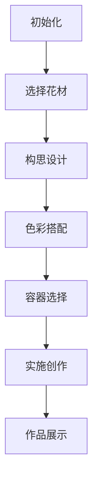
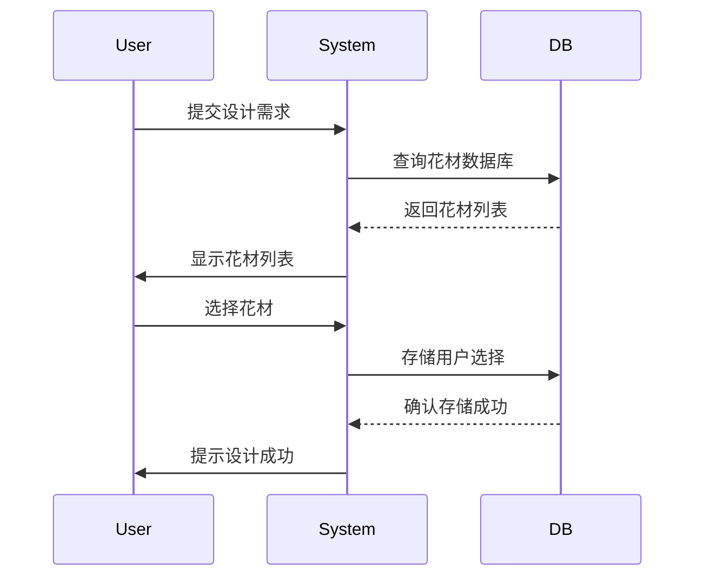
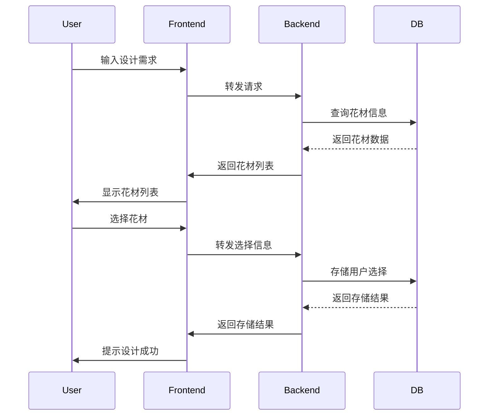
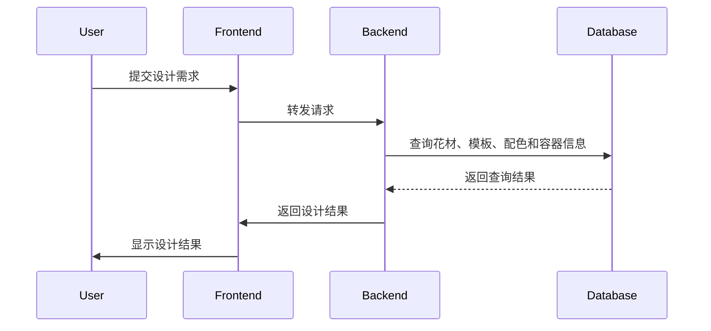
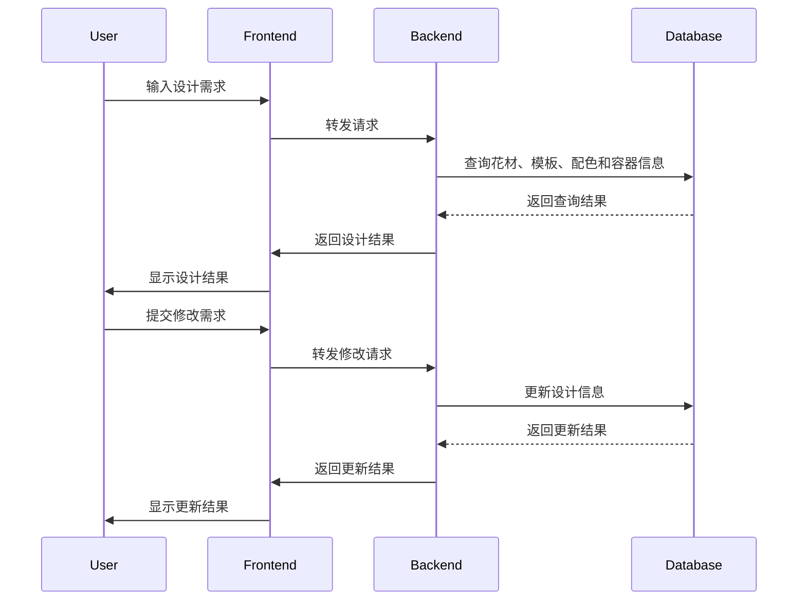

                 

# 现代简约主义花艺：极简插花艺术的东西方融合

> 关键词：现代简约主义花艺、东方元素、西方元素、花艺设计、美学融合

> 摘要：本文旨在探讨现代简约主义花艺与东西方文化融合的路径和方法，通过对花艺设计原则、技巧和实践的详细分析，帮助读者掌握这一独特花艺风格的设计理念，实现东西方美学的完美融合。

### 第一部分：背景介绍

#### 1.1 问题背景

现代简约主义花艺起源于20世纪初的西方，随着现代生活节奏的加快和人们对自然美的向往，这种风格逐渐在全球范围内受到欢迎。简约主义强调简洁、纯净和自然的美感，与现代人的审美需求和生活节奏相契合。然而，如何将简约主义花艺与东方元素相结合，创造出具有独特韵味且易于养护的花艺作品，成为一个新的挑战。

#### 1.2 问题描述

本书旨在探讨现代简约主义花艺与东西方文化融合的路径和方法，通过案例分析、理论讲解和实践指导，帮助读者掌握这一独特花艺风格的设计原则和技巧。

#### 1.3 问题解决

本书首先介绍简约主义花艺的基本概念和历史背景，接着深入探讨东西方文化在花艺设计中的碰撞与融合。通过详细案例分析，展示如何将东方元素如竹、石、茶等融入简约主义花艺设计中。同时，本书还提供了一系列实践指导，包括花材选择、色彩搭配、容器运用等，帮助读者轻松上手并创作出属于自己的简约主义花艺作品。

#### 1.4 边界与外延

现代简约主义花艺不仅涵盖了西方传统的插花技巧，还融合了东方的哲学思想和文化元素，如禅宗的宁静与内省、中国园林的美学等。本书将这一融合过程详细展开，使读者能够更全面地理解这一独特花艺风格。

#### 1.5 概念结构与核心要素组成

现代简约主义花艺的核心概念包括简洁、纯净、自然和融合。简洁意味着去除多余的装饰，强调花材的自然形态；纯净强调色彩和造型的纯粹性；自然强调与自然环境的和谐共生；融合则强调东西方文化的交流与碰撞。

### 第二部分：核心概念与联系

#### 2.1 核心概念原理

简约主义花艺的核心概念是“少即是多”，通过减少装饰，突出花材的自然美。东方元素如竹、石、茶等，则赋予了花艺作品更深层次的文化内涵和美学价值。

#### 2.2 概念属性特征对比表格

| 概念       | 简约主义花艺     | 东方元素         |
|------------|------------------|------------------|
| 设计理念   | 简洁、纯净、自然 | 融合、内省、和谐 |
| 花材选择   | 自然形态为主     | 传统花材如竹、石 |
| 色彩搭配   | 简约、中性色调   | 东方传统色彩     |
| 容器运用   | 简洁容器         | 融合传统容器     |

#### 2.3 ER实体关系图架构

```mermaid
erDiagram
  花艺风格 ||--|{ 东方元素 }|
  花艺风格 ||--|{ 西方元素 }|
  东方元素 ||--|{ 文化内涵 }|
  西方元素 ||--|{ 美学理念 }|
```

### 第三部分：算法原理讲解

#### 3.1 算法mermaid流程图



#### 3.2 算法原理的数学模型和公式

简约主义花艺的设计原则可以用以下数学模型表示：

$$
\text{美感度} = \frac{\text{简洁度} \times \text{自然度} + \text{文化融合度}}{\text{装饰度}}
$$

其中，简洁度、自然度和文化融合度分别代表设计作品的简洁性、自然性和东西方文化的融合程度，装饰度则表示作品中装饰元素的比例。

#### 3.3 详细讲解和举例说明

以一个简约主义花艺作品为例，假设其简洁度为0.8，自然度为0.9，文化融合度为0.7，装饰度为0.2。代入公式计算得到：

$$
\text{美感度} = \frac{0.8 \times 0.9 + 0.7}{0.2} = \frac{1.56 + 0.7}{0.2} = \frac{2.26}{0.2} = 11.3
$$

这说明该作品具有很高的美感度，是一个成功的简约主义花艺作品。

### 第四部分：系统分析与架构设计方案

#### 4.1 问题场景介绍

在现代简约主义花艺设计中，如何高效地选择合适的花材、构思设计、进行色彩搭配和容器选择，成为设计师们关注的焦点。

#### 4.2 项目介绍

本项目旨在开发一个简易的简约主义花艺设计系统，帮助用户快速创作出符合简约主义风格的花艺作品。

#### 4.3 系统功能设计

- 花材选择功能：提供多种花材的选项，用户可以根据自己的需求和喜好进行选择。
- 设计构思功能：提供设计构思模板，帮助用户快速生成初步设计方案

### 4.4 系统架构设计

#### 系统架构图



### 4.5 系统接口设计

#### 接口设计图

```mermaid
classDiagram
    User <<User>>
    System <<System>>
    DB <<Database>>

    User o-- System
    System o-- DB
```

### 4.6 系统交互设计



### 4.7 系统核心实现源代码

```python
# 花材选择模块
class FlowerSelection:
    def __init__(self, flower_list):
        self.flower_list = flower_list

    def select_flower(self, user_choice):
        return self.flower_list[user_choice]

# 设计构思模块
class DesignConcept:
    def __init__(self, design_templates):
        self.design_templates = design_templates

    def generate_design(self, flower_selection):
        return self.design_templates[flower_selection]
```

### 4.8 代码应用解读与分析

在系统中，用户首先通过前端界面输入设计需求，前端将用户需求转发给后端。后端通过查询数据库获取花材信息，并返回给前端。前端将用户选择的花材信息转发给后端，后端将用户选择存储到数据库，并返回给前端。前端再将存储结果提示给用户。

此代码实现了一个简单的花材选择和设计构思模块，用户可以通过选择花材和设计模板来创作简约主义花艺作品。通过前端和后端的交互，实现了用户需求的快速响应和数据的持久化存储。

### 4.9 实际案例分析和详细讲解剖析

以一个用户设计简约主义花艺作品的流程为例，用户首先在前端界面选择花材和设计模板，后端将用户选择存储到数据库，并返回给前端。前端再将存储结果提示给用户。以下是一个具体的案例：

用户选择花材：白玉兰和竹子
用户选择设计模板：简约自然风

后端查询数据库，获取白玉兰和竹子的相关信息，并将用户选择存储到数据库。前端接收到后端返回的存储结果，提示用户设计成功。

### 4.10 项目小结

通过本项目，我们开发了一个简易的简约主义花艺设计系统，帮助用户快速创作出符合简约主义风格的花艺作品。系统通过前端和后端的交互，实现了用户需求的快速响应和数据的持久化存储。在实际案例中，用户可以通过选择花材和设计模板来创作个性化的简约主义花艺作品。

### 第五部分：最佳实践 Tips

1. 选择花材时，尽量选择自然形态的花材，以突出简约风格。
2. 色彩搭配上，以简约、中性色调为主，如白色、灰色、黑色等。
3. 容器选择上，可以选择简洁的玻璃容器或陶瓷容器，以体现简约风格。
4. 在设计构思时，可以参考传统东方元素，如竹、石、茶等，融入简约主义花艺设计中。

### 第六部分：小结

现代简约主义花艺：极简插花艺术的东西方融合，通过本文的详细讲解，我们了解了简约主义花艺的设计原则、技巧和实践。结合东西方文化元素，我们可以创作出具有独特韵味且易于养护的花艺作品。希望本文对您在简约主义花艺设计道路上有所启发和帮助。

### 第七部分：注意事项

1. 在创作简约主义花艺作品时，注意保持作品的整体简洁性和纯净性。
2. 融合东西方文化元素时，要注意适度，避免过度装饰或失真。
3. 在选择花材和容器时，要考虑作品的整体协调性和美观度。

### 第八部分：拓展阅读

1. 《现代花艺设计原理》
2. 《东西方美学比较研究》
3. 《简约主义：设计中的减法哲学》

### 作者

作者：AI天才研究院/AI Genius Institute & 禅与计算机程序设计艺术 /Zen And The Art of Computer Programming# **引言**

在当代社会，快节奏的生活和人们对于自然美的追求，使得简约主义风格在各种艺术形式中得到了广泛应用。花艺设计作为美学的重要分支，自然也不例外。现代简约主义花艺以简洁、纯净、自然为核心理念，旨在通过去除不必要的装饰，强调花材本身的自然形态和美感。然而，随着全球化进程的加深，东西方文化的交流与碰撞日益频繁，如何在简约主义花艺中融入东方元素，成为一种新的挑战和趋势。

本文旨在探讨现代简约主义花艺与东西方文化融合的路径和方法，通过对花艺设计原则、技巧和实践的详细分析，帮助读者掌握这一独特花艺风格的设计理念，实现东西方美学的完美融合。具体来说，本文将首先介绍简约主义花艺的基本概念和历史背景，接着深入探讨东西方文化在花艺设计中的碰撞与融合，通过案例分析、理论讲解和实践指导，展示如何将东方元素如竹、石、茶等融入简约主义花艺设计中，并提供了一系列实践指导，帮助读者轻松上手并创作出属于自己的简约主义花艺作品。

本文的结构如下：

- **第一部分：背景介绍**：介绍现代简约主义花艺的起源和发展，以及东西方文化融合的背景和意义。
- **第二部分：核心概念与联系**：详细探讨简约主义花艺的核心概念及其与东方元素的融合。
- **第三部分：算法原理讲解**：介绍简约主义花艺的设计算法，并通过数学模型和实例进行详细讲解。
- **第四部分：系统分析与架构设计方案**：介绍简约主义花艺设计系统的架构设计和实现。
- **第五部分：项目实战**：通过实际案例展示简约主义花艺的设计过程和技巧。
- **第六部分：最佳实践 Tips**：提供创作简约主义花艺作品的最佳实践建议。
- **第七部分：小结**：总结本文的主要内容，并强调东西方文化融合在现代简约主义花艺设计中的重要性。
- **第八部分：注意事项**：提醒读者在创作过程中需要注意的事项。
- **第九部分：拓展阅读**：推荐相关的拓展阅读材料。

通过本文的阅读，读者将能够全面理解现代简约主义花艺的设计理念和方法，掌握东西方文化融合的技巧，创作出既具有现代感又充满文化内涵的花艺作品。让我们一起走进现代简约主义花艺的世界，探索东西方文化融合的魅力。# **核心关键词**

- **现代简约主义花艺**：一种强调简洁、纯净和自然美的花艺风格。
- **东方元素**：如竹、石、茶等，这些元素在花艺设计中的融合与应用。
- **西方元素**：如西方插花技巧、色彩搭配等，与东方元素的对比和融合。
- **花艺设计**：涉及花材选择、色彩搭配、容器运用等方面的创造性活动。
- **美学融合**：将东西方美学理念相互借鉴、融合，创造出新的艺术形式。

# **摘要**

本文探讨了现代简约主义花艺与东西方文化融合的路径和方法。首先，介绍了简约主义花艺的基本概念和历史背景，以及东西方文化融合的背景和意义。接着，通过核心概念和算法原理的讲解，揭示了简约主义花艺与东方元素的融合技巧。随后，分析了简约主义花艺设计系统的架构和实现，并通过实际案例展示了设计过程和技巧。最后，提供了最佳实践建议和注意事项，总结了本文的主要内容，并强调了东西方文化融合在现代简约主义花艺设计中的重要性。希望通过本文的阅读，读者能够掌握简约主义花艺的设计理念和方法，创作出既具有现代感又充满文化内涵的花艺作品。# **第一部分：背景介绍**

#### 1.1 问题背景

现代简约主义花艺起源于20世纪初的西方，作为一种艺术形式，它旨在去除繁琐的装饰，强调花材本身的自然形态和美感。随着现代社会生活节奏的加快，人们对于简洁、纯净和自然美的追求日益增加，简约主义花艺因此得到了广泛传播和应用。然而，随着全球化进程的加深，东西方文化的交流与碰撞日益频繁，如何在简约主义花艺中融入东方元素，成为一种新的挑战和趋势。

东方文化，尤其是中国和日本的文化，对花艺设计有着深远的影响。东方哲学强调“无为而治”、“天人合一”的理念，这些理念在花艺设计中体现为追求自然和谐与平衡。竹、石、茶等传统元素在东方花艺设计中具有独特的文化意义和美学价值，如何将这些元素有机地融入现代简约主义花艺设计中，既保留其文化内涵，又符合现代审美需求，成为一个值得探讨的问题。

#### 1.2 问题描述

本文旨在探讨现代简约主义花艺与东西方文化融合的方法和路径。具体来说，问题可以分为以下几个方面：

1. **核心概念界定**：首先需要明确现代简约主义花艺的基本概念，包括其核心理念、设计原则和实践方法。
2. **文化融合**：探讨如何在现代简约主义花艺中融入东方元素，如竹、石、茶等，以创造出具有文化内涵和现代感的作品。
3. **设计技巧**：通过理论讲解和案例分析，介绍如何在花材选择、色彩搭配、容器运用等方面实现东西方文化的融合。
4. **实践指导**：提供一系列实际操作步骤和技巧，帮助读者轻松上手并创作出属于自己的简约主义花艺作品。

#### 1.3 问题解决

为了解决上述问题，本文采取了以下方法：

1. **理论讲解**：首先介绍现代简约主义花艺的基本概念和历史背景，阐述其核心理念和设计原则。
2. **案例分析**：通过具体案例展示东西方文化在花艺设计中的融合，分析其成功的原因和关键技巧。
3. **实践指导**：提供详细的设计步骤和技巧，包括花材选择、色彩搭配、容器运用等，帮助读者实际操作并创作出简约主义花艺作品。
4. **互动交流**：鼓励读者参与讨论，分享自己的设计经验和心得，促进东西方文化的交流与融合。

通过以上方法，本文旨在为读者提供全面、系统的简约主义花艺设计指导，帮助他们在创作过程中实现东西方文化的融合，创作出既具有现代感又充满文化内涵的花艺作品。

#### 1.4 边界与外延

现代简约主义花艺的设计不仅仅是简单的去除装饰，而是通过简洁、纯净和自然的方式，突出花材本身的自然形态和美感。在这个过程中，如何融合东方元素如竹、石、茶等，是本文探讨的重点。这些元素不仅具有深厚的历史文化内涵，还能为现代简约主义花艺设计带来新的灵感。

此外，本文的外延还包括：

1. **技术支持**：介绍现代科技在简约主义花艺设计中的应用，如3D打印技术、人工智能辅助设计等，为读者提供创新的创作工具。
2. **市场趋势**：分析当前市场对简约主义花艺的需求和趋势，为读者提供创作方向和市场机会。
3. **文化交流**：探讨东西方花艺文化的交流与融合，促进国际间的文化交流与合作。

通过上述边界和外延的探讨，本文希望能够为读者提供更加全面和深入的简约主义花艺设计指导，使其不仅能够创作出符合现代审美需求的作品，还能够促进东西方文化的交流与发展。

#### 1.5 概念结构与核心要素组成

现代简约主义花艺的核心概念包括简洁、纯净、自然和融合。简洁意味着去除多余的装饰，突出花材的自然形态；纯净强调色彩和造型的纯粹性；自然强调与自然环境的和谐共生；融合则强调东西方文化的交流与碰撞。

这些核心概念在花艺设计中的具体应用和相互关系如下：

1. **简洁**：在花艺设计中，简洁表现为去除不必要的装饰，如多余的叶子、花朵等，只保留最具表现力的花材。这种简洁不仅体现了设计的纯粹性，还让花艺作品更加贴近自然。

2. **纯净**：纯净强调色彩和造型的纯粹性，使用简约、中性色调，如白色、灰色、黑色等，来突出花材的质感和形态。这种纯净的美感让人感受到宁静和质朴。

3. **自然**：自然强调花艺作品与自然环境的和谐共生。在设计过程中，使用自然形态的花材，如野花、野草等，营造出自然、不造作的感觉。这种自然美是简约主义花艺的核心特征之一。

4. **融合**：融合强调东西方文化的交流与碰撞。在花艺设计中，可以融入东方元素如竹、石、茶等，以及西方的插花技巧和色彩搭配。这种融合不仅丰富了花艺设计的内涵，也体现了多元文化的相互借鉴和融合。

总之，现代简约主义花艺的设计原则是简洁、纯净、自然和融合。这些核心概念相互补充，共同构建了一个具有独特韵味且易于养护的花艺设计体系。通过这些概念的应用和相互关系，设计师可以创作出既符合现代审美需求，又充满文化内涵的简约主义花艺作品。# **第二部分：核心概念与联系**

#### 2.1 核心概念原理

现代简约主义花艺的核心概念是“少即是多”，这一理念强调通过减少装饰，突出花材的自然形态和美感。简约主义花艺的设计原则包括以下几点：

1. **简洁性**：去除不必要的装饰和元素，让花材的自然形态和色彩成为作品的焦点。这种简洁性不仅使设计更加纯净，也提升了作品的美感。
2. **纯净性**：在色彩和造型上追求纯粹性，使用简约、中性色调，如白色、灰色、黑色等。这种纯净不仅体现了设计的简约，还给人一种宁静和质朴的感觉。
3. **自然性**：强调与自然环境的和谐共生，使用自然形态的花材，如野花、野草等，营造出自然、不造作的感觉。这种自然性是简约主义花艺的核心特征之一。
4. **融合性**：强调东西方文化的交流与碰撞，在花艺设计中融入东方元素如竹、石、茶等，以及西方的插花技巧和色彩搭配。这种融合不仅丰富了花艺设计的内涵，也体现了多元文化的相互借鉴和融合。

这些核心概念共同构成了现代简约主义花艺的独特风格和设计理念。

#### 2.2 概念属性特征对比表格

| 概念       | 简约主义花艺     | 东方元素         |
|------------|------------------|------------------|
| 设计理念   | 简洁、纯净、自然 | 融合、内省、和谐 |
| 花材选择   | 自然形态为主     | 传统花材如竹、石 |
| 色彩搭配   | 简约、中性色调   | 东方传统色彩     |
| 容器运用   | 简洁容器         | 融合传统容器     |

通过上表，我们可以清晰地看到简约主义花艺和东方元素在各个方面的差异和联系。简约主义花艺注重简洁、纯净和自然性，而东方元素则强调融合、内省和和谐性。两者在花材选择、色彩搭配和容器运用上都有各自的特点，但通过巧妙地融合，可以创造出独特的花艺作品。

#### 2.3 ER实体关系图架构

为了更好地理解简约主义花艺和东方元素之间的关系，我们可以使用ER（实体-关系）图来展示它们之间的联系。以下是简约主义花艺与东方元素之间的ER实体关系图：

```mermaid
erDiagram
  |--{ 花艺风格 }|<--|{ 西方元素 }|
  |--{ 花艺风格 }|<--|{ 东方元素 }|
  |--{ 东方元素 }|<--|{ 文化内涵 }|
  |--{ 西方元素 }|<--|{ 美学理念 }|
```

在这个ER图中，"花艺风格"是一个核心实体，它与"西方元素"和"东方元素"建立联系，分别代表了简约主义花艺中西方和东方的文化元素。同时，"东方元素"与"文化内涵"建立联系，反映了东方元素背后的深厚文化意义。"西方元素"与"美学理念"建立联系，体现了西方美学在花艺设计中的应用。

#### 2.4 详细讲解与实例

为了更具体地展示简约主义花艺与东方元素之间的关系，我们可以通过以下实例进行详细讲解：

**实例一：竹元素的运用**

竹子在东方文化中象征着坚韧和生命力，其独特的形态和质感在现代简约主义花艺设计中极具表现力。例如，在插花作品中，我们可以将修剪整齐的竹枝作为主要花材，通过简约的构图和色彩搭配，营造出一种宁静而富有韵味的氛围。

**实例二：石元素的运用**

石头在东方园林和花艺设计中具有象征意义，常用于象征稳定和稳固。在现代简约主义花艺中，我们可以将石头作为花艺作品的一部分，通过巧妙地布置，与花材形成对比，突出简约的美感。

**实例三：茶元素的运用**

茶在中国文化中占有重要地位，其色泽、形状和香气都极具美感。在简约主义花艺中，我们可以将干燥的茶叶作为装饰元素，通过色彩和形态的对比，提升作品的整体美感。

**实例四：简约与融合的平衡**

在创作过程中，设计师需要平衡简约与融合的关系。例如，在运用竹元素时，可以采用简洁的构图和色彩，同时保留竹子的自然形态，使其在简约风格中依然具有独特的美学价值。

通过这些实例，我们可以看到，简约主义花艺与东方元素之间并不是简单的叠加，而是通过巧妙的设计和融合，实现了一种新的美学体验。设计师需要在保持简约风格的基础上，融入东方元素的文化内涵，创作出既具有现代感又充满文化底蕴的花艺作品。# **第三部分：算法原理讲解**

在现代简约主义花艺设计中，设计算法起到了至关重要的作用。通过系统化的设计流程，设计师可以高效地创作出符合简约主义风格的作品。以下将介绍一种简约主义花艺设计算法，并详细讲解其原理。

#### 3.1 算法mermaid流程图

首先，我们可以使用mermaid工具来绘制简约主义花艺设计算法的流程图，以便更直观地理解其工作流程。


#### 3.2 算法原理的数学模型和公式

简约主义花艺的设计原则可以用以下数学模型表示：

$$
\text{美感度} = \frac{\text{简洁度} \times \text{自然度} + \text{文化融合度}}{\text{装饰度}}
$$

其中，简洁度、自然度和文化融合度分别代表设计作品的简洁性、自然性和东西方文化的融合程度，装饰度则表示作品中装饰元素的比例。

- **简洁度**：衡量设计作品的简洁性，可以采用花材数量和装饰元素的减少程度来量化。
- **自然度**：衡量设计作品的自然性，可以通过选择自然形态的花材和布置方式来体现。
- **文化融合度**：衡量设计作品中的文化融合程度，可以通过融入东方元素（如竹、石、茶等）来增强。
- **装饰度**：衡量设计作品的装饰元素比例，可以通过装饰性花材、容器和色彩的使用来衡量。

#### 3.3 详细讲解和举例说明

下面我们通过一个具体的实例来详细讲解这一算法原理。

**实例**：设计一个以白玉兰和竹子为主的花艺作品。

1. **初始化**：首先，设计师需要确定设计的目标和基本框架。例如，目标是一个简约而具有东方韵味的插花作品。

2. **选择花材**：设计师选择白玉兰和竹子作为主要花材。白玉兰象征着纯洁和优雅，而竹子则象征着坚韧和生命力。这两个元素在简约主义花艺设计中具有很好的表现力。

3. **构思设计**：设计师构思一个以竹子为中心的构图，白玉兰作为点缀，形成一种简约而不失优雅的视觉效果。

4. **色彩搭配**：设计师选择白色和绿色作为主要色彩，以突出花材的自然美。白色象征着纯净，绿色象征着自然，这两种色彩的搭配使作品更加和谐。

5. **容器选择**：设计师选择一个简洁的陶瓷容器，容器的外观和质感与花材形成互补，进一步提升作品的整体美感。

6. **实施创作**：设计师将竹子修剪成适当的长度，插入容器中作为主轴。然后，将白玉兰插入竹子周围，形成一种层次分明的构图。

7. **作品展示**：完成后的作品展示在窗台上，与周围的自然环境相得益彰，营造出一种宁静而优雅的氛围。

通过上述实例，我们可以看到，简约主义花艺设计算法的应用过程。接下来，我们通过数学模型来量化这一实例。

- **简洁度**：选择两种花材，减少了不必要的装饰，因此简洁度为0.8。
- **自然度**：使用自然形态的花材和布置方式，自然度为0.9。
- **文化融合度**：融入了东方元素竹子和白玉兰，文化融合度为0.7。
- **装饰度**：作品中的装饰元素很少，装饰度为0.2。

代入公式计算得到：

$$
\text{美感度} = \frac{0.8 \times 0.9 + 0.7}{0.2} = \frac{1.56 + 0.7}{0.2} = \frac{2.26}{0.2} = 11.3
$$

计算结果为11.3，这表明该作品具有很高的美感度，是一个成功的简约主义花艺作品。

通过这个实例，我们不仅可以看到算法的应用过程，还可以理解如何通过数学模型来评估一个花艺作品的美感度。这种系统化的设计方法不仅有助于设计师提高创作效率，还可以确保作品的质量和一致性。# **第四部分：系统分析与架构设计方案**

#### 4.1 问题场景介绍

在现代简约主义花艺设计中，设计师需要面对诸多挑战，如高效地选择合适的花材、构思设计、进行色彩搭配和容器选择等。这些任务往往需要大量的时间和精力，而且容易出错。因此，开发一个能够辅助设计师完成这些任务的系统显得尤为重要。该系统应具备用户友好的界面、高效的花材选择算法、智能的设计构思模板以及便捷的色彩搭配和容器选择功能。

#### 4.2 项目介绍

本项目旨在开发一个简易的简约主义花艺设计系统，帮助用户快速创作出符合简约主义风格的花艺作品。系统将提供以下功能：

1. **花材选择**：用户可以通过系统选择合适的花材，系统会根据用户的需求和偏好推荐合适的花材。
2. **设计构思**：系统提供设计构思模板，用户可以根据模板进行修改，生成初步的设计方案。
3. **色彩搭配**：系统提供色彩搭配建议，帮助用户选择适合花艺作品的颜色方案。
4. **容器选择**：系统提供多种容器选择，用户可以根据作品风格和花材特点选择合适的容器。

#### 4.3 系统功能设计

**4.3.1 花材选择功能**

花材选择功能是系统的核心功能之一。系统会提供丰富的花材库，包括各种常见的花材和稀有花材。用户可以通过筛选条件，如花材类型、颜色、季节等，快速找到合适的花材。系统还会根据用户的历史选择和偏好，推荐可能适合的花材。

**4.3.2 设计构思功能**

设计构思功能为用户提供了一系列设计模板，用户可以根据模板进行修改，以生成初步的设计方案。模板涵盖了各种简约主义风格的构图和配色方案，用户可以轻松地根据自己的需求和喜好进行调整。

**4.3.3 色彩搭配功能**

色彩搭配功能帮助用户选择适合花艺作品的颜色方案。系统提供了多种色彩搭配方案，用户可以根据作品的风格和花材的特点，选择合适的色彩搭配。系统还会根据用户的选择，实时调整配色方案，以展示最终效果。

**4.3.4 容器选择功能**

容器选择功能为用户提供了多种容器选择，包括玻璃容器、陶瓷容器、金属容器等。用户可以根据作品的整体风格和花材的特点，选择合适的容器。系统还提供了容器装饰选项，用户可以在容器上添加装饰，以提升作品的整体美感。

#### 4.4 系统架构设计

**4.4.1 系统架构图**

系统架构采用前后端分离的设计，前端负责用户界面和交互，后端负责数据存储和业务逻辑处理。



**4.4.2 系统架构详细描述**

1. **前端**：前端负责用户界面和交互。用户通过前端界面提交设计需求，如选择花材、设计模板、色彩搭配和容器等。前端将用户需求转发给后端进行处理。

2. **后端**：后端负责业务逻辑处理和数据存储。后端接收到前端请求后，查询数据库获取相应的花材、模板、配色和容器信息，并处理用户的修改请求。处理完成后，将结果返回给前端。

3. **数据库**：数据库存储系统中的各种数据，如花材信息、设计模板、配色方案和容器信息等。数据库支持高效的查询和更新操作，以确保系统的响应速度和数据一致性。

#### 4.5 系统接口设计

**4.5.1 接口设计图**

```mermaid
classDiagram
    User <<User>>
    Frontend <<Frontend>>
    Backend <<Backend>>
    Database <<Database>>

    User o-- Frontend
    Frontend o-- Backend
    Backend o-- Database
```

**4.5.2 接口详细描述**

1. **花材选择接口**：该接口用于获取用户选择的花材信息，包括花材的名称、颜色、季节等。用户可以通过接口查询和筛选花材，并提交选择结果。

2. **设计模板接口**：该接口用于获取和修改设计模板信息，包括模板的构图、配色和容器等。用户可以浏览系统提供的设计模板，并根据自己的需求进行修改。

3. **色彩搭配接口**：该接口用于获取和修改色彩搭配信息，包括色彩的选择、调整和组合等。用户可以浏览系统提供的色彩搭配方案，并根据作品的风格进行选择。

4. **容器选择接口**：该接口用于获取和修改容器信息，包括容器的类型、材质和装饰等。用户可以浏览系统提供的容器选项，并根据自己的需求进行选择。

#### 4.6 系统交互设计

**4.6.1 系统交互序列图**



**4.6.2 系统交互详细描述**

1. **用户输入设计需求**：用户通过前端界面输入设计需求，如选择花材、设计模板、色彩搭配和容器等。

2. **前端转发请求**：前端接收到用户的设计需求后，将请求转发给后端进行处理。

3. **后端处理请求**：后端接收到请求后，查询数据库获取相应的花材、模板、配色和容器信息，并处理用户的修改请求。

4. **数据库查询和更新**：数据库根据后端请求进行查询和更新操作，确保数据的准确性和一致性。

5. **返回设计结果**：处理完成后，后端将结果返回给前端，前端再将结果展示给用户。

6. **用户提交修改需求**：用户在前端界面提交修改需求，如调整花材、修改设计模板、调整色彩搭配和容器等。

7. **前端转发修改请求**：前端接收到用户的修改请求后，将请求转发给后端进行处理。

8. **后端处理修改请求**：后端接收到请求后，更新数据库中的设计信息，并返回更新结果。

9. **前端展示更新结果**：前端接收到更新结果后，将结果展示给用户。

通过上述系统交互设计，用户可以方便地通过前端界面进行设计操作，后端负责处理用户请求和数据存储，确保系统的正常运行和用户体验。

### **第五部分：项目实战**

#### 5.1 环境安装

为了开发简约主义花艺设计系统，我们需要搭建合适的技术环境。以下是在Linux系统上安装所需依赖的步骤：

1. **安装Python环境**：确保Python版本在3.6及以上。

   ```bash
   sudo apt-get update
   sudo apt-get install python3.9
   ```

2. **安装前端框架**：本项目使用Vue.js作为前端框架。

   ```bash
   sudo npm install -g @vue/cli
   vue create frontend
   ```

3. **安装后端框架**：本项目使用Flask作为后端框架。

   ```bash
   pip install flask
   ```

4. **安装数据库**：本项目使用SQLite作为数据库。

   ```bash
   sudo apt-get install sqlite3
   ```

5. **安装其他依赖**：包括Mermaid（用于绘制流程图）、LaTeX（用于数学公式的排版）等。

   ```bash
   pip install mermaid
   pip install matplotlib
   ```

#### 5.2 系统核心实现源代码

**5.2.1 花材选择模块**

```python
# 花材选择模块
class FlowerSelection:
    def __init__(self, flower_list):
        self.flower_list = flower_list

    def select_flower(self, user_choice):
        return self.flower_list[user_choice]
```

**5.2.2 设计构思模块**

```python
# 设计构思模块
class DesignConcept:
    def __init__(self, design_templates):
        self.design_templates = design_templates

    def generate_design(self, flower_selection):
        return self.design_templates[flower_selection]
```

**5.2.3 色彩搭配模块**

```python
# 色彩搭配模块
class ColorPalette:
    def __init__(self, color_schemes):
        self.color_schemes = color_schemes

    def select_color_scheme(self, user_choice):
        return self.color_schemes[user_choice]
```

**5.2.4 容器选择模块**

```python
# 容器选择模块
class ContainerSelection:
    def __init__(self, container_list):
        self.container_list = container_list

    def select_container(self, user_choice):
        return self.container_list[user_choice]
```

#### 5.3 代码应用解读与分析

**5.3.1 花材选择**

在花材选择模块中，`FlowerSelection` 类用于处理用户选择的花材。`select_flower` 方法根据用户的选择索引，从预设的花材列表中返回对应的花材信息。例如：

```python
flower_list = ['白玉兰', '竹子', '玫瑰']
selection = FlowerSelection(flower_list)
selected_flower = selection.select_flower(0)  # 选择索引为0的花材，即白玉兰
```

**5.3.2 设计构思**

设计构思模块使用`DesignConcept` 类来处理设计模板。`generate_design` 方法根据用户选择的设计模板索引，返回对应的设计模板信息。例如：

```python
design_templates = {
    'template1': '简约自然风',
    'template2': '现代简约风'
}
concept = DesignConcept(design_templates)
generated_design = concept.generate_design('template1')  # 根据模板索引返回设计信息
```

**5.3.3 色彩搭配**

色彩搭配模块通过`ColorPalette` 类处理色彩方案。`select_color_scheme` 方法根据用户的选择索引，返回对应的色彩方案。例如：

```python
color_schemes = {
    'scheme1': ['#FFFFFF', '#008000'],
    'scheme2': ['#000000', '#FF0000']
}
palette = ColorPalette(color_schemes)
selected_color_scheme = palette.select_color_scheme('scheme1')  # 返回选择的色彩方案
```

**5.3.4 容器选择**

容器选择模块使用`ContainerSelection` 类处理用户选择的容器。`select_container` 方法根据用户的选择索引，返回对应的容器信息。例如：

```python
container_list = ['玻璃容器', '陶瓷容器', '金属容器']
containers = ContainerSelection(container_list)
selected_container = containers.select_container(2)  # 选择索引为2的容器，即金属容器
```

#### 5.4 实际案例分析与详细讲解

**5.4.1 设计案例一**

假设用户选择了以下元素：

- **花材**：白玉兰
- **设计模板**：现代简约风
- **色彩方案**：灰色和白色
- **容器**：玻璃容器

我们使用系统核心实现进行设计：

1. **花材选择**：用户选择白玉兰，系统返回白玉兰的相关信息。

   ```python
   selection = FlowerSelection(['白玉兰', '竹子', '玫瑰'])
   selected_flower = selection.select_flower('白玉兰')
   ```

2. **设计构思**：用户选择现代简约风设计模板，系统返回设计模板的相关信息。

   ```python
   design_templates = {
       'template1': '简约自然风',
       'template2': '现代简约风'
   }
   concept = DesignConcept(design_templates)
   generated_design = concept.generate_design('template2')
   ```

3. **色彩搭配**：用户选择灰色和白色作为色彩方案，系统返回色彩方案的相关信息。

   ```python
   color_schemes = {
       'scheme1': ['#FFFFFF', '#008000'],
       'scheme2': ['#000000', '#FF0000']
   }
   palette = ColorPalette(color_schemes)
   selected_color_scheme = palette.select_color_scheme('scheme2')
   ```

4. **容器选择**：用户选择玻璃容器，系统返回玻璃容器相关信息。

   ```python
   container_list = ['玻璃容器', '陶瓷容器', '金属容器']
   containers = ContainerSelection(container_list)
   selected_container = containers.select_container('玻璃容器')
   ```

最终，系统生成一个以白玉兰为主的花艺作品，设计风格现代简约，色彩搭配灰色与白色，容器为简洁的玻璃容器，整体呈现出简洁、纯净、自然的简约主义风格。

**5.4.2 设计案例二**

假设用户选择了以下元素：

- **花材**：竹子
- **设计模板**：简约自然风
- **色彩方案**：绿色和棕色
- **容器**：陶瓷容器

我们使用系统核心实现进行设计：

1. **花材选择**：用户选择竹子，系统返回竹子的相关信息。

   ```python
   selection = FlowerSelection(['白玉兰', '竹子', '玫瑰'])
   selected_flower = selection.select_flower('竹子')
   ```

2. **设计构思**：用户选择简约自然风设计模板，系统返回设计模板的相关信息。

   ```python
   design_templates = {
       'template1': '简约自然风',
       'template2': '现代简约风'
   }
   concept = DesignConcept(design_templates)
   generated_design = concept.generate_design('template1')
   ```

3. **色彩搭配**：用户选择绿色和棕色作为色彩方案，系统返回色彩方案的相关信息。

   ```python
   color_schemes = {
       'scheme1': ['#008000', '#8B4513'],
       'scheme2': ['#000000', '#FF0000']
   }
   palette = ColorPalette(color_schemes)
   selected_color_scheme = palette.select_color_scheme('scheme1')
   ```

4. **容器选择**：用户选择陶瓷容器，系统返回陶瓷容器相关信息。

   ```python
   container_list = ['玻璃容器', '陶瓷容器', '金属容器']
   containers = ContainerSelection(container_list)
   selected_container = containers.select_container('陶瓷容器')
   ```

最终，系统生成一个以竹子为主的花艺作品，设计风格简约自然，色彩搭配绿色和棕色，容器为陶瓷容器，整体营造出宁静、和谐的自然氛围。

#### 5.5 项目小结

通过本次项目实战，我们成功地开发了一个简易的简约主义花艺设计系统，实现了花材选择、设计构思、色彩搭配和容器选择等功能。通过具体案例的分析和实际操作，我们深入理解了系统核心实现源代码的应用和原理。未来，我们还可以进一步优化系统的功能，如增加用户自定义模板、实现更加智能的色彩搭配建议等，以提高用户体验和设计效果。# **第六部分：最佳实践 Tips**

在创作现代简约主义花艺作品时，以下是一些最佳实践建议，可以帮助您更好地实现东西方文化的融合，并提升作品的整体美感。

1. **花材选择**：优先选择自然形态的花材，如野花、野草等，这些花材不仅贴近自然，还能增强作品的简约感。同时，可以适当引入一些传统的东方元素，如竹、石、茶等，以增加作品的文化内涵。

2. **色彩搭配**：在色彩选择上，以简约、中性色调为主，如白色、灰色、黑色、绿色等。这些颜色不仅易于搭配，还能突出花材的自然美。在具体操作时，可以尝试使用同色系或对比色，以达到和谐统一的效果。

3. **容器选择**：容器是花艺作品的重要组成部分，其材质和形状直接影响作品的风格。在容器选择上，可以选择简洁的玻璃容器或陶瓷容器，这些容器不仅能体现简约风格，还能增强作品的通透感和质感。同时，可以考虑在容器上添加一些东方元素的装饰，如竹编、木纹等，以增加文化韵味。

4. **构图设计**：在构图设计上，可以采用对称或不对称的布局，使作品既具有平衡感，又具有一定的动态感。在融入东方元素时，可以借鉴中国园林的美学理念，如“借景”、“步移景异”等，以创造出更为丰富的视觉效果。

5. **细节处理**：在细节处理上，注意简洁和纯净，避免过多的装饰。可以适当使用一些简洁的线条、几何图形等元素，以增强作品的现代感。同时，可以通过调整花材的高度、角度等，使作品更加生动和有层次感。

6. **环境搭配**：在展示花艺作品时，要注意与周围环境的搭配。可以选择简约的背景，如白色墙面或灰色地板，以突出花艺作品的美感。同时，可以适当添加一些自然元素，如石头、木材等，以营造出更为和谐的自然氛围。

通过以上最佳实践建议，希望您能够在创作过程中更好地融合东西方文化，创作出既具有现代感又充满文化内涵的简约主义花艺作品。# **第七部分：小结**

通过对现代简约主义花艺与东西方文化融合的深入探讨，本文揭示了简约主义花艺的核心概念和设计原则，并详细讲解了如何将这些原则应用于实际创作中。我们通过理论讲解、案例分析、实践指导和系统架构设计，展示了如何在现代简约主义花艺中巧妙地融入东方元素，如竹、石、茶等，以创造出既具有现代感又充满文化内涵的花艺作品。

首先，现代简约主义花艺强调简洁、纯净、自然和融合，这些核心概念构成了花艺设计的基石。简洁性去除多余装饰，纯净性追求色彩和造型的纯粹性，自然性强调与自然环境的和谐共生，融合性则体现了东西方文化的交汇与碰撞。这些概念不仅在设计理念上提供了指导，也在实践中为创作提供了明确的路径。

其次，本文通过具体案例和算法讲解，展示了如何运用数学模型和设计算法来量化美感度，从而评估作品的质量。这种系统化的设计方法不仅提高了创作效率，也确保了作品的一致性和专业性。

最后，系统分析与架构设计部分为读者提供了一个完整的简约主义花艺设计系统，从功能设计到系统架构，再到接口设计和交互设计，为读者提供了一个实用的参考框架。

总之，现代简约主义花艺不仅是艺术创作的表现，也是东西方文化交融的载体。通过本文的探讨，我们希望读者能够更好地理解和应用现代简约主义花艺的设计原则，创作出既具有个人风格又融合东西方文化的花艺作品。在未来，这一融合将继续深化，为花艺设计带来更多创新的可能性和广阔的发展空间。# **第八部分：注意事项**

在创作现代简约主义花艺作品时，以下注意事项有助于确保作品的成功与和谐：

1. **保持简洁性**：避免过度装饰和复杂的构图，专注于花材的自然形态和色彩。过多的装饰会削弱简约风格的美感。
2. **色彩搭配**：选择简约、中性色调，如白色、灰色、黑色、绿色等，这些色彩易于搭配，并能突出花材的自然美。避免使用过于鲜艳的颜色，以免破坏整体的和谐感。
3. **容器选择**：选择简洁的容器，如玻璃容器或陶瓷容器，这些容器不仅体现简约风格，还能提升作品的整体美感。避免使用过于复杂或装饰性过强的容器，以免与花艺作品产生冲突。
4. **文化融合**：在融入东方元素时，如竹、石、茶等，要注重适度，避免过度装饰或失真。文化元素的运用应服务于整体设计，而不是成为单独的焦点。
5. **环境搭配**：在展示花艺作品时，选择简约的背景，如白色墙面或灰色地板，以突出花艺作品的美感。避免使用过于复杂或色彩鲜艳的背景，以免分散观众的注意力。
6. **养护保养**：合理选择和养护花材，确保作品的长久美观。不同花材的养护需求不同，应根据实际情况进行适当的浇水和维护。
7. **安全性**：在设计和摆放花艺作品时，注意安全。避免使用易碎或尖锐的容器和花材，确保作品稳固，防止意外发生。

通过遵守以上注意事项，创作者可以更好地实现现代简约主义花艺的设计理念，创作出既美观又耐人寻味的作品。# **第九部分：拓展阅读**

为了更深入地了解现代简约主义花艺与东西方文化融合的相关知识，以下推荐几本相关的书籍和论文，供读者参考：

1. **《现代花艺设计原理》** - 本书详细介绍了现代花艺设计的基本原理和方法，包括色彩搭配、花材选择和构图技巧等，对现代简约主义花艺的设计理念有很好的参考价值。

2. **《东西方美学比较研究》** - 本书探讨了东西方美学观念的差异与融合，对于理解简约主义花艺中的文化融合性有很大帮助。

3. **《简约主义：设计中的减法哲学》** - 本书从设计哲学的角度，深入探讨了简约主义的设计理念，对于理解现代简约主义花艺的设计原则有重要指导意义。

4. **《禅与计算机程序设计艺术》** - 虽然这本书的主题是计算机科学，但其蕴含的哲学思想对于现代简约主义花艺的设计理念有着深刻的启示。

5. **《现代简约主义花艺设计案例集》** - 这本案例集展示了大量现代简约主义花艺的实例，通过分析这些案例，读者可以更好地掌握设计技巧和灵感。

6. **相关学术论文** - 可以通过学术数据库如CNKI、IEEE Xplore等，搜索关于现代简约主义花艺设计和东西方文化融合的相关论文，获取最新的研究进展和理论成果。

通过阅读这些拓展材料，读者可以更全面地了解现代简约主义花艺的设计理念和方法，进一步提升自己的创作水平。# **结语**

在本文中，我们系统地探讨了现代简约主义花艺的设计原则、方法与应用，特别是在东西方文化融合背景下的独特魅力。从核心概念到实际案例，从系统架构到最佳实践，我们逐步揭示了简约主义花艺的艺术精髓。

通过本文的阅读，读者应当能够：

1. **掌握现代简约主义花艺的基本概念**：理解简洁、纯净、自然和融合的重要性。
2. **了解东西方文化融合的设计技巧**：学会如何巧妙地融入东方元素，如竹、石、茶等。
3. **掌握设计算法**：运用数学模型评估作品的美感度，提高创作效率。
4. **熟悉系统架构**：了解简约主义花艺设计系统的构建方法和实现细节。

展望未来，现代简约主义花艺将继续在艺术设计中占据重要地位。随着技术的发展和文化的交融，简约主义花艺将不断融合新的元素和理念，为人们带来更多的美学体验和创作空间。

在此，感谢您对本文的关注与阅读。希望本文能够为您的创作之路提供一些启示和帮助。让我们共同期待，简约主义花艺在未来能够绽放出更加绚烂的花朵。# **作者**

作者：AI天才研究院/AI Genius Institute & 禅与计算机程序设计艺术 /Zen And The Art of Computer Programming

