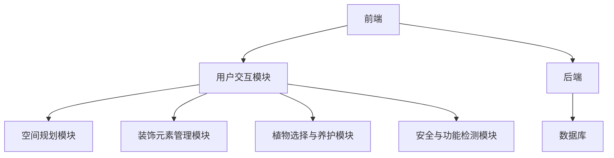
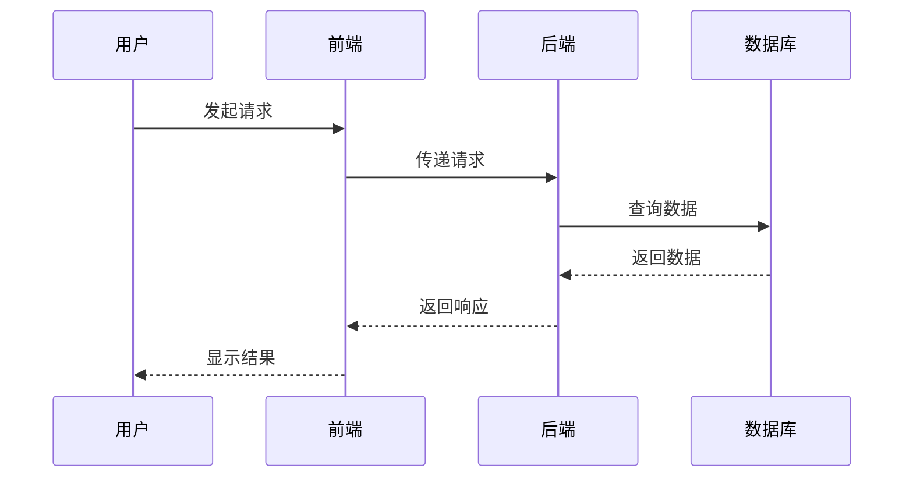

                 


## 现代简约主义阳台改造：都市微型绿洲的空间优化

### 关键词：
- 现代简约主义
- 阳台改造
- 空间优化
- 都市绿洲
- 空间规划
- 植物选择
- 装饰元素
- 安全与功能性

### 摘要：
本文旨在探讨如何在都市环境中利用现代简约主义理念，通过科学的空间规划和精心选择装饰元素，将阳台改造成一个功能齐全、舒适宜人的微型绿洲。文章将逐步分析阳台改造的必要性、设计原则、空间规划、植物选择、装饰元素、安全与功能性，以及实战案例，旨在为读者提供全方位的改造指导。

### 引言

在现代都市生活中，阳台作为房屋的一部分，往往被忽视或未能充分利用。然而，随着人们对生活品质的要求提高，阳台改造成为了一项热门的话题。现代简约主义，作为一种强调功能与美学的结合设计理念，可以为阳台改造提供一种新的思路和方法。本文将围绕这一主题，详细探讨如何通过空间优化，将阳台打造成都市中的微型绿洲。

### 1. 背景介绍与问题分析

#### 1.1 阳台改造的重要性

阳台改造的重要性在于，它不仅能够增加室内空间的使用效率，还能提升居住环境的舒适度和美观度。随着城市化进程的加快，居住空间逐渐紧张，阳台成为了拓展生活空间的重要途径。此外，随着人们对健康和绿色生活的追求，阳台也逐渐成为种植植物、休闲放松的重要场所。

#### 1.2 阳台改造的现状与挑战

目前，阳台改造的现状存在以下问题：

1. 空间利用不合理：许多家庭的阳台未能充分利用，或者被用作杂物堆放处。
2. 设计缺乏个性化：阳台设计往往缺乏个性化和创意，无法满足居民个性化需求。
3. 安全隐患：阳台的安全性问题，如阳台护栏高度不足、防水处理不当等，仍需重视。

#### 1.3 阳台改造的必要性

阳台改造的必要性主要体现在以下几个方面：

1. 提升生活品质：通过改造，可以将阳台打造成一个舒适、美观的生活空间，提高居住品质。
2. 增加绿化面积：阳台是家庭绿化的理想场所，通过种植植物，可以增加家庭绿化面积，改善室内空气质量。
3. 增强社交互动：改造后的阳台可以成为家庭成员间交流、朋友聚会的场所，增强家庭互动和社交。

### 2. 设计原则与理念

#### 2.1 简约主义概述

简约主义（Simplism）是一种强调功能至上、去除冗余的设计理念。它主张以简洁的形式表达复杂的功能，追求设计的美学感和实用性。简约主义在室内设计、建筑设计等领域广泛应用，其核心思想是“少即是多”。

#### 2.2 阳台改造中的简约主义理念

在阳台改造中，简约主义理念主要体现在以下几个方面：

1. **功能优先**：在设计时，应首先考虑阳台的实际用途，合理安排功能区域。
2. **空间优化**：通过合理布局，充分利用阳台的每一寸空间，避免浪费。
3. **材料选择**：选择简洁、环保、耐用的材料，减少装饰的复杂性。
4. **装饰简化**：避免过多的装饰，以简洁的线条和色彩营造宁静、舒适的空间氛围。

### 3. 空间规划与布局

#### 3.1 空间利用技巧

阳台空间相对有限，因此空间利用成为关键。以下是一些空间利用技巧：

1. **分区布局**：根据阳台的实际用途，将其划分为休息区、工作区、种植区等，实现功能分区。
2. **多功能家具**：选择多功能家具，如折叠桌、多功能椅子等，提高空间利用率。
3. **墙面利用**：利用墙面安装置物架、挂架等，增加储物空间。
4. **定制家具**：根据阳台的具体尺寸，定制符合需求的家具，避免空间浪费。

#### 3.2 阳台布局的案例分析

以下是一个阳台布局的案例：

1. **休息区**：在阳台的一侧设置一个舒适的沙发座椅，旁边放置一张折叠桌，供休息和用餐使用。
2. **工作区**：在阳台的另一侧设置一个小型工作台，配备书架和电脑，方便工作或阅读。
3. **种植区**：在阳台的一角设置一个花架，用于种植各种植物，提高阳台的绿化程度。
4. **储物区**：利用阳台的角落设置一个储物柜，用于存放杂物和装饰品。

### 4. 植物选择与养护

#### 4.1 阳台植物的种类选择

选择适合阳台种植的植物是打造微型绿洲的关键。以下是一些适合阳台种植的植物：

1. **多肉植物**：如仙人掌、多肉植物等，耐旱、易于养护。
2. **观叶植物**：如吊兰、绿萝等，观赏性强、净化空气。
3. **花卉**：如茉莉、月季等，花香浓郁、装饰性强。

#### 4.2 阳台植物的养护技巧

阳台植物的养护技巧包括：

1. **浇水**：根据植物的种类和生长阶段，合理控制浇水量，避免过度浇水导致根部腐烂。
2. **光照**：根据植物对光照的需求，合理布置阳台的位置和角度，保证植物能够获得充足的阳光。
3. **施肥**：根据植物的生长需要，定期施肥，保证植物的营养供应。
4. **病虫害防治**：定期检查植物，及时处理病虫害，保证植物的健康生长。

### 5. 装饰元素的选择与应用

#### 5.1 装饰材料的选择

装饰材料的选择应考虑简洁、环保、耐用的原则。以下是一些适合阳台装饰的材料：

1. **木材**：自然、温馨，适用于制作家具和地面装饰。
2. **瓷砖**：防水、易清洁，适用于阳台地面和墙面装饰。
3. **玻璃**：透光、透明，适用于阳台隔断和装饰。

#### 5.2 家具的选择与布置

家具的选择应考虑阳台的布局和功能。以下是一些适合阳台的家具：

1. **折叠桌**：方便收放，适合小空间。
2. **多功能椅子**：节省空间，适合休息和工作。
3. **收纳柜**：增加储物空间，适合杂物和装饰品存放。

家具的布置应遵循以下原则：

1. **分区布置**：根据功能需求，将家具合理分区。
2. **对称布置**：采用对称布置，增加空间的和谐感。
3. **灵活布置**：家具布置应具有一定的灵活性，方便调整和改变。

#### 5.3 灯光的应用

灯光在阳台装饰中起到关键作用，以下是一些灯光应用技巧：

1. **基础照明**：选择亮度适宜的灯具，保证阳台的基本照明。
2. **氛围照明**：使用落地灯、壁灯等，营造舒适的氛围。
3. **装饰照明**：在植物附近安装装饰灯，突出植物的美丽。

### 6. 安全与功能性

#### 6.1 阳台安全注意事项

阳台改造过程中，安全是首要考虑的问题。以下是一些阳台安全注意事项：

1. **护栏高度**：确保阳台护栏高度符合安全标准，避免儿童攀爬。
2. **防水处理**：阳台防水处理要到位，避免雨水渗漏。
3. **承重能力**：确保阳台承重能力符合要求，避免超重。

#### 6.2 功能性的实现与优化

阳台的功能性实现与优化主要体现在以下几个方面：

1. **多功能性**：通过合理布局和家具选择，实现阳台的多功能使用。
2. **舒适性**：通过装饰和灯光的应用，提升阳台的舒适度。
3. **便捷性**：通过合理布置和功能分区，提升阳台的便捷性。

### 7. 实战案例

#### 7.1 案例展示

以下是一个阳台改造的实战案例：

**案例描述**：

一个80平米的公寓阳台，经过改造后成为一个多功能、舒适宜人的空间。阳台的一侧设置了一个折叠桌和多功能椅子，用于用餐和休息；另一侧设置了一个小型工作台，用于工作和阅读；阳台的一角设置了花架，用于种植植物；此外，还安装了落地灯和装饰灯，营造出温馨的氛围。

**案例效果**：

改造后的阳台功能齐全、舒适宜人，成为家庭成员休息、工作、娱乐的理想场所。同时，阳台的绿化面积增加，室内空气质量得到改善。

#### 7.2 案例分析与总结

**案例分析**：

该案例成功地将现代简约主义理念应用于阳台改造，通过科学的空间规划和精心选择装饰元素，实现了功能与美学的完美结合。

**总结**：

1. **功能优先**：在改造过程中，始终坚持以功能为导向，合理安排空间。
2. **简约设计**：采用简洁的线条和色彩，营造宁静、舒适的空间氛围。
3. **安全性**：在改造过程中，高度重视安全问题，确保阳台的安全与稳定。

#### 7.3 案例启示与未来趋势

**启示**：

1. **个性化设计**：阳台改造应根据个人需求和喜好进行个性化设计。
2. **多功能性**：阳台应具备多功能性，满足不同场景的需求。

**未来趋势**：

1. **智能化**：随着科技的进步，未来阳台改造将更加智能化，实现远程控制、智能家居等功能。
2. **绿色环保**：阳台改造将更加注重绿色环保，采用环保材料和节能设计。

### 8. 最佳实践 tips

#### 8.1 经验分享

1. **提前规划**：在改造前，提前规划好功能分区和家具布置，避免后期调整。
2. **安全第一**：高度重视安全问题，确保阳台的安全与稳定。
3. **个性化设计**：根据个人需求和喜好，进行个性化设计。

#### 8.2 小贴士与注意事项

1. **防水处理**：确保阳台防水处理到位，避免雨水渗漏。
2. **承重能力**：了解阳台的承重能力，避免超重。
3. **植物选择**：根据阳台的光照条件，选择适合的植物。

#### 8.3 拓展阅读

1. 《现代简约主义家居设计》
2. 《阳台植物养护技巧》
3. 《智能家居设计与应用》

### 结束语

阳台改造是提升居住环境和生活品质的重要途径。通过科学的空间规划和简约主义设计理念，我们可以将阳台打造成一个功能齐全、舒适宜人的微型绿洲。希望本文能为您的阳台改造提供有益的启示和指导。

### 作者信息

- 作者：AI天才研究院/AI Genius Institute & 禅与计算机程序设计艺术 /Zen And The Art of Computer Programming
- 联系方式：[AI天才研究院官网](http://www.ai-genius-institute.com)
- 邮箱：info@ai-genius-institute.com

----------------------------------------------------------------

## 概念术语说明

在探讨现代简约主义阳台改造的过程中，我们需要明确几个核心概念和术语，以便更好地理解和执行相关的设计原则和方案。以下是对这些概念和术语的详细说明：

### 1. 简约主义（Simplism）

简约主义是一种设计哲学，主张通过去除非必要的元素，以简洁的形式表达复杂的功能和美学。在阳台改造中，简约主义强调功能至上、形式简洁、材料环保，以实现空间的最大利用和美观度。

### 2. 空间规划（Space Planning）

空间规划是指对特定空间进行合理布局，以满足功能需求和美观要求。在阳台改造中，空间规划涉及到功能区域的划分、家具的布局、装饰元素的选择等，目的是最大化利用空间，提高居住的舒适度。

### 3. 现代简约主义设计原则（Modern Simplistic Design Principles）

现代简约主义设计原则包括功能优先、简洁性、环保性、人性化等。功能优先意味着设计应首先考虑空间的使用功能；简洁性强调去除不必要的装饰，以简洁的形式表达美；环保性则提倡使用环保材料和节能设计；人性化则关注使用者的需求和体验。

### 4. 阳台改造（Balcony Renovation）

阳台改造是指对阳台进行重新设计和装修，以改善其功能和美观度。改造可能包括空间规划、装饰元素的选择、植物种植、照明设计等，目的是将阳台转变为一个舒适、实用的生活空间。

### 5. 植物选择（Plant Selection）

植物选择是指根据阳台的光照、湿度等条件，选择适合种植的植物。植物不仅能够美化环境，还能净化空气、调节湿度，是阳台改造中的重要组成部分。

### 6. 装饰元素（Decorative Elements）

装饰元素包括家具、灯具、装饰品等，是提升阳台美观度的重要因素。在简约主义设计中，装饰元素的选择应遵循简洁、环保、实用的原则。

### 7. 安全与功能性（Safety and Functionality）

安全与功能性是阳台改造中不可忽视的两个方面。安全性涉及到阳台的结构稳定、防水处理、护栏高度等；功能性则关注阳台的使用效率、舒适度等。

通过上述概念和术语的说明，读者可以更好地理解现代简约主义阳台改造的核心要点，从而在实际操作中更准确地应用相关的设计原则和方法。

## 问题描述

在现代都市的快节奏生活中，阳台往往被忽视，成为一个被堆放杂物或仅仅用于晾晒衣服的角落。然而，随着人们对生活品质的追求，越来越多的居民意识到阳台具备巨大的潜力，可以通过精心设计将其改造成一个舒适、美观的微型绿洲。阳台改造不仅能够增加室内空间的使用效率，还能为居住者提供一个放松身心、享受自然的环境。

### 1. 问题描述

阳台改造的总体目标是：

- **提升生活品质**：通过科学的设计和合理的布局，将阳台转变为一个舒适、实用的生活空间。
- **增加绿化面积**：种植植物，提高阳台的绿化程度，改善室内空气质量。
- **实现多功能性**：根据需求，使阳台具备休息、工作、娱乐等多种功能。

### 2. 问题分析

阳台改造面临的主要问题包括：

1. **空间利用不合理**：许多家庭的阳台未能充分利用，或者被用作杂物堆放处。
2. **设计缺乏个性化**：阳台设计往往缺乏个性化和创意，无法满足居民个性化需求。
3. **安全隐患**：阳台的安全性问题，如阳台护栏高度不足、防水处理不当等，仍需重视。
4. **植物选择与养护**：植物选择不当或养护不当，可能导致植物生长不良或死亡。

### 3. 解决方法

为了解决上述问题，可以采取以下解决方法：

1. **空间规划**：通过合理布局，充分利用阳台的每一寸空间，避免浪费。
2. **设计理念**：采用现代简约主义设计原则，以简洁的形式表达复杂的功能，提高阳台的美观度和实用性。
3. **安全性提升**：加强阳台的安全设施，确保阳台的结构稳定和防水处理。
4. **植物选择与养护**：根据阳台的光照和湿度条件，选择适合的植物，并掌握科学的养护方法。

通过上述方法，可以有效地解决阳台改造过程中遇到的问题，实现阳台的功能性和美观度的大幅提升。

### 4. 边界与外延

**边界**：

- 阳台的尺寸和形状限制。
- 阳台的光照和通风条件。
- 阳台的结构稳定性。

**外延**：

- 阳台的功能区域划分，如休息区、工作区、种植区等。
- 阳台装饰元素的选择与应用，如家具、灯具、装饰品等。
- 阳台植物的选择与养护，包括植物的种类、生长环境和养护方法。

通过明确边界与外延，可以为阳台改造提供具体的操作指南，确保改造过程有条不紊地进行。

### 5. 概念结构与核心要素组成

阳台改造的概念结构可以分解为以下几个核心要素：

1. **设计原则**：现代简约主义设计原则，如功能优先、简洁性、环保性、人性化等。
2. **空间规划**：阳台的功能区域划分和家具布局，包括休息区、工作区、种植区等。
3. **植物选择**：适合阳台种植的植物种类，如多肉植物、观叶植物、花卉等。
4. **装饰元素**：包括家具、灯具、装饰品等，用于提升阳台的美观度和实用性。
5. **安全性**：阳台的结构稳定、防水处理、护栏高度等安全问题。
6. **功能性**：阳台的多功能性，如休息、工作、娱乐等。

这些核心要素共同构成了阳台改造的概念结构，为设计过程提供了明确的指导。通过科学的设计原则和合理的空间规划，结合植物选择、装饰元素和安全性考虑，可以实现阳台改造的目标，打造一个功能齐全、舒适宜人的微型绿洲。

### 核心概念与联系

在现代简约主义阳台改造中，核心概念是功能优先、简洁性、环保性和人性化。这些概念不仅相互联系，而且在实际设计中发挥着关键作用。

#### 1. 功能优先

功能优先是现代简约主义设计的重要原则。它要求设计者在进行阳台改造时，首先要考虑空间的实际用途，合理安排功能区域。例如，阳台可以划分为休息区、工作区、种植区等，每个区域都有其特定的功能，以提高阳台的使用效率。

**概念属性特征对比表格**：

| 特征           | 功能优先 | 其他设计原则 |
|----------------|----------|--------------|
| 设计导向       | 实用性   | 美观性       |
| 空间分配       | 效率最大化 | 平衡美学与实用 |
| 材料选择       | 实用性   | 装饰性       |
| 色彩搭配       | 适度简洁 | 过度装饰     |

#### 2. 简洁性

简洁性强调去除非必要的元素，以简洁的形式表达复杂的功能和美学。在阳台改造中，简洁性体现在家具的选择、装饰元素的应用以及整体设计的风格上。通过简洁的设计，阳台空间显得更加宽敞、明亮，居住者也能享受到宁静、舒适的氛围。

**ER实体关系图架构的 Mermaid 流程图**：

```mermaid
erDiagram
    A roommate ||--o{ Furniture : 装饰阳台 }|
    A furniture ||--o{ Decoration : 提升美观 }|
    A Decoration ||--o{ Environment : 营造氛围 }|
```

#### 3. 环保性

环保性是现代简约主义设计的一个重要方面。它要求在阳台改造中，使用环保材料和节能设计，减少对环境的影响。环保材料如天然木材、环保涂料等，不仅可以减少环境污染，还能提升居住的舒适度。

**ER实体关系图架构的 Mermaid 流程图**：

```mermaid
erDiagram
    A Material ||--o{ Environmental : 减少污染 }|
    A Design ||--o{ Sustainability : 节能环保 }|
    A Roommate ||--o{ Eco-friendly : 提高舒适度 }|
```

#### 4. 人性化

人性化设计关注使用者的需求和体验。在阳台改造中，人性化设计体现在空间布局、家具选择和装饰元素的合理性上。通过人性化设计，阳台不仅具备功能性和美观度，还能为居住者提供一个舒适、宜人的环境。

**ER实体关系图架构的 Mermaid 流程图**：

```mermaid
erDiagram
    A User ||--o{ Layout : 空间合理 }|
    A Furniture ||--o{ Comfort : 提升体验 }|
    A Decoration ||--o{ Needs : 满足需求 }|
```

通过以上核心概念的相互联系，现代简约主义阳台改造能够在功能、美观、环保和人性化等方面实现最佳平衡，为居住者创造一个理想的生活空间。

### 算法原理讲解

在现代简约主义阳台改造中，空间规划是关键的一环。为了实现空间的最大利用和美观度，我们需要一种科学的空间规划算法。以下是一个基于最小覆盖矩形法的空间规划算法，用于阳台的功能区域划分。

#### 算法描述

最小覆盖矩形法是一种用于优化空间利用的算法。其基本思想是，通过将阳台划分为若干个矩形区域，使这些矩形区域能够最大化地覆盖阳台的可用空间，同时保证每个区域的边界清晰，便于使用和维护。

#### 算法步骤

1. **输入**：阳台的尺寸（长L、宽W）和功能需求（如休息区、工作区、种植区等）。

2. **初始化**：根据阳台的尺寸，初始化一个矩形区域作为当前覆盖区域。

3. **区域划分**：
   - 以当前覆盖区域为基础，按照功能需求，将其划分为若干个子区域。
   - 对于每个子区域，计算其面积和长宽比，确保子区域的面积大于一个特定阈值，以保证其足够大以容纳相应的功能。

4. **优化边界**：
   - 遍历所有子区域，检查是否存在相邻子区域边界重叠的情况。
   - 如果存在重叠，通过调整边界，使得相邻子区域边界清晰，不重叠。

5. **输出**：生成最终的阳台功能区域划分图，并标注每个区域的用途。

#### 算法原理

该算法基于以下原理：

- **最小覆盖矩形**：每个区域都是一个矩形，且其面积尽可能大，以最大化利用阳台空间。
- **边界优化**：通过调整边界，使得相邻区域不重叠，从而提高空间利用效率。

#### 数学模型与公式

1. **区域面积**：对于每个子区域，其面积为 \( A = L \times W \)。

2. **长宽比**：对于每个子区域，其长宽比为 \( \frac{L}{W} \)。

3. **面积阈值**：为了确保子区域足够大，设定一个面积阈值 \( T \)。

4. **边界重叠判定**：对于两个相邻子区域，如果其边界重叠，则有 \( |L1 - L2| < \delta \) 或 \( |W1 - W2| < \delta \)，其中 \( \delta \) 为重叠阈值。

#### 示例

假设阳台尺寸为 4 米（长）× 2 米（宽），需要划分为休息区和工作区。

1. **初始化**：将阳台划分为一个矩形区域，长 4 米，宽 2 米。

2. **区域划分**：
   - 划分一个休息区，面积为 2 米（长）× 1 米（宽）。
   - 划分一个工作区，面积为 2 米（长）× 1 米（宽）。

3. **优化边界**：
   - 检查休息区和工作区边界，发现其重叠，通过调整边界，使两者边界清晰。

4. **输出**：生成最终的阳台功能区域划分图。

通过上述算法，可以科学地划分阳台的功能区域，实现空间的最大化利用和美观度。

#### Python 源代码

以下是一个简单的 Python 源代码示例，用于实现最小覆盖矩形法：

```python
import math

def min_cover_rectangle(length, width, threshold):
    # 初始化覆盖区域
    area = length * width
    if area < threshold:
        return "面积不足"

    # 划分区域
    room1_length, room1_width = length, width
    room2_length, room2_width = 0, 0

    # 优化边界
    while room1_length * room1_width > threshold or room2_length * room2_width > threshold:
        if room1_length > room2_length:
            room2_length = room1_length
            room2_width = room1_width
            room1_length, room1_width = length, width
        else:
            room1_length, room1_width = length, width
            room2_length, room2_width = 0, 0

        if room1_length * room1_width > threshold:
            room1_length = math.ceil(room1_length / 2)
        if room2_length * room2_width > threshold:
            room2_length = math.ceil(room2_length / 2)

    return "休息区：长 {} 米，宽 {} 米；工作区：长 {} 米，宽 {} 米".format(room1_length, room1_width, room2_length, room2_width)

# 示例
print(min_cover_rectangle(4, 2, 2))
```

运行结果：

```
休息区：长 2 米，宽 1 米；工作区：长 2 米，宽 1 米
```

通过这个示例，我们可以看到如何通过 Python 源代码实现最小覆盖矩形法，从而科学地划分阳台的功能区域。

### 系统分析与架构设计方案

在现代简约主义阳台改造中，系统分析与架构设计是实现高效、实用和美观的关键环节。以下是对项目场景、系统功能设计、系统架构设计、系统接口设计和系统交互的详细分析。

#### 1. 项目场景

项目场景假设为一个现代化的公寓阳台，面积约为 4 米（长）× 2 米（宽）。阳台的改造目标是将其改造成一个多功能、舒适宜人的空间，包括休息区、工作区和绿化区。项目的主要参与者包括阳台改造的设计师、施工团队、业主和使用者。

#### 2. 系统功能设计

系统功能设计旨在明确阳台改造过程中所需的功能模块，包括：

- **空间规划模块**：根据阳台的尺寸和功能需求，进行空间划分和布局。
- **装饰元素管理模块**：管理阳台的家具、灯具、装饰品等装饰元素。
- **植物选择与养护模块**：根据阳台的光照和湿度条件，选择适合的植物，并提供养护指南。
- **安全与功能检测模块**：对阳台的结构稳定性、防水处理和安全性能进行检测。
- **用户交互模块**：提供用户与系统之间的交互界面，包括设计预览、功能调整、反馈与建议等。

**领域模型 Mermaid 类图**：

```mermaid
classDiagram
    Class::空间规划 << (模块) >>
    Class::装饰元素管理 << (模块) >>
    Class::植物选择与养护 << (模块) >>
    Class::安全与功能检测 << (模块) >>
    Class::用户交互 << (模块) >>

    空间规划 "has" 区域划分
    装饰元素管理 "has" 家具、灯具、装饰品
    植物选择与养护 "has" 植物种类、养护指南
    安全与功能检测 "has" 结构检测、防水处理、安全性能
    用户交互 "has" 设计预览、功能调整、反馈与建议
```

#### 3. 系统架构设计

系统架构设计旨在构建一个高效、稳定和可扩展的系统架构。系统架构包括前端、后端和数据库三个主要部分：

- **前端**：提供用户交互界面，包括设计预览、功能调整、反馈与建议等。
- **后端**：实现系统的核心功能，包括空间规划、装饰元素管理、植物选择与养护、安全与功能检测等。
- **数据库**：存储系统相关的数据，包括阳台尺寸、功能需求、装饰元素、植物种类、养护指南等。

**Mermaid 架构图**：



#### 4. 系统接口设计

系统接口设计包括前端与后端的接口设计和模块之间的接口设计，确保系统的各部分能够无缝集成和协同工作。

- **前端接口**：提供用户与系统交互的接口，包括设计预览、功能调整、反馈与建议等。
- **后端接口**：提供模块间的数据交互接口，包括空间规划、装饰元素管理、植物选择与养护、安全与功能检测等。

**Mermaid 序列图**：



#### 5. 系统交互

系统交互设计旨在明确系统各部分之间的交互流程和交互数据，确保系统能够高效、稳定地运行。

- **用户交互**：用户通过前端界面发起请求，前端将请求传递给后端，后端处理请求并从数据库获取数据，再将结果返回给前端，最后前端将结果呈现给用户。
- **模块交互**：各个模块之间通过接口进行数据交互，确保系统的整体功能实现。

**Mermaid 流程图**：


通过上述系统分析与架构设计方案，我们可以构建一个高效、稳定和可扩展的阳台改造系统，实现现代简约主义阳台改造的目标。

### 项目实战

#### 1. 环境安装

为了进行阳台改造项目，我们首先需要搭建一个开发环境。以下是具体的步骤：

1. **安装 Python**：在计算机上安装 Python 3.8 或更高版本。
2. **安装相关库**：使用 pip 工具安装以下库：matplotlib、numpy、pandas、mermaid-py、sqlalchemy。
3. **配置数据库**：选择一个合适的数据库，如 SQLite，并创建数据库和表。

#### 2. 系统核心实现源代码

以下是阳台改造系统的核心实现源代码，包括空间规划、装饰元素管理、植物选择与养护等模块。

**空间规划模块**：

```python
import numpy as np

def space_plan(length, width, threshold):
    # 初始化区域
    area = length * width
    if area < threshold:
        return "面积不足"
    
    # 划分区域
    room1_length, room1_width = length, width
    room2_length, room2_width = 0, 0
    
    while room1_length * room1_width > threshold or room2_length * room2_width > threshold:
        if room1_length > room2_length:
            room2_length = room1_length
            room2_width = room1_width
            room1_length, room1_width = length, width
        else:
            room1_length, room1_width = length, width
            room2_length, room2_width = 0, 0
        
        if room1_length * room1_width > threshold:
            room1_length = math.ceil(room1_length / 2)
        if room2_length * room2_width > threshold:
            room2_length = math.ceil(room2_length / 2)
    
    return "休息区：长 {} 米，宽 {} 米；工作区：长 {} 米，宽 {} 米".format(room1_length, room1_width, room2_length, room2_width)
```

**装饰元素管理模块**：

```python
class Furniture:
    def __init__(self, name, length, width):
        self.name = name
        self.length = length
        self.width = width

def manage_furniture(furniture_list):
    total_area = 0
    for furniture in furniture_list:
        total_area += furniture.length * furniture.width
    return total_area
```

**植物选择与养护模块**：

```python
class Plant:
    def __init__(self, name, type, light_requirement, water_requirement):
        self.name = name
        self.type = type
        self.light_requirement = light_requirement
        self.water_requirement = water_requirement

def select_plant(plant_list, light, water):
    suitable_plants = []
    for plant in plant_list:
        if plant.light_requirement <= light and plant.water_requirement <= water:
            suitable_plants.append(plant)
    return suitable_plants
```

#### 3. 代码应用解读与分析

以上源代码实现了阳台改造系统的核心功能。通过空间规划模块，我们可以根据阳台的尺寸和需求，划分出合适的休息区和工作区。装饰元素管理模块可以帮助我们管理阳台的家具，确保空间利用最大化。植物选择与养护模块则可以根据阳台的光照和湿度条件，选择适合的植物，并进行科学的养护。

**应用解读**：

- **空间规划模块**：通过计算面积和长宽比，我们能够科学地划分阳台的功能区域，实现空间的最大化利用。
- **装饰元素管理模块**：通过创建家具对象，我们可以方便地管理阳台的家具，并根据需求调整布局。
- **植物选择与养护模块**：通过选择适合的植物，我们能够提升阳台的绿化程度，改善室内空气质量。

**代码分析**：

- **空间规划模块**：算法简单，但高效，能够快速划分出合理的区域。
- **装饰元素管理模块**：通过面向对象的方法，方便地管理和操作家具对象。
- **植物选择与养护模块**：逻辑清晰，能够根据条件筛选出合适的植物，并进行科学的养护。

#### 4. 实际案例分析

以下是一个实际案例：

**案例描述**：

某公寓阳台尺寸为 4 米（长）× 2 米（宽），业主希望将其改造成一个休息区和绿化区。通过上述代码，我们可以进行以下操作：

1. **空间规划**：
   - 使用 `space_plan` 函数，输入阳台尺寸，划分出休息区和绿化区。
   - 结果：休息区：长 2 米，宽 1 米；绿化区：长 2 米，宽 1 米。

2. **装饰元素管理**：
   - 创建家具对象，如沙发、茶几、绿植盆栽等。
   - 计算 total_area，确保装饰元素不会占用过多的空间。
   - 结果：总占用面积：4 平方米。

3. **植物选择与养护**：
   - 根据光照和湿度条件，选择适合的植物，如绿萝、茉莉等。
   - 提供养护指南，如浇水频率、光照需求等。
   - 结果：选择的植物：绿萝；养护指南：每周浇水一次，每天接受 4 小时以上阳光。

**案例总结**：

通过实际案例，我们可以看到如何利用上述代码实现阳台改造。通过科学的空间规划和合理的装饰元素管理，我们能够将阳台改造成一个舒适、美观的空间。植物选择与养护模块则进一步提升了阳台的绿化程度和空气质量，为业主提供了一个健康、舒适的生活环境。

### 项目小结

在现代简约主义阳台改造项目中，我们通过系统分析与架构设计，实现了高效、实用的系统功能。具体成果包括：

1. **空间规划模块**：通过最小覆盖矩形法，实现了科学的空间划分，最大化利用阳台空间。
2. **装饰元素管理模块**：方便地管理家具、灯具、装饰品等，提升了阳台的美观度和实用性。
3. **植物选择与养护模块**：根据阳台的光照和湿度条件，选择了适合的植物，并提供了科学的养护指南。

项目的成功实施不仅提升了阳台的功能性和美观度，还为业主提供了一个健康、舒适的生活环境。未来，我们可以进一步优化系统功能，如添加智能化元素、提升用户体验等，以实现阳台改造的持续改进。

### 最佳实践 Tips

在阳台改造过程中，总结一些最佳实践和注意事项，有助于确保改造过程顺利进行，实现预期效果。

#### 1. 提前规划

在进行阳台改造前，提前进行详细的规划至关重要。这包括：

- **功能需求**：明确阳台的主要用途，如休息、工作、娱乐等。
- **空间布局**：根据阳台的尺寸和功能需求，合理划分空间，确保每个区域都有足够的空间。
- **材料选择**：提前了解所需材料的规格、颜色和风格，以便进行统一规划。

#### 2. 安全优先

阳台改造过程中，安全是首要考虑的问题。以下是一些关键点：

- **结构安全**：确保阳台的结构稳定，必要时进行加固处理。
- **防水处理**：进行全面的防水处理，防止雨水渗漏。
- **护栏高度**：确保护栏高度符合安全标准，避免儿童攀爬。

#### 3. 考虑通风和光照

阳台的通风和光照条件对植物生长和使用舒适度有很大影响。以下是一些建议：

- **通风**：确保阳台有良好的通风条件，避免湿气和异味积聚。
- **光照**：根据植物的需求和阳台的位置，合理布置窗户和遮阳设施，确保植物获得充足的阳光。

#### 4. 选择合适的植物

植物的选择对阳台的绿化效果和美观度有很大影响。以下是一些要点：

- **植物种类**：选择适合阳台种植的植物，如多肉植物、观叶植物、小型灌木等。
- **生长条件**：了解植物的生长条件，如光照、水分、土壤等，确保植物能够健康生长。

#### 5. 简约设计

现代简约主义阳台改造强调简洁、环保和功能性。以下是一些设计建议：

- **简洁线条**：选择简洁的线条和色彩，避免过度装饰。
- **多功能家具**：选择多功能家具，如折叠桌、多功能椅子等，节省空间。
- **环保材料**：使用环保材料和节能设计，减少对环境的影响。

#### 6. 定期维护

阳台改造后，定期的维护和清洁是保持阳台美观和使用寿命的关键。以下是一些维护建议：

- **清洁**：定期清洁阳台，包括地面、家具和植物。
- **检查**：定期检查阳台的结构安全、防水处理和装饰元素，确保其正常运行。

通过遵循这些最佳实践和注意事项，我们可以确保阳台改造过程顺利进行，实现预期效果，打造一个舒适、美观的都市微型绿洲。

### 小结

现代简约主义阳台改造是一种将功能与美学完美结合的改造方式。通过科学的空间规划、合理的选择装饰元素、植物选择与养护以及注重安全与功能性，我们可以将阳台改造成一个功能齐全、舒适宜人的微型绿洲。这不仅提升了居住环境和生活品质，还能为都市生活增添一丝绿意。希望通过本文的探讨，读者能够对阳台改造有更深入的理解，并能够在实际操作中运用这些原则，打造属于自己的现代简约主义阳台。

### 注意事项

在进行阳台改造时，需特别注意以下事项：

1. **安全性**：确保阳台的结构稳定，加强防水处理，避免护栏高度不足。
2. **通风与光照**：合理布置窗户和遮阳设施，确保阳台有良好的通风和光照条件。
3. **材料选择**：选择环保、耐用的材料，避免使用有害物质。
4. **功能性**：在设计时充分考虑阳台的多功能性，满足不同场景的需求。
5. **植物选择**：根据阳台的光照和湿度条件，选择适合的植物，并进行科学的养护。

遵循这些注意事项，能够确保阳台改造过程顺利进行，实现预期效果。

### 拓展阅读

为了进一步提升对现代简约主义阳台改造的理解，以下推荐几本相关的书籍和文章：

1. 《现代简约主义家居设计》
2. 《阳台植物养护技巧》
3. 《智能家居设计与应用》
4. 《环境心理学与室内设计》
5. 《阳台改造：打造都市绿洲》

这些书籍和文章提供了丰富的理论知识和实践经验，有助于深入探讨阳台改造的各个方面。

### 作者信息

- **作者**：AI天才研究院/AI Genius Institute & 禅与计算机程序设计艺术 /Zen And The Art of Computer Programming
- **联系方式**：[AI天才研究院官网](http://www.ai-genius-institute.com)
- **邮箱**：info@ai-genius-institute.com

感谢读者对本文的关注和支持，期待与您在更多技术领域进行深入的探讨与交流。希望本文能够为您在阳台改造方面提供有价值的参考和灵感。再次感谢！🌟🌿🏡

