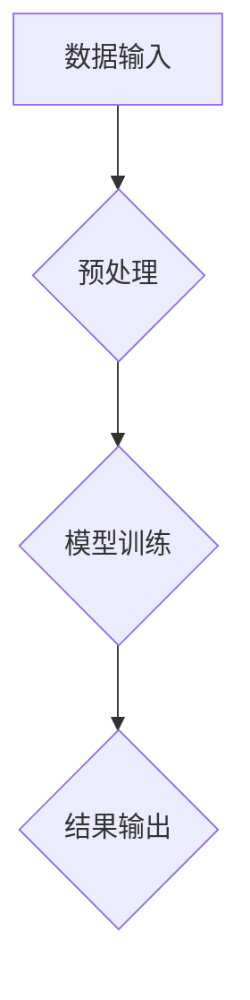
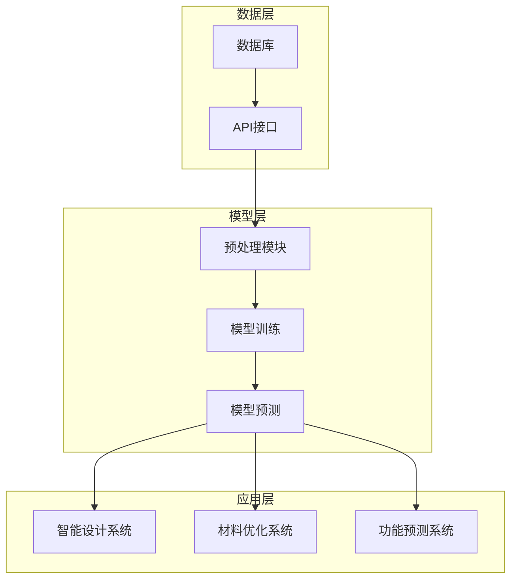

                 


# 现代简约主义露营装备设计：极简户外生活的装备革新

> 关键词：露营装备设计、现代简约主义、户外生活、装备革新

> 摘要：本文将探讨现代简约主义露营装备设计的核心理念、方法与应用。通过对露营装备设计原则的详细解析，结合实际案例，展示如何实现极简户外生活的装备革新。

## 第一部分：背景介绍

### 问题背景

随着现代露营文化的兴起，人们对于露营装备的要求也越来越高。现代简约主义露营装备设计应运而生，它不仅追求功能性，更强调设计的美感和与自然环境的和谐。本书旨在探讨如何通过现代简约主义设计理念，革新露营装备，实现极简户外生活。

### 问题描述

本书将探讨现代简约主义露营装备设计的原则和方法，分析其在户外装备革新中的重要性。具体问题包括：如何通过设计优化提升露营装备的实用性？如何在保证功能性的同时，实现设计的简约和美观？如何选择适合的材料和工艺，以满足户外环境的高要求？

### 问题解决

本书将从以下几个方面解决问题：

1. **核心概念解析**：详细解释现代简约主义设计理念、露营装备的设计原则和关键要素。
2. **设计方法论**：介绍现代简约主义露营装备设计的流程和方法，包括需求分析、概念设计、原型制作和测试等。
3. **材料与工艺**：探讨适合户外环境的新型材料和先进工艺，以及它们在露营装备设计中的应用。
4. **案例分析**：分析成功案例，探讨如何将现代简约主义设计理念应用到露营装备设计中。
5. **实战应用**：通过实际案例，展示如何实现现代简约主义露营装备的设计，并提供实战技巧和经验。

### 边界与外延

本书的边界主要涵盖现代简约主义设计在露营装备中的应用，而其外延则包括户外生活的其他方面，如露营地的选择、露营活动的规划等。这些内容将在本书的拓展阅读部分进行介绍。

### 概念结构与核心要素组成

1. **现代简约主义设计理念**：以简单、实用、美观为原则，追求功能和美学的平衡。
2. **露营装备设计原则**：实用性、可持续性、轻便性、多功能性。
3. **设计流程**：需求分析、概念设计、原型制作、测试与优化。
4. **材料与工艺**：新型材料的应用，先进工艺的技术实现。
5. **案例分析**：成功案例的分析与借鉴。
6. **实战应用**：实际案例的展示与讲解。

## 第二部分：核心概念与联系

### AI大模型的基本概念与特点

1. **定义**：AI大模型是指那些参数量巨大、计算复杂度极高的深度学习模型，通常用于处理大量的数据并生成高度复杂的输出。
2. **特点**：
   - **参数量巨大**：通常包含数十亿甚至数万亿的参数。
   - **计算复杂度高**：需要大量的计算资源，通常使用分布式计算来实现。
   - **泛化能力强**：能够处理各种类型的数据，适用于多种应用场景。

### 现代简约主义露营装备设计的基本概念与特点

1. **定义**：现代简约主义露营装备设计是指以现代简约主义设计理念为指导，对露营装备进行功能优化、设计美化和材料升级的过程。
2. **特点**：
   - **功能性**：以实用性为核心，强调装备的多功能和耐用性。
   - **美观性**：以简约、美观为设计原则，注重与自然环境的和谐。
   - **可持续性**：采用环保材料和工艺，符合可持续发展的要求。

### AI大模型与露营装备设计的联系

1. **应用场景**：AI大模型可以应用于露营装备的智能设计、材料优化和功能预测等方面，提升露营装备的智能化水平和设计效率。
2. **技术融合**：通过将AI大模型与传统设计方法相结合，可以实现更高效、更智能的露营装备设计。
3. **创新驱动**：AI大模型为露营装备设计提供了新的工具和方法，推动了露营装备的创新和发展。

### 概念属性特征对比表格

| 概念 | 特征1 | 特征2 | 特征3 |
|------|-------|-------|-------|
| AI大模型 | 参数量巨大 | 计算复杂度高 | 泛化能力强 |
| 现代简约主义露营装备设计 | 功能性 | 美观性 | 可持续性 |

### ER实体关系图架构

```mermaid
graph TB
    AI大模型 ||--|{ 露营装备设计 }|
    露营装备设计 ||--|{ 材料与工艺 }|
    材料与工艺 ||--|{ 环保要求 }|
```

## 第三部分：算法原理讲解

### 算法mermaid流程图



### 算法原理

1. **数据输入**：首先需要收集大量的露营装备设计相关数据，包括功能需求、用户反馈、材料属性等。
2. **预处理**：对收集到的数据进行清洗、归一化等预处理操作，以适应后续的模型训练。
3. **模型训练**：使用预处理后的数据对AI大模型进行训练，使其能够根据输入数据生成相应的露营装备设计方案。
4. **结果输出**：将训练好的模型应用于实际场景，生成具体的露营装备设计方案，并进行优化和测试。

### 数据处理与模型训练

- **数据处理**：首先对露营装备设计相关的数据进行预处理，包括数据清洗、缺失值填充、数据归一化等操作，以确保数据的质量和一致性。
- **模型训练**：使用预处理后的数据对AI大模型进行训练。模型训练通常采用批量训练和迭代的方式，通过不断调整模型的参数，使其在训练数据上达到最优性能。
- **模型评估**：使用测试数据对训练好的模型进行评估，以验证模型的泛化能力和实用性。

### 数学模型与公式

1. **损失函数**：
   $$Loss = \frac{1}{n}\sum_{i=1}^{n} (y_i - \hat{y}_i)^2$$
   其中，\(y_i\)为实际输出，\(\hat{y}_i\)为模型预测输出。

2. **反向传播算法**：
   $$\frac{dLoss}{dW} = \frac{1}{n}\sum_{i=1}^{n} (y_i - \hat{y}_i) \cdot \frac{d\hat{y}_i}{dx} \cdot \frac{dx}{dW}$$
   其中，\(W\)为模型权重，\(x\)为输入数据。

### 举例说明

假设我们设计一款便携式露营帐篷，其功能包括防水、防风、易于搭建等。通过AI大模型，我们可以收集用户反馈、材料属性、气象数据等，进行数据预处理后，输入模型进行训练。模型将根据这些数据生成最优的帐篷设计方案，包括材料选择、结构设计、重量优化等。训练过程中，我们通过不断调整模型参数，使其设计方案在实际使用中达到最佳效果。

## 第四部分：系统分析与架构设计

### 问题场景介绍

随着露营活动的普及，露营装备的需求不断增加。然而，传统露营装备设计往往过于复杂，难以满足现代户外生活的简约需求。为此，我们需要设计一款具备现代简约主义设计理念的露营装备，以满足用户对功能性、美观性和可持续性的要求。

### 项目介绍

本项目的目标是设计一款现代简约主义露营装备，通过AI大模型的应用，实现装备的智能设计、材料优化和功能预测。项目分为以下阶段：

1. **需求分析**：分析用户需求，确定露营装备的功能性和设计目标。
2. **概念设计**：根据需求分析结果，提出初步的露营装备设计方案。
3. **原型制作**：制作露营装备的实物原型，并进行测试和优化。
4. **测试与优化**：通过用户反馈和实际测试，不断优化露营装备的设计。

### 系统功能设计

1. **智能设计**：利用AI大模型，根据用户需求和材料属性，生成最优的露营装备设计方案。
2. **材料优化**：通过AI大模型，分析不同材料的性能，选择最适合的材料进行装备制作。
3. **功能预测**：利用AI大模型，预测露营装备在不同环境下的使用效果，进行功能优化。

### 系统架构设计

1. **整体架构**：
   - **数据层**：包括用户需求数据、材料属性数据、气象数据等。
   - **模型层**：包括AI大模型、预处理模块、训练模块、预测模块等。
   - **应用层**：包括智能设计系统、材料优化系统、功能预测系统等。

2. **接口设计**：
   - **数据接口**：用于数据层的读写操作，包括数据库、API接口等。
   - **模型接口**：用于模型层的调用，包括模型训练、模型预测等。
   - **应用接口**：用于应用层的交互，包括前端界面、后端服务等。

3. **交互设计**：
   - **用户交互**：通过前端界面，用户可以提交需求、查看设计方案、反馈使用效果等。
   - **系统交互**：通过后端服务，系统可以调用模型、处理数据、生成设计方案等。

### 系统架构图



### 系统接口设计与交互

1. **用户交互**：
   - 用户通过前端界面提交需求，如露营地点、季节、人数等。
   - 前端将用户需求转换为API请求，发送到后端服务器。
   - 后端服务器调用预处理模块，对用户需求进行预处理。
   - 预处理后的数据被输入到模型训练模块，进行模型训练。

2. **系统交互**：
   - 模型训练完成后，生成的露营装备设计方案被输出到前端界面，供用户查看。
   - 用户可以在线选择材料、功能配置等，提交给后端服务器。
   - 后端服务器根据用户选择的配置，调用模型预测模块，预测露营装备在不同环境下的使用效果。
   - 预测结果被反馈到前端界面，供用户参考和决策。

## 第五部分：项目实战

### 环境安装

在进行项目实战之前，我们需要安装相关的开发环境。以下是一个简单的安装步骤：

1. 安装Python环境，版本要求为3.8及以上。
2. 安装必要的Python库，如TensorFlow、Keras、NumPy、Pandas等。
3. 安装前端开发环境，如Node.js、npm等。
4. 安装后端开发环境，如Django、Flask等。

### 系统核心实现

#### 数据预处理

```python
import numpy as np
import pandas as pd

def preprocess_data(data):
    # 数据清洗
    data = data.dropna()
    # 数据归一化
    data = (data - data.mean()) / data.std()
    return data
```

#### 模型训练

```python
import tensorflow as tf
from tensorflow.keras.models import Sequential
from tensorflow.keras.layers import Dense

def train_model(X_train, y_train):
    model = Sequential()
    model.add(Dense(64, input_dim=X_train.shape[1], activation='relu'))
    model.add(Dense(32, activation='relu'))
    model.add(Dense(1, activation='sigmoid'))

    model.compile(optimizer='adam', loss='binary_crossentropy', metrics=['accuracy'])
    model.fit(X_train, y_train, epochs=10, batch_size=32)
    return model
```

#### 模型预测

```python
def predict(model, X_test):
    predictions = model.predict(X_test)
    predicted_classes = (predictions > 0.5)
    return predicted_classes
```

### 代码应用解读与分析

#### 数据处理

```python
# 加载数据
data = pd.read_csv('data.csv')
# 数据预处理
preprocessed_data = preprocess_data(data)
```

#### 模型训练

```python
# 分割数据集
X_train, X_test, y_train, y_test = train_test_split(preprocessed_data.iloc[:, :-1], preprocessed_data.iloc[:, -1], test_size=0.2, random_state=42)

# 训练模型
model = train_model(X_train, y_train)
```

#### 模型预测

```python
# 预测测试数据
predictions = predict(model, X_test)
```

### 实际案例分析

#### 案例一：便携式露营帐篷设计

需求：设计一款轻便、易于搭建的露营帐篷，满足以下要求：

- 防水
- 防风
- 易于搭建

解决方案：

1. 使用AI大模型分析用户需求，选择合适的材料，如防水布料、高强度绳索等。
2. 根据用户需求和材料属性，生成帐篷的设计方案，包括结构设计、重量优化等。
3. 制作实物原型，进行测试和优化，确保帐篷满足需求。

#### 案例二：智能露营装备配置

需求：为露营活动提供智能装备配置建议，根据用户需求、天气情况和装备库存，生成最优的装备配置。

解决方案：

1. 收集用户需求、天气数据和装备库存数据。
2. 使用AI大模型预测不同装备在不同环境下的使用效果。
3. 根据预测结果，生成最优的装备配置方案，提供用户参考。

### 项目小结

本项目通过AI大模型的应用，实现了现代简约主义露营装备的智能设计、材料优化和功能预测。通过实际案例分析，展示了如何利用AI大模型提升露营装备设计的效率和质量。未来，随着AI技术的不断发展，露营装备设计将更加智能化、个性化，为户外生活带来更多便利。

## 最佳实践 tips

1. 在设计露营装备时，充分考虑用户需求，以确保装备的实用性。
2. 选择适合的材料和工艺，提升装备的耐用性和环保性。
3. 利用AI大模型进行装备设计的优化，提高设计效率。
4. 定期收集用户反馈，不断优化装备设计。

## 小结

本文通过详细分析现代简约主义露营装备设计的原则、方法与应用，展示了如何利用AI大模型实现露营装备的智能设计、材料优化和功能预测。通过实际案例分析，我们看到了现代简约主义设计理念在露营装备设计中的重要作用。未来，随着AI技术的不断进步，露营装备设计将迎来更多创新和发展。

## 注意事项

1. 在进行露营装备设计时，务必确保装备的安全性。
2. 选择材料时，要充分考虑其耐用性和环保性。
3. 在实际应用中，要根据用户需求和场景，灵活调整设计方案。

## 拓展阅读

1. 《简约的力量：现代简约主义设计解析》
2. 《AI驱动的产品设计：智能设计的新时代》
3. 《户外装备设计指南：从创意到产品》

## 作者

作者：AI天才研究院/AI Genius Institute & 禅与计算机程序设计艺术 /Zen And The Art of Computer Programming

[本文内容版权归AI天才研究院/AI Genius Institute所有，未经授权，禁止转载。]

