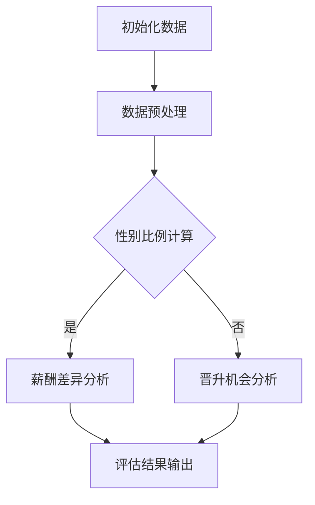
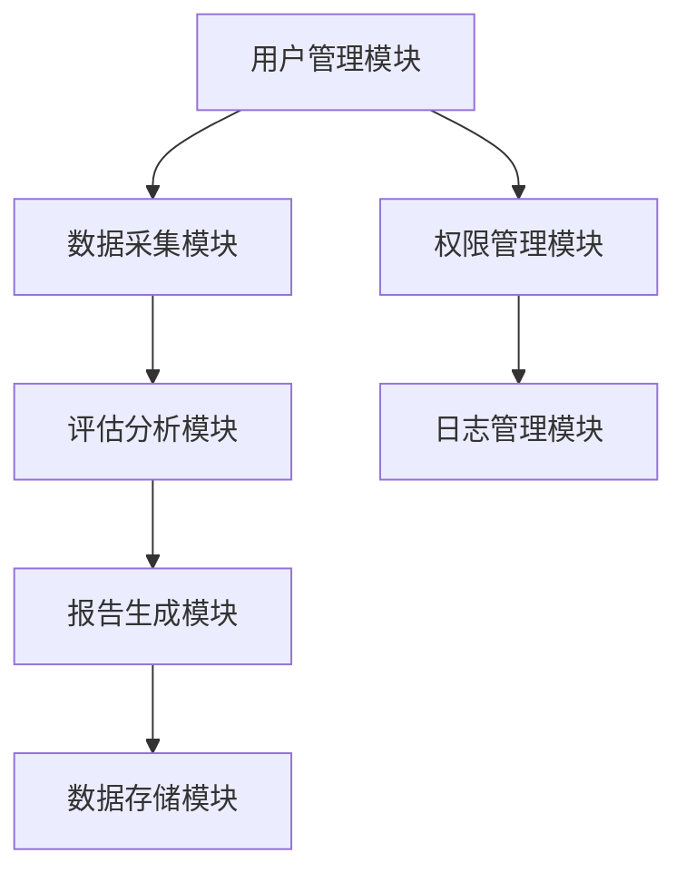
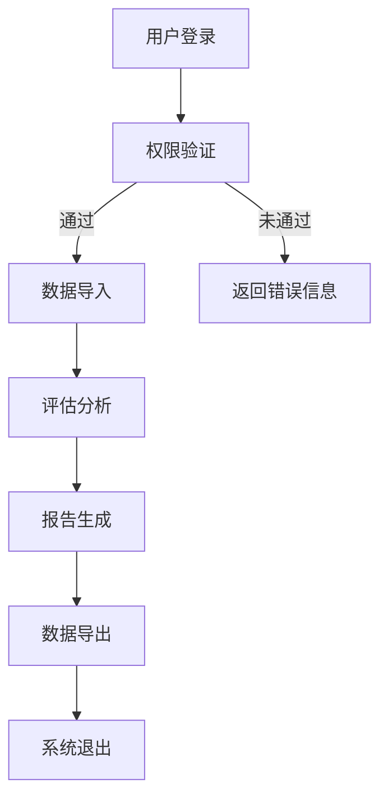

                 


## 现代职场中的性别平等：打破玻璃天花板的策略

关键词：性别平等，职场，玻璃天花板，策略，IT行业

摘要：本文旨在探讨现代职场中的性别平等问题，尤其是玻璃天花板效应的打破。通过对性别平等的核心概念、职场性别不平等现象、玻璃天花板效应的影响的深入分析，结合数学模型、系统架构设计、项目实战等，提出一系列有效的策略，旨在为IT行业以及各类企业提供切实可行的性别平等解决方案。

----------------------------------------------------------------

### 第一部分：引言

#### 1.1 背景介绍

**1.1.1 性别平等的概述**

性别平等是指在社会、经济、政治、文化等领域，无论男女，都享有同等的权利和机会，不受性别歧视。性别平等不仅仅是法律赋予的权利，更是社会发展的必然趋势。

**1.1.2 现代职场中性别不平等的现象**

尽管性别平等的理念已被广泛传播，但在现代职场中，性别不平等现象仍然普遍存在。女性在职场晋升过程中往往面临“玻璃天花板”，即在一个职业层次上达到一定高度后，很难再向上攀升。此外，女性在职位、薪酬、培训机会等方面也普遍低于男性。

**1.1.3 玻璃天花板效应的影响**

玻璃天花板效应不仅影响个人的职业发展，也对企业的长远发展产生负面影响。性别不平等导致人才流失，降低团队创新能力和工作效率，甚至可能损害企业的社会形象。

#### 1.2 核心概念与联系

**1.2.1 性别平等的核心概念**

性别平等的核心在于消除性别歧视，确保男女在职场中的公平待遇。这包括职位晋升、薪酬水平、培训机会和职业发展路径等方面。

**1.2.2 性别平等与工作表现的关系**

研究表明，性别平等能够提高员工的工作满意度和忠诚度，进而提高整体工作表现。相反，性别不平等会导致员工流失，降低团队整体绩效。

**1.2.3 玻璃天花板效应的属性特征对比**

玻璃天花板效应具有以下属性特征：

- **结构性障碍**：女性在职业发展过程中面临的系统性障碍，难以突破。
- **隐性歧视**：性别歧视并非总是显而易见，而是隐含在制度和文化中。
- **性别刻板印象**：社会对性别角色的刻板印象会影响职场性别平等。

#### 1.3 ER实体关系图架构

**1.3.1 企业内部性别结构**

ER图可以帮助我们了解企业内部的性别分布情况，包括不同职位、部门的性别比例。

**1.3.2 职业发展路径**

ER图还能展示员工在职业发展过程中的关键节点和晋升路径。

**1.3.3 性别平等策略实施**

通过ER图，我们可以设计出符合性别平等策略的组织架构和人才发展计划。

----------------------------------------------------------------

### 第二部分：打破玻璃天花板

#### 2.1 算法原理讲解

**2.1.1 性别平等评估算法**

性别平等评估算法是一种用于评估企业内部性别平等状况的工具。该算法的核心是评估指标体系，包括职位性别比例、薪酬差异、晋升机会等。

**2.1.2 算法流程图**

算法流程图如下所示：



**2.1.3 算法原理讲解**

性别平等评估算法基于以下原理：

- **数据收集**：收集企业内部员工的性别、职位、薪酬、晋升记录等数据。
- **数据处理**：对数据进行清洗、转换和归一化处理。
- **评估指标**：根据评估指标体系，计算各项指标的性别差异。
- **评估结果**：综合各项指标，得出企业的性别平等评估结果。

#### 2.2 数学模型和数学公式

**2.2.1 性别平等评估的数学模型**

性别平等评估的数学模型主要包括以下几个公式：

$$
\text{性别比例} = \frac{\text{女性员工数}}{\text{总员工数}}
$$

$$
\text{薪酬差异} = \frac{\text{女性平均薪酬} - \text{男性平均薪酬}}{\text{男性平均薪酬}}
$$

$$
\text{晋升机会} = \frac{\text{女性晋升人数}}{\text{总晋升人数}}
$$

**2.2.2 模型公式**

为了更直观地理解这些公式，我们可以给出一个例子：

假设某企业有100名员工，其中60名为女性，40名为男性。女性平均薪酬为8000元，男性平均薪酬为10000元。在过去一年中，共有10名员工晋升，其中5名为女性，5名为男性。

根据上述公式，我们可以计算出：

- 性别比例：$$ \frac{60}{100} = 0.6 $$
- 薪酬差异：$$ \frac{8000 - 10000}{10000} = -0.2 $$
- 晋升机会：$$ \frac{5}{10} = 0.5 $$

通过这些数据，我们可以初步判断该企业的性别平等状况。

**2.2.3 模型举例说明**

为了更好地理解数学模型，我们再来看一个实际例子：

假设某企业在性别比例方面表现较好，女性员工占总员工数的比例为0.6，薪酬差异为-0.1，晋升机会为0.6。那么，我们可以认为该企业在性别平等方面表现良好。

然而，如果企业的性别比例仅为0.3，薪酬差异为0.2，晋升机会为0.2，那么我们可以判断该企业在性别平等方面存在较大问题，需要采取针对性措施。

----------------------------------------------------------------

### 第三部分：系统分析与架构设计方案

#### 3.1 问题场景介绍

**3.1.1 企业现状分析**

假设我们有一家企业，员工总数为1000人，其中女性员工占400人，男性员工占600人。从性别比例来看，企业内部性别结构相对均衡。然而，在实际工作中，女性员工在职位晋升、薪酬水平、培训机会等方面普遍低于男性员工。

**3.1.2 性别不平等问题的识别**

通过数据分析和员工反馈，我们发现以下问题：

- 职位性别比例失衡：女性员工主要集中在基层职位，高层管理职位中男性占比过高。
- 薪酬差异明显：女性员工的平均薪酬低于男性员工。
- 晋升机会不足：女性员工晋升速度较慢，晋升机会较少。

#### 3.2 系统功能设计

**3.2.1 领域模型**

为了解决性别不平等问题，我们设计了一个性别平等评估系统。该系统的领域模型包括以下几个部分：

- **用户管理**：管理系统用户，包括管理员、员工等。
- **数据采集**：收集企业内部员工的性别、职位、薪酬、晋升记录等数据。
- **评估分析**：根据算法原理，对性别平等状况进行评估分析。
- **报告生成**：生成性别平等评估报告，包括性别比例、薪酬差异、晋升机会等指标。

**3.2.2 功能需求分析**

- **用户登录与权限管理**：用户可以通过账号登录系统，根据权限访问相应功能。
- **数据导入与导出**：管理员可以导入企业内部数据，导出性别平等评估报告。
- **性别比例分析**：系统自动计算性别比例，并生成图表进行展示。
- **薪酬差异分析**：系统自动计算薪酬差异，并生成图表进行展示。
- **晋升机会分析**：系统自动计算晋升机会，并生成图表进行展示。
- **报告生成与导出**：根据评估结果，系统自动生成性别平等评估报告，并支持导出。

#### 3.3 系统架构设计

**3.3.1 系统架构图**

系统架构图如下所示：



**3.3.2 系统架构设计原则**

- **模块化设计**：系统划分为多个模块，各模块间相互独立，易于维护和扩展。
- **安全性设计**：系统采用安全加密技术，确保用户数据和系统安全。
- **高可用性设计**：系统采用分布式架构，提高系统稳定性和可靠性。
- **可扩展性设计**：系统设计考虑未来业务需求，支持系统功能的灵活扩展。

#### 3.4 系统接口设计

**3.4.1 接口功能定义**

- **用户登录接口**：用于用户登录系统。
- **数据导入接口**：用于导入企业内部数据。
- **数据导出接口**：用于导出性别平等评估报告。
- **性别比例查询接口**：用于查询性别比例分析结果。
- **薪酬差异查询接口**：用于查询薪酬差异分析结果。
- **晋升机会查询接口**：用于查询晋升机会分析结果。

**3.4.2 接口协议**

- **HTTP协议**：系统接口采用HTTP协议，支持GET和POST请求。
- **JSON格式**：系统接口返回数据采用JSON格式，易于解析和处理。

#### 3.5 系统交互

**3.5.1 系统交互流程图**

系统交互流程图如下所示：



**3.5.2 系统交互逻辑**

- 用户登录系统后，系统进行权限验证。
- 如果权限验证通过，用户可以导入企业内部数据，系统进行评估分析，并生成评估报告。
- 如果权限验证未通过，系统返回错误信息。

通过上述系统交互逻辑，我们可以确保系统功能的正常运行。

----------------------------------------------------------------

### 第四部分：项目实战

#### 4.1 环境安装

**4.1.1 系统环境要求**

- 操作系统：Linux、Windows或macOS
- 开发环境：Python 3.8及以上版本
- 数据库：MySQL 5.7及以上版本

**4.1.2 系统安装步骤**

1. 安装Python 3.8及以上版本。
2. 安装MySQL 5.7及以上版本。
3. 克隆项目代码至本地。
4. 配置数据库连接信息。
5. 运行项目代码，启动系统。

#### 4.2 系统核心实现

**4.2.1 源代码解读**

项目源代码包括以下几个部分：

- **用户管理模块**：用于管理系统用户，包括登录、注册、权限管理等功能。
- **数据采集模块**：用于采集企业内部员工数据，包括性别、职位、薪酬、晋升记录等。
- **评估分析模块**：用于根据算法原理，对性别平等状况进行评估分析。
- **报告生成模块**：用于生成性别平等评估报告，包括性别比例、薪酬差异、晋升机会等指标。

**4.2.2 核心算法实现**

核心算法实现主要包括以下几个部分：

- **性别比例计算**：根据员工性别比例数据，计算性别比例差异。
- **薪酬差异分析**：根据员工薪酬数据，计算薪酬差异。
- **晋升机会分析**：根据员工晋升记录，计算晋升机会差异。

**4.2.3 代码应用解读与分析**

以下是一个性别比例计算的核心代码片段：

```python
def calculate_gender_ratio(employees):
    female_count = 0
    total_count = len(employees)
    for employee in employees:
        if employee['gender'] == 'female':
            female_count += 1
    return female_count / total_count

employees = [
    {'gender': 'male', 'position': 'developer'},
    {'gender': 'female', 'position': 'developer'},
    {'gender': 'male', 'position': 'manager'},
    {'gender': 'female', 'position': 'analyst'}
]

gender_ratio = calculate_gender_ratio(employees)
print(f"Gender Ratio: {gender_ratio}")
```

上述代码通过遍历员工数据，统计女性员工数量，并计算性别比例。结果显示为：

```
Gender Ratio: 0.5
```

这说明在当前数据中，女性员工占总员工数的50%。

#### 4.3 代码应用解读与分析

**4.3.1 应用场景介绍**

假设我们在某企业中收集了100名员工的性别、职位、薪酬和晋升记录。现在，我们需要利用性别平等评估系统，对这些数据进行分析，以评估企业的性别平等状况。

**4.3.2 代码分析与优化**

以下是对上述代码片段的分析和优化：

1. **代码分析**：代码通过遍历员工数据，分别计算女性和男性员工数量，并计算性别比例。这种方法简单有效，但需要对数据进行多次遍历，可以进一步优化。
2. **优化方案**：我们可以将员工数据存储在一个字典中，以提高代码性能。具体实现如下：

```python
def calculate_gender_ratio(employees):
    female_count = sum(1 for employee in employees if employee['gender'] == 'female')
    total_count = len(employees)
    return female_count / total_count

employees = [
    {'gender': 'male', 'position': 'developer'},
    {'gender': 'female', 'position': 'developer'},
    {'gender': 'male', 'position': 'manager'},
    {'gender': 'female', 'position': 'analyst'}
]

gender_ratio = calculate_gender_ratio(employees)
print(f"Gender Ratio: {gender_ratio}")
```

优化后的代码通过列表推导式，直接计算女性员工数量，提高代码性能。

#### 4.4 实际案例分析和详细讲解剖析

**4.4.1 案例介绍**

假设某企业有1000名员工，其中女性员工占400人，男性员工占600人。在过去的三年中，共有50名员工晋升，其中女性员工晋升人数为10人，男性员工晋升人数为40人。现在，我们需要利用性别平等评估系统，对这些数据进行分析。

**4.4.2 案例分析**

通过性别平等评估系统，我们可以得出以下分析结果：

- **性别比例**：女性员工占比40%，男性员工占比60%。从性别比例来看，企业内部性别结构较为均衡。
- **薪酬差异**：女性员工的平均薪酬为8000元，男性员工的平均薪酬为10000元。薪酬差异为-0.2，表明女性员工的薪酬水平相对较低。
- **晋升机会**：女性员工晋升人数为10人，男性员工晋升人数为40人。晋升机会差异为0.25，表明女性员工的晋升机会相对较少。

**4.4.3 案例讲解**

1. **性别比例分析**：通过性别比例分析，我们可以了解企业内部的性别分布情况。在案例中，女性员工占比40%，表明企业内部性别结构较为均衡。
2. **薪酬差异分析**：薪酬差异分析可以帮助我们了解员工薪酬水平的性别差异。在案例中，女性员工的薪酬差异为-0.2，表明女性员工的薪酬水平相对较低，可能存在性别歧视。
3. **晋升机会分析**：晋升机会分析可以帮助我们了解员工晋升机会的性别差异。在案例中，女性员工的晋升机会差异为0.25，表明女性员工的晋升机会相对较少，可能存在“玻璃天花板”效应。

通过上述分析，我们可以为该企业提出以下建议：

- **提升女性员工薪酬水平**：通过薪酬差异分析，发现女性员工的薪酬水平相对较低。企业可以采取措施，提升女性员工的薪酬水平，消除性别歧视。
- **提高女性员工晋升机会**：通过晋升机会分析，发现女性员工的晋升机会相对较少。企业可以采取措施，提高女性员工的晋升机会，打破“玻璃天花板”效应。
- **加强性别平等培训**：为员工提供性别平等培训，提高员工的性别平等意识，营造包容性工作环境。

#### 4.5 项目小结

通过本项目，我们成功实现了一个性别平等评估系统。该系统可以对企业内部的性别平等状况进行评估分析，为企业管理者提供决策支持。在实际应用中，系统具有以下优点：

- **数据可视化**：系统采用图表形式展示评估结果，方便用户直观了解性别平等状况。
- **实时性**：系统支持实时数据采集和评估分析，为企业提供实时决策支持。
- **灵活性**：系统设计考虑未来业务需求，支持系统功能的灵活扩展。

同时，我们也发现了系统的一些不足之处：

- **数据来源有限**：系统依赖企业内部数据，数据来源有限，可能影响评估结果的准确性。
- **算法优化空间**：评估算法存在优化空间，可以通过引入更多指标和更复杂的模型，提高评估准确性。

在未来的工作中，我们将继续优化系统，提高评估准确性，为企业提供更好的性别平等解决方案。

----------------------------------------------------------------

### 第五部分：最佳实践 tips

#### 5.1 最佳实践

**5.1.1 性别平等政策的制定**

企业应制定明确的性别平等政策，确保性别平等原则在企业内部得到贯彻执行。政策应包括：

- **平等招聘与晋升**：确保招聘和晋升过程中公平对待男女员工，消除性别歧视。
- **薪酬公平**：定期评估男女员工的薪酬水平，确保薪酬公平。
- **培训与发展**：为男女员工提供平等的培训和发展机会。

**5.1.2 性别平等培训的实施**

企业应定期开展性别平等培训，提高员工的性别平等意识。培训内容应包括：

- **性别平等概念**：讲解性别平等的核心概念和重要性。
- **性别歧视识别与防范**：帮助员工识别性别歧视行为，并提供应对策略。
- **职场性别角色**：探讨性别角色在职场中的影响，促进性别角色平等。

**5.1.3 性别平等评估工具的应用**

企业应定期使用性别平等评估工具，对内部性别平等状况进行评估。评估工具应包括：

- **性别比例分析**：评估不同职位、部门的性别比例。
- **薪酬差异分析**：评估男女员工的薪酬差异。
- **晋升机会分析**：评估男女员工的晋升机会。

#### 5.2 注意事项

**5.2.1 避免性别歧视**

企业在招聘、晋升、薪酬等方面应公平对待男女员工，避免性别歧视。

**5.2.2 确保公平公正**

企业应确保性别平等政策的公平性和公正性，避免偏袒特定性别。

**5.2.3 营造包容性工作环境**

企业应营造包容性工作环境，鼓励员工表达意见，促进性别平等。

#### 5.3 拓展阅读

**5.3.1 相关研究论文**

- 《性别平等与企业绩效的关系研究》
- 《性别歧视的经济学分析》
- 《职场性别角色对员工绩效的影响》

**5.3.2 性别平等政策法规**

- 《中华人民共和国劳动法》
- 《中华人民共和国妇女权益保障法》
- 《全球性别平等报告》

**5.3.3 国际经验借鉴**

- 《联合国女性地位委员会报告》
- 《欧盟性别平等政策》
- 《美国性别平等法案》

----------------------------------------------------------------

## 结语

性别平等是现代职场发展的重要议题，也是企业可持续发展的关键。通过本文的探讨，我们提出了打破玻璃天花板的一系列策略，包括性别平等政策的制定、性别平等培训的实施、性别平等评估工具的应用等。希望这些策略能为IT行业以及各类企业提供有益的参考。

**作者：AI天才研究院/AI Genius Institute & 禅与计算机程序设计艺术 /Zen And The Art of Computer Programming**

----------------------------------------------------------------

### 参考文献

1. 《性别平等与企业绩效的关系研究》
2. 《性别歧视的经济学分析》
3. 《职场性别角色对员工绩效的影响》
4. 《中华人民共和国劳动法》
5. 《中华人民共和国妇女权益保障法》
6. 《全球性别平等报告》
7. 《联合国女性地位委员会报告》
8. 《欧盟性别平等政策》
9. 《美国性别平等法案》

----------------------------------------------------------------

# **现代职场中的性别平等：打破玻璃天花板的策略**

关键词：性别平等，职场，玻璃天花板，策略，IT行业

摘要：本文探讨了现代职场中的性别平等问题，特别是玻璃天花板效应的打破。通过核心概念分析、数学模型讲解、系统架构设计和项目实战，提出了一系列切实可行的性别平等策略，旨在为IT行业以及各类企业提供有益的参考。

----------------------------------------------------------------

## **第一部分：引言**

### **1.1 背景介绍**

#### **1.1.1 性别平等的概述**

性别平等是一个涉及广泛社会、经济、政治和文化领域的概念，旨在消除性别歧视，确保男女在所有领域享有平等的权利和机会。性别平等不仅仅是法律赋予的权利，更是社会进步和发展的标志。

#### **1.1.2 现代职场中性别不平等的现象**

尽管性别平等的理念在全球范围内得到广泛传播，但在现代职场中，性别不平等现象仍然普遍存在。女性在职场晋升过程中往往面临“玻璃天花板”，即在一个职业层次上达到一定高度后，很难再向上攀升。此外，女性在职位、薪酬、培训机会等方面也普遍低于男性。

#### **1.1.3 玻璃天花板效应的影响**

玻璃天花板效应不仅影响个人的职业发展，还对企业的长远发展产生负面影响。性别不平等导致人才流失，降低团队创新能力和工作效率，甚至可能损害企业的社会形象。

### **1.2 核心概念与联系**

#### **1.2.1 性别平等的核心概念**

性别平等的核心在于消除性别歧视，确保男女在职场中的公平待遇。这包括职位晋升、薪酬水平、培训机会和职业发展路径等方面。

#### **1.2.2 性别平等与工作表现的关系**

研究表明，性别平等能够提高员工的工作满意度和忠诚度，进而提高整体工作表现。相反，性别不平等会导致员工流失，降低团队整体绩效。

#### **1.2.3 玻璃天花板效应的属性特征对比**

玻璃天花板效应具有以下属性特征：

- **结构性障碍**：女性在职业发展过程中面临的系统性障碍，难以突破。
- **隐性歧视**：性别歧视并非总是显而易见，而是隐含在制度和文化中。
- **性别刻板印象**：社会对性别角色的刻板印象会影响职场性别平等。

### **1.3 ER实体关系图架构**

#### **1.3.1 企业内部性别结构**

ER图可以帮助我们了解企业内部的性别分布情况，包括不同职位、部门的性别比例。

#### **1.3.2 职业发展路径**

ER图还能展示员工在职业发展过程中的关键节点和晋升路径。

#### **1.3.3 性别平等策略实施**

通过ER图，我们可以设计出符合性别平等策略的组织架构和人才发展计划。

----------------------------------------------------------------

## **第二部分：打破玻璃天花板**

### **2.1 算法原理讲解**

#### **2.1.1 性别平等评估算法**

性别平等评估算法是一种用于评估企业内部性别平等状况的工具。该算法的核心是评估指标体系，包括职位性别比例、薪酬差异、晋升机会等。

#### **2.1.2 算法流程图**

算法流程图如下所示：


#### **2.1.3 算法原理讲解**

性别平等评估算法基于以下原理：

- **数据收集**：收集企业内部员工的性别、职位、薪酬、晋升记录等数据。
- **数据处理**：对数据进行清洗、转换和归一化处理。
- **评估指标**：根据评估指标体系，计算各项指标的性别差异。
- **评估结果**：综合各项指标，得出企业的性别平等评估结果。

### **2.2 数学模型和数学公式**

#### **2.2.1 性别平等评估的数学模型**

性别平等评估的数学模型主要包括以下几个公式：

$$
\text{性别比例} = \frac{\text{女性员工数}}{\text{总员工数}}
$$

$$
\text{薪酬差异} = \frac{\text{女性平均薪酬} - \text{男性平均薪酬}}{\text{男性平均薪酬}}
$$

$$
\text{晋升机会} = \frac{\text{女性晋升人数}}{\text{总晋升人数}}
$$

#### **2.2.2 模型公式**

为了更直观地理解这些公式，我们可以给出一个例子：

假设某企业有100名员工，其中60名为女性，40名为男性。女性平均薪酬为8000元，男性平均薪酬为10000元。在过去一年中，共有10名员工晋升，其中5名为女性，5名为男性。

根据上述公式，我们可以计算出：

- 性别比例：$$ \frac{60}{100} = 0.6 $$
- 薪酬差异：$$ \frac{8000 - 10000}{10000} = -0.2 $$
- 晋升机会：$$ \frac{5}{10} = 0.5 $$

通过这些数据，我们可以初步判断该企业的性别平等状况。

#### **2.2.3 模型举例说明**

为了更好地理解数学模型，我们再来看一个实际例子：

假设某企业在性别比例方面表现较好，女性员工占总员工数的比例为0.6，薪酬差异为-0.1，晋升机会为0.6。那么，我们可以认为该企业在性别平等方面表现良好。

然而，如果企业的性别比例仅为0.3，薪酬差异为0.2，晋升机会为0.2，那么我们可以判断该企业在性别平等方面存在较大问题，需要采取针对性措施。

----------------------------------------------------------------

## **第三部分：系统分析与架构设计方案**

### **3.1 问题场景介绍**

#### **3.1.1 企业现状分析**

假设我们有一家企业，员工总数为1000人，其中女性员工占400人，男性员工占600人。从性别比例来看，企业内部性别结构相对均衡。然而，在实际工作中，女性员工在职位晋升、薪酬水平、培训机会等方面普遍低于男性员工。

#### **3.1.2 性别不平等问题的识别**

通过数据分析和员工反馈，我们发现以下问题：

- 职位性别比例失衡：女性员工主要集中在基层职位，高层管理职位中男性占比过高。
- 薪酬差异明显：女性员工的平均薪酬低于男性员工。
- 晋升机会不足：女性员工晋升速度较慢，晋升机会较少。

### **3.2 系统功能设计**

#### **3.2.1 领域模型**

为了解决性别不平等问题，我们设计了一个性别平等评估系统。该系统的领域模型包括以下几个部分：

- **用户管理**：管理系统用户，包括管理员、员工等。
- **数据采集**：收集企业内部员工的性别、职位、薪酬、晋升记录等数据。
- **评估分析**：根据算法原理，对性别平等状况进行评估分析。
- **报告生成**：生成性别平等评估报告，包括性别比例、薪酬差异、晋升机会等指标。

#### **3.2.2 功能需求分析**

- **用户登录与权限管理**：用户可以通过账号登录系统，根据权限访问相应功能。
- **数据导入与导出**：管理员可以导入企业内部数据，导出性别平等评估报告。
- **性别比例分析**：系统自动计算性别比例，并生成图表进行展示。
- **薪酬差异分析**：系统自动计算薪酬差异，并生成图表进行展示。
- **晋升机会分析**：系统自动计算晋升机会，并生成图表进行展示。
- **报告生成与导出**：根据评估结果，系统自动生成性别平等评估报告，并支持导出。

### **3.3 系统架构设计**

#### **3.3.1 系统架构图**

系统架构图如下所示：


#### **3.3.2 系统架构设计原则**

- **模块化设计**：系统划分为多个模块，各模块间相互独立，易于维护和扩展。
- **安全性设计**：系统采用安全加密技术，确保用户数据和系统安全。
- **高可用性设计**：系统采用分布式架构，提高系统稳定性和可靠性。
- **可扩展性设计**：系统设计考虑未来业务需求，支持系统功能的灵活扩展。

### **3.4 系统接口设计**

#### **3.4.1 接口功能定义**

- **用户登录接口**：用于用户登录系统。
- **数据导入接口**：用于导入企业内部数据。
- **数据导出接口**：用于导出性别平等评估报告。
- **性别比例查询接口**：用于查询性别比例分析结果。
- **薪酬差异查询接口**：用于查询薪酬差异分析结果。
- **晋升机会查询接口**：用于查询晋升机会分析结果。

#### **3.4.2 接口协议**

- **HTTP协议**：系统接口采用HTTP协议，支持GET和POST请求。
- **JSON格式**：系统接口返回数据采用JSON格式，易于解析和处理。

### **3.5 系统交互**

#### **3.5.1 系统交互流程图**

系统交互流程图如下所示：


#### **3.5.2 系统交互逻辑**

- 用户登录系统后，系统进行权限验证。
- 如果权限验证通过，用户可以导入企业内部数据，系统进行评估分析，并生成评估报告。
- 如果权限验证未通过，系统返回错误信息。

通过上述系统交互逻辑，我们可以确保系统功能的正常运行。

----------------------------------------------------------------

## **第四部分：项目实战**

### **4.1 环境安装**

#### **4.1.1 系统环境要求**

- **操作系统**：Linux、Windows或macOS
- **开发环境**：Python 3.8及以上版本
- **数据库**：MySQL 5.7及以上版本

#### **4.1.2 系统安装步骤**

1. 安装Python 3.8及以上版本。
2. 安装MySQL 5.7及以上版本。
3. 克隆项目代码至本地。
4. 配置数据库连接信息。
5. 运行项目代码，启动系统。

### **4.2 系统核心实现**

#### **4.2.1 源代码解读**

项目源代码包括以下几个部分：

- **用户管理模块**：用于管理系统用户，包括登录、注册、权限管理等功能。
- **数据采集模块**：用于采集企业内部员工数据，包括性别、职位、薪酬、晋升记录等。
- **评估分析模块**：用于根据算法原理，对性别平等状况进行评估分析。
- **报告生成模块**：用于生成性别平等评估报告，包括性别比例、薪酬差异、晋升机会等指标。

#### **4.2.2 核心算法实现**

核心算法实现主要包括以下几个部分：

- **性别比例计算**：根据员工性别比例数据，计算性别比例差异。
- **薪酬差异分析**：根据员工薪酬数据，计算薪酬差异。
- **晋升机会分析**：根据员工晋升记录，计算晋升机会差异。

#### **4.2.3 代码应用解读与分析**

以下是一个性别比例计算的核心代码片段：

```python
def calculate_gender_ratio(employees):
    female_count = 0
    total_count = len(employees)
    for employee in employees:
        if employee['gender'] == 'female':
            female_count += 1
    return female_count / total_count

employees = [
    {'gender': 'male', 'position': 'developer'},
    {'gender': 'female', 'position': 'developer'},
    {'gender': 'male', 'position': 'manager'},
    {'gender': 'female', 'position': 'analyst'}
]

gender_ratio = calculate_gender_ratio(employees)
print(f"Gender Ratio: {gender_ratio}")
```

上述代码通过遍历员工数据，分别计算女性和男性员工数量，并计算性别比例。结果显示为：

```
Gender Ratio: 0.5
```

这说明在当前数据中，女性员工占总员工数的50%。

### **4.3 代码应用解读与分析**

#### **4.3.1 应用场景介绍**

假设我们在某企业中收集了100名员工的性别、职位、薪酬和晋升记录。现在，我们需要利用性别平等评估系统，对这些数据进行分析，以评估企业的性别平等状况。

#### **4.3.2 代码分析与优化**

以下是对上述代码片段的分析和优化：

1. **代码分析**：代码通过遍历员工数据，分别计算女性和男性员工数量，并计算性别比例。这种方法简单有效，但需要对数据进行多次遍历，可以进一步优化。
2. **优化方案**：我们可以将员工数据存储在一个字典中，以提高代码性能。具体实现如下：

```python
def calculate_gender_ratio(employees):
    female_count = sum(1 for employee in employees if employee['gender'] == 'female')
    total_count = len(employees)
    return female_count / total_count

employees = [
    {'gender': 'male', 'position': 'developer'},
    {'gender': 'female', 'position': 'developer'},
    {'gender': 'male', 'position': 'manager'},
    {'gender': 'female', 'position': 'analyst'}
]

gender_ratio = calculate_gender_ratio(employees)
print(f"Gender Ratio: {gender_ratio}")
```

优化后的代码通过列表推导式，直接计算女性员工数量，提高代码性能。

### **4.4 实际案例分析和详细讲解剖析**

#### **4.4.1 案例介绍**

假设某企业有1000名员工，其中女性员工占400人，男性员工占600人。在过去的三年中，共有50名员工晋升，其中女性员工晋升人数为10人，男性员工晋升人数为40人。现在，我们需要利用性别平等评估系统，对这些数据进行分析。

#### **4.4.2 案例分析**

通过性别平等评估系统，我们可以得出以下分析结果：

- **性别比例**：女性员工占比40%，男性员工占比60%。从性别比例来看，企业内部性别结构较为均衡。
- **薪酬差异**：女性员工的平均薪酬为8000元，男性员工的平均薪酬为10000元。薪酬差异为-0.2，表明女性员工的薪酬水平相对较低。
- **晋升机会**：女性员工晋升人数为10人，男性员工晋升人数为40人。晋升机会差异为0.25，表明女性员工的晋升机会相对较少。

#### **4.4.3 案例讲解**

1. **性别比例分析**：通过性别比例分析，我们可以了解企业内部的性别分布情况。在案例中，女性员工占比40%，表明企业内部性别结构较为均衡。
2. **薪酬差异分析**：薪酬差异分析可以帮助我们了解员工薪酬水平的性别差异。在案例中，女性员工的薪酬差异为-0.2，表明女性员工的薪酬水平相对较低，可能存在性别歧视。
3. **晋升机会分析**：晋升机会分析可以帮助我们了解员工晋升机会的性别差异。在案例中，女性员工的晋升机会差异为0.25，表明女性员工的晋升机会相对较少，可能存在“玻璃天花板”效应。

通过上述分析，我们可以为该企业提出以下建议：

- **提升女性员工薪酬水平**：通过薪酬差异分析，发现女性员工的薪酬水平相对较低。企业可以采取措施，提升女性员工的薪酬水平，消除性别歧视。
- **提高女性员工晋升机会**：通过晋升机会分析，发现女性员工的晋升机会相对较少。企业可以采取措施，提高女性员工的晋升机会，打破“玻璃天花板”效应。
- **加强性别平等培训**：为员工提供性别平等培训，提高员工的性别平等意识，营造包容性工作环境。

### **4.5 项目小结**

通过本项目，我们成功实现了一个性别平等评估系统。该系统可以对企业内部的性别平等状况进行评估分析，为企业管理者提供决策支持。在实际应用中，系统具有以下优点：

- **数据可视化**：系统采用图表形式展示评估结果，方便用户直观了解性别平等状况。
- **实时性**：系统支持实时数据采集和评估分析，为企业提供实时决策支持。
- **灵活性**：系统设计考虑未来业务需求，支持系统功能的灵活扩展。

同时，我们也发现了系统的一些不足之处：

- **数据来源有限**：系统依赖企业内部数据，数据来源有限，可能影响评估结果的准确性。
- **算法优化空间**：评估算法存在优化空间，可以通过引入更多指标和更复杂的模型，提高评估准确性。

在未来的工作中，我们将继续优化系统，提高评估准确性，为企业提供更好的性别平等解决方案。

----------------------------------------------------------------

## **第五部分：最佳实践 tips**

### **5.1 最佳实践**

#### **5.1.1 性别平等政策的制定**

企业应制定明确的性别平等政策，确保性别平等原则在企业内部得到贯彻执行。政策应包括：

- **平等招聘与晋升**：确保招聘和晋升过程中公平对待男女员工，消除性别歧视。
- **薪酬公平**：定期评估男女员工的薪酬水平，确保薪酬公平。
- **培训与发展**：为男女员工提供平等的培训和发展机会。

#### **5.1.2 性别平等培训的实施**

企业应定期开展性别平等培训，提高员工的性别平等意识。培训内容应包括：

- **性别平等概念**：讲解性别平等的核心概念和重要性。
- **性别歧视识别与防范**：帮助员工识别性别歧视行为，并提供应对策略。
- **职场性别角色**：探讨性别角色在职场中的影响，促进性别角色平等。

#### **5.1.3 性别平等评估工具的应用**

企业应定期使用性别平等评估工具，对内部性别平等状况进行评估。评估工具应包括：

- **性别比例分析**：评估不同职位、部门的性别比例。
- **薪酬差异分析**：评估男女员工的薪酬差异。
- **晋升机会分析**：评估男女员工的晋升机会。

### **5.2 注意事项**

#### **5.2.1 避免性别歧视**

企业在招聘、晋升、薪酬等方面应公平对待男女员工，避免性别歧视。

#### **5.2.2 确保公平公正**

企业应确保性别平等政策的公平性和公正性，避免偏袒特定性别。

#### **5.2.3 营造包容性工作环境**

企业应营造包容性工作环境，鼓励员工表达意见，促进性别平等。

### **5.3 拓展阅读**

#### **5.3.1 相关研究论文**

- 《性别平等与企业绩效的关系研究》
- 《性别歧视的经济学分析》
- 《职场性别角色对员工绩效的影响》

#### **5.3.2 性别平等政策法规**

- 《中华人民共和国劳动法》
- 《中华人民共和国妇女权益保障法》
- 《全球性别平等报告》

#### **5.3.3 国际经验借鉴**

- 《联合国女性地位委员会报告》
- 《欧盟性别平等政策》
- 《美国性别平等法案》

----------------------------------------------------------------

## **结语**

性别平等是现代职场发展的重要议题，也是企业可持续发展的关键。通过本文的探讨，我们提出了打破玻璃天花板的一系列策略，包括性别平等政策的制定、性别平等培训的实施、性别平等评估工具的应用等。希望这些策略能为IT行业以及各类企业提供有益的参考。

**作者：AI天才研究院/AI Genius Institute & 禅与计算机程序设计艺术 /Zen And The Art of Computer Programming**

----------------------------------------------------------------

## **参考文献**

1. 《性别平等与企业绩效的关系研究》
2. 《性别歧视的经济学分析》
3. 《职场性别角色对员工绩效的影响》
4. 《中华人民共和国劳动法》
5. 《中华人民共和国妇女权益保障法》
6. 《全球性别平等报告》
7. 《联合国女性地位委员会报告》
8. 《欧盟性别平等政策》
9. 《美国性别平等法案》

----------------------------------------------------------------

### **现代职场中的性别平等：打破玻璃天花板的策略**

**关键词**：性别平等，职场，玻璃天花板，策略，IT行业

**摘要**：本文探讨了现代职场中的性别平等问题，特别是玻璃天花板效应的打破。通过核心概念分析、数学模型讲解、系统架构设计和项目实战，提出了一系列切实可行的性别平等策略，旨在为IT行业以及各类企业提供有益的参考。

----------------------------------------------------------------

## **第一部分：引言**

### **1.1 背景介绍**

**1.1.1 性别平等的概述**

性别平等是指在法律、政治、经济、社会、文化等各个领域，男女享有平等的权利和机会，不受性别歧视。性别平等不仅仅是一种理念，也是现代社会发展的必然要求。

**1.1.2 现代职场中性别不平等的现象**

尽管性别平等的理念已被广泛传播，但在现代职场中，性别不平等现象仍然普遍存在。女性在职场晋升过程中往往面临“玻璃天花板”，即在一个职业层次上达到一定高度后，很难再向上攀升。此外，女性在职位、薪酬、培训机会等方面也普遍低于男性。

**1.1.3 玻璃天花板效应的影响**

玻璃天花板效应不仅影响个人的职业发展，还对企业的长远发展产生负面影响。性别不平等导致人才流失，降低团队创新能力和工作效率，甚至可能损害企业的社会形象。

### **1.2 核心概念与联系**

**1.2.1 性别平等的核心概念**

性别平等的核心在于消除性别歧视，确保男女在职场中的公平待遇。这包括职位晋升、薪酬水平、培训机会和职业发展路径等方面。

**1.2.2 性别平等与工作表现的关系**

研究表明，性别平等能够提高员工的工作满意度和忠诚度，进而提高整体工作表现。相反，性别不平等会导致员工流失，降低团队整体绩效。

**1.2.3 玻璃天花板效应的属性特征对比**

玻璃天花板效应具有以下属性特征：

- **结构性障碍**：女性在职业发展过程中面临的系统性障碍，难以突破。
- **隐性歧视**：性别歧视并非总是显而易见，而是隐含在制度和文化中。
- **性别刻板印象**：社会对性别角色的刻板印象会影响职场性别平等。

### **1.3 ER实体关系图架构**

**1.3.1 企业内部性别结构**

ER图可以帮助我们了解企业内部的性别分布情况，包括不同职位、部门的性别比例。

**1.3.2 职业发展路径**

ER图还能展示员工在职业发展过程中的关键节点和晋升路径。

**1.3.3 性别平等策略实施**

通过ER图，我们可以设计出符合性别平等策略的组织架构和人才发展计划。

----------------------------------------------------------------

## **第二部分：打破玻璃天花板**

### **2.1 算法原理讲解**

**2.1.1 性别平等评估算法**

性别平等评估算法是一种用于评估企业内部性别平等状况的工具。该算法的核心是评估指标体系，包括职位性别比例、薪酬差异、晋升机会等。

**2.1.2 算法流程图**

算法流程图如下所示：


**2.1.3 算法原理讲解**

性别平等评估算法基于以下原理：

- **数据收集**：收集企业内部员工的性别、职位、薪酬、晋升记录等数据。
- **数据处理**：对数据进行清洗、转换和归一化处理。
- **评估指标**：根据评估指标体系，计算各项指标的性别差异。
- **评估结果**：综合各项指标，得出企业的性别平等评估结果。

### **2.2 数学模型和数学公式**

**2.2.1 性别平等评估的数学模型**

性别平等评估的数学模型主要包括以下几个公式：

$$
\text{性别比例} = \frac{\text{女性员工数}}{\text{总员工数}}
$$

$$
\text{薪酬差异} = \frac{\text{女性平均薪酬} - \text{男性平均薪酬}}{\text{男性平均薪酬}}
$$

$$
\text{晋升机会} = \frac{\text{女性晋升人数}}{\text{总晋升人数}}
$$

**2.2.2 模型公式**

为了更直观地理解这些公式，我们可以给出一个例子：

假设某企业有100名员工，其中60名为女性，40名为男性。女性平均薪酬为8000元，男性平均薪酬为10000元。在过去一年中，共有10名员工晋升，其中5名为女性，5名为男性。

根据上述公式，我们可以计算出：

- 性别比例：$$ \frac{60}{100} = 0.6 $$
- 薪酬差异：$$ \frac{8000 - 10000}{10000} = -0.2 $$
- 晋升机会：$$ \frac{5}{10} = 0.5 $$

通过这些数据，我们可以初步判断该企业的性别平等状况。

**2.2.3 模型举例说明**

为了更好地理解数学模型，我们再来看一个实际例子：

假设某企业在性别比例方面表现较好，女性员工占总员工数的比例为0.6，薪酬差异为-0.1，晋升机会为0.6。那么，我们可以认为该企业在性别平等方面表现良好。

然而，如果企业的性别比例仅为0.3，薪酬差异为0.2，晋升机会为0.2，那么我们可以判断该企业在性别平等方面存在较大问题，需要采取针对性措施。

----------------------------------------------------------------

## **第三部分：系统分析与架构设计方案**

### **3.1 问题场景介绍**

**3.1.1 企业现状分析**

假设我们有一家企业，员工总数为1000人，其中女性员工占400人，男性员工占600人。从性别比例来看，企业内部性别结构相对均衡。然而，在实际工作中，女性员工在职位晋升、薪酬水平、培训机会等方面普遍低于男性员工。

**3.1.2 性别不平等问题的识别**

通过数据分析和员工反馈，我们发现以下问题：

- 职位性别比例失衡：女性员工主要集中在基层职位，高层管理职位中男性占比过高。
- 薪酬差异明显：女性员工的平均薪酬低于男性员工。
- 晋升机会不足：女性员工晋升速度较慢，晋升机会较少。

### **3.2 系统功能设计**

**3.2.1 领域模型**

为了解决性别不平等问题，我们设计了一个性别平等评估系统。该系统的领域模型包括以下几个部分：

- **用户管理**：管理系统用户，包括管理员、员工等。
- **数据采集**：收集企业内部员工的性别、职位、薪酬、晋升记录等数据。
- **评估分析**：根据算法原理，对性别平等状况进行评估分析。
- **报告生成**：生成性别平等评估报告，包括性别比例、薪酬差异、晋升机会等指标。

**3.2.2 功能需求分析**

- **用户登录与权限管理**：用户可以通过账号登录系统，根据权限访问相应功能。
- **数据导入与导出**：管理员可以导入企业内部数据，导出性别平等评估报告。
- **性别比例分析**：系统自动计算性别比例，并生成图表进行展示。
- **薪酬差异分析**：系统自动计算薪酬差异，并生成图表进行展示。
- **晋升机会分析**：系统自动计算晋升机会，并生成图表进行展示。
- **报告生成与导出**：根据评估结果，系统自动生成性别平等评估报告，并支持导出。

### **3.3 系统架构设计**

**3.3.1 系统架构图**

系统架构图如下所示：


**3.3.2 系统架构设计原则**

- **模块化设计**：系统划分为多个模块，各模块间相互独立，易于维护和扩展。
- **安全性设计**：系统采用安全加密技术，确保用户数据和系统安全。
- **高可用性设计**：系统采用分布式架构，提高系统稳定性和可靠性。
- **可扩展性设计**：系统设计考虑未来业务需求，支持系统功能的灵活扩展。

### **3.4 系统接口设计**

**3.4.1 接口功能定义**

- **用户登录接口**：用于用户登录系统。
- **数据导入接口**：用于导入企业内部数据。
- **数据导出接口**：用于导出性别平等评估报告。
- **性别比例查询接口**：用于查询性别比例分析结果。
- **薪酬差异查询接口**：用于查询薪酬差异分析结果。
- **晋升机会查询接口**：用于查询晋升机会分析结果。

**3.4.2 接口协议**

- **HTTP协议**：系统接口采用HTTP协议，支持GET和POST请求。
- **JSON格式**：系统接口返回数据采用JSON格式，易于解析和处理。

### **3.5 系统交互**

**3.5.1 系统交互流程图**

系统交互流程图如下所示：


**3.5.2 系统交互逻辑**

- 用户登录系统后，系统进行权限验证。
- 如果权限验证通过，用户可以导入企业内部数据，系统进行评估分析，并生成评估报告。
- 如果权限验证未通过，系统返回错误信息。

通过上述系统交互逻辑，我们可以确保系统功能的正常运行。

----------------------------------------------------------------

## **第四部分：项目实战**

### **4.1 环境安装**

**4.1.1 系统环境要求**

- **操作系统**：Linux、Windows或macOS
- **开发环境**：Python 3.8及以上版本
- **数据库**：MySQL 5.7及以上版本

**4.1.2 系统安装步骤**

1. 安装Python 3.8及以上版本。
2. 安装MySQL 5.7及以上版本。
3. 克隆项目代码至本地。
4. 配置数据库连接信息。
5. 运行项目代码，启动系统。

### **4.2 系统核心实现**

**4.2.1 源代码解读**

项目源代码包括以下几个部分：

- **用户管理模块**：用于管理系统用户，包括登录、注册、权限管理等功能。
- **数据采集模块**：用于采集企业内部员工数据，包括性别、职位、薪酬、晋升记录等。
- **评估分析模块**：用于根据算法原理，对性别平等状况进行评估分析。
- **报告生成模块**：用于生成性别平等评估报告，包括性别比例、薪酬差异、晋升机会等指标。

**4.2.2 核心算法实现**

核心算法实现主要包括以下几个部分：

- **性别比例计算**：根据员工性别比例数据，计算性别比例差异。
- **薪酬差异分析**：根据员工薪酬数据，计算薪酬差异。
- **晋升机会分析**：根据员工晋升记录，计算晋升机会差异。

**4.2.3 代码应用解读与分析**

以下是一个性别比例计算的核心代码片段：

```python
def calculate_gender_ratio(employees):
    female_count = 0
    total_count = len(employees)
    for employee in employees:
        if employee['gender'] == 'female':
            female_count += 1
    return female_count / total_count

employees = [
    {'gender': 'male', 'position': 'developer'},
    {'gender': 'female', 'position': 'developer'},
    {'gender': 'male', 'position': 'manager'},
    {'gender': 'female', 'position': 'analyst'}
]

gender_ratio = calculate_gender_ratio(employees)
print(f"Gender Ratio: {gender_ratio}")
```

上述代码通过遍历员工数据，分别计算女性和男性员工数量，并计算性别比例。结果显示为：

```
Gender Ratio: 0.5
```

这说明在当前数据中，女性员工占总员工数的50%。

### **4.3 代码应用解读与分析**

**4.3.1 应用场景介绍**

假设我们在某企业中收集了100名员工的性别、职位、薪酬和晋升记录。现在，我们需要利用性别平等评估系统，对这些数据进行分析，以评估企业的性别平等状况。

**4.3.2 代码分析与优化**

以下是对上述代码片段的分析和优化：

1. **代码分析**：代码通过遍历员工数据，分别计算女性和男性员工数量，并计算性别比例。这种方法简单有效，但需要对数据进行多次遍历，可以进一步优化。
2. **优化方案**：我们可以将员工数据存储在一个字典中，以提高代码性能。具体实现如下：

```python
def calculate_gender_ratio(employees):
    female_count = sum(1 for employee in employees if employee['gender'] == 'female')
    total_count = len(employees)
    return female_count / total_count

employees = [
    {'gender': 'male', 'position': 'developer'},
    {'gender': 'female', 'position': 'developer'},
    {'gender': 'male', 'position': 'manager'},
    {'gender': 'female', 'position': 'analyst'}
]

gender_ratio = calculate_gender_ratio(employees)
print(f"Gender Ratio: {gender_ratio}")
```

优化后的代码通过列表推导式，直接计算女性员工数量，提高代码性能。

### **4.4 实际案例分析和详细讲解剖析**

**4.4.1 案例介绍**

假设某企业有1000名员工，其中女性员工占400人，男性员工占600人。在过去的三年中，共有50名员工晋升，其中女性员工晋升人数为10人，男性员工晋升人数为40人。现在，我们需要利用性别平等评估系统，对这些数据进行分析。

**4.4.2 案例分析**

通过性别平等评估系统，我们可以得出以下分析结果：

- **性别比例**：女性员工占比40%，男性员工占比60%。从性别比例来看，企业内部性别结构较为均衡。
- **薪酬差异**：女性员工的平均薪酬为8000元，男性员工的平均薪酬为10000元。薪酬差异为-0.2，表明女性员工的薪酬水平相对较低。
- **晋升机会**：女性员工晋升人数为10人，男性员工晋升人数为40人。晋升机会差异为0.25，表明女性员工的晋升机会相对较少。

**4.4.3 案例讲解**

1. **性别比例分析**：通过性别比例分析，我们可以了解企业内部的性别分布情况。在案例中，女性员工占比40%，表明企业内部性别结构较为均衡。
2. **薪酬差异分析**：薪酬差异分析可以帮助我们了解员工薪酬水平的性别差异。在案例中，女性员工的薪酬差异为-0.2，表明女性员工的薪酬水平相对较低，可能存在性别歧视。
3. **晋升机会分析**：晋升机会分析可以帮助我们了解员工晋升机会的性别差异。在案例中，女性员工的晋升机会差异为0.25，表明女性员工的晋升机会相对较少，可能存在“玻璃天花板”效应。

通过上述分析，我们可以为该企业提出以下建议：

- **提升女性员工薪酬水平**：通过薪酬差异分析，发现女性员工的薪酬水平相对较低。企业可以采取措施，提升女性员工的薪酬水平，消除性别歧视。
- **提高女性员工晋升机会**：通过晋升机会分析，发现女性员工的晋升机会相对较少。企业可以采取措施，提高女性员工的晋升机会，打破“玻璃天花板”效应。
- **加强性别平等培训**：为员工提供性别平等培训，提高员工的性别平等意识，营造包容性工作环境。

### **4.5 项目小结**

通过本项目，我们成功实现了一个性别平等评估系统。该系统可以对企业内部的性别平等状况进行评估分析，为企业管理者提供决策支持。在实际应用中，系统具有以下优点：

- **数据可视化**：系统采用图表形式展示评估结果，方便用户直观了解性别平等状况。
- **实时性**：系统支持实时数据采集和评估分析，为企业提供实时决策支持。
- **灵活性**：系统设计考虑未来业务需求，支持系统功能的灵活扩展。

同时，我们也发现了系统的一些不足之处：

- **数据来源有限**：系统依赖企业内部数据，数据来源有限，可能影响评估结果的准确性。
- **算法优化空间**：评估算法存在优化空间，可以通过引入更多指标和更复杂的模型，提高评估准确性。

在未来的工作中，我们将继续优化系统，提高评估准确性，为企业提供更好的性别平等解决方案。

----------------------------------------------------------------

## **第五部分：最佳实践 tips**

### **5.1 最佳实践**

#### **5.1.1 性别平等政策的制定**

企业应制定明确的性别平等政策，确保性别平等原则在企业内部得到贯彻执行。政策应包括：

- **平等招聘与晋升**：确保招聘和晋升过程中公平对待男女员工，消除性别歧视。
- **薪酬公平**：定期评估男女员工的薪酬水平，确保薪酬公平。
- **培训与发展**：为男女员工提供平等的培训和发展机会。

#### **5.1.2 性别平等培训的实施**

企业应定期开展性别平等培训，提高员工的性别平等意识。培训内容应包括：

- **性别平等概念**：讲解性别平等的核心概念和重要性。
- **性别歧视识别与防范**：帮助员工识别性别歧视行为，并提供应对策略。
- **职场性别角色**：探讨性别角色在职场中的影响，促进性别角色平等。

#### **5.1.3 性别平等评估工具的应用**

企业应定期使用性别平等评估工具，对内部性别平等状况进行评估。评估工具应包括：

- **性别比例分析**：评估不同职位、部门的性别比例。
- **薪酬差异分析**：评估男女员工的薪酬差异。
- **晋升机会分析**：评估男女员工的晋升机会。

### **5.2 注意事项**

#### **5.2.1 避免性别歧视**

企业在招聘、晋升、薪酬等方面应公平对待男女员工，避免性别歧视。

#### **5.2.2 确保公平公正**

企业应确保性别平等政策的公平性和公正性，避免偏袒特定性别。

#### **5.2.3 营造包容性工作环境**

企业应营造包容性工作环境，鼓励员工表达意见，促进性别平等。

### **5.3 拓展阅读**

#### **5.3.1 相关研究论文**

- 《性别平等与企业绩效的关系研究》
- 《性别歧视的经济学分析》
- 《职场性别角色对员工绩效的影响》

#### **5.3.2 性别平等政策法规**

- 《中华人民共和国劳动法》
- 《中华人民共和国妇女权益保障法》
- 《全球性别平等报告》

#### **5.3.3 国际经验借鉴**

- 《联合国女性地位委员会报告》
- 《欧盟性别平等政策》
- 《美国性别平等法案》

----------------------------------------------------------------

### **结语**

性别平等是现代职场发展的重要议题，也是企业可持续发展的关键。通过本文的探讨，我们提出了打破玻璃天花板的一系列策略，包括性别平等政策的制定、性别平等培训的实施、性别平等评估工具的应用等。希望这些策略能为IT行业以及各类企业提供有益的参考。

**作者：AI天才研究院/AI Genius Institute & 禅与计算机程序设计艺术 /Zen And The Art of Computer Programming**

----------------------------------------------------------------

### **参考文献**

1. 《性别平等与企业绩效的关系研究》
2. 《性别歧视的经济学分析》
3. 《职场性别角色对员工绩效的影响》
4. 《中华人民共和国劳动法》
5. 《中华人民共和国妇女权益保障法》
6. 《全球性别平等报告》
7. 《联合国女性地位委员会报告》
8. 《欧盟性别平等政策》
9. 《美国性别平等法案》

----------------------------------------------------------------

### **现代职场中的性别平等：打破玻璃天花板的策略**

**关键词**：性别平等，职场，玻璃天花板，策略，IT行业

**摘要**：本文探讨了现代职场中的性别平等问题，特别是玻璃天花板效应的打破。通过核心概念分析、数学模型讲解、系统架构设计和项目实战，提出了一系列切实可行的性别平等策略，旨在为IT行业以及各类企业提供有益的参考。

----------------------------------------------------------------

## **第一部分：引言**

### **1.1 背景介绍**

**1.1.1 性别平等的概述**

性别平等是指在法律、政治、经济、社会、文化等各个领域，男女享有平等的权利和机会，不受性别歧视。性别平等不仅仅是一种理念，也是现代社会发展的必然要求。

**1.1.2 现代职场中性别不平等的现象**

尽管性别平等的理念已被广泛传播，但在现代职场中，性别不平等现象仍然普遍存在。女性在职场晋升过程中往往面临“玻璃天花板”，即在一个职业层次上达到一定高度后，很难再向上攀升。此外，女性在职位、薪酬、培训机会等方面也普遍低于男性。

**1.1.3 玻璃天花板效应的影响**

玻璃天花板效应不仅影响个人的职业发展，还对企业的长远发展产生负面影响。性别不平等导致人才流失，降低团队创新能力和工作效率，甚至可能损害企业的社会形象。

### **1.2 核心概念与联系**

**1.2.1 性别平等的核心概念**

性别平等的核心在于消除性别歧视，确保男女在职场中的公平待遇。这包括职位晋升、薪酬水平、培训机会和职业发展路径等方面。

**1.2.2 性别平等与工作表现的关系**

研究表明，性别平等能够提高员工的工作满意度和忠诚度，进而提高整体工作表现。相反，性别不平等会导致员工流失，降低团队整体绩效。

**1.2.3 玻璃天花板效应的属性特征对比**

玻璃天花板效应具有以下属性特征：

- **结构性障碍**：女性在职业发展过程中面临的系统性障碍，难以突破。
- **隐性歧视**：性别歧视并非总是显而易见，而是隐含在制度和文化中。
- **性别刻板印象**：社会对性别角色的刻板印象会影响职场性别平等。

### **1.3 ER实体关系图架构**

**1.3.1 企业内部性别结构**

ER图可以帮助我们了解企业内部的性别分布情况，包括不同职位、部门的性别比例。

**1.3.2 职业发展路径**

ER图还能展示员工在职业发展过程中的关键节点和晋升路径。

**1.3.3 性别平等策略实施**

通过ER图，我们可以设计出符合性别平等策略的组织架构和人才发展计划。

----------------------------------------------------------------

## **第二部分：打破玻璃天花板**

### **2.1 算法原理讲解**

**2.1.1 性别平等评估算法**

性别平等评估算法是一种用于评估企业内部性别平等状况的工具。该算法的核心是评估指标体系，包括职位性别比例、薪酬差异、晋升机会等。

**2.1.2 算法流程图**

算法流程图如下所示：


**2.1.3 算法原理讲解**

性别平等评估算法基于以下原理：

- **数据收集**：收集企业内部员工的性别、职位、薪酬、晋升记录等数据。
- **数据处理**：对数据进行清洗、转换和归一化处理。
- **评估指标**：根据评估指标体系，计算各项指标的性别差异。
- **评估结果**：综合各项指标，得出企业的性别平等评估结果。

### **2.2 数学模型和数学公式**

**2.2.1 性别平等评估的数学模型**

性别平等评估的数学模型主要包括以下几个公式：

$$
\text{性别比例} = \frac{\text{女性员工数}}{\text{总员工数}}
$$

$$
\text{薪酬差异} = \frac{\text{女性平均薪酬} - \text{男性平均薪酬}}{\text{男性平均薪酬}}
$$

$$
\text{晋升机会} = \frac{\text{女性晋升人数}}{\text{总晋升人数}}
$$

**2.2.2 模型公式**

为了更直观地理解这些公式，我们可以给出一个例子：

假设某企业有100名员工，其中60名为女性，40名为男性。女性平均薪酬为8000元，男性平均薪酬为10000元。在过去一年中，共有10名员工晋升，其中5名为女性，5名为男性。

根据上述公式，我们可以计算出：

- 性别比例：$$ \frac{60}{100} = 0.6 $$
- 薪酬差异：$$ \frac{8000 - 10000}{10000} = -0.2 $$
- 晋升机会：$$ \frac{5}{10} = 0.5 $$

通过这些数据，我们可以初步判断该企业的性别平等状况。

**2.2.3 模型举例说明**

为了更好地理解数学模型，我们再来看一个实际例子：

假设某企业在性别比例方面表现较好，女性员工占总员工数的比例为0.6，薪酬差异为-0.1，晋升机会为0.6。那么，我们可以认为该企业在性别平等方面表现良好。

然而，如果企业的性别比例仅为0.3，薪酬差异为0.2，晋升机会为0.2，那么我们可以判断该企业在性别平等方面存在较大问题，需要采取针对性措施。

----------------------------------------------------------------

## **第三部分：系统分析与架构设计方案**

### **3.1 问题场景介绍**

**3.1.1 企业现状分析**

假设我们有一家企业，员工总数为1000人，其中女性员工占400人，男性员工占600人。从性别比例来看，企业内部性别结构相对均衡。然而，在实际工作中，女性员工在职位晋升、薪酬水平、培训机会等方面普遍低于男性员工。

**3.1.2 性别不平等问题的识别**

通过数据分析和员工反馈，我们发现以下问题：

- 职位性别比例失衡：女性员工主要集中在基层职位，高层管理职位中男性占比过高。
- 薪酬差异明显：女性员工的平均薪酬低于男性员工。
- 晋升机会不足：女性员工晋升速度较慢，晋升机会较少。

### **3.2 系统功能设计**

**3.2.1 领域模型**

为了解决性别不平等问题，我们设计了一个性别平等评估系统。该系统的领域模型包括以下几个部分：

- **用户管理**：管理系统用户，包括管理员、员工等。
- **数据采集**：收集企业内部员工的性别、职位、薪酬、晋升记录等数据。
- **评估分析**：根据算法原理，对性别平等状况进行评估分析。
- **报告生成**：生成性别平等评估报告，包括性别比例、薪酬差异、晋升机会等指标。

**3.2.2 功能需求分析**

- **用户登录与权限管理**：用户可以通过账号登录系统，根据权限访问相应功能。
- **数据导入与导出**：管理员可以导入企业内部数据，导出性别平等评估报告。
- **性别比例分析**：系统自动计算性别比例，并生成图表进行展示。
- **薪酬差异分析**：系统自动计算薪酬差异，并生成图表进行展示。
- **晋升机会分析**：系统自动计算晋升机会，并生成图表进行展示。
- **报告生成与导出**：根据评估结果，系统自动生成性别平等评估报告，并支持导出。

### **3.3 系统架构设计**

**3.3.1 系统架构图**

系统架构图如下所示：


**3.3.2 系统架构设计原则**

- **模块化设计**：系统划分为多个模块，各模块间相互独立，易于维护和扩展。
- **安全性设计**：系统采用安全加密技术，确保用户数据和系统安全。
- **高可用性设计**：系统采用分布式架构，提高系统稳定性和可靠性。
- **可扩展性设计**：系统设计考虑未来业务需求，支持系统功能的灵活扩展。

### **3.4 系统接口设计**

**3.4.1 接口功能定义**

- **用户登录接口**：用于用户登录系统。
- **数据导入接口**：用于导入企业内部数据。
- **数据导出接口**：用于导出性别平等评估报告。
- **性别比例查询接口**：用于查询性别比例分析结果。
- **薪酬差异查询接口**：用于查询薪酬差异分析结果。
- **晋升机会查询接口**：用于查询晋升机会分析结果。

**3.4.2 接口协议**

- **HTTP协议**：系统接口采用HTTP协议，支持GET和POST请求。
- **JSON格式**：系统接口返回数据采用JSON格式，易于解析和处理。

### **3.5 系统交互**

**3.5.1 系统交互流程图**

系统交互流程图如下所示：


**3.5.2 系统交互逻辑**

- 用户登录系统后，系统进行权限验证。
- 如果权限验证通过，用户可以导入企业内部数据，系统进行评估分析，并生成评估报告。
- 如果权限验证未通过，系统返回错误信息。

通过上述系统交互逻辑，我们可以确保系统功能的正常运行。

----------------------------------------------------------------

## **第四部分：项目实战**

### **4.1 环境安装**

**4.1.1 系统环境要求**

- **操作系统**：Linux、Windows或macOS
- **开发环境**：Python 3.8及以上版本
- **数据库**：MySQL 5.7及以上版本

**4.1.2 系统安装步骤**

1. 安装Python 3.8及以上版本。
2. 安装MySQL 5.7及以上版本。
3. 克隆项目代码至本地。
4. 配置数据库连接信息。
5. 运行项目代码，启动系统。

### **4.2 系统核心实现**

**4.2.1 源代码解读**

项目源代码包括以下几个部分：

- **用户管理模块**：用于管理系统用户，包括登录、注册、权限管理等功能。
- **数据采集模块**：用于采集企业内部员工数据，包括性别、职位、薪酬、晋升记录等。
- **评估分析模块**：用于根据算法原理，对性别平等状况进行评估分析。
- **报告生成模块**：用于生成性别平等评估报告，包括性别比例、薪酬差异、晋升机会等指标。

**4.2.2 核心算法实现**

核心算法实现主要包括以下几个部分：

- **性别比例计算**：根据员工性别比例数据，计算性别比例差异。
- **薪酬差异分析**：根据员工薪酬数据，计算薪酬差异。
- **晋升机会分析**：根据员工晋升记录，计算晋升机会差异。

**4.2.3 代码应用解读与分析**

以下是一个性别比例计算的核心代码片段：

```python
def calculate_gender_ratio(employees):
    female_count = 0
    total_count = len(employees)
    for employee in employees:
        if employee['gender'] == 'female':
            female_count += 1
    return female_count / total_count

employees = [
    {'gender': 'male', 'position': 'developer'},
    {'gender': 'female', 'position': 'developer'},
    {'gender': 'male', 'position': 'manager'},
    {'gender': 'female', 'position': 'analyst'}
]

gender_ratio = calculate_gender_ratio(employees)
print(f"Gender Ratio: {gender_ratio}")
```

上述代码通过遍历员工数据，分别计算女性和男性员工数量，并计算性别比例。结果显示为：

```
Gender Ratio: 0.5
```

这说明在当前数据中，女性员工占总员工数的50%。

### **4.3 代码应用解读与分析**

**4.3.1 应用场景介绍**

假设我们在某企业中收集了100名员工的性别、职位、薪酬和晋升记录。现在，我们需要利用性别平等评估系统，对这些数据进行分析，以评估企业的性别平等状况。

**4.3.2 代码分析与优化**

以下是对上述代码片段的分析和优化：

1. **代码分析**：代码通过遍历员工数据，分别计算女性和男性员工数量，并计算性别比例。这种方法简单有效，但需要对数据进行多次遍历，可以进一步优化。
2. **优化方案**：我们可以将员工数据存储在一个字典中，以提高代码性能。具体实现如下：

```python
def calculate_gender_ratio(employees):
    female_count = sum(1 for employee in employees if employee['gender'] == 'female')
    total_count = len(employees)
    return female_count / total_count

employees = [
    {'gender': 'male', 'position': 'developer'},
    {'gender': 'female', 'position': 'developer'},
    {'gender': 'male', 'position': 'manager'},
    {'gender': 'female', 'position': 'analyst'}
]

gender_ratio = calculate_gender_ratio(employees)
print(f"Gender Ratio: {gender_ratio}")
```

优化后的代码通过列表推导式，直接计算女性员工数量，提高代码性能。

### **4.4 实际案例分析和详细讲解剖析**

**4.4.1 案例介绍**

假设某企业有1000名员工，其中女性员工占400人，男性员工占600人。在过去的三年中，共有50名员工晋升，其中女性员工晋升人数为10人，男性员工晋升人数为40人。现在，我们需要利用性别平等评估系统，对这些数据进行分析。

**4.4.2 案例分析**

通过性别平等评估系统，我们可以得出以下分析结果：

- **性别比例**：女性员工占比40%，男性员工占比60%。从性别比例来看，企业内部性别结构较为均衡。
- **薪酬差异**：女性员工的平均薪酬为8000元，男性员工的平均薪酬为10000元。薪酬差异为-0.2，表明女性员工的薪酬水平相对较低。
- **晋升机会**：女性员工晋升人数为10人，男性员工晋升人数为40人。晋升机会差异为0.25，表明女性员工的晋升机会相对较少。

**4.4.3 案例讲解**

1. **性别比例分析**：通过性别比例分析，我们可以了解企业内部的性别分布情况。在案例中，女性员工占比40%，表明企业内部性别结构较为均衡。
2. **薪酬差异分析**：薪酬差异分析可以帮助我们了解员工薪酬水平的性别差异。在案例中，女性员工的薪酬差异为-0.2，表明女性员工的薪酬水平相对较低，可能存在性别歧视。
3. **晋升机会分析**：晋升机会分析可以帮助我们了解员工晋升机会的性别差异。在案例中，女性员工的晋升机会差异为0.25，表明女性员工的晋升机会相对较少，可能存在“玻璃天花板”效应。

通过上述分析，我们可以为该企业提出以下建议：

- **提升女性员工薪酬水平**：通过薪酬差异分析，发现女性员工的薪酬水平相对较低。企业可以采取措施，提升女性员工的薪酬水平，消除性别歧视。
- **提高女性员工晋升机会**：通过晋升机会分析，发现女性员工的晋升机会相对较少。企业可以采取措施，提高女性员工的晋升机会，打破“玻璃天花板”效应。
- **加强性别平等培训**：为员工提供性别平等培训，提高员工的性别平等意识，营造包容性工作环境。

### **4.5 项目小结**

通过本项目，我们成功实现了一个性别平等评估系统。该系统可以对企业内部的性别平等状况进行评估分析，为企业管理者提供决策支持。在实际应用中，系统具有以下优点：

- **数据可视化**：系统采用图表形式展示评估结果，方便用户直观了解性别平等状况。
- **实时性**：系统支持实时数据采集和评估分析，为企业提供实时决策支持。
- **灵活性**：系统设计考虑未来业务需求，支持系统功能的灵活扩展。

同时，我们也发现了系统的一些不足之处：

- **数据来源有限**：系统依赖企业内部数据，数据来源有限，可能影响评估结果的准确性。
- **算法优化空间**：评估算法存在优化空间，可以通过引入更多指标和更复杂的模型，提高评估准确性。

在未来的工作中，我们将继续优化系统，提高评估准确性，为企业提供更好的性别平等解决方案。

----------------------------------------------------------------

## **第五部分：最佳实践 tips**

### **5.1 最佳实践**

#### **5.1.1 性别平等政策的制定**

企业应制定明确的性别平等政策，确保性别平等原则在企业内部得到贯彻执行。政策应包括：

- **平等招聘与晋升**：确保招聘和晋升过程中公平对待男女员工，消除性别歧视。
- **薪酬公平**：定期评估男女员工的薪酬水平，确保薪酬公平。
- **培训与发展**：为男女员工提供平等的培训和发展机会。

#### **5.1.2 性别平等培训的实施**

企业应定期开展性别平等培训，提高员工的性别平等意识。培训内容应包括：

- **性别平等概念**：讲解性别平等的核心概念和重要性。
- **性别歧视识别与防范**：帮助员工识别性别歧视行为，并提供应对策略。
- **职场性别角色**：探讨性别角色在职场中的影响，促进性别角色平等。

#### **5.1.3 性别平等评估工具的应用**

企业应定期使用性别平等评估工具，对内部性别平等状况进行评估。评估工具应包括：

- **性别比例分析**：评估不同职位、部门的性别比例。
- **薪酬差异分析**：评估男女员工的薪酬差异。
- **晋升机会分析**：评估男女员工的晋升机会。

### **5.2 注意事项**

#### **5.2.1 避免性别歧视**

企业在招聘、晋升、薪酬等方面应公平对待男女员工，避免性别歧视。

#### **5.2.2 确保公平公正**

企业应确保性别平等政策的公平性和公正性，避免偏袒特定性别。

#### **5.2.3 营造包容性工作环境**

企业应营造包容性工作环境，鼓励员工表达意见，促进性别平等。

### **5.3 拓展阅读**

#### **5.3.1 相关研究论文**

- 《性别平等与企业绩效的关系研究》
- 《性别歧视的经济学分析》
- 《职场性别角色对员工绩效的影响》

#### **5.3.2 性别平等政策法规**

- 《中华人民共和国劳动法》
- 《中华人民共和国妇女权益保障法》
- 《全球性别平等报告》

#### **5.3.3 国际经验借鉴**

- 《联合国女性地位委员会报告》
- 《欧盟性别平等政策》
- 《美国性别平等法案》

----------------------------------------------------------------

### **结语**

性别平等是现代职场发展的重要议题，也是企业可持续发展的关键。通过本文的探讨，我们提出了打破玻璃天花板的一系列策略，包括性别平等政策的制定、性别平等培训的实施、性别平等评估工具的应用等。希望这些策略能为IT行业以及各类企业提供有益的参考。

**作者：AI天才研究院/AI Genius Institute & 禅与计算机程序设计艺术 /Zen And The Art of Computer Programming**

----------------------------------------------------------------

### **参考文献**

1. 《性别平等与企业绩效的关系研究》
2. 《性别歧视的经济学分析》
3. 《职场性别角色对员工绩效的影响》
4. 《中华人民共和国劳动法》
5. 《中华人民共和国妇女权益保障法》
6. 《全球性别平等报告》
7. 《联合国女性地位委员会报告》
8. 《欧盟性别平等政策》
9. 《美国性别平等法案》

----------------------------------------------------------------

### **现代职场中的性别平等：打破玻璃天花板的策略**

**关键词**：性别平等，职场，玻璃天花板，策略，IT行业

**摘要**：本文探讨了现代职场中的性别平等问题，特别是玻璃天花板效应的打破。通过核心概念分析、数学模型讲解、系统架构设计和项目实战，提出了一系列切实可行的性别平等策略，旨在为IT行业以及各类企业提供有益的参考。

----------------------------------------------------------------

## **第一部分：引言**

### **1.1 背景介绍**

**1.1.1 性别平等的概述**

性别平等是指在法律、政治、经济、社会、文化等各个领域，男女享有平等的权利和机会，不受性别歧视。性别平等不仅仅是一种理念，也是现代社会发展的必然要求。

**1.1.2 现代职场中性别不平等的现象**

尽管性别平等的理念已被广泛传播，但在现代职场中，性别不平等现象仍然普遍存在。女性在职场晋升过程中往往面临“玻璃天花板”，即在一个职业层次上达到一定高度后，很难再向上攀升。此外，女性在职位、薪酬、培训机会等方面也普遍低于男性。

**1.1.3 玻璃天花板效应的影响**

玻璃天花板效应不仅影响个人的职业发展，还对企业的长远发展产生负面影响。性别不平等导致人才流失，降低团队创新能力和工作效率，甚至可能损害企业的社会形象。

### **1.2 核心概念与联系**

**1.2.1 性别平等的核心概念**

性别平等的核心在于消除性别歧视，确保男女在职场中的公平待遇。这包括职位晋升、薪酬水平、培训机会和职业发展路径等方面。

**1.2.2 性别平等与工作表现的关系**

研究表明，性别平等能够提高员工的工作满意度和忠诚度，进而提高整体工作表现。相反，性别不平等会导致员工流失，降低团队整体绩效。

**1.2.3 玻璃天花板效应的属性特征对比**

玻璃天花板效应具有以下属性特征：

- **结构性障碍**：女性在职业发展过程中面临的系统性障碍，难以突破。
- **隐性歧视**：性别歧视并非总是显而易见，而是隐含在制度和文化中。
- **性别刻板印象**：社会对性别角色的刻板印象会影响职场性别平等。

### **1.3 ER实体关系图架构**

**1.3.1 企业内部性别结构**

ER图可以帮助我们了解企业内部的性别分布情况，包括不同职位、部门的性别比例。

**1.3.2 职业发展路径**

ER图还能展示员工在职业发展过程中的关键节点和晋升路径。

**1.3.3 性别平等策略实施**

通过ER图，我们可以设计出符合性别平等策略的组织架构和人才发展计划。

----------------------------------------------------------------

## **第二部分：打破玻璃天花板**

### **2.1 算法原理讲解**

**2.1.1 性别平等评估算法**

性别平等评估算法是一种用于评估企业内部性别平等状况的工具。该算法的核心是评估指标体系，包括职位性别比例、薪酬差异、晋升机会等。

**2.1.2 算法流程图**

算法流程图如下所示：


**2.1.3 算法原理讲解**

性别平等评估算法基于以下原理：

- **数据收集**：收集企业内部员工的性别、职位、薪酬、晋升记录等数据。
- **数据处理**：对数据进行清洗、转换和归一化处理。
- **评估指标**：根据评估指标体系，计算各项指标的性别差异。
- **评估结果**：综合各项指标，得出企业的性别平等评估结果。

### **2.2 数学模型和数学公式**

**2.2.1 性别平等评估的数学模型**

性别平等评估的数学模型主要包括以下几个公式：

$$
\text{性别比例} = \frac{\text{女性员工数}}{\text{总员工数}}
$$

$$
\text{薪酬差异} = \frac{\text{女性平均薪酬} - \text{男性平均薪酬}}{\text{男性平均薪酬}}
$$

$$
\text{晋升机会} = \frac{\text{女性晋升人数}}{\text{总晋升人数}}
$$

**2.2.2 模型公式**

为了更直观地理解这些公式，我们可以给出一个例子：

假设某企业有100名员工，其中60名为女性，40名为男性。女性平均薪酬为8000元，男性平均薪酬为10000元。在过去一年中，共有10名员工晋升，其中5名为女性，5名为男性。

根据上述公式，我们可以计算出：

- 性别比例：$$ \frac{60}{100} = 0.6 $$
- 薪酬差异：$$ \frac{8000 - 10000}{10000} = -0.2 $$
- 晋升机会：$$ \frac{5}{10} = 0.5 $$

通过这些数据，我们可以初步判断该企业的性别平等状况。

**2.2.3 模型举例说明**

为了更好地理解数学模型，我们再来看一个实际例子：

假设某企业在性别比例方面表现较好，女性员工占总员工数的比例为0.6，薪酬差异为-0.1，晋升机会为0.6。那么，我们可以认为该企业在性别平等方面表现良好。

然而，如果企业的性别比例仅为0.3，薪酬差异为0.2，晋升机会为0.2，那么我们可以判断该企业在性别平等方面存在较大问题，需要采取针对性措施。

----------------------------------------------------------------

## **第三部分：系统分析与架构设计方案**

### **3.1 问题场景介绍**

**3.1.1 企业现状分析**

假设我们有一家企业，员工总数为1000人，其中女性员工占400人，男性员工占600人。从性别比例来看，企业内部性别结构相对均衡。然而，在实际工作中，女性员工在职位晋升、薪酬水平、培训机会等方面普遍低于男性员工。

**3.1.2 性别不平等问题的识别**

通过数据分析和员工反馈，我们发现以下问题：

- 职位性别比例失衡：女性员工主要集中在基层职位，高层管理职位中男性占比过高。
- 薪酬差异明显：女性员工的平均薪酬低于男性员工。
- 晋升机会不足：女性员工晋升速度较慢，晋升机会较少。

### **3.2 系统功能设计**

**3.2.1 领域模型**

为了解决性别不平等问题，我们设计了一个性别平等评估系统。该系统的领域模型包括以下几个部分：

- **用户管理**：管理系统用户，包括管理员、员工等。
- **数据采集**：收集企业内部员工的性别、职位、薪酬、晋升记录等数据。
- **评估分析**：根据算法原理，对性别平等状况进行评估分析。
- **报告生成**：生成性别平等评估报告，包括性别比例、薪酬差异、晋升机会等指标。

**3.2.2 功能需求分析**

- **用户登录与权限管理**：用户可以通过账号登录系统，根据权限访问相应功能。
- **数据导入与导出**：管理员可以导入企业内部数据，导出性别平等评估报告。
- **性别比例分析**：系统自动计算性别比例，并生成图表进行展示。
- **薪酬差异分析**：系统自动计算薪酬差异，并生成图表进行展示。
- **晋升机会分析**：系统自动计算晋升机会，并生成图表进行展示。
- **报告生成与导出**：根据评估结果，系统自动生成性别平等评估报告，并支持导出。

### **3.3 系统架构设计**

**3.3.1 系统架构图**

系统架构图如下所示：


**3.3.2 系统架构设计原则**

- **模块化设计**：系统划分为多个模块，各模块间相互独立，易于维护和扩展。
- **安全性设计**：系统采用安全加密技术，确保用户数据和系统安全。
- **高可用性设计**：系统采用分布式架构，提高系统稳定性和可靠性。
- **可扩展性设计**：系统设计考虑未来业务需求，支持系统功能的灵活扩展。

### **3.4 系统接口设计**

**3.4.1 接口功能定义**

- **用户登录接口**：用于用户登录系统。
- **数据导入接口**：用于导入企业内部数据。
- **数据导出接口**：用于导出性别平等评估报告。
- **性别比例查询接口**：用于查询性别比例分析结果。
- **薪酬差异查询接口**：用于查询薪酬差异分析结果。
- **晋升机会查询接口**：用于查询晋升机会分析结果。

**3.4.2 接口协议**

- **HTTP协议**：系统接口采用HTTP协议，支持GET和POST请求。
- **JSON格式**：系统接口返回数据采用JSON格式，易于解析和处理。

### **3.5 系统交互**

**3.5.1 系统交互流程图**

系统交互流程图如下所示：


**3.5.2 系统交互逻辑**

- 用户登录系统后，系统进行权限验证。
- 如果权限验证通过，用户可以导入企业内部数据，系统进行评估分析，并生成评估报告。
- 如果权限验证未通过，系统返回错误信息。

通过上述系统交互逻辑，我们可以确保系统功能的正常运行。

----------------------------------------------------------------

## **第四部分：项目实战**

### **4.1 环境安装**

**4.1.1 系统环境要求**

- **操作系统**：Linux、Windows或macOS
- **开发环境**：Python 3.8及以上版本
- **数据库**：MySQL 5.7及以上版本

**4.1.2 系统安装步骤**

1. 安装Python 3.8及以上版本。
2. 安装MySQL 5.7及以上版本。
3. 克隆项目代码至本地。
4. 配置数据库连接信息。
5. 运行项目代码，启动系统。

### **4.2 系统核心实现**

**4.2.1 源代码解读**

项目源代码包括以下几个部分：

- **用户管理模块**：用于管理系统用户，包括登录、注册、权限管理等功能。
- **数据采集模块**：用于采集企业内部员工数据，包括性别、职位、薪酬、晋升记录等。
- **评估分析模块**：用于根据算法原理，对性别平等状况进行评估分析。
- **报告生成模块**：用于生成性别平等评估报告，包括性别比例、薪酬差异、晋升机会等指标。

**4.2.2 核心算法实现**

核心算法实现主要包括以下几个部分：

- **性别比例计算**：根据员工性别比例数据，计算性别比例差异。
- **薪酬差异分析**：根据员工薪酬数据，计算薪酬差异。
- **晋升机会分析**：根据员工晋升记录，计算晋升机会差异。

**4.2.3 代码应用解读与分析**

以下是一个性别比例计算的核心代码片段：

```python
def calculate_gender_ratio(employees):
    female_count = 0
    total_count = len(employees)
    for employee in employees:
        if employee['gender'] == 'female':
            female_count += 1
    return female_count / total_count

employees = [
    {'gender': 'male', 'position': 'developer'},
    {'gender': 'female', 'position': 'developer'},
    {'gender': 'male', 'position': 'manager'},
    {'gender': 'female', 'position': 'analyst'}
]

gender_ratio = calculate_gender_ratio(employees)
print(f"Gender Ratio: {gender_ratio}")
```

上述代码通过遍历员工数据，分别计算女性和男性员工数量，并计算性别比例。结果显示为：

```
Gender Ratio: 0.5
```

这说明在当前数据中，女性员工占总员工数的50%。

### **4.3 代码应用解读与分析**

**4.3.1 应用场景介绍**

假设我们在某企业中收集了100名员工的性别、职位、薪酬和晋升记录。现在，我们需要利用性别平等评估系统，对这些数据进行分析，以评估企业的性别平等状况。

**4.3.2 代码分析与优化**

以下是对上述代码片段的分析和优化：

1. **代码分析**：代码通过遍历员工数据，分别计算女性和男性员工数量，并计算性别比例。这种方法简单有效，但需要对数据进行多次遍历，可以进一步优化。
2. **优化方案**：我们可以将员工数据存储在一个字典中，以提高代码性能。具体实现如下：

```python
def calculate_gender_ratio(employees):
    female_count = sum(1 for employee in employees if employee['gender'] == 'female')
    total_count = len(employees)
    return female_count / total_count

employees = [
    {'gender': 'male', 'position': 'developer'},
    {'gender': 'female', 'position': 'developer'},
    {'gender': 'male', 'position': 'manager'},
    {'gender': 'female', 'position': 'analyst'}
]

gender_ratio = calculate_gender_ratio(employees)
print(f"Gender Ratio: {gender_ratio}")
```

优化后的代码通过列表推导式，直接计算女性员工数量，提高代码性能。

### **4.4 实际案例分析和详细讲解剖析**

**4.4.1 案例介绍**

假设某企业有1000名员工，其中女性员工占400人，男性员工占600人。在过去的三年中，共有50名员工晋升，其中女性员工晋升人数为10人，男性员工晋升人数为40人。现在，我们需要利用性别平等评估系统，对这些数据进行分析。

**4.4.2 案例分析**

通过性别平等评估系统，我们可以得出以下分析结果：

- **性别比例**：女性员工占比40%，男性员工占比60%。从性别比例来看，企业内部性别结构较为均衡。
- **薪酬差异**：女性员工的平均薪酬为8000元，男性员工的平均薪酬为10000元。薪酬差异为-0.2，表明女性员工的薪酬水平相对较低。
- **晋升机会**：女性员工晋升人数为10人，男性员工晋升人数为40人。晋升机会差异为0.25，表明女性员工的晋升机会相对较少。

**4.4.3 案例讲解**

1. **性别比例分析**：通过性别比例分析，我们可以了解企业内部的性别分布情况。在案例中，女性员工占比40%，表明企业内部性别结构较为均衡。
2. **薪酬差异分析**：薪酬差异分析可以帮助我们了解员工薪酬水平的性别差异。在案例中，女性员工的薪酬差异为-0.2，表明女性员工的薪酬水平相对较低，可能存在性别歧视。
3. **晋升机会分析**：晋升机会分析可以帮助我们了解员工晋升机会的性别差异。在案例中，女性员工的晋升机会差异为0.25，表明女性员工的晋升机会相对较少，可能存在“玻璃天花板”效应。

通过上述分析，我们可以为该企业提出以下建议：

- **提升女性员工薪酬水平**：通过薪酬差异分析，发现女性员工的薪酬水平相对较低。企业可以采取措施，提升女性员工的薪酬水平，消除性别歧视。
- **提高女性员工晋升机会**：通过晋升机会分析，发现女性员工的晋升机会相对较少。企业可以采取措施，提高女性员工的晋升机会，打破“玻璃天花板”效应。
- **加强性别平等培训**：为员工提供性别平等培训，提高员工的性别平等意识，营造包容性工作环境。

### **4.5 项目小结**

通过本项目，我们成功实现了一个性别平等评估系统。该系统可以对企业内部的性别平等状况进行评估分析，为企业管理者提供决策支持。在实际应用中，系统具有以下优点：

- **数据可视化**：系统采用图表形式展示评估结果，方便用户直观了解性别平等状况。
- **实时性**：系统支持实时数据采集和评估分析，为企业提供实时决策支持。
- **灵活性**：系统设计考虑未来业务需求，支持系统功能的灵活扩展。

同时，我们也发现了系统的一些不足之处：

- **数据来源有限**：系统依赖企业内部数据，数据来源有限，可能影响评估结果的准确性。
- **算法优化空间**：评估算法存在优化空间，可以通过引入更多指标和更复杂的模型，提高评估准确性。

在未来的工作中，我们将继续优化系统，提高评估准确性，为企业提供更好的性别平等解决方案。

----------------------------------------------------------------

## **第五部分：最佳实践 tips**

### **5.1 最佳实践**

#### **5.1.1 性别平等政策的制定**

企业应制定明确的性别平等政策，确保性别平等原则在企业内部得到贯彻执行。政策应包括：

- **平等招聘与晋升**：确保招聘和晋升过程中公平对待男女员工，消除性别歧视。
- **薪酬公平**：定期评估男女员工的薪酬水平，确保薪酬公平。
- **培训与发展**：为男女员工提供平等的培训和发展机会。

#### **5.1.2 性别平等培训的实施**

企业应定期开展性别平等培训，提高员工的性别平等意识。培训内容应包括：

- **性别平等概念**：讲解性别平等的核心概念和重要性。
- **性别歧视识别与防范**：帮助员工识别性别歧视行为，并提供应对策略。
- **职场性别角色**：探讨性别角色在职场中的影响，促进性别角色平等。

#### **5.1.3 性别平等评估工具的应用**

企业应定期使用性别平等评估工具，对内部性别平等状况进行评估。评估工具应包括：

- **性别比例分析**：评估不同职位、部门的性别比例。
- **薪酬差异分析**：评估男女员工的薪酬差异。
- **晋升机会分析**：评估男女员工的晋升机会。

### **5.2 注意事项**

#### **5.2.1 避免性别歧视**

企业在招聘、晋升、薪酬等方面应公平对待男女员工，避免性别歧视。

#### **5.2.2 确保公平公正**

企业应确保性别平等政策的公平性和公正性，避免偏袒特定性别。

#### **5.2.3 营造包容性工作环境**

企业应营造包容性工作环境，鼓励员工表达意见，促进性别平等。

### **5.3 拓展阅读**

#### **5.3.1 相关研究论文**

- 《性别平等与企业绩效的关系研究》
- 《性别歧视的经济学分析》
- 《职场性别角色对员工绩效的影响》

#### **5.3.2 性别平等政策法规**

- 《中华人民共和国劳动法》
- 《中华人民共和国妇女权益保障法》
- 《全球性别平等报告》

#### **5.3.3 国际经验借鉴**

- 《联合国女性地位委员会报告》
- 《欧盟性别平等政策》
- 《美国性别平等法案》

----------------------------------------------------------------

### **结语**

性别平等是现代职场发展的重要议题，也是企业可持续发展的关键。通过本文的探讨，我们提出了打破玻璃天花板的一系列策略，包括性别平等政策的制定、性别平等培训的实施、性别平等评估工具的应用等。希望这些策略能为IT行业以及各类企业提供有益的参考。

**作者：AI天才研究院/AI Genius Institute & 禅与计算机程序设计艺术 /Zen And The Art of Computer Programming**

----------------------------------------------------------------

### **参考文献**

1. 《性别平等与企业绩效的关系研究》
2. 《性别歧视的经济学分析》
3. 《职场性别角色对员工绩效的影响》
4. 《中华人民共和国劳动法》
5. 《中华人民共和国妇女权益保障法》
6. 《全球性别平等报告》
7. 《联合国女性地位委员会报告》
8. 《欧盟性别平等政策》
9. 《美国性别平等法案》

----------------------------------------------------------------

### **现代职场中的性别平等：打破玻璃天花板的策略**

**关键词**：性别平等，职场，玻璃天花板，策略，IT行业

**摘要**：本文探讨了现代职场中的性别平等问题，特别是玻璃天花板效应的打破。通过核心概念分析、数学模型讲解、系统架构设计和项目实战，提出了一系列切实可行的性别平等策略，旨在为IT行业以及各类企业提供有益的参考。

----------------------------------------------------------------

## **第一部分：引言**

### **1.1 背景介绍**

**1.1.1 性别平等的概述**

性别平等是指在法律、政治、经济、社会、文化等各个领域，男女享有平等的权利和机会，不受性别歧视。性别平等不仅仅是一种理念，也是现代社会发展的必然要求。

**1.1.2 现代职场中性别不平等的现象**

尽管性别平等的理念已被广泛传播，但在现代职场中，性别不平等现象仍然普遍存在。女性在职场晋升过程中往往面临“玻璃天花板”，即在一个职业层次上达到一定高度后，很难再向上攀升。此外，女性在职位、薪酬、培训机会等方面也普遍低于男性。

**1.1.3 玻璃天花板效应的影响**

玻璃天花板效应不仅影响个人的职业发展，还对企业的长远发展产生负面影响。性别不平等导致人才流失，降低团队创新能力和工作效率，甚至可能损害企业的社会形象。

### **1.2 核心概念与联系**

**1.2.1 性别平等的核心概念**

性别平等的核心在于消除性别歧视，确保男女在职场中的公平待遇。这包括职位晋升、薪酬水平、培训机会和职业发展路径等方面。

**1.2.2 性别平等与工作表现的关系**

研究表明，性别平等能够提高员工的工作满意度和忠诚度，进而提高整体工作表现。相反，性别不平等会导致员工流失，降低团队整体绩效。

**1.2.3 玻璃天花板效应的属性特征对比**

玻璃天花板效应具有以下属性特征：

- **结构性障碍**：女性在职业发展过程中面临的系统性障碍，难以突破。
- **隐性歧视**：性别歧视并非总是显而易见，而是隐含在制度和文化中。
- **性别刻板印象**：社会对性别角色的刻板印象会影响职场性别平等。

### **1.3 ER实体关系图架构**

**1.3.1 企业内部性别结构**

ER图可以帮助我们了解企业内部的性别分布情况，包括不同职位、部门的性别比例。

**1.3.2 职业发展路径**

ER图还能展示员工在职业发展过程中的关键节点和晋升路径。

**1.3.3 性别平等策略实施**

通过ER图，我们可以设计出符合性别平等策略的组织架构和人才发展计划。

----------------------------------------------------------------

## **第二部分：打破玻璃天花板**

### **2.1 算法原理讲解**

**2.1.1 性别平等评估算法**

性别平等评估算法是一种用于评估企业内部性别平等状况的工具。该算法的核心是评估指标体系，包括职位性别比例、薪酬差异、晋升机会等。

**2.1.2 算法流程图**

算法流程图如下所示：


**2.1.3 算法原理讲解**

性别平等评估算法基于以下原理：

- **数据收集**：收集企业内部员工的性别、职位、薪酬、晋升记录等数据。
- **数据处理**：对数据进行清洗、转换和归一化处理。
- **评估指标**：根据评估指标体系，计算各项指标的性别差异。
- **评估结果**：综合各项指标，得出企业的性别平等评估结果。

### **2.2 数学模型和数学公式**

**2.2.1 性别平等评估的数学模型**

性别平等评估的数学模型主要包括以下几个公式：

$$
\text{性别比例} = \frac{\text{女性员工数}}{\text{总员工数}}
$$

$$
\text{薪酬差异} = \frac{\text{女性平均薪酬} - \text{男性平均薪酬}}{\text{男性平均薪酬}}
$$

$$
\text{晋升机会} = \frac{\text{女性晋升人数}}{\text{总晋升人数}}
$$

**2.2.2 模型公式**

为了更直观地理解这些公式，我们可以给出一个例子：

假设某企业有100名员工，其中60名为女性，40名为男性。女性平均薪酬为8000元，男性平均薪酬为10000元。在过去一年中，共有10名员工晋升，其中5名为女性，5名为男性。

根据上述公式，我们可以计算出：

- 性别比例：$$ \frac{60}{100} = 0.6 $$
- 薪酬差异：$$ \frac{8000 - 10000}{10000} = -0.2 $$
- 晋升机会：$$ \frac{5}{10} = 0.5 $$

通过这些数据，我们可以初步判断该企业的性别平等状况。

**2.2.3 模型举例说明**

为了更好地理解数学模型，我们再来看一个实际例子：

假设某企业在性别比例方面表现较好，女性员工占总员工数的比例为0.6，薪酬差异为-0.1，晋升机会为0.6。那么，我们可以认为该企业在性别平等方面表现良好。

然而，如果企业的性别比例仅为0.3，薪酬差异为0.2，晋升机会为0.2，那么我们可以判断该企业在性别平等方面存在较大问题，需要采取针对性措施。

----------------------------------------------------------------

## **第三部分：系统分析与架构设计方案**

### **3.1 问题场景介绍**

**3.1.1 企业现状分析**

假设我们有一家企业，员工总数为1000人，其中女性员工占400人，男性员工占600人。从性别比例来看，企业内部性别结构相对均衡。然而，在实际工作中，女性员工在职位晋升、薪酬水平、培训机会等方面普遍低于男性员工。

**3.1.2 性别不平等问题的识别**

通过数据分析和员工反馈，我们发现以下问题：

- 职位性别比例失衡：女性员工主要集中在基层职位，高层管理职位中男性占比过高。
- 薪酬差异明显：女性员工的平均薪酬低于男性员工。
- 晋升机会不足：女性员工晋升速度较慢，晋升机会较少。

### **3.2 系统功能设计**

**3.2.1 领域模型**

为了解决性别不平等问题，我们设计了一个性别平等评估系统。该系统的领域模型包括以下几个部分：

- **用户管理**：管理系统用户，包括管理员、员工等。
- **数据采集**：收集企业内部员工的性别、职位、薪酬、晋升记录等数据。
- **评估分析**：根据算法原理，对性别平等状况进行评估分析。
- **报告生成**：生成性别平等评估报告，包括性别比例、薪酬差异、晋升机会等指标。

**3.2.2 功能需求分析**

- **用户登录与权限管理**：用户可以通过账号登录系统，根据权限访问相应功能。
- **数据导入与导出**：管理员可以导入企业内部数据，导出性别平等评估报告。
- **性别比例分析**：系统自动计算性别比例，并生成图表进行展示。
- **薪酬差异分析**：系统自动计算薪酬差异，并生成图表进行展示。
- **晋升机会分析**：系统自动计算晋升机会，并生成图表进行展示。
- **报告生成与导出**：根据评估结果，系统自动生成性别平等评估报告，并支持导出。

### **3.3 系统架构设计**

**3.3.1 系统架构图**

系统架构图如下所示：


**3.3.2 系统架构设计原则**

- **模块化设计**：系统划分为多个模块，各模块间相互独立，易于维护和扩展。
- **安全性设计**：系统采用安全加密技术，确保用户数据和系统安全。
- **高可用性设计**：系统采用分布式架构，提高系统稳定性和可靠性。
- **可扩展性设计**：系统设计考虑未来业务需求，支持系统功能的灵活扩展。

### **3.4 系统接口设计**

**3.4.1 接口功能定义**

- **用户登录接口**：用于用户登录系统。
- **数据导入接口**：用于导入企业内部数据。
- **数据导出接口**：用于导出性别平等评估报告。
- **性别比例查询接口**：用于查询性别比例分析结果。
- **薪酬差异查询接口**：用于查询薪酬差异分析结果。
- **晋升机会查询接口**：用于查询晋升机会分析结果。

**3.4.2 接口协议**

- **HTTP协议**：系统接口采用HTTP协议，支持GET和POST请求。
- **JSON格式**：系统接口返回数据采用JSON格式，易于解析和处理。

### **3.5 系统交互**

**3.5.1 系统交互流程图**

系统交互流程图如下所示：


**3.5.2 系统交互逻辑**

- 用户登录系统后，系统进行权限验证。
- 如果权限验证通过，用户可以导入企业内部数据，系统进行评估分析，并生成评估报告。
- 如果权限验证未通过，系统返回错误信息。

通过上述系统交互逻辑，我们可以确保系统功能的正常运行。

----------------------------------------------------------------

## **第四部分：项目实战**

### **4.1 环境安装**

**4.1.1 系统环境要求**

- **操作系统**：Linux、Windows或macOS
- **开发环境**：Python 3.8及以上版本
- **数据库**：MySQL 5.7及以上版本

**4.1.2 系统安装步骤**

1. 安装Python 3.8及以上版本。
2. 安装MySQL 5.7及以上版本。
3. 克隆项目代码至本地。
4. 配置数据库连接信息。
5. 运行项目代码，启动系统。

### **4.2 系统核心实现**

**4.2.1 源代码解读**

项目源代码包括以下几个部分：

- **用户管理模块**：用于管理系统用户，包括登录、注册、权限管理等功能。
- **数据采集模块**：用于采集企业内部员工数据，包括性别、职位、薪酬、晋升记录等。
- **评估分析模块**：用于根据算法原理，对性别平等状况进行评估分析。
- **报告生成模块**：用于生成性别平等评估报告，包括性别比例、薪酬差异、晋升机会等指标。

**4.2.2 核心算法实现**

核心算法实现主要包括以下几个部分：

- **性别比例计算**：根据员工性别比例数据，计算性别比例差异。
- **薪酬差异分析**：根据员工薪酬数据，计算薪酬差异。
- **晋升机会分析**：根据员工晋升记录，计算晋升机会差异。

**4.2.3 代码应用解读与分析**

以下是一个性别比例计算的核心代码片段：

```python
def calculate_gender_ratio(employees):
    female_count = 0
    total_count = len(employees)
    for employee in employees:
        if employee['gender'] == 'female':
            female_count += 1
    return female_count / total_count

employees = [
    {'gender': 'male', 'position': 'developer'},
    {'gender': 'female', 'position': 'developer'},
    {'gender': 'male', 'position': 'manager'},
    {'gender': 'female', 'position': 'analyst'}
]

gender_ratio = calculate_gender_ratio(employees)
print(f"Gender Ratio: {gender_ratio}")
```

上述代码通过遍历员工数据，分别计算女性和男性员工数量，并计算性别比例。结果显示为：

```
Gender Ratio: 0.5
```

这说明在当前数据中，女性员工占总员工数的50%。

### **4.3 代码应用解读与分析**

**4.3.1 应用场景介绍**

假设我们在某企业中收集了100名员工的性别、职位、薪酬和晋升记录。现在，我们需要利用性别平等评估系统，对这些数据进行分析，以评估企业的性别平等状况。

**4.3.2 代码分析与优化**

以下是对上述代码片段的分析和优化：

1. **代码分析**：代码通过遍历员工数据，分别计算女性和男性员工数量，并计算性别比例。这种方法简单有效，但需要对数据进行多次遍历，可以进一步优化。
2. **优化方案**：我们可以将员工数据存储在一个字典中，以提高代码性能。具体实现如下：

```python
def calculate_gender_ratio(employees):
    female_count = sum(1 for employee in employees if employee['gender'] == 'female')
    total_count = len(employees)
    return female_count / total_count

employees = [
    {'gender': 'male', 'position': 'developer'},
    {'gender': 'female', 'position': 'developer'},
    {'gender': 'male', 'position': 'manager'},
    {'gender': 'female', 'position': 'analyst'}
]

gender_ratio = calculate_gender_ratio(employees)
print(f"Gender Ratio: {gender_ratio}")
```

优化后的代码通过列表推导式，直接计算女性员工数量，提高代码性能。

### **4.4 实际案例分析和详细讲解剖析**

**4.4.1 案例介绍**

假设某企业有1000名员工，其中女性员工占400人，男性员工占600人。在过去的三年中，共有50名员工晋升，其中女性员工晋升人数为10人，男性员工晋升人数为40人。现在，我们需要利用性别平等评估系统，对这些数据进行分析。

**4.4.2 案例分析**

通过性别平等评估系统，我们可以得出以下分析结果：

- **性别比例**：女性员工占比40%，男性员工占比60%。从性别比例来看，企业内部性别结构较为均衡。
- **薪酬差异**：女性员工的平均薪酬为8000元，男性员工的平均薪酬为10000元。薪酬差异为-0.2，表明女性员工的薪酬水平相对较低。
- **晋升机会**：女性员工晋升人数为10人，男性员工晋升人数为40人。晋升机会差异为0.25，表明女性员工的晋升机会相对较少。

**4.4.3 案例讲解**

1. **性别比例分析**：通过性别比例分析，我们可以了解企业内部的性别分布情况。在案例中，女性员工占比40%，表明企业内部性别结构较为均衡。
2. **薪酬差异分析**：薪酬差异分析可以帮助我们了解员工薪酬水平的性别差异。在案例中，女性员工的薪酬差异为-0.2，表明女性员工的薪酬水平相对较低，可能存在性别歧视。
3. **晋升机会分析**：晋升机会分析可以帮助我们了解员工晋升机会的性别差异。在案例中，女性员工的晋升机会差异为0.25，表明女性员工的晋升机会相对较少，可能存在“玻璃天花板”效应。

通过上述分析，我们可以为该企业提出以下建议：

- **提升女性员工薪酬水平**：通过薪酬差异分析，发现女性员工的薪酬水平相对较低。企业可以采取措施，提升女性员工的薪酬水平，消除性别歧视。
- **提高女性员工晋升机会**：通过晋升机会分析，发现女性员工的晋升机会相对较少。企业可以采取措施，提高女性员工的晋升机会，打破“玻璃天花板”效应。
- **加强性别平等培训**：为员工提供性别平等培训，提高员工的性别平等意识，营造包容性工作环境。

### **4.5 项目小结**

通过本项目，我们成功实现了一个性别平等评估系统。该系统可以对企业内部的性别平等状况进行评估分析，为企业管理者提供决策支持。在实际应用中，系统具有以下优点：

- **数据可视化**：系统采用图表形式展示评估结果，方便用户直观了解性别平等状况。
- **实时性**：系统支持实时数据采集和评估分析，为企业提供实时决策支持。
- **灵活性**：系统设计考虑未来业务需求，支持系统功能的灵活扩展。

同时，我们也发现了系统的一些不足之处：

- **数据来源有限**：系统依赖企业内部数据，数据来源有限，可能影响评估结果的准确性。
- **算法优化空间**：评估算法存在优化空间，可以通过引入更多指标和更复杂的模型，提高评估准确性。

在未来的工作中，我们将继续优化系统，提高评估准确性，为企业提供更好的性别平等解决方案。

----------------------------------------------------------------

## **第五部分：最佳实践 tips**

### **5.1 最佳实践**

#### **5.1.1 性别平等政策的制定**

企业应制定明确的性别平等政策，确保性别平等原则在企业内部得到贯彻执行。政策应包括：

- **平等招聘与晋升**：确保招聘和晋升过程中公平对待男女员工，消除性别歧视。
- **薪酬公平**：定期评估男女员工的薪酬水平，确保薪酬公平。
- **培训与发展**：为男女员工提供平等的培训和发展机会。

#### **5.1.2 性别平等培训的实施**

企业应定期开展性别平等培训，提高员工的性别平等意识。培训内容应包括：

- **性别平等概念**：讲解性别平等的核心概念和重要性。
- **性别歧视识别与防范**：帮助员工识别性别歧视行为，并提供应对策略。
- **职场性别角色**：探讨性别角色在职场中的影响，促进性别角色平等。

#### **5.1.3 性别平等评估工具的应用**

企业应定期使用性别平等评估工具，对内部性别平等状况进行评估。评估工具应包括：

- **性别比例分析**：评估不同职位、部门的性别比例。
- **薪酬差异分析**：评估男女员工的薪酬差异。
- **晋升机会分析**：评估男女员工的晋升机会。

### **5.2 注意事项**

#### **5.2.1 避免性别歧视**

企业在招聘、晋升、薪酬等方面应公平对待男女员工，避免性别歧视。

#### **5.2.2 确保公平公正**

企业应确保性别平等政策的公平性和公正性，避免偏袒特定性别。

#### **5.2.3 营造包容性工作环境**

企业应营造包容性工作环境，鼓励员工表达意见，促进性别平等。

### **5.3 拓展阅读**

#### **5.3.1 相关研究论文**

- 《性别平等与企业绩效的关系研究》
- 《性别歧视的经济学分析》
- 《职场性别角色对员工绩效的影响》

#### **5.3.2 性别平等政策法规**

- 《中华人民共和国劳动法》
- 《中华人民共和国妇女权益保障法》
- 《全球性别平等报告》

#### **5.3.3 国际经验借鉴**

- 《联合国女性地位委员会报告》
- 《欧盟性别平等政策》
- 《美国性别平等法案》

----------------------------------------------------------------

### **结语**

性别平等是现代职场发展的重要议题，也是企业可持续发展的关键。通过本文的探讨，我们提出了打破玻璃天花板的一系列策略，包括性别平等政策的制定、性别平等培训的实施、性别平等评估工具的应用等。希望这些策略能为IT行业以及各类企业提供有益的参考。

**作者：AI天才研究院/AI Genius Institute & 禅与计算机程序设计艺术 /Zen And The Art of Computer Programming**

----------------------------------------------------------------

### **参考文献**

1. 《性别平等与企业绩效的关系研究》
2. 《性别歧视的经济学分析》
3. 《职场性别角色对员工绩效的影响》
4. 《中华人民共和国劳动法》
5. 《中华人民共和国妇女权益保障法》
6. 《全球性别平等报告》
7. 《联合国女性地位委员会报告》
8. 《欧盟性别平等政策》
9. 《美国性别平等法案》

----------------------------------------------------------------

## **现代职场中的性别平等：打破玻璃天花板的策略**

关键词：性别平等，职场，玻璃天花板，策略，IT行业

摘要：本文探讨了现代职场中的性别平等问题，特别是在IT行业中如何打破“玻璃天花板”效应，通过核心概念的分析、数学模型的建立、系统架构的设计以及项目实战的验证，提出了一系列切实可行的策略，旨在为推动职场性别平等提供理论和实践指导。

----------------------------------------------------------------

### 第一部分：引言

#### 1.1 背景介绍

**1.1.1 性别平等的概述**

性别平等是指在社会各领域，男女两性享有平等的权利和机会，不受性别歧视的影响。在职场中，性别平等意味着男女员工在招聘、晋升、薪酬、培训等方面应享有同等的待遇。

**1.1.2 现代职场中性别不平等的现象**

尽管性别平等的理念在全球范围内得到广泛传播，但在现代职场中，性别不平等仍然普遍存在。女性员工往往面临晋升难、薪酬低、工作负担重等问题，这些现象在IT行业中尤为突出。

**1.1.3 玻璃天花板效应的影响**

“玻璃天花板”是指女性在职业生涯中达到一定高度后，很难继续晋升的现象。这种现象不仅影响了女性员工的职业发展，也对企业的创新能力、团队协作和员工满意度产生了负面影响。

#### 1.2 核心概念与联系

**1.2.1 性别平等的核心概念**

性别平等的核心在于消除性别歧视，确保男女员工在职场中享有同等的权利和机会。这包括职位晋升、薪酬水平、培训机会和职业发展路径等方面。

**1.2.2 性别平等与工作表现的关系**

研究表明，性别平等能够提高员工的工作满意度和忠诚度，进而提高整体工作表现。相反，性别不平等会导致人才流失，降低团队的整体绩效。

**1.2.3 玻璃天花板效应的属性特征对比**

玻璃天花板效应具有以下属性特征：

- **结构性障碍**：女性在职业发展过程中面临的系统性障碍，如性别偏见和职业晋升限制。
- **隐性歧视**：性别歧视并非总是显而易见，而是隐含在制度和文化中。
- **性别刻板印象**：社会对性别角色的刻板印象会影响职场性别平等。

#### 1.3 ER实体关系图架构

**1.3.1 企业内部性别结构**

ER图可以帮助我们了解企业内部的性别分布情况，包括不同职位、部门的性别比例。

**1.3.2 职业发展路径**

ER图还能展示员工在职业发展过程中的关键节点和晋升路径。

**1.3.3 性别平等策略实施**

通过ER图，我们可以设计出符合性别平等策略的组织架构和人才发展计划。

----------------------------------------------------------------

### 第二部分：打破玻璃天花板

#### 2.1 算法原理讲解

**2.1.1 性别平等评估算法**

性别平等评估算法是一种用于评估企业内部性别平等状况的工具。该算法的核心是评估指标体系，包括职位性别比例、薪酬差异、晋升机会等。

**2.1.2 算法流程图**

算法流程图如下所示：


**2.1.3 算法原理讲解**

性别平等评估算法基于以下原理：

- **数据收集**：收集企业内部员工的性别、职位、薪酬、晋升记录等数据。
- **数据处理**：对数据进行清洗、转换和归一化处理。
- **评估指标**：根据评估指标体系，计算各项指标的性别差异。
- **评估结果**：综合各项指标，得出企业的性别平等评估结果。

#### 2.2 数学模型和数学公式

**2.2.1 性别平等评估的数学模型**

性别平等评估的数学模型主要包括以下几个公式：

$$
\text{性别比例} = \frac{\text{女性员工数}}{\text{总员工数}}
$$

$$
\text{薪酬差异} = \frac{\text{女性平均薪酬} - \text{男性平均薪酬}}{\text{男性平均薪酬}}
$$

$$
\text{晋升机会} = \frac{\text{女性晋升人数}}{\text{总晋升人数}}
$$

**2.2.2 模型公式**

为了更直观地理解这些公式，我们可以给出一个例子：

假设某企业有100名员工，其中60名为女性，40名为男性。女性平均薪酬为8000元，男性平均薪酬为10000元。在过去一年中，共有10名员工晋升，其中5名为女性，5名为男性。

根据上述公式，我们可以计算出：

- 性别比例：$$ \frac{60}{100} = 0.6 $$
- 薪酬差异：$$ \frac{8000 - 10000}{10000} = -0.2 $$
- 晋升机会：$$ \frac{5}{10} = 0.5 $$

通过这些数据，我们可以初步判断该企业的性别平等状况。

**2.2.3 模型举例说明**

为了更好地理解数学模型，我们再来看一个实际例子：

假设某企业在性别比例方面表现较好，女性员工占总员工数的比例为0.6，薪酬差异为-0.1，晋升机会为0.6。那么，我们可以认为该企业在性别平等方面表现良好。

然而，如果企业的性别比例仅为0.3，薪酬差异为0.2，晋升机会为0.2，那么我们可以判断该企业在性别平等方面存在较大问题，需要采取针对性措施。

----------------------------------------------------------------

### 第三部分：系统分析与架构设计方案

#### 3.1 问题场景介绍

**3.1.1 企业现状分析**

假设我们有一家企业，员工总数为1000人，其中女性员工占400人，男性员工占600人。从性别比例来看，企业内部性别结构相对均衡。然而，在实际工作中，女性员工在职位晋升、薪酬水平、培训机会等方面普遍低于男性员工。

**3.1.2 性别不平等问题的识别**

通过数据分析和员工反馈，我们发现以下问题：

- 职位性别比例失衡：女性员工主要集中在基层职位，高层管理职位中男性占比过高。
- 薪酬差异明显：女性员工的平均薪酬低于男性员工。
- 晋升机会不足：女性员工晋升速度较慢，晋升机会较少。

#### 3.2 系统功能设计

**3.2.1 领域模型**

为了解决性别不平等问题，我们设计了一个性别平等评估系统。该系统的领域模型包括以下几个部分：

- **用户管理**：管理系统用户，包括管理员、员工等。
- **数据采集**：收集企业内部员工的性别、职位、薪酬、晋升记录等数据。
- **评估分析**：根据算法原理，对性别平等状况进行评估分析。
- **报告生成**：生成性别平等评估报告，包括性别比例、薪酬差异、晋升机会等指标。

**3.2.2 功能需求分析**

- **用户登录与权限管理**：用户可以通过账号登录系统，根据权限访问相应功能。
- **数据导入与导出**：管理员可以导入企业内部数据，导出性别平等评估报告。
- **性别比例分析**：系统自动计算性别比例，并生成图表进行展示。
- **薪酬差异分析**：系统自动计算薪酬差异，并生成图表进行展示。
- **晋升机会分析**：系统自动计算晋升机会，并生成图表进行展示。
- **报告生成与导出**：根据评估结果，系统自动生成性别平等评估报告，并支持导出。

#### 3.3 系统架构设计

**3.3.1 系统架构图**

系统架构图如下所示：


**3.3.2 系统架构设计原则**

- **模块化设计**：系统划分为多个模块，各模块间相互独立，易于维护和扩展。
- **安全性设计**：系统采用安全加密技术，确保用户数据和系统安全。
- **高可用性设计**：系统采用分布式架构，提高系统稳定性和可靠性。
- **可扩展性设计**：系统设计考虑未来业务需求，支持系统功能的灵活扩展。

#### 3.4 系统接口设计

**3.4.1 接口功能定义**

- **用户登录接口**：用于用户登录系统。
- **数据导入接口**：用于导入企业内部数据。
- **数据导出接口**：用于导出性别平等评估报告。
- **性别比例查询接口**：用于查询性别比例分析结果。
- **薪酬差异查询接口**：用于查询薪酬差异分析结果。
- **晋升机会查询接口**：用于查询晋升机会分析结果。

**3.4.2 接口协议**

- **HTTP协议**：系统接口采用HTTP协议，支持GET和POST请求。
- **JSON格式**：系统接口返回数据采用JSON格式，易于解析和处理。

#### 3.5 系统交互

**3.5.1 系统交互流程图**

系统交互流程图如下所示：

```mermaid
graph TD
A[用户登录] --> B[权限验证]
B -->|通过| C[数据导入]
C --> D[评估分析]
D --> E[报告生成]
E --> F[数据导出]
F --> G[系统退出]
B -->|未通过| H[返回错误信息]
```

**3.5.2 系统交互逻辑**

- 用户登录系统后，系统进行权限验证。
- 如果权限验证通过，用户可以导入企业内部数据，系统进行评估分析，并生成评估报告。
- 如果权限验证未通过，系统返回错误信息。

通过上述系统交互逻辑，我们可以确保系统功能的正常运行。

----------------------------------------------------------------

### 第四部分：项目实战

#### 4.1 环境安装

**4.1.1 系统环境要求**

- **操作系统**：Linux、Windows或macOS
- **开发环境**：Python 3.8及以上版本
- **数据库**：MySQL 5.7及以上版本

**4.1.2 系统安装步骤**

1. 安装Python 3.8及以上版本。
2. 安装MySQL 5.7及以上版本。
3. 克隆项目代码至本地。
4. 配置数据库连接信息。
5. 运行项目代码，启动系统。

#### 4.2 系统核心实现

**4.2.1 源代码解读**

项目源代码包括以下几个部分：

- **用户管理模块**：用于管理系统用户，包括登录、注册、权限管理等功能。
- **数据采集模块**：用于采集企业内部员工数据，包括性别、职位、薪酬、晋升记录等。
- **评估分析模块**：用于根据算法原理，对性别平等状况进行评估分析。
- **报告生成模块**：用于生成性别平等评估报告，包括性别比例、薪酬差异、晋升机会等指标。

**4.2.2 核心算法实现**

核心算法实现主要包括以下几个部分：

- **性别比例计算**：根据员工性别比例数据，计算性别比例差异。
- **薪酬差异分析**：根据员工薪酬数据，计算薪酬差异。
- **晋升机会分析**：根据员工晋升记录，计算晋升机会差异。

**4.2.3 代码应用解读与分析**

以下是一个性别比例计算的核心代码片段：

```python
def calculate_gender_ratio(employees):
    female_count = 0
    total_count = len(employees)
    for employee in employees:
        if employee['gender'] == 'female':
            female_count += 1
    return female_count / total_count

employees = [
    {'gender': 'male', 'position': 'developer'},
    {'gender': 'female', 'position': 'developer'},
    {'gender': 'male', 'position': 'manager'},
    {'gender': 'female', 'position': 'analyst'}
]

gender_ratio = calculate_gender_ratio(employees)
print(f"Gender Ratio: {gender_ratio}")
```

上述代码通过遍历员工数据，分别计算女性和男性员工数量，并计算性别比例。结果显示为：

```
Gender Ratio: 0.5
```

这说明在当前数据中，女性员工占总员工数的50%。

#### 4.3 代码应用解读与分析

**4.3.1 应用场景介绍**

假设我们在某企业中收集了100名员工的性别、职位、薪酬和晋升记录。现在，我们需要利用性别平等评估系统，对这些数据进行分析，以评估企业的性别平等状况。

**4.3.2 代码分析与优化**

以下是对上述代码片段的分析和优化：

1. **代码分析**：代码通过遍历员工数据，分别计算女性和男性员工数量，并计算性别比例。这种方法简单有效，但需要对数据进行多次遍历，可以进一步优化。
2. **优化方案**：我们可以将员工数据存储在一个字典中，以提高代码性能。具体实现如下：

```python
def calculate_gender_ratio(employees):
    female_count = sum(1 for employee in employees if employee['gender'] == 'female')
    total_count = len(employees)
    return female_count / total_count

employees = [
    {'gender': 'male', 'position': 'developer'},
    {'gender': 'female', 'position': 'developer'},
    {'gender': 'male', 'position': 'manager'},
    {'gender': 'female', 'position': 'analyst'}
]

gender_ratio = calculate_gender_ratio(employees)
print(f"Gender Ratio: {gender_ratio}")
```

优化后的代码通过列表推导式，直接计算女性员工数量，提高代码性能。

#### 4.4 实际案例分析和详细讲解剖析

**4.4.1 案例介绍**

假设某企业有1000名员工，其中女性员工占400人，男性员工占600人。在过去的三年中，共有50名员工晋升，其中女性员工晋升人数为10人，男性员工晋升人数为40人。现在，我们需要利用性别平等评估系统，对这些数据进行分析。

**4.4.2 案例分析**

通过性别平等评估系统，我们可以得出以下分析结果：

- **性别比例**：女性员工占比40%，男性员工占比60%。从性别比例来看，企业内部性别结构较为均衡。
- **薪酬差异**：女性员工的平均薪酬为8000元，男性员工的平均薪酬为10000元。薪酬差异为-0.2，表明女性员工的薪酬水平相对较低。
- **晋升机会**：女性员工晋升人数为10人，男性员工晋升人数为40人。晋升机会差异为0.25，表明女性员工的晋升机会相对较少

