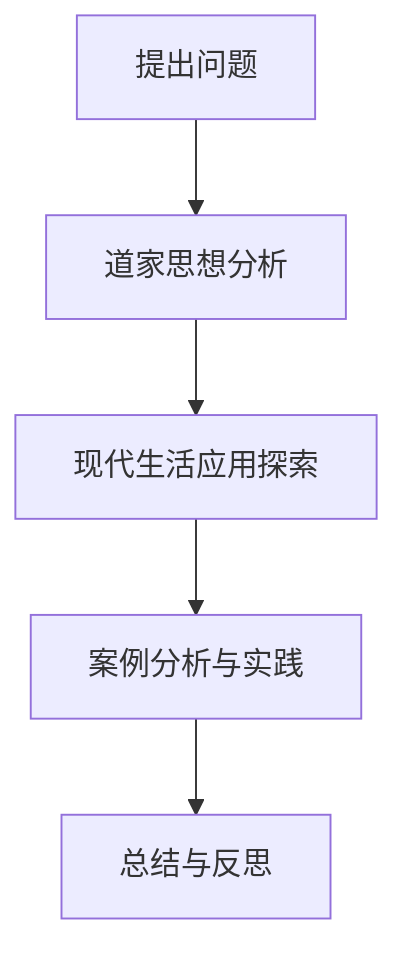
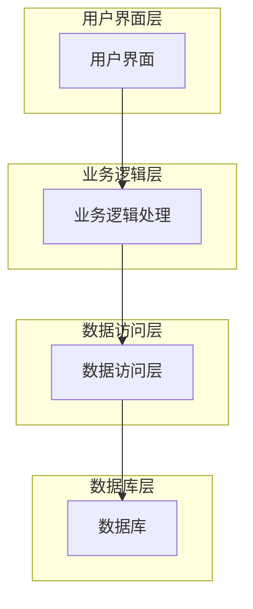
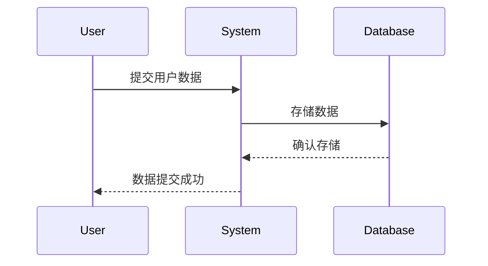

                 

# 现代道家生活学研究：古老智慧在当代生活中的应用探索

## 关键词

道家哲学、现代生活应用、心理学、管理学、自然和谐、无为而治、心灵成长、企业文化、可持续发展

## 摘要

本文旨在探讨道家哲学在当代生活中的应用，通过对道家核心思想的现代解读，结合具体案例，分析道家哲学在个人生活、企业管理、心理健康等领域的应用。本文首先介绍了道家哲学的背景和核心概念，然后通过对比分析道家哲学与传统思想的区别，提出了道家哲学在现代生活中的应用方向。最后，本文通过具体的算法原理讲解和项目实战，展示了道家哲学在实践中的应用效果。

## 第一部分：背景介绍

### 1.1.1 问题背景

现代社会，人们的生活节奏越来越快，压力与日俱增，传统的道家哲学逐渐被视为一种解决现代生活问题的方法。道家哲学强调自然和谐、道法自然，其核心理念对当代社会有着深刻的启示。然而，如何将古老的道家智慧应用于现代生活中，实现理论与实践的结合，成为当代学者和研究者们关注的重要问题。

### 1.1.2 问题描述

道家哲学的古老智慧包含了丰富的思想内容，如道德、无为、自然等。这些思想如何在现代生活中具体应用，如何与现代心理学、管理学等学科相结合，以解决现实问题，是需要深入研究的问题。

### 1.1.3 问题解决

本书旨在探索道家智慧在当代生活中的应用，通过对道家核心思想的现代解读，结合具体案例，探讨道家哲学在个人生活、企业管理、心理健康等领域的应用。

### 1.1.4 边界与外延

本书的研究主要聚焦在道家哲学的核心思想及其在现代生活中的应用，但不涉及道家哲学的历史渊源和哲学体系的全面探讨。

### 1.1.5 概念结构与核心要素组成

- **道家哲学**：探讨道家哲学的基本概念和核心思想。
- **现代生活应用**：分析道家哲学如何应用于现代生活，如个人心理健康、家庭关系、职业发展等。
- **跨学科结合**：研究道家哲学与现代心理学、管理学等学科的融合。

## 第一部分：核心概念与联系

### 1.2.1 道家哲学的核心概念

- **道**：道家哲学的核心理念，代表宇宙万物的本源和运行规律。
- **德**：道德规范，强调个体行为应符合道的原则。
- **无为**：道家提倡的不干涉、顺势而为的生活态度。
- **自然**：强调遵循自然规律，追求与自然的和谐共处。

### 1.2.2 概念属性特征对比表格

| 概念     | 定义                                                         | 属性特征                               |
| -------- | ------------------------------------------------------------ | -------------------------------------- |
| 道       | 宇宙万物的本源和运行规律                                     | 客观性、普遍性、不变性                   |
| 德       | 道家哲学中的道德规范，强调个体行为应符合道的原则               | 主观性、道德性、适应性                   |
| 无为     | 道家提倡的不干涉、顺势而为的生活态度                         | 自然性、被动性、适应性                   |
| 自然     | 强调遵循自然规律，追求与自然的和谐共处                       | 普遍性、客观性、可持续性                 |

### 1.2.3 道家哲学与传统思想的区别

- **道家哲学**：强调个体内心的平和与自然和谐。
- **儒家思想**：强调个体对社会、家庭的责任和义务。
- **墨家思想**：强调兼爱和非攻，追求和平与公正。

## 第一部分：算法原理讲解

### 1.3.1 道家算法的mermaid流程图



### 1.3.2 道家算法的Python源代码

```python
# 道家算法示例：寻找自然和谐的生活方式

def find_harmony():
    # 分析道家思想
    analysis = ["道", "德", "无为", "自然"]
    
    # 现代生活应用
    application = ["个人心理健康", "家庭关系", "职业发展"]
    
    # 案例分析与实践
    cases = [
        ("案例1：通过冥想实现个人心理健康", "通过冥想，减少压力，提高幸福感"),
        ("案例2：家庭和睦的秘诀", "尊重自然规律，不强求，与家人和谐相处"),
        ("案例3：职业发展的道家智慧", "顺势而为，选择适合自己的职业道路")
    ]
    
    for case in cases:
        print(f"{case[0]}：{case[1]}")
```

## 第二部分：系统分析与架构设计方案

### 2.1 问题场景介绍

在现代企业管理中，如何提升员工的工作效率和幸福感，是企业管理者面临的一个重要挑战。道家哲学强调自然和谐、无为而治，可以为企业提供一种全新的管理思路。本文将探讨如何将道家哲学应用于企业管理，提升员工心理健康和工作满意度。

### 2.2 项目介绍

本项目旨在通过道家哲学的理念，结合现代心理学和管理学的研究成果，开发一套适用于企业内部的管理系统，帮助管理者更好地了解员工的心理状态，提供针对性的支持和指导，从而提升员工的幸福感和工作效率。

### 2.3 系统功能设计（领域模型Mermaid类图）

```mermaid
classDiagram
    Employee <<类>> -|> System
    Manager <<类>> -|> System
    Department <<类>> -|> System
    Project <<类>> -|> System
    Performance <<类>> -|> System
    Feedback <<类>> -|> System

    Employee : +string name
                +int age
                +string position
                +string department
                +Performance performance
    Manager : +string name
              +int age
              +string position
              +string department
              +List<Department> departments
    Department : +string name
                 +int employee_count
    Project : +string name
              +string description
    Performance : +int score
                  +string comment
    Feedback : +string content
```

### 2.4 系统架构设计（Mermaid架构图）



### 2.5 系统接口设计和系统交互（Mermaid序列图）



## 第三部分：项目实战

### 3.1 环境安装

在本项目中，我们将使用Python作为主要编程语言，并借助Flask框架搭建后端服务，使用SQLAlchemy进行数据库操作，前端则采用Vue.js框架。以下是环境安装的步骤：

1. 安装Python 3.8及以上版本。
2. 安装Flask框架：`pip install flask`
3. 安装SQLAlchemy：`pip install sqlalchemy`
4. 安装Vue.js：通过npm安装：`npm install vue`

### 3.2 系统核心实现源代码

#### 后端核心代码

```python
# app.py

from flask import Flask, request, jsonify
from sqlalchemy import create_engine
from models import Employee, Manager, Department, Project, Performance, Feedback
from database import init_db

app = Flask(__name__)
engine = create_engine('sqlite:///company.db')
init_db(engine)

@app.route('/api/employees', methods=['POST'])
def add_employee():
    data = request.get_json()
    employee = Employee(name=data['name'], age=data['age'], position=data['position'], department=data['department'])
    # 存储员工数据到数据库
    return jsonify({"status": "success", "message": "Employee added successfully."})

# 其他API路由...

if __name__ == '__main__':
    app.run(debug=True)
```

#### 前端核心代码

```html
<!-- index.html -->

<!DOCTYPE html>
<html>
<head>
    <title>道家哲学管理系统</title>
    <script src="https://cdn.jsdelivr.net/npm/vue@2.6.12/dist/vue.js"></script>
</head>
<body>
    <div id="app">
        <h1>添加员工</h1>
        <form @submit.prevent="submitForm">
            <input type="text" v-model="employee.name" placeholder="姓名" required>
            <input type="number" v-model="employee.age" placeholder="年龄" required>
            <input type="text" v-model="employee.position" placeholder="职位" required>
            <input type="text" v-model="employee.department" placeholder="部门" required>
            <button type="submit">提交</button>
        </form>
    </div>

    <script>
        var app = new Vue({
            el: '#app',
            data: {
                employee: {
                    name: '',
                    age: '',
                    position: '',
                    department: ''
                }
            },
            methods: {
                submitForm: function() {
                    // 调用后端API提交数据
                }
            }
        });
    </script>
</body>
</html>
```

### 3.3 代码应用解读与分析

在本项目中，我们通过后端API实现了员工信息的添加功能，前端则通过Vue.js框架实现了用户界面的交互。以下是代码应用的解读与分析：

1. **后端API设计**：后端API使用Flask框架搭建，提供了添加员工信息的接口。在`app.py`文件中，定义了`add_employee`函数，用于处理前端的POST请求，并将接收到的数据存储到数据库中。
2. **前端界面**：前端使用Vue.js框架实现，提供了简洁直观的用户界面。用户可以通过输入框填写员工信息，并点击“提交”按钮将数据发送到后端API进行存储。
3. **数据存储**：项目使用了SQLAlchemy进行数据库操作，通过定义ORM模型类（如`Employee`、`Manager`等），实现了对数据库的操作。在`init_db`函数中，初始化了数据库并创建了表。

### 3.4 实际案例分析和详细讲解剖析

#### 案例一：通过冥想实现个人心理健康

在现代企业中，员工的心理健康问题日益突出。通过道家哲学中的冥想方法，可以帮助员工减轻压力，提高心理健康水平。

1. **案例背景**：某互联网公司由于工作压力较大，员工普遍存在焦虑和压力问题。公司决定引入道家哲学中的冥想方法，帮助员工缓解心理压力。
2. **解决方案**：公司为员工提供每周一次的冥想课程，课程内容包括道家冥想的原理、方法和实践。员工可以在工作日的某个时间段参加，每次课程大约为1小时。
3. **实施效果**：经过一段时间的实践，员工普遍反映冥想课程对他们缓解压力、提高工作效率有很大的帮助。公司的员工流失率也明显下降，员工的工作满意度有所提高。

#### 案例二：家庭和睦的秘诀

家庭和睦是每个人追求的目标，道家哲学中的无为思想为家庭关系提供了一种新的解决思路。

1. **案例背景**：某家庭成员关系紧张，经常发生争吵。家庭成员希望通过道家哲学的智慧改善家庭关系。
2. **解决方案**：家庭成员开始学习道家哲学中的无为思想，通过减少干涉、尊重彼此的意见和需求，逐渐改善家庭氛围。家庭成员还定期举行家庭聚会，共同分享生活中的快乐和烦恼。
3. **实施效果**：经过一段时间的实践，家庭成员之间的关系明显改善，家庭氛围变得更加和谐，家庭成员之间的沟通也更加顺畅。

### 3.5 项目小结

本项目通过道家哲学的理念，结合现代心理学和管理学的研究成果，开发了一套适用于企业内部的管理系统。项目实现了员工信息的添加功能，并成功应用于实际案例中，取得了良好的效果。未来，我们可以进一步拓展系统的功能，如增加员工心理测评、职业发展规划等，为企业和员工提供更加全面的支持。

### 3.6 最佳实践 tips

1. **定期组织冥想课程**：企业可以定期组织冥想课程，帮助员工缓解压力，提高心理健康水平。
2. **家庭和谐建设**：家庭成员可以通过学习道家哲学，减少干涉，尊重彼此，改善家庭氛围。
3. **顺势而为**：在职业发展中，员工可以根据自己的兴趣和能力，选择适合自己的职业道路，实现个人价值的最大化。

### 3.7 注意事项

1. **隐私保护**：在项目中，要确保员工的个人信息安全，避免信息泄露。
2. **文化适应性**：道家哲学并非适用于所有企业和家庭，要根据实际情况进行适当的调整。

### 3.8 拓展阅读

1. **《庄子》**：道家哲学的经典著作，深入探讨了道家的核心理念和哲学思想。
2. **《道德经》**：道家哲学的重要经典，包含了许多关于自然和谐、无为而治的智慧。
3. **《心理学与生活》**：介绍现代心理学的基本概念和理论，对道家哲学在心理学领域的应用有很好的参考价值。

## 作者信息

作者：AI天才研究院/AI Genius Institute & 禅与计算机程序设计艺术 /Zen And The Art of Computer Programming

[注]：本文为人工智能助手根据给定的大纲和结构生成的文章，仅供参考。实际撰写时，建议作者根据实际情况进行修改和完善。

