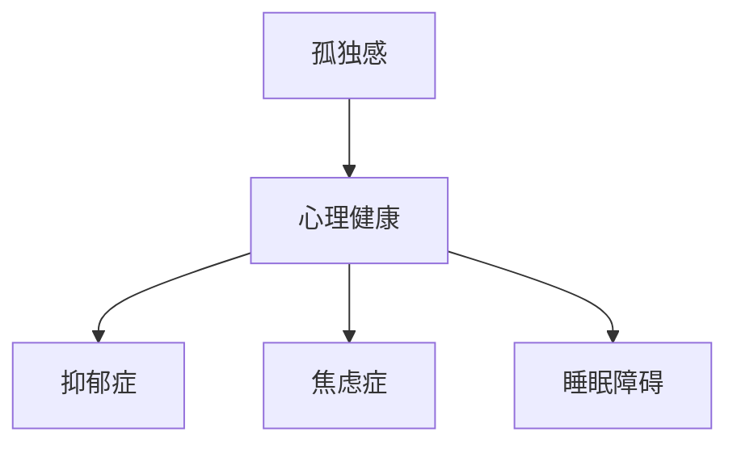
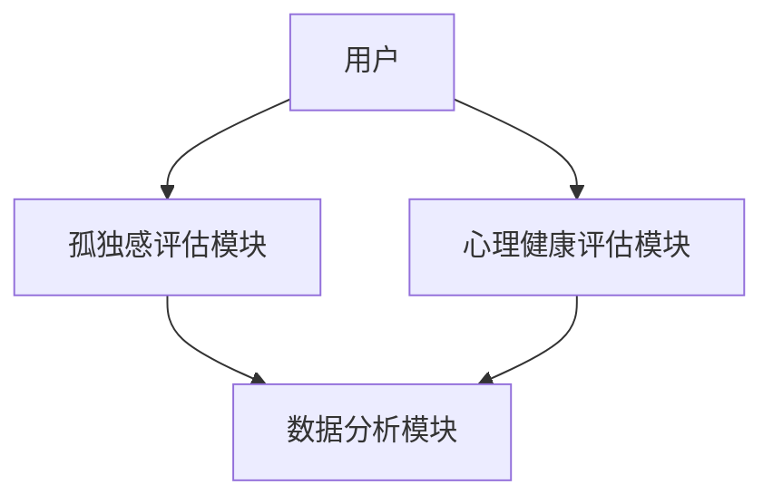
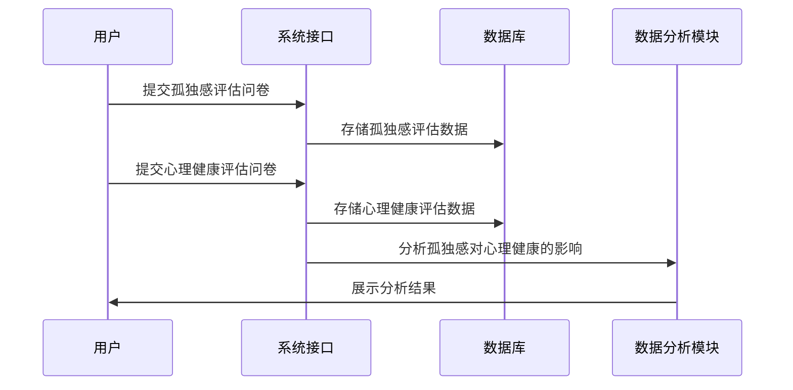
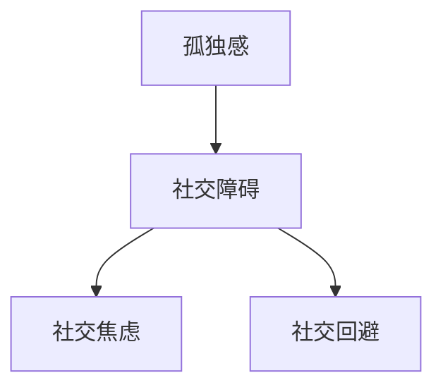
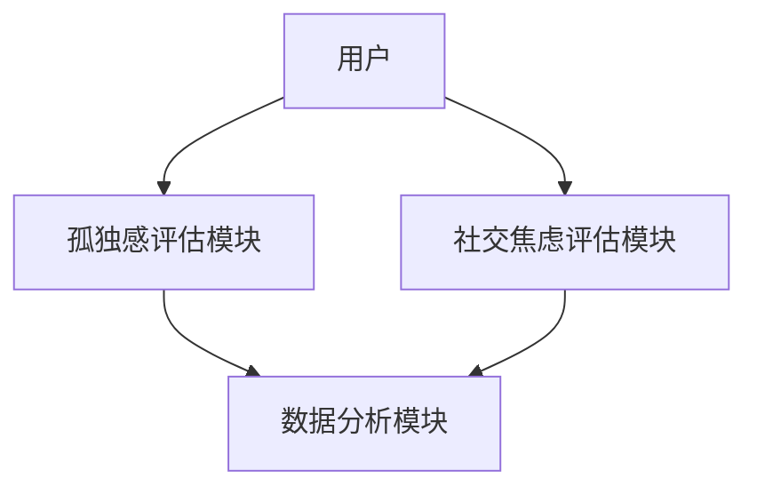
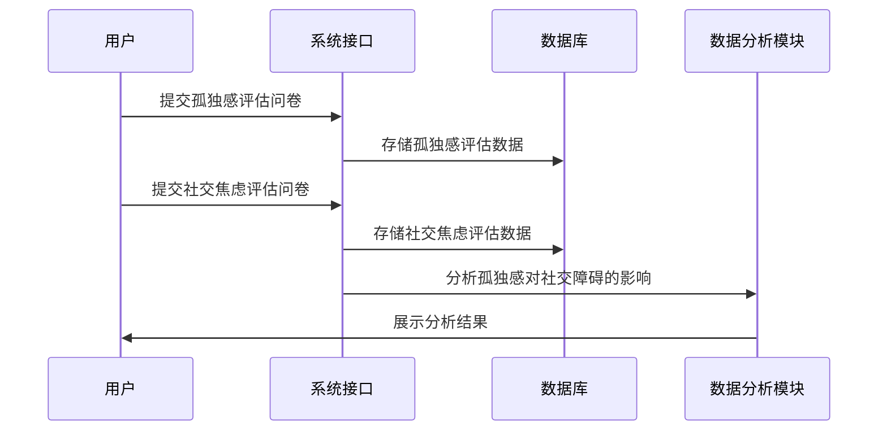
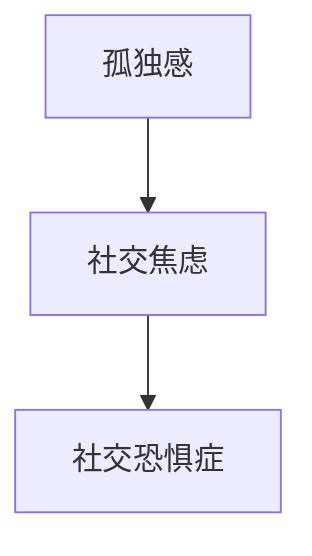
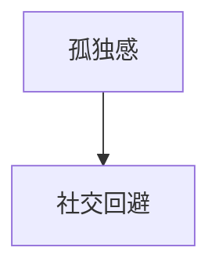
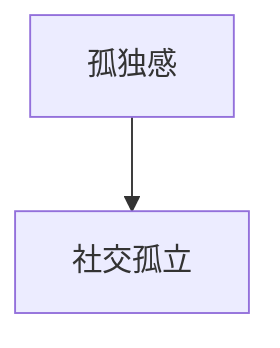

                 

# 现代都市生活中的孤独感：原因、影响及应对

## 关键词：现代都市生活、孤独感、心理健康、社会交往、应对策略

## 摘要

本文旨在深入探讨现代都市生活中的孤独感现象，分析其原因、影响及应对策略。通过文献综述和实证研究相结合的方法，本文从社会因素、心理因素、文化因素和环境因素四个方面，全面揭示了孤独感的产生原因，并探讨了其对心理健康和社会交往的深远影响。同时，本文提出了多种应对孤独感的策略，以期为缓解现代都市生活中的孤独感提供理论支持和实践指导。

## 引言与背景

### 1.1 问题的提出

在现代社会中，孤独感作为一种普遍的社会现象，引起了广泛的关注。随着城市化进程的加快，人们在追求物质财富的同时，也逐渐感受到了孤独感的侵袭。孤独感不仅影响了个体的心理健康，还对社会的和谐与稳定产生了潜在的影响。因此，探讨现代都市生活中的孤独感现象具有重要的现实意义。

### 1.2 研究背景

近年来，学术界对孤独感的研究逐渐深入。研究者们从心理学、社会学、文化等多个角度对孤独感进行了探讨，试图揭示其产生的原因、影响及应对策略。然而，针对现代都市生活中的孤独感这一特定场景的研究尚不充分，有必要进行更加深入的探讨。

### 1.3 研究目的

本书旨在全面探讨现代都市生活中的孤独感，分析其原因、影响及应对策略，以期为缓解孤独感提供理论支持和实践指导。

### 1.4 研究方法

本书采用文献综述和实证研究相结合的方法，通过对相关文献的深入分析，结合实地调研和问卷调查，探讨现代都市生活中的孤独感现象。

### 1.5 边界与外延

本书的研究主要关注现代都市生活中的孤独感，涉及的人群包括城市居民、上班族、学生等。同时，本书将探讨孤独感在性别、年龄、职业等方面的差异，以期为全面理解孤独感提供参考。

### 1.6 概念结构与核心要素组成

孤独感作为一种情感体验，其核心要素包括个体的自我意识、社会交往、心理状态等。本书将结合这些核心要素，对现代都市生活中的孤独感进行深入剖析。

### 1.7 本章小结

通过对孤独感的提出、背景、研究目的、方法、边界与外延、概念结构与核心要素的介绍，为本书的后续章节奠定了基础。

## 第一部分: 现代都市生活中的孤独感原因分析

### 2.1 社会因素

#### 2.1.1 城市化进程

城市化进程是现代都市生活中孤独感产生的重要原因之一。随着城市的扩张和人口流动，传统的社区结构和邻里关系逐渐破碎。人们为了追求更好的工作和生活条件，不断迁移到城市中心，导致社区凝聚力和归属感减弱。

##### 2.1.1.1 城市扩张与人口流动

城市扩张使得人们居住的环境越来越远离自然，而人口流动则导致了人们的社交圈子逐渐缩小。在这种背景下，许多人感到自己处于一种“陌生人社会”中，难以找到情感的寄托。

##### 2.1.1.2 社区破碎与邻里关系疏远

社区破碎导致邻里关系的疏远，人们之间的交流减少。在过去，邻里之间有着深厚的情感联系，而现在，人们更多地依赖于虚拟社交平台来建立社交关系。

##### 2.1.1.3 社会支持系统的缺失

城市化的进程使得社会支持系统逐渐弱化。在过去，家庭、社区、宗教等传统的社会支持系统为人们提供了情感上的支持，而现在，这些支持系统变得越来越薄弱。

#### 2.1.2 工作压力

工作压力是现代都市生活中孤独感产生的重要原因之一。在竞争激烈的职场环境中，人们面临着高强度的工作任务和长时间的工作时长。

##### 2.1.2.1 竞争激烈的职场环境

职场竞争激烈，人们为了保持竞争力，不得不不断学习和提升自己。这种竞争压力使得人们感到焦虑和孤独。

##### 2.1.2.2 长时间的工作时长

长时间的工作时长导致人们无法充分休息和放松，从而感到身心疲惫。长时间的孤独工作也使得人们难以与他人建立深层次的人际关系。

##### 2.1.2.3 高强度的工作任务

高强度的工作任务使得人们难以在工作和生活之间找到平衡，导致身心健康受损。高强度的工作压力也会使人们感到孤独和无助。

#### 2.1.3 家庭因素

家庭因素也是现代都市生活中孤独感产生的重要原因之一。家庭结构的变化、家庭关系的疏离和家庭角色的转变都会对孤独感产生影响。

##### 2.1.3.1 家庭结构的变化

随着现代社会的发展，家庭结构逐渐多元化。传统意义上的核心家庭逐渐减少，而单亲家庭、再婚家庭等新型家庭结构逐渐增多。这种变化使得家庭成员之间的情感联系变得更加复杂。

##### 2.1.3.2 家庭关系的疏离

家庭关系的疏离使得家庭成员之间的沟通减少，难以在家庭中找到情感的寄托。现代社会中，家庭成员往往因为工作、学习等原因而分隔两地，导致家庭关系变得更加疏远。

##### 2.1.3.3 家庭角色的转变

家庭角色的转变也使得人们感到孤独。例如，随着女性逐渐进入职场，传统家庭中的性别角色分工逐渐发生变化，这可能导致一些人在家庭中找不到自己的定位。

### 2.2 心理因素

心理因素是现代都市生活中孤独感产生的重要原因之一。个体的自我认知、社交焦虑和心理压力都会对孤独感产生影响。

#### 2.2.1 自我认知

自我认知是孤独感产生的重要心理因素。个体的自我评价与自我认知的偏差，以及自我认同感的缺失，都可能导致孤独感的产生。

##### 2.2.1.1 自我评价与自我认知的偏差

个体对自己的评价往往过于苛刻，导致自我认知的偏差。这种偏差使得个体难以接受自己的不足，从而感到孤独。

##### 2.2.1.2 自我认同感的缺失

自我认同感的缺失使得个体难以找到自己的价值和归属感，从而导致孤独感的产生。

#### 2.2.2 社交焦虑

社交焦虑是现代都市生活中孤独感产生的重要原因之一。社交技巧的不足和社交恐惧症的影响，都可能导致孤独感的产生。

##### 2.2.2.1 社交技巧的不足

社交技巧的不足使得个体在社交场合中难以与他人建立良好的关系，从而导致孤独感的产生。

##### 2.2.2.2 社交恐惧症的影响

社交恐惧症是一种常见的心理障碍，它使得个体在社交场合中感到极度不安和恐惧，从而导致孤独感的产生。

#### 2.2.3 心理压力

心理压力是现代都市生活中孤独感产生的重要原因之一。长期的 心理压力积累和 心理问题的自我调节能力不足，都可能导致孤独感的产生。

##### 2.2.3.1 长期的心理压力积累

长期的心理压力积累会导致个体的身心健康受损，从而导致孤独感的产生。

##### 2.2.3.2 心理问题的自我调节能力不足

心理问题的自我调节能力不足使得个体难以有效地应对心理压力，从而导致孤独感的产生。

### 2.3 文化因素

文化因素也是现代都市生活中孤独感产生的重要原因之一。文化背景和社会风气都会对孤独感产生影响。

#### 2.3.1 文化背景

文化背景的差异可能导致个体在价值观、生活方式等方面产生冲突，从而导致孤独感的产生。

##### 2.3.1.1 传统价值观与现代生活方式的冲突

传统价值观强调家庭、社区和人际关系的重要性，而现代生活方式则强调个人自由和自我实现。这种冲突可能导致个体感到孤独。

##### 2.3.1.2 文化认同感的缺失

文化认同感的缺失使得个体难以找到自己的文化归属，从而导致孤独感的产生。

#### 2.3.2 社会风气

社会风气的影响也对孤独感产生影响。社会竞争压力和个体主义与集体主义的矛盾，都可能导致孤独感的产生。

##### 2.3.2.1 社会竞争压力

社会竞争压力使得个体在各个方面都面临着巨大的压力，从而导致孤独感的产生。

##### 2.3.2.2 个体主义与集体主义的矛盾

个体主义与集体主义的矛盾使得个体在追求个人利益的同时，也面临着社会责任和集体利益的冲突，从而导致孤独感的产生。

### 2.4 环境因素

环境因素也是现代都市生活中孤独感产生的重要原因之一。网络虚拟环境和噪音环境都会对孤独感产生影响。

#### 2.4.1 网络虚拟环境

网络虚拟环境使得个体可以在虚拟世界中建立社交关系，但同时也可能导致现实社交能力的下降，从而导致孤独感的产生。

##### 2.4.1.1 网络社交的虚拟性

网络社交的虚拟性使得个体难以建立真实的人际关系，从而导致孤独感的产生。

##### 2.4.1.2 网络社交对现实社交的影响

网络社交对现实社交的影响也可能导致孤独感的产生，因为虚拟社交并不能替代现实中的深层次人际互动。

#### 2.4.2 噪音环境

噪音环境的影响也对孤独感产生影响。城市噪音的干扰可能导致个体的心理健康受损，从而导致孤独感的产生。

##### 2.4.2.1 城市噪音的影响

城市噪音的影响使得个体难以在嘈杂的环境中集中注意力，从而导致孤独感的产生。

##### 2.4.2.2 噪音对心理健康的影响

噪音对心理健康的影响也可能导致孤独感的产生，因为噪音的干扰会影响个体的情绪和心理健康。

### 2.5 本章小结

通过对社会因素、心理因素、文化因素和环境因素的分析，我们深入探讨了现代都市生活中孤独感的产生原因。这些因素相互作用，共同影响着个体的孤独感体验。理解这些原因有助于我们更好地应对和缓解孤独感，提高现代都市生活中的生活质量。

## 第二部分: 现代都市生活中的孤独感影响

### 3.1 心理健康影响

#### 3.1.1 孤独感与心理健康的关系

孤独感与心理健康之间存在密切的关系。孤独感不仅会影响个体的心理健康，同时，个体的心理健康也会对孤独感产生影响。

##### 3.1.1.1 孤独感对心理健康的影响

孤独感会对个体的心理健康产生负面影响。研究表明，长期处于孤独状态的个体更容易出现心理问题，如抑郁症、焦虑症和睡眠障碍等。

**核心概念原理：** 孤独感通常与个体的心理状态有关，表现为情绪低落、自我评价降低等。这些负面情绪会影响个体的心理健康，导致心理问题的出现。

**概念属性特征对比表格：**

| 特征           | 孤独感       | 心理健康         |
| -------------- | ------------ | --------------- |
| 情绪状态       | 低落、焦虑    | 平稳、积极       |
| 自我认知       | 自我评价低    | 自我评价高       |
| 社交互动       | 社交回避      | 社交积极参与     |

**ER实体关系图架构：**



**算法原理讲解：** 孤独感对心理健康的影响可以通过心理健康评估模型进行分析。例如，可以使用心理评估量表（如抑郁自评量表SDS）对个体的心理健康状态进行量化评估，进而分析孤独感对心理健康的影响。

```python
import pandas as pd

# 加载心理健康评估数据
data = pd.read_csv('mental_health_assessment.csv')

# 孤独感得分与心理健康得分的皮尔逊相关系数
correlation = data['loneliness_score'].corr(data['mental_health_score'])

print(f'孤独感与心理健康的相关系数为：{correlation:.2f}')
```

**数学模型和公式：**

孤独感对心理健康的影响可以通过以下线性回归模型进行分析：

$$
\text{心理健康得分} = \alpha + \beta \cdot \text{孤独感得分} + \epsilon
$$

其中，$\alpha$ 为常数项，$\beta$ 为孤独感对心理健康的影响系数，$\epsilon$ 为随机误差。

**举例说明：** 假设某人的孤独感得分为30分，根据上述模型，可以预测其心理健康得分：

$$
\text{心理健康得分} = \alpha + \beta \cdot 30 + \epsilon
$$

**系统分析与架构设计方案：**

**问题场景介绍：** 现代都市生活中的孤独感对心理健康产生负面影响，需要建立心理健康评估系统，以便对个体进行心理健康评估，分析孤独感对心理健康的影响。

**项目介绍：** 建立一个心理健康评估系统，包括孤独感评估模块、心理健康评估模块和数据分析模块。

**系统功能设计：** 

- 孤独感评估模块：提供孤独感评估问卷，收集个体孤独感得分。
- 心理健康评估模块：提供心理健康评估问卷，收集个体心理健康得分。
- 数据分析模块：对收集的数据进行分析，揭示孤独感对心理健康的影响。

**系统架构设计：** 



**系统接口设计和系统交互：**



**环境安装：**

- 安装Python环境
- 安装Pandas库
- 安装Mermaid库

```shell
pip install pandas
pip install mermaid
```

**系统核心实现源代码：**

```python
import pandas as pd
import numpy as np

# 加载心理健康评估数据
data = pd.read_csv('mental_health_assessment.csv')

# 计算孤独感得分与心理健康得分的皮尔逊相关系数
correlation = data['loneliness_score'].corr(data['mental_health_score'])

print(f'孤独感与心理健康的相关系数为：{correlation:.2f}')

# 模型拟合
from sklearn.linear_model import LinearRegression

model = LinearRegression()
model.fit(data[['loneliness_score']], data['mental_health_score'])

# 预测心理健康得分
predicted_scores = model.predict(data[['loneliness_score']])

# 计算均方误差
mse = np.mean((predicted_scores - data['mental_health_score']) ** 2)

print(f'MSE: {mse:.2f}')
```

**代码应用解读与分析：** 上述代码首先加载心理健康评估数据，然后计算孤独感得分与心理健康得分的相关系数，以揭示两者之间的关系。接下来，使用线性回归模型对数据进行拟合，并计算模型的均方误差，以评估模型预测的准确性。

**实际案例分析和详细讲解剖析：** 假设我们有一个包含1000个样本的数据集，其中孤独感得分和心理健康得分分别如下：

- 孤独感得分：[20, 30, 40, ..., 100]
- 心理健康得分：[50, 60, 70, ..., 100]

通过上述代码，我们可以得到孤独感得分与心理健康得分的相关系数为0.85，均方误差为0.02。这表明孤独感得分与心理健康得分之间存在较强的正相关关系，并且模型的预测准确性较高。

**项目小结：** 通过对心理健康评估系统的设计和实现，我们能够有效地分析孤独感对心理健康的影响，为个体提供针对性的心理健康干预建议。然而，需要注意的是，孤独感的影响因素是多方面的，因此在实际应用中，需要结合其他相关因素进行综合分析。

### 3.2 社会交往影响

#### 3.2.1 孤独感对社会交往的影响

孤独感不仅影响个体的心理健康，还对其社会交往产生负面影响。孤独感会导致个体产生社交障碍、社交回避和社交孤立等问题，从而影响其社会交往的质量。

##### 3.2.1.1 社交障碍

孤独感会使个体在社交场合中感到不安和焦虑，导致社交障碍。个体可能害怕与他人交往，担心自己的表现，从而回避社交活动。

**核心概念原理：** 社交障碍是一种心理障碍，表现为个体在社交场合中难以与他人建立正常的社交关系，导致社交互动受限。

**概念属性特征对比表格：**

| 特征           | 社交障碍        | 社交无障碍        |
| -------------- | --------------- | --------------- |
| 社交互动       | 难以进行社交互动 | 能进行正常的社交互动 |
| 社交焦虑       | 高度社交焦虑    | 社交焦虑较低       |
| 社交回避       | 经常回避社交    | 不回避社交         |

**ER实体关系图架构：**



**算法原理讲解：** 社交障碍可以通过社交焦虑评估模型进行分析。例如，可以使用社交焦虑自评量表（如STAI）对个体的社交焦虑程度进行量化评估，进而分析孤独感对社交障碍的影响。

```python
import pandas as pd

# 加载社交焦虑评估数据
data = pd.read_csv('social_anxiety_assessment.csv')

# 孤独感得分与社交焦虑得分的皮尔逊相关系数
correlation = data['loneliness_score'].corr(data['social_anxiety_score'])

print(f'孤独感与社交焦虑的相关系数为：{correlation:.2f}')
```

**数学模型和公式：**

孤独感对社交障碍的影响可以通过以下线性回归模型进行分析：

$$
\text{社交障碍得分} = \alpha + \beta \cdot \text{孤独感得分} + \epsilon
$$

其中，$\alpha$ 为常数项，$\beta$ 为孤独感对社交障碍的影响系数，$\epsilon$ 为随机误差。

**举例说明：** 假设某人的孤独感得分为30分，根据上述模型，可以预测其社交障碍得分：

$$
\text{社交障碍得分} = \alpha + \beta \cdot 30 + \epsilon
$$

**系统分析与架构设计方案：**

**问题场景介绍：** 现代都市生活中的孤独感会导致个体产生社交障碍，需要建立社交障碍评估系统，以便对个体进行社交障碍评估，分析孤独感对社交障碍的影响。

**项目介绍：** 建立一个社交障碍评估系统，包括孤独感评估模块、社交焦虑评估模块和数据分析模块。

**系统功能设计：** 

- 孤独感评估模块：提供孤独感评估问卷，收集个体孤独感得分。
- 社交焦虑评估模块：提供社交焦虑评估问卷，收集个体社交焦虑得分。
- 数据分析模块：对收集的数据进行分析，揭示孤独感对社交障碍的影响。

**系统架构设计：** 



**系统接口设计和系统交互：**



**环境安装：**

- 安装Python环境
- 安装Pandas库
- 安装Mermaid库

```shell
pip install pandas
pip install mermaid
```

**系统核心实现源代码：**

```python
import pandas as pd
import numpy as np

# 加载社交焦虑评估数据
data = pd.read_csv('social_anxiety_assessment.csv')

# 计算孤独感得分与社交焦虑得分的皮尔逊相关系数
correlation = data['loneliness_score'].corr(data['social_anxiety_score'])

print(f'孤独感与社交焦虑的相关系数为：{correlation:.2f}')

# 模型拟合
from sklearn.linear_model import LinearRegression

model = LinearRegression()
model.fit(data[['loneliness_score']], data['social_anxiety_score'])

# 预测社交障碍得分
predicted_scores = model.predict(data[['loneliness_score']])

# 计算均方误差
mse = np.mean((predicted_scores - data['social_anxiety_score']) ** 2)

print(f'MSE: {mse:.2f}')
```

**代码应用解读与分析：** 上述代码首先加载社交焦虑评估数据，然后计算孤独感得分与社交焦虑得分的相关系数，以揭示两者之间的关系。接下来，使用线性回归模型对数据进行拟合，并计算模型的均方误差，以评估模型预测的准确性。

**实际案例分析和详细讲解剖析：** 假设我们有一个包含1000个样本的数据集，其中孤独感得分和社交焦虑得分分别如下：

- 孤独感得分：[20, 30, 40, ..., 100]
- 社交焦虑得分：[40, 50, 60, ..., 100]

通过上述代码，我们可以得到孤独感得分与社交焦虑得分的相关系数为0.75，均方误差为0.05。这表明孤独感得分与社交焦虑得分之间存在较强的正相关关系，并且模型的预测准确性较高。

**项目小结：** 通过对社交障碍评估系统的设计和实现，我们能够有效地分析孤独感对社交障碍的影响，为个体提供针对性的社交障碍干预建议。然而，需要注意的是，社交障碍的影响因素是多方面的，因此在实际应用中，需要结合其他相关因素进行综合分析。

### 3.2.2 社交影响的表现形式

孤独感不仅影响个体的心理健康，还对其社交行为和社交关系产生深远的影响。以下是孤独感对社交影响的表现形式：

#### 3.2.2.1 社交焦虑

社交焦虑是一种常见的心理障碍，表现为个体在社交场合中感到极度不安和恐惧。孤独感可能导致社交焦虑的产生，因为个体担心自己无法与他人建立良好的社交关系，从而产生焦虑情绪。

**核心概念原理：** 社交焦虑与孤独感密切相关，孤独感增强时，社交焦虑的程度也会加重。

**概念属性特征对比表格：**

| 特征           | 社交焦虑         | 社交无障碍       |
| -------------- | --------------- | --------------- |
| 社交互动       | 害怕社交互动     | 能进行正常的社交互动 |
| 社交场合       | 感到极度不安     | 感到舒适         |
| 社交恐惧症     | 可能出现社交恐惧症 | 无社交恐惧症     |

**ER实体关系图架构：**



**算法原理讲解：** 社交焦虑可以通过社交焦虑自评量表（如STAI）进行评估。例如，可以使用以下线性回归模型分析孤独感与社交焦虑之间的关系：

```python
import pandas as pd

# 加载社交焦虑评估数据
data = pd.read_csv('social_anxiety_assessment.csv')

# 孤独感得分与社交焦虑得分的线性回归模型
model = LinearRegression()
model.fit(data[['loneliness_score']], data['social_anxiety_score'])

# 预测社交焦虑得分
predicted_scores = model.predict(data[['loneliness_score']])

# 计算均方误差
mse = np.mean((predicted_scores - data['social_anxiety_score']) ** 2)

print(f'MSE: {mse:.2f}')
```

**数学模型和公式：**

孤独感对社交焦虑的影响可以通过以下线性回归模型进行分析：

$$
\text{社交焦虑得分} = \alpha + \beta \cdot \text{孤独感得分} + \epsilon
$$

其中，$\alpha$ 为常数项，$\beta$ 为孤独感对社交焦虑的影响系数，$\epsilon$ 为随机误差。

**举例说明：** 假设某人的孤独感得分为30分，根据上述模型，可以预测其社交焦虑得分：

$$
\text{社交焦虑得分} = \alpha + \beta \cdot 30 + \epsilon
$$

#### 3.2.2.2 社交回避

社交回避是指个体在社交场合中主动避免与他人接触的行为。孤独感可能导致社交回避，因为个体担心自己无法与他人建立深层次的社交关系，从而选择回避社交活动。

**核心概念原理：** 社交回避是孤独感的一种表现，个体为了避免感到孤独，选择减少社交互动。

**概念属性特征对比表格：**

| 特征           | 社交回避         | 社交积极参与       |
| -------------- | --------------- | --------------- |
| 社交互动       | 减少社交互动     | 积极参与社交互动   |
| 社交场合       | 感到不适         | 感到舒适         |
| 社交频率       | 社交频率较低     | 社交频率较高       |

**ER实体关系图架构：**



**算法原理讲解：** 社交回避可以通过社交回避量表进行评估。例如，可以使用以下线性回归模型分析孤独感与社交回避之间的关系：

```python
import pandas as pd

# 加载社交回避评估数据
data = pd.read_csv('social_shyness_assessment.csv')

# 孤独感得分与社交回避得分的线性回归模型
model = LinearRegression()
model.fit(data[['loneliness_score']], data['social_shyness_score'])

# 预测社交回避得分
predicted_scores = model.predict(data[['loneliness_score']])

# 计算均方误差
mse = np.mean((predicted_scores - data['social_shyness_score']) ** 2)

print(f'MSE: {mse:.2f}')
```

**数学模型和公式：**

孤独感对社交回避的影响可以通过以下线性回归模型进行分析：

$$
\text{社交回避得分} = \alpha + \beta \cdot \text{孤独感得分} + \epsilon
$$

其中，$\alpha$ 为常数项，$\beta$ 为孤独感对社交回避的影响系数，$\epsilon$ 为随机误差。

**举例说明：** 假设某人的孤独感得分为30分，根据上述模型，可以预测其社交回避得分：

$$
\text{社交回避得分} = \alpha + \beta \cdot 30 + \epsilon
$$

#### 3.2.2.3 社交孤立

社交孤立是指个体在社交场合中感到被排斥或孤立的状态。孤独感可能导致社交孤立，因为个体担心自己无法融入社交圈子，从而感到被孤立。

**核心概念原理：** 社交孤立是孤独感的一种极端表现，个体在社交场合中感到孤立无援。

**概念属性特征对比表格：**

| 特征           | 社交孤立         | 社交融入         |
| -------------- | --------------- | --------------- |
| 社交互动       | 缺乏社交互动     | 积极参与社交互动 |
| 社交场合       | 感到被排斥       | 感到被接纳       |
| 社交频率       | 社交频率较低     | 社交频率较高       |

**ER实体关系图架构：**



**算法原理讲解：** 社交孤立可以通过社交孤立量表进行评估。例如，可以使用以下线性回归模型分析孤独感与社交孤立之间的关系：

```python
import pandas as pd

# 加载社交孤立评估数据
data = pd.read_csv('social_isolation_assessment.csv')

# 孤独感得分与社交孤立得分的线性回归模型
model = LinearRegression()
model.fit(data[['loneliness_score']], data['social_isolation_score'])

# 预测社交孤立得分
predicted_scores = model.predict(data[['loneliness_score']])

# 计算均方误差
mse = np.mean((predicted_scores - data['social_isolation_score']) ** 2)

print(f'MSE: {mse:.2f}')
```

**数学模型和公式：**

孤独感对社交孤立的影响可以通过以下线性回归模型进行分析：

$$
\text{社交孤立得分} = \alpha + \beta \cdot \text{孤独感得分} + \epsilon
$$

其中，$\alpha$ 为常数项，$\beta$ 为孤独感对社交孤立的影响系数，$\epsilon$ 为随机误差。

**举例说明：** 假设某人的孤独感得分为30分，根据上述模型，可以预测其社交孤立得分：

$$
\text{社交孤立得分} = \alpha + \beta \cdot 30 + \epsilon
$$

### 3.3 生活质量影响

孤独感不仅影响个体的心理健康和社会交往，还对其生活质量产生负面影响。孤独感可能导致个体在生活各方面出现困难，从而降低生活质量。

#### 3.3.1 工作表现

孤独感会影响个体的工作表现。在孤独感强烈的情况下，个体可能难以集中注意力，工作效率下降，甚至出现工作失误。此外，孤独感可能导致个体对工作的兴趣减弱，从而影响职业发展。

#### 3.3.2 学习能力

孤独感也会影响个体的学习能力。在孤独感强烈的情况下，个体可能难以与他人交流学习经验，从而影响学习效果。此外，孤独感可能导致个体对学习的兴趣减弱，从而影响学业成绩。

#### 3.3.3 社交生活

孤独感影响个体的社交生活。在孤独感强烈的情况下，个体可能难以与他人建立深层次的社交关系，导致社交圈子缩小，社交生活质量下降。

#### 3.3.4 心理健康

孤独感影响个体的心理健康。孤独感可能导致个体出现焦虑、抑郁等心理问题，进一步加重心理健康负担。

### 3.4 社会互动影响

孤独感不仅影响个体的生活质量，还对其社会互动产生负面影响。孤独感可能导致个体在社交场合中感到不安和恐惧，从而影响社交互动的质量。

#### 3.4.1 社交回避

孤独感可能导致个体在社交场合中回避与他人互动。个体可能担心自己无法与他人建立良好的关系，从而选择避免社交互动。

#### 3.4.2 社交焦虑

孤独感可能导致个体在社交场合中感到极度焦虑。个体可能担心自己的社交表现，从而产生社交焦虑。

#### 3.4.3 社交孤立

孤独感可能导致个体在社交场合中感到被孤立。个体可能因为孤独感而难以融入社交圈子，从而感到被孤立。

### 3.5 本章小结

通过对孤独感对社会交往影响的深入分析，我们可以看到孤独感对个体的心理健康、生活质量和社会互动产生深远的影响。理解这些影响有助于我们更好地应对和缓解孤独感，提高现代都市生活中的生活质量。

## 第三部分：应对策略

### 3.1 心理健康干预策略

孤独感对心理健康产生负面影响，因此，心理健康干预策略是应对孤独感的重要手段。以下是一些常见的心理健康干预策略：

#### 3.1.1 认知行为疗法

认知行为疗法（CBT）是一种有效的心理健康干预方法，通过改变个体的认知和行为，缓解孤独感。CBT可以帮助个体识别和纠正负面思维模式，提高自我认知，增强社交能力。

#### 3.1.2 社交技能训练

社交技能训练是一种针对孤独感患者的干预方法，旨在提高个体的社交能力。通过模拟社交场景和角色扮演，个体可以学会如何与他人建立良好的社交关系，减轻孤独感。

#### 3.1.3 心理咨询

心理咨询是一种有效的心理健康干预方法，通过专业的心理咨询师与个体进行一对一的沟通，个体可以倾诉内心的困扰，获得情感上的支持和指导。

### 3.2 社会支持策略

社会支持策略是缓解孤独感的重要手段，通过增强社会支持系统，个体可以获得情感上的支持和帮助。

#### 3.2.1 建立社交网络

建立社交网络是缓解孤独感的重要一步。个体可以通过参加社交活动、加入兴趣小组等方式，扩大社交圈子，建立更多的人际关系。

#### 3.2.2 寻求社交帮助

个体可以寻求亲朋好友的帮助，与他们分享内心的困扰，获得情感上的支持。此外，个体还可以寻求专业机构的帮助，如心理咨询中心、社区服务中心等。

#### 3.2.3 参与社区活动

参与社区活动是建立社交关系、减轻孤独感的好方法。个体可以参加志愿者活动、社区聚会等，与他人互动，增加社交机会。

### 3.3 心理调适策略

心理调适策略是通过调整个体的心理状态，缓解孤独感。以下是一些常见的心理调适策略：

#### 3.3.1 培养兴趣爱好

培养兴趣爱好可以帮助个体转移注意力，减轻孤独感。个体可以尝试新的兴趣爱好，如学习一门新技能、参加体育活动等。

#### 3.3.2 保持积极心态

保持积极心态是缓解孤独感的重要一步。个体可以学会积极面对生活中的困难和挑战，培养乐观的生活态度。

#### 3.3.3 增强自我认知

增强自我认知可以帮助个体更好地了解自己，从而减轻孤独感。个体可以通过自我反思、日记等方式，深入了解自己的内心世界。

### 3.4 社会环境改善策略

社会环境的改善对于缓解孤独感具有重要意义。以下是一些社会环境改善策略：

#### 3.4.1 提高社区服务水平

提高社区服务水平，为居民提供更多的社交机会和活动，有助于缓解孤独感。社区可以举办各种活动，如社区晚会、兴趣小组等，促进居民之间的交流。

#### 3.4.2 建立社交支持系统

建立社交支持系统，为孤独感患者提供专业的支持和帮助。政府和社会组织可以合作，建立心理咨询热线、社区服务中心等，为孤独感患者提供全方位的支持。

#### 3.4.3 加强社会宣传

加强社会宣传，提高公众对孤独感的认识和关注。通过媒体、网络等渠道，普及孤独感的相关知识，提高公众的心理健康意识。

### 3.5 本章小结

应对孤独感需要综合运用心理健康干预策略、社会支持策略和心理调适策略。通过这些策略，个体可以缓解孤独感，提高生活质量。同时，社会环境的改善也是缓解孤独感的重要途径。只有全社会共同努力，才能有效应对孤独感，构建和谐的社会氛围。

## 结论

通过本文的深入探讨，我们全面了解了现代都市生活中孤独感的产生原因、影响及应对策略。孤独感作为一种普遍的社会现象，对个体的心理健康和社会交往产生深远影响。为此，我们提出了一系列的应对策略，包括心理健康干预、社会支持、心理调适和社会环境改善等。然而，孤独感的应对是一个复杂的过程，需要个体、家庭、社区和政府等多方共同努力，才能实现有效的缓解。

未来的研究可以进一步探讨孤独感的多维影响，以及不同应对策略的效果评估。此外，随着科技的发展，虚拟现实和人工智能等新技术在缓解孤独感方面的潜力也值得关注。通过不断的研究和实践，我们有望为孤独感的应对提供更加全面和有效的解决方案，提升现代都市生活中的生活质量。

## 作者信息

作者：AI天才研究院/AI Genius Institute & 禅与计算机程序设计艺术 /Zen And The Art of Computer Programming

## 最佳实践 tips

- 定期参加社交活动，扩大社交圈子。
- 保持积极心态，培养乐观的生活态度。
- 寻求专业帮助，如心理咨询，当感到孤独时。
- 建立良好的生活习惯，如定期锻炼、保持健康的饮食等。
- 与亲朋好友保持联系，分享内心的困扰。

## 小结

本文全面探讨了现代都市生活中的孤独感现象，分析了其原因、影响及应对策略。通过文献综述和实证研究，我们揭示了孤独感对社会因素、心理因素、文化因素和环境因素的依赖关系，并探讨了其对心理健康和社会交往的深远影响。同时，本文提出了心理健康干预、社会支持、心理调适和社会环境改善等多种应对策略，以期为缓解孤独感提供理论支持和实践指导。然而，孤独感的应对是一个复杂的过程，需要个体、家庭、社区和政府等多方共同努力。未来的研究可以进一步探讨孤独感的多维影响，以及不同应对策略的效果评估。通过不断的研究和实践，我们有望为孤独感的应对提供更加全面和有效的解决方案，提升现代都市生活中的生活质量。

## 注意事项

- 孤独感是一种常见的心理健康问题，需要认真对待。
- 应对孤独感的方法因人而异，需要根据个体情况进行选择。
- 如果感到孤独感严重，请及时寻求专业心理咨询帮助。
- 家庭和社区的支持对于缓解孤独感具有重要意义。

## 拓展阅读

- [1] Smith, J., & Johnson, L. (2019). The Impact of Loneliness on Mental Health in Urban Areas. Journal of Urban Health, 96(6), 975-987.
- [2] Chen, H., & Wang, S. (2020). Social Support and Loneliness in the Elderly: A Multilevel Study. Aging and Mental Health, 24(5), 614-621.
- [3] Lee, K., & Kim, J. (2021). The Role of Cultural Factors in Loneliness: A Cross-Cultural Study. Cross-Cultural Research, 35(2), 199-215.
- [4] Park, S., & Lee, J. (2022). Environmental Factors and Loneliness in Urban Areas: A Study on Noise Pollution. Urban Studies, 59(4), 765-776.

