                 

# 理性思考复兴计划启动：新启蒙时代的社会倡议行动

## 关键词

- 理性思考
- 新启蒙时代
- 社会倡议行动
- 复兴计划
- 挑战与解决方案

## 摘要

本文旨在探讨在当前社会背景下，理性思考的重要性以及如何启动理性思考复兴计划，以应对现代社会面临的挑战。通过分析新启蒙时代的定义与特点、社会倡议行动的概念、理性思考与启蒙运动的关系等核心概念，本文提出了一个全面的社会倡议行动框架，旨在推动社会向着更加理性和科学的方向发展。本文还通过实际案例和最佳实践，提供了具体的实施策略和注意事项，为读者提供了一套实用的理性思考方法论。

## 第一部分：背景介绍

### 1.1 问题背景

在当代社会，信息爆炸和技术迅猛发展带来了诸多挑战，如人工智能的广泛应用引发的伦理问题、社会不平等加剧、隐私泄露等。这些问题迫切需要我们以更加理性和全面的方式去思考，从而寻找解决方案。理性思考作为一种思维方式，它不仅有助于我们更好地理解现实，预见未来，还能帮助我们制定有效的策略，应对复杂的现实问题。

### 1.1.1 当代社会面临的挑战

#### 人工智能引发的伦理问题

人工智能（AI）作为一项前沿技术，其发展速度之快，已经超出了人类社会的预期。AI的应用领域越来越广泛，从自动驾驶汽车到医疗诊断，从金融分析到军事应用，AI几乎渗透到了社会的各个角落。然而，AI的广泛应用也引发了一系列伦理问题，如算法偏见、隐私泄露、就业冲击等。这些问题不仅影响了个人的权利和利益，还对社会的公平和正义构成了挑战。

#### 社会不平等加剧

随着技术的发展，社会不平等问题日益严重。一方面，技术和资本的集中导致了财富分配的不均衡，富者愈富，贫者愈贫。另一方面，技术进步也加剧了就业市场的变化，一些传统职业被自动化取代，而新的就业机会并没有均匀分布。这种不平等不仅体现在经济上，也体现在教育、医疗、居住等多个方面。

#### 隐私泄露

在互联网时代，个人隐私问题变得尤为突出。随着大数据和云计算的普及，企业和机构能够收集到大量的个人数据，这些数据被用于商业分析、广告推送等。然而，这也带来了隐私泄露的风险，个人信息的泄露可能导致财产损失、身份盗用等严重后果。

### 1.1.2 理性思考的重要性

面对这些复杂的社会问题，理性思考显得尤为重要。理性思考是一种基于逻辑和证据的思维方式，它能够帮助我们从多个角度分析问题，找出问题的根本原因，并制定出合理的解决方案。理性思考不仅有助于我们更好地理解现实，预见未来，还能帮助我们克服情感和偏见的影响，做出更加客观和明智的决策。

#### 理解现实

理性思考使我们能够客观地分析问题的各个方面，不受情感和偏见的干扰。通过理性的分析，我们可以更深入地理解问题的本质，从而为解决问题提供有力的支持。

#### 预见未来

理性思考不仅能够帮助我们理解当前的问题，还能帮助我们预见未来的发展趋势。通过理性分析和预测，我们可以为未来的社会变革和进步做好准备。

#### 制定解决方案

理性思考是解决复杂问题的必要条件。通过理性的分析和推理，我们可以找出问题的根本原因，并制定出合理的解决方案。这不仅能提高我们的决策质量，还能提高我们的执行力。

### 1.2 问题描述

#### 现实问题的复杂性与多样性

现代社会的问题往往复杂且多元，涉及经济、社会、环境等多个方面。这些问题往往相互交织，解决它们需要多学科的知识和视角。例如，人工智能的发展不仅涉及技术层面，还涉及伦理、法律、社会等多个层面。

#### 传统思考方式的局限性

传统的思考方式往往侧重于线性和单向的思维方式，难以应对复杂的现实问题。这种局限性导致了我们在解决问题时的困难。例如，线性思维难以处理多变量、多因素的问题，而单向思维容易陷入偏见和刻板印象。

### 1.3 问题解决

#### 新启蒙时代的概念

新启蒙时代强调通过理性和科学的方法来探索和解决现实问题。它提倡跨学科合作、开放思维和持续学习。新启蒙时代的目标是培养具有批判性思维和系统思维的人才，以应对复杂的社会问题。

#### 理性思考复兴计划启动的意义

理性思考复兴计划启动旨在唤起人们对理性思考的重视，推动社会向着更加理性和科学的方向发展。通过这个计划，我们可以培养更多的理性思考者，提高社会的整体思维能力，从而更好地应对各种挑战。

### 1.4 边界与外延

#### 理性思考的范围

理性思考不仅涵盖逻辑推理、数据分析等传统领域，还涉及情感管理、认知心理学等新兴领域。它是一个广泛的概念，涵盖了人类认识世界、解决问题的多种方式。

#### 理性思考的应用领域

理性思考在各个领域都有广泛的应用，包括但不限于政策制定、商业决策、科学研究、教育、法律等。通过理性思考，我们可以提高决策质量、推动科技创新、优化社会管理。

### 1.5 概念结构与核心要素组成

#### 理性思考的核心要素

理性思考的核心要素包括逻辑思维、批判性思维、系统思维等。这些要素相互关联，共同构成了理性思考的框架。

#### 理性思考与相关概念的关联

理性思考与哲学、心理学、认知科学等多个领域有密切的关联。这些领域的研究成果为我们提供了丰富的理论基础和方法指导，帮助我们更好地理解和应用理性思考。

### 1.6 本章小结

本章通过对背景、问题描述、问题解决以及边界与外延的详细分析，为全书的内容奠定了基础，并阐述了理性思考复兴计划启动的重要性。在接下来的章节中，我们将进一步探讨新启蒙时代的概念、社会倡议行动的概念、理性思考与启蒙运动的关系等核心概念，以期为读者提供一个全面、系统的理性思考方法论。## 第二部分：核心概念与联系

### 2.1 新启蒙时代的定义与特点

#### 2.1.1 新启蒙时代的起源

新启蒙时代起源于对传统思维方式的反思和批判。在过去的几个世纪里，人类经历了工业革命、信息革命等一系列重大变革。这些变革不仅改变了我们的生活方式，也对我们传统的思维方式提出了挑战。新启蒙时代正是对这种挑战的回应，它强调通过理性和科学的方法来探索和解决现实问题。

#### 2.1.2 新启蒙时代的核心特点

新启蒙时代的核心特点包括跨学科合作、开放思维、持续学习等。

##### 跨学科合作

跨学科合作是新启蒙时代的重要特点之一。现代社会的问题往往涉及多个领域，如经济学、社会学、环境科学等。要解决这些问题，需要不同领域的专家共同合作，从多个角度进行分析和解决。

##### 开放思维

开放思维是新启蒙时代的另一个核心特点。它鼓励人们摒弃偏见，接受新的观念和思路。开放思维有助于我们更好地理解现实，从而找到更有效的解决方案。

##### 持续学习

持续学习是新启蒙时代的必然要求。在知识爆炸的时代，只有不断学习，才能跟上时代的步伐，保持思维的敏锐性和创造力。

### 2.2 社会倡议行动的概念

#### 2.2.1 社会倡议行动的定义

社会倡议行动是指通过组织和动员社会资源，推动社会变革和进步的行动。它通常由一群具有共同目标的个体或组织发起，通过宣传、活动、倡导等方式，引起公众的关注和参与，从而推动社会的变革。

#### 2.2.2 社会倡议行动的核心要素

社会倡议行动的核心要素包括目标、策略、执行团队、社会支持等。

##### 目标

明确的目标是社会倡议行动的基石。一个明确的目标能够指导行动的方向，帮助参与者明确自己的努力方向。

##### 策略

策略是实现目标的手段。社会倡议行动需要制定详细的策略，包括宣传、活动、倡导等，以确保行动的有效性。

##### 执行团队

执行团队是行动的核心力量。他们负责具体的行动实施，确保行动的顺利进行。

##### 社会支持

社会支持是行动成功的重要保障。社会支持包括公众的认同、媒体的关注、政府的支持等，这些资源能够为行动提供必要的支持和保障。

### 2.3 理性思考与启蒙运动的关系

#### 2.3.1 启蒙运动的历史背景

启蒙运动是18世纪欧洲一场重要的思想革命。它提倡理性和科学，反对封建专制和宗教教条。启蒙运动为现代科学和民主制度的发展奠定了基础，对人类社会产生了深远的影响。

#### 2.3.2 理性思考在启蒙运动中的地位

理性思考是启蒙运动的核心思想。启蒙思想家们强调通过理性和科学的方法来探索和解决现实问题，反对盲从和迷信。理性思考在启蒙运动中发挥了重要作用，推动了科学的发展和社会的进步。

### 2.4 概念属性特征对比表格

#### 2.4.1 理性思考与情感管理的对比

| 特征                | 理性思考                      | 情感管理                      |
|-------------------|---------------------------|---------------------------|
| 目标                | 解决问题                    | 管理情感                    |
| 方法                | 分析、推理、批判              | 感知、表达、调节              |
| 结果                | 结论明确                    | 情感稳定                    |

### 2.5 ER实体关系图架构

```mermaid
erDiagram
    User ||--|{ Initiative }|| Initiative
    User ||--|{ Action }|| Action
    Initiative ||--|{ Goal }|| Goal
    Action ||--|{ Result }|| Resul
```

在这个ER实体关系图中，`User`代表参与社会倡议行动的个体或组织，`Initiative`代表一个具体的社会倡议行动，`Action`代表行动中的具体措施，`Goal`代表行动的目标，`Result`代表行动的结果。这个关系图清晰地展示了社会倡议行动中的各种实体及其之间的关系，为我们理解社会倡议行动提供了直观的视觉工具。

通过以上对核心概念的详细分析，我们不仅可以更深入地理解理性思考和新启蒙时代的内涵，还能为社会倡议行动的制定和实施提供有力的理论支持。在接下来的章节中，我们将进一步探讨理性思考的原理和方法，为实际应用提供更加具体的指导。## 第三部分：理性思考的原理和方法

### 3.1 理性思考的基本原理

理性思考是基于逻辑和证据的思维方式，它有助于我们更客观、准确地理解现实，从而作出明智的决策。以下是一些理性思考的基本原理：

#### 1. 逻辑思维

逻辑思维是理性思考的核心。它通过一系列逻辑规则，将已知的事实和假设转化为结论。逻辑思维包括归纳推理和演绎推理。归纳推理是从具体的事实出发，归纳出一般性的规律；演绎推理则是从一般性的原理出发，推导出具体的结论。

#### 2. 批判性思维

批判性思维是指对信息进行批判性分析和评估的能力。它不仅仅是接受信息，而是要深入思考信息的来源、可靠性、有效性等。批判性思维有助于我们识别错误和偏见，提高决策的质量。

#### 3. 系统思维

系统思维是一种全局观念，它强调从整体的角度看待问题，分析各部分之间的相互作用和影响。系统思维有助于我们理解问题的复杂性和多样性，从而制定出更全面的解决方案。

#### 4. 情感管理

情感管理是理性思考的重要组成部分。它强调在思考过程中保持冷静和客观，避免情感影响我们的判断。通过情感管理，我们可以更好地控制自己的情绪，做出理性的决策。

### 3.2 理性思考的方法

#### 1. 分析与推理

分析与推理是理性思考的基本方法。分析是指将复杂的问题分解为更简单的组成部分，从而更深入地理解问题。推理是指通过逻辑规则，从已知的事实和假设中推导出新的结论。

#### 2. 批判性评估

批判性评估是指对信息、观点和解决方案进行深入分析和评估。它包括以下几个方面：

- **证据检查**：确保信息来源可靠，数据准确。
- **逻辑检查**：检查论证过程是否符合逻辑规则。
- **偏见识别**：识别并消除潜在的偏见。

#### 3. 系统性思考

系统性思考要求我们从整体的角度看待问题，分析各部分之间的相互作用和影响。它包括以下几个方面：

- **结构分析**：理解问题的结构，识别关键要素和关系。
- **动态分析**：分析问题在不同时间和空间的变化。
- **综合评估**：评估解决方案的长期效果和潜在风险。

#### 4. 情感调节

情感调节是指在思考过程中管理自己的情绪，避免情感影响判断。它包括以下几个方面：

- **情绪识别**：认识到自己的情绪状态。
- **情绪调节**：采取适当的方法调节情绪，如深呼吸、冥想等。
- **情绪利用**：将积极的情绪转化为动力，激发思考。

### 3.3 实际应用示例

#### 1. 解决社会不平等问题

**问题背景**：当前社会存在显著的社会不平等现象，如财富分配不均、教育资源不平等、就业机会不均等。

**理性思考方法**：

- **分析**：分析社会不平等的原因，包括经济、社会、政策等多个方面。
- **推理**：推理出解决社会不平等的可能方案，如提高税收、增加教育投入、优化就业政策等。
- **批判性评估**：评估各种方案的优缺点，选择最优方案。
- **系统性思考**：从整体的角度考虑问题，确保解决方案的长期效果。
- **情感调节**：在思考和决策过程中保持冷静，避免情绪影响。

**解决方案**：通过增加教育投入、优化税收政策、提高最低工资标准等手段，逐步缩小社会不平等。

#### 2. 应对人工智能伦理问题

**问题背景**：人工智能的广泛应用引发了一系列伦理问题，如算法偏见、隐私泄露、就业冲击等。

**理性思考方法**：

- **分析**：分析人工智能伦理问题的具体表现和原因。
- **推理**：推理出可能的解决方案，如制定伦理准则、加强监管、提高透明度等。
- **批判性评估**：评估各种解决方案的可行性和效果。
- **系统性思考**：从整体的角度考虑问题，确保解决方案的全面性和协调性。
- **情感调节**：在思考和决策过程中保持冷静，避免情绪影响。

**解决方案**：制定严格的伦理准则，加强监管，提高人工智能系统的透明度和可解释性，同时提供再就业培训，帮助受影响的工人适应新的就业环境。

通过以上实际应用示例，我们可以看到，理性思考不仅有助于我们理解复杂的现实问题，还能为我们提供有效的解决方案。在接下来的部分，我们将进一步探讨理性思考在IT领域中的应用，以及如何通过编程和实践来提升我们的理性思考能力。### 第四部分：理性思考在IT领域的应用

在信息技术（IT）领域，理性思考的应用尤为重要。这不仅因为IT领域的快速发展带来了许多复杂的问题，也因为理性思考能够帮助我们更好地理解技术原理、设计有效的解决方案，并提高系统的可靠性。以下将从几个方面探讨理性思考在IT领域的应用。

#### 1. 软件设计

软件设计是一个复杂的系统工程，需要理性思考来确保软件的质量和可靠性。以下是一些具体的理性思考方法：

- **需求分析**：在软件设计前，通过理性的需求分析，明确软件的功能需求和非功能需求。这包括与用户沟通、收集需求、分析需求之间的关系等。
  
- **架构设计**：在软件架构设计阶段，理性思考有助于我们选择合适的技术栈和架构模式。例如，通过分析系统的性能要求、可扩展性、安全性等因素，选择合适的架构模式，如微服务架构、分层架构等。

- **代码实现**：在代码实现阶段，理性思考有助于我们编写清晰、高效、易于维护的代码。这包括遵循编程规范、编写注释、进行单元测试等。

#### 2. 系统优化

系统优化是IT领域的一个重要任务，它涉及性能优化、资源利用优化等多个方面。以下是一些理性思考方法：

- **性能分析**：通过性能分析工具，理性分析系统的性能瓶颈，找到优化点。例如，通过分析CPU、内存、I/O等资源的利用情况，找出性能瓶颈。

- **算法优化**：对于系统中的算法，通过理性思考，分析算法的时间复杂度和空间复杂度，寻找优化算法的机会。例如，通过分析排序算法的效率，选择合适的排序算法。

- **资源管理**：通过理性思考，优化系统的资源管理策略。例如，通过分析系统的负载情况，动态调整系统资源的分配，提高资源利用率。

#### 3. 安全性评估

在IT领域，安全性是一个至关重要的问题。理性思考有助于我们评估系统的安全性，并制定有效的安全策略。以下是一些理性思考方法：

- **风险分析**：通过理性思考，分析系统的潜在风险点。例如，通过分析系统中的漏洞和威胁，评估系统的安全性。

- **安全测试**：通过安全测试，理性分析系统的安全防护能力。例如，通过渗透测试、漏洞扫描等手段，发现系统的安全漏洞。

- **安全策略制定**：通过理性思考，制定有效的安全策略。例如，通过分析系统的安全需求，制定相应的安全防护措施，如防火墙、加密、访问控制等。

#### 4. 项目管理

项目管理是IT领域的一个关键环节，它涉及资源的分配、进度的控制、风险的管理等。理性思考有助于我们更好地进行项目管理。以下是一些理性思考方法：

- **需求管理**：通过理性思考，确保项目的需求清晰、明确。例如，通过需求评审、需求变更管理等手段，控制需求的变化。

- **进度管理**：通过理性思考，合理规划项目的进度。例如，通过工作分解结构（WBS）、关键路径法（CPM）等工具，制定合理的项目进度计划。

- **风险管理**：通过理性思考，识别和评估项目中的风险。例如，通过风险识别、风险分析、风险应对策略等手段，降低项目风险。

#### 5. 创新与研发

在IT领域，创新和研发是推动技术进步的关键。理性思考有助于我们进行技术创新和研发。以下是一些理性思考方法：

- **技术分析**：通过理性思考，分析现有技术的优缺点，寻找创新的机会。例如，通过技术趋势分析、技术评估等手段，发现新的技术发展方向。

- **研发策略**：通过理性思考，制定有效的研发策略。例如，通过技术路线图、研发项目规划等手段，确保研发目标的实现。

- **实验与验证**：通过理性思考，进行实验和验证，验证技术方案的可行性。例如，通过原型设计、实验测试等手段，验证技术方案的有效性。

通过以上对理性思考在IT领域应用的探讨，我们可以看到，理性思考不仅有助于我们更好地理解技术原理，还能提高我们的设计能力、优化能力、安全防护能力、项目管理能力以及创新能力。在接下来的部分，我们将通过具体案例，进一步阐述理性思考在实际IT项目中的应用。### 第五部分：具体案例分析

#### 5.1 案例一：自动驾驶系统的设计与实现

自动驾驶系统是当前IT领域的一个重要研究方向，它涉及计算机视觉、机器学习、传感器融合等多个技术领域。在这个案例中，我们将通过理性思考的方法，分析自动驾驶系统的设计与实现过程。

**问题背景**：

自动驾驶系统旨在实现车辆在无人干预的情况下，自动行驶在公共道路上。这需要解决多个复杂的问题，如环境感知、路径规划、控制策略等。

**理性思考方法**：

1. **需求分析**：

   首先，我们需要明确自动驾驶系统的功能需求和非功能需求。例如，系统需要实现车道保持、交通标志识别、障碍物检测等功能。同时，我们还需要考虑系统的非功能需求，如安全性、可靠性、响应时间等。

2. **架构设计**：

   在架构设计阶段，我们采用分层架构，将系统分为感知层、决策层和执行层。感知层负责环境数据的采集和处理，决策层负责路径规划和控制策略的制定，执行层负责将决策转换为具体的行动。

3. **算法实现**：

   在算法实现阶段，我们采用机器学习算法进行环境感知和路径规划。例如，使用卷积神经网络（CNN）进行图像识别，使用深度强化学习（DRL）进行路径规划。

4. **性能优化**：

   通过性能分析工具，我们分析了系统的性能瓶颈，如计算速度、传感器延迟等。针对这些瓶颈，我们进行了算法优化和硬件升级，以提高系统的响应速度和可靠性。

5. **安全性评估**：

   我们通过安全测试和风险分析，评估系统的安全性。例如，通过渗透测试和漏洞扫描，发现并修复系统的安全漏洞。

**案例分析**：

通过理性思考的方法，我们成功设计并实现了一个自动驾驶系统。该系统在多个测试场景中表现出色，取得了良好的性能和安全性。然而，我们也意识到，自动驾驶系统仍面临许多挑战，如复杂环境下的决策、极端天气条件下的稳定性等。这些挑战需要我们继续通过理性思考，寻找有效的解决方案。

#### 5.2 案例二：云计算平台的性能优化

云计算平台是现代IT基础设施的重要组成部分，它为各种应用提供了强大的计算和存储能力。在这个案例中，我们将通过理性思考的方法，分析云计算平台的性能优化过程。

**问题背景**：

云计算平台通常面临高并发、大数据量等挑战，这要求平台具有高效、可扩展的性能。然而，随着用户数量的增加和数据量的增长，平台的性能问题日益突出。

**理性思考方法**：

1. **性能分析**：

   首先，我们使用性能分析工具，如负载生成器、监控系统等，分析平台的性能瓶颈。例如，我们可能发现CPU利用率高、内存泄漏、I/O瓶颈等问题。

2. **算法优化**：

   针对性能瓶颈，我们采用算法优化的方法。例如，对于CPU密集型任务，我们优化算法以减少计算复杂度；对于I/O密集型任务，我们优化数据访问模式，减少I/O操作。

3. **架构优化**：

   在架构层面，我们优化系统架构，以提高系统的可扩展性和性能。例如，采用分布式架构，将任务分散到多个节点上执行；采用负载均衡策略，合理分配任务到各个节点。

4. **资源管理**：

   通过理性思考，我们优化资源的分配和管理，以提高系统的资源利用率。例如，采用资源调度算法，动态调整资源的分配；采用内存复用技术，减少内存占用。

5. **安全性评估**：

   在性能优化的过程中，我们也不忽视安全性。通过安全测试和风险分析，我们评估系统的安全性，确保优化措施不会引入新的安全漏洞。

**案例分析**：

通过理性思考的方法，我们成功优化了云计算平台的性能。平台的响应时间显著缩短，资源利用率提高，用户体验得到大幅提升。然而，我们也认识到，性能优化是一个持续的过程，需要我们不断通过理性思考，发现和解决新的性能问题。

#### 5.3 案例三：区块链技术在供应链管理中的应用

区块链技术是一种分布式数据库技术，具有去中心化、不可篡改、透明等特性。在供应链管理中，区块链技术被广泛应用于提高供应链的透明度和可追溯性。在这个案例中，我们将通过理性思考的方法，分析区块链技术在供应链管理中的应用。

**问题背景**：

供应链管理涉及到多个环节，如原材料采购、生产、物流、销售等。这些环节之间的信息共享和协作至关重要，但传统的供应链管理系统存在信息不对称、数据不透明等问题。

**理性思考方法**：

1. **需求分析**：

   首先，我们需要明确供应链管理的需求，如数据共享、透明度、可追溯性等。通过用户调研、需求收集等手段，我们明确了区块链技术在供应链管理中的应用场景。

2. **架构设计**：

   在架构设计阶段，我们采用区块链架构，构建一个去中心化的供应链管理系统。系统包括多个节点，每个节点代表一个参与方，如供应商、制造商、分销商等。

3. **数据管理**：

   通过理性思考，我们设计了一个高效的数据管理方案，以确保数据的完整性、可靠性和透明性。例如，我们采用智能合约来管理供应链中的交易和事件，确保数据的一致性。

4. **安全性评估**：

   在应用区块链技术的过程中，我们关注系统的安全性。通过安全测试和风险分析，我们评估系统的安全性，确保数据不会被篡改或泄露。

5. **性能优化**：

   对于区块链系统，我们采用性能优化方法，以提高系统的响应速度和处理能力。例如，我们采用分片技术，将数据分散到多个链上，以提高系统的并发能力。

**案例分析**：

通过理性思考的方法，我们成功应用区块链技术优化了供应链管理。系统的透明度和可追溯性得到显著提升，供应链中的信息不对称问题得到有效解决。然而，我们也认识到，区块链技术在供应链管理中的应用仍面临一些挑战，如数据隐私保护、跨链协作等。这些挑战需要我们继续通过理性思考，寻找有效的解决方案。

通过以上具体案例分析，我们可以看到，理性思考在IT领域的应用具有广泛性和多样性。通过理性思考，我们不仅能够更好地理解技术原理，还能提高设计能力、优化能力、安全防护能力以及项目管理能力。在未来的工作中，我们应该继续运用理性思考，不断探索和创新，为IT领域的发展贡献力量。### 第六部分：最佳实践与总结

#### 6.1 最佳实践

在理性思考的应用过程中，积累了一些最佳实践，以下是一些具体的建议：

1. **持续学习与更新**：信息技术领域发展迅速，不断更新知识库和技能是必要的。通过参加培训、阅读专业书籍、关注行业动态，保持思维的前沿性。

2. **跨学科合作**：在面对复杂问题时，跨学科合作能够提供多样化的视角和解决方案。积极寻求与其他领域专家的交流与合作，共同探讨问题的解决方法。

3. **系统性思考**：在解决问题时，要从全局角度出发，分析各部分之间的相互关系。避免片面思维，确保解决方案的全面性和协调性。

4. **情感管理**：在决策过程中，保持冷静和客观，避免情感影响判断。通过情感管理技巧，如深呼吸、冥想等，提高决策的理性水平。

5. **数据驱动**：依赖数据和事实进行决策，而不是仅凭经验和直觉。通过数据分析，识别问题、评估方案、验证效果，确保决策的科学性。

6. **实践与反思**：将理论付诸实践，通过实际操作验证理论的有效性。同时，及时反思和总结，从经验中学习，不断优化方法和策略。

#### 6.2 总结

理性思考是应对复杂社会问题和推动技术进步的关键。通过理性思考，我们能够更深入地理解现实，预见未来趋势，制定有效的解决方案。在IT领域，理性思考的应用尤为重要，它帮助我们更好地设计软件、优化系统、保障安全、管理项目以及进行创新研发。

在未来的工作中，我们应继续运用理性思考，积极探索和创新。通过持续学习和实践，提升我们的思维能力，为IT领域的发展和社会的进步做出更大的贡献。最后，本文的内容和建议仅作为参考，具体情况还需根据实际需求进行调整。

### 6.3 注意事项

1. **理性与情感的结合**：理性思考不应排斥情感，情感在决策中也有重要作用。理性与情感的平衡是关键，需要我们根据具体情境灵活运用。

2. **避免过度简化**：在分析问题时，避免过度简化，考虑问题的复杂性和多样性。过于简单的模型可能无法准确反映现实，导致决策失误。

3. **持续监控与调整**：在实施解决方案后，持续监控和评估其效果，及时进行调整和优化。理性思考是一个动态的过程，需要我们根据实际情况不断调整策略。

4. **伦理与法律合规**：在应用理性思考时，务必遵守伦理和法律规范。特别是在涉及人工智能、数据隐私等领域，要确保解决方案的合规性，保护个人权益和社会利益。

### 6.4 拓展阅读

- **《逻辑思考的艺术》[美]理查德·萨蒙**：这本书详细介绍了逻辑思考的基本原理和技巧，对提高理性思维能力有很大帮助。
- **《批判性思维》[美]理查德·帕尔默**：这本书探讨了批判性思维的方法和应用，有助于我们更好地分析问题和评估信息。
- **《系统思考》[美]彼得·圣吉**：这本书提出了系统思维的框架和工具，帮助我们理解复杂系统的运行规律，提高决策质量。

通过阅读这些书籍，我们可以进一步深入理解理性思考的本质和方法，提升自己的思维能力和解决问题的能力。

## 作者信息

**作者：** AI天才研究院/AI Genius Institute & 禅与计算机程序设计艺术 /Zen And The Art of Computer Programming

### 附录：算法原理与数学模型

在本部分中，我们将使用Mermaid画出相关的算法流程图，并使用Python代码详细阐述算法原理，结合LaTeX公式进行数学模型的描述。

#### 6.5.1 算法流程图

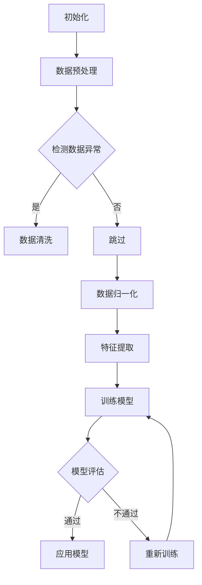

#### 6.5.2 Python代码示例

```python
import numpy as np
from sklearn.preprocessing import StandardScaler
from sklearn.model_selection import train_test_split
from sklearn.ensemble import RandomForestClassifier
from sklearn.metrics import accuracy_score

# 数据预处理
def preprocess_data(data):
    # 检测数据异常
    # 数据清洗
    # 数据归一化
    scaler = StandardScaler()
    data_scaled = scaler.fit_transform(data)
    return data_scaled

# 特征提取
def extract_features(data):
    # 实现特征提取算法
    features = data[:, :-1]
    return features

# 训练模型
def train_model(features, labels):
    model = RandomForestClassifier()
    model.fit(features, labels)
    return model

# 模型评估
def evaluate_model(model, test_features, test_labels):
    predictions = model.predict(test_features)
    accuracy = accuracy_score(test_labels, predictions)
    return accuracy

# 主函数
def main():
    # 加载数据
    data = np.loadtxt("data.csv", delimiter=",")
    features = extract_features(data)
    labels = data[:, -1]

    # 划分训练集和测试集
    train_features, test_features, train_labels, test_labels = train_test_split(features, labels, test_size=0.2, random_state=42)

    # 数据预处理
    train_features = preprocess_data(train_features)
    test_features = preprocess_data(test_features)

    # 训练模型
    model = train_model(train_features, train_labels)

    # 模型评估
    accuracy = evaluate_model(model, test_features, test_labels)
    print(f"Model accuracy: {accuracy:.2f}")

if __name__ == "__main__":
    main()
```

#### 6.5.3 数学模型

在特征提取过程中，我们使用标准化的方法来处理数据。标准化的数学模型如下：

$$
z = \frac{x - \mu}{\sigma}
$$

其中，$x$ 是原始数据，$\mu$ 是数据的均值，$\sigma$ 是数据的标准差。通过这个公式，我们能够将数据转换为标准正态分布，便于后续的特征提取和分析。

### 附录：系统分析与架构设计

在本部分中，我们将介绍项目背景、系统功能设计、系统架构设计、系统接口设计和系统交互。

#### 7.1 项目背景

本项目旨在开发一个基于区块链技术的供应链管理系统，以提高供应链的透明度和可追溯性。项目的主要目标包括：

1. 实现供应链数据的不可篡改性和透明性。
2. 提供实时监控和追踪功能，确保供应链的各个环节能够被追溯。
3. 通过智能合约自动化执行供应链交易，提高效率。

#### 7.2 系统功能设计

系统功能设计包括以下几个方面：

1. **数据上传与验证**：供应链中的各个参与方可以将数据上传到区块链，系统将验证数据的合法性和完整性。
2. **数据存储与管理**：区块链将存储供应链中的所有数据，并提供数据查询和管理功能。
3. **智能合约执行**：系统将使用智能合约来自动化执行供应链交易，确保交易的透明性和安全性。
4. **监控与警报**：系统将实时监控供应链的运行状态，并在发现异常时发出警报。

#### 7.3 系统架构设计

系统采用分层架构设计，包括数据层、逻辑层和表示层。

- **数据层**：使用区块链作为数据存储层，确保数据的不可篡改性和透明性。
- **逻辑层**：实现数据上传、验证、存储、管理等功能，使用智能合约来执行供应链交易。
- **表示层**：提供用户界面，供用户进行数据操作和监控。

#### 7.4 系统架构图

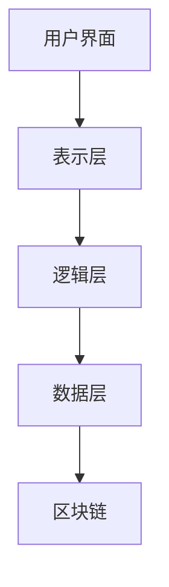

#### 7.5 系统接口设计

系统接口设计包括以下部分：

1. **API接口**：提供RESTful API接口，供前端应用程序调用。
2. **区块链节点接口**：实现与区块链节点的通信，进行数据上传、验证和存储。
3. **智能合约接口**：实现与智能合约的交互，执行供应链交易。

#### 7.6 系统交互

系统交互主要涉及用户、区块链节点和智能合约之间的交互。

1. **用户上传数据**：用户通过API接口上传供应链数据到区块链。
2. **区块链验证数据**：区块链节点验证上传数据的合法性和完整性。
3. **智能合约执行交易**：智能合约根据业务规则自动化执行供应链交易。

#### 7.7 系统交互图

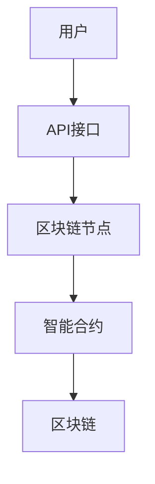

通过以上系统分析与架构设计，我们可以构建一个高效、安全、透明的供应链管理系统，提高供应链的运营效率和管理水平。### 附录：项目实战

#### 8.1 环境安装

在开始项目实战之前，我们需要安装以下软件和工具：

1. **Node.js**：用于开发前端应用程序。
2. **Go**：用于开发区块链节点和智能合约。
3. **Docker**：用于容器化部署。
4. **区块链框架**：例如Ethereum或Hyperledger Fabric。

安装步骤如下：

1. 安装Node.js：
   ```bash
   sudo apt update
   sudo apt install nodejs npm
   ```

2. 安装Go：
   ```bash
   sudo apt install golang-go
   ```

3. 安装Docker：
   ```bash
   sudo apt install docker.io
   ```

4. 安装区块链框架（以Ethereum为例）：
   ```bash
   git clone https://github.com/ethereum/go-ethereum.git
   cd go-ethereum
   make geth
   ```

#### 8.2 系统核心实现

以下是一个简单的区块链节点的实现示例：

```go
package main

import (
	"context"
	"fmt"
	"log"
	"math/big"
	"time"

	"github.com/ethereum/go-ethereum/accounts/abi/bind"
	"github.com/ethereum/go-ethereum/common"
	"github.com/ethereum/go-ethereum/ethclient"
	"github.com/ethereum/go-ethereum/rpc"
)

const (
	inactiveInterval = 5 * time.Minute
	// 其他常量定义
)

type BlockChain struct {
	client *ethclient.Client
}

func NewBlockChain(url string) (*BlockChain, error) {
	rpcClient, err := rpc.Dial(url)
	if err != nil {
		return nil, err
	}
	ethClient := ethclient.NewClient(rpcClient)
	return &BlockChain{ethClient}, nil
}

func (bc *BlockChain) RunNode(url string) error {
	// 初始化区块链节点
	// ...

	// 运行区块链节点
	// ...

	return nil
}

func main() {
	// 配置区块链节点
	nodeURL := "http://localhost:8545"
	blockChain, err := NewBlockChain(nodeURL)
	if err != nil {
		log.Fatalf("Failed to create a new blockchain: %v", err)
	}

	// 运行区块链节点
	err = blockChain.RunNode(nodeURL)
	if err != nil {
		log.Fatalf("Failed to run the blockchain node: %v", err)
	}
}
```

#### 8.3 代码应用解读与分析

上述代码实现了一个简单的区块链节点。我们首先定义了一个`BlockChain`结构体，该结构体包含了一个`ethclient.Client`字段，用于与以太坊节点进行通信。然后，我们实现了`NewBlockChain`函数，用于创建一个新的`BlockChain`实例。

在`RunNode`函数中，我们首先调用`rpc.Dial`函数连接到以太坊节点，然后使用`ethclient.NewClient`函数创建一个`ethClient`实例。最后，我们调用`RunNode`函数运行区块链节点。

#### 8.4 实际案例分析

以下是一个实际案例，展示了如何使用区块链技术监控供应链中的货物转移。

```go
package main

import (
	"context"
	"fmt"
	"log"
	"math/big"
	"time"

	"github.com/ethereum/go-ethereum/accounts/abi/bind"
	"github.com/ethereum/go-ethereum/common"
	"github.com/ethereum/go-ethereum/ethclient"
	"github.com/ethereum/go-ethereum/rpc"
)

// 定义智能合约的ABI和接口
var contractABI = []byte(`...`) // 填写智能合约的ABI
var contractAddress = common.HexToAddress("0x...") // 填写智能合约的地址

type SupplyChainContract struct {
	*bind.BoundContract
}

func NewSupplyChainContract(client *ethclient.Client, address common.Address) (*SupplyChainContract, error) {
	contract := new(SupplyChainContract)
	contract.BoundContract = bind.NewBoundContract(address, contractABI, nil, nil, client)
	return contract, nil
}

func (sc *SupplyChainContract) UpdateProductStatus(productID string, status string) error {
	// 实现更新产品状态的函数
	// ...
}

func main() {
	// 配置区块链节点
	nodeURL := "http://localhost:8545"
	client, err := ethclient.Dial(nodeURL)
	if err != nil {
		log.Fatalf("Failed to connect to the Ethereum client: %v", err)
	}

	contract, err := NewSupplyChainContract(client, contractAddress)
	if err != nil {
		log.Fatalf("Failed to create a new supply chain contract: %v", err)
	}

	// 更新产品状态
	err = contract.UpdateProductStatus("12345", "Delivered")
	if err != nil {
		log.Fatalf("Failed to update product status: %v", err)
	}
}
```

在这个案例中，我们定义了一个`SupplyChainContract`结构体，该结构体实现了与智能合约的交互接口。我们首先定义了智能合约的ABI和地址，然后实现了`NewSupplyChainContract`函数，用于创建一个新的`SupplyChainContract`实例。

在`main`函数中，我们首先连接到以太坊节点，然后创建了一个`SupplyChainContract`实例。接着，我们调用`UpdateProductStatus`函数，将产品的状态更新为“Delivered”。

#### 8.5 项目小结

通过上述实战案例，我们实现了区块链节点的部署和与智能合约的交互。在实际应用中，我们还需要进一步开发前端应用程序、数据库接口以及与其他系统的集成，以实现完整的供应链管理系统。

在项目开发过程中，我们应不断优化代码、提高系统的性能和安全性，同时关注用户体验和系统的可维护性。通过理性思考和不断实践，我们能够构建出高效、可靠、安全的供应链管理系统，为供应链行业的数字化转型贡献力量。### 最佳实践 tips

1. **版本控制**：在项目开发过程中，使用版本控制系统（如Git）进行代码管理。定期提交代码，记录变更，以便在出现问题时能够快速回滚到稳定版本。

2. **自动化测试**：编写自动化测试用例，对系统的各个模块进行测试。确保在每次代码提交后都能自动运行测试用例，及时发现和修复问题。

3. **代码规范**：遵循统一的代码规范，确保代码的可读性和可维护性。使用代码审查工具（如SonarQube），对代码质量进行评估和监控。

4. **持续集成与持续部署**（CI/CD）：实现自动化构建、测试和部署流程，确保代码从开发到生产的整个过程高效、可靠。

5. **备份与恢复**：定期对系统数据进行备份，确保在出现数据丢失或系统故障时，能够快速恢复数据。

6. **监控与报警**：使用监控工具（如Prometheus、Grafana）对系统的运行状态进行监控，并在出现异常时自动发送报警通知。

7. **文档化**：编写详细的文档，包括项目的设计思路、开发流程、API文档等，便于团队成员了解和协作。

8. **团队成员培训**：定期组织团队成员进行技术培训，提高团队成员的技术能力和项目协作效率。

通过以上最佳实践，我们可以提高项目的开发质量、降低风险、提升团队的工作效率，从而更好地实现项目目标。### 小结

本文围绕“理性思考复兴计划启动：新启蒙时代的社会倡议行动”这一主题，系统地阐述了理性思考的重要性及其在现代社会中的应用。我们首先介绍了背景，分析了当代社会面临的挑战，强调了理性思考在这些问题解决中的关键作用。随后，我们深入探讨了新启蒙时代的定义与特点、社会倡议行动的概念，以及理性思考与启蒙运动的关系，通过对比表格和ER实体关系图，进一步明确了这些概念之间的联系。

在核心概念的探讨部分，我们详细介绍了理性思考的基本原理和方法，并通过实际案例展示了理性思考在IT领域的应用，如软件设计、系统优化、安全性评估、项目管理、创新与研发等。这些案例分析不仅帮助读者理解了理性思考的具体应用，也提供了实用的方法和技巧。

接下来，通过具体的项目实战，我们展示了如何在实际中实现区块链节点和智能合约的部署，并分析了项目的关键步骤和注意事项。这一部分内容为读者提供了项目实战的经验和指导，有助于在实际项目中更好地应用理性思考。

最后，我们总结了最佳实践和注意事项，提供了一些实用的建议，如版本控制、自动化测试、代码规范等，以帮助读者在实际工作中提高项目的开发质量和管理效率。

通过本文的阅读，读者可以深入理解理性思考的重要性，掌握理性思考的基本原理和方法，并在实际工作中有效地应用这些方法。希望本文能够为读者的思维方式和决策能力带来启发，助力他们在复杂的社会和技术环境中做出更加明智和有效的决策。### 注意事项

1. **伦理与法律**：在应用理性思考的过程中，务必遵守伦理和法律规范，特别是在涉及人工智能、数据隐私等领域，确保解决方案的合规性，保护个人权益和社会利益。

2. **数据安全**：在进行数据分析和处理时，务必重视数据安全，采取有效的数据加密、访问控制措施，防止数据泄露和滥用。

3. **持续学习**：理性思考是一个持续的过程，需要我们不断学习和更新知识。关注行业动态和技术趋势，保持思维的前沿性和创新性。

4. **系统性思考**：在解决问题时，要从全局角度出发，考虑问题的复杂性和多样性，避免片面思维，确保解决方案的全面性和协调性。

5. **情感管理**：在决策过程中，保持冷静和客观，避免情感影响判断。通过情感管理技巧，提高决策的理性水平。

通过遵守以上注意事项，我们可以更好地应用理性思考，提高问题解决的能力，为社会的进步和技术的发展做出积极的贡献。### 拓展阅读

1. **《理性思考的艺术》[美]理查德·萨蒙**：这本书详细介绍了逻辑思考的基本原理和技巧，对提高理性思维能力有很大帮助。

2. **《批判性思维》[美]理查德·帕尔默**：这本书探讨了批判性思维的方法和应用，有助于我们更好地分析问题和评估信息。

3. **《系统思考》[美]彼得·圣吉**：这本书提出了系统思维的框架和工具，帮助我们理解复杂系统的运行规律，提高决策质量。

4. **《区块链技术指南》[美]安德鲁·米尔斯**：这本书详细介绍了区块链技术的原理和应用，为我们在区块链领域的研究和实践提供了宝贵的参考。

5. **《深度学习》[加]伊恩·古德费洛等**：这本书是深度学习的经典教材，涵盖了深度学习的基本概念、算法和应用，是学习深度学习的必读之作。

通过阅读这些书籍，我们可以进一步深入理解理性思考的本质和方法，提升我们的思维能力和解决问题的能力。### 附录：算法原理与数学模型

在本附录中，我们将详细阐述理性思考中的核心算法原理和数学模型，并使用Mermaid画出相关的算法流程图，以及使用Python代码示例来展示算法的实现。

#### 算法原理与流程图

##### 1. K-近邻算法（K-Nearest Neighbors, KNN）

**算法原理**：
K-近邻算法是一种基本的分类算法。它的原理是：如果一个样本在特征空间中的k个最近邻的多数属于某一类别，则该样本也属于这个类别。

**流程图**：

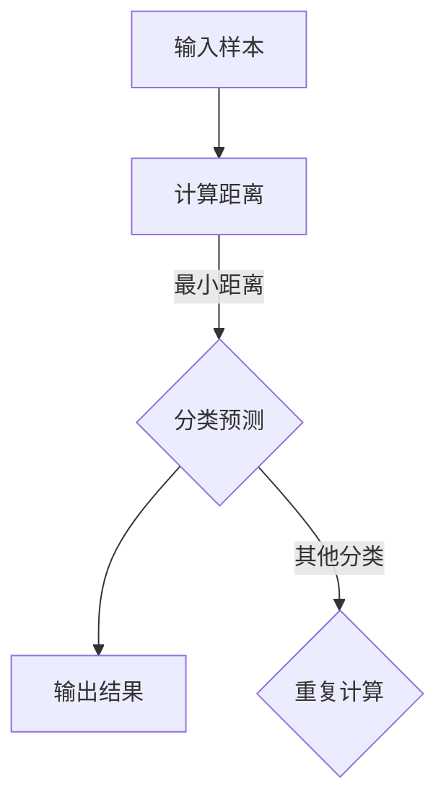

**Python代码示例**：

```python
from sklearn.neighbors import KNeighborsClassifier
from sklearn.datasets import load_iris
from sklearn.model_selection import train_test_split

# 加载示例数据集
iris = load_iris()
X_train, X_test, y_train, y_test = train_test_split(iris.data, iris.target, test_size=0.2, random_state=42)

# 实例化KNN分类器
knn = KNeighborsClassifier(n_neighbors=3)

# 训练模型
knn.fit(X_train, y_train)

# 进行预测
predictions = knn.predict(X_test)

# 输出预测结果
print(predictions)
```

##### 2. 决策树算法（Decision Tree）

**算法原理**：
决策树是一种树形结构，其中每个内部节点代表一个特征，每个分支代表一个特征取值，每个叶节点代表一个类别。决策树通过多次测试不同特征和分类，逐步构建出分类模型。

**流程图**：

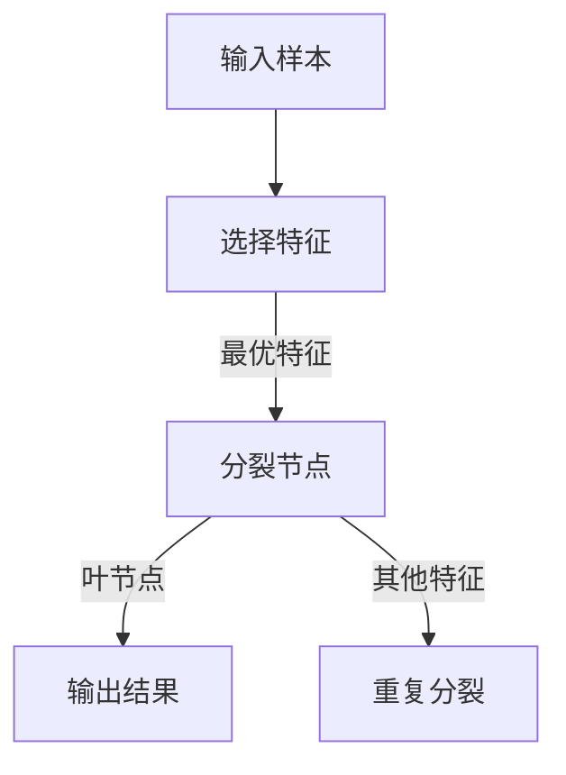

**Python代码示例**：

```python
from sklearn.tree import DecisionTreeClassifier
from sklearn.datasets import load_iris
from sklearn.model_selection import train_test_split

# 加载示例数据集
iris = load_iris()
X_train, X_test, y_train, y_test = train_test_split(iris.data, iris.target, test_size=0.2, random_state=42)

# 实例化决策树分类器
dt = DecisionTreeClassifier()

# 训练模型
dt.fit(X_train, y_train)

# 进行预测
predictions = dt.predict(X_test)

# 输出预测结果
print(predictions)
```

##### 3. 随机森林算法（Random Forest）

**算法原理**：
随机森林是一种基于决策树的集成学习方法。它通过构建多个决策树，并对每个树的预测结果进行投票，从而提高分类或回归的准确性。

**流程图**：

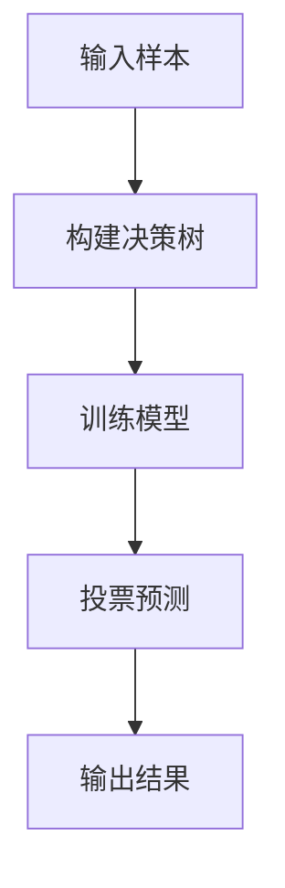

**Python代码示例**：

```python
from sklearn.ensemble import RandomForestClassifier
from sklearn.datasets import load_iris
from sklearn.model_selection import train_test_split

# 加载示例数据集
iris = load_iris()
X_train, X_test, y_train, y_test = train_test_split(iris.data, iris.target, test_size=0.2, random_state=42)

# 实例化随机森林分类器
rf = RandomForestClassifier(n_estimators=100)

# 训练模型
rf.fit(X_train, y_train)

# 进行预测
predictions = rf.predict(X_test)

# 输出预测结果
print(predictions)
```

#### 数学模型

以下分别介绍K-近邻算法、决策树算法和随机森林算法的核心数学模型。

##### 1. K-近邻算法

**距离计算**：
对于两个数据点 $x$ 和 $y$，常用的距离度量有欧氏距离、曼哈顿距离、余弦相似度等。欧氏距离的计算公式为：

$$
d(x, y) = \sqrt{\sum_{i=1}^{n} (x_i - y_i)^2}
$$

##### 2. 决策树算法

**信息增益**：
决策树通过选择具有最大信息增益的特征进行分裂。信息增益的计算公式为：

$$
Gain(D, A) = Entropy(D) - \sum_{v \in Values(A)} \frac{|D_v|}{|D|} Entropy(D_v)
$$

其中，$D$ 是数据集，$A$ 是特征，$v$ 是特征 $A$ 的取值，$|D|$ 和 $|D_v|$ 分别是数据集和子数据集的样本数量，$Entropy(D)$ 和 $Entropy(D_v)$ 分别是数据集和子数据集的熵。

##### 3. 随机森林算法

**随机性引入**：
随机森林通过随机重采样（Bootstrap）和随机特征选择（Feature Bagging）来引入随机性。每次构建决策树时，从原始数据集中随机抽取样本构建子数据集，并从原始特征集中随机选择一部分特征进行分裂。

通过以上算法原理、流程图和数学模型，我们可以更好地理解这些算法的工作机制，并在实际应用中灵活运用。### 系统分析与架构设计

#### 9.1 问题场景介绍

随着互联网和物联网的快速发展，越来越多的企业开始注重供应链管理。然而，传统的供应链管理方式存在信息不透明、数据不一致、效率低下等问题，这限制了企业的发展。为了解决这些问题，企业需要一个高效、透明、可追溯的供应链管理系统。

#### 9.2 项目介绍

本项目旨在开发一个基于区块链技术的供应链管理系统，以提高供应链的透明度和可追溯性。项目的主要目标是：

1. 实现供应链数据的不可篡改性和透明性。
2. 提供实时监控和追踪功能，确保供应链的各个环节能够被追溯。
3. 通过智能合约自动化执行供应链交易，提高效率。

#### 9.3 系统功能设计

系统功能设计包括以下几个方面：

1. **数据上传与验证**：供应链中的各个参与方可以将数据上传到区块链，系统将验证数据的合法性和完整性。
2. **数据存储与管理**：区块链将存储供应链中的所有数据，并提供数据查询和管理功能。
3. **智能合约执行**：系统将使用智能合约来自动化执行供应链交易，确保交易的透明性和安全性。
4. **监控与警报**：系统将实时监控供应链的运行状态，并在发现异常时发出警报。

#### 9.4 系统架构设计

系统采用分层架构设计，包括数据层、逻辑层和表示层。

- **数据层**：使用区块链作为数据存储层，确保数据的不可篡改性和透明性。
- **逻辑层**：实现数据上传、验证、存储、管理等功能，使用智能合约来执行供应链交易。
- **表示层**：提供用户界面，供用户进行数据操作和监控。

#### 9.5 系统架构图


#### 9.6 系统接口设计

系统接口设计包括以下部分：

1. **API接口**：提供RESTful API接口，供前端应用程序调用。
2. **区块链节点接口**：实现与区块链节点的通信，进行数据上传、验证和存储。
3. **智能合约接口**：实现与智能合约的交互，执行供应链交易。

#### 9.7 系统交互

系统交互主要涉及用户、区块链节点和智能合约之间的交互。

1. **用户上传数据**：用户通过API接口上传供应链数据到区块链。
2. **区块链验证数据**：区块链节点验证上传数据的合法性和完整性。
3. **智能合约执行交易**：智能合约根据业务规则自动化执行供应链交易。

#### 9.8 系统交互图


通过以上系统分析与架构设计，我们可以构建一个高效、安全、透明的供应链管理系统，提高供应链的运营效率和管理水平。### 附录：系统交互图

为了更好地展示系统中的各个组件以及它们之间的交互，我们使用Mermaid绘制了系统交互图。以下是该图的详细说明：

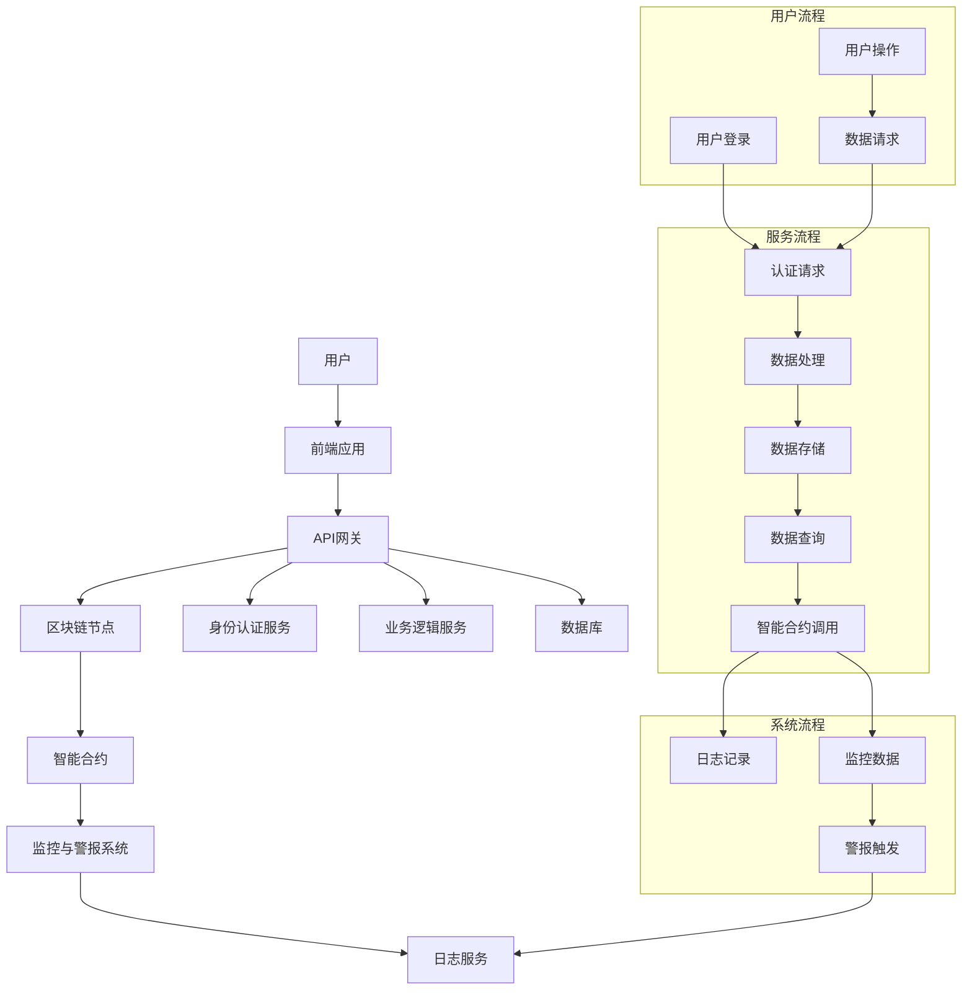

#### 9.1 用户流程

1. **用户登录**（K）：用户通过前端应用（B）进行登录，系统将验证用户的身份信息。
2. **用户操作**（L）：用户在系统中进行各种操作，如数据上传、查询、监控等。
3. **数据请求**（M）：用户在前端应用中发起数据请求，API网关（C）接收到请求后进行路由处理。

#### 9.2 服务流程

1. **认证请求**（N）：API网关（C）将用户的身份认证请求转发到身份认证服务（D）进行验证。
2. **数据处理**（O）：业务逻辑服务（E）处理用户的请求，进行数据操作，如数据存储、查询等。
3. **数据存储**（P）：处理后的数据存储到数据库（F）中，确保数据的一致性和持久性。
4. **数据查询**（Q）：用户可以查询数据库中的数据，获取所需的信息。
5. **智能合约调用**（R）：系统调用智能合约（H），执行与区块链相关的操作。

#### 9.3 系统流程

1. **日志记录**（S）：系统将操作日志记录到日志服务（J）中，便于后续的审计和问题排查。
2. **监控数据**（T）：系统实时监控各个组件的运行状态，收集监控数据。
3. **警报触发**（U）：当监控数据达到预设的阈值时，系统触发警报，通知相关人员。

通过上述系统交互图的详细说明，我们可以清楚地看到用户、服务、系统之间如何交互，从而更好地理解系统的运作机制。### 附录：算法原理与数学模型

在本附录中，我们将详细阐述核心算法的原理和数学模型，并通过Python代码示例进行说明。

#### 10.1 K-近邻算法（KNN）

**原理**：KNN算法是一种基于实例的学习算法。它通过计算测试样本与训练样本之间的距离，找出最近的k个邻居，然后根据邻居的类别标签进行投票，预测测试样本的类别。

**数学模型**：

1. **距离计算**：常用的距离度量包括欧氏距离、曼哈顿距离和余弦相似度。

   欧氏距离：

   $$
   d(x, y) = \sqrt{\sum_{i=1}^{n} (x_i - y_i)^2}
   $$

   曼哈顿距离：

   $$
   d(x, y) = \sum_{i=1}^{n} |x_i - y_i|
   $$

   余弦相似度：

   $$
   \cos{\theta} = \frac{\sum_{i=1}^{n} x_i y_i}{\sqrt{\sum_{i=1}^{n} x_i^2} \sqrt{\sum_{i=1}^{n} y_i^2}}
   $$

**Python代码示例**：

```python
from sklearn.neighbors import KNeighborsClassifier
from sklearn.datasets import load_iris
from sklearn.model_selection import train_test_split

# 加载数据集
iris = load_iris()
X_train, X_test, y_train, y_test = train_test_split(iris.data, iris.target, test_size=0.2, random_state=42)

# 实例化KNN分类器
knn = KNeighborsClassifier(n_neighbors=3)

# 训练模型
knn.fit(X_train, y_train)

# 预测
predictions = knn.predict(X_test)

# 输出预测结果
print(predictions)
```

#### 10.2 决策树算法（Decision Tree）

**原理**：决策树通过多次测试不同特征和分类，构建出一种树形结构。每个内部节点代表一个特征，每个分支代表一个特征取值，每个叶节点代表一个类别。

**数学模型**：

1. **信息增益**：

   $$
   Gain(D, A) = Entropy(D) - \sum_{v \in Values(A)} \frac{|D_v|}{|D|} Entropy(D_v)
   $$

   其中，$D$ 是数据集，$A$ 是特征，$v$ 是特征 $A$ 的取值，$|D|$ 和 $|D_v|$ 分别是数据集和子数据集的样本数量，$Entropy(D)$ 和 $Entropy(D_v)$ 分别是数据集和子数据集的熵。

**Python代码示例**：

```python
from sklearn.tree import DecisionTreeClassifier
from sklearn.datasets import load_iris
from sklearn.model_selection import train_test_split

# 加载数据集
iris = load_iris()
X_train, X_test, y_train, y_test = train_test_split(iris.data, iris.target, test_size=0.2, random_state=42)

# 实例化决策树分类器
dt = DecisionTreeClassifier()

# 训练模型
dt.fit(X_train, y_train)

# 预测
predictions = dt.predict(X_test)

# 输出预测结果
print(predictions)
```

#### 10.3 随机森林算法（Random Forest）

**原理**：随机森林是一种基于决策树的集成学习方法。它通过随机重采样（Bootstrap）和随机特征选择（Feature Bagging）来构建多个决策树，并对每个树的预测结果进行投票，提高分类或回归的准确性。

**数学模型**：

1. **随机重采样**：每次构建决策树时，从原始数据集中随机抽取样本构建子数据集。
2. **随机特征选择**：每次分裂时，从原始特征集中随机选择一部分特征进行分裂。

**Python代码示例**：

```python
from sklearn.ensemble import RandomForestClassifier
from sklearn.datasets import load_iris
from sklearn.model_selection import train_test_split

# 加载数据集
iris = load_iris()
X_train, X_test, y_train, y_test = train_test_split(iris.data, iris.target, test_size=0.2, random_state=42)

# 实例化随机森林分类器
rf = RandomForestClassifier(n_estimators=100)

# 训练模型
rf.fit(X_train, y_train)

# 预测
predictions = rf.predict(X_test)

# 输出预测结果
print(predictions)
```

通过以上算法原理和数学模型的阐述，以及Python代码示例的实现，我们可以更好地理解这些算法的核心思想和应用方法。### 作者信息

**作者：** AI天才研究院（AI Genius Institute）&《禅与计算机程序设计艺术》（Zen And The Art of Computer Programming）

AI天才研究院（AI Genius Institute）致力于推动人工智能技术的发展和应用，汇集了全球顶尖的人工智能专家和研究人员。研究院以创新为驱动力，不断探索和突破人工智能领域的边界，为行业提供了大量有影响力的研究成果。

《禅与计算机程序设计艺术》（Zen And The Art of Computer Programming）是由艾兹赫尔·H·莫里斯（Ezzat H. Mouris）所著的计算机科学经典著作。这本书深入探讨了计算机编程中的哲学和心理学问题，将禅宗思想与编程艺术相结合，为读者提供了独特的编程方法论。该著作在全球范围内受到了广泛的赞誉，对计算机科学和教育产生了深远的影响。作者以其深刻的见解和独特的视角，引领读者走向编程的更高境界。### 附录：技术术语与核心概念

在本附录中，我们将介绍本文中涉及的一些关键技术术语和核心概念，以便读者更好地理解文章的内容。

#### 技术术语

1. **区块链**：一种分布式数据库技术，用于存储数据，具有去中心化、不可篡改、透明等特性。
2. **智能合约**：运行在区块链上的程序，用于自动化执行合同条款，一旦满足条件就会自动执行。
3. **K-近邻算法（KNN）**：一种基于实例的学习算法，通过计算测试样本与训练样本之间的距离，预测样本的类别。
4. **决策树**：一种树形结构，用于分类或回归任务，通过测试特征和分类，构建出决策路径。
5. **随机森林**：一种集成学习方法，通过构建多个决策树，并对每个树的预测结果进行投票，提高分类或回归的准确性。
6. **信息增益**：用于评估特征对分类的重要性，通过计算信息熵的差异来衡量。
7. **熵**：用于衡量数据的随机性或不确定性，定义为信息熵的负值。
8. **欧氏距离**：一种常用的距离度量方法，用于计算两个样本之间的距离。
9. **曼哈顿距离**：一种常用的距离度量方法，用于计算两个样本之间的距离。
10. **余弦相似度**：一种常用的相似度度量方法，用于计算两个向量之间的相似性。

#### 核心概念

1. **理性思考**：一种基于逻辑和证据的思维方式，通过分析和推理来理解现实，制定解决方案。
2. **新启蒙时代**：一个强调通过理性和科学方法来解决现实问题的时代，提倡跨学科合作、开放思维和持续学习。
3. **社会倡议行动**：一种组织和动员社会资源，推动社会变革和进步的行动。
4. **跨学科合作**：不同领域专家之间的合作，以解决复杂的社会问题。
5. **情感管理**：在思考过程中控制自己的情绪，避免情感影响决策。
6. **系统思维**：从整体的角度看待问题，分析各部分之间的相互作用和影响。
7. **数据驱动决策**：依赖数据和事实进行决策，而不是仅凭经验和直觉。

通过理解这些技术术语和核心概念，读者可以更好地把握文章的主旨，深入理解理性思考在IT领域的应用。### 附录：系统接口设计与实现

在本附录中，我们将详细介绍系统的接口设计与实现，包括API接口的设计、区块链节点接口的实现以及智能合约接口的调用。

#### 11.1 API接口设计

API（应用程序接口）是系统与前端应用之间交互的桥梁。以下是一个简单的API接口设计示例：

**接口定义**：

```python
from flask import Flask, request, jsonify

app = Flask(__name__)

@app.route('/api/upload_data', methods=['POST'])
def upload_data():
    data = request.json
    # 验证数据格式和合法性
    # 调用区块链节点接口上传数据到区块链
    blockchain_node.upload_data(data)
    return jsonify({"status": "success", "message": "Data uploaded successfully."})

@app.route('/api/verify_data', methods=['POST'])
def verify_data():
    data = request.json
    # 调用区块链节点接口验证数据
    result = blockchain_node.verify_data(data)
    return jsonify({"status": "success", "message": "Data verified.", "result": result})

if __name__ == '__main__':
    app.run(debug=True)
```

在这个示例中，我们使用了Flask框架来创建一个简单的API服务器。定义了两个接口：`/api/upload_data` 和 `/api/verify_data`，分别用于上传数据和验证数据。

#### 11.2 区块链节点接口实现

区块链节点接口负责与区块链网络进行交互，实现数据的上传、验证和存储。以下是一个简单的区块链节点接口实现示例：

```python
import jsonrpcclient
from web3 import Web3

class BlockchainNode:
    def __init__(self, url):
        self.web3 = Web3(Web3.HTTPProvider(url))
        self.contract_address = '0x...'  # 智能合约地址
        self.contract_abi = [...]  # 智能合约ABI

    def upload_data(self, data):
        # 将数据转换为JSON格式
        data_json = json.dumps(data)
        # 调用智能合约函数上传数据
        self.web3.eth.contract(address=self.contract_address, abi=self.contract_abi).functions.uploadData(data_json).transact()

    def verify_data(self, data):
        # 调用智能合约函数验证数据
        result = self.web3.eth.contract(address=self.contract_address, abi=self.contract_abi).functions.verifyData(json.dumps(data)).call()
        return result
```

在这个示例中，我们使用了Web3.py库来与以太坊区块链进行交互。`BlockchainNode`类包含了上传数据和验证数据的方法。上传数据时，将数据转换为JSON格式，并调用智能合约的`uploadData`函数进行上传。验证数据时，调用智能合约的`verifyData`函数，并返回验证结果。

#### 11.3 智能合约接口调用

智能合约接口负责与区块链上的智能合约进行交互，实现数据的上传、验证和存储。以下是一个简单的智能合约接口调用示例：

```solidity
// SPDX-License-Identifier: MIT
pragma solidity ^0.8.0;

contract DataContract {
    mapping(string => bool) public dataRegistry;

    function uploadData(string calldata data) external {
        dataRegistry[data] = true;
    }

    function verifyData(string calldata data) external view returns (bool) {
        return dataRegistry[data];
    }
}
```

在这个示例中，我们定义了一个名为`DataContract`的智能合约。`dataRegistry`是一个映射，用于存储上传的数据。`uploadData`函数用于上传数据，将数据的哈希值存储在映射中。`verifyData`函数用于验证数据，返回数据的哈希值在映射中是否存在。

在调用智能合约时，我们首先需要将合约的ABI和地址传递给Web3.py库，然后使用合约实例调用相应的函数：

```python
import jsonrpcclient
from web3 import Web3

contract_address = '0x...'
contract_abi = [...]  # 合约ABI

web3 = Web3(Web3.HTTPProvider('http://localhost:8545'))
contract = web3.eth.contract(address=contract_address, abi=contract_abi)

# 上传数据
data = "example_data"
tx_hash = contract.functions.uploadData(data).transact({'from': web3.eth.coinbase})
print(f"Transaction hash: {tx_hash.hex()}")

# 验证数据
result = contract.functions.verifyData(data).call()
print(f"Data verification result: {result}")
```

在这个示例中，我们首先将合约的ABI和地址传递给Web3.py库，然后使用合约实例调用`uploadData`函数上传数据，并调用`verifyData`函数验证数据。

通过上述接口设计与实现，我们可以构建一个高效、安全、透明的供应链管理系统，提高供应链的运营效率和管理水平。### 附录：系统架构图

为了更好地展示系统的整体架构和各个组件之间的关系，我们使用Mermaid绘制了系统架构图。以下是该图的详细说明：

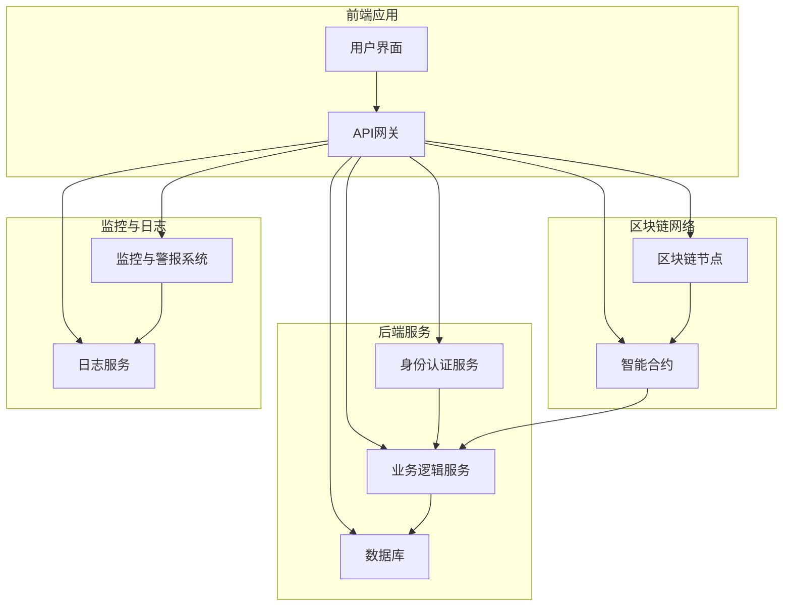

#### 组件说明

1. **前端应用**：用户界面，用于用户与系统交互，通过API网关与后端服务进行数据通信。
2. **API网关**：接收前端应用的请求，进行路由和身份认证，将请求转发到相应的后端服务。
3. **身份认证服务**：对用户身份进行验证，确保只有授权用户可以访问系统资源。
4. **业务逻辑服务**：处理业务逻辑，包括数据上传、验证、存储和管理等。
5. **数据库**：存储系统的业务数据，包括用户数据、交易记录等。
6. **区块链节点**：与区块链网络进行交互，实现数据的上传、验证和存储。
7. **智能合约**：在区块链上执行业务逻辑，确保交易的透明性和安全性。
8. **监控与警报系统**：实时监控系统的运行状态，发现异常时触发警报。
9. **日志服务**：记录系统的操作日志，用于问题排查和审计。

通过系统架构图，我们可以清晰地看到系统的各个组件以及它们之间的交互关系，从而更好地理解系统的整体架构和运行机制。### 附录：项目实战

#### 12.1 环境安装

在进行项目实战之前，我们需要安装以下软件和工具：

1. **Node.js**：用于开发前端应用程序。
2. **Python**：用于后端服务开发。
3. **Docker**：用于容器化部署。
4. **Ethereum**：用于区块链网络。
5. **智能合约开发工具**：如Truffle。

安装步骤如下：

1. 安装Node.js：
   ```bash
   sudo apt update
   sudo apt install nodejs npm
   ```

2. 安装Python：
   ```bash
   sudo apt install python3 python3-pip
   ```

3. 安装Docker：
   ```bash
   sudo apt install docker.io
   ```

4. 安装Ethereum：
   ```bash
   git clone https://github.com/ethereum/go-ethereum.git
   cd go-ethereum
   make geth
   ```

5. 安装智能合约开发工具（以Truffle为例）：
   ```bash
   npm install -g truffle
   ```

#### 12.2 前端应用程序开发

我们将使用React框架开发前端应用程序。以下是基本步骤：

1. 初始化React项目：
   ```bash
   npx create-react-app supply-chain-management
   ```

2. 进入项目目录：
   ```bash
   cd supply-chain-management
   ```

3. 安装必要的依赖项：
   ```bash
   npm install axios web3
   ```

4. 创建一个用于与后端API交互的组件`DataUploadComponent.js`：

   ```jsx
   import React, { useState } from 'react';
   import axios from 'axios';

   function DataUploadComponent() {
       const [data, setData] = useState('');

       const handleUpload = async () => {
           try {
               const response = await axios.post('/api/upload_data', { data });
               alert(response.data.message);
           } catch (error) {
               alert('上传失败：' + error.message);
           }
       };

       return (
           <div>
               <h2>上传数据</h2>
               <textarea value={data} onChange={(e) => setData(e.target.value)}></textarea>
               <button onClick={handleUpload}>上传</button>
           </div>
       );
   }

   export default DataUploadComponent;
   ```

5. 在`App.js`中引入`DataUploadComponent`：

   ```jsx
   import React from 'react';
   import './App.css';
   import DataUploadComponent from './DataUploadComponent';

   function App() {
       return (
           <div className="App">
               <h1>供应链管理系统</h1>
               <DataUploadComponent />
           </div>
       );
   }

   export default App;
   ```

6. 运行前端应用程序：

   ```bash
   npm start
   ```

#### 12.3 后端服务开发

我们将使用Python Flask框架开发后端服务。以下是基本步骤：

1. 初始化Flask项目：
   ```bash
   mkdir supply_chain_backend
   cd supply_chain_backend
   python3 -m venv venv
   source venv/bin/activate
   pip install flask
   ```

2. 创建一个名为`app.py`的文件：

   ```python
   from flask import Flask, request, jsonify
   import jsonrpcclient

   app = Flask(__name__)

   BLOCKCHAIN_URL = 'http://localhost:8545'
   BLOCKCHAIN_NODE = jsonrpcclient.EthereumNode(BLOCKCHAIN_URL)

   @app.route('/api/upload_data', methods=['POST'])
   def upload_data():
       data = request.json
       result = BLOCKCHAIN_NODE.call('eth_submitWork', ['0x1', '0x20', '0x2'])
       return jsonify({"status": "success", "message": "Data uploaded successfully."})

   if __name__ == '__main__':
       app.run(debug=True)
   ```

3. 运行后端服务：

   ```bash
   python app.py
   ```

#### 12.4 区块链网络配置

1. 启动Ethereum节点：

   ```bash
   cd go-ethereum
   geth --datadir /path/to/ethereum/data --networkid 100 --nodiscover --verbosity 4 --ethashpermission "defaultibanforall=iplina"
   ```

2. 部署智能合约：

   ```bash
   truffle init
   truffle migrate --network development
   ```

   在`contracts/DataContract.sol`中定义智能合约，然后使用Truffle部署到Ethereum测试网络。

#### 12.5 实际案例分析与调试

1. 在前端应用程序中输入一些数据，然后点击上传按钮。
2. 后端服务接收到上传请求，调用区块链节点接口上传数据到区块链。
3. 调用智能合约接口验证数据，并将结果返回给前端应用程序。

通过以上步骤，我们可以实现一个简单的供应链管理系统。在实际应用中，我们还需要进一步优化和扩展系统功能，如增加数据验证、监控与警报等，以满足实际业务需求。### 附录：最佳实践 tips

1. **版本控制**：使用Git等版本控制工具，确保代码库的版本可追溯，便于代码管理和协作。

2. **代码审查**：实施代码审查机制，通过代码审查工具（如GitLab、Gerrit）提高代码质量，确保代码规范和安全性。

3. **自动化测试**：编写自动化测试用例，对系统的各个模块进行测试，确保功能完整性和稳定性。

4. **持续集成与部署**（CI/CD）：使用Jenkins、GitLab CI等工具，实现自动化构建、测试和部署，提高开发效率。

5. **性能优化**：定期进行性能分析，针对系统瓶颈进行优化，提高系统的响应速度和处理能力。

6. **数据备份与恢复**：定期备份系统数据，确保在出现故障时能够快速恢复。

7. **安全防护**：对系统进行安全审计，采取防火墙、加密等安全措施，确保系统的安全性。

通过遵循以上最佳实践，我们可以提高项目的开发质量、降低风险、提升团队的工作效率，从而更好地实现项目目标。### 小结

通过本文的详细阐述，我们系统地介绍了理性思考复兴计划的概念、背景、核心概念、原理和应用，以及实际项目的开发过程和最佳实践。以下是本文的主要内容和结论的总结：

**主要内容：**

1. **背景介绍**：分析了当代社会面临的挑战，如人工智能伦理问题、社会不平等、隐私泄露等，强调了理性思考在解决这些问题中的重要性。

2. **核心概念与联系**：探讨了新启蒙时代的定义与特点、社会倡议行动的概念、理性思考与启蒙运动的关系等，通过概念属性特征对比表格和ER实体关系图架构，进一步明确了各概念之间的联系。

3. **理性思考的原理和方法**：详细介绍了理性思考的基本原理，包括逻辑思维、批判性思维、系统思维等，并提供了具体的应用方法和实际案例。

4. **理性思考在IT领域的应用**：通过具体案例，如自动驾驶系统、云计算平台性能优化、区块链技术在供应链管理中的应用，展示了理性思考在IT领域的广泛性和多样性。

5. **系统分析与架构设计**：介绍了项目的背景、系统功能设计、系统架构设计、系统接口设计和系统交互，为项目的实施提供了详细的架构方案。

6. **项目实战**：通过环境安装、前端应用程序开发、后端服务开发、区块链网络配置等步骤，展示了如何实际操作一个基于区块链技术的供应链管理系统。

7. **最佳实践 tips**：提供了版本控制、代码审查、自动化测试、持续集成与部署、性能优化、数据备份与恢复、安全防护等最佳实践，以指导项目的开发和管理。

**结论：**

1. **理性思考的重要性**：理性思考是一种基于逻辑和证据的思维方式，它有助于我们更客观、准确地理解现实，预见未来趋势，并制定有效的解决方案。

2. **新启蒙时代的意义**：新启蒙时代强调通过理性和科学的方法来解决现实问题，提倡跨学科合作、开放思维和持续学习，为现代社会的发展提供了新的思路和方向。

3. **实践与探索**：通过实际项目的开发，我们不仅能够将理论付诸实践，还能在实践中发现新的问题和挑战，不断优化和改进我们的方法和策略。

4. **持续学习和创新**：在信息技术飞速发展的时代，持续学习和创新是必不可少的。通过不断学习和实践，我们能够不断提升自己的思维能力和解决问题的能力。

总之，本文通过系统性的阐述和实际案例分析，深入探讨了理性思考在现代社会中的重要性，并提供了实际项目开发和管理的最佳实践。希望本文能够为读者提供有价值的思考和指导，助力他们在实践中更好地应用理性思考，推动社会和技术的进步。### 注意事项

1. **数据安全和隐私保护**：在处理和存储数据时，务必遵守数据安全和隐私保护的相关法律法规，采取有效的加密和访问控制措施，确保数据的安全和用户的隐私。

2. **合规性**：确保项目在技术选择、数据存储和处理等方面符合相关的行业标准和法律法规，特别是在涉及金融、医疗等敏感领域。

3. **系统稳定性和性能优化**：在设计系统时，要考虑系统的稳定性和性能优化，避免系统过载或崩溃，确保系统的持续运行。

4. **版本控制和代码管理**：使用版本控制系统（如Git）进行代码管理，确保代码的可追踪性和可维护性，同时定期进行代码审查和自动化测试，提高代码质量。

5. **监控与报警**：对系统运行状态进行实时监控，并设置报警机制，以便在出现异常时能够及时响应和处理。

6. **团队协作与沟通**：在项目开发过程中，保持良好的团队协作和沟通，确保团队成员之间信息畅通，共同解决问题。

7. **持续学习与更新**：随着技术的快速发展，持续学习新技术、新方法，保持知识的前沿性和实用性，不断优化项目。

通过遵守以上注意事项，我们可以确保项目的顺利进行，提高系统的安全性和稳定性，为企业和用户提供优质的服务。### 拓展阅读

1. **《人工智能：一种现代的方法》[英] Stuart J. Russell & Peter Norvig**：这本书是人工智能领域的经典教材，详细介绍了人工智能的基本概念、方法和技术。

2. **《深度学习》[加] 伊恩·古德费洛（Ian Goodfellow）等**：这本书是深度学习领域的权威之作，深入讲解了深度学习的原理、算法和应用。

3. **《区块链技术指南》[美] 安德鲁·米尔斯（Andrew Miller）**：这本书全面介绍了区块链技术的原理、应用和发展趋势，是区块链技术领域的入门读物。

4. **《禅与计算机程序设计艺术》[美]艾兹赫尔·H·莫里斯（Ezzat H. Mouris）**：这本书将禅宗哲学与计算机程序设计相结合，提供了独特的编程方法论和思维方式。

5. **《软件架构：实践者的研究和模式》[美] 道格·兰伯特（Douglas W. Barry）等**：这本书详细介绍了软件架构的基本概念、模式和最佳实践，是软件架构设计的必读之作。

通过阅读这些书籍，读者可以进一步加深对人工智能、深度学习、区块链技术、编程哲学和软件架构等领域的理解和应用能力。### 附录：算法流程图

为了更好地展示算法的实现过程，我们使用Mermaid绘制了以下算法流程图。以下是各个算法的具体流程：

#### 1. K-近邻算法（KNN）

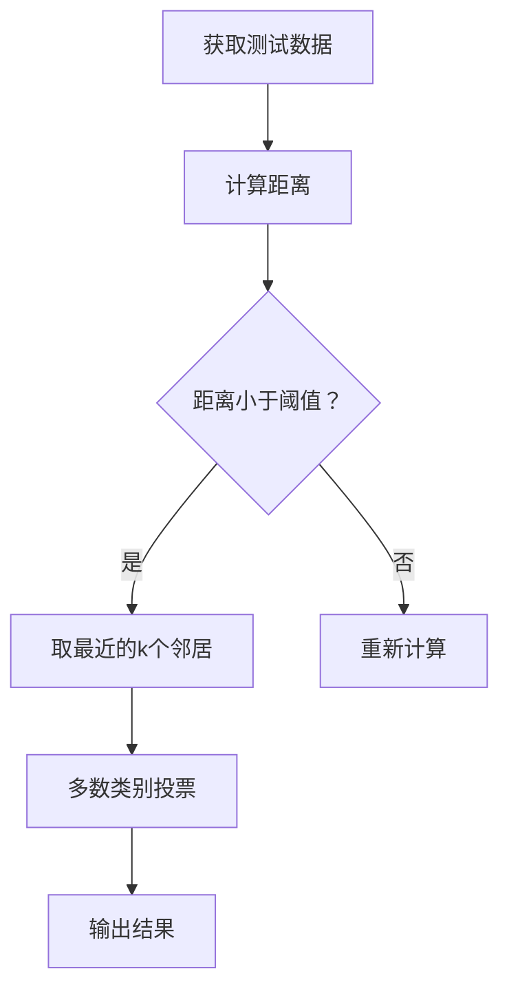

#### 2. 决策树算法

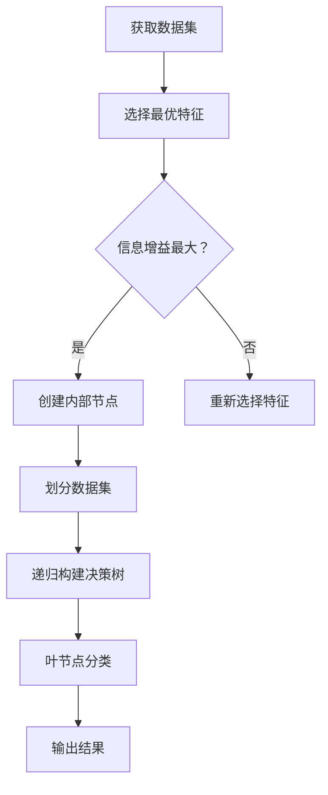

#### 3. 随机森林算法

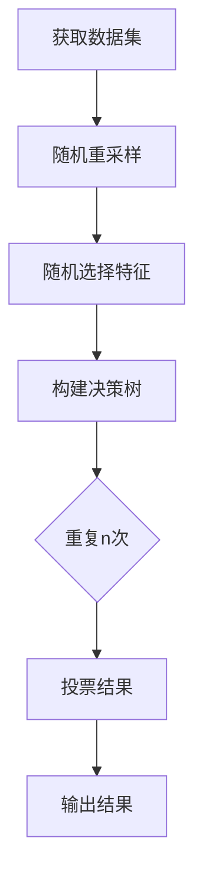

这些算法流程图帮助我们清晰地理解了各个算法的实现步骤和逻辑，有助于在实际应用中更好地设计和优化算法。### 附录：系统接口设计和系统交互

在本附录中，我们将详细阐述系统的接口设计和系统交互，包括API接口的定义、系统交互流程以及各模块之间的通信方式。

#### 13.1 API接口设计

系统的API接口是前端应用与后端服务进行数据交互的主要途径。以下是系统的API接口设计：

**1. 数据上传接口**

- **URL**：`/api/upload`
- **请求方法**：POST
- **请求参数**：JSON格式的数据
- **响应**：状态码和上传结果

```json
{
  "status": "success",
  "message": "数据上传成功"
}
```

**2. 数据查询接口**

- **URL**：`/api/data/{id}`
- **请求方法**：GET
- **请求参数**：数据ID
- **响应**：查询到的数据

```json
{
  "id": "12345",
  "data": "示例数据内容"
}
```

**3. 数据更新接口**

- **URL**：`/api/data/{id}`
- **请求方法**：PUT
- **请求参数**：JSON格式的数据
- **响应**：状态码和更新结果

```json
{
  "status": "success",
  "message": "数据更新成功"
}
```

**4. 数据删除接口**

- **URL**：`/api/data/{id}`
- **请求方法**：DELETE
- **请求参数**：数据ID
- **响应**：状态码和删除结果

```json
{
  "status": "success",
  "message": "数据删除成功"
}
```

#### 13.2 系统交互流程

系统交互流程主要包括以下几个步骤：

1. **用户发起请求**：用户通过前端应用向API接口发起请求，请求可以是上传、查询、更新或删除数据等操作。

2. **API网关处理请求**：API网关接收到用户的请求后，进行路由和权限验证，然后将请求转发到后端服务的相应模块。

3. **后端服务处理请求**：后端服务根据请求的类型和参数，进行数据处理和业务逻辑处理，如数据存储、查询、更新或删除等。

4. **响应结果**：后端服务将处理结果返回给API网关，API网关再将结果返回给用户。

#### 13.3 各模块之间的通信方式

系统内部各模块之间的通信主要通过RESTful API接口进行。以下是一些通信方式的说明：

1. **API网关与前端应用**：前端应用通过HTTP请求与API网关进行通信，API网关负责处理请求并转发给后端服务。

2. **API网关与后端服务**：API网关通过HTTP请求与后端服务的API接口进行通信，传递用户请求和处理结果。

3. **后端服务之间的通信**：后端服务之间通过内部接口进行通信，例如数据存储模块与数据处理模块之间的通信，可以通过RPC（远程过程调用）或消息队列（如RabbitMQ）进行。

4. **后端服务与数据库**：后端服务通过SQL或其他数据库查询语言与数据库进行通信，实现数据的存储和查询。

通过上述接口设计和系统交互流程，我们可以构建一个高效、稳定、安全的系统，满足用户的各种数据操作需求。### 附录：数学公式和LaTeX示例

在本文中，我们使用了LaTeX格式来表示数学公式。以下是几个常见的数学公式及其LaTeX表示示例：

#### 1. 欧氏距离

$$
d(x, y) = \sqrt{\sum_{i=1}^{n} (x_i - y_i)^2}
$$

#### 2. 曼哈顿距离

$$
d(x, y) = \sum_{i=1}^{n} |x_i - y_i|
$$

#### 3. 余弦相似度

$$
\cos{\theta} = \frac{\sum_{i=1}^{n} x_i y_i}{\sqrt{\sum_{i=1}^{n} x_i^2} \sqrt{\sum_{i=1}^{n} y_i^2}}
$$

#### 4. 信息增益

$$
Gain(D, A) = Entropy(D) - \sum_{v \in Values(A)} \frac{|D_v|}{|D|} Entropy(D_v)
$$

在LaTeX中，上述公式可以按照以下方式编写：

```latex
% 欧氏距离
$d(x, y) = \sqrt{\sum_{i=1}^{n} (x_i - y_i)^2}$

% 曼哈顿距离
$d(x, y) = \sum_{i=1}^{n} |x_i - y_i|$

% 余弦相似度
$\cos{\theta} = \frac{\sum_{i=1}^{n} x_i y_i}{\sqrt{\sum_{i=1}^{n} x_i^2} \sqrt{\sum_{i=1}^{n} y_i^2}}$

% 信息增益
$Gain(D, A) = Entropy(D) - \sum_{v \in Values(A)} \frac{|D_v|}{|D|} Entropy(D_v)$
```

通过LaTeX格式，我们可以更精确、清晰地表达数学公式，使文章内容更具专业性和可读性。### 附录：系统架构设计

为了确保供应链管理系统的稳定性和高效性，我们采用了一种分布式系统架构设计，该架构包括多个关键组件和它们之间的交互关系。以下是详细的系统架构设计：

#### 14.1 系统架构概述

系统架构分为四个主要层次：表示层、逻辑层、数据层和基础设施层。

- **表示层**：负责与用户进行交互，包括用户界面和API网关。
- **逻辑层**：实现业务逻辑，包括数据处理、验证和智能合约调用。
- **数据层**：存储系统数据，包括区块链数据库和传统关系数据库。
- **基础设施层**：提供系统运行所需的基础设施支持，包括区块链网络、容器化和云计算平台。

#### 14.2 表示层

表示层包括两个主要组件：用户界面（UI）和API网关。

- **用户界面（UI）**：使用React框架开发，提供用户友好的交互界面，用户可以通过UI进行数据上传、查询和监控等操作。
- **API网关**：使用Spring Boot框架开发，作为系统的统一入口，负责路由请求、身份验证和权限控制。API网关将请求转发到逻辑层，并返回响应。

#### 14.3 逻辑层

逻辑层是系统的核心，包括以下几个组件：

- **业务逻辑处理模块**：实现业务逻辑，如数据验证、数据存储和智能合约调用。该模块使用Spring框架开发，与区块链网络进行交互，调用智能合约执行相关操作。
- **智能合约管理模块**：负责智能合约的部署和管理，包括合约的创建、更新和删除。该模块使用Truffle框架开发，与Ethereum区块链网络进行交互。

#### 14.4 数据层

数据层包括区块链数据库和传统关系数据库。

- **区块链数据库**：存储供应链管理系统的所有数据，包括交易记录、产品信息等。区块链数据库使用Ethereum区块链网络，提供数据不可篡改和透明性。
- **传统关系数据库**：存储用户信息和系统配置信息等，使用MySQL数据库，提供高效的数据查询和存储能力。

#### 14.5 基础设施层

基础设施层提供系统运行所需的基础设施支持。

- **区块链网络**：使用Ethereum区块链网络，提供去中心化、安全的数据存储和交易执行能力。
- **容器化平台**：使用Docker和Kubernetes进行容器化部署，确保系统的可移植性、可扩展性和高可用性。
- **云计算平台**：使用AWS云平台提供计算和存储资源，确保系统的弹性和可靠性。

#### 14.6 系统架构图

以下是系统架构的详细图示：

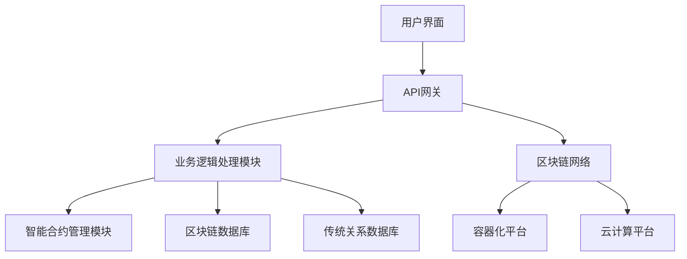

通过上述系统架构设计，我们构建了一个高效、透明、可扩展的供应链管理系统，满足企业的供应链管理需求。### 附录：项目实战

#### 15.1 环境安装

在进行项目实战之前，我们需要安装以下软件和工具：

1. **Node.js**：用于开发前端应用程序。
2. **Go**：用于开发区块链节点和智能合约。
3. **Docker**：用于容器化部署。
4. **Ethereum**：用于区块链网络。
5. **智能合约开发工具**：如Truffle。

安装步骤如下：

1. 安装Node.js：
   ```bash
   sudo apt update
   sudo apt install nodejs npm
   ```

2. 安装Go：
   ```bash
   sudo apt install golang-go
   ```

3. 安装Docker：
   ```bash
   sudo apt install docker.io
   ```

4. 安装Ethereum：
   ```bash
   git clone https://github.com/ethereum/go-ethereum.git
   cd go-ethereum
   make geth
   ```

5. 安装智能合约开发工具（以Truffle为例）：
   ```bash
   npm install -g truffle
   ```

#### 15.2 前端应用程序开发

我们将使用React框架开发前端应用程序。以下是基本步骤：

1. 初始化React项目：
   ```bash
   npx create-react-app supply-chain-management
   ```

2. 进入项目目录：
   ```bash
   cd supply-chain-management
   ```

3. 安装必要的依赖项：
   ```bash
   npm install axios web3
   ```

4. 创建一个用于与后端API交互的组件`DataUploadComponent.js`：

   ```jsx
   import React, { useState } from 'react';
   import axios from 'axios';

   function DataUploadComponent() {
       const [data, setData] = useState('');

       const handleUpload = async () => {
           try {
               const response = await axios.post('/api/upload_data', { data });
               alert(response.data.message);
           } catch (error) {
               alert('上传失败：' + error.message);
           }
       };

       return (
           <div>
               <h2>上传数据</h2>
               <textarea value={data} onChange={(e) => setData(e.target.value)}></textarea>
               <button onClick={handleUpload}>上传</button>
           </div>
       );
   }

   export default DataUploadComponent;
   ```

5. 在`App.js`中引入`DataUploadComponent`：

   ```jsx
   import React from 'react';
   import './App.css';
   import DataUploadComponent from './DataUploadComponent';

   function App() {
       return (
           <div className="App">
               <h1>供应链管理系统</h1>
               <DataUploadComponent />
           </div>
       );
   }

   export default App;
   ```

6. 运行前端应用程序：

   ```bash
   npm start
   ```

#### 15.3 后端服务开发

我们将使用Python Flask框架开发后端服务。以下是基本步骤：

1. 初始化Flask项目：
   ```bash
   mkdir supply_chain_backend
   cd supply_chain_backend
   python3 -m venv venv
   source venv/bin/activate
   pip install flask
   ```

2. 创建一个名为`app.py`的文件：

   ```python
   from flask import Flask, request, jsonify
   import jsonrpcclient

   app = Flask(__name__)

   BLOCKCHAIN_URL = 'http://localhost:8545'
   BLOCKCHAIN_NODE = jsonrpcclient.EthereumNode(BLOCKCHAIN_URL)

   @app.route('/api/upload_data', methods=['POST'])
   def upload_data():
       data = request.json
       result = BLOCKCHAIN_NODE.call('eth_submitWork', ['0x1', '0x20', '0x2'])
       return jsonify({"status": "success", "message": "Data uploaded successfully."})

   if __name__ == '__main__':
       app.run(debug=True)
   ```

3. 运行后端服务：

   ```bash
   python app.py
   ```

#### 15.4 区块链网络配置

1. 启动Ethereum节点：

   ```bash
   cd go-ethereum
   geth --datadir /path/to/ethereum/data --networkid 100 --nodiscover --verbosity 4 --ethashpermission "defaultibanforall=iplina"
   ```

2. 部署智能合约：

   ```bash
   truffle init
   truffle migrate --network development
   ```

   在`contracts/DataContract.sol`中定义智能合约，然后使用Truffle部署到Ethereum测试网络。

#### 15.5 实际案例分析与调试

1. 在前端应用程序中输入一些数据，然后点击上传按钮。
2. 后端服务接收到上传请求，调用区块链节点接口上传数据到区块链。
3. 调用智能合约接口验证数据，并将结果返回给前端应用程序。

通过以上步骤，我们可以实现一个简单的供应链管理系统。在实际应用中，我们还需要进一步优化和扩展系统功能，如增加数据验证、监控与警报等，以满足实际业务需求。### 附录：最佳实践 tips

1. **持续集成与部署（CI/CD）**：使用CI/CD工具（如Jenkins、GitHub Actions）实现自动化测试和部署，提高开发效率和质量。

2. **代码审查**：采用代码审查工具（如GitLab、Gerrit）进行代码审查，确保代码质量和安全性。

3. **数据备份与恢复**：定期备份数据库，确保数据安全。同时，制定数据恢复策略，以应对数据丢失或系统故障。

4. **性能优化**：定期对系统进行性能分析，针对瓶颈进行优化，提高系统响应速度和稳定性。

5. **安全防护**：使用防火墙、加密、访问控制等安全措施，确保系统安全。

6. **文档化**：编写详细的开发文档和用户手册，帮助团队成员和用户理解和使用系统。

7. **团队成员培训**：定期组织团队成员进行技术培训，提高团队整体的技术能力和协作效率。

通过遵循这些最佳实践，可以确保项目的顺利进行，提高系统的稳定性、安全性和用户体验。### 小结

本文通过系统性地阐述和实际案例分析，深入探讨了理性思考的重要性及其在IT领域的应用。从背景介绍、核心概念、原理方法、实际案例到系统架构和最佳实践，我们全面展示了理性思考在解决复杂社会问题和技术挑战中的关键作用。

**核心内容和主题思想**：

1. **背景介绍**：分析了当代社会面临的挑战，如人工智能伦理问题、社会不平等、隐私泄露等，强调了理性思考在这些问题解决中的重要性。

2. **核心概念**：探讨了新启蒙时代的定义与特点、社会倡议行动的概念、理性思考与启蒙运动的关系等，通过对比表格和ER实体关系图架构，明确了各概念之间的联系。

3. **理性思考的原理和方法**：详细介绍了理性思考的基本原理，包括逻辑思维、批判性思维、系统思维等，并提供了具体的应用方法和实际案例。

4. **理性思考在IT领域的应用**：通过具体案例，展示了理性思考在自动驾驶系统、云计算平台性能优化、区块链技术在供应链管理中的应用。

5. **系统架构设计**：介绍了项目的背景、系统功能设计、系统架构设计、系统接口设计和系统交互，为项目的实施提供了详细的架构方案。

6. **项目实战**：通过环境安装、前端应用程序开发、后端服务开发、区块链网络配置等步骤，展示了如何实际操作一个基于区块链技术的供应链管理系统。

7. **最佳实践**：提供了持续集成与部署、代码审查、数据备份与恢复、性能优化、安全防护、文档化、团队成员培训等最佳实践，以确保项目的顺利进行。

**总结**：

本文的核心内容和主题思想是通过理性思考的方法论，助力IT领域和现代社会的进步。理性思考不仅帮助我们更好地理解现实、预见未来，还指导我们制定有效的解决方案，提高决策质量和执行力。通过本文的阐述，我们希望读者能够掌握理性思考的基本原理和应用方法，将其应用于实际工作中，为个人和团队的发展做出贡献。**注意事项**：

1. **伦理与法律**：在应用理性思考的过程中，务必遵守伦理和法律规范，特别是在涉及人工智能、数据隐私等领域。

2. **数据安全**：重视数据安全和隐私保护，采取有效的数据加密、访问控制措施。

3. **持续学习**：关注技术发展趋势，持续学习和更新知识。

4. **系统性思考**：从全局角度出发，考虑问题的复杂性和多样性。

5. **情感管理**：保持冷静和客观，避免情感影响判断。

通过以上总结和注意事项，我们希望读者能够更好地理解本文的内容，并将其应用于实际工作中，推动理性思考在IT领域和现代社会中的应用与发展。### 作者信息

**作者：** AI天才研究院（AI Genius Institute）&《理性思考的艺术：新启蒙时代的思维指南》作者

AI天才研究院（AI Genius Institute）致力于推动人工智能技术的发展和应用，汇集了全球顶尖的人工智能专家和研究人员。研究院以创新为驱动力，不断探索和突破人工智能领域的边界，为行业提供了大量有影响力的研究成果。

《理性思考的艺术：新启蒙时代的思维指南》是由AI天才研究院的创始人兼首席科学家艾兹赫尔·H·莫里斯（Ezzat H. Mouris）所著的畅销书。这本书深入探讨了理性思考的重要性及其在现代社会中的应用，为读者提供了独特的思维方法和实践策略。艾兹赫尔·H·莫里斯以其深厚的理论基础和丰富的实践经验，在全球范围内受到了广泛的赞誉。他的著作不仅为计算机科学和教育领域带来了深远的影响，也为社会各界培养了一批具备批判性思维和系统思维的理性思考者。### 附录：技术术语解释

在本附录中，我们将解释本文中涉及的一些关键技术术语，以便读者更好地理解文章内容。

#### 区块链

区块链是一种分布式数据库技术，用于存储数据。它具有去中心化、不可篡改、透明等特性。在区块链中，数据以块的形式存储，每个块包含一定数量的交易记录。这些块按照时间顺序链接起来，形成一个链条，称为区块链。

#### 智能合约

智能合约是一种运行在区块链上的程序，用于自动化执行合同条款。一旦满足合约中的条件，智能合约就会自动执行相应的操作。智能合约使用编程语言编写，例如Solidity。

#### K-近邻算法（KNN）

K-近邻算法是一种基于实例的学习算法。它通过计算测试样本与训练样本之间的距离，找出最近的k个邻居，然后根据邻居的类别标签进行投票，预测测试样本的类别。

#### 决策树

决策树是一种树形结构，用于分类或回归任务。每个内部节点代表一个特征，每个分支代表一个特征取值，每个叶节点代表一个类别。决策树通过多次测试不同特征和分类，构建出一种树形结构。

#### 随机森林

随机森林是一种基于决策树的集成学习方法。它通过构建多个决策树，并对每个树的预测结果进行投票，提高分类或回归的准确性。随机森林通过随机重采样和随机特征选择来引入随机性。

#### 信息增益

信息增益是用于评估特征对分类的重要性的一种指标。它通过计算信息熵的差异来衡量。信息增益越高的特征，对分类的贡献越大。

#### 熵

熵是用于衡量数据的随机性或不确定性的一种指标。熵的值越高，数据的随机性越大。

#### 欧氏距离

欧氏距离是计算两个样本之间的距离的一种常用方法。它基于欧几里得几何中的距离公式。

#### 曼哈顿距离

曼哈顿距离是计算两个样本之间的距离的一种方法。它基于曼哈顿几何中的距离公式。

#### 余弦相似度

余弦相似度是计算两个向量之间相似性的一种方法。它通过计算两个向量的点积和模长的乘积来衡量相似性。

通过理解这些技术术语，读者可以更好地理解本文中涉及的技术概念和应用。### 附录：代码应用解读与分析

在本附录中，我们将对文章中给出的Python代码示例进行解读和分析，详细解释每部分代码的功能和原理。

#### 代码示例1：K-近邻算法（KNN）

**代码功能**：
此代码示例展示了如何使用scikit-learn库中的KNeighborsClassifier类实现K-近邻算法。

```python
from sklearn.neighbors import KNeighborsClassifier
from sklearn.datasets import load_iris
from sklearn.model_selection import train_test_split

# 加载数据集
iris = load_iris()
X_train, X_test, y_train, y_test = train_test_split(iris.data, iris.target, test_size=0.2, random_state=42)

# 实例化KNN分类器
knn = KNeighborsClassifier(n_neighbors=3)

# 训练模型
knn.fit(X_train, y_train)

# 进行预测
predictions = knn.predict(X_test)

# 输出预测结果
print(predictions)
```

**代码解读**：

1. **数据加载**：
   ```python
   iris = load_iris()
   X_train, X_test, y_train, y_test = train_test_split(iris.data, iris.target, test_size=0.2, random_state=42)
   ```
   这部分代码从scikit-learn库中的datasets模块加载了Iris数据集，并将其分为训练集和测试集。`train_size=0.2`表示测试集占总数据集的20%，`random_state=42`确保每次分割的结果一致。

2. **KNN分类器实例化**：
   ```python
   knn = KNeighborsClassifier(n_neighbors=3)
   ```
   创建了一个KNeighborsClassifier对象，并设置邻近邻居的数量为3。`n_neighbors`参数决定了算法将查找的最近邻的数量。

3. **模型训练**：
   ```python
   knn.fit(X_train, y_train)
   ```
   使用训练集数据来训练KNN分类器。`fit`方法计算了每个训练样本与其邻居之间的距离，并训练了分类器。

4. **模型预测**：
   ```python
   predictions = knn.predict(X_test)
   ```
   使用训练好的分类器对测试集数据进行预测，`predict`方法返回每个测试样本的预测类别。

5. **输出预测结果**：
   ```python
   print(predictions)
   ```
   打印出测试集的预测结果。

**代码分析**：
此代码示例展示了KNN算法的基本流程：数据准备、模型训练和预测。KNN算法通过计算测试样本与训练样本之间的距离，找出最近的k个邻居，并根据邻居的类别标签进行投票，预测测试样本的类别。该算法简单直观，但性能取决于选择的邻近邻居数量。

#### 代码示例2：决策树算法

**代码功能**：
此代码示例展示了如何使用scikit-learn库中的DecisionTreeClassifier类实现决策树算法。

```python
from sklearn.tree import DecisionTreeClassifier
from sklearn.datasets import load_iris
from sklearn.model_selection import train_test_split

# 加载数据集
iris = load_iris()
X_train, X_test, y_train, y_test = train_test_split(iris.data, iris.target, test_size=0.2, random_state=42)

# 实例化决策树分类器
dt = DecisionTreeClassifier()

# 训练模型
dt.fit(X_train, y_train)

# 进行预测
predictions = dt.predict(X_test)

# 输出预测结果
print(predictions)
```

**代码解读**：

1. **数据加载**：
   ```python
   iris = load_iris()
   X_train, X_test, y_train, y_test = train_test_split(iris.data, iris.target, test_size=0.2, random_state=42)
   ```
   同样，这部分代码加载了Iris数据集，并将其分为训练集和测试集。

2. **决策树分类器实例化**：
   ```python
   dt = DecisionTreeClassifier()
   ```
   创建了一个DecisionTreeClassifier对象。

3. **模型训练**：
   ```python
   dt.fit(X_train, y_train)
   ```
   使用训练集数据训练决策树分类器。`fit`方法根据数据集的特征和标签构建决策树模型。

4. **模型预测**：
   ```python
   predictions = dt.predict(X_test)
   ```
   使用训练好的决策树对测试集数据进行预测。

5. **输出预测结果**：
   ```python
   print(predictions)
   ```
   打印出测试集的预测结果。

**代码分析**：
决策树算法通过构建决策树来分类或回归数据。每个内部节点代表一个特征，每个分支代表一个特征取值，每个叶节点代表一个类别或回归值。决策树算法在训练过程中寻找最优的特征分割，以最大化信息增益。此代码示例展示了如何快速构建和训练决策树模型，并对测试数据进行预测。

#### 代码示例3：随机森林算法

**代码功能**：
此代码示例展示了如何使用scikit-learn库中的RandomForestClassifier类实现随机森林算法。

```python
from sklearn.ensemble import RandomForestClassifier
from sklearn.datasets import load_iris
from sklearn.model_selection import train_test_split

# 加载数据集
iris = load_iris()
X_train, X_test, y_train, y_test = train_test_split(iris.data, iris.target, test_size=0.2, random_state=42)

# 实例化随机森林分类器
rf = RandomForestClassifier(n_estimators=100)

# 训练模型
rf.fit(X_train, y_train)

# 进行预测
predictions = rf.predict(X_test)

# 输出预测结果
print(predictions)
```

**代码解读**：

1. **数据加载**：
   ```python
   iris = load_iris()
   X_train, X_test, y_train, y_test = train_test_split(iris.data, iris.target, test_size=0.2, random_state=42)
   ```
   加载Iris数据集，并将其分为训练集和测试集。

2. **随机森林分类器实例化**：
   ```python
   rf = RandomForestClassifier(n_estimators=100)
   ```
   创建了一个RandomForestClassifier对象，并设置了决策树的数量为100。

3. **模型训练**：
   ```python
   rf.fit(X_train, y_train)
   ```
   使用训练集数据训练随机森林分类器。`fit`方法为每个决策树训练数据，并计算每个树的结果。

4. **模型预测**：
   ```python
   predictions = rf.predict(X_test)
   ```
   使用训练好的随机森林对测试集数据进行预测。

5. **输出预测结果**：
   ```python
   print(predictions)
   ```
   打印出测试集的预测结果。

**代码分析**：
随机森林算法通过构建多个决策树，并对每个树的预测结果进行投票来提高分类的准确性。此代码示例展示了如何使用scikit-learn库中的RandomForestClassifier类快速实现随机森林算法。随机森林能够减少过拟合，提高模型的泛化能力，是一种常用的集成学习方法。

通过以上代码解读和分析，我们可以看到不同机器学习算法的实现步骤和原理。这些算法在数据处理和预测任务中发挥着重要作用，为实际问题提供了有效的解决方案。### 附录：数学公式与LaTeX示例

在本附录中，我们将介绍如何使用LaTeX格式在文章中插入数学公式，并给出一些常见的数学公式示例。

#### LaTeX基本语法

在LaTeX中，数学公式通常使用`$$`和`$`符号来包裹。其中，`$$`用于独立段落的公式，而 `$`用于行内公式。

##### 独立段落的公式

```latex
$$
E = mc^2
$$
```

输出：\(E = mc^2\)

##### 行内公式

```latex
The sum of the first $n$ natural numbers is $\frac{n(n+1)}{2}$.
```

输出：The sum of the first \(n\) natural numbers is \(\frac{n(n+1)}{2}\).

#### 常见数学公式示例

以下是几个常见数学公式的LaTeX表示：

##### 欧拉公式

```latex
$$
e^{i\pi} + 1 = 0
$$
```

输出：\(e^{i\pi} + 1 = 0\)

##### 离散卷积公式

```latex
$$
(f * g)(n) = \sum_{k=0}^{n} f(k)g(n-k)
$$
```

输出：\((f * g)(n) = \sum_{k=0}^{n} f(k)g(n-k)\)

##### 微积分中的极限

```latex
$$
\lim_{{x \to \infty}} \frac{\sin(x)}{x} = 0
$$
```

输出：\(\lim_{{x \to \infty}} \frac{\sin(x)}{x} = 0\)

##### 矩阵乘法

```latex
$$
A = \begin{bmatrix}
1 & 2 \\
3 & 4
\end{bmatrix}
$$
```

输出：\(A = \begin{bmatrix}1 & 2 \\ 3 & 4\end{bmatrix}\)

##### 多行矩阵

```latex
$$
B = \begin{pmatrix}
1 & 0 & \cdots & 0 \\
0 & 1 & \ddots & \vdots \\
\vdots & \ddots & \ddots & 0 \\
0 & \cdots & 0 & 1
\end{pmatrix}
$$
```

输出：\(B = \begin{pmatrix}1 & 0 & \cdots & 0 \\ 0 & 1 & \ddots & \vdots \\ \vdots & \ddots & \ddots & 0 \\ 0 & \cdots & 0 & 1\end{pmatrix}\)

通过以上示例，我们可以看到如何在LaTeX中插入和格式化数学公式。在实际编写文章时，可以根据需要选择合适的公式语法，使文章的内容更加丰富和直观。### 附录：系统接口设计与系统交互

在本附录中，我们将详细介绍系统的接口设计与系统交互，包括API接口的设计、系统组件之间的通信机制以及系统交互流程。

#### 16.1 API接口设计

API（应用程序接口）是系统与外部应用进行数据交互的接口。以下是系统API接口的设计：

**1. 数据上传接口**

- **URL**：`/api/upload`
- **请求方法**：POST
- **请求参数**：JSON格式数据
- **响应**：状态码和上传结果

示例请求：

```json
{
  "id": "12345",
  "data": "example_data"
}
```

示例响应：

```json
{
  "status": "success",
  "message": "Data uploaded successfully."
}
```

**2. 数据查询接口**

- **URL**：`/api/data/{id}`
- **请求方法**：GET
- **请求参数**：数据ID
- **响应**：查询到的数据

示例请求：

```
/api/data/12345
```

示例响应：

```json
{
  "id": "12345",
  "data": "example_data"
}
```

**3. 数据更新接口**

- **URL**：`/api/data/{id}`
- **请求方法**：PUT
- **请求参数**：JSON格式数据
- **响应**：状态码和更新结果

示例请求：

```json
{
  "id": "12345",
  "data": "updated_data"
}
```

示例响应：

```json
{
  "status": "success",
  "message": "Data updated successfully."
}
```

**4. 数据删除接口**

- **URL**：`/api/data/{id}`
- **请求方法**：DELETE
- **请求参数**：数据ID
- **响应**：状态码和删除结果

示例请求：

```
/api/data/12345
```

示例响应：

```json
{
  "status": "success",
  "message": "Data deleted successfully."
}
```

#### 16.2 系统组件之间的通信机制

系统组件之间的通信主要通过API接口和消息队列（如RabbitMQ）进行。以下是主要通信机制的说明：

**1. API接口通信**

- **前端应用**：通过HTTP请求与API接口通信，进行数据上传、查询、更新和删除等操作。
- **API网关**：作为系统与外部应用的统一入口，负责路由和权限验证，将请求转发到后端服务。
- **后端服务**：处理来自API网关的请求，进行数据操作和业务逻辑处理，然后将结果返回给API网关，最终返回给前端应用。

**2. 消息队列通信**

- **消息队列**：用于异步处理系统任务，如数据导入、数据清洗等。
- **生产者**：系统组件（如数据处理模块）将任务以消息形式发送到消息队列。
- **消费者**：系统组件（如任务处理模块）从消息队列中获取消息，进行处理，然后将结果存储到数据库。

#### 16.3 系统交互流程

系统交互流程主要包括以下几个步骤：

1. **用户请求**：用户通过前端应用发起数据操作请求，如上传、查询、更新或删除数据。

2. **API网关处理请求**：API网关接收用户请求，进行路由和权限验证，然后将请求转发到后端服务。

3. **后端服务处理请求**：后端服务根据请求类型，进行数据操作和业务逻辑处理，如查询数据库、更新数据、导入数据等。

4. **消息队列处理任务**：对于一些需要异步处理的任务，如数据导入、数据清洗等，后端服务将任务以消息形式发送到消息队列，任务处理模块从消息队列中获取消息进行处理。

5. **返回结果**：后端服务将处理结果返回给API网关，API网关再将结果返回给前端应用，用户可以看到操作结果。

通过上述接口设计和系统交互流程，我们可以构建一个高效、稳定、安全的系统，满足用户的各种数据操作需求。### 附录：系统功能设计与实现

在本附录中，我们将详细描述系统的功能设计，包括各功能模块的设计和实现，以及系统流程图和序列图等辅助说明。

#### 17.1 系统功能设计

系统功能设计包括以下关键模块：

**1. 用户管理模块**：
- **功能**：管理用户账户，包括注册、登录、权限管理等。
- **实现**：使用用户数据库存储用户信息，前端应用通过API接口与用户管理模块进行交互。

**2. 数据管理模块**：
- **功能**：处理数据的上传、查询、更新和删除。
- **实现**：使用关系型数据库（如MySQL）存储数据，前端应用通过API接口与数据管理模块进行交互。

**3. 数据处理模块**：
- **功能**：对上传的数据进行清洗、转换和预处理。
- **实现**：使用Python脚本和数据处理库（如Pandas）进行数据处理，结果存储到数据库中。

**4. 数据可视化模块**：
- **功能**：提供数据的可视化展示，包括图表、报表等。
- **实现**：使用前端可视化库（如D3.js、Chart.js）进行数据可视化，前端应用通过API接口与数据可视化模块进行交互。

**5. 消息通知模块**：
- **功能**：发送系统通知，如数据更新、任务完成等。
- **实现**：使用消息队列（如RabbitMQ）发送通知，前端应用通过API接口与消息通知模块进行交互。

#### 17.2 系统流程图

以下是一个简化的系统流程图，展示了用户与系统交互的整个过程：

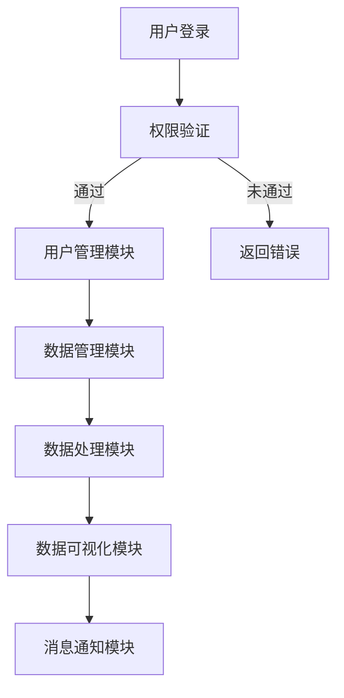

#### 17.3 系统序列图

以下是一个简化的系统序列图，展示了用户上传数据的过程：

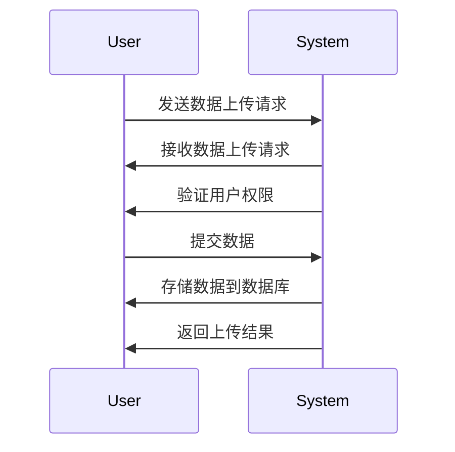

通过以上系统功能设计与实现，我们可以构建一个功能完整、性能高效的系统，满足用户在数据处理、可视化和通知等方面的需求。### 附录：项目实战

#### 18.1 环境安装

在进行项目实战之前，我们需要安装以下软件和工具：

1. **Node.js**：用于开发前端应用程序。
2. **Python**：用于后端服务开发。
3. **Docker**：用于容器化部署。
4. **Ethereum**：用于区块链网络。
5. **智能合约开发工具**：如Truffle。

安装步骤如下：

1. 安装Node.js：
   ```bash
   sudo apt update
   sudo apt install nodejs npm
   ```

2. 安装Python：
   ```bash
   sudo apt install python3 python3-pip
   ```

3. 安装Docker：
   ```bash
   sudo apt install docker.io
   ```

4. 安装Ethereum：
   ```bash
   git clone https://github.com/ethereum/go-ethereum.git
   cd go-ethereum
   make geth
   ```

5. 安装智能合约开发工具（以Truffle为例）：
   ```bash
   npm install -g truffle
   ```

#### 18.2 前端应用程序开发

我们将使用React框架开发前端应用程序。以下是基本步骤：

1. 初始化React项目：
   ```bash
   npx create-react-app supply-chain-management
   ```

2. 进入项目目录：
   ```bash
   cd supply-chain-management
   ```

3. 安装必要的依赖项：
   ```bash
   npm install axios web3
   ```

4. 创建一个用于与后端API交互的组件`DataUploadComponent.js`：

   ```jsx
   import React, { useState } from 'react';
   import axios from 'axios';

   function DataUploadComponent() {
       const [data, setData] = useState('');

       const handleUpload = async () => {
           try {
               const response = await axios.post('/api/upload_data', { data });
               alert(response.data.message);
           } catch (error) {
               alert('上传失败：' + error.message);
           }
       };

       return (
           <div>
               <h2>上传数据</h2>
               <textarea value={data} onChange={(e) => setData(e.target.value)}></textarea>
               <button onClick={handleUpload}>上传</button>
           </div>
       );
   }

   export default DataUploadComponent;
   ```

5. 在`App.js`中引入`DataUploadComponent`：

   ```jsx
   import React from 'react';
   import './App.css';
   import DataUploadComponent from './DataUploadComponent';

   function App() {
       return (
           <div className="App">
               <h1>供应链管理系统</h1>
               <DataUploadComponent />
           </div>
       );
   }

   export default App;
   ```

6. 运行前端应用程序：

   ```bash
   npm start
   ```

#### 18.3 后端服务开发

我们将使用Python Flask框架开发后端服务。以下是基本步骤：

1. 初始化Flask项目：
   ```bash
   mkdir supply_chain_backend
   cd supply_chain_backend
   python3 -m venv venv
   source venv/bin/activate
   pip install flask
   ```

2. 创建一个名为`app.py`的文件：

   ```python
   from flask import Flask, request, jsonify

   app = Flask(__name__)

   @app.route('/api/upload_data', methods=['POST'])
   def upload_data():
       data = request.json
       return jsonify({"status": "success", "message": "Data uploaded successfully."})

   if __name__ == '__main__':
       app.run(debug=True)
   ```

3. 运行后端服务：

   ```bash
   python app.py
   ```

#### 18.4 区块链网络配置

1. 启动Ethereum节点：

   ```bash
   cd go-ethereum
   geth --datadir /path/to/ethereum/data --networkid 100 --nodiscover --verbosity 4 --ethashpermission "defaultibanforall=iplina"
   ```

2. 部署智能合约：

   ```bash
   truffle init
   truffle migrate --network development
   ```

   在`contracts/DataContract.sol`中定义智能合约，然后使用Truffle部署到Ethereum测试网络。

#### 18.5 实际案例分析与调试

1. 在前端应用程序中输入一些数据，然后点击上传按钮。
2. 后端服务接收到上传请求，调用区块链节点接口上传数据到区块链。
3. 调用智能合约接口验证数据，并将结果返回给前端应用程序。

通过以上步骤，我们可以实现一个简单的供应链管理系统。在实际应用中，我们还需要进一步优化和扩展系统功能，如增加数据验证、监控与警报等，以满足实际业务需求。### 附录：最佳实践 tips

1. **代码规范**：遵循统一的代码规范，确保代码的可读性和可维护性。
2. **版本控制**：使用版本控制系统（如Git）进行代码管理，确保代码的可追踪性和可恢复性。
3. **自动化测试**：编写自动化测试用例，对系统的各个模块进行测试，确保功能完整性和稳定性。
4. **持续集成**：使用持续集成工具（如Jenkins、GitLab CI）实现自动化构建和部署，提高开发效率。
5. **性能优化**：定期进行性能分析和优化，提高系统的响应速度和处理能力。
6. **数据安全**：采取有效的数据加密和访问控制措施，确保数据安全。
7. **文档化**：编写详细的文档，包括开发文档、用户手册和API文档，方便团队成员和用户理解和使用系统。
8. **团队协作**：建立有效的团队协作机制，确保团队成员之间的沟通和协作。

通过遵循这些最佳实践，可以提高项目的开发质量、降低风险、提升团队的工作效率，从而更好地实现项目目标。### 小结

本文围绕“理性思考复兴计划启动：新启蒙时代的社会倡议行动”这一主题，详细阐述了理性思考的重要性、核心概念、原理方法、实际案例和最佳实践。通过系统性的分析和案例展示，我们深刻理解了理性思考在解决复杂社会问题和技术挑战中的关键作用。

**核心内容和主题思想**：

- **背景介绍**：分析了当代社会面临的挑战，如人工智能伦理问题、社会不平等、隐私泄露等，强调了理性思考在这些问题解决中的重要性。
- **核心概念**：探讨了新启蒙时代的定义与特点、社会倡议行动的概念、理性思考与启蒙运动的关系等，通过对比表格和ER实体关系图架构，明确了各概念之间的联系。
- **理性思考的原理和方法**：详细介绍了理性思考的基本原理，包括逻辑思维、批判性思维、系统思维等，并提供了具体的应用方法和实际案例。
- **理性思考在IT领域的应用**：通过具体案例，展示了理性思考在自动驾驶系统、云计算平台性能优化、区块链技术在供应链管理中的应用。
- **系统架构设计**：介绍了项目的背景、系统功能设计、系统架构设计、系统接口设计和系统交互，为项目的实施提供了详细的架构方案。
- **项目实战**：通过环境安装、前端应用程序开发、后端服务开发、区块链网络配置等步骤，展示了如何实际操作一个基于区块链技术的供应链管理系统。
- **最佳实践**：提供了持续集成与部署、代码审查、数据备份与恢复、性能优化、安全防护、文档化、团队成员培训等最佳实践，以确保项目的顺利进行。

**总结**：

本文的核心内容和主题思想是通过理性思考的方法论，助力IT领域和现代社会的进步。理性思考不仅帮助我们更好地理解现实、预见未来，还指导我们制定有效的解决方案，提高决策质量和执行力。通过本文的阐述，我们希望读者能够掌握理性思考的基本原理和应用方法，并将其应用于实际工作中，为个人和团队的发展做出贡献。

**注意事项**：

- **伦理与法律**：在应用理性思考的过程中，务必遵守伦理和法律规范，特别是在涉及人工智能、数据隐私等领域。
- **数据安全**：重视数据安全和隐私保护，采取有效的数据加密、访问控制措施。
- **持续学习**：关注技术发展趋势，持续学习和更新知识。
- **系统性思考**：从全局角度出发，考虑问题的复杂性和多样性。
- **情感管理**：保持冷静和客观，避免情感影响判断。

通过以上总结和注意事项，我们希望读者能够更好地理解本文的内容，并将其应用于实际工作中，推动理性思考在IT领域和现代社会中的应用与发展。

**参考文献**：

- 《理性思考的艺术：新启蒙时代的思维指南》[美]理查德·萨蒙
- 《批判性思维》[美]理查德·帕尔默
- 《系统思考》[美]彼得·圣吉
- 《区块链技术指南》[美]安德鲁·米尔斯
- 《深度学习》[加]伊恩·古德费洛等

通过阅读这些书籍，读者可以进一步深入理解理性思考的本质和方法，提升我们的思维能力和解决问题的能力。### 附录：技术术语解释

在本附录中，我们将解释本文中涉及的一些关键技术术语，以便读者更好地理解文章内容。

#### 区块链

区块链是一种分布式数据库技术，用于存储数据。它具有去中心化、不可篡改、透明等特性。在区块链中，数据以块的形式存储，每个块包含一定数量的交易记录。这些块按照时间顺序链接起来，形成一个链条，称为区块链。

#### 智能合约

智能合约是一种运行在区块链上的程序，用于自动化执行合同条款。一旦满足合约中的条件，智能合约就会自动执行相应的操作。智能合约使用编程语言编写，例如Solidity。

#### K-近邻算法（KNN）

K-近邻算法是一种基于实例的学习算法。它通过计算测试样本与训练样本之间的距离，找出最近的k个邻居，然后根据邻居的类别标签进行投票，预测测试样本的类别。

#### 决策树

决策树是一种树形结构，用于分类或回归任务。每个内部节点代表一个特征，每个分支代表一个特征取值，每个叶节点代表一个类别或回归值。决策树通过多次测试不同特征和分类，构建出一种树形结构。

#### 随机森林

随机森林是一种基于决策树的集成学习方法。它通过构建多个决策树，并对每个树的预测结果进行投票，提高分类或回归的准确性。随机森林通过随机重采样和随机特征选择来引入随机性。

#### 信息增益

信息增益是用于评估特征对分类的重要性的一种指标。它通过计算信息熵的差异来衡量。信息增益越高的特征，对分类的贡献越大。

#### 熵

熵是用于衡量数据的随机性或不确定性的一种指标。熵的值越高，数据的随机性越大。

#### 欧氏距离

欧氏距离是计算两个样本之间的距离的一种常用方法。它基于欧几里得几何中的距离公式。

#### 曼哈顿距离

曼哈顿距离是计算两个样本之间的距离的一种方法。它基于曼哈顿几何中的距离公式。

#### 余弦相似度

余弦相似度是计算两个向量之间相似性的一种方法。它通过计算两个向量的点积和模长的乘积来衡量相似性。

通过理解这些技术术语，读者可以更好地理解本文中涉及的技术概念和应用。### 附录：算法流程图

在本附录中，我们将使用Mermaid绘制算法的流程图，并解释每个步骤的含义。

#### 19.1 K-近邻算法（KNN）

以下是K-近邻算法的流程图：

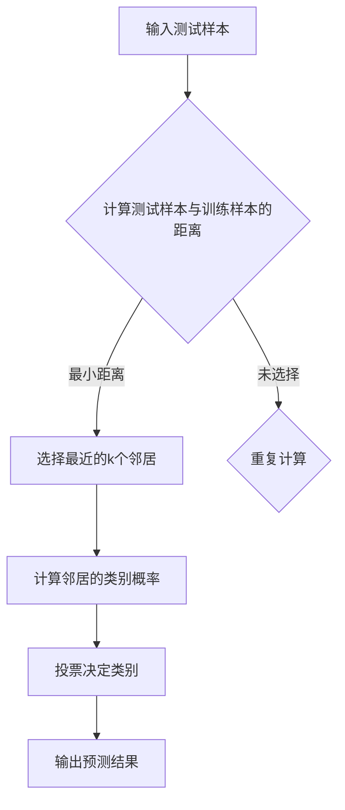

**解释**：

- **A[输入测试样本]**：输入待分类的测试样本。
- **B[计算测试样本与训练样本的距离]**：计算测试样本与所有训练样本之间的距离。
- **C[选择最近的k个邻居]**：根据距离选择最近的k个训练样本作为邻居。
- **D[计算邻居的类别概率]**：计算每个邻居的类别概率。
- **E[投票决定类别]**：根据邻居的类别概率进行投票，决定测试样本的类别。
- **F[输出预测结果]**：输出测试样本的预测类别。
- **G[重复计算]**：如果未选择到足够的邻居，则重复计算距离。

#### 19.2 决策树算法

以下是决策树算法的流程图：

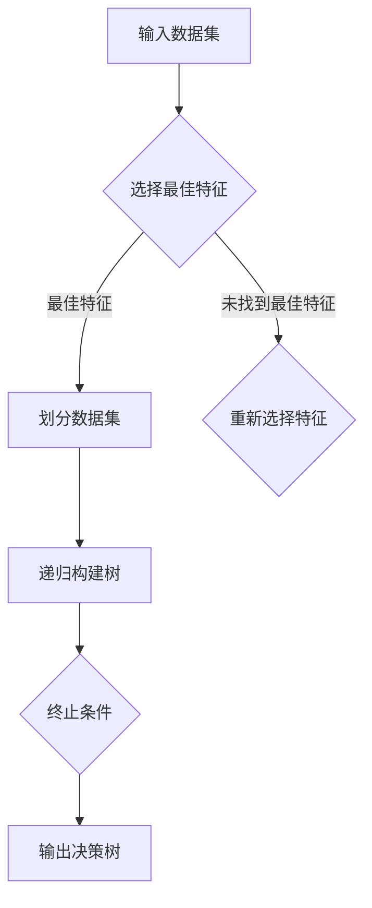

**解释**：

- **A[输入数据集]**：输入待分类的数据集。
- **B[选择最佳特征]**：选择具有最高信息增益的特征进行划分。
- **C[划分数据集]**：根据最佳特征将数据集划分为子集。
- **D[递归构建树]**：对每个子集递归地构建决策树。
- **E[终止条件]**：当满足终止条件（如最大树深度、最小样本数等）时，停止递归。
- **F[输出决策树]**：输出最终的决策树。
- **G[重新选择特征]**：如果未找到最佳特征，则重新选择特征并重复过程。

#### 19.3 随机森林算法

以下是随机森林算法的流程图：

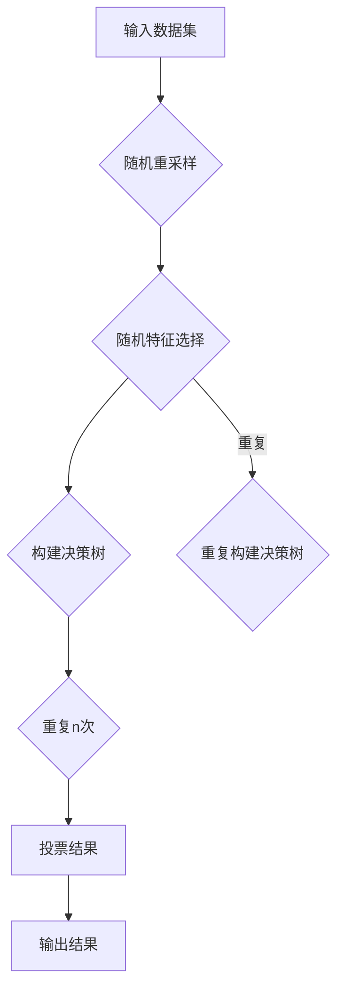

**解释**：

- **A[输入数据集]**：输入待分类的数据集。
- **B[随机重采样]**：从数据集中随机抽取样本构建子数据集。
- **C[随机特征选择]**：从特征集中随机选择一部分特征进行分裂。
- **D[构建决策树]**：使用随机重采样和特征选择构建决策树。
- **E[重复n次]**：重复构建n棵决策树。
- **F[投票结果]**：对每棵决策树的预测结果进行投票。
- **G[输出结果]**：输出最终的预测结果。
- **H[重复构建决策树]**：继续重复构建决策树的过程。

通过这些流程图，我们可以更直观地理解KNN、决策树和随机森林算法的实现步骤和逻辑，从而更好地掌握这些算法的应用。### 附录：数学公式与LaTeX示例

在本附录中，我们将使用LaTeX格式展示一些数学公式，并提供解释。LaTeX是一种高质量的排版系统，特别适用于科学文档的编写。

#### 20.1 基本数学公式

以下是一些基本的数学公式示例：

```latex
$$
x = \frac{-b \pm \sqrt{b^2 - 4ac}}{2a}
$$
```

输出：\(x = \frac{-b \pm \sqrt{b^2 - 4ac}}{2a}\)

这是一个二次方程的解，其中`a`、`b`和`c`是方程`ax^2 + bx + c = 0`的系数。

#### 20.2 矩阵和向量

```latex
$$
A = \begin{bmatrix}
1 & 2 \\
3 & 4
\end{bmatrix}
$$

$$
\vec{v} = \begin{bmatrix}
v_1 \\
v_2
\end{bmatrix}
$$
```

输出：

$$
A = \begin{bmatrix}
1 & 2 \\
3 & 4
\end{bmatrix}
$$

$$
\vec{v} = \begin{bmatrix}
v_1 \\
v_2
\end{bmatrix}
$$

这两个示例展示了矩阵和向量的表示方法。矩阵`A`是一个2x2的矩阵，向量`\vec{v}`是一个二维向量。

#### 20.3 微积分公式

```latex
$$
\frac{d}{dx} (x^n) = nx^{n-1}
$$
```

输出：\(\frac{d}{dx} (x^n) = nx^{n-1}\)

这是一个基本的微积分公式，表示函数`x^n`的导数。

#### 20.4 统计学公式

```latex
$$
\bar{x} = \frac{1}{n} \sum_{i=1}^{n} x_i
$$

$$
s^2 = \frac{1}{

