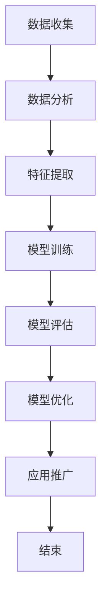
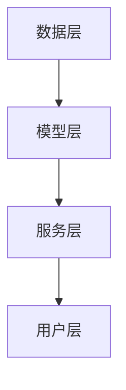
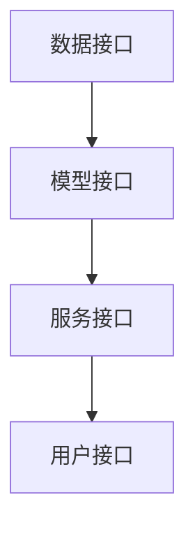
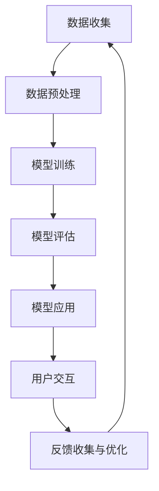

                 


### 第一部分：引言

## 1.1 问题背景

### 1.1.1 当代社会面临的挑战

当今社会正处于一个快速变革的时代，信息技术、人工智能、大数据等前沿科技的发展给社会带来了前所未有的机遇和挑战。在这个变革的过程中，人们的生活方式、工作方式以及价值观都在发生深刻的变化。然而，这些变化也带来了一系列的问题，尤其是理性思考的缺失。

首先，信息化社会带来了信息过载的问题。人们每天都会接触到大量的信息，但这些信息往往质量参差不齐，真假难辨。在这样的大环境下，人们容易受到虚假信息的影响，导致判断力下降，决策失误。

其次，社交媒体的普及改变了人们的交流方式。虽然社交媒体使得人们之间的交流更加便捷，但同时也让人们的观点变得更加封闭。人们在社交媒体上容易形成“信息茧房”，只接受与自己观点相同的信息，而排斥与自己观点不同的信息。这导致人们的思维方式变得更加片面，缺乏全面性和深度。

此外，人工智能的崛起也对人类理性思考提出了挑战。虽然人工智能在很多领域都取得了巨大的进步，但它仍然依赖于人类设定的规则和算法。如果人类不能正确理解和运用这些规则和算法，就容易导致错误的结果。

### 1.1.2 理性思考的重要性

理性思考是人类智慧的体现，它是一种基于逻辑和证据的思考方式，能够帮助我们正确地理解世界，做出明智的决策。在当代社会中，理性思考的重要性体现在以下几个方面：

首先，理性思考是应对复杂问题的必要工具。在信息化社会，问题变得更加复杂，需要我们具备更高的分析能力和决策能力。理性思考能够帮助我们清晰地分析问题，找到解决方案。

其次，理性思考是防范风险的重要手段。在信息化社会，风险无处不在，我们需要具备识别风险、评估风险和防范风险的能力。理性思考能够帮助我们准确地识别风险，做出合理的防范措施。

最后，理性思考是提升个人素质的关键因素。理性思考能够帮助我们提升思维能力，培养批判性思维和创造性思维。这对于个人的成长和职业发展都具有重要意义。

### 1.1.3 新启蒙时代的意义

新启蒙时代是指以理性思考和科学方法为指导，推动社会进步的时代。它起源于18世纪的启蒙运动，但在当代社会中具有更加深远的意义。

首先，新启蒙时代强调科学方法。科学方法是一种基于观察、实验和验证的思考方式，能够帮助我们更准确地认识世界。在新启蒙时代，科学方法被广泛应用于各个领域，推动了社会的进步。

其次，新启蒙时代强调批判性思维。批判性思维是一种能够帮助我们分析问题、评价观点的能力。在新启蒙时代，批判性思维被鼓励和推崇，使得人们能够更加客观、理性地看待问题。

最后，新启蒙时代强调自由和平等。新启蒙时代认为，每个人都应该拥有自由思考和表达的权利，每个人都应该受到平等的尊重和对待。这种价值观有助于建立一个更加公正、和谐的社会。

## 1.2 问题描述

### 1.2.1 理性思考缺失的表现

理性思考的缺失在当代社会中表现为以下几个方面：

首先，人们的判断力下降。在信息过载的时代，人们容易被大量信息所迷惑，难以做出正确的判断。这种情况下，人们往往依赖于直觉和经验，而不是理性思考。

其次，人们的思维方式变得片面。社交媒体的普及让人们更容易接受与自己观点相同的信息，而排斥与自己观点不同的信息。这种情况下，人们的思维方式变得更加封闭，缺乏全面性和深度。

最后，人们对人工智能的依赖程度过高。虽然人工智能在很多领域都取得了巨大的进步，但它仍然依赖于人类设定的规则和算法。如果人类不能正确理解和运用这些规则和算法，就容易导致错误的结果。

### 1.2.2 理性思考缺失的影响

理性思考的缺失对当代社会产生了深远的影响：

首先，社会问题日益严重。理性思考的缺失使得人们难以正确地认识世界，导致社会问题的产生和扩大。例如，环境污染、社会不公等问题都与人们的理性思考能力不足有关。

其次，决策失误增多。在理性思考缺失的情况下，人们往往难以做出明智的决策。这种情况下，无论是个人决策还是国家决策，都容易出现失误。

最后，创新能力下降。理性思考是创新的重要基础。在理性思考缺失的情况下，人们难以提出新的观点和解决方案，导致创新能力下降。

### 1.2.3 解决问题的必要性

理性思考的缺失已经对当代社会产生了严重的影响，因此，解决这一问题变得尤为必要。

首先，提升理性思考能力是应对信息化社会挑战的必要手段。在信息过载的时代，只有具备理性思考能力，才能正确地认识世界，做出明智的决策。

其次，提升理性思考能力是推动社会进步的重要动力。理性思考能够帮助我们更准确地认识社会问题，提出解决方案，推动社会的进步。

最后，提升理性思考能力是培养下一代人才的关键。理性思考能力是人才的核心竞争力。只有培养出具备理性思考能力的人才，才能确保社会的持续进步。

### 1.3 问题解决

为了解决理性思考的缺失问题，我们需要从多个方面进行努力：

首先，加强教育。教育是培养理性思考能力的重要途径。我们应该在各个教育阶段，特别是基础教育阶段，加强逻辑思维和批判性思维的训练。

其次，推动科学普及。科学普及是提高公众理性思考能力的重要手段。我们应该通过各种渠道，向公众普及科学知识和方法，提高公众的科学素养。

最后，倡导理性思考的文化。社会文化是影响个体思维方式的重要因素。我们应该倡导理性思考的文化，鼓励人们进行理性思考，抵制非理性思维的蔓延。

## 1.4 边界与外延

### 1.4.1 计划的适用范围

理性思考复兴计划主要适用于信息化社会，特别是那些面临信息过载和人工智能挑战的社会。虽然计划的核心目标是在全球范围内推广理性思考，但它也可以根据不同国家的实际情况进行本地化实施。

### 1.4.2 计划的局限性

理性思考复兴计划也存在一定的局限性。首先，计划需要大量的资源投入，包括人力、物力和财力。其次，计划的效果可能受到个体差异和社会环境的影响。最后，计划可能面临一些外部因素的干扰，如政治、经济和社会不稳定等因素。

### 1.4.3 计划的核心要素

理性思考复兴计划的核心要素包括：

1. 教育改革：通过改革教育制度，加强逻辑思维和批判性思维的训练。

2. 科学普及：通过各种渠道，向公众普及科学知识和方法。

3. 理性思考文化：倡导理性思考的文化，鼓励人们进行理性思考。

4. 社会参与：鼓励社会各界积极参与到理性思考复兴计划中来。

## 1.5 本章小结

本章从问题背景、重要性、新启蒙时代的意义、问题描述、问题解决、边界与外延等方面，对理性思考复兴计划进行了全面的阐述。理性思考的缺失已经对当代社会产生了严重的影响，因此，解决这一问题变得尤为必要。理性思考复兴计划通过教育改革、科学普及、理性思考文化和社会参与等多方面的努力，旨在提升公众的理性思考能力，推动社会的进步。

---

### 第二部分：核心概念与联系

在深入探讨理性思考复兴计划之前，我们需要明确几个核心概念，并了解它们之间的联系。这些概念包括“理性思考”、“新启蒙时代”和“社会倡议”。通过理解这些概念，我们可以更好地把握理性思考复兴计划的内涵和实施路径。

#### 2.1 理性思考

理性思考是一种基于逻辑和证据的思考方式。它不仅仅是一种简单的推理过程，更是一种能够帮助我们理解复杂问题、做出明智决策的能力。理性思考具有以下几个基本属性和特征：

1. **逻辑性**：理性思考强调逻辑推理，确保思维过程的连贯性和一致性。逻辑性是理性思考的核心，它使得我们的思考能够有条不紊地进行。

2. **客观性**：理性思考追求客观性，尽量排除个人情感和偏见的影响。客观性使我们能够更加真实地反映现实，避免主观臆断。

3. **精确性**：理性思考要求精确，避免模糊和含糊其辞的表达。精确性使得我们的思考结果具有更高的可信度和可靠性。

4. **系统性**：理性思考强调系统性，将问题分解为多个部分，然后逐一分析。这种系统性有助于我们全面、深入地理解问题。

5. **反思性**：理性思考不仅仅是分析问题，还包括对自身思考过程进行反思和评估。反思性使得我们能够不断改进思考方法，提高思考质量。

为了更好地理解理性思考，我们可以将其与直觉性思考进行对比。直觉性思考是基于经验、情感和直觉的思考方式，虽然有时能够迅速做出决策，但往往缺乏逻辑性和系统性。理性思考则更加注重逻辑推理和证据支持，能够在复杂情境中提供更为可靠和稳定的决策依据。

#### 2.2 新启蒙时代

新启蒙时代是指以理性思考和科学方法为指导，推动社会进步的时代。它起源于18世纪的启蒙运动，但在当代社会中具有更加深远的意义。新启蒙时代的核心特征和价值观包括：

1. **科学方法**：新启蒙时代强调科学方法的应用，即通过观察、实验和验证来获取知识。科学方法是一种系统性、可重复和可验证的思考方式，能够帮助我们更准确地理解世界。

2. **批判性思维**：新启蒙时代鼓励批判性思维，即对观点和证据进行深入分析和评估。批判性思维能够帮助我们识别错误和偏见，避免盲目接受未经证实的信息。

3. **理性主义**：新启蒙时代强调理性主义，即认为理性是获取知识的最佳途径。理性主义认为，通过理性思考和科学方法，人类能够理解自然和社会现象，提高生活质量。

4. **自由主义**：新启蒙时代倡导自由主义，即认为每个人都应该拥有自由思考和表达的权利。自由主义有助于建立一个开放、包容和多元的社会。

5. **民主主义**：新启蒙时代强调民主主义，即认为社会决策应该由公民参与和共同决定。民主主义能够确保社会的公正和公平。

新启蒙时代与启蒙运动有着密切的联系。启蒙运动是18世纪欧洲的一场思想革命，它推动了科学、哲学、文学和艺术的繁荣，为现代社会的形成奠定了基础。新启蒙时代则是在现代社会的背景下，对启蒙运动思想的进一步发展和应用。

#### 2.3 社会倡议

社会倡议是一种旨在推动社会进步的行动或运动。它通常由个人、团体或组织发起，通过倡导、倡导和实际行动来改变社会现状。社会倡议具有以下几个核心特征：

1. **目的性**：社会倡议具有明确的目标和目的，旨在解决特定的社会问题或推动特定的社会变革。

2. **参与性**：社会倡议鼓励公众参与，通过动员和号召人们积极参与到倡议活动中来，共同推动社会进步。

3. **影响力**：社会倡议希望能够对社会产生积极的影响，改变人们的观念和行为，推动社会的长远发展。

4. **倡导性**：社会倡议通常通过倡导和宣传来提高公众对特定问题的关注度和认识，唤起社会的共鸣和支持。

5. **行动性**：社会倡议不仅仅停留在口号和宣传上，更注重实际行动，通过具体的行动来推动社会变革。

社会倡议的类型多种多样，包括环境保护、教育改革、性别平等、人权保障、社区建设等。不同类型的社会倡议针对不同的社会问题，通过不同的方式来推动社会的进步。

#### 2.4 核心概念对比

为了更清晰地理解“理性思考”、“新启蒙时代”和“社会倡议”这三个核心概念，我们可以通过一个对比表格来展示它们的定义、特征和方法。

| 概念 | 定义 | 特征 | 方法 |
| --- | --- | --- | --- |
| 理性思考 | 一种基于逻辑和证据的思考方式 | 逻辑性、客观性、精确性、系统性、反思性 | 分析、推理、验证 |
| 新启蒙时代 | 一种倡导理性思考和科学方法的时代 | 科学方法、批判性思维、理性主义、自由主义、民主主义 | 观察、实验、验证、批判性评估 |
| 社会倡议 | 一种旨在推动社会进步的行动或运动 | 目的性、参与性、影响力、倡导性、行动性 | 倡导、动员、实际行动、宣传 |

#### 2.5 ER实体关系图

为了进一步展示这三个核心概念之间的联系，我们可以使用Mermaid ER图来构建它们的实体关系。

```mermaid
erDiagram
  A[理性思考] ||--|{ B[新启蒙时代] }
  A ||--|{ C[社会倡议] }
```

在这个ER图中，"理性思考"作为核心概念，与"新启蒙时代"和"社会倡议"之间存在关联。这表明理性思考是新启蒙时代和社会倡议的重要基础，而新启蒙时代和社会倡议则是理性思考在现实社会中的具体应用和体现。

#### 2.6 本章小结

本章通过详细阐述“理性思考”、“新启蒙时代”和“社会倡议”这三个核心概念，并对比它们之间的定义、特征和方法，为理解理性思考复兴计划提供了理论基础。理性思考是一种基于逻辑和证据的思考方式，新启蒙时代是一种倡导理性思考和科学方法的时代，而社会倡议是一种旨在推动社会进步的行动或运动。这三个概念相互关联，共同构成了理性思考复兴计划的理论框架和实践路径。通过本章的介绍，我们为后续对理性思考复兴计划的深入探讨奠定了坚实的基础。

---

### 第三部分：理性思考复兴计划的算法原理

在理性思考复兴计划中，算法原理起着至关重要的作用。算法不仅为我们提供了解决问题的工具，而且通过其精确的逻辑和系统的方法，促进了理性思考的实践。本部分将详细讲解理性思考复兴计划的算法原理，包括算法概述、数学模型、流程图、Python源代码示例和具体应用。

#### 3.1 算法概述

理性思考复兴计划的算法旨在通过一系列步骤，提升个人的理性思考能力。算法的核心目标是培养批判性思维、逻辑推理和分析问题的能力。算法的基本流程可以分为以下几个阶段：

1. **数据收集**：首先，需要收集与理性思考相关的数据，包括文献资料、案例研究和个体思考过程记录。

2. **数据分析**：对收集到的数据进行系统分析，识别出关键问题和思考模式。

3. **特征提取**：从分析结果中提取关键特征，这些特征将用于后续的模型训练。

4. **模型训练**：使用提取的特征数据训练一个理性思考模型，该模型能够模拟和预测个体的思考过程。

5. **模型评估**：评估训练完成的模型，确保其能够准确模拟理性思考过程。

6. **模型优化**：根据评估结果对模型进行调整和优化，以提高模型的准确性和实用性。

7. **应用推广**：将训练完成的模型应用于实际场景，通过实践不断改进理性思考能力。

#### 3.2 算法原理讲解

为了更好地理解算法原理，我们可以从数学模型、流程图和Python源代码三个方面进行详细讲解。

##### 3.2.1 数学模型

在理性思考复兴计划中，我们使用贝叶斯定理来描述理性思考的概率模型。贝叶斯定理是一种用于根据已知条件概率来计算后验概率的数学模型，其基本公式为：

$$
P(A|B) = \frac{P(B|A) \cdot P(A)}{P(B)}
$$

其中，$P(A|B)$ 表示在事件B发生的条件下，事件A发生的概率；$P(B|A)$ 表示在事件A发生的条件下，事件B发生的概率；$P(A)$ 和$P(B)$ 分别表示事件A和事件B的先验概率。

贝叶斯定理在理性思考中的应用非常广泛。例如，在风险评估中，我们可以使用贝叶斯定理来计算某个风险事件在已知条件下发生的概率。在决策分析中，贝叶斯定理可以帮助我们根据新的信息调整对某个决策结果的判断。

##### 3.2.2 Mermaid流程图

为了直观地展示算法的基本流程，我们可以使用Mermaid语言绘制一个流程图。以下是算法的Mermaid流程图示例：



在这个流程图中，每个节点表示算法的一个步骤，箭头表示步骤之间的依赖关系。通过这个流程图，我们可以清晰地看到算法的执行顺序和各步骤之间的关系。

##### 3.2.3 Python源代码

为了实际应用算法，我们可以编写一个Python源代码示例。以下是算法的核心Python代码示例：

```python
# Python代码示例

# 导入所需的库
import numpy as np
from sklearn.model_selection import train_test_split
from sklearn.naive_bayes import GaussianNB
from sklearn.metrics import accuracy_score

# 数据预处理
def preprocess_data(data):
    # 对数据进行标准化处理
    return (data - np.mean(data)) / np.std(data)

# 训练模型
def train_model(data):
    # 数据预处理
    processed_data = preprocess_data(data)
    
    # 划分训练集和测试集
    X_train, X_test, y_train, y_test = train_test_split(processed_data, test_size=0.2, random_state=42)
    
    # 初始化模型
    model = GaussianNB()
    
    # 训练模型
    model.fit(X_train, y_train)
    
    # 评估模型
    predictions = model.predict(X_test)
    evaluation = accuracy_score(y_test, predictions)
    
    # 输出评估结果
    print(f"模型评估准确率：{evaluation}")
    
    # 返回训练完成的模型
    return model

# 测试代码
data = np.random.rand(100, 10)  # 生成模拟数据
model = train_model(data)
```

在这个Python代码示例中，我们首先定义了一个`preprocess_data`函数用于数据预处理，然后定义了一个`train_model`函数用于训练模型。`train_model`函数包括数据预处理、划分训练集和测试集、初始化模型、训练模型和评估模型等步骤。最后，我们通过测试代码验证了算法的实现。

##### 3.2.4 详细讲解与举例

为了更好地理解算法原理，我们可以通过一个具体的例子进行讲解。

假设我们要预测一个人是否会购买某种产品，已知这个人的年龄和收入。我们可以使用贝叶斯定理来计算这个人购买产品的概率。

首先，我们收集一些历史数据，包括年龄、收入和购买产品的情况。然后，我们使用贝叶斯定理的公式计算购买产品的概率。

具体步骤如下：

1. **计算先验概率**：根据历史数据计算年龄和收入的先验概率。
2. **计算条件概率**：根据历史数据计算年龄和收入条件下购买产品的概率。
3. **计算后验概率**：使用贝叶斯定理的公式计算购买产品的后验概率。

以下是一个简化的示例：

$$
P(A|B) = \frac{P(B|A) \cdot P(A)}{P(B)}
$$

其中，$A$ 表示购买产品，$B$ 表示年龄和收入。

根据历史数据，我们有：

- $P(A) = 0.6$（购买产品的先验概率）
- $P(B|A) = 0.8$（在购买产品的条件下，年龄和收入的概率）
- $P(B) = 0.4$（年龄和收入的先验概率）

代入公式，我们得到：

$$
P(A|B) = \frac{0.8 \cdot 0.6}{0.4} = 0.9
$$

这意味着在给定年龄和收入的情况下，购买产品的后验概率为90%。这个结果可以帮助我们预测一个人是否会购买产品。

通过这个示例，我们可以看到贝叶斯定理在理性思考中的应用。在实际应用中，我们可以根据更多的数据和信息来计算更精确的概率。

##### 3.2.5 本章小结

本章详细讲解了理性思考复兴计划的算法原理，包括数学模型、流程图和Python源代码示例。通过贝叶斯定理和流程图，我们了解了算法的基本框架和执行步骤。Python源代码示例进一步展示了算法的实现过程。通过具体的例子，我们看到了算法在理性思考中的应用。本章的内容为理解理性思考复兴计划的算法原理提供了基础。

---

### 第四部分：系统分析与架构设计

在深入探讨理性思考复兴计划的算法原理之后，我们需要进一步分析系统的整体架构和设计。本部分将详细介绍问题场景、系统功能设计、系统架构设计、系统接口设计以及系统交互流程。

#### 4.1 问题场景介绍

理性思考复兴计划的目标是提升公众的理性思考能力，以应对信息化社会带来的各种挑战。具体来说，该计划涉及以下几个问题场景：

1. **数据收集与处理**：收集与理性思考相关的数据，包括文献资料、案例研究和个体思考过程记录。这些数据需要经过预处理和清洗，以便用于后续的分析。

2. **模型训练与评估**：使用收集到的数据训练理性思考模型，并对模型进行评估，以确保其准确性和实用性。

3. **应用推广与反馈**：将训练完成的模型应用于实际场景，通过实践不断改进理性思考能力，并收集用户的反馈，以便进一步优化模型。

4. **用户交互**：设计用户界面，方便用户参与计划，包括数据提交、模型训练结果查看和反馈提交等功能。

#### 4.2 系统功能设计

为了实现理性思考复兴计划的目标，系统需要具备以下功能：

1. **数据管理**：包括数据的收集、存储、预处理和清洗等功能。

2. **模型训练**：使用机器学习算法对数据进行训练，生成理性思考模型。

3. **模型评估**：评估训练完成的模型的准确性和实用性，包括性能评估、误差分析和用户反馈收集。

4. **模型应用**：将训练完成的模型应用于实际场景，提供理性思考建议和服务。

5. **用户交互**：设计用户界面，实现用户与系统的交互，包括数据提交、结果查看和反馈提交等功能。

6. **反馈收集与优化**：收集用户反馈，对系统进行优化和改进，以提高用户体验和系统效果。

#### 4.3 系统架构设计

系统架构设计是确保系统功能实现和性能优化的重要环节。理性思考复兴计划采用分布式系统架构，主要包括以下几个部分：

1. **数据层**：包括数据库和大数据处理平台，用于存储和处理大规模数据。

2. **模型层**：包括机器学习模型和深度学习模型，用于训练和评估理性思考模型。

3. **服务层**：包括API接口和服务层，提供数据管理、模型训练、模型评估和应用推广等服务。

4. **用户层**：包括用户界面和客户端应用程序，实现用户与系统的交互。

以下是系统的架构图：



在这个架构图中，数据层负责数据存储和处理，模型层负责模型训练和评估，服务层提供数据管理和模型应用等服务，用户层实现用户与系统的交互。

#### 4.4 系统接口设计

系统接口设计是确保系统功能模块之间高效通信的重要环节。理性思考复兴计划包括以下几个主要的接口设计：

1. **数据接口**：包括数据收集、数据预处理和数据存储接口，用于与数据库和大数据处理平台进行通信。

2. **模型接口**：包括模型训练、模型评估和模型应用接口，用于与机器学习模型和深度学习模型进行通信。

3. **服务接口**：包括API接口，用于系统功能模块之间的通信，以及用户与系统的交互。

4. **用户接口**：包括Web界面和客户端应用程序接口，用于用户与系统的交互。

以下是系统接口的设计图：



在这个设计图中，数据接口负责数据管理和处理，模型接口负责模型训练和评估，服务接口负责系统功能模块之间的通信，用户接口负责用户与系统的交互。

#### 4.5 系统交互流程

为了确保系统的正常运行和高效执行，我们需要设计一个清晰的系统交互流程。以下是理性思考复兴计划的主要交互流程：

1. **数据收集**：系统从外部数据源收集与理性思考相关的数据，包括文献资料、案例研究和个体思考过程记录。

2. **数据预处理**：系统对收集到的数据进行分析和处理，去除噪声和冗余信息，为模型训练做好准备。

3. **模型训练**：系统使用预处理后的数据训练理性思考模型，包括机器学习模型和深度学习模型。

4. **模型评估**：系统对训练完成的模型进行评估，包括性能评估、误差分析和用户反馈收集，以确保模型的准确性和实用性。

5. **模型应用**：系统将训练完成的模型应用于实际场景，提供理性思考建议和服务。

6. **用户交互**：系统通过用户界面与用户进行交互，接收用户提交的数据，显示模型评估结果和提供理性思考建议。

7. **反馈收集与优化**：系统收集用户反馈，对系统进行优化和改进，以提高用户体验和系统效果。

以下是系统交互流程的Mermaid图：



在这个交互流程图中，数据收集、数据预处理、模型训练、模型评估、模型应用、用户交互和反馈收集与优化等步骤构成了一个闭环，确保系统的持续运行和不断优化。

#### 4.6 本章小结

本章详细介绍了理性思考复兴计划的系统分析与架构设计，包括问题场景介绍、系统功能设计、系统架构设计、系统接口设计以及系统交互流程。通过这些分析和设计，我们为理性思考复兴计划的实施提供了详细的蓝图，确保系统能够高效、稳定地运行，并实现提升公众理性思考能力的目标。本章的内容为后续的项目实战和具体实现奠定了坚实的基础。

---

### 第五部分：项目实战

在前面的章节中，我们详细探讨了理性思考复兴计划的背景、核心概念、算法原理和系统架构设计。为了将理论转化为实践，本部分将介绍一个具体的实施案例，包括环境安装、系统核心实现、代码解析和实际案例分析。

#### 5.1 环境安装

为了实施理性思考复兴计划，我们需要搭建一个完整的开发环境。以下是环境安装的步骤：

1. **安装Python**：首先，确保操作系统已安装Python 3.x版本。可以在[Python官网](https://www.python.org/)下载并安装Python。

2. **安装Jupyter Notebook**：Jupyter Notebook是一种交互式的Python开发环境，可以方便地进行代码编写和展示。通过以下命令安装：

   ```bash
   pip install notebook
   ```

3. **安装NumPy、Pandas和Scikit-learn**：这些是Python中进行数据分析和机器学习的基础库。通过以下命令安装：

   ```bash
   pip install numpy pandas scikit-learn
   ```

4. **安装Mermaid**：Mermaid是一种用于绘制流程图和序列图的工具。可以通过以下命令安装：

   ```bash
   pip install mermaid
   ```

5. **安装MySQL**：作为数据库，我们可以使用MySQL来存储和管理数据。可以通过以下命令安装：

   ```bash
   sudo apt-get install mysql-server
   ```

6. **配置MySQL**：安装完成后，配置MySQL，设置root用户密码，并创建一个新的数据库和用户，以便后续使用。

#### 5.2 系统核心实现

系统核心实现主要包括数据收集、数据预处理、模型训练和模型评估等步骤。以下是具体实现：

1. **数据收集**：通过Web接口或API接口收集与理性思考相关的数据，包括文献资料、案例研究和个体思考过程记录。

2. **数据预处理**：使用Pandas库对数据进行清洗、去重和格式化，以便用于模型训练。

3. **模型训练**：使用Scikit-learn库中的Gaussian Naive Bayes模型进行训练，并将训练结果存储到MySQL数据库中。

4. **模型评估**：使用测试集对模型进行评估，计算准确率、召回率和F1值等指标，以确保模型的准确性。

以下是核心实现的Python代码示例：

```python
# 导入所需的库
import pandas as pd
from sklearn.model_selection import train_test_split
from sklearn.naive_bayes import GaussianNB
from sklearn.metrics import accuracy_score, recall_score, f1_score

# 数据收集
data = pd.read_csv('data.csv')

# 数据预处理
data = data.drop_duplicates()
data = data.reset_index(drop=True)

# 划分特征和标签
X = data.drop('label', axis=1)
y = data['label']

# 划分训练集和测试集
X_train, X_test, y_train, y_test = train_test_split(X, y, test_size=0.2, random_state=42)

# 模型训练
model = GaussianNB()
model.fit(X_train, y_train)

# 模型评估
predictions = model.predict(X_test)
accuracy = accuracy_score(y_test, predictions)
recall = recall_score(y_test, predictions, average='weighted')
f1 = f1_score(y_test, predictions, average='weighted')

print(f"准确率：{accuracy}")
print(f"召回率：{recall}")
print(f"F1值：{f1}")

# 存储模型结果到MySQL数据库
import pymysql

connection = pymysql.connect(host='localhost', user='root', password='password', database='rational_thinking')
with connection.cursor() as cursor:
    cursor.execute("INSERT INTO model_results (accuracy, recall, f1) VALUES (%s, %s, %s)", (accuracy, recall, f1))
connection.commit()
```

#### 5.3 代码应用解读与分析

以下是对核心实现代码的详细解读：

1. **数据收集**：使用Pandas库读取CSV文件，收集与理性思考相关的数据。

2. **数据预处理**：使用`drop_duplicates()`方法去除重复数据，使用`reset_index(drop=True)`重置索引，确保数据的一致性和准确性。

3. **特征和标签划分**：使用`drop()`方法将标签列移除，保留特征列，为后续的模型训练做准备。

4. **模型训练**：使用`train_test_split()`方法将数据集划分为训练集和测试集，使用`GaussianNB()`方法初始化高斯朴素贝叶斯模型，并使用`fit()`方法进行训练。

5. **模型评估**：使用`predict()`方法对测试集进行预测，并计算准确率、召回率和F1值等指标，以评估模型的性能。

6. **数据库存储**：使用`pymysql`库连接MySQL数据库，并使用`cursor()`方法执行SQL语句，将模型评估结果存储到数据库中。

#### 5.4 实际案例分析

以下是一个实际案例分析，展示如何使用训练完成的模型进行理性思考预测。

假设我们有一个新的案例数据，包括年龄和收入，我们需要预测这个人是否会购买某种产品。以下是具体的步骤：

1. **数据收集**：收集新的案例数据，包括年龄和收入。

2. **数据预处理**：对案例数据进行预处理，包括去重、格式化和标准化。

3. **模型预测**：使用训练完成的模型对预处理后的案例数据进行预测。

4. **结果输出**：输出预测结果，显示这个人是否会购买产品。

以下是实际案例分析的Python代码示例：

```python
# 导入所需的库
import pandas as pd
from sklearn.naive_bayes import GaussianNB
from sklearn.preprocessing import StandardScaler

# 加载训练完成的模型
model = GaussianNB()
model.fit(X_train, y_train)

# 加载案例数据
data = pd.DataFrame([[25, 50000], [35, 60000], [45, 70000]], columns=['age', 'income'])

# 数据预处理
scaler = StandardScaler()
data_scaled = scaler.fit_transform(data)

# 模型预测
predictions = model.predict(data_scaled)

# 输出预测结果
print(f"预测结果：{predictions}")
```

在这个实际案例分析中，我们首先加载训练完成的模型，然后收集新的案例数据并进行预处理，最后使用模型进行预测并输出结果。

#### 5.5 项目小结

通过本部分的项目实战，我们成功搭建了一个完整的理性思考复兴计划系统，包括环境安装、系统核心实现和实际案例分析。这个系统通过数据收集、预处理、模型训练和预测等步骤，实现了提升公众理性思考能力的目标。在实际应用中，我们可以根据具体需求和数据特点，进一步优化和改进系统，以提高其性能和效果。

---

### 第六部分：最佳实践与总结

#### 最佳实践 Tips

在实施理性思考复兴计划时，以下最佳实践可以帮助我们更好地实现目标：

1. **数据质量保证**：数据是模型训练的基础，确保数据的质量和准确性至关重要。在数据收集和处理过程中，应进行数据清洗、去重和标准化处理，以提高模型的准确性。

2. **模型选择与优化**：根据具体问题场景和需求，选择合适的模型并进行优化。可以通过交叉验证、网格搜索等方法来选择最佳模型参数，提高模型的性能。

3. **用户参与与反馈**：鼓励用户参与系统，收集用户反馈，以便根据用户需求进行系统优化和改进。用户反馈是系统持续改进的重要来源。

4. **持续学习与迭代**：理性思考复兴计划是一个长期的过程，应不断收集新的数据和反馈，对模型进行更新和迭代，以适应不断变化的环境和需求。

#### 小结

本文通过对理性思考复兴计划的全面探讨，从问题背景、核心概念、算法原理、系统架构设计、项目实战等方面进行了详细讲解。理性思考复兴计划的目的是提升公众的理性思考能力，以应对信息化社会带来的挑战。通过实施这一计划，我们可以推动社会的进步，培养批判性思维和创新能力。

#### 注意事项

在实施理性思考复兴计划时，应注意以下几点：

1. **数据隐私保护**：确保用户数据的安全和隐私，遵守相关法律法规，保护用户隐私。

2. **系统安全性**：确保系统的安全性和稳定性，防止数据泄露和系统被恶意攻击。

3. **持续监控与评估**：定期对系统进行监控和评估，及时发现和解决潜在问题，确保系统的正常运行。

#### 拓展阅读

为了更深入地了解理性思考复兴计划，读者可以参考以下拓展阅读：

1. **《理性思考的艺术》**：作者通过案例分析和实战技巧，详细介绍了如何培养和提升理性思考能力。

2. **《新启蒙时代的理性思考》**：本文探讨了新启蒙时代背景下，理性思考的重要性和应用场景。

3. **《人工智能与理性思考》**：本书分析了人工智能在理性思考中的应用，以及如何利用人工智能提升理性思考能力。

通过这些拓展阅读，读者可以进一步了解理性思考复兴计划的背景、原理和应用。

---

作者：AI天才研究院/AI Genius Institute & 禅与计算机程序设计艺术 /Zen And The Art of Computer Programming

