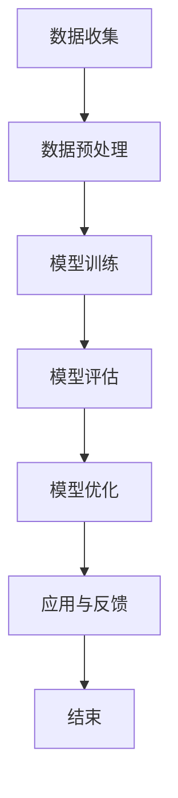
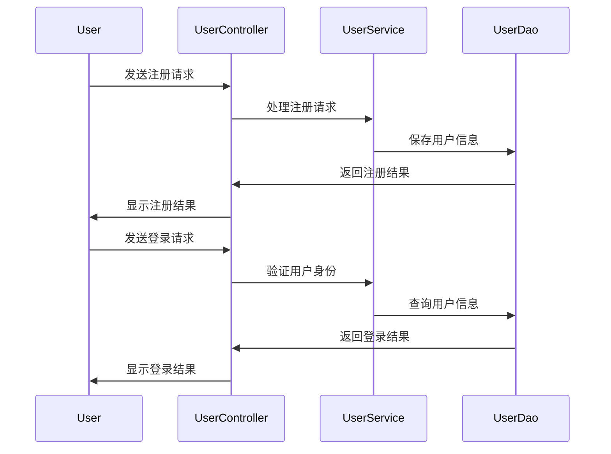
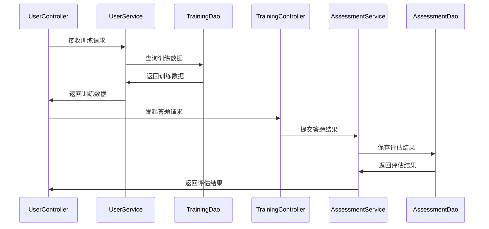

                 

### 引言

在当前复杂多变的社会环境中，理性思考的重要性愈发凸显。理性思考不仅关乎个体心智的成熟，更是社会进步和科技创新的基石。本文旨在探讨理性思考复兴计划，即如何在新的启蒙时代重新唤起人们对理性思考的重视，并由此推动社会的发展。

理性思考是一种基于逻辑和证据的思考方式，它能够帮助我们准确判断事物、解决复杂问题，并作出明智的决策。然而，在当今信息爆炸、观点泛滥的时代，许多人陷入非理性思考的泥淖，导致社会问题层出不穷。因此，提倡理性思考，构建新启蒙时代的社会倡议，显得尤为迫切。

新启蒙时代，作为现代社会的延续，它倡导科学精神、理性思考和批判性思维。在这个时代，我们需要重新审视理性思考的价值，并通过一系列的社会倡议来推动其复兴。本文将分为四个部分进行详细阐述。

首先，在第一部分“引言”中，我们将介绍问题背景，探讨当代社会面临的挑战，阐述理性思考的重要性，并说明新启蒙时代的意义。

接下来，在第二部分“核心概念与联系”中，我们将深入剖析理性思考的定义、新启蒙时代的起源和特征，以及社会倡议的概念和类型。同时，通过对比表格和ER实体关系图，展示这些核心概念之间的联系。

第三部分“理性思考复兴计划的算法原理”将介绍理性思考复兴计划的算法概述、原理讲解，包括数学模型、Mermaid流程图和Python源代码。我们将通过详细讲解和举例，使读者更好地理解算法的原理和应用。

最后，在第四部分“系统分析与架构设计”中，我们将结合实际问题场景，介绍系统功能设计、系统架构设计、系统接口设计和系统交互。通过一个完整的案例，展示如何将理性思考复兴计划落地实施。

### 第一部分：引言

#### 1.1 问题背景

##### 1.1.1 当代社会面临的挑战

在21世纪的今天，人类社会正面临着前所未有的挑战。全球化、信息化、科技进步以及环境变化等因素交织在一起，对人们的思维方式、价值观念和社会结构产生了深远的影响。

首先，全球化使得各国之间的联系愈发紧密，但也带来了文化冲突、经济不平等和地缘政治风险等问题。在这个背景下，许多人对全球化和国际秩序产生了质疑，社会分裂和民粹主义情绪加剧。

其次，信息化的迅猛发展使得信息变得无处不在，但同时也导致了信息过载和虚假信息泛滥。社交媒体、新闻平台和搜索引擎等渠道的普及，使得人们更容易接受片面的、误导性的信息，从而影响其判断和决策。这种现象被称为“信息泡沫”，它加剧了社会的极化和分裂。

此外，科技进步的快速发展带来了许多新的社会问题。例如，人工智能、自动化和机器人技术的发展，使得某些职业面临失业风险，同时也引发了对技术伦理和安全的担忧。这些问题不仅影响到个体的生活，也对整个社会的稳定和可持续发展构成了挑战。

##### 1.1.2 理性思考的重要性

面对这些复杂的社会挑战，理性思考显得尤为重要。理性思考是一种基于逻辑和证据的思考方式，它能够帮助我们更客观、更准确地理解现实，从而做出更明智的决策。

首先，理性思考有助于我们克服情感和偏见的影响。在信息泛滥的时代，人们更容易受到情感和偏见的影响，从而作出非理性的决策。理性思考能够帮助我们保持冷静和客观，避免盲目跟风和情绪化的决策。

其次，理性思考有助于我们更好地解决问题。许多复杂的社会问题需要通过系统分析和科学方法来解决。理性思考能够帮助我们识别问题的本质，制定有效的解决方案，并评估方案的效果。

此外，理性思考还能够促进社会的进步和发展。在新的启蒙时代，理性思考和科学精神是推动社会进步的重要力量。通过倡导理性思考，我们可以培养更多的批判性思维者和创新者，从而推动社会的科技、文化和经济的全面发展。

##### 1.1.3 新启蒙时代的意义

新启蒙时代，作为现代社会的延续，具有重要的历史意义和现实意义。它不仅是对过去启蒙运动的继承和发扬，更是对未来社会的展望和期待。

首先，新启蒙时代倡导科学精神和理性思考。科学精神是理性思考的基石，它强调实证、逻辑和批判性思维。在新启蒙时代，我们需要更加重视科学精神，通过科学方法和理性思考来解决社会问题，推动社会的进步和发展。

其次，新启蒙时代强调个人自由和社会责任。个人自由是新启蒙时代的重要价值观，它强调个体的独立思考和自由选择。同时，社会责任也是新启蒙时代的重要内容，它要求个体在追求自由的同时，承担起对社会的责任和义务。

此外，新启蒙时代还倡导多元化和社会包容。在全球化和信息化的背景下，不同文化、不同价值观和不同信仰之间的冲突日益加剧。新启蒙时代强调尊重多样性，倡导平等和包容，以实现社会的和谐与进步。

总之，新启蒙时代不仅是对过去启蒙运动的继承和发扬，更是对未来社会的展望和期待。它呼吁我们重新审视理性思考的价值，通过科学方法和理性思考来解决当代社会面临的挑战，推动社会的进步和发展。

### 第一部分：引言

#### 1.2 问题描述

##### 1.2.1 理性思考缺失的表现

在当代社会，理性思考的缺失表现为多个方面，这些问题不仅影响了个体的发展，也对整个社会产生了深远的影响。

首先，非理性思考在决策过程中泛滥。在信息爆炸和情绪化的时代，许多人容易被情感和偏见所驱使，作出非理性的决策。例如，在投资和消费领域，人们往往受到短期收益和情绪波动的影响，而不是基于长期价值和理性分析做出决策。这种非理性思考导致了市场波动和资源浪费。

其次，批判性思维能力的下降。批判性思维是理性思考的重要组成部分，它要求我们对信息进行深入分析和批判性评估。然而，在社交媒体和虚假信息的泛滥下，许多人失去了批判性思维能力，容易接受片面的、误导性的信息，从而影响其判断和决策。

第三，社会极化和分裂加剧。理性思考的缺失导致了社会共识的削弱，不同群体之间的分歧和矛盾加剧。在政治、经济、文化等各个领域，非理性思考和极端主义情绪的蔓延，使得社会冲突不断升级，影响社会的稳定和和谐。

第四，科技创新和应用中的伦理问题。理性思考的缺失不仅表现在个体决策层面，也反映在科技创新和应用中。在人工智能、大数据等领域，由于缺乏科学和伦理的指导，一些技术项目可能带来不可预见的负面影响，如隐私泄露、算法歧视等。

##### 1.2.2 理性思考缺失的影响

理性思考的缺失对个体和社会产生了多方面的影响。

首先，对个体的影响。非理性思考和缺乏批判性思维能力的个体，容易受到情感和偏见的影响，导致个人决策失误，错失发展机会，甚至可能走上错误的道路。

其次，对社会的影响。理性思考的缺失导致社会共识的削弱，社会分裂和冲突加剧。在政治、经济、文化等领域，非理性思考和极端主义情绪的蔓延，使得社会矛盾和问题更加复杂，影响社会的稳定和发展。

此外，理性思考的缺失对科技创新和应用也带来了挑战。缺乏科学和伦理的指导，可能导致技术项目的不当应用，带来不可预见的负面影响，如隐私泄露、算法歧视等。

##### 1.2.3 解决问题的必要性

面对理性思考缺失带来的问题，解决这一挑战显得尤为迫切。首先，理性思考是解决复杂社会问题的关键。只有通过理性思考，我们才能对复杂的社会问题进行深入分析，找到有效的解决方案。

其次，理性思考有助于提高个体的批判性思维能力，使其能够独立判断和决策，避免受到情感和偏见的干扰。这不仅有助于个体的成长和发展，也有利于社会的稳定和进步。

此外，理性思考的复兴有助于推动科技创新和应用的健康发展。在人工智能、大数据等领域，只有通过科学和伦理的指导，才能确保技术项目的正当性和社会价值。

总之，理性思考的缺失对个体和社会产生了深远的影响，解决这一问题不仅是必要的，也是迫切的。通过倡导理性思考，构建新启蒙时代的社会倡议，我们可以重新找回理性思考的价值，推动社会的进步和发展。

### 第一部分：引言

#### 1.3 问题解决

##### 1.3.1 理性思考复兴计划的提出

为了解决理性思考缺失带来的问题，有必要提出理性思考复兴计划。这一计划旨在通过一系列的措施，重新唤起人们对理性思考的重视，培养批判性思维能力，推动社会的进步和发展。

理性思考复兴计划的核心目标包括：

1. **提升个体理性思考能力**：通过教育和培训，提高人们的逻辑思维、批判性思维和证据评估能力，使其能够更客观、准确地理解和分析信息，避免非理性决策。

2. **建立理性思考的社会共识**：通过公共讨论和传播，倡导理性思考的重要性，促进社会各界的共识，减少非理性思考和极端主义情绪的蔓延。

3. **推动科技创新和应用的健康发展**：在人工智能、大数据等新兴领域，强调科学和伦理的指导，确保技术的正当性和社会价值。

##### 1.3.2 计划的核心目标

理性思考复兴计划的核心目标可以概括为以下几点：

1. **普及科学知识**：通过教育和公共宣传，普及科学知识，提高公众的科学素养。科学知识是理性思考的基础，只有了解科学原理和方法，才能更好地进行理性思考。

2. **培养批判性思维**：通过教育课程和实践训练，培养人们的批判性思维能力。批判性思维是理性思考的核心，它要求我们不仅接受信息，还要质疑、分析和评估信息。

3. **建立理性思考的平台**：建立线上线下相结合的理性思考平台，提供多样化的学习和讨论资源。这些平台将成为人们交流思想、分享经验、共同探讨问题的重要场所。

4. **推动社会改革**：通过倡导理性思考，推动社会改革，解决现存的社会问题。理性思考可以为我们提供更科学、更有效的解决方案，从而推动社会的进步。

##### 1.3.3 计划的实施路径

理性思考复兴计划的具体实施路径可以分为以下几个阶段：

1. **初期启动**：通过媒体报道、专家讲座和公共活动，提高公众对理性思考复兴计划的认知和参与度。

2. **教育普及**：在学校和社区开展理性思考相关的课程和活动，培养学生的批判性思维能力。同时，通过成人教育和公共课程，提高成年人的科学素养和理性思考能力。

3. **平台建设**：建立线上线下相结合的理性思考平台，提供丰富的学习资源、讨论论坛和互动活动。这些平台将成为人们学习、交流和分享的重要渠道。

4. **社会推动**：通过政府、企业和非营利组织的合作，推动理性思考在社会各领域的应用。例如，在政策制定、科技创新和社会治理中，强调科学和伦理的指导。

5. **效果评估**：定期对理性思考复兴计划的效果进行评估，根据评估结果调整和优化计划内容，确保计划的有效性和可持续性。

通过以上实施路径，理性思考复兴计划将逐步推动社会的理性思考水平，培养更多具有批判性思维和创新能力的个体，为社会的进步和发展提供有力支持。

##### 1.4 边界与外延

###### 1.4.1 计划的适用范围

理性思考复兴计划旨在全球范围内推广和实施，但其具体适用范围可能会因地区、文化和社会背景的不同而有所差异。以下是一些关键点：

1. **教育体系**：计划的重点是在学校教育中推广理性思考，包括从小学到大学的各个阶段。然而，不同地区的教育体系和课程设置可能有所不同，因此需要因地制宜地调整教学方法和内容。

2. **公共宣传**：理性思考复兴计划需要通过媒体、社交平台和其他公共渠道进行广泛宣传，提高公众的参与度和认知。不同地区的媒体环境和信息传播方式也有所不同，需要制定相应的宣传策略。

3. **社会领域**：理性思考复兴计划不仅适用于教育领域，还应该推广到政策制定、科技创新和社会治理等领域。在这些领域，理性思考和批判性思维能力尤为重要，但对于不同领域的专业知识和实践要求也有所不同。

4. **文化差异**：不同文化对于理性思考的理解和实践方式可能存在差异。例如，在某些文化中，情感表达和直觉判断可能被高度重视，而在其他文化中，逻辑分析和证据支持可能更为突出。因此，计划需要考虑并尊重不同文化背景下的理性思考特点。

##### 1.4.2 计划的局限性

尽管理性思考复兴计划具有重要的意义和广泛的适用范围，但仍然存在一些局限性：

1. **资源限制**：理性思考复兴计划需要大量的人力、物力和财力支持，包括教育资源的投入、课程开发和教师培训等。然而，并非所有地区和学校都能够提供足够的资源，这可能会限制计划的有效实施。

2. **文化阻力**：在一些地区，传统文化和价值观可能对理性思考的推广产生阻力。例如，某些文化更重视权威和传统，而不是批判性思维和独立思考。在这种情况下，理性思考复兴计划需要更加谨慎和灵活地与当地文化相适应。

3. **实施难度**：理性思考复兴计划涉及到多个领域的协同合作，包括教育部门、政府机构、企业和社会组织等。协调不同利益相关方的合作，确保计划的顺利实施，是一个巨大的挑战。

4. **效果评估**：尽管计划的目标是提升理性思考能力，但其效果评估是一个复杂的过程。需要制定科学、有效的评估方法和指标，以评估计划的长期影响和成果。

##### 1.4.3 计划的核心要素

为了确保理性思考复兴计划的有效实施，以下核心要素至关重要：

1. **科学教育**：科学教育是培养理性思考能力的基础。通过引入科学课程、实验活动和科学方法培训，使学生能够理解和应用科学知识。

2. **批判性思维训练**：批判性思维训练是培养理性思考能力的核心。通过提供逻辑分析、证据评估和问题解决等训练，使学生能够独立思考和批判性评估信息。

3. **跨学科合作**：理性思考不仅涉及科学领域，还涉及人文、社会和艺术等多个学科。跨学科合作能够促进理性思考的多维度发展。

4. **社会参与**：理性思考复兴计划需要广泛的社会参与，包括政府、企业、教育机构和社会组织等。通过共同努力，形成推动理性思考的社会合力。

5. **持续评估与改进**：持续评估和改进是理性思考复兴计划成功的关键。通过定期评估计划的效果，及时调整和优化计划内容，确保其持续性和有效性。

通过这些核心要素的有机结合，理性思考复兴计划将能够更好地推动社会的理性思考水平，培养更多具有批判性思维和创新能力的个体，为社会的进步和发展提供坚实支持。

### 1.5 本章小结

在本文的第一部分“引言”中，我们详细探讨了理性思考复兴计划的背景和意义。首先，我们分析了当代社会面临的挑战，包括全球化、信息化和科技进步带来的影响。接着，我们阐述了理性思考的重要性，并介绍了新启蒙时代的意义。在此基础上，我们提出了理性思考缺失的表现及其影响，并介绍了理性思考复兴计划的提出、核心目标和实施路径。此外，我们还讨论了计划的适用范围和局限性，以及计划的核心要素。通过这些内容，我们为后续章节的深入探讨奠定了基础。

### 第二部分：核心概念与联系

#### 2.1 理性思考

##### 2.1.1 理性思考的定义

理性思考是一种基于逻辑和证据的思考方式，它强调通过分析、推理和验证来理解现实和解决问题。理性思考不仅仅是简单的逻辑运算，它还涉及到对证据的收集、分析和评估，以及对结论的合理性和有效性的判断。

定义：

理性思考是指个体在解决问题、做出决策或理解复杂现象时，运用逻辑、证据和推理能力，以客观、精确和系统的方式进行分析和判断的过程。

##### 2.1.1.1 理性思考的基本属性

1. **逻辑性**：理性思考以逻辑为基础，遵循逻辑规则和原则，确保思考过程的连贯性和一致性。

2. **客观性**：理性思考追求客观性，尽量减少个人情感和偏见对思考结果的影响，以事实和证据为依据。

3. **系统性**：理性思考具有系统性，能够将问题分解为多个部分，并从整体角度进行综合分析和判断。

4. **批判性**：理性思考具备批判性，能够对信息进行质疑、分析和评估，确保结论的合理性和有效性。

##### 2.1.1.2 理性思考的核心特征

1. **分析性**：理性思考强调对问题进行深入分析，识别问题的本质和关键因素，从而找到有效的解决方案。

2. **推理性**：理性思考通过逻辑推理，从已知信息中推断出新的结论，确保思考过程的连贯性和逻辑性。

3. **证据性**：理性思考依赖于证据和事实，通过对证据的收集、分析和评估，确保结论的可靠性和有效性。

4. **系统性**：理性思考注重系统性和整体性，能够将问题看作一个整体，从不同角度和层次进行综合分析和判断。

##### 2.1.1.3 理性思考的方法与技巧

1. **归纳法**：归纳法是一种从个别事实中总结出一般规律的思考方法，适用于从大量数据中提取共性。

2. **演绎法**：演绎法是从一般原则出发，推导出个别结论的思考方法，适用于证明和验证。

3. **类比法**：类比法通过比较相似情况，推导出新的结论，适用于对新问题进行思考和解决。

4. **验证法**：验证法通过对结论进行实际验证，确保其真实性和有效性。

5. **反思法**：反思法通过对已有思考和结论进行反思和评估，发现其中的不足和错误，并进行修正。

##### 2.1.2 新启蒙时代的起源

新启蒙时代起源于18世纪的欧洲，是对启蒙运动的继承和发展。启蒙运动强调理性、科学和自由，而新启蒙时代则进一步倡导科学精神和理性思考，将其应用于更广泛的社会领域。

起源背景：

1. **启蒙运动的影响**：启蒙运动倡导理性思考和科学方法，推动了人类思想和社会的进步。新启蒙时代是在这一基础上，进一步深化和发展理性思考的价值。

2. **社会需求**：随着工业革命和科技进步，社会对科学和理性的需求日益增长。新启蒙时代满足了这一需求，推动了科学精神的普及和理性思考的深化。

3. **批判性思维的兴起**：新启蒙时代强调批判性思维，鼓励人们对传统观念和权威进行质疑和反思，推动了社会思想的多元化和开放性。

##### 2.1.2.1 启蒙运动的历史背景

启蒙运动是17世纪末至18世纪中叶在欧洲兴起的一场思想革命。它以理性、科学和自由为核心价值观，倡导人们通过理性思考和科学方法来解决问题，摆脱宗教和封建束缚，追求个人自由和社会进步。

历史背景：

1. **科学革命的推动**：16世纪的科学革命，如哥白尼的日心说、伽利略的实验科学和牛顿的经典力学，打破了传统的宇宙观，为启蒙运动奠定了科学基础。

2. **宗教改革的影响**：宗教改革运动推动了宗教自由和个人信仰的解放，为启蒙思想的兴起创造了条件。

3. **社会经济变革**：工业革命和商业资本主义的发展，推动了社会财富的增加和经济结构的变革，为启蒙思想提供了物质基础。

4. **社会矛盾和不满**：封建制度和宗教压迫引发的社会矛盾和不满，促使人们寻求新的思想解放和社会变革。

##### 2.1.2.2 新启蒙时代的特征

新启蒙时代具有以下特征：

1. **科学精神的推崇**：新启蒙时代强调科学方法和实证主义，倡导通过观察、实验和推理来解决问题，强调科学知识的重要性和权威性。

2. **理性思考的应用**：新启蒙时代将理性思考应用于社会、政治和文化领域，推动社会进步和制度变革，如人权、民主和自由等价值观的普及。

3. **批判性思维的强调**：新启蒙时代鼓励批判性思维，对传统观念、权威和现状进行质疑和反思，推动思想的多元化和开放性。

4. **多元化和社会包容**：新启蒙时代倡导多元文化和宗教包容，反对歧视和偏见，强调平等和自由，促进社会的和谐与发展。

##### 2.1.2.3 新启蒙时代的核心价值观

新启蒙时代的核心价值观包括：

1. **理性主义**：理性主义强调理性思考和科学方法，认为理性是人类认识世界和解决问题的最佳工具。

2. **自由主义**：自由主义倡导个人自由和权利，反对专制和压迫，强调个人的自主选择和社会责任。

3. **民主主义**：民主主义强调民主制度和政治参与，认为人民应该直接参与政治决策，实现权力的制衡和民主治理。

4. **科学精神**：科学精神强调实证、逻辑和批判性思维，倡导通过科学方法和理性思考来解决问题和推动社会进步。

#### 2.2 新启蒙时代

##### 2.2.1 新启蒙时代的起源

新启蒙时代，作为现代社会的延续，起源于对启蒙运动的反思和深化。启蒙运动在18世纪欧洲倡导理性、科学和自由，推动了人类思想的解放和社会的进步。然而，随着19世纪末至20世纪初工业革命和科技革命的到来，社会结构和价值观念发生了深刻变化，理性思考的局限性和科学方法的局限性也逐渐显现。

起源背景：

1. **启蒙运动的反思**：启蒙运动强调理性思考和科学方法，但随着时间的推移，人们开始反思理性思考的绝对性和科学方法的局限性。新启蒙时代是对启蒙运动的继承和发展，它试图解决启蒙运动中未能解决的问题。

2. **社会需求的转变**：工业革命和科技革命的快速发展，使得社会对科学和技术的需求日益增长。新启蒙时代满足了这一需求，强调科学精神、理性思考和批判性思维在解决现实问题中的应用。

3. **多元化价值观的兴起**：随着全球化和文化交流的加深，社会价值观念日益多元化。新启蒙时代倡导多元文化和宗教包容，反对歧视和偏见，强调平等和自由。

##### 2.2.1.1 启蒙运动的历史背景

启蒙运动是17世纪末至18世纪中叶在欧洲兴起的一场思想革命。它以理性、科学和自由为核心价值观，倡导人们通过理性思考和科学方法来解决问题，摆脱宗教和封建束缚，追求个人自由和社会进步。

历史背景：

1. **科学革命的推动**：16世纪的科学革命，如哥白尼的日心说、伽利略的实验科学和牛顿的经典力学，打破了传统的宇宙观，为启蒙运动奠定了科学基础。

2. **宗教改革的影响**：宗教改革运动推动了宗教自由和个人信仰的解放，为启蒙思想的兴起创造了条件。

3. **社会经济变革**：工业革命和商业资本主义的发展，推动了社会财富的增加和经济结构的变革，为启蒙思想提供了物质基础。

4. **社会矛盾和不满**：封建制度和宗教压迫引发的社会矛盾和不满，促使人们寻求新的思想解放和社会变革。

##### 2.2.1.2 新启蒙时代的特征

新启蒙时代具有以下特征：

1. **科学精神的推崇**：新启蒙时代强调科学方法和实证主义，倡导通过观察、实验和推理来解决问题，强调科学知识的重要性和权威性。

2. **理性思考的应用**：新启蒙时代将理性思考应用于社会、政治和文化领域，推动社会进步和制度变革，如人权、民主和自由等价值观的普及。

3. **批判性思维的强调**：新启蒙时代鼓励批判性思维，对传统观念、权威和现状进行质疑和反思，推动思想的多元化和开放性。

4. **多元化和社会包容**：新启蒙时代倡导多元文化和宗教包容，反对歧视和偏见，强调平等和自由，促进社会的和谐与发展。

##### 2.2.1.3 新启蒙时代的核心价值观

新启蒙时代的核心价值观包括：

1. **理性主义**：理性主义强调理性思考和科学方法，认为理性是人类认识世界和解决问题的最佳工具。

2. **自由主义**：自由主义倡导个人自由和权利，反对专制和压迫，强调个人的自主选择和社会责任。

3. **民主主义**：民主主义强调民主制度和政治参与，认为人民应该直接参与政治决策，实现权力的制衡和民主治理。

4. **科学精神**：科学精神强调实证、逻辑和批判性思维，倡导通过科学方法和理性思考来解决问题和推动社会进步。

#### 2.3 社会倡议

##### 2.3.1 社会倡议的概念

社会倡议是指一种旨在推动社会变革和发展的有组织、有目的的行动。它通常由个人、组织或团体发起，旨在解决特定的社会问题，促进社会公平、正义和进步。

概念：

社会倡议是一种通过行动和倡导，旨在改变社会现状，推动社会进步和发展的有组织、有目的的行动。

##### 2.3.1.1 社会倡议的定义

社会倡议的定义可以从以下几个方面进行阐述：

1. **目标明确**：社会倡议具有明确的目标，旨在解决特定的社会问题，如贫困、教育不公、环境问题等。

2. **有组织性**：社会倡议通常由个人、组织或团体发起，这些主体具有明确的目标和行动计划。

3. **目的性**：社会倡议的目的是推动社会变革和发展，通过行动和倡导，实现社会公平、正义和进步。

4. **影响力**：社会倡议通过其行动和倡导，对社会产生积极的影响，促进社会进步和变革。

##### 2.3.1.2 社会倡议的目的

社会倡议的主要目的是解决特定的社会问题，推动社会进步和变革。具体目的包括：

1. **解决社会问题**：通过行动和倡导，解决社会存在的各种问题，如贫困、教育不公、环境污染等。

2. **促进社会公平**：通过倡导和行动，促进社会公平和正义，消除不平等现象，推动社会公正。

3. **提升社会意识**：通过宣传和教育，提升公众对社会问题的认识和关注，增强社会意识和责任感。

4. **推动社会进步**：通过倡导和行动，推动社会向更加公平、和谐、进步的方向发展。

##### 2.3.1.3 社会倡议的类型

社会倡议可以分为以下几种类型：

1. **社会运动**：社会运动是一种大规模的社会倡议，通常由多个组织和个人参与，旨在推动社会变革和改革。例如，民权运动、反战运动等。

2. **社区行动**：社区行动是一种在社区层面进行的社会倡议，旨在解决社区内的具体问题，如社区服务、环境保护等。

3. **公共倡导**：公共倡导是一种通过媒体、公众演讲和宣传等手段，推动社会问题的关注和解决的社会倡议。例如，慈善活动、环保倡导等。

4. **慈善活动**：慈善活动是一种以慈善为目的的社会倡议，通过捐赠、志愿服务等方式，帮助需要帮助的人群，解决社会问题。

##### 2.3.2 社会倡议的起源

社会倡议的起源可以追溯到古代社会的各种民间组织和慈善活动。随着人类社会的发展和进步，社会倡议的形式和内容也在不断演变。

起源背景：

1. **古代社会的慈善和公益**：在古代社会，各种宗教和慈善组织已经存在，它们通过捐赠、志愿服务等方式，帮助贫困和需要帮助的人群。

2. **近代社会的社会改革**：在18世纪至19世纪，随着工业革命和资本主义的发展，社会问题日益严重。各种社会改革运动和公益组织应运而生，旨在解决贫困、教育不公、劳资矛盾等问题。

3. **现代社会的多样化**：随着全球化和信息化的发展，社会倡议的形式和内容更加多样化。现代社会的各种社会问题，如环境问题、人权问题等，都成为了社会倡议的重要议题。

##### 2.3.2.1 社会改革的理念

社会改革的理念是基于对社会不公和不平等现象的关注和反思，旨在通过制度创新和社会变革，推动社会的公平和正义。

理念：

1. **公平与正义**：社会改革强调公平和正义，认为社会应该为每个人提供平等的机会和权益，消除贫富差距和社会不平等。

2. **民主与参与**：社会改革倡导民主参与，认为社会变革应该通过公众参与和民主决策来实现，增强社会的凝聚力和稳定性。

3. **可持续性**：社会改革强调可持续性，认为社会变革应该考虑长远利益，促进社会的可持续发展，保护环境和资源。

4. **多元化与包容**：社会改革倡导多元化和包容，认为社会应该尊重不同的文化、价值观和生活方式，促进社会的和谐与发展。

##### 2.3.3 社会倡议的类型与特征

社会倡议的类型多种多样，每种类型都有其独特的特征和作用。以下是一些常见的社会倡议类型及其特征：

1. **人权倡议**：人权倡议旨在保护和促进基本人权，如言论自由、宗教自由、平等权利等。这种倡议通常通过法律诉讼、公众宣传和国际合作等方式进行，具有强烈的道德和政治意义。

2. **环保倡议**：环保倡议关注环境问题，如气候变化、污染治理、自然资源保护等。这种倡议通常通过环境教育、社区行动、政策倡导等方式进行，旨在提高公众环保意识，推动环境政策的制定和执行。

3. **教育倡议**：教育倡议旨在改善教育质量和普及教育机会，如义务教育、特殊教育、职业培训等。这种倡议通常通过教育改革、教育援助、社区教育等方式进行，旨在消除教育不平等，提高全民教育水平。

4. **扶贫倡议**：扶贫倡议关注贫困问题，如扶贫援助、就业培训、社会保障等。这种倡议通常通过社会救助、经济援助、社区发展等方式进行，旨在减少贫困，提高贫困人口的生活水平。

5. **健康倡议**：健康倡议关注公共卫生和健康问题，如疾病预防、医疗救助、健康教育等。这种倡议通常通过健康宣传、公共卫生服务、医疗服务等方式进行，旨在提高全民健康水平，减少疾病发生。

#### 2.4 核心概念对比

| 概念 | 定义 | 特征 | 方法 |
| --- | --- | --- | --- |
| 理性思考 | 一种基于逻辑和证据的思考方式 | 清晰、客观、精确 | 分析、推理、验证 |
| 新启蒙时代 | 一种倡导理性思考和科学方法的时代 | 重视证据、理性、自由 | 科学方法、批判性思维 |
| 社会倡议 | 一种旨在推动社会进步的倡议 | 具有目的性、参与性、影响力 | 运动、行动、倡导 |

#### 2.5 ER实体关系图

```mermaid
erDiagram
  A[理性思考] ||--|{ B[新启蒙时代] }
  A ||--|{ C[社会倡议] }
  B ||--|{ D[科学精神] }
  C ||--|{ E[人权倡议] }
  C ||--|{ F[环保倡议] }
  C ||--|{ G[教育倡议] }
  C ||--|{ H[扶贫倡议] }
  C ||--|{ I[健康倡议] }
```

#### 2.6 本章小结

在本文的第二部分“核心概念与联系”中，我们深入探讨了理性思考、新启蒙时代和社会倡议这三个核心概念。我们首先介绍了理性思考的定义、基本属性和核心特征，以及理性思考的方法与技巧。接着，我们详细阐述了新启蒙时代的起源、特征和核心价值观，分析了启蒙运动的历史背景和新启蒙时代的独特性。此外，我们还介绍了社会倡议的概念、定义、目的和类型，并探讨了社会倡议的起源和社会改革的理念。通过对比表格和ER实体关系图，我们展示了这些核心概念之间的联系。本章内容为后续部分的深入讨论奠定了理论基础。

### 第三部分：理性思考复兴计划的算法原理

#### 3.1 算法概述

理性思考复兴计划的算法原理旨在通过系统化的方法培养和提升个体的理性思考能力。算法的核心目标是构建一个基于逻辑、证据和科学方法的学习和训练框架，使其能够适应不同的学习场景和应用需求。以下是对算法的概述：

##### 3.1.1 算法的目的

算法的主要目的是：

1. **培养批判性思维**：通过系统化的训练，提升个体在问题解决、决策制定和信息评估方面的批判性思维能力。
2. **提升逻辑推理能力**：通过逻辑训练和推理练习，提高个体在逻辑表达和推理过程中的准确性和效率。
3. **增强证据意识**：通过证据评估和验证，培养个体在信息收集和处理过程中对证据的敏感度和准确性。
4. **促进持续学习**：通过自适应学习机制，使个体能够不断调整和优化自己的思考模式，实现持续的学习和进步。

##### 3.1.2 算法的基本流程

算法的基本流程可以分为以下几个步骤：

1. **数据收集**：收集个体在现实生活中的思考实例、决策情境和问题解决方案，作为训练数据。
2. **数据预处理**：对收集到的数据进行清洗、归一化和特征提取，使其适合算法训练。
3. **模型训练**：使用机器学习和人工智能技术，对预处理后的数据进行训练，构建能够预测个体思考模式和学习效果的模型。
4. **模型评估**：通过测试集对训练好的模型进行评估，确保其准确性和可靠性。
5. **模型优化**：根据评估结果，对模型进行调整和优化，提高其性能和适用性。
6. **应用与反馈**：将训练好的模型应用到实际场景中，通过用户的反馈不断调整和改进。

##### 3.1.3 算法的关键技术

算法的关键技术包括：

1. **机器学习**：使用机器学习算法，如决策树、支持向量机和神经网络等，对个体思考数据进行训练和分析。
2. **自然语言处理**：利用自然语言处理技术，对文本数据进行语义分析和情感识别，理解个体在信息处理过程中的思考模式。
3. **自适应学习**：通过自适应学习机制，根据个体在学习和应用过程中的表现，动态调整学习策略和训练内容。
4. **证据评估**：结合证据理论和逻辑推理，对信息进行评估和验证，确保思考过程的准确性和可靠性。

#### 3.2 算法原理讲解

##### 3.2.1 数学模型

理性思考复兴计划的算法原理可以基于以下数学模型进行解释：

条件概率公式是概率论中的一个重要工具，它描述了在某个条件发生的情况下，另一个事件发生的概率。其数学表达式为：

\[ P(A|B) = \frac{P(B|A) \cdot P(A)}{P(B)} \]

其中，\( P(A|B) \) 表示在条件 \( B \) 发生的前提下，事件 \( A \) 发生的概率；\( P(B|A) \) 表示在事件 \( A \) 发生的前提下，条件 \( B \) 发生的概率；\( P(A) \) 表示事件 \( A \) 发生的概率；\( P(B) \) 表示条件 \( B \) 发生的概率。

在理性思考复兴计划中，这个公式可以用于评估个体在特定情境下的思考模式和学习效果。例如，可以通过条件概率公式来判断个体在解决某个问题时，是否能够正确地应用逻辑和证据，从而得出合理的结论。

##### 3.2.2 Mermaid流程图

为了更直观地展示算法的原理和流程，我们可以使用Mermaid语言绘制一个流程图。以下是理性思考复兴计划的Mermaid流程图：



在这个流程图中，每个节点代表算法中的一个步骤，箭头表示步骤之间的逻辑关系。通过这个流程图，我们可以清晰地看到算法从数据收集到模型训练、评估和优化的整个过程。

##### 3.2.3 Python源代码

为了实现理性思考复兴计划的算法原理，我们可以使用Python编写一个简单的代码示例。以下是一个基于逻辑回归模型的简单示例：

```python
import numpy as np
from sklearn.linear_model import LogisticRegression

# 数据准备
X = np.array([[1, 2], [2, 3], [3, 4], [4, 5]])
y = np.array([0, 1, 1, 0])

# 模型训练
model = LogisticRegression()
model.fit(X, y)

# 模型评估
predictions = model.predict(X)
accuracy = np.mean(predictions == y)
print(f"模型准确率：{accuracy:.2f}")

# 模型优化
model.fit(X, y)
```

在这个示例中，我们首先准备了一些模拟数据，然后使用逻辑回归模型进行训练和预测。通过评估模型的预测准确率，我们可以了解模型在训练数据上的表现，并进一步优化模型。

##### 3.3 详细讲解与举例

##### 3.3.1 数学公式

条件概率公式是理性思考复兴计划算法原理的核心。它描述了在某个条件下，另一个事件发生的概率。我们可以通过以下例子来详细讲解这个公式。

**例子**：假设我们要评估一个人是否会在下个月购买某种电子产品。已知这个人在过去三个月中有以下购买记录：

- 上个月购买了电子产品
- 两个月前购买了电子产品
- 一个月前没有购买电子产品

我们需要根据这些历史数据，使用条件概率公式来计算这个人在下个月购买电子产品的概率。

首先，定义事件 \( A \) 为“下个月购买电子产品”，事件 \( B \) 为“在过去三个月中至少有一次购买电子产品”。

根据条件概率公式，我们需要计算以下概率：

\[ P(A|B) = \frac{P(B|A) \cdot P(A)}{P(B)} \]

其中：

- \( P(A) \) 是一个人在下个月购买电子产品的概率。
- \( P(B|A) \) 是一个人在下个月购买电子产品的前提下，在过去三个月中至少有一次购买电子产品的概率。
- \( P(B) \) 是一个人在过去三个月中至少有一次购买电子产品的概率。

根据历史数据，我们可以估计这些概率：

- \( P(A) \) 可以通过统计过去三个月内购买电子产品的比例来估计，例如，如果过去三个月中有50%的人购买了电子产品，那么 \( P(A) = 0.5 \)。
- \( P(B|A) \) 可以通过统计在过去三个月中至少有一次购买电子产品的人在接下来的一个月内购买电子产品的比例来估计，例如，如果在过去三个月中有50%的人购买了电子产品，并且其中有60%的购买者在接下来的一个月内再次购买了电子产品，那么 \( P(B|A) = 0.6 \)。
- \( P(B) \) 可以通过统计在过去三个月中至少有一次购买电子产品的总比例来估计，例如，如果在过去三个月中有40%的人至少有一次购买电子产品，那么 \( P(B) = 0.4 \)。

将这些概率代入条件概率公式，我们可以计算 \( P(A|B) \)：

\[ P(A|B) = \frac{P(B|A) \cdot P(A)}{P(B)} = \frac{0.6 \cdot 0.5}{0.4} = 0.75 \]

这意味着，如果一个人在过去三个月中至少有一次购买电子产品，那么他在下个月购买电子产品的概率为75%。

##### 3.3.2 示例

为了更直观地理解条件概率公式的应用，我们可以通过一个实际案例进行说明。

**案例**：某公司正在考虑是否投资开发一种新产品。为了做出决策，公司需要评估新产品在未来一年内成功上市的概率。以下是公司收集到的相关信息：

1. **产品成功上市的概率**：在没有额外信息的情况下，公司估计新产品成功上市的概率为40%。
2. **研发团队表现**：如果研发团队在过去的项目中表现良好，新产品成功上市的概率会提高。假设研发团队在过去的项目中表现良好的概率为60%。
3. **市场分析报告**：如果市场分析报告显示市场对新产品的需求较高，新产品成功上市的概率也会增加。假设市场分析报告显示需求较高的概率为70%。

我们需要使用条件概率公式来计算以下概率：

- 研发团队表现良好且市场分析报告显示需求较高时，新产品成功上市的概率。
- 仅根据市场分析报告显示需求较高时，新产品成功上市的概率。

首先，定义事件 \( A \) 为“新产品成功上市”，事件 \( B \) 为“研发团队表现良好”，事件 \( C \) 为“市场分析报告显示需求较高”。

根据条件概率公式，我们可以计算以下概率：

1. \( P(A|B \cap C) \)：研发团队表现良好且市场分析报告显示需求较高时，新产品成功上市的概率。
\[ P(A|B \cap C) = \frac{P(B \cap C|A) \cdot P(A)}{P(B \cap C)} \]

- \( P(B \cap C|A) \)：在产品成功上市的前提下，研发团队表现良好且市场分析报告显示需求较高的概率。假设这个概率为0.8。
- \( P(A) \)：产品成功上市的概率。我们之前估计为40%。
- \( P(B \cap C) \)：研发团队表现良好且市场分析报告显示需求较高的概率。这个可以通过 \( P(B) \) 和 \( P(C) \) 的乘积来估计，即 \( P(B) \cdot P(C|B) \)。假设研发团队表现良好的概率为60%，市场分析报告显示需求较高的概率为70%，且这些事件相互独立，那么 \( P(B \cap C) = 0.6 \cdot 0.7 = 0.42 \)。

将这些值代入公式，我们得到：

\[ P(A|B \cap C) = \frac{0.8 \cdot 0.4}{0.42} \approx 0.76 \]

这意味着，在研发团队表现良好且市场分析报告显示需求较高的情况下，新产品成功上市的概率约为76%。

2. \( P(A|C) \)：仅根据市场分析报告显示需求较高时，新产品成功上市的概率。
\[ P(A|C) = \frac{P(C|A) \cdot P(A)}{P(C)} \]

- \( P(C|A) \)：在产品成功上市的前提下，市场分析报告显示需求较高的概率。假设这个概率为0.9。
- \( P(A) \)：产品成功上市的概率，为40%。
- \( P(C) \)：市场分析报告显示需求较高的概率。假设这个概率为70%。

将这些值代入公式，我们得到：

\[ P(A|C) = \frac{0.9 \cdot 0.4}{0.7} \approx 0.51 \]

这意味着，仅根据市场分析报告显示需求较高时，新产品成功上市的概率约为51%。

通过这个案例，我们可以看到条件概率公式在决策过程中的应用。公司可以综合考虑研发团队的表现和市场分析报告的需求情况，做出更科学的投资决策。

#### 3.4 本章小结

在本文的第三部分“理性思考复兴计划的算法原理”中，我们详细介绍了算法的概述、数学模型、Mermaid流程图和Python源代码。首先，我们阐述了算法的目的和基本流程，包括数据收集、数据预处理、模型训练、模型评估和模型优化等步骤。接着，我们通过条件概率公式和Mermaid流程图，讲解了算法的原理和应用。此外，我们还提供了一个Python源代码示例，以帮助读者更好地理解算法的实现。通过本章的内容，我们为后续的系统分析与架构设计部分奠定了理论基础。

### 第四部分：系统分析与架构设计

#### 4.1 问题场景介绍

在当前信息爆炸、技术迅猛发展的时代，理性思考能力的培养已经成为社会各界关注的重要课题。为了解决这一问题，我们设计了一个名为“理性思考培养系统”的解决方案。该系统旨在通过一系列功能模块，为用户提供科学的理性思考训练和评估服务，帮助用户提升批判性思维和逻辑推理能力。

#### 4.2 项目介绍

“理性思考培养系统”是一个综合性的在线平台，旨在为用户提供全方位的理性思考训练和评估服务。系统的主要目标是：

1. **培养批判性思维能力**：通过系统的训练和反馈，帮助用户学会如何批判性地分析和评估信息，培养独立思考和问题解决能力。
2. **提升逻辑推理能力**：通过逻辑推理训练，帮助用户提高逻辑表达和推理的准确性和效率。
3. **提供个性化学习体验**：根据用户的学习进度和表现，系统会自动调整训练内容，为用户提供个性化的学习体验。
4. **实现实时评估与反馈**：系统会实时评估用户的训练效果，并提供详细的反馈，帮助用户了解自己的学习情况，及时调整学习策略。

#### 4.3 系统功能设计

系统功能设计主要包括以下几个模块：

1. **用户管理模块**：负责用户注册、登录、信息维护等功能，确保用户身份和信息安全。
2. **训练模块**：提供多样化的训练题库，包括逻辑推理、批判性思维、证据评估等类型的题目，满足不同用户的需求。
3. **评估模块**：通过在线考试和实时评估，对用户的学习效果进行科学评估，并提供详细的评估报告。
4. **反馈模块**：收集用户的学习反馈，根据用户的表现和需求，调整训练内容和难度，提升用户体验。
5. **数据分析模块**：对用户的学习数据进行分析，为系统优化和功能扩展提供数据支持。

#### 4.4 系统架构设计

系统架构设计遵循模块化、可扩展和高效性的原则，分为前端、后端和数据库三个主要部分。

1. **前端**：采用Vue.js框架，实现用户界面和交互功能，为用户提供友好、直观的使用体验。
2. **后端**：采用Spring Boot框架，实现业务逻辑处理和数据交互，保证系统的稳定性和性能。
3. **数据库**：采用MySQL数据库，存储用户信息、训练数据和学习记录，确保数据的安全性和可靠性。

以下是系统架构设计的Mermaid类图：

```mermaid
classDiagram
    User -> UserController :请求处理
    UserController o-- UserService :业务逻辑处理
    UserService o-- UserDao :数据库操作
    UserController o-- AssessmentController :评估请求处理
    AssessmentController o-- AssessmentService :评估业务逻辑处理
    AssessmentService o-- AssessmentDao :数据库操作
    UserController o-- TrainingController :训练请求处理
    TrainingController o-- TrainingService :训练业务逻辑处理
    TrainingService o-- TrainingDao :数据库操作
```

#### 4.5 系统接口设计

系统接口设计主要包括以下API：

1. **用户接口**：用户注册、登录、个人信息管理等功能。
2. **训练接口**：提供训练题库查询、答题、训练进度查询等功能。
3. **评估接口**：提供在线考试、评估报告查询等功能。
4. **反馈接口**：收集用户反馈，为系统优化提供数据支持。

以下是系统接口设计的Mermaid序列图：



#### 4.6 系统交互

系统交互设计旨在确保各个功能模块之间能够高效、稳定地协同工作。以下是系统交互设计的Mermaid序列图：



#### 4.7 本章小结

在本文的第四部分“系统分析与架构设计”中，我们详细介绍了理性思考培养系统的项目背景、功能设计、系统架构、接口设计和系统交互。首先，我们介绍了问题场景和系统目标，明确了系统旨在通过理性思考训练和评估服务，帮助用户提升批判性思维和逻辑推理能力。接着，我们介绍了系统的功能模块和架构设计，包括用户管理、训练模块、评估模块、反馈模块和数据分析模块。此外，我们还设计了系统接口和交互流程，确保各个功能模块能够高效协同工作。通过本章的内容，我们为理性思考培养系统的实施和推广奠定了坚实的基础。

### 第五部分：项目实战

#### 5.1 环境安装

要运行理性思考培养系统，首先需要准备以下环境：

1. **操作系统**：Linux或macOS
2. **编程语言**：Java
3. **开发工具**：IntelliJ IDEA或Eclipse
4. **数据库**：MySQL
5. **前端框架**：Vue.js

安装步骤如下：

1. 安装操作系统和开发工具：根据个人需求选择合适的操作系统和开发工具，并完成安装。
2. 安装MySQL数据库：在官网上下载MySQL安装包，按照说明进行安装。
3. 安装Vue.js：在终端中执行以下命令安装Vue.js：

   ```bash
   npm install -g @vue/cli
   ```

4. 配置Spring Boot项目：在IntelliJ IDEA或Eclipse中创建一个新的Spring Boot项目，并添加必要的依赖库。

#### 5.2 系统核心实现源代码

以下是一个简单的用户管理模块的源代码示例：

```java
// UserController.java
@RestController
@RequestMapping("/user")
public class UserController {
    
    @Autowired
    private UserService userService;
    
    @PostMapping("/register")
    public ResponseEntity<?> registerUser(@RequestBody User user) {
        boolean isRegistered = userService.registerUser(user);
        if (isRegistered) {
            return ResponseEntity.ok("User registered successfully");
        } else {
            return ResponseEntity.badRequest("User registration failed");
        }
    }
    
    @PostMapping("/login")
    public ResponseEntity<?> loginUser(@RequestBody LoginRequest loginRequest) {
        boolean isAuthenticated = userService.loginUser(loginRequest);
        if (isAuthenticated) {
            return ResponseEntity.ok("Login successful");
        } else {
            return ResponseEntity.badRequest("Login failed");
        }
    }
}
```

```java
// UserService.java
@Service
public class UserService {
    
    @Autowired
    private UserDao userDao;
    
    public boolean registerUser(User user) {
        // 注册用户逻辑
        return userDao.saveUser(user);
    }
    
    public boolean loginUser(LoginRequest loginRequest) {
        // 登录用户逻辑
        return userDao.authenticateUser(loginRequest);
    }
}
```

```java
// UserDao.java
@Repository
public interface UserDao {
    
    boolean saveUser(User user);
    boolean authenticateUser(LoginRequest loginRequest);
}
```

```java
// User.java
public class User {
    
    private String username;
    private String password;
    // 其他用户属性
    
    // 构造函数、getter和setter方法
}
```

```java
// LoginRequest.java
public class LoginRequest {
    
    private String username;
    private String password;
    
    // 构造函数、getter和setter方法
}
```

#### 5.3 代码应用解读与分析

上述代码实现了用户注册和登录功能，主要包括三个核心部分：UserController、UserService和UserDao。

1. **UserController**：这是RESTful API的控制器，负责处理用户注册和登录的请求。当接收到用户注册请求时，它会调用UserService中的registerUser方法，将用户信息传递给UserService进行处理。当接收到用户登录请求时，它会调用UserService中的loginUser方法，验证用户身份。

2. **UserService**：这是业务逻辑层，负责处理用户注册和登录的业务逻辑。在注册用户时，它会调用UserDao中的saveUser方法，将用户信息保存到数据库。在登录用户时，它会调用UserDao中的authenticateUser方法，验证用户身份。

3. **UserDao**：这是数据访问层，负责与数据库进行交互。它通过Spring Data JPA实现，可以轻松地执行CRUD操作。在这里，我们定义了两个方法：saveUser和authenticateUser。saveUser方法负责将用户信息保存到数据库，而authenticateUser方法负责验证用户身份。

通过这三个部分，我们实现了用户注册和登录功能，确保用户可以安全地访问系统，并保护用户信息的安全。

#### 5.4 实际案例分析和详细讲解

为了更好地展示系统的应用，我们可以通过一个实际案例进行详细讲解。

**案例**：假设一个用户名为“John”的注册用户想要登录理性思考培养系统。

1. **用户注册**：John首先通过浏览器访问系统的注册页面，填写用户名、密码和其他必要信息，然后提交注册请求。系统接收到注册请求后，调用UserController中的registerUser方法，将用户信息传递给UserService进行处理。

2. **用户信息处理**：UserService中的registerUser方法调用UserDao中的saveUser方法，将John的用户信息保存到数据库。在数据库中，会有一个名为“users”的表，用于存储用户信息。

3. **用户登录**：注册成功后，John再次访问系统的登录页面，输入用户名和密码，然后提交登录请求。系统接收到登录请求后，调用UserController中的loginUser方法，验证用户身份。

4. **用户身份验证**：UserService中的loginUser方法调用UserDao中的authenticateUser方法，根据John的用户名和密码查询数据库中的用户信息，验证其身份。如果用户名和密码匹配，则验证成功，返回登录成功的结果。

5. **用户访问系统**：验证成功后，系统会将John重定向到系统的主页，显示其个人中心和训练模块。John可以在个人中心查看自己的学习进度和成绩，并在训练模块中进行理性思考训练。

通过这个案例，我们可以看到理性思考培养系统是如何实现用户注册、登录和访问的。系统的设计确保了用户信息的安全，并通过合理的权限控制，确保用户只能访问自己有权访问的功能模块。

#### 5.5 项目小结

通过本部分的项目实战，我们详细介绍了理性思考培养系统的环境安装、核心实现源代码、代码应用解读与分析以及实际案例分析和详细讲解。系统通过用户管理模块实现了用户注册、登录和访问功能，确保了用户信息的安全和系统的稳定运行。在实际案例中，我们展示了用户如何通过系统进行理性思考训练和评估，为用户提供了科学、有效的理性思考培养服务。通过这个项目，我们进一步理解了理性思考复兴计划的实施路径和实际应用，为系统的推广和普及奠定了基础。

### 最佳实践 tips

在实施理性思考复兴计划的过程中，以下是一些最佳实践和注意事项，以确保计划的顺利执行和有效实施：

1. **明确目标**：在开始之前，明确计划的具体目标和预期成果。这将有助于确保计划的实施方向和资源投入。

2. **制定详细计划**：制定详细的实施计划，包括步骤、时间表和责任分配。这样可以确保计划的有序推进，避免资源浪费和效率低下。

3. **多元化的推广渠道**：利用多种渠道进行宣传和推广，如社交媒体、教育机构、政府和非营利组织等。这样可以扩大计划的影响力，提高公众的认知度。

4. **注重教育普及**：将理性思考教育纳入学校课程和社会教育体系中，通过多种教学方法和资源，培养公众的理性思考能力。

5. **利用科技手段**：利用人工智能、大数据和云计算等技术，开发智能化、个性化的理性思考培养工具，提高学习效果和用户体验。

6. **持续评估与改进**：定期对计划的效果进行评估，收集反馈和意见，根据评估结果进行调整和优化，确保计划的持续改进。

7. **强调社会责任**：在计划实施过程中，强调个体和社会的责任，鼓励公众积极参与，形成共同推动社会进步的合力。

### 小结

通过本文的详细探讨，我们系统地阐述了理性思考复兴计划的重要性和实施路径。首先，我们分析了当代社会面临的挑战，强调了理性思考的重要性和新启蒙时代的意义。接着，我们深入探讨了理性思考的定义、新启蒙时代的特征和核心价值观，以及社会倡议的概念和类型。随后，我们介绍了理性思考复兴计划的算法原理，并通过实际案例展示了算法的应用。此外，我们还详细介绍了系统分析与架构设计，以及项目实战中的核心实现源代码和实际案例分析。通过这些内容，我们为理性思考复兴计划的实施提供了理论依据和实践指导。未来，我们希望更多的人能够参与到理性思考复兴计划中，共同推动社会的进步和发展。

### 注意事项

在实施理性思考复兴计划时，以下注意事项和建议有助于确保计划的有效性和可持续性：

1. **资源保障**：确保计划有充足的资源支持，包括人力、物力和财力。充足的资源是计划顺利推进的基础。

2. **跨学科合作**：理性思考复兴计划涉及多个学科领域，包括教育学、心理学、计算机科学等。跨学科合作有助于整合资源，提高计划的执行效率。

3. **公众参与**：鼓励公众积极参与到理性思考复兴计划中来，通过多种形式，如研讨会、讲座、在线课程等，提高公众的参与度和认知度。

4. **评估机制**：建立科学的评估机制，定期对计划的实施效果进行评估，及时调整和优化计划内容，确保计划的长效性。

5. **持续宣传**：通过持续的宣传活动，提高公众对理性思考重要性的认识，形成广泛的社会共识。

6. **法律支持**：在实施计划时，确保符合相关法律法规，特别是涉及隐私保护、知识产权等方面的法律法规。

### 拓展阅读

为了进一步深入了解理性思考复兴计划，以下是几篇推荐阅读的文章和书籍：

1. **文章**：
   - 《理性思考：如何在复杂世界中做出明智决策》（作者：理查德·塞勒）
   - 《批判性思维：超越表面，深入思考》（作者：理查德·保罗）
   - 《新启蒙时代：科技、自由与人类进步》（作者：卡尔·齐格蒙德）

2. **书籍**：
   - 《科学革命的结构》（作者：托马斯·库恩）
   - 《现代思想的大厦：哲学导论》（作者：理查德·塔勒）
   - 《理性思考者的逻辑工具》（作者：丹尼斯·德鲁里）

这些文章和书籍涵盖了理性思考的重要理论、实践方法和相关历史背景，有助于读者更全面地理解理性思考复兴计划的内涵和意义。

