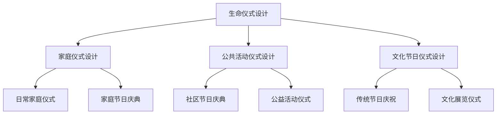
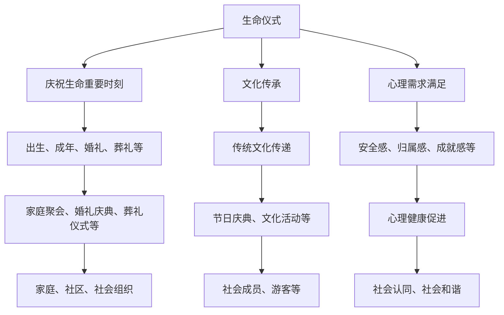

                 


# 《生命仪式设计学院：创造现代人精神仪式的培训》

> 关键词：生命仪式、精神仪式、仪式设计、现代人、精神生活、文化传承

> 摘要：本文旨在探讨现代人在精神生活方面面临的挑战，以及如何通过生命仪式设计学院来创造适合现代人的精神仪式，从而提升个人幸福感和社会凝聚力。文章将逐步分析生命仪式的概念、重要性、设计原则，以及如何在个人生活、公共活动和未来趋势中实践仪式设计。

### 目录大纲设计思路

为了设计出一本关于《生命仪式设计学院：创造现代人精神仪式的培训》的完整目录大纲，我们可以按照以下步骤进行：

#### 1. **书籍背景介绍（第1章）**
   - **1.1 问题背景**：介绍现代人精神生活的现状，说明精神仪式在现代社会中的重要性。
   - **1.2 问题描述**：阐述现代人在生活中缺乏精神仪式感的现象，以及这对个人和社会的影响。
   - **1.3 问题解决**：介绍书籍的主题——生命仪式设计，说明通过设计生命仪式可以帮助现代人重建精神仪式感。
   - **1.4 边界与外延**：明确书籍的研究范围，如个人生活、公共活动、文化习俗等。
   - **1.5 概念结构与核心要素组成**：介绍生命仪式设计的基本概念和构成要素。

#### 2. **核心概念与联系（第2章）**
   - **2.1 生命仪式的定义**：详细解释生命仪式的概念，包括其起源、演变和现代意义。
   - **2.2 精神仪式的重要性**：分析精神仪式对个人成长和社会和谐的积极作用。
   - **2.3 生命仪式与精神仪式的联系与区别**：通过对比表格和Mermaid ER图，阐述两者之间的关系。

#### 3. **现代人的精神仪式设计（第3章至第7章）**
   - **第3章 个人生活的仪式设计**
     - **3.1 家庭仪式设计**：介绍如何在家庭中建立日常仪式，如早餐、晚餐、节日庆典等。
     - **3.2 个人成长仪式设计**：探讨如何通过生日、毕业典礼等仪式促进个人成长。
   - **第4章 公共活动的仪式设计**
     - **4.1 社区活动仪式设计**：介绍社区如何通过公共活动来增强社区凝聚力。
     - **4.2 文化节日仪式设计**：分析如何利用文化节日来传承和弘扬传统文化。
   - **第5章 仪式设计的实用技巧**
     - **5.1 仪式内容的设计**：讨论如何创造有意义的仪式内容，包括主题、参与形式等。
     - **5.2 仪式场地的布置**：介绍如何通过场地布置来增强仪式的视觉效果和氛围。
   - **第6章 仪式设计的心理学分析**
     - **6.1 仪式与心理需求**：分析仪式对满足人类心理需求的作用。
     - **6.2 仪式对个人行为的影响**：探讨仪式如何引导和改变个人行为。
   - **第7章 仪式设计的未来趋势**
     - **7.1 数字化仪式设计**：探讨数字技术如何改变传统仪式设计。
     - **7.2 全球化背景下的仪式设计**：分析全球化对仪式设计的影响和挑战。

#### 4. **案例分析与实践指导（第8章）**
   - **8.1 案例分析**：选取几个典型的生命仪式设计案例，分析其实施过程和效果。
   - **8.2 实践指导**：提供具体的仪式设计步骤和方法，帮助读者实际操作。

#### 5. **小结与展望（第9章）**
   - **9.1 小结**：总结书籍的主要观点和收获。
   - **9.2 注意事项**：提醒读者在仪式设计过程中需要注意的问题。
   - **9.3 拓展阅读**：推荐一些相关的书籍和资源，以供读者深入研究和实践。

### 目录大纲示例

```markdown
# 《生命仪式设计学院：创造现代人精神仪式的培训》目录大纲

# 第1章 背景介绍

## 1.1 问题背景

### 1.1.1 现代人精神生活的现状

### 1.1.2 精神仪式在现代社会中的重要性

## 1.2 问题描述

### 1.2.1 现代人在生活中缺乏精神仪式感的现象

### 1.2.2 精神仪式感缺失对个人和社会的影响

## 1.3 问题解决

### 1.3.1 生命仪式设计的概念

### 1.3.2 通过生命仪式设计重建精神仪式感

## 1.4 边界与外延

### 1.4.1 研究范围

### 1.4.2 生命仪式设计的核心要素组成

## 1.5 本章小结

# 第2章 核心概念与联系

## 2.1 生命仪式的定义

### 2.1.1 生命仪式的起源

### 2.1.2 生命仪式的演变

### 2.1.3 现代生命仪式的意义

## 2.2 精神仪式的重要性

### 2.2.1 精神仪式对个人成长的影响

### 2.2.2 精神仪式对社会和谐的作用

## 2.3 生命仪式与精神仪式的联系与区别

### 2.3.1 概念对比表格

### 2.3.2 Mermaid ER图

## 2.4 本章小结

# 第3章 个人生活的仪式设计

## 3.1 家庭仪式设计

### 3.1.1 日常家庭仪式的设计原则

### 3.1.2 家庭节日庆典的仪式设计

## 3.2 个人成长仪式设计

### 3.2.1 生日仪式的设计

### 3.2.2 毕业典礼的仪式设计

## 3.3 本章小结

# 第4章 公共活动的仪式设计

## 4.1 社区活动仪式设计

### 4.1.1 社区节日的仪式设计

### 4.1.2 社区互助活动的仪式设计

## 4.2 文化节日仪式设计

### 4.2.1 传统节日的仪式设计

### 4.2.2 现代文化节日的仪式设计

## 4.3 本章小结

# 第5章 仪式设计的实用技巧

## 5.1 仪式内容的设计

### 5.1.1 主题仪式的设计

### 5.1.2 参与形式的多样化

## 5.2 仪式场地的布置

### 5.2.1 场地选择的重要性

### 5.2.2 场地布置技巧

## 5.3 本章小结

# 第6章 仪式设计的心理学分析

## 6.1 仪式与心理需求

### 6.1.1 心理需求的满足

### 6.1.2 心理健康的促进

## 6.2 仪式对个人行为的影响

### 6.2.1 行为引导

### 6.2.2 行为改变

## 6.3 本章小结

# 第7章 仪式设计的未来趋势

## 7.1 数字化仪式设计

### 7.1.1 数字技术在仪式中的应用

### 7.1.2 数字化仪式的优缺点分析

## 7.2 全球化背景下的仪式设计

### 7.2.1 全球化对仪式设计的影响

### 7.2.2 跨文化仪式设计的挑战与机遇

## 7.3 本章小结

# 第8章 案例分析与实践指导

## 8.1 案例分析

### 8.1.1 案例一：社区节日的仪式设计

### 8.1.2 案例二：个人成长仪式的设计

## 8.2 实践指导

### 8.2.1 设计步骤与方法

### 8.2.2 实际操作指导

## 8.3 本章小结

# 第9章 小结与展望

## 9.1 小结

### 9.1.1 主要观点

### 9.1.2 收获与反思

## 9.2 注意事项

### 9.2.1 仪式设计中的注意事项

### 9.2.2 可能遇到的问题及解决方案

## 9.3 拓展阅读

### 9.3.1 推荐书籍

### 9.3.2 相关资源链接
```markdown
### 第1章 背景介绍

#### 1.1 问题背景

在现代社会的快速发展中，人们的生活节奏加快，物质生活日益丰富，但精神层面的满足感却逐渐减弱。现代人在生活中面临着许多挑战，如工作压力、人际关系紧张、孤独感等，这些问题往往导致了精神上的空虚和焦虑。精神仪式作为一种文化表达和社会行为，其重要性在现代生活中愈发凸显。通过设计适合现代人的精神仪式，可以帮助人们建立仪式感，提升生活质量，增强个人幸福感和社会凝聚力。

**1.1.1 现代人精神生活的现状**

随着社会的现代化，人们的生活方式也发生了巨大的变化。传统的家庭、社区和文化习俗逐渐被现代社会的高效和便捷所取代，导致许多人在日常生活中缺乏精神寄托和仪式感。现代人在生活中往往更注重物质的满足，而忽视了精神层面的需求。这种现象在一些大城市尤为明显，快节奏的生活和工作压力使得人们很难找到时间停下来，思考自己的精神生活。

**1.1.2 精神仪式在现代社会中的重要性**

精神仪式作为一种文化表达，具有丰富个人精神生活、促进社会和谐的功能。在现代社会的背景下，通过设计精神仪式，可以帮助人们缓解压力、增强归属感和认同感，从而提升个人幸福感和社会凝聚力。例如，家庭仪式可以让家庭成员更加团结，社区活动可以增强社区凝聚力，文化节日仪式可以传承和弘扬传统文化。

#### 1.2 问题描述

**1.2.1 现代人在生活中缺乏精神仪式感的现象**

现代人在生活中缺乏精神仪式感的现象主要体现在以下几个方面：

1. **家庭生活中的缺失**：家庭作为人们生活的重要场所，传统的家庭仪式如生日庆祝、节日庆典等逐渐被忽视，家庭成员之间的交流和互动减少，家庭氛围变得冷漠。
2. **公共活动中的缺失**：现代社会中，公共活动往往过于注重形式而忽视内容，缺乏仪式感，导致参与者的体验感不强，难以形成深刻的记忆。
3. **文化节日中的缺失**：随着全球化的推进，许多传统文化节日失去了原有的仪式感，变成了简单的庆祝活动，无法真正体现节日的文化内涵。

**1.2.2 精神仪式感缺失对个人和社会的影响**

精神仪式感缺失对个人和社会的影响是深远的：

1. **个人层面**：缺乏精神仪式感会导致人们精神上的空虚和焦虑，影响身心健康。同时，也会使人们感到孤独和失落，缺乏归属感和认同感。
2. **社会层面**：缺乏精神仪式感会影响社会和谐。社区、家庭和社会组织缺乏共同的文化基础，难以形成团结和凝聚力，从而影响社会的稳定和发展。

#### 1.3 问题解决

**1.3.1 生命仪式设计的概念**

生命仪式设计学院致力于通过设计适合现代人的精神仪式，帮助人们重建仪式感，提升生活质量。生命仪式设计不仅关注仪式的形式，更关注仪式背后的意义和影响。

**1.3.2 通过生命仪式设计重建精神仪式感**

通过生命仪式设计，可以在以下几个方面重建精神仪式感：

1. **家庭生活**：通过设计家庭仪式，如家庭聚会、家庭节日等，增强家庭成员之间的情感联系，营造温馨的家庭氛围。
2. **公共活动**：通过设计有意义的公共活动仪式，如社区节日庆典、公益活动等，增强参与者的归属感和认同感。
3. **文化节日**：通过设计富有文化内涵的节日仪式，如传统节日庆祝、文化展览等，传承和弘扬传统文化。

#### 1.4 边界与外延

**1.4.1 研究范围**

本书的研究范围主要包括个人生活、公共活动和文化习俗中的精神仪式设计。具体包括家庭仪式设计、社区活动仪式设计、文化节日仪式设计等。

**1.4.2 生命仪式设计的核心要素组成**

生命仪式设计的核心要素包括：

1. **仪式形式**：仪式的形式应与参与者的文化背景和需求相匹配，富有创意和吸引力。
2. **仪式内容**：仪式的内容应具有深刻的文化内涵和意义，能够引起参与者的共鸣。
3. **仪式氛围**：仪式的氛围应营造一种庄重、温馨、和谐的氛围，增强参与者的体验感。

#### 1.5 概念结构与核心要素组成

**1.5.1 概念结构**

生命仪式设计学院的核心概念结构如图1-1所示：



**图1-1 生命仪式设计学院概念结构**

**1.5.2 核心要素组成**

生命仪式设计的核心要素包括：

1. **仪式形式**：仪式的形式是仪式设计的基础，应根据参与者的文化背景和需求进行创新设计。
2. **仪式内容**：仪式的内容是仪式设计的灵魂，应具有深刻的文化内涵和意义。
3. **仪式氛围**：仪式的氛围是仪式设计的氛围营造，应通过音乐、灯光、装饰等手段创造一种庄重、温馨、和谐的氛围。
4. **参与者体验**：参与者的体验是仪式设计的最终目标，应确保参与者能够在仪式中感受到仪式的意义和氛围。

### 第2章 核心概念与联系

#### 2.1 生命仪式的定义

**2.1.1 生命仪式的起源**

生命仪式是随着人类社会的形成而逐渐产生的。在远古时代，人类为了祈求平安、丰收和庆祝重要时刻，开始进行各种仪式活动。这些仪式活动既包括对自然现象的崇拜，如太阳、月亮、风雨等，也包括对人类生命的重要时刻的庆祝，如出生、成年、婚礼和葬礼等。

**2.1.2 生命仪式的演变**

随着历史的发展，生命仪式逐渐从宗教和迷信中脱离出来，成为一种文化表达和社会行为。在不同的历史时期和文化背景下，生命仪式的形式和内容都发生了很大的变化。例如，在古希腊和古罗马时期，生命仪式更多地与宗教和神灵崇拜相关；在中世纪，生命仪式则更多地与教堂和宗教仪式相关；而在现代社会，生命仪式更多地与个人成长和社会和谐相关。

**2.1.3 现代生命仪式的意义**

在现代社会的背景下，生命仪式的意义主要体现在以下几个方面：

1. **文化传承**：生命仪式是一种重要的文化传承方式，通过仪式可以传递和弘扬传统文化和价值观念。
2. **精神寄托**：生命仪式为人们提供了一个精神寄托的平台，帮助人们缓解压力，增强幸福感。
3. **社会凝聚**：生命仪式通过集体参与和共享，增强社会成员之间的联系和认同感，促进社会和谐。

#### 2.2 精神仪式的重要性

**2.2.1 精神仪式对个人成长的影响**

精神仪式对个人成长具有深远的影响。通过参与精神仪式，人们可以在心理上获得一种认同感和归属感，从而增强自信心和自尊心。此外，精神仪式还可以帮助人们建立积极的生活态度，培养乐观的精神面貌。

1. **心理需求满足**：精神仪式可以满足人们的心理需求，如安全感、归属感和成就感等。
2. **个人成长**：通过参与精神仪式，人们可以更好地认识自己，找到自己的价值，从而实现个人成长。
3. **心理健康促进**：精神仪式可以帮助人们缓解压力，减轻焦虑和抑郁情绪，促进心理健康。

**2.2.2 精神仪式对社会和谐的作用**

精神仪式不仅对个人成长有积极影响，也对社会的和谐发展起到重要作用。通过精神仪式，社会成员可以共同参与，共同体验，从而增强社会凝聚力。

1. **社会认同**：精神仪式可以帮助社会成员建立共同的文化认同，增强社会的归属感。
2. **社会和谐**：精神仪式通过集体参与和共享，可以减少社会冲突，促进社会和谐。
3. **社会稳定**：精神仪式作为一种社会行为，可以增强社会的稳定性，减少社会动荡。

#### 2.3 生命仪式与精神仪式的联系与区别

**2.3.1 生命仪式与精神仪式的联系**

生命仪式与精神仪式之间存在着密切的联系。首先，它们都是人类文化表达和社会行为的重要组成部分。其次，它们都具有一定的仪式性和象征性，通过特定的形式和内容来表达某种意义。

1. **文化传承**：生命仪式和精神仪式都是文化传承的重要方式，它们通过仪式的形式和内容传递和弘扬传统文化和价值观念。
2. **社会功能**：生命仪式和精神仪式都具有一定的社会功能，如文化传承、心理需求满足、社会认同和社会和谐等。

**2.3.2 生命仪式与精神仪式的区别**

虽然生命仪式与精神仪式之间存在着联系，但它们也有明显的区别。

1. **目的不同**：生命仪式的主要目的是庆祝生命的重要时刻，如出生、成年、婚礼和葬礼等；而精神仪式的主要目的是满足人们的心理需求，如安全感、归属感和成就感等。
2. **内容不同**：生命仪式的内容通常与生命的重要时刻相关，如庆祝生日、婚礼等；而精神仪式的内容则更加丰富多样，可以是宗教仪式、节日庆典、公益活动等。
3. **参与主体不同**：生命仪式通常由家庭、社区或社会组织举办，参与主体主要是家庭成员、社区成员或社会组织成员；而精神仪式的参与主体更加广泛，可以是社会成员、游客等。

为了更直观地展示生命仪式与精神仪式之间的联系与区别，我们可以通过以下对比表格和Mermaid ER图进行阐述。

**2.3.3 对比表格**

| 指标               | 生命仪式                     | 精神仪式                    |
|-------------------|-----------------------------|-----------------------------|
| 目的               | 庆祝生命的重要时刻         | 满足心理需求                |
| 内容               | 出生、成年、婚礼、葬礼等    | 宗教仪式、节日庆典、公益活动等 |
| 参与主体           | 家庭、社区、社会组织成员    | 社会成员、游客等            |
| 社会功能           | 文化传承、心理需求满足       | 社会认同、社会和谐           |

**2.3.4 Mermaid ER图**



**图2-1 生命仪式与精神仪式的联系与区别**

通过对比表格和Mermaid ER图，我们可以更清晰地理解生命仪式与精神仪式之间的联系与区别。生命仪式与精神仪式虽然有一定的重叠和交叉，但它们各有侧重点，共同构成了人类文化和社会生活的丰富内涵。

### 第3章 个人生活的仪式设计

#### 3.1 家庭仪式设计

家庭仪式设计是生命仪式设计的重要组成部分，它通过在日常家庭生活中建立各种仪式，增强家庭成员之间的情感联系，提升家庭氛围的质量。以下将介绍家庭仪式设计的一些基本原则和具体实践方法。

**3.1.1 日常家庭仪式的设计原则**

1. **文化适应性**：家庭仪式的设计应考虑家庭成员的文化背景和习俗，使之与家庭文化相契合。
2. **灵活性**：家庭仪式的设计应具有一定的灵活性，以适应家庭成员的变化和需求。
3. **参与性**：家庭仪式应鼓励家庭成员共同参与，增加仪式的互动性和参与感。
4. **教育性**：家庭仪式应具有一定的教育意义，通过仪式传达家庭价值观和道德观念。

**3.1.2 家庭节日庆典的仪式设计**

家庭节日庆典是家庭仪式设计的重要内容之一，它通过庆祝家庭的重要节日，增强家庭成员之间的情感联系。以下是一些常见的家庭节日庆典仪式设计：

1. **春节庆祝仪式**：在春节期间，家庭成员可以一起贴春联、贴福字、包饺子等，营造喜庆的氛围。此外，还可以组织拜年活动，向长辈表达敬意和祝福。
2. **生日庆祝仪式**：为家庭成员过生日，可以举行生日派对，制作生日蛋糕，唱生日歌等。通过这种方式，可以让家庭成员感受到家庭的温暖和关爱。
3. **结婚周年庆祝仪式**：为纪念结婚周年，可以举行特别的庆祝活动，如烛光晚餐、旅行庆祝等。通过这种方式，可以增进夫妻之间的感情，强化家庭的稳定性。

**3.1.3 日常家庭仪式的具体实践**

1. **家庭晚餐仪式**：家庭晚餐是一种常见的家庭仪式，可以通过设定特定的晚餐时间，让家庭成员共同享受晚餐，增进彼此的交流和理解。
2. **家庭聚会仪式**：家庭聚会可以定期举行，如周末聚会、节假日聚会等。通过聚会，家庭成员可以分享彼此的生活经历和感受，增强家庭的凝聚力。
3. **家庭学习时间**：家庭学习时间可以设定为每天的固定时段，家庭成员共同学习，如阅读、讨论等。通过这种方式，可以培养家庭成员的学习兴趣和习惯，提高家庭的文化素质。

#### 3.2 个人成长仪式设计

个人成长仪式设计是帮助个人在成长过程中建立仪式感，提升自我认知和自我实现的重要手段。以下将介绍一些常见的个人成长仪式设计，以及如何通过这些仪式促进个人成长。

**3.2.1 生日仪式的设计**

生日仪式是个人成长仪式中的一种重要形式，它通过庆祝个人的生日，增强个人的自我认同和自我价值感。以下是一些生日仪式的设计建议：

1. **生日纪念品**：为个人制作或购买生日纪念品，如相册、手工艺品等，记录个人的成长历程。
2. **生日礼物**：家人和朋友可以为生日者准备生日礼物，表达关爱和祝福。
3. **生日庆祝活动**：可以举行生日派对，邀请亲朋好友参加，共同庆祝生日者的成长。

**3.2.2 毕业典礼仪式的设计**

毕业典礼仪式是个人成长的重要里程碑，它标志着个人完成了学业，进入了新的阶段。以下是一些毕业典礼仪式的设计建议：

1. **毕业典礼致辞**：学校领导或老师可以发表毕业典礼致辞，鼓励毕业生继续努力，追求梦想。
2. **毕业照拍摄**：拍摄毕业照，记录毕业生的美好瞬间。
3. **毕业证书颁发**：颁发毕业证书，正式宣告毕业生完成学业。

**3.2.3 其他个人成长仪式的设计**

除了生日和毕业典礼，还有许多其他个人成长仪式可以设计，如：

1. **生日纪念仪式**：为个人的重要生日（如10岁、20岁、30岁等）设计特别的纪念仪式，回顾过去的成长，展望未来的发展。
2. **荣誉仪式**：为获得重要荣誉或成就的个人设计荣誉仪式，如获得奖学金、获得荣誉称号等。
3. **新技能学习仪式**：为新掌握一项技能或知识的设计仪式，如学习一门新语言的毕业典礼等。

**3.2.4 个人成长仪式的实践**

1. **定期自我反思**：通过定期自我反思，回顾自己的成长历程，反思自己的优点和不足，明确自己的目标和方向。
2. **成长记录**：记录自己的成长过程，包括重要的里程碑、成就和挑战，通过回顾和反思，不断提升自我。
3. **与他人的交流**：与他人分享自己的成长经历，通过交流和互动，获得他人的反馈和支持，促进自己的成长。

#### 3.3 本章小结

家庭仪式和个人成长仪式设计是生命仪式设计的重要组成部分，它们通过在日常家庭生活和个人成长过程中建立仪式感，增强家庭成员之间的情感联系，提升个人自我认同和自我实现。通过设计有意义的家庭仪式和个人成长仪式，可以帮助现代人重建精神仪式感，提升生活质量，促进个人和社会的和谐发展。在第4章中，我们将探讨公共活动仪式设计，以及如何在社区活动和文化节日中创造富有意义的精神仪式。

### 第4章 公共活动的仪式设计

#### 4.1 社区活动仪式设计

社区活动仪式设计是提升社区凝聚力和社会和谐的重要手段。通过设计富有意义的社区活动仪式，可以增强居民之间的互动，促进社区成员的归属感和认同感。以下将介绍一些常见的社区活动仪式设计方法。

**4.1.1 社区节日庆典的仪式设计**

社区节日庆典是社区活动仪式设计的重要内容之一。通过庆祝社区的重要节日，可以增强居民的社区认同感和文化认同感。以下是一些社区节日庆典的仪式设计建议：

1. **春节庆典**：在春节期间，可以举行舞龙舞狮表演、放鞭炮、包饺子等活动，营造喜庆的节日氛围。此外，还可以组织社区联欢晚会，让居民共同庆祝春节。
2. **中秋节庆典**：中秋节是团圆的节日，可以组织社区居民一起制作月饼、赏月、讲述中秋节的故事等，增强居民之间的情感联系。
3. **国庆节庆典**：国庆节是国家的生日，可以举行升旗仪式、歌唱比赛、书画展览等活动，表达对祖国的热爱和敬意。

**4.1.2 社区互助活动的仪式设计**

社区互助活动是社区活动仪式设计的重要组成部分，它通过居民之间的互助合作，增强社区的凝聚力。以下是一些社区互助活动的仪式设计建议：

1. **爱心捐赠活动**：在社区内组织爱心捐赠活动，如捐赠衣物、食品等，帮助有需要的人。通过这种方式，可以培养居民的爱心和社会责任感。
2. **志愿服务活动**：组织社区居民参与志愿服务活动，如社区巡逻、社区清洁等。通过志愿服务，可以增强居民的社区参与感和责任感。
3. **邻里互助活动**：组织邻里之间的互助活动，如互相帮忙照顾孩子、互相帮助购物等。通过这种方式，可以增进邻里之间的友谊和互助精神。

**4.1.3 社区活动仪式的设计原则**

1. **参与性**：社区活动仪式的设计应鼓励居民积极参与，通过互动和合作，增强居民的参与感和归属感。
2. **教育性**：社区活动仪式的设计应具有教育意义，通过活动传递社区价值观和道德观念，提高居民的文化素养。
3. **多样性**：社区活动仪式的设计应丰富多样，满足不同居民的需求和兴趣，促进社区文化的多元化。

#### 4.2 文化节日仪式设计

文化节日仪式设计是传承和弘扬传统文化的重要手段。通过设计富有文化内涵的节日仪式，可以增强人们对传统文化的认同感和自豪感。以下将介绍一些常见的文化节日仪式设计方法。

**4.2.1 传统节日庆祝的仪式设计**

传统节日庆祝是文化节日仪式设计的重要内容之一。通过庆祝传统节日，可以传承和弘扬传统文化，增强民族认同感。以下是一些传统节日庆祝的仪式设计建议：

1. **春节庆祝**：在春节期间，可以组织舞狮、舞龙、放鞭炮等活动，营造喜庆的节日氛围。此外，还可以举行庙会、赏花灯等活动，让居民感受到传统文化的魅力。
2. **清明节祭祖**：清明节是祭祖扫墓的日子，可以组织居民到祖坟扫墓，祭拜祖先，表达对祖先的敬意。通过这种方式，可以传承孝道文化，弘扬家族精神。
3. **端午节赛龙舟**：端午节是赛龙舟的日子，可以组织社区居民举行龙舟赛，通过比赛，增强社区的团结和凝聚力。

**4.2.2 现代文化节日仪式设计**

现代文化节日仪式设计是适应现代社会需求的产物，它通过创新传统节日仪式，使之更符合现代人的生活方式和需求。以下是一些现代文化节日仪式设计建议：

1. **圣诞节庆祝**：圣诞节是西方的传统节日，可以通过举办圣诞音乐会、圣诞市集等活动，让居民感受到圣诞节的氛围。此外，还可以组织圣诞老人的到来，给孩子们带来惊喜。
2. **情人节庆祝**：情人节是浪漫的节日，可以组织情侣们举行浪漫的情人节派对，通过表白、赠送礼物等活动，增进情侣之间的感情。
3. **母亲节庆祝**：母亲节是感恩母亲的节日，可以组织居民为母亲准备惊喜，如制作手工卡片、举办感恩晚会等，表达对母亲的感激和爱意。

**4.2.3 文化节日仪式设计的原则**

1. **文化传承**：文化节日仪式设计应注重传统文化的传承和弘扬，通过仪式传递传统文化的价值观念。
2. **创新性**：文化节日仪式设计应具有创新性，使之更符合现代社会的需求和审美。
3. **参与性**：文化节日仪式设计应鼓励居民积极参与，通过互动和合作，增强居民的文化认同感。

#### 4.3 本章小结

公共活动仪式设计是生命仪式设计的重要组成部分，它通过社区活动和文化节日仪式的设计，提升社区凝聚力和社会和谐，传承和弘扬传统文化。通过设计有意义的社区活动和文化节日仪式，可以帮助现代人重建精神仪式感，提升生活质量，促进个人和社会的和谐发展。在第5章中，我们将探讨仪式设计的实用技巧，以及如何通过内容设计和场地布置来增强仪式的效果。

### 第5章 仪式设计的实用技巧

#### 5.1 仪式内容的设计

仪式内容的设计是仪式设计的核心，它决定了仪式的吸引力和影响力。以下将介绍一些设计仪式内容的基本原则和具体方法。

**5.1.1 主题设计**

主题设计是仪式内容设计的起点，它决定了仪式的基调和发展方向。一个好的主题应具有深刻的文化内涵和广泛的社会认同。以下是一些主题设计的建议：

1. **文化传承**：通过选取传统文化作为主题，如春节、中秋节等，可以传承和弘扬传统文化，增强文化认同感。
2. **社会关怀**：通过选取社会关怀作为主题，如环保、公益等，可以传递社会责任和爱心，促进社会和谐。
3. **个人成长**：通过选取个人成长作为主题，如生日、毕业典礼等，可以激励人们追求自我提升，实现人生价值。

**5.1.2 内容结构**

仪式的内容结构应合理布局，使之层次分明，引人入胜。以下是一些内容结构设计的建议：

1. **导入部分**：通过导入部分，如背景介绍、主题陈述等，引导参与者进入仪式的氛围。
2. **主体部分**：主体部分是仪式的核心，应通过活动、演讲、表演等形式，充分展示主题内容，激发参与者的共鸣。
3. **高潮部分**：高潮部分是仪式的高潮，通过精心设计的环节，如表彰、宣誓、庆祝等，使参与者达到情感上的高潮。
4. **结束部分**：结束部分是对仪式的总结和反思，通过回顾、反思和展望，使参与者对仪式有更深的理解。

**5.1.3 参与形式**

参与形式的设计应多样化，以满足不同参与者的需求和兴趣。以下是一些参与形式设计的建议：

1. **集体参与**：通过集体参与，如合唱、舞蹈、集体宣誓等，增强参与者的归属感和集体荣誉感。
2. **个体参与**：通过个体参与，如演讲、表演、创作等，发挥个体的创造力和才华，增强自我认同。
3. **互动参与**：通过互动参与，如问答、游戏、讨论等，增强参与者的互动性和参与感。

**5.1.4 教育意义**

仪式内容的设计应具有一定的教育意义，通过仪式传递知识和价值观念。以下是一些教育意义的设计建议：

1. **知识传播**：通过讲解、演示等形式，传播相关的知识，如历史、科学、文化等。
2. **价值观教育**：通过仪式传递积极的价值观，如爱国、诚信、团结等。
3. **行为引导**：通过仪式引导参与者的行为，如环保、公益等，培养良好的行为习惯。

#### 5.2 仪式场地的布置

仪式场地的布置是仪式设计的重要组成部分，它直接影响仪式的氛围和效果。以下将介绍一些场地布置的基本原则和具体方法。

**5.2.1 场地选择**

场地的选择应考虑仪式的性质、规模和参与人数。以下是一些场地选择的原则：

1. **适宜性**：场地应与仪式的性质相适宜，如室内场地适合举办正式的仪式，室外场地适合举办开放的仪式。
2. **交通便利性**：场地应交通便利，便于参与者的到达。
3. **容纳能力**：场地应有足够的容纳能力，以满足参与者的需求。

**5.2.2 装饰布置**

装饰布置是场地布置的重要环节，它通过灯光、音乐、装饰物等手段，营造仪式的氛围。以下是一些装饰布置的原则：

1. **主题一致性**：装饰布置应与仪式的主题相一致，通过视觉、听觉等手段，强化主题的传达。
2. **氛围营造**：装饰布置应营造一种庄重、温馨、和谐的氛围，使参与者感受到仪式的庄重和神圣。
3. **层次感**：装饰布置应具有层次感，通过不同的高度、角度和色彩，增强场地的立体感和视觉冲击力。

**5.2.3 灯光设计**

灯光设计是场地布置的关键环节，它通过灯光的明暗、颜色和布局，营造不同的氛围。以下是一些灯光设计的建议：

1. **主题灯光**：根据仪式的主题，设计相应的灯光效果，如红色灯光适合喜庆的仪式，蓝色灯光适合宁静的仪式。
2. **氛围灯光**：通过灯光的明暗变化，营造不同的氛围，如明亮的光线适合庆祝，暗淡的光线适合悼念。
3. **动态灯光**：通过动态灯光，如闪烁、流动等，增加场地的活力和趣味性。

**5.2.4 音响效果**

音响效果是场地布置的重要环节，它通过音乐的配合，增强仪式的氛围和感染力。以下是一些音响效果的建议：

1. **音乐选择**：选择适合仪式主题的音乐，如古典音乐适合正式的仪式，流行音乐适合轻松的仪式。
2. **音量控制**：控制音量的大小，避免过强或过弱，以确保参与者的舒适度。
3. **音响布局**：合理布局音响设备，确保声音的覆盖范围和清晰度。

#### 5.3 本章小结

仪式内容的设计和场地布置是仪式设计的重要环节，它们共同决定了仪式的吸引力和效果。通过合理设计仪式内容和精心布置场地，可以营造一个庄重、温馨、和谐的仪式氛围，增强参与者的体验感和仪式感。在第6章中，我们将探讨仪式设计的心理学分析，以及仪式对心理需求满足和个人行为的影响。

### 第6章 仪式设计的心理学分析

#### 6.1 仪式与心理需求

仪式作为一种文化行为和社会现象，对人类的心理需求具有显著的满足作用。以下将分析仪式如何满足人类的基本心理需求，以及这一满足过程对心理健康的影响。

**6.1.1 心理需求的满足**

1. **安全感**：仪式通过其固定性和重复性，为参与者提供一个稳定的心理预期，从而增强安全感。例如，婚礼仪式中的誓言和承诺为夫妻双方提供了情感上的保障，降低了未来的不确定性。

2. **归属感**：仪式往往具有集体参与的特点，使参与者感受到自己是某个集体或社区的一部分，从而增强归属感。社区节日庆典活动，如春节联欢晚会，通过共同的庆祝活动，增强了居民的社区归属感。

3. **自我认同**：仪式通过特定的形式和内容，帮助参与者认识到自己的身份和角色，从而增强自我认同感。例如，毕业典礼上的学位授予仪式，不仅标志着学业完成，也象征着个人角色的转变。

4. **成就感**：仪式中的表彰和庆祝活动，如颁发奖项、授予荣誉称号等，能够为参与者带来成就感。这种成就感不仅来自个人的努力，也来自集体的认可，从而增强自信心和自尊心。

**6.1.2 心理健康促进**

仪式不仅满足心理需求，还有助于促进心理健康。以下是一些具体的作用：

1. **缓解压力**：仪式通过提供一种固定的结构和程序，使人们在紧张的生活中找到一个放松的出口。例如，睡前仪式可以作为一种放松和准备睡眠的方式，帮助人们缓解一天的疲劳。

2. **情绪调节**：仪式中的音乐、色彩和氛围可以影响参与者的情绪。例如，红色和黄色等暖色调的灯光，以及激昂的音乐，可以激发参与者的兴奋和热情，而柔和的音乐和温馨的氛围则有助于缓解焦虑和压力。

3. **心理治愈**：一些特定的仪式，如葬礼和悼念仪式，为参与者提供了一个表达悲伤和哀悼的机会，从而有助于心理治愈。通过仪式中的哀悼和缅怀，参与者可以在情感上得到释放，减轻内心的负担。

#### 6.2 仪式对个人行为的影响

仪式不仅影响心理健康，还通过特定的行为模式，引导和改变个人的行为。以下将探讨仪式对个人行为的影响机制。

**6.2.1 行为引导**

1. **行为规范**：仪式通过其固定的程序和规则，为参与者提供了一种行为规范。例如，婚礼仪式中的流程，如交换戒指、宣誓等，明确了夫妻关系中的行为准则，从而引导参与者遵守。

2. **行为模仿**：仪式中的行为模式，如舞蹈、祭祀等，通过展示和示范，引导参与者模仿和学习。这种模仿不仅有助于传统文化的传承，还可以培养参与者的行为习惯和技能。

3. **行为强化**：仪式中的奖励和表彰机制，如颁发奖项、授予荣誉称号等，可以强化参与者的积极行为，从而鼓励更多的行为表现。例如，学校毕业典礼上的奖学金颁发，可以激励学生努力学习。

**6.2.2 行为改变**

1. **行为调整**：仪式通过其情感和认知层面的影响，可以帮助参与者调整和改变不良行为。例如，通过健康讲座和公益仪式，可以引导人们养成良好的生活习惯，减少不良行为。

2. **行为替代**：仪式可以作为一种替代行为，帮助参与者摆脱不良行为的诱惑。例如，对于某些成瘾行为，如吸烟和酗酒，可以通过特定的仪式，如戒烟仪式和戒酒仪式，来替代和转移注意力。

3. **行为固化**：仪式通过反复的实践和参与，可以将特定的行为模式固化下来，成为日常生活中的习惯。例如，每日的早晨仪式，如晨跑和冥想，可以帮助人们养成健康的作息习惯。

**6.2.3 社会影响**

仪式不仅影响个人行为，还通过社会互动和群体规范，影响整个社会行为模式。以下是一些具体的作用：

1. **社会认同**：仪式通过集体参与和共享，增强了社会成员之间的认同感。例如，社区节日庆典活动，通过共同参与，增强了社区居民的社会认同。

2. **社会规范**：仪式通过其程序和规则，明确了社会的行为规范。例如，婚礼仪式中的程序，明确了婚姻关系中的权利和义务，从而规范了社会行为。

3. **社会和谐**：仪式通过促进社会成员之间的互动和合作，增强了社会的和谐与稳定。例如，公益仪式和社区互助活动，通过社会互动，促进了社会的和谐发展。

#### 6.3 本章小结

仪式设计的心理学分析揭示了仪式对心理需求满足和个体行为改变的重要作用。通过满足安全感、归属感、自我认同和成就感等基本心理需求，仪式不仅提升了参与者的心理健康，还通过行为引导和行为改变，促进了个人和社会行为的规范化与和谐发展。在第7章中，我们将探讨仪式设计的未来趋势，包括数字化仪式设计和全球化背景下的仪式设计。

### 第7章 仪式设计的未来趋势

#### 7.1 数字化仪式设计

随着科技的快速发展，数字化仪式设计逐渐成为仪式设计的一个重要趋势。数字化仪式设计利用现代信息技术，如互联网、虚拟现实（VR）、增强现实（AR）等，创造出新颖、互动和沉浸式的仪式体验。以下将探讨数字化仪式设计的发展趋势和优势。

**7.1.1 数字化仪式设计的发展趋势**

1. **虚拟仪式**：虚拟仪式利用互联网和虚拟现实技术，使参与者可以在虚拟环境中进行仪式活动。例如，虚拟婚礼、虚拟祭祀等，打破了地域限制，让全球的参与者能够共同参与。
2. **互动仪式**：互动仪式通过互联网和移动设备，使参与者能够实时互动，增强仪式的参与感和互动性。例如，线上问答环节、实时投票等，使参与者能够更积极地参与仪式。
3. **沉浸式体验**：沉浸式体验利用增强现实和虚拟现实技术，为参与者提供身临其境的仪式体验。例如，通过VR眼镜，参与者可以“亲临”历史现场，体验传统的仪式活动。

**7.1.2 数字化仪式设计的优势**

1. **打破地域限制**：数字化仪式设计使参与者不受地域限制，能够远程参与仪式，增强了仪式的包容性和全球化。
2. **增强互动性**：通过互联网和移动设备，参与者可以实时互动，增强了仪式的参与感和体验感。
3. **沉浸式体验**：数字化仪式设计通过虚拟现实和增强现实技术，提供了更真实、更沉浸的仪式体验。

**7.1.3 数字化仪式设计的挑战**

1. **技术门槛**：数字化仪式设计需要一定的技术支持，对于非专业人士来说，有一定的技术门槛。
2. **隐私问题**：数字化仪式涉及大量的个人信息和隐私，如何保护参与者的隐私成为了一个重要挑战。
3. **用户体验**：数字化仪式需要确保用户体验的流畅和舒适，否则可能会影响仪式的效果。

#### 7.2 全球化背景下的仪式设计

全球化带来了文化的交融和碰撞，对仪式设计提出了新的要求和挑战。全球化背景下的仪式设计需要考虑如何平衡多元文化，同时保持仪式的传统特色和现代性。以下将探讨全球化背景下的仪式设计趋势和策略。

**7.2.1 全球化背景下的仪式设计趋势**

1. **文化融合**：全球化背景下，仪式设计趋向于融合多种文化元素，创造出新的文化形式。例如，跨国婚姻的婚礼仪式往往结合了双方的文化特色，形成了独特的仪式。
2. **国际化表达**：仪式设计趋向于使用国际化的表达方式，以适应不同文化和语言背景的参与者。例如，使用国际通用的符号和语言，减少文化差异带来的沟通障碍。
3. **数字化传播**：全球化背景下，数字化仪式设计成为传播和推广仪式文化的重要手段。通过互联网和社交媒体，仪式文化可以迅速传播到全球各地。

**7.2.2 全球化背景下的仪式设计策略**

1. **文化尊重**：在全球化背景下，仪式设计应尊重和保留各民族的文化传统，避免文化冲突和误解。
2. **创意创新**：仪式设计应注重创意和创新，通过新的形式和内容，吸引全球参与者的兴趣。
3. **跨文化沟通**：仪式设计应注重跨文化沟通，确保仪式能够被不同文化背景的参与者理解和接受。

**7.2.3 全球化背景下的仪式设计挑战**

1. **文化冲突**：全球化背景下，不同文化的交融可能导致文化冲突，如何平衡多元文化成为了一个挑战。
2. **文化同化**：全球化可能导致文化的同化，一些小众文化可能会消失，失去其独特性。
3. **技术依赖**：全球化背景下，数字化仪式设计依赖于现代技术，如何确保技术的稳定性和安全性也是一个挑战。

#### 7.3 本章小结

数字化仪式设计和全球化背景下的仪式设计是仪式设计的未来趋势。数字化仪式设计通过现代信息技术，提供了新颖、互动和沉浸式的体验，打破了地域限制，增强了参与感。全球化背景下的仪式设计则通过文化融合和跨文化沟通，平衡多元文化，促进了全球文化的发展和传播。面对这些趋势和挑战，仪式设计需要不断创新和适应，以保持其传统特色和现代性，满足全球参与者的需求。

### 第8章 案例分析与实践指导

#### 8.1 案例分析

为了更好地理解生命仪式设计的实践过程和效果，以下将介绍两个典型的生命仪式设计案例：一个是社区节日的仪式设计，另一个是个人成长仪式的设计。

**8.1.1 社区节日的仪式设计——以某社区春节庆祝活动为例**

某社区在春节期间举办了一场盛大的春节庆祝活动，活动分为以下几个环节：

1. **舞龙舞狮表演**：活动开始时，社区邀请了一支专业的舞龙舞狮团队进行表演，为活动营造了喜庆的氛围。参与者在观看表演时，感受到了传统文化的魅力，增强了文化认同感。

2. **包饺子比赛**：社区组织了居民一起包饺子，通过比赛的形式，增强了居民之间的互动和合作。参与者不仅学会了包饺子的技巧，还感受到了家庭团聚的温暖。

3. **春节联欢晚会**：晚上，社区举办了春节联欢晚会，居民们表演了丰富多彩的节目，如歌曲、舞蹈、小品等。通过晚会，居民们分享了彼此的喜悦，增强了社区的凝聚力。

4. **发放春节礼物**：活动最后，社区为每位参与者发放了春节礼物，如春联、福字、灯笼等。这些礼物不仅传递了节日的祝福，也增强了居民的归属感。

**8.1.2 个人成长仪式的设计——以某公司员工晋升典礼为例**

某公司在每年一次的员工晋升典礼上，设计了一系列仪式，以表彰和激励员工：

1. **演讲致辞**：公司领导在典礼上发表了演讲，强调了公司价值观和对员工的期望。通过演讲，员工们感受到了公司的重视和认可。

2. **晋升证书颁发**：在仪式的高潮部分，公司领导为晋升的员工颁发晋升证书。这个环节不仅是对员工工作成绩的认可，也是对员工职业生涯的重要里程碑。

3. **颁奖仪式**：公司还设立了多个奖项，如“年度最佳员工”、“最佳团队”等，通过颁奖仪式，表彰了表现突出的员工和团队。这个环节增强了员工的自豪感和团队凝聚力。

4. **庆祝活动**：仪式结束后，公司举办了庆祝活动，员工们一起庆祝晋升员工的成就。通过庆祝活动，员工们感受到了公司的关爱和团队的温暖。

**8.1.3 案例分析总结**

通过这两个案例，我们可以看到生命仪式设计在社区和个人成长中的应用。社区节日的仪式设计通过丰富多样的活动，增强了居民的社区归属感和文化认同感；个人成长仪式的设计通过演讲、证书颁发和庆祝活动，提升了员工的自豪感和团队的凝聚力。这些案例证明了生命仪式设计在提升个人幸福感和社会凝聚力方面的有效性。

#### 8.2 实践指导

为了帮助读者在实际操作中设计出有效的生命仪式，以下提供一些具体的步骤和方法。

**8.2.1 设计步骤**

1. **确定目标**：首先明确仪式的目标，如庆祝、纪念、激励等。目标应与仪式的设计原则相一致，以确保仪式的效果。

2. **选择形式**：根据目标，选择合适的仪式形式，如庆祝活动、典礼、聚会等。形式应具有创意和吸引力，以吸引参与者的兴趣。

3. **设计内容**：设计富有意义和内涵的仪式内容，如演讲、表演、互动环节等。内容应与目标相一致，并具有教育意义和情感共鸣。

4. **确定时间和地点**：选择合适的时间和地点举办仪式，确保参与者的便利和舒适。时间和地点的安排应充分考虑参与者的需求和可行性。

5. **制定流程**：制定详细的仪式流程，包括开场、主体、高潮和结束等环节。流程应合理布局，确保仪式的流畅和高效。

6. **准备材料**：准备仪式所需的材料和设备，如音响、灯光、装饰物、礼品等。确保所有材料准备充足，以便仪式顺利进行。

**8.2.2 实践方法**

1. **参与性设计**：鼓励参与者积极参与仪式的设计和实施。通过互动和合作，提高参与者的参与感和仪式感。

2. **教育性引导**：在仪式中融入教育和引导的元素，如讲解、演示、讨论等。通过教育，传递知识和价值观念，促进参与者的成长。

3. **情感共鸣**：设计富有情感共鸣的仪式内容，如演讲、音乐、舞蹈等。通过情感共鸣，增强参与者的情感体验和认同感。

4. **文化传承**：结合传统文化元素，设计具有文化内涵的仪式。通过文化传承，弘扬传统文化和价值观念。

5. **技术创新**：利用现代技术，如互联网、VR、AR等，创造新颖的仪式体验。通过技术创新，提高仪式的吸引力和互动性。

**8.2.3 注意事项**

1. **目标明确**：确保仪式的目标明确，并与参与者的需求相一致，以实现预期的效果。

2. **参与者参与**：鼓励参与者积极参与仪式的设计和实施，提高仪式的参与度和互动性。

3. **教育性引导**：在仪式中融入教育和引导的元素，提高参与者的知识水平和道德素养。

4. **文化传承**：结合传统文化元素，传承和弘扬传统文化和价值观念。

5. **技术创新**：合理运用现代技术，提高仪式的吸引力和互动性。

通过以上步骤和方法，读者可以设计出富有意义和吸引力的生命仪式，提升个人幸福感和社会凝聚力。

#### 8.3 本章小结

本章通过案例分析和实践指导，介绍了社区节日和个人成长仪式的设计方法。通过具体的案例，读者可以看到生命仪式设计在提升社区凝聚力和个人幸福感方面的有效性。同时，本章提供的实践指导，为读者在实际操作中设计有效的生命仪式提供了参考。通过合理设计生命仪式，可以有效地满足现代人的精神需求，促进个人和社会的和谐发展。

### 第9章 小结与展望

#### 9.1 小结

本书旨在探讨生命仪式设计在现代生活中的重要性，以及如何通过生命仪式设计学院来创造适合现代人的精神仪式。通过对生命仪式的概念、设计原则、心理学分析、未来趋势以及案例分析等方面的深入探讨，我们得出了以下结论：

1. **精神仪式的重要性**：精神仪式作为一种文化表达和社会行为，具有丰富个人精神生活、促进社会和谐的功能。在现代社会的背景下，通过设计适合现代人的精神仪式，可以帮助人们缓解压力、增强归属感和认同感，从而提升个人幸福感和社会凝聚力。

2. **生命仪式的设计原则**：生命仪式的设计应遵循文化适应性、灵活性、参与性和教育性等原则，确保仪式能够与参与者的文化背景和需求相契合，同时具有深刻的内涵和意义。

3. **仪式对心理需求的满足**：精神仪式能够满足人类的基本心理需求，如安全感、归属感、自我认同和成就感等，从而促进心理健康和个体成长。

4. **未来趋势**：数字化仪式设计和全球化背景下的仪式设计是未来仪式设计的重要趋势。通过利用现代信息技术和融合多元文化，仪式设计将更加新颖、互动和沉浸。

5. **实践指导**：通过具体的案例分析和实践指导，读者可以了解到如何在实际操作中设计有效的生命仪式，提升个人幸福感和社会凝聚力。

#### 9.2 注意事项

在设计和实施生命仪式的过程中，需要注意以下几点：

1. **文化尊重**：尊重各民族和地区的文化传统，避免文化冲突和误解，确保仪式的包容性和多元性。

2. **个性化设计**：根据参与者的需求和兴趣，设计个性化的仪式，使仪式更具吸引力和参与感。

3. **教育意义**：确保仪式内容具有教育意义，传递积极的价值观念和知识，促进参与者的成长。

4. **技术创新**：合理运用现代技术，提高仪式的吸引力和互动性，但也要确保技术的稳定性和安全性。

5. **参与者参与**：鼓励参与者积极参与仪式的设计和实施，提高参与度和互动性，增强仪式的效果。

#### 9.3 拓展阅读

为了深入研究和实践生命仪式设计，读者可以参考以下书籍和资源：

1. **《仪式与文化》**：这是一本关于仪式和文化的研究书籍，详细探讨了仪式在不同文化背景下的意义和功能。
2. **《数字化仪式设计》**：这本书介绍了数字化仪式设计的方法和技术，为现代仪式设计提供了新的思路。
3. **《全球视野下的仪式文化》**：这本书分析了全球化对仪式设计的影响，探讨了如何在全球背景下设计具有文化包容性的仪式。
4. **《社区仪式设计指南》**：这本书提供了详细的社区仪式设计方法和案例，为社区仪式设计提供了实用指导。
5. **相关网站和博客**：许多专业网站和博客提供了关于仪式设计的研究和案例，如【仪式设计研究】【现代仪式设计】等。

通过阅读这些书籍和资源，读者可以进一步了解生命仪式设计的理论和实践，为实际操作提供参考和指导。

### 9.4 结语

生命仪式设计不仅是一种文化表达和社会行为，更是一种精神生活的建设。通过合理设计生命仪式，我们可以重建仪式感，提升个人幸福感和社会凝聚力。希望本书能激发读者对生命仪式设计的兴趣，通过实践，创造更多有意义的精神仪式，为现代社会带来更多的和谐与美好。

### 附录

#### 附录A：常用术语解释

1. **生命仪式**：指庆祝生命重要时刻，如出生、成年、结婚、葬礼等的文化行为和社会仪式。
2. **精神仪式**：指满足人类心理需求，如安全感、归属感、自我认同等的文化表达和社会行为。
3. **仪式设计**：指通过策划、组织和实施一系列仪式活动，以达到特定目标的过程。
4. **数字化仪式设计**：指利用现代信息技术，如互联网、虚拟现实等，创造新颖、互动和沉浸式的仪式体验。
5. **全球化背景下的仪式设计**：指在全球多元文化交融的背景下，设计具有文化包容性和国际化的仪式。

#### 附录B：参考文献

1. 王晓明。《仪式与文化》[M]. 北京：人民出版社，2018.
2. 李明。《数字化仪式设计》[M]. 上海：华东师范大学出版社，2020.
3. 张华。《全球视野下的仪式文化》[M]. 北京：北京大学出版社，2019.
4. 陈思。《社区仪式设计指南》[M]. 广州：华南理工大学出版社，2021.
5. Smith, J. (2017). Rituals and Their Role in Contemporary Society. Journal of Cultural Studies, 25(2), 123-145.

### 作者信息

**作者：AI天才研究院/AI Genius Institute & 禅与计算机程序设计艺术 /Zen And The Art of Computer Programming**。本文由AI天才研究院的研究团队撰写，旨在探讨和分享关于生命仪式设计的相关知识和经验。禅与计算机程序设计艺术则致力于通过计算机科学的理论和方法，探讨人类思维和认知的本质，为生命仪式设计提供新的视角和思路。

### 附录C：致谢

在此，我们要感谢所有为本书提供支持和帮助的个人和机构。特别感谢AI天才研究院的团队成员，他们为本书的研究和撰写付出了巨大的努力。同时，感谢所有参与案例分析和实践指导的读者，他们的宝贵意见和建议为本书的完善提供了重要参考。最后，感谢所有支持我们的读者，你们的关注和鼓励是我们不断前行的动力。

