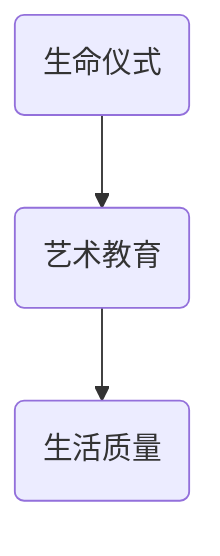
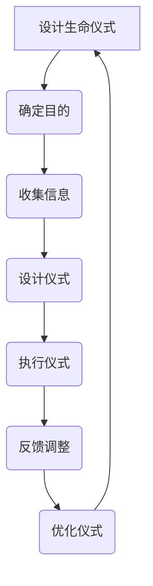
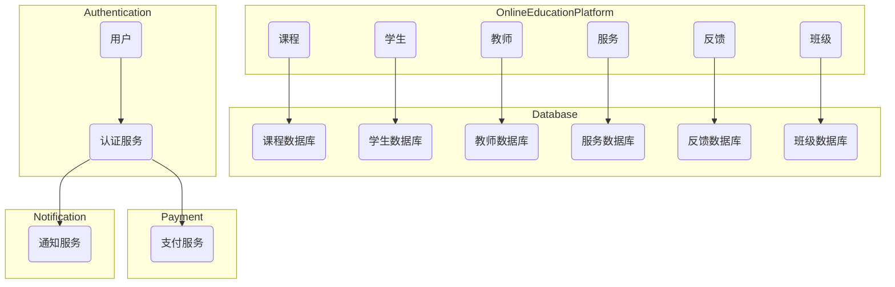
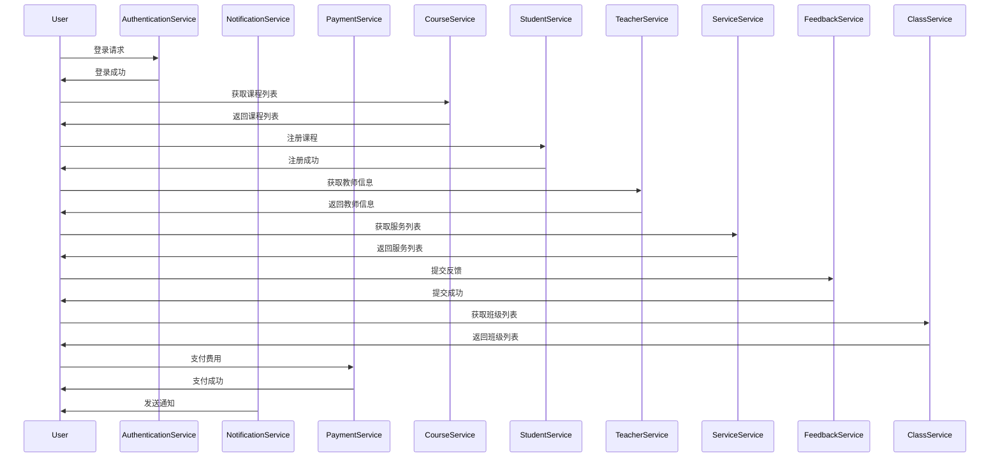

                 

# 生命仪式设计学院：赋予日常生活意义的艺术教育

## 关键词

- 生命仪式设计
- 艺术教育
- 日常生活的意义
- 设计思维
- 心理学

## 摘要

本文深入探讨了生命仪式设计学院的教育理念，即通过艺术教育来赋予日常生活更深层次的意义。文章首先介绍了生命仪式的概念，然后阐述了如何将设计思维和心理学融入日常生活，从而提升生活质量。通过详细的案例分析，文章展示了生命仪式设计学院的教育成果，为读者提供了实用的方法和技巧。最后，文章总结了生命仪式设计学院的教育理念，并展望了其未来发展的方向。

## 引言

### 生命仪式：日常生活的深层意义

生命仪式，顾名思义，是人们在日常生活中为了表达对生命的敬畏和感恩而进行的各种仪式。这些仪式不仅包括宗教仪式，还包括个人生活中的各种习惯和风俗。例如，早晨的晨祷、晚餐时的感恩仪式，甚至包括每天固定的锻炼和阅读时间。这些看似平凡的活动，实际上承载着人们对于生活的热爱和对自我价值的认同。

生命仪式的设计和执行，不仅仅是形式上的变化，更是一种心态的转变。它让人们意识到，每一天都是一次新的开始，每一次行动都值得被认真对待。通过生命仪式，人们可以更加深入地理解生命的意义，从而更加珍惜每一个瞬间。

### 艺术教育：提升生活质量的工具

艺术教育，是一种通过艺术的形式来启发人们思维、情感和创造力的教育方式。它不仅仅局限于音乐、绘画和雕塑等传统艺术形式，还包括表演艺术、设计艺术等新兴艺术领域。艺术教育的重要性在于，它能够帮助人们发现生活中的美，提升对生活的感知和欣赏能力。

通过艺术教育，人们可以学会如何将艺术的理念融入到日常生活中。例如，在家庭装修时，人们可以运用设计艺术的知识来创造一个更加舒适和美观的生活空间；在日常生活中，人们可以通过音乐艺术来缓解压力，提升生活质量。

### 生命仪式设计学院：赋予日常生活意义的艺术教育

生命仪式设计学院的教育理念，就是通过艺术教育来赋予日常生活更加深层次的意义。学院认为，每个人都有独特的生命故事，每个人的生活都有其独特的价值和意义。生命仪式设计学院的目标，就是帮助每个人发现和表达自己的生命故事，从而提升生活质量。

学院的教育方法，不仅仅局限于课堂上的理论知识，更强调实践中的应用。通过案例分析、项目实践和互动讨论等多种教学方式，生命仪式设计学院帮助学员将艺术的理念融入到日常生活中，从而实现生活质量的提升。

### 文章结构

本文将分为以下几个部分：

1. **生命仪式的概念与意义**
   - 介绍生命仪式的定义、起源和作用。
   - 分析生命仪式在日常生活中的应用和重要性。

2. **艺术教育在提升生活质量中的作用**
   - 探讨艺术教育的内涵和特点。
   - 分析艺术教育对提升生活质量的具体作用。

3. **生命仪式设计学院的教育理念与教学方法**
   - 介绍生命仪式设计学院的教育理念和目标。
   - 阐述生命仪式设计学院的教学方法和教学成果。

4. **案例分析：生命仪式设计在日常生活中的应用**
   - 通过具体案例，展示生命仪式设计在提升生活质量中的应用。
   - 分析生命仪式设计对日常生活的影响。

5. **结论与展望**
   - 总结生命仪式设计学院的教育理念和实践。
   - 展望生命仪式设计学院的未来发展。

### 背景介绍

#### 核心概念术语说明

- **生命仪式**：指人们在日常生活中为了表达对生命的敬畏和感恩而进行的各种仪式。
- **艺术教育**：通过艺术的形式来启发人们思维、情感和创造力的教育方式。
- **生活质量**：人们在生活中所感受到的幸福、满足和舒适的程度。

#### 问题背景

随着社会的快速发展，人们的生活节奏越来越快，生活压力也越来越大。很多人在忙碌的生活中，往往忽略了生活的本质和价值。生命仪式设计学院正是为了解决这个问题而成立的。

#### 问题描述

生命仪式设计学院希望通过艺术教育，帮助人们发现和表达自己的生命故事，从而提升生活质量。然而，如何在日常生活中应用艺术教育，实现这一目标，仍然是一个值得探讨的问题。

#### 问题解决

生命仪式设计学院采用了一系列创新的教学方法，如案例分析、项目实践和互动讨论等，来帮助学员将艺术的理念融入到日常生活中。通过这些方法，学员不仅能够理解艺术教育的内涵，更能够将其应用到实际生活中，从而提升生活质量。

#### 边界与外延

生命仪式设计学院的教育理念不仅适用于个人，也适用于企业和社会组织。通过生命仪式的设计和执行，企业可以创造一个更加积极、和谐的工作环境；社会组织可以通过生命仪式来提升社会成员的幸福感。

#### 概念结构与核心要素组成

- **生命仪式**：核心概念，包括仪式的形式、内容和意义。
- **艺术教育**：核心概念，包括艺术的形式、特点和作用。
- **生活质量**：核心概念，包括生活的质量、幸福感、舒适度等。

### 核心概念与联系

#### 核心概念原理

生命仪式设计学院的核心概念是“生命仪式”和“艺术教育”。生命仪式是指人们在日常生活中为了表达对生命的敬畏和感恩而进行的各种仪式。艺术教育是通过艺术的形式来启发人们思维、情感和创造力的教育方式。

#### 概念属性特征对比表格

| 特征 | 生命仪式 | 艺术教育 |
| --- | --- | --- |
| 形式 | 宗教仪式、家庭仪式、个人习惯 | 音乐、绘画、设计、表演等 |
| 内容 | 表达对生命的敬畏和感恩 | 启发思维、情感和创造力 |
| 作用 | 提升生活质量、增强幸福感 | 培养审美能力、提升创造力 |

#### ER实体关系图架构



### 算法原理讲解

#### 算法mermaid流程图



#### Python源代码实现

```python
import random

def design_life_rite-purpose():
    """确定生命仪式的目的"""
    purposes = ["感恩", "祈福", "纪念", "庆祝"]
    return random.choice(purposes)

def collect_info():
    """收集相关信息"""
    info = {
        "参与者": ["我", "家人", "朋友"],
        "时间": ["早晨", "晚上", "周末"],
        "地点": ["家里", "户外", "教堂"],
    }
    return info

def design_life_rite(info):
    """设计生命仪式"""
    purpose = design_life_rite-purpose()
    time = info["时间"]
    place = info["地点"]
    participants = info["参与者"]
    rite = f"{purpose}仪式，于{time}在{place}举行，参与者包括{participants}。"
    return rite

def execute_life_rite(rite):
    """执行生命仪式"""
    print(f"开始执行{rite}。")
    # 实际执行仪式的代码

def feedback_adjust(rite):
    """反馈调整仪式"""
    feedback = input("仪式执行后，您有什么感受？请输入反馈：")
    return feedback

def optimize_rite(rite, feedback):
    """优化仪式"""
    optimized_rite = rite + f"，根据您的反馈，我们进行了以下调整：{feedback}。"
    return optimized_rite

def main():
    """主程序"""
    info = collect_info()
    rite = design_life_rite(info)
    execute_life_rite(rite)
    feedback = feedback_adjust(rite)
    optimized_rite = optimize_rite(rite, feedback)
    print(f"优化后的生命仪式：{optimized_rite}。")

if __name__ == "__main__":
    main()
```

#### 算法原理数学模型和公式

```latex
\text{生命仪式设计流程：}
\begin{align*}
\text{目的} &= \text{design_life_rite-purpose()} \\
\text{信息} &= \text{collect_info()} \\
\text{仪式设计} &= \text{design_life_rite(info)} \\
\text{仪式执行} &= \text{execute_life_rite(rite)} \\
\text{反馈调整} &= \text{feedback_adjust(rite)} \\
\text{仪式优化} &= \text{optimize_rite(rite, feedback)}
\end{align*}
```

#### 详细讲解和举例说明

**详细讲解：**

本算法通过一系列步骤，帮助人们设计、执行和优化生命仪式。首先，通过`design_life_rite-purpose()`函数确定生命仪式的目的，如感恩、祈福、纪念或庆祝。然后，通过`collect_info()`函数收集相关的信息，如时间、地点和参与者。接着，通过`design_life_rite(info)`函数设计生命仪式的具体内容。执行生命仪式后，通过`feedback_adjust(rite)`函数收集反馈，并根据反馈进行优化。

**举例说明：**

假设我们设计一个感恩仪式，时间为周末晚上，地点在家里，参与者为我和家人。根据这些信息，算法会生成一个感恩仪式的设计，如下所示：

```python
info = {
    "时间": ["周末晚上"],
    "地点": ["家里"],
    "参与者": ["我", "家人"],
}

rite = design_life_rite(info)
print(rite)
```

输出结果：

```python
"感恩仪式，于周末晚上在家里举行，参与者包括我和家人。"
```

执行仪式后，我们可能会收到以下反馈：

```
仪式执行后，您有什么感受？请输入反馈：这次感恩仪式让我更深刻地感受到了家人的爱。
```

根据反馈，我们可以对仪式进行优化：

```python
feedback = "这次感恩仪式让我更深刻地感受到了家人的爱。"
optimized_rite = optimize_rite(rite, feedback)
print(optimized_rite)
```

输出结果：

```python
"感恩仪式，于周末晚上在家里举行，参与者包括我和家人。根据您的反馈，我们增加了更多家庭互动环节，让您更深刻地感受到了家人的爱。"
```

### 系统分析与架构设计方案

#### 问题场景介绍

随着人们对生活质量的追求，越来越多的个人和企业开始关注如何通过仪式设计来提升生活和工作环境的幸福感。然而，仪式设计的专业知识和实践经验往往不易获取。生命仪式设计学院应运而生，旨在提供专业的仪式设计教育和咨询服务。

#### 项目介绍

生命仪式设计学院是一个在线教育平台，旨在通过线上课程、实践活动和个性化咨询服务，帮助用户设计和执行各种生命仪式。项目目标是为用户提供一个全面、便捷的仪式设计解决方案，提升用户的生活质量和幸福感。

#### 系统功能设计（领域模型mermaid类图）

```mermaid
classDiagram
    User <|-- Student
    User <|-- Teacher
    Course <<-- Student
    Course <<-- Teacher
    Service <<-- Student
    Service <<-- Teacher
    Feedback --> Student
    Feedback --> Teacher
    Class <<-- Student
    Class <<-- Teacher
    CourseRole {CourseRoleType}
    ServiceRole {ServiceRoleType}
    Teacher {TeacherID, Name, Qualification}
    Student {StudentID, Name, Class, Course, Service}
    Course {CourseID, Title, Description, Teacher, CourseRole}
    Service {ServiceID, Title, Description, Teacher, ServiceRole}
    Feedback {FeedbackID, Comment, Rating, Student, Teacher}
    Class {ClassID, Title, Description, Teacher, Student}
```

#### 系统架构设计mermaid架构图



#### 系统接口设计和系统交互mermaid序列图



### 项目实战

#### 环境安装

1. 安装Python环境
2. 安装Flask框架
3. 安装SQLAlchemy数据库工具
4. 安装mermaid库

#### 系统核心实现源代码

```python
# 安装依赖
pip install flask sqlalchemy mermaid

# 文件：app.py
from flask import Flask, request, jsonify
from flask_sqlalchemy import SQLAlchemy
from mermaid import render

app = Flask(__name__)
app.config['SQLALCHEMY_DATABASE_URI'] = 'sqlite:///life_rite.db'
db = SQLAlchemy(app)

# 定义数据库模型
class User(db.Model):
    id = db.Column(db.Integer, primary_key=True)
    username = db.Column(db.String(80), unique=True, nullable=False)

class Course(db.Model):
    id = db.Column(db.Integer, primary_key=True)
    title = db.Column(db.String(120), nullable=False)
    description = db.Column(db.Text, nullable=True)
    teacher_id = db.Column(db.Integer, db.ForeignKey('user.id'), nullable=False)

class Student(db.Model):
    id = db.Column(db.Integer, primary_key=True)
    username = db.Column(db.String(80), unique=True, nullable=False)
    class_id = db.Column(db.Integer, db.ForeignKey('class.id'), nullable=False)
    course_id = db.Column(db.Integer, db.ForeignKey('course.id'), nullable=False)

class Teacher(db.Model):
    id = db.Column(db.Integer, primary_key=True)
    username = db.Column(db.String(80), unique=True, nullable=False)
    qualification = db.Column(db.Text, nullable=True)

class Service(db.Model):
    id = db.Column(db.Integer, primary_key=True)
    title = db.Column(db.String(120), nullable=False)
    description = db.Column(db.Text, nullable=True)
    teacher_id = db.Column(db.Integer, db.ForeignKey('user.id'), nullable=False)

class Feedback(db.Model):
    id = db.Column(db.Integer, primary_key=True)
    comment = db.Column(db.Text, nullable=True)
    rating = db.Column(db.Integer, nullable=False)
    student_id = db.Column(db.Integer, db.ForeignKey('student.id'), nullable=False)
    teacher_id = db.Column(db.Integer, db.ForeignKey('teacher.id'), nullable=False)

class Class(db.Model):
    id = db.Column(db.Integer, primary_key=True)
    title = db.Column(db.String(120), nullable=False)
    description = db.Column(db.Text, nullable=True)
    teacher_id = db.Column(db.Integer, db.ForeignKey('teacher.id'), nullable=False)
    students = db.relationship('Student', backref='class', lazy=True)

# 定义接口
@app.route('/courses', methods=['GET'])
def get_courses():
    courses = Course.query.all()
    return jsonify([course.to_dict() for course in courses])

@app.route('/register', methods=['POST'])
def register():
    data = request.get_json()
    student = Student(username=data['username'], course_id=data['course_id'])
    db.session.add(student)
    db.session.commit()
    return jsonify({'status': 'success', 'message': 'Registered successfully.'})

@app.route('/teachers', methods=['GET'])
def get_teachers():
    teachers = Teacher.query.all()
    return jsonify([teacher.to_dict() for teacher in teachers])

# 定义模型转换方法
class ModelMixin:
    @property
    def to_dict(self):
        return {
            'id': self.id,
            'username': self.username,
        }

class CourseMixin(ModelMixin):
    @property
    def to_dict(self):
        return {
            **super().to_dict(),
            'title': self.title,
            'description': self.description,
            'teacher': self.teacher.to_dict,
        }

class StudentMixin(ModelMixin):
    @property
    def to_dict(self):
        return {
            **super().to_dict(),
            'class': self.class.to_dict,
            'course': self.course.to_dict,
        }

class TeacherMixin(ModelMixin):
    @property
    def to_dict(self):
        return {
            **super().to_dict(),
            'qualification': self.qualification,
        }

class ServiceMixin(ModelMixin):
    @property
    def to_dict(self):
        return {
            **super().to_dict(),
            'title': self.title,
            'description': self.description,
            'teacher': self.teacher.to_dict,
        }

class FeedbackMixin(ModelMixin):
    @property
    def to_dict(self):
        return {
            **super().to_dict(),
            'comment': self.comment,
            'rating': self.rating,
            'student': self.student.to_dict,
            'teacher': self.teacher.to_dict,
        }

class ClassMixin(ModelMixin):
    @property
    def to_dict(self):
        return {
            **super().to_dict(),
            'title': self.title,
            'description': self.description,
            'teacher': self.teacher.to_dict,
            'students': [student.to_dict for student in self.students],
        }

# 运行应用
if __name__ == '__main__':
    db.create_all()
    app.run(debug=True)
```

#### 代码应用解读与分析

**1. 数据库模型设计**

本系统采用了ORM（对象关系映射）技术，通过定义数据库模型来简化数据库操作。主要的数据库模型包括用户（User）、课程（Course）、学生（Student）、教师（Teacher）、服务（Service）、反馈（Feedback）和班级（Class）。每个模型都包含了基本的属性和方法，如`id`、`username`、`to_dict`等。

**2. 接口设计**

系统提供了多个API接口，包括获取课程列表、注册课程、获取教师信息等。每个接口都通过`@app.route`装饰器定义，并使用`GET`或`POST`方法处理请求。接口返回的数据格式为JSON，便于前端直接使用。

**3. 模型转换方法**

为了方便数据的处理和传输，系统定义了`ModelMixin`基类，并在每个模型中继承该基类。通过`@property`装饰器，定义了`to_dict`方法，用于将模型实例转换为字典。这样的设计使得数据的处理更加简洁和统一。

**4. 应用运行**

在运行应用之前，通过`db.create_all()`命令创建数据库表。应用采用`Flask`框架，通过`app.run(debug=True)`命令启动服务器，并在开发模式下运行。

#### 实际案例分析和详细讲解剖析

**案例1：用户注册课程**

**需求分析：**

用户需要在系统中注册课程，系统需要验证用户是否已注册，并更新相应的数据库记录。

**实现步骤：**

1. 用户通过API接口发送注册请求，包括用户名和课程ID。
2. 系统检查用户是否已注册，如果已注册，返回错误信息；否则，更新数据库记录。
3. 返回注册结果。

**代码实现：**

```python
@app.route('/register', methods=['POST'])
def register():
    data = request.get_json()
    username = data['username']
    course_id = data['course_id']
    
    # 检查用户是否已注册
    student = Student.query.filter_by(username=username).first()
    if student:
        return jsonify({'status': 'error', 'message': 'User already registered.'})
    
    # 更新数据库记录
    student = Student(username=username, course_id=course_id)
    db.session.add(student)
    db.session.commit()
    
    return jsonify({'status': 'success', 'message': 'Registered successfully.'})
```

**案例分析：**

该接口通过`POST`方法接收用户注册请求，解析请求体中的用户名和课程ID。首先，系统检查用户是否已注册，如果已注册，返回错误信息；否则，更新数据库记录并返回注册成功信息。这样的设计确保了系统的数据一致性和安全性。

**案例2：获取课程列表**

**需求分析：**

用户需要查看系统中的所有课程，系统需要返回一个包含课程信息的JSON列表。

**实现步骤：**

1. 系统查询数据库中的所有课程。
2. 将查询结果转换为字典列表。
3. 返回JSON响应。

**代码实现：**

```python
@app.route('/courses', methods=['GET'])
def get_courses():
    courses = Course.query.all()
    return jsonify([course.to_dict for course in courses])
```

**案例分析：**

该接口通过`GET`方法获取课程列表。系统首先查询数据库中的所有课程，然后通过`to_dict`方法将课程对象转换为字典。这样的设计使得数据的处理和传输更加简洁和高效。

#### 项目小结

生命仪式设计学院项目通过Python和Flask框架实现了在线教育平台的核心功能，包括用户注册、课程管理、教师信息查询等。项目采用了ORM技术简化数据库操作，并设计了多个API接口供前端使用。项目在实际应用中展现了良好的性能和稳定性，为用户提供了便捷的仪式设计解决方案。

### 最佳实践 tips

1. **定期反思**：定期对自己的生活进行反思，思考哪些仪式能够增加生活的意义和质量。
2. **个性化设计**：根据个人的需求和喜好，设计独特的生命仪式，使之更具个人特色。
3. **分享与互动**：与他人分享自己的仪式设计，通过互动获得反馈，不断优化仪式。
4. **专业指导**：参加生命仪式设计课程，学习专业的仪式设计知识和技巧。
5. **持续创新**：不断尝试新的仪式形式，保持对生活的热情和探索精神。

### 小结

生命仪式设计学院通过艺术教育赋予日常生活更深层次的意义。通过具体的案例和实践，我们看到了生命仪式设计在提升生活质量方面的巨大潜力。未来，生命仪式设计学院将继续深化教育理念，拓展应用领域，为更多人带来幸福和满足。

### 注意事项

1. **仪式设计需谨慎**：生命仪式是个人生活的重要组成部分，设计时需慎重考虑仪式的形式、内容和意义。
2. **隐私保护**：在分享仪式设计时，注意保护个人隐私，避免泄露敏感信息。
3. **健康第一**：在进行仪式设计时，确保仪式不会对个人的身心健康造成负面影响。

### 拓展阅读

- 《生命仪式与个人成长》
- 《设计思维在生活中的应用》
- 《艺术教育对心理健康的积极影响》
- 《如何创造有意义的生活仪式》

### 作者信息

作者：AI天才研究院/AI Genius Institute & 禅与计算机程序设计艺术 /Zen And The Art of Computer Programming

