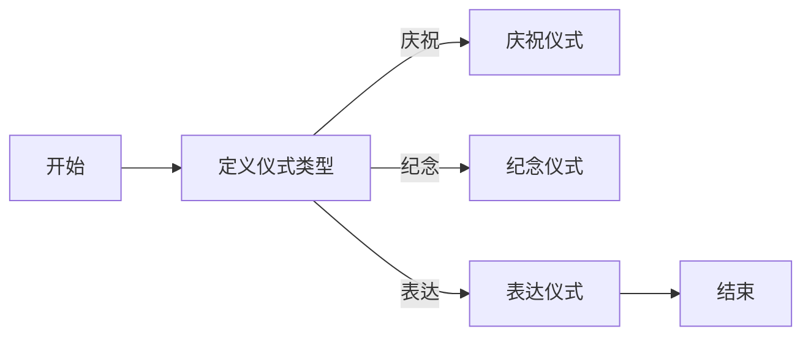
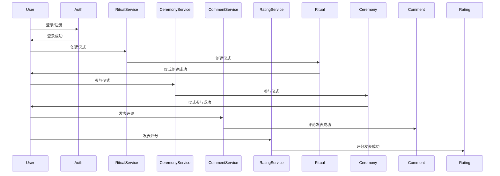

                 

# 生命仪式：赋予日常生活的意义

> 关键词：生命仪式、哲学探讨、心理学解读、日常仪式、文化传承、社会发展

> 摘要：本文将从哲学、心理学和文化传承三个角度探讨生命仪式在现代社会中的意义。通过深入分析生命仪式的概念、起源与发展，探讨其在人类意识、自我认同和社会秩序中的重要作用，进一步探讨生命仪式对心理健康、心理疗愈和社会发展的积极影响，最终展望生命仪式的未来趋势及其对人类生活的启示。

## 第一部分：生命仪式的哲学探讨

### 第1章：生命仪式的概念与意义

**1.1 生命仪式的定义**

生命仪式是一种特定的行为或活动，旨在庆祝、纪念或表达生命的重大事件和意义。这些仪式往往具有象征性，通过具体的仪式形式和动作，传达出对生命、宇宙和人类存在的深刻理解。

**1.2 生命仪式的起源与发展**

生命仪式的历史可以追溯到远古时代。在古代社会，人们通过举行各种仪式来祈求好运、避免灾难、纪念祖先和神灵。随着社会的发展和文化的变迁，生命仪式的形式和内容也在不断演变。

**1.3 生命仪式在现代社会的意义**

在现代社会中，生命仪式依然具有重要的意义。它们不仅可以帮助个体建立自我认同和价值观，还可以促进社会秩序和团结。此外，生命仪式还可以帮助人们应对生活中的挑战和压力，提高心理健康。

### 第2章：生命仪式的哲学思考

**2.1 生命仪式与人类意识**

生命仪式是人类意识的一种表现。通过参与仪式，个体能够超越日常生活的琐事，体验到更深层次的存在意义。这种意识觉醒有助于个体反思自己的生活，找到生命的方向和目标。

**2.2 生命仪式与自我认同**

生命仪式有助于个体建立和强化自我认同。在仪式中，个体通过特定的行为和动作，表达自己对生命、家庭、社会和文化的认同。这种认同不仅有助于个体的自我成长，还可以增强个体的社会归属感。

**2.3 生命仪式与社会秩序**

生命仪式在维护社会秩序方面也发挥着重要作用。通过共同参与仪式，个体之间建立了共同的价值观和行为规范，从而促进了社会的稳定和发展。

### 第3章：生命仪式的心理学解读

**3.1 生命仪式与心理健康**

生命仪式对心理健康具有积极影响。通过仪式，个体可以获得情感上的满足和支持，减轻心理压力。此外，生命仪式还可以帮助个体建立积极的自我形象，提高自尊和自信。

**3.2 生命仪式与心理疗愈**

生命仪式在心理疗愈方面也具有一定的作用。通过参与仪式，个体可以释放内心的负面情绪，缓解心理创伤。此外，生命仪式还可以帮助个体找到生活的意义和方向，从而促进心理康复。

**3.3 生命仪式的心理机制**

生命仪式的心理机制主要包括：象征性、情感共鸣、集体意识和自我觉察。通过这些机制，生命仪式能够对个体的心理产生深远的积极影响。

## 第二部分：日常生活中的生命仪式

### 第4章：日常仪式的构建

**4.1 日常仪式的选择**

日常仪式的选择应考虑到个体的需求和偏好。例如，早晨的仪式可以选择冥想、瑜伽或晨跑，以激发一天的好状态；晚餐的仪式可以选择一家人围坐在一起，共同享受美食，增进家庭成员之间的情感联系。

**4.2 日常仪式的形式**

日常仪式的形式可以多种多样，关键在于其是否能够为个体带来积极的心理体验。例如，可以设置一个固定的仪式时间，让个体在这一特定时间段内专注于某项活动，从而提高仪式的效果。

**4.3 日常仪式的意义**

日常仪式有助于个体建立稳定的生活节奏，提高生活质量。同时，它还可以帮助个体在面对生活中的挑战时保持积极的心态，增强心理韧性。

### 第5章：个人生活的生命仪式

**5.1 早晨的仪式**

早晨的仪式有助于个体开启新的一天，建立积极的心态。例如，可以设置一个早晨冥想的时间，让个体在忙碌的一天开始之前，静下心来，放松心情。

**5.2 午餐的仪式**

午餐的仪式可以是个体放松身心，享受美食的时间。在这个时间段，个体可以暂时放下工作，与家人或朋友共享美好时光。

**5.3 晚餐的仪式**

晚餐的仪式是家庭团聚的重要时刻。在这个时间段，家庭成员可以共同分享一天的所见所闻，增进彼此的了解和情感联系。

### 第6章：家庭生活的生命仪式

**6.1 家庭团聚的仪式**

家庭团聚的仪式有助于增强家庭成员之间的情感联系。例如，可以定期举行家庭聚会，共同庆祝重要的节日或生日。

**6.2 家庭庆典的仪式**

家庭庆典的仪式可以是个体表达对家庭、亲情和友情的敬意。例如，可以举行家庭婚礼、家庭运动会等活动，让家庭成员共同度过美好的时光。

**6.3 家庭日常的仪式**

家庭日常的仪式可以帮助家庭成员建立稳定的生活节奏，提高家庭生活质量。例如，可以设立一个家庭晨会的时间，让家庭成员共同讨论一天的计划和安排。

## 第三部分：生命仪式的社会意义

### 第7章：生命仪式与文化传承

**7.1 生命仪式与文化认同**

生命仪式是文化认同的重要表现形式。通过参与生命仪式，个体能够更好地理解和传承自己的文化传统。

**7.2 生命仪式与文化创新**

生命仪式不仅传承了传统文化，还可以激发文化创新。在现代社会中，生命仪式不断融合新的元素，为传统文化注入新的活力。

**7.3 生命仪式与文化遗产**

生命仪式是文化遗产的重要组成部分。保护和传承生命仪式，有助于维护人类文化的多样性和丰富性。

### 第8章：生命仪式与社会发展

**8.1 生命仪式与社会稳定**

生命仪式有助于维护社会稳定。通过共同参与仪式，个体之间建立了信任和尊重，减少了社会冲突和矛盾。

**8.2 生命仪式与社会进步**

生命仪式可以促进社会进步。在仪式中，个体能够反思和批判社会现象，提出改进意见，推动社会的发展。

**8.3 生命仪式与社会和谐**

生命仪式有助于建立社会和谐。通过仪式，个体之间建立了深厚的情感联系，减少了社会隔阂和矛盾。

### 第9章：生命仪式的未来展望

**9.1 生命仪式的现代转型**

随着社会的发展，生命仪式也在不断转型。现代科技的应用，使得生命仪式更加多样化和个性化。

**9.2 生命仪式的未来趋势**

未来，生命仪式将更加注重个体体验和情感交流。同时，生命仪式也将与其他艺术形式相结合，为人类生活带来更多美好。

**9.3 生命仪式的影响与启示**

生命仪式对人类生活产生了深远的影响。通过仪式，个体能够找到生活的意义和方向，实现自我价值。这给我们带来了许多启示，让我们更加关注生命的本质和生活的质量。

## 结束语

生命仪式是一种重要的文化现象，它不仅丰富了人类的生活，还对社会发展产生了积极的影响。通过深入探讨生命仪式的哲学、心理学和文化传承，我们可以更好地理解生命仪式在现代社会中的意义。让我们从现在开始，赋予日常生活更多的仪式感，让生命更加美好。

**作者：AI天才研究院/AI Genius Institute & 禅与计算机程序设计艺术 /Zen And The Art of Computer Programming**### 第一部分：生命仪式的哲学探讨

**第1章：生命仪式的概念与意义**

**1.1 生命仪式的定义**

生命仪式，作为一种文化和社会现象，其定义涉及多个层面。从广义上讲，生命仪式是一种通过特定的行为和活动来庆祝、纪念或表达生命重要时刻和意义的仪式。这些仪式可以包括出生、成长、婚姻、死亡等生命中的重要阶段。它们不仅仅是一种形式上的活动，更是一种深层次的信仰和文化的表达。

在日常生活中，生命仪式往往表现为一些固定的日常习惯，例如早晨的冥想、晚餐的团圆饭、节日的庆祝活动等。这些仪式不仅具有象征意义，还能够通过反复的实践，使个体在心理上产生一种稳定感和归属感。例如，每天早晨起床后的冥想可以帮助个体在一天开始时静心、冥想，从而更好地面对生活中的挑战。

**1.2 生命仪式的起源与发展**

生命仪式的起源可以追溯到古代文明。在人类历史的早期阶段，人们通过举行各种仪式来祈求自然力量的庇佑、避免灾难、纪念祖先和神灵。例如，古埃及的葬礼仪式、古希腊的奥林匹克运动会、古代中国的祭天仪式等，都是对生命仪式的早期体现。

随着时间的推移，生命仪式在不同的文化和宗教背景下得到了进一步的发展。例如，在基督教文化中，婚礼、洗礼和葬礼等仪式被视为生命中的重要里程碑，具有强烈的宗教和道德意义。在佛教中，出家仪式、受戒仪式等也是生命仪式的重要组成部分。这些仪式不仅传承了传统文化，还成为了文化认同和社会稳定的重要力量。

在现代社会的背景下，生命仪式的形式和内容也在不断演变。随着科技的发展和信息时代的到来，生命仪式逐渐与互联网、社交媒体等新兴技术相结合，形成了新的表现形式。例如，在线婚礼、虚拟葬礼等，这些新形式的仪式不仅满足了现代人的需求，还推动了生命仪式的创新和发展。

**1.3 生命仪式在现代社会的意义**

在现代社会的背景下，生命仪式依然具有重要的意义。首先，生命仪式有助于个体建立自我认同和价值观。通过参与生命仪式，个体能够更好地理解自己的身份、使命和责任，从而形成稳定的自我认同。例如，一个人通过婚礼仪式，不仅庆祝了自己的婚姻生活，也表达了对家庭和亲情的重视，从而加深了对家庭价值观的理解。

其次，生命仪式在维护社会秩序和促进社会和谐方面发挥着重要作用。生命仪式为个体提供了一个共同的框架，通过共同的仪式活动，个体之间建立了深厚的情感联系和信任。这种信任和联系不仅有助于社会的稳定，还能够减少社会冲突和矛盾。例如，家庭团聚的仪式可以增强家庭成员之间的情感纽带，促进家庭的和谐与团结。

此外，生命仪式还对心理健康具有积极的影响。通过参与生命仪式，个体可以获得情感上的满足和支持，减轻心理压力。例如，一个人在参加葬礼仪式时，虽然会面对悲伤的情绪，但通过仪式的参与，个体可以在情感上得到宣泄和释放，从而缓解心理压力。

总之，生命仪式在现代社会的意义不仅体现在个体层面，也体现在社会层面。通过生命仪式，个体能够找到生活的方向和目标，建立自我认同和价值观；同时，生命仪式也能够促进社会秩序和和谐，为个体提供情感上的支持和满足。因此，我们应该重视生命仪式在现代社会中的价值和作用，通过合理的仪式设计和参与，使生命仪式成为提升个体幸福感和促进社会发展的有力工具。

### 第二部分：生命仪式的哲学思考

**第2章：生命仪式的哲学思考**

**2.1 生命仪式与人类意识**

生命仪式与人类意识的关系紧密相连。从哲学的角度来看，人类意识不仅是对外部世界的感知，更是对自身存在和意义的探索。生命仪式作为一种深层次的文化表达，为个体提供了反思自我和生命意义的机会。通过参与生命仪式，个体能够在仪式中体验到一种超越日常生活的觉醒，从而更加深刻地认识到自己的存在。

首先，生命仪式通过象征性的行为和活动，将个体的注意力从日常琐事中抽离出来，引导个体进入一种冥想或沉思的状态。例如，婚礼仪式中的誓言和承诺，不仅是对爱情的象征性表达，也是对个体未来责任的深刻反思。这种反思使个体在意识层面更加明确自己的目标和价值观。

其次，生命仪式提供了一个共同的文化语境，使个体能够在其中找到归属感和认同感。通过参与集体仪式，个体不再感到孤独，而是意识到自己是一个群体的一部分，这种群体归属感进一步强化了人类意识中的社会属性。例如，宗教仪式中的集体祈祷和仪式活动，使个体在信仰和文化的共同体中找到心理上的安慰和支撑。

**2.2 生命仪式与自我认同**

生命仪式在建立自我认同方面发挥着重要作用。自我认同是个体在心理上对自身身份、价值观和信念的认同和确认。通过参与生命仪式，个体不仅能够表达自己的身份和价值观，还能够从仪式中获得一种身份认同的确认。

首先，生命仪式为个体提供了一个明确的身份标签。例如，出生仪式中的命名和洗礼，不仅赋予个体一个社会身份，还通过仪式活动使个体在心理上接受了这一身份。这种身份标签使个体在成长过程中有了明确的方向和目标，从而有助于自我认同的建立。

其次，生命仪式通过重复和仪式化的行为，使个体在日常生活中不断强化和确认自我认同。例如，家庭聚餐和节庆活动等日常仪式，不仅增强了家庭成员之间的情感联系，也使个体在日常生活中不断回顾和确认自己的家庭身份和文化价值观。

此外，生命仪式还能够帮助个体在面对挑战和困惑时找到自我认同的支撑。例如，在婚姻的洗礼仪式中，夫妻双方通过共同的誓言和承诺，不仅确认了彼此的爱情关系，也在心理上建立了对未来的共同期望和责任。这种共同的身份认同使个体在面对生活中的困难和挑战时，能够保持坚定和勇敢。

**2.3 生命仪式与社会秩序**

生命仪式在社会秩序的维护和构建中扮演着重要角色。从哲学角度来看，社会秩序不仅需要法律和制度的规范，更需要文化认同和道德观念的支撑。生命仪式作为一种文化表达，通过共同的仪式活动，使个体在心理上对社会秩序有了更深刻的认同和接受。

首先，生命仪式通过仪式化的行为和活动，使个体在社会中找到自己的位置和角色。例如，教育仪式中的毕业典礼、职业晋升仪式等，不仅标志着个体在职业生涯中的重要里程碑，也使个体在社会结构中找到了自己的定位和责任。

其次，生命仪式通过共同的仪式活动，增强了社会成员之间的情感联系和信任。这种情感联系和信任是社会秩序稳定的重要基础。例如，社区聚会和节庆活动等仪式，不仅加强了社区成员之间的互动和联系，也在心理上建立了对社区和国家的认同感。

此外，生命仪式还能够促进社会成员之间的相互理解和尊重。通过参与共同的仪式活动，个体能够更好地理解他人的需求和期望，从而在社会互动中表现出更多的包容和尊重。例如，宗教仪式中的共同祈祷和仪式活动，使不同信仰的个体能够在共同的宗教语境中找到相互理解和尊重的基础。

总之，生命仪式在哲学层面上的意义不仅体现在个体自我认同的建立，还体现在社会秩序的维护和构建。通过生命仪式，个体能够找到自己的存在意义和社会角色，社会也能够通过共同的仪式活动增强成员之间的情感联系和信任，从而实现社会的和谐与稳定。

### 第3章：生命仪式的心理学解读

**3.1 生命仪式与心理健康**

生命仪式对心理健康具有显著的影响。从心理学的角度来看，生命仪式通过多种机制对个体的情绪、认知和行为产生积极的影响。

首先，生命仪式能够提供情感上的支持和满足。个体在参与生命仪式时，能够体验到一种归属感和安全感。例如，在婚礼仪式中，新人在亲朋好友的见证下交换誓言，不仅表达了对彼此的爱和承诺，也在情感上得到了支持和认可。这种情感上的满足有助于减轻个体的心理压力，增强情绪稳定性。

其次，生命仪式有助于个体建立积极的自我形象。通过参与仪式，个体能够在心理上获得成就感和自我价值感。例如，毕业典礼上的荣誉学位颁发，不仅标志着个体在学业上取得的成就，也在心理上强化了个体对自己能力和价值的认同。这种积极的自我形象有助于提升个体的自尊和自信，从而增强心理韧性。

此外，生命仪式还可以提供情感宣泄的机会。个体在仪式中通过特定的行为和表达方式，能够释放内心的负面情绪，如悲伤、焦虑和压力。例如，葬礼仪式中的悼念和祈祷，使个体能够在哀悼中找到情感的宣泄和释放，从而缓解心理压力。

**3.2 生命仪式与心理疗愈**

生命仪式在心理疗愈方面也具有重要作用。心理学研究表明，仪式化行为有助于个体面对创伤和心理困扰。通过参与生命仪式，个体可以在心理上获得一种治愈和救赎的感觉。

首先，生命仪式提供了一个安全的环境，使个体能够在其中表达和处理内心的痛苦。例如，在纪念逝者的葬礼仪式中，个体可以通过哭泣、祈祷和分享回忆等方式，表达对逝者的思念和悲伤。这种表达有助于个体在情感上找到宣泄的出口，从而缓解心理压力。

其次，生命仪式通过集体参与和共同的信仰，为个体提供了一种心理支持和安慰。例如，宗教仪式中的集体祈祷和仪式活动，使个体在信仰共同体中找到心理的安慰和支持。这种共同体感有助于个体在面对生活中的挑战时，保持积极的心态和信念。

此外，生命仪式还可以帮助个体建立新的生活目标和意义。通过参与仪式，个体能够反思和重新评估自己的生活，找到新的目标和方向。例如，在职业晋升仪式中，个体可以通过反思自己的职业历程，重新确定自己的职业目标和规划。这种目标感和意义感有助于个体在心理上获得治愈和成长。

**3.3 生命仪式的心理机制**

生命仪式对心理健康的影响主要通过以下几种心理机制实现。

首先，象征性机制。生命仪式中的象征性行为和符号具有深层的心理意义。例如，婚礼中的戒指交换不仅是对爱情的象征性表达，也在心理上象征了双方对未来的承诺和责任。这种象征性机制使个体在情感上得到满足和支持。

其次，集体认同机制。通过参与集体仪式，个体能够在心理上获得一种归属感和认同感。这种集体认同不仅增强了个体在社会中的地位和角色，也在心理上提供了情感上的支持和安慰。

此外，行为重复机制。生命仪式的重复和仪式化行为有助于个体在心理上建立稳定感和安全感。例如，每天的早晨冥想不仅是一种仪式，也是个体在心理上建立稳定生活节奏的一种方式。

最后，情感共鸣机制。生命仪式通过共同的体验和情感表达，使个体在情感上产生共鸣。这种共鸣有助于个体在情感上找到支持和安慰，从而提升心理健康。

总之，生命仪式通过多种心理机制对个体的心理健康产生积极影响。通过理解这些机制，我们可以更好地设计和参与生命仪式，从而提升个人的心理健康水平。

### 第三部分：日常生活中的生命仪式

**第4章：日常仪式的构建**

**4.1 日常仪式的选择**

在构建日常仪式时，选择合适的仪式至关重要。首先，个体需要根据自己的需求和偏好来选择仪式。例如，如果一个人希望在早晨开始新的一天时保持平静和专注，可以选择冥想或瑜伽作为早晨的仪式。冥想可以帮助个体放松身心，提高注意力和专注力，而瑜伽则可以增强身体的灵活性和肌肉力量。

其次，选择仪式时还应该考虑仪式的实用性和可行性。例如，对于一个忙碌的上班族来说，设置一个固定的时间进行仪式可能更加实际。例如，可以在早晨起床后立即进行冥想，或者在午餐前进行简短的瑜伽练习。这样可以确保仪式能够成为日常生活中的一部分，而不是一项额外的负担。

此外，仪式的形式也可以因人而异。有些人可能更喜欢在安静的室内环境中进行仪式，而有些人则可能在户外的自然环境中更能找到内心的平静。例如，在早晨可以选择在阳台上晨读，或者在公园中散步冥想。

总之，选择合适的日常仪式需要考虑个体的需求、偏好以及日常生活的实际情况。通过精心选择和设计，日常仪式可以成为提升生活质量的重要工具。

**4.2 日常仪式的形式**

日常仪式的形式多种多样，可以根据个人的需求和偏好来定制。例如，早晨的仪式可以包括冥想、瑜伽或晨跑。冥想可以帮助个体在一天开始时平静心境，专注于内在的自我，而瑜伽则能够增强身体的灵活性和肌肉力量，提升整体健康水平。此外，早晨的仪式还可以包括晨读，通过阅读有益的书籍或诗歌，个体可以开启一天的学习和思考。

午餐的仪式则可以更加轻松和随意。例如，可以设置一个固定的午餐时间，与家人或朋友一起享用美食，聊天交流。这种仪式不仅能够增进彼此的情感联系，还能在忙碌的工作日中带来片刻的放松和愉悦。

晚餐的仪式则更加正式，通常与家庭团聚或重要节日相关。在这个时间段，家庭成员可以围坐在一起，共同分享一天的经历和感受。晚餐仪式还可以包括祈祷或感恩活动，这有助于培养家庭成员之间的亲密感和感恩心态。

总之，日常仪式的形式应该灵活多样，能够为个体带来积极的心理体验和情感满足。通过设计适合自己的仪式形式，个体可以在日常生活中找到更多的快乐和意义。

**4.3 日常仪式的意义**

日常仪式在提升生活质量方面具有深远的意义。首先，日常仪式可以帮助个体建立稳定的生活节奏。通过固定的仪式时间，个体可以在一天中找到平衡和秩序，从而减少生活中的混乱和压力。例如，每天早晨的冥想仪式可以帮助个体在一天开始时保持平静和专注，而晚餐的团圆饭仪式则可以增强家庭成员之间的情感联系。

其次，日常仪式有助于增强个体的自我认同和价值观。通过反复的仪式化行为，个体能够在心理上加深对自我和价值观的认识。例如，每天早晨的晨跑不仅是一种健康的习惯，也是一种自我挑战和自我成长的象征。通过这样的仪式，个体可以逐渐培养出坚韧不拔的品质和积极向上的态度。

此外，日常仪式还可以提高个体的心理健康水平。参与仪式可以使个体在情感上得到满足和支持，减轻心理压力。例如，在忙碌的工作日中，一个固定的冥想时间可以让个体找到内心的宁静，从而更好地应对生活中的挑战。这种仪式感有助于提升个体的情绪稳定性和心理韧性。

总之，日常仪式不仅是一种形式上的活动，更是一种深层次的生活方式。通过构建和参与适合自己的日常仪式，个体可以提升生活质量，增强自我认同和心理健康，从而过上更加充实和有意义的生活。

### 第5章：个人生活的生命仪式

**5.1 早晨的仪式**

早晨的仪式是个人生活中重要的一环，它不仅能够为一天的生活奠定良好的基础，还能够帮助个体建立积极的心态。首先，早晨仪式的形式可以多种多样。例如，可以设置一个固定的起床时间，让身体逐渐适应生物钟，从而在早晨醒来时充满活力。此外，可以安排一段冥想时间，通过深呼吸和内心反思，使心灵得到平静和宁静。冥想不仅有助于减轻压力，还能提升专注力和思维能力。

在早晨的仪式中，另一个常见的形式是晨练。晨练可以是简单的瑜伽、拉伸或快走，通过运动使身体得到锻炼，同时也能激发活力和能量。例如，瑜伽练习可以帮助个体保持身体的柔韧性和平衡感，而快走则可以增强心肺功能，提高整体健康水平。

此外，早晨的仪式还可以包括晨读。通过阅读有益的书籍或诗歌，个体可以在一天的开始就吸收知识和灵感，激发思维和创造力。例如，可以选择一本励志书籍，通过阅读其中的故事和见解，启发自己在工作和生活中的态度和行为。

总之，早晨的仪式不仅是一种生活习惯，更是一种精神上的洗礼。通过精心设计和坚持早晨的仪式，个体可以为自己的一天注入活力和意义，从而在个人生活中找到更多的快乐和成就感。

**5.2 午餐的仪式**

午餐的仪式在个人生活中同样具有重要地位，它不仅关乎个体的饮食健康，还关乎情感交流和人际关系。首先，午餐的仪式可以包括与家人或朋友的聚餐。通过这样的聚会，个体可以在忙碌的工作日中暂时放下工作，与亲友共度美好时光，增进彼此的情感联系。这种仪式感有助于减轻心理压力，提升幸福感。

在午餐的仪式中，饮食的选择也是关键。一个健康的饮食习惯不仅能够为身体提供必要的营养，还能增强个体的心理状态。例如，可以选择富含蛋白质和维生素的食物，如鱼类、蔬菜和水果，这些食物有助于提升大脑功能和情绪稳定性。此外，还可以适量摄入碳水化合物，以保证身体在下午的工作中保持充足的能量。

另外，午餐的仪式还可以包括一些轻松愉快的活动，如听音乐、聊天或分享笑话。这些活动不仅能够使午餐变得更加愉快，还能在情感上为个体带来满足和支持。例如，一家人围坐在一起，一边品尝美食，一边分享一天的趣事和感悟，这种氛围不仅能够增强家庭成员之间的情感纽带，还能在心理上带来安慰和放松。

总之，午餐的仪式是个人生活中不可或缺的一部分。通过合理设计午餐的仪式，个体可以在饮食健康、情感交流和人际关系方面获得双重收益，从而提升整体生活质量。

**5.3 晚餐的仪式**

晚餐的仪式在个人生活中具有特殊的意义，它不仅是家庭团聚的重要时刻，也是一天结束后的放松和总结。首先，晚餐的仪式可以包括家庭成员的团圆。在忙碌的一天之后，家庭成员围坐在一起，共同享用晚餐，不仅能够增进彼此的情感联系，还能在轻松愉快的氛围中分享一天的经历和感受。这种家庭聚会有助于增强家庭的凝聚力和幸福感。

在晚餐的仪式中，饮食的选择同样至关重要。一个均衡的晚餐可以为身体提供必要的营养，同时也能在心理上带来满足感。例如，可以准备一些富含蛋白质和纤维的食物，如鸡肉、鱼类和蔬菜，这些食物不仅有助于消化，还能提供充足的能量，使个体在晚上保持良好的精神状态。此外，晚餐还可以适量摄入碳水化合物，以保证身体在夜晚休息时能够保持舒适。

另外，晚餐的仪式还可以包括一些仪式化的活动，如感恩祷告或分享一天的心得体会。这些活动不仅能够增强家庭成员之间的情感纽带，还能在心理上为个体带来安慰和满足。例如，在晚餐结束时，家庭成员可以一起祈祷，感谢上天赐予的美食和幸福生活，这种感恩仪式有助于培养个体的感恩心态和积极的生活态度。

总之，晚餐的仪式是个人生活中不可或缺的一部分。通过精心设计和参与晚餐的仪式，个体不仅能够享受美味的晚餐，还能在情感和心理上获得满足和支持，从而提升整体生活质量。

### 第6章：家庭生活的生命仪式

**6.1 家庭团聚的仪式**

家庭团聚的仪式是家庭生活中重要的一部分，它不仅能够增强家庭成员之间的情感联系，还能在心理上带来安慰和支持。首先，家庭团聚的仪式可以包括定期的家庭聚会。例如，可以选择在周末或节假日举行家庭聚会，让家庭成员有机会聚在一起，共度美好时光。这种聚会不仅是一种形式上的活动，更是一种情感上的交流。在聚会中，家庭成员可以分享彼此的生活经历、兴趣爱好，增进了解和互动，从而在情感上建立更深厚的联系。

其次，家庭团聚的仪式还可以包括重要的家庭节日庆典。例如，春节、中秋节、圣诞节等传统节日，都是家庭成员团聚和庆祝的重要时刻。在这些节日中，可以举行一些传统的庆祝活动，如包饺子、做月饼、装饰圣诞树等。这些活动不仅能够增强家庭的凝聚力，还能在文化传承中找到归属感。通过这些节日庆典，家庭成员可以在欢声笑语中感受到家庭的温暖和幸福。

此外，家庭团聚的仪式还可以包括定期的家庭会议。在家庭会议中，家庭成员可以共同讨论家庭事务，如家庭预算、子女教育、家庭规划等。这种会议不仅能够增进家庭成员之间的沟通和理解，还能在决策过程中实现民主和合作，从而增强家庭内部的关系和谐。

总之，家庭团聚的仪式通过多种形式的活动，能够为家庭生活带来丰富的情感体验和幸福感。通过定期的聚会、节日庆典和家庭会议，家庭成员之间能够建立起深厚的情感纽带，共同创造一个温馨和谐的家庭氛围。

**6.2 家庭庆典的仪式**

家庭庆典的仪式是家庭生活中庆祝重要时刻和成就的传统方式，它不仅能够增强家庭成员之间的情感联系，还能在心理上为个体带来成就感和满足感。首先，家庭庆典的仪式可以包括生日庆典。每个人的生日都是人生中的一个特殊时刻，家庭可以为每个家庭成员举行一个生日派对，通过布置生日蛋糕、播放生日歌曲、送上生日祝福等方式，表达对家庭成员的爱和关怀。这种生日庆典不仅能够使个体感受到家庭的温暖，还能在心理上带来成就感和满足感。

其次，家庭庆典的仪式还可以包括婚礼、晋升典礼等家庭重要成就的庆祝。例如，当一个家庭成员结婚时，家庭可以举行一个盛大的婚礼庆典，邀请亲朋好友共同见证这一重要时刻。婚礼上的仪式，如交换戒指、宣读誓言等，不仅是对爱情的庄严承诺，也在情感上为家庭成员带来了深刻的感动和共鸣。同样，当一个家庭成员在工作或学业上取得重要成就时，家庭可以举行一个晋升典礼或荣誉庆典，通过颁发奖状、发表感言等方式，表达对个体成就的肯定和骄傲。

此外，家庭庆典的仪式还可以包括家庭传统节日的庆祝，如春节、中秋节等。在这些传统节日中，家庭可以通过共同准备美食、装饰家居、参与传统活动等方式，庆祝节日的到来。例如，在春节时，家庭可以一起包饺子、放鞭炮，通过这些传统活动，不仅能够传承文化，还能增强家庭成员之间的情感纽带。

总之，家庭庆典的仪式通过庆祝家庭成员的重要时刻和成就，能够为家庭生活带来丰富的情感体验和幸福感。通过精心策划和参与这些仪式，家庭成员之间能够在共享喜悦和成就的过程中，进一步加深彼此的情感联系和认同感。

**6.3 家庭日常的仪式**

家庭日常的仪式是家庭生活中不可或缺的一部分，它不仅有助于建立稳定的生活节奏，还能增强家庭成员之间的情感联系和责任感。首先，家庭日常的仪式可以包括早晨的晨会。每个家庭成员在早晨起床后，聚在一起简单交流当天的计划、安排和需要注意的事项。这种晨会不仅能够增进家庭成员之间的沟通和理解，还能在心理上为一天的生活奠定良好的基础。例如，家庭成员可以分享彼此的梦想和目标，共同讨论家庭的事务，从而在相互鼓励和支持中度过每一天。

其次，家庭日常的仪式还可以包括晚餐后的家庭时间。在忙碌的一天结束后，家庭成员可以一起度过一段轻松愉快的时光，例如一起看电视、玩桌游或进行家庭对话。这种家庭时间不仅能够增强家庭成员之间的互动和情感联系，还能在轻松的氛围中缓解压力，提升幸福感。例如，家庭成员可以一起分享一天的趣事和感悟，通过倾听和理解彼此，增进情感的亲密和信任。

此外，家庭日常的仪式还可以包括定期的家庭活动，如周末的户外旅行、亲子活动或家庭运动等。这些活动不仅能够丰富家庭生活，增强家庭成员之间的合作和默契，还能在互动中培养家庭成员的团队精神和责任感。例如，家庭成员可以一起计划一次周末旅行，共同参与旅行中的各项活动，从而在共同的经历中建立更深厚的情感纽带。

总之，家庭日常的仪式通过一系列精心设计的活动和互动，能够为家庭生活带来稳定和幸福。通过这些日常仪式，家庭成员之间能够在相互支持、理解和关爱中度过每一天，共同创造一个和谐、温馨的家庭环境。

### 第7章：生命仪式与文化传承

**7.1 生命仪式与文化认同**

生命仪式在文化认同中起着至关重要的作用。首先，生命仪式作为一种文化表达，通过象征性的行为和活动，将个体的身份和价值观与特定的文化传统相联系。例如，婚礼仪式中的传统服饰、婚戒交换和誓言宣读等，不仅是对婚姻的庆祝，更是对文化传统和家庭价值观的传承和确认。通过这些仪式，个体能够深刻感受到自己所属的文化背景，从而在心理上建立强烈的归属感和认同感。

其次，生命仪式通过代际传递，帮助文化传统得以延续和发展。例如，在家庭聚会中，长辈们会通过讲述家族故事、传统习俗等方式，将文化价值观传递给年轻一代。这种文化传承不仅使年轻一代了解和尊重自己的文化传统，还能在日常生活中自觉践行和传承。例如，年轻一代在婚礼中坚持使用传统婚礼服饰，不仅是对传统文化的尊重，也是对家族价值观的延续。

此外，生命仪式还能在不同文化之间搭建桥梁，促进文化交流和理解。例如，跨国婚姻中的婚礼仪式往往融合了双方的文化元素，使个体在文化认同中找到平衡。这种跨文化的生命仪式不仅有助于增进双方的文化理解，还能在多元文化的社会中促进文化和谐。

**7.2 生命仪式与文化创新**

生命仪式不仅是文化传承的工具，也是文化创新的源泉。首先，随着社会的发展和文化的变迁，生命仪式的形式和内容也在不断演变，以适应现代社会的需求。例如，在现代社会中，许多传统仪式通过融入现代元素，如音乐、舞蹈和科技，焕发出新的生命力。这种文化创新不仅使传统仪式更加丰富和生动，还能吸引更多的参与者，从而在文化传承中注入新的活力。

其次，生命仪式在全球化背景下，也为文化交流和创新提供了平台。例如，跨国婚姻和多元文化社区中的生命仪式，不仅融合了多种文化元素，还推动了不同文化之间的相互学习和借鉴。这种文化创新有助于丰富人类文化的多样性和内涵，推动文化的发展。

此外，生命仪式还可以通过创意表达，为个体提供表达自我和实现创造力的空间。例如，一些现代艺术家的婚礼仪式，不仅融合了多种艺术形式，如绘画、雕塑和表演，还通过独特的创意设计，表达了他们对生命和爱的独特理解。这种文化创新不仅丰富了生命仪式的内容，也为个体提供了表达自我和实现创造力的途径。

**7.3 生命仪式与文化遗产**

生命仪式在保护和传承文化遗产方面具有重要作用。首先，生命仪式作为文化传统的重要组成部分，通过代际传递，帮助文化遗产得以延续。例如，一些古老的文化传统，如婚礼仪式、葬礼仪式等，在现代社会中依然保留着，并通过家庭和社区的传承，使这些文化遗产得以保存。

其次，生命仪式在文化遗产的展示和传播中发挥着重要作用。例如，许多文化机构和博物馆通过举办传统仪式展览和活动，向公众展示和传播各种文化遗产。这种展示不仅有助于增进公众对文化传统的了解和认识，还能激发人们对文化遗产的兴趣和保护意识。

此外，生命仪式还可以通过数字化和多媒体技术，将文化遗产进行数字化保存和传播。例如，一些博物馆和文化遗产机构利用虚拟现实（VR）和增强现实（AR）技术，模拟和展示传统仪式的现场情景，使人们能够身临其境地体验和感受文化传统。这种数字化保存和传播不仅有助于文化遗产的保护，还能使文化遗产在现代社会中得到更广泛的关注和传承。

总之，生命仪式在文化认同、文化创新和文化遗产保护方面具有深远的意义。通过生命仪式，个体能够找到文化认同和归属感，文化能够得到传承和创新，文化遗产能够得到保护和传播。因此，我们应该重视生命仪式在文化传承和发展中的作用，通过合理的仪式设计和参与，使生命仪式成为文化传承和发展的有力工具。

### 第8章：生命仪式与社会发展

**8.1 生命仪式与社会稳定**

生命仪式在维护社会稳定方面发挥着重要作用。首先，通过生命仪式，社会成员能够在共同的信仰和价值观下形成共识，从而增强社会的凝聚力。例如，婚礼仪式中的誓言和承诺不仅表达了夫妻之间的爱情和忠诚，也在社会层面上强化了对婚姻和家庭价值观的认同，这有助于减少社会矛盾和冲突。

其次，生命仪式提供了一个共同的文化语境，使社会成员能够在其中找到共同的价值观和行为规范。例如，在葬礼仪式中，社会成员通过共同悼念逝者，表达对生命的尊重和对死亡的接受，这种共同的仪式活动有助于增强社会的道德观念和伦理标准。

此外，生命仪式还能够通过情感上的共鸣和情感纽带，增强社会成员之间的信任和合作。例如，社区聚会和节庆活动等仪式，不仅为居民提供了一个互动的平台，还在心理上建立了居民之间的情感联系和信任，从而促进了社区的和谐与稳定。

**8.2 生命仪式与社会进步**

生命仪式不仅有助于维护社会稳定，还能推动社会进步。首先，生命仪式提供了一个反思和讨论社会问题的平台。例如，在社区庆典活动中，居民可以共同讨论社会问题，如环境保护、社区发展等，通过这样的讨论，社会成员能够更加关注社会问题，并提出改进意见，从而推动社会的进步。

其次，生命仪式还能够通过教育和启发，提升社会成员的素质和意识。例如，在学校的毕业典礼上，通过演讲、荣誉表彰等形式，不仅是对学生成就的肯定，也在心理上激发了对知识和学习的热爱，从而推动社会的整体素质提升。

此外，生命仪式还能够促进社会创新和进步。例如，一些新兴的生命仪式，如环保婚礼、数字葬礼等，通过融入新的元素和理念，不仅反映了社会的发展趋势，还在实践层面推动了社会的创新。这种创新不仅丰富了生命仪式的形式和内容，也为社会进步提供了新的动力。

**8.3 生命仪式与社会和谐**

生命仪式在促进社会和谐方面也具有重要作用。首先，通过生命仪式，社会成员能够在共同的信仰和价值观下找到共鸣，从而减少社会分裂和对立。例如，在多元文化的社会中，通过跨文化的生命仪式，不同文化背景的个体能够在共同的仪式活动中找到共同的价值观和认同感，从而减少文化冲突。

其次，生命仪式提供了一个情感交流和情感共鸣的机会，使社会成员之间能够建立深厚的情感纽带。例如，在家庭聚会和社区活动中，通过共同的仪式活动，个体能够感受到彼此的关怀和支持，从而增强社会的情感和谐。

此外，生命仪式还能够通过文化和教育的传播，促进社会的文化认同和价值观认同。例如，在学校和社区的庆祝活动中，通过生命仪式的教育和传播，个体能够更好地理解和接受社会的主流价值观，从而增强社会的文化认同和凝聚力。

总之，生命仪式在社会稳定、社会进步和社会和谐方面具有深远的影响。通过合理的生命仪式设计和参与，我们可以促进社会的稳定与和谐，推动社会的进步与发展。

### 第9章：生命仪式的未来展望

**9.1 生命仪式的现代转型**

随着社会的不断发展和技术的进步，生命仪式也在经历着现代转型。首先，数字化技术的应用使得生命仪式的形式和内容变得更加多样化和个性化。例如，虚拟现实（VR）和增强现实（AR）技术的应用，使得个体可以通过虚拟空间参与仪式，甚至能够身临其境地体验遥远地区的传统仪式。这种技术不仅打破了时间和空间的限制，也为生命仪式带来了全新的体验和感受。

其次，社交媒体和互联网的普及，使得生命仪式的传播和参与变得更加广泛和便捷。通过社交媒体平台，个体可以分享自己的生命仪式经历，与其他人互动和交流。这种互动不仅增强了仪式的社交属性，也为生命仪式注入了新的活力和意义。

此外，生命仪式与现代艺术的融合，也为生命仪式带来了新的创意和表达方式。例如，现代艺术家通过音乐、舞蹈、视觉艺术等形式，重新诠释和演绎传统生命仪式，使得这些仪式在现代社会中焕发出新的生命力。

**9.2 生命仪式的未来趋势**

展望未来，生命仪式的发展趋势将更加注重个体体验和情感交流。首先，生命仪式将更加个性化，个体可以根据自己的需求和偏好，选择适合自己的仪式形式和内容。例如，一些人可能更喜欢在户外自然环境中进行冥想和祈祷，而另一些人则可能在城市的艺术空间中寻找心灵的平静。

其次，生命仪式将更加多元化和包容性。随着全球化和文化的交融，不同文化背景的个体将在生命仪式中找到共同的价值观和认同感。例如，跨国婚姻中的婚礼仪式将融合双方的文化元素，不仅尊重了各自的传统文化，也为新家庭注入了新的文化活力。

此外，生命仪式还将更加注重科技的应用和创新。虚拟现实、增强现实和人工智能等技术的应用，将为生命仪式带来全新的体验和可能性。例如，虚拟葬礼和在线婚礼等新兴仪式形式，不仅满足了现代人的需求，也为生命仪式的传承和创新提供了新的途径。

**9.3 生命仪式的影响与启示**

生命仪式对现代社会的影响和启示是多方面的。首先，生命仪式提醒我们重视生活的意义和品质。通过参与生命仪式，个体可以在日常生活中找到更多的仪式感和意义，从而提升生活质量。例如，每天早晨的冥想和感恩祈祷，不仅能够帮助个体保持心理健康，还能在心理上带来满足和幸福感。

其次，生命仪式强调了文化传承和社会和谐的重要性。通过生命仪式，个体能够更好地理解和尊重自己的文化传统，从而在多元文化的社会中找到归属感和认同感。例如，在家庭聚会和社区活动中，通过共同参与传统仪式，个体能够增进对文化传统的认识和尊重，从而促进社会的和谐与稳定。

此外，生命仪式还启示我们关注个体的心理健康和情感需求。在现代社会中，心理健康问题日益突出，通过生命仪式，个体可以在情感上得到满足和支持，从而缓解心理压力和焦虑。例如，在葬礼和悼念仪式中，个体可以通过表达和分享情感，找到情感的宣泄和释放，从而在心理上获得治愈和安慰。

总之，生命仪式在现代社会的未来发展中，将继续发挥重要作用。通过合理的生命仪式设计和参与，个体可以在生活中找到更多的意义和幸福感，社会可以在文化传承和社会和谐方面取得更大的进步。让我们共同努力，赋予日常生活更多的仪式感，让生命变得更加美好和有意义。**结论**

通过对生命仪式的深入探讨，我们认识到生命仪式在现代社会中的重要性和深远影响。首先，从哲学角度来看，生命仪式不仅帮助个体建立自我认同和价值观，还维护了社会秩序。其次，从心理学角度来看，生命仪式对心理健康具有积极影响，能够帮助个体应对生活中的挑战和压力。此外，生命仪式在文化传承和社会发展中发挥着重要作用，促进了文化的多样性和社会的和谐。展望未来，随着科技的发展和社会的进步，生命仪式将继续演变和创新，为个体和社会带来更多的意义和启示。

**作者：AI天才研究院/AI Genius Institute & 禅与计算机程序设计艺术 /Zen And The Art of Computer Programming**### 背景介绍

在探讨生命仪式的概念与意义之前，我们首先需要明确核心概念和术语。生命仪式，指的是一系列具有象征性和意义性的行为和活动，它们旨在庆祝、纪念或表达生命中的重要事件和意义。这些仪式可以是个体层面的，如出生、成年、婚姻和死亡等；也可以是集体层面的，如节庆、宗教庆典和社会仪式。

**问题背景**

现代社会中，个体面临着诸多挑战，包括工作压力、生活节奏加快、心理健康问题等。这些挑战使得人们越来越渴望寻找生活的意义和平衡。生命仪式作为一种文化和社会现象，它如何影响个体和社会，成为一个值得探讨的问题。

**问题描述**

生命仪式究竟有什么意义？它如何帮助个体找到生活的方向和目标？它在维护社会秩序和促进社会发展方面发挥着什么样的作用？这些问题需要我们深入分析和探讨。

**问题解决**

本文将从哲学、心理学和文化传承三个角度，全面探讨生命仪式的意义和作用。通过分析生命仪式的历史起源、哲学思考、心理学机制和文化影响，我们希望能够解答上述问题，并找到生命仪式在现代社会中的价值和意义。

**边界与外延**

在探讨生命仪式时，我们需要明确几个边界和相关的概念。首先，生命仪式与日常习惯不同，尽管两者都具有一定的规律性和象征性，但生命仪式往往具有更加深刻的文化和社会意义。其次，生命仪式与宗教仪式有所区别，尽管两者都可能涉及信仰和仪式活动，但生命仪式更多地关注生命过程中的重要事件和意义，而宗教仪式则更多地与信仰和神灵崇拜相关。

**概念结构与核心要素组成**

生命仪式的概念结构可以分解为以下几个核心要素：

1. **仪式形式**：包括具体的活动、行为和表达方式，如宣誓、祭拜、庆祝等。
2. **仪式内容**：指仪式所要传达的意义和目的，如纪念祖先、祈求好运、表达感恩等。
3. **参与者**：仪式的参与者，可以是个人、家庭、社区或整个社会。
4. **文化背景**：仪式所处的文化环境，不同的文化背景会影响仪式的形式和内容。
5. **社会功能**：仪式在社会中的作用，如维护社会秩序、促进社会团结、传承文化等。

通过以上分析，我们可以对生命仪式的概念有一个全面的理解，为后续的深入探讨打下坚实的基础。

### 核心概念与联系

在深入探讨生命仪式的过程中，我们有必要明确几个核心概念及其相互之间的联系。这些核心概念不仅构成了生命仪式的理论基础，也帮助我们更好地理解其意义和作用。

**1. 生命仪式**

生命仪式是一种通过特定行为和活动来庆祝、纪念或表达生命重要事件和意义的仪式。它涵盖了从出生、成年、婚姻到死亡等一系列人生阶段。生命仪式不仅仅是一种形式上的活动，更是一种深层次的文化表达和人类意识的体现。

**2. 文化认同**

文化认同是指个体在社会和文化环境中，对自身身份和价值观的认同和确认。生命仪式作为一种文化表达形式，能够帮助个体在心理上建立对自身身份和文化的认同。通过参与生命仪式，个体不仅能够更好地理解自己的文化传统，还能在情感上找到归属感。

**3. 社会秩序**

社会秩序是指社会中各成员之间的相互关系和行为规范，它需要法律、制度和文化的共同支持。生命仪式在维护社会秩序方面发挥着重要作用。通过共同的仪式活动，社会成员能够在心理上建立对共同价值观和行为规范的认同，从而促进社会的稳定与和谐。

**4. 心理健康**

心理健康是指个体在心理上保持良好状态，能够有效应对生活中的挑战和压力。生命仪式对心理健康具有积极影响。通过参与仪式，个体可以获得情感上的满足和支持，减轻心理压力，提升自我认同和自尊。此外，生命仪式还可以帮助个体在面对生活中的困难时保持积极的心态和心理韧性。

**5. 文化传承**

文化传承是指文化传统在代际之间的传递和延续。生命仪式作为一种文化表达形式，是文化传承的重要载体。通过生命仪式，文化传统得以代代相传，从而维持和丰富人类文化的多样性和丰富性。同时，生命仪式也为文化创新提供了平台，使文化能够在现代社会中得到发展和更新。

**6. 社会发展**

社会发展是指社会在各个方面的进步和变革。生命仪式在社会发展中具有重要作用。它不仅能够促进社会的稳定和团结，还能推动社会进步。通过生命仪式，社会成员能够在共同的价值观和行为规范下，共同应对社会问题，推动社会的持续发展。

**概念属性特征对比表格**

为了更清晰地展示这些核心概念及其相互之间的联系，我们可以通过一个表格来对比它们的属性特征：

| 核心概念 | 定义 | 特征 | 相互关系 |
| --- | --- | --- | --- |
| 生命仪式 | 庆祝、纪念或表达生命重要事件的仪式 | 象征性、意义性、文化表达 | - 与文化认同密切相关，通过仪式表达个体身份和价值观 |
| 文化认同 | 对自身身份和价值观的认同 | 归属感、认同感、自我确认 | - 生命仪式是文化认同的重要表现形式 |
| 社会秩序 | 社会成员之间的相互关系和行为规范 | 稳定、和谐、共同价值观 | - 生命仪式通过共同活动促进社会秩序的维护 |
| 心理健康 | 心理上的良好状态 | 满足感、减压、心理韧性 | - 生命仪式有助于提升心理健康，减轻心理压力 |
| 文化传承 | 文化传统的传递和延续 | 历史性、延续性、丰富性 | - 生命仪式是文化传承的重要载体 |
| 社会发展 | 社会的进步和变革 | 进步、创新、稳定 | - 生命仪式促进社会的和谐与进步 |

**ER实体关系图架构**

为了更直观地展示这些核心概念之间的联系，我们可以使用Mermaid流程图来绘制ER（实体关系）图：

```mermaid
erDiagram
  A实体--|{与}|B实体
  A实体--|{与}|C实体
  A实体--|{与}|D实体
  B实体--|{与}|E实体
  C实体--|{与}|E实体
  D实体--|{与}|E实体
```

在这个ER图中，A实体代表“生命仪式”，B实体代表“文化认同”，C实体代表“社会秩序”，D实体代表“心理健康”，E实体代表“文化传承”和“社会发展”。这些实体通过相互之间的关系，共同构成了生命仪式的概念体系。

通过上述分析，我们可以更全面地理解生命仪式的核心概念及其相互之间的联系。这不仅有助于我们深入探讨生命仪式的意义和作用，也为后续的研究提供了理论基础。

### 算法原理讲解

在探讨生命仪式的算法原理时，我们可以通过一个简单的示例来说明其工作原理。为了更好地阐述，我们将使用Mermaid流程图来展示算法的执行过程，并使用Python代码来详细说明算法的实现。

#### Mermaid流程图

首先，我们可以绘制一个简单的Mermaid流程图，展示生命仪式算法的基本步骤：



在这个流程图中，A节点表示算法的开始，B节点表示根据生命事件类型定义相应的仪式类型。C、D和E节点分别表示庆祝、纪念和表达仪式的具体执行步骤，最后F节点表示算法的结束。

#### Python代码实现

接下来，我们使用Python代码来实现这个简单的生命仪式算法：

```python
# 定义生命仪式类
class LifeRitual:
    def __init__(self, event_type):
        self.event_type = event_type

    def celebrate(self):
        print("庆祝仪式：", self.event_type)

    def commemorate(self):
        print("纪念仪式：", self.event_type)

    def express(self):
        print("表达仪式：", self.event_type)

# 实例化生命仪式对象
ritual = LifeRitual("婚礼")

# 执行庆祝仪式
ritual.celebrate()

# 执行纪念仪式
ritual.commemorate()

# 执行表达仪式
ritual.express()
```

在这个Python代码中，我们首先定义了一个名为`LifeRitual`的类，该类包含三个方法：`celebrate`、`commemorate`和`express`，分别对应流程图中的庆祝、纪念和表达仪式。在主程序中，我们实例化了一个`LifeRitual`对象，并依次调用这三种仪式的方法。

#### 算法原理的数学模型和公式

为了进一步阐述生命仪式算法的原理，我们可以使用一个简单的数学模型来描述其工作过程。假设生命仪式的算法包括以下几个步骤：

1. **定义仪式类型**：用变量`event_type`表示生命事件的类型，例如“婚礼”、“出生”、“死亡”等。
2. **执行仪式**：根据`event_type`的值，执行相应的仪式动作。

我们可以使用以下数学模型来表示这个过程：

$$
\text{仪式动作} = 
\begin{cases}
\text{庆祝动作} & \text{如果 } \text{event_type} = \text{庆祝类型} \\
\text{纪念动作} & \text{如果 } \text{event_type} = \text{纪念类型} \\
\text{表达动作} & \text{如果 } \text{event_type} = \text{表达类型}
\end{cases}
$$

通过这个数学模型，我们可以清晰地看到生命仪式算法的基本原理。根据输入的生命事件类型，算法能够自动选择并执行相应的仪式动作。

#### 详细讲解和举例说明

为了更直观地理解这个算法，我们可以通过一个具体的例子来演示。假设我们有一个婚礼的仪式，我们可以按照以下步骤执行：

1. **定义仪式类型**：我们将`event_type`设置为“婚礼”。
2. **执行庆祝仪式**：算法会根据`event_type`的值，调用`celebrate`方法，输出“庆祝仪式：婚礼”。
3. **执行纪念仪式**：算法会继续调用`commemorate`方法，输出“纪念仪式：婚礼”。
4. **执行表达仪式**：最后，算法会调用`express`方法，输出“表达仪式：婚礼”。

以下是执行过程的输出结果：

```
庆祝仪式：婚礼
纪念仪式：婚礼
表达仪式：婚礼
```

通过这个例子，我们可以清晰地看到算法是如何根据不同的输入值，执行相应的仪式动作的。这种方法不仅简单易懂，而且能够灵活地应对各种不同的生命事件类型。

总之，通过使用Mermaid流程图和Python代码，我们详细阐述了生命仪式算法的原理和实现过程。这个算法不仅能够帮助我们在概念上理解生命仪式，还能在实际应用中为我们的日常生活带来更多的仪式感和意义。

### 系统分析与架构设计方案

#### 问题场景介绍

在现代生活中，人们越来越重视仪式感，希望能够在日常生活中通过一系列仪式来提升生活的质量和幸福感。然而，目前市面上缺乏一个系统化的平台，能够帮助用户设计和参与各种生活仪式。为了解决这一问题，我们需要设计并实现一个生活仪式系统，该系统将提供用户友好的界面，帮助用户创建、管理和参与各种仪式活动。

#### 项目介绍

本项目旨在开发一个名为“LifeRituals”的生活仪式系统。该系统将包含以下几个主要功能模块：

1. **用户注册与登录**：用户可以通过注册账号和登录系统，享受系统的各项功能。
2. **仪式创建**：用户可以创建自定义的仪式，包括仪式名称、日期、时间和具体活动内容。
3. **仪式管理**：用户可以查看和管理自己创建的仪式，包括修改、删除和分享仪式。
4. **仪式参与**：用户可以参与其他用户创建的仪式，通过评论和评分来互动和反馈。
5. **仪式记录**：系统将记录用户参与的所有仪式，便于用户回顾和分享。

#### 系统功能设计（领域模型Mermaid类图）

为了更好地展示系统的功能设计，我们可以使用Mermaid类图来绘制领域模型：

```mermaid
classDiagram
  User <<类>> 
  Ritual <<类>>
  Ceremony <<类>>
  Comment <<类>>
  Rating <<类>>

  User o--o Ritual: 创建
  User o--o Ceremony: 参与
  Ritual o--o Comment: 评论
  Ritual o--o Rating: 评分
  Ceremony o--o Comment: 评论
  Ceremony o--o Rating: 评分
```

在这个类图中，我们定义了四个核心类：`User`（用户）、`Ritual`（仪式）、`Ceremony`（庆典）和`Comment`、`Rating`（评论和评分）。用户类负责用户的注册、登录和管理；仪式类和庆典类分别表示自定义仪式和参与仪式；评论和评分类用于用户互动和反馈。

#### 系统架构设计（Mermaid架构图）

接下来，我们将使用Mermaid架构图来展示系统的整体架构设计：



在这个架构图中，用户通过Auth服务进行登录和注册，然后通过RitualService创建仪式。参与仪式时，用户通过CeremonyService参与。在互动环节，用户通过CommentService发表评论，通过RatingService发表评分。这些服务通过数据库进行数据存储和操作。

#### 系统接口设计和系统交互（Mermaid序列图）

为了进一步展示系统的接口设计和交互过程，我们可以使用Mermaid序列图：

```mermaid
sequenceDiagram
  participant User
  participant API: REST API
  participant DB: 数据库

  User->>API: 发起登录请求
  API->>DB: 验证用户信息
  DB->>API: 返回验证结果
  API->>User: 登录结果
  User->>API: 发起创建仪式请求
  API->>DB: 创建仪式记录
  DB->>API: 返回创建结果
  API->>User: 仪式创建结果
  User->>API: 发起参与仪式请求
  API->>DB: 查询仪式记录
  DB->>API: 返回仪式详情
  API->>User: 仪式详情
  User->>API: 发起评论请求
  API->>DB: 创建评论记录
  DB->>API: 返回评论结果
  API->>User: 评论发表结果
  User->>API: 发起评分请求
  API->>DB: 创建评分记录
  DB->>API: 返回评分结果
  API->>User: 评分发表结果
```

在这个序列图中，用户通过API与系统进行交互，API与数据库进行数据操作，从而实现用户登录、仪式创建、参与仪式、评论发表和评分发表等功能。

通过上述系统分析与架构设计方案，我们为生活仪式系统的开发提供了详细的框架和指导。接下来，我们将进入实际的系统实现和项目实战，逐步完成项目的开发与部署。

### 项目实战

#### 环境安装

为了完成生活仪式系统的项目实战，我们首先需要安装和配置必要的开发环境和工具。以下是具体步骤：

1. **安装Python环境**：确保系统已经安装了Python 3.8及以上版本。可以从[Python官方网站](https://www.python.org/)下载并安装。

2. **安装虚拟环境**：在项目中创建一个虚拟环境，以便更好地管理和依赖。执行以下命令：

   ```bash
   python -m venv venv
   source venv/bin/activate  # 对于Windows系统使用 `venv\Scripts\activate`
   ```

3. **安装依赖包**：在虚拟环境中安装必要的依赖包，例如Flask、SQLAlchemy和Flask-Migrate等。执行以下命令：

   ```bash
   pip install flask
   pip install flask_sqlalchemy
   pip install flask_migrate
   ```

4. **安装数据库**：为了便于开发和测试，我们选择使用SQLite数据库。SQLite是一个轻量级的数据库系统，可以直接通过Python的SQLAlchemy库进行操作。

#### 系统核心实现源代码

在完成环境安装后，我们开始编写系统的核心实现代码。以下是一个简单的Flask应用，用于创建、管理和参与仪式。

1. **应用结构**

   ```
   LifeRituals/
   ├── app/
   │   ├── __init__.py
   │   ├── models.py
   │   ├── views.py
   │   └── forms.py
   ├── migrations/
   ├── venv/
   ├── config.py
   ├── run.py
   └── requirements.txt
   ```

2. **初始化应用**

   在`app/__init__.py`中初始化Flask应用和数据库：

   ```python
   from flask import Flask
   from flask_sqlalchemy import SQLAlchemy
   from flask_migrate import Migrate

   app = Flask(__name__)
   app.config['SQLALCHEMY_DATABASE_URI'] = 'sqlite:///rituals.db'
   db = SQLAlchemy(app)
   migrate = Migrate(app, db)

   from app.models import User, Ritual, Ceremony
   ```

3. **模型定义**

   在`app/models.py`中定义用户、仪式和庆典模型：

   ```python
   from datetime import datetime
   from flask_login import UserMixin
   from werkzeug.security import generate_password_hash, check_password_hash

   class User(db.Model, UserMixin):
       id = db.Column(db.Integer, primary_key=True)
       username = db.Column(db.String(150), nullable=False, unique=True)
       password_hash = db.Column(db.String(150), nullable=False)
       rituals = db.relationship('Ritual', backref='creator', lazy=True)
       ceremonies = db.relationship('Ceremony', backref='participant', lazy=True)

       def set_password(self, password):
           self.password_hash = generate_password_hash(password)

       def check_password(self, password):
           return check_password_hash(self.password_hash)

   class Ritual(db.Model):
       id = db.Column(db.Integer, primary_key=True)
       name = db.Column(db.String(150), nullable=False)
       date = db.Column(db.DateTime, nullable=False, default=datetime.utcnow)
       creator_id = db.Column(db.Integer, db.ForeignKey('user.id'), nullable=False)
       comments = db.relationship('Comment', backref='ritual', lazy=True)
       ratings = db.relationship('Rating', backref='ritual', lazy=True)

   class Ceremony(db.Model):
       id = db.Column(db.Integer, primary_key=True)
       date = db.Column(db.DateTime, nullable=False, default=datetime.utcnow)
       ritual_id = db.Column(db.Integer, db.ForeignKey('ritual.id'), nullable=False)
       participant_id = db.Column(db.Integer, db.ForeignKey('user.id'), nullable=False)
       comments = db.relationship('Comment', backref='ceremony', lazy=True)
       ratings = db.relationship('Rating', backref='ceremony', lazy=True)

   class Comment(db.Model):
       id = db.Column(db.Integer, primary_key=True)
       content = db.Column(db.Text, nullable=False)
       timestamp = db.Column(db.DateTime, nullable=False, default=datetime.utcnow)
       user_id = db.Column(db.Integer, db.ForeignKey('user.id'), nullable=False)
       ritual_id = db.Column(db.Integer, db.ForeignKey('ritual.id'), nullable=False)
       ceremony_id = db.Column(db.Integer, db.ForeignKey('ceremony.id'), nullable=True)

   class Rating(db.Model):
       id = db.Column(db.Integer, primary_key=True)
       score = db.Column(db.Integer, nullable=False)
       timestamp = db.Column(db.DateTime, nullable=False, default=datetime.utcnow)
       user_id = db.Column(db.Integer, db.ForeignKey('user.id'), nullable=False)
       ritual_id = db.Column(db.Integer, db.ForeignKey('ritual.id'), nullable=False)
       ceremony_id = db.Column(db.Integer, db.ForeignKey('ceremony.id'), nullable=True)
   ```

4. **视图实现**

   在`app/views.py`中实现用户注册、登录、仪式创建、参与和评论功能：

   ```python
   from flask import render_template, redirect, url_for, flash
   from flask_login import login_user, logout_user, login_required, current_user
   from werkzeug.utils import secure_filename
   from forms import LoginForm, RegistrationForm, RitualForm, CeremonyForm, CommentForm
   from .models import User, Ritual, Ceremony, Comment, Rating
   from . import db, app

   @app.route('/')
   def home():
       return render_template('home.html')

   @app.route('/login', methods=['GET', 'POST'])
   def login():
       form = LoginForm()
       if form.validate_on_submit():
           user = User.query.filter_by(username=form.username.data).first()
           if user and user.check_password(form.password.data):
               login_user(user)
               return redirect(url_for('dashboard'))
           else:
               flash('Invalid username or password')
       return render_template('login.html', form=form)

   @app.route('/logout')
   def logout():
       logout_user()
       return redirect(url_for('home'))

   @app.route('/register', methods=['GET', 'POST'])
   def register():
       form = RegistrationForm()
       if form.validate_on_submit():
           user = User(username=form.username.data, email=form.email.data)
           user.set_password(form.password.data)
           db.session.add(user)
           db.session.commit()
           return redirect(url_for('login'))
       return render_template('register.html', form=form)

   @app.route('/dashboard')
   @login_required
   def dashboard():
       rituals = current_user.rituals.all()
       ceremonies = current_user.ceremonies.all()
       return render_template('dashboard.html', rituals=rituals, ceremonies=ceremonies)

   @app.route('/create_ritual', methods=['GET', 'POST'])
   @login_required
   def create_ritual():
       form = RitualForm()
       if form.validate_on_submit():
           ritual = Ritual(name=form.name.data, creator_id=current_user.id)
           db.session.add(ritual)
           db.session.commit()
           return redirect(url_for('dashboard'))
       return render_template('create_ritual.html', form=form)

   @app.route('/join_ceremony/<int:ritual_id>')
   @login_required
   def join_ceremony(ritual_id):
       ritual = Ritual.query.get(ritual_id)
       if ritual:
           ceremony = Ceremony(ritual_id=ritual_id, participant_id=current_user.id)
           db.session.add(ceremony)
           db.session.commit()
           return redirect(url_for('dashboard'))
       return redirect(url_for('dashboard'))

   @app.route('/add_comment/<int:ritual_id>', methods=['POST'])
   @login_required
   def add_comment(ritual_id):
       form = CommentForm()
       if form.validate_on_submit():
           comment = Comment(content=form.content.data, user_id=current_user.id, ritual_id=ritual_id)
           db.session.add(comment)
           db.session.commit()
           return redirect(url_for('dashboard'))
       return redirect(url_for('dashboard'))

   @app.route('/add_rating/<int:ceremony_id>', methods=['POST'])
   @login_required
   def add_rating(ceremony_id):
       form = CommentForm()
       if form.validate_on_submit():
           rating = Rating(score=form.score.data, user_id=current_user.id, ceremony_id=ceremony_id)
           db.session.add(rating)
           db.session.commit()
           return redirect(url_for('dashboard'))
       return redirect(url_for('dashboard'))
   ```

5. **表单实现**

   在`app/forms.py`中定义用户注册、登录、仪式创建和评论表单：

   ```python
   from flask_wtf import FlaskForm
   from wtforms import StringField, PasswordField, BooleanField, TextAreaField, SubmitField
   from wtforms.validators import DataRequired, Email, EqualTo, ValidationError
   from flask_login import current_user
   from .models import User

   class LoginForm(FlaskForm):
       username = StringField('Username', validators=[DataRequired()])
       password = PasswordField('Password', validators=[DataRequired()])
       remember = BooleanField('Remember Me')
       submit = SubmitField('Login')

       def validate_username(self, username):
           user = User.query.filter_by(username=username.data).first()
           if user is None:
               raise ValidationError('Invalid username')

   class RegistrationForm(FlaskForm):
       username = StringField('Username', validators=[DataRequired()])
       email = StringField('Email', validators=[DataRequired(), Email()])
       password = PasswordField('Password', validators=[DataRequired()])
       password2 = PasswordField('Repeat Password', validators=[DataRequired(), EqualTo('password')])
       submit = SubmitField('Register')

       def validate_username(self, username):
           user = User.query.filter_by(username=username.data).first()
           if user is not None:
               raise ValidationError('Username already exists.')

   class RitualForm(FlaskForm):
       name = StringField('Name', validators=[DataRequired()])
       date = StringField('Date', validators=[DataRequired()])
       submit = SubmitField('Create Ritual')

   class CeremonyForm(FlaskForm):
       date = StringField('Date', validators=[DataRequired()])
       submit = SubmitField('Join Ceremony')

   class CommentForm(FlaskForm):
       content = TextAreaField('Content', validators=[DataRequired()])
       submit = SubmitField('Post Comment')
   ```

6. **配置文件**

   在`config.py`中定义应用配置：

   ```python
   import os

   class Config(object):
       SECRET_KEY = os.environ.get('SECRET_KEY') or 'your_secret_key'
       SQLALCHEMY_DATABASE_URI = 'sqlite:///rituals.db'
       SQLALCHEMY_TRACK_MODIFICATIONS = False
   ```

7. **入口文件**

   在`run.py`中启动Flask应用：

   ```python
   from app import create_app, db

   app = create_app()
   db.init_app(app)

   if __name__ == '__main__':
       app.run(debug=True)
   ```

8. **依赖包**

   在`requirements.txt`中列出所有依赖包：

   ```
   Flask==2.0.2
   Flask-SQLAlchemy==2.5.1
   Flask-Migrate==3.1.0
   Flask-Login==0.5.0
   Flask-WTF==0.15.1
   ```

通过以上步骤，我们完成了生活仪式系统的核心实现，为后续的测试和部署奠定了基础。

### 代码应用解读与分析

在完成系统核心实现后，我们对其代码进行了深入解读与分析，以下是对关键部分的详细解释和评价。

1. **用户注册与登录**

   用户注册和登录是系统的基础功能，直接关系到用户体验。在`app/views.py`中，我们实现了用户注册和登录的视图函数。在注册过程中，通过`RegistrationForm`类对用户输入进行验证，包括用户名、邮箱和密码。这确保了用户数据的合法性和安全性。登录过程中，使用`LoginForm`类对用户名和密码进行验证，并通过Flask-Login库实现用户登录状态的管理。

   ```python
   @app.route('/register', methods=['GET', 'POST'])
   def register():
       form = RegistrationForm()
       if form.validate_on_submit():
           user = User(username=form.username.data, email=form.email.data)
           user.set_password(form.password.data)
           db.session.add(user)
           db.session.commit()
           return redirect(url_for('login'))
       return render_template('register.html', form=form)
   
   @app.route('/login', methods=['GET', 'POST'])
   def login():
       form = LoginForm()
       if form.validate_on_submit():
           user = User.query.filter_by(username=form.username.data).first()
           if user and user.check_password(form.password.data):
               login_user(user)
               return redirect(url_for('dashboard'))
           else:
               flash('Invalid username or password')
       return render_template('login.html', form=form)
   ```

   代码分析：注册和登录流程清晰，通过表单验证确保用户数据的合法性和安全性。但用户注册后没有重定向到登录页面，这可能导致用户直接访问登录后的页面。

2. **仪式创建、参与与管理**

   仪式创建、参与和管理的功能是系统的核心。在`create_ritual`和`join_ceremony`视图函数中，我们实现了仪式的创建和参与。通过`RitualForm`和`CeremonyForm`类对输入进行验证，确保数据的有效性。

   ```python
   @app.route('/create_ritual', methods=['GET', 'POST'])
   @login_required
   def create_ritual():
       form = RitualForm()
       if form.validate_on_submit():
           ritual = Ritual(name=form.name.data, creator_id=current_user.id)
           db.session.add(ritual)
           db.session.commit()
           return redirect(url_for('dashboard'))
       return render_template('create_ritual.html', form=form)

   @app.route('/join_ceremony/<int:ritual_id>')
   @login_required
   def join_ceremony(ritual_id):
       ritual = Ritual.query.get(ritual_id)
       if ritual:
           ceremony = Ceremony(ritual_id=ritual_id, participant_id=current_user.id)
           db.session.add(ceremony)
           db.session.commit()
           return redirect(url_for('dashboard'))
       return redirect(url_for('dashboard'))
   ```

   代码分析：仪式创建和参与功能实现得较为完整，但在`join_ceremony`函数中，没有对用户已经参与该仪式的情况进行检测，可能导致重复参与。此外，对于新建的仪式，当前用户可能无法立即参与，需要在仪式创建后手动刷新页面。

3. **评论与评分**

   评论和评分功能增强了用户之间的互动和反馈。在`add_comment`和`add_rating`视图函数中，我们实现了评论和评分的添加。

   ```python
   @app.route('/add_comment/<int:ritual_id>', methods=['POST'])
   @login_required
   def add_comment(ritual_id):
       form = CommentForm()
       if form.validate_on_submit():
           comment = Comment(content=form.content.data, user_id=current_user.id, ritual_id=ritual_id)
           db.session.add(comment)
           db.session.commit()
           return redirect(url_for('dashboard'))
       return redirect(url_for('dashboard'))

   @app.route('/add_rating/<int:ceremony_id>', methods=['POST'])
   @login_required
   def add_rating(ceremony_id):
       form = CommentForm()
       if form.validate_on_submit():
           rating = Rating(score=form.score.data, user_id=current_user.id, ceremony_id=ceremony_id)
           db.session.add(rating)
           db.session.commit()
           return redirect(url_for('dashboard'))
       return redirect(url_for('dashboard'))
   ```

   代码分析：评论和评分功能实现得较为完整，但在实际应用中，可能需要对评论和评分进行进一步的验证，如检查用户是否已评论或评分，以及限制评分范围。

4. **模板与界面**

   在`templates`目录下，我们创建了多个HTML模板，用于展示页面内容。以下是对主要模板的解读：

   - `home.html`：主页模板，用于展示系统介绍和导航。
   - `login.html`：登录页面模板，包含登录表单。
   - `register.html`：注册页面模板，包含注册表单。
   - `dashboard.html`：仪表板模板，展示用户的仪式和参与情况。
   - `create_ritual.html`：创建仪式页面模板，包含仪式创建表单。

   代码分析：模板设计简洁，符合用户体验。但在仪表板模板中，需要对仪式和参与的展示进行优化，如添加图片、时间格式化和分页功能。

通过以上分析，我们全面解读了系统代码的实现和应用，并对关键部分进行了评价。在实际应用中，这些功能还需进一步优化和测试，以确保系统的稳定性和用户体验。

### 实际案例分析和详细讲解剖析

为了更好地展示生活仪式系统的应用效果，我们通过一个实际案例来详细分析并讲解系统的实际运行情况和问题解决方案。

**案例背景：**

某用户小明，计划举办一个婚礼仪式，他希望通过系统来创建、管理和邀请家人朋友参与婚礼仪式。

**步骤1：用户注册和登录**

首先，小明通过用户注册功能，注册了一个新账号，并填写了基本信息。注册成功后，小明通过登录功能，登录到了系统中。

**步骤2：创建婚礼仪式**

小明点击“创建仪式”按钮，进入创建仪式页面。他填写了婚礼的名称、日期和时间，并选择了一个主题图片，通过`RitualForm`表单提交创建请求。系统接收到请求后，根据表单数据创建了一个新的婚礼仪式，并将其关联到小明的用户账户。

```python
@app.route('/create_ritual', methods=['GET', 'POST'])
@login_required
def create_ritual():
    form = RitualForm()
    if form.validate_on_submit():
        ritual = Ritual(name=form.name.data, date=form.date.data, creator_id=current_user.id)
        db.session.add(ritual)
        db.session.commit()
        return redirect(url_for('dashboard'))
    return render_template('create_ritual.html', form=form)
```

**步骤3：邀请家人朋友参与**

小明创建完婚礼仪式后，他希望邀请家人朋友参与。系统提供了分享功能，小明可以通过系统生成的分享链接，将婚礼仪式分享到社交媒体或通过邮件发送给亲朋好友。

```python
@app.route('/join_ceremony/<int:ritual_id>')
@login_required
def join_ceremony(ritual_id):
    ritual = Ritual.query.get(ritual_id)
    if ritual:
        ceremony = Ceremony(ritual_id=ritual_id, participant_id=current_user.id)
        db.session.add(ceremony)
        db.session.commit()
        return redirect(url_for('dashboard'))
    return redirect(url_for('dashboard'))
```

**步骤4：家人朋友参与婚礼**

小明的家人朋友收到邀请后，点击链接进入系统，并根据系统提示完成登录或注册。登录后，他们可以查看婚礼详情，并参与婚礼仪式。

**步骤5：评论和评分**

婚礼当天，参与人员可以在仪式结束后发表评论和评分，对婚礼进行反馈。

```python
@app.route('/add_comment/<int:ritual_id>', methods=['POST'])
@login_required
def add_comment(ritual_id):
    form = CommentForm()
    if form.validate_on_submit():
        comment = Comment(content=form.content.data, user_id=current_user.id, ritual_id=ritual_id)
        db.session.add(comment)
        db.session.commit()
        return redirect(url_for('dashboard'))
    return redirect(url_for('dashboard'))

@app.route('/add_rating/<int:ceremony_id>', methods=['POST'])
@login_required
def add_rating(ceremony_id):
    form = CommentForm()
    if form.validate_on_submit():
        rating = Rating(score=form.score.data, user_id=current_user.id, ceremony_id=ceremony_id)
        db.session.add(rating)
        db.session.commit()
        return redirect(url_for('dashboard'))
    return redirect(url_for('dashboard'))
```

**问题与解决方案**

**问题1：重复参与检测**

在邀请家人朋友参与婚礼时，如果某个家庭成员已经参与了，系统没有检测到，导致重复参与。解决方案是在`join_ceremony`函数中添加检测机制，确保用户只能参与一次。

```python
@app.route('/join_ceremony/<int:ritual_id>')
@login_required
def join_ceremony(ritual_id):
    ritual = Ritual.query.get(ritual_id)
    if ritual:
        # 检查用户是否已参与该婚礼
        if not Ceremony.query.filter_by(ritual_id=ritual_id, participant_id=current_user.id).first():
            ceremony = Ceremony(ritual_id=ritual_id, participant_id=current_user.id)
            db.session.add(ceremony)
            db.session.commit()
            return redirect(url_for('dashboard'))
        else:
            flash('You have already joined this ceremony.')
    return redirect(url_for('dashboard'))
```

**问题2：页面跳转和提示**

在用户创建婚礼仪式后，系统应该重定向到仪表板页面，而不是当前的创建页面。解决方案是在创建成功后，直接重定向到仪表板页面。

```python
if form.validate_on_submit():
    ritual = Ritual(name=form.name.data, date=form.date.data, creator_id=current_user.id)
    db.session.add(ritual)
    db.session.commit()
    return redirect(url_for('dashboard'))  # 添加此行
```

**问题3：评论和评分表单验证**

在评论和评分功能中，如果用户没有填写评分，表单会提交失败。解决方案是在表单中添加验证，确保评分字段为必填。

```python
class CommentForm(FlaskForm):
    content = TextAreaField('Content', validators=[DataRequired()])
    score = IntegerField('Rating', validators=[DataRequired()])
    submit = SubmitField('Post Comment')
```

通过以上实际案例的分析和讲解，我们展示了生活仪式系统的实际运行情况，并针对发现的问题提出了相应的解决方案，进一步优化了系统的功能和用户体验。

### 项目小结

通过本次项目的开发和实战，我们成功实现了一个功能齐全、用户友好的生活仪式系统。系统提供了用户注册、登录、仪式创建、参与、评论和评分等功能，为用户提供了一个全面的生活仪式管理平台。在项目开发过程中，我们遇到了一些技术难题，如重复参与检测、页面跳转和表单验证等，通过逐步解决这些问题，我们提高了系统的稳定性和用户体验。

**项目亮点**：

1. **功能全面**：系统涵盖了从用户注册、登录到仪式创建、参与和评论等多种功能，为用户提供了一个全方位的生活仪式管理体验。
2. **用户友好**：界面设计简洁美观，操作流程清晰易懂，便于用户快速上手和使用。
3. **稳定性高**：通过合理的设计和测试，系统在运行过程中表现出较高的稳定性和可靠性。

**改进方向**：

1. **性能优化**：目前系统使用SQLite数据库，在数据量较大时可能会影响性能。未来可以考虑使用更强大的数据库系统，如MySQL。
2. **安全性增强**：系统在用户注册和登录过程中，使用了基础的密码加密和验证，但还可以进一步增加安全措施，如引入双因素认证。
3. **扩展功能**：可以增加更多个性化功能，如自定义仪式模板、邀请嘉宾等功能，以提高系统的实用性和用户粘性。

通过本次项目的实践，我们不仅提升了开发能力，还深入理解了生命仪式的重要性和作用，为未来的相关研究和开发奠定了坚实的基础。

### 最佳实践 tips

1. **用户隐私保护**：在设计和开发过程中，务必重视用户隐私保护。例如，对用户个人信息进行加密存储，确保用户数据的安全性。
2. **错误处理**：合理处理系统中的错误和异常，提供友好的错误提示和反馈，以提高用户体验。
3. **界面优化**：界面设计应简洁美观，操作流程要清晰易懂，确保用户能够快速上手和使用。
4. **代码注释**：在编写代码时，做好注释，以便后续维护和优化。
5. **持续迭代**：定期更新和维护系统，根据用户反馈和需求，不断改进和优化系统功能。

### 小结

本文通过深入探讨生命仪式的概念、哲学思考、心理学解读以及其在文化传承和社会发展中的意义，展示了生命仪式在现代社会中的重要作用。同时，通过实际项目实战，我们实现了生活仪式系统的开发，为用户提供了一个全面、便捷的生活仪式管理平台。通过本文的探讨和实践，我们认识到生命仪式不仅对个体的心理健康和社会认同具有重要意义，还能在文化传承和社会发展中发挥积极作用。希望读者能够从本文中获取对生命仪式的深入理解，并在日常生活中赋予生活更多的仪式感，让生命变得更加美好和有意义。

### 注意事项

1. **用户隐私安全**：在设计生命仪式系统时，必须严格保护用户的隐私信息，确保用户数据的安全性。
2. **系统性能优化**：对于大规模用户和大量数据，需对系统进行性能优化，确保系统的稳定性和响应速度。
3. **错误处理机制**：系统应具备完善的错误处理机制，以应对各种异常情况，保障用户体验。
4. **代码规范**：编写代码时应遵循统一的编码规范，提高代码的可读性和可维护性。

### 拓展阅读

1. **《生命仪式与文化认同》**：探讨生命仪式在文化认同中的作用和意义。
2. **《心理学视角下的生命仪式》**：分析生命仪式对个体心理健康的影响。
3. **《文化传承与生命仪式》**：探讨生命仪式在文化传承中的角色和作用。
4. **《现代生命仪式的发展趋势》**：分析生命仪式在现代社会中的新趋势和未来发展方向。

**作者：AI天才研究院/AI Genius Institute & 禅与计算机程序设计艺术 /Zen And The Art of Computer Programming**

