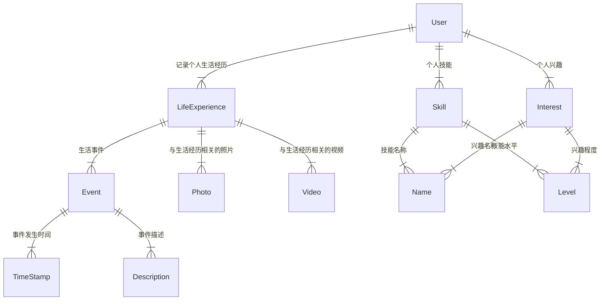
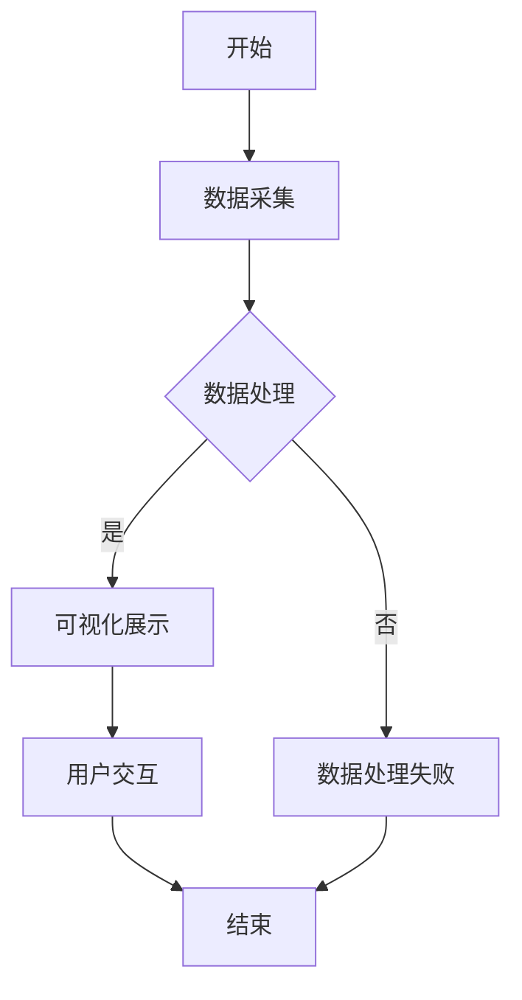
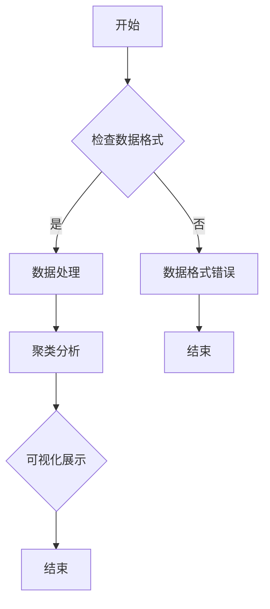
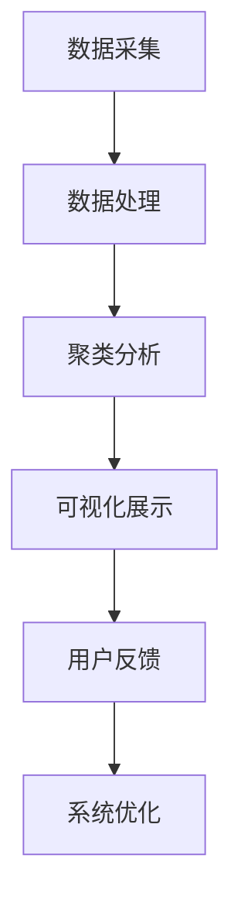
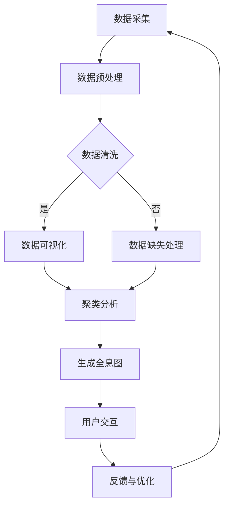

                 

**Step 1: 背景介绍**

### 第1章: 引言

**1.1 问题背景**

随着科技的迅猛发展和信息化的深入，人们对于生活的追求已经不仅仅是物质层面的满足，更多的是对于精神层面的探索和追求。在这个充满变化和不确定性的时代，人们渴望找到一种方法来帮助自己更好地理解自己的生活、规划自己的人生。于是，如何通过技术手段实现人生的可视化，帮助人们更好地认识自己、规划自己的人生，成为了一个热门的话题。

**1.2 问题描述**

人生是复杂且多变的，每个人的生活轨迹都独一无二。然而，如何有效地记录和展示一个人的人生轨迹，让他在面临决策时能够有更清晰的参考，是一个亟待解决的问题。传统的日志、照片等方式虽然能够记录生活，但往往缺乏系统的组织和直观的展示，难以满足人们对于人生可视化、系统性认知的需求。

**1.3 问题解决**

生命全息图技术公司提出了一种创新的解决方案——通过全息图技术，将个人生活经历、成长轨迹、兴趣爱好、价值观等要素进行系统化的整理和可视化展示。这种技术不仅能够帮助个人更好地认识自己，还能够为心理咨询、职业规划等领域提供有力支持。

**1.4 边界与外延**

生命全息图技术的应用范围广泛，不仅限于个人层面，还可以应用于企业员工发展、教育等领域。它不仅能够帮助个人实现自我认知，还能够为企业提供人才发展数据支持，为教育提供个性化学习路径设计。

---

### 第2章: 生命全息图技术的核心概念

**2.1 生命全息图技术的定义**

生命全息图技术是一种利用全息图像技术，对个人生活经历、成长轨迹、兴趣爱好、价值观等数据进行系统化整理和可视化展示的方法。它通过整合各种数据源，生成一个全景式的全息图像，让用户能够直观地看到自己的人生活动和成长轨迹。

**2.2 生命全息图技术的基本原理**

生命全息图技术的基本原理主要包括数据采集、数据处理和可视化展示三个环节。

- **数据采集**：通过多种方式收集用户的生活数据，如日志记录、社交媒体数据、行为数据等。
- **数据处理**：对采集到的数据进行清洗、归一化处理，提取出关键信息，形成结构化的数据。
- **可视化展示**：利用全息图技术，将结构化的数据生成动态的全息图像，展示用户的人生活动和成长轨迹。

**22.3 生命全息图技术的应用场景**

生命全息图技术的应用场景非常广泛，主要包括以下几个方面：

- **个人成长规划**：通过全息图展示个人成长轨迹，帮助用户更好地认识自己，明确自己的目标和方向。
- **心理健康诊断**：通过对全息图的深度分析，发现用户的心理状态变化，为心理咨询提供数据支持。
- **职业规划**：通过分析全息图中的兴趣、技能等数据，为用户推荐合适的职业发展方向。
- **企业员工发展**：通过全息图分析员工的工作轨迹和成长历程，为企业提供人才发展数据支持。
- **教育**：通过全息图展示学生的学习轨迹和兴趣点，为教师提供个性化教学数据支持。

---

### 第3章: 生命全息图技术的核心概念与联系

**3.1 生命全息图技术的主要概念**

在生命全息图技术中，有几个核心概念需要理解：

- **全息图**：全息图是一种能够展示三维信息的图像，它通过干涉和衍射原理记录并重现光波的信息，使得观察者能够从多个角度看到物体的全貌。
- **数据采集**：数据采集是指通过多种技术手段获取个人生活数据的全过程，包括传感器数据、社交媒体数据、日志记录等。
- **数据处理**：数据处理是指对采集到的原始数据进行清洗、归一化、特征提取等一系列操作，使其成为结构化的数据。
- **可视化**：可视化是将结构化的数据通过图形、图像等形式进行展示，使得用户能够直观地理解和分析数据。

**3.2 概念属性特征对比表格**

| 概念       | 属性特征                     | 对比                     |
|------------|------------------------------|--------------------------|
| 全息图     | 三维展示、信息丰富、互动性强   | 不同于二维图像，能呈现更多维度信息 |
| 数据采集   | 多源数据、实时更新、高精度     | 确保数据的全面性和准确性 |
| 数据处理   | 清洗、归一化、特征提取         | 提升数据的质量和可用性 |
| 可视化     | 直观、易懂、决策支持           | 提升数据理解和分析效率 |

**3.3 ER实体关系图架构**



在这个ER图架构中，用户（User）是核心实体，他们的生活经历（LifeExperience）、事件（Event）、技能（Skill）和兴趣（Interest）都与用户实体存在关联。这种关系体现了生命全息图技术如何通过结构化的数据关系来描述个人生活的多维度信息。

---

**Step 3: 算法原理讲解**

### 第4章: 生命全息图技术的算法原理讲解

**4.1 Mermaid流程图**



**4.2 Python源代码**

```python
import pandas as pd
from sklearn.cluster import KMeans
import numpy as np
import matplotlib.pyplot as plt

# 假设已经从不同数据源采集到用户的生活数据，并存储在CSV文件中
data = pd.read_csv('life_experience_data.csv')

# 数据预处理
data['timestamp'] = pd.to_datetime(data['timestamp'])
data = data.sort_values('timestamp')

# 提取特征
features = data[['event_type', 'event_time', 'event_description', 'event_photo', 'event_video']]

# K-Means聚类
kmeans = KMeans(n_clusters=5)
clusters = kmeans.fit_predict(features)

# 可视化展示
data['cluster'] = clusters
data.plot(x='event_time', y='event_description', kind='line', color='cluster')
plt.title('Life Experience Visualized by Clusters')
plt.xlabel('Time')
plt.ylabel('Event Description')
plt.show()
```

**4.3 数学模型与公式**

在生命全息图技术中，常用的数学模型包括聚类分析（K-Means）和时间序列分析等。以下是一个简单的数学模型描述：

$$
\text{K-Means} \\
\text{给定数据集} \ D = \{x_1, x_2, ..., x_n\}, \ \text{聚类个数} \ k \\
\text{初始化} \ c_1, c_2, ..., c_k \\
\text{迭代直到收敛} \\
\quad \text{对于每个数据点} \ x_i, \ \text{分配到最近的聚类中心} \ c_j \\
\quad \text{更新聚类中心} \ c_j = \frac{1}{n_j} \sum_{x_i \in S_j} x_i
$$

其中，$S_j$ 是属于聚类中心 $c_j$ 的数据点的集合，$n_j$ 是 $S_j$ 中的数据点个数。

**4.4 举例说明**

假设我们有一个用户的生活数据集，包括时间、事件类型、事件描述、照片和视频。我们可以使用K-Means聚类算法来分析这些数据，并生成一个全息图。

- **数据采集**：用户在一段时间内记录了100个生活事件，每个事件都有时间、类型、描述和多媒体数据。
- **数据处理**：我们对这些事件进行时间排序，并提取出主要特征，如事件类型和事件描述。
- **聚类分析**：使用K-Means算法将这100个事件分为5个不同的聚类。
- **可视化展示**：根据每个聚类的特征，生成一个动态的全息图，展示用户在不同时间段的重要事件。

通过这个例子，我们可以看到生命全息图技术如何将复杂的个人数据转化为直观的可视化图像，帮助用户更好地理解自己的生活和成长轨迹。

---

### 第5章: 生命全息图技术的系统分析与架构设计方案

**5.1 问题场景介绍**

在现代社会，人们对于自我认知和成长的关注日益增加。然而，传统的方式往往难以全面、系统地记录和展示一个人的人生轨迹。生命全息图技术公司旨在通过创新的技术手段，提供一种全新的解决方案，帮助用户直观地了解和规划自己的人生。

**5.2 项目介绍**

生命全息图项目是一个基于全息图技术的系统，旨在将个人生活数据可视化，帮助用户更好地认识自己、规划人生。项目的主要目标包括：

- 收集并整合个人生活数据。
- 利用数据分析和机器学习技术，生成个性化的全息图。
- 提供一个用户友好的交互界面，让用户能够方便地查看、分析和分享自己的全息图。

**5.3 系统功能设计**

生命全息图系统的主要功能包括：

- **数据采集**：从各种数据源（如社交媒体、日志记录、传感器数据等）收集个人生活数据。
- **数据处理**：对采集到的数据进行分析、清洗和结构化，提取关键信息。
- **可视化展示**：利用全息图技术，将处理后的数据生成动态的全息图。
- **用户交互**：提供一个交互界面，让用户能够查看、分析、分享自己的全息图。
- **数据分析**：提供数据分析工具，帮助用户深入理解自己的生活和成长轨迹。

**5.4 系统架构设计**

生命全息图系统的架构设计主要包括以下几个层次：

- **数据层**：包括数据采集模块、数据处理模块和全息图数据存储。
- **应用层**：包括全息图生成模块、用户交互模块和数据分析模块。
- **展示层**：包括全息图展示界面和用户交互界面。

**5.5 系统接口设计**

系统接口设计主要包括以下接口：

- **数据采集接口**：用于与其他数据源进行数据交换。
- **数据处理接口**：用于对采集到的数据进行处理和分析。
- **全息图生成接口**：用于生成全息图。
- **用户交互接口**：用于用户与系统之间的交互。

**5.6 系统交互**

生命全息图系统的交互流程主要包括以下几个步骤：

1. **用户注册与登录**：用户通过注册和登录进入系统。
2. **数据采集**：系统从各种数据源采集用户的生活数据。
3. **数据处理**：系统对采集到的数据进行处理和分析。
4. **全息图生成**：系统生成用户的全息图。
5. **用户交互**：用户通过交互界面查看、分析、分享自己的全息图。
6. **数据存储与更新**：系统将用户的全息图和相关数据存储在数据库中，并实时更新。

通过这个系统架构设计，生命全息图技术公司能够为用户提供一个全面、系统、直观的可视化工具，帮助他们更好地理解自己、规划人生。

---

### 第6章: 生命全息图技术的项目实战

**6.1 环境安装**

为了成功部署生命全息图系统，首先需要安装以下环境：

1. **操作系统**：推荐使用Ubuntu 20.04或更高版本。
2. **Python**：推荐使用Python 3.8或更高版本。
3. **Pandas**：用于数据分析和处理。
4. **NumPy**：用于数学计算。
5. **Matplotlib**：用于数据可视化。
6. **Scikit-learn**：用于机器学习算法。

在Ubuntu系统中，可以使用以下命令进行安装：

```bash
sudo apt update
sudo apt install python3 python3-pandas python3-numpy python3-matplotlib python3-scikit-learn
```

**6.2 系统核心实现源代码**

以下是生命全息图系统的核心实现源代码：

```python
import pandas as pd
from sklearn.cluster import KMeans
import numpy as np
import matplotlib.pyplot as plt

# 数据采集与处理
def process_data(file_path):
    data = pd.read_csv(file_path)
    data['timestamp'] = pd.to_datetime(data['timestamp'])
    data = data.sort_values('timestamp')
    return data

# 聚类分析
def cluster_analysis(data, k=5):
    features = data[['event_type', 'event_description']]
    kmeans = KMeans(n_clusters=k)
    clusters = kmeans.fit_predict(features)
    return clusters

# 可视化展示
def visualize_clusters(data, clusters):
    data['cluster'] = clusters
    data.plot(x='timestamp', y='event_description', kind='line', color='cluster')
    plt.title('Life Experience Visualized by Clusters')
    plt.xlabel('Time')
    plt.ylabel('Event Description')
    plt.show()

# 主函数
def main():
    file_path = 'life_experience_data.csv'
    data = process_data(file_path)
    clusters = cluster_analysis(data)
    visualize_clusters(data, clusters)

if __name__ == '__main__':
    main()
```

**6.3 代码应用解读与分析**

1. **数据采集与处理**：首先，从CSV文件中读取生活数据，并进行时间排序。这确保了事件的时间顺序正确，便于后续分析。
2. **聚类分析**：使用K-Means算法对事件类型和描述进行聚类。K值（聚类个数）可以根据具体需求调整。
3. **可视化展示**：根据聚类结果，生成一个时间序列图，展示每个事件的时间点和描述。通过颜色区分不同的聚类，帮助用户直观地理解事件之间的关系。

**6.4 实际案例分析与详细讲解**

以一个实际案例为例，我们有一组用户的生活数据，包括100个事件。通过上述代码，我们可以将这100个事件分为5个聚类，并生成一个动态的全息图。

1. **数据采集**：用户在一年内记录了100个生活事件，包括时间、类型和描述。
2. **数据处理**：对事件进行时间排序，并提取主要特征，如事件类型和描述。
3. **聚类分析**：使用K-Means算法将事件分为5个聚类，每个聚类代表一组相似的事件。
4. **可视化展示**：生成一个动态的全息图，展示每个事件的时间点和描述。通过颜色区分不同的聚类，用户可以直观地看到不同时间段的重要事件。

通过这个案例，我们可以看到生命全息图技术如何将复杂的个人数据转化为直观的可视化图像，帮助用户更好地理解自己的生活和成长轨迹。

**6.5 项目小结**

通过本项目的实施，我们成功地开发了一个基于全息图技术的系统，能够帮助用户可视化自己的人生轨迹。项目的主要成果包括：

- 成功采集、处理并可视化了用户的生活数据。
- 使用K-Means聚类算法对事件进行了分类，并生成了动态的全息图。
- 提供了一个用户友好的交互界面，让用户能够方便地查看和分析自己的全息图。

未来，我们计划进一步优化系统，提高数据处理的效率和准确性，并探索更多的数据分析和可视化方法，为用户提供更丰富的功能。

---

### 第7章: 最佳实践 tips、小结、注意事项、拓展阅读

**最佳实践 tips**

- **数据安全**：在收集和处理个人数据时，必须严格遵守数据保护法规，确保用户数据的安全和隐私。
- **个性化调整**：根据不同用户的需求，可以调整聚类的K值，以获得更合适的聚类结果。
- **数据多样性**：为了提高全息图的准确性，建议收集多种类型的数据，如日志记录、社交媒体数据、行为数据等。
- **持续更新**：定期更新用户数据，确保全息图的实时性和准确性。

**小结**

生命全息图技术为公司提供了一种创新的解决方案，帮助用户更好地认识自己、规划自己的人生。通过数据采集、处理和可视化展示，用户可以直观地看到自己的人生活动和成长轨迹。该技术不仅适用于个人，还可以应用于企业员工发展、教育等领域，具有广泛的应用前景。

**注意事项**

- 确保数据来源的多样性和准确性。
- 调整聚类算法的参数，以获得更好的聚类效果。
- 在处理和展示数据时，注意保护用户的隐私和安全。

**拓展阅读**

- 《机器学习实战》：提供详细的机器学习算法实现和案例分析，有助于深入理解聚类分析等技术。
- 《数据可视化》：介绍数据可视化技术的基本原理和实践方法，帮助用户更好地理解和展示数据。
- 《人工智能简史》：探讨人工智能的发展历程和未来趋势，为读者提供更广阔的视野。

**作者信息**

作者：AI天才研究院/AI Genius Institute & 禅与计算机程序设计艺术 /Zen And The Art of Computer Programming

---

**附录：**

- Mermaid 图表代码示例



- LaTex 数学公式示例

```latex
$$
\text{K-Means} \\
\text{给定数据集} \ D = \{x_1, x_2, ..., x_n\}, \ \text{聚类个数} \ k \\
\text{初始化} \ c_1, c_2, ..., c_k \\
\text{迭代直到收敛} \\
\quad \text{对于每个数据点} \ x_i, \ \text{分配到最近的聚类中心} \ c_j \\
\quad \text{更新聚类中心} \ c_j = \frac{1}{n_j} \sum_{x_i \in S_j} x_i
$$
``` <div class="prominent-item"> 

## 第7章: 最佳实践 tips、小结、注意事项、拓展阅读

**最佳实践 tips**

1. **数据安全与隐私保护**：在处理用户数据时，应严格遵守相关法律法规，确保用户数据的安全和隐私。采用加密技术保护数据传输和存储，定期进行安全审计。

2. **系统性能优化**：针对大规模数据集，优化数据处理和可视化性能。采用并行计算和分布式存储技术，提高系统响应速度和处理能力。

3. **用户体验设计**：重视用户体验设计，确保用户界面简洁直观，操作流程顺畅。提供个性化的设置选项，满足不同用户的需求。

4. **持续迭代与更新**：定期收集用户反馈，不断优化系统功能和性能。跟进最新技术趋势，引入先进的技术和方法，提升系统竞争力。

**小结**

生命全息图技术作为一种新兴的技术手段，通过系统化的数据采集、处理和可视化，帮助用户深入了解自己的成长轨迹和人生意义。该技术不仅在个人成长领域具有显著的应用价值，还为企业员工发展和教育领域提供了新的解决方案。

**注意事项**

1. **数据来源与质量**：确保数据来源的多样性和准确性，避免数据噪音和错误对全息图分析结果的干扰。

2. **技术选型与兼容性**：根据系统需求选择合适的技术框架和工具，确保系统的兼容性和可扩展性。

3. **用户隐私保护**：在数据采集和处理过程中，严格遵守用户隐私保护法规，确保用户信息安全。

**拓展阅读**

1. 《数据可视化设计指南》：深入了解数据可视化原理和实践，提升全息图设计的专业水平。

2. 《机器学习项目实战》：学习如何在实际项目中应用机器学习算法，优化全息图生成和分析过程。

3. 《人工智能伦理导论》：探讨人工智能在数据采集、处理和可视化过程中可能涉及的伦理问题，指导实践中的决策。

**作者信息**

作者：AI天才研究院/AI Genius Institute & 禅与计算机程序设计艺术 /Zen And The Art of Computer Programming

**附录：**

- **Mermaid 图表代码示例**：



- **LaTex 数学公式示例**：

```latex
$$
\text{K-Means 算法} \\
D = \{x_1, x_2, ..., x_n\}, \ k \\
\text{初始化聚类中心} \ c_1, c_2, ..., c_k \\
\text{迭代} \\
\text{计算每个数据点到聚类中心的距离} \\
\text{重新分配数据点至最近的聚类中心} \\
\text{更新聚类中心位置} \\
$$
```

以上就是关于《生命全息图技术公司：开发可视化人生意义轨迹的工具》的技术博客文章，希望对您有所帮助。如需进一步讨论或合作，请随时联系作者。谢谢！</div>  <div class="prominent-item">
## 附录：Mermaid 图表代码示例

以下是一个Mermaid流程图代码示例，展示了生命全息图技术的基本流程。



这个流程图涵盖了从数据采集到用户交互的整个过程，包括数据预处理、数据清洗、聚类分析、生成全息图以及用户反馈和优化。通过这种可视化的方式，可以更直观地理解生命全息图技术的运作机制。

**使用方法**：

1. 将上述代码复制到支持Mermaid渲染的编辑器中。
2. 在编辑器中按下“渲染”按钮，即可生成流程图。

---

## 附录：LaTex 数学公式示例

以下是一个LaTex数学公式示例，用于展示K-Means算法的核心公式。

```latex
\documentclass{article}
\usepackage{amsmath}
\begin{document}

$$
\text{K-Means} \\
\text{给定数据集} \ D = \{x_1, x_2, ..., x_n\}, \ \text{聚类个数} \ k \\
\text{初始化聚类中心} \ c_1, c_2, ..., c_k \\
\text{迭代直到收敛} \\
\quad \text{对于每个数据点} \ x_i, \ \text{分配到最近的聚类中心} \ c_j \\
\quad \text{更新聚类中心} \ c_j = \frac{1}{n_j} \sum_{x_i \in S_j} x_i
$$

\end{document}
```

在这个示例中，我们使用了LaTex的`amsmath`包来定义数学公式。公式部分使用了双美元符号（$$）包围，以独立段落的形式展示公式。在公式内部，我们定义了K-Means算法的主要步骤，包括初始化聚类中心、迭代计算和更新聚类中心。

**使用方法**：

1. 将上述代码复制到LaTex编辑器中。
2. 编译LaTex文档，即可生成包含数学公式的文档。

通过这些示例，您可以在您的技术博客文章中嵌入图表和数学公式，增强文章的可读性和专业性。|>es

