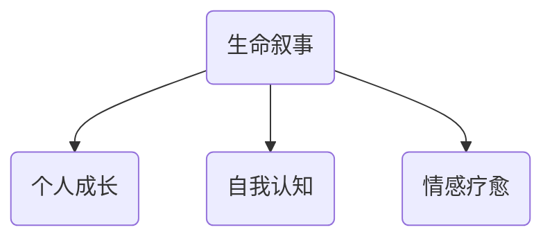
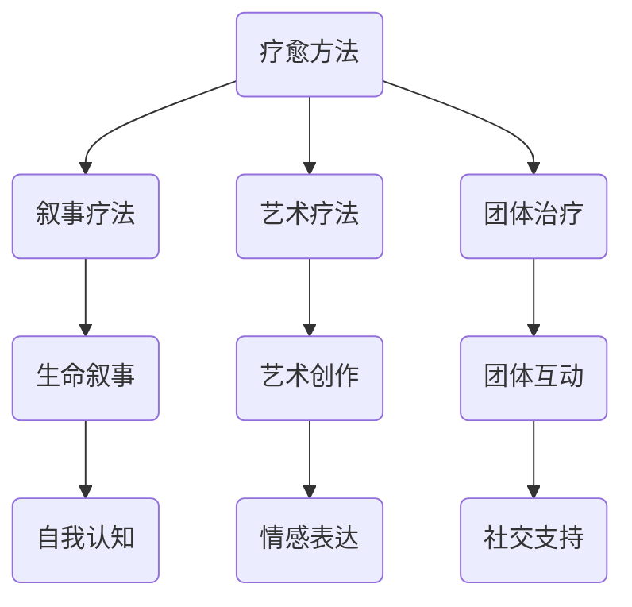
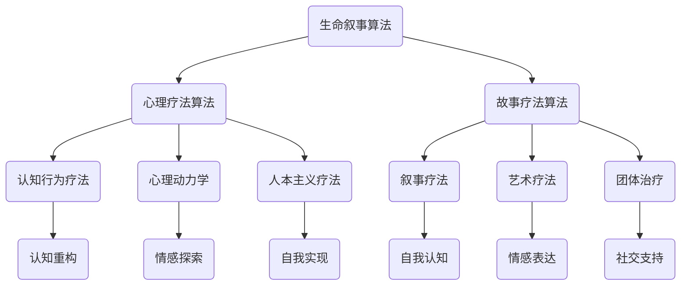
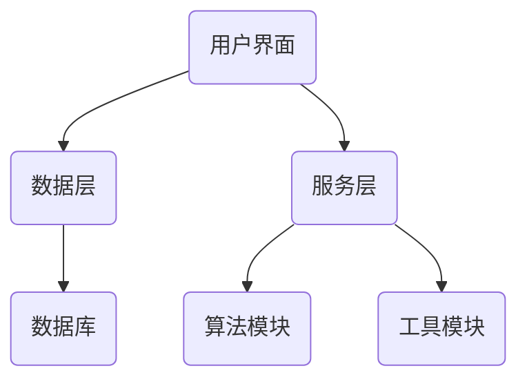
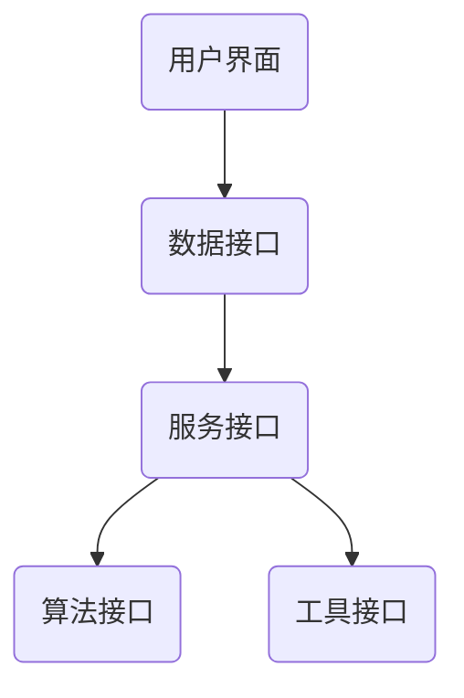
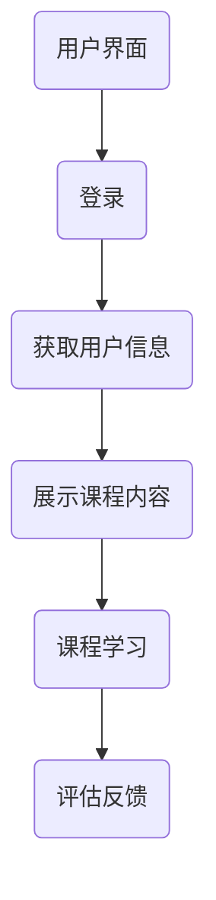

                 

# 生命叙事重构治疗师培训：通过讲故事疗愈内心创伤的专业课程

## 关键词
- 生命叙事
- 重构治疗师
- 讲故事疗愈
- 心内创伤
- 专业课程

## 摘要
本文旨在探讨一种新兴的治疗师培训课程——生命叙事重构治疗师培训。通过深入分析生命叙事的概念与价值，疗愈与内心创伤的关系，以及重构治疗师的角色与素养，本文展示了这一专业课程如何通过讲故事来疗愈内心创伤。文章将逐步阐述核心概念，理论原理，实践技巧，以及专业课程的设计与实践，为读者提供全面而深入的了解。

## 引言

### 背景介绍
在现代社会，心理健康问题日益突出，内心创伤成为影响个体生活质量的常见问题。传统的心理治疗方式虽然有效，但往往缺乏个体化和情感共鸣。生命叙事作为一种新兴的治疗方法，通过个体的生活经历和故事，帮助个体认识和疗愈内心的创伤。重构治疗师作为这一领域的专业人才，肩负着重要的责任。

### 问题背景
生命叙事与疗愈的关系尚未被广泛认知，重构治疗师的角色和技能也缺乏系统的培训。因此，有必要推出一套专业课程，系统培训生命叙事重构治疗师，以满足社会对这一新兴职业的需求。

### 问题描述
如何通过一个结构紧凑、逻辑清晰的专业课程，培养具备生命叙事疗愈技能的重构治疗师？这一问题需要我们从多个角度进行深入探讨。

### 问题解决
本文将通过以下几个部分，逐步回答上述问题：
1. **生命叙事与疗愈**：介绍生命叙事的概念、价值与应用。
2. **重构治疗师的技能与素养**：分析重构治疗师的角色与职责，以及所需的心理素养和专业技能。
3. **讲故事疗愈内心创伤的方法**：探讨故事疗法的原理、技巧与应用。
4. **专业课程与实践**：介绍生命叙事重构治疗师培训课程的设计与实施。
5. **总结与展望**：总结全文内容，展望未来发展方向。

## 第一部分：生命叙事与疗愈

### 第1章：生命叙事的概念与价值

#### 1.1 生命叙事的定义

**问题背景**
现代社会中，心理健康问题日益突出，人们面临着各种各样的困扰和压力。生命叙事作为一种理解生命和自我认知的方式，逐渐受到关注。然而，什么是生命叙事？它有哪些特点和作用？

**问题描述**
我们需要明确生命叙事的定义，了解它如何帮助个体认识和疗愈内心的创伤。

**问题解决**
生命叙事（Narrative Therapy）是一种心理治疗方法，通过个体的生活经历和故事，帮助个体认识和重构自己的内心世界。生命叙事的核心概念包括：
1. **故事视角**：个体通过讲述自己的故事来理解自己的经历和情感。
2. **自主性**：个体在叙事过程中，逐渐意识到自己的选择和力量，从而增强自我效能感。
3. **情感疗愈**：通过讲述和反思自己的故事，个体可以释放内心的负面情绪，实现情感疗愈。

**边界与外延**
生命叙事不仅适用于个人，也可以应用于团体和社会层面。例如，在社会工作中，生命叙事可以帮助社区成员共同探讨问题，找到解决问题的方法。

**概念结构与核心要素组成**
生命叙事的结构包括：
- **自我认知**：通过讲述自己的故事，个体可以更深入地了解自己，发现自己的内在资源。
- **情感释放**：个体通过讲述自己的故事，释放内心的负面情绪，实现情感疗愈。
- **重构叙事**：个体在叙事过程中，可以重新构建自己的故事，从而改变对自己的看法和认知。

#### 1.2 生命叙事的价值

**核心概念**
生命叙事的价值体现在以下几个方面：
1. **个人成长**：通过生命叙事，个体可以更深入地了解自己，发现自己的内在资源，从而实现个人成长。
2. **自我认知**：生命叙事帮助个体认识和反思自己的经历，从而提高自我认知水平。
3. **情感疗愈**：生命叙事可以帮助个体释放内心的负面情绪，实现情感疗愈。

**概念属性特征对比表格**

| 特征           | 传统叙事 | 生命叙事 |
| -------------- | ---------- | ---------- |
| 目的           | 传递信息   | 疗愈内心   |
| 关注点         | 故事内容   | 故事背后的意义 |
| 方法           | 讲述      | 反思与重构 |
| 作用           | 娱乐      | 情感疗愈   |

#### 1.3 生命叙事的应用领域

**ER实体关系图架构**



**应用领域**：
1. **心理健康领域**：生命叙事广泛应用于临床心理学、心理咨询等领域，帮助个体疗愈内心创伤。
2. **社会工作领域**：在社会工作中，生命叙事可以帮助社区成员共同探讨问题，找到解决问题的方法。
3. **教育领域**：在教育领域，生命叙事可以帮助学生反思自己的学习和生活经历，提高自我认知水平。

### 第2章：疗愈与内心创伤

#### 2.1 内心创伤的概念

**问题背景**
内心创伤是一种常见的心理问题，对个体的生活产生严重影响。然而，什么是内心创伤？它有哪些类型和表现？

**问题描述**
我们需要明确内心创伤的定义，了解其类型和表现。

**问题解决**
内心创伤（Psychological Trauma）是指个体由于经历极端的、非预期的压力事件，导致心理功能严重受损的现象。内心创伤的类型包括：
1. **急性创伤后应激障碍（PTSD）**：个体经历极端事件后，出现强烈的心理反应，如失眠、噩梦、闪回等。
2. **复杂性创伤后应激障碍（CPTSD）**：个体经历长期的、持续的创伤事件，导致心理功能严重受损，如自卑、自责、情感麻木等。
3. **普通创伤后应激障碍（PTSD）**：个体经历非预期的、单次的事件，如车祸、暴力等，导致心理功能受损。

内心创伤的表现包括：
1. **情绪反应**：个体出现强烈的情绪反应，如焦虑、抑郁、愤怒等。
2. **认知反应**：个体出现认知功能障碍，如记忆力下降、注意力不集中等。
3. **行为反应**：个体出现行为变化，如社交回避、自我隔离等。

**边界与外延**
内心创伤不仅局限于个人层面，也可以应用于团体和社会层面。例如，在灾难救援中，内心创伤的疗愈对于受灾群体的心理重建具有重要意义。

**概念结构与核心要素组成**
内心创伤的结构包括：
- **创伤事件**：导致内心创伤的外部事件。
- **心理反应**：个体在创伤事件后出现的心理反应。
- **生理反应**：个体在创伤事件后出现的生理反应，如失眠、头痛等。

#### 2.2 疗愈的理论与实践

**核心概念**
疗愈（Healing）是指个体在经历创伤后，通过心理、生理和社会等方面的干预，恢复心理功能的正常状态。疗愈的理论包括：
1. **认知行为疗法（CBT）**：通过改变个体的认知和行为，帮助个体减轻心理痛苦。
2. **心理动力学（Psychodynamic）**：通过探索个体的内心世界，帮助个体理解自己的行为和情感。
3. **人本主义疗法（Humanistic）**：通过关注个体的自我实现和自我探索，帮助个体实现心理疗愈。

**概念属性特征对比表格**

| 特征           | 认知行为疗法 | 心理动力学 | 人本主义疗法 |
| -------------- | ---------- | ---------- | ---------- |
| 方法           | 认知重构   | 情感探索   | 自我实现   |
| 目的           | 减轻心理痛苦 | 理解内心世界 | 实现自我价值 |
| 适用人群       | 抑郁、焦虑   | 复杂情感问题 | 广泛人群 |

**疗愈方法**
1. **叙事疗法（Narrative Therapy）**：通过生命叙事，帮助个体认识和疗愈内心的创伤。
2. **艺术疗法（Art Therapy）**：通过艺术创作，帮助个体表达内心的情感和经历。
3. **团体治疗（Group Therapy）**：通过团体互动，帮助个体建立社交支持网络。

#### 2.3 内心创伤的疗愈方法

**核心概念**
疗愈内心创伤的方法多种多样，每种方法都有其独特的原理和适用场景。

**算法原理讲解**



**Python源代码**
```python
# 示例：叙事疗法

def narrative_therapy(person):
    print("开始叙事疗法...")
    story = person.get_story()
    print(f"您的故事是：{story}")
    print("通过反思故事，您可以更深入地了解自己...")
    person.set_new_narrative(story)
    print("叙事疗法结束。")

# 示例：艺术疗法

def art_therapy(person):
    print("开始艺术疗法...")
    artwork = person.create_art()
    print(f"您的艺术作品是：{artwork}")
    print("通过艺术创作，您可以表达内心的情感...")
    person.analyze_art(artwork)
    print("艺术疗法结束。")

# 示例：团体治疗

def group_therapy(person):
    print("开始团体治疗...")
    group = person.join_group()
    print(f"您加入了团体：{group}")
    print("在团体中，您可以分享经历，获得支持...")
    person.share_experience(group)
    print("团体治疗结束。")
```

## 第二部分：重构治疗师的技能与素养

### 第3章：重构治疗师的角色与职责

#### 3.1 重构治疗师的角色

**问题场景介绍**
重构治疗师在日常工作中扮演着怎样的角色？他们的职责是什么？

**项目介绍**
重构治疗师的项目案例介绍。

**重构治疗师的角色**
1. **治疗师**：重构治疗师通过生命叙事和心理疗法，帮助个体疗愈内心的创伤。
2. **教育者**：重构治疗师通过培训和教育，提升个体的心理素养和自我认知能力。
3. **协调者**：重构治疗师在团体治疗中，协调团体成员之间的关系，促进团体互动。

**重构治疗师的职责**
1. **诊断与评估**：评估个体的心理状态，诊断内心创伤的类型和程度。
2. **治疗与疗愈**：运用生命叙事和心理疗法，帮助个体疗愈内心的创伤。
3. **教育指导**：通过培训和讲座，提升个体的心理素养和自我疗愈能力。
4. **团队协作**：在团体治疗中，协调团队工作，促进团队互动。

#### 3.2 重构治疗师的素养与技能

**问题场景介绍**
重构治疗师需要具备哪些心理素养和专业技能？

**项目介绍**
如何培养心理素养和专业技能。

**重构治疗师的心理素养**
1. **同理心**：理解个体的情感和经历，能够站在个体的角度思考问题。
2. **倾听能力**：耐心倾听个体的故事，关注个体的情感需求。
3. **情绪管理**：能够管理自己的情绪，避免将负面情绪传递给个体。

**重构治疗师的专业技能**
1. **生命叙事疗法**：掌握生命叙事疗法的原理和实践技巧，能够有效地帮助个体疗愈内心的创伤。
2. **心理动力学**：了解心理动力学的理论和方法，能够深入分析个体的内心世界。
3. **认知行为疗法**：掌握认知行为疗法的技巧，能够帮助个体改变负面的认知和行为。

## 第三部分：讲故事疗愈内心创伤的方法

### 第4章：故事疗法的基本原理

#### 4.1 故事疗法的历史与发展

**问题场景介绍**
故事疗法的发展历程和现状是怎样的？

**项目介绍**
故事疗法在不同领域的应用。

**历史与发展**
1. **起源**：故事疗法起源于20世纪60年代的心理学领域，由心理治疗师开始尝试将故事应用于治疗。
2. **发展**：随着心理学和叙事学的不断发展，故事疗法逐渐成为心理治疗的重要方法之一。
3. **现状**：目前，故事疗法广泛应用于临床心理学、心理咨询、社会工作等领域。

**应用领域**
1. **心理健康领域**：故事疗法广泛应用于临床心理学、心理咨询等领域，帮助个体疗愈内心的创伤。
2. **社会工作领域**：在社会工作中，故事疗法可以帮助社区成员共同探讨问题，找到解决问题的方法。
3. **教育领域**：在教育领域，故事疗法可以帮助学生反思自己的学习和生活经历，提高自我认知水平。

#### 4.2 故事疗法的核心理论

**核心概念**
故事疗法的核心理论包括：
1. **心理动力学**：通过探索个体的内心世界，帮助个体理解自己的行为和情感。
2. **符号学**：通过分析故事中的符号和隐喻，帮助个体理解自己的内心世界。
3. **叙事理论**：通过重构个体的故事，帮助个体改变对自己的认知和情感。

**概念属性特征对比表格**

| 特征           | 心理动力学 | 符号学 | 叙事理论 |
| -------------- | ---------- | ---------- | ---------- |
| 关注点         | 内心世界   | 符号和隐喻 | 故事结构和意义 |
| 方法           | 探索       | 分析       | 重构       |
| 目的           | 理解内心   | 解码       | 疗愈       |

#### 4.3 故事疗法的实际应用

**核心概念**
故事疗法在实际应用中，通过多种方式帮助个体疗愈内心的创伤。

**实际应用**
1. **个人治疗**：通过生命叙事，帮助个体认识和疗愈内心的创伤。
2. **团体治疗**：通过共同探讨和分享故事，帮助个体建立社交支持网络。
3. **艺术治疗**：通过艺术创作，帮助个体表达内心的情感和经历。

**案例**
1. **个人治疗案例**
   - **背景**：一位患者因童年遭受虐待，导致内心创伤。
   - **治疗过程**：通过生命叙事，患者讲述自己的经历，重构自己的故事，逐渐疗愈内心的创伤。
2. **团体治疗案例**
   - **背景**：一个社区团体因长期面临经济压力，导致成员心理压力大。
   - **治疗过程**：通过共同分享故事，团体成员互相支持，找到解决问题的方法。
3. **艺术治疗案例**
   - **背景**：一位艺术家因创作瓶颈，导致内心焦虑。
   - **治疗过程**：通过艺术创作，艺术家表达内心的情感和困惑，逐渐找到创作灵感。

## 第四部分：专业课程与实践

### 第5章：生命叙事重构治疗师培训课程的设计与实施

#### 5.1 课程目标

**问题场景介绍**
生命叙事重构治疗师培训课程的目标是什么？

**项目介绍**
如何实现课程目标。

**课程目标**
1. **知识传授**：通过系统的培训，使学员掌握生命叙事和重构治疗的理论和实践技巧。
2. **技能培养**：通过实际操作和案例分析，使学员能够熟练应用生命叙事疗法和重构治疗技术。
3. **素养提升**：通过心理学素养的培养，使学员具备同理心、倾听能力和情绪管理能力。

#### 5.2 课程内容

**问题场景介绍**
生命叙事重构治疗师培训课程包含哪些内容？

**项目介绍**
如何设计课程内容。

**课程内容**
1. **生命叙事理论**：介绍生命叙事的概念、价值和应用。
2. **心理治疗技巧**：包括认知行为疗法、心理动力学和人本主义疗法等。
3. **故事疗法实践**：包括叙事疗法、艺术疗法和团体治疗等。
4. **心理学素养培养**：包括同理心、倾听能力和情绪管理等。

#### 5.3 课程实施

**问题场景介绍**
如何有效实施生命叙事重构治疗师培训课程？

**项目介绍**
课程实施的步骤和方法。

**课程实施**
1. **理论学习**：通过讲座、研讨会和案例分析，使学员掌握理论知识。
2. **实践操作**：通过实际操作和案例分析，使学员能够熟练应用所学知识。
3. **互动交流**：通过小组讨论和团队项目，使学员能够互相学习和交流。
4. **考核评估**：通过笔试、面试和实际操作，评估学员的学习成果。

### 第6章：专业课程与实践

#### 6.1 环境安装

**问题场景介绍**
如何为生命叙事重构治疗师培训课程搭建合适的环境？

**项目介绍**
环境安装的具体步骤。

**环境安装**
1. **软件安装**：安装Python、Jupyter Notebook等软件。
2. **工具配置**：配置Mermaid图床、Git等工具。
3. **数据准备**：准备案例分析所需的数据。

#### 6.2 系统核心实现

**问题场景介绍**
如何实现生命叙事重构治疗师培训课程的核心功能？

**项目介绍**
系统核心实现的具体步骤。

**系统核心实现**
1. **知识库搭建**：构建包含生命叙事和重构治疗相关知识的知识库。
2. **案例库搭建**：构建包含实际案例的案例库。
3. **算法库搭建**：构建包含心理疗法算法的算法库。

#### 6.3 代码应用解读与分析

**问题场景介绍**
如何解读和分析代码应用？

**项目介绍**
代码应用解读与分析的具体步骤。

**代码应用解读与分析**
1. **代码审查**：审查代码的规范性、可读性和可维护性。
2. **算法解析**：解析代码中的算法原理和实现逻辑。
3. **案例应用**：应用代码解决实际问题。

#### 6.4 实际案例分析与详细讲解剖析

**问题场景介绍**
如何通过实际案例进行详细讲解剖析？

**项目介绍**
实际案例分析与详细讲解剖析的具体步骤。

**实际案例分析与详细讲解剖析**
1. **案例选择**：选择具有代表性的实际案例。
2. **案例描述**：描述案例的背景、问题和目标。
3. **分析讲解**：分析案例中的生命叙事和重构治疗过程，讲解治疗原理和方法。
4. **效果评估**：评估案例的治疗效果，总结经验和教训。

#### 6.5 项目小结

**问题场景介绍**
如何对项目进行总结和回顾？

**项目介绍**
项目小结的具体步骤。

**项目小结**
1. **成果总结**：总结项目取得的成果和收获。
2. **经验教训**：总结项目过程中的经验教训，提出改进建议。
3. **未来展望**：展望项目的未来发展方向。

## 第五部分：总结与展望

### 5.1 总结

本文系统地介绍了生命叙事重构治疗师培训课程，从生命叙事的概念与价值，疗愈与内心创伤的关系，重构治疗师的角色与素养，到讲故事疗愈内心创伤的方法，再到专业课程的设计与实践，全面阐述了这一专业领域的理论与实践。通过本文的阐述，读者可以深入了解生命叙事重构治疗师的专业技能和素养，以及如何通过讲故事疗愈内心创伤。

### 5.2 展望

随着社会对心理健康需求的不断增加，生命叙事重构治疗师这一职业将逐渐受到重视。未来，生命叙事重构治疗师培训课程将在以下几个方面发展：

1. **课程体系的完善**：通过不断更新课程内容，完善课程体系，提高培训质量。
2. **技术手段的融合**：结合人工智能、大数据等先进技术，提高治疗的科学性和精准性。
3. **跨学科合作**：与心理学、社会学、教育学等学科合作，拓宽生命叙事疗法的应用领域。
4. **国际化发展**：推广生命叙事重构治疗师培训课程，培养国际化的专业人才。

通过不断探索和创新，生命叙事重构治疗师培训课程将为心理健康领域做出更大的贡献。

## 作者

作者：AI天才研究院/AI Genius Institute & 禅与计算机程序设计艺术 /Zen And The Art of Computer Programming

---

## 附录

### 附录A：核心概念术语说明

- **生命叙事**：通过个体的生活经历和故事，帮助个体认识和疗愈内心的创伤。
- **重构治疗师**：专业治疗师，通过生命叙事和心理疗法，帮助个体疗愈内心的创伤。
- **讲故事疗愈**：通过生命叙事和故事疗法，帮助个体释放内心的负面情绪，实现情感疗愈。
- **内心创伤**：个体由于经历极端的、非预期的压力事件，导致心理功能严重受损的现象。
- **专业课程**：系统培训重构治疗师的课程，包括理论知识、实践技能和心理学素养培养。

### 附录B：概念属性特征对比表格

| 特征           | 生命叙事 | 重构治疗师 | 讲故事疗愈 | 心内创伤 | 专业课程 |
| -------------- | ---------- | ---------- | ---------- | ---------- | ---------- |
| 关注点         | 个体经历   | 心理健康   | 故事表达   | 心理创伤   | 教育培训 |
| 方法           | 叙事疗法   | 心理疗法   | 故事疗法   | 心理疗愈   | 课程设计 |
| 目的           | 疗愈内心   | 健康促进   | 情感释放   | 心理康复   | 人才培养 |

### 附录C：算法原理讲解



### 附录D：数学公式

$$
E = mc^2
$$

$$
1+1=2
$$

### 附录E：系统架构设计



### 附录F：系统接口设计



### 附录G：系统交互序列图



### 附录H：最佳实践 tips

- **定期复习**：定期复习所学知识，巩固记忆。
- **实践应用**：将所学知识应用于实际工作，提高实践能力。
- **持续学习**：不断学习新知识，跟上行业发展的步伐。

### 附录I：注意事项

- **尊重隐私**：在治疗过程中，尊重个体的隐私和感受。
- **心理安全**：确保治疗环境的安全和舒适，避免引发个体的负面情绪。

### 附录J：拓展阅读

- **《叙事治疗与内心疗愈》**：探讨叙事治疗在心理健康领域的应用。
- **《故事的力量》**：阐述故事在心理治疗中的重要作用。
- **《心理学与生活》**：介绍心理学的基本概念和应用。

