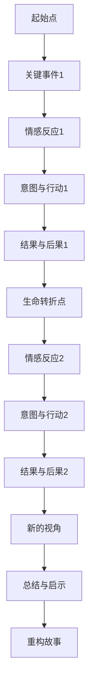
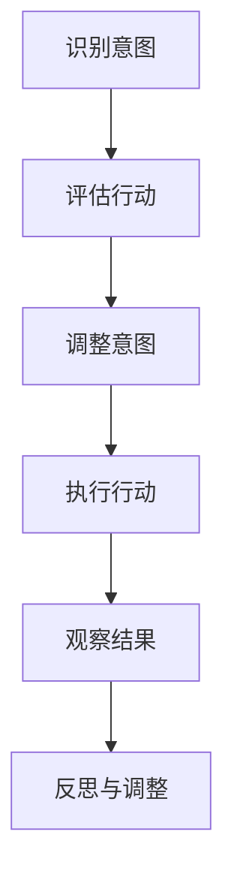
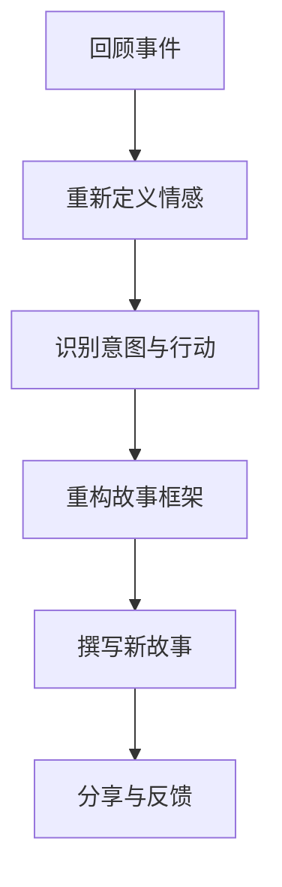

                 

### 《生命故事重写工作坊：通过叙事疗法找寻方向》

#### 摘要

在快速变化的时代背景下，个人生命的意义和方向感成为人们关注的焦点。本文旨在探讨叙事疗法在个人成长和职业发展中的应用，通过“生命故事重写工作坊”这一具体实践，帮助个体深入理解自我，重写生命故事，从而找到新的方向和动力。文章首先介绍叙事疗法的起源与发展，随后深入探讨生命故事的构成与反思方法。接着，文章详细讲解了叙事疗法的工具与技术，并通过实际工作坊案例展示了其应用效果。最后，本文讨论了叙事疗法在职业咨询中的潜力，提出了持续重写生命故事的方法，并对叙事疗法的未来进行了展望。希望通过这篇文章，读者能够对叙事疗法有更深的理解，并在个人生活中尝试应用。

#### 引言：叙事疗法与生命故事

叙事疗法，作为一种以故事为中心的治疗方法，起源于20世纪80年代。其创始人Michael White和David Epston认为，每个人都是自己生命故事的主角，这些故事不仅塑造了我们的身份，也影响着我们的行为和情感。叙事疗法的基本原则包括尊重个体的独特性、强调故事的力量、以及通过对话和写作帮助个体重构生命故事。

在个人成长中，叙事疗法扮演着重要角色。通过反思和重构生命故事，个体能够更好地理解自己的行为模式、情感反应和人生选择。这不仅有助于提升自我认知，还能帮助个体找到新的方向和动力。

首先，叙事疗法强调个体的主体性。每个人都是自己生命故事的最佳叙述者，治疗师的角色是倾听者和引导者，通过开放性对话帮助个体挖掘内心的声音。这种以患者为中心的治疗方式，尊重个体的自主性和创造力，使个体在叙述过程中体验到更多的自主权和控制感。

其次，叙事疗法注重故事的力量。故事不仅仅是事件的记录，它蕴含着情感、价值观和人生哲理。通过重写生命故事，个体可以重新审视过去的经历，发现其中的积极因素，从而改变对过去事件的解释和理解。这种重构不仅有助于缓解心理困扰，还能激发个体的内在力量，提升自我效能感。

最后，叙事疗法通过对话和写作帮助个体重构生命故事。叙事地图是一种常用的工具，它通过构建一个结构化的故事框架，帮助个体梳理生命中的关键事件、情感反应和行动结果。在治疗过程中，个体会被引导着回顾过去的经历，重新定义这些经历对自己的意义。这种反思和重构的过程，不仅有助于个体更好地理解自己，还能激发新的想法和行动，为未来的生活带来积极的变化。

总的来说，叙事疗法为个体提供了一种探索自我、理解自我和改变自我的途径。通过深入挖掘生命故事，个体能够找到更多的方向和资源，从而实现个人成长和职业发展的目标。

### 你的生命故事：理解与反思

#### 什么是生命故事

生命故事，顾名思义，是指一个人在其一生中所经历的各种事件、体验和情感的集合。这些故事不仅仅是简单的个人历史，它们反映了我们的价值观、信念和人生观，构成了我们身份认同的重要组成部分。每一个生命故事都是独一无二的，它们通过个人的视角和经历，描绘出一条独特的人生轨迹。

生命故事的作用在于，它们为我们的行为和决策提供了背景和依据。当我们面临选择和挑战时，我们会参考过去的经历和故事，以此来判断和决定。例如，一个在童年时期经历了家庭破裂的人，在处理人际关系时可能会更加谨慎和敏感。相反，一个在成长过程中得到充分支持和鼓励的人，可能会更加自信和乐观。

#### 反思你的生命故事

要开始反思自己的生命故事，首先需要对其进行梳理和记录。以下是一些具体的步骤和建议：

1. **回顾关键事件**：首先，回顾生命中的关键事件，包括那些对你有重大影响的经历。这些事件可以是喜悦的，如结婚、生子；也可以是挑战性的，如失业、生病。记录下这些事件的时间、地点、人物和当时的感受。

2. **分析情感反应**：在记录事件的同时，思考每个事件对你产生的情感反应。这些情感可能包括喜悦、愤怒、悲伤、恐惧等。尝试理解这些情感背后的原因，以及它们如何影响你的行为和态度。

3. **识别意图与行动**：在回顾事件时，思考你在当时有哪些意图和行动。这些意图和行动是否达到了预期的效果？如果结果与预期不符，你是如何调整和应对的？

4. **反思结果与后果**：最后，反思每个事件的结果和后果，包括对个人、家庭、社交关系等方面的影响。这些结果和后果如何塑造了你的性格和人生观？

#### 如何重写你的生命故事

反思生命故事只是第一步，更关键的是如何通过重写来找到新的方向和动力。以下是一些具体的策略和建议：

1. **重构关键事件**：重新审视关键事件，尝试从不同的角度和视角去理解它们。例如，一个被背叛的经历，可以从被伤害的受害者视角转变为自我成长的机会。通过这种重构，你可以发现事件背后的积极意义和教训。

2. **重定义情感反应**：在重写过程中，可以尝试重新定义情感反应。例如，将过去的愤怒和悲伤转变为感激和力量。这种转变不仅有助于改善情感状态，还能激发内在的积极力量。

3. **明确意图与行动**：在重写过程中，明确自己的意图和行动。设定新的目标和计划，使其与个人价值观和目标相一致。例如，如果你希望在未来建立更健康的人际关系，可以设定一些具体的行动计划，如学习沟通技巧、参加社交活动等。

4. **展望未来**：在重写生命故事的过程中，不仅要回顾过去，还要展望未来。思考你的理想生活是什么样子的，设定长期和短期目标，并制定实现这些目标的计划。这种前瞻性的思考有助于找到新的方向和动力。

通过这些策略，你可以更加深入地理解自己，找到新的方向和动力。重写生命故事不仅是一种心理治疗的方法，更是一种自我发现和成长的旅程。在这个过程中，你可以重新定义自己的身份和目标，从而实现更加充实和有意义的人生。

### 叙事疗法的工具与技术

叙事疗法提供了一系列工具和技术，帮助个体重构生命故事，发现新的方向和动力。以下是几种常用的工具和技术的详细介绍：

#### 叙事地图（Narrative Map）

叙事地图是一种结构化的工具，用于帮助个体梳理生命故事中的关键事件、情感反应、意图与行动以及结果与后果。通过构建叙事地图，个体可以更清晰地理解自己的生命轨迹，发现其中的模式和主题。

**流程图（Mermaid 格式）**：



**Python 示例代码**：

```python
# 叙事地图示例
class NarrativeMap:
    def __init__(self):
        self.events = []
        self.emotions = []
        self Intentions = []
        self.actions = []
        self.outcomes = []

    def add_event(self, event):
        self.events.append(event)

    def add_emotion(self, emotion):
        self.emotions.append(emotion)

    def add_intention(self, intention):
        self.Intentions.append(intention)

    def add_action(self, action):
        self.actions.append(action)

    def add_outcome(self, outcome):
        self.outcomes.append(outcome)

    def print_map(self):
        for i, event in enumerate(self.events):
            print(f"事件 {i+1}: {event}")
            print(f"情感反应 {i+1}: {self.emotions[i]}")
            print(f"意图与行动 {i+1}: {self.Intentions[i]}, {self.actions[i]}")
            print(f"结果与后果 {i+1}: {self.outcomes[i]}")
            print()
```

通过这个示例，可以看到叙事地图如何帮助个体记录和反思自己的生命经历，从而为重构故事提供基础。

#### 意图与行动（Intentions and Actions）

意图与行动是叙事疗法中的核心概念，通过识别和重新定义个人的意图和行动，可以帮助个体理解自己的行为模式，并找到新的方向。意图是指个体在特定情境下的目标和期望，而行动则是实现意图的具体步骤。

**Mermaid 流程图**：



**Python 示例代码**：

```python
# 意图与行动示例
class IntentionActionPlan:
    def __init__(self):
        self.intentions = []
        self.actions = []

    def add_intention(self, intention):
        self.intentions.append(intention)

    def add_action(self, action):
        self.actions.append(action)

    def execute_plan(self):
        for intention, action in zip(self.intentions, self.actions):
            print(f"意图: {intention}")
            print(f"行动: {action}")
            # 执行具体行动
            print("执行中...")
            # 假设行动执行成功
            print("行动完成！")
```

通过这个示例，可以看到意图与行动如何帮助个体设定目标，并采取具体行动来实现这些目标。

#### 重构故事（Story Reconstruction）

重构故事是叙事疗法的核心技术之一，通过重新定义和解读生命故事中的事件和情感，帮助个体改变对过去的认知和理解。这种重构不仅有助于缓解心理困扰，还能激发新的积极情感和行动。

**Mermaid 流程图**：



**Python 示例代码**：

```python
# 重构故事示例
class StoryReconstruction:
    def __init__(self):
        self.events = []
        self.redefined_emotions = []

    def add_event(self, event):
        self.events.append(event)

    def redefine_emotion(self, event_index, new_emotion):
        self.redefined_emotions.append(new_emotion)

    def reconstruct_story(self):
        reconstructed_story = []
        for event, new_emotion in zip(self.events, self.redefined_emotions):
            reconstructed_story.append(f"{event} - 新的情感体验：{new_emotion}")
        return "\n".join(reconstructed_story)

    def print_story(self):
        print(self.reconstruct_story())
```

通过这个示例，可以看到重构故事如何帮助个体重新定义过去的事件和情感，从而创造一个更加积极和正面的故事版本。

总的来说，叙事疗法通过叙事地图、意图与行动和重构故事等工具和技术，帮助个体深入理解自己的生命故事，找到新的方向和动力。这些工具和技术不仅为个体提供了反思和重构生命故事的方法，也为他们在个人成长和职业发展中提供了宝贵的资源和支持。

### 工作坊实践：小组活动与个体指导

#### 工作坊的设置与组织

生命故事重写工作坊是一个系统化的实践过程，旨在通过集体和个体的互动，帮助参与者深入反思和重构自己的生命故事。工作坊的设置与组织需要考虑到以下几个方面：

1. **目标与议程**：首先，工作坊的目标应明确，如提升自我认知、找到新的生活方向或解决具体的心理困扰。议程应包括导入环节、小组讨论、个体反思和总结反馈等关键步骤。

2. **参与者招募**：招募具有不同背景和经历的参与者，以保证工作坊的多样性和丰富性。参与者可以是个人、小团体或特定群体的成员，如职业人士、学生或心理咨询师等。

3. **场地与设备**：选择一个安静、舒适的场地，配备必要的设备，如白板、投影仪、笔记本电脑和录音设备等。这些设备将用于展示和记录工作坊过程中的关键内容。

4. **引导者**：引导者通常是一位经过专业训练的心理咨询师或叙事治疗师。他们负责引导小组讨论、提供个体指导和支持、确保工作坊的顺利进行。

#### 小组活动：共同探讨生命故事

小组活动是工作坊的重要组成部分，通过共同探讨生命故事，参与者可以在相互支持和理解的环境中分享自己的经历和感受。以下是几种常见的小组活动形式：

1. **生命故事分享**：每个参与者被要求分享自己的生命故事中的一个关键事件。分享过程中，其他参与者需要倾听并给予积极的反馈。这种活动有助于建立信任和共鸣，为更深入的讨论打下基础。

2. **故事重构小组**：在引导者的带领下，小组共同探讨如何重构一个生命故事。参与者可以提出不同的视角和解释，通过讨论和辩论，找到更加积极和有意义的重构方式。

3. **角色扮演**：通过角色扮演，参与者可以体验不同角色在生命故事中的感受和反应。这种活动不仅有助于理解他人的观点，还能激发新的反思和洞察。

4. **叙事地图绘制**：小组共同绘制叙事地图，记录生命故事中的关键事件、情感反应和意图与行动。这种视觉化的工具有助于参与者更清晰地理解自己的故事，并找到重构的方向。

#### 个体指导：一对一叙事疗法

个体指导是工作坊中的另一个关键环节，通过一对一的叙事疗法，参与者可以获得更深入的反思和支持。以下是几种常见的个体指导形式：

1. **私人叙事会**：参与者与引导者进行一对一的对话，深入探讨自己的生命故事和感受。引导者通过提问和反馈，帮助参与者挖掘深层次的情感和意图。

2. **叙事地图回顾**：引导者与参与者一起回顾之前绘制的叙事地图，讨论其中的关键事件和情感反应。通过这种回顾，参与者可以重新审视自己的故事，发现新的视角和解释。

3. **重构练习**：在引导者的指导下，参与者进行重构练习，尝试从不同的角度重新定义生命故事中的事件和情感。这种练习有助于提升参与者的自我认知和自我效能感。

4. **行动计划**：引导者帮助参与者设定具体的生活目标，并提供实现这些目标的行动计划。这种行动计划不仅有助于参与者找到新的方向和动力，还能提高其实际操作的能力。

通过小组活动和个体指导，生命故事重写工作坊为参与者提供了一个全面的支持和反思环境。这种多元化的实践方式，不仅有助于个体深入理解自己的生命故事，还能激发新的成长和变化。

### 生命故事的个案研究

#### 案例一：困境中的突破

张华（化名）是一名30岁的白领，他在职业生涯初期遭遇了重大挫折。由于公司裁员，他失去了工作，并在失业期间经历了严重的焦虑和抑郁。在参加生命故事重写工作坊之前，张华对自己的生活充满了怀疑和迷茫，他甚至开始质疑自己的职业选择和人生价值。

在小组活动中，张华分享了他失业的经历。他描述了自己在失业期间的痛苦和无助，特别是对未来的不确定感。其他参与者给予了张华积极的反馈和鼓励，他们分享了自己在面临类似困境时的经历和应对策略。这种共鸣和支持使张华感到不再孤单，他开始看到自己的困境中蕴含的积极因素。

在个体指导环节，引导者帮助张华绘制了叙事地图，梳理了他职业生涯中的重要事件、情感反应和行动结果。引导者引导张华重新定义这些事件，特别是失业这一关键事件。张华意识到，失业虽然带来了痛苦，但也为他提供了重新评估和规划自己职业生涯的机会。

通过叙事疗法的引导，张华逐渐找到了新的方向。他开始考虑转换职业领域，并报名参加了一些相关课程。尽管过程并不容易，但张华的积极态度和行动使他逐步克服了困难，最终找到了一份新的工作，并在新的岗位上表现出色。

#### 案例二：寻找生命意义

李梅（化名）是一名50岁的家庭主妇，她在中年时期经历了丈夫的离世。这使她陷入了深深的悲伤和孤独中，她感到自己的生活失去了意义。在参加生命故事重写工作坊之前，李梅对未来充满了迷茫和不确定性。

在小组活动中，李梅分享了自己丧偶的痛苦经历。其他参与者倾听了她的故事，并给予了她无私的支持和安慰。他们分享了如何在失去亲人后重新找到生活意义的经验，这种共鸣和支持帮助李梅感到自己并不孤单。

在个体指导环节，引导者帮助李梅回顾了她的生命故事，特别是丈夫离世这一关键事件。引导者引导李梅识别自己在这一过程中的意图和行动，以及这些意图和行动所带来的结果和后果。李梅意识到，尽管丈夫的离世带来了巨大的痛苦，但她通过关爱孩子和参与社区活动，已经在慢慢重建自己的生活。

引导者还帮助李梅制定了新的生活目标，如参与社区服务、学习新技能和培养兴趣爱好。这些目标不仅使李梅感到自己有事情可做，还为她带来了新的成就感和满足感。

通过叙事疗法的帮助，李梅逐渐找到了新的生活意义。她开始积极参与社区活动，帮助其他丧偶者走出困境。她还报名参加了一些兴趣班，学习绘画和陶艺。这些活动不仅让她重新找到了生活的乐趣，还使她的生活变得更加充实和有意义。

#### 案例三：重拾自信与希望

陈刚（化名）是一名35岁的程序员，他在职业生涯中一直感到自己缺乏成就感和自信心。在参加生命故事重写工作坊之前，陈刚对自己的未来感到迷茫和无望，他甚至开始考虑是否应该转行。

在小组活动中，陈刚分享了自己在职业发展中的困难和挫折。其他参与者不仅给予了他支持和鼓励，还分享了他们自己在职业生涯中克服困难的经历。这种共鸣和支持使陈刚感到自己并不是一个人在面对这些问题。

在个体指导环节，引导者帮助陈刚回顾了他的职业经历，特别是那些让他感到沮丧和失败的经历。引导者引导陈刚识别自己在这些经历中的意图和行动，以及这些意图和行动所带来的结果和后果。陈刚意识到，尽管他在某些方面失败了，但他通过不断学习和努力，已经在职业生涯中取得了不少成就。

引导者还帮助陈刚制定了新的职业目标，如提升技术能力、学习项目管理知识和参与社区活动。这些目标不仅使陈刚感到有事情可做，还为他带来了新的动力和信心。

通过叙事疗法的帮助，陈刚逐渐重拾了自信和希望。他开始积极参与各种技术培训和项目，不断提升自己的能力。他还加入了一些技术社区，与其他程序员分享经验和知识。这些活动不仅让他感到自己在职业上取得了进步，还为他带来了新的成就感和满足感。

总的来说，这些个案研究展示了叙事疗法在帮助个体重写生命故事、寻找新方向和动力方面的潜力。通过小组活动和个体指导，参与者不仅能够深入理解自己的生命故事，还能找到新的意义和希望。

### 叙事疗法在职业咨询中的应用

叙事疗法在职业咨询中展现出独特的优势，为个体提供了探索职业方向、解决职业问题以及实现职业发展的有效途径。以下将详细探讨叙事疗法在职业咨询中的应用，以及其在解决职业问题中的挑战与机会。

#### 职业咨询与叙事疗法

职业咨询的核心在于帮助个体明确职业目标、提升职业能力和解决职业困境。叙事疗法通过重构个体的职业故事，帮助他们在职业发展的过程中找到新的视角和动力。具体应用包括以下几个方面：

1. **职业故事的反思与重构**：叙事疗法通过引导个体回顾其职业生涯中的关键事件、挑战和成就，帮助其理解这些经历如何塑造了目前的职业状态。通过反思和重构，个体能够发现职业故事中的模式和主题，从而理解自己的职业动机和价值观。

2. **职业目标的设定与实现**：叙事疗法帮助个体设定具体的职业目标，并通过识别和调整意图与行动，制定实现这些目标的策略。这种方法不仅帮助个体明确职业方向，还能提升其实际操作的能力。

3. **职业困境的解决**：叙事疗法通过识别和重构职业故事中的困境，帮助个体理解困境背后的原因和影响。通过重新定义困境，个体能够找到新的解决方案，从而克服职业中的障碍。

#### 通过叙事疗法解决职业问题

叙事疗法在解决职业问题方面具有独特的优势。以下是一些具体的应用实例：

1. **职业转换**：对于希望转换职业的个体，叙事疗法可以帮助他们重新审视自己的职业故事，理解转换的动机和期望。通过重构故事，个体能够找到新的职业方向，并设定具体的转换计划。

2. **职业发展瓶颈**：当个体在职业发展中遇到瓶颈时，叙事疗法通过反思和重构职业生涯中的关键事件，帮助个体识别瓶颈的原因。通过调整意图和行动，个体可以找到突破瓶颈的方法，实现职业发展。

3. **工作与生活的平衡**：叙事疗法通过探讨个体在工作与生活之间的平衡问题，帮助其识别和重构相关的职业故事。通过设定合理的职业目标和生活目标，个体能够实现工作与生活的平衡，提升整体幸福感。

#### 叙事疗法在职业咨询中的挑战与机会

尽管叙事疗法在职业咨询中具有显著的优势，但其应用也面临着一些挑战和机会：

1. **挑战**：
   - **时间与资源**：叙事疗法通常需要较长时间和丰富的资源，特别是在个体需要深入反思和重构故事时。这可能导致咨询过程成本较高，对于预算有限的个体来说，可能难以承受。
   - **隐私与安全**：职业咨询涉及个人的职业经历和隐私，如何保护个体的隐私和安全是一个重要的挑战。咨询过程需要建立信任和保密机制，以确保个体的隐私得到保护。

2. **机会**：
   - **个性化服务**：叙事疗法通过个性化故事重构，为每个个体提供独特的职业咨询服务。这种方法能够更好地满足个体的需求和期望，提高咨询效果。
   - **全面发展**：叙事疗法不仅关注职业问题，还注重个体的全面发展和成长。通过探索职业故事，个体能够提升自我认知、增强自我效能感，从而实现更全面的职业发展。

总的来说，叙事疗法在职业咨询中的应用为个体提供了深入反思和重构职业故事的机会，帮助他们在职业发展中找到新的方向和动力。尽管面临一些挑战，但叙事疗法为职业咨询提供了独特而有效的途径，具有广阔的应用前景。

### 结论：生命故事的持续重写

叙事疗法通过重构生命故事，帮助个体深入理解自我，找到新的方向和动力。本文探讨了叙事疗法的起源与发展、生命故事的构成与反思方法、叙事疗法的工具与技术，以及其在职业咨询中的应用。通过具体的案例研究，我们看到叙事疗法在帮助个体克服困境、找到生命意义和重拾自信方面具有显著的成效。

在个人成长和职业发展中，持续重写生命故事至关重要。首先，重写生命故事有助于个体更好地理解自己的行为模式和情感反应，从而实现自我提升。通过不断反思和重构，个体能够发现生命故事中的积极因素和教训，为未来的决策提供依据。

其次，持续重写生命故事有助于提升自我效能感。在叙事疗法的引导下，个体能够重新定义过去的经历，将其视为成长和发展的资源。这种积极的视角不仅能够增强个体的自信心，还能激发他们实现目标的内在动力。

最后，叙事疗法为个人提供了探索和实现职业发展的有效途径。通过反思和重构职业故事，个体能够明确职业目标，提升职业能力，解决职业问题。这种方法不仅有助于职业规划，还能提升整体幸福感。

总的来说，叙事疗法是一种强大的心理治疗工具，通过持续重写生命故事，个体能够在个人成长和职业发展中找到新的方向和动力。希望读者能够从中受到启发，尝试在日常生活中应用叙事疗法，实现更充实和有意义的人生。

### 持续重写生命故事的方法

要持续重写生命故事，个体可以采取以下方法：

1. **定期反思**：设定固定的反思时间，如每周或每月一次，回顾自己的经历和感受。通过反思，个体能够更好地理解自己的行为和情感，发现新的视角和意义。

2. **记录日记**：保持每日或每周的日记，记录生活中的重要事件和感受。日记不仅可以帮助个体回顾和反思，还能作为生命故事的宝贵资料。

3. **参加叙事疗法工作坊**：参加专门的叙事疗法工作坊，通过与专业人士和同侪的互动，深入探讨和重构自己的生命故事。工作坊提供了一种结构化和支持性的环境，有助于个体实现持续的重写。

4. **自我提问**：定期自我提问，如“我的行为背后的意图是什么？”“这些经历对我有什么积极的影响？”等问题，有助于个体深入思考和探索。

通过这些方法，个体可以持续地重写自己的生命故事，不断发现新的方向和动力。

### 叙事疗法的未来展望

叙事疗法作为一种以故事为中心的治疗方法，具有广阔的应用前景。未来，随着技术的进步和心理学研究的深入，叙事疗法有望在以下领域取得更多突破：

1. **在线咨询与互动**：随着远程咨询和在线平台的发展，叙事疗法可以通过互联网为更多的人提供支持。通过在线互动，专业人士可以更方便地与个体进行对话和指导，帮助其重构生命故事。

2. **跨学科研究**：叙事疗法可以与其他学科如教育学、社会工作、医学等相结合，开发出更多适应不同需求的叙事疗法模式。跨学科研究将有助于提升叙事疗法的有效性和广泛应用性。

3. **技术辅助**：人工智能和大数据技术的发展，为叙事疗法提供了新的工具和方法。通过分析大量数据，可以更好地理解个体的生命故事，提供更加精准和个性化的指导。

4. **全球推广**：叙事疗法可以跨越文化和国界，为全球不同背景的个体提供支持。通过翻译和跨文化交流，叙事疗法可以成为一种全球性的心理健康干预手段。

总的来说，叙事疗法在未来将继续发展，为个人成长和社会进步贡献更多力量。

### 作者信息

作者：AI天才研究院/AI Genius Institute & 禅与计算机程序设计艺术 /Zen And The Art of Computer Programming

