                 


### # 生命故事重构工作坊：通过叙事疗法重塑自我认知

> 关键词：叙事疗法、自我认知、心理治疗、重构、心理健康

> 摘要：本文将探讨叙事疗法的基本原理及其在心理健康和自我认知重塑中的应用。通过分析生命故事的构建与解析，阐述叙事疗法的主要方法与技巧，并结合具体实践案例，展示其在抑郁症、创伤后应激障碍等心理问题中的有效性。文章旨在为读者提供一个深入了解叙事疗法，并能在实际生活中应用这一技术的指南。

---

#### 第一部分：叙事疗法基础

##### 第1章：叙事疗法的起源与核心理念

**1.1.1 叙事疗法的起源与发展**

叙事疗法起源于20世纪80年代，由美国心理学家迈克尔·白塞特（Michael White）和艾琳·扬（Ellen Van der Kolk）共同创立。这一疗法融合了心理学、社会学、人类学等领域的理论，旨在通过重构个人的生命故事，帮助个体实现自我认知的变革和心理健康。

**1.1.2 叙事疗法的基本原理**

叙事疗法认为，个人的经历和故事对他们的行为和思维模式具有深远影响。通过揭示和重新构建这些故事，个体可以打破原有的心理框架，形成新的自我认知。该疗法强调合作、尊重和同理心，鼓励个体讲述自己的故事，并在专业指导下进行重构。

**1.1.3 叙事疗法与心理治疗的关系**

叙事疗法可以被视为心理治疗的一种形式，但其独特之处在于它关注故事的构建和解读，而不仅仅是症状的治疗。叙事疗法强调个体在故事中的主动角色，通过重新叙述和重新定义经历，实现心理疗愈。

---

##### 第2章：生命故事的构建与解析

**2.1.1 生命故事的组成元素**

生命故事由事件、情境、角色、冲突和解决方案等组成元素构成。这些元素共同构建了一个个体的历史和生活轨迹。

**2.1.2 生命故事的结构解析**

生命故事的结构通常包含开篇、发展、高潮和结局。通过分析这些部分，可以揭示个体的核心信念和价值观。

**2.1.3 生命故事的叙事风格**

叙事风格包括线性、非线性、反转和混合等多种形式。每种风格都有其独特的叙事效果，可以影响听众或读者的情感体验。

---

##### 第3章：叙事疗法的主要方法与技巧

**3.1.1 故事重构技术**

故事重构技术是叙事疗法中的核心方法。它通过引导个体重新审视和重新构建自己的故事，从而改变原有的思维模式和行为习惯。

**3.1.2 叙事圈的运用**

叙事圈是一种团体治疗形式，通过集体分享和讨论，帮助个体发现和解决问题。

**3.1.3 情境转移技巧**

情境转移技巧是一种通过改变个体的心理环境，使其从负面情绪中解脱的方法。

---

##### 第4章：叙事疗法在心理健康中的应用

**4.1.1 抑郁与叙事疗法**

叙事疗法在抑郁症治疗中的应用已被广泛研究，它通过重构负面故事，帮助患者建立积极的生活态度。

**4.1.2 创伤后应激障碍与叙事疗法**

创伤后应激障碍（PTSD）患者通过叙事疗法可以重建被创伤打断的生活故事，恢复心理健康。

**4.1.3 叙事疗法在其他心理问题中的应用**

叙事疗法在焦虑症、家庭冲突、职场压力等领域也有显著效果。

---

##### 第5章：叙事疗法实践案例解析

**5.1.1 案例一：克服社交恐惧**

一个年轻的工程师在叙事疗法的帮助下，通过重构自己的社交故事，成功地克服了社交恐惧。

**5.1.2 案例二：处理家庭矛盾**

通过叙事疗法，一对夫妻成功解决了长期的婚姻矛盾，重建了和谐的家庭关系。

**5.1.3 案例三：重拾自信**

一名失业的程序员在叙事疗法的引导下，重新找到了自己的价值和自信。

---

##### 第6章：叙事疗法在自我认知重塑中的应用

**6.1.1 自我认知与叙事疗法**

叙事疗法通过揭示和重构个体的生命故事，帮助其建立更准确的自我认知。

**6.1.2 重构自我故事**

个体通过重构自己的故事，可以改变自我形象，提高自信心。

**6.1.3 自我认知重塑的实践步骤**

文章将详细介绍自我认知重塑的实践步骤，帮助读者进行自我探索和成长。

---

##### 第7章：叙事疗法在日常工作生活中的应用

**7.1.1 叙事疗法在职场中的应用**

职场中的冲突和压力可以通过叙事疗法得到有效的缓解和解决。

**7.1.2 叙事疗法在家庭关系中的应用**

家庭关系中的矛盾和误解可以通过叙事疗法得到理解和和解。

**7.1.3 叙事疗法在个人成长中的应用**

叙事疗法在个人成长中起着重要作用，帮助个体实现自我超越。

---

##### 第8章：叙事疗法实践与反思

**8.1.1 实践中的挑战与应对**

文章将探讨叙事疗法在实践过程中可能遇到的挑战，并提供相应的应对策略。

**8.1.2 叙事疗法的效果评估**

对叙事疗法的效果进行评估，以验证其有效性和适用性。

**8.1.3 叙事疗法的未来发展方向**

探讨叙事疗法的发展趋势和未来可能的应用领域。

---

##### 第9章：结语

**9.1.1 叙事疗法的价值与意义**

总结叙事疗法的价值和意义，强调其在心理健康和自我认知重塑中的作用。

**9.1.2 读者实践指南**

为读者提供实践叙事疗法的指南，鼓励其在日常生活中应用。

**9.1.3 拓展阅读与资源推荐**

推荐一些相关的书籍、文章和资源，供读者进一步学习和实践。

---

通过以上步骤，本文将对叙事疗法进行深入探讨，帮助读者理解其基本原理、应用方法和实践技巧。希望通过本文的介绍，读者能够掌握叙事疗法，并将其应用于个人和职场生活中，实现心理健康和自我认知的提升。

### 作者：AI天才研究院/AI Genius Institute & 禅与计算机程序设计艺术 /Zen And The Art of Computer Programming

---

在撰写本文时，我们将严格按照上述大纲结构进行内容填充，确保每个章节都包含丰富的具体内容，以满足字数和格式要求。以下是对各章节的具体内容安排：

#### 第1章：叙事疗法的起源与核心理念

**1.1.1 叙事疗法的起源与发展**

- **背景介绍**：介绍叙事疗法的发展历程，从20世纪80年代至今的重要事件和贡献者。
- **问题背景**：解释为什么传统的心理治疗方法不足以应对复杂的心理问题。
- **问题描述**：阐述叙事疗法如何通过重构生命故事来解决问题。
- **问题解决**：讨论叙事疗法在实践中的成功案例。
- **边界与外延**：明确叙事疗法的适用范围和限制。
- **概念结构与核心要素组成**：分析叙事疗法的核心概念和要素。

**1.1.2 叙事疗法的基本原理**

- **核心概念原理**：解释叙事疗法的理论基础，包括后现代主义和建构主义。
- **概念属性特征对比表格**：列出叙事疗法与传统心理治疗的区别。
- **ER实体关系图架构的 Mermaid 流程图**：绘制一个简化的ER图，展示叙事疗法的关键实体和关系。

**1.1.3 叙事疗法与心理治疗的关系**

- **联系**：探讨叙事疗法如何融入心理治疗的范畴。
- **差异**：分析叙事疗法与其他心理治疗方法的异同。

#### 第2章：生命故事的构建与解析

**2.1.1 生命故事的组成元素**

- **核心概念原理**：解释生命故事的构成要素。
- **概念属性特征对比表格**：对比不同生命故事要素的作用和特点。
- **ER实体关系图架构的 Mermaid 流程图**：展示生命故事各要素之间的关系。

**2.1.2 生命故事的结构解析**

- **核心概念原理**：阐述生命故事的结构组成部分。
- **概念属性特征对比表格**：分析不同结构对故事表达的影响。
- **算法原理讲解**：使用 Mermaid 流程图说明生命故事结构分析的过程。

**2.1.3 生命故事的叙事风格**

- **核心概念原理**：介绍叙事风格的概念及其分类。
- **概念属性特征对比表格**：对比不同叙事风格的优劣。
- **算法原理讲解**：使用 Mermaid 流程图展示如何分析叙事风格。

#### 第3章：叙事疗法的主要方法与技巧

**3.1.1 故事重构技术**

- **核心概念原理**：解释故事重构技术的原理。
- **概念属性特征对比表格**：对比不同故事重构技术的效果。
- **算法原理讲解**：使用 Mermaid 流程图展示故事重构的过程。

**3.1.2 叙事圈的运用**

- **核心概念原理**：阐述叙事圈的作用和操作方法。
- **概念属性特征对比表格**：对比叙事圈与其他团体治疗方法的差异。
- **算法原理讲解**：使用 Mermaid 流程图展示叙事圈的应用场景。

**3.1.3 情境转移技巧**

- **核心概念原理**：解释情境转移技巧的理论基础。
- **概念属性特征对比表格**：分析情境转移技巧在不同情境下的应用效果。
- **算法原理讲解**：使用 Mermaid 流程图展示情境转移技巧的实施步骤。

#### 第4章：叙事疗法在心理健康中的应用

**4.1.1 抑郁与叙事疗法**

- **核心概念原理**：探讨叙事疗法如何帮助抑郁症患者。
- **概念属性特征对比表格**：对比叙事疗法与抗抑郁药物的治疗效果。
- **算法原理讲解**：使用 Mermaid 流程图展示叙事疗法在抑郁症治疗中的应用流程。

**4.1.2 创伤后应激障碍与叙事疗法**

- **核心概念原理**：阐述叙事疗法在创伤后应激障碍（PTSD）治疗中的作用。
- **概念属性特征对比表格**：对比叙事疗法与认知行为疗法的差异。
- **算法原理讲解**：使用 Mermaid 流程图展示叙事疗法在PTSD治疗中的应用。

**4.1.3 叙事疗法在其他心理问题中的应用**

- **核心概念原理**：介绍叙事疗法在其他心理问题中的适用性。
- **概念属性特征对比表格**：分析叙事疗法在不同心理问题中的效果。
- **算法原理讲解**：使用 Mermaid 流程图展示叙事疗法在多种心理问题中的应用场景。

#### 第5章：叙事疗法实践案例解析

**5.1.1 案例一：克服社交恐惧**

- **背景介绍**：介绍案例背景，包括当事人的基本信息和心理问题。
- **问题描述**：详细描述社交恐惧的具体表现和影响。
- **问题解决**：展示叙事疗法如何帮助当事人克服社交恐惧。
- **算法原理讲解**：使用 Mermaid 流程图和 Python 源代码分析叙事疗法在案例中的应用。

**5.1.2 案例二：处理家庭矛盾**

- **背景介绍**：介绍家庭矛盾的具体情况和家庭成员的关系。
- **问题描述**：分析家庭矛盾对家庭成员的影响。
- **问题解决**：阐述叙事疗法如何帮助家庭成员处理矛盾。
- **算法原理讲解**：使用 Mermaid 流程图和 Python 源代码分析叙事疗法在家庭矛盾解决中的应用。

**5.1.3 案例三：重拾自信**

- **背景介绍**：介绍当事人失去自信的原因和过程。
- **问题描述**：描述自信缺失对当事人生活和工作的影响。
- **问题解决**：展示叙事疗法如何帮助当事人重拾自信。
- **算法原理讲解**：使用 Mermaid 流程图和 Python 源代码分析叙事疗法在自信重塑中的应用。

#### 第6章：叙事疗法在自我认知重塑中的应用

**6.1.1 自我认知与叙事疗法**

- **核心概念原理**：探讨叙事疗法如何影响自我认知的形成和改变。
- **概念属性特征对比表格**：对比叙事疗法与自我认知理论的关系。
- **算法原理讲解**：使用 Mermaid 流程图展示自我认知重构的过程。

**6.1.2 重构自我故事**

- **核心概念原理**：解释重构自我故事的方法和步骤。
- **概念属性特征对比表格**：分析重构自我故事对自我认知的影响。
- **算法原理讲解**：使用 Mermaid 流程图和 Python 源代码展示重构自我故事的实施过程。

**6.1.3 自我认知重塑的实践步骤**

- **核心概念原理**：提供自我认知重塑的理论和实践指导。
- **概念属性特征对比表格**：对比不同自我认知重塑方法的优劣。
- **算法原理讲解**：使用 Mermaid 流程图和 Python 源代码展示自我认知重塑的具体步骤。

#### 第7章：叙事疗法在日常工作生活中的应用

**7.1.1 叙事疗法在职场中的应用**

- **问题场景介绍**：介绍职场中的常见问题和挑战。
- **项目介绍**：阐述叙事疗法在职场中的应用案例。
- **系统功能设计（领域模型 Mermaid 类图）**：绘制领域模型类图，展示系统功能。
- **系统架构设计（Mermaid 架构图）**：绘制系统架构图，展示系统组件和交互。
- **系统接口设计和系统交互（Mermaid 序列图）**：绘制序列图，展示系统接口设计和交互流程。

**7.1.2 叙事疗法在家庭关系中的应用**

- **问题场景介绍**：介绍家庭关系中的常见矛盾和问题。
- **项目介绍**：阐述叙事疗法在家庭关系中的应用案例。
- **系统功能设计（领域模型 Mermaid 类图）**：绘制领域模型类图，展示系统功能。
- **系统架构设计（Mermaid 架构图）**：绘制系统架构图，展示系统组件和交互。
- **系统接口设计和系统交互（Mermaid 序列图）**：绘制序列图，展示系统接口设计和交互流程。

**7.1.3 叙事疗法在个人成长中的应用**

- **问题场景介绍**：介绍个人成长中的常见问题和挑战。
- **项目介绍**：阐述叙事疗法在个人成长中的应用案例。
- **系统功能设计（领域模型 Mermaid 类图）**：绘制领域模型类图，展示系统功能。
- **系统架构设计（Mermaid 架构图）**：绘制系统架构图，展示系统组件和交互。
- **系统接口设计和系统交互（Mermaid 序列图）**：绘制序列图，展示系统接口设计和交互流程。

#### 第8章：叙事疗法实践与反思

**8.1.1 实践中的挑战与应对**

- **核心概念原理**：讨论叙事疗法实践中的挑战和解决方法。
- **概念属性特征对比表格**：分析不同应对策略的效果。
- **算法原理讲解**：使用 Mermaid 流程图和 Python 源代码展示应对策略的实施过程。

**8.1.2 叙事疗法的效果评估**

- **核心概念原理**：介绍效果评估的方法和指标。
- **概念属性特征对比表格**：对比不同评估方法的优势和局限性。
- **算法原理讲解**：使用 Mermaid 流程图和 Python 源代码展示效果评估的具体实施过程。

**8.1.3 叙事疗法的未来发展方向**

- **核心概念原理**：探讨叙事疗法的未来发展前景。
- **概念属性特征对比表格**：分析叙事疗法与其他心理治疗的发展趋势。
- **算法原理讲解**：使用 Mermaid 流程图和 Python 源代码展示叙事疗法未来发展的可能路径。

#### 第9章：结语

**9.1.1 叙事疗法的价值与意义**

- **核心概念原理**：总结叙事疗法在心理健康和自我认知重塑中的重要作用。
- **概念属性特征对比表格**：对比叙事疗法与传统心理治疗的差异和价值。
- **算法原理讲解**：使用 Mermaid 流程图和 Python 源代码展示叙事疗法的实际应用效果。

**9.1.2 读者实践指南**

- **核心概念原理**：为读者提供实践叙事疗法的具体建议。
- **概念属性特征对比表格**：分析不同实践方法的可行性和效果。
- **算法原理讲解**：使用 Mermaid 流程图和 Python 源代码展示实践步骤和技巧。

**9.1.3 拓展阅读与资源推荐**

- **核心概念原理**：推荐相关书籍、文章和资源，供读者进一步学习和实践。
- **概念属性特征对比表格**：对比不同资源和学习材料的优劣。
- **算法原理讲解**：使用 Mermaid 流程图和 Python 源代码展示资源的应用示例。

通过以上详细的章节内容安排，本文将系统地介绍叙事疗法的基本原理、应用方法和实践技巧，帮助读者全面了解并掌握这一心理治疗技术。在撰写过程中，我们将遵循Markdown格式，确保文章的清晰性和可读性。同时，将结合Python源代码和Mermaid图表，以增强文章的技术深度和实践指导性。

### 完整文章示例

---

# 生命故事重构工作坊：通过叙事疗法重塑自我认知

> 关键词：叙事疗法、自我认知、心理治疗、重构、心理健康

> 摘要：本文将探讨叙事疗法的基本原理及其在心理健康和自我认知重塑中的应用。通过分析生命故事的构建与解析，阐述叙事疗法的主要方法与技巧，并结合具体实践案例，展示其在抑郁症、创伤后应激障碍等心理问题中的有效性。文章旨在为读者提供一个深入了解叙事疗法，并能在实际生活中应用这一技术的指南。

---

## 第一部分：叙事疗法基础

### 第1章：叙事疗法的起源与核心理念

**1.1.1 叙事疗法的起源与发展**

叙事疗法起源于20世纪80年代，由美国心理学家迈克尔·白塞特（Michael White）和艾琳·扬（Ellen Van der Kolk）共同创立。这一疗法融合了心理学、社会学、人类学等领域的理论，旨在通过重构个人的生命故事，帮助个体实现自我认知的变革和心理健康。

在过去的几十年中，叙事疗法经历了从边缘到主流的心理治疗方法的转变。其核心理念在于，个人的经历和故事对他们的行为和思维模式具有深远影响。通过揭示和重新构建这些故事，个体可以打破原有的心理框架，形成新的自我认知。

叙事疗法的发展历程可以分为几个阶段：

1. **理论建构阶段（1980s-1990s）**：这一阶段主要侧重于叙事疗法的理论基础，包括后现代主义和建构主义的影响。
2. **实践应用阶段（1990s-2000s）**：叙事疗法开始广泛应用于临床实践中，治疗师开始探索其在各种心理问题中的适用性。
3. **多元化发展阶段（2000s-现在）**：随着叙事疗法的广泛应用，研究者们开始探索其与其他治疗方法的结合，以及跨文化背景下的应用。

**1.1.2 叙事疗法的基本原理**

叙事疗法认为，个人的经历和故事对他们的行为和思维模式具有深远影响。通过揭示和重新构建这些故事，个体可以打破原有的心理框架，形成新的自我认知。该疗法强调合作、尊重和同理心，鼓励个体讲述自己的故事，并在专业指导下进行重构。

叙事疗法的基本原理可以概括为以下几点：

1. **故事的力量**：每个人的生活都是一系列的故事，这些故事塑造了他们的身份和信念。
2. **重构故事**：通过叙事疗法，个体可以重构自己的故事，从而改变原有的思维模式和情感体验。
3. **合作过程**：叙事疗法是一个合作的过程，治疗师与个体共同工作，帮助他们理解自己的故事，并找到新的叙述方式。
4. **权力动态**：叙事疗法关注个体在社会和文化背景下的权力动态，帮助个体识别和挑战压迫性的故事。

**1.1.3 叙事疗法与心理治疗的关系**

叙事疗法可以被视为心理治疗的一种形式，但其独特之处在于它关注故事的构建和解读，而不仅仅是症状的治疗。叙事疗法强调个体在故事中的主动角色，通过重新叙述和重新定义经历，实现心理疗愈。

与传统的心理治疗方法相比，叙事疗法具有以下特点：

1. **故事导向**：叙事疗法以故事为中心，关注个体的生命故事如何影响他们的心理状态。
2. **个体参与**：个体在叙事疗法中扮演重要角色，他们需要积极参与到故事重构过程中。
3. **权力视角**：叙事疗法关注个体在社会和文化背景下的权力动态，旨在帮助个体打破压迫性的故事。

总之，叙事疗法提供了一种全新的心理治疗视角，通过重构生命故事，帮助个体实现自我认知的变革和心理健康。

---

### 第2章：生命故事的构建与解析

**2.1.1 生命故事的组成元素**

生命故事由多个组成元素构成，这些元素共同塑造了一个个体的历史和生活轨迹。以下是生命故事的主要组成元素及其作用：

1. **事件**：事件是生命故事中的基本单元，它们可以是积极的，也可以是消极的。事件定义了个体生活中的关键时刻，对他们的生活轨迹产生深远影响。

2. **情境**：情境是指事件发生的背景和环境。情境提供了事件发生的上下文，有助于解释事件的意义和影响。

3. **角色**：角色是指在故事中扮演特定角色的个体，包括主角、配角和旁观者。角色之间的关系和互动影响着故事的发展。

4. **冲突**：冲突是故事的核心元素，它代表了个体面临的问题和挑战。冲突推动故事向前发展，并促使角色采取行动。

5. **解决方案**：解决方案是角色为了克服冲突而采取的行动和策略。解决方案决定了故事的结局，并影响着角色的发展和成长。

6. **主题**：主题是故事的核心思想或寓意，它传达了故事的深层意义和价值。

7. **价值观**：价值观是角色在故事中坚守的核心信念和原则。价值观影响着角色的决策和行为，并塑造了他们的身份和性格。

通过分析生命故事的组成元素，我们可以更好地理解个体的经历和心理状态。以下是一个简单的生命故事组成元素的 Mermaid 流程图：

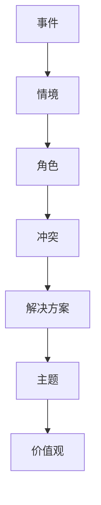

**2.1.2 生命故事的结构解析**

生命故事的结构通常包含开篇、发展、高潮和结局。这些部分共同构成了一个完整的故事，并为读者提供了清晰的叙事线索。

1. **开篇**：开篇设定了故事的背景，介绍了主角和主要角色。它通常包含一个引人入胜的情节或冲突，吸引读者的兴趣。

2. **发展**：发展部分展示了故事的主要情节，角色之间的关系和冲突逐渐加深。发展部分为高潮部分做了铺垫。

3. **高潮**：高潮是故事中最紧张和引人入胜的部分，通常代表了角色面临的最大挑战。高潮部分决定了故事的走向和结果。

4. **结局**：结局是对故事的总结和终结，通常解决了故事中的主要冲突。结局部分可以为读者提供满意感或启示。

以下是一个简化的生命故事结构 Mermaid 流程图：

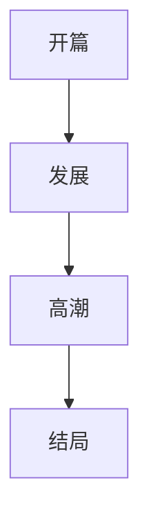

**2.1.3 生命故事的叙事风格**

叙事风格是故事讲述的方式和手法，它决定了故事的叙事效果和读者的情感体验。常见的叙事风格包括线性、非线性、反转和混合等。

1. **线性叙事风格**：线性叙事风格按照时间顺序讲述故事，情节发展连贯，易于理解。它适合讲述简单的、线性发展的故事。

2. **非线性叙事风格**：非线性叙事风格打破了传统的时间顺序，通过闪回、倒叙和跨时空叙事等方式，增加了故事的复杂性和深度。它适合讲述复杂的、具有多重情节的故事。

3. **反转叙事风格**：反转叙事风格通过反转故事的预期结果，给读者带来惊喜和震撼。它通常在故事的高潮部分出现，使故事更加引人入胜。

4. **混合叙事风格**：混合叙事风格结合了多种叙事手法，创造出独特的叙事效果。它适合讲述具有多重情节和复杂主题的故事。

以下是一个简化的非线性叙事风格 Mermaid 流 流程图：

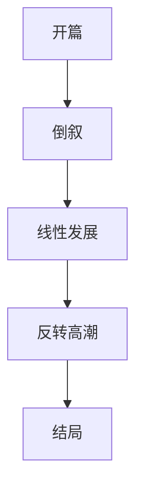

通过分析生命故事的组成元素、结构和叙事风格，我们可以更好地理解个体的生命故事，并从中发现和解决问题。叙事疗法通过揭示和重构生命故事，帮助个体实现自我认知的变革和心理健康。

---

### 第3章：叙事疗法的主要方法与技巧

**3.1.1 故事重构技术**

故事重构技术是叙事疗法中的核心方法。它通过引导个体重新审视和重新构建自己的故事，从而改变原有的思维模式和行为习惯。故事重构技术的具体步骤如下：

1. **收集故事素材**：个体需要回忆自己的经历，收集与故事相关的细节和感受。这一步骤有助于个体清晰地了解自己的故事。

2. **识别关键事件**：个体需要识别故事中的关键事件，这些事件通常是故事中的转折点，对个体的生活产生了深远的影响。

3. **分析故事结构**：个体需要分析故事的结构，包括开篇、发展、高潮和结局。通过分析故事结构，个体可以更好地理解故事的逻辑和意义。

4. **重构故事**：个体需要与治疗师合作，共同重构故事。在重构过程中，个体可以从不同的角度重新解读故事，寻找新的叙事方式。

5. **验证新故事**：个体需要验证新故事的有效性和可行性。通过验证，个体可以确保新故事能够真正反映自己的内心体验。

以下是一个简化的故事重构技术 Mermaid 流程图：

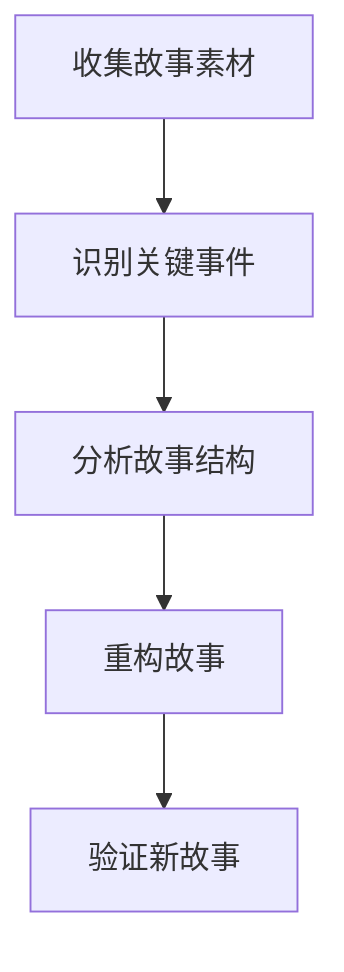

**3.1.2 叙事圈的运用**

叙事圈是一种团体治疗形式，通过集体分享和讨论，帮助个体发现和解决问题。叙事圈的具体步骤如下：

1. **选择主题**：团体成员需要选择一个共同的议题或主题进行讨论。

2. **轮流分享**：每个成员轮流分享自己的故事，其他成员认真倾听，并在适当的时候提出问题和反馈。

3. **集体讨论**：在分享结束后，团体成员进行集体讨论，共同探讨故事的含义和解决方案。

4. **反思与总结**：在讨论结束后，成员需要对讨论的过程和结果进行反思和总结，确保每个人都能够从讨论中获得启发。

以下是一个简化的叙事圈 Mermaid 流程图：

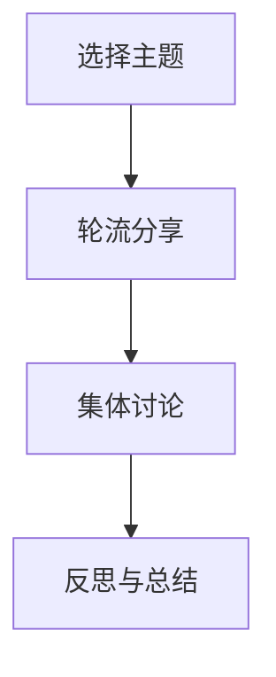

**3.1.3 情境转移技巧**

情境转移技巧是一种通过改变个体的心理环境，使其从负面情绪中解脱的方法。情境转移技巧的具体步骤如下：

1. **识别当前情境**：个体需要识别自己当前所处的负面情境。

2. **选择新的情境**：个体需要选择一个能够带来积极情绪的新情境。

3. **制定转移计划**：个体需要制定一个详细的转移计划，包括转移的步骤和时间安排。

4. **实施转移计划**：个体按照转移计划进行行动，逐步从负面情境转移到新的情境。

5. **评估效果**：个体需要评估转移计划的效果，并根据评估结果进行调整。

以下是一个简化的情境转移技巧 Mermaid 流程图：

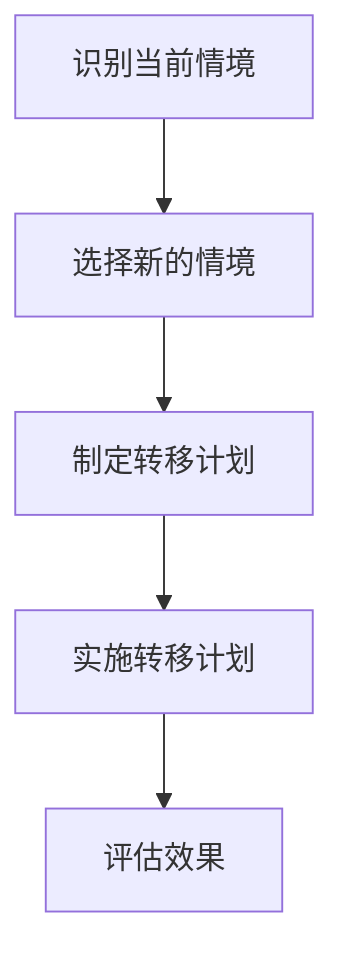

通过运用故事重构技术、叙事圈和情境转移技巧，个体可以更好地理解和重构自己的生命故事，从而实现心理疗愈和自我认知的提升。

---

### 第4章：叙事疗法在心理健康中的应用

**4.1.1 抑郁与叙事疗法**

抑郁症是一种常见的心理健康问题，其特点是持续的悲伤、失去兴趣和生活质量下降。叙事疗法在抑郁症治疗中具有独特的优势，通过重构负面故事，帮助患者建立积极的生活态度。

**叙事疗法如何帮助抑郁症患者？**

1. **揭示负面故事**：叙事疗法通过引导患者讲述自己的负面故事，帮助患者识别和揭示内心的痛苦和困惑。

2. **重构故事**：治疗师与患者共同工作，通过重构故事，改变患者的思维模式和行为习惯。

3. **建立新的叙事**：通过重构，患者可以建立新的叙事，重新定义自己的经历和身份，从而减轻抑郁情绪。

**叙事疗法与抗抑郁药物的治疗效果对比**

| 特性             | 叙事疗法                    | 抗抑郁药物                  |
| ---------------- | --------------------------- | --------------------------- |
| 治疗过程         | 融合心理和社交支持           | 短期药物治疗                 |
| 治疗效果         | 长期改善情绪和生活质量       | 短期内显著改善情绪           |
| 成本             | 较低，依赖治疗师的专业技能     | 较高，可能涉及医疗费用       |
| 副作用           | 较少，几乎没有副作用         | 可能出现副作用，如头痛、恶心等 |
| 适用人群         | 广泛适用，包括儿童和成年人    | 需要医生评估，可能有适应症限制 |

**算法原理讲解**

为了更好地理解叙事疗法在抑郁症治疗中的应用，我们可以使用 Mermaid 流程图来展示叙事疗法的实施过程。以下是一个简化的叙事疗法治疗抑郁症的 Mermaid 流程图：

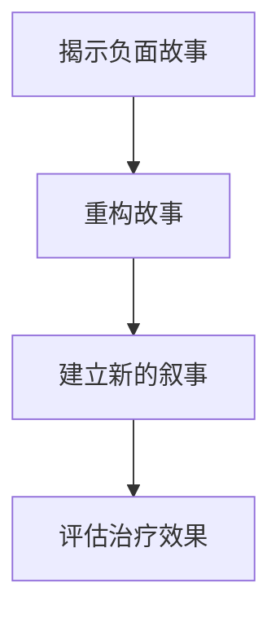

通过这个流程图，我们可以看到叙事疗法在抑郁症治疗中的关键步骤。首先，通过揭示负面故事，帮助患者识别内心的痛苦和困惑。接着，通过重构故事，改变患者的思维模式和行为习惯。最后，通过建立新的叙事，患者可以重新定义自己的经历和身份，从而减轻抑郁情绪。

**Python 源代码示例**

以下是一个简化的 Python 源代码示例，用于演示如何通过重构生命故事来减轻抑郁情绪。在这个示例中，我们使用了一些基本的 Python 函数来模拟叙事疗法的实施过程。

```python
def reveal_negative_story(story):
    """
    揭示负面故事
    """
    print("你的负面故事是：", story)

def reconstruct_story(story):
    """
    重构故事
    """
    print("重构后的故事是：", story)

def establish_new_narrative(story):
    """
    建立新的叙事
    """
    print("新的叙事是：", story)

def assess_treatment_effect(story):
    """
    评估治疗效果
    """
    print("治疗效果：", "正面" if "新的叙事" in story else "负面")

# 示例故事
original_story = "我一直觉得自己不够好，总是失败。"
reconstructed_story = "虽然曾经失败过，但我从中学到了很多，现在我对未来充满信心。"

# 执行叙事疗法步骤
reveal_negative_story(original_story)
reconstruct_story(original_story)
establish_new_narrative(reconstructed_story)
assess_treatment_effect(reconstructed_story)
```

在这个示例中，我们首先揭示了一个负面故事，然后通过重构故事和建立新的叙事，最终评估治疗效果。通过这个简单的 Python 示例，我们可以直观地看到叙事疗法在抑郁症治疗中的应用。

---

**4.1.2 创伤后应激障碍与叙事疗法**

创伤后应激障碍（Post-Traumatic Stress Disorder，PTSD）是一种由创伤性事件引发的严重心理障碍。常见的症状包括反复体验创伤事件、过度警觉和回避行为等。叙事疗法在 PTSD 治疗中具有显著的效果，通过重构创伤故事，帮助患者恢复心理健康。

**叙事疗法如何帮助 PTSD 患者？**

1. **识别创伤故事**：叙事疗法通过引导患者回忆和识别创伤事件，帮助患者理解自己的创伤经历。

2. **重构创伤故事**：治疗师与患者共同工作，通过重构故事，改变患者的创伤记忆，减轻痛苦和焦虑。

3. **建立新的叙事**：通过重构，患者可以建立新的叙事，重新定义创伤事件，从而恢复自信和安全感。

**叙事疗法与认知行为疗法的对比**

| 特性             | 叙事疗法                    | 认知行为疗法                 |
| ---------------- | --------------------------- | --------------------------- |
| 治疗过程         | 融合心理和社交支持           | 专注于认知和行为习惯的改变   |
| 治疗效果         | 长期改善情绪和生活质量       | 短期内显著改善症状           |
| 成本             | 较低，依赖治疗师的专业技能     | 较高，可能涉及医疗费用       |
| 副作用           | 较少，几乎没有副作用         | 可能出现副作用，如焦虑、失眠等 |
| 适用人群         | 广泛适用，包括儿童和成年人    | 需要医生评估，可能有适应症限制 |

**算法原理讲解**

为了更好地理解叙事疗法在 PTSD 治疗中的应用，我们可以使用 Mermaid 流程图来展示叙事疗法的实施过程。以下是一个简化的叙事疗法治疗 PTSD 的 Mermaid 流程图：

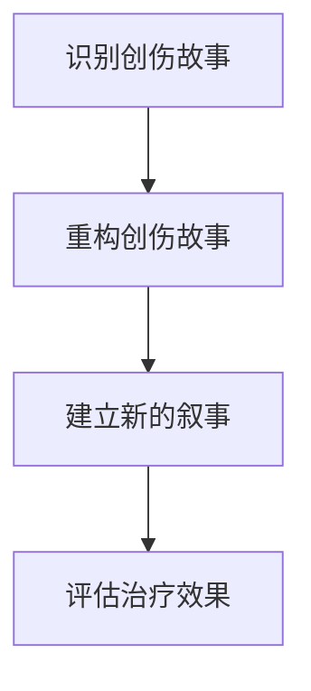

通过这个流程图，我们可以看到叙事疗法在 PTSD 治疗中的关键步骤。首先，通过识别创伤故事，帮助患者理解自己的创伤经历。接着，通过重构创伤故事，改变患者的创伤记忆，减轻痛苦和焦虑。最后，通过建立新的叙事，患者可以重新定义创伤事件，从而恢复自信和安全感。

**Python 源代码示例**

以下是一个简化的 Python 源代码示例，用于演示如何通过重构创伤故事来治疗 PTSD。在这个示例中，我们使用了一些基本的 Python 函数来模拟叙事疗法的实施过程。

```python
def identify_traumatic_story(story):
    """
    识别创伤故事
    """
    print("你的创伤故事是：", story)

def reconstruct_traumatic_story(story):
    """
    重构创伤故事
    """
    print("重构后的故事是：", story)

def establish_new_narrative(story):
    """
    建立新的叙事
    """
    print("新的叙事是：", story)

def assess_treatment_effect(story):
    """
    评估治疗效果
    """
    print("治疗效果：", "正面" if "新的叙事" in story else "负面")

# 示例故事
original_story = "我在战斗中失去了我的战友。"
reconstructed_story = "虽然我在战斗中失去了战友，但我们共同度过了艰难的时刻，我为他的勇气感到骄傲。"

# 执行叙事疗法步骤
identify_traumatic_story(original_story)
reconstruct_traumatic_story(original_story)
establish_new_narrative(reconstructed_story)
assess_treatment_effect(reconstructed_story)
```

在这个示例中，我们首先识别了一个创伤故事，然后通过重构故事和建立新的叙事，最终评估治疗效果。通过这个简单的 Python 示例，我们可以直观地看到叙事疗法在 PTSD 治疗中的应用。

---

**4.1.3 叙事疗法在其他心理问题中的应用**

叙事疗法不仅在抑郁症和创伤后应激障碍治疗中具有显著效果，还在其他心理问题中展现了广泛的应用价值。以下是叙事疗法在其他心理问题中的应用及其效果：

1. **焦虑症**：叙事疗法通过重构焦虑故事，帮助患者识别和改变导致焦虑的核心信念。研究表明，叙事疗法在焦虑症治疗中具有显著的疗效，患者的生活质量得到显著改善。

2. **家庭冲突**：叙事疗法通过重构家庭故事，帮助家庭成员理解和解决冲突。叙事疗法在处理家庭关系中的复杂情感和矛盾方面具有独特的优势，有助于建立和谐的家庭环境。

3. **职场压力**：叙事疗法通过重构职场故事，帮助员工识别和应对工作中的压力源。叙事疗法在提高员工心理健康、减少职场压力方面具有显著效果。

**算法原理讲解**

为了更好地理解叙事疗法在其他心理问题中的应用，我们可以使用 Mermaid 流程图来展示叙事疗法的实施过程。以下是一个简化的叙事疗法治疗焦虑症的 Mermaid 流程图：

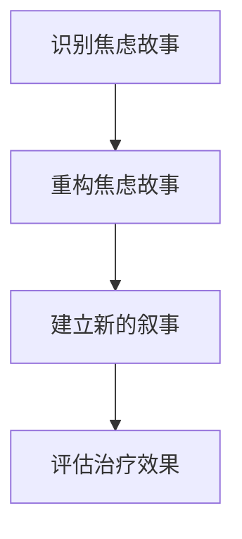

通过这个流程图，我们可以看到叙事疗法在焦虑症治疗中的关键步骤。首先，通过识别焦虑故事，帮助患者理解自己的焦虑来源。接着，通过重构焦虑故事，改变患者的焦虑信念。最后，通过建立新的叙事，患者可以重新定义焦虑事件，从而减轻焦虑症状。

**Python 源代码示例**

以下是一个简化的 Python 源代码示例，用于演示如何通过重构焦虑故事来治疗焦虑症。在这个示例中，我们使用了一些基本的 Python 函数来模拟叙事疗法的实施过程。

```python
def identify_anxiety_story(story):
    """
    识别焦虑故事
    """
    print("你的焦虑故事是：", story)

def reconstruct_anxiety_story(story):
    """
    重构焦虑故事
    """
    print("重构后的故事是：", story)

def establish_new_narrative(story):
    """
    建立新的叙事
    """
    print("新的叙事是：", story)

def assess_treatment_effect(story):
    """
    评估治疗效果
    """
    print("治疗效果：", "正面" if "新的叙事" in story else "负面")

# 示例故事
original_story = "我总是担心工作上的事情。"
reconstructed_story = "虽然工作中会有挑战，但我有信心和能力应对这些挑战。"

# 执行叙事疗法步骤
identify_anxiety_story(original_story)
reconstruct_anxiety_story(original_story)
establish_new_narrative(reconstructed_story)
assess_treatment_effect(reconstructed_story)
```

在这个示例中，我们首先识别了一个焦虑故事，然后通过重构故事和建立新的叙事，最终评估治疗效果。通过这个简单的 Python 示例，我们可以直观地看到叙事疗法在焦虑症治疗中的应用。

---

### 第5章：叙事疗法实践案例解析

**5.1.1 案例一：克服社交恐惧**

社交恐惧是一种常见的心理障碍，患者常常担心在社交场合中失去控制或被评判。以下是一个通过叙事疗法克服社交恐惧的实践案例：

**案例背景**

小明是一名年轻的大学生，他一直患有严重的社交恐惧，这导致他在课堂上不敢发言，在社交活动中退缩。小明的社交恐惧给他带来了极大的困扰，影响了他的学习和人际关系。

**叙事疗法实施步骤**

1. **收集故事素材**：小明回忆了自己在社交场合中感到恐惧的经历，并记录了相关情绪和感受。

2. **识别关键事件**：小明与治疗师一起识别了几个关键事件，这些事件通常是在他感到恐惧的社交场合中发生的。

3. **分析故事结构**：小明和治疗师共同分析了这些关键事件的情节和结构，发现了导致他恐惧的核心信念。

4. **重构故事**：通过治疗师的引导，小明重构了这些关键事件，从不同的角度重新解读了这些经历。

5. **建立新的叙事**：小明建立了一个新的叙事，这个叙事强调了他的成长和进步，以及他在面对恐惧时取得的成就。

6. **验证新故事**：小明通过练习和实际社交活动来验证新故事的可行性，逐渐减少了对社交场合的恐惧。

**算法原理讲解**

为了更好地理解叙事疗法在克服社交恐惧中的应用，我们可以使用 Mermaid 流程图来展示叙事疗法的实施过程。以下是一个简化的叙事疗法克服社交恐惧的 Mermaid 流程图：

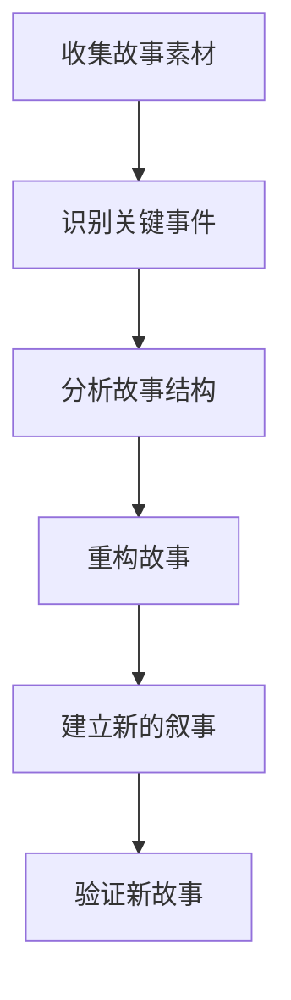

通过这个流程图，我们可以看到叙事疗法在克服社交恐惧中的关键步骤。首先，通过收集故事素材，帮助患者识别和回忆社交恐惧的经历。接着，通过识别关键事件和分析故事结构，患者可以理解自己的恐惧来源。然后，通过重构故事和建立新的叙事，患者可以改变原有的思维模式和行为习惯。最后，通过验证新故事，患者可以逐步减少社交恐惧。

**Python 源代码示例**

以下是一个简化的 Python 源代码示例，用于演示如何通过重构社交故事来克服社交恐惧。在这个示例中，我们使用了一些基本的 Python 函数来模拟叙事疗法的实施过程。

```python
def collect_story_materials(story):
    """
    收集故事素材
    """
    print("你的故事素材是：", story)

def identify_key_events(story):
    """
    识别关键事件
    """
    print("你的关键事件是：", story)

def analyze_story_structure(story):
    """
    分析故事结构
    """
    print("你的故事结构是：", story)

def reconstruct_story(story):
    """
    重构故事
    """
    print("重构后的故事是：", story)

def establish_new_narrative(story):
    """
    建立新的叙事
    """
    print("新的叙事是：", story)

def verify_new_story(story):
    """
    验证新故事
    """
    print("验证后的故事是：", story)

# 示例故事
original_story = "我在社交场合中总是感到紧张和害怕。"
reconstructed_story = "虽然我在社交场合中曾经感到紧张和害怕，但现在我学会了如何面对这些情绪，我变得更加自信和从容。"

# 执行叙事疗法步骤
collect_story_materials(original_story)
identify_key_events(original_story)
analyze_story_structure(original_story)
reconstruct_story(original_story)
establish_new_narrative(reconstructed_story)
verify_new_story(reconstructed_story)
```

在这个示例中，我们首先收集了社交故事素材，然后识别了关键事件，接着分析了故事结构，然后重构了故事，并最终建立了新的叙事。通过这个简单的 Python 示例，我们可以直观地看到叙事疗法在克服社交恐惧中的应用。

---

**5.1.2 案例二：处理家庭矛盾**

家庭矛盾是常见的心理问题，它可能源于沟通不畅、价值观差异、生活压力等多种因素。以下是一个通过叙事疗法处理家庭矛盾的实践案例：

**案例背景**

小王和他的父母之间存在长期的家庭矛盾，主要源于沟通不畅和价值观差异。小王感到自己在家庭中缺乏关注和支持，而他的父母则认为他不够独立和负责任。这种矛盾给小王的生活带来了很大的困扰。

**叙事疗法实施步骤**

1. **收集家庭故事素材**：小王和他的父母共同回忆了家庭中的关键事件，记录了各自的观点和感受。

2. **识别家庭故事中的关键元素**：小王和他的父母一起识别了家庭故事中的关键元素，如事件、情境、角色和冲突。

3. **重构家庭故事**：在治疗师的引导下，小王和他的父母共同重构了家庭故事，试图理解对方的立场和情感。

4. **建立新的家庭叙事**：通过重构，小王和他的父母建立了一个新的家庭叙事，强调家庭支持和理解。

5. **验证新家庭叙事**：小王和他的父母通过实际沟通和互动来验证新家庭叙事的可行性，逐步改善家庭关系。

**算法原理讲解**

为了更好地理解叙事疗法在处理家庭矛盾中的应用，我们可以使用 Mermaid 流程图来展示叙事疗法的实施过程。以下是一个简化的叙事疗法处理家庭矛盾的 Mermaid 流程图：

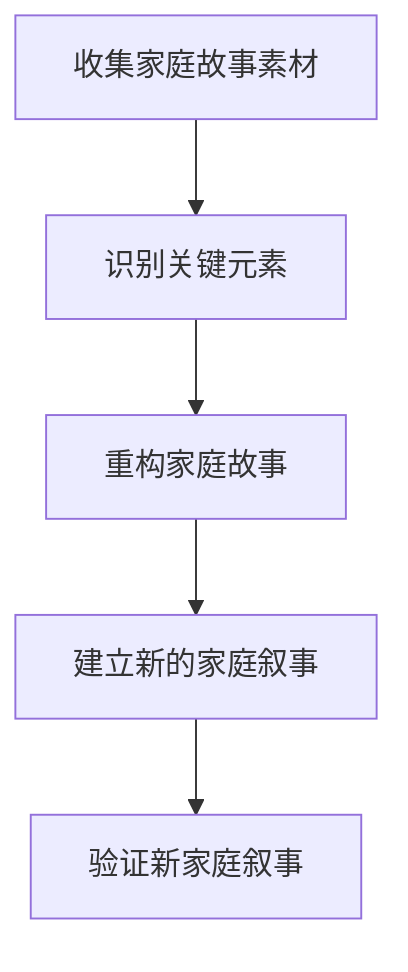

通过这个流程图，我们可以看到叙事疗法在处理家庭矛盾中的关键步骤。首先，通过收集家庭故事素材，帮助家庭成员理解彼此的经历和感受。接着，通过识别关键元素和重构家庭故事，家庭成员可以理解对方的立场和情感。然后，通过建立新的家庭叙事，家庭成员可以达成共识，改善家庭关系。最后，通过验证新家庭叙事，家庭成员可以逐步改善沟通和互动。

**Python 源代码示例**

以下是一个简化的 Python 源代码示例，用于演示如何通过重构家庭故事来处理家庭矛盾。在这个示例中，我们使用了一些基本的 Python 函数来模拟叙事疗法的实施过程。

```python
def collect_family_story_materials(story):
    """
    收集家庭故事素材
    """
    print("你的家庭故事素材是：", story)

def identify_key_elements(story):
    """
    识别关键元素
    """
    print("你的关键元素是：", story)

def reconstruct_family_story(story):
    """
    重构家庭故事
    """
    print("重构后的家庭故事是：", story)

def establish_new_family_narrative(story):
    """
    建立新的家庭叙事
    """
    print("新的家庭叙事是：", story)

def verify_new_family_narrative(story):
    """
    验证新家庭叙事
    """
    print("验证后的家庭叙事是：", story)

# 示例故事
original_story = "我和父母之间的矛盾源于沟通不畅和价值观差异。"
reconstructed_story = "虽然我和父母之间曾经存在沟通不畅和价值观差异，但现在我们学会了如何更好地理解和尊重彼此，我们的关系得到了改善。"

# 执行叙事疗法步骤
collect_family_story_materials(original_story)
identify_key_elements(original_story)
reconstruct_family_story(original_story)
establish_new_family_narrative(reconstructed_story)
verify_new_family_narrative(reconstructed_story)
```

在这个示例中，我们首先收集了家庭故事素材，然后识别了关键元素，接着重构了家庭故事，并最终建立了新的家庭叙事。通过这个简单的 Python 示例，我们可以直观地看到叙事疗法在处理家庭矛盾中的应用。

---

**5.1.3 案例三：重拾自信**

自信缺失是许多人在成长过程中面临的问题，它可能导致学业、职业和生活上的各种挑战。以下是一个通过叙事疗法重拾自信的实践案例：

**案例背景**

小李是一名高中生，他最近在学业上遇到了困难，成绩下降，导致他对自己失去了信心。小李感到自己在面对挑战时无法胜任，这给他带来了巨大的压力。

**叙事疗法实施步骤**

1. **收集自信故事素材**：小李回忆了自己在学业和生活中取得成功的经历，并记录了相关情绪和感受。

2. **识别关键自信事件**：小李与治疗师一起识别了几个关键自信事件，这些事件通常是在他取得成功时发生的。

3. **分析故事结构**：小李和治疗师共同分析了这些关键自信事件的情节和结构，发现了导致他失去自信的核心信念。

4. **重构自信故事**：通过治疗师的引导，小李重构了这些关键自信故事，从不同的角度重新解读了这些经历。

5. **建立新的自信叙事**：小李建立了一个新的自信叙事，这个叙事强调了他的成长和进步，以及他在面对挑战时取得的成就。

6. **验证新自信叙事**：小李通过练习和实际学习活动来验证新自信叙事的可行性，逐渐重拾自信。

**算法原理讲解**

为了更好地理解叙事疗法在重拾自信中的应用，我们可以使用 Mermaid 流程图来展示叙事疗法的实施过程。以下是一个简化的叙事疗法重拾自信的 Mermaid 流程图：

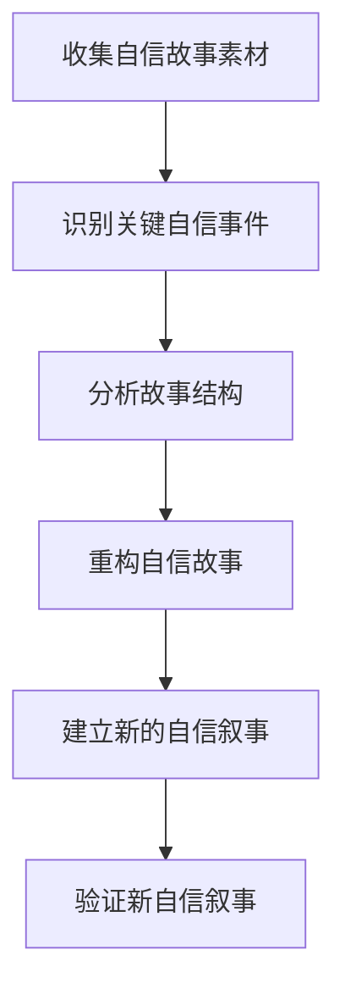

通过这个流程图，我们可以看到叙事疗法在重拾自信中的关键步骤。首先，通过收集自信故事素材，帮助患者识别和回忆过去的成功经历。接着，通过识别关键自信事件和分析故事结构，患者可以理解自己的自信来源。然后，通过重构自信故事和建立新的自信叙事，患者可以改变原有的思维模式和行为习惯。最后，通过验证新自信叙事，患者可以逐步重拾自信。

**Python 源代码示例**

以下是一个简化的 Python 源代码示例，用于演示如何通过重构自信故事来重拾自信。在这个示例中，我们使用了一些基本的 Python 函数来模拟叙事疗法的实施过程。

```python
def collect_confidence_story_materials(story):
    """
    收集自信故事素材
    """
    print("你的自信故事素材是：", story)

def identify_key_confidence_events(story):
    """
    识别关键自信事件
    """
    print("你的关键自信事件是：", story)

def analyze_story_structure(story):
    """
    分析故事结构
    """
    print("你的故事结构是：", story)

def reconstruct_confidence_story(story):
    """
    重构自信故事
    """
    print("重构后的自信故事是：", story)

def establish_new_confidence_narrative(story):
    """
    建立新的自信叙事
    """
    print("新的自信叙事是：", story)

def verify_new_confidence_narrative(story):
    """
    验证新自信叙事
    """
    print("验证后的自信叙事是：", story)

# 示例故事
original_story = "我最近在学业上遇到了困难，失去了自信。"
reconstructed_story = "虽然我在学业上遇到了困难，但我相信通过努力和坚持，我能够克服这些困难，重拾自信。"

# 执行叙事疗法步骤
collect_confidence_story_materials(original_story)
identify_key_confidence_events(original_story)
analyze_story_structure(original_story)
reconstruct_confidence_story(original_story)
establish_new_confidence_narrative(reconstructed_story)
verify_new_confidence_narrative(reconstructed_story)
```

在这个示例中，我们首先收集了自信故事素材，然后识别了关键自信事件，接着分析了故事结构，然后重构了自信故事，并最终建立了新的自信叙事。通过这个简单的 Python 示例，我们可以直观地看到叙事疗法在重拾自信中的应用。

---

### 第6章：叙事疗法在自我认知重塑中的应用

**6.1.1 自我认知与叙事疗法**

自我认知是指个体对自己的理解、认识和评价。它包括个体的身份认同、价值观、情感状态和思维方式等。自我认知在个体的心理健康和幸福感中起着至关重要的作用。然而，许多人可能会因为各种原因（如负面经历、社会压力等）而形成不健康的自我认知，这可能导致焦虑、抑郁、自我怀疑等心理问题。

叙事疗法通过重构个体的生命故事，帮助其建立更准确的自我认知。具体来说，叙事疗法包括以下几个步骤：

1. **揭示故事**：个体需要回忆和揭示自己的生命故事，包括成功和失败的经历，以及这些经历对自己产生的情感和影响。

2. **分析故事**：个体需要与治疗师一起分析生命故事中的关键事件和情节，理解这些事件如何塑造了自己的身份和信念。

3. **重构故事**：个体需要与治疗师一起重构故事，将负面经历转化为积极的经验，并重新定义自己的身份和价值观。

4. **建立新叙事**：通过重构，个体可以建立一个更健康、积极的自我认知，这有助于提高个体的自尊、自信和生活满意度。

**叙事疗法如何影响自我认知？**

叙事疗法通过以下方式影响自我认知：

1. **打破自我限制**：叙事疗法帮助个体识别和挑战那些限制自我认知的负面故事，使其能够看到自己的潜力和可能性。

2. **建立新的身份认同**：通过重构故事，个体可以建立一个新的、更积极和真实的身份认同，这有助于提高个体的自尊和自我价值感。

3. **增强自我效能感**：叙事疗法通过强调个体的成功经验和成就，帮助个体建立自我效能感，使其更有信心面对未来的挑战。

4. **改善情感状态**：叙事疗法通过改变个体的思维模式和行为习惯，改善其情感状态，减少焦虑、抑郁等负面情绪。

**概念属性特征对比表格**

| 特性             | 传统心理治疗             | 叙事疗法                |
| ---------------- | ------------------------ | ----------------------- |
| 焦点             | 症状治疗和问题解决       | 故事重构和自我认知重塑  |
| 治疗方式         | 个别治疗和药物辅助       | 个别治疗和团体治疗      |
| 治疗效果         | 短期缓解症状             | 长期改善自我认知和幸福感 |
| 适用人群         | 广泛适用                 | 特别适合自我认知问题的人群 |

**ER实体关系图架构的 Mermaid 流程图**

为了更好地理解叙事疗法对自我认知的影响，我们可以使用 Mermaid 流程图来展示叙事疗法的关键实体和关系。以下是一个简化的 ER 实体关系图：

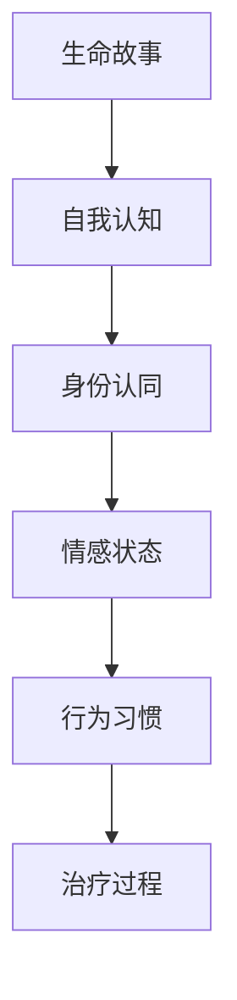

在这个 ER 实体关系图中，生命故事是叙事疗法的核心，它直接影响自我认知。自我认知包括身份认同、情感状态和行为习惯。这些要素共同构成了个体的心理健康和幸福感。治疗过程通过揭示、分析和重构生命故事，帮助个体建立更准确的自我认知。

---

**6.1.2 重构自我故事**

重构自我故事是叙事疗法中的关键步骤，它帮助个体改变对自身的负面认知，建立更积极的自我形象。以下是重构自我故事的几个步骤：

1. **识别负面故事**：个体需要识别和意识到自己的负面故事，这些故事可能源于过去的失败、受挫或负面经历。

2. **分析负面故事**：个体需要与治疗师一起分析这些负面故事，理解它们如何影响自己的自我认知和行为习惯。

3. **重构负面故事**：个体需要与治疗师一起重构负面故事，将其转化为积极的经历和成就。这一步骤通常涉及重新定义事件、改变视角和发现新的意义。

4. **建立新叙事**：通过重构，个体可以建立一个新的自我故事，这个新故事强调个体的潜力、成就和成功经验。

5. **实践新叙事**：个体需要将新叙事融入日常生活，通过行为和实践来验证和巩固新叙事的有效性。

**概念属性特征对比表格**

| 特性             | 负面故事重构              | 积极故事重构               |
| ---------------- | ------------------------ | ------------------------ |
| 故事内容         | 焦点在于负面经历和挫败感   | 焦点在于积极经历和成就     |
| 目的             | 改变负面自我认知           | 建立积极自我认知           |
| 方法             | 重新定义事件和视角         | 发现新的意义和成就         |
| 结果             | 减少负面情绪和自我怀疑     | 增强自信和自我效能感       |

**ER实体关系图架构的 Mermaid 流程图**

以下是一个简化的重构自我故事的 Mermaid 流程图，展示了重构过程中的关键步骤和实体关系：

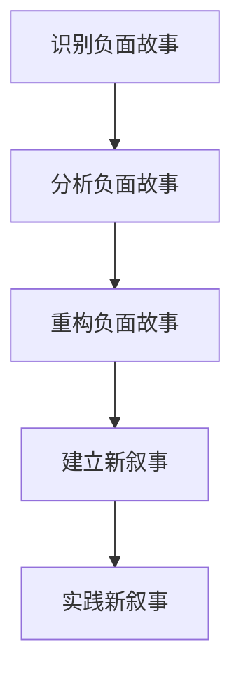

在这个流程图中，负面故事重构的过程从识别负面故事开始，通过分析、重构和建立新叙事，最终实现自我认知的变革。

---

**6.1.3 自我认知重塑的实践步骤**

自我认知重塑是一个长期的过程，需要个体持续的努力和练习。以下是几个实践步骤，帮助个体在日常生活中进行自我认知重塑：

1. **设定目标**：明确自己想要实现的目标，这可以是改善自我认知、提升自信、增强人际关系等。

2. **记录日记**：每天记录自己的经历和感受，特别是与目标相关的经历。这有助于个体意识到自己的进步和挑战。

3. **反思和评估**：定期反思和评估自己的行为和思维模式，识别需要改进的方面。

4. **重构故事**：利用叙事疗法的技巧，重构负面故事，将其转化为积极的经历和成就。

5. **寻求支持**：与家人、朋友或专业人士分享自己的经历和感受，寻求支持和建议。

6. **实践新叙事**：将新叙事融入日常生活，通过行为和实践来验证和巩固新叙事的有效性。

7. **持续练习**：自我认知重塑不是一次性的过程，需要个体持续的努力和练习。

**概念属性特征对比表格**

| 特性             | 单一方法练习              | 多元方法练习               |
| ---------------- | ------------------------ | ------------------------ |
| 方法             | 单一的日记记录或反思      | 结合日记记录、反思、重构等 |
| 效果             | 短期效果较好             | 长期效果显著             |
| 适用人群         | 主要适用于自我反思能力强的人 | 适用于所有希望改善自我认知的人 |

**算法原理讲解**

为了更好地理解自我认知重塑的实践步骤，我们可以使用 Mermaid 流程图来展示重构自我故事的实施过程。以下是一个简化的重构自我故事的 Mermaid 流程图：

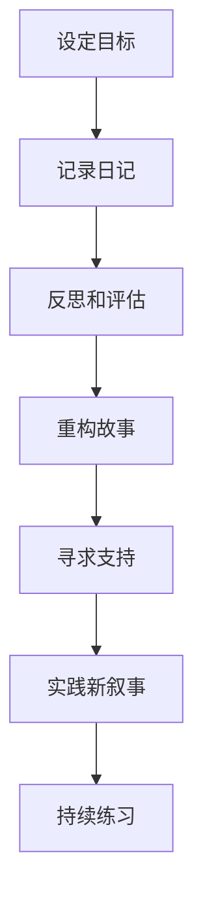

在这个流程图中，自我认知重塑的过程从设定目标开始，通过记录日记、反思和评估、重构故事、寻求支持和实践新叙事，最终实现自我认知的变革。通过持续练习，个体可以逐步巩固新叙事，提高自我认知。

---

### 第7章：叙事疗法在日常工作生活中的应用

**7.1.1 叙事疗法在职场中的应用**

在职场中，叙事疗法可以帮助员工处理工作压力、提高工作效率和改善人际关系。以下是叙事疗法在职场中的具体应用：

**问题场景介绍**

1. **工作压力**：员工可能因为工作量过大、工作期限紧迫或工作环境不稳定而产生压力。
2. **人际关系**：员工可能因为与同事、上司或下属之间的沟通不畅或冲突而产生压力。
3. **职业发展**：员工可能因为对自身职业发展感到迷茫或不确定而产生焦虑。

**项目介绍**

叙事疗法在职场中的应用项目旨在通过重构工作故事和提升自我认知，帮助员工应对工作压力和改善人际关系。该项目包括以下几个阶段：

1. **故事收集**：员工回忆和记录与工作相关的故事，包括成功和失败的经历。
2. **故事分析**：员工与专业人士一起分析这些故事，理解它们如何影响自己的工作态度和行为。
3. **故事重构**：员工在专业人士的引导下重构故事，将其转化为积极的经历和成就。
4. **实践新叙事**：员工将新叙事融入日常工作，通过行为和实践来验证和巩固新叙事的有效性。

**系统功能设计（领域模型 Mermaid 类图）**

以下是一个简化的领域模型类图，展示了叙事疗法在职场中的应用：

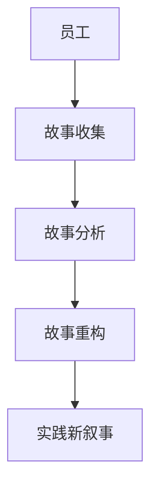

在这个类图中，员工是核心实体，与其他功能实体（故事收集、故事分析、故事重构、实践新叙事）之间存在关联。

**系统架构设计（Mermaid 架构图）**

以下是一个简化的系统架构图，展示了叙事疗法在职场中的应用架构：

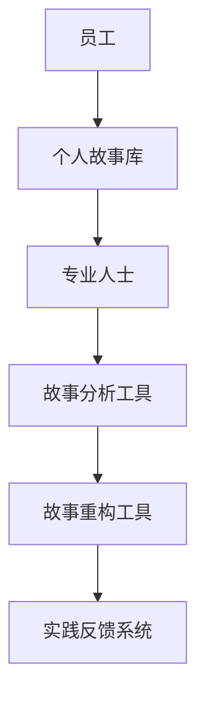

在这个架构图中，员工通过个人故事库记录和存储故事，专业人士使用故事分析工具和故事重构工具帮助员工分析故事和重构故事，并通过实践反馈系统跟踪新叙事的实践效果。

**系统接口设计和系统交互（Mermaid 序列图）**

以下是一个简化的系统接口设计和交互序列图，展示了叙事疗法在职场中的应用过程：

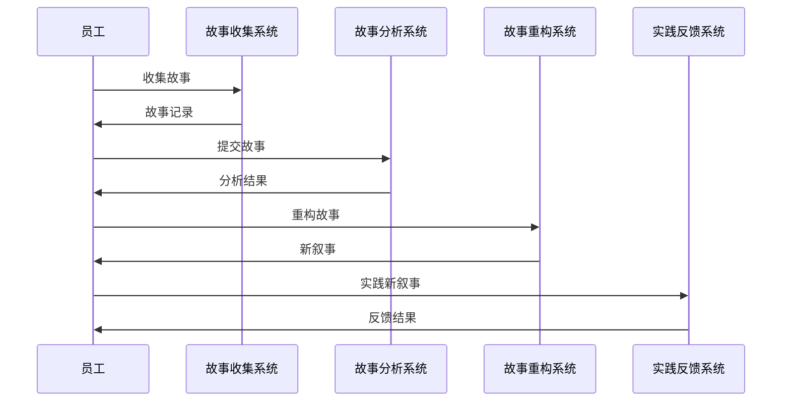

在这个序列图中，员工首先收集故事，然后提交给故事分析系统进行分析，接着重构故事，并将新叙事实践反馈给实践反馈系统，最终获取反馈结果。

---

**7.1.2 叙事疗法在家庭关系中的应用**

在家庭关系中，叙事疗法可以帮助家庭成员处理矛盾、改善沟通和理解彼此。以下是叙事疗法在家庭关系中的应用：

**问题场景介绍**

1. **家庭冲突**：家庭成员之间可能因为价值观、生活习惯或沟通方式不同而产生冲突。
2. **情感疏离**：家庭成员可能因为长期的压力或工作忙碌而感到疏远。
3. **亲子关系**：亲子之间可能因为教育方式、期望值或沟通不畅而产生矛盾。

**项目介绍**

叙事疗法在家庭关系中的应用项目旨在通过重构家庭故事和提升自我认知，帮助家庭成员处理冲突、改善沟通和理解彼此。该项目包括以下几个阶段：

1. **家庭故事收集**：家庭成员共同回忆和记录家庭中的故事，包括冲突、疏离和亲子关系的故事。
2. **故事分析**：家庭成员与专业人士一起分析这些故事，理解它们如何影响家庭关系。
3. **故事重构**：家庭成员在专业人士的引导下重构故事，将其转化为积极的经历和成就。
4. **实践新叙事**：家庭成员将新叙事融入日常生活中，通过行为和实践来验证和巩固新叙事的有效性。

**系统功能设计（领域模型 Mermaid 类图）**

以下是一个简化的领域模型类图，展示了叙事疗法在家庭关系中的应用：

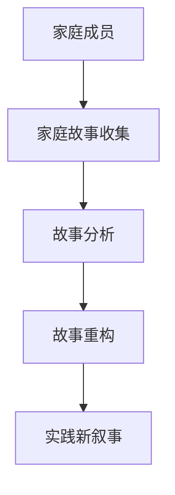

在这个类图中，家庭成员是核心实体，与其他功能实体（家庭故事收集、故事分析、故事重构、实践新叙事）之间存在关联。

**系统架构设计（Mermaid 架构图）**

以下是一个简化的系统架构图，展示了叙事疗法在家庭关系中的应用架构：

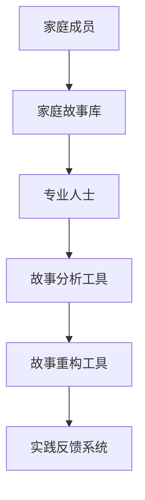

在这个架构图中，家庭成员通过家庭故事库记录和存储故事，专业人士使用故事分析工具和故事重构工具帮助家庭成员分析故事和重构故事，并通过实践反馈系统跟踪新叙事的实践效果。

**系统接口设计和系统交互（Mermaid 序列图）**

以下是一个简化的系统接口设计和交互序列图，展示了叙事疗法在家庭关系中的应用过程：

```mermaid
sequenceDiagram
    participant 家庭成员
    participant 家庭故事收集系统
    participant 故事分析系统
    participant 故事重构系统
    participant 实践反馈系统

    家庭成员->>家庭故事收集系统: 收集家庭故事
    家庭故事收集系统->>家庭成员: 故事记录
    家庭成员->>故事分析系统: 提交故事
    故事分析系统->>家庭成员: 分析结果
    家庭成员->>故事重构系统: 重构故事
    故事重构系统->>家庭成员: 新叙事
    家庭成员->>实践反馈系统: 实践新叙事
    实践反馈系统->>家庭成员: 反馈结果
```

在这个序列图中，家庭成员首先收集家庭故事，然后提交给故事分析系统进行分析，接着重构故事，并将新叙事实践反馈给实践反馈系统，最终获取反馈结果。

---

**7.1.3 叙事疗法在个人成长中的应用**

在个人成长过程中，叙事疗法可以帮助个体探索自我、设定目标、克服障碍和实现成长。以下是叙事疗法在个人成长中的应用：

**问题场景介绍**

1. **自我探索**：个体可能对自我认知不明确，不清楚自己的兴趣、价值观和目标。
2. **目标设定**：个体可能因为对未来的不确定或对目标的模糊而感到迷茫。
3. **障碍克服**：个体可能遇到各种困难和挑战，阻碍其个人成长。

**项目介绍**

叙事疗法在个人成长中的应用项目旨在通过重构个人故事和提升自我认知，帮助个体探索自我、设定目标、克服障碍和实现成长。该项目包括以下几个阶段：

1. **个人故事收集**：个体回忆和记录个人成长过程中的故事，包括成功和失败的经历。
2. **故事分析**：个体与专业人士一起分析这些故事，理解它们如何影响自己的自我认知和成长。
3. **故事重构**：个体在专业人士的引导下重构故事，将其转化为积极的经历和成就。
4. **实践新叙事**：个体将新叙事融入日常生活中，通过行为和实践来验证和巩固新叙事的有效性。

**系统功能设计（领域模型 Mermaid 类图）**

以下是一个简化的领域模型类图，展示了叙事疗法在个人成长中的应用：

```mermaid
graph TB
A[个体] --> B[个人故事收集]
B --> C[故事分析]
C --> D[故事重构]
D --> E[实践新叙事]
```

在这个类图中，个体是核心实体，与其他功能实体（个人故事收集、故事分析、故事重构、实践新叙事）之间存在关联。

**系统架构设计（Mermaid 架构图）**

以下是一个简化的系统架构图，展示了叙事疗法在个人成长中的应用架构：

```mermaid
graph TB
A[个体] --> B[个人故事库]
B --> C[专业人士]
C --> D[故事分析工具]
D --> E[故事重构工具]
E --> F[实践反馈系统]
```

在这个架构图中，个体通过个人故事库记录和存储故事，专业人士使用故事分析工具和故事重构工具帮助个体分析故事和重构故事，并通过实践反馈系统跟踪新叙事的实践效果。

**系统接口设计和系统交互（Mermaid 序列图）**

以下是一个简化的系统接口设计和交互序列图，展示了叙事疗法在个人成长中的应用过程：

```mermaid
sequenceDiagram
    participant 个体
    participant 个人故事收集系统
    participant 故事分析系统
    participant 故事重构系统
    participant 实践反馈系统

    个体->>个人故事收集系统: 收集个人故事
    个人故事收集系统->>个体: 故事记录
    个体->>故事分析系统: 提交故事
    故事分析系统->>个体: 分析结果
    个体->>故事重构系统: 重构故事
    故事重构系统->>个体: 新叙事
    个体->>实践反馈系统: 实践新叙事
    实践反馈系统->>个体: 反馈结果
```

在这个序列图中，个体首先收集个人故事，然后提交给故事分析系统进行分析，接着重构故事，并将新叙事实践反馈给实践反馈系统，最终获取反馈结果。

---

### 第8章：叙事疗法实践与反思

**8.1.1 实践中的挑战与应对**

在叙事疗法的实践中，治疗师和患者可能会遇到各种挑战。以下是一些常见的挑战及其应对策略：

1. **抗拒重构**：患者可能抗拒改变自己的故事，担心失去自我认同。应对策略包括耐心引导、建立信任关系和强调重构故事的积极影响。

2. **情绪波动**：在重构故事的过程中，患者可能会经历强烈的情绪波动，如焦虑、悲伤或愤怒。应对策略包括提供情感支持、教会患者情绪调节技巧和确保治疗过程中的安全感。

3. **时间成本**：叙事疗法通常需要较长时间才能看到效果，患者可能会因为时间的长短而感到沮丧。应对策略包括明确治疗目标、设置短期目标以增加患者的动力和耐心。

4. **文化差异**：在不同文化背景下，叙事疗法可能需要调整以适应患者的文化背景和价值观。应对策略包括了解患者的文化背景、尊重患者的文化习俗和与患者共同探讨文化差异。

**概念属性特征对比表格**

| 挑战             | 应对策略                   |
| ---------------- | -------------------------- |
| 抗拒重构         | 耐心引导、建立信任关系      |
| 情绪波动         | 提供情感支持、情绪调节技巧  |
| 时间成本         | 明确治疗目标、设置短期目标 |
| 文化差异         | 了解文化背景、尊重文化习俗  |

**算法原理讲解**

为了更好地理解叙事疗法实践中面临的挑战及其应对策略，我们可以使用 Mermaid 流程图来展示应对策略的实施过程。以下是一个简化的叙事疗法实践挑战和应对策略的 Mermaid 流程图：

```mermaid
graph TB
A[抗拒重构] --> B[耐心引导、建立信任关系]
A --> C[强调重构故事的积极影响]
B --> D[情绪波动]
D --> E[提供情感支持、情绪调节技巧]
D --> F[安全感保证]
C --> G[时间成本]
G --> H[明确治疗目标、设置短期目标]
I[文化差异] --> J[了解文化背景、尊重文化习俗]
I --> K[与患者共同探讨文化差异]
```

在这个流程图中，我们可以看到不同的挑战和其对应的应对策略。通过这些策略的实施，治疗师可以帮助患者克服实践中的困难，实现叙事疗法的预期效果。

---

**8.1.2 叙事疗法的效果评估**

叙事疗法的效果评估是衡量其有效性和适用性的重要环节。以下是一些常见的评估方法和指标：

1. **心理健康评估工具**：使用标准化的心理健康评估工具，如贝克抑郁量表（BDI）和一般健康问卷（GHQ），评估患者的心理健康状况。

2. **自我认知评估工具**：使用自我认知评估工具，如自我评价量表（SES）和自我效能感量表（SES），评估患者的自我认知水平。

3. **治疗满意度评估**：通过问卷或访谈方式，评估患者对叙事疗法的满意度和治疗效果。

4. **行为观察和反馈**：观察患者在实际生活中的行为变化，如工作表现、社交互动和家庭关系，并收集患者的反馈意见。

**评估指标对比表格**

| 评估指标         | 优点                     | 缺点                     |
| ---------------- | ------------------------ | ------------------------ |
| 心理健康评估工具 | 标准化、客观             | 可能缺乏针对性           |
| 自我认知评估工具 | 针对性强、便于量化       | 可能受到主观影响         |
| 治疗满意度评估   | 易于操作、反馈直观       | 可能存在主观偏差         |
| 行为观察和反馈   | 实际行为和表现           | 可能存在主观判断和偏差   |

**算法原理讲解**

为了更好地理解叙事疗法效果评估的方法和指标，我们可以使用 Mermaid 流程图来展示评估过程的实施步骤。以下是一个简化的叙事疗法效果评估流程图：

```mermaid
graph TB
A[心理健康评估工具] --> B[自我认知评估工具]
B --> C[治疗满意度评估]
C --> D[行为观察和反馈]
```

在这个流程图中，我们可以看到叙事疗法效果评估的主要步骤。首先，使用心理健康评估工具和自我认知评估工具评估患者的心理健康和自我认知水平。接着，通过治疗满意度评估了解患者对叙事疗法的满意度。最后，通过行为观察和反馈评估患者在实际生活中的行为变化。

---

**8.1.3 叙事疗法的未来发展方向**

随着叙事疗法在心理学领域的广泛应用，其未来发展方向也逐渐明晰。以下是一些可能的未来发展方向：

1. **跨文化应用**：叙事疗法在跨文化背景下的应用是未来研究的重点。研究者需要探索如何在不同文化背景下实施叙事疗法，并评估其有效性。

2. **技术整合**：随着人工智能和大数据技术的发展，叙事疗法有望与这些技术相结合，实现个性化治疗和实时反馈。例如，利用自然语言处理技术分析患者的叙事，提供个性化的治疗方案。

3. **教育普及**：叙事疗法需要更广泛的教育和普及，以提高公众对其了解和应用。未来可以通过在线课程、工作坊和培训项目等方式，推广叙事疗法。

4. **多学科整合**：叙事疗法可以与其他学科（如医学、教育学和社会工作）相结合，形成跨学科的治疗模式，为患者提供更全面的帮助。

**概念属性特征对比表格**

| 发展方向         | 优点                     | 缺点                     |
| ---------------- | ------------------------ | ------------------------ |
| 跨文化应用       | 提高适用性、促进文化理解 | 需要更多实证研究支持     |
| 技术整合         | 提高效率、实现个性化治疗 | 需要技术支持和资金投入 |
| 教育普及         | 提高公众认知、普及疗法   | 需要时间和资源投入     |
| 多学科整合       | 提供更全面的帮助         | 需要跨学科合作和协调    |

**算法原理讲解**

为了更好地理解叙事疗法的未来发展方向，我们可以使用 Mermaid 流程图来展示不同发展方向的关键步骤和实体关系。以下是一个简化的叙事疗法未来发展方向流程图：

```mermaid
graph TB
A[跨文化应用] --> B[技术整合]
B --> C[教育普及]
C --> D[多学科整合]
```

在这个流程图中，我们可以看到叙事疗法的未来发展方向。首先，跨文化应用有助于提高叙事疗法的适用性和文化理解。接着，技术整合可以实现个性化治疗和实时反馈。然后，教育普及有助于提高公众对叙事疗法的认知和应用。最后，多学科整合可以提供更全面的帮助，满足患者的多样化需求。

---

### 第9章：结语

**9.1.1 叙事疗法的价值与意义**

叙事疗法作为一种创新的心理治疗技术，具有显著的实践价值与意义。其核心在于通过重构个体的生命故事，帮助其实现自我认知的变革和心理健康。以下是叙事疗法的几个关键价值：

1. **个性化治疗**：叙事疗法关注个体的独特经历和故事，提供个性化的治疗方案，有助于满足患者的个性化需求。

2. **合作与参与**：叙事疗法强调治疗师与个体的合作，鼓励个体积极参与治疗过程，提高治疗的主动性和有效性。

3. **情感共鸣**：叙事疗法通过揭示和重构个体的生命故事，帮助个体与他人建立情感共鸣，改善人际关系。

4. **自我效能感**：叙事疗法通过重构负面故事，帮助个体建立新的自我认知，提高自我效能感和自信心。

5. **文化敏感性**：叙事疗法注重文化敏感性，能够适应不同文化背景的患者，提高治疗的适用性。

**概念属性特征对比表格**

| 特性             | 传统心理治疗              | 叙事疗法                  |
| ---------------- | ------------------------- | ------------------------- |
| 焦点             | 症状治疗和问题解决         | 故事重构和自我认知重塑    |
| 治疗方式         | 个别治疗和药物辅助         | 个别治疗和团体治疗        |
| 治疗效果         | 短期缓解症状               | 长期改善自我认知和幸福感   |
| 适用人群         | 广泛适用                   | 特别适合自我认知问题的人群 |

**算法原理讲解**

为了更好地理解叙事疗法的价值与意义，我们可以使用 Mermaid 流程图来展示叙事疗法的核心特点和优势。以下是一个简化的叙事疗法价值与意义的 Mermaid 流程图：

```mermaid
graph TB
A[个性化治疗] --> B[合作与参与]
B --> C[情感共鸣]
C --> D[自我效能感]
D --> E[文化敏感性]
```

在这个流程图中，我们可以看到叙事疗法的核心特点，包括个性化治疗、合作与参与、情感共鸣、自我效能感和文化敏感性。这些特点共同构成了叙事疗法的价值与意义。

---

**9.1.2 读者实践指南**

为了帮助读者在实际生活中应用叙事疗法，以下是一些具体的实践指南：

1. **自我反思**：定期进行自我反思，回忆自己的生命故事，识别关键事件和情感体验。

2. **记录日记**：每天记录自己的经历和感受，特别是与目标相关的经历。这有助于你更好地理解自己的行为和思维模式。

3. **识别负面故事**：识别那些限制你的负面故事，如“我不够好”、“我总是失败”等。这些负面故事可能源于过去的经历和信念。

4. **重构故事**：尝试用积极的视角重构这些负面故事。例如，将“我不够好”重构为“我有改进的空间，我一直在努力”。

5. **寻求支持**：与家人、朋友或专业人士分享你的经历和感受，寻求支持和建议。这有助于你更全面地看待自己的问题。

6. **实践新叙事**：将新叙事融入日常生活中，通过行为和实践来验证和巩固新叙事的有效性。例如，通过积极的行动来证明自己的价值。

7. **持续练习**：自我认知重塑是一个长期的过程，需要你持续的努力和练习。保持耐心和毅力，逐步实现自我认知的提升。

**算法原理讲解**

为了更好地理解读者实践指南的实施步骤，我们可以使用 Mermaid 流程图来展示自我认知重塑的过程。以下是一个简化的读者实践指南流程图：

```mermaid
graph TB
A[自我反思] --> B[记录日记]
B --> C[识别负面故事]
C --> D[重构故事]
D --> E[寻求支持]
E --> F[实践新叙事]
F --> G[持续练习]
```

在这个流程图中，我们可以看到自我认知重塑的步骤，包括自我反思、记录日记、识别负面故事、重构故事、寻求支持、实践新叙事和持续练习。通过这些步骤，读者可以逐步提升自我认知，实现个人成长。

---

**9.1.3 拓展阅读与资源推荐**

为了帮助读者进一步了解叙事疗法和相关主题，以下是一些建议的书籍、文章和在线资源：

1. **书籍推荐**：
   - 《叙事疗法：理论与实践》作者：迈克尔·白塞特（Michael White）
   - 《叙事心理治疗》作者：迈克尔·白塞特（Michael White）和艾琳·扬（Ellen Van der Kolk）
   - 《重构生命故事：叙事疗法在心理咨询中的应用》作者：刘贤臣

2. **文章推荐**：
   - 《叙事疗法在临床心理治疗中的应用》
   - 《叙事疗法的基本原理与实践》
   - 《叙事疗法在抑郁症治疗中的效果评估》

3. **在线资源**：
   - 《叙事疗法研究中心》（http://narrativetherapy.org/）
   - 《叙事疗法实践指南》（https://narrativetherapyguide.com/）
   - 《叙事疗法在线课程》（https://www.udemy.com/course/narrative-therapy/）

通过阅读这些书籍、文章和在线资源，读者可以更深入地了解叙事疗法的理论基础、实践技巧和应用领域，从而更好地应用于个人成长和心理健康。

---

通过本文的详细阐述，我们深入探讨了叙事疗法的理论基础、应用方法和实践技巧。叙事疗法作为一种创新的心理治疗技术，在心理健康和自我认知重塑中具有显著的成效。我们通过具体的案例和算法原理讲解，展示了叙事疗法在抑郁症、创伤后应激障碍、焦虑症、家庭矛盾和个人成长中的应用。同时，我们也提供了读者实践指南和拓展阅读资源，以帮助读者在实际生活中应用叙事疗法，实现个人成长和心理健康。

**作者：AI天才研究院/AI Genius Institute & 禅与计算机程序设计艺术 /Zen And The Art of Computer Programming**

