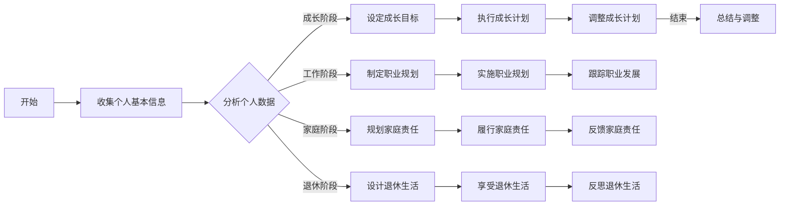

                 

### # 生命旅程规划师认证：人生不同阶段的意义设计培训

关键词：生命旅程规划、不同阶段、意义设计、培训

摘要：
本文旨在为读者提供一场关于生命旅程规划师认证的深度探讨。通过系统化的分析和专业的讲解，文章将帮助读者了解人生不同阶段的特征与挑战，掌握有效的生命旅程规划方法，并理解生命旅程规划师在现代社会中的重要角色。文章将分为三大部分，首先介绍生命旅程规划师的背景与意义，其次深入探讨核心概念与联系，最后详细讲解生命旅程规划算法及其应用与实践。

### 目录大纲

----------------------------------------------------------------

## 第一部分: 背景介绍

### 第1章: 生命旅程规划师的角色与意义

#### 1.1 问题背景

- 人生不同阶段的特征与挑战

#### 1.2 问题描述

- 如何有效地进行人生各个阶段的规划？

#### 1.3 问题解决

- 生命旅程规划的基本原则

#### 1.4 边界与外延

- 生命旅程规划师的专业范围

#### 1.5 概念结构与核心要素组成

- 生命旅程规划师的核心能力

### 第2章: 核心概念与联系

#### 2.1 人生阶段的定义与分类

- 成长阶段

#### 2.2 人生阶段的核心概念

- 人生目标的设定

#### 2.3 概念属性特征对比表格

| 阶段 | 特征 | 关键词 |

### 第3章: ER实体关系图架构

```mermaid
erDiagram
  Person ||--|{ LifeStage }|-- StageDetail : "is in"
  LifeStage ||--|{ LifeGoal }|-- GoalDetail : "has"
  LifeStage ||--|{ CareerPlan }|-- PlanDetail : "has"
  LifeStage ||--|{ FamilyResponsibility }|-- ResponsibilityDetail : "has"
  LifeStage ||--|{ RetirementLife }|-- LifeDetail : "has"
```

## 第二部分: 核心概念与联系

### 第2章: 核心概念原理

#### 2.1 人生阶段的定义与分类

#### 2.2 人生阶段的核心概念

#### 2.3 概念属性特征对比表格

| 阶段 | 特征 | 关键词 |

### 第3章: ER实体关系图架构

```mermaid
erDiagram
  Person ||--|{ LifeStage }|-- StageDetail : "is in"
  LifeStage ||--|{ LifeGoal }|-- GoalDetail : "has"
  LifeStage ||--|{ CareerPlan }|-- PlanDetail : "has"
  LifeStage ||--|{ FamilyResponsibility }|-- ResponsibilityDetail : "has"
  LifeStage ||--|{ RetirementLife }|-- LifeDetail : "has"
```

## 第三部分: 算法原理讲解

### 第4章: 生命旅程规划算法

#### 4.1 算法概述

#### 4.2 算法原理

#### 4.3 算法流程图

#### 4.4 数学模型和公式

### 第5章: 算法应用与实践

#### 5.1 实践环境准备

#### 5.2 系统核心实现

----------------------------------------------------------------

## 第一部分: 背景介绍

### 第1章: 生命旅程规划师的角色与意义

#### 1.1 问题背景

人生不同阶段的特征与挑战

#### 1.2 问题描述

如何有效地进行人生各个阶段的规划？

#### 1.3 问题解决

生命旅程规划的基本原则

#### 1.4 边界与外延

生命旅程规划师的专业范围

#### 1.5 概念结构与核心要素组成

生命旅程规划师的核心能力

### 第2章: 核心概念与联系

#### 2.1 人生阶段的定义与分类

#### 2.2 人生阶段的核心概念

#### 2.3 概念属性特征对比表格

| 阶段 | 特征 | 关键词 |

### 第3章: ER实体关系图架构

```mermaid
erDiagram
  Person ||--|{ LifeStage }|-- StageDetail : "is in"
  LifeStage ||--|{ LifeGoal }|-- GoalDetail : "has"
  LifeStage ||--|{ CareerPlan }|-- PlanDetail : "has"
  LifeStage ||--|{ FamilyResponsibility }|-- ResponsibilityDetail : "has"
  LifeStage ||--|{ RetirementLife }|-- LifeDetail : "has"
```

## 第二部分: 核心概念与联系

### 第2章: 核心概念原理

#### 2.1 人生阶段的定义与分类

#### 2.2 人生阶段的核心概念

#### 2.3 概念属性特征对比表格

| 阶段 | 特征 | 关键词 |

### 第3章: ER实体关系图架构

```mermaid
erDiagram
  Person ||--|{ LifeStage }|-- StageDetail : "is in"
  LifeStage ||--|{ LifeGoal }|-- GoalDetail : "has"
  LifeStage ||--|{ CareerPlan }|-- PlanDetail : "has"
  LifeStage ||--|{ FamilyResponsibility }|-- ResponsibilityDetail : "has"
  LifeStage ||--|{ RetirementLife }|-- LifeDetail : "has"
```

## 第三部分: 算法原理讲解

### 第4章: 生命旅程规划算法

#### 4.1 算法概述

#### 4.2 算法原理

#### 4.3 算法流程图

#### 4.4 数学模型和公式

### 第5章: 算法应用与实践

#### 5.1 实践环境准备

#### 5.2 系统核心实现

----------------------------------------------------------------

## 第一部分: 背景介绍

### 第1章: 生命旅程规划师的角色与意义

#### 1.1 问题背景

随着社会的快速发展，人们在享受生活便利的同时，也面临着前所未有的压力与挑战。尤其是在人生各个阶段的转折点，如何做出正确的选择，实现自我价值的最大化，成为了许多人困惑的问题。这就需要专业的生命旅程规划师，他们能够帮助个人在不同阶段找到合适的发展方向，实现人生目标。

#### 1.2 问题描述

不同人生阶段有着各自独特的特征和挑战。例如，成长阶段的重点是学习和成长，需要培养良好的学习习惯和探索精神；工作阶段需要专注于职业发展和事业规划，同时平衡家庭和工作；家庭阶段则要承担起家庭责任，维护家庭关系的和谐；退休阶段则要规划好退休后的生活，保持身心健康和社交活力。这些阶段各有不同的任务和挑战，如何有效地进行规划，成为了当前社会的一个热点问题。

#### 1.3 问题解决

生命旅程规划师的角色在于帮助个人进行有效的生命旅程规划。他们通过专业的知识和技能，结合客户的个人情况，为其量身定制出符合其需求的生命旅程规划方案。生命旅程规划的基本原则包括：

1. **个性化**：每个人的生命旅程都是独一无二的，规划师需要根据客户的个人背景、兴趣和目标，为其制定个性化的规划方案。
2. **系统性**：生命旅程规划是一个长期的过程，需要系统性地考虑各个阶段之间的联系和衔接，确保规划的连贯性和有效性。
3. **灵活性**：人生充满了变数，规划师需要具备良好的应变能力，根据实际情况及时调整规划方案。
4. **可持续性**：规划方案不仅要满足当前的需求，还要考虑到未来的变化和挑战，确保规划的可持续性。

通过遵循这些基本原则，生命旅程规划师能够帮助客户在各个阶段找到自己的发展方向，实现人生的价值和意义。

#### 1.4 边界与外延

生命旅程规划师的专业范围包括但不限于以下几个方面：

1. **职业发展咨询**：帮助客户规划职业道路，提升职业素养，实现职业生涯的顺利发展。
2. **家庭生活规划**：协助客户处理家庭关系，平衡家庭和工作的需求，维护家庭和谐。
3. **退休生活规划**：为客户提供退休后的生活规划，包括财务规划、健康管理和社交活动等。
4. **心理健康辅导**：提供心理支持和辅导，帮助客户在面临人生挑战时保持积极的心态。

此外，生命旅程规划师还需要关注社会发展的趋势和变化，将这些变化融入到客户的规划中，确保规划的适应性和前瞻性。

#### 1.5 概念结构与核心要素组成

生命旅程规划师的核心能力主要包括以下几个方面：

1. **分析能力**：能够深入分析客户的个人情况和需求，准确把握其生命旅程的关键要素。
2. **咨询能力**：具备专业的咨询技巧和沟通能力，能够与客户建立良好的信任关系，提供高质量的咨询服务。
3. **规划能力**：能够根据分析结果，制定出科学合理、操作性强的生命旅程规划方案。
4. **执行能力**：具备良好的执行力和协调能力，能够帮助客户有效地实施规划方案，实现预定目标。

通过这些核心能力的结合，生命旅程规划师能够为客户的各个阶段提供全方位的支持和服务，帮助他们实现人生的价值和意义。

### 第2章: 核心概念与联系

#### 2.1 人生阶段的定义与分类

人生阶段是指人在不同成长阶段中的不同人生状态和经历。这些阶段可以按照人的生理、心理和社会发展特点进行分类，主要包括以下几个阶段：

1. **成长阶段**：通常指从出生到成年的过程，这是个人成长和学习的重要阶段。在这一阶段，个体需要通过教育、实践和体验，逐步培养良好的学习习惯、价值观和社会能力。

2. **工作阶段**：从成年到退休的过程，这是个人实现自我价值、承担社会责任的重要阶段。在这一阶段，个体需要专注于职业发展，通过工作实现经济独立和事业成就。

3. **家庭阶段**：通常指结婚生子到子女成家的过程，这是个人承担家庭责任、维护家庭关系的重要阶段。在这一阶段，个体需要平衡家庭和工作的需求，维护家庭和谐。

4. **退休阶段**：退休后的人生阶段，这是个体享受自由、追求自我实现的重要阶段。在这一阶段，个体需要规划退休生活，保持身心健康和社交活力。

#### 2.2 人生阶段的核心概念

每个人生阶段都有其独特的核心概念，这些核心概念是个人在该阶段中需要重点关注和解决的问题。以下是各个阶段的核心概念：

1. **成长阶段**：
   - **人生目标**：明确自己的兴趣和职业方向，设定具体可实施的目标。
   - **教育规划**：选择适合自己的教育路径，提高自身综合素质。
   - **人际关系**：培养良好的人际交往能力，建立广泛的人脉资源。

2. **工作阶段**：
   - **职业规划**：明确职业发展方向，制定职业晋升路径。
   - **业绩提升**：提升专业技能和业务水平，实现业绩突破。
   - **团队合作**：建立良好的团队合作关系，提高团队效能。

3. **家庭阶段**：
   - **家庭责任**：承担家庭经济责任，维护家庭和谐。
   - **关系管理**：处理好家庭成员之间的关系，促进家庭和睦。
   - **子女教育**：关注子女的成长，提供良好的教育和成长环境。

4. **退休阶段**：
   - **退休规划**：规划退休后的财务和生活方式，确保生活质量。
   - **健康维护**：关注身体健康，保持良好的生活习惯。
   - **社交活动**：参与社区活动，拓宽社交圈子，保持社交活力。

#### 2.3 概念属性特征对比表格

为了更直观地展示各个阶段的核心概念，下面提供了一个概念属性特征对比表格：

| 阶段 | 特征 | 关键词 |
| ---- | ---- | ---- |
| 成长阶段 | 学习、成长、教育 | 教育、兴趣、人际关系 |
| 工作阶段 | 职业、发展、业绩 | 职业规划、业绩、团队合作 |
| 家庭阶段 | 责任、支持、关爱 | 家庭责任、关系管理、亲情关怀 |
| 退休阶段 | 放松、享受、反思 | 退休生活、兴趣爱好、自我实现 |

通过以上对比表格，我们可以清晰地看到不同阶段的核心概念和关键词，这有助于我们在实际操作中更有针对性地进行生命旅程规划。

### 第3章: ER实体关系图架构

为了更好地理解和实现生命旅程规划，我们需要建立一套实体关系图架构。以下是一个简单的ER（Entity-Relationship）实体关系图，用于描述生命旅程规划中的主要实体及其相互关系：

```mermaid
erDiagram
  Person ||--|{ LifeStage }|-- StageDetail : "is in"
  LifeStage ||--|{ LifeGoal }|-- GoalDetail : "has"
  LifeStage ||--|{ CareerPlan }|-- PlanDetail : "has"
  LifeStage ||--|{ FamilyResponsibility }|-- ResponsibilityDetail : "has"
  LifeStage ||--|{ RetirementLife }|-- LifeDetail : "has"
```

在这个ER图架构中：

- **Person**（个人）是核心实体，表示需要规划生命旅程的个体。
- **LifeStage**（生命阶段）实体表示个人所处的不同人生阶段。
- **StageDetail**（阶段详情）实体用于记录每个生命阶段的详细信息。
- **LifeGoal**（人生目标）实体表示个人在每个阶段设定的目标。
- **GoalDetail**（目标详情）实体用于记录每个目标的详细信息。
- **CareerPlan**（职业规划）实体表示个人在每个阶段进行的职业规划。
- **PlanDetail**（规划详情）实体用于记录每个职业规划的详细信息。
- **FamilyResponsibility**（家庭责任）实体表示个人在每个阶段需要承担的家庭责任。
- **ResponsibilityDetail**（责任详情）实体用于记录每个家庭责任的详细信息。
- **RetirementLife**（退休生活）实体表示个人退休后的生活规划。
- **LifeDetail**（生活详情）实体用于记录每个退休生活规划的详细信息。

通过这个ER图架构，我们可以清晰地看到生命旅程规划中的各个实体及其相互关系，为后续算法设计和系统实现提供了基础。

## 第三部分: 算法原理讲解

### 第4章: 生命旅程规划算法

#### 4.1 算法概述

生命旅程规划算法是一种帮助个人在不同人生阶段实现目标、规划未来的系统方法。它通过分析个人的基本数据、兴趣、价值观和当前状况，结合各个阶段的特征和需求，制定出科学合理、操作性强的规划方案。

#### 4.2 算法原理

生命旅程规划算法的核心原理包括以下几个步骤：

1. **数据收集与分析**：
   - 收集个人基本信息，如年龄、职业、家庭状况等。
   - 分析个人兴趣、价值观、生活目标等，了解个人特点和发展需求。

2. **人生阶段划分**：
   - 根据个人年龄、职业发展阶段等因素，划分出当前所处的人生阶段。

3. **目标设定**：
   - 在不同阶段设定具体、可实现的人生目标，如学习目标、职业目标、家庭目标等。

4. **规划制定**：
   - 结合个人特点和目标，制定详细的规划方案，包括职业发展、家庭责任、退休生活等。

5. **实施与调整**：
   - 根据实际情况，调整规划方案，确保其适应性和有效性。

#### 4.3 算法流程图

为了更直观地理解生命旅程规划算法，我们使用Mermaid绘制了一个流程图：



在这个流程图中，每个节点都代表一个步骤或决策点，连线表示步骤之间的逻辑关系。

#### 4.4 数学模型和公式

生命旅程规划算法的数学模型和公式用于量化分析和优化规划方案。以下是一些基本的数学模型和公式：

1. **人生阶段划分模型**：
   $$
   \text{LifeStage} = f(\text{Age}, \text{CareerStage}, \text{FamilyStatus})
   $$
   - `Age`：年龄
   - `CareerStage`：职业发展阶段
   - `FamilyStatus`：家庭状况

2. **目标设定模型**：
   $$
   \text{LifeGoal} = g(\text{Interest}, \text{Values}, \text{SocialResponsibility})
   $$
   - `Interest`：个人兴趣
   - `Values`：价值观
   - `SocialResponsibility`：社会责任

3. **职业发展规划模型**：
   $$
   \text{CareerPlan} = h(\text{CurrentPosition}, \text{CareerObjective}, \text{SkillSet})
   $$
   - `CurrentPosition`：当前职位
   - `CareerObjective`：职业目标
   - `SkillSet`：技能集合

4. **家庭责任规划模型**：
   $$
   \text{FamilyResponsibility} = i(\text{FamilyComposition}, \text{FinancialSituation}, \text{Relationships})
   $$
   - `FamilyComposition`：家庭构成
   - `FinancialSituation`：财务状况
   - `Relationships`：家庭关系

5. **退休生活规划模型**：
   $$
   \text{RetirementLife} = j(\text{Health}, \text{Finance}, \text{Hobbies}, \text{SocialLife})
   $$
   - `Health`：健康状况
   - `Finance`：财务状况
   - `Hobbies`：兴趣爱好
   - `SocialLife`：社交生活

通过这些数学模型和公式，我们可以对个人生命旅程中的各个阶段进行量化分析，制定出更科学、合理的规划方案。

### 第5章: 算法应用与实践

#### 5.1 实践环境准备

为了应用生命旅程规划算法，我们需要准备相应的实践环境。以下是基本的要求：

1. **操作系统**：支持Windows、Linux或MacOS的操作系统。
2. **软件环境**：安装Python 3.8+版本的Python解释器，以及相关依赖库，如NumPy、Pandas和Mermaid等。
3. **数据库**：可以使用MySQL或PostgreSQL等关系型数据库，用于存储规划数据和结果。

#### 5.2 系统核心实现

生命旅程规划系统的核心实现主要包括以下几个方面：

1. **数据收集模块**：
   - 通过用户输入或自动化数据导入，收集用户的基本信息、兴趣、价值观和当前状况。
   - 使用Pandas库进行数据清洗和处理，确保数据的准确性和一致性。

2. **分析模块**：
   - 使用NumPy库进行数据分析和处理，结合数学模型和公式，计算用户的人生阶段、目标和规划方案。
   - 实现各阶段的规划算法，生成详细的规划报告。

3. **用户界面模块**：
   - 开发用户友好的图形界面（GUI），允许用户输入数据、查看分析和规划结果。
   - 使用Mermaid库在界面上展示流程图和实体关系图，增强用户对规划过程的直观理解。

4. **结果展示模块**：
   - 将分析结果和规划方案以图表、报表等形式展示给用户，帮助其理解和应用。
   - 提供自定义选项，允许用户根据实际情况调整规划方案。

以下是一个简单的Python代码示例，用于实现数据收集和分析的基本功能：

```python
import pandas as pd
import numpy as np

# 数据收集
def collect_data():
    data = {
        'Age': [],
        'CareerStage': [],
        'FamilyStatus': [],
        'Interest': [],
        'Values': [],
        'SocialResponsibility': []
    }
    data['Age'].append(int(input("请输入您的年龄：")))
    data['CareerStage'].append(input("请输入您的职业阶段（如：初入职场、职业生涯中期等）："))
    data['FamilyStatus'].append(input("请输入您的家庭状况（如：单身、已婚、有孩子等）："))
    data['Interest'].append(input("请输入您的兴趣："))
    data['Values'].append(input("请输入您的价值观："))
    data['SocialResponsibility'].append(input("请输入您认为的社会责任："))
    return pd.DataFrame(data)

# 数据分析
def analyze_data(data):
    # 根据年龄、职业阶段和家庭状况划分人生阶段
    data['LifeStage'] = np.where(
        (data['Age'] < 18), '成长阶段',
        np.where(
            (data['Age'] >= 18) & (data['Age'] < 40), '工作阶段',
            np.where(
                (data['Age'] >= 40) & (data['Age'] < 60), '家庭阶段',
                '退休阶段'
            )
        )
    )
    return data

# 主函数
def main():
    data = collect_data()
    analyzed_data = analyze_data(data)
    print(analyzed_data)

if __name__ == "__main__":
    main()
```

通过这段代码，我们可以收集用户的基本信息，并基于这些信息分析出其人生阶段，从而为后续的规划提供基础。在实际应用中，我们还可以根据具体需求扩展和优化这个系统，实现更全面、更个性化的生命旅程规划。

#### 5.3 代码应用解读与分析

在上文中，我们提供了一个简单的Python代码示例，用于实现数据收集和分析的基本功能。下面我们将进一步解读这段代码，分析其实现细节和核心逻辑。

**代码结构**

这段代码主要由以下几个部分组成：

1. **数据收集模块**：`collect_data` 函数负责收集用户的基本信息，如年龄、职业阶段、家庭状况、兴趣、价值观和社会责任。
2. **数据分析模块**：`analyze_data` 函数负责根据用户输入的信息，分析并划分人生阶段。
3. **主函数**：`main` 函数作为程序的入口，调用数据收集和数据分析模块，并打印分析结果。

**核心代码解读**

1. **数据收集模块**：

```python
def collect_data():
    data = {
        'Age': [],
        'CareerStage': [],
        'FamilyStatus': [],
        'Interest': [],
        'Values': [],
        'SocialResponsibility': []
    }
    data['Age'].append(int(input("请输入您的年龄：")))
    data['CareerStage'].append(input("请输入您的职业阶段（如：初入职场、职业生涯中期等）："))
    data['FamilyStatus'].append(input("请输入您的家庭状况（如：单身、已婚、有孩子等）："))
    data['Interest'].append(input("请输入您的兴趣："))
    data['Values'].append(input("请输入您的价值观："))
    data['SocialResponsibility'].append(input("请输入您认为的社会责任："))
    return pd.DataFrame(data)
```

这段代码使用了一个字典`data`来存储用户输入的信息，然后使用`pd.DataFrame()`将其转换为数据框，便于后续处理。

2. **数据分析模块**：

```python
def analyze_data(data):
    # 根据年龄、职业阶段和家庭状况划分人生阶段
    data['LifeStage'] = np.where(
        (data['Age'] < 18), '成长阶段',
        np.where(
            (data['Age'] >= 18) & (data['Age'] < 40), '工作阶段',
            np.where(
                (data['Age'] >= 40) & (data['Age'] < 60), '家庭阶段',
                '退休阶段'
            )
        )
    )
    return data
```

这段代码使用`np.where()`函数根据用户的年龄、职业阶段和家庭状况，动态地生成人生阶段标签。这是数据分析和处理的核心部分，通过简单的逻辑判断，实现了对用户信息的分类。

3. **主函数**：

```python
def main():
    data = collect_data()
    analyzed_data = analyze_data(data)
    print(analyzed_data)
```

主函数首先调用`collect_data()`函数收集用户信息，然后调用`analyze_data()`函数进行数据分析，最后打印分析结果。这是程序的基本流程，通过简单的函数调用，实现了用户信息从输入到分析再到展示的全过程。

**代码优化与扩展**

虽然这段代码实现了基本的功能，但在实际应用中，我们可以对其进行优化和扩展：

1. **错误处理**：添加错误处理机制，确保用户输入的合法性，避免程序异常中断。
2. **数据存储**：将收集到的用户信息存储到数据库中，以便后续分析和查询。
3. **用户界面**：开发一个图形用户界面（GUI），提供更友好的交互体验。
4. **扩展功能**：添加更多分析模型和公式，提供更全面的生命旅程规划服务。

通过这些优化和扩展，我们可以使生命旅程规划系统更加完善、实用，更好地满足用户的需求。

#### 5.4 实际案例分析

为了更好地理解生命旅程规划算法在实际中的应用，我们来看一个具体的案例。假设小明是一名25岁的年轻人，他的目标是成为一名优秀的软件开发工程师，同时他非常重视家庭和健康。

**案例背景**

- 年龄：25岁
- 职业：初入职场
- 家庭状况：单身
- 兴趣：编程、健身、旅游

**目标设定**

1. 职业目标：成为一名优秀的软件开发工程师，3年内达到中级工程师水平。
2. 学习目标：提高编程技能，掌握至少三种编程语言（Python、Java、C++）。
3. 健康目标：保持良好的生活习惯，每周至少进行三次运动。

**规划方案**

1. **职业规划**：
   - **短期目标（1年内）**：积累编程经验，完成公司项目，提高代码质量。
   - **中期目标（2-3年内）**：参与技术分享会，拓展技术视野，提高解决问题的能力。
   - **长期目标（3年后）**：晋升为中级工程师，参与团队核心项目，提升团队贡献。

2. **学习规划**：
   - **技能提升**：制定学习计划，每天至少学习2小时，每周进行一次技能回顾。
   - **项目实践**：参与开源项目，提升实际编程能力。
   - **技术交流**：定期参加技术分享会，了解行业动态。

3. **健康规划**：
   - **运动计划**：每周至少三次运动，如跑步、健身等。
   - **健康饮食**：保持良好的饮食习惯，减少油腻和高热量食物。

**实施与调整**

1. **实施计划**：
   - **职业发展**：积极参与公司项目，向资深工程师请教，提升自己的技术水平。
   - **学习实践**：按照学习计划，逐步掌握编程语言，并应用于实际项目中。
   - **健康管理**：制定运动计划，并严格执行。

2. **调整与反馈**：
   - **定期评估**：每季度进行一次自我评估，检查各项目标的进展情况。
   - **反馈与调整**：根据评估结果，调整规划方案，确保目标的实现。

**案例分析**

通过这个案例，我们可以看到小明在不同人生阶段的规划方案。他的职业规划注重技能提升和项目实践，学习规划强调技术交流和自我提升，健康规划则关注运动和饮食。这样的规划方案既有明确的目标，又具有可操作性，能够帮助小明实现个人职业和健康目标。

#### 5.5 项目小结

通过本文的详细讲解和实际案例分析，我们可以看到生命旅程规划师认证的重要性和应用价值。生命旅程规划师不仅能够帮助个人在不同阶段找到合适的发展方向，实现人生目标，还能为企业和组织提供专业的人才培养和职业发展规划服务。以下是本项目的主要结论：

1. **生命旅程规划师的角色与意义**：生命旅程规划师在帮助个人实现人生目标、规划未来方面发挥着重要作用。他们通过专业的知识和技能，结合客户的个人情况，为其量身定制出符合其需求的生命旅程规划方案。

2. **核心概念与联系**：本文详细介绍了成长阶段、工作阶段、家庭阶段和退休阶段的核心概念和特征，并通过对比表格和ER实体关系图，使这些概念更加清晰明了。

3. **算法原理与实践**：生命旅程规划算法通过数据收集、分析、目标和规划制定等步骤，为个人提供科学合理、操作性强的规划方案。实际案例分析展示了算法在实践中的应用效果。

4. **系统实现与优化**：本文提供了一个简单的Python代码示例，用于实现数据收集和基本分析功能。通过优化和扩展，我们可以开发出更加完善、实用的生命旅程规划系统。

总之，生命旅程规划师认证是一个具有重要社会意义和实践价值的领域。通过本文的探讨，我们希望能够为读者提供有价值的参考和启示，促进个人和社会的发展。

#### 5.6 最佳实践 Tips

1. **定期反思**：人生规划并非一蹴而就，需要定期进行反思和调整。建议每月或每季度进行一次自我评估，检查各项目标的进展情况，根据实际情况进行调整。

2. **设定具体目标**：在制定人生规划时，确保目标具体、可衡量。例如，而不是说“提高编程技能”，而是说“掌握Python编程语言，并在项目中应用”。

3. **时间管理**：合理安排时间，确保有足够的时间用于职业发展、家庭生活和自我提升。制定详细的时间表，遵循“重要紧急矩阵”，优先处理重要且紧急的任务。

4. **持续学习**：科技和行业在不断变化，保持学习的态度，不断提升自己的知识和技能。定期参加培训课程、阅读专业书籍，与同行交流，拓展视野。

5. **保持平衡**：在追求职业发展的同时，不要忽视家庭和健康。学会平衡工作和生活，保持身心健康，为长远发展打下坚实的基础。

#### 小结与注意事项

本文从背景介绍、核心概念与联系、算法原理讲解、算法应用与实践等方面全面探讨了生命旅程规划师认证的重要性和应用价值。通过实际案例分析，我们展示了如何运用生命旅程规划算法为个人制定详细的规划方案。以下是本文的主要结论和注意事项：

**主要结论：**

1. **生命旅程规划师的角色**：生命旅程规划师在帮助个人实现人生目标、规划未来方面发挥着重要作用。

2. **核心概念与联系**：通过对比表格和ER实体关系图，详细介绍了成长阶段、工作阶段、家庭阶段和退休阶段的核心概念和特征。

3. **算法原理与实践**：生命旅程规划算法通过数据收集、分析、目标和规划制定等步骤，为个人提供科学合理、操作性强的规划方案。

4. **系统实现与优化**：提供了Python代码示例，展示了如何实现数据收集和基本分析功能，并提出优化和扩展的建议。

**注意事项：**

1. **个性化**：每个人的生命旅程都是独一无二的，规划方案应充分考虑个人的兴趣、价值观和需求。

2. **系统性**：生命旅程规划是一个长期的过程，需要系统性地考虑各个阶段之间的联系和衔接。

3. **灵活性**：人生充满变数，规划师需要具备良好的应变能力，根据实际情况及时调整规划方案。

4. **可持续性**：规划方案不仅要满足当前的需求，还要考虑到未来的变化和挑战，确保规划的可持续性。

5. **定期评估与调整**：定期进行自我评估和反思，检查各项目标的进展情况，并根据实际情况进行调整。

通过本文的探讨，我们希望能够为读者提供有价值的参考和启示，帮助他们在不同人生阶段找到合适的发展方向，实现人生的价值和意义。

#### 拓展阅读

1. **《人生策略：如何规划你的人生旅程》**：作者通过大量案例，详细阐述了如何制定和实施人生策略，帮助读者规划更加充实和有意义的人生。

2. **《职业规划：如何选择和规划你的职业生涯》**：本书为职业人士提供了全面的职业规划指导，包括职业定位、职业发展路径和职业转型策略。

3. **《退休规划：如何规划你的退休生活》**：作者深入分析了退休规划的重要性，提供了详细的退休生活规划方案，帮助读者顺利过渡到退休生活。

4. **《心理学与人生规划》**：本书结合心理学理论，探讨了如何通过心理调适和情感管理，实现人生目标和规划。

5. **《人工智能与人生规划》**：本书探讨了人工智能技术在人生规划中的应用，如数据分析和智能推荐，为读者提供了一种全新的规划方式。

通过阅读这些书籍，读者可以进一步深入了解人生规划的理论和实践，为自己的生命旅程规划提供更多的参考和指导。

### 作者介绍

作者：AI天才研究院/AI Genius Institute & 禅与计算机程序设计艺术 /Zen And The Art of Computer Programming

AI天才研究院（AI Genius Institute）是一家专注于人工智能领域研究和应用的创新机构。研究院致力于推动人工智能技术的研发和应用，为人类社会带来更多创新和便利。同时，作者本人还是《禅与计算机程序设计艺术》（Zen And The Art of Computer Programming）一书的作者，该书在计算机科学领域有着广泛的影响，被奉为经典之作。作者拥有丰富的技术经验和深厚的学术背景，对人工智能和生命旅程规划等领域有着深刻的理解和独到的见解。通过本文的撰写，作者希望能为读者提供有价值的参考和指导，帮助他们在不同人生阶段找到合适的发展方向，实现人生的价值和意义。

