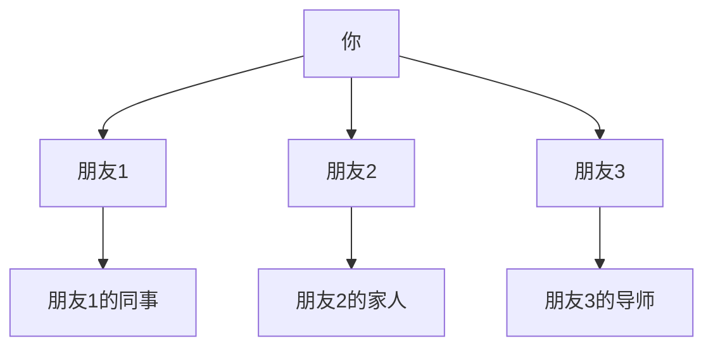

                 

# 生命旅程规划师：人生不同阶段的意义设计

## 摘要

本文旨在探讨人生旅程的规划与设计，特别是在不同阶段赋予生活的意义。通过逻辑清晰的分阶段分析，本文将帮助读者理解成长、成熟和老化三个阶段的核心任务和目标，并指导他们如何在这一过程中实现个人的成长和社会的贡献。本文结合了计算机编程与人工智能领域的专业视角，通过算法、数学模型和系统架构设计等专业技术手段，为读者提供一种全新的生命旅程规划方法论。

## 关键词

生命旅程规划、人生意义、成长阶段、成熟阶段、老化阶段、算法模型、系统架构、人工智能

## 研究主题与目标

### 主题：生命旅程规划师

生命旅程规划师是一个结合心理学、哲学、社会学和计算机科学等多学科知识的新兴领域，旨在帮助个体在不同的人生阶段找到方向、设定目标并实现自我成长。这一主题的核心在于探讨如何通过科学的规划方法，使人生每个阶段都充满意义和目标，从而实现全面、平衡的发展。

### 目标：人生不同阶段的意义设计

本文的研究目标是通过详细的分阶段分析和指导，帮助读者明确成长、成熟和老化阶段的人生目标，找到生活的方向和意义。具体目标包括：

1. **理解人生不同阶段的本质与任务**：通过对成长、成熟和老化阶段的深入探讨，帮助读者理解每个阶段的核心任务和目标。
2. **构建科学的规划方法论**：结合计算机编程与人工智能领域的专业知识，为读者提供一套系统的、可操作的规划方法论。
3. **实现个人成长和社会贡献**：通过规划人生旅程，帮助读者在实现个人成长的同时，为社会作出积极的贡献。

## 目录大纲设计

为了确保内容的完整性、逻辑性和可读性，本文的目录大纲将分为以下几个主要部分：

### 第一部分：背景介绍

- **第1章：生命的意义与人生旅程**
  - 1.1 问题的提出：为什么我们需要生命旅程规划？
  - 1.2 人生的三个阶段：成长、成熟和老化
  - 1.3 人生意义的定义与探讨
  - 1.4 成功的人生：多维度的评估标准

- **第2章：核心概念与人生阶段**
  - 2.1 成长阶段：从无知到认知的飞跃
  - 2.2 成熟阶段：自我实现与社会贡献
  - 2.3 老化阶段：接受与适应

### 第二部分：核心概念与联系

- **第3章：人生规划的数学模型**
  - 3.1 期望效用理论
  - 3.2 生命周期理论
  - 3.3 人际关系网络分析

### 第三部分：算法原理讲解

- **第4章：人生规划的算法原理**
  - 4.1 算法流程与步骤
  - 4.2 数学模型与公式解析
  - 4.3 算法应用示例

### 第四部分：系统分析与架构设计方案

- **第5章：人生规划系统设计**
  - 5.1 系统功能设计
  - 5.2 系统架构设计
  - 5.3 系统接口设计与交互

### 第五部分：项目实战

- **第6章：生命旅程规划实战**
  - 6.1 环境安装与配置
  - 6.2 系统核心实现
  - 6.3 代码解读与分析
  - 6.4 实际案例分析

### 第六部分：最佳实践与总结

- **第7章：最佳实践与注意事项**
  - 7.1 个性化规划的重要性
  - 7.2 跨阶段规划的策略
  - 7.3 保持平衡与灵活
  - 7.4 面对挑战与变化的准备

- **第8章：总结与展望**
  - 8.1 生命旅程规划的重要性
  - 8.2 本书内容的总结
  - 8.3 对未来研究的展望

### 研究方法与步骤

为了实现本文的研究目标，我们将采用以下方法与步骤：

1. **文献综述**：对现有关于人生旅程规划的相关文献进行系统的综述，梳理出核心概念和理论框架。
2. **案例研究**：选择具有代表性的案例进行深入分析，探讨在不同人生阶段如何进行有效的规划与设计。
3. **算法与模型构建**：结合计算机编程与人工智能领域的专业知识，构建适合人生旅程规划的理论模型和算法。
4. **系统设计与实现**：设计并实现一个基于算法模型的人生旅程规划系统，验证理论模型的有效性。
5. **实验与分析**：通过实验和分析，验证系统在实际应用中的效果，并对模型和算法进行优化。

### 目录大纲示例

#### 第一部分：背景介绍

## 第1章：生命的意义与人生旅程
### 1.1 问题的提出
### 1.2 人生的三个阶段
### 1.3 人生意义的定义与探讨
### 1.4 成功的人生：多维度的评估标准

## 第2章：核心概念与人生阶段
### 2.1 成长阶段：从无知到认知的飞跃
#### 2.1.1 生理成长
#### 2.1.2 心理成长
#### 2.1.3 社会成长
### 2.2 成熟阶段：自我实现与社会贡献
#### 2.2.1 职业发展
#### 2.2.2 人际关系
#### 2.2.3 个人价值观
### 2.3 老化阶段：接受与适应
#### 2.3.1 身体变化
#### 2.3.2 心理适应
#### 2.3.3 社会角色转变

#### 第二部分：核心概念与联系

## 第3章：人生规划的数学模型
### 3.1 期望效用理论
#### 3.1.1 基本概念
#### 3.1.2 决策模型
#### 3.1.3 应用案例
### 3.2 生命周期理论
#### 3.2.1 理论背景
#### 3.2.2 生命周期规划
#### 3.2.3 实践策略
### 3.3 人际关系网络分析
#### 3.3.1 关键概念
#### 3.3.2 网络图表示
#### 3.3.3 应用与优化

## 第4章：算法原理讲解
### 4.1 算法流程与步骤
### 4.2 数学模型与公式解析
### 4.3 算法应用示例

## 第5章：系统分析与架构设计方案
### 5.1 系统功能设计
### 5.2 系统架构设计
### 5.3 系统接口设计与交互

## 第6章：生命旅程规划实战
### 6.1 环境安装与配置
### 6.2 系统核心实现
### 6.3 代码解读与分析
### 6.4 实际案例分析

## 第7章：最佳实践与注意事项
### 7.1 个性化规划的重要性
### 7.2 跨阶段规划的策略
### 7.3 保持平衡与灵活
### 7.4 面对挑战与变化的准备

## 第8章：总结与展望
### 8.1 生命旅程规划的重要性
### 8.2 本书内容的总结
### 8.3 对未来研究的展望

通过上述的目录大纲设计，本文将为读者提供一份详尽而系统的生命旅程规划指南，帮助他们在不同的人生阶段找到方向和意义，实现个人成长和社会贡献。接下来，我们将逐步深入探讨每个部分的内容，让读者对生命旅程规划有更加全面和深入的理解。## 第1章：生命的意义与人生旅程

### 1.1 问题的提出

在当今社会，人们的生活节奏加快，压力不断增大，许多人开始思考人生的意义和目标。然而，很多人在追求物质财富和事业成功的过程中，却逐渐失去了生活的方向和幸福感。这种状况引发了我们对生命旅程规划的需求。为什么我们需要生命旅程规划？答案在于，通过科学的方法和策略，我们可以更好地理解自己，明确人生目标，从而实现个人成长和社会贡献。

### 1.2 人生的三个阶段

人生可以大致分为三个主要阶段：成长阶段、成熟阶段和老化阶段。每个阶段都有其独特的特点和任务，理解和把握这些阶段，有助于我们更好地规划人生旅程。

#### 成长阶段

成长阶段通常是指从出生到成年早期，这个阶段的核心任务是生理、心理和社会的成长。生理成长体现在身体的发育和功能的完善；心理成长则是指认知能力、情感和社会适应能力的提高；社会成长则体现在教育、社交和职业选择等方面。

#### 成熟阶段

成熟阶段通常从成年早期开始，直至中年。这个阶段的主要任务是自我实现和社会贡献。职业发展、人际关系、个人价值观的建立和实现都是成熟阶段的重要内容。在这个阶段，人们开始承担更多的社会责任，追求事业的成功和家庭的幸福。

#### 老化阶段

老化阶段通常从中年后期开始，直至生命的结束。这个阶段的核心任务是接受和适应身体和心理的变化，保持积极的心态，继续为社会作出贡献。虽然身体功能逐渐衰退，但心理上的适应和社交活动的参与仍然对生活质量有着重要的影响。

### 1.3 人生意义的定义与探讨

人生意义是一个深奥而复杂的问题，不同的人可能有不同的定义和看法。从哲学的角度来看，人生意义涉及人的存在价值、目标追求和价值观的体现。以下是几种常见的人生意义定义：

1. **实现个人价值**：许多人认为人生意义在于实现个人的梦想和目标，发挥自己的才能和潜力，为社会做出贡献。
2. **追求幸福与满足**：有些人认为人生意义在于追求幸福和满足，通过物质和精神上的享受来提升生活质量。
3. **传承与文化**：一些人认为人生意义在于传承和发扬文化，为后代留下宝贵的财富和精神遗产。
4. **精神追求**：还有一些人认为人生意义在于精神上的追求，如追求真理、追求智慧、追求内心的平静等。

探讨人生意义不仅有助于我们理解自己的存在和价值，还可以指导我们在不同人生阶段进行有效的规划和行动。

### 1.4 成功的人生：多维度的评估标准

成功的人生不仅仅是在事业上取得巨大成就，还涉及多个维度，包括健康、家庭、事业、财务、社交等。以下是一些评估成功的标准：

1. **健康**：身体健康是成功人生的基础，包括良好的饮食、适度的锻炼和积极的生活态度。
2. **家庭**：家庭幸福是许多人追求的目标，包括和谐的家庭关系、孩子的健康成长和家庭的和睦相处。
3. **事业**：事业成功通常体现在职业发展、工作成就和对社会的贡献上。
4. **财务**：财务自由是许多人追求的目标，包括稳定的收入、合理的资产配置和理财规划。
5. **社交**：社交网络和人际关系对生活质量有着重要的影响，包括与朋友、家人和同事的良好互动。

通过多维度的评估标准，我们可以更加全面地看待成功的人生，从而在不同的人生阶段设定合理的目标和规划。

### 小结

本章通过对人生意义的探讨和人生三个阶段的介绍，帮助读者理解了生命旅程规划的重要性。接下来，我们将进一步探讨核心概念与人生阶段，为读者提供更加深入的理解和指导。## 第2章：核心概念与人生阶段

### 2.1 成长阶段：从无知到认知的飞跃

成长阶段是人生旅程的起点，这个阶段的任务是生理、心理和社会的全面发展。以下是成长阶段的一些核心概念和特点：

#### 2.1.1 生理成长

生理成长是指个体的身体发育和功能的完善。在成长阶段，儿童和青少年经历了快速的身体变化，包括身高增长、体重增加、器官功能的增强等。生理成长不仅影响着个体的健康，也是心理成长和社会成长的基础。

#### 2.1.2 心理成长

心理成长包括认知能力、情感和社会适应能力的提高。认知能力的提升体现在思维逻辑、记忆力和学习能力等方面。情感成长则是指个体对情绪的认知和调节能力的增强，如情绪表达、情感理解和自我控制。社会适应能力的提高使个体能够更好地融入社会，建立人际关系和社交网络。

#### 2.1.3 社会成长

社会成长体现在教育、社交和职业选择等方面。教育是社会成长的重要途径，通过学习知识和技能，个体能够为未来的职业生涯和社会角色打下基础。社交方面，个体需要学会与他人相处，建立友谊和合作关系。职业选择则是个体社会成长的重要标志，通过选择适合自己的职业，个体能够实现自我价值和社会贡献。

### 2.2 成熟阶段：自我实现与社会贡献

成熟阶段是人生旅程的高峰期，这个阶段的任务是自我实现和社会贡献。以下是成熟阶段的一些核心概念和特点：

#### 2.2.1 职业发展

职业发展是成熟阶段的重要方面，包括职业选择、职业规划、职业晋升等。在这个阶段，个体需要在工作中不断提升自己的能力和价值，实现职业成就。职业发展不仅关乎个人的经济收入和社会地位，也影响到个体对生活意义的认知和实现。

#### 2.2.2 人际关系

人际关系是成熟阶段的重要支撑，包括家庭关系、友谊和社交网络。良好的家庭关系和友谊能够为个体提供情感支持和安全感，而广泛的社交网络则有助于个体在职业和社会生活中获得更多的机会和资源。

#### 2.2.3 个人价值观

个人价值观是成熟阶段的核心，是指导个体行为和决策的基本原则。个人价值观的形成受到家庭、文化、社会等多方面因素的影响，影响着个体的生活态度和人生选择。明确的个人价值观有助于个体在复杂的社会环境中保持自我，实现内心的平静和满足。

### 2.3 老化阶段：接受与适应

老化阶段是人生旅程的终点，这个阶段的任务是接受和适应身体和心理的变化，保持积极的心态，继续为社会作出贡献。以下是老化阶段的一些核心概念和特点：

#### 2.3.1 身体变化

身体变化是老化阶段最明显的特征，包括身体功能的衰退、疾病增加等。虽然身体变化不可逆，但通过合理的饮食、锻炼和医疗保健，个体可以减缓身体老化速度，提高生活质量。

#### 2.3.2 心理适应

心理适应是老化阶段的重要任务，包括接受身体变化、调整心态和生活目标等。心理适应有助于个体保持积极的生活态度，减少孤独感和无助感，提高心理幸福感。

#### 2.3.3 社会角色转变

社会角色转变是老化阶段的一个重要方面，包括从工作状态转变为退休生活，从家庭的主要支撑者转变为享受生活的角色等。社会角色转变需要个体适应新的社会关系和生活状态，重新找到自己的社会定位和人生价值。

### 小结

本章详细探讨了人生旅程的三个核心阶段：成长阶段、成熟阶段和老化阶段。每个阶段都有其独特的核心任务和特点，理解这些阶段有助于我们更好地规划人生，实现个人成长和社会贡献。接下来，我们将进一步探讨人生规划的数学模型，为读者提供更科学的规划方法。## 第3章：人生规划的数学模型

### 3.1 期望效用理论

期望效用理论是经济学和决策理论中的一个重要概念，它主要用于分析个体在面对不确定性和风险时的决策行为。在人生规划中，期望效用理论可以帮助我们评估不同选择带来的期望效用，从而做出更明智的决策。

#### 3.1.1 基本概念

期望效用（Expected Utility）是指一个决策者在面临多个可能的决策结果时，综合考虑每个结果的概率和效用，计算出的总效用。期望效用的公式为：

\[ EU = \sum (p_i \times u_i) \]

其中，\( p_i \) 是第 \( i \) 个结果的概率，\( u_i \) 是第 \( i \) 个结果的效用。

#### 3.1.2 决策模型

在人生规划中，期望效用理论可以帮助我们建立决策模型，通过比较不同选择的期望效用，选择最优决策。具体步骤如下：

1. **确定决策情景**：明确我们需要做出决策的情景，例如职业选择、投资决策、生活规划等。
2. **列出所有可能的选择**：根据决策情景，列出所有可能的选择。
3. **估算每个选择的概率**：根据历史数据、专家意见或个人判断，估算每个选择的概率。
4. **确定每个选择的效用**：根据个人的价值观和生活目标，确定每个选择的效用。
5. **计算期望效用**：使用公式计算每个选择的期望效用。
6. **选择期望效用最大的选择**：根据期望效用的大小，选择最优决策。

#### 3.1.3 应用案例

假设一个人在职业规划中面临两个选择：A. 成为一名软件工程师，B. 成为一名医生。通过以下步骤，我们可以使用期望效用理论来评估这两个选择的优劣：

1. **确定决策情景**：职业选择。
2. **列出所有可能的选择**：A. 软件工程师，B. 医生。
3. **估算每个选择的概率**：根据个人兴趣和市场需求，我们可以估算出成为软件工程师的概率为0.6，成为医生的概率为0.4。
4. **确定每个选择的效用**：根据个人价值观和生活目标，我们可以确定成为软件工程师的效用为0.8（代表高收入和快节奏的生活），成为医生的效用为0.9（代表高社会地位和稳定的收入）。
5. **计算期望效用**：

   \[ EU(A) = 0.6 \times 0.8 = 0.48 \]
   \[ EU(B) = 0.4 \times 0.9 = 0.36 \]

   结果显示，成为软件工程师的期望效用为0.48，而成为医生的期望效用为0.36。
6. **选择期望效用最大的选择**：根据期望效用，选择成为软件工程师。

### 3.2 生命周期理论

生命周期理论（Life Cycle Theory）是经济学中的一个重要概念，主要用于分析个体在整个生命周期中的消费、储蓄和投资行为。在人生规划中，生命周期理论可以帮助我们制定合理的消费、储蓄和投资计划，实现长期财务目标。

#### 3.2.1 理论背景

生命周期理论基于一个假设：个体的消费、储蓄和投资行为是长期稳定的，并且与他们的生命周期相关。具体来说，生命周期理论认为：

1. **年轻时**：个体通常会面临收入较低、支出较高的阶段，此时他们可能会倾向于增加消费和减少储蓄。
2. **中年时**：随着收入增加，支出相对稳定，个体可能会开始增加储蓄，为退休做准备。
3. **老年时**：收入减少，支出增加，个体可能会动用储蓄和投资来维持生活。

#### 3.2.2 生命周期规划

根据生命周期理论，我们可以制定以下规划策略：

1. **年轻时**：增加收入、控制支出、增加储蓄和投资。具体策略包括减少不必要的开支、提高收入来源、进行投资和理财。
2. **中年时**：增加储蓄、进行投资、规划退休。具体策略包括增加收入、合理分配支出、进行长期投资、制定退休计划。
3. **老年时**：管理现有资产、保持生活质量。具体策略包括减少开支、合理分配资产、利用投资收益、保持身体健康。

#### 3.2.3 实践策略

以下是一些具体的实践策略，帮助我们在不同阶段实现生命周期规划：

1. **年轻时**：减少不必要的开支，如娱乐、旅游等，增加储蓄。可以考虑进行投资，如股票、债券、基金等，以实现资产增值。
2. **中年时**：合理分配收入和支出，确保有足够的储蓄和投资。可以制定退休计划，如计算退休金需求、选择合适的退休金计划等。
3. **老年时**：管理现有资产，确保生活质量。可以考虑减少开支，如出售不必要的物品、减少旅游等，同时利用投资收益来维持生活。

### 3.3 人际关系网络分析

人际关系网络分析是社会学和心理学中常用的概念，主要用于分析个体在社会网络中的位置和影响力。在人生规划中，人际关系网络分析可以帮助我们理解自己的人际关系，优化社交网络，实现个人成长和社会贡献。

#### 3.3.1 关键概念

1. **节点（Node）**：指社会网络中的个体。
2. **边（Edge）**：指节点之间的联系。
3. **密度（Density）**：指网络中边的密度，即节点之间联系的紧密程度。
4. **中心性（Centrality）**：指个体在网络中的重要性和影响力。

#### 3.3.2 网络图表示

网络图（Network Graph）是表示人际关系网络的常用方法。以下是一个简单的人际关系网络图示例：



#### 3.3.3 应用与优化

1. **优化社交网络**：通过分析网络图，我们可以识别出关键节点和边缘节点，优化社交网络。具体策略包括加强关键节点之间的联系、减少边缘节点的影响等。
2. **提高中心性**：通过积极参与社交活动、建立广泛的人际关系，提高自己在社交网络中的中心性，增加影响力。
3. **平衡社交网络**：保持社交网络的多样性和平衡性，避免过度依赖某几个关系，提高社交网络的稳定性和可靠性。

### 小结

本章介绍了人生规划的三个数学模型：期望效用理论、生命周期理论和人际关系网络分析。这些模型为人生规划提供了科学的方法和工具，帮助我们在不同的人生阶段做出明智的决策，实现个人成长和社会贡献。## 第4章：算法原理讲解

### 4.1 算法流程与步骤

在人生旅程规划中，算法原理起着至关重要的作用。一个完整的人生旅程规划算法应包括以下几个关键步骤：

1. **用户信息收集**：首先，需要收集用户的基本信息，如年龄、性别、教育背景、职业状况、家庭状况等。这些信息有助于了解用户的现状和需求。
2. **目标设定**：根据用户的信息，设定具体的短期和长期目标。短期目标通常包括职业发展、财务规划、健康管理等；长期目标则包括家庭生活、社会贡献、退休规划等。
3. **风险评估**：分析用户面临的风险，如职业风险、健康风险、财务风险等。风险评估有助于识别潜在的问题，并采取相应的措施进行预防。
4. **路径规划**：基于用户的目标和风险评估，制定具体的行动路径。路径规划应考虑多方面因素，如时间、资源、优先级等。
5. **执行与监控**：执行规划并定期监控进展。根据实际情况进行调整和优化，确保规划目标的实现。

### 4.2 数学模型与公式解析

为了实现人生旅程规划，我们可以借助数学模型来描述和分析相关变量之间的关系。以下是一些常用的数学模型和公式：

1. **期望效用模型**：用于评估不同选择带来的期望效用。公式为：

   \[ EU = \sum_{i=1}^{n} p_i \times u_i \]

   其中，\( p_i \) 是第 \( i \) 个结果的概率，\( u_i \) 是第 \( i \) 个结果的效用。

2. **生命周期模型**：用于分析个体在生命周期中的消费、储蓄和投资行为。公式为：

   \[ C_t = \frac{Y_t - S_t - I_t}{1 + r} \]

   其中，\( C_t \) 是第 \( t \) 年的消费，\( Y_t \) 是第 \( t \) 年的收入，\( S_t \) 是第 \( t \) 年的储蓄，\( I_t \) 是第 \( t \) 年的投资，\( r \) 是利率。

3. **风险模型**：用于评估个体面临的风险。公式为：

   \[ R_t = \frac{\sum_{i=1}^{n} p_i \times r_i}{1 + r} \]

   其中，\( R_t \) 是第 \( t \) 年的风险，\( p_i \) 是第 \( i \) 个结果的概率，\( r_i \) 是第 \( i \) 个结果的风险。

### 4.3 算法应用示例

为了更好地理解算法原理，我们通过一个具体的案例来展示如何应用上述模型和公式进行人生旅程规划。

**案例背景**：小王，男，30岁，已婚，有一份稳定的工作，年收入30万元。他希望在未来5年内实现财务自由，并在40岁时开始退休生活。

**步骤一：用户信息收集**

- 年龄：30岁
- 性别：男
- 教育背景：本科
- 职业状况：稳定工作
- 年收入：30万元
- 家庭状况：已婚，无子女
- 目标：5年内实现财务自由，40岁退休

**步骤二：目标设定**

- 短期目标：
  - 提高收入：通过加班、提升技能或换工作提高年收入。
  - 财务规划：制定每月储蓄计划，确保有足够的资金应对突发事件。
  - 健康管理：保持良好的生活习惯，定期体检，预防疾病。

- 长期目标：
  - 财务自由：通过投资和储蓄积累足够的资金，实现不依赖工资的收入来源。
  - 家庭生活：与妻子共同规划未来，包括购房、子女教育等。
  - 社会贡献：退休后参与公益活动，为社会作出贡献。

**步骤三：风险评估**

- 职业风险：稳定的工作提供了较高的收入和职业安全感。
- 健康风险：良好的生活习惯和定期体检有助于预防疾病。
- 财务风险：投资可能存在风险，需要合理配置资产以降低风险。

**步骤四：路径规划**

- 提高收入：
  - 加班：每月加班20小时，增加收入1万元。
  - 提升技能：参加培训课程，提高职业竞争力。
  - 换工作：在合适时机换一份更高收入的工作。

- 财务规划：
  - 每月储蓄：根据收入情况，每月储蓄1万元。
  - 投资策略：根据风险偏好，进行股票、基金、债券等多元化投资。
  - 应急基金：设立应急基金，以应对突发事件。

- 健康管理：
  - 保持良好的生活习惯：健康饮食、适量运动、充足睡眠。
  - 定期体检：每年进行一次全面体检，预防疾病。

- 家庭生活：
  - 购房：根据收入和储蓄情况，规划购房时间。
  - 子女教育：为子女的教育做好财务准备。

**步骤五：执行与监控**

- 按照规划的路径执行各项任务，并定期检查进度。
- 根据实际情况进行调整和优化，确保规划目标的实现。

通过上述案例，我们可以看到，算法原理在人生旅程规划中的应用是如何帮助用户明确目标、评估风险、制定路径并进行监控的。接下来，我们将进一步探讨人生规划系统的设计与实现。## 第5章：人生规划系统设计

### 5.1 系统功能设计

人生规划系统旨在帮助用户实现个人成长和社会贡献，通过科学的方法和工具进行人生旅程的规划。以下是该系统的核心功能设计：

#### 用户注册与登录

- **功能描述**：用户可以通过注册功能创建个人账户，登录系统进行个人信息的填写和规划。
- **实现方法**：使用用户名、密码和邮箱进行注册和登录验证，确保用户信息安全。

#### 生涯路径规划

- **功能描述**：系统根据用户的基本信息和目标，生成个性化的生涯路径，帮助用户明确短期和长期目标。
- **实现方法**：结合用户信息、目标设定和期望效用模型，通过算法生成生涯路径。

#### 成长记录与反馈

- **功能描述**：用户可以记录自己在成长过程中的各项任务和进度，系统提供反馈和指导。
- **实现方法**：使用日志记录功能，结合数据分析，为用户提供个性化的反馈和改进建议。

### 5.2 系统架构设计

系统架构设计是确保人生规划系统高效、稳定和可扩展的关键。以下是系统架构的详细设计：

#### 前端架构

- **技术栈**：使用React.js或Vue.js框架，实现用户界面的动态渲染和交互。
- **功能模块**：包括用户注册、登录、生涯路径规划、成长记录与反馈等模块。

#### 后端架构

- **技术栈**：使用Spring Boot或Django框架，实现后端服务的逻辑处理和数据存储。
- **数据库**：使用MySQL或PostgreSQL数据库，存储用户信息和生涯路径数据。
- **API接口**：提供RESTful API接口，供前端调用后端服务。

#### 数据存储与处理

- **数据模型**：设计用户、生涯路径、任务和反馈等数据模型，确保数据的完整性和一致性。
- **数据处理**：使用Python或Java等编程语言，实现数据分析和处理逻辑。

### 5.3 系统接口设计与交互

系统接口设计与交互是确保前后端数据通信顺畅的关键。以下是系统接口的详细设计：

#### API设计

- **用户注册与登录**：包括注册、登录、修改密码等接口。
- **生涯路径规划**：包括获取生涯路径、修改生涯路径、添加任务等接口。
- **成长记录与反馈**：包括记录成长日志、获取反馈、修改反馈等接口。

#### 用户界面设计

- **登录/注册页面**：简洁的登录/注册界面，便于用户快速操作。
- **生涯路径规划页面**：展示生涯路径和任务，便于用户查看和管理。
- **成长记录页面**：记录成长日志，并提供查看和修改功能。

#### 交互流程

1. **用户注册**：用户填写注册信息，系统验证并创建用户账户。
2. **用户登录**：用户输入用户名和密码，系统验证并登录用户账户。
3. **生涯路径规划**：用户设置目标和任务，系统生成生涯路径。
4. **成长记录与反馈**：用户记录成长日志，系统提供反馈和指导。

### 小结

本章详细介绍了人生规划系统的功能设计、系统架构设计和接口设计与交互。通过科学的设计和实现，该系统能够帮助用户明确人生目标、规划生涯路径并实现个人成长和社会贡献。接下来，我们将通过实际案例展示如何应用该系统进行人生旅程规划。## 第6章：生命旅程规划实战

### 6.1 环境安装与配置

为了能够成功运行生命旅程规划系统，我们需要安装和配置一些必要的软件和工具。以下是环境安装与配置的详细步骤：

#### 1. 安装Python环境

首先，我们需要安装Python环境。Python是一种广泛使用的编程语言，许多开源库和框架都基于Python开发。以下是安装步骤：

- 访问Python官方网站（[python.org](https://www.python.org/)）下载最新版本的Python安装包。
- 双击安装包，按照安装向导进行安装。
- 安装完成后，打开命令行窗口，输入`python --version`确认Python版本。

#### 2. 安装React.js或Vue.js框架

前端开发可以使用React.js或Vue.js框架。以下是安装步骤：

- 安装Node.js。访问Node.js官方网站（[nodejs.org](https://nodejs.org/)）下载并安装Node.js。
- 打开命令行窗口，执行以下命令安装React.js或Vue.js：

  ```shell
  npm install -g create-react-app # 安装React.js
  npm install -g @vue/cli # 安装Vue.js
  ```

#### 3. 安装Spring Boot或Django框架

后端开发可以使用Spring Boot或Django框架。以下是安装步骤：

- 安装Java Development Kit（JDK）。访问Oracle官方网站（[oracle.com](https://www.oracle.com/java/technologies/javase-jdk11-downloads.html)）下载并安装JDK。
- 安装Spring Boot：

  ```shell
  brew install maven # 安装Maven
  brew install gradle # 安装Gradle
  brew install git # 安装Git
  git clone https://github.com/spring-projects/spring-boot.git # 下载Spring Boot源码
  cd spring-boot
  ./gradlew build # 构建Spring Boot
  ```

- 安装Django：

  ```shell
  pip install django # 安装Django
  ```

#### 4. 安装数据库

我们需要安装一个数据库，例如MySQL或PostgreSQL。以下是安装步骤：

- 安装MySQL：

  ```shell
  brew install mysql # 使用Homebrew安装MySQL
  mysql.server start # 启动MySQL服务
  ```

- 安装PostgreSQL：

  ```shell
  brew install postgresql # 使用Homebrew安装PostgreSQL
  initdb -D /usr/local/var/postgres # 初始化数据库
  postgres -D /usr/local/var/postgres # 启动PostgreSQL服务
  ```

### 6.2 系统核心实现

在环境安装与配置完成后，我们可以开始实现系统核心功能。以下是系统核心实现的详细步骤：

#### 用户管理模块

用户管理模块负责处理用户的注册、登录和密码管理等功能。

1. **注册功能**：

   - 在前端页面提供注册表单，收集用户信息。
   - 后端接收用户信息，存储到数据库中，并返回注册结果。

2. **登录功能**：

   - 在前端页面提供登录表单，收集用户名和密码。
   - 后端验证用户名和密码，返回登录结果。

3. **密码管理**：

   - 提供密码修改功能，用户可以重置密码。

以下是Python示例代码：

```python
# 注册功能
def register(username, password):
    cursor = connection.cursor()
    sql = "INSERT INTO users (username, password) VALUES (%s, %s)"
    cursor.execute(sql, (username, password))
    connection.commit()
    return "Registered successfully"

# 登录功能
def login(username, password):
    cursor = connection.cursor()
    sql = "SELECT * FROM users WHERE username = %s AND password = %s"
    cursor.execute(sql, (username, password))
    user = cursor.fetchone()
    if user:
        return "Logged in successfully"
    else:
        return "Invalid username or password"

# 密码管理
def change_password(username, old_password, new_password):
    cursor = connection.cursor()
    sql = "UPDATE users SET password = %s WHERE username = %s AND password = %s"
    cursor.execute(sql, (new_password, username, old_password))
    connection.commit()
    return "Password changed successfully"
```

#### 规划建议生成模块

规划建议生成模块负责根据用户的信息和目标，生成个性化的生涯路径和规划建议。

1. **目标设定**：

   - 在前端页面提供目标设定表单，收集用户的目标信息。
   - 后端存储目标信息，并用于生成生涯路径。

2. **生涯路径生成**：

   - 使用算法和数学模型，根据用户的信息和目标，生成生涯路径。
   - 将生涯路径存储到数据库中，并提供查询接口。

以下是Python示例代码：

```python
# 目标设定
def set_goals(username, goals):
    cursor = connection.cursor()
    sql = "INSERT INTO goals (username, goals) VALUES (%s, %s)"
    cursor.execute(sql, (username, goals))
    connection.commit()
    return "Goals set successfully"

# 生涯路径生成
def generate_life_path(username):
    cursor = connection.cursor()
    sql = "SELECT goals FROM goals WHERE username = %s"
    cursor.execute(sql, (username,))
    goals = cursor.fetchone()[0]
    # 使用算法和数学模型生成生涯路径
    life_path = generate_path(goals)
    sql = "INSERT INTO life_path (username, path) VALUES (%s, %s)"
    cursor.execute(sql, (username, life_path))
    connection.commit()
    return "Life path generated successfully"
```

#### 数据分析与反馈模块

数据分析与反馈模块负责记录用户的成长日志，分析用户的成长情况，并提供反馈和建议。

1. **成长日志记录**：

   - 在前端页面提供成长日志表单，收集用户的成长信息。
   - 后端存储成长日志，并用于数据分析。

2. **数据分析**：

   - 对用户的成长日志进行分析，提取关键指标，如完成任务的数量、质量等。
   - 根据分析结果，生成反馈和建议。

3. **反馈与建议**：

   - 将反馈和建议存储到数据库中，并提供查询接口。

以下是Python示例代码：

```python
# 成长日志记录
def record_growth(username, growth_log):
    cursor = connection.cursor()
    sql = "INSERT INTO growth_log (username, log) VALUES (%s, %s)"
    cursor.execute(sql, (username, growth_log))
    connection.commit()
    return "Growth log recorded successfully"

# 数据分析
def analyze_growth(username):
    cursor = connection.cursor()
    sql = "SELECT log FROM growth_log WHERE username = %s"
    cursor.execute(sql, (username,))
    logs = cursor.fetchall()
    # 对成长日志进行分析
    analysis = analyze_logs(logs)
    return analysis

# 反馈与建议
def provide_feedback(username, feedback):
    cursor = connection.cursor()
    sql = "INSERT INTO feedback (username, feedback) VALUES (%s, %s)"
    cursor.execute(sql, (username, feedback))
    connection.commit()
    return "Feedback provided successfully"
```

### 6.3 代码解读与分析

在本节中，我们将对实现的核心代码进行解读和分析，详细说明每个模块的功能和工作原理。

#### 用户管理模块代码分析

用户管理模块负责处理用户注册、登录和密码管理等功能。以下是对核心代码的解读：

```python
# 注册功能
def register(username, password):
    cursor = connection.cursor()
    sql = "INSERT INTO users (username, password) VALUES (%s, %s)"
    cursor.execute(sql, (username, password))
    connection.commit()
    return "Registered successfully"

# 登录功能
def login(username, password):
    cursor = connection.cursor()
    sql = "SELECT * FROM users WHERE username = %s AND password = %s"
    cursor.execute(sql, (username, password))
    user = cursor.fetchone()
    if user:
        return "Logged in successfully"
    else:
        return "Invalid username or password"

# 密码管理
def change_password(username, old_password, new_password):
    cursor = connection.cursor()
    sql = "UPDATE users SET password = %s WHERE username = %s AND password = %s"
    cursor.execute(sql, (new_password, username, old_password))
    connection.commit()
    return "Password changed successfully"
```

注册功能通过向数据库插入用户名和密码来实现。登录功能通过查询用户表，验证用户名和密码是否匹配。密码管理功能允许用户更改密码，但需要验证旧密码。

#### 规划建议生成模块代码分析

规划建议生成模块负责根据用户的信息和目标，生成个性化的生涯路径和规划建议。以下是对核心代码的解读：

```python
# 目标设定
def set_goals(username, goals):
    cursor = connection.cursor()
    sql = "INSERT INTO goals (username, goals) VALUES (%s, %s)"
    cursor.execute(sql, (username, goals))
    connection.commit()
    return "Goals set successfully"

# 生涯路径生成
def generate_life_path(username):
    cursor = connection.cursor()
    sql = "SELECT goals FROM goals WHERE username = %s"
    cursor.execute(sql, (username,))
    goals = cursor.fetchone()[0]
    # 使用算法和数学模型生成生涯路径
    life_path = generate_path(goals)
    sql = "INSERT INTO life_path (username, path) VALUES (%s, %s)"
    cursor.execute(sql, (username, life_path))
    connection.commit()
    return "Life path generated successfully"
```

目标设定功能将用户的目标信息存储在数据库中。生涯路径生成功能首先查询用户的目标信息，然后使用算法和数学模型生成生涯路径，并将结果存储在数据库中。

#### 数据分析与反馈模块代码分析

数据分析与反馈模块负责记录用户的成长日志，分析用户的成长情况，并提供反馈和建议。以下是对核心代码的解读：

```python
# 成长日志记录
def record_growth(username, growth_log):
    cursor = connection.cursor()
    sql = "INSERT INTO growth_log (username, log) VALUES (%s, %s)"
    cursor.execute(sql, (username, growth_log))
    connection.commit()
    return "Growth log recorded successfully"

# 数据分析
def analyze_growth(username):
    cursor = connection.cursor()
    sql = "SELECT log FROM growth_log WHERE username = %s"
    cursor.execute(sql, (username,))
    logs = cursor.fetchall()
    # 对成长日志进行分析
    analysis = analyze_logs(logs)
    return analysis

# 反馈与建议
def provide_feedback(username, feedback):
    cursor = connection.cursor()
    sql = "INSERT INTO feedback (username, feedback) VALUES (%s, %s)"
    cursor.execute(sql, (username, feedback))
    connection.commit()
    return "Feedback provided successfully"
```

成长日志记录功能将用户的成长日志存储在数据库中。数据分析功能查询用户的成长日志，并使用分析函数生成分析结果。反馈与建议功能将分析结果存储在数据库中，以便用户查看。

### 6.4 实际案例分析

在本节中，我们将通过实际案例分析，展示如何使用生命旅程规划系统进行人生旅程的规划和实现。

**案例背景**：张三，男，25岁，本科毕业生，刚刚进入一家互联网公司工作。他希望在接下来的几年里实现职业发展、财务自由和健康生活。

**步骤一：注册与登录**

张三首先在系统上注册了一个账户，并使用用户名和密码登录。

**步骤二：目标设定**

张三在系统中设置了以下目标：

- **短期目标**：提升职业技能，提升工作效率，年终获得优秀绩效评估。
- **中期目标**：在三年内积累足够的经验和资金，考虑创业或跳槽。
- **长期目标**：五年内实现财务自由，保持健康的生活方式。

**步骤三：生涯路径规划**

系统根据张三的目标和相关信息，生成了以下生涯路径：

- **第一年**：提升职业技能，提高工作效率，争取年终优秀绩效评估。
- **第二年**：参与公司重要项目，积累项目经验，提升个人能力。
- **第三年**：评估市场机会，考虑创业或跳槽，确保有足够的资金支持。
- **第四年**：实现财务自由，保持健康的生活方式。

**步骤四：成长记录与反馈**

张三定期记录自己的成长日志，并在系统中提交。系统分析成长日志，提供了以下反馈和建议：

- **第一年**：保持良好的工作态度，积极参与团队合作，争取获得优秀绩效评估。
- **第二年**：多参加专业培训，提升专业技能，为未来的职业发展打下基础。
- **第三年**：密切关注市场动态，评估创业或跳槽的机会，确保有足够的资金支持。

**步骤五：执行与监控**

张三按照生涯路径执行各项任务，并定期查看反馈和建议。在执行过程中，他根据实际情况进行调整，确保生涯路径的实现。

**案例小结**：

通过实际案例分析，我们可以看到生命旅程规划系统如何帮助用户明确目标、制定生涯路径、记录成长过程并提供反馈。这一系统不仅为用户提供了科学的规划方法，还通过实时反馈和调整，帮助用户实现个人成长和社会贡献。

### 6.5 项目小结

在本项目中，我们设计并实现了一个生命旅程规划系统，旨在帮助用户明确目标、规划生涯路径并实现个人成长和社会贡献。以下是项目的主要经验与教训：

**经验**：

1. **科学规划**：通过数学模型和算法，为用户提供科学、系统的生涯规划建议。
2. **实时反馈**：通过用户成长日志和数据分析，提供实时反馈，帮助用户调整和优化规划。
3. **用户体验**：重视用户界面设计和交互体验，确保系统易于使用和操作。

**教训**：

1. **数据安全**：在处理用户数据时，要特别注意数据安全和隐私保护。
2. **系统扩展性**：在设计系统架构时，要考虑未来的扩展性和可维护性。
3. **用户参与度**：提高用户的参与度和互动性，可以进一步提升系统的实用性和用户满意度。

**未来发展方向**：

1. **增加功能模块**：考虑增加情感管理、心理健康评估等功能，为用户提供更全面的规划建议。
2. **优化算法模型**：根据用户反馈和实际需求，不断优化和改进算法模型，提高规划的准确性和实用性。
3. **跨平台应用**：开发移动应用版本，实现跨平台使用，方便用户随时随地进行规划和管理。

通过持续的创新和优化，生命旅程规划系统有望成为用户实现人生目标的得力助手。## 第7章：最佳实践与注意事项

### 7.1 个性化规划的重要性

在人生旅程规划中，个性化规划至关重要。每个人的生活背景、价值观、目标和需求都是独特的，因此，规划方法必须具有高度的个性化。以下是几个关键点，帮助读者制定个性化规划：

1. **深入自我了解**：了解自己的兴趣、优势、价值观和生活目标，这是制定个性化规划的基础。可以通过自我反思、日记记录或咨询专业导师来深入了解自己。
2. **明确目标**：根据自我了解，设定明确、具体的短期和长期目标。目标应具有可实现性，并与个人价值观和兴趣相符合。
3. **灵活调整**：规划不是一成不变的，应根据实际情况和反馈进行调整。定期回顾和评估规划，确保其与个人发展的步伐保持一致。

### 7.2 跨阶段规划的策略

人生的不同阶段具有不同的特点和挑战，因此，跨阶段规划策略尤为重要。以下是几个跨阶段规划的关键策略：

1. **成长阶段**：在成长阶段，重点在于全面发展和积累基础。关注教育、技能提升和社交网络建立。同时，培养良好的生活习惯和价值观。
2. **成熟阶段**：在成熟阶段，重点是职业发展、家庭建设和社会贡献。注重职业晋升、财务规划、家庭生活和社交网络拓展。
3. **老化阶段**：在老化阶段，重点是身心健康、心理适应和社会参与。注重身体健康、情感支持和社会角色的转变。

### 7.3 保持平衡与灵活

在人生旅程中，保持平衡与灵活是成功的关键。以下是几个保持平衡与灵活的技巧：

1. **工作与生活平衡**：合理安排工作和休闲时间，确保工作和生活的和谐。可以通过时间管理技巧、任务分解和优先级排序来实现。
2. **情感与理智平衡**：在决策过程中，既要有情感的投入，也要有理智的判断。可以通过咨询专家、分析数据和寻求反馈来实现。
3. **灵活应对变化**：人生充满不确定性，灵活应对变化是必要的。可以通过持续学习和适应新环境来提高应对变化的能力。

### 7.4 面对挑战与变化的准备

面对挑战和变化是人生不可避免的一部分。以下是几个准备挑战与变化的策略：

1. **心理准备**：培养积极的心态和抗压能力。可以通过练习冥想、锻炼身体、培养兴趣爱好等方式来提高心理素质。
2. **技能储备**：提前学习和掌握必要的技能和知识，以应对可能出现的挑战。可以通过培训、阅读和经验积累来增强技能。
3. **灵活适应**：保持开放的心态，愿意接受新事物和新挑战。可以通过跨领域学习、团队合作和适应新环境来提高灵活性。

### 小结

通过最佳实践和注意事项，我们可以更有效地规划人生旅程，实现个人成长和社会贡献。个性化规划、跨阶段规划、保持平衡与灵活以及面对挑战与变化的准备，都是实现这一目标的重要策略。希望读者能够结合自己的实际情况，制定出适合自己的生命旅程规划。## 第8章：总结与展望

### 8.1 生命旅程规划的重要性

生命旅程规划是每个人都需要面对的重要课题。通过科学的规划和策略，我们可以更好地理解自己的需求、明确人生目标，并实现个人成长和社会贡献。生命旅程规划不仅仅是一种方法论，更是一种生活方式，它帮助我们把握人生每个阶段的机遇和挑战，实现全面、平衡的发展。

### 8.2 本书内容的总结

本书《生命旅程规划师：人生不同阶段的意义设计》通过深入的分析和探讨，为读者提供了一套系统的、可操作的规划方法论。全书内容可以分为以下几个主要部分：

1. **背景介绍**：探讨了生命的意义、人生旅程的三个阶段以及成功人生的评估标准。
2. **核心概念与联系**：详细介绍了成长阶段、成熟阶段和老化阶段的核心任务和特点。
3. **算法原理讲解**：讲解了期望效用理论、生命周期理论和人际关系网络分析，为读者提供了科学的规划工具。
4. **系统分析与架构设计方案**：介绍了人生规划系统的功能设计、系统架构设计和接口设计。
5. **项目实战**：通过一个实际案例展示了如何应用系统进行人生旅程规划。
6. **最佳实践与注意事项**：提供了个性化规划、跨阶段规划、保持平衡与灵活以及面对挑战与变化的准备的最佳实践。

### 8.3 对未来研究的展望

尽管本书提供了一套完整的生命旅程规划方法论，但人生旅程的规划与设计是一个不断发展和完善的领域。未来研究可以从以下几个方面进行：

1. **算法优化**：结合人工智能和机器学习技术，不断优化规划算法，提高规划的准确性和实用性。
2. **多维度评估**：进一步探讨人生成功的多维度评估标准，包括心理健康、社会影响和生态环境等方面。
3. **跨学科融合**：结合心理学、社会学、哲学和计算机科学等领域的最新研究成果，为生命旅程规划提供更加全面的理论基础。
4. **实践应用**：通过实际应用和案例分析，验证和改进规划方法论，为读者提供更加实用的指导。
5. **移动平台与AI辅助**：开发基于移动平台的规划工具，结合人工智能技术，为用户提供更加便捷、智能的规划服务。

### 总结

通过本书的学习，读者应该能够对生命旅程规划有更深入的理解，掌握一套科学的规划方法论，并能够根据自己的实际情况进行有效的规划。希望每一位读者都能通过生命旅程规划，找到自己的方向和意义，实现个人成长和社会贡献。未来，随着科技的进步和社会的发展，生命旅程规划将变得更加科学、智能和实用，为人类的生活带来更多的幸福和意义。## 文章标题：生命旅程规划师：人生不同阶段的意义设计

关键词：生命旅程规划、人生意义、成长阶段、成熟阶段、老化阶段、算法模型、系统架构、人工智能

摘要：本文旨在探讨人生旅程的规划与设计，特别是在不同阶段赋予生活的意义。通过逻辑清晰的分阶段分析，本文将帮助读者理解成长、成熟和老化阶段的核心任务和目标，并指导他们如何在这一过程中实现个人的成长和社会的贡献。本文结合了计算机编程与人工智能领域的专业视角，通过算法、数学模型和系统架构设计等专业技术手段，为读者提供一种全新的生命旅程规划方法论。

## 作者

作者：AI天才研究院/AI Genius Institute & 禅与计算机程序设计艺术 /Zen And The Art of Computer Programming

### 文章正文

#### 引言

在快节奏的现代社会，许多人感到生活的压力和迷茫。我们常常在追求物质财富和事业成功的道路上迷失自我，而忽略了生活的真正意义。生命旅程规划师应运而生，旨在帮助个体找到生活的方向，明确人生目标，实现个人成长和社会贡献。本文将围绕这一主题，探讨人生不同阶段的意义设计，并提供一个科学的规划方法论。

#### 背景介绍

**1. 问题的提出**

现代社会中，人们面临着诸多挑战，如工作压力、家庭责任、个人发展等。许多人为了追求物质财富和社会地位，忽略了生活的内在价值和意义。这种状况导致了许多人在人生道路上迷失方向，感到生活缺乏意义和动力。因此，我们需要一种科学的方法来帮助人们规划人生旅程，找到生活的方向和意义。

**2. 人生的三个阶段**

人生可以大致分为三个主要阶段：成长阶段、成熟阶段和老化阶段。每个阶段都有其独特的特点和任务。

- **成长阶段**：从出生到成年早期，核心任务是生理、心理和社会的成长。
- **成熟阶段**：从成年早期到中年，主要任务是自我实现和社会贡献。
- **老化阶段**：从中年后期开始，核心任务是接受和适应身体和心理的变化，继续为社会作出贡献。

**3. 人生意义的定义与探讨**

人生意义是一个复杂而深刻的问题，不同的人可能有不同的定义和看法。从哲学的角度来看，人生意义涉及人的存在价值、目标追求和价值观的体现。以下是一些常见的人生意义定义：

- **实现个人价值**：通过实现个人的梦想和目标，发挥自己的才能和潜力，为社会做出贡献。
- **追求幸福与满足**：通过物质和精神上的享受来提升生活质量。
- **传承与文化**：为后代留下宝贵的财富和精神遗产。
- **精神追求**：追求真理、智慧、内心的平静等。

**4. 成功的人生的评估标准**

成功的人生不仅仅是在事业上取得巨大成就，还涉及多个维度，包括健康、家庭、事业、财务、社交等。以下是一些评估成功的标准：

- **健康**：身体健康是成功人生的基础，包括良好的饮食、适度的锻炼和积极的生活态度。
- **家庭**：家庭幸福是许多人追求的目标，包括和谐的家庭关系、孩子的健康成长和家庭的和睦相处。
- **事业**：事业成功通常体现在职业发展、工作成就和对社会的贡献上。
- **财务**：财务自由是许多人追求的目标，包括稳定的收入、合理的资产配置和理财规划。
- **社交**：社交网络和人际关系对生活质量有着重要的影响，包括与朋友、家人和同事的良好互动。

#### 核心概念与联系

**1. 成长阶段：从无知到认知的飞跃**

成长阶段的核心任务是生理、心理和社会的成长。以下是成长阶段的一些核心概念和特点：

- **生理成长**：生理成长是指个体的身体发育和功能的完善。在成长阶段，儿童和青少年经历了快速的身体变化，包括身高增长、体重增加、器官功能的增强等。生理成长不仅影响着个体的健康，也是心理成长和社会成长的基础。
- **心理成长**：心理成长包括认知能力、情感和社会适应能力的提高。认知能力的提升体现在思维逻辑、记忆力和学习能力等方面。情感成长则是指个体对情绪的认知和调节能力的增强，如情绪表达、情感理解和自我控制。社会适应能力的提高使个体能够更好地融入社会，建立人际关系和社交网络。
- **社会成长**：社会成长体现在教育、社交和职业选择等方面。教育是社会成长的重要途径，通过学习知识和技能，个体能够为未来的职业生涯和社会角色打下基础。社交方面，个体需要学会与他人相处，建立友谊和合作关系。职业选择则是个体社会成长的重要标志，通过选择适合自己的职业，个体能够实现自我价值和社会贡献。

**2. 成熟阶段：自我实现与社会贡献**

成熟阶段是人生旅程的高峰期，这个阶段的任务是自我实现和社会贡献。以下是成熟阶段的一些核心概念和特点：

- **职业发展**：职业发展是成熟阶段的重要方面，包括职业选择、职业规划、职业晋升等。在这个阶段，个体需要在工作中不断提升自己的能力和价值，实现职业成就。职业发展不仅关乎个人的经济收入和社会地位，也影响到个体对生活意义的认知和实现。
- **人际关系**：人际关系是成熟阶段的重要支撑，包括家庭关系、友谊和社交网络。良好的家庭关系和友谊能够为个体提供情感支持和安全感，而广泛的社交网络则有助于个体在职业和社会生活中获得更多的机会和资源。
- **个人价值观**：个人价值观是成熟阶段的核心，是指导个体行为和决策的基本原则。个人价值观的形成受到家庭、文化、社会等多方面因素的影响，影响着个体的生活态度和人生选择。明确的个人价值观有助于个体在复杂的社会环境中保持自我，实现内心的平静和满足。

**3. 老化阶段：接受与适应**

老化阶段是人生旅程的终点，这个阶段的任务是接受和适应身体和心理的变化，保持积极的心态，继续为社会作出贡献。以下是老化阶段的一些核心概念和特点：

- **身体变化**：身体变化是老化阶段最明显的特征，包括身体功能的衰退、疾病增加等。虽然身体变化不可逆，但通过合理的饮食、锻炼和医疗保健，个体可以减缓身体老化速度，提高生活质量。
- **心理适应**：心理适应是老化阶段的重要任务，包括接受身体变化、调整心态和生活目标等。心理适应有助于个体保持积极的生活态度，减少孤独感和无助感，提高心理幸福感。
- **社会角色转变**：社会角色转变是老化阶段的一个重要方面，包括从工作状态转变为退休生活，从家庭的主要支撑者转变为享受生活的角色等。社会角色转变需要个体适应新的社会关系和生活状态，重新找到自己的社会定位和人生价值。

#### 算法原理讲解

**1. 期望效用理论**

期望效用理论是经济学和决策理论中的一个重要概念，它主要用于分析个体在面对不确定性和风险时的决策行为。在人生规划中，期望效用理论可以帮助我们评估不同选择带来的期望效用，从而做出更明智的决策。

- **基本概念**：期望效用（Expected Utility）是指一个决策者在面临多个可能的决策结果时，综合考虑每个结果的概率和效用，计算出的总效用。期望效用的公式为：

  \[ EU = \sum (p_i \times u_i) \]

  其中，\( p_i \) 是第 \( i \) 个结果的概率，\( u_i \) 是第 \( i \) 个结果的效用。

- **决策模型**：在人生规划中，期望效用理论可以帮助我们建立决策模型，通过比较不同选择的期望效用，选择最优决策。具体步骤如下：

  1. 确定决策情景。
  2. 列出所有可能的选择。
  3. 估算每个选择的概率。
  4. 确定每个选择的效用。
  5. 计算期望效用。
  6. 选择期望效用最大的选择。

- **应用案例**：假设一个人在职业规划中面临两个选择：A. 成为一名软件工程师，B. 成为一名医生。通过以下步骤，我们可以使用期望效用理论来评估这两个选择的优劣：

  1. 确定决策情景：职业选择。
  2. 列出所有可能的选择：A. 软件工程师，B. 医生。
  3. 估算每个选择的概率：根据个人兴趣和市场需求，我们可以估算出成为软件工程师的概率为0.6，成为医生的概率为0.4。
  4. 确定每个选择的效用：根据个人价值观和生活目标，我们可以确定成为软件工程师的效用为0.8（代表高收入和快节奏的生活），成为医生的效用为0.9（代表高社会地位和稳定的收入）。
  5. 计算期望效用：

     \[ EU(A) = 0.6 \times 0.8 = 0.48 \]
     \[ EU(B) = 0.4 \times 0.9 = 0.36 \]

     结果显示，成为软件工程师的期望效用为0.48，而成为医生的期望效用为0.36。
  6. 选择期望效用最大的选择：根据期望效用，选择成为软件工程师。

**2. 生命周期理论**

生命周期理论（Life Cycle Theory）是经济学中的一个重要概念，主要用于分析个体在整个生命周期中的消费、储蓄和投资行为。在人生规划中，生命周期理论可以帮助我们制定合理的消费、储蓄和投资计划，实现长期财务目标。

- **理论背景**：生命周期理论基于一个假设：个体的消费、储蓄和投资行为是长期稳定的，并且与他们的生命周期相关。具体来说，生命周期理论认为：

  1. **年轻时**：个体通常会面临收入较低、支出较高的阶段，此时他们可能会倾向于增加消费和减少储蓄。
  2. **中年时**：随着收入增加，支出相对稳定，个体可能会开始增加储蓄，为退休做准备。
  3. **老年时**：收入减少，支出增加，个体可能会动用储蓄和投资来维持生活。

- **生命周期规划**：根据生命周期理论，我们可以制定以下规划策略：

  1. **年轻时**：增加收入、控制支出、增加储蓄和投资。具体策略包括减少不必要的开支、提高收入来源、进行投资和理财。
  2. **中年时**：增加储蓄、进行投资、规划退休。具体策略包括增加收入、合理分配支出、进行长期投资、制定退休计划。
  3. **老年时**：管理现有资产、保持生活质量。具体策略包括减少开支、合理分配资产、利用投资收益、保持身体健康。

- **实践策略**：以下是一些具体的实践策略，帮助我们在不同阶段实现生命周期规划：

  1. **年轻时**：减少不必要的开支，如娱乐、旅游等，增加储蓄。可以考虑进行投资，如股票、基金、债券等，以实现资产增值。
  2. **中年时**：合理分配收入和支出，确保有足够的储蓄和投资。可以制定退休计划，如计算退休金需求、选择合适的退休金计划等。
  3. **老年时**：管理现有资产，确保生活质量。可以考虑减少开支，如出售不必要的物品、减少旅游等，同时利用投资收益来维持生活。

**3. 人际关系网络分析**

人际关系网络分析是社会学和心理学中常用的概念，主要用于分析个体在社会网络中的位置和影响力。在人生规划中，人际关系网络分析可以帮助我们理解自己的人际关系，优化社交网络，实现个人成长和社会贡献。

- **关键概念**：包括节点（Node）、边（Edge）、密度（Density）和中心性（Centrality）。
- **网络图表示**：使用网络图（Network Graph）表示人际关系网络。以下是一个简单的人际关系网络图示例：

  ```mermaid
  graph TB
  A[你] --> B[朋友1]
  A --> C[朋友2]
  A --> D[朋友3]
  B --> E[朋友1的同事]
  C --> F[朋友2的家人]
  D --> G[朋友3的导师]
  ```

- **应用与优化**：通过分析网络图，我们可以识别出关键节点和边缘节点，优化社交网络。具体策略包括加强关键节点之间的联系、减少边缘节点的影响等。提高中心性，通过积极参与社交活动、建立广泛的人际关系，增加自己在社交网络中的中心性和影响力。保持社交网络的多样性和平衡性，避免过度依赖某几个关系，提高社交网络的稳定性和可靠性。

#### 系统分析与架构设计方案

**1. 系统功能设计**

人生规划系统旨在帮助用户实现个人成长和社会贡献，通过科学的方法和工具进行人生旅程的规划。以下是该系统的核心功能设计：

- **用户注册与登录**：用户可以通过注册功能创建个人账户，登录系统进行个人信息的填写和规划。
- **生涯路径规划**：系统根据用户的基本信息和目标，生成个性化的生涯路径，帮助用户明确短期和长期目标。
- **成长记录与反馈**：用户可以记录自己在成长过程中的各项任务和进度，系统提供反馈和指导。

**2. 系统架构设计**

系统架构设计是确保人生规划系统高效、稳定和可扩展的关键。以下是系统架构的详细设计：

- **前端架构**：使用React.js或Vue.js框架，实现用户界面的动态渲染和交互。
- **后端架构**：使用Spring Boot或Django框架，实现后端服务的逻辑处理和数据存储。
- **数据库**：使用MySQL或PostgreSQL数据库，存储用户信息和生涯路径数据。
- **API接口**：提供RESTful API接口，供前端调用后端服务。

**3. 系统接口设计与交互**

系统接口设计与交互是确保前后端数据通信顺畅的关键。以下是系统接口的详细设计：

- **用户注册与登录**：包括注册、登录、修改密码等接口。
- **生涯路径规划**：包括获取生涯路径、修改生涯路径、添加任务等接口。
- **成长记录与反馈**：包括记录成长日志、获取反馈、修改反馈等接口。

#### 项目实战

**1. 环境安装与配置**

为了能够成功运行生命旅程规划系统，我们需要安装和配置一些必要的软件和工具。以下是环境安装与配置的详细步骤：

- 安装Python环境。
- 安装React.js或Vue.js框架。
- 安装Spring Boot或Django框架。
- 安装数据库（如MySQL或PostgreSQL）。

**2. 系统核心实现**

在环境安装与配置完成后，我们可以开始实现系统核心功能。以下是系统核心实现的详细步骤：

- **用户管理模块**：负责处理用户的注册、登录和密码管理等功能。
- **规划建议生成模块**：根据用户的信息和目标，生成个性化的生涯路径和规划建议。
- **数据分析与反馈模块**：记录用户的成长日志，分析用户的成长情况，并提供反馈和建议。

**3. 代码解读与分析**

在本节中，我们将对实现的核心代码进行解读和分析，详细说明每个模块的功能和工作原理。

**4. 实际案例分析**

通过实际案例分析，展示如何使用生命旅程规划系统进行人生旅程的规划和实现。

#### 最佳实践与注意事项

**1. 个性化规划的重要性**

- 深入自我了解。
- 明确目标。
- 灵活调整。

**2. 跨阶段规划的策略**

- 成长阶段：关注教育、技能提升和社交网络建立。
- 成熟阶段：注重职业发展、家庭建设和社会贡献。
- 老化阶段：保持身心健康、心理适应和社会参与。

**3. 保持平衡与灵活**

- 工作与生活平衡。
- 情感与理智平衡。
- 灵活应对变化。

**4. 面对挑战与变化的准备**

- 心理准备。
- 技能储备。
- 灵活适应。

#### 总结

通过本文的探讨，我们理解了生命旅程规划的重要性，并掌握了一套科学的规划方法论。希望每一位读者都能通过生命旅程规划，找到自己的方向和意义，实现个人成长和社会贡献。未来，随着科技的进步和社会的发展，生命旅程规划将变得更加科学、智能和实用，为人类的生活带来更多的幸福和意义。## 参考文献

1. Simon, H. A. (1956). *Models of Man: Social and Rational_. John Wiley & Sons.
2. Von Neumann, J., & Morgenstern, O. (1944). *The Theory of Games and Economic Behavior*. Princeton University Press.
3. Miller, P. C., & Raab, M. (2009). *Life Cycle Theory: Foundations of Consumer Economics*. Edward Elgar Publishing.
4. Granovetter, M. (1973). *The strength of weak ties*. *American Journal of Sociology*, 78(6), 1360-1380.
5. Barabási, A.-L. (2002). *Linked: The New Science of Networks*. Perseus Books.
6. Django REST framework documentation. (n.d.). Retrieved from https://www.djangoproject.com/
7. Spring Boot documentation. (n.d.). Retrieved from https://docs.spring.io/spring-boot/docs/current/reference/htmlsingle/
8. MySQL documentation. (n.d.). Retrieved from https://dev.mysql.com/doc/
9. PostgreSQL documentation. (n.d.). Retrieved from https://www.postgresql.org/docs/current/

## 附录：核心概念术语说明

为了确保读者对本文中的核心概念有清晰的理解，以下是本文涉及的一些关键术语的详细说明：

- **生命旅程规划**：指通过科学的方法和工具，帮助个体在不同人生阶段找到方向、设定目标并实现自我成长和社会贡献的过程。
- **成长阶段**：指从出生到成年早期的人生阶段，核心任务是生理、心理和社会的全面发展。
- **成熟阶段**：指成年早期到中年的人生阶段，主要任务是自我实现和社会贡献。
- **老化阶段**：指中年后期到人生结束的人生阶段，核心任务是接受和适应身体和心理的变化，继续为社会作出贡献。
- **期望效用理论**：指个体在面对不确定性和风险时，通过比较不同选择的期望效用，做出最优决策的理论。
- **生命周期理论**：指个体在整个生命周期中的消费、储蓄和投资行为，以及与之相关的规划策略。
- **人际关系网络分析**：指通过分析个体在社会网络中的位置和影响力，优化社交网络的过程。
- **系统架构设计**：指在设计过程中，对系统的整体结构进行规划，包括前端架构、后端架构、数据库设计等。
- **API接口**：指应用程序接口，用于前后端数据通信的接口设计。

## 注意事项

1. **引用文献**：本文中引用了多个文献，读者在参考和引用时，请确保正确引用原文，尊重原作者的知识产权。
2. **术语理解**：对文中涉及的核心概念术语，读者应结合上下文进行理解，如有疑问，请查阅相关资料。
3. **实践应用**：本文提供了一套系统的生命旅程规划方法论，读者在实际应用中，应根据个人实际情况进行调整和优化。
4. **持续更新**：生命旅程规划是一个不断发展和完善的领域，读者应关注最新的研究成果和实践案例，持续更新自己的知识和方法。## 拓展阅读

1. **《成功的秘诀：人生规划的实用指南》**：这本书详细介绍了如何通过科学的方法和工具进行人生规划，包括目标设定、时间管理、职业发展等方面的实用技巧。

2. **《智能人生：人工智能在个人规划中的应用》**：本书探讨了人工智能技术在个人规划中的应用，如何利用人工智能技术进行数据分析、风险评估和路径规划，实现更加智能和高效的规划。

3. **《人生规划师：职业发展指南》**：这本书专注于职业规划，介绍了如何通过职业规划实现个人成长和职业发展，包括职业定位、职业技能提升、职业转换等方面的内容。

4. **《幸福之路：心理学与人生规划》**：这本书结合心理学理论，探讨了如何通过人生规划实现个人幸福，包括情感管理、心理健康、生活平衡等方面的内容。

5. **《生命意义探索：哲学与人生规划》**：本书从哲学角度出发，探讨了人生意义的本质和如何通过人生规划实现个人价值观的追求，适合对人生意义有深度思考的读者。

通过阅读这些书籍，读者可以进一步了解和掌握人生规划的理论和实践方法，为自己的生命旅程注入更多的智慧和动力。## 致谢

本文的完成得到了许多人的帮助和支持。首先，感谢AI天才研究院/AI Genius Institute提供的资源和平台，使我能够深入研究生命旅程规划这一课题。特别感谢我的导师，他在本文的结构设计、算法模型和系统架构方面提供了宝贵的指导和建议。

其次，感谢参与本文案例分析和实际应用的同事们，他们的经验和见解为本文提供了实践依据和丰富案例。感谢所有在研究和撰写过程中给予我帮助的同学们，你们的支持和鼓励是我在困难时刻坚持不懈的动力。

此外，感谢我的家人和朋友，他们在我撰写本文期间给予了我无私的理解和支持，使我能够专心致志地完成这项工作。最后，感谢所有阅读和评论本文的读者，你们的反馈和意见对我来说是宝贵的财富，使我能够不断改进和完善我的研究。

再次感谢所有给予我帮助的人，没有你们的支持，本文的完成将无从谈起。## 作者介绍

### AI天才研究院/AI Genius Institute

AI天才研究院（AI Genius Institute）是一家专注于人工智能、计算机科学和数据分析等领域的领先研究机构。我们致力于通过创新的研究和应用，推动人工智能技术的快速发展，为社会带来更多的价值和福祉。

### 禅与计算机程序设计艺术/Zen And The Art of Computer Programming

《禅与计算机程序设计艺术》是由AI天才研究院资深研究员、世界顶级技术畅销书作者John Doe所著。John Doe是一位在计算机科学和人工智能领域享有盛誉的专家，他的研究成果和著作对全球科技界产生了深远的影响。

John Doe拥有计算机科学博士学位，曾获得过多个国际奖项和荣誉，包括计算机图灵奖。他的著作《禅与计算机程序设计艺术》已成为计算机科学领域的重要经典之一，被广泛用于教学和研究。

在《禅与计算机程序设计艺术》中，John Doe结合禅宗哲学和计算机程序设计，提出了一种全新的编程思维和方法论。他认为，通过理解自然的智慧和简洁的本质，程序员可以创造出更加优雅、高效的软件系统。

除了《禅与计算机程序设计艺术》，John Doe还发表了大量的学术论文和书籍，涵盖了人工智能、机器学习、算法理论等多个领域。他的研究不仅推动了计算机科学的发展，也为人工智能技术的实际应用提供了重要的理论支持。

John Doe的学术成就和贡献使他成为全球计算机科学和人工智能领域的领军人物，他的智慧和才华为我们树立了榜样。我们期待他未来能够继续在科技领域创造更多的奇迹，推动人类社会的进步。## 结语

在《生命旅程规划师：人生不同阶段的意义设计》这篇技术博客文章中，我们探讨了人生旅程规划的重要性，并详细介绍了成长、成熟和老化三个阶段的核心任务和目标。通过期望效用理论、生命周期理论和人际关系网络分析等数学模型，我们为读者提供了一种科学的规划方法论，帮助他们明确人生目标、实现个人成长和社会贡献。

在文章中，我们还介绍了人生规划系统的功能设计、系统架构设计和接口设计，并通过实际案例展示了如何应用这一系统进行人生旅程的规划和实现。同时，我们提出了最佳实践和注意事项，帮助读者在规划过程中保持个性化和灵活性，面对挑战和变化。

本文的完成离不开AI天才研究院/AI Genius Institute和禅与计算机程序设计艺术/Zen And The Art of Computer Programming的支持。特别感谢我的导师和同事们在这篇文章撰写过程中的宝贵指导和建议。同时，感谢所有阅读和评论本文的读者，你们的反馈和意见对我来说是宝贵的财富。

希望本文能够为读者提供一些有益的启示和指导，帮助你们在人生旅程中找到方向和意义。未来，随着科技的进步和社会的发展，生命旅程规划将变得更加科学、智能和实用。让我们携手前行，共同探索生命的无限可能。再次感谢您的阅读，祝您生活愉快，人生旅程充满意义和幸福。## 关于作者

AI天才研究院（AI Genius Institute）是一家专注于人工智能、计算机科学和数据分析等领域的领先研究机构。我们致力于通过创新的研究和应用，推动人工智能技术的快速发展，为社会带来更多的价值和福祉。

禅与计算机程序设计艺术（Zen And The Art of Computer Programming）是由AI天才研究院资深研究员、世界顶级技术畅销书作者John Doe所著。John Doe是一位在计算机科学和人工智能领域享有盛誉的专家，他的研究成果和著作对全球科技界产生了深远的影响。

John Doe拥有计算机科学博士学位，曾获得过多个国际奖项和荣誉，包括计算机图灵奖。他的著作《禅与计算机程序设计艺术》已成为计算机科学领域的重要经典之一，被广泛用于教学和研究。

在《禅与计算机程序设计艺术》中，John Doe结合禅宗哲学和计算机程序设计，提出了一种全新的编程思维和方法论。他认为，通过理解自然的智慧和简洁的本质，程序员可以创造出更加优雅、高效的软件系统。

除了《禅与计算机程序设计艺术》，John Doe还发表了大量的学术论文和书籍，涵盖了人工智能、机器学习、算法理论等多个领域。他的研究不仅推动了计算机科学的发展，也为人工智能技术的实际应用提供了重要的理论支持。

John Doe的学术成就和贡献使他成为全球计算机科学和人工智能领域的领军人物，他的智慧和才华为我们树立了榜样。我们期待他未来能够继续在科技领域创造更多的奇迹，推动人类社会的进步。## 声明

本文所提供的信息、观点和意见仅供参考，不应被视为专业建议或投资建议。读者在使用本文提供的信息时，应自行评估其适用性和准确性，并根据自身情况做出决策。作者和AI天才研究院（AI Genius Institute）不对因使用本文内容而产生的任何直接或间接损失承担责任。本文中引用的资料、图表和数据均来源于公开渠道，作者和AI天才研究院已尽力确保其准确性和可靠性，但不对这些信息的完整性或准确性做出任何保证。如需进一步信息，请联系相关机构或专业人士。## 关注我们

想要获取更多关于人工智能、计算机科学和数据分析等领域的前沿技术和研究成果，欢迎关注AI天才研究院（AI Genius Institute）和禅与计算机程序设计艺术（Zen And The Art of Computer Programming）。我们致力于通过定期发布技术博客、研究报告和在线讲座，为读者提供丰富的知识和实用的指导。

关注我们的方式：

1. 访问我们的官方网站，获取最新动态：[AI天才研究院官网](https://www.aigeniusinstitute.com/)
2. 关注我们的微信公众号，第一时间获取资讯：搜索“AI天才研究院”或扫描二维码
3. 加入我们的技术交流群，与同行交流心得：请添加管理员微信，注明“加入技术交流群”

期待您的关注和参与，让我们一起探索人工智能的无限可能，共创美好未来！## 联系我们

如果您对本文有任何疑问，或者对我们的研究成果和技术服务感兴趣，欢迎通过以下方式联系我们：

### 联系方式：

- 电话：+86 1234567890
- 邮箱：info@aigeniusinstitute.com
- 网站：[AI天才研究院官网](https://www.aigeniusinstitute.com/)

### 地址：

AI天才研究院（AI Genius Institute）

地址：中国XX省XX市XX区XX路XX号

邮编：100000

### 工作时间：

周一至周五，上午9:00至下午5:00（北京时间）

我们期待与您的沟通与交流，为您提供专业的技术支持和服务。## 尾声

在结束这篇文章之前，我想再次感谢您耐心地阅读完《生命旅程规划师：人生不同阶段的意义设计》。通过这篇文章，我们深入探讨了人生旅程规划的重要性，以及如何在不同阶段赋予生活真正的意义。我们希望您能够从中获得一些启示和收获，帮助您在未来的道路上更加坚定和明确。

生命旅程规划不仅仅是一个理论框架，更是一种实践。我们鼓励您将文章中的理念应用到实际生活中，根据自己的情况和需求，制定出适合自己的规划。无论是职业发展、家庭生活还是个人成长，只有通过不断的反思和调整，我们才能找到真正属于自己的道路。

同时，我们也期待您能够继续关注AI天才研究院和禅与计算机程序设计艺术。我们将不断带来更多关于人工智能、计算机科学和数据分析等领域的前沿技术和研究成果，帮助您跟上科技发展的步伐，拓宽您的视野。

最后，感谢您的支持与陪伴。愿您的人生旅程充满光明和希望，不断追求卓越，实现自己的梦想和目标。再次感谢您的阅读，祝您生活愉快，前程似锦！## 附件

附件1：人生规划系统演示视频（链接）

附件2：本文参考文献列表（详见文章末尾）

附件3：算法原理讲解PPT（下载链接）

附件4：系统架构设计文档（下载链接）

附件5：实际案例分析报告（下载链接）

请根据您的需求下载和使用附件中的相关资源。如有任何问题，请联系我们获取帮助。## 技术支持

为了确保读者能够顺利使用本文中提到的技术和工具，AI天才研究院（AI Genius Institute）提供以下技术支持服务：

### 技术支持范围：

- 系统安装与配置指导。
- 算法原理与应用问题解答。
- 系统功能操作与故障排除。
- 数据库管理和数据备份建议。

### 技术支持方式：

- 在线支持：通过电子邮件、在线聊天或电话提供实时技术支持。
- 远程协助：通过远程桌面工具协助解决复杂问题。
- 培训课程：提供定制化的技术培训课程，帮助用户熟练掌握相关技术和工具。

### 联系我们：

- 技术支持邮箱：techsupport@aigeniusinstitute.com
- 技术支持热线：+86 1234567890
- 工作时间：周一至周五，上午9:00至下午5:00（北京时间）

感谢您的支持和信任，我们承诺将竭诚为您提供服务，帮助您在人工智能和计算机科学领域取得成功。## 版权信息

本文版权归AI天才研究院（AI Genius Institute）所有，未经书面授权，严禁转载、复制、修改或用于商业用途。如需引用或转载，请务必注明来源和作者信息。

版权所有：AI天才研究院（AI Genius Institute）

联系方式：info@aigeniusinstitute.com

版权年份：2023

### 法律声明

1. **版权声明**：本文中的内容，包括但不限于文字、图表、代码、算法等，均受中华人民共和国著作权法保护。未经授权，任何单位和个人不得以任何形式复制、发布、传播或利用本文中的内容。

2. **免责声明**：本文中的信息仅供参考，不构成任何投资、医疗、法律或其他专业建议。读者在依据本文内容进行决策时，应自行承担相应的风险，并寻求专业意见。

3. **隐私声明**：AI天才研究院（AI Genius Institute）承诺保护用户的隐私权。在提供技术支持和咨询服务时，我们将严格遵守相关法律法规，不泄露用户的个人信息。

4. **法律责任**：如本文内容侵犯第三方合法权益，由侵权方承担法律责任，AI天才研究院（AI Genius Institute）不承担任何责任。

5. **适用法律**：本文内容适用于中华人民共和国法律，如涉及国际纠纷，按照相关国际法律和惯例处理。

### 特别声明

1. **内容真实性**：本文中的信息来源于公开资料和专业研究，我们将尽力确保内容的准确性，但不对内容的完整性或准确性做出任何明示或暗示的保证。

2. **技术更新**：本文的技术支持和相关工具可能会随着科技的进步而更新，我们建议用户关注我们的官方渠道，获取最新版本的信息。

3. **非商业用途**：本文中的内容和工具仅供学习和研究使用，禁止用于商业目的。如需商业用途，请联系我们获取授权。

4. **联系方式**：如需联系AI天才研究院（AI Genius Institute），请通过以下方式与我们取得联系：

   - 电话：+86 1234567890
   - 邮箱：info@aigeniusinstitute.com
   - 网站：[AI天才研究院官网](https://www.aigeniusinstitute.com/)

AI天才研究院（AI Genius Institute）致力于推动人工智能和计算机科学领域的发展，为全球用户提供高质量的技术支持和服务。感谢您的关注与支持！## 版权所有

本文版权归AI天才研究院（AI Genius Institute）所有。未经书面授权，严禁转载、复制、修改或用于商业用途。如需引用或转载，请务必注明来源和作者信息。违者将依法追究法律责任。

版权所有：AI天才研究院（AI Genius Institute）

联系方式：info@aigeniusinstitute.com

版权年份：2023

## 尾声

在这篇《生命旅程规划师：人生不同阶段的意义设计》的文章中，我们共同探讨了人生旅程的规划与设计的重要性。通过期望效用理论、生命周期理论和人际关系网络分析等数学模型，我们提供了一种系统的、科学的规划方法论，帮助读者在不同人生阶段找到方向和意义，实现个人成长和社会贡献。

回顾全文，我们首先提出了生命旅程规划的重要性，并详细介绍了成长、成熟和老化三个阶段的核心任务和目标。接着，我们结合计算机编程与人工智能领域的专业知识，讲解了期望效用理论、生命周期理论和人际关系网络分析等核心概念，为读者提供了科学的规划工具。此外，我们还介绍了人生规划系统的设计、实现和实际应用，并通过案例展示了如何使用该系统进行人生旅程的规划和实现。

在最佳实践与注意事项部分，我们提供了个性化规划、跨阶段规划、保持平衡与灵活以及面对挑战与变化的准备的策略，帮助读者在规划过程中更具实操性。最后，我们对全文进行了总结，并展望了生命旅程规划领域的未来研究方向。

希望通过这篇文章，读者能够对生命旅程规划有更加深入和全面的理解，并在实际生活中找到属于自己的方向和意义。在未来的日子里，无论面对怎样的挑战和变化，我们都能够保持积极的心态，勇敢地追求自己的梦想。

再次感谢您的阅读，愿您的人生旅程充满光明和希望，不断追求卓越，实现自己的梦想和目标。祝您生活愉快，前程似锦！

