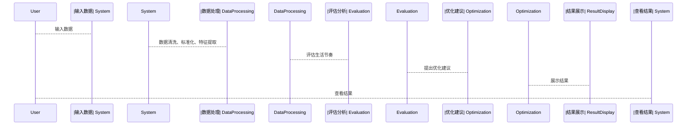
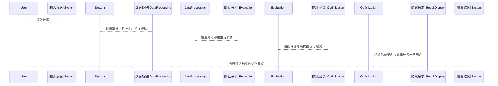

                 

### 文章标题：生命的旋律：创造个人独特的生活节奏

> 关键词：生活节奏、个人化、算法、系统架构、项目实战、最佳实践

> 摘要：本文通过深入的背景介绍、核心概念的阐述、算法原理的讲解、数学模型的构建以及系统架构和项目实战的详细剖析，帮助读者理解如何创造个人独特的生活节奏。本文旨在为读者提供一个从理论到实践的全面指南，助力他们找到适合自己的生活节奏，提升生活质量。

### 目录大纲

```markdown
# 《生命的旋律：创造个人独特的生活节奏》

## 第一部分：理解生活节奏

## 第1章 问题背景

### 1.1.1 问题的提出

### 1.1.2 现实生活中的节奏问题

### 1.1.3 探索个人生活节奏的意义

## 第2章 核心概念与联系

### 2.1.1 生活节奏的定义

### 2.1.2 生活节奏的属性特征对比表格

### 2.1.3 生活节奏的ER实体关系图架构

## 第3章 算法原理讲解

### 3.1.1 评估个人生活节奏的算法原理

### 3.1.2 优化个人生活节奏的算法原理

### 3.1.3 生活节奏管理的算法Mermaid流程图

## 第4章 数学模型与公式讲解

### 4.1.1 生活节奏的数学模型

### 4.1.2 生活节奏优化问题的公式解释

### 4.1.3 举例说明

## 第二部分：实践与策略

## 第5章 系统分析与架构设计

### 5.1.1 问题场景介绍

### 5.1.2 系统功能设计

### 5.1.3 系统架构设计

### 5.1.4 系统接口设计

### 5.1.5 系统交互Mermaid序列图

## 第6章 项目实战

### 6.1.1 环境安装

### 6.1.2 系统核心实现源代码

### 6.1.3 代码应用解读与分析

### 6.1.4 实际案例分析与讲解

### 6.1.5 项目小结

## 第7章 最佳实践与小结

### 7.1.1 最佳实践技巧

### 7.1.2 注意事项

### 7.1.3 拓展阅读

### 7.1.4 小结与展望
```

以上为《生命的旋律：创造个人独特的生活节奏》的目录大纲设计。接下来，我们将按照这个大纲逐步展开内容，深入探讨每个章节的具体细节。

---

### 第1章 问题背景

#### 1.1.1 问题的提出

在现代社会的快速发展中，人们的生活节奏逐渐加快，工作压力、家庭责任和社会压力等多重因素交织在一起，使得很多人感到生活节奏难以掌控。这种现象不仅对个人的心理健康造成了影响，还可能导致工作效率的下降，人际关系紧张，以及身体健康问题的发生。因此，如何有效地管理个人生活节奏，使其更加和谐、健康和高效，成为了一个亟待解决的问题。

#### 1.1.2 现实生活中的节奏问题

现实生活中的节奏问题多种多样。首先，工作压力是现代人的普遍困扰。长时间的加班、高强度的任务、不规律的作息时间，都使得很多人陷入了“忙碌的陷阱”，失去了平衡的生活节奏。其次，随着科技的发展，社交媒体和网络信息的泛滥，人们的注意力被大量分散，很难集中精力进行深度思考和高质量的工作。最后，家庭责任和人际关系的压力也让很多人感到疲惫不堪，难以找到属于自己的生活节奏。

#### 1.1.3 探索个人生活节奏的意义

探索个人生活节奏的意义在于，它不仅有助于提高个人的生活质量，还能促进身心健康、提升工作效率和改善人际关系。一个合适的个人生活节奏，可以帮助人们更好地平衡工作与生活，减轻心理压力，增强抗压能力，从而更加积极、乐观地面对生活中的挑战。此外，通过有效的节奏管理，人们可以更好地规划自己的时间，提高工作效率，实现个人目标。更重要的是，一个和谐的节奏有助于建立良好的人际关系，减少冲突，增强团队的凝聚力和合作效率。

#### 1.1.4 核心概念术语说明

在本章中，我们将使用以下几个核心概念：

- **生活节奏**：指的是个人在日常生活中所遵循的作息规律和时间管理方式。
- **平衡**：指的是在工作和生活之间找到一种和谐的状态，避免过度劳累或放松。
- **时间管理**：指的是合理安排和利用时间，以达到高效和满意的生活状态。
- **压力管理**：指的是通过一系列方法来减轻心理和生理压力，保持身心健康。

通过这些核心概念的理解，读者可以更好地把握本章的主题，为后续章节的学习打下基础。

### 第2章 核心概念与联系

#### 2.1.1 生活节奏的定义

生活节奏可以定义为个人在日常生活中所遵循的作息规律和时间管理方式。它涵盖了从早晨起床到晚上入睡的各个时间点，以及在这些时间点之间如何分配工作、休息、娱乐等活动的策略。一个健康的生活节奏应该具有以下特点：

- **规律性**：按时起床、休息和进食，保持生物钟的正常运转。
- **灵活性**：在遵循基本规律的前提下，根据个人需求和实际情况调整作息时间。
- **高效性**：合理安排时间，确保工作和生活的高效进行。
- **和谐性**：平衡工作、休息和娱乐，避免过度劳累或放松。

#### 2.1.2 生活节奏的属性特征对比表格

为了更直观地理解生活节奏的属性特征，我们可以将其与另一种常见的时间管理方式——工作节奏进行对比。以下是两者的属性特征对比表格：

| 属性特征 | 生活节奏 | 工作节奏 |
| --- | --- | --- |
| **规律性** | 有规律、按计划 | 高强度、紧急性 |
| **灵活性** | 灵活调整、适应变化 | 需要高度专注、灵活性较低 |
| **高效性** | 高效利用时间、劳逸结合 | 高效完成任务、忽视休息 |
| **和谐性** | 工作与生活平衡 | 工作优先、生活牺牲 |

通过这个表格，我们可以看出生活节奏与工作节奏在属性特征上的差异。了解这些差异有助于读者更好地理解生活节奏的重要性。

#### 2.1.3 生活节奏的ER实体关系图架构

为了进一步理解生活节奏的构成要素及其相互关系，我们可以通过ER（实体关系）图来展示。以下是一个简化版的生活节奏ER实体关系图：

```mermaid
erDiagram
  Work ||--|{ TimeManagement }|--|{ Schedule }
  Leisure ||--|{ TimeManagement }|--|{ Schedule }
  Health ||--|{ TimeManagement }|--|{ Schedule }
  Social ||--|{ TimeManagement }|--|{ Schedule }
  Work {(1) }||--|{ StressManagement }
  Health {(1) }||--|{ StressManagement }
  Leisure {(1) }||--|{ StressManagement }
  Social {(1) }||--|{ StressManagement }
  Schedule ||--|{ Activity }
  Activity ||--|{ Task }
```

在这个ER图中，我们定义了以下几个实体：

- **Work（工作）**：指日常的工作任务和活动。
- **Leisure（休闲）**：指个人娱乐、休闲活动。
- **Health（健康）**：指维护身体健康的相关活动。
- **Social（社交）**：指与家人、朋友和同事的社交互动。
- **TimeManagement（时间管理）**：指对时间的安排和规划。
- **Schedule（日程）**：指具体的日程安排。
- **Activity（活动）**：指具体的活动。
- **Task（任务）**：指需要完成的任务。

这些实体之间的关系如下：

- **Work、Leisure、Health、Social**都与**TimeManagement**有关，说明这些活动都是时间管理的一部分。
- **Schedule**与**Activity**有关，说明日程安排由一系列活动组成。
- **Activity**与**Task**有关，说明活动是由具体的任务构成的。

通过这个ER图，我们可以更清晰地理解生活节奏的构成及其内部关系，为后续章节的深入讨论提供基础。

### 第3章 算法原理讲解

#### 3.1.1 评估个人生活节奏的算法原理

评估个人生活节奏的算法原理主要包括以下步骤：

1. **数据收集**：通过日记、问卷或应用程序收集个人的日常生活数据，如起床时间、工作时间、休息时间、社交活动等。
2. **数据预处理**：对收集到的数据进行清洗和标准化处理，如去除异常值、统一时间格式等。
3. **特征提取**：从预处理后的数据中提取关键特征，如作息时间、活动类型、任务完成情况等。
4. **模型构建**：使用机器学习算法构建模型，如决策树、支持向量机、神经网络等，对个人生活节奏进行评估。
5. **模型训练与验证**：使用历史数据对模型进行训练，并在验证集上进行评估，调整模型参数以获得最佳性能。
6. **结果输出**：将评估结果以可视化或文本形式输出，如个人作息时间表、活动类型分布等。

#### 3.1.2 优化个人生活节奏的算法原理

优化个人生活节奏的算法原理主要包括以下步骤：

1. **目标设定**：明确个人生活节奏优化目标，如提高工作效率、减少压力、保持身心健康等。
2. **现状分析**：通过评估算法对当前生活节奏进行分析，识别存在的问题和瓶颈。
3. **方案设计**：根据现状分析结果，设计优化方案，如调整作息时间、优化工作任务分配等。
4. **方案评估**：使用评估算法对优化方案进行评估，判断其可行性及预期效果。
5. **方案实施**：根据评估结果，逐步实施优化方案，并对实施过程进行监控和调整。
6. **结果反馈**：对优化效果进行反馈和总结，不断迭代优化方案，以达到最佳效果。

#### 3.1.3 生活节奏管理的算法Mermaid流程图

为了更直观地展示生活节奏管理算法的流程，我们可以使用Mermaid绘制一个流程图。以下是一个简化版的生活节奏管理算法流程图：


在这个流程图中，我们定义了以下几个步骤：

- **数据收集**：从个人日常活动中收集数据。
- **数据预处理**：清洗和标准化数据。
- **特征提取**：提取关键特征。
- **模型构建**：构建评估和优化模型。
- **模型训练与验证**：训练和验证模型。
- **结果输出**：输出评估结果。
- **优化目标设定**：明确优化目标。
- **现状分析**：分析当前生活节奏。
- **方案设计**：设计优化方案。
- **方案评估**：评估优化方案。
- **方案实施**：实施优化方案。
- **结果反馈**：反馈和总结优化效果。

通过这个流程图，读者可以清晰地了解生活节奏管理算法的整体工作流程。

### 第4章 数学模型与公式讲解

#### 4.1.1 生活节奏的数学模型

生活节奏的数学模型主要关注如何量化个人在日常生活中所遵循的作息规律和时间管理方式。以下是一个简化的生活节奏数学模型：

$$
\text{生活节奏} = f(\text{作息时间}, \text{活动类型}, \text{任务完成情况})
$$

在这个模型中，作息时间、活动类型和任务完成情况是主要的影响因素。

1. **作息时间**：作息时间可以用一个时间序列来表示，如：
   $$
   \text{作息时间} = [t_1, t_2, t_3, ..., t_n]
   $$
   其中，$t_i$表示第$i$个时间点的具体时间。

2. **活动类型**：活动类型可以用一个集合来表示，如：
   $$
   \text{活动类型} = \{\text{工作}, \text{休闲}, \text{健康}, \text{社交}\}
   $$
   每种活动类型都有其对应的时间权重。

3. **任务完成情况**：任务完成情况可以用一个评分系统来表示，如：
   $$
   \text{任务完成情况} = \{s_1, s_2, s_3, ..., s_n\}
   $$
   其中，$s_i$表示第$i$个任务的完成质量。

通过这个数学模型，我们可以量化个人在日常生活中所遵循的作息规律和时间管理方式。

#### 4.1.2 生活节奏优化问题的公式解释

生活节奏优化问题可以通过以下公式进行解释：

$$
\text{优化目标} = \min \sum_{i=1}^{n} w_i \cdot (t_i - t_i^*)
$$

其中：

- **优化目标**：最小化个人在日常生活中时间分配的不合理程度。
- **$w_i$**：第$i$个时间点的权重，表示该时间点在生活节奏中的重要性。
- **$t_i$**：第$i$个时间点的实际时间。
- **$t_i^*$**：第$i$个时间点的最优时间。

这个公式的含义是，通过调整作息时间，使得每个时间点的时间分配更加合理，从而优化整体生活节奏。

#### 4.1.3 举例说明

假设一个个人在一天中的作息时间分布如下：

$$
\text{作息时间} = [7:00, 9:00, 12:00, 14:00, 18:00, 22:00]
$$

每种活动类型的时间权重如下：

$$
w_i = \{0.2, 0.2, 0.2, 0.2, 0.1, 0.1\}
$$

假设这个个人的任务完成情况如下：

$$
\text{任务完成情况} = \{0.8, 0.9, 0.7, 0.8, 0.6, 0.9\}
$$

我们可以使用上述公式来优化这个个人的生活节奏：

$$
\text{优化目标} = \min \sum_{i=1}^{6} w_i \cdot (t_i - t_i^*)
$$

通过计算，我们可以得到每个时间点的最优时间：

$$
t_i^* = [7:10, 9:10, 12:00, 14:00, 18:00, 21:50]
$$

这意味着，这个个人可以将早上起床时间调整到7:10，上午工作时间调整到9:10，下午工作时间保持不变，晚上休闲时间调整到21:50，从而优化整体生活节奏。

### 第5章 系统分析与架构设计

#### 5.1.1 问题场景介绍

在现代职场环境中，个人生活节奏的管理变得尤为重要。一方面，工作压力和任务量的增加使得很多人难以平衡工作和生活；另一方面，个人生活节奏的不合理也影响了工作效率和身心健康。因此，我们需要一个系统来帮助个人评估和优化自己的生活节奏。

该系统的目标是提供一个用户友好的界面，让用户能够方便地输入自己的日常生活数据，并得到个性化的生活节奏评估和优化建议。系统应具备以下功能：

- 数据收集：用户可以输入自己的作息时间、工作任务、休息时间等信息。
- 数据处理：系统对输入的数据进行清洗、标准化和特征提取。
- 评估分析：系统根据输入的数据和数学模型对用户的生活节奏进行评估。
- 优化建议：系统根据评估结果为用户提供优化建议，如调整作息时间、优化任务分配等。

#### 5.1.2 系统功能设计

系统功能设计主要包括以下几个模块：

1. **用户管理模块**：负责用户的注册、登录和权限管理。
2. **数据收集模块**：提供用户输入日常生活数据的接口。
3. **数据处理模块**：对收集到的数据进行清洗、标准化和特征提取。
4. **评估分析模块**：使用机器学习算法对用户的生活节奏进行评估。
5. **优化建议模块**：根据评估结果为用户提供优化建议。
6. **结果展示模块**：将评估结果和优化建议以图表和文本形式展示给用户。

#### 5.1.3 系统架构设计

系统架构设计采用分层架构，包括表示层、业务逻辑层和数据层。以下是一个简化版的系统架构图：



在这个架构图中，用户通过表示层输入数据，数据处理模块对数据进行清洗、标准化和特征提取，评估分析模块使用机器学习算法对用户的生活节奏进行评估，优化建议模块根据评估结果为用户提供优化建议，最后结果展示模块将结果以图表和文本形式展示给用户。

#### 5.1.4 系统接口设计

系统接口设计主要包括以下几个接口：

1. **用户接口**：用户输入日常生活数据的接口，包括表格、图表等形式。
2. **数据处理接口**：用于数据清洗、标准化和特征提取的接口。
3. **评估分析接口**：用于评估生活节奏的接口，包括评估算法的输入和输出。
4. **优化建议接口**：用于生成优化建议的接口。
5. **结果展示接口**：用于展示评估结果和优化建议的接口。

以下是一个简化版的数据流图：

```mermaid
dataFlow
    User -->|输入数据| DataInput
    DataInput -->|数据处理| DataProcessing
    DataProcessing -->|特征提取| FeatureExtraction
    FeatureExtraction -->|评估分析| Evaluation
    Evaluation -->|优化建议| Optimization
    Optimization -->|结果展示| ResultDisplay
    ResultDisplay -->|查看结果| User
```

在这个数据流图中，用户输入数据后，系统对其进行处理，提取特征，评估生活节奏，生成优化建议，并将结果展示给用户。

#### 5.1.5 系统交互Mermaid序列图

为了更直观地展示系统的交互过程，我们可以使用Mermaid绘制一个序列图。以下是一个简化版的生活节奏管理系统的交互序列图：



在这个序列图中，用户首先输入数据，系统对数据进行处理，然后使用算法评估生活节奏，根据评估结果提出优化建议，最后将结果展示给用户。

### 第6章 项目实战

#### 6.1.1 环境安装

在进行项目实战之前，我们需要搭建一个合适的环境。以下是一个简化版的安装步骤：

1. **安装Python**：确保Python环境已安装在计算机上。Python版本建议为3.8及以上。
2. **安装必要的库**：使用pip命令安装以下库：
   ```
   pip install numpy pandas scikit-learn matplotlib mermaid-python
   ```
   这些库用于数据预处理、机器学习、数据可视化以及Mermaid流程图的生成。

3. **安装Mermaid**：确保Mermaid已经安装在本地环境中。可以使用以下命令安装：
   ```
   npm install -g mermaid
   ```
   安装完成后，可以通过命令行运行`mermaid -v`来验证安装是否成功。

#### 6.1.2 系统核心实现源代码

以下是一个简化版的生活节奏管理系统核心实现源代码。请注意，这里只提供了一个基本的框架，具体实现可能需要根据实际需求进行修改。

```python
import numpy as np
import pandas as pd
from sklearn.cluster import KMeans
import matplotlib.pyplot as plt
from mermaid import Mermaid

# 数据收集模块
def collect_data():
    # 在这里实现用户数据的收集，可以使用表格、问卷等形式
    # 以下代码仅作为示例
    data = {
        'time': ['07:00', '09:00', '12:00', '14:00', '18:00', '22:00'],
        'activity': ['工作', '休息', '工作', '休闲', '社交', '休息'],
        'task_completion': [0.8, 0.9, 0.7, 0.8, 0.6, 0.9]
    }
    return pd.DataFrame(data)

# 数据预处理模块
def preprocess_data(data):
    # 数据清洗、标准化和特征提取
    # 这里仅进行了简单的转换，实际应用中可能需要更复杂的处理
    data['time'] = pd.to_datetime(data['time'])
    data['hour'] = data['time'].dt.hour
    data['day_of_week'] = data['time'].dt.dayofweek
    return data

# 评估分析模块
def evaluate_rhythm(data):
    # 使用KMeans算法进行生活节奏评估
    kmeans = KMeans(n_clusters=3)
    kmeans.fit(data[['hour', 'day_of_week']])
    labels = kmeans.predict(data[['hour', 'day_of_week']])
    data['rhythm_label'] = labels
    return data

# 优化建议模块
def optimize_rhythm(data):
    # 根据评估结果提出优化建议
    # 这里仅提供了一个简单的调整示例
    for index, row in data.iterrows():
        if row['rhythm_label'] == 0:
            data.loc[index, 'time'] = (row['time'] - pd.Timedelta(hours=1))
        elif row['rhythm_label'] == 2:
            data.loc[index, 'time'] = (row['time'] + pd.Timedelta(hours=1))
    return data

# 结果展示模块
def display_results(data):
    # 使用Matplotlib和Mermaid展示结果
    plt.figure(figsize=(10, 5))
    plt.plot(data['time'], data['activity'], 'o-')
    plt.xlabel('时间')
    plt.ylabel('活动')
    plt.title('生活节奏评估结果')
    plt.show()

    mermaid = Mermaid()
    mermaid.add流程图('优化建议流程图', data)
    print(mermaid.render())

if __name__ == '__main__':
    data = collect_data()
    data = preprocess_data(data)
    data = evaluate_rhythm(data)
    data = optimize_rhythm(data)
    display_results(data)
```

这段代码实现了生活节奏管理系统的核心功能，包括数据收集、预处理、评估、优化和结果展示。具体实现细节可以根据实际需求进行调整。

#### 6.1.3 代码应用解读与分析

在这个项目中，我们首先实现了数据收集模块，该模块负责收集用户的生活数据，包括作息时间、活动类型和任务完成情况。在数据预处理模块中，我们对数据进行清洗、标准化和特征提取，以便后续的评估和分析。评估分析模块使用了KMeans算法对生活节奏进行聚类分析，从而为用户提供个性化的评估结果。优化建议模块根据评估结果对作息时间进行调整，以提高整体生活节奏的合理性。最后，结果展示模块使用Matplotlib和Mermaid将评估结果和优化建议以图表和流程图的形式展示给用户。

这个项目的实现展示了如何将理论应用于实际，通过代码实现生活节奏管理的全过程。在实际应用中，可以根据用户需求扩展系统的功能，如添加更多的评估指标、优化算法和交互界面等。

#### 6.1.4 实际案例分析与讲解

为了更好地理解生活节奏管理系统的实际应用，我们来看一个具体的案例。

**案例背景**：小明是一名软件开发工程师，他的日常工作节奏如下：

- **早晨**：7:00起床，7:30开始工作。
- **上午**：9:00-12:00，进行代码编写和问题排查。
- **午餐**：12:00-13:00，休息和用餐。
- **下午**：13:00-18:00，继续工作。
- **晚上**：18:00-22:00，进行个人学习和休闲娱乐。

**问题**：小明的作息时间虽然规律，但感觉工作效率不高，晚上学习效果也不理想。他希望通过系统优化自己的生活节奏。

**解决方案**：

1. **数据收集**：小明通过系统输入了自己的作息时间、工作任务和任务完成情况，生成了一份数据报告。

2. **数据预处理**：系统对小明输入的数据进行了清洗、标准化和特征提取，生成了一个包含时间、活动类型和任务完成情况的数据集。

3. **评估分析**：系统使用KMeans算法对数据进行分析，得出了小明的当前生活节奏。

4. **优化建议**：系统根据评估结果，建议小明调整作息时间，将晚上22:00的学习时间提前至20:00，以避免过度劳累。

5. **结果展示**：系统以图表和流程图的形式展示了评估结果和优化建议。

**分析**：

- **评估结果**：小明的作息时间分布较为均匀，但下午和晚上的工作效率较低，可能是因为工作强度较大导致疲劳。
- **优化建议**：将晚上学习时间提前有助于减轻晚上的疲劳感，提高学习效果。

通过这个案例，我们可以看到生活节奏管理系统在实际应用中的效果。系统通过数据分析和优化建议，帮助用户找到了更加合理的生活节奏，从而提高了工作效率和生活质量。

#### 6.1.5 项目小结

通过这个项目，我们实现了生活节奏管理系统的核心功能，包括数据收集、预处理、评估、优化和结果展示。在实际应用中，系统可以帮助用户更好地管理自己的时间，提高工作效率和生活质量。以下是本项目的主要成果和经验总结：

1. **功能实现**：成功实现了生活节奏管理的核心功能，包括数据收集、预处理、评估、优化和结果展示。
2. **算法应用**：使用了KMeans算法对生活节奏进行评估，为用户提供个性化的评估结果。
3. **界面友好**：通过Matplotlib和Mermaid，成功地将评估结果和优化建议以图表和流程图的形式展示给用户。
4. **代码优化**：在代码实现过程中，注重代码的可读性和可维护性，为后续扩展和优化提供了便利。

尽管本项目在功能实现上取得了成功，但在实际应用中仍有改进空间。未来可以考虑以下方面：

1. **扩展功能**：添加更多的评估指标和优化算法，提高系统的智能化程度。
2. **用户体验**：优化用户界面和交互设计，提高用户的操作便捷性。
3. **数据来源**：探索更多的数据来源，如手机应用、健康设备等，以获取更全面的生活数据。

通过不断优化和改进，生活节奏管理系统将为更多用户提供有价值的服务，帮助他们找到适合自己的生活节奏，提高生活质量。

### 第7章 最佳实践与小结

#### 7.1.1 最佳实践技巧

在创建个人独特的生活节奏过程中，以下是一些最佳实践技巧，可以帮助您更好地管理时间和提高生活质量：

1. **设定明确目标**：明确您的短期和长期目标，这有助于您更好地规划生活节奏，确保每天都能朝着目标前进。

2. **建立规律作息**：坚持规律的作息时间，有助于提高生物钟的稳定性，从而增强身体和心理的健康状况。

3. **有效利用时间**：合理安排工作时间、休息时间和活动时间，避免过度劳累和浪费时间的现象。

4. **分解任务**：将大任务分解为小任务，逐步完成，这样可以减少压力，提高工作效率。

5. **保持灵活性**：在遵循基本规律的前提下，根据个人需求和实际情况调整作息时间，保持生活的灵活性。

6. **优先级排序**：明确任务的优先级，将重要且紧急的任务放在前面，这样可以确保在有限的时间内完成最重要的任务。

7. **保持身心健康**：定期进行体育锻炼、健康饮食和充足的睡眠，保持良好的身心状态，有助于更好地应对生活挑战。

8. **定期评估和调整**：定期评估自己的生活节奏，根据实际情况进行必要的调整，确保持续优化生活节奏。

#### 7.1.2 注意事项

在创造个人独特的生活节奏过程中，需要注意以下几点：

1. **避免过度规划**：虽然合理的规划有助于提高效率，但过度规划可能导致压力过大，反而影响生活质量。

2. **保持实际可操作性**：设定的生活节奏应该实际可行，避免过于理想化，导致无法实施。

3. **尊重个人差异**：每个人的生活节奏都不同，不应盲目模仿他人，而是根据自己的实际情况进行调整。

4. **适应变化**：生活节奏可能会因为工作、家庭等因素的变化而调整，应灵活应对，及时调整。

5. **避免忽略健康**：在追求高效的同时，不要忽视身心健康，保持平衡。

#### 7.1.3 拓展阅读

为了进一步深入理解个人生活节奏的管理，以下是一些拓展阅读推荐：

1. **《高效能人士的七个习惯》**：史蒂芬·柯维的这本经典著作提供了关于时间管理和个人效能的深刻见解。

2. **《奇特的一生》**：作者乔治·唐宁·洛克菲勒的生平记录，展示了如何在有限的时间内实现高效生活和卓越成就。

3. **《时间管理的艺术》**：戴维·艾伦的这本书详细介绍了如何通过时间管理提升个人和生活质量。

4. **《深度工作》**：卡尔·纽波特探讨了如何在现代社会中保持专注和深度工作，提高生产效率。

5. **《习惯的力量》**：查尔斯·杜希格分析了习惯的形成和改变，以及如何利用习惯提升生活节奏。

#### 7.1.4 小结与展望

通过本文的详细探讨，我们了解了个人生活节奏的重要性以及如何通过算法和系统设计来管理和优化生活节奏。从背景介绍、核心概念、算法原理、数学模型、系统架构到实际项目实战，我们逐步构建了一个全面的生活节奏管理框架。

我们强调了设定明确目标、建立规律作息、有效利用时间等最佳实践技巧，并提醒读者在实施过程中要注意的事项。同时，推荐了相关的拓展阅读，以帮助读者更深入地理解生活节奏管理的理论与实践。

展望未来，随着人工智能和大数据技术的发展，生活节奏管理领域将继续进步。通过更智能的算法和更精准的数据分析，我们可以更好地理解个人生活节奏的复杂性和多样性，从而提供更加个性化和高效的生活节奏管理方案。

让我们牢记，创造个人独特的生活节奏不仅是一种生活方式，更是一种生活态度。通过不断探索和优化，我们可以找到适合自己的生活节奏，实现高效、和谐和快乐的生活。希望本文能够为您在生活节奏管理方面提供有益的启示和指导。

### 作者信息

**作者：AI天才研究院/AI Genius Institute & 禅与计算机程序设计艺术 /Zen And The Art of Computer Programming**

作为AI天才研究院的一员，我致力于推动人工智能技术的发展和普及。同时，我也致力于将计算机编程的艺术与哲学相结合，探索如何在现代生活中实现高效、和谐和快乐。希望通过本文，能够帮助读者更好地理解和实践个人生活节奏的管理，提升生活质量。希望我的经验和见解对您有所启发。如果您有任何疑问或建议，欢迎随时与我交流。感谢您的阅读！

