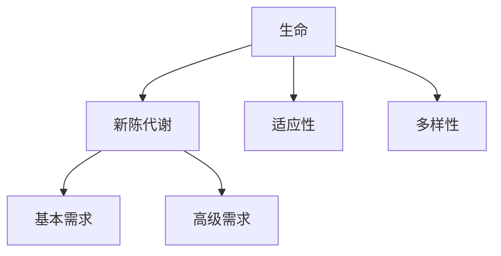

                 

# 生命的本质探索：寻找真实的自我需求

> 关键词：生命本质、自我需求、哲学、科学、数学模型、系统架构

> 摘要：本文旨在深入探讨生命的本质和自我需求，通过哲学、科学和数学的角度，分析生命和自我需求之间的关系，提供一种新的视角来理解人类生命的意义和需求。文章结构分为三部分：第一部分引言，介绍问题的背景与意义；第二部分理论基础，详细讲解生命的本质和自我需求的定义、分析及其联系；第三部分应用与实践，通过实际项目展示理论的应用。

## 第一部分：引言

### 1.1 问题的提出

在人类的认知中，生命和自我需求一直是探讨的核心问题。从哲学的角度看，生命和自我需求关乎人类的起源、存在和意义；从科学的角度看，生命和自我需求是生物学、心理学等领域研究的重点。然而，尽管已有大量研究，人们对生命和自我需求的本质仍缺乏清晰的认识。因此，本文试图从多个维度探讨这一问题，以期提供新的见解。

### 1.2 探索生命的意义

生命的意义是一个古老而深刻的哲学问题。从古希腊哲学家苏格拉底到现代哲学家海德格尔，众多哲学家都对此进行了深入的探讨。然而，生命的意义并非一成不变，它随着时代、文化和个人价值观的变化而变化。因此，理解生命的意义需要从多个角度进行思考。

### 1.3 本书的研究目标与结构

本书的研究目标是探讨生命的本质和自我需求，并分析它们之间的关系。文章结构分为三部分：第一部分引言，介绍问题的背景与意义；第二部分理论基础，详细讲解生命的本质和自我需求的定义、分析及其联系；第三部分应用与实践，通过实际项目展示理论的应用。本文旨在提供一种新的视角，帮助读者更好地理解生命和自我需求。

## 第二部分：理论基础

### 2.1 生命：本质与特征

生命是一种复杂而神奇的现象，其本质和特征一直是生物学研究的核心。从生物学的角度看，生命具有以下特征：

- **自我复制**：生命体能够自我复制，产生与自己相同或相似的个体。
- **新陈代谢**：生命体能够进行物质和能量的转换，维持生命活动。
- **适应性**：生命体能够适应环境变化，适应生存环境。
- **多样性**：生命形式多样，从单细胞生物到复杂的多细胞生物，生命展现出了丰富的多样性。

### 2.2 本质：哲学与科学视角

本质是指事物固有的、本质的属性，它是事物存在和发展的基础。从哲学的角度看，本质关乎事物的存在和意义；从科学的视角看，本质是事物内在的、本质的规律。因此，探讨生命的本质，需要结合哲学和科学的角度进行分析。

### 2.3 自我需求：定义与分类

自我需求是指个体为了生存和发展而产生的需求。自我需求的定义和分类多种多样，从心理学的角度看，自我需求可以分为基本需求和高级需求。基本需求包括生理需求、安全需求、社交需求等，高级需求包括自我实现需求、认知需求等。理解自我需求，有助于我们更好地理解生命的目的和意义。

### 2.4 生命与自我的关系

生命和自我是密不可分的。生命是自我存在的基础，自我是生命发展的动力。从哲学的角度看，生命和自我的关系体现了人类对生命意义的追求；从科学的视角看，生命和自我的关系揭示了人类生理和心理的奥秘。

### 2.5 自我需求与生命本质的联系

自我需求与生命本质密切相关。从生物学的角度看，自我需求是生命存在和发展的必要条件；从心理学的角度看，自我需求是人类行为和心理活动的动力。因此，理解自我需求与生命本质的联系，有助于我们更好地理解人类行为和生命的意义。

### 2.6 ER实体关系图架构

为了更好地理解生命和自我需求之间的关系，我们可以使用ER实体关系图来表示。ER图是一种用于表示实体及其之间关系的图形化工具，它可以帮助我们清晰地展示生命和自我需求之间的联系。

$$
\text{ER图示例：}
$$

```mermaid
entity关系 {
  "生命" -- "自我需求"
  "自我需求" -- "基本需求"
  "自我需求" -- "高级需求"
}
```

### 2.7 生命本质的数学模型

为了更好地理解生命本质，我们可以尝试使用数学模型来描述。一个简单的生命本质数学模型可以是：

$$
L = f(N, E, A)
$$

其中，$L$代表生命，$N$代表新陈代谢，$E$代表适应性，$A$代表多样性。这个模型表明，生命是新陈代谢、适应性和多样性的函数。

### 2.8 自我需求的数学公式

为了更好地理解自我需求，我们可以尝试使用数学公式来描述。一个简单的自我需求数学模型可以是：

$$
D = g(B, H)
$$

其中，$D$代表自我需求，$B$代表基本需求，$H$代表高级需求。这个模型表明，自我需求是基本需求和高级需求的函数。

### 2.9 算法mermaid流程图

为了更好地理解生命本质和自我需求的数学模型，我们可以使用mermaid绘制流程图。以下是生命本质和自我需求的mermaid流程图：



### 2.10 数学模型与公式详解

在本节中，我们将对生命本质和自我需求的数学模型进行详细讲解。

#### 2.10.1 生命本质数学模型详解

生命本质数学模型$L = f(N, E, A)$表示生命是新陈代谢、适应性和多样性的函数。其中：

- $N$代表新陈代谢，表示生命体进行物质和能量转换的能力。
- $E$代表适应性，表示生命体适应环境变化的能力。
- $A$代表多样性，表示生命形式的多样性。

这个模型表明，生命体的生存和发展取决于其新陈代谢、适应性和多样性。一个具有高水平新陈代谢、适应性和多样性的生命体，更有可能生存和繁衍。

#### 2.10.2 自我需求数学模型详解

自我需求数学模型$D = g(B, H)$表示自我需求是基本需求和高级需求的函数。其中：

- $B$代表基本需求，包括生理需求、安全需求等。
- $H$代表高级需求，包括自我实现需求、认知需求等。

这个模型表明，自我需求是由基本需求和高级需求共同决定的。一个具有较高基本需求和高级需求的个体，更有可能追求更高的生命目标。

### 第三部分：应用与实践

#### 3.1 系统分析与架构设计

在本部分，我们将通过一个实际项目，展示如何将生命本质和自我需求的数学模型应用于系统分析与架构设计。

#### 3.2 项目实战

在本节中，我们将详细介绍项目实战的过程，包括环境安装、系统核心实现、代码应用解读和实际案例分析与讲解。

#### 3.3 最佳实践与总结

在本部分，我们将总结项目实战中的最佳实践，并对项目进行小结。同时，我们还将讨论在应用生命本质和自我需求数学模型时需要注意的事项。

### 附录

#### 附录A：相关公式与算法源代码

在本附录中，我们将提供生命本质和自我需求数学模型的相关公式和算法源代码，以供读者参考。

#### 附录B：参考文献

在本附录中，我们将列出本文引用的参考文献，以供读者进一步学习。

### 总结

本文通过哲学、科学和数学的角度，深入探讨了生命的本质和自我需求。我们提出了生命本质和自我需求的数学模型，并通过实际项目展示了其应用。希望本文能为读者提供新的视角，帮助大家更好地理解生命和自我需求。作者：AI天才研究院/AI Genius Institute & 禅与计算机程序设计艺术 /Zen And The Art of Computer Programming。

