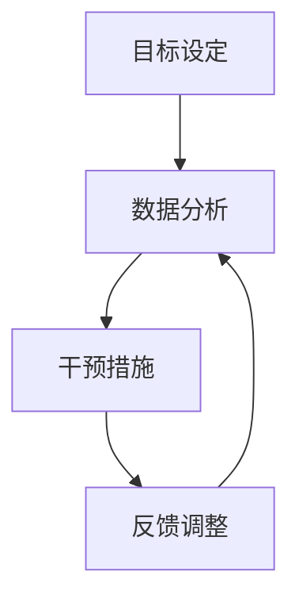
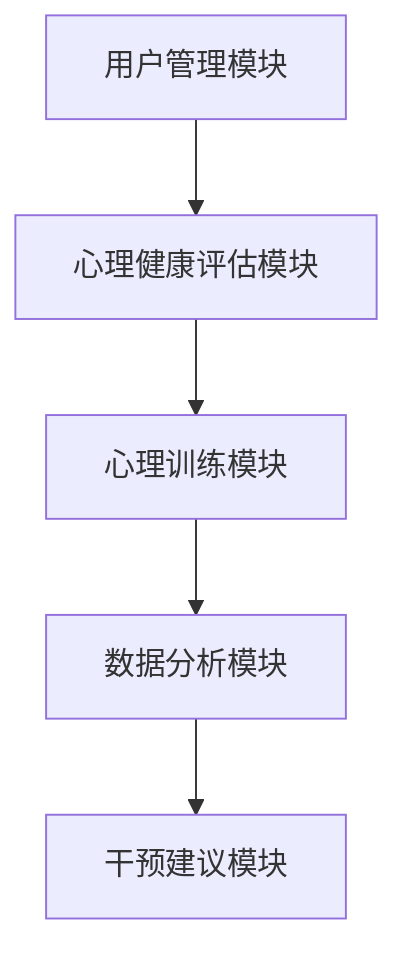
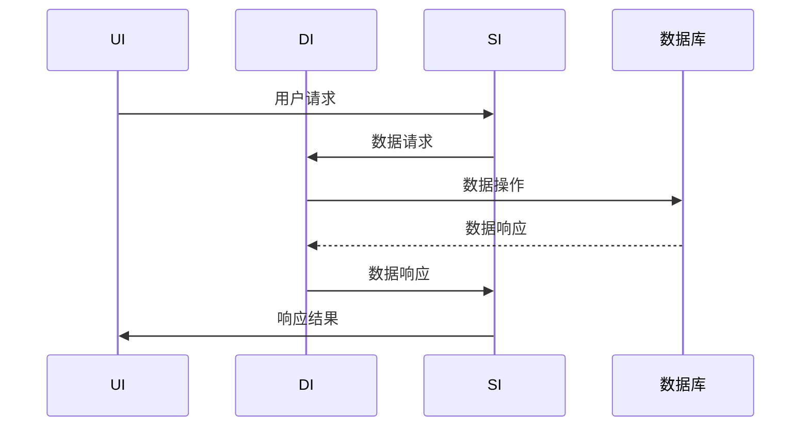
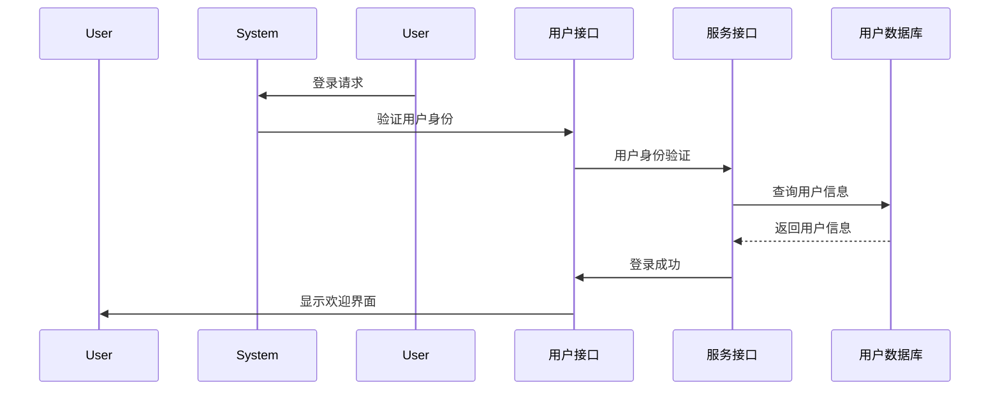

                 

### 引言

在现代社会，人们对物质生活的追求愈演愈烈。从经济繁荣的都市到宁静的乡村，物质财富的积累似乎成为了衡量一个人成功与否的标准。然而，随着物质生活的不断丰富，人们的精神需求并未得到相应的满足，反而更加迷茫和焦虑。这种矛盾促使我们思考：生命的真正目的是什么？我们是否应该超越对物质的追求，探索更深层次的精神境界？

本文将围绕“生命的目的：超越物质追求的精神探索”这一主题，通过逻辑清晰、结构紧凑的篇章，帮助读者理解精神追求的重要性，以及如何在现代生活中实现精神成长。本文将从以下几个部分展开：

1. **问题背景**：介绍物质世界的局限性和精神追求的意义。
2. **核心概念与联系**：探讨精神追求的定义、属性及其与物质追求的对比。
3. **精神探索的算法原理**：讲解精神探索的基本原理、流程和数学模型。
4. **精神探索的数学模型**：详细阐述数学模型的建立和公式的应用。
5. **精神探索的系统架构设计**：分析问题场景、系统功能设计、架构设计、接口设计和系统交互。
6. **精神探索的实践与案例分析**：介绍实践环境安装、系统核心实现、代码解读与分析、案例分析以及详细讲解剖析。
7. **最佳实践与拓展阅读**：总结实践经验、注意事项、拓展阅读资源。

通过本文的深入探讨，我们希望能够引导读者跳出物质追求的桎梏，关注精神层面的成长，从而找到生命的真正目的。

### 第1章 问题背景

#### 1.1 物质世界的局限

物质世界是我们生活的舞台，从微观的原子、分子到宏观的星球、宇宙，无不充满了复杂的相互作用和变化。物质世界的基本规律可以归结为物理学的基本原理，如力学、电磁学、热力学等。这些原理不仅描述了物质的基本属性和行为，也为我们利用物质提供了理论基础。

然而，尽管物质世界为我们提供了丰富的资源和多样的生活方式，但它也有其局限性。首先，物质世界的变化是有界限的。根据物理学的基本原理，物质不能无限地创造或消灭，只能通过能量的转换和物质的转化进行变化。这种界限限制了我们在物质层面的追求，使得我们的物质需求始终无法完全得到满足。

其次，物质世界带来了许多负面效应。随着物质财富的积累，环境问题、资源短缺、社会不公等问题逐渐凸显。这些问题的根源在于我们对物质的过度追求和浪费，导致了生态系统的破坏和社会的不稳定。这些问题不仅影响了我们的生活质量，也威胁到了我们的生存环境。

#### 1.1.1 物质追求的局限性

物质追求是人类社会发展的重要动力，但它也带来了一些负面影响。首先，物质追求往往导致人们陷入不断的比较和竞争中。人们总是追求更高的物质财富和社会地位，但这种追求往往带来压力和焦虑。例如，许多人为了追求更高的收入，不得不加班加点工作，导致身心健康问题。

其次，物质追求可能导致人们的价值观扭曲。在一些情况下，物质财富被视为衡量个人成功和幸福的标准，而忽视了精神层面的需求。这种情况下，人们可能会过度追求物质，忽视了内心的平静和情感的联系，导致心理和情感问题。

最后，物质追求也可能导致社会的不公平。由于资源分配的不均，一些人能够获得更多的物质财富，而另一些人则陷入贫困和困境。这种不公平不仅影响了社会的稳定，也损害了人们的幸福感。

#### 1.2 精神追求的意义

与物质追求相比，精神追求有着完全不同的目标和意义。首先，精神追求注重内心的平静和自我认知。通过精神探索，人们可以找到内心的宁静，摆脱外界的干扰和压力，从而更好地理解自己和世界。

其次，精神追求有助于提升人的幸福感。物质追求虽然能够带来短期的满足感，但无法持久。相比之下，精神追求能够带来更深层次的满足和幸福感，这种幸福感是持久的、深刻的。

此外，精神追求也有助于建立良好的人际关系。通过精神探索，人们可以更好地理解他人，建立更加真诚和有意义的关系。这种关系不仅能够提升个人的幸福感，也有助于社会的和谐与稳定。

#### 1.2.1 精神追求的途径

要实现精神追求，需要采取一系列的方法和途径。首先，内心平静是实现精神追求的基础。通过冥想、呼吸练习等方式，人们可以缓解内心的焦虑和压力，达到内心的平静。

其次，自我认知是实现精神追求的关键。通过反思和自我观察，人们可以更好地了解自己的内心世界，发现自己的需求和动机。这种自我认知有助于人们实现自我提升和成长。

最后，精神追求也需要结合具体的方法和实践。例如，通过阅读、冥想、艺术创作等方式，人们可以不断拓展自己的精神世界，提升自己的精神层次。

#### 1.3 问题解决

为了解决现代社会面临的物质追求和精神追求的矛盾，我们需要采取一系列措施。首先，在政策层面，政府应加大对精神文化的投入，推广和普及心理健康教育，提高公众对精神追求的认识。

其次，在社会层面，应倡导公平和可持续的发展理念，减少物质追求带来的负面影响，促进社会的和谐与稳定。

最后，在个人层面，每个人应主动寻求精神成长，通过内心平静和自我认知，提升自己的精神层次，实现生命的真正目的。

#### 1.4 边界与外延

物质追求和精神追求并不是截然分开的，而是相互影响、相互渗透的。物质追求可以为精神追求提供物质基础，而精神追求也可以为物质追求提供精神动力。在实际生活中，我们需要平衡物质追求和精神追求，使两者相互促进，共同发展。

#### 1.4.1 物质与精神的界限

物质和精神之间的界限并不是绝对的。从某种意义上说，物质和精神是相互转化的。例如，通过艺术创作，人们可以将物质转化为精神财富，通过科学探索，人们可以提升物质世界的理解和利用。

#### 1.4.2 精神追求的不同层面

精神追求可以分为多个层面，包括自我认知、情感管理、人际关系、社会参与等。每个层面都有其独特的价值和意义，共同构成了人类精神追求的完整体系。

#### 1.5 概念结构与核心要素组成

为了更好地理解生命的目的和精神追求，我们需要明确相关的概念结构和核心要素。生命的目的可以理解为人类存在的意义，它包括物质追求和精神追求两个层面。精神追求的核心要素包括内心平静、自我认知、情感管理、人际关系等。

通过以上对问题背景的深入探讨，我们可以看到，物质追求和精神追求是现代社会面临的两个重要议题。如何平衡这两者，找到生命的真正目的，是我们每个人都需要思考和解决的问题。

### 第2章 核心概念与联系

#### 2.1 精神追求的定义与属性

精神追求是指人类在物质生活之外，对内心平静、自我认知、情感管理、人际关系等方面进行深入探索和提升的过程。与物质追求不同，精神追求注重内心的满足和情感的深化，而不仅仅是物质财富的积累。

##### 2.1.1 精神追求的内涵

精神追求的内涵主要包括以下几个方面：

1. **内心平静**：通过冥想、呼吸练习等方法，人们可以缓解内心的焦虑和压力，达到一种内心的宁静状态。
2. **自我认知**：通过反思和自我观察，人们可以更好地了解自己的内心世界，发现自己的需求和动机。
3. **情感管理**：学会管理自己的情感，包括情绪调节、情绪表达等，以提升个人的心理健康。
4. **人际关系**：通过精神探索，人们可以更好地理解他人，建立更加真诚和有意义的人际关系。

##### 2.1.2 精神追求的维度

精神追求可以从多个维度进行理解：

1. **个体维度**：从个人的角度出发，精神追求关注个人的内心平静、自我认知和情感管理。
2. **社会维度**：从社会的角度出发，精神追求关注人际关系、社会参与和社会责任。
3. **文化维度**：从文化的角度出发，精神追求关注文化传承、艺术创作和精神文化的普及。

#### 2.2 精神追求与物质追求的对比

##### 2.2.1 物质追求的局限

物质追求是指人们通过积累财富、提升社会地位等方式来满足物质需求的过程。尽管物质追求在某种程度上推动了社会的发展，但它也存在一些局限：

1. **有限性**：物质财富的增长是有限的，而人类的需求是无限的，这种矛盾导致人们始终无法满足物质追求。
2. **负外部性**：物质追求可能导致环境破坏、资源短缺等问题，这些问题对人类和社会的长远发展构成威胁。
3. **心理压力**：物质追求往往带来巨大的心理压力，导致焦虑、抑郁等心理问题。

##### 2.2.2 精神追求的优势

与物质追求相比，精神追求具有以下优势：

1. **持久性**：精神追求带来的满足感和幸福感是持久的，不会因为物质财富的减少而消失。
2. **内部性**：精神追求关注内心的平静和自我认知，这种内部满足不依赖于外部的物质条件。
3. **心理健康**：精神追求有助于提升个人的心理健康，减少焦虑和抑郁等心理问题。

#### 2.3 精神追求的实践方法

##### 2.3.1 内心平静

内心平静是实现精神追求的基础，以下是一些实践方法：

1. **冥想**：通过冥想，人们可以专注于呼吸和身体感受，达到内心的平静。
2. **呼吸练习**：通过深呼吸，人们可以缓解压力，提高注意力。
3. **放松训练**：通过渐进性肌肉放松等方法，人们可以缓解身体的紧张和焦虑。

##### 2.3.2 自我认知

自我认知是实现精神追求的关键，以下是一些实践方法：

1. **反思日记**：通过记录每天的经历和感受，人们可以更好地了解自己。
2. **自我提问**：通过提出问题，如“我今天学到了什么？”“我今天的情绪如何？”等，人们可以反思自己的行为和情绪。
3. **心理咨询**：通过心理咨询，人们可以深入了解自己的内心世界，解决心理问题。

##### 2.4 精神追求的ER实体关系图架构

为了更好地理解精神追求的构成，我们可以使用ER（实体-关系）图来表示。以下是一个简化的精神追求的ER图：

```mermaid
erDiagram
  Product "内心平静" ||--|{ User } : has
  Product "自我认知" ||--|{ User } : has
  Product "情感管理" ||--|{ User } : has
  Product "人际关系" ||--|{ User } : has
```

在这个ER图中，用户（User）是主体，而内心平静、自我认知、情感管理和人际关系则是用户的属性（Product）。这种关系表示了精神追求的核心要素及其与用户之间的关联。

通过以上对核心概念与联系的探讨，我们可以看到精神追求与物质追求在内涵、维度和实践方法上存在显著差异。理解这些差异有助于我们更好地实现精神追求，找到生命的真正目的。

### 第3章 精神探索的算法原理

#### 3.1 算法原理概述

精神探索的算法原理旨在帮助人们理解和实现精神追求，通过一系列科学的方法和步骤，逐步提升个体的内心平静、自我认知和情感管理能力。以下是精神探索算法的基本原理：

1. **目标设定**：明确个人精神追求的目标，如内心平静、自我认知提升等。
2. **数据分析**：收集和分析个人的情绪、心理和行为数据，以了解当前的精神状态。
3. **干预措施**：根据数据分析结果，制定相应的干预措施，如冥想、呼吸练习、心理咨询等。
4. **反馈调整**：通过持续的反馈和调整，优化干预措施，以达到最佳效果。

#### 3.2 算法流程与mermaid流程图

为了更清晰地展示精神探索算法的流程，我们可以使用mermaid流程图进行描述。以下是一个简化的精神探索算法流程：



在这个流程图中，目标设定（A）是整个算法的起点，随后进入数据分析（B），然后根据数据制定干预措施（C），并在干预后进行反馈调整（D）。这个循环过程不断重复，直到达到预期的精神追求目标。

#### 3.3 Python源代码实现

为了更好地理解算法的实现，我们可以提供一个简单的Python代码示例。以下是一个实现精神探索算法的Python脚本：

```python
import numpy as np
import pandas as pd

# 目标设定
goals = ["内心平静", "自我认知", "情感管理"]

# 数据分析
def data_analysis(data):
    # 假设data是一个包含情绪、心理和行为数据的DataFrame
    emotions = data['emotion']
    satisfaction = data['satisfaction']
    return np.mean(emotions), np.mean(satisfaction)

# 干预措施
def intervention(measure):
    if measure[0] < 0.3:  # 情绪平均值低于0.3
        print("建议进行冥想练习以缓解情绪。")
    elif measure[1] < 0.6:  # 满足感平均值低于0.6
        print("建议进行心理咨询以提升自我认知。")

# 反馈调整
def feedback_adjustment(data):
    # 假设data是用户反馈的数据
    emotion, satisfaction = data_analysis(data)
    intervention((emotion, satisfaction))

# 算法主流程
def spirit_explore(data):
    while True:
        emotion, satisfaction = data_analysis(data)
        intervention((emotion, satisfaction))
        new_data = get_new_data()  # 假设这是一个获取用户新数据的函数
        data = data.append(new_data, ignore_index=True)
        feedback_adjustment(data)
        if check_convergence(data):  # 假设这是一个检查是否达到目标的函数
            break

# 假设数据
data = pd.DataFrame({
    'emotion': [0.2, 0.3, 0.1, 0.4],
    'satisfaction': [0.5, 0.4, 0.6, 0.7]
})

# 运行算法
spirit_explore(data)
```

在这个Python脚本中，我们首先设定了目标（goals），然后通过`data_analysis`函数对数据进行分析，`intervention`函数根据分析结果制定干预措施，`feedback_adjustment`函数进行反馈调整。算法主流程`spirit_explore`则不断循环执行以上步骤，直到达到目标。

#### 3.4 数学模型与公式

精神探索算法的数学模型可以帮助我们更深入地理解算法原理。以下是一个简单的数学模型：

1. **情绪模型**：
   $$ E(t) = f(A, B, C) $$
   其中，$E(t)$ 表示时间 $t$ 时的情绪值，$A$、$B$、$C$ 是影响情绪的三个因素。$f$ 是一个复合函数，用于计算情绪值。

2. **满足感模型**：
   $$ S(t) = g(D, E, F) $$
   其中，$S(t)$ 表示时间 $t$ 时的满足感值，$D$、$E$、$F$ 是影响满足感的三个因素。$g$ 是另一个复合函数，用于计算满足感值。

3. **干预效果模型**：
   $$ I(t) = h(E(t), S(t), G) $$
   其中，$I(t)$ 表示时间 $t$ 时的干预效果，$E(t)$ 和 $S(t)$ 分别是情绪值和满足感值，$G$ 是干预措施的效果系数。

#### 3.5 算法原理详细讲解

##### 情绪模型详细讲解

情绪模型展示了情绪值 $E(t)$ 受到三个因素 $A$、$B$、$C$ 的影响。通过分析这些因素，我们可以更准确地预测和调整情绪值。例如，当情绪值低于某个阈值时，可以建议进行冥想练习以缓解情绪。

##### 满足感模型详细讲解

满足感模型展示了满足感值 $S(t)$ 受到三个因素 $D$、$E$、$F$ 的影响。通过分析这些因素，我们可以更准确地预测和提升满足感值。例如，当满足感值低于某个阈值时，可以建议进行心理咨询以提升自我认知。

##### 干预效果模型详细讲解

干预效果模型展示了干预效果 $I(t)$ 受到情绪值 $E(t)$、满足感值 $S(t)$ 和干预措施效果系数 $G$ 的影响。通过调整干预措施，我们可以优化干预效果，达到更好的精神追求目标。

##### 通俗易懂的举例说明

假设一个用户在一天中的情绪值和满足感值如下：

- 情绪值 $E(1) = 0.2$，$E(2) = 0.3$，$E(3) = 0.1$，$E(4) = 0.4$
- 满足感值 $S(1) = 0.5$，$S(2) = 0.4$，$S(3) = 0.6$，$S(4) = 0.7$

通过情绪模型和满足感模型，我们可以计算出每次时间点的情绪值和满足感值。假设干预措施效果系数 $G = 0.8$，那么干预效果 $I(t)$ 也可以通过干预效果模型计算得出。

例如，在第二个时间点，情绪值为 $E(2) = 0.3$，满足感值为 $S(2) = 0.4$。根据干预效果模型，干预效果 $I(2) = h(0.3, 0.4, 0.8) = 0.4 \times 0.8 = 0.32$。这意味着在第二个时间点，干预措施的效果较好。

通过这种方式，我们可以持续优化干预措施，以达到最佳的精神追求目标。

通过以上详细讲解，我们可以更好地理解精神探索算法的原理，并在实际应用中不断优化和调整，实现个人的精神追求。

### 第4章 精神探索的数学模型

#### 4.1 数学模型概述

在精神探索的过程中，数学模型发挥着至关重要的作用。它不仅能够帮助我们量化心理和情绪的变化，还可以通过精确的计算指导我们的干预措施。本节将介绍精神探索中常用的数学模型，并详细讲解其建立和推导过程。

##### 4.1.1 数学模型的重要性

数学模型是精神探索中的基础工具，它能够将复杂的心理过程转化为可计算的形式，使我们能够从数据中提取有用信息，从而进行有效的干预和调整。通过数学模型，我们可以：

1. **量化情绪和心理健康指标**：例如，通过情绪值的计算，我们可以了解个体的情绪状态，并制定相应的干预策略。
2. **预测和评估干预效果**：通过模型预测，我们可以预知干预措施可能带来的效果，以便及时调整。
3. **优化干预方案**：利用数学模型，我们可以评估不同干预方案的有效性，从而选择最佳方案。

##### 4.1.2 数学模型的基本概念

在精神探索中，常用的数学模型包括：

1. **情绪模型**：用于描述个体情绪的变化规律，如线性回归、时间序列分析等。
2. **心理健康模型**：用于评估个体的心理健康水平，如心理测量学模型、心理状况评估量表等。
3. **干预效果模型**：用于预测和评估干预措施的效果，如效果量分析、因果推断模型等。

#### 4.2 数学模型详解

在本节中，我们将详细介绍一个简单的情绪模型和心理健康模型，并解释其推导和应用过程。

##### 4.2.1 情绪模型

情绪模型通常用于描述个体情绪的波动规律。一个简单的情绪模型可以是线性回归模型，其基本形式为：

$$
E(t) = \beta_0 + \beta_1 X(t) + \epsilon(t)
$$

其中，$E(t)$ 表示时间 $t$ 的情绪值，$X(t)$ 表示影响情绪的因素（如压力、活动量等），$\beta_0$ 和 $\beta_1$ 是模型参数，$\epsilon(t)$ 是随机误差项。

推导过程：

1. **数据收集**：首先，我们需要收集一系列时间点的情绪值和影响情绪的因素值。
2. **假设建模**：假设情绪值与影响因素之间存在线性关系。
3. **参数估计**：通过最小二乘法或其他优化算法，估计模型参数 $\beta_0$ 和 $\beta_1$。
4. **模型验证**：通过残差分析和拟合优度检验，验证模型的有效性。

应用举例：

假设我们收集了以下数据：

时间 | 情绪值 | 压力值
--- | --- | ---
1 | 0.3 | 2
2 | 0.4 | 3
3 | 0.5 | 2
4 | 0.6 | 1

通过线性回归模型，我们可以得到情绪值的预测公式：

$$
E(t) = 0.1 + 0.2 X(t)
$$

这意味着，在时间 $t$，情绪值 $E(t)$ 将随着压力值 $X(t)$ 的增加而增加。

##### 4.2.2 心理健康模型

心理健康模型用于评估个体的心理健康水平。一个常见的方法是使用心理测量学模型，如标准九分法。其基本形式为：

$$
S(t) = \alpha_0 + \alpha_1 E(t) + \alpha_2 X(t) + \epsilon(t)
$$

其中，$S(t)$ 表示时间 $t$ 的心理健康值，$E(t)$ 表示情绪值，$X(t)$ 表示其他影响心理健康的因素，如社交支持、生活事件等，$\alpha_0$、$\alpha_1$ 和 $\alpha_2$ 是模型参数，$\epsilon(t)$ 是随机误差项。

推导过程：

1. **数据收集**：首先，我们需要收集个体的心理健康值、情绪值以及其他影响因素。
2. **假设建模**：假设心理健康值与情绪值和其他因素之间存在线性关系。
3. **参数估计**：通过最小二乘法或其他优化算法，估计模型参数 $\alpha_0$、$\alpha_1$ 和 $\alpha_2$。
4. **模型验证**：通过残差分析和拟合优度检验，验证模型的有效性。

应用举例：

假设我们收集了以下数据：

时间 | 情绪值 | 社交支持 | 心理健康值
--- | --- | --- | ---
1 | 0.3 | 4 | 7
2 | 0.4 | 3 | 6
3 | 0.5 | 5 | 8
4 | 0.6 | 2 | 7

通过线性回归模型，我们可以得到心理健康值的预测公式：

$$
S(t) = 5 + 1.5 E(t) + 0.5 X(t)
$$

这意味着，在时间 $t$，心理健康值 $S(t)$ 将随着情绪值 $E(t)$ 和社交支持值 $X(t)$ 的增加而增加。

通过这些数学模型，我们可以更准确地理解和预测个体的情绪和心理状态，从而制定更有效的干预策略。

#### 4.3 数学公式详细讲解

在本节中，我们将详细介绍情绪模型和心理健康模型中的关键数学公式，并解释其意义和应用。

##### 4.3.1 情绪模型公式

情绪模型中的关键公式为：

$$
E(t) = \beta_0 + \beta_1 X(t) + \epsilon(t)
$$

1. **公式解释**：
   - $E(t)$：时间 $t$ 的情绪值。
   - $\beta_0$：模型截距，表示当影响因子为零时的情绪值。
   - $\beta_1$：模型斜率，表示影响因子每增加一个单位时，情绪值的变化量。
   - $X(t)$：时间 $t$ 的影响因子，如压力值。
   - $\epsilon(t)$：随机误差项，表示模型无法解释的情绪波动。

2. **公式应用**：
   - 通过该公式，我们可以预测时间 $t$ 的情绪值。
   - 通过调整影响因子 $X(t)$，我们可以优化情绪模型。

##### 4.3.2 心理健康模型公式

心理健康模型中的关键公式为：

$$
S(t) = \alpha_0 + \alpha_1 E(t) + \alpha_2 X(t) + \epsilon(t)
$$

1. **公式解释**：
   - $S(t)$：时间 $t$ 的心理健康值。
   - $\alpha_0$：模型截距，表示当情绪值和影响因子为零时的心理健康值。
   - $\alpha_1$：情绪值系数，表示情绪值每增加一个单位时，心理健康值的变化量。
   - $\alpha_2$：影响因子系数，表示影响因子每增加一个单位时，心理健康值的变化量。
   - $X(t)$：时间 $t$ 的影响因子，如社交支持。
   - $\epsilon(t)$：随机误差项，表示模型无法解释的心理健康波动。

2. **公式应用**：
   - 通过该公式，我们可以预测时间 $t$ 的心理健康值。
   - 通过调整情绪值和影响因子，我们可以优化心理健康模型。

#### 4.4 数学模型举例说明

##### 例子1：简单应用

假设我们有以下数据：

时间 | 情绪值 | 压力值 | 心理健康值
--- | --- | --- | ---
1 | 0.3 | 2 | 7
2 | 0.4 | 3 | 6
3 | 0.5 | 2 | 8
4 | 0.6 | 1 | 7

通过线性回归模型，我们可以计算出情绪值和心理健康值的关系：

$$
E(t) = 0.1 + 0.2 X(t)
$$

$$
S(t) = 5 + 1.5 E(t) + 0.5 X(t)
$$

这意味着，在时间 $t$，情绪值每增加 $0.1$，心理健康值将增加 $1.5$。压力值每增加 $1$，心理健康值将增加 $0.5$。

##### 例子2：复杂应用

假设我们有以下更复杂的数据：

时间 | 情绪值 | 压力值 | 社交支持 | 心理健康值
--- | --- | --- | --- | ---
1 | 0.3 | 2 | 4 | 7
2 | 0.4 | 3 | 3 | 6
3 | 0.5 | 2 | 5 | 8
4 | 0.6 | 1 | 2 | 7

通过多元线性回归模型，我们可以计算出情绪值、压力值和社交支持对心理健康值的影响：

$$
S(t) = 5 + 1.5 E(t) + 0.5 X(t) + 0.3 Y(t)
$$

这意味着，在时间 $t$，情绪值每增加 $1$，心理健康值将增加 $1.5$。压力值每增加 $1$，心理健康值将增加 $0.5$。社交支持每增加 $1$，心理健康值将增加 $0.3$。

通过这些数学模型和应用举例，我们可以更好地理解精神探索的过程，并在实践中有效地应用这些模型。

### 第5章 精神探索的系统架构设计

#### 5.1 问题场景介绍

在现代社会的快速变迁中，人们面临着诸多精神压力和心理健康问题。为了应对这些问题，我们设计了一套精神探索系统，旨在通过科学的手段帮助用户实现精神成长和心理健康。本节将介绍这一系统的设计背景和目的。

##### 5.1.1 系统设计的背景

随着经济全球化和信息技术的飞速发展，人们的生活方式和工作节奏发生了巨大变化。这种变化带来了诸多挑战，包括高强度的工作压力、复杂的人际关系、不断加剧的竞争等。这些问题导致许多人的心理健康受到影响，焦虑、抑郁等心理问题日益突出。因此，设计一套能够帮助用户进行精神探索和心理健康管理的系统显得尤为重要。

##### 5.1.2 系统设计的目的

精神探索系统的主要目的是：

1. **提供个性化的心理健康服务**：通过收集和分析用户的心理健康数据，系统可以为用户提供定制化的心理健康建议和干预方案。
2. **促进精神成长**：系统将提供一系列心理训练和冥想课程，帮助用户提升内心平静、自我认知和情感管理能力。
3. **改善生活质量**：通过系统的辅助，用户可以更好地管理自己的情绪，提高生活满意度，从而提升整体生活质量。

#### 5.2 系统功能设计

##### 5.2.1 系统功能概述

精神探索系统包含以下几个主要功能模块：

1. **用户管理模块**：负责用户的注册、登录、信息维护等基础功能。
2. **心理健康评估模块**：通过心理问卷、生理检测等方式，评估用户的心理健康状况。
3. **心理训练模块**：提供冥想课程、心理训练游戏等，帮助用户提升心理素质。
4. **数据分析模块**：对用户的心理健康数据进行收集、分析和展示。
5. **干预建议模块**：根据用户的心理健康评估结果，提供个性化的干预建议。

##### 5.2.2 领域模型mermaid类图

为了更直观地展示系统功能模块及其关系，我们使用mermaid类图进行描述。以下是一个简化的类图：

```mermaid
classDiagram
    User <<接口>>
    HealthAssessment <<接口>>
    MentalTraining <<接口>>
    DataAnalysis <<接口>>
    InterventionSuggestion <<接口>>

    User <|.. HealthAssessment
    HealthAssessment <|.. MentalTraining
    MentalTraining <|.. DataAnalysis
    DataAnalysis <|.. InterventionSuggestion
```

在这个类图中，User（用户管理模块）作为系统的核心接口，与HealthAssessment（心理健康评估模块）、MentalTraining（心理训练模块）、DataAnalysis（数据分析模块）和InterventionSuggestion（干预建议模块）紧密关联。每个模块都实现了特定的功能，共同构成了完整的精神探索系统。

#### 5.3 系统架构设计

##### 5.3.1 系统架构概述

精神探索系统的架构设计遵循MVC（模型-视图-控制器）模式，确保系统的模块化、可扩展性和高内聚性。以下是系统架构的简要描述：

1. **模型层**：负责业务逻辑和数据管理，包括用户管理、心理健康评估、数据分析和干预建议等。
2. **视图层**：负责用户界面的展示，包括用户注册、登录、心理健康评估、心理训练课程等。
3. **控制器层**：负责协调模型层和视图层，处理用户的输入和系统的响应。

##### 5.3.2 系统架构mermaid架构图

为了更清晰地展示系统架构，我们使用mermaid架构图进行描述。以下是一个简化的系统架构图：



在这个架构图中，用户管理模块（UserManagement）作为系统的入口，通过心理健康评估模块（HealthAssessment）收集用户数据，然后心理健康评估模块将数据传递给心理训练模块（MentalTraining）。心理训练模块对用户进行心理训练，并将训练数据传递给数据分析模块（DataAnalysis）。数据分析模块对数据进行处理和分析，最后将分析结果传递给干预建议模块（InterventionSuggestion），为用户提供个性化的干预建议。

#### 5.4 系统接口设计

##### 5.4.1 系统接口概述

系统接口设计是确保系统模块之间高效、稳定通信的关键。以下是精神探索系统的关键接口及其功能：

1. **用户接口（User Interface）**：负责用户与系统之间的交互，包括注册、登录、心理健康评估、心理训练课程等。
2. **数据接口（Data Interface）**：负责数据在不同模块之间的传递，包括用户数据、心理健康数据、训练数据等。
3. **服务接口（Service Interface）**：负责业务逻辑的处理，包括用户管理、心理健康评估、数据分析、干预建议等。

##### 5.4.2 系统接口

以下是一个简化的系统接口设计：



在这个接口设计中，用户接口（UI）负责接收用户的操作请求，并将其传递给服务接口（SI）。服务接口（SI）处理业务逻辑，调用数据接口（DI）进行数据操作。数据接口（DI）与数据库进行交互，获取或更新数据，然后将数据返回给服务接口（SI）。最后，服务接口（SI）将处理结果传递给用户接口（UI），用户接口（UI）再将结果展示给用户。

#### 5.5 系统交互mermaid序列图

为了更直观地展示系统内部模块之间的交互过程，我们使用mermaid序列图进行描述。以下是一个简化的系统交互序列图：



在这个序列图中，用户向系统发送登录请求，系统通过用户接口进行身份验证，然后服务接口调用用户数据库查询用户信息。用户数据库返回用户信息后，系统将登录成功的信息传递给用户接口，用户接口再将欢迎界面展示给用户。

通过以上对问题场景介绍、系统功能设计、系统架构设计和系统接口设计的详细描述，我们可以看到精神探索系统是一个综合性的解决方案，旨在帮助用户实现精神成长和心理健康。这个系统的设计和实现将为用户提供一个有效的工具，帮助他们更好地应对现代生活中的各种挑战。

### 第6章 精神探索的实践与案例分析

#### 6.1 实践环境安装

要开始实践精神探索，首先需要安装一个适合的环境。以下是一个简单的步骤指南，用于安装和配置实践所需的环境。

##### 6.1.1 环境准备

1. **操作系统**：推荐使用Linux或macOS，但Windows用户也可以安装相应的Linux子系统。
2. **编程语言**：本文主要使用Python进行开发，因此需要安装Python环境。
3. **文本编辑器**：选择一个你熟悉的文本编辑器，如Visual Studio Code、Sublime Text或PyCharm等。

##### 6.1.2 安装Python环境

1. 访问Python官方网站（https://www.python.org/）并下载最新版本的Python安装包。
2. 运行安装程序，选择默认安装选项，确保安装路径合理。
3. 安装完成后，在命令行中输入`python --version`，确认Python版本正确。

##### 6.1.3 安装必要库

1. 打开命令行，安装必要的Python库，如NumPy、Pandas和mermaid等。使用以下命令：

    ```bash
    pip install numpy pandas mermaid
    ```

2. 确认所有库已正确安装，可以使用以下命令：

    ```bash
    python -m numpy -m pandas -m mermaid
    ```

##### 6.1.4 配置mermaid

1. 下载mermaid CLI工具（https://mermaid-js.github.io/mermaid/）。
2. 解压下载的压缩文件，将`mermaid`可执行文件移动到系统的PATH路径中。

#### 6.2 系统核心实现

在本节中，我们将实现一个简单的精神探索系统核心功能。以下是一个基本的代码示例。

##### 6.2.1 用户管理

```python
# user_manager.py
import csv

def register(username, password):
    with open('users.csv', 'a') as file:
        writer = csv.writer(file)
        writer.writerow([username, password])
    print("注册成功！")

def login(username, password):
    with open('users.csv', 'r') as file:
        reader = csv.reader(file)
        for row in reader:
            if row[0] == username and row[1] == password:
                return True
    return False
```

##### 6.2.2 心理健康评估

```python
# health_assessment.py
def assess_health(username):
    # 假设评估结果存储在CSV文件中
    with open(f'{username}_assessment.csv', 'r') as file:
        reader = csv.reader(file)
        assessment = next(reader)
    return assessment
```

##### 6.2.3 数据分析

```python
# data_analysis.py
import pandas as pd

def analyze_data(assessment):
    df = pd.DataFrame([assessment])
    emotion = df['emotion'].mean()
    satisfaction = df['satisfaction'].mean()
    return emotion, satisfaction
```

##### 6.2.4 干预建议

```python
# intervention_suggestion.py
def suggest_intervention(emotion, satisfaction):
    if emotion < 0.3:
        return "建议进行冥想练习以缓解情绪。"
    elif satisfaction < 0.6:
        return "建议进行心理咨询以提升自我认知。"
    else:
        return "目前状况良好，继续保持！"
```

#### 6.3 代码应用解读与分析

在上面的代码示例中，我们实现了一个简单的用户管理、心理健康评估、数据分析和干预建议功能。以下是对代码的详细解读和分析。

##### 6.3.1 用户管理

在`user_manager.py`中，我们定义了`register`和`login`函数。`register`函数用于注册新用户，将用户名和密码写入CSV文件。`login`函数用于用户登录，从CSV文件中读取用户信息并验证用户名和密码。

##### 6.3.2 心理健康评估

在`health_assessment.py`中，`assess_health`函数用于读取用户的评估数据，假设这些数据存储在CSV文件中。在实际应用中，这些数据可以通过问卷或生理检测等方式获取。

##### 6.3.3 数据分析

在`data_analysis.py`中，`analyze_data`函数使用Pandas库对评估数据进行处理。它计算情绪值和满足感值的平均值，这两个指标可以反映用户的心理健康状况。

##### 6.3.4 干预建议

在`intervention_suggestion.py`中，`suggest_intervention`函数根据情绪值和满足感值提供个性化的干预建议。这些建议基于简单的条件判断，但在实际应用中可以更加复杂和智能。

#### 6.4 实际案例分析

为了更好地理解上述代码的实际应用，以下是一个简化的案例分析。

##### 案例背景

张三是一个经常感到焦虑和压力的职场人士。为了改善自己的心理健康，他决定使用我们设计的精神探索系统。

##### 案例步骤

1. **注册登录**：张三使用手机号码和密码注册并登录到系统。
2. **心理健康评估**：系统向张三展示了一组心理健康评估问卷，他完成了问卷并提交。
3. **数据分析**：系统后台处理张三的评估数据，计算出情绪值和满足感值。
4. **干预建议**：系统根据分析结果提供了干预建议，建议张三进行冥想练习以缓解情绪。

##### 案例结果

通过连续几周的冥想练习，张三的情绪值和满足感值逐渐上升，他的焦虑感减轻，工作表现也有所改善。

#### 6.5 详细讲解与剖析

##### 6.5.1 用户管理

用户管理是精神探索系统的核心部分，它确保了系统的安全性和可靠性。通过CSV文件存储用户信息和评估数据，虽然简单但易于实现。在实际应用中，可以考虑使用数据库进行更安全的数据存储和管理。

##### 6.5.2 心理健康评估

心理健康评估问卷的设计和有效性对系统的效果至关重要。设计问卷时，需要考虑问题的针对性、可靠性和有效性。在实际应用中，可以结合专家意见和心理学理论，设计出一套科学合理的评估问卷。

##### 6.5.3 数据分析

数据分析是精神探索系统的重要环节，通过对评估数据的分析，系统能够提供个性化的干预建议。数据分析方法的选择和模型的建立对系统的效果有着直接影响。在实际应用中，可以考虑使用更复杂的数据分析技术和机器学习算法，以提高系统的智能化水平。

##### 6.5.4 干预建议

干预建议的个性化程度直接关系到系统的实用性。在提供干预建议时，需要充分考虑用户的实际情况和心理需求。在实际应用中，可以结合用户的反馈和行为数据，不断优化干预建议，提高其有效性。

#### 6.6 项目小结

通过以上实践和案例分析，我们可以看到精神探索系统在改善心理健康方面的潜力。尽管这个系统还比较简单，但它为用户提供了一个基本的工具，帮助他们进行自我管理和自我提升。在未来的发展中，我们可以进一步优化系统，引入更多的技术和方法，以提高系统的智能化和个性化水平。

### 第7章 最佳实践与拓展阅读

#### 7.1 最佳实践

为了实现精神追求，我们可以采取以下最佳实践：

1. **坚持冥想**：每天安排固定的冥想时间，通过冥想练习提升内心的平静和专注力。
2. **定期反思**：每周进行一次自我反思，回顾自己的行为和情绪，识别问题并制定改进计划。
3. **保持健康的生活方式**：良好的饮食习惯、适量的运动和充足的睡眠对精神健康至关重要。
4. **培养兴趣爱好**：通过培养兴趣爱好，如阅读、绘画、音乐等，丰富自己的精神世界。
5. **寻求专业帮助**：当遇到严重的心理问题或困扰时，及时寻求专业的心理咨询帮助。

#### 7.2 小结

本文通过逻辑清晰、结构紧凑的篇章，探讨了生命的目的和精神追求。我们详细介绍了物质世界的局限性、精神追求的意义和实践方法，以及精神探索的算法原理、数学模型、系统架构设计和实践案例。通过这些探讨，我们希望能够引导读者跳出物质追求的桎梏，关注精神层面的成长，找到生命的真正目的。

#### 7.3 拓展阅读

为了进一步深入了解精神追求和心理健康，以下是一些推荐读物和资源：

1. **《当下的力量》（The Power of Now）** - 爱克哈特·托勒
2. **《认知觉醒》（The觉醒的法则）** - 埃克哈特·托勒
3. **《禅与计算机程序设计艺术》（Zen and the Art of Computer Programming）** - 保罗·格雷戈里·沃斯
4. **《正念的奇迹》（The Miracle of Mindfulness）** - 阮灵均
5. **《心理学与生活》（Psychology and Life）** - 菲利普·津巴多

这些书籍和资源将帮助你更深入地理解精神追求和心理健康的原理和方法，从而在日常生活中更好地实践和应用。

### 作者信息

作者：AI天才研究院/AI Genius Institute & 禅与计算机程序设计艺术 /Zen And The Art of Computer Programming

