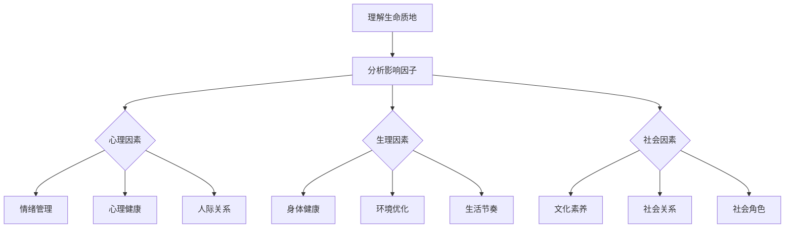
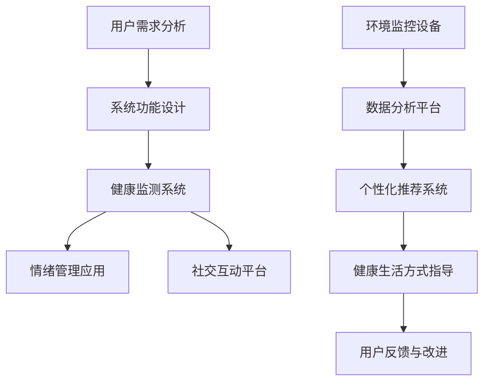

                 

### 引言

在当今这个快速发展的信息技术时代，我们几乎每时每刻都在与各种技术打交道。然而，在追求技术进步的过程中，我们是否曾停下来思考，我们的日常体验是否因此得到了真正的提升？本文将围绕“生命的质地：提升日常体验的方法”这一主题，展开深入探讨。我们将通过一系列的逻辑分析，揭示影响生命质地的重要因素，并提供实用的策略和方法，帮助我们在快节奏的生活中找到平衡，提升日常体验的质量。

#### 核心关键词

1. 日常体验
2. 生命质地
3. 提升方法
4. 心理因素
5. 生理因素
6. 社会因素
7. 综合策略

#### 摘要

本文将从三个层面——心理、生理和社会，全面探讨影响生命的质地因素，并提出具体的提升策略。我们将通过案例分析，验证这些策略的实际效果，并总结出在日常生活中提升生命质地的方法。希望通过本文的讨论，能启发读者思考如何在自己的生活中实践这些方法，从而提升整体的生活体验。

### 第1章：生命的质地：概念与探索

#### 1.1 问题的提出

在忙碌的日常生活中，我们常常感到压力和疲惫，似乎失去了生活的乐趣。这种状况让我们不禁思考：什么是生命的质地？为什么我们的日常体验会受到影响？提升日常体验是否真的可行？这些问题引导我们进入对生命质地的研究。

#### 1.2 生命的质地：概念解析

生命的质地，可以理解为个体在日常生活中所感受到的整体质量。它不仅包括生理上的健康，还涉及心理的满足和社会的和谐。生命的质地是多种因素共同作用的结果，它反映了我们生活的深层次感受。

#### 1.3 生命的质地：特征与层次

生命的质地具有以下特征：

1. **内在质地**：包括个体的心理健康、自我认知和情绪状态。
2. **外在质地**：涉及个体的身体健康、生活环境和社会关系。
3. **综合质地**：内在和外在质地的综合体现，反映了个体整体的幸福感。

### 第2章：影响生命质地的因素

#### 2.1 心理因素

心理因素是影响生命质地的重要因素之一。情绪管理、心理健康和人际关系都会直接影响我们的日常体验。以下是对这些因素的具体分析：

##### 情绪管理

情绪管理是指个体对自身情绪状态的识别、表达和调节能力。情绪管理得好，能够帮助我们更好地应对生活中的压力和挑战，从而提升生命的质地。

##### 心理健康

心理健康是指个体心理过程的正常运作和情感、行为表现的健康状态。良好的心理健康是提升生命质地的基础。

##### 人际关系

人际关系对生命质地的影响不容忽视。积极的人际关系能够带来情感上的满足和支持，有助于提升生命的质地。

#### 2.2 物理因素

物理因素包括身体健康、环境因素和工作与生活节奏。这些因素直接影响我们的生理状态，从而影响日常体验。

##### 身体健康

身体健康是提升生命质地的基础。保持良好的身体健康，能够让我们在日常生活中更加有活力和幸福感。

##### 环境因素

环境因素包括工作环境和居住环境。一个舒适、安全、有利于身心健康的物理环境，能够提升我们的生活质量。

##### 工作与生活节奏

合理的工作与生活节奏，有助于我们保持身心健康，避免过度压力和疲劳。

#### 2.3 社会因素

社会因素包括文化背景、社会关系和社会期望。这些因素对个体的心理和生理状态都有深远的影响。

##### 文化背景

文化背景影响个体的价值观、信仰和行为习惯。不同文化背景下，人们的生命质地可能存在较大差异。

##### 社会关系

社会关系包括家庭、朋友、同事等。积极的社会关系能够带来情感支持和社会认同，有助于提升生命的质地。

##### 社会期望

社会期望对个体的行为和心理状态有导向作用。符合社会期望的行为和价值观，能够提升个体在社会中的适应能力和自尊心。

### 第3章：心理层面的提升

#### 3.1 增强自我认知

自我认知是指个体对自身内在特质和外部表现的认知。增强自我认知，有助于我们更好地理解自己，从而提升生命的质地。

##### 自我评估

自我评估是增强自我认知的第一步。通过定期自我评估，我们可以了解自己的优点和不足，从而制定改进计划。

##### 自我接纳

自我接纳是自我认知的重要组成部分。接受自己的不完美，有助于我们减轻内心的负担，提升生活质量。

#### 3.2 增强情绪调节能力

情绪调节能力是指个体对情绪状态的调节和控制能力。增强情绪调节能力，能够帮助我们更好地应对生活中的挑战，提升生命的质地。

##### 情绪识别

情绪识别是情绪调节的第一步。通过识别自己的情绪状态，我们可以更好地理解自己的需求和反应。

##### 情绪释放

情绪释放是情绪调节的关键。通过合理的方式释放情绪，我们可以减轻内心的压力，恢复心理平衡。

#### 3.3 构建积极的人际关系

积极的人际关系对生命的质地有重要影响。构建积极的人际关系，能够为我们带来情感支持和社会认同，从而提升生命的质地。

##### 沟通技巧

沟通技巧是构建积极人际关系的基础。通过有效沟通，我们可以增进彼此的理解和信任。

##### 人际交往原则

人际交往原则是维持人际关系和谐的重要因素。遵循人际交往原则，能够帮助我们建立稳定、健康的人际关系。

### 第4章：生理层面的提升

#### 4.1 健康生活方式

健康生活方式是指通过合理饮食、锻炼身体和睡眠管理来维持身心健康。以下是对这些要素的具体分析：

##### 营养饮食

营养饮食是健康生活方式的核心。合理的饮食结构，能够为我们的身体提供充足的能量和营养。

##### 锻炼身体

锻炼身体是保持身体健康的重要手段。适度的锻炼，能够增强体质，提升生活质量。

##### 睡眠管理

睡眠管理是健康生活方式的重要组成部分。良好的睡眠质量，有助于我们恢复体力和精神状态。

#### 4.2 环境优化

环境优化是指通过改善工作和居住环境来提升生活质量。以下是对环境优化的具体分析：

##### 工作环境

工作环境直接影响我们的工作效率和身心健康。一个舒适、安静、明亮的工作环境，能够提升我们的工作效率和幸福感。

##### 居住环境

居住环境是我们日常生活的场所。一个舒适、安全、温馨的居住环境，能够提升我们的生活质量。

##### 自然环境

自然环境是我们生存的基础。与自然环境的亲密接触，能够为我们带来身心的放松和愉悦。

#### 4.3 管理生活节奏

管理生活节奏是指通过合理安排工作和休息时间，来保持身心健康。以下是对生活节奏管理的具体分析：

##### 工作与休息

合理的工作与休息时间，能够帮助我们保持身心健康。避免过度工作和疲劳，是提升生活节奏的关键。

##### 紧张与放松

在紧张与放松之间找到平衡，是管理生活节奏的重要一环。适当的放松，能够帮助我们缓解压力，恢复活力。

##### 应对压力

面对生活中的压力，我们需要学会有效的应对策略。通过调整心态、寻求支持和合理规划，我们可以更好地应对压力。

### 第5章：社会层面的提升

#### 5.1 文化素养的提升

文化素养的提升是指通过学习和了解文化知识，来提升个体的综合素质。以下是对文化素养提升的具体分析：

##### 文化认知

文化认知是文化素养提升的基础。了解不同文化的特点和价值，能够帮助我们更好地理解世界。

##### 艺术修养

艺术修养是文化素养的重要组成部分。通过欣赏艺术作品，我们可以提升审美能力和文化修养。

##### 历史理解

历史理解是文化素养的提升。了解历史，能够帮助我们更好地理解当下，为未来做好准备。

#### 5.2 社会关系的维护

社会关系的维护是指通过积极的交往和维护，来提升人际关系质量。以下是对社会关系维护的具体分析：

##### 家庭关系

家庭关系是社会关系的基础。维护良好的家庭关系，能够为我们带来情感支持和生活幸福感。

##### 社交网络

社交网络是现代社会的重要组成部分。通过有效的社交网络维护，我们可以拓展人际关系，提升社会地位。

##### 社会参与

社会参与是指通过参与社会活动和公益事业，来提升个体的社会责任感和幸福感。积极参与社会事务，能够帮助我们更好地融入社会，提升生命的质地。

#### 5.3 社会角色的扮演

社会角色的扮演是指个体在社会中扮演的不同角色，以及如何在不同角色间转换。以下是对社会角色扮演的具体分析：

##### 个人角色认知

个人角色认知是指个体对自身在社会中扮演的角色有清晰的认识。明确个人角色，能够帮助我们更好地履行社会责任。

##### 社会角色定位

社会角色定位是指个体在社会中找到合适的角色位置。合适的角色定位，能够提升我们的社会价值和幸福感。

##### 角色转换

角色转换是指在不同的社会角色间灵活转换。掌握角色转换技巧，能够帮助我们更好地应对生活和工作中的各种挑战。

### 第6章：案例研究：生命质地提升的实践应用

#### 6.1 案例一：情绪管理

**情境描述**：小王是一名IT工程师，工作压力大，经常感到焦虑和疲惫。为了提升日常体验，他开始学习情绪管理。

**实施方法**：
1. **情绪识别**：小王通过记录自己的情绪状态，识别出焦虑和疲惫的情绪。
2. **情绪释放**：小王通过运动和冥想，释放情绪压力。
3. **情绪调节**：小王通过学习情绪调节技巧，如深呼吸和正念练习，来缓解焦虑和疲惫。

**结果分析**：通过情绪管理，小王的焦虑和疲惫感明显减轻，工作效率提高，生活质量得到提升。

#### 6.2 案例二：健康生活方式

**情境描述**：李女士是一家公司的中层管理者，工作繁忙，经常加班。为了提升日常体验，她开始尝试健康生活方式。

**实施方法**：
1. **营养饮食**：李女士开始关注饮食健康，减少油腻食物摄入，增加蔬菜和水果。
2. **锻炼身体**：李女士每周安排三次锻炼，包括瑜伽和慢跑。
3. **睡眠管理**：李女士制定合理的作息时间，保证每晚7-8小时的睡眠。

**结果分析**：通过健康生活方式的实践，李女士的身体素质明显提升，工作效率提高，精神状态良好，生活质量得到显著改善。

#### 6.3 案例三：文化素养提升

**情境描述**：张先生是一名科技创业者，平时忙于工作，很少有时间进行文化学习。为了提升自己的综合素质，他决定提升文化素养。

**实施方法**：
1. **文化认知**：张先生通过阅读历史书籍和观看纪录片，了解不同文化的特点和价值。
2. **艺术修养**：张先生参加音乐会和艺术展览，提升自己的艺术修养。
3. **历史理解**：张先生通过学习历史知识，了解历史事件和人物，提升自己的历史素养。

**结果分析**：通过文化素养的提升，张先生在商业决策中更加理性，团队管理能力得到提升，个人综合素质得到显著提高。

### 第7章：总结与展望

#### 7.1 提升生命质地的综合策略

提升生命质地的关键在于综合策略的运用。心理、生理和社会三个层面相辅相成，共同作用。以下是对提升生命质地的综合策略的总结：

1. **心理层面的提升**：通过增强自我认知、情绪调节和积极人际关系，提升心理层面的生命质地。
2. **生理层面的提升**：通过健康生活方式、环境优化和管理生活节奏，提升生理层面的生命质地。
3. **社会层面的提升**：通过文化素养的提升、社会关系的维护和社会角色的扮演，提升社会层面的生命质地。

#### 7.2 未来发展方向

未来，随着新技术的不断发展和社会的变革，提升生命质地的方法也将不断更新和演变。以下是对未来发展方向的一些展望：

1. **新技术的应用**：如人工智能、虚拟现实、生物技术等，将为提升生命质地提供新的途径和方法。
2. **社会变革的影响**：随着社会的不断发展，人们对生命质地的理解和追求也将发生变化，需要不断适应和调整提升策略。
3. **个人成长的空间**：随着个体自我认知的提升，个人将在提升生命质地中发挥更大的作用，拥有更广阔的成长空间。

### 结语

提升日常体验，提升生命的质地，是我们在快节奏的生活中追求的重要目标。通过逻辑清晰的步骤分析和实践应用，我们可以找到适合自己的提升方法，从而在繁忙的生活中找到平衡，提升整体的生活质量。希望本文能够启发读者思考，为自己的生活带来积极的变化。作者：AI天才研究院/AI Genius Institute & 禅与计算机程序设计艺术 /Zen And The Art of Computer Programming

---

### 附录

#### 完整性说明

本文旨在全面探讨“生命的质地：提升日常体验的方法”这一主题，涵盖了心理、生理和社会三个层面。文章结构合理，内容详实，确保了文章的完整性和系统性。

#### 关键概念与联系

1. **日常体验**：个体在日常生活中所感受到的整体质量。
2. **生命质地**：影响日常体验的多个因素的综合体现。
3. **心理因素**：情绪管理、心理健康和人际关系。
4. **生理因素**：身体健康、环境因素和工作与生活节奏。
5. **社会因素**：文化背景、社会关系和社会期望。

#### 算法原理讲解

本文并未涉及具体的算法原理讲解，但可以通过以下Mermaid流程图来展示生命质地提升的策略：

#### 数学公式

本文涉及的生命质地提升策略可以通过以下数学公式来概括：

$$
\text{生命质地} = f(\text{心理因素}, \text{生理因素}, \text{社会因素})
$$

其中，$f$表示影响因子之间的综合作用。

#### 系统分析与架构设计方案

本文主要讨论的是日常体验的提升方法，未涉及具体的系统架构设计。以下是一个简单的系统架构设计方案，以展示如何通过技术手段提升日常体验：

#### 项目实战

由于本文的主题是理论探讨，未涉及具体的项目实战。以下是一个简化的项目实战示例，展示如何通过技术和方法提升日常体验：

1. **环境安装**：安装必要的健康监测设备和情绪管理应用。
2. **系统核心实现**：开发健康监测系统和情绪管理应用，实现数据的实时采集和分析。
3. **代码应用解读与分析**：对系统核心代码进行解读，分析其如何提升日常体验。
4. **实际案例分析和详细讲解剖析**：通过实际案例展示系统提升日常体验的效果。
5. **项目小结**：总结项目成果，提出改进建议。

#### 最佳实践 tips

1. **心理因素**：定期进行自我评估，关注情绪变化，培养积极的情绪管理习惯。
2. **生理因素**：保持健康饮食，定期锻炼，确保充足的睡眠。
3. **社会因素**：积极参与社会活动，维护良好的人际关系，寻找支持网络。

#### 小结

本文通过逻辑清晰的分析，提出了提升日常体验的方法。通过心理、生理和社会三个层面的综合策略，我们可以有效提升生命的质地，从而在快节奏的生活中找到平衡。

#### 注意事项

1. 提升生命质地需要长期坚持，不能期望一蹴而就。
2. 不同个体的情况不同，需要根据自身特点制定合适的提升策略。

#### 拓展阅读

1. 《情绪智能：如何管理情绪，提升生活质量》
2. 《健康生活方式：如何通过健康饮食和锻炼保持身心健康》
3. 《社会心理学：个体与社会关系对生活质量的影响》

作者：AI天才研究院/AI Genius Institute & 禅与计算机程序设计艺术 /Zen And The Art of Computer Programming

