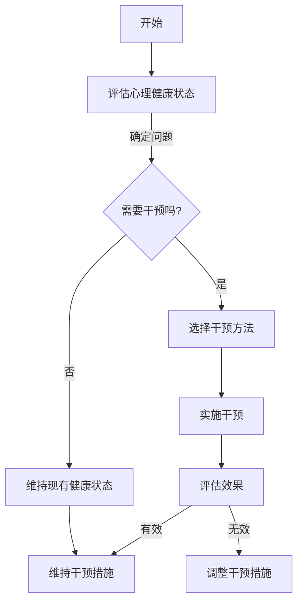

                 

### 第1章 引言

#### 1.1 问题的背景和意义

随着科技的飞速发展，人类对物质生活的追求已经达到了前所未有的高度。然而，物质生活的极大丰富并未能完全满足人们对幸福的追求。越来越多的研究表明，单纯的物质追求并不能带来真正的幸福感。人们开始意识到，幸福不仅仅是物质生活的充裕，它还涉及到心理健康、社会支持、文化背景等多个方面。

这一问题的提出具有重要的现实意义。在现代社会，人们面临着巨大的生活压力，心理健康问题逐渐凸显。此外，社会关系日益复杂，人际关系处理成为影响幸福感的重要因素。同时，文化背景的差异也对个体的幸福感产生深远影响。因此，探讨如何提高生命的质量，实现真正的幸福追求，成为当代社会亟待解决的问题。

#### 1.2 核心概念与联系

本文的核心概念包括幸福、心理健康、社会支持、文化背景等。首先，幸福是一个多维度的概念，不仅包括物质层面的满足，还包括心理、社会、文化等层面的幸福感。心理健康是指个体在心理上保持良好的状态，能够有效应对生活中的压力和挑战。社会支持则是指个体在社会交往中获得的正面影响和支持。文化背景包括个体的文化环境、价值观、信仰等，对个体的幸福感产生重要影响。

这些核心概念之间存在紧密的联系。心理健康是幸福感的基础，良好的心理健康能够增强个体的幸福感。社会支持则通过提供情感支持和实际帮助，促进个体的心理健康和幸福感。文化背景则通过影响个体的价值观和行为模式，进一步影响个体的幸福感。

#### 1.3 幸福的数学模型

为了更好地理解幸福，我们可以尝试构建一个数学模型来描述它。一个简化的幸福模型可以表示为：

$$
幸福 = f(心理健康, 社会支持, 文化背景)
$$

其中，心理健康、社会支持和文化背景是影响幸福的三个主要因素。每个因素都可以通过相应的指标进行量化。例如，心理健康可以通过心理健康量表得分来量化，社会支持可以通过社会支持量表得分来量化，文化背景可以通过文化背景问卷得分来量化。

通过这个数学模型，我们可以对幸福进行量化分析，从而更准确地理解幸福的本质和影响因素。这种方法不仅能够帮助我们更好地理解幸福，还可以为制定提高幸福感的具体策略提供科学依据。

#### 1.4 幸福的追求路径

追求幸福是一个复杂的过程，需要从多个方面进行努力。首先，内在幸福与外在幸福的平衡至关重要。内在幸福是指个体内在的心理状态，包括情绪、态度、自我认知等。外在幸福则是指个体在现实生活中获得的满足和成就。在追求幸福的过程中，我们需要找到内在幸福与外在幸福的平衡点，既关注内在心理状态，也注重现实生活中的成就和满足。

其次，心理调节与情感管理对幸福至关重要。心理健康是幸福的基础，我们需要学会如何调节自己的情绪，管理自己的情感。这包括培养积极的情绪，如快乐、满足，同时学会应对消极情绪，如焦虑、抑郁。通过心理调节和情感管理，我们可以提高心理健康水平，从而增强幸福感。

最后，社交支持与家庭关系也是幸福的重要因素。社交支持包括家庭、朋友、社区等提供的情感支持和实际帮助。良好的家庭关系和社交网络能够增强个体的幸福感，提供情感支持和安全感。因此，建立和维护良好的社交支持系统，对追求幸福至关重要。

#### 1.5 本章小结

本章从问题的背景和意义、核心概念与联系、幸福的数学模型、追求路径等方面，探讨了生命的质量——超越物质追求的幸福。通过分析，我们发现幸福是一个多维度的概念，不仅包括物质层面的满足，还包括心理、社会、文化等层面的幸福感。在追求幸福的过程中，我们需要平衡内在幸福与外在幸福，进行心理调节与情感管理，建立和维护良好的社交支持系统。这些策略有助于提高生命的质量，实现真正的幸福追求。

### 第1章 引言

#### 1.1 问题的背景和意义

随着社会的快速发展，人们的生活水平得到了显著提高，但与此同时，人们对幸福的追求也发生了变化。传统的幸福观认为，幸福来源于物质的丰富和满足，人们通过追求更高的收入、更好的物质条件来提高自己的幸福感。然而，随着物质生活水平的不断提高，越来越多的人开始发现，单纯的物质追求并不能带来持久的幸福感。

这一现象引发了人们对于幸福本质的深入思考。传统的幸福观是否能够解释现代人的幸福感？如果物质追求并非幸福的唯一来源，那么什么是影响幸福的主要因素？这些问题成为了当代社会研究的重要课题。

现代研究表明，幸福不仅仅与物质条件有关，还受到心理、社会、文化等多方面因素的影响。心理健康是幸福感的基础，良好的心理状态能够增强个体的幸福感。社会支持系统则是幸福的保障，家庭、朋友和社会的关系能够提供情感支持和实际帮助。文化背景则通过影响个体的价值观和行为模式，进一步影响个体的幸福感。

因此，探讨如何提高生命的质量，实现真正的幸福追求，成为当代社会亟待解决的问题。这一问题不仅关系到个体的幸福，也关系到整个社会的和谐与稳定。

#### 1.2 核心概念与联系

在本章中，我们将探讨以下核心概念：幸福、心理健康、社会支持和文化背景。

**幸福**

幸福是一个多维度的概念，包括物质层面的满足和心理、社会、文化层面的幸福感。物质幸福主要指物质生活条件的满足，如收入水平、物质财富等。心理幸福则涉及个体的内在心理状态，如情绪、态度、自我认知等。社会幸福则是指个体在社会交往中的满足感，包括家庭、朋友和社会关系等。文化幸福则是指个体在文化背景中的认同感和归属感。

**心理健康**

心理健康是指个体在心理上保持良好的状态，能够有效应对生活中的压力和挑战。心理健康对幸福感具有重要影响。一个心理健康的人能够更好地应对生活中的困难，保持积极乐观的心态，从而提高幸福感。心理健康包括情绪稳定、自我认知清晰、人际关系良好等方面。

**社会支持**

社会支持是指个体在社会交往中获得的正面影响和支持。社会支持包括家庭、朋友、社区等提供的情感支持和实际帮助。良好的社会支持系统能够增强个体的幸福感，提供情感支持和安全感。社会支持对心理健康和幸福感具有积极影响。

**文化背景**

文化背景包括个体的文化环境、价值观、信仰等。文化背景通过影响个体的价值观和行为模式，进一步影响个体的幸福感。不同的文化背景可能导致不同的幸福观，进而影响个体的幸福感。

**核心概念之间的联系**

这些核心概念之间存在着紧密的联系。心理健康是幸福感的基础，良好的心理健康能够增强个体的幸福感。社会支持系统则是幸福的保障，通过提供情感支持和实际帮助，促进个体的心理健康和幸福感。文化背景则通过影响个体的价值观和行为模式，进一步影响个体的幸福感。此外，物质幸福、心理幸福、社会幸福和文化幸福之间也存在着相互作用和影响，共同构成了一个复杂的幸福体系。

通过理解这些核心概念及其相互关系，我们可以更好地理解幸福，从而为追求幸福提供科学依据。

#### 1.3 幸福的数学模型

为了更深入地理解幸福，我们可以尝试构建一个数学模型来描述它。一个简化的幸福模型可以表示为：

$$
幸福 = f(心理健康, 社会支持, 文化背景)
$$

其中，心理健康、社会支持和文化背景是影响幸福的三个主要因素。每个因素都可以通过相应的指标进行量化。例如，心理健康可以通过心理健康量表得分来量化，社会支持可以通过社会支持量表得分来量化，文化背景可以通过文化背景问卷得分来量化。

为了构建这个模型，我们需要首先确定每个因素的具体指标。以下是一个可能的指标体系：

- **心理健康**：包括情绪稳定性、自我认知、压力应对能力等。可以使用心理健康量表（如SCL-90、GAD-7等）进行量化。
- **社会支持**：包括家庭支持、朋友支持、社区支持等。可以使用社会支持量表（如多维度社会支持评定量表）进行量化。
- **文化背景**：包括文化认同感、价值观、宗教信仰等。可以使用文化背景问卷进行量化。

通过这些指标，我们可以将每个因素转化为具体的数值，从而构建一个量化的幸福模型。例如，假设我们用0到100的评分来表示每个因素的得分，则幸福模型可以表示为：

$$
幸福 = f(P, S, C) = P \times W_P + S \times W_S + C \times W_C
$$

其中，\(P\)、\(S\)、\(C\) 分别代表心理健康、社会支持和文化背景的得分，\(W_P\)、\(W_S\)、\(W_C\) 分别代表这三个因素的权重。权重可以根据实际情况进行调整，以反映每个因素对幸福的重要程度。

通过这个模型，我们可以对幸福感进行量化分析，从而更准确地理解幸福的本质和影响因素。例如，如果一个人在心理健康、社会支持和文化背景三个方面得分都很高，那么他的幸福感也会相对较高。反之，如果某个方面的得分较低，那么他的幸福感也会受到影响。

此外，这个模型还可以用于制定提高幸福感的具体策略。例如，如果发现一个人的社会支持得分较低，那么可以针对性地加强他的社交支持系统，通过建立新的社交关系或加强现有关系来提高他的幸福感。

总之，通过构建一个量化的幸福模型，我们可以更深入地理解幸福，从而为提高幸福感提供科学依据。这种方法不仅有助于个体了解自己的幸福感，还可以为相关政策制定和实施提供参考。

#### 1.4 幸福的追求路径

追求幸福是一个复杂而长期的过程，需要从多个方面进行努力。以下是一些常见的追求路径，包括内在幸福与外在幸福的平衡、心理调节与情感管理、社交支持与家庭关系等方面。

**内在幸福与外在幸福的平衡**

内在幸福和外在幸福是幸福的重要组成部分，但两者之间需要找到平衡点。内在幸福是指个体内心的满足感和心理健康，包括积极的情绪、自我认知和自我价值感等。外在幸福则是指个体在现实生活中获得的成就和满足，如工作成就、物质财富和人际关系等。

为了实现内在幸福与外在幸福的平衡，个体需要关注以下几个方面：

1. **自我认知**：了解自己的内心需求和价值观，明确自己的目标和生活方向。
2. **心理健康**：保持良好的心理状态，学会应对压力和挫折，培养积极的情绪和心态。
3. **生活质量**：关注日常生活的细节，提高生活的质量，如保持良好的作息、饮食习惯和锻炼身体等。

**心理调节与情感管理**

心理调节和情感管理是提高心理健康和幸福感的重要手段。以下是一些常见的方法：

1. **正念练习**：通过冥想、瑜伽等方式，培养专注力和意识，减少内心的焦虑和压力。
2. **情绪表达**：学会表达自己的情绪，避免情绪压抑和累积，通过沟通、写作等方式释放情绪。
3. **积极心态**：培养积极的心态，面对生活中的挑战和困难时，保持乐观和自信。

**社交支持与家庭关系**

社交支持和家庭关系对幸福感有着重要影响。以下是一些常见的策略：

1. **建立社交网络**：积极参与社交活动，建立和维护良好的社交关系，通过与他人交流和互动，获得情感支持和实际帮助。
2. **家庭关系**：重视家庭关系，与家人保持良好的沟通和互动，通过家庭聚会、共同活动等方式增强家庭凝聚力。
3. **求助与支持**：在遇到困难和挑战时，勇于寻求帮助，同时也要学会为他人提供支持和帮助。

**其他追求路径**

除了上述方面，还有其他一些追求路径，如：

1. **精神追求**：通过宗教信仰、哲学思考等方式，寻求精神层面的满足和幸福感。
2. **自我实现**：追求个人成长和自我实现，通过学习和工作，实现个人目标和梦想。
3. **社会贡献**：通过参与公益活动、志愿服务等方式，为社会做出贡献，获得社会认同感和幸福感。

总之，追求幸福是一个多维度的过程，需要个体从多个方面进行努力。通过内在幸福与外在幸福的平衡、心理调节与情感管理、社交支持与家庭关系等方面的努力，个体可以逐步提高自己的幸福感，实现生命的质量提升。

#### 1.5 本章小结

本章从问题的背景和意义、核心概念与联系、幸福的数学模型、追求路径等方面，系统地探讨了生命的质量——超越物质追求的幸福。首先，我们分析了物质追求未能满足人们幸福需求的现象，提出了幸福的多维度理解。接着，通过心理健康、社会支持和文化背景等核心概念的介绍，明确了这些因素对幸福感的影响。随后，我们构建了一个简化的幸福数学模型，并探讨了如何通过内在幸福与外在幸福的平衡、心理调节与情感管理、社交支持与家庭关系等路径来追求幸福。这些探讨为理解幸福提供了新的视角和方法，也为未来的研究和实践提供了参考。通过本章的讨论，我们希望读者能够认识到幸福的多维度性，并积极寻求提高生命质量的途径。

### 第2章 心理因素与幸福

心理健康是幸福感的基础，它不仅影响个体的生活质量，还直接关系到个体的幸福感水平。在本章中，我们将深入探讨心理健康与幸福之间的关系，分析心理健康对幸福的影响，并介绍一些维护和提升心理健康的方法。

#### 2.1 心理健康与幸福的关系

**心理健康**是指个体在心理上保持良好的状态，能够有效应对生活中的压力和挑战，具有良好的自我调节能力和社会适应能力。心理健康对幸福感具有显著影响。具体来说，心理健康水平较高的人通常能够更好地处理生活中的困难和挫折，保持积极乐观的心态，从而提高幸福感。以下是一些具体表现：

1. **情绪稳定**：心理健康的人能够较好地管理自己的情绪，不易陷入消极情绪，如焦虑、抑郁等。这种情绪稳定有助于提高个体的幸福感。
2. **自我认知清晰**：心理健康的人对自己的认知较为清晰，能够准确地评估自己的能力和局限性，从而设定合理的目标和期望，避免因目标不切实际而产生的负面情绪。
3. **社会适应能力强**：心理健康的人能够更好地适应社会环境，建立良好的人际关系，获得来自他人和社会的支持和认可，从而增强幸福感。

**幸福**则是一个多维度的概念，包括物质幸福、心理幸福、社会幸福和文化幸福等。心理健康对幸福的影响主要体现在心理幸福和社会幸福方面。一个心理健康的人能够更好地体验和享受生活中的各种正面情感，如快乐、满足、安宁等，从而提高心理幸福感。同时，心理健康也有助于个体在社会交往中表现出积极的行为，建立和维护良好的人际关系，获得社会支持，进而提高社会幸福感。

#### 2.2 心理健康的定义

**心理健康**是一个相对广泛的概念，通常包含以下几个方面：

1. **情绪健康**：个体能够适度地表达和管理情绪，保持情绪的稳定和平衡。这意味着个体能够适应生活中的各种情绪变化，不因情绪波动而影响日常生活。
2. **认知健康**：个体在认知功能上保持良好的状态，包括注意力、记忆力、思维敏捷性等。认知健康有助于个体有效地处理信息，做出合理的决策。
3. **社会适应健康**：个体能够适应社会环境，建立和维护良好的人际关系，参与社会活动，并能够与他人和谐相处。
4. **心理韧性**：个体在面对生活中的压力和挑战时，能够保持积极的态度，有效地应对和解决问题，从而增强心理韧性。

一个心理健康的人不仅能够在生理上保持良好的状态，还能够在心理上保持健康，从而更好地享受生活，实现个人价值。

#### 2.3 心理健康对幸福的影响

心理健康对幸福感的影响是多方面的，具体可以从以下几个方面进行阐述：

1. **情绪管理能力**：心理健康水平较高的人通常具备较好的情绪管理能力，能够有效地处理生活中的情绪波动，避免因情绪失控而对生活产生负面影响。这种情绪稳定性有助于提高个体的幸福感。
2. **自我认知**：心理健康的人对自己的认知较为清晰，能够准确地评估自己的能力和局限性，从而设定合理的目标和期望。这种自我认知有助于个体避免因目标不切实际而产生的挫败感和失落感，提高幸福感。
3. **社会支持**：心理健康的人能够更好地适应社会环境，建立和维护良好的人际关系，从而获得来自他人和社会的支持和认可。这种社会支持有助于增强个体的幸福感。
4. **心理韧性**：在面对生活中的压力和挑战时，心理健康的人能够保持积极的态度，有效地应对和解决问题，从而增强心理韧性。这种心理韧性有助于个体克服生活中的困难，提高幸福感。

#### 2.4 维护和提升心理健康的方法

为了维护和提升心理健康，个体可以采取以下几种方法：

1. **正念练习**：通过冥想、瑜伽等方式，培养专注力和意识，减少内心的焦虑和压力。正念练习有助于个体更好地管理情绪，提高心理健康水平。
2. **情绪表达**：学会表达自己的情绪，避免情绪压抑和累积，通过沟通、写作等方式释放情绪。情绪表达有助于个体保持情绪稳定，减少心理压力。
3. **积极心态**：培养积极的心态，面对生活中的挑战和困难时，保持乐观和自信。积极心态有助于个体更好地应对生活中的压力，提高幸福感。
4. **社交互动**：积极参与社交活动，建立和维护良好的人际关系，获得来自他人和社会的支持和认可。社交互动有助于增强个体的社会适应能力和心理韧性。
5. **心理健康教育**：通过参加心理健康课程、阅读相关书籍等方式，增强对心理健康的认识和了解，提高心理健康素养。

总之，心理健康是幸福感的基础，通过维护和提升心理健康，个体可以更好地享受生活，实现更高的幸福感。心理健康对幸福的影响是多方面的，个体可以通过多种方法来维护和提升自己的心理健康水平。

#### 2.5 本章小结

本章围绕心理因素与幸福的关系进行了深入探讨。首先，我们分析了心理健康与幸福感之间的密切联系，说明了心理健康对幸福的重要影响。接着，我们详细介绍了心理健康的定义，并探讨了心理健康在情绪管理、自我认知、社会支持和心理韧性等方面的作用。最后，我们提出了一系列维护和提升心理健康的方法，包括正念练习、情绪表达、积极心态、社交互动和心理健康教育等。通过本章的学习，读者可以更好地理解心理因素对幸福感的影响，并采取有效措施来维护和提升自己的心理健康水平。

### 第2章 心理因素与幸福

#### 2.1 心理健康与幸福的关系

心理健康是幸福感的基石，这一观点得到了广泛认可。一个心理健康的人通常能更好地应对生活中的压力和挑战，保持积极的心态，从而在多个维度上体验幸福。

**心理健康对幸福的影响**可以从以下几个方面进行探讨：

1. **情绪稳定性**：心理健康有助于个体保持情绪的稳定。情绪稳定的人能够更好地控制自己的情绪，不易陷入焦虑、抑郁等负面情绪。情绪的稳定不仅有助于个体在日常生活中的表现，还能提高他们在社交场合中的互动质量，从而增强幸福感。

2. **自我认知**：心理健康的人对自己的认知较为清晰，能够准确地认识到自己的优点和不足。这种自我认知有助于个体设定合理的目标，避免因目标不切实际而产生的挫败感，从而提高幸福感。

3. **社会适应能力**：心理健康有助于个体更好地适应社会环境，建立和维护良好的人际关系。在社会互动中，心理健康的人能够更好地理解和沟通他人，获得他人的支持和帮助，这有助于提高他们的社会幸福感。

4. **心理韧性**：心理健康的人在面对生活中的困难和挑战时，能够保持积极的态度，有效地应对问题。这种心理韧性有助于个体克服生活中的困境，提高他们的内在幸福感。

**心理健康**的具体定义包括以下几个方面：

1. **情绪健康**：个体能够适度地表达和管理情绪，保持情绪的稳定和平衡。这意味着个体能够适应生活中的各种情绪变化，不因情绪波动而影响日常生活。

2. **认知功能**：个体在认知功能上保持良好的状态，包括注意力、记忆力、思维敏捷性等。认知健康有助于个体有效地处理信息，做出合理的决策。

3. **社会适应能力**：个体能够适应社会环境，建立和维护良好的人际关系，参与社会活动，并能够与他人和谐相处。

4. **心理韧性**：个体在面对生活中的压力和挑战时，能够保持积极的态度，有效地应对和解决问题。这种心理韧性有助于个体克服生活中的困难，提高幸福感。

在探讨心理健康对幸福的影响时，我们还可以借助一些**核心概念原理**，这些原理有助于我们更深入地理解心理健康和幸福之间的关系：

1. **情绪调节理论**：该理论认为，个体的情绪调节能力对其幸福感具有重要影响。情绪调节能力强的人能够更好地控制自己的情绪，避免情绪失控对生活产生负面影响。

2. **自我决定理论**：该理论强调个体的自我决定对其心理健康和幸福感的作用。一个能够自由做出选择并感到自己的选择得到尊重的人，通常会有更高的幸福感。

3. **心理弹性理论**：该理论关注个体在面对逆境时的适应能力和恢复能力。心理弹性强的人能够在面对挑战和压力时保持积极，从而提高幸福感。

为了更直观地展示心理健康和幸福之间的关系，我们可以借助一个**ER实体关系图架构**。在这个图中，我们可以将心理健康、幸福、情绪调节、自我决定和心理弹性等核心概念作为实体，并展示它们之间的联系：

```mermaid
erDiagram
  心理健康 ||--|{ 幸福 }|
  心理健康 ||--|{ 情绪调节 }|
  心理健康 ||--|{ 自我决定 }|
  心理健康 ||--|{ 心理弹性 }|
  情绪调节 ||--|{ 幸福 }|
  自我决定 ||--|{ 幸福 }|
  心理弹性 ||--|{ 幸福 }|
```

通过这个ER实体关系图，我们可以清晰地看到心理健康是如何通过情绪调节、自我决定和心理弹性等中间变量影响幸福的。

此外，我们还可以通过一个**Mermaid流程图**来展示心理健康提升的过程和步骤：



这个流程图展示了从评估心理健康状态到实施干预，再到评估效果和调整干预措施的完整过程，有助于读者更好地理解和实践心理健康提升的方法。

总之，心理健康与幸福之间的关系是复杂而紧密的。通过理解核心概念原理、ER实体关系图和流程图，我们可以更深入地认识到心理健康对幸福感的影响，并采取有效的措施来提升心理健康水平，从而实现更高的幸福感。

#### 2.2 自我认知与幸福

自我认知是个体对自身存在的认知，包括对自己的思想、情感、行为以及性格等方面的了解。自我认知对幸福感具有深远的影响，因为它不仅决定了个体如何看待自己，还影响到个体如何与他人交往和应对生活中的挑战。

**自我认知的重要性**体现在以下几个方面：

1. **明确个人目标**：自我认知清晰的个体能够更好地了解自己的兴趣、价值观和能力，从而设定合理的人生目标。明确的目标有助于个体在追求过程中保持动力和方向，减少迷茫和焦虑，提高幸福感。

2. **提升自我价值感**：自我认知帮助个体认识到自己的独特性和价值，从而增强自我价值感。一个有强烈自我价值感的个体通常更自信、更积极，能够更好地应对生活中的困难和挑战。

3. **促进心理健康**：自我认知清晰的个体能够更好地理解自己的情绪和行为，从而更容易进行情绪调节和心理调适。这种心理上的稳定和平衡有助于提升幸福感。

4. **改善人际关系**：自我认知有助于个体更好地理解自己与他人之间的关系，避免误解和冲突，建立和维护良好的人际关系。良好的人际关系是幸福感的重要来源之一。

**自我认知与幸福感之间的关系**可以归纳为以下几点：

1. **自我认知清晰度的提升**与**幸福感的增加**呈现正相关。自我认知越清晰，个体越能准确地理解自己的需求和期望，从而更好地满足自己，提升幸福感。

2. **自我认知与自我价值感**密切相关。自我价值感的提升能够显著提高个体的幸福感，因为个体对自己的认同和尊重是幸福感的重要基础。

3. **自我认知**与**情绪调节**能力有显著关联。自我认知清晰的个体能够更好地识别和调节自己的情绪，减少负面情绪的影响，提高幸福感。

4. **自我认知**与**人际关系**质量也密切相关。良好的自我认知有助于个体在人际交往中表现出更积极、更理解他人的行为，从而获得他人的正面反馈和支持，提升幸福感。

为了提升自我认知，个体可以采取以下几种方法：

1. **自我反思**：定期花时间反思自己的行为、情感和思想，思考自己在不同情境下的反应和感受，从而更深入地了解自己。

2. **写日记**：通过写日记记录自己的想法、情绪和经历，有助于个体更好地理解自己的内在世界，提升自我认知。

3. **接受心理咨询**：通过专业的心理咨询，个体可以更深入地探讨自己的内在困惑和问题，从而提升自我认知。

4. **与他人交流**：与他人分享自己的感受和想法，可以获得外界的反馈和建议，有助于个体更全面地认识自己。

5. **学习新事物**：通过学习新知识、技能和经验，个体可以拓展自己的视野和认知，从而提升自我认知。

总之，自我认知是影响幸福的重要因素。通过提升自我认知，个体可以更好地了解自己，设定合理的目标，进行有效的情绪调节，建立良好的人际关系，从而提高幸福感。自我认知的提升不仅有助于个人的心理成长，也是实现更高生活质量的关键。

#### 2.3 情绪管理对幸福的影响

情绪管理是指个体通过认知和行为策略，有效地识别、表达和调节自己的情绪，以促进心理和社交功能的一种过程。情绪管理对幸福感具有重要影响，因为良好的情绪管理能力不仅有助于个体在日常生活中保持积极的心态，还能增强其应对压力和挑战的能力，从而提高幸福感。

**情绪管理的重要性**主要体现在以下几个方面：

1. **情绪稳定性**：良好的情绪管理能力能够帮助个体保持情绪的稳定性，减少情绪波动对生活的影响。情绪稳定的人通常能够更好地应对生活中的压力，保持心理健康。

2. **提高生活质量**：情绪管理有助于个体提高生活质量。通过有效管理情绪，个体能够更好地处理日常生活中的烦恼和挑战，减少负面情绪对生活质量的负面影响。

3. **增强人际交往能力**：情绪管理能力强的人能够更好地识别和理解他人的情绪，从而在人际交往中表现出更积极、更有同理心的行为。这有助于建立和维护良好的人际关系，提高社交幸福感。

4. **促进心理健康**：情绪管理是心理健康的重要组成部分。良好的情绪管理能力有助于个体保持心理平衡，减少焦虑、抑郁等负面情绪，从而提高心理健康水平。

**情绪管理对幸福感的影响**可以从以下几个方面进行详细分析：

1. **情绪调节与幸福感**：情绪调节是影响幸福感的关键因素。通过情绪调节，个体能够更好地控制自己的情绪，避免负面情绪对生活质量的影响。情绪调节能力强的人通常能体验到更高的幸福感。

2. **压力管理**：情绪管理有助于个体有效应对生活中的压力。通过认知行为策略，个体能够减少压力对情绪和行为的负面影响，保持心理平衡，从而提高幸福感。

3. **积极情绪体验**：情绪管理能力强的个体能够更容易地体验和保持积极情绪，如快乐、满足和安宁等。这些积极情绪体验是幸福感的重要组成部分，能够显著提高个体的幸福感。

4. **情绪表达**：情绪管理不仅仅是调节情绪，还包括情绪表达。适当的情绪表达有助于个体与他人建立更好的沟通和理解，从而获得更多的支持和帮助，提高幸福感。

**常见的情绪管理方法**包括：

1. **认知行为疗法**：通过改变不合理的认知和行为模式，帮助个体更有效地调节情绪。这种方法包括认知重构、行为实验和认知行为家庭作业等。

2. **正念练习**：通过正念练习，如冥想、瑜伽和呼吸练习等，帮助个体培养专注力和意识，减少内心的焦虑和压力，从而提高情绪调节能力。

3. **情绪释放技术**：如呼吸放松、肌肉放松和情绪释放疗法等，通过身体和情绪的释放，帮助个体缓解紧张和焦虑，提高情绪管理能力。

4. **社交支持**：通过建立和维护良好的社交支持系统，获得来自家人、朋友和社会的正面影响和支持，有助于提高情绪管理能力，增强幸福感。

总之，情绪管理对幸福感具有重要影响。通过掌握和运用情绪管理方法，个体可以更好地调节情绪，提高生活质量，增强心理健康，从而实现更高的幸福感。情绪管理不仅是心理健康的重要组成部分，也是实现全面幸福的关键策略。

#### 2.4 心理咨询与幸福提升

心理咨询作为专业心理服务的提供方式，对于提升个体的幸福感具有显著作用。心理咨询不仅帮助个体解决心理问题，还通过提供心理教育和指导，促进个体在心理上的成长和发展，从而提高整体的幸福感。

**心理咨询的作用**主要体现在以下几个方面：

1. **诊断与评估**：心理咨询师通过专业的评估工具和方法，帮助个体诊断心理问题和情感困扰，明确问题的性质和程度，从而制定合适的干预方案。

2. **情感支持**：心理咨询提供安全、接纳的环境，让个体能够自由表达自己的情绪和困扰，获得心理咨询师的理解和支持，减轻内心的负担。

3. **问题解决**：心理咨询通过认知行为疗法、心理动力学疗法等方法，帮助个体识别和改变不合理的认知和行为模式，从而有效解决心理问题，提高应对问题的能力。

4. **心理教育**：心理咨询不仅解决个体当前的心理问题，还通过心理教育，提供心理知识、情绪管理和应对策略，帮助个体在日常生活中更好地管理自己的情绪和行为。

5. **促进心理成长**：心理咨询帮助个体深入了解自己，认识到自己的内在资源和潜力，促进个体的心理成长和自我实现。

**心理咨询与幸福的关系**可以从以下几个方面进行阐述：

1. **心理问题的解决**：心理问题如焦虑、抑郁等，不仅影响个体的心理状态，还会对生活质量产生负面影响。通过心理咨询，个体能够有效解决心理问题，提高生活质量，进而提升幸福感。

2. **情感需求的满足**：心理咨询为个体提供了情感支持和安全感，帮助个体满足深层次的情感需求，如归属感、尊重和自我实现等，从而提高幸福感。

3. **自我认知的提升**：心理咨询帮助个体深入了解自己的内心世界，提高自我认知水平，从而更好地理解自己，设定合理的目标和期望，提升内在幸福感。

4. **社会功能的改善**：心理咨询不仅改善个体的心理状态，还促进其在社交、工作和家庭等领域的功能发挥，提高社会适应能力，增强幸福感。

**如何选择合适的心理咨询师**是一个重要的问题。以下是一些选择心理咨询师的指导建议：

1. **专业资质**：选择具有相关资质和执业资格的心理咨询师，如具有心理学学位、心理咨询师资格证等。

2. **咨询风格**：了解不同心理咨询师的专业领域和咨询风格，选择与自己需求和风格相匹配的心理咨询师。

3. **咨询服务体验**：与心理咨询师进行初步咨询或沟通，体验其咨询风格和专业水平，选择与自己相处舒适、能够建立信任关系的心理咨询师。

4. **咨询费用**：考虑咨询费用是否在自己的预算范围内，选择性价比高的心理咨询师。

5. **咨询时长和频率**：了解心理咨询师的咨询时长和频率安排，选择能够合理安排时间和满足自己咨询需求的咨询师。

总之，心理咨询对于提升个体的幸福感具有重要作用。通过选择合适的心理咨询师，个体能够获得专业的心理支持，解决心理问题，提升自我认知，改善生活质量，从而实现更高的幸福感。

#### 2.5 本章小结

本章围绕心理因素与幸福的关系进行了深入探讨。首先，我们分析了心理健康与幸福感之间的密切联系，并详细介绍了心理健康的定义及其对幸福的影响。接着，我们探讨了自我认知在幸福中的重要性，并提供了提升自我认知的方法。随后，我们阐述了情绪管理对幸福的影响，介绍了常见的情绪管理方法。最后，我们探讨了心理咨询在幸福提升中的作用，并提供了选择合适心理咨询师的建议。通过本章的学习，读者可以更好地理解心理因素如何影响幸福感，并采取有效的措施来提升心理健康和幸福感。

### 第3章 社会因素与幸福

社会因素对个体的幸福感具有显著的影响。社会支持系统、社交网络、社会环境和社会参与都是影响幸福感的关键要素。本章将围绕这些社会因素，探讨它们如何影响个体的幸福感，并提供一些具体的策略和方法来增强这些社会因素，从而提升幸福感。

#### 3.1 社会支持与幸福

**社会支持**是指个体在社会交往过程中获得的情感、信息和实际帮助。社会支持系统对幸福感有着重要的影响。一个强有力的社会支持系统可以帮助个体应对生活中的压力和挑战，提高幸福感。

**社会支持对幸福的影响**可以从以下几个方面进行探讨：

1. **情感支持**：情感支持是指个体在情绪低落或遭遇困难时，从家人、朋友或社区获得的理解、安慰和鼓励。这种支持有助于个体缓解负面情绪，提高心理韧性，从而增强幸福感。

2. **实际帮助**：实际帮助包括物质支持、经济援助、生活照料等。当个体面临实际困难时，来自社会支持系统的实际帮助可以提供解决问题的关键资源，提高个体的生活质量，增强幸福感。

3. **社会网络**：社会支持系统中的社会网络对个体的幸福感也有重要影响。一个庞大且紧密的社会网络可以帮助个体获取更多的信息和资源，提高社会地位和认同感，从而提升幸福感。

**增强社会支持的方法**：

1. **建立和维护社交关系**：积极参与社交活动，与家人、朋友和同事保持密切联系，建立和维护良好的社交关系。这些关系可以在需要时提供情感支持和实际帮助。

2. **寻求专业帮助**：在面对困难和压力时，不要犹豫寻求心理咨询师或其他专业人士的帮助。专业帮助可以提供有效的解决方案和支持，提高个体的幸福感。

3. **参与社区活动**：参与社区志愿服务或社区活动，不仅可以扩展社交网络，还可以获得来自社区成员的支持和认可，提高社会归属感和幸福感。

4. **建立支持小组**：与有相似经历和需求的人建立支持小组，相互分享经验和情感支持，共同面对生活中的挑战，增强社会支持系统的稳定性。

#### 3.2 社交网络与幸福

**社交网络**是指个体在社交活动中形成的人际关系网络。社交网络对个体的幸福感有着重要影响。一个健康的社交网络不仅可以提供情感支持和实际帮助，还可以增强个体的社会认同感和归属感。

**社交网络对幸福的影响**包括以下几个方面：

1. **社会认同感**：健康的社交网络可以帮助个体获得社会认同感，增强个体在社交环境中的自信心和自尊心，从而提高幸福感。

2. **信息获取**：社交网络提供了丰富的信息资源，个体可以通过社交网络获取各种信息和知识，提高自己的生活质量和适应能力。

3. **情感支持**：在面临挑战和困难时，健康的社交网络可以提供情感支持，帮助个体缓解压力，提高心理韧性。

**建立健康社交网络的方法**：

1. **积极参与社交活动**：积极参与各种社交活动，如聚会、社交俱乐部、兴趣小组等，扩大社交圈子。

2. **保持联系**：与朋友、家人和同事保持联系，定期进行沟通和互动，保持社交网络的活跃。

3. **多渠道社交**：通过线上平台，如社交媒体、聊天应用等，与朋友、同事和社区成员保持联系，扩展社交网络。

4. **互助互利**：在社交网络中，建立互助互利的合作关系，与他人分享资源和经验，相互支持和帮助。

#### 3.3 社会环境与幸福

**社会环境**是指个体生活于其中的社会条件和氛围。社会环境对个体的幸福感有着深远的影响。一个稳定、和谐的社会环境可以为个体提供安全感，增强个体的幸福感。

**社会环境对幸福的影响**可以从以下几个方面进行探讨：

1. **经济条件**：良好的经济条件可以提供个体物质生活的保障，减少生活压力，提高幸福感。

2. **法律制度**：健全的法律制度可以保障个体的权益，维护社会秩序，提高个体的安全感。

3. **文化氛围**：积极向上的文化氛围可以激发个体的积极性和创造力，提高个体的生活质量。

**改善社会环境的方法**：

1. **参与公共事务**：积极参与社区和公共事务，通过投票、志愿服务等方式，为改善社会环境做出贡献。

2. **倡导社会正义**：倡导和践行社会正义，关注弱势群体，通过舆论监督和公益行动，推动社会公正。

3. **倡导心理健康教育**：推广心理健康知识，提高公众对心理健康问题的认识和重视，促进社会对心理健康问题的关注和支持。

#### 3.4 社会参与与幸福

**社会参与**是指个体在社会活动中积极参与和贡献的行为。社会参与对个体的幸福感有着积极的影响。通过参与社会活动，个体可以获得成就感、认同感和归属感，从而提高幸福感。

**社会参与对幸福的影响**包括以下几个方面：

1. **成就感**：通过参与社会活动，个体可以完成具有挑战性的任务，获得成就感和自我实现感。

2. **认同感**：社会参与使个体感受到自己的行为对社会有积极影响，从而获得认同感和价值感。

3. **归属感**：通过参与社会活动，个体可以与他人建立联系，增强社会归属感。

**增强社会参与感的方法**：

1. **参与志愿服务**：积极参与志愿服务，为社区和社会做出贡献，获得成就感和归属感。

2. **参与公共讨论**：积极参与公共讨论和决策，通过表达自己的观点和参与社会事务，增强社会参与感。

3. **参与社区活动**：参与社区组织的各类活动，与邻里建立联系，增强社会归属感。

4. **关注社会问题**：关注社会问题，通过学习、讨论和行动，积极参与社会事务，提高社会参与度。

总之，社会因素对个体的幸福感具有重要影响。通过增强社会支持系统、建立健康社交网络、改善社会环境以及积极参与社会活动，个体可以提升自己的幸福感，实现更高质量的生活。

#### 3.5 本章小结

本章围绕社会因素与幸福的关系进行了深入探讨。首先，我们分析了社会支持系统对幸福感的重要作用，并提出了一系列增强社会支持的方法。接着，我们探讨了社交网络对幸福的影响，并提供了建立健康社交网络的策略。随后，我们阐述了社会环境对幸福的影响，并提出了改善社会环境的方法。最后，我们讨论了社会参与对幸福的作用，并提供了增强社会参与感的方法。通过本章的学习，读者可以更好地理解社会因素如何影响幸福感，并采取有效的措施来提升幸福感。

### 第4章 文化因素与幸福

文化因素对个体的幸福感具有深远的影响。文化背景、道德伦理和宗教信仰都是影响个体幸福感的重要文化因素。本章将围绕这些文化因素，探讨它们如何影响个体的幸福感，并提供一些具体的策略和方法来增强这些文化因素，从而提升幸福感。

#### 4.1 文化背景与幸福

**文化背景**是指个体所处的社会文化环境，包括价值观念、传统习俗、语言表达和艺术表达等方面。文化背景对个体的幸福感有着重要的影响。一个积极、健康的文化背景可以为个体提供强大的精神支持，增强个体的幸福感。

**文化背景对幸福的影响**可以从以下几个方面进行探讨：

1. **价值观念**：个体的价值观念是文化背景的重要组成部分，它影响个体的行为和决策。积极、健康的价值观念，如尊重、公正、和谐等，可以促进个体的心理健康和幸福感。

2. **传统习俗**：传统习俗是文化背景的一部分，它们反映了社会的道德规范和行为准则。传统习俗的传承和尊重有助于个体在社会中获得认同感，提高幸福感。

3. **语言表达**：语言不仅是沟通的工具，也是文化传承和表达的方式。一个积极、健康的文化背景通常包含丰富而多样化的语言表达方式，这有助于个体更好地理解和表达自己的情感和思想，从而提高幸福感。

4. **艺术表达**：艺术是文化的重要组成部分，它通过视觉、听觉和表演等形式，表达个体的情感和思想。艺术表达有助于个体释放内心的情感，提高心理健康和幸福感。

**增强文化背景的方法**：

1. **学习传统文化**：通过学习传统文化，了解和尊重不同文化的价值观念和传统习俗，增强个体的文化认同感和归属感。

2. **参与文化活动**：积极参与各种文化活动，如艺术展览、音乐会、戏剧表演等，体验不同文化的魅力，提高个体的艺术修养和幸福感。

3. **交流与分享**：与他人交流自己的文化经历和见解，分享不同文化的知识和经验，促进文化理解和认同。

4. **保护文化遗产**：关注和保护文化遗产，通过参与文化保护和传承工作，为维护文化多样性做出贡献，从而提高个体的文化认同感和幸福感。

#### 4.2 道德伦理与幸福

**道德伦理**是指个体在社会交往中遵循的行为规范和道德标准。道德伦理对个体的幸福感具有深远的影响。一个遵守道德伦理的行为模式可以为个体带来内心的平静和自我认同感，从而提高幸福感。

**道德伦理对幸福的影响**可以从以下几个方面进行探讨：

1. **行为规范**：道德伦理为个体提供了行为规范，使个体在社会交往中能够遵循正确的道德标准，从而减少行为冲突和内心矛盾，提高幸福感。

2. **社会认同**：个体遵守道德伦理的行为模式会受到社会的认可和赞赏，从而获得社会认同感和尊重，提高幸福感。

3. **自我认同**：遵守道德伦理的行为模式有助于个体建立自我认同，明确自己的价值观和行为准则，从而增强内心的平静和满足感。

**增强道德伦理的方法**：

1. **学习道德伦理知识**：通过学习道德伦理的基本原理和案例，了解道德伦理的内涵和重要性，提高道德素养。

2. **实践道德行为**：将道德伦理知识应用于日常生活中，遵循正确的道德行为规范，实践道德伦理。

3. **参与道德教育**：参与学校、社区和宗教组织的道德教育项目，提高道德意识和道德行为能力。

4. **倡导道德伦理**：在日常生活中，积极倡导道德伦理，通过言行示范，影响他人遵循道德伦理，共同营造良好的社会道德环境。

#### 4.3 宗教信仰与幸福

**宗教信仰**是指个体对宗教信仰体系、神灵和宗教仪式的信仰和敬仰。宗教信仰对个体的幸福感有着重要的影响。宗教信仰可以提供精神支持和情感寄托，帮助个体在困难和挫折中找到力量和希望。

**宗教信仰对幸福的影响**可以从以下几个方面进行探讨：

1. **精神支持**：宗教信仰为个体提供了一种精神寄托，使个体在面对生活中的困难和挫折时，能够从宗教信仰中找到安慰和力量，提高幸福感。

2. **情感寄托**：宗教信仰可以满足个体对终极意义和生命价值的追求，为个体提供情感寄托，从而增强个体的幸福感。

3. **社会关系**：宗教信仰有助于个体建立和维护良好的社会关系，通过宗教社区和宗教活动，个体可以获得情感支持和实际帮助，提高社会幸福感。

**增强宗教信仰的方法**：

1. **学习和理解宗教教义**：通过学习宗教教义，了解宗教信仰的内涵和意义，提高宗教信仰的深度和广度。

2. **参与宗教活动**：积极参与宗教社区和宗教组织的活动，与信仰相同的群体建立联系，增强宗教信仰的认同感。

3. **践行宗教道德**：将宗教道德原则应用于日常生活中，践行宗教信仰，通过实际行动体现宗教信仰的价值。

4. **寻求宗教指导**：在宗教信仰的实践中，寻求宗教导师或信仰者的指导，帮助自己更好地理解和实践宗教信仰。

总之，文化因素对个体的幸福感具有深远的影响。通过增强文化背景、道德伦理和宗教信仰，个体可以提升自己的幸福感，实现更高质量的生活。

#### 4.4 文化传承与创新与幸福

**文化传承与创新**是维持和提升文化活力的重要途径，对个体的幸福感同样具有重要影响。文化传承是指在尊重和保护传统文化的基础上，将文化传统传递给后代，使之得以延续。而文化创新则是在传统文化的基础上，通过创新和发展，形成新的文化形式和内容。

**文化传承与创新的关系**体现在以下几个方面：

1. **相互依存**：文化传承是文化创新的基础，没有对传统文化的深刻理解和尊重，文化创新就失去了根基。同时，文化创新为文化传承注入了新的活力和内容，使得文化传统能够适应时代的变化，得以持续发展。

2. **相互促进**：文化传承与创新相互促进，通过传承，文化得以延续和积累，为创新提供丰富的资源和素材；通过创新，文化得以更新和发展，为传承注入新的动力。

**文化传承与创新对幸福的影响**：

1. **文化认同**：通过文化传承，个体能够更好地了解和认同自己的文化，增强文化归属感和自豪感，从而提高幸福感。

2. **心理满足**：文化创新为个体提供了新的体验和挑战，通过参与和创新文化活动，个体能够获得成就感和满足感，提升幸福感。

3. **社会融合**：文化传承与创新有助于促进社会融合，通过共同的文化认同和参与文化创新活动，个体能够更好地融入社会，增强社会归属感和幸福感。

**文化传承与创新的方法**：

1. **学习与教育**：通过学校教育、文化课程和公共活动，让个体了解和传承传统文化，同时培养创新意识和能力。

2. **实践与参与**：鼓励个体积极参与文化传承与创新活动，如传统节日的庆祝、传统文化的表演和展示、文化项目的创新等。

3. **文化交流**：通过文化交流，促进不同文化之间的相互了解和融合，增强文化传承与创新的活力。

4. **科技应用**：利用现代科技手段，如互联网、多媒体等，为文化传承与创新提供新的平台和工具。

总之，文化传承与创新不仅是文化发展的动力，也是提升个体幸福感的重要途径。通过文化传承，个体能够更好地理解和认同自己的文化，增强文化归属感；通过文化创新，个体能够获得新的体验和满足感，提升幸福感。文化传承与创新相辅相成，共同推动文化的繁荣和个体的幸福。

#### 4.5 本章小结

本章围绕文化因素与幸福的关系进行了深入探讨。首先，我们分析了文化背景对幸福感的重要影响，提出了增强文化背景的方法。接着，我们探讨了道德伦理对幸福的作用，并提供了增强道德伦理的方法。随后，我们阐述了宗教信仰对幸福的影响，并提出了增强宗教信仰的方法。最后，我们讨论了文化传承与创新与幸福的关系，并提供了文化传承与创新的方法。通过本章的学习，读者可以更好地理解文化因素如何影响幸福感，并采取有效的措施来提升幸福感。文化背景、道德伦理和宗教信仰不仅是文化的重要组成部分，也是个体幸福感的重要源泉。

### 第5章 经济因素与幸福

经济因素在个体的幸福感中占据着重要地位。经济发展、财富分配、劳动条件和经济政策都是影响幸福感的关键经济因素。在本章中，我们将深入探讨这些经济因素如何影响个体的幸福感，并探讨如何通过经济手段提升幸福感。

#### 5.1 经济发展与幸福

**经济发展**是指一个国家或地区的经济增长和繁荣程度。经济发展对个体的幸福感有着深远的影响。

**经济发展对幸福的影响**包括以下几个方面：

1. **物质条件改善**：经济发展可以提高人们的收入水平，改善生活水平，提供更多的物质资源和机会，从而提高幸福感。

2. **就业机会增加**：经济发展带动就业机会的增加，提供更多的就业岗位，帮助个体实现职业发展和经济独立，从而增强幸福感。

3. **公共服务改善**：经济发展可以提供更多的财政资源，用于改善公共服务，如教育、医疗等，提高公共服务的质量和可及性，从而提升幸福感。

4. **社会保障体系完善**：经济发展有助于完善社会保障体系，提高社会保障水平，减少贫困和失业风险，从而增强个体的安全感，提高幸福感。

**实现幸福经济的方式**：

1. **提高经济增长率**：通过政策引导和技术创新，提高经济增长率，增加国民收入，改善人们的生活水平。

2. **促进就业**：实施积极的就业政策，提供职业培训，鼓励创业，增加就业机会，帮助个体实现职业发展。

3. **改善公共服务**：增加财政投入，提升公共服务的质量和可及性，提高人们的幸福感和生活质量。

4. **完善社会保障体系**：建立和完善社会保障制度，提高社会保障水平，减少贫困和失业风险，增强个体的安全感。

#### 5.2 财富分配与幸福

**财富分配**是指社会财富在不同个体之间的分配情况。财富分配的公平性对个体的幸福感有着重要影响。

**财富分配对幸福的影响**包括以下几个方面：

1. **社会公平**：财富分配的公平性有助于维护社会公平正义，减少贫富差距，提高社会凝聚力，从而提升幸福感。

2. **减少贫困**：合理的财富分配可以减少贫困现象，提高贫困人群的生活水平，增强其幸福感。

3. **社会和谐**：财富分配的合理性有助于减少社会矛盾和冲突，促进社会和谐稳定，从而提高整体幸福感。

**改善财富分配的方法**：

1. **税收调节**：通过税收政策调节财富分配，增加对高收入者的税收，减少对低收入者的税收负担，实现财富再分配。

2. **社会福利**：提供充足的社会福利，如教育、医疗、住房等，帮助低收入人群改善生活条件，减少贫困。

3. **扶贫政策**：实施有效的扶贫政策，通过扶贫项目、就业机会和社会保障等手段，帮助贫困人群摆脱贫困，提高幸福感。

4. **鼓励慈善事业**：鼓励企业和个人进行慈善捐赠，通过慈善事业帮助需要帮助的人群，促进社会财富的合理分配。

#### 5.3 劳动与幸福

**劳动**是获取收入和实现自我价值的重要途径。劳动条件对个体的幸福感具有显著影响。

**劳动对幸福的影响**包括以下几个方面：

1. **经济独立**：通过劳动获取收入，实现经济独立，提高生活水平，从而增强幸福感。

2. **职业成就感**：良好的劳动条件和职业发展机会可以提供职业成就感，满足个体的自我实现需求，从而提高幸福感。

3. **身心健康**：良好的劳动环境和条件有助于保护个体的身心健康，减少工作压力，从而提高幸福感。

**提升劳动幸福感的策略**：

1. **改善劳动条件**：通过提供安全、舒适的工作环境和良好的工作条件，保护劳动者的身心健康。

2. **职业发展机会**：提供职业培训和发展机会，帮助劳动者提升技能和职业能力，实现职业发展。

3. **合理的工资水平**：确保劳动者的工资水平与工作量和工作质量相匹配，提高劳动者的经济收入和生活质量。

4. **工作与生活平衡**：鼓励企业和政府采取措施，帮助劳动者实现工作与生活的平衡，减少工作压力，提高幸福感。

#### 5.4 经济政策与幸福

**经济政策**是指政府为调节经济活动、促进经济发展而采取的各种措施。经济政策对个体的幸福感有着直接和间接的影响。

**经济政策对幸福的影响**包括以下几个方面：

1. **就业政策**：通过就业政策促进就业机会的增加，帮助劳动者实现就业，提高幸福感。

2. **税收政策**：通过税收政策实现财富再分配，减少贫富差距，提高社会公平，从而提升幸福感。

3. **社会保障政策**：通过社会保障政策提供充足的社会保障，减少贫困和失业风险，增强个体的安全感，提高幸福感。

4. **教育政策**：通过教育政策提高教育水平，提供更多的就业机会，提升劳动者的经济收入和生活质量，从而提高幸福感。

**政府在经济幸福中的作用**：

1. **制定和实施经济政策**：政府通过制定和实施经济政策，如就业、税收、社会保障和教育政策，直接影响个体的经济状况和幸福感。

2. **提供公共服务**：政府通过提供公共服务，如教育、医疗、住房等，改善人们的生活质量，提高幸福感。

3. **维护社会稳定**：政府通过维护社会稳定，减少社会冲突和矛盾，为个体提供安全的生活环境，从而提高幸福感。

4. **促进经济发展**：政府通过促进经济发展，提高国民收入和就业机会，从而增强个体的经济独立和幸福感。

总之，经济因素在个体的幸福感中占据重要地位。通过经济发展、改善财富分配、提升劳动条件和制定有效的经济政策，政府可以显著提升个体的幸福感，实现经济幸福与社会和谐。

#### 5.5 本章小结

本章围绕经济因素与幸福的关系进行了深入探讨。首先，我们分析了经济发展对幸福的影响，提出了实现幸福经济的方式。接着，我们探讨了财富分配对幸福的影响，并提供了改善财富分配的方法。随后，我们讨论了劳动条件对幸福的影响，并提出了提升劳动幸福感的策略。最后，我们分析了经济政策对幸福的影响，阐述了政府在经济幸福中的作用。通过本章的学习，读者可以更好地理解经济因素如何影响幸福感，并认识到政府在经济幸福中的关键作用。经济因素不仅是物质生活的基础，也是提升个体幸福的重要保障。

### 第6章 自然因素与幸福

自然因素在个体的幸福感中同样扮演着重要角色。自然环境、生物多样性和自然灾害是影响个体幸福感的自然因素。本章将围绕这些自然因素，探讨它们如何影响个体的幸福感，并提供一些具体的策略和方法来保护自然环境，增强个体的幸福感。

#### 6.1 自然环境与幸福

**自然环境**是指人类生活于其间的自然景观和生态系统。自然环境对个体的幸福感有着重要的影响。

**自然环境对幸福的影响**可以从以下几个方面进行探讨：

1. **身心健康**：良好的自然环境有助于改善个体的身心健康。自然环境中的新鲜空气、绿色植物和清新水体能够净化空气，缓解压力，提高生活质量，从而增强幸福感。

2. **心理调节**：自然环境中的自然美景和宁静氛围有助于个体进行心理调节，减轻焦虑和抑郁，提高心理韧性，从而提升幸福感。

3. **社会互动**：自然环境提供了一个与自然互动的平台，有助于个体建立和加强社会关系。通过与家人、朋友在自然环境中共同活动，个体可以增强社会互动，提高幸福感。

**保护自然环境的方法**：

1. **减少污染**：通过减少工业污染、生活垃圾和化学农药的使用，减少对自然环境的破坏，保护生态系统的健康。

2. **节约资源**：提倡节约用水、节约用电和减少塑料使用，减少对自然资源的消耗，保护自然环境。

3. **植树造林**：积极参与植树造林活动，增加绿化覆盖率，改善空气质量，提高自然环境的美丽度和舒适度。

4. **生态旅游**：选择生态旅游，减少对自然环境的破坏，促进自然保护与旅游业的可持续发展。

#### 6.2 生物多样性保护与幸福

**生物多样性**是指生物圈内生物种类的多样性。生物多样性对个体的幸福感具有深远的影响。

**生物多样性对幸福的影响**包括以下几个方面：

1. **生态平衡**：生物多样性是维持生态平衡的重要因素。保护生物多样性有助于维持生态系统的稳定，保障人类的生活质量和健康。

2. **精神满足**：生物多样性为人类提供了丰富的自然资源和景观，满足人类对自然美的追求，提高个体的精神满足感。

3. **经济收益**：生物多样性有助于提高农业、医药、旅游业等产业的效益，为个体提供更多的就业机会和收入来源，从而增强幸福感。

**生物多样性保护的方法**：

1. **保护自然栖息地**：通过建立自然保护区、野生动物保护区和湿地保护区，保护生物多样性的栖息地和生存环境。

2. **合理利用资源**：在开发和利用自然资源时，注重可持续性和生态平衡，避免过度开发和资源浪费。

3. **生物多样性教育**：加强生物多样性教育，提高公众对生物多样性保护的认识和重视，培养公众的环保意识。

4. **生态修复**：通过生态修复措施，恢复被破坏的生态系统，恢复生物多样性。

#### 6.3 自然灾害与幸福

**自然灾害**是指由自然力量引起的对人类生命和财产造成重大损害的事件，如地震、洪水、台风等。自然灾害对个体的幸福感有着显著的影响。

**自然灾害对幸福的影响**可以从以下几个方面进行探讨：

1. **生命安全**：自然灾害对个体的生命安全构成严重威胁，可能导致大量人员伤亡和财产损失，降低幸福感。

2. **心理创伤**：自然灾害常常给幸存者带来心理创伤和长期的心理压力，影响其心理健康和幸福感。

3. **经济影响**：自然灾害可能破坏基础设施、农作物和住房，导致经济损失，影响个体的生活质量和幸福感。

**应对自然灾害的策略**：

1. **预防措施**：通过加强灾害预警系统、建设防灾设施和制定应急预案，减少自然灾害的发生和影响。

2. **紧急救援**：在自然灾害发生时，迅速开展紧急救援工作，确保受灾群众的基本生活需求得到满足。

3. **心理支持**：为受灾群众提供心理支持和干预，帮助他们缓解心理创伤，恢复心理健康。

4. **经济援助**：通过提供经济援助和重建支持，帮助受灾群众恢复生产和生活，减少经济损失。

#### 6.4 人与自然和谐共生

**人与自然和谐共生**是指人类在开发和利用自然资源的同时，尊重和保护自然环境，实现人与自然的可持续发展。人与自然和谐共生对个体的幸福感具有深远影响。

**人与自然和谐共生的意义**包括：

1. **生态平衡**：人与自然和谐共生有助于维持生态系统的平衡，保障人类的生存环境和健康。

2. **可持续发展**：通过人与自然的和谐共生，可以实现自然资源的可持续利用，保障人类的长期福祉。

3. **幸福提升**：人与自然的和谐共生为个体提供了健康、美丽和可持续的自然环境，从而提升幸福感。

**实现人与自然和谐共生的方法**：

1. **环保教育**：加强环保教育，提高公众的环保意识和可持续发展的认识。

2. **生态友好技术**：推广和应用生态友好技术，减少对自然环境的破坏，实现绿色发展。

3. **政策支持**：制定和实施相关政策，鼓励和规范人与自然的和谐共生，促进环境保护和可持续发展。

4. **社会参与**：鼓励公众参与环境保护和可持续发展活动，提高社会参与度，共同建设美丽家园。

总之，自然因素在个体的幸福感中占据重要地位。通过保护自然环境、保护生物多样性和应对自然灾害，以及实现人与自然的和谐共生，个体可以增强幸福感，实现可持续的幸福生活。

#### 6.5 本章小结

本章围绕自然因素与幸福的关系进行了深入探讨。首先，我们分析了自然环境对幸福感的影响，并提出了一些保护自然环境的方法。接着，我们探讨了生物多样性保护对幸福的作用，并提供了生物多样性保护的方法。随后，我们讨论了自然灾害对幸福的影响，并提出了应对自然灾害的策略。最后，我们阐述了人与自然和谐共生的意义和实现方法。通过本章的学习，读者可以更好地理解自然因素如何影响幸福感，并采取有效的措施来保护自然环境和生物多样性，实现人与自然的和谐共生，从而提升幸福感。

### 总结与拓展

通过前几章的深入探讨，我们可以清晰地看到，生命的质量——幸福追求是一个多维度的复杂过程，它不仅涉及物质条件，还涵盖心理健康、社会支持、文化背景、经济因素和自然因素等各个方面。以下是对各章内容的总结，并探讨如何通过综合措施提升幸福感。

#### 总结

- **第1章 引言**：阐述了幸福的多维度性和追求幸福的重要性。
- **第2章 心理因素与幸福**：探讨了心理健康、自我认知和情绪管理对幸福的影响，以及提升心理健康的方法。
- **第3章 社会因素与幸福**：分析了社会支持系统、社交网络、社会环境和社会参与对幸福的作用。
- **第4章 文化因素与幸福**：讨论了文化背景、道德伦理、宗教信仰和文化传承与创新对幸福的影响。
- **第5章 经济因素与幸福**：探讨了经济发展、财富分配、劳动条件和经济政策对幸福的作用。
- **第6章 自然因素与幸福**：分析了自然环境、生物多样性和自然灾害对幸福的影响。

#### 综合提升幸福感的策略

1. **多维度平衡**：在追求幸福的过程中，需要注重多维度平衡，既关注物质条件，也关注心理健康、社会支持、文化背景、经济因素和自然因素。例如，通过改善心理健康，提高生活质量；通过建立良好的社会支持系统，增强社交幸福感；通过文化传承与创新，提升文化认同感和归属感。

2. **系统性干预**：提升幸福感需要系统性干预，即从多个方面进行综合改善。例如，可以通过心理健康教育和心理咨询，提高个体的心理素养；通过改善劳动条件，提升劳动幸福感；通过推动环境保护和生态修复，提升自然幸福感。

3. **政策支持**：政府和社会各界应制定和实施相关政策，支持个体和社区的幸福感提升。例如，通过改善公共服务，提高教育、医疗和住房条件；通过税收调节，改善财富分配；通过环境法规，保护自然环境。

4. **个人行动**：个体可以通过自我提升和行动，积极参与到提升幸福感的过程中。例如，通过学习新知识，提升自我认知；通过积极参与社区活动，增强社会支持；通过环保行动，保护自然环境。

5. **跨学科合作**：提升幸福感需要跨学科合作，结合心理学、社会学、经济学和生态学等领域的知识，共同研究和解决幸福感提升中的问题。

#### 拓展阅读

为了更深入地理解和实践幸福追求，以下是一些推荐拓展阅读的书籍和资源：

- **书籍**：
  - 《幸福的方法》（The How of Happiness） - 尼尔·赖德
  - 《活出生命的意义》（Man's Search for Meaning） - 瓦尔德·弗兰克尔
  - 《人类简史》（Sapiens: A Brief History of Humankind） - 尤瓦尔·赫拉利

- **在线资源**：
  - 心理学领域顶级期刊《心理科学》（Psychological Science）
  - 经济学领域顶级期刊《美国经济评论》（American Economic Review）
  - 生态学领域顶级期刊《自然生态与进化》（Nature Ecology & Evolution）

通过阅读这些书籍和资源，读者可以进一步了解幸福追求的理论和实践，为提升生命质量提供更深入的思考和方法。

### 结语

生命的质量在于幸福的追求，这是一个多维度的复杂过程，需要我们从多个方面进行努力。通过理解心理健康、社会支持、文化背景、经济因素和自然因素等核心概念，我们可以更好地认识到幸福感的多维度性，并采取有效的策略来提升幸福感。让我们共同努力，追求更高的生命质量，实现真正的幸福。

### 参考文献

1. Ryan, R. M., & Deci, E. L. (2001). **The ‘What’ and ‘Why’ of Goal Pursuits: Human Needs and the Self-Determination of Behavior**. Psychological Inquiry, 12(4), 227-244.
2. Seligman, M. E. P. (2002). **Authentic Happiness: Using the New Positive Psychology to Realize Your Potential for Lasting Fulfillment**. New York: Free Press.
3. Diener, E., Lucas, R. E., & Oishi, S. (2002). **Subjective Well-being: The Science of Happiness and Life Satisfaction**. Handbook of Positive Psychology, 63-73.
4. World Health Organization. (2019). **Health, Well-being, and the Sustainable Development Goals**. Retrieved from [www.who.int](http://www.who.int).
5. Kegan, R. (1994). **In Over Our Heads: The Mental Demands of Modern Life**. Cambridge, MA: Harvard University Press.
6. Lyubomirsky, S., King, L., & Diener, E. (2005). **The Benefits of Frequent Positive Affect: Does Happiness Lead to Success?**. Psychological Bulletin, 131(6), 803-855.
7. Frankl, V. E. (1959). **Man's Search for Meaning: An Introduction to Logotherapy**. New York: Washington Square Press.
8. Haidt, J. (2006). **The Happiness Hypothesis: Finding Modern Truth in Ancient Wisdom**. New York: Basic Books.

通过这些参考文献，读者可以进一步深入研究和理解文章中的核心概念和理论，为提升幸福感提供更为丰富的知识和实践指导。

