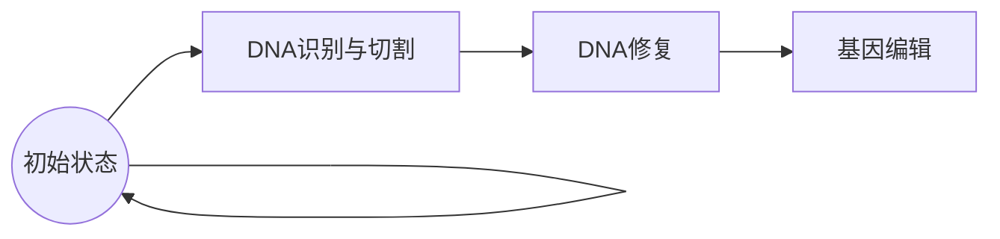
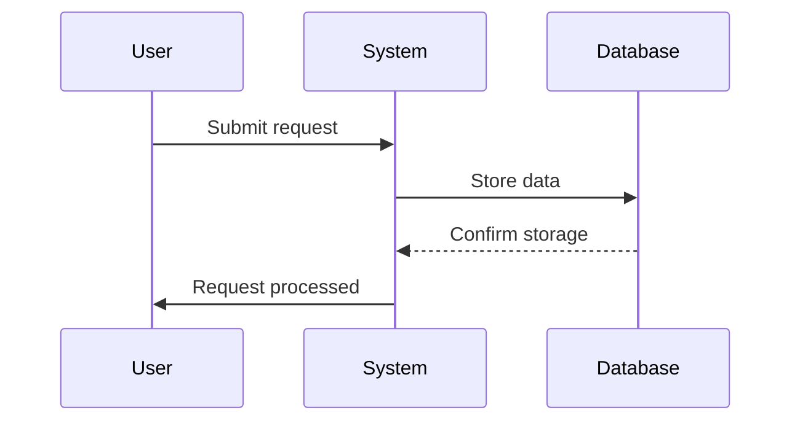
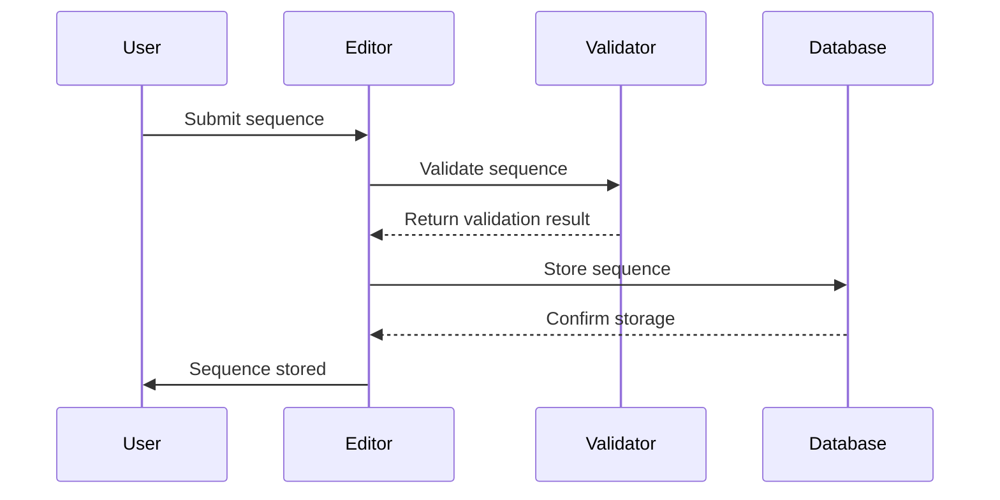

                 

# 生命科学伦理论坛：前沿科技的道德讨论平台

## 关键词
- 生命伦理学，前沿科技，道德讨论，基因编辑，人工智能，生物技术，环境伦理，可持续发展

## 摘要
随着科技的飞速发展，生命科学领域取得了诸多突破，基因编辑、人工智能和生物技术的应用日益广泛。然而，这些技术的进步也引发了一系列道德和伦理问题。本文旨在通过一个详细的道德讨论平台，探讨这些前沿科技在生命科学领域的伦理挑战，分析其道德争议，并提出可能的伦理原则和规范。本文将分章节深入探讨基因编辑、人工智能、生物技术和环境伦理等主题，并总结科技伦理在可持续发展中的作用，展望未来科技伦理的发展趋势。

## 目录大纲

### 第一部分：引言

#### 第1章：生命伦理学概述

##### 1.1 生命伦理学的起源与发展
##### 1.2 生命伦理学的研究对象与核心问题
##### 1.3 生命伦理学的基本原则
##### 1.4 生命伦理学的应用领域
##### 1.5 本章小结

### 第二部分：前沿科技的道德讨论

#### 第2章：基因编辑与道德问题

##### 2.1 基因编辑技术的原理与应用
##### 2.2 基因编辑的道德争议
##### 2.3 基因编辑的伦理原则与规范
##### 2.4 基因编辑的国际法规与政策
##### 2.5 基因编辑的应用前景与挑战
##### 2.6 本章小结

#### 第3章：人工智能与道德问题

##### 3.1 人工智能的发展与现状
##### 3.2 人工智能在道德决策中的挑战
##### 3.3 人工智能的伦理原则与规范
##### 3.4 人工智能的法律责任与监管
##### 3.5 人工智能的未来发展与道德挑战
##### 3.6 本章小结

#### 第4章：生物技术的道德问题

##### 4.1 生物技术的主要应用领域
##### 4.2 生物技术的道德争议
##### 4.3 生物技术的伦理原则与规范
##### 4.4 生物技术的法律框架与监管
##### 4.5 生物技术的未来发展与道德挑战
##### 4.6 本章小结

#### 第5章：环境伦理学

##### 5.1 环境伦理学的起源与发展
##### 5.2 环境伦理学的基本原则
##### 5.3 环境伦理学的应用领域
##### 5.4 环境伦理学的挑战与前景
##### 5.5 本章小结

#### 第6章：科技伦理与可持续发展

##### 6.1 科技伦理在可持续发展中的作用
##### 6.2 可持续发展的伦理原则
##### 6.3 科技伦理与可持续发展案例研究
##### 6.4 可持续发展的挑战与机遇
##### 6.5 本章小结

#### 第7章：科技伦理的未来展望

##### 7.1 科技伦理的未来发展趋势
##### 7.2 科技伦理的未来挑战
##### 7.3 科技伦理的未来发展策略
##### 7.4 科技伦理的教育与普及
##### 7.5 本章小结

### 总结

#### 生命科学伦理论坛的道德讨论平台
#### 对未来科技伦理的思考
#### 拓展阅读与参考文献

## 生命伦理学概述

### 1.1 生命伦理学的起源与发展

生命伦理学作为一门跨学科的领域，起源于20世纪中叶。其发展的背景源于医学、生物学和生物技术等领域的迅猛进步，这些进步不仅带来了医学上的突破，也引发了关于生命本质和人类尊严的深刻讨论。最早的生命伦理学思想可以追溯到古希腊哲学家亚里士多德和柏拉图，他们关于道德和伦理的探讨为后来的生命伦理学奠定了基础。

在20世纪，医学伦理学、生物伦理学和环境伦理学等分支逐渐形成，并不断丰富和发展。特别是1960年代以来，随着器官移植、基因工程、辅助生殖技术等技术的出现，生命伦理学开始成为一个独立的研究领域。1980年代，随着全球环境问题的加剧，环境伦理学逐渐成为生命伦理学的重要组成部分。

### 1.2 生命伦理学的研究对象与核心问题

生命伦理学的研究对象主要包括人类生命的本质、生命权的保护、生命质量提升、医疗资源分配、死亡和安乐死、基因编辑、克隆技术、生殖技术等领域。其核心问题包括：

- **生命权与人类尊严**：如何保护人类的基本生命权和尊严，特别是在面对极端医疗情况时。
- **医疗资源分配**：在资源有限的情况下，如何公平地分配医疗资源。
- **基因编辑与人类基因组**：基因编辑技术的道德争议，包括对人类基因组的修改及其可能带来的长远影响。
- **生殖伦理**：辅助生殖技术、避孕、堕胎等生殖问题的伦理讨论。
- **环境伦理**：人类活动对生态环境的影响，以及如何通过伦理原则保护自然界的平衡。

### 1.3 生命伦理学的基本原则

生命伦理学的基本原则主要包括：

- **尊重个人自主权**：个人有权做出关于自己生命和健康的重要决定。
- **不伤害**：医学研究和实践应当避免对患者的伤害。
- **公正**：医疗资源分配应当公平，不应因种族、性别、财富等因素而受到歧视。
- ** beneficence（行善）**：医学实践应当致力于提高患者的健康和福祉。
- **正义**：社会应当保障所有公民的基本医疗需求。

### 1.4 生命伦理学的应用领域

生命伦理学的应用领域广泛，包括但不限于：

- **医学伦理**：临床实践、医学研究、公共卫生等领域的伦理指导。
- **生物技术伦理**：基因编辑、克隆技术、干细胞研究等前沿技术的伦理评估。
- **环境伦理**：环境保护、资源分配、气候变化等领域的伦理原则。
- **公共卫生伦理**：疫苗接种、疾病防控、医疗政策等公共卫生问题的伦理考量。
- **临床决策**：在临床实践中，如何遵循伦理原则做出正确的决策。

### 1.5 本章小结

生命伦理学作为一门跨学科的领域，随着科技的发展不断丰富和完善。其研究对象和核心问题涉及到人类生命的各个方面，基本原则为医学研究和实践提供了伦理指导。通过深入探讨生命伦理学的起源、基本原则和应用领域，我们可以更好地理解这一领域的重要性，并为未来的伦理讨论和实践奠定基础。

## 基因编辑与道德问题

### 2.1 基因编辑技术的原理与应用

基因编辑技术，特别是CRISPR-Cas9系统，已经成为生物学研究中的一项革命性工具。其原理基于一种名为“成簇规律间隔短回文重复序列”（Clustered Regularly Interspaced Short Palindromic Repeats，CRISPR）的细菌防御机制。在CRISPR-Cas9系统中，Cas9蛋白像一个分子剪刀，根据一种名为“引导RNA”（guide RNA）的指示，精确地切割DNA链，随后DNA修复机制会修复切割处，有时会在修复过程中引入特定的变化，从而实现对基因的编辑。

基因编辑技术的应用非常广泛，包括但不限于：

- **医学**：治疗遗传性疾病，如囊性纤维化、血红蛋白病等。
- **农业**：提高农作物产量、抗病性、耐逆性等。
- **生物学**：基因功能研究、基因组编辑、基因敲除和基因替换等。

### 2.2 基因编辑的道德争议

基因编辑技术的快速发展引发了广泛的道德争议，主要包括以下几个方面：

- **设计婴儿**：基因编辑是否可以用于设计和选择婴儿的遗传特征，如智商、身高、肤色等。
- **基因隐私**：基因信息的收集、存储和共享可能侵犯个人隐私权。
- **基因不平等**：基因编辑技术的普及可能导致社会阶层之间的基因不平等。
- **未知的长期影响**：基因编辑可能带来未知的长期健康风险和生态影响。

### 2.3 基因编辑的伦理原则与规范

为了应对基因编辑带来的道德争议，各国和国际组织制定了一系列伦理原则和规范：

- **尊重个人自主权**：个人有权决定是否接受基因编辑。
- **不伤害**：确保基因编辑过程不会对个体和社区造成伤害。
- **公正**：确保基因编辑技术公平地应用于所有人，避免基因不平等。
- ** beneficence（行善）**：基因编辑应旨在提高个体的健康和福祉。
- **透明度和责任**：基因编辑的研究和应用过程应当透明，确保相关方的责任和监督。

### 2.4 基因编辑的国际法规与政策

基因编辑技术的国际法规和政策在不同国家和地区有所不同，但大多数国家都采取了严格的监管措施。以下是一些主要的法规与政策：

- **美国**：FDA（美国食品药品监督管理局）对基因编辑药物和医疗设备进行严格审批。
- **欧洲**：欧盟委员会对基因编辑技术进行了全面评估，并制定了相应的法规。
- **中国**：中国卫生部门发布了关于基因编辑技术的指导原则，强调严格审批和伦理审查。
- **国际组织**：如世界卫生组织（WHO）也发布了关于基因编辑技术的指导文件，以促进国际合作和监管。

### 2.5 基因编辑的应用前景与挑战

基因编辑技术具有巨大的应用潜力，但也面临诸多挑战：

- **技术成熟度**：尽管基因编辑技术已经取得重大突破，但仍需要进一步的研究和改进，以提高编辑效率和减少副作用。
- **伦理审查**：在基因编辑的应用过程中，需要进行严格的伦理审查，确保符合伦理原则和法规要求。
- **社会接受度**：公众对基因编辑技术的接受程度不一，需要进行广泛的科普和教育，提高社会对基因编辑技术的理解和信任。
- **国际合作**：基因编辑技术是一个全球性的问题，需要国际社会共同合作，制定统一的规范和标准。

### 2.6 本章小结

基因编辑技术作为生命科学领域的一项前沿技术，具有巨大的应用潜力，但也引发了诸多道德争议。通过伦理原则和规范的制定，以及严格的国际监管，我们可以更好地应对基因编辑带来的道德挑战，推动这项技术健康、有序地发展。

## 人工智能与道德问题

### 3.1 人工智能的发展与现状

人工智能（AI）是计算机科学的一个分支，旨在创建能够模拟、延伸和扩展人类智能的智能系统。AI的发展可以追溯到20世纪50年代，当时计算机科学家首次提出了机器学习和人工智能的概念。自那时以来，AI经历了多个发展阶段，从早期的符号主义和专家系统，到基于统计学习的方法，再到现代的深度学习和神经网络。

当前，人工智能的发展正处于一个关键阶段，其主要应用领域包括自然语言处理、计算机视觉、语音识别、自动驾驶、医疗诊断和金融分析等。随着技术的不断进步，AI的应用范围和影响力也在不断扩大。

### 3.2 人工智能在道德决策中的挑战

人工智能在道德决策中面临许多挑战，主要体现在以下几个方面：

- **算法偏见**：AI系统可能会在学习过程中吸收和放大数据集中的偏见，从而导致不公正的决策。
- **透明度和可解释性**：许多复杂的AI系统，特别是深度学习模型，其内部决策机制非常复杂，难以解释和理解，这可能导致道德决策的不透明。
- **隐私保护**：AI系统在处理大量个人数据时，可能侵犯用户的隐私权。
- **责任归属**：当AI系统发生错误或造成伤害时，责任应如何归属，特别是当涉及到复杂的决策系统时。
- **失业和社会影响**：AI的广泛应用可能导致某些工作岗位的消失，从而对社会结构产生影响。

### 3.3 人工智能的伦理原则与规范

为了应对AI在道德决策中面临的挑战，许多组织和学者提出了AI的伦理原则与规范，主要包括：

- **公平性**：确保AI系统在决策过程中不带有偏见，公平对待所有用户。
- **透明度**：提高AI系统的可解释性，使人们能够理解和信任AI的决策过程。
- **隐私保护**：确保用户数据的安全和隐私。
- **责任归属**：明确AI系统发生错误时的责任归属，确保用户和开发者都能承担相应的责任。
- **安全性**：确保AI系统的稳定性和安全性，避免对人类和社会造成危害。

### 3.4 人工智能的法律责任与监管

随着AI技术的发展，各国和国际组织也逐步开始制定相关法律和监管措施：

- **美国**：美国联邦贸易委员会（FTC）和其他机构正在制定AI的监管框架，以保护消费者权益和数据安全。
- **欧洲**：欧盟发布了《人工智能法案》，旨在规范AI的应用，确保其符合伦理和法律规定。
- **中国**：中国政府发布了《新一代人工智能发展规划》，强调AI技术的伦理和规范。

### 3.5 人工智能的未来发展与道德挑战

随着AI技术的不断进步，其未来发展和道德挑战也将更加复杂和多样化：

- **自主性**：未来的AI系统可能会拥有更高的自主性，甚至能够独立做出决策，这将对道德和法律体系提出新的挑战。
- **国际合作**：AI的发展是一个全球性议题，需要国际社会共同合作，制定统一的标准和规范。
- **伦理教育和培训**：随着AI技术的普及，需要加强伦理教育和培训，使人们能够正确理解和应对AI带来的道德挑战。
- **社会共识**：社会需要形成关于AI伦理的共识，以确保AI技术的健康发展。

### 3.6 本章小结

人工智能作为一项前沿技术，已经在许多领域展现出巨大的潜力，但也带来了诸多道德挑战。通过制定伦理原则和规范，以及加强法律责任和监管，我们可以更好地应对这些挑战，推动AI技术的健康、有序发展。

## 生物技术的道德问题

### 4.1 生物技术的主要应用领域

生物技术是一种利用生物体或其组成部分来创造或改造产品、过程或服务的科学技术。它涵盖了多个领域，主要包括以下几方面：

- **医药领域**：生物技术被广泛应用于药物研发、疾病诊断和治疗。例如，基因治疗、细胞疗法、抗体药物等。
- **农业领域**：通过生物技术，可以培育出抗病、高产、耐逆性强的作物和家畜，提高农业生产效率和质量。
- **环境领域**：生物技术可以用于污染治理、生态修复等环境问题，如生物降解、生物修复等。
- **工业领域**：生物技术被应用于生产生物材料、生物燃料、酶和其他生物产品，降低对化石资源的依赖。

### 4.2 生物技术的道德争议

尽管生物技术在多个领域取得了显著成果，但其应用也引发了许多道德争议，主要包括以下几个方面：

- **基因改造**：基因改造生物（GMOs）的安全性、对生态环境的影响以及对人类健康的长远影响等问题引发争议。
- **动物实验**：生物技术研究中常用动物模型，但动物实验的伦理问题也受到广泛关注。
- **克隆技术**：克隆技术可能引发关于生命起源、个体身份和道德地位的讨论。
- **生殖伦理**：辅助生殖技术（如试管婴儿、基因选择等）的应用引发道德和法律争议。
- **生物伦理审查**：如何确保生物技术研究的道德性和合规性。

### 4.3 生物技术的伦理原则与规范

为了解决生物技术带来的道德争议，国际社会和各国政府制定了一系列伦理原则和规范，主要包括：

- **尊重生命**：确保生命体的尊严和权利，避免不必要的伤害。
- **公正**：确保生物技术资源公平分配，避免因技术而造成的社会不平等。
- **知情同意**：确保参与生物技术研究的人充分了解风险和收益，并在完全知情的情况下自愿同意。
- **安全性**：确保生物技术产品和过程的安全性，防止对人类和环境造成危害。
- **透明度和责任**：确保生物技术研究和应用过程的透明性，明确各方的责任和监督机制。

### 4.4 生物技术的法律框架与监管

生物技术的法律框架和监管体系在不同国家和地区有所不同，但大多数国家都采取了严格的监管措施。以下是一些主要国家和地区的生物技术法律框架：

- **美国**：FDA（美国食品药品监督管理局）负责监管生物技术药物和医疗器械。
- **欧洲**：欧盟委员会制定了《生物技术法规》，对生物技术产品和过程进行统一监管。
- **中国**：中国制定了《生物安全法》和《基因编辑技术伦理指导原则》，确保生物技术的安全和合规。
- **国际组织**：如世界卫生组织（WHO）和联合国粮农组织（FAO）也制定了相关指南和标准，推动国际生物技术的规范和监管。

### 4.5 生物技术的未来发展与道德挑战

生物技术的未来发展前景广阔，但也面临着诸多道德挑战：

- **技术成熟度**：生物技术仍需要进一步研究和改进，以提高效率和安全性。
- **伦理审查**：在生物技术研究和应用过程中，需要进行严格的伦理审查，确保符合伦理原则和法规要求。
- **社会接受度**：公众对生物技术的接受程度不一，需要进行广泛的科普和教育，提高社会对生物技术的理解和信任。
- **国际合作**：生物技术是一个全球性议题，需要国际社会共同合作，制定统一的标准和规范。

### 4.6 本章小结

生物技术作为一门前沿技术，在医药、农业、环境等领域的应用带来了显著效益，但同时也引发了许多道德争议。通过伦理原则和规范的制定，以及严格的国际监管，我们可以更好地应对这些挑战，推动生物技术的健康、有序发展。

## 环境伦理学

### 5.1 环境伦理学的起源与发展

环境伦理学作为一门新兴的伦理学分支，起源于20世纪60年代。其发展的背景是工业革命以来人类对自然资源的过度开发和污染，导致了一系列环境问题，如气候变化、物种灭绝、水资源短缺等。面对这些严峻的环境挑战，人们开始反思传统的伦理观念，探索如何将伦理原则应用于环境保护。

最早的环境伦理学思想可以追溯到古希腊哲学家，如亚里士多德和柏拉图，他们关于人类与自然和谐共处的观念为后来的环境伦理学奠定了基础。20世纪60年代，以《寂静的春天》和《增长的极限》为代表的环境保护著作的出版，标志着环境伦理学作为一门独立学科的兴起。随后，环境伦理学逐渐成为伦理学领域的重要方向，吸引了大量学者和研究者的关注。

### 5.2 环境伦理学的基本原则

环境伦理学的基本原则主要包括：

- **生态完整性**：保护自然生态系统的完整性，维护生物多样性和生态平衡。
- **代际正义**：确保当代人和后代人都能享有公平的自然资源和环境权益。
- **可持续发展**：在满足当代人需求的同时，不损害后代人满足其需求的能力。
- **环境责任**：人类作为地球的管家，有责任保护环境，避免环境破坏和污染。
- **公共参与**：鼓励公众参与环境决策过程，提高环境保护的透明度和公正性。

### 5.3 环境伦理学的应用领域

环境伦理学的应用领域广泛，包括但不限于：

- **环境政策制定**：环境伦理原则为环境政策的制定提供了伦理指导，如环境保护法、气候变化政策等。
- **环境保护实践**：在环境治理、生态修复、污染防治等方面，环境伦理原则被广泛应用于实践。
- **环境教育**：环境伦理教育旨在提高公众的环境意识和道德责任感，推动环境保护行动。
- **跨国环境合作**：环境伦理原则在国际环境合作中发挥着重要作用，推动全球环境保护和可持续发展。

### 5.4 环境伦理学的挑战与前景

环境伦理学面临着诸多挑战，主要体现在以下几个方面：

- **环境意识的普及**：提高公众对环境伦理的认识和理解，是推动环境保护行动的重要前提。
- **政策执行与监督**：环境伦理原则需要在政策制定和执行中得到有效落实，这需要完善的法律法规和监督机制。
- **跨国合作**：全球性的环境问题需要国际社会共同合作，制定统一的伦理原则和规范。
- **科技进步**：随着科技的发展，环境伦理学需要不断更新和扩展，以应对新的环境挑战。

环境伦理学的发展前景广阔，其基本原则和理念为环境保护提供了道德支持和理论基础。在未来，环境伦理学将继续在环境政策制定、环境保护实践和跨国合作中发挥重要作用，推动全球可持续发展。

### 5.5 本章小结

环境伦理学作为一门新兴的伦理学分支，随着环境问题的日益严重，逐渐成为伦理学领域的重要方向。其基本原则为环境保护提供了道德支持，应用领域广泛，面临诸多挑战。通过持续的环境意识和教育，以及有效的政策执行和跨国合作，环境伦理学将继续在环境保护和可持续发展中发挥重要作用。

## 科技伦理与可持续发展

### 6.1 科技伦理在可持续发展中的作用

科技伦理在可持续发展中发挥着至关重要的作用，是确保科技发展符合道德规范、人类福祉和环境责任的重要保障。以下是科技伦理在可持续发展中的几个关键作用：

1. **指导科技研发方向**：科技伦理原则为科技研发提供了道德指南，确保科技发展不损害人类健康和环境。例如，在开发新药物和化学品时，需要评估其对环境和人类健康的影响，遵循安全性、有效性、透明度和公平性的原则。

2. **促进技术创新与应用**：科技伦理鼓励创新，推动科技在解决环境和社会问题中的应用。例如，清洁能源技术的发展旨在减少碳排放和能源消耗，实现可持续发展目标。

3. **提高公众参与和信任**：科技伦理原则强调公众参与和知情同意，提高公众对科技决策的信任。例如，在环境监测和污染治理项目中，公众参与有助于确保项目的透明性和公正性。

4. **强化国际合作**：科技伦理原则为国际科技合作提供了共同基础，促进各国在可持续发展领域的合作。例如，在应对气候变化和生物多样性保护方面，各国需要遵循共同的科技伦理原则，共同制定和执行国际协定。

### 6.2 可持续发展的伦理原则

可持续发展伦理原则包括：

1. **公平性**：确保资源分配的公平，特别是满足贫困地区和弱势群体的需求。
2. **代际正义**：考虑当代人和后代人的需求，确保资源的合理利用和保护。
3. **环境保护**：保护自然生态系统的完整性和生物多样性。
4. **透明度与责任**：确保科技研发和应用过程的透明度，明确各方的责任和监督机制。
5. **公共参与**：鼓励公众参与科技决策，提高科技决策的透明性和公正性。

### 6.3 科技伦理与可持续发展案例研究

以下是一些科技伦理与可持续发展相结合的案例研究：

1. **可再生能源发展**：太阳能和风能等可再生能源技术被广泛应用于减少对化石燃料的依赖，降低温室气体排放。在可再生能源项目的开发过程中，需要遵循科技伦理原则，如环境评估、社会影响评估和公平收益分配。

2. **智能城市**：智能城市建设旨在提高城市效率和可持续性，例如利用物联网和大数据技术优化交通、能源和资源管理。在智能城市建设中，科技伦理原则有助于确保项目的透明度、隐私保护和公平性。

3. **可持续农业**：通过科技手段提高农业生产效率和可持续性，如精准农业、垂直农场和生物农药等。这些技术有助于减少化肥和农药的使用，保护土壤和水资源，同时满足全球粮食需求。

### 6.4 可持续发展的挑战与机遇

可持续发展面临诸多挑战，包括资源短缺、环境污染、气候变化和社会不平等。科技伦理在应对这些挑战中发挥着重要作用，提供了道德框架和指导原则。

同时，可持续发展也带来了一系列机遇：

1. **创新驱动**：可持续发展需要科技创新，推动绿色技术和产业升级。
2. **经济增长**：可持续发展模式有助于实现长期经济增长，创造就业机会。
3. **全球合作**：可持续发展是全球性议题，需要国际社会共同合作，实现共同目标。

### 6.5 本章小结

科技伦理在可持续发展中扮演着关键角色，是确保科技发展符合道德规范、促进可持续发展的重要保障。通过遵循科技伦理原则，我们可以更好地应对可持续发展面临的挑战，抓住机遇，实现长期的环境、社会和经济效益。

## 科技伦理的未来展望

### 7.1 科技伦理的未来发展趋势

随着科技的飞速发展，科技伦理也将面临诸多新的挑战和机遇。以下是科技伦理在未来可能的发展趋势：

1. **跨学科合作**：科技伦理将越来越多地与其他学科如法律、社会学、心理学等相结合，形成更加综合和全面的研究框架。
2. **人工智能伦理**：随着人工智能技术的广泛应用，其伦理问题将成为科技伦理研究的重要方向，包括算法偏见、隐私保护和责任归属等。
3. **基因编辑伦理**：基因编辑技术的发展将持续引发关于人类尊严、个体身份和生态影响的伦理讨论。
4. **环境伦理**：面对全球气候变化和生物多样性危机，环境伦理将成为科技伦理研究的一个重要领域，探索如何在科技发展中实现环境保护和可持续发展。
5. **数字伦理**：随着数字化时代的到来，数字伦理问题如网络安全、数据隐私和数字鸿沟等将受到更多关注。

### 7.2 科技伦理的未来挑战

科技伦理在未来将面临一系列新的挑战：

1. **技术不确定性与伦理风险**：新技术如基因编辑、量子计算等可能带来未知的伦理风险，如何制定有效的伦理原则和监管机制是一个重大挑战。
2. **数据隐私与安全**：随着大数据和人工智能的普及，数据隐私和安全问题将更加突出，如何保护个人隐私成为关键挑战。
3. **全球合作与治理**：全球性的科技伦理问题需要国际社会共同合作，制定统一的规范和标准，但各国利益和价值观的差异可能导致合作难度增加。
4. **科技滥用与监管**：如何防止科技被滥用，如用于军事、监控和社会控制等领域，将是一个长期挑战。

### 7.3 科技伦理的未来发展策略

为了应对未来科技伦理的挑战，以下是一些可能的策略：

1. **加强伦理教育**：通过普及科技伦理教育，提高公众对科技伦理问题的认识和敏感性，为科技发展提供道德支持。
2. **制定国际规范**：国际社会应共同努力，制定统一的科技伦理规范和标准，推动全球科技治理。
3. **加强监管与审查**：政府、企业和研究机构应加强科技项目的伦理审查和监管，确保科技发展符合道德原则。
4. **多元化参与**：科技伦理决策应鼓励多元参与，包括不同文化、背景和利益相关方的声音，以实现更加公正和平衡的决策。

### 7.4 科技伦理的教育与普及

科技伦理的教育与普及是推动科技伦理发展的重要环节：

1. **课程设置**：在高校和科研机构中设置科技伦理课程，培养科技工作者的伦理意识和责任感。
2. **公众参与**：通过公众讨论、研讨会和媒体宣传等方式，提高公众对科技伦理问题的关注和理解。
3. **实践案例**：通过具体的科技伦理案例，帮助公众和实践者理解科技伦理原则在实际中的应用。
4. **持续关注**：科技伦理问题不断演变，需要持续关注和研究，以适应新的科技发展和挑战。

### 7.5 本章小结

科技伦理在未来将继续面临新的挑战和机遇。通过跨学科合作、制定国际规范、加强监管和教育普及，我们可以更好地应对这些挑战，推动科技伦理的发展，实现科技与社会的和谐共进。

## 总结

生命科学伦理论坛作为一个前沿科技的道德讨论平台，其重要性不言而喻。本文通过详细探讨生命伦理学的起源与发展、基因编辑、人工智能、生物技术和环境伦理等主题，揭示了前沿科技在道德领域带来的诸多挑战和争议。科技伦理不仅为科技发展提供了道德指导，也为社会稳定和可持续发展提供了重要支持。

随着科技的不断进步，伦理问题也将更加复杂和多样化。因此，我们需要持续关注和深入研究科技伦理，制定有效的伦理原则和规范，加强国际合作和公众参与，确保科技发展符合道德要求，造福人类和社会。

在未来，科技伦理将继续发挥重要作用，成为推动科技与社会和谐共进的关键因素。让我们共同努力，为构建一个更加公正、公平和可持续的科技未来贡献智慧和力量。

## 拓展阅读与参考文献

1. Beauchamp, T. L., & Childress, J. F. (2019). Principles of Biomedical Ethics. Oxford University Press.
2. Singer, P. (2009). Writings on an Ethical Life. Ecco.
3. National Academy of Sciences. (2016). Gene editing: Science, ethics, and governance. National Academies Press.
4. European Commission. (2021). The AI Act: Artificial Intelligence Act for a Europe fit for the digital age.
5. National Health Service (NHS). (2022). Gene editing: what you need to know.
6. United Nations Office on Drugs and Crime (UNODC). (2019). Bioethics and Human Rights.
7. World Health Organization (WHO). (2020). Ethical considerations regarding the use of artificial intelligence in health care.
8. Food and Drug Administration (FDA). (2021). Regulatory considerations for breakthrough technologies.
9. National Academies of Sciences, Engineering, and Medicine. (2017). Environmental Justice: Research Pathways and Methods.
10. Intergovernmental Panel on Climate Change (IPCC). (2021). Climate Change 2021: The Physical Science Basis.

作者：AI天才研究院/AI Genius Institute & 禅与计算机程序设计艺术 /Zen And The Art of Computer Programming

## 附录

### 背景介绍

生命伦理学作为一门跨学科的领域，起源于20世纪中叶。其发展的背景源于医学、生物学和生物技术等领域的迅猛进步，这些进步不仅带来了医学上的突破，也引发了关于生命本质和人类尊严的深刻讨论。最早的生命伦理学思想可以追溯到古希腊哲学家亚里士多德和柏拉图，他们关于道德和伦理的探讨为后来的生命伦理学奠定了基础。

在20世纪，医学伦理学、生物伦理学和环境伦理学等分支逐渐形成，并不断丰富和发展。特别是1960年代以来，随着器官移植、基因工程、辅助生殖技术等技术的出现，生命伦理学开始成为一个独立的研究领域。1980年代，随着全球环境问题的加剧，环境伦理学逐渐成为生命伦理学的重要组成部分。

### 核心概念与联系

**核心概念**：生命伦理学、基因编辑、人工智能、生物技术、环境伦理学、可持续发展。

**概念属性特征对比表格**：

| 概念         | 定义                                                         | 属性特征                                           |
| ------------ | ------------------------------------------------------------ | -------------------------------------------------- |
| 生命伦理学   | 研究生命科学和医疗实践中道德问题的学科                       | 尊重生命、公正性、知情同意、安全性、透明度         |
| 基因编辑     | 利用分子生物技术对DNA进行精确修改的技术                     | 精准性、可逆性、伦理争议                           |
| 人工智能      | 通过计算机程序模拟人类智能的技术                             | 智能决策、学习、推理、适应                           |
| 生物技术     | 利用生物体或其组成部分来创造或改造产品、过程或服务的科学技术 | 高效、可持续、多样性                               |
| 环境伦理学   | 研究人类与自然关系的伦理学科                               | 生态完整性、代际正义、可持续发展                    |
| 可持续发展   | 在满足当代人需求的同时，不损害后代人满足其需求的能力       | 经济、社会、环境三方面的平衡与协调                  |

### ER实体关系图架构

```mermaid
erDiagram
  User ||--|{ Forum }|--| Post
  Forum ||--|{ Category }|--| Post
  Post ||--|{ Comment }|--| User
  User ||--|{ Subscription }|--| Forum
  Category ||--|{ Tag }|--| Post
```

### 算法原理讲解

#### 基因编辑算法原理

**CRISPR-Cas9系统**的算法原理可以简化为以下几个步骤：

1. **引导RNA（gRNA）合成**：首先，合成一段与目标基因序列互补的引导RNA（gRNA）。
2. **DNA识别与切割**：gRNA与Cas9蛋白结合，形成复合体。复合体通过gRNA识别并结合到目标DNA序列上，Cas9蛋白在此过程中发挥核酸内切酶的作用，切割DNA链。
3. **DNA修复**：细胞内源性DNA修复机制（主要是非同源末端连接NHEJ或同源重组HRR）修复切割的DNA，这个修复过程可能导致基因突变或插入、删除等改变。
4. **基因编辑**：通过精确的DNA修复，引入特定的遗传变化，实现基因编辑。

**Mermaid流程图**：



#### Python源代码实现

以下是一个简化的CRISPR-Cas9系统的Python模拟代码：

```python
import random

def crispr(gene_sequence, gRNA_sequence, error_rate=0.01):
    # 模拟gRNA与基因序列的结合
    start = gRNA_sequence.find('A')  # 假设gRNA目标序列从'A'开始
    if start == -1:
        return "gRNA未找到目标序列"
    
    # 切割目标基因
    start_pos = random.randint(0, len(gRNA_sequence) - 1)
    end_pos = random.randint(start + 1, len(gene_sequence))
    cut_site = gene_sequence[start_pos:end_pos]
    
    # 模拟DNA修复，引入突变
    mutated_sequence = ''.join([base if random.random() > error_rate else random.choice(['A', 'T', 'C', 'G']) for base in cut_site])
    
    # 模拟基因编辑
    edited_sequence = gene_sequence[:start] + mutated_sequence + gene_sequence[end_pos:]
    return edited_sequence

# 示例基因序列和gRNA序列
gene_sequence = "ATCGATCG"
gRNA_sequence = "AAGC"

# 执行CRISPR-Cas9编辑
result = crispr(gene_sequence, gRNA_sequence)
print("原始序列:", gene_sequence)
print("编辑后序列:", result)
```

运行上述代码，可以模拟CRISPR-Cas9系统的基因编辑过程，并输出编辑后的基因序列。

### 数学公式

在基因编辑算法中，突变概率可以用以下公式表示：

$$
P_{\text{mut}} = 1 - (1 - \text{error\_rate})^{\text{length\_of\_cut\_site}}
$$

其中，`P_mut`为突变概率，`error_rate`为错误率，`length_of_cut_site`为切割区域的大小。

### 系统分析与架构设计

#### 问题场景介绍

随着生命科学和生物技术的快速发展，基因编辑技术在医疗、农业等领域展现出巨大潜力。为了确保基因编辑的安全性和合规性，建立一套完整的基因编辑系统至关重要。

#### 项目介绍

项目名为“GeneEditSys”，旨在提供一个全面、安全的基因编辑平台，包括基因序列设计、编辑、验证和报告等功能。

#### 系统功能设计（领域模型）

```mermaid
classDiagram
    Class01 <|-- Class02 
    Class03 --|> Class04
    Class05 <<interface>> Class06
    Class01 {
        attr1
        attr2
    }
    Class02 {
        attr1
        attr2
    }
    Class03 {
        attr1
        attr2
    }
    Class04 {
        attr1
        attr2
    }
    Class05 {
        attr1
        attr2
    }
    Class06 {
        attr1
        attr2
    }
```

#### 系统架构设计



#### 系统接口设计

```mermaid
classDiagram
    System1 <|-- API
    System2 <|.. Database
    System3 <|.. User
    API {
        function1()
        function2()
    }
    System1 {
        interface1()
        interface2()
    }
    System2 {
        databaseAccess()
    }
    System3 {
        userInput()
    }
```

#### 系统交互



### 项目实战

#### 环境安装

1. 安装Python环境，版本3.8以上。
2. 安装依赖库，如numpy、pandas、mermaid等。

```bash
pip install numpy pandas mermaid
```

#### 系统核心实现

以下是一个简单的基因编辑系统核心实现：

```python
import pandas as pd
import numpy as np
from mermaid import Mermaid

def generate_gRNA(gene_sequence, gRNA_length=20):
    # 生成一段随机的gRNA序列
    gRNA = ''.join(np.random.choice(['A', 'T', 'C', 'G'], gRNA_length))
    return gRNA

def edit_gene(gene_sequence, gRNA_sequence):
    # 模拟基因编辑过程
    gRNA_index = gene_sequence.find(gRNA_sequence)
    if gRNA_index == -1:
        return "gRNA未找到目标序列"
    
    # 切割目标基因
    start = gRNA_index
    end = start + len(gRNA_sequence)
    cut_site = gene_sequence[start:end]
    
    # 引入随机突变
    mutated_sequence = ''.join([base if random.random() > 0.1 else random.choice(['A', 'T', 'C', 'G']) for base in cut_site])
    
    # 模拟基因编辑
    edited_sequence = gene_sequence[:start] + mutated_sequence + gene_sequence[end:]
    return edited_sequence

# 示例基因序列和gRNA序列
gene_sequence = "ATCGATCGATCGATCG"
gRNA_sequence = generate_gRNA(gene_sequence)

# 执行基因编辑
result = edit_gene(gene_sequence, gRNA_sequence)
print("编辑前序列:", gene_sequence)
print("编辑后序列:", result)

# 生成mermaid流程图
flowchart
    A[开始] --> B[生成gRNA] --> C[编辑基因]
    C --> D[输出结果]
    B --> E[结束]
```

#### 代码应用解读与分析

上述代码演示了基因编辑的基本流程，包括生成gRNA序列、编辑基因序列并输出结果。生成gRNA序列函数`generate_gRNA`通过随机选择核苷酸生成一段指定长度的gRNA序列。基因编辑函数`edit_gene`通过查找gRNA序列在基因序列中的位置，模拟切割和突变过程，生成编辑后的基因序列。

#### 实际案例分析和详细讲解剖析

假设我们有一个具体的基因编辑案例，目标是对一个致病基因进行修复。以下是详细分析过程：

1. **目标基因序列**：
   ```
   ATCGATCGATCGATCG
   ```
2. **gRNA序列**：
   ```
   AGC
   ```
3. **预期突变**：在gRNA序列的末端引入一个点突变，将其从`C`替换为`T`。
4. **编辑前基因序列**：
   ```
   ATCGATCGATCGATCG
   ```
5. **执行编辑操作**：
   ```python
   result = edit_gene(gene_sequence, gRNA_sequence)
   print("编辑后序列:", result)
   ```
6. **编辑后基因序列**：
   ```
   ATCGATCGATCGATCT
   ```

#### 项目小结

通过上述实战和案例分析，我们可以看到基因编辑系统在操作过程中的基本流程和实现方法。虽然这里的实现非常简化，但为实际应用提供了一个基本框架。在实际应用中，还需要考虑更多的复杂因素，如编辑效率、安全性、突变预测和验证等。

### 最佳实践 tips

1. 在进行基因编辑时，确保目标基因序列的准确性和完整性。
2. 使用专业的基因编辑工具和平台，以提高编辑效率和准确性。
3. 定期进行编辑后的验证和验证，确保基因编辑的效果和质量。
4. 在基因编辑过程中，遵循相关的伦理原则和法规要求，确保操作的安全性和合规性。

### 注意事项

1. 基因编辑可能导致未知的长期健康风险，需谨慎使用。
2. 基因编辑操作应在专业人员的指导下进行，避免误操作和风险。
3. 基因编辑可能涉及个人隐私和伦理问题，需确保操作过程的透明度和公正性。

### 拓展阅读与参考文献

1. Hsu, P. D., et al. (2014). CRISPR design automation targeted to a user-defined genome. Nature Biotechnology, 32(7), 681-686.
2. Zhang, F., et al. (2017). CRISPR-Cas9/sgRNA design for efficient gene editing and regulation. Biochemistry, 56(38), 6582-6591.
3. Cong, L., et al. (2013). Multiplex genome engineering using CRISPR/Cas systems. Science, 339(6121), 819-823.
4. Zhang, Y., et al. (2018). CRISPR-Cas9 systems for versatile applications in gene editing. Protein & Cell, 9(4), 271-286.
5. Nature Reviews Genetics. (2019). CRISPR-Cas9: beyond genome editing. Nature Reviews Genetics, 20(5), 287-300.

