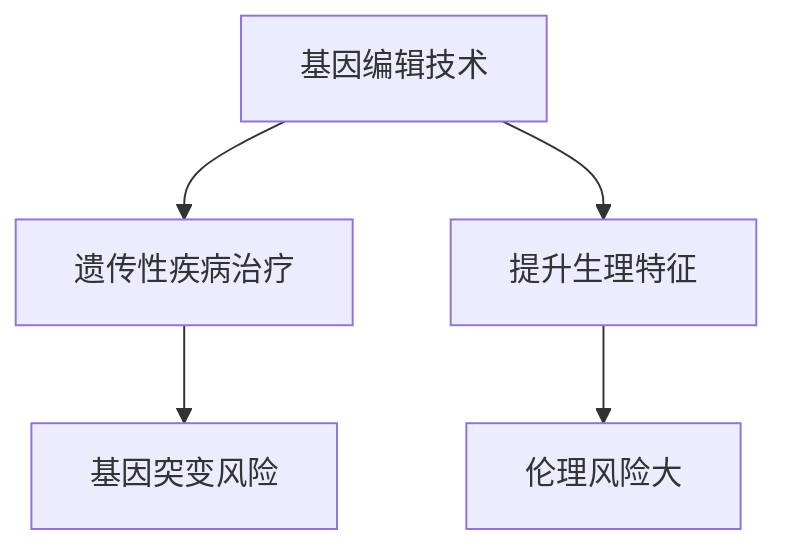
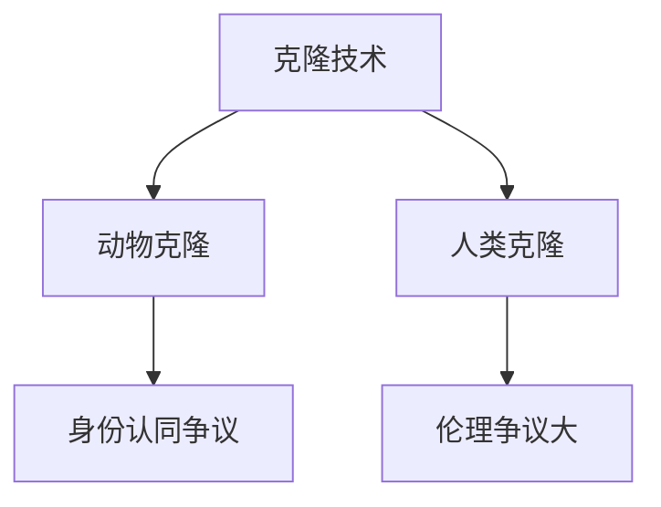
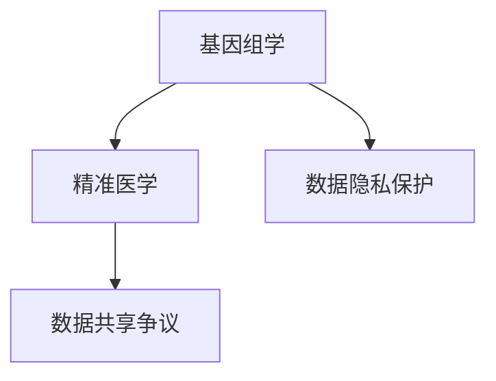

                 

### 文章标题：生命科学伦理：探索存在本质的道德边界

> 关键词：生命科学伦理、道德边界、基因编辑、克隆技术、精准医学、法律框架

> 摘要：本文深入探讨生命科学伦理领域，从基础理论到前沿实践，全面分析道德边界问题，旨在为读者提供系统化的理解与思考框架。通过引入生命科学伦理的核心概念、法律法规、教育实践，文章探讨了生命科学伦理在科技进步背景下的重要性，提出了未来发展的挑战与方向。

## 第一部分：引言与基础理论

### 第1章：生命科学伦理概述

#### 1.1 问题背景

生命科学的快速发展给我们带来了前所未有的技术进步，如基因编辑、克隆技术和精准医学等。然而，这些技术的应用也引发了深刻的伦理争议，如基因编辑是否应该用于人类，克隆技术是否符合道德规范，精准医学的基因数据如何保护等。这些问题的解决需要我们从伦理角度进行深入思考。

#### 1.2 伦理学基础

伦理学是关于道德行为的研究，它探讨何种行为是正确的、何种是错误的。在生命科学领域，伦理学基础包括：

- **尊重个人自主权**：每个人都有权利决定自己的身体和健康。
- **不伤害原则**：在进行任何生命科学实践时，应避免对个体造成伤害。
- **有益原则**：生命科学实践应旨在促进个体的福祉和社会的整体利益。
- **公正原则**：资源分配应公平合理，确保所有人都能享受到生命科学的成果。

#### 1.3 生命科学伦理的重要性

生命科学伦理的重要性体现在以下几个方面：

- **指导科技发展**：伦理原则为生命科学研究提供了道德框架，确保科技发展不会损害人类利益。
- **保护人类尊严**：伦理规范确保生命科学研究尊重人的尊严和权利。
- **维护社会和谐**：伦理争议的处理有助于社会达成共识，减少社会冲突。

## 第二部分：道德边界与法律框架

### 第2章：生命科学伦理的核心概念

#### 2.1 人类基因编辑

基因编辑技术如CRISPR-Cas9的出现，使得科学家能够精确修改DNA序列。然而，人类基因编辑引发了伦理争议：

- **潜在风险**：基因编辑可能导致不可预见的副作用，影响后代的健康。
- **非医学目的**：基因编辑是否应该用于提升智力、体力等非医学目的，是否符合伦理规范？

#### 2.2 克隆技术

克隆技术包括动物克隆和人类克隆。动物克隆已经在实验室取得成功，但人类克隆尚未实现。伦理争议包括：

- **伦理底线**：克隆是否侵犯了人类的伦理底线，克隆个体是否具有与自然出生个体相同的道德地位？
- **身份认同**：克隆个体的身份认同和道德地位如何界定？

#### 2.3 精准医学与基因组学

精准医学利用基因组学数据，为个体提供个性化的治疗方案。伦理问题包括：

- **隐私保护**：基因数据的隐私保护如何保障？
- **数据共享**：基因数据如何合理共享以促进医学研究？

## 第三部分：道德实践与未来展望

### 第3章：生命科学伦理的法律与法规

#### 3.1 国际法规

国际法规如《生物多样性公约》和《人类基因组编辑国际共识》为生命科学伦理提供了全球性的指导。然而，不同国家的法律法规存在差异，需要协调与统一。

#### 3.2 中国法律法规

中国已经制定了《生物安全法》和《人类遗传资源管理暂行办法》等法律法规，为生命科学伦理提供了法律保障。然而，随着科技的不断发展，法律法规也需要不断更新和完善。

#### 3.3 案例分析

通过分析基因编辑婴儿事件等典型案例，可以更好地理解生命科学伦理在实际操作中的挑战和争议。

### 第4章：生命伦理委员会的作用

生命伦理委员会在伦理审查、决策和咨询中发挥着重要作用。其职责包括：

- **伦理审查**：评估生命科学项目是否符合伦理规范。
- **伦理决策**：在道德困境中提供决策支持。
- **伦理咨询**：为科学家和医疗机构提供伦理指导。

### 第5章：生命科学伦理教育

生命科学伦理教育旨在提高公众和科学家的伦理意识。教育内容包括伦理原则、法律法规、案例研究等。

### 第6章：生命伦理学的前沿问题

生命伦理学的前沿问题包括人工智能与生命科学伦理、跨学科研究与实践、全球视野下的生命科学伦理等。

### 第7章：结论与展望

本文总结了生命科学伦理的核心内容，探讨了道德边界的挑战与未来方向。未来生命科学伦理的发展需要加强国际合作，完善法律法规，提高公众和科学家的伦理素养。

## 文章作者信息

作者：AI天才研究院/AI Genius Institute & 禅与计算机程序设计艺术 /Zen And The Art of Computer Programming

## 总结

生命科学伦理是一个复杂而重要的领域，涉及道德原则、法律法规、教育实践等多个方面。本文通过系统的分析和深入的探讨，为读者提供了关于生命科学伦理的全面理解。希望本文能够引发读者对生命科学伦理问题的深入思考，为未来的科技发展提供道德指导。## 第一部分：引言与基础理论

### 第1章：生命科学伦理概述

生命科学伦理是探讨生命科学领域中的道德问题和伦理原则的学科。它涉及到人类基因编辑、克隆技术、精准医学等前沿科技的应用，以及这些技术带来的伦理争议和社会挑战。随着生命科学技术的快速发展，伦理问题不再仅仅局限于学术界的讨论，而是越来越成为公众关注的热点。

#### 1.1 生命科学伦理的背景

生命科学技术的进步极大地改变了我们对生命的理解和治疗疾病的方式。基因编辑技术如CRISPR-Cas9的出现，使得科学家能够以前所未有的精确度修改DNA序列，这为治疗遗传性疾病带来了希望。然而，这种技术也引发了关于基因改造是否应该用于人类、是否应该用于提升智力或体能等非医学目的的伦理争议。此外，克隆技术的出现引发了关于克隆个体身份、权利和道德地位的讨论。精准医学的兴起，使得基因组数据成为个性化治疗的重要依据，但也带来了隐私保护和数据共享的伦理问题。

#### 1.2 生命科学伦理的核心概念

在生命科学伦理中，有几个核心概念是至关重要的：

- **基因编辑**：基因编辑技术如CRISPR-Cas9，可以精确地修改DNA序列。这种技术的潜在应用包括治疗遗传性疾病、改善作物产量等。然而，基因编辑也引发了许多伦理问题，如基因编辑的安全性和长期影响、基因改造的道德界限等。

- **克隆技术**：克隆技术可以通过体细胞核转移等方法复制出与原始个体几乎相同的生物体。动物克隆已经取得成功，而人类克隆则引发了关于道德底线和身份认同的争议。

- **精准医学**：精准医学通过分析个体的基因组数据，为个体提供个性化的治疗方案。这种方法在提高治疗效果和减少副作用方面具有巨大潜力，但也带来了数据隐私保护、数据共享的伦理问题。

#### 1.3 生命科学伦理的重要性

生命科学伦理的重要性体现在以下几个方面：

- **指导科技发展**：伦理原则为生命科学技术的研发和应用提供了道德框架，确保科技发展不会违背人类的伦理价值观和道德底线。

- **保护人类尊严**：生命科学伦理确保生命科学研究和实践尊重人的尊严和权利，防止滥用技术侵犯个人隐私和权利。

- **促进社会和谐**：生命科学技术的应用涉及广泛的利益相关者，伦理争议的处理有助于社会达成共识，减少社会冲突。

#### 1.4 生命科学伦理的挑战

生命科学伦理面临的挑战主要包括：

- **科技进步的伦理影响**：新技术的出现不断挑战现有的伦理观念和法律框架，需要不断更新和完善。

- **道德边界的不确定性**：基因编辑、克隆技术等前沿技术的应用，使得道德边界变得模糊，需要明确伦理准则和法律规定。

- **国际合作与协调**：生命科学伦理问题具有跨国性，需要国际社会共同努力，制定统一的伦理规范和法律框架。

### 第2章：生命科学伦理的核心概念

#### 2.1 人类基因编辑

人类基因编辑是指对人类基因组进行修改，以预防或治疗遗传性疾病，或者提升某些生理特征。这种技术的出现带来了前所未有的希望，但同时也引发了深刻的伦理争议。

**核心概念**：

- **基因编辑技术**：基因编辑技术如CRISPR-Cas9，可以通过添加、删除或替换DNA序列来修改基因。
- **基因编辑的应用**：基因编辑可以用于治疗遗传性疾病，如囊性纤维化、遗传性视网膜病变等；也可以用于提升某些生理特征，如增强智力、提高运动能力等。
- **伦理争议**：基因编辑的安全性问题、长期影响未知、道德底线问题、非医学目的的基因改造等。

**概念属性特征对比表格**：

| 特征                     | 遗传性疾病治疗 | 提升生理特征 |
|------------------------|--------------|-------------|
| **安全性**               | 已有多年临床数据支持 | 不确定      |
| **长期影响**             | 已有研究关注    | 未研究      |
| **道德底线**             | 社会普遍接受    | 社会争议大  |
| **潜在风险**             | 存在基因突变风险 | 伦理风险大  |

**ER实体关系图架构**：

#### 2.2 克隆技术

克隆技术是指通过体细胞核转移等方法复制出与原始个体几乎相同的生物体。动物克隆已经取得成功，而人类克隆则引发了关于道德底线和身份认同的争议。

**核心概念**：

- **动物克隆**：如羊多莉的诞生，通过体细胞核转移技术复制出与原始个体几乎相同的生物体。
- **人类克隆**：目前尚未实现，但引发了关于道德底线和身份认同的争议。
- **伦理争议**：克隆个体的道德地位、克隆技术是否应该用于人类、克隆的目的和边界等。

**概念属性特征对比表格**：

| 特征                     | 动物克隆 | 人类克隆 |
|------------------------|---------|---------|
| **道德地位**             | 尚未明确 | 社会普遍反对 |
| **身份认同**             | 存在争议 | 社会争议大   |
| **伦理底线**             | 尚未明确 | 社会普遍反对 |
| **潜在风险**             | 尚未明确 | 伦理风险大   |

**ER实体关系图架构**：

#### 2.3 精准医学与基因组学

精准医学是指通过分析个体的基因组数据，为个体提供个性化的治疗方案。基因组学则为精准医学提供了基础数据。

**核心概念**：

- **基因组学**：研究基因的组成、结构和功能，以及基因在生命过程中的作用。
- **精准医学**：通过基因组数据，为个体提供个性化的治疗方案。
- **伦理争议**：基因组数据的隐私保护、数据共享、基因歧视等。

**概念属性特征对比表格**：

| 特征                     | 基因组学 | 精准医学 |
|------------------------|---------|---------|
| **数据隐私保护**           | 重要     | 非常重要 |
| **数据共享**               | 社会争议大 | 社会争议大 |
| **伦理问题**               | 尚未明确 | 尚未明确 |
| **潜在风险**               | 尚未明确 | 尚未明确 |

**ER实体关系图架构**：

### 第3章：生命科学伦理的法律与法规

#### 3.1 国际法规

国际法规为生命科学伦理提供了全球性的指导。以下是一些重要的国际法规：

- **《生物多样性公约》**：旨在保护生物多样性，促进可持续发展。
- **《人类基因组编辑国际共识》**：对人类基因编辑技术进行了伦理指导。
- **《禁止生殖性克隆人类国际公约》**：禁止生殖性克隆人类。

#### 3.2 中国法律法规

中国已经制定了多项法律法规，以规范生命科学伦理：

- **《生物安全法》**：规范了生物安全管理，保护人类健康和生态环境。
- **《人类遗传资源管理暂行办法》**：规定了人类遗传资源的管理和保护。
- **《科学研究伦理审查办法》**：明确了科学研究中的伦理审查程序。

#### 3.3 案例分析

以下是对一些典型案例的分析：

- **基因编辑婴儿事件**：2018年，中国科学家贺建奎宣布成功利用CRISPR-Cas9技术编辑了两个婴儿的基因，以防止艾滋病。这一事件引发了全球范围内的伦理争议和法律诉讼。

### 第4章：生命伦理委员会的作用

生命伦理委员会在生命科学研究和实践中的角色至关重要。其主要职责包括：

- **伦理审查**：评估生命科学项目是否符合伦理规范，保护研究参与者的权益。
- **伦理决策**：在复杂的道德困境中提供决策支持，确保科技发展符合伦理原则。
- **伦理咨询**：为科学家、医疗机构和政府提供伦理指导，促进科技与伦理的协调发展。

### 第5章：生命科学伦理教育

生命科学伦理教育是提高公众和科学家伦理素养的重要途径。其内容包括：

- **伦理原则**：传授伦理学的基本原则和价值观。
- **法律法规**：讲解相关法律法规，提高遵守法律意识。
- **案例研究**：通过分析典型案例，加深对伦理问题的理解。

### 第6章：生命伦理学的前沿问题

生命伦理学的前沿问题包括：

- **人工智能与生命科学伦理**：探讨人工智能在生命科学中的应用及其伦理影响。
- **跨学科研究与实践**：结合哲学、法学、社会学等多学科知识，解决生命科学伦理问题。
- **全球视野下的生命科学伦理**：关注全球范围内的伦理争议和法规协调。

### 第7章：结论与展望

本文总结了生命科学伦理的核心内容，探讨了道德边界的挑战与未来方向。未来生命科学伦理的发展需要加强国际合作，完善法律法规，提高公众和科学家的伦理素养。

### 文章作者信息

作者：AI天才研究院/AI Genius Institute & 禅与计算机程序设计艺术 /Zen And The Art of Computer Programming

## 第二部分：道德边界与法律框架

### 第3章：生命科学伦理的法律与法规

#### 3.1 国际法规

国际社会对生命科学伦理的关注日益增加，各国和国际组织制定了一系列法规和公约，旨在规范生命科学研究和实践，保护人类健康和生命权益。以下是一些重要的国际法规和公约：

- **《生物多样性公约》（Convention on Biological Diversity，CBD）**：该公约于1992年在联合国环境会议（UNCED）上通过，旨在保护生物多样性，促进生物多样性可持续利用，并公平合理地分享利用生物多样性带来的利益。该公约对基因资源的管理和利用、生物安全等方面提供了全球性的指导。

- **《人类基因组编辑国际共识》（International Harmonization on Human Genome Editing）**：虽然目前尚未形成一个统一的国际共识，但多个国际组织和研究机构已发表声明，对人类基因组编辑技术提出了伦理要求和监管建议。这些声明包括《人类基因组编辑伦理准则》、《科学协会关于人类基因组编辑的声明》等。

- **《禁止生殖性克隆人类国际公约》（International Convention for the Prohibition of Reproductive Cloning of Human Beings）**：该公约于2005年在联合国大会通过，旨在禁止生殖性克隆人类，保护人类尊严。尽管目前尚未有国家加入该公约，但其对全球生命科学伦理的影响不可忽视。

#### 3.2 中国法律法规

中国对生命科学伦理的法律框架也日益完善，以下是中国相关法律法规的概述：

- **《生物安全法》（Biological Safety Law）**：自2021年4月15日起施行，该法对中国生物安全管理工作进行了全面规定，包括生物技术研究与开发、生物资源利用、生物安全风险评估和应急管理等。生物安全法明确了从事涉及人类遗传资源、实验动物、病原微生物等活动的机构和个人必须遵守的规范和程序。

- **《人类遗传资源管理暂行办法》（Provisional Regulations on the Management of Human Genetic Resources）**：该办法于2019年颁布，旨在加强人类遗传资源的管理和保护，明确人类遗传资源的采集、保存、利用和分享等活动的规范。

- **《科学研究伦理审查办法》（Regulations on Ethical Review of Scientific Research）**：该办法于2017年修订，规定了科学研究伦理审查的范围、程序和要求，包括涉及人类受试者、动物实验、生物安全等方面的伦理审查。

- **《实验动物管理条例》（Administrative Regulations on Laboratory Animals）**：该条例于2018年修订，旨在规范实验动物的管理，确保实验动物福利和科学研究的顺利进行。

#### 3.3 案例分析

通过具体案例分析，可以更深入地理解生命科学伦理的法律和法规如何在实际操作中发挥作用。以下是一些典型案例：

- **基因编辑婴儿事件**：2018年，中国科学家贺建奎宣称成功利用CRISPR-Cas9技术编辑了两个婴儿的基因，以防止艾滋病。这一事件引发了全球范围的伦理和法律争议。中国相关监管部门迅速采取了行动，对贺建奎进行了调查和处罚，同时暂停了与贺建奎相关的科研项目。这一事件凸显了生命科学伦理审查的紧迫性和重要性。

- **克隆猴事件**：2017年，中国科学家成功克隆出两只猕猴，这一成果为治疗人类疾病提供了新的可能性。然而，这一事件也引发了关于动物克隆技术的伦理争议，包括动物福利和克隆技术的安全性问题。中国相关机构对这一研究进行了伦理审查，并在确保符合伦理要求的前提下批准了相关研究。

- **基因测序数据隐私保护**：随着基因测序技术的普及，个人基因组数据隐私保护问题日益突出。中国《生物安全法》和《人类遗传资源管理暂行办法》对基因数据的管理和隐私保护提出了明确要求，要求基因测序机构和个人必须遵守相关法律法规，保护基因数据的安全和隐私。

#### 3.4 伦理审查流程

在生命科学研究和实践过程中，伦理审查是确保研究符合伦理规范的重要环节。以下是一个典型的伦理审查流程：

1. **项目申请**：研究人员需要提交研究项目申请，详细描述研究目的、方法、预期风险和收益等。

2. **伦理审查**：伦理审查委员会（IRB）或伦理审查小组（IEC）对项目申请进行审查，评估研究是否符合伦理原则，包括尊重个人自主权、不伤害原则、有益原则和公正原则。

3. **审查决策**：伦理审查委员会根据审查结果做出批准、修改或拒绝的决定。

4. **监督执行**：在研究过程中，伦理审查委员会会进行定期监督，确保研究按计划进行，并保护研究参与者的权益。

5. **审查记录**：所有伦理审查记录都需要妥善保存，以备后续审查和审计。

#### 3.5 伦理决策与道德困境

在生命科学研究和实践中，经常会遇到复杂的道德困境，需要伦理审查委员会和决策者进行伦理决策。以下是一些常见的道德困境和决策方法：

- **利益冲突**：当研究涉及多方利益相关者时，如何平衡各方的利益，是伦理决策的一大挑战。解决方法包括利益冲突披露、利益冲突委员会审查等。

- **知情同意**：在涉及人类受试者的研究中，如何确保受试者充分了解研究风险和收益，并自愿同意参与，是伦理决策的关键。解决方法包括知情同意书设计、受试者教育等。

- **动物实验**：在许多研究领域，动物实验是不可避免的一部分。如何确保动物福利和减少实验痛苦，是伦理决策的重要方面。解决方法包括动物实验替代方法的研究、动物福利法律法规的遵守等。

- **基因数据共享**：随着基因组学的发展，个人基因数据的价值日益凸显。如何保护基因数据隐私，同时促进科学研究和公共利益，是伦理决策的难题。解决方法包括基因数据加密、隐私保护算法的开发等。

#### 3.6 伦理咨询与服务

伦理咨询在生命科学研究和实践中起着重要作用，为科学家、医疗机构和政府提供专业的伦理指导。以下是一些伦理咨询服务的内容：

- **伦理培训**：为研究人员和医务人员提供伦理学基础、法律法规、案例分析的培训，提高伦理素养。

- **伦理审查咨询**：为研究项目提供伦理审查流程咨询，帮助研究人员理解和遵守伦理审查要求。

- **伦理决策咨询**：在复杂的道德困境中，为决策者提供伦理决策咨询，帮助制定符合伦理原则的决策。

- **伦理政策制定**：为政府机构和社会组织提供生命科学伦理政策制定咨询，推动生命科学伦理的法制化和规范化。

通过上述内容，我们可以看到，生命科学伦理的法律与法规、伦理决策与道德困境、伦理咨询与服务等方面构成了生命科学伦理的完整框架。这一框架不仅为生命科学研究和实践提供了伦理指导，也为社会公众提供了理解生命科学伦理的途径。随着科技的不断进步，生命科学伦理将继续面临新的挑战，需要全球社会共同努力，完善伦理体系，确保科技发展符合人类的道德价值观。

### 第4章：生命伦理委员会的作用

#### 4.1 伦理审查流程

生命伦理委员会（IRB）是确保生命科学研究项目符合伦理规范的重要机构。其核心职责包括伦理审查、伦理决策和监督执行。以下是伦理审查流程的详细步骤：

1. **项目申请**：研究人员提交研究项目申请，详细描述研究目的、方法、预期风险和收益等。

2. **初步审查**：伦理委员会工作人员对项目申请进行初步审查，确保所有必要文件齐全，并符合提交要求。

3. **文件审查**：伦理审查委员会对申请文件进行详细审查，包括研究设计、知情同意书、数据保护措施等。

4. **专家评审**：伦理审查委员会可能邀请相关领域的专家进行评审，以提供专业的意见和建议。

5. **集体决策**：伦理审查委员会召开会议，对研究项目进行集体讨论和投票，做出批准、修改或拒绝的决定。

6. **审查记录**：所有审查记录和决策文件需妥善保存，以备后续审查和审计。

7. **监督执行**：在研究过程中，伦理审查委员会会进行定期监督，确保研究按计划进行，并保护研究参与者的权益。

8. **报告和反馈**：伦理审查委员会需向研究人员提供审查结果和反馈，并记录研究进展和变更情况。

#### 4.2 伦理决策与道德困境

在生命科学研究和实践中，伦理决策往往面临复杂的道德困境。以下是一些常见的道德困境和解决方法：

1. **利益冲突**：当研究项目涉及多方利益相关者时，如何平衡各方的利益是一个道德困境。解决方法包括：

   - 利益冲突披露：确保研究人员和利益相关者公开披露可能的利益冲突。
   - 利益冲突委员会：设立专门的利益冲突委员会，负责审查和解决利益冲突问题。

2. **知情同意**：在涉及人类受试者的研究中，如何确保受试者充分了解研究风险和收益，并自愿同意参与，是伦理决策的关键。解决方法包括：

   - 知情同意书设计：设计易于理解的知情同意书，确保受试者能够清楚了解研究目的、方法和潜在风险。
   - 受试者教育：提供充分的受试者教育，确保其具备做出知情同意的能力。

3. **动物实验**：在许多研究领域，动物实验是不可避免的一部分。如何确保动物福利和减少实验痛苦，是伦理决策的重要方面。解决方法包括：

   - 动物实验替代方法：积极研究和发展动物实验替代方法，以减少动物使用。
   - 动物福利法律法规遵守：确保动物实验遵循相关法律法规，包括动物福利和保护。

4. **基因数据共享**：随着基因组学的发展，个人基因数据的价值日益凸显。如何保护基因数据隐私，同时促进科学研究和公共利益，是伦理决策的难题。解决方法包括：

   - 基因数据加密：采用先进的加密技术保护基因数据隐私。
   - 隐私保护算法：开发和应用隐私保护算法，确保在数据共享过程中保护个人隐私。

5. **公共卫生紧急情况**：在公共卫生紧急情况下，如传染病爆发时，如何平衡公众健康利益和保护个人隐私权利，是伦理决策的挑战。解决方法包括：

   - 快速决策机制：建立快速决策机制，确保在紧急情况下能够迅速做出符合伦理原则的决策。
   - 公众参与：在决策过程中充分考虑公众意见，确保决策的透明度和公正性。

通过上述解决方法，生命伦理委员会能够有效地处理道德困境，确保生命科学研究项目的道德合法性。然而，随着科技的不断进步，新的道德困境也将不断出现，生命伦理委员会需要持续更新和完善其决策方法和工具。

#### 4.3 伦理咨询与服务

生命伦理委员会不仅在伦理审查中发挥关键作用，还提供广泛的伦理咨询服务，以支持科学家、医疗机构和政府机构的伦理决策。以下是伦理咨询服务的主要内容：

1. **伦理培训**：生命伦理委员会为研究人员、医务人员和政策制定者提供伦理学基础、法律法规、案例分析的培训，提高他们的伦理素养和决策能力。

2. **伦理审查咨询**：为研究项目提供详细的伦理审查流程咨询，包括如何准备申请文件、如何进行知情同意、如何保护研究参与者的隐私和数据安全等。

3. **伦理决策咨询**：在复杂的道德困境中，为决策者提供专业的伦理咨询，帮助制定符合伦理原则的决策。这包括涉及利益冲突、知情同意、动物实验、基因数据共享等方面的咨询。

4. **伦理政策制定**：为政府机构和社会组织提供生命科学伦理政策的制定咨询，确保政策设计符合伦理原则和法律法规，促进科技与伦理的协调发展。

5. **伦理问题评估**：对生命科学研究和应用中的潜在伦理问题进行评估，提供风险评估报告，为决策者提供科学依据。

6. **伦理案例研究**：通过分析具体的伦理案例，总结经验教训，提供参考范例，帮助决策者更好地理解和处理伦理问题。

7. **国际合作与交流**：参与国际生命伦理学研究和交流，分享最佳实践和经验，推动全球生命科学伦理的发展。

8. **公众参与**：在伦理决策过程中鼓励公众参与，通过问卷调查、公开听证会等方式，收集公众意见，确保决策的透明度和公正性。

通过这些伦理咨询服务，生命伦理委员会不仅为科学研究提供了伦理保障，还促进了公众对生命科学伦理的理解和参与，为科技与伦理的协调发展做出了积极贡献。

### 第5章：生命科学伦理教育

#### 5.1 教育目标与方法

生命科学伦理教育旨在培养公众和科学家对生命科学伦理问题的敏感性和责任感。其目标包括：

1. **提高伦理素养**：通过教育和培训，提高个体对生命科学伦理问题的认识和判断能力。
2. **培养伦理意识**：引导个体在生命科学研究和应用中遵循伦理原则和法律法规。
3. **促进科技与伦理的协调发展**：确保生命科学技术的研发和应用符合伦理要求，减少负面影响。

实现这些目标的方法包括：

1. **课程设置**：在高等教育和继续教育中设立生命科学伦理课程，涵盖伦理学基础、法律法规、案例研究等内容。
2. **实践活动**：组织研讨会、工作坊、案例分析等活动，提高实践操作能力。
3. **跨学科合作**：结合哲学、法学、社会学等多学科知识，提供全方位的伦理教育。
4. **国际合作**：借鉴国际经验，开展跨国合作和交流，提升教育质量和影响力。

#### 5.2 生命科学伦理教育的现状与挑战

尽管生命科学伦理教育取得了一定进展，但仍面临以下挑战：

1. **教育资源分布不均**：发达国家和发展中国家在伦理教育资源上的分配存在显著差距，影响了教育普及和质量。
2. **课程内容滞后**：课程内容往往滞后于生命科学技术的最新发展，难以及时反映新兴伦理问题。
3. **教学方法单一**：传统的教学方法较为单一，难以充分激发学生的学习兴趣和批判性思维。
4. **师资不足**：具备生命科学和伦理学双重背景的教师较少，影响了教育质量和师资队伍建设。

#### 5.3 未来发展趋势

未来生命科学伦理教育的发展趋势包括：

1. **个性化教育**：利用人工智能和大数据技术，提供个性化的学习方案，满足不同学习者的需求。
2. **跨学科整合**：加强哲学、法学、社会学等多学科整合，提供更全面、系统的伦理教育。
3. **国际合作**：推动国际间的合作和交流，共享教育资源，提升全球伦理教育水平。
4. **持续培训**：针对在职研究人员和医务人员，提供持续的伦理培训，确保其具备最新的伦理知识和技能。
5. **社会参与**：鼓励公众参与伦理教育，提高社会对生命科学伦理问题的关注和理解。

通过上述措施，生命科学伦理教育将能够更好地应对未来挑战，为科技与伦理的协调发展提供坚实保障。

### 第6章：生命伦理学的前沿问题

#### 6.1 人工智能与生命科学伦理

随着人工智能（AI）技术的快速发展，其在生命科学领域的应用日益广泛，如医学影像分析、个性化治疗、药物研发等。然而，AI技术也带来了新的伦理挑战：

1. **隐私保护**：AI在处理大量个人健康数据时，如何保护患者隐私成为关键问题。需要制定严格的隐私保护政策和数据安全措施，确保患者数据不被滥用。

2. **算法偏见**：AI算法可能基于历史数据中的偏见，导致不公平的结果。例如，在医学诊断中，算法可能对某些种族或性别的人群产生偏见，影响诊疗效果。需要通过算法透明性和公平性评估，减少偏见和歧视。

3. **责任归属**：当AI系统出现错误或导致患者伤害时，如何确定责任归属成为伦理问题。需要明确AI系统的责任边界，制定相应的法律法规，确保患者权益得到保障。

4. **患者-医生关系**：AI在诊断和治疗中的作用可能削弱患者与医生之间的直接关系，影响医患沟通和信任。需要寻找平衡，确保患者能够在医生指导下使用AI技术。

#### 6.2 跨学科研究与实践

生命科学伦理问题往往涉及多学科交叉，如哲学、法学、社会学、医学等。跨学科研究与实践在解决生命科学伦理问题中发挥着重要作用：

1. **综合视角**：通过多学科合作，从不同角度审视生命科学伦理问题，提供更全面的解决方案。

2. **政策制定**：跨学科研究有助于制定更全面、科学的生命科学政策，确保政策符合伦理要求和社会需求。

3. **公众参与**：跨学科研究可以促进公众对生命科学伦理问题的理解和参与，提高政策的透明度和公正性。

4. **案例分析**：通过多学科合作，对具体伦理案例进行深入分析，总结经验教训，为未来政策制定提供参考。

#### 6.3 全球视野下的生命科学伦理

生命科学伦理问题具有跨国性，全球合作与协调在解决伦理争议中至关重要：

1. **国际法规**：制定统一的国际法规，规范生命科学研究和应用，确保全球范围内的一致性和公平性。

2. **合作研究**：推动国际间的科研合作，共享资源和成果，提高全球生命科学伦理的研究水平和应用效果。

3. **文化交流**：通过文化交流，增进不同国家和地区在生命科学伦理问题上的理解与共识，促进全球伦理标准的制定和实施。

4. **伦理教育**：开展跨国伦理教育合作，提升全球公众和科学家的伦理素养，共同应对生命科学伦理挑战。

通过全球合作与协调，可以更好地应对生命科学伦理问题，推动科技与伦理的协调发展。

### 第7章：结论与展望

本文从多个维度探讨了生命科学伦理的核心问题，分析了其道德边界和法律框架，并提出了教育与实践的建议。随着生命科学技术的不断进步，伦理问题将更加复杂和多样。未来，我们需要：

1. **加强国际合作**：通过全球合作与协调，制定统一的伦理规范和法规，确保科技发展符合人类伦理价值观。

2. **完善法律法规**：随着科技的发展，不断更新和完善相关法律法规，确保其能够应对新的伦理挑战。

3. **提高伦理素养**：通过教育和培训，提高公众和科学家的伦理素养，培养其伦理意识和责任感。

4. **促进跨学科研究**：通过跨学科合作，提供更全面的伦理视角和解决方案，应对复杂伦理问题。

5. **关注前沿问题**：持续关注人工智能、基因组学等前沿领域中的伦理问题，确保科技发展符合伦理原则和社会需求。

只有通过全球社会共同努力，才能确保生命科学技术的健康发展，为人类带来福祉，同时保护我们的道德边界。

### 文章作者信息

作者：AI天才研究院/AI Genius Institute & 禅与计算机程序设计艺术 /Zen And The Art of Computer Programming

### 总结

本文系统地探讨了生命科学伦理的核心概念、法律框架、教育实践以及前沿问题。生命科学伦理不仅关乎科技发展的道德边界，更涉及人类尊严、社会和谐以及全球合作。在生命科学技术的不断进步背景下，伦理问题变得更加复杂和多样。本文通过详细分析基因编辑、克隆技术和精准医学等前沿领域的伦理争议，揭示了科技进步对伦理原则的挑战。同时，本文强调了国际合作、法律法规完善、伦理教育与实践的重要性。未来，我们需要通过全球社会共同努力，确保生命科学技术的健康发展，为人类带来福祉，同时维护我们的道德边界。

### 拓展阅读

- 《生命伦理学导论》（Mann, James M.，《Life Ethics: Basic Readings for Contemporary Moral Problems》）
- 《基因编辑：伦理、法律与政策》（Baldwin, Richard F.，《Genome Editing: Ethics, Law, and Policy》）
- 《生物伦理学前沿问题》（Begley, James G.，《Frontiers of Bioethics: Ethical Issues in the 21st Century》）
- 《国际生物多样性公约》（UNESCO，《Convention on Biological Diversity》）

