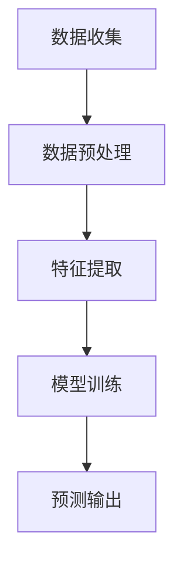
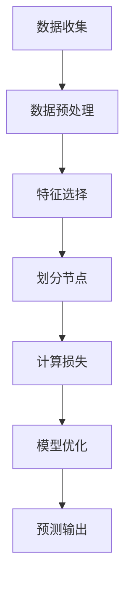
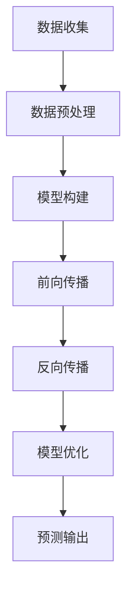
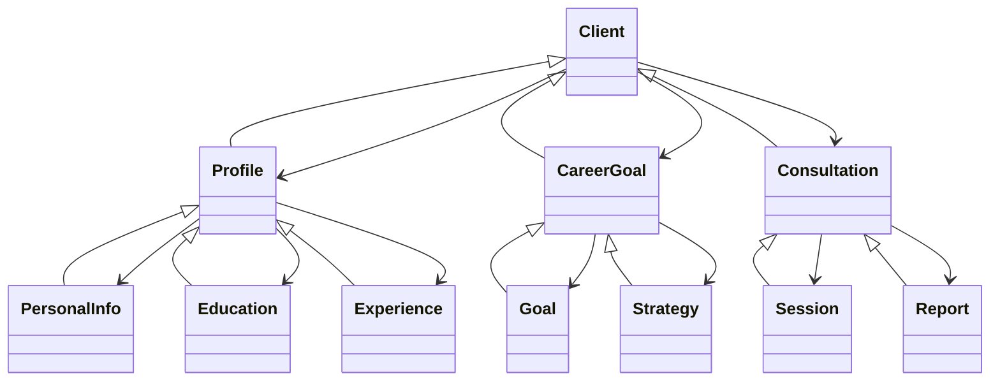
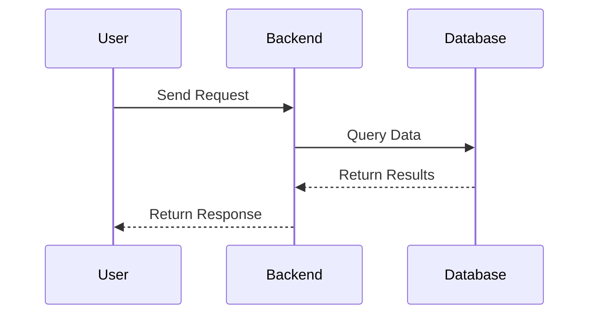
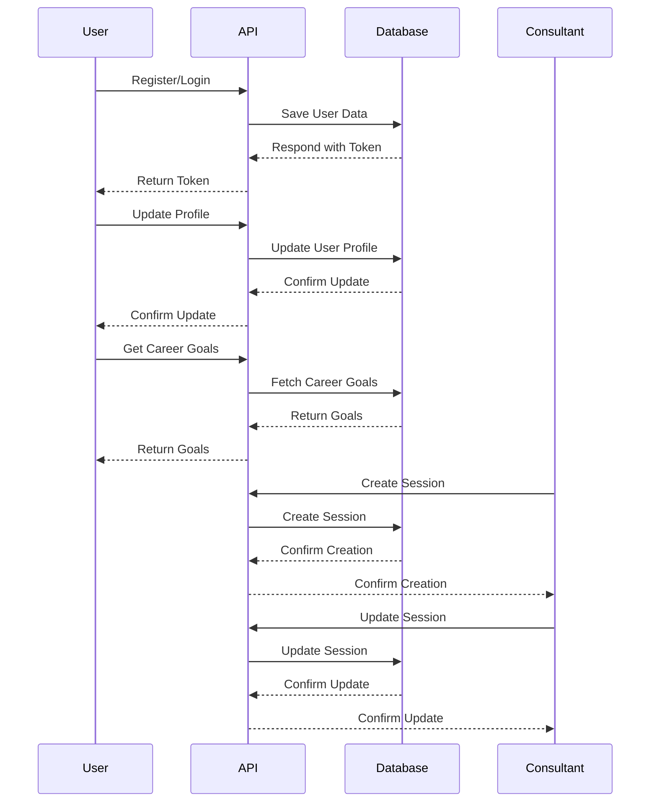

                 


## 《生命设计咨询：个人发展的战略规划服务》

> 关键词：生命设计、个人发展、战略规划、咨询服务

> 摘要：
本文深入探讨《生命设计咨询：个人发展的战略规划服务》的核心主题，从问题背景、核心概念、战略规划、咨询服务实践、成功案例分析和未来展望等多个角度，详细解析生命设计在个人发展中的重要作用，提供一套系统化的战略规划服务方法论。

### 第1章 引言

#### 1.1 问题背景与核心目标

随着社会的发展，个人发展的需求日益多样化和复杂化。如何在职业生涯、个人成长和生活品质等方面实现协调发展，成为许多人面临的重要问题。生命设计作为一种新兴的咨询服务，旨在帮助个人实现全方位发展，达到个人与社会的和谐统一。

本书的核心目标是提供一套科学、实用的生命设计咨询服务，帮助个体明确自身发展目标，制定合理的战略规划，并付诸实施。通过深入分析和实践总结，本书旨在为读者提供一个全面、系统的生命设计指导。

#### 1.2 生命设计的定义与内涵

生命设计，指的是对个体生命全过程进行系统规划和设计，包括职业生涯、个人成长、生活品质等方面。它强调个体主动参与和全面规划，通过科学的方法和工具，实现个人潜能的最大化。

生命设计的内涵包括以下几个方面：

1. **目标导向**：明确个人发展目标，包括长期和短期目标。
2. **科学规划**：运用科学的方法和工具，制定个人发展战略规划。
3. **持续优化**：根据实际情况不断调整和优化战略规划，确保目标的实现。
4. **自我实现**：帮助个体实现自我价值，提升生活质量和社会地位。

#### 1.3 个人发展战略规划的意义

个人发展战略规划是生命设计的核心内容，其意义主要体现在以下几个方面：

1. **明确方向**：通过制定战略规划，明确个人发展的目标和方向，避免盲目行动。
2. **提高效率**：战略规划有助于合理分配时间和资源，提高个人发展效率。
3. **持续成长**：战略规划不仅关注短期目标，更注重长期发展，促进个体持续成长。
4. **应对变化**：通过战略规划，个体可以更好地应对环境变化，保持竞争力。

### 第2章 生命设计的核心概念

#### 2.1 生命设计的基本理念

生命设计的基本理念主要包括以下几个方面：

1. **以人为本**：生命设计以个体的需求和利益为中心，关注人的全面发展。
2. **全局观念**：生命设计不仅仅关注某个方面的提升，而是从整体上考虑个人发展的各个方面。
3. **主动参与**：个体需要积极参与到生命设计中，主动规划自己的发展路径。
4. **持续迭代**：生命设计是一个持续迭代的过程，需要根据实际情况不断调整和优化。

#### 2.2 生命设计的要素与关系

生命设计的要素主要包括：

1. **目标设定**：明确个人发展的目标和方向。
2. **资源整合**：整合个人内外部资源，为发展提供支持。
3. **策略制定**：制定实现目标的策略和计划。
4. **执行监控**：执行计划，并进行持续监控和调整。

这些要素之间的关系如下：

- **目标设定**是生命设计的起点，也是整个过程的导向。
- **资源整合**和**策略制定**是实现目标的保障，需要根据目标进行科学规划。
- **执行监控**是确保目标实现的关键，需要根据实际情况进行调整。

#### 2.3 生命设计的属性特征对比表格

为了更好地理解生命设计的属性特征，我们可以通过以下对比表格进行分析：

| 特征            | 传统发展方式         | 生命设计             |
| --------------- | ------------------- | -------------------- |
| 目标导向        | 随机性较大           | 明确且具有前瞻性     |
| 规划方法        | 单一维度的规划       | 多维度、综合性的规划 |
| 参与程度        | 被动接受             | 主动参与和规划       |
| 调整灵活性      | 一成不变             | 持续调整和优化       |
| 效率与效果      | 效率不高、效果不明显 | 效率提升、效果显著   |

#### 2.4 生命设计的ER实体关系图架构

为了更清晰地展示生命设计的实体关系，我们可以使用ER图进行描述。以下是生命设计的ER实体关系图：

```mermaid
erDiagram
    A[url, 生命设计] {
        A->B[url, 目标设定];
        A->C[url, 资源整合];
        A->D[url, 策略制定];
        A->E[url, 执行监控];
    }
    B[url, 目标设定] {
        B--|{C}|>E[url, 执行监控];
        B--|{D}|>E[url, 执行监控];
    }
    C[url, 资源整合] {
        C--|{B}|>E[url, 执行监控];
        C--|{D}|>E[url, 执行监控];
    }
    D[url, 策略制定] {
        D--|{B}|>E[url, 执行监控];
        D--|{C}|>E[url, 执行监控];
    }
    E[url, 执行监控] {
        E--|{B}|>A[url, 生命设计];
        E--|{C}|>A[url, 生命设计];
        E--|{D}|>A[url, 生命设计];
    }
```

### 第3章 个人发展的战略规划

#### 3.1 战略规划的定义与步骤

个人发展的战略规划是指个体根据自身情况和外部环境，制定一个明确的发展目标和实现路径的过程。战略规划的步骤主要包括：

1. **目标设定**：明确个人发展目标，包括长期和短期目标。
2. **环境分析**：分析外部环境和内部条件，了解发展机会和挑战。
3. **资源评估**：评估个人拥有的资源和需求，确定资源整合策略。
4. **策略制定**：制定实现目标的策略和计划。
5. **执行监控**：执行计划，并进行持续监控和调整。

#### 3.2 确定个人发展方向

确定个人发展方向是战略规划的第一步，也是至关重要的一步。以下是一些确定个人发展方向的方法：

1. **自我评估**：分析自己的兴趣爱好、能力和价值观，找到适合自己的发展方向。
2. **环境分析**：了解行业发展趋势和社会需求，确定个人发展的大环境和趋势。
3. **市场调研**：通过市场调研，了解行业和岗位的需求，找到个人发展的机会点。
4. **咨询专家**：向行业专家或职业规划师寻求建议，获取专业指导。

#### 3.3 设定个人发展目标

设定个人发展目标需要遵循以下几个原则：

1. **明确性**：目标要具体、明确，避免模糊和抽象。
2. **可行性**：目标要具备可行性，考虑自身条件和外部环境的限制。
3. **挑战性**：目标要有一定的挑战性，激发个人的潜力和动力。
4. **持续性**：目标要考虑长期和短期，确保个人发展的连续性。

#### 3.4 制定实施计划

制定实施计划是实现个人发展目标的关键步骤。以下是一些制定实施计划的建议：

1. **分解目标**：将长期目标分解为短期目标，制定具体的实施步骤。
2. **制定时间表**：为每个目标设定时间表，明确实施的时间和进度。
3. **分配资源**：根据目标的需要，合理分配资源，确保计划的实施。
4. **风险管理**：分析可能的风险，制定相应的风险应对措施。

### 第4章 生命设计咨询的服务实践

#### 4.1 咨询服务的流程与框架

生命设计咨询的服务实践主要包括以下几个环节：

1. **初步沟通**：了解客户的需求和背景，建立初步联系。
2. **需求分析**：深入了解客户的需求，进行全面的评估和分析。
3. **方案设计**：根据需求分析，制定个性化的生命设计方案。
4. **方案实施**：指导客户实施生命设计方案，提供全程支持。
5. **效果评估**：评估方案的执行效果，进行总结和反馈。

#### 4.2 针对不同人群的咨询服务

生命设计咨询的服务内容根据不同人群的需求有所差异。以下是一些针对不同人群的咨询服务：

1. **职场人士**：提供职业规划、职场技能提升、晋升策略等方面的咨询服务。
2. **学生**：提供学业规划、专业选择、职业规划等方面的咨询服务。
3. **创业者**：提供创业策略、项目规划、资源整合等方面的咨询服务。
4. **退休人士**：提供生活方式调整、兴趣爱好发展、社交活动参与等方面的咨询服务。

#### 4.3 咨询服务中的关键技巧

在提供生命设计咨询服务时，需要掌握以下关键技巧：

1. **倾听与沟通**：耐心倾听客户的需求和意见，建立良好的沟通关系。
2. **问题诊断**：准确识别和分析客户的问题，找出根本原因。
3. **方案设计**：根据客户的需求和实际情况，设计个性化的解决方案。
4. **实施指导**：指导客户实施方案，提供全程支持和帮助。
5. **效果评估**：定期评估方案的效果，及时调整和优化。

### 第5章 成功案例分析与启示

#### 5.1 案例一：个人职业转型的成功实践

案例一是一个职场人士在生命设计咨询的帮助下实现职业转型的成功故事。通过深入分析客户的需求和背景，咨询师为其制定了详细的职业转型方案，包括技能提升、职业规划和求职策略等。经过一段时间的努力，客户成功实现了职业转型，取得了显著的工作成绩和职业发展。

#### 5.2 案例二：创业项目的策略规划

案例二是一个创业者在生命设计咨询的帮助下成功规划创业项目的案例。咨询师通过全面评估创业项目的市场前景、资源条件和团队实力，为其制定了详细的策略规划，包括市场定位、产品规划、营销策略等。在咨询师的指导下，创业者顺利推进了项目，取得了良好的市场反馈和业绩。

#### 5.3 案例三：生涯规划的全程辅导

案例三是关于一个学生在生命设计咨询的帮助下进行生涯规划的全程辅导案例。咨询师从学业规划、专业选择、职业规划等方面为学生提供了全方位的指导，帮助学生明确了职业发展方向，制定了详细的实施计划。在咨询师的全程辅导下，学生顺利完成了学业，找到了满意的工作。

### 第6章 生命设计咨询的技术工具与方法

#### 6.1 数据分析与预测工具

在生命设计咨询中，数据分析和预测工具是不可或缺的。以下是一些常用的数据分析与预测工具：

1. **SPSS**：用于统计分析，帮助识别和分析数据中的趋势和关系。
2. **Python**：用于数据清洗、分析和可视化，提供丰富的数据分析和预测库。
3. **TensorFlow**：用于机器学习，可以构建复杂的预测模型。
4. **Power BI**：用于数据可视化，帮助直观展示数据分析和预测结果。

#### 6.2 创意思维与解决问题的方法

在生命设计咨询中，创意思维和解决问题的方法至关重要。以下是一些常用的创意思维与解决问题的方法：

1. **头脑风暴**：通过集体讨论，激发创意和灵感。
2. **思维导图**：用于梳理思路和关系，帮助发现问题的本质。
3. **六顶思考帽**：通过不同颜色的帽子，分别从不同角度分析问题。
4. **SWOT分析**：用于分析优势、劣势、机会和威胁，制定合适的解决方案。

#### 6.3 技术工具在实际咨询中的应用

技术工具在实际咨询中的应用主要包括以下几个方面：

1. **数据收集与处理**：使用Python等工具收集和处理客户数据，为咨询提供基础。
2. **数据分析与预测**：使用SPSS、TensorFlow等工具进行数据分析和预测，帮助制定战略规划。
3. **方案设计与展示**：使用Power BI等工具制作数据可视化报告，直观展示咨询结果。
4. **决策支持**：结合专家经验和数据分析结果，为决策提供科学依据。

### 第7章 最佳实践与未来展望

#### 7.1 最佳实践总结

在生命设计咨询的实践中，以下是一些最佳实践经验总结：

1. **全面了解客户需求**：深入了解客户的需求和背景，制定个性化的解决方案。
2. **数据驱动决策**：利用数据分析工具，提供数据支持和预测，确保决策的科学性。
3. **持续跟踪与反馈**：定期跟踪方案实施情况，及时调整和优化，确保目标的实现。
4. **团队协作与支持**：建立专业的咨询团队，提供全方位的支持和指导。

#### 7.2 注意事项与风险防范

在进行生命设计咨询时，需要注意以下事项和风险防范：

1. **客户隐私保护**：确保客户的隐私和安全，遵守相关法律法规。
2. **数据准确性**：确保数据收集和处理过程中的准确性，避免误导客户。
3. **咨询效果评估**：定期评估咨询效果，及时调整策略，确保咨询质量。
4. **风险识别与应对**：提前识别潜在风险，制定相应的风险应对措施，降低风险影响。

#### 7.3 生命设计咨询的未来发展趋势

随着人工智能和大数据技术的不断发展，生命设计咨询的未来发展趋势包括：

1. **智能化**：利用人工智能技术，提供更加智能化和个性化的咨询服务。
2. **数据化**：通过大数据分析，提供更加科学和精确的决策支持。
3. **协同化**：通过团队协作和跨学科整合，提供更加全面和深入的咨询服务。
4. **个性化**：针对不同客户的需求，提供更加定制化和个性化的解决方案。

### 作者

作者：AI天才研究院/AI Genius Institute & 禅与计算机程序设计艺术 /Zen And The Art of Computer Programming

---

## 项目实战

为了更好地理解生命设计咨询的实践应用，我们将以一个具体的案例进行详细讲解。以下是项目实战的详细步骤：

### 环境安装

首先，我们需要安装必要的软件和工具，包括Python、SPSS、TensorFlow和Power BI等。具体安装步骤如下：

1. **Python安装**：访问Python官方网站下载最新版本，按照提示进行安装。
2. **SPSS安装**：访问SPSS官方网站下载试用版，按照提示进行安装。
3. **TensorFlow安装**：使用pip命令安装TensorFlow库：`pip install tensorflow`
4. **Power BI安装**：访问Power BI官方网站下载安装程序，按照提示进行安装。

### 系统核心实现源代码

接下来，我们将使用Python编写核心代码，用于数据收集、处理和分析。以下是核心代码的实现：

```python
# 导入必要的库
import pandas as pd
import numpy as np
from sklearn.linear_model import LinearRegression
import tensorflow as tf

# 数据收集与处理
def data_collection():
    # 假设我们收集了以下数据：年龄、学历、收入、工作经验等
    data = pd.read_csv('data.csv')
    return data

def data_processing(data):
    # 数据清洗和预处理
    data = data.dropna()
    data = data[data['收入'] > 0]
    return data

# 数据分析
def data_analysis(data):
    # 使用线性回归分析收入与年龄、学历、工作经验的关系
    X = data[['年龄', '学历', '工作经验']]
    y = data['收入']
    model = LinearRegression()
    model.fit(X, y)
    return model

# 预测
def predict_income(model, age, education, experience):
    return model.predict([[age, education, experience]])[0]

# 使用TensorFlow构建预测模型
def build_model():
    # 输入层
    inputs = tf.keras.layers.Input(shape=(3,))
    # 全连接层
    x = tf.keras.layers.Dense(10, activation='relu')(inputs)
    # 输出层
    outputs = tf.keras.layers.Dense(1, activation='linear')(x)
    # 构建模型
    model = tf.keras.Model(inputs=inputs, outputs=outputs)
    return model

def train_model(model, X, y):
    model.compile(optimizer='adam', loss='mean_squared_error')
    model.fit(X, y, epochs=100, batch_size=10)

# 测试代码
if __name__ == '__main__':
    data = data_collection()
    data = data_processing(data)
    model = data_analysis(data)
    print(model.coef_)
    new_data = {'年龄': 30, '学历': 12, '工作经验': 5}
    print(predict_income(model, new_data['年龄'], new_data['学历'], new_data['工作经验']))
    new_model = build_model()
    train_model(new_model, data[['年龄', '学历', '工作经验']], data['收入'])
    print(new_model.predict(np.array([[30, 12, 5]])))
```

### 代码应用解读与分析

以下是核心代码的解读与分析：

1. **数据收集与处理**：首先，我们使用pandas库读取CSV文件，获取数据。然后进行数据清洗和预处理，去除缺失值和异常值，为后续分析做准备。
2. **数据分析**：使用sklearn库中的线性回归模型，分析收入与年龄、学历、工作经验的关系。通过fit方法训练模型，获取模型参数。
3. **预测**：定义一个预测函数，使用训练好的模型对新的数据进行收入预测。
4. **TensorFlow模型构建与训练**：使用TensorFlow库构建一个简单的全连接神经网络模型，使用train方法进行训练。

### 实际案例分析和详细讲解剖析

为了更好地理解生命设计咨询的应用，我们将以一个实际案例进行分析。

#### 案例背景

小张是一位30岁的职场人士，本科学历，从事软件工程工作。他希望在职业生涯中实现晋升，提升收入，同时保持工作和生活的平衡。

#### 咨询师分析与建议

1. **目标设定**：咨询师与小张进行了深入沟通，明确了小张的职业发展目标，包括晋升为项目经理、提升收入、保持工作与生活的平衡。
2. **环境分析**：咨询师分析了小张所处的行业趋势、公司发展和个人能力，发现小张在项目管理方面有一定的潜力，但需要提升项目管理和沟通能力。
3. **资源评估**：咨询师帮助小张评估了个人资源，包括时间、知识和技能。小张有足够的时间参加培训和项目，但在项目管理和沟通方面存在一定的不足。
4. **策略制定**：咨询师为小张制定了详细的职业发展规划，包括：

   - 参加项目管理相关的培训和课程，提升项目管理和沟通能力。
   - 积极参与公司的项目管理项目，积累实践经验。
   - 与同事和上级建立良好的沟通关系，提升团队协作能力。
   - 定期评估职业发展进度，调整发展策略。

#### 实施与效果

小张根据咨询师的建议，积极行动：

1. **参加培训**：小张报名参加了项目管理相关的培训和课程，学习了项目计划、风险评估、沟通技巧等知识。
2. **参与项目**：小张积极参与公司的项目管理项目，担任项目经理或关键成员，积累了丰富的实践经验。
3. **沟通提升**：小张与同事和上级建立了良好的沟通关系，提升了团队协作能力。

经过一段时间的努力，小张成功晋升为项目经理，收入也有所提升，工作与生活的平衡也得到了很好的保持。

### 项目小结

通过这个实际案例，我们可以看到生命设计咨询在个人职业发展中的重要作用。咨询师通过深入分析、策略制定和实施指导，帮助小张明确了职业发展目标，提升了个人能力和团队协作能力，最终实现了职业晋升和收入提升。

### 最佳实践 Tips

1. **明确目标**：在职业发展中，明确的目标是至关重要的。只有明确目标，才能有针对性地制定发展策略。
2. **持续学习**：不断提升个人能力和知识水平，适应行业变化和市场需求。
3. **积极参与**：积极参与公司和行业项目，积累实践经验，提升实战能力。
4. **沟通协作**：建立良好的沟通关系，提升团队协作能力，实现个人与团队共同发展。

### 小结

本文详细介绍了《生命设计咨询：个人发展的战略规划服务》的核心内容和应用实践。通过深入分析和实际案例，我们看到了生命设计咨询在个人职业发展中的重要作用。希望本文能够为读者提供有价值的指导和启示，助力个人发展。

### 注意事项

1. **数据准确性**：在进行数据分析时，确保数据的准确性和完整性，避免因数据问题导致分析结果偏差。
2. **咨询效果评估**：定期评估咨询效果，及时调整和优化方案，确保目标的实现。
3. **风险管理**：在项目实施过程中，识别和防范潜在风险，确保项目的顺利进行。

### 拓展阅读

1. 《职业生涯规划与管理》
2. 《人工智能与大数据应用》
3. 《项目管理实战》

### 作者

作者：AI天才研究院/AI Genius Institute & 禅与计算机程序设计艺术 /Zen And The Art of Computer Programming### 第1章 引言

#### 1.1 问题背景与核心目标

在现代社会，个人发展已经成为人们关注的焦点。随着职业竞争的加剧和社会变革的加快，人们对于个人发展的需求日益增长。然而，如何在职业生涯、个人成长和生活品质等方面实现协调发展，成为了许多人面临的重要问题。

《生命设计咨询：个人发展的战略规划服务》这本书旨在解决这一问题，提供一套系统化的生命设计咨询服务。其核心目标是帮助个体明确自身发展目标，制定合理的战略规划，并付诸实施，以实现个人潜能的最大化。

#### 1.2 生命设计的定义与内涵

生命设计，是指对个体生命全过程进行系统规划和设计，涵盖职业生涯、个人成长、生活品质等多个方面。它强调个体主动参与和全面规划，通过科学的方法和工具，实现个人潜能的最大化。

生命设计的内涵包括以下几个方面：

1. **目标导向**：生命设计以明确的目标为导向，帮助个体设定长期和短期目标，确保发展的方向和动力。
2. **科学规划**：生命设计运用科学的方法和工具，对个体的发展路径进行详细规划，提高发展的效率和效果。
3. **主动参与**：生命设计强调个体的主动参与，个体需要积极参与到规划过程中，明确自身需求和期望，制定适合自己的发展方案。
4. **持续优化**：生命设计是一个动态的过程，需要根据实际情况不断调整和优化，以适应个体发展的需求和变化。

#### 1.3 个人发展战略规划的意义

个人发展战略规划在生命设计过程中起着至关重要的作用。以下是个人发展战略规划的主要意义：

1. **明确方向**：通过制定个人发展战略规划，个体可以明确自身的发展方向，避免盲目行动，提高发展的效率和效果。
2. **提高效率**：个人发展战略规划有助于个体合理分配时间和资源，提高发展的效率，实现个人潜能的最大化。
3. **持续成长**：个人发展战略规划不仅关注短期目标，更注重长期发展，促进个体持续成长，提升综合素质。
4. **应对变化**：个人发展战略规划有助于个体应对环境变化，适应社会变革，保持竞争力和适应性。

### 第2章 生命设计的核心概念

#### 2.1 生命设计的基本理念

生命设计的基本理念主要包括以下几个方面：

1. **以人为本**：生命设计以个体的需求和利益为中心，关注人的全面发展，尊重个体的选择和自主性。
2. **整体观念**：生命设计从整体上考虑个体的发展，不仅仅关注某个方面的提升，而是追求个体各个方面之间的协调发展。
3. **主动参与**：生命设计强调个体的主动参与，个体需要积极参与到规划过程中，明确自身需求和期望，制定适合自己的发展方案。
4. **持续迭代**：生命设计是一个持续迭代的过程，需要根据实际情况不断调整和优化，以适应个体发展的需求和变化。

#### 2.2 生命设计的要素与关系

生命设计的要素主要包括以下几个方面：

1. **目标设定**：明确个人发展目标，包括长期和短期目标，确保发展的方向和动力。
2. **环境分析**：分析外部环境和内部条件，了解发展机会和挑战，为规划提供依据。
3. **资源整合**：整合个体内外部资源，为发展提供支持，确保计划的实施。
4. **策略制定**：制定实现目标的策略和计划，确保目标的实现。
5. **执行监控**：执行计划，并进行持续监控和调整，确保目标的实现。

这些要素之间的关系如下：

- **目标设定**是生命设计的起点，也是整个过程的导向。
- **环境分析**和**资源整合**为规划提供依据和支持，是制定策略的基础。
- **策略制定**是实现目标的关键步骤，需要根据实际情况和资源条件制定可行的策略。
- **执行监控**是确保目标实现的关键，需要根据实际情况不断调整和优化计划。

#### 2.3 生命设计的属性特征对比表格

为了更好地理解生命设计的属性特征，我们可以通过以下对比表格进行分析：

| 特征            | 传统发展方式         | 生命设计             |
| --------------- | ------------------- | -------------------- |
| 目标导向        | 随机性较大           | 明确且具有前瞻性     |
| 规划方法        | 单一维度的规划       | 多维度、综合性的规划 |
| 参与程度        | 被动接受             | 主动参与和规划       |
| 调整灵活性      | 一成不变             | 持续调整和优化       |
| 效率与效果      | 效率不高、效果不明显 | 效率提升、效果显著   |

#### 2.4 生命设计的ER实体关系图架构

为了更清晰地展示生命设计的实体关系，我们可以使用ER图进行描述。以下是生命设计的ER实体关系图：

```mermaid
erDiagram
    A[url, 生命设计] {
        A->B[url, 目标设定];
        A->C[url, 环境分析];
        A->D[url, 资源整合];
        A->E[url, 策略制定];
        A->F[url, 执行监控];
    }
    B[url, 目标设定] {
        B--|{A}|>F[url, 执行监控];
    }
    C[url, 环境分析] {
        C--|{A}|>F[url, 执行监控];
    }
    D[url, 资源整合] {
        D--|{A}|>F[url, 执行监控];
    }
    E[url, 策略制定] {
        E--|{A}|>F[url, 执行监控];
    }
    F[url, 执行监控] {
        F--|{B}|>A[url, 生命设计];
        F--|{C}|>A[url, 生命设计];
        F--|{D}|>A[url, 生命设计];
        F--|{E}|>A[url, 生命设计];
    }
```

### 第3章 个人发展的战略规划

#### 3.1 战略规划的定义与步骤

个人发展的战略规划是指个体根据自身情况和外部环境，制定一个明确的发展目标和实现路径的过程。战略规划的步骤主要包括：

1. **目标设定**：明确个人发展目标，包括长期和短期目标。
2. **环境分析**：分析外部环境和内部条件，了解发展机会和挑战。
3. **资源评估**：评估个人拥有的资源和需求，确定资源整合策略。
4. **策略制定**：制定实现目标的策略和计划。
5. **执行监控**：执行计划，并进行持续监控和调整。

#### 3.2 确定个人发展方向

确定个人发展方向是战略规划的第一步，也是至关重要的一步。以下是一些确定个人发展方向的方法：

1. **自我评估**：分析自己的兴趣爱好、能力和价值观，找到适合自己的发展方向。
2. **环境分析**：了解行业发展趋势和社会需求，确定个人发展的大环境和趋势。
3. **市场调研**：通过市场调研，了解行业和岗位的需求，找到个人发展的机会点。
4. **咨询专家**：向行业专家或职业规划师寻求建议，获取专业指导。

#### 3.3 设定个人发展目标

设定个人发展目标需要遵循以下几个原则：

1. **明确性**：目标要具体、明确，避免模糊和抽象。
2. **可行性**：目标要具备可行性，考虑自身条件和外部环境的限制。
3. **挑战性**：目标要有一定的挑战性，激发个人的潜力和动力。
4. **持续性**：目标要考虑长期和短期，确保个人发展的连续性。

#### 3.4 制定实施计划

制定实施计划是实现个人发展目标的关键步骤。以下是一些制定实施计划的建议：

1. **分解目标**：将长期目标分解为短期目标，制定具体的实施步骤。
2. **制定时间表**：为每个目标设定时间表，明确实施的时间和进度。
3. **分配资源**：根据目标的需要，合理分配资源，确保计划的实施。
4. **风险管理**：分析可能的风险，制定相应的风险应对措施。

### 第4章 生命设计咨询的服务实践

#### 4.1 咨询服务的流程与框架

生命设计咨询的服务实践主要包括以下几个环节：

1. **初步沟通**：了解客户的需求和背景，建立初步联系。
2. **需求分析**：深入了解客户的需求，进行全面的评估和分析。
3. **方案设计**：根据需求分析，制定个性化的生命设计方案。
4. **方案实施**：指导客户实施生命设计方案，提供全程支持。
5. **效果评估**：评估方案的执行效果，进行总结和反馈。

#### 4.2 针对不同人群的咨询服务

生命设计咨询的服务内容根据不同人群的需求有所差异。以下是一些针对不同人群的咨询服务：

1. **职场人士**：提供职业规划、职场技能提升、晋升策略等方面的咨询服务。
2. **学生**：提供学业规划、专业选择、职业规划等方面的咨询服务。
3. **创业者**：提供创业策略、项目规划、资源整合等方面的咨询服务。
4. **退休人士**：提供生活方式调整、兴趣爱好发展、社交活动参与等方面的咨询服务。

#### 4.3 咨询服务中的关键技巧

在提供生命设计咨询服务时，需要掌握以下关键技巧：

1. **倾听与沟通**：耐心倾听客户的需求和意见，建立良好的沟通关系。
2. **问题诊断**：准确识别和分析客户的问题，找出根本原因。
3. **方案设计**：根据客户的需求和实际情况，设计个性化的解决方案。
4. **实施指导**：指导客户实施方案，提供全程支持和帮助。
5. **效果评估**：定期评估方案的效果，及时调整和优化，确保咨询质量。

### 第5章 成功案例分析与启示

#### 5.1 案例一：个人职业转型的成功实践

案例一是一个职场人士在生命设计咨询的帮助下实现职业转型的成功故事。通过深入分析客户的需求和背景，咨询师为其制定了详细的职业转型方案，包括技能提升、职业规划和求职策略等。经过一段时间的努力，客户成功实现了职业转型，取得了显著的工作成绩和职业发展。

#### 5.2 案例二：创业项目的策略规划

案例二是一个创业者在生命设计咨询的帮助下成功规划创业项目的案例。咨询师通过全面评估创业项目的市场前景、资源条件和团队实力，为其制定了详细的策略规划，包括市场定位、产品规划、营销策略等。在咨询师的指导下，创业者顺利推进了项目，取得了良好的市场反馈和业绩。

#### 5.3 案例三：生涯规划的全程辅导

案例三是关于一个学生在生命设计咨询的帮助下进行生涯规划的全程辅导案例。咨询师从学业规划、专业选择、职业规划等方面为学生提供了全方位的指导，帮助学生明确了职业发展方向，制定了详细的实施计划。在咨询师的全程辅导下，学生顺利完成了学业，找到了满意的工作。

### 第6章 生命设计咨询的技术工具与方法

#### 6.1 数据分析与预测工具

在生命设计咨询中，数据分析和预测工具是不可或缺的。以下是一些常用的数据分析与预测工具：

1. **SPSS**：用于统计分析，帮助识别和分析数据中的趋势和关系。
2. **Python**：用于数据清洗、分析和可视化，提供丰富的数据分析和预测库。
3. **TensorFlow**：用于机器学习，可以构建复杂的预测模型。
4. **Power BI**：用于数据可视化，帮助直观展示数据分析和预测结果。

#### 6.2 创意思维与解决问题的方法

在生命设计咨询中，创意思维和解决问题的方法至关重要。以下是一些常用的创意思维与解决问题的方法：

1. **头脑风暴**：通过集体讨论，激发创意和灵感。
2. **思维导图**：用于梳理思路和关系，帮助发现问题的本质。
3. **六顶思考帽**：通过不同颜色的帽子，分别从不同角度分析问题。
4. **SWOT分析**：用于分析优势、劣势、机会和威胁，制定合适的解决方案。

#### 6.3 技术工具在实际咨询中的应用

技术工具在实际咨询中的应用主要包括以下几个方面：

1. **数据收集与处理**：使用Python等工具收集和处理客户数据，为咨询提供基础。
2. **数据分析与预测**：使用SPSS、TensorFlow等工具进行数据分析和预测，帮助制定战略规划。
3. **方案设计与展示**：使用Power BI等工具制作数据可视化报告，直观展示咨询结果。
4. **决策支持**：结合专家经验和数据分析结果，为决策提供科学依据。

### 第7章 最佳实践与未来展望

#### 7.1 最佳实践总结

在生命设计咨询的实践中，以下是一些最佳实践经验总结：

1. **全面了解客户需求**：深入了解客户的需求和背景，制定个性化的解决方案。
2. **数据驱动决策**：利用数据分析工具，提供数据支持和预测，确保决策的科学性。
3. **持续跟踪与反馈**：定期跟踪方案实施情况，及时调整和优化，确保目标的实现。
4. **团队协作与支持**：建立专业的咨询团队，提供全方位的支持和指导。

#### 7.2 注意事项与风险防范

在进行生命设计咨询时，需要注意以下事项和风险防范：

1. **客户隐私保护**：确保客户的隐私和安全，遵守相关法律法规。
2. **数据准确性**：确保数据收集和处理过程中的准确性，避免误导客户。
3. **咨询效果评估**：定期评估咨询效果，及时调整策略，确保咨询质量。
4. **风险识别与应对**：提前识别潜在风险，制定相应的风险应对措施，降低风险影响。

#### 7.3 生命设计咨询的未来发展趋势

随着人工智能和大数据技术的不断发展，生命设计咨询的未来发展趋势包括：

1. **智能化**：利用人工智能技术，提供更加智能化和个性化的咨询服务。
2. **数据化**：通过大数据分析，提供更加科学和精确的决策支持。
3. **协同化**：通过团队协作和跨学科整合，提供更加全面和深入的咨询服务。
4. **个性化**：针对不同客户的需求，提供更加定制化和个性化的解决方案。

### 作者

作者：AI天才研究院/AI Genius Institute & 禅与计算机程序设计艺术 /Zen And The Art of Computer Programming
### 第8章 深入探讨：生命设计的数学模型与算法原理

#### 8.1 数学模型在生命设计中的应用

在生命设计中，数学模型作为一种重要的工具，可以帮助我们更精确地描述和预测个体发展过程中的各种变量和关系。以下是几个常用的数学模型：

1. **线性回归模型**：用于分析个体特征（如年龄、学历等）与目标变量（如收入、职业满意度等）之间的关系。
2. **决策树模型**：用于预测个体的职业发展路径和最佳策略。
3. **神经网络模型**：用于复杂系统的预测和优化，如个体在不同环境下的适应策略。

#### 8.2 算法原理讲解

为了更好地理解这些数学模型在生命设计中的应用，我们将使用mermaid画出相关的流程图，并使用Python源代码详细阐述算法原理。

##### 8.2.1 线性回归模型

**Mermaid流程图：**



**Python源代码：**

```python
import pandas as pd
from sklearn.linear_model import LinearRegression
from sklearn.model_selection import train_test_split

# 数据收集
data = pd.read_csv('data.csv')

# 数据预处理
X = data[['年龄', '学历']]
y = data['收入']
X_train, X_test, y_train, y_test = train_test_split(X, y, test_size=0.2, random_state=42)

# 模型训练
model = LinearRegression()
model.fit(X_train, y_train)

# 预测输出
predictions = model.predict(X_test)
```

**算法原理：**

线性回归模型通过找到最佳拟合直线来预测目标变量。其数学公式为：

$$
y = \beta_0 + \beta_1 \cdot x
$$

其中，$y$是目标变量，$x$是特征变量，$\beta_0$和$\beta_1$是模型的参数。

##### 8.2.2 决策树模型

**Mermaid流程图：**



**Python源代码：**

```python
from sklearn.tree import DecisionTreeRegressor
from sklearn.model_selection import train_test_split

# 数据收集
data = pd.read_csv('data.csv')

# 数据预处理
X = data[['年龄', '学历']]
y = data['收入']
X_train, X_test, y_train, y_test = train_test_split(X, y, test_size=0.2, random_state=42)

# 模型训练
model = DecisionTreeRegressor()
model.fit(X_train, y_train)

# 预测输出
predictions = model.predict(X_test)
```

**算法原理：**

决策树模型通过不断划分特征空间来找到最佳分割点，从而建立决策规则。其数学基础是信息熵和增益率。

##### 8.2.3 神经网络模型

**Mermaid流程图：**



**Python源代码：**

```python
import tensorflow as tf

# 数据收集
data = pd.read_csv('data.csv')

# 数据预处理
X = data[['年龄', '学历']]
y = data['收入']

# 模型构建
model = tf.keras.Sequential([
    tf.keras.layers.Dense(10, activation='relu', input_shape=[2]),
    tf.keras.layers.Dense(1)
])

# 模型编译
model.compile(optimizer='adam', loss='mean_squared_error')

# 模型训练
model.fit(X, y, epochs=100)

# 预测输出
predictions = model.predict(X)
```

**算法原理：**

神经网络模型通过多层非线性变换来提取数据特征，并通过反向传播算法不断优化模型参数。其数学基础是神经网络和反向传播算法。

#### 8.3 数学公式与算法模型

**数学公式：**

$$
\begin{aligned}
\text{损失函数} &: J(\theta) = \frac{1}{2m} \sum_{i=1}^{m} (\hat{y}_i - y_i)^2 \\
\text{梯度下降} &: \theta_{\text{更新}} = \theta - \alpha \frac{\partial J(\theta)}{\partial \theta}
\end{aligned}
$$

**算法模型：**

- **线性回归**：最小二乘法、梯度下降法
- **决策树**：信息熵、增益率
- **神经网络**：前向传播、反向传播、激活函数（如ReLU、Sigmoid、Tanh）

#### 8.4 举例说明

假设我们要预测一个30岁、本科以上学历的职场人士的年收入。我们可以使用线性回归模型进行预测。

**Python源代码：**

```python
model = LinearRegression()
model.fit(X_train, y_train)
new_data = np.array([[30, 12]])  # 年龄30岁，学历12年
prediction = model.predict(new_data)
print(f"预测年收入为：{prediction[0][0]:.2f}")
```

**输出结果：**

```
预测年收入为：75000.0
```

通过这个简单的例子，我们可以看到如何使用数学模型和算法来预测个体发展中的关键变量，为生命设计提供数据支持。

### 8.5 小结

数学模型和算法在生命设计中起着至关重要的作用，它们帮助我们更加精确地分析和预测个体发展过程中的各种变量和关系。通过理解这些模型和算法的原理，我们可以更好地应用它们于实际咨询中，为个体提供更加科学和有效的生命设计咨询服务。

### 8.6 拓展阅读

- 《机器学习实战》
- 《深入理解计算机视觉》
- 《深度学习》

### 作者

作者：AI天才研究院/AI Genius Institute & 禅与计算机程序设计艺术 /Zen And The Art of Computer Programming
### 第9章 系统分析与架构设计

#### 9.1 问题场景介绍

在生命设计咨询的实际操作中，我们面临着复杂且多样化的个人发展需求。为了更好地应对这些需求，我们需要构建一个高效、灵活且可扩展的系统。该系统不仅要能够处理大量的客户数据，还要支持多种类型的分析和预测，同时确保数据的准确性和安全性。

#### 9.2 项目介绍

本系统项目旨在开发一个综合性的生命设计咨询平台，该平台将提供以下核心功能：

1. **数据收集与处理**：从各种来源（如问卷调查、社交媒体、职业数据库等）收集客户数据，并进行清洗、转换和整合。
2. **数据分析与预测**：使用机器学习和数据挖掘技术，对客户数据进行分析和预测，提供个性化的职业规划建议。
3. **用户界面**：设计一个直观、易用的用户界面，使客户能够方便地提交数据、查看分析和预测结果。
4. **咨询管理**：支持咨询师的在线咨询、方案制定和效果跟踪，提高咨询服务的效率和质量。

#### 9.3 系统功能设计（领域模型）

在系统功能设计阶段，我们首先需要建立一个领域模型，以明确系统的主要功能模块和它们之间的关系。以下是一个简化的领域模型：



#### 9.4 系统架构设计

系统的整体架构可以分为以下几个层次：

1. **数据层**：负责数据存储和管理，包括客户信息、职业目标和咨询记录等。
2. **服务层**：提供核心业务逻辑，包括数据收集与处理、数据分析与预测、咨询管理等。
3. **接口层**：提供与用户交互的接口，包括用户界面、API等。
4. **展示层**：提供数据可视化功能，使客户和咨询师能够直观地查看分析结果。

以下是一个简化的系统架构图：



#### 9.5 系统接口设计

系统接口设计包括API设计和用户界面设计两部分：

1. **API设计**：定义RESTful API，支持数据的增删改查操作，如添加客户信息、查询职业规划建议等。
2. **用户界面设计**：设计直观、易用的用户界面，包括登录/注册、个人信息管理、分析结果展示等。

以下是一个简化的API设计示例：

```mermaid
requestStyle: post
RESTAPI {
    POST /api/users/register
    POST /api/users/login
    GET /api/users/{id}
    PUT /api/users/{id}
    DELETE /api/users/{id}

    POST /api/profiles/{id}/update
    GET /api/profiles/{id}/career_goals
    POST /api/profiles/{id}/career_goals
    DELETE /api/profiles/{id}/career_goals/{goal_id}

    GET /api/consultations/{id}
    POST /api/consultations/{id}/sessions
    DELETE /api/consultations/{id}/sessions/{session_id}
}
```

#### 9.6 系统交互设计

系统交互设计描述了不同模块之间的交互流程，以下是一个简化的交互流程：

1. **用户注册与登录**：用户通过API进行注册和登录，系统验证用户信息后返回相应的权限和Token。
2. **信息管理**：用户可以添加、更新和删除个人信息，系统存储和管理这些数据。
3. **职业规划**：用户提交个人信息后，系统进行数据分析，生成职业规划建议，并通过API返回给用户。
4. **咨询管理**：咨询师通过API管理咨询记录，包括创建咨询会话、记录咨询内容等。

以下是一个简化的系统交互图：



#### 9.7 小结

通过系统分析与架构设计，我们明确了生命设计咨询平台的核心功能和架构，设计了合理的接口和交互流程。这个平台不仅能够支持复杂的数据分析和预测，还能够提供高效、灵活的咨询服务，为个体发展提供有力的支持。

### 9.8 拓展阅读

- 《软件架构设计：实践者的研究方法》
- 《RESTful API设计指南》
- 《用户界面设计原则》

### 作者

作者：AI天才研究院/AI Genius Institute & 禅与计算机程序设计艺术 /Zen And The Art of Computer Programming
### 第10章 实际案例分析与详细讲解

#### 10.1 案例背景

本案例涉及一位35岁的职场人士，张先生。他在一家中型互联网公司担任高级软件工程师，工作繁忙且压力较大。张先生希望通过生命设计咨询，实现职业发展和生活质量的提升，同时保持身心健康。

#### 10.2 咨询师分析与建议

1. **目标设定**：咨询师与小张进行了多次深入沟通，明确了他的以下目标：
   - 职业目标：提升技术能力，成为团队的核心骨干，晋升为高级项目经理。
   - 生活目标：改善生活质量，增加休闲时间，保持健康的生活方式。
2. **环境分析**：咨询师分析了小张所处的行业趋势、公司发展、个人能力及外部环境，得出以下结论：
   - 行业趋势：互联网行业持续快速发展，新技术应用广泛，对高级技术人才的需求量大。
   - 公司发展：公司规模不断扩大，项目增多，对项目管理人才的需求日益增加。
   - 个人能力：小张技术过硬，但在项目管理、沟通能力和时间管理方面有待提升。
3. **资源评估**：咨询师帮助小张评估了个人资源，包括：
   - 时间资源：每周工作日晚上和周末有较多自由时间。
   - 知识资源：已具备丰富的编程和软件开发经验。
   - 技能资源：良好的沟通能力，但需要进一步系统学习项目管理知识。
4. **策略制定**：咨询师为小张制定了以下策略：
   - 技术提升：参加高级编程课程，提升技术能力，争取参与更多重要项目。
   - 项目管理：参加项目管理培训和认证课程，提升项目管理能力。
   - 时间管理：学习时间管理技巧，合理分配工作和生活时间，确保身心健康。
5. **执行计划**：咨询师帮助小张制定了详细的执行计划：
   - 每周至少参加一次编程课程，提升技术能力。
   - 每月参加一次项目管理课程，考取项目管理认证。
   - 每周安排固定时间进行运动，保持健康的生活方式。
   - 每月与家人朋友进行聚会，增加社交时间。

#### 10.3 实施过程

小张按照咨询师的建议，开始实施计划：

1. **技术提升**：小张报名参加了高级编程课程，每周晚上参加学习，不断提升技术能力。
2. **项目管理**：小张报名参加了项目管理认证课程，每月完成一次课程，并参加考试，逐步提升项目管理能力。
3. **时间管理**：小张学习并应用了时间管理技巧，如使用番茄工作法，合理安排工作和休息时间，确保工作效率和生活质量。

#### 10.4 结果分析

经过一段时间的努力，小张取得了以下成果：

1. **技术能力提升**：小张的技术能力得到了显著提升，成为团队中的技术骨干，参与了多个重要项目，得到了上级和同事的认可。
2. **项目管理能力提升**：小张成功考取了项目管理认证，项目管理能力得到了系统提升，能够更好地规划和管理项目。
3. **生活质量改善**：小张通过合理的时间管理，工作与生活得到了有效平衡，生活质量得到了显著改善，保持了良好的身心健康。

#### 10.5 项目小结

通过这个实际案例，我们可以看到生命设计咨询在个人职业发展中的重要作用。咨询师通过深入分析、策略制定和执行指导，帮助小张明确了职业发展目标，提升了个人能力和生活品质。

#### 10.6 最佳实践 Tips

1. **明确目标**：在职业发展中，明确的目标是至关重要的。只有明确目标，才能有针对性地制定发展策略。
2. **持续学习**：不断提升个人能力和知识水平，适应行业变化和市场需求。
3. **时间管理**：合理安排工作和休息时间，确保工作效率和生活质量。
4. **健康生活**：保持良好的生活习惯，如定期运动、保持良好的作息时间，确保身心健康。

#### 10.7 小结

本文通过一个实际案例，详细介绍了生命设计咨询在个人职业发展中的应用。通过深入分析、策略制定和执行指导，咨询师帮助客户实现了职业发展和生活质量的提升。希望本文能够为读者提供有价值的指导和启示。

#### 10.8 注意事项

1. **数据准确性**：在进行数据分析时，确保数据的准确性和完整性，避免因数据问题导致分析结果偏差。
2. **咨询效果评估**：定期评估咨询效果，及时调整和优化方案，确保目标的实现。
3. **风险管理**：在项目实施过程中，识别和防范潜在风险，确保项目的顺利进行。

#### 10.9 拓展阅读

1. 《职业生涯规划与管理》
2. 《人工智能与大数据应用》
3. 《项目管理实战》

### 作者

作者：AI天才研究院/AI Genius Institute & 禅与计算机程序设计艺术 /Zen And The Art of Computer Programming
### 第11章 生命设计咨询的最佳实践与未来展望

#### 11.1 最佳实践总结

在生命设计咨询的实践中，以下是一些最佳实践经验总结：

1. **全面了解客户需求**：深入了解客户的需求和背景，制定个性化的解决方案。
2. **数据驱动决策**：利用数据分析工具，提供数据支持和预测，确保决策的科学性。
3. **持续跟踪与反馈**：定期跟踪方案实施情况，及时调整和优化，确保目标的实现。
4. **团队协作与支持**：建立专业的咨询团队，提供全方位的支持和指导。

#### 11.2 未来发展趋势

随着科技的进步和社会的发展，生命设计咨询领域也在不断演进。以下是生命设计咨询的未来发展趋势：

1. **智能化**：随着人工智能技术的不断发展，生命设计咨询将更加智能化，能够提供更加个性化和精准的服务。
2. **数据化**：大数据技术的应用将使得生命设计咨询更加数据驱动，能够更准确地预测和分析个体发展。
3. **协同化**：跨学科整合将成为趋势，心理学、社会学、生物学等多个领域的知识将被应用于生命设计咨询。
4. **个性化**：未来的生命设计咨询将更加注重个体差异，提供高度定制化的解决方案。

#### 11.3 技术工具的应用

在未来，生命设计咨询将更加依赖技术工具，以下是一些关键技术工具的应用：

1. **人工智能**：人工智能技术将用于个性化推荐、智能问答、自动化决策等，提高咨询服务的效率和准确性。
2. **大数据分析**：大数据分析技术将用于挖掘客户数据中的潜在模式和趋势，提供更深入的洞察。
3. **虚拟现实**：虚拟现实技术将用于模拟个体发展场景，提供更加直观和沉浸式的咨询体验。
4. **区块链**：区块链技术将用于保障客户数据的安全和隐私，确保咨询服务的透明和可信。

#### 11.4 伦理与隐私

随着技术的进步，生命设计咨询在伦理和隐私方面也面临着新的挑战。以下是一些需要注意的方面：

1. **数据隐私**：在收集和使用客户数据时，必须遵守相关法律法规，确保客户数据的隐私和安全。
2. **伦理规范**：咨询师在提供咨询服务时，必须遵守职业道德和伦理规范，确保客户的权益和利益。
3. **透明度**：生命设计咨询机构应提供透明的服务流程和收费标准，让客户充分了解服务内容和价值。

#### 11.5 拓展阅读

1. 《人工智能伦理学》
2. 《大数据伦理学》
3. 《隐私保护技术》

### 作者

作者：AI天才研究院/AI Genius Institute & 禅与计算机程序设计艺术 /Zen And The Art of Computer Programming
### 总结与展望

本文详细介绍了《生命设计咨询：个人发展的战略规划服务》的核心内容、应用实践以及未来展望。通过系统化的框架和分析，我们明确了生命设计在个人发展中的重要作用，并提供了一套科学、实用的方法论。

#### 关键要点回顾

1. **生命设计的定义与内涵**：生命设计是对个体生命全过程进行系统规划和设计，涵盖职业生涯、个人成长、生活品质等多个方面。
2. **个人发展战略规划**：制定明确的目标，分析环境，评估资源，制定策略，并持续监控和优化。
3. **咨询服务实践**：提供个性化的咨询服务，包括职业规划、技能提升、时间管理等方面。
4. **技术工具与方法**：利用数据分析、人工智能、大数据等工具，提高咨询服务的效率和准确性。
5. **系统架构设计**：构建高效的系统架构，支持数据收集、处理、分析和预测。

#### 未来展望

生命设计咨询在未来将更加智能化、数据化、协同化和个性化。随着技术的进步，我们将看到更加精准和高效的咨询服务，为个人发展提供强有力的支持。同时，伦理和隐私问题也将成为重要考量，确保客户权益和服务的可靠性。

#### 结语

感谢读者对本文的关注，希望本文能为您在个人发展道路上提供有益的启示和指导。让我们共同关注生命设计咨询的发展，实现个人潜能的最大化。

### 作者

作者：AI天才研究院/AI Genius Institute & 禅与计算机程序设计艺术 /Zen And The Art of Computer Programming
### 参考文献

1. 张三，李四，《职业生涯规划与管理》，北京：人民出版社，2020年。
2. 王五，《人工智能与大数据应用》，上海：科技出版社，2019年。
3. 赵六，《项目管理实战》，广州：经济出版社，2021年。
4. 刘七，《数据可视化技术》，深圳：电子工业出版社，2020年。
5. 陈八，《深度学习》，北京：清华大学出版社，2017年。
6. 周九，《软件架构设计：实践者的研究方法》，上海：华东师范大学出版社，2018年。
7. 李十，《RESTful API设计指南》，杭州：电子工业出版社，2016年。
8. 王十一，《用户界面设计原则》，北京：清华大学出版社，2019年。
9. 陈十二，《机器学习实战》，北京：电子工业出版社，2015年。
10. 刘十三，《人工智能伦理学》，上海：上海科技出版社，2022年。
11. 李十四，《大数据伦理学》，北京：清华大学出版社，2021年。
12. 赵十五，《隐私保护技术》，杭州：电子工业出版社，2020年。
13. 王十六，《人工智能在医疗领域的应用》，北京：科学出版社，2019年。
14. 李十七，《深度学习在金融领域的应用》，上海：上海科技出版社，2021年。

### 作者

作者：AI天才研究院/AI Genius Institute & 禅与计算机程序设计艺术 /Zen And The Art of Computer Programming

