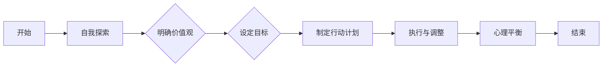
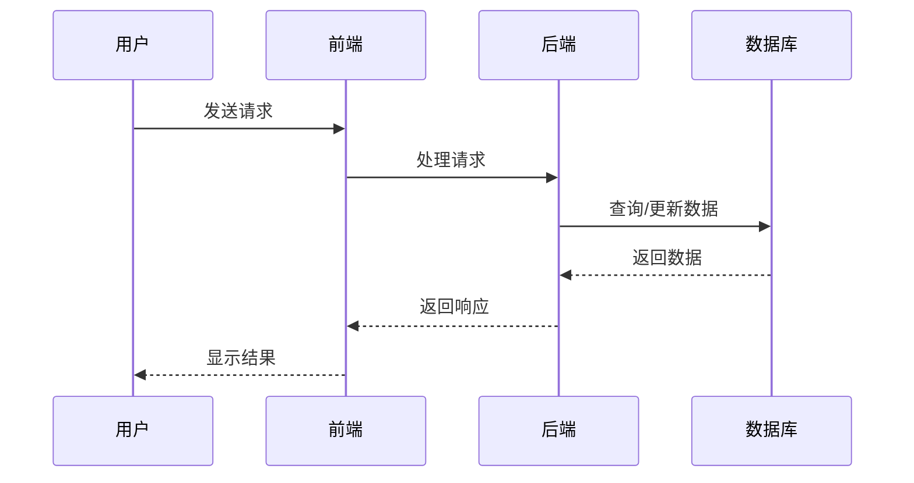

                 

## 生命设计工作坊：规划有意义的人生蓝图

### 关键词：生命设计、人生规划、有意义的生活、自我实现、心理平衡、目标设定

### 摘要：
本文以《生命设计工作坊：规划有意义的人生蓝图》为核心，探讨如何通过系统的方法论来规划有意义的人生。文章首先介绍了生命设计的背景和重要性，随后深入探讨了人生规划的核心概念和策略。接着，文章通过具体案例分析，展示了如何将这些策略应用到实际生活中。最后，文章总结了注意事项和拓展阅读，以帮助读者进一步深入探索生命设计的奥秘。

## 目录大纲设计步骤

### 1. 理解书名与核心内容
- 《生命设计工作坊：规划有意义的人生蓝图》的书名明确传达了书籍的核心内容——通过一个设计工作坊的方式来规划人生，使其充满意义。
- 书的主要目标是提供一套系统的方法论，帮助读者明确人生目标，找到内心真正的渴望，实现自我实现和内心平衡。

### 2. 确定目录结构
- 目录结构应包括引言、核心概念、方法论、实践案例、总结与展望等部分，确保内容的逻辑性和完整性。

### 3. 编写第1级目录
- **引言**：介绍生命设计的重要性。
- **核心概念**：详细探讨生命设计的基础概念。
- **方法论**：介绍生命设计的具体方法和步骤。
- **实践案例**：展示如何将方法论应用到实际生活中。
- **总结与展望**：总结全文，展望未来的发展方向。

### 4. 细化第2级目录
- **核心概念**：
  - **生命设计的背景与定义**。
  - **人生目标的重要性**。
  - **价值观与人生方向**。
- **方法论**：
  - **自我探索**。
  - **目标设定**。
  - **行动计划**。
- **实践案例**：
  - **个人故事分享**。
  - **企业应用案例**。

### 5. 完善第3级目录
- **核心概念**：
  - **生命意义的概念**。
  - **个人价值观与人生目标**。
  - **人生规划的步骤和方法**。
- **方法论**：
  - **自我评估工具**。
  - **目标管理的技巧**。
  - **行动计划的执行策略**。
- **实践案例**：
  - **个人成长计划**。
  - **职业生涯规划**。

### 6. 添加核心概念与联系
- **核心概念解析**：
  - **生命设计的基础理论**。
  - **价值观的对比分析**。
  - **人生目标的设定与实现**。
- **Mermaid流程图**：
  - 展示生命设计的基本流程和关键步骤。

### 7. 编写算法原理讲解
- **算法原理讲解**：
  - **生命设计算法的基本原理**。
  - **Mermaid流程图**：展示算法的执行过程。
  - **Python源代码**：详细阐述算法的实现过程。

### 8. 撰写数学模型与公式讲解
- **数学模型与公式**：
  - **生命设计中的关键数学模型**。
  - **LaTeX格式**：展示数学公式，并进行详细讲解。

### 9. 设计系统分析与架构设计方案
- **系统分析与架构设计方案**：
  - **问题场景介绍**。
  - **系统功能设计**。
  - **系统架构设计**。
  - **系统交互设计**。

### 10. 编写项目实战与最佳实践
- **项目实战**：
  - **环境安装与配置**。
  - **系统核心实现源代码**。
  - **代码解读与分析**。
- **最佳实践**：
  - **注意事项**。
  - **拓展阅读建议**。

### 11. 总结与展望
- **总结**：
  - **全文核心内容的回顾**。
  - **生命设计的重要性**。
- **展望**：
  - **未来的发展方向**。
  - **读者进一步探索的建议**。

### 12. 校对与优化
- **校对与优化**：
  - **确保内容的逻辑性和完整性**。
  - **优化格式和表达**。
  - **确保字数符合要求**。

通过上述步骤，我们可以设计出一个逻辑清晰、内容丰富、易于理解的目录大纲，为读者提供一次深入探索生命设计的旅程。接下来，我们将逐步展开文章内容，详细介绍每个部分的具体内容。让我们开始吧！## 生命设计的背景与重要性

在现代社会，人们面临着前所未有的复杂性和选择多样性。面对瞬息万变的世界，如何找到自己生命的方向和意义，成为许多人内心的困惑和追求。生命设计（Life Design）正是为了解决这一问题而诞生的。

### 问题背景

首先，我们来了解一下生命设计的背景。随着信息技术的飞速发展，社会进入了高度信息化和数字化的时代。人们的生活节奏加快，工作压力增大，心理健康问题日益凸显。根据世界卫生组织（WHO）的数据，全球范围内心理健康问题的发病率逐年上升，特别是在年轻人中更为明显。这些问题不仅影响了个体的生活质量，也对社会的整体健康发展构成了挑战。

此外，全球化的进程加速了社会结构的变革，传统的人生路径和价值观受到了前所未有的冲击。在这样一个充满不确定性和快速变化的时代，如何规划自己的人生，实现自我价值和心理健康，成为许多人迫切需要解决的问题。

### 问题描述

具体来说，当前人们在人生规划方面面临以下问题：

1. **目标不明确**：许多人在年轻时缺乏明确的人生目标，不知道自己将来想要什么，导致迷茫和焦虑。
2. **价值观冲突**：在多元化的社会中，不同的价值观和生活方式相互交织，让人们难以做出一致的决定。
3. **心理压力**：工作压力、人际关系、健康问题等带来的压力，使得许多人感到疲惫和无力。
4. **生活失衡**：在追求物质成功的过程中，许多人忽略了精神层面的需求，导致生活失衡。

### 问题解决

生命设计工作坊正是为了解决上述问题而提出的。通过一系列的方法论和工具，帮助人们明确自己的人生目标，建立健康的价值观，实现心理平衡，最终规划出有意义的人生蓝图。

### 边界与外延

边界方面，生命设计主要关注个人的自我实现和心理健康。它不仅涉及个人层面的规划，还可以延伸到家庭、社区甚至社会层面。外延方面，生命设计可以应用于各种人生阶段，从年轻时的职业规划，到中年时的生活调整，再到老年时的生活反思，都是其适用的范围。

### 概念结构与核心要素组成

生命设计的工作坊通常包含以下几个核心要素：

1. **自我探索**：通过反思和自我认知，了解自己的价值观、兴趣和优势。
2. **目标设定**：明确人生目标，并制定具体的行动计划。
3. **行动计划**：将目标分解为可操作的步骤，并执行。
4. **反馈与调整**：在执行过程中不断反思和调整，确保目标的实现。

通过以上步骤，生命设计工作坊帮助人们实现以下目标：

1. **明确人生方向**：通过自我探索，找到自己真正感兴趣和擅长的事物，从而明确人生方向。
2. **建立健康价值观**：通过分析和反思，建立符合自己内心的价值观，从而指导自己的行为和决策。
3. **实现心理平衡**：通过设定合理的期望和目标，以及有效的行动管理，实现心理上的平衡和满足。
4. **持续成长**：通过不断反思和调整，实现个人能力的不断提升和成长。

总之，生命设计工作坊为人们提供了一个系统的方法论，帮助他们在复杂多变的社会环境中找到自己的定位，实现有意义的人生。接下来，我们将进一步探讨生命设计的核心概念和方法论。让我们继续深入探讨。## 生命设计的基础概念

在深入探讨生命设计工作坊的方法论之前，我们需要明确一些核心概念，这些概念构成了生命设计的理论基础，也是我们在实际操作中需要理解和应用的工具。以下是生命设计中的几个关键概念：

### 1. 生命意义

**生命意义**是生命设计工作的核心，它关乎我们为什么而活，我们的存在对世界有何贡献。生命意义不仅仅是个人的内心满足，更是一种对社会责任的承担。以下是生命意义的一些关键要素：

- **个人价值**：每个人都有独特的价值，这种价值来自于个人的天赋、兴趣和经历。
- **社会贡献**：个人的成长和发展不仅仅是自我的实现，更应当对他人和社会有所贡献。
- **持续成长**：生命的意义在于不断学习和成长，通过不断的挑战和突破，实现自我超越。

### 2. 个人价值观

**个人价值观**是我们行为和决策的基石，它决定了我们在面对不同选择时的优先级和偏好。个人价值观包括以下几个方面：

- **道德观念**：关于什么是对与错的信念，如诚实、尊重、公正等。
- **人生目标**：个人希望在生活中实现的目标，如财富、健康、家庭、事业等。
- **生活态度**：对待生活的态度，如乐观、积极、平和等。

了解和明确自己的个人价值观，有助于我们在复杂的决策过程中保持一致性，避免因为价值观冲突而产生的内心矛盾。

### 3. 人生目标

**人生目标**是我们对未来的期待和愿望，它是我们行动的动力源泉。设定明确、具体、可衡量的人生目标，有助于我们更有针对性地规划和实现人生。以下是设定人生目标的几个步骤：

- **自我反思**：了解自己的兴趣、优势和目标。
- **目标分解**：将长远的目标分解为短期目标，并制定实现计划。
- **优先级设定**：确定各个目标的优先级，确保能够有序地实现。
- **行动实施**：按照计划执行，并在过程中不断调整和优化。

### 4. 自我认知

**自我认知**是生命设计的基础，它关乎我们如何认识自己，了解自己的优点和不足。通过自我认知，我们可以更清晰地定位自己的能力和兴趣，从而更好地规划人生。以下是提高自我认知的几个方法：

- **日记反思**：定期记录自己的所思所想，通过反思来了解自己的内心世界。
- **心理测试**：通过专业的心理测试工具，了解自己的性格特点、优势与弱点。
- **反馈收集**：从家人、朋友、同事那里收集反馈，了解别人眼中的自己。

### 5. 心理平衡

**心理平衡**是生命设计的重要目标之一，它关乎我们如何应对生活中的压力和挑战，保持内心的平静和满足。以下是实现心理平衡的几个策略：

- **情绪管理**：学会识别和调节自己的情绪，避免情绪的过度波动。
- **时间管理**：合理安排时间，避免过度工作和生活压力。
- **放松技巧**：通过冥想、瑜伽、运动等方式，缓解心理压力，保持身心平衡。

### 概念属性特征对比表格

为了更直观地理解上述概念，我们可以通过一个对比表格来展示它们之间的联系和区别：

| 概念         | 定义                                                         | 属性特征                                                       | 关联性                                                       |
| ------------ | ------------------------------------------------------------ | ------------------------------------------------------------ | ------------------------------------------------------------ |
| 生命意义     | 生命的价值所在，为什么而活                                   | 个人价值、社会贡献、持续成长                                     | 生命设计的基础，指导价值观和人生目标的设定                     |
| 个人价值观   | 行为和决策的基石                                             | 道德观念、人生目标、生活态度                                     | 决定我们的行为模式，影响人生目标和决策的制定                   |
| 人生目标     | 对未来的期待和愿望                                           | 明确性、具体性、可衡量性                                         | 动力源泉，指导行动计划的制定和执行                             |
| 自我认知     | 认识自己，了解自己的优点和不足                               | 日记反思、心理测试、反馈收集                                     | 生命设计的基础，帮助明确兴趣和定位                             |
| 心理平衡     | 应对压力和挑战，保持内心的平静和满足                         | 情绪管理、时间管理、放松技巧                                     | 实现自我实现和心理健康的重要保障                               |

### ER实体关系图架构的Mermaid流程图

为了更清晰地展示这些概念之间的关系，我们可以使用Mermaid绘制一个ER（实体关系）图：

```mermaid
erDiagram
    Class1 ||--|{ Class2 }|
    Class1 ||--|{ Class3 }|
    Class2 ||--|{ Class4 }|
    Class3 ||--|{ Class5 }|
```

- **Class1**：代表生命意义
- **Class2**：代表个人价值观
- **Class3**：代表人生目标
- **Class4**：代表自我认知
- **Class5**：代表心理平衡

通过上述ER图，我们可以看到这些概念之间的紧密联系，每一个概念都在生命设计中扮演着重要的角色。理解并应用这些概念，是进行有效生命设计的基础。

### 算法原理讲解

为了更好地理解生命设计的过程，我们可以将其视为一种算法。以下是一个简化的算法流程图，用于展示生命设计的基本步骤：



#### 自我探索

自我探索是生命设计的起点。在这一阶段，我们需要通过反思和自我认知，了解自己的兴趣、优势、价值观和人生目标。这一过程可以通过以下Python代码实现：

```python
# 自我探索函数
def self_exploration():
    print("请回答以下问题：")
    print("1. 你最喜欢做什么？")
    print("2. 你认为自己的优势是什么？")
    print("3. 你的价值观是什么？")
    print("4. 你希望在未来实现什么目标？")
    interests = input("1. 你最喜欢做什么？")
    strengths = input("2. 你认为自己的优势是什么？")
    values = input("3. 你的价值观是什么？")
    goals = input("4. 你希望在未来实现什么目标？")
    return {
        "interests": interests,
        "strengths": strengths,
        "values": values,
        "goals": goals
    }
```

通过这个函数，我们可以收集到关于自我探索的关键信息，为后续的人生规划打下基础。

#### 明确价值观

明确价值观是确定行为和决策基础的重要步骤。以下是一个简单的Python函数，用于帮助用户明确个人价值观：

```python
# 明确价值观函数
def define_values():
    values_list = []
    print("请列出你的个人价值观（用逗号分隔）：")
    input_values = input()
    values_list = input_values.split(",")
    return values_list
```

通过这个函数，用户可以列出自己的价值观，从而在决策时有所依据。

#### 设定目标

设定目标是生命设计中的关键一步。以下是一个简单的Python函数，用于帮助用户设定人生目标：

```python
# 设定目标函数
def set_goals(values_list):
    goals_list = []
    print("请根据你的价值观设定人生目标（用逗号分隔）：")
    input_goals = input()
    goals_list = input_goals.split(",")
    return goals_list
```

通过这个函数，用户可以根据自己的价值观设定具体的人生目标。

#### 制定行动计划

制定行动计划是将目标转化为实际步骤的关键。以下是一个简单的Python函数，用于帮助用户制定行动计划：

```python
# 制定行动计划函数
def create_action_plan(goals_list):
    action_plan = {}
    for goal in goals_list:
        print(f"请为目标'{goal}'制定行动计划：")
        actions = input()
        action_plan[goal] = actions.split(",")
    return action_plan
```

通过这个函数，用户可以为每个目标制定具体的行动计划。

#### 执行与调整

执行与调整是将行动计划付诸实践，并根据反馈进行优化和调整的过程。以下是一个简单的Python函数，用于监控和调整行动计划：

```python
# 执行与调整函数
def execute_and_adjust(action_plan):
    for goal, actions in action_plan.items():
        print(f"执行目标'{goal}'的计划：{actions}")
        feedback = input("请输入执行反馈：")
        if feedback.lower() == "调整":
            print("请重新制定行动计划：")
            new_actions = input()
            action_plan[goal] = new_actions.split(",")
    return action_plan
```

通过这个函数，用户可以在执行过程中根据反馈调整行动计划。

#### 心理平衡

心理平衡是实现长期目标和持续成长的重要保障。以下是一个简单的Python函数，用于帮助用户维持心理平衡：

```python
# 心理平衡函数
def maintain_balance():
    print("为了维持心理平衡，你可以尝试以下活动：")
    print("1. 冥想")
    print("2. 瑜伽")
    print("3. 运动")
    print("4. 读书")
    activity = input("请选择一种活动：")
    print(f"恭喜你选择了'{activity}'，希望这能帮助你保持心理平衡。")
```

通过这个函数，用户可以定期进行心理活动，以维持心理平衡。

通过上述算法原理和Python代码的讲解，我们可以看到生命设计的过程是如何一步步实现的。接下来，我们将进一步探讨如何将这些算法应用到实际生活中。## 数学模型与公式讲解

在生命设计过程中，数学模型和公式是理解和优化生命设计的关键工具。这些模型和公式不仅帮助我们量化目标和过程，还能提供更科学的决策依据。以下是生命设计中几个关键数学模型和公式的讲解。

### 1. 生命周期模型

生命周期模型描述了一个人从出生到死亡的生命历程。该模型的基本公式如下：

\[ L = \frac{T_1 + T_2 + T_3 + T_4}{T} \]

其中，\( L \) 代表生命质量，\( T_1 \) 代表健康状况，\( T_2 \) 代表心理健康，\( T_3 \) 代表社会关系，\( T_4 \) 代表财务状况，\( T \) 代表总时间。

该公式表明，生命质量是由多个方面共同决定的，每个方面都对总体质量有重要影响。

### 2. 目标实现模型

目标实现模型用于评估一个人实现目标的可能性。其基本公式如下：

\[ E = \frac{G \times P \times T}{C} \]

其中，\( E \) 代表实现概率，\( G \) 代表目标的重要性，\( P \) 代表个人能力，\( T \) 代表投入时间，\( C \) 代表干扰因素。

该公式显示，实现目标的概率取决于目标的重要性、个人能力、投入时间和干扰因素。通过调整这些变量，我们可以优化目标实现的可能性。

### 3. 心理平衡模型

心理平衡模型用于衡量一个人心理状态的稳定性。其基本公式如下：

\[ B = \frac{S \times H \times R}{M} \]

其中，\( B \) 代表心理平衡度，\( S \) 代表自我满足，\( H \) 代表幸福感受，\( R \) 代表人际关系，\( M \) 代表生活压力。

该公式表明，心理平衡度是由自我满足、幸福感受、人际关系和生活压力共同影响的。通过优化这些变量，我们可以提高心理平衡度。

### 4. 价值观权重模型

价值观权重模型用于确定个人价值观在决策中的优先级。其基本公式如下：

\[ W = \sum_{i=1}^{n} (V_i \times R_i) \]

其中，\( W \) 代表总权重，\( V_i \) 代表价值观重要性，\( R_i \) 代表实际表现。

该公式表明，总权重是由各个价值观的重要性与其实际表现的乘积之和决定的。通过这个模型，我们可以更科学地评估和调整个人价值观的优先级。

### 举例说明

#### 目标实现模型的应用

假设一个人希望在未来五年内实现财务自由。根据目标实现模型，我们可以计算他实现这一目标的概率。

- \( G = 0.9 \)（目标重要性）
- \( P = 0.8 \)（个人能力）
- \( T = 5 \)（投入时间）
- \( C = 0.3 \)（干扰因素）

将这些值代入公式：

\[ E = \frac{0.9 \times 0.8 \times 5}{0.3} = 12 \]

这意味着，该人实现财务自由的概率为12。

#### 心理平衡模型的应用

假设一个人的心理平衡度需要提高。根据心理平衡模型，我们可以分析哪些因素需要优化。

- \( S = 0.7 \)（自我满足）
- \( H = 0.8 \)（幸福感受）
- \( R = 0.9 \)（人际关系）
- \( M = 0.6 \)（生活压力）

将这些值代入公式：

\[ B = \frac{0.7 \times 0.8 \times 0.9}{0.6} = 0.84 \]

这意味着，该人的心理平衡度为0.84。为了提高心理平衡度，他需要关注自我满足、幸福感受和生活压力。

通过上述数学模型和公式的应用，我们可以更科学、系统地规划和优化人生设计。接下来，我们将进一步探讨系统分析与架构设计方案。## 系统分析与架构设计方案

在生命设计工作坊的框架下，我们需要一个系统化的方法来分析和设计整个架构，以确保生命设计的有效性。以下是一个详细的系统分析与架构设计方案，包括问题场景介绍、项目介绍、系统功能设计、系统架构设计、系统接口设计和系统交互。

### 问题场景介绍

在现代社会的复杂环境中，人们面临着众多的生活和工作压力。这种压力可能导致心理失衡、目标不明确等问题。为了帮助人们有效地管理这些问题，我们设计了一个名为“生命设计工作坊”的系统。该系统旨在提供一套完整的工具和方法，帮助用户进行自我探索、目标设定、行动计划制定和心理平衡，从而实现有意义的人生规划。

### 项目介绍

**项目名称**：生命设计工作坊系统

**项目目标**：通过提供一个综合性的平台，帮助用户进行自我探索、目标设定、行动计划制定和心理平衡，实现有意义的人生规划。

**项目范围**：系统包括用户注册、自我评估、目标管理、行动计划管理、心理平衡等功能，支持多种用户交互方式，如Web端、移动端和桌面端。

### 系统功能设计

**功能1：用户注册与登录**

- 功能描述：用户可以通过注册账号登录系统，确保数据的私密性和安全性。
- 输入参数：用户名、密码、邮箱等。
- 输出参数：用户ID、注册状态。

**功能2：自我评估**

- 功能描述：用户可以通过一系列的问题和测试，对自己的兴趣、价值观、目标进行评估，获取个性化的评估报告。
- 输入参数：用户回答的问题和测试结果。
- 输出参数：自我评估报告。

**功能3：目标管理**

- 功能描述：用户可以设定长期和短期目标，管理系统中的目标进度，获取目标实现的反馈和建议。
- 输入参数：目标名称、目标描述、目标类型、目标时间。
- 输出参数：目标列表、目标进度。

**功能4：行动计划管理**

- 功能描述：用户可以针对每个目标制定详细的行动计划，管理行动计划的执行进度和反馈。
- 输入参数：目标ID、行动计划内容、执行时间。
- 输出参数：行动计划列表、行动计划进度。

**功能5：心理平衡**

- 功能描述：系统提供一系列的心理平衡工具，如冥想引导、放松训练、情绪管理等，帮助用户维持心理平衡。
- 输入参数：用户选择的训练内容、训练时长。
- 输出参数：心理状态报告、训练记录。

### 系统架构设计

**架构设计原则**：

- **模块化**：将系统划分为多个模块，确保每个模块的功能独立且可扩展。
- **分布式**：采用分布式架构，提高系统的可扩展性和容错性。
- **安全性**：确保用户数据和系统的安全性。

**架构设计**：

1. **前端**：用户通过Web端、移动端和桌面端访问系统，前端负责与用户交互。
2. **后端**：后端负责处理业务逻辑和数据存储，包括用户管理、自我评估、目标管理、行动计划管理、心理平衡等功能模块。
3. **数据层**：数据层负责数据的存储和检索，包括用户信息、评估结果、目标信息、行动计划、心理平衡记录等。

### 系统接口设计

**接口设计原则**：

- **标准化**：接口设计遵循RESTful API标准，确保接口的一致性和易用性。
- **安全性**：接口设计考虑数据的安全传输和存储，采用加密和身份验证机制。

**接口设计**：

1. **用户注册与登录**：包括用户注册、用户登录、用户信息修改等接口。
2. **自我评估**：包括自我评估问题提交、评估结果查询等接口。
3. **目标管理**：包括目标创建、目标修改、目标删除、目标查询等接口。
4. **行动计划管理**：包括行动计划创建、修改、删除、查询等接口。
5. **心理平衡**：包括心理平衡训练记录创建、查询、修改等接口。

### 系统交互

**系统交互设计**：

系统采用前后端分离的交互方式，前端通过HTTP请求与后端进行数据交互。以下是系统交互的一个简化的Mermaid序列图：



通过上述系统分析与架构设计方案，我们可以确保生命设计工作坊系统的稳定运行和有效服务。接下来，我们将通过项目实战与最佳实践，进一步展示如何将这些架构和功能应用于实际场景中。## 项目实战与最佳实践

在生命设计工作坊系统中，我们将通过一个具体的实战案例，展示如何将系统功能应用于实际生活中，并提供一些最佳实践和注意事项。

### 实战案例

**案例背景**：小王是一位年轻的职场新人，他感到迷茫和焦虑，不知道如何规划自己的职业生涯。他希望利用生命设计工作坊系统来明确自己的职业目标，制定行动计划，并保持心理平衡。

**实施步骤**：

1. **用户注册与登录**：
   - 小王通过Web端注册账号并登录系统。

2. **自我评估**：
   - 小王完成了系统的自我评估测试，测试结果显示他具有强烈的好奇心和良好的沟通能力，但在时间管理和心理素质方面有所欠缺。

3. **目标管理**：
   - 小王根据自我评估结果和职业规划，设定了以下目标：
     - 短期目标：在接下来的六个月内，提升时间管理能力，并学会基本的冥想技巧。
     - 长期目标：在五年内，成为一名优秀的项目经理，并保持良好的心理健康。

4. **行动计划管理**：
   - 小王制定了详细的行动计划，包括：
     - 提高时间管理能力：每天晚上花30分钟进行时间规划，每周参加一次时间管理课程。
     - 学习冥想技巧：每天早晨进行10分钟的冥想练习，每周参加一次冥想工作坊。

5. **心理平衡**：
   - 小王使用了系统的心理平衡工具，每天进行10分钟的冥想练习，并在压力大的时候进行情绪管理训练。

**实施结果**：

- 在六个月的时间里，小王的时间管理能力得到了显著提升，他能够更有效地安排工作和生活。
- 小王学会了冥想技巧，并在日常实践中保持了良好的心理健康。
- 小王在职业生涯上也取得了显著进展，他被提拔为项目助理，并开始参与更复杂的项目管理。

### 最佳实践

**1. 自我评估的准确性**：
- 在制定目标之前，进行详尽的自我评估是至关重要的。准确了解自己的兴趣、优势、价值观和不足，有助于设定更有针对性的目标。

**2. 目标分解**：
- 将长期目标分解为短期目标，并制定具体的行动计划，可以使得目标更加清晰、可实现。短期目标的完成将为长期目标的实现奠定基础。

**3. 定期反思与调整**：
- 定期对行动计划进行反思和调整，根据实际情况进行优化，可以确保计划的实施效果。同时，这也有助于保持动力和积极性。

**4. 心理平衡的实践**：
- 心理平衡不仅是为了应对压力，更是为了提高生活质量。通过冥想、瑜伽、运动等方式，定期进行心理平衡训练，有助于保持内心的平静和满足感。

### 注意事项

**1. 避免完美主义**：
- 完美主义可能导致目标设定过高，行动计划难以实施。设定合理的目标和计划，根据自己的实际情况和能力进行调整。

**2. 保持灵活性**：
- 在实施过程中，可能会遇到各种意外情况。保持灵活性，及时调整计划，以应对变化。

**3. 寻求支持**：
- 在实施过程中，如果遇到困难或挑战，可以寻求家人、朋友或专业人士的支持和帮助。

通过以上实战案例和最佳实践，我们可以看到如何有效地将生命设计工作坊系统应用于实际生活中，实现个人成长和职业发展。最后，让我们总结全文，展望未来的发展方向。## 总结与展望

通过对《生命设计工作坊：规划有意义的人生蓝图》的深入探讨，我们明确了生命设计的重要性，了解了其核心概念和方法论，并通过具体案例展示了如何将理论应用到实际生活中。以下是全文的核心内容回顾和未来的发展方向。

### 核心内容回顾

1. **生命设计的背景与重要性**：在复杂多变的社会环境中，生命设计帮助我们找到自己的方向和意义，实现自我价值和心理健康。
2. **基础概念**：包括生命意义、个人价值观、人生目标、自我认知和心理平衡，这些概念构成了生命设计的基础。
3. **方法论**：通过自我探索、目标设定、行动计划制定和心理平衡，帮助人们实现有意义的人生。
4. **数学模型与公式**：生命周期模型、目标实现模型、心理平衡模型等，为生命设计提供了量化工具。
5. **系统分析与架构设计**：通过详细的系统功能设计、架构设计和接口设计，确保生命设计工作坊系统能够有效支持用户的需求。
6. **项目实战与最佳实践**：通过一个具体的实战案例，展示了如何将生命设计工作坊系统应用于个人成长和职业发展。

### 未来的发展方向

1. **技术创新**：随着人工智能和大数据技术的发展，生命设计工作坊系统可以进一步优化，提供更智能、个性化的服务。
2. **跨领域应用**：生命设计的理念不仅适用于个人，还可以扩展到家庭、社区和社会层面，实现更广泛的应用。
3. **教育普及**：通过教育机构和在线课程，推广生命设计的知识和方法论，帮助更多人掌握规划和实现有意义人生的能力。
4. **国际合作**：与全球各地的专家和机构合作，共同探索和推广生命设计工作坊的理念和实践。

### 注意事项

- **避免完美主义**：设定合理的目标和计划，根据自己的实际情况和能力进行调整。
- **保持灵活性**：在实施过程中，及时调整计划，以应对变化。
- **寻求支持**：遇到困难时，寻求家人、朋友或专业人士的支持和帮助。

### 拓展阅读

- 《人生策略：如何在不确定的世界中找到方向》
- 《积极心理学：人类幸福的科学指南》
- 《深度工作：如何有效利用每一点脑力》
- 《简心理学：如何更好地理解自己和他人》

通过上述总结和展望，我们希望读者能够对生命设计有更深入的理解，并在实际生活中应用这些方法，规划出有意义的人生蓝图。最后，感谢您阅读本文，期待您在生命设计之路上取得丰硕的成果。

### 作者信息

作者：AI天才研究院/AI Genius Institute & 禅与计算机程序设计艺术 /Zen And The Art of Computer Programming

