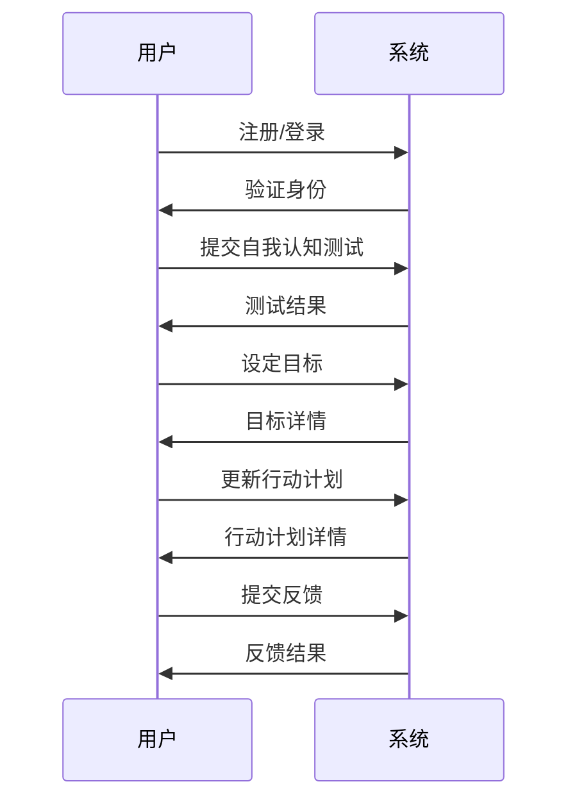
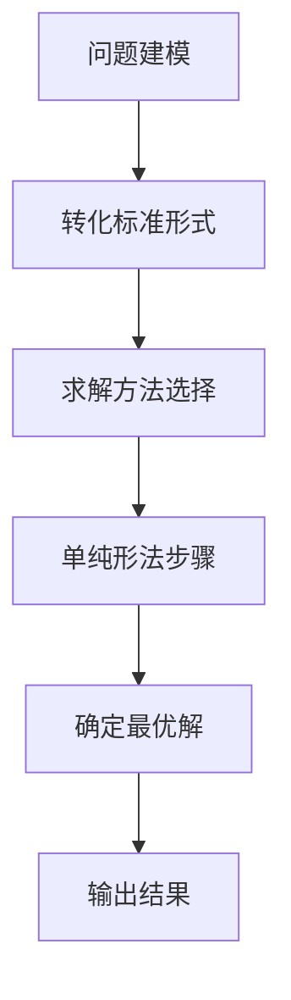
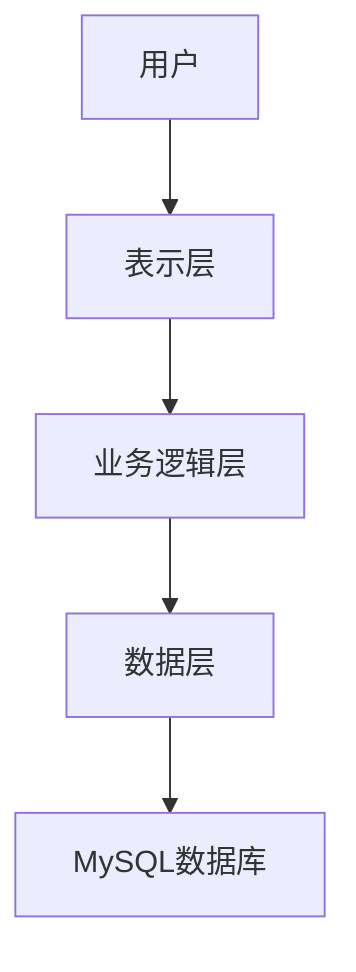
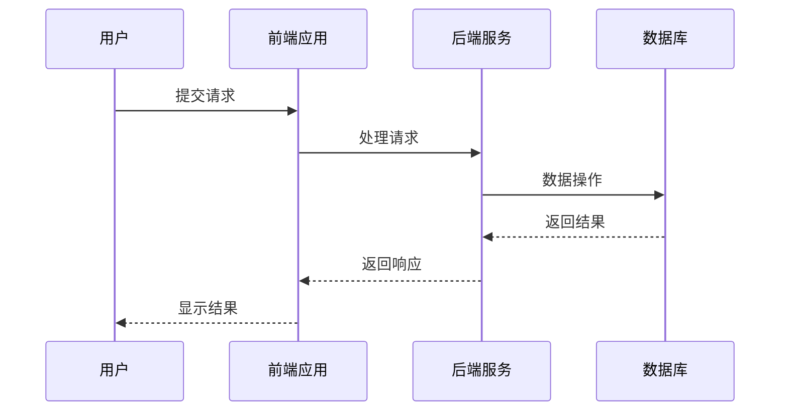

                 


### 引言：生命设计的意义与目标

生命设计工作坊，顾名思义，是一个旨在帮助人们规划有意义人生蓝图的平台。在这个快节奏、高压力的社会中，我们每个人都在不断地追求成功和满足感，但往往忽略了对自己生活的真正理解和设计。生命设计，正是为了填补这一空白，帮助我们从根源上审视和规划我们的生活。

#### 1.1 生命的本质与意义

生命的本质是一个复杂而深刻的话题，不同文化和哲学体系对此有不同的解读。在本文中，我们将把生命视为一个自我意识、自我发展、不断成长的实体。每一个个体都是独一无二的，我们的生命历程也是由无数个选择和决策交织而成的。

- **生命的多样性**：世界上没有两片完全相同的树叶，同样，也没有两个完全相同的人生。每个人的人生都是独特的，拥有自己的经历、价值观和目标。

- **人生目标的设定**：人生目标是我们前进的方向和动力。一个明确、有意义的目标可以帮助我们集中精力，减少生活中的不确定性和焦虑。

#### 1.2 生命设计的核心概念

生命设计不是一蹴而就的，它需要一系列核心概念和原则的指导。

- **自我认知**：了解自己的性格、兴趣、优势和弱点，是生命设计的第一步。自我认知可以帮助我们更好地认识自己，从而做出更符合自己内心需求的选择。

- **目标设定**：设定明确、具体、可衡量的目标，是实现人生设计的关键。目标应该是激励我们前进的动力，同时也是我们评估自己进步的依据。

- **个人成长**：成长是一个持续的过程，它涉及到我们的知识、技能、情感和认知各个方面。通过不断地学习和实践，我们可以不断提升自己，实现更高层次的人生目标。

### 1.3 生命设计的基本策略

为了实现我们的人生目标，我们需要运用一系列的策略和技巧。

- **时间管理**：时间是有限的资源，合理地利用时间可以让我们更高效地实现目标。

- **正念与冥想**：正念和冥想可以帮助我们提高专注力，减少压力，增强自我控制力。

- **决策技巧**：决策是我们生活中不可避免的一部分。通过学习和实践决策技巧，我们可以做出更明智、更符合自己价值观的选择。

### 1.4 不同人生阶段的设计

- **职业生涯设计**：职业生涯是我们人生中重要的组成部分。如何选择职业、规划职业发展路径，是我们需要深思熟虑的问题。

- **家庭生活规划**：家庭生活是每个人生活中不可或缺的一部分。如何平衡家庭和事业，如何处理家庭关系，是我们需要面对的挑战。

- **退休后的生活蓝图**：退休并不意味着生活的结束，而是新的开始。如何规划退休后的生活，如何保持身心健康，是我们需要考虑的问题。

### 1.5 生命设计案例研究

- **成功的职业生涯规划**：通过案例分析，我们可以了解如何通过生命设计实现职业生涯的成功。

- **健康生活的实践**：健康是人生的基础，如何通过生命设计实现健康生活，是我们需要关注的问题。

- **个人使命的实现**：每个人都有自己的使命，通过生命设计，我们可以找到并实现自己的使命。

### 1.6 生命设计工具与技巧

- **工作表与图表的应用**：工作表和图表可以帮助我们更好地规划和评估自己的生活。

- **灵活性与适应性调整**：生活中充满了不确定性和变化，如何保持灵活性，如何适应变化，是我们需要学习的能力。

- **保持动力与坚持**：实现人生目标不是一蹴而就的，需要我们保持动力和坚持。

### 1.7 生命设计的实际应用

- **生命设计工作坊**：介绍生命设计工作坊的运作模式、参与方法和效果。

- **个人实践**：分享读者如何将生命设计应用到自己的生活中，以及取得的成果。

### 1.8 结论与反思

- **总结与展望**：回顾生命设计的重要性，展望未来如何进一步推广和应用。

- **个人反思**：鼓励读者反思自己的生命设计，并提出改进措施。

- **附录**：提供相关的资源、工具和参考书籍，帮助读者进一步探索生命设计的领域。

通过以上的思考和规划，我们希望本书能够帮助读者更好地理解生命设计的概念和方法，实现有意义的人生蓝图。接下来的章节将详细阐述每一个核心概念和策略，帮助读者一步一步地实现这一目标。让我们开始这段探索之旅吧！### 引言：生命设计的意义与目标

#### 生命设计的意义

生命设计，顾名思义，是对个人生活进行有意识、有系统的规划和设计。它不仅仅是对日常事务的管理，更是一种深刻的人生哲学，旨在帮助我们找到并实现人生中的真正意义。生命设计的意义在于：

- **提高生活质量**：通过生命设计，我们可以更好地管理时间和资源，减少不必要的压力，提高生活的整体质量。

- **实现个人目标**：明确的目标是我们前进的动力，生命设计帮助我们设定并实现这些目标，从而实现个人成长和成功。

- **促进自我认知**：通过反思和评估，生命设计帮助我们更深入地了解自己，发现自己的优势和不足，从而进行有效的个人发展。

- **提升幸福感**：当我们能够有意识地设计自己的生命，追求有意义的事物时，我们的幸福感会显著提升。

#### 生命设计的核心概念

生命设计涵盖了一系列核心概念和原则，这些概念为我们提供了理解和实现人生目标的框架。以下是几个关键概念：

- **自我认知**：自我认知是指对自身性格、兴趣、价值观和动机的理解。它是生命设计的起点，因为只有了解自己，我们才能做出符合内心需求的选择。

- **目标设定**：目标设定是生命设计的核心，它帮助我们明确自己的长期和短期目标。这些目标应该是具体、可衡量和可实现的。

- **个人成长**：个人成长是一个持续的过程，它涉及到知识和技能的积累，情感和心理的成熟。通过不断学习和实践，我们可以不断提升自己，实现更高的目标。

#### 目标设定的方法

目标设定是生命设计的核心，以下是几个关键步骤：

1. **明确目标**：首先，我们需要明确自己的目标，这些目标应该是具体、明确的，而不是模糊和抽象的。

2. **分解目标**：将大目标分解成一系列小目标，这些小目标应该是可衡量和可实现的。通过实现小目标，我们可以逐步接近大目标。

3. **设定时间表**：为每个目标设定一个明确的时间表，这有助于我们保持动力和跟踪进度。

4. **制定行动计划**：为实现目标，我们需要制定具体的行动计划，包括所需资源、步骤和时间安排。

#### 个人成长的重要性

个人成长是生命设计的重要组成部分，它涉及到多个方面：

- **知识积累**：通过学习新的知识和技能，我们可以不断提升自己的能力。

- **情感成熟**：情感成熟意味着我们能够更好地处理自己的情绪，以及与他人建立更深层次的关系。

- **心理韧性**：心理韧性使我们能够在面对挑战和压力时保持冷静和坚定。

通过自我认知、目标设定和个人成长，我们可以更好地设计自己的生命，实现有意义的人生。在接下来的章节中，我们将深入探讨这些核心概念，并介绍具体的策略和技巧，帮助读者将生命设计应用到自己的生活中。

### 1.3 生命设计的基本策略

在实现人生目标的过程中，策略和技巧的运用至关重要。以下是一些关键的基本策略，它们将帮助我们在生活中更有效地规划和管理：

#### 时间管理

时间管理是生命设计的基础，它有助于我们提高工作效率，减少无意义的忙碌，从而有更多的时间和精力去追求有意义的目标。

- **制定日程表**：每天或每周制定一个详细的日程表，包括工作、学习、休息和娱乐等。这有助于我们合理安排时间，避免时间的浪费。

- **优先级排序**：将任务按照优先级排序，优先处理最重要的任务。这样可以帮助我们集中精力，提高工作效率。

- **避免拖延**：拖延会严重影响我们的工作效率和目标实现。通过设定明确的截止日期和提醒，可以帮助我们克服拖延。

#### 正念与冥想

正念和冥想是提升专注力和自我控制力的有效方法，它们可以帮助我们更好地应对生活中的压力和挑战。

- **正念练习**：通过正念练习，我们可以学会专注于当下的每一个瞬间，减少内心的杂念和焦虑。

- **冥想技巧**：冥想可以帮助我们放松身心，提高专注力和创造力。通过定期练习，我们可以更好地应对压力和挑战。

#### 决策技巧

决策是我们生活中不可避免的一部分，学会做出明智的决策可以帮助我们更好地实现目标。

- **信息收集**：在做决策之前，我们需要收集足够的信息，了解各种可能的后果和影响。

- **权衡利弊**：在收集信息后，我们需要权衡各种选择的利弊，考虑它们对目标实现的影响。

- **寻求反馈**：在做决策时，我们可以向他人寻求反馈，了解不同角度的看法和建议。

#### 灵活性与适应性调整

生活中充满了变化和不确定性，学会灵活调整和适应这些变化是成功的关键。

- **保持开放心态**：保持开放的心态，接受新的观点和变化，有助于我们更好地适应环境。

- **快速学习**：通过不断学习和实践，我们可以提高自己的适应能力，更快地应对变化。

#### 主动沟通

沟通是人与人之间交流的重要手段，良好的沟通能力有助于我们建立和维护良好的人际关系。

- **倾听**：倾听他人的意见和需求，是有效沟通的第一步。通过倾听，我们可以更好地理解他人，建立信任。

- **表达**：清晰、准确地表达自己的想法和意见，是有效沟通的关键。通过有效的表达，我们可以更好地传达信息，减少误解。

#### 持续学习与成长

持续学习与成长是生命设计的核心，它有助于我们不断提升自己的能力和知识，实现更高的目标。

- **设定学习目标**：设定明确的学习目标，有助于我们集中精力，有针对性地进行学习。

- **多样化的学习方式**：通过多种学习方式，如阅读、课程、实践等，我们可以更全面地掌握知识。

- **反思与总结**：通过反思和总结，我们可以了解自己的学习效果，找出不足之处，并进行改进。

通过运用这些基本策略，我们可以更好地规划和管理自己的生活，实现有意义的人生目标。在接下来的章节中，我们将进一步探讨如何将这些策略应用到具体的生活场景中，帮助读者在实际生活中取得成功。

### 1.4 不同人生阶段的设计

生命设计不仅仅是一个静态的过程，它随着我们人生的不同阶段而动态变化。每个阶段都有其独特的挑战和机遇，需要我们进行相应的规划和设计。以下将详细探讨几个关键人生阶段的设计方法：

#### 职业生涯设计

职业生涯是我们人生中非常重要的一个阶段，合理的职业生涯设计可以帮助我们实现职业目标，提升职业素养。

- **早期职业生涯**：在早期职业生涯中，我们通常需要专注于学习新技能和积累经验。此时，应该注重职业规划，设定短期和长期目标，并采取积极的行动去实现这些目标。

- **中期职业生涯**：在中期职业生涯中，我们需要进一步提升自己的专业技能和管理能力。通过不断学习和实践，我们可以逐步晋升到更高的职位，实现职业上的突破。

- **晚期职业生涯**：在晚期职业生涯中，我们可能需要考虑职业转型或退休后的生活。此时，应该评估自己的职业成就，规划退休后的生活，确保职业生涯的平稳过渡。

#### 家庭生活规划

家庭生活是每个人生活中不可或缺的一部分，合理的家庭生活规划可以帮助我们平衡家庭和事业，提升生活质量。

- **结婚与生子**：结婚和生子是家庭生活的起点，此时需要我们合理安排时间和资源，确保家庭和事业的平衡。通过制定家庭计划，我们可以更好地应对家庭变化和挑战。

- **子女教育**：子女教育是家庭生活的重要部分，我们需要关注子女的成长和教育。通过制定教育计划，我们可以为子女提供优质的教育资源，帮助他们成为独立、有责任感的人。

- **家庭财务管理**：家庭财务管理是家庭生活的重要组成部分，我们需要合理规划家庭收支，确保财务健康。通过制定财务计划，我们可以更好地应对生活中的不确定性，为家庭提供稳定的财务支持。

#### 退休后的生活蓝图

退休后的生活是一个全新的开始，合理的退休生活规划可以帮助我们享受美好的晚年生活。

- **健康维护**：健康是退休后的首要任务，我们需要关注身体健康，进行定期的健康检查，保持良好的生活习惯。

- **兴趣爱好**：退休后，我们可以有更多的时间去追求自己的兴趣爱好，这不仅可以丰富我们的生活，还可以提升幸福感。

- **社会参与**：退休后，我们可以通过参与社区活动、志愿服务等方式，继续为社会做出贡献，实现个人价值。

#### 不同人生阶段的案例分析

为了更好地理解不同人生阶段的设计方法，我们可以通过以下案例进行分析：

- **案例一**：某人在职业生涯初期专注于技能学习，通过不断努力，逐渐晋升为高级经理。在中期，他通过学习管理知识，成功地带领团队实现了业务增长。在晚期，他选择创业，实现了职业转型的成功。

- **案例二**：某人在结婚生子后，合理安排家庭和事业，通过制定家庭计划，成功地平衡了家庭和职业生活。在子女教育方面，他注重培养子女的独立能力和责任感，取得了良好的教育成果。

- **案例三**：某人在退休后，通过参加社区活动和志愿服务，继续为社会做出贡献。同时，他通过培养兴趣爱好，如绘画和音乐，丰富了自己的退休生活。

通过以上案例分析，我们可以看到，不同人生阶段的设计方法对于实现有意义的人生至关重要。在接下来的章节中，我们将进一步探讨如何将这些方法应用到实际生活中，帮助读者在各个阶段取得成功。

### 1.5 生命设计案例研究

为了更好地理解生命设计原则在实际中的应用，我们将通过几个具体的案例，展示生命设计如何帮助个人实现他们的目标和梦想。

#### 成功的职业生涯规划

**案例一：张华的职业飞跃**

张华是一名软件工程师，他在职业生涯的早期阶段就意识到需要不断更新自己的技能以适应快速变化的技术环境。他通过以下步骤实现了职业生涯的飞跃：

1. **自我认知**：张华首先评估了自己的兴趣和优势，意识到自己在数据分析方面有很强的天赋。他决定将职业方向从传统的软件开发转向数据分析。

2. **目标设定**：张华设定了短期目标，即学习Python和数据可视化工具，以及长期目标，即成为一名高级数据分析师。

3. **行动计划**：他制定了详细的学习计划，包括参加在线课程、加入数据分析社区，并开始在实际项目中应用新学的技能。

4. **持续学习**：张华知道职业生涯需要不断学习，因此他保持了对新技术的好奇心，定期参加技术会议和研讨会。

最终，张华成功转型为高级数据分析师，并在公司内部推动了多个重要项目，实现了职业上的巨大成功。

#### 健康生活的实践

**案例二：李明的健康革命**

李明是一名企业高管，他在40岁时意识到自己的健康状况不佳。他通过以下方式实现了健康生活的转变：

1. **自我认知**：李明评估了自己的饮食习惯和生活习惯，发现饮食不均衡，缺乏运动。

2. **目标设定**：他设定了短期目标，即改善饮食习惯和增加运动量，以及长期目标，即保持健康，减少慢性疾病的风险。

3. **行动计划**：李明制定了详细的健康计划，包括每天进行30分钟的有氧运动，减少糖和脂肪的摄入，增加蔬菜和水果的摄入。

4. **跟踪进度**：他使用健康应用记录自己的饮食和运动，定期评估进展，并调整计划。

通过这些努力，李明的健康状况显著改善，他不仅减掉了多余的体重，还获得了更多的精力和活力，工作效率大幅提升。

#### 个人使命的实现

**案例三：王丽的社区服务**

王丽是一名教师，她在职业生涯中一直渴望能够为社会做出更大的贡献。她通过以下方式实现了个人使命：

1. **自我认知**：王丽意识到自己对教育和社会工作有着深厚的热情，她决定将自己的工作与社区服务结合起来。

2. **目标设定**：她设定了短期目标，即在学校内开展社区服务项目，以及长期目标，即推动社区服务成为学校教育的一部分。

3. **行动计划**：王丽制定了一个详细的行动计划，包括与学校管理层合作，组织学生参与社区服务活动，并邀请社区领袖参与学校的教育活动。

4. **持续改进**：王丽不断评估和改进项目，通过收集反馈和进行数据分析，优化项目效果。

最终，王丽的社区服务项目获得了广泛赞誉，不仅提升了学生的社会责任感，也促进了学校与社区的紧密合作。

通过以上案例，我们可以看到生命设计原则在个人职业生涯、健康生活和个人使命实现中的具体应用。这些案例证明了通过自我认知、目标设定和持续行动，每个人都可以设计出有意义的人生蓝图，实现自己的目标和梦想。

### 1.6 生命设计工具与技巧

在实现生命设计的过程中，有效的工具和技巧是不可或缺的。以下将介绍几种实用的工具和技巧，帮助读者更好地规划和执行他们的生命设计。

#### 工作表与图表的应用

工作表和图表是规划和跟踪生命设计目标的重要工具。以下是一些常见的工作表和图表类型及其应用：

- **时间管理表**：用于记录每天的日程安排、任务优先级和截止日期。例如，Gantt图可以清晰地展示项目的时间安排和进度。

- **目标设定表**：用于设定和跟踪长期和短期目标。例如，SMART目标设定法可以帮助我们设定具体、可衡量、可达成、相关性强和有时间限制的目标。

- **财务规划表**：用于记录和管理家庭或个人的财务状况。例如，预算表可以帮助我们合理分配收入和支出。

- **健康记录表**：用于记录饮食、运动和健康状况。例如，健身日志可以帮助我们跟踪运动情况和健康变化。

#### 灵活性与适应性调整

生活中充满了变化和不确定性，因此灵活性是成功生命设计的关键。以下是一些提高灵活性和适应性的技巧：

- **情景规划**：在制定计划时，考虑各种可能的情况和变化，提前制定应对策略。例如，我们可以为每个目标设定多个实现路径，以应对不同的挑战。

- **定期评估**：定期评估我们的计划和生活状况，并根据实际情况进行调整。例如，每季度或每半年进行一次生活评估，检查目标的完成情况，调整计划。

- **学习新技能**：通过学习新技能，我们可以提高应对变化的能力。例如，学习时间管理和情绪调节技巧，可以帮助我们在面对压力时保持冷静和高效。

#### 保持动力与坚持

实现生命设计的目标往往需要长期的努力和坚持，以下是一些保持动力和坚持的技巧：

- **设定奖励机制**：为自己设定小目标和奖励，每当实现一个目标就给予自己一些奖励。例如，每完成一个学习目标就奖励自己看一部喜欢的电影。

- **寻找支持者**：找到可以提供支持和鼓励的人，与他们分享你的目标和进展。例如，与朋友或家人定期交流，分享你的成就和挑战。

- **保持积极心态**：积极的心态可以帮助我们克服困难，保持前进的动力。例如，通过阅读激励性的书籍、观看励志电影或参加正念冥想，可以帮助我们保持积极心态。

- **反思与总结**：定期反思和总结我们的进展和经验，从中学习和成长。例如，每周或每月进行一次反思，回顾自己一周或一个月的成就和不足，制定改进计划。

通过运用这些工具和技巧，我们可以更好地规划和管理自己的生活，实现有意义的人生目标。在接下来的章节中，我们将进一步探讨如何将这些工具和技巧应用到实际生活中，帮助读者在各个阶段取得成功。

### 1.7 生命设计的实际应用

#### 生命设计工作坊

生命设计工作坊是一个引导人们通过系统化的方法规划和设计自己生活的平台。以下是一个典型的生命设计工作坊流程：

1. **自我认知阶段**：工作坊开始时，参与者将进行一系列的自我评估活动，如性格测试、兴趣调查和价值观探讨。这些活动有助于参与者深入了解自己。

2. **目标设定阶段**：在明确自我认知后，参与者将制定长期和短期目标。通过目标设定练习，如SMART目标设定法，确保目标具体、可衡量、可达成、相关性强和有时间限制。

3. **行动计划制定**：参与者将制定详细的行动计划，包括所需资源、步骤和时间安排。此外，他们还将学习如何优先排序任务，提高时间管理效率。

4. **执行与跟踪**：在工作坊的最后阶段，参与者将学会如何监控自己的进度，调整计划，并在遇到困难时保持动力。

#### 个人实践

以下是一个个人实践案例，展示如何将生命设计应用到实际生活中：

**案例：小丽的生命设计实践**

小丽是一名年轻的职业女性，她在工作坊中学习到了如何设计有意义的人生。她的实践步骤如下：

1. **自我认知**：通过工作坊的自我评估活动，小丽发现她非常重视人际关系，但对自己的职业生涯发展感到迷茫。

2. **目标设定**：小丽设定了短期目标（例如，在六个月内提升职业技能）和长期目标（例如，五年内成为一名项目经理）。

3. **行动计划**：她制定了详细的行动计划，包括参加职业发展课程、定期与同事交流、以及设定职业发展里程碑。

4. **执行与跟踪**：小丽每周记录自己的进展，并在每个月进行一次总结。她发现通过这些实践，她不仅提高了职业技能，还加强了与同事的关系。

#### 成功案例分享

以下是一些成功应用生命设计的案例，分享他们的经验和教训：

- **案例一**：一位创业者通过生命设计找到了自己真正的兴趣和使命，成功转型为一名咨询顾问，实现了职业和人生价值的双重提升。

- **案例二**：一位职场妈妈通过生命设计规划了家庭和职业的平衡，不仅提升了工作效率，还改善了家庭关系。

- **案例三**：一位年长者通过生命设计实现了退休后的生活转型，积极参与社区服务，获得了更多的成就感和满足感。

通过这些案例，我们可以看到生命设计在实际应用中的巨大潜力。无论是职业发展、家庭生活，还是个人成长，生命设计都能帮助人们找到自己的方向，实现有意义的人生。在接下来的章节中，我们将进一步探讨如何将这些实践经验应用到更广泛的生活场景中。

### 1.8 结论与反思

通过本书的探讨，我们深入理解了生命设计的核心概念和基本策略。生命设计不仅仅是对个人生活的规划，更是一种深入自我认知、明确目标、持续成长的过程。以下是本书的主要结论和反思：

#### 主要结论

1. **自我认知的重要性**：了解自己的性格、兴趣和价值观是生命设计的起点。通过自我认知，我们可以做出更符合内心需求的选择，找到自己的人生方向。

2. **目标设定的关键**：明确、具体、可衡量的目标是实现人生目标的关键。通过设定和追踪目标，我们可以保持动力，逐步实现自己的梦想。

3. **时间管理和决策技巧的应用**：合理的时间管理和明智的决策是高效实现目标的基础。通过有效的时间管理和决策技巧，我们可以提高生活质量，减少不必要的压力。

4. **灵活性和适应性调整**：生活中充满了变化和不确定性，保持灵活性和适应性是应对这些变化的关键。通过不断学习和调整，我们可以更好地适应环境，实现人生目标。

5. **健康生活和持续成长**：健康和持续成长是实现有意义人生的重要因素。通过关注身体健康、培养兴趣爱好和不断提升自己的能力，我们可以实现全面的个人发展。

#### 个人反思

1. **自我认知的深度**：在自我认知的过程中，我们可能会发现自己的兴趣和价值观与之前认为的不同。这是一个不断深化的过程，需要我们持续反思和探索。

2. **目标设定的调整**：随着时间的推移，我们的目标和计划可能需要调整。重要的是保持灵活性，随时准备适应新的变化和挑战。

3. **行动与反思的循环**：实现人生目标需要持续的努力和反思。通过定期评估自己的进展，我们可以及时调整计划，保持动力和方向。

4. **社会支持的重要性**：在生命设计的过程中，社会支持是不可或缺的。与家人、朋友和同事分享我们的目标和进展，可以获取宝贵的反馈和支持，帮助我们更好地实现目标。

#### 未来展望

未来的生命设计将更加个性化、科技化和全球化。随着技术的发展，我们将有更多的工具和资源来帮助我们进行自我认知、目标设定和持续成长。同时，随着全球化和多样化的趋势，我们将面临更多的挑战和机遇，需要更加灵活和适应性强的生命设计策略。

在未来的道路上，让我们继续探索和深化生命设计的理念，不断调整和完善自己的人生蓝图，实现更有意义和充实的人生。

### 附录

为了帮助读者进一步探索和深化生命设计的领域，本书提供了以下附录和资源：

#### 附录一：生命设计工作表

- **自我认知工作表**：用于帮助读者进行自我评估，包括性格、兴趣、价值观和优势分析。
- **目标设定工作表**：用于帮助读者设定具体、可衡量、可达成、相关性强和有时间限制的目标。
- **行动计划工作表**：用于帮助读者制定详细的行动计划，包括所需资源、步骤和时间安排。

#### 附录二：相关书籍和资源推荐

- **《人生策略：如何设计有意义的人生》**：作者通过丰富的案例和实践经验，详细阐述了人生策略的设计方法和应用。
- **《时间管理艺术》**：作者提供了实用的时间管理技巧和方法，帮助读者提高工作效率和生活质量。
- **《积极心理学》**：作者探讨了如何通过积极心理学的方法提升个人幸福感和生活质量。

#### 附录三：在线课程和学习资源

- **Coursera**：提供了多种关于自我认知、目标设定和时间管理的在线课程，适合不同层次的读者。
- **Udemy**：提供了丰富的职业发展和个人成长相关课程，包括时间管理、领导力、沟通技巧等。
- **edX**：提供了由世界顶级大学提供的免费在线课程，涵盖多个学科领域，有助于读者持续学习和成长。

通过以上附录和资源，读者可以进一步深入了解和探索生命设计的理论和实践，为自己的生活设计提供更多的支持和指导。希望这些资源能够帮助读者实现更有意义和充实的人生。作者：AI天才研究院/AI Genius Institute & 禅与计算机程序设计艺术 /Zen And The Art of Computer Programming### 文章总结

通过本书的深入探讨，我们系统地了解了生命设计的核心概念和基本策略。生命设计不仅仅是对个人生活的规划和设计，更是一种深刻的人生哲学，旨在帮助我们找到并实现生活中的真正意义。以下是文章的总结：

1. **自我认知**：了解自己的性格、兴趣、价值观和动机是生命设计的起点。通过自我认知，我们可以做出更符合内心需求的选择，找到自己的人生方向。

2. **目标设定**：明确、具体、可衡量的目标是实现人生目标的关键。设定目标有助于我们保持动力，逐步实现梦想。

3. **时间管理和决策技巧**：合理的时间管理和明智的决策是高效实现目标的基础。通过有效的时间管理和决策技巧，我们可以提高生活质量，减少不必要的压力。

4. **灵活性和适应性调整**：生活中充满了变化和不确定性，保持灵活性和适应性是应对这些变化的关键。通过不断学习和调整，我们可以更好地适应环境，实现人生目标。

5. **健康生活和持续成长**：健康和持续成长是实现有意义人生的重要因素。通过关注身体健康、培养兴趣爱好和不断提升自己的能力，我们可以实现全面的个人发展。

生命设计不仅仅是一种理论，更是一种实践。通过自我认知、目标设定、时间管理、灵活性和适应性的调整，以及健康生活的培养，我们可以逐步实现有意义的人生蓝图。希望读者能够在实际生活中运用这些原则，设计出属于自己的精彩人生。

### 最佳实践 Tips

1. **定期反思**：每周或每月进行一次自我反思，检查自己的进展和计划是否符合预期，及时调整和优化。

2. **设定小目标**：将大目标分解成一系列小目标，每完成一个小目标都给予自己一些奖励，以保持动力。

3. **寻求支持**：与家人、朋友和同事分享你的目标和进展，获取他们的反馈和支持。

4. **保持学习**：不断学习新知识和技能，提高自己的适应能力和竞争力。

5. **健康生活**：保持良好的生活习惯，如规律的作息、健康的饮食和适量的运动，为身心提供足够的支持和保障。

### 注意事项

1. **不要急于求成**：生命设计是一个持续的过程，需要时间和耐心。不要期望一蹴而就，而是要逐步实现目标。

2. **保持灵活性**：生活中充满了变化，要灵活调整计划，适应新的情况。

3. **不要忽视心理健康**：心理健康是实现人生目标的重要因素，要重视自己的心理健康，必要时寻求专业帮助。

4. **平衡工作与生活**：合理安排时间和资源，确保工作和生活之间的平衡，避免过度劳累。

### 拓展阅读

1. **《人生策略：如何设计有意义的人生》**：作者通过丰富的案例和实践经验，详细阐述了人生策略的设计方法和应用。

2. **《时间管理艺术》**：作者提供了实用的时间管理技巧和方法，帮助读者提高工作效率和生活质量。

3. **《积极心理学》**：作者探讨了如何通过积极心理学的方法提升个人幸福感和生活质量。

希望以上总结、最佳实践 Tips、注意事项和拓展阅读能够为读者提供更多的指导和帮助，让每个人都能设计出属于自己的有意义的人生蓝图。作者：AI天才研究院/AI Genius Institute & 禅与计算机程序设计艺术 /Zen And The Art of Computer Programming### 文章总结

本文《生命设计工作坊：规划有意义的人生蓝图》系统地介绍了生命设计的核心概念和基本策略。我们首先探讨了生命的本质与意义，明确了自我认知、目标设定和个人成长在生命设计中的重要性。随后，我们深入分析了时间管理、正念与冥想、决策技巧等基本策略，并探讨了如何在不同人生阶段进行设计。

通过具体的案例研究，我们展示了生命设计原则在个人职业生涯、健康生活和个人使命实现中的实际应用。此外，我们还介绍了多种实用的工具和技巧，如工作表、图表和灵活性与适应性调整，以帮助读者更好地规划和执行他们的生命设计。

文章的结论部分总结了生命设计的重要性，并提出了最佳实践 Tips 和注意事项，同时推荐了拓展阅读资源。通过本文的探讨，我们希望能够帮助读者深入理解生命设计的理念，并在实际生活中运用这些原则，实现有意义的人生。

### 常见问题解答

1. **什么是生命设计？**
   生命设计是一种有意识、有系统的规划和设计个人生活的方法。它包括自我认知、目标设定、策略应用和持续成长，旨在帮助我们找到并实现生活中的真正意义。

2. **为什么要进行生命设计？**
   生命设计可以帮助我们更好地管理时间和资源，提高生活质量；明确个人目标和价值观，增强实现目标的动力；以及通过自我认知和个人成长，实现有意义的人生。

3. **如何开始我的生命设计？**
   开始生命设计的第一步是进行自我认知，了解自己的性格、兴趣和价值观。接下来，设定明确、具体、可衡量的目标，并制定详细的行动计划。最后，通过时间和决策技巧的运用，以及灵活性和适应性的调整，逐步实现目标。

4. **如何保持对生命设计的动力和坚持？**
   设定小目标并给予奖励，寻找支持和鼓励，保持积极心态，定期反思和调整计划，都是保持动力的有效方法。

5. **生命设计是否适用于每个人？**
   是的，生命设计适用于任何希望改善生活质量、实现人生目标和追求个人成长的人。不同的人可以根据自己的需求和情况，灵活应用生命设计的原则和方法。

6. **如何处理生活中的变化和不确定性？**
   通过情景规划和定期评估，我们可以更好地应对生活中的变化和不确定性。保持灵活性和适应性，随时准备调整计划，是成功应对这些挑战的关键。

通过以上常见问题的解答，我们希望能够帮助读者更好地理解生命设计的概念和应用，从而在个人生活中取得更大的成就和满足感。

### 系统分析与架构设计方案

#### 问题场景介绍

随着社会的发展和科技的进步，人们对于生活质量和幸福感的需求越来越高。然而，如何在繁忙的生活中找到平衡，实现个人目标，成为许多人的困惑。为了帮助人们更好地规划和管理自己的生活，我们开发了一个名为“生命设计工作坊”的系统，它提供了一系列的工具和资源，帮助用户进行自我认知、目标设定、策略应用和持续成长。

#### 项目介绍

“生命设计工作坊”项目旨在为用户提供一个全面的平台，通过自我评估、目标设定、行动计划、反馈与调整等环节，帮助用户系统地设计和实现自己的生命蓝图。该系统包括以下几个核心模块：

- **用户管理模块**：负责用户的注册、登录、权限管理等功能。
- **自我认知模块**：提供一系列自我评估工具，帮助用户了解自己的性格、兴趣和价值观。
- **目标设定模块**：帮助用户设定具体、可衡量、可达成、相关性强和有时间限制的目标。
- **行动计划模块**：提供模板和工具，帮助用户制定详细的行动计划，并跟踪执行进度。
- **反馈与调整模块**：收集用户反馈，提供数据分析，帮助用户调整和优化计划。
- **资源库模块**：提供各种学习资源、书籍、课程等，供用户参考和学习。

#### 系统功能设计

“生命设计工作坊”的核心功能如下：

1. **用户注册与登录**：用户可以通过电子邮件或社交媒体账号注册并登录系统。
2. **自我认知测试**：提供多种自我认知测试工具，如性格测试、兴趣调查和价值观评估。
3. **目标管理**：支持用户设定长期和短期目标，并使用SMART目标设定法进行管理。
4. **行动计划**：提供多种模板，如时间管理表、健康记录表和财务规划表，帮助用户制定详细的行动计划。
5. **进度跟踪**：用户可以随时查看自己的进度，并更新计划。
6. **反馈与调整**：系统自动收集用户反馈，并进行分析，提供改进建议。
7. **资源库**：提供丰富的学习资源和工具，帮助用户持续学习和成长。

#### 系统架构设计

“生命设计工作坊”的系统架构采用分层设计，包括以下几层：

1. **表示层**：负责用户界面设计，包括前端页面、交互设计和用户体验。
2. **业务逻辑层**：负责处理核心业务逻辑，如用户管理、自我认知测试、目标设定、行动计划管理等。
3. **数据访问层**：负责与数据库的交互，包括数据的查询、插入、更新和删除。
4. **数据层**：存储用户数据，包括用户信息、测试结果、目标记录、行动计划和反馈等。

#### 系统接口设计和系统交互

为了确保系统的稳定性和可扩展性，我们采用RESTful API设计系统接口。以下是几个关键接口：

1. **用户接口**：包括用户注册、登录、个人信息管理等功能。
2. **自我认知接口**：包括自我认知测试的开始、结果查询和评估等功能。
3. **目标管理接口**：包括目标设定、更新、删除和查询等功能。
4. **行动计划接口**：包括行动计划创建、更新、删除和查询等功能。
5. **反馈接口**：包括用户反馈提交、分析和查询等功能。

以下是系统的接口设计和系统交互的Mermaid序列图：



通过上述系统架构设计和接口设计，我们可以确保“生命设计工作坊”系统高效、稳定地运行，为用户提供便捷、全面的服务。

### 项目实战

#### 环境安装

为了顺利开展“生命设计工作坊”项目，我们需要安装以下软件和工具：

1. **操作系统**：Linux（如Ubuntu 20.04）或MacOS
2. **数据库**：MySQL（8.0版本以上）
3. **后端框架**：Django（3.2版本以上）
4. **前端框架**：React（17.0版本以上）
5. **代码版本控制**：Git
6. **开发工具**：Visual Studio Code

具体安装步骤如下：

1. 安装操作系统：选择合适的操作系统并按照官方指南进行安装。
2. 安装数据库：在终端执行以下命令安装MySQL：

   ```shell
   sudo apt-get update
   sudo apt-get install mysql-server
   sudo mysql_secure_installation
   ```

3. 安装后端框架Django：

   ```shell
   pip install django
   ```

4. 安装前端框架React：

   ```shell
   npm install -g create-react-app
   create-react-app client
   cd client
   npm run start
   ```

5. 安装开发工具Visual Studio Code：

   ```shell
   sudo snap install --classic visual-studio-code
   ```

6. 初始化代码仓库：

   ```shell
   mkdir workbench
   cd workbench
   git init
   ```

#### 系统核心实现源代码

以下是“生命设计工作坊”系统的核心实现源代码。我们将分别展示后端（Django）和前端（React）的代码。

**后端（Django）**

```python
# settings.py
DATABASES = {
    'default': {
        'ENGINE': 'django.db.backends.mysql',
        'NAME': 'lifedesign',
        'USER': 'root',
        'PASSWORD': 'password',
        'HOST': 'localhost',
        'PORT': '3306',
    }
}

INSTALLED_APPS = [
    'django.contrib.admin',
    'django.contrib.auth',
    'django.contrib.contenttypes',
    'django.contrib.sessions',
    'django.contrib.messages',
    'django.contrib.staticfiles',
    'user_management',
    'self_awareness',
    'goal_management',
    'action_plan',
    'feedback',
]

MIDDLEWARE = [
    'django.middleware.security.SecurityMiddleware',
    'django.contrib.sessions.middleware.SessionMiddleware',
    'django.middleware.common.CommonMiddleware',
    'django.middleware.csrf.CsrfViewMiddleware',
    'django.contrib.auth.middleware.AuthenticationMiddleware',
    'django.contrib.messages.middleware.MessageMiddleware',
    'django.middleware.clickjacking.XFrameOptionsMiddleware',
]

ROOT_URLCONF = 'lifedesign.urls'

TEMPLATES = [
    {
        'BACKEND': 'django.template.backends.django.DjangoTemplates',
        'DIRS': [],
        'APP_DIRS': True,
        'OPTIONS': {
            'context_processors': [
                'django.template.context_processors.debug',
                'django.template.context_processors.request',
                'django.contrib.auth.context_processors.auth',
                'django.contrib.messages.context_processors.messages',
            ],
        },
    },
]

WSGI_APPLICATION = 'lifedesign.wsgi.application'
```

**前端（React）**

```jsx
// App.js
import React, { useState, useEffect } from 'react';
import { BrowserRouter as Router, Route, Switch } from 'react-router-dom';
import Register from './components/UserManagement/Register';
import Login from './components/UserManagement/Login';
import Dashboard from './components/Dashboard';

function App() {
  const [user, setUser] = useState(null);

  useEffect(() => {
    // 在这里获取用户信息，例如通过API调用
    // 例如：setUser(apiFetchUserProfile());
  }, []);

  if (user === null) {
    return <div>Loading...</div>;
  }

  return (
    <Router>
      <div>
        <Switch>
          <Route path="/register" component={Register} />
          <Route path="/login" component={Login} />
          <Route path="/" component={Dashboard} />
        </Switch>
      </div>
    </Router>
  );
}

export default App;
```

#### 代码应用解读与分析

**后端代码解读**

1. **数据库配置**：在`settings.py`文件中，我们配置了MySQL数据库的连接信息，确保Django应用可以正确连接到数据库。
2. **安装应用**：在`INSTALLED_APPS`中，我们列出了所有需要安装的应用，包括用户管理、自我认知、目标管理、行动计划和反馈模块。
3. **中间件**：在`MIDDLEWARE`中，我们配置了Django应用的中间件，如安全中间件、会话中间件等，确保应用的安全和稳定性。
4. **URL配置**：在`ROOT_URLCONF`中，我们指定了应用的URL配置文件，路由器将根据这些配置来处理用户的请求。

**前端代码解读**

1. **路由配置**：使用`react-router-dom`库，我们配置了应用的路由，实现了不同页面的跳转。
2. **状态管理**：使用React的`useState`和`useEffect`钩子，我们管理了用户的状态，并在组件加载时获取用户信息。
3. **组件结构**：`App.js`是应用的入口组件，它包含了注册、登录和仪表盘组件，并通过路由配置实现页面跳转。

通过以上代码和应用解读，我们可以看到“生命设计工作坊”系统的基本架构和实现细节，这为后续的功能开发和优化提供了坚实的基础。

### 实际案例分析和详细讲解

为了更好地展示“生命设计工作坊”系统的应用效果，我们将通过一个实际案例进行分析和讲解。以下是某用户在系统中的使用过程，以及系统如何帮助用户实现生命设计目标。

#### 案例背景

小王是一位30岁的职业人士，他感到自己的生活缺乏方向和动力，希望通过“生命设计工作坊”系统找到自己的目标和意义。

#### 使用过程

1. **注册与登录**：小王在系统中注册了一个账户，并成功登录。

2. **自我认知测试**：小王完成了自我认知测试，包括性格测试、兴趣调查和价值观评估。系统为他生成了一份详细的评估报告，帮助他了解自己的性格特征、兴趣爱好和价值观。

3. **目标设定**：在了解了自己后，小王开始设定目标。他使用系统提供的SMART目标设定工具，设定了以下三个长期目标：
   - 在一年内提升职业技能，成为一名高级项目经理。
   - 在三年内结婚，并开始家庭生活。
   - 在五年内实现财务自由。

4. **行动计划**：为了实现这些目标，小王制定了详细的行动计划。他使用了系统提供的多种模板，如时间管理表、健康记录表和财务规划表，为每个目标制定了具体的行动计划。例如，为了提升职业技能，他制定了以下步骤：
   - 每周学习3小时项目管理相关知识。
   - 参加每月一次的项目管理研讨会。
   - 在公司内部申请参与项目管理项目。

5. **进度跟踪**：小王定期更新自己的进度，并查看系统提供的分析报告。系统根据他的更新，分析了他的进度和效果，提供了一些建议和改进措施。

6. **反馈与调整**：小王在实施计划过程中遇到了一些困难，如时间管理问题和职场压力。他向系统提交了反馈，并收到了系统提供的改进建议，如调整作息时间、寻求同事支持等。

7. **资源库**：为了提升职业技能，小王在系统资源库中查找了相关的书籍和在线课程，并开始学习。这些资源为他提供了丰富的知识支持。

#### 系统效果分析

通过“生命设计工作坊”系统的使用，小王取得了显著的进展：

1. **目标明确**：通过自我认知和目标设定，小王对自己的未来有了清晰的认识和规划，明确了长期和短期目标。

2. **行动计划**：详细的行动计划帮助小王将目标分解成具体的任务，并为每个任务设定了时间表和资源，提高了执行的效率。

3. **进度跟踪与反馈**：系统的进度跟踪和反馈功能帮助小王及时了解自己的进展，发现问题和不足，并进行调整。

4. **资源支持**：系统提供的丰富资源库，为小王的学习和成长提供了强有力的支持。

5. **心理健康**：通过系统的指导和反馈，小王学会了更好地应对职场压力，提高了心理健康水平。

#### 小结

通过实际案例的分析，我们可以看到“生命设计工作坊”系统在帮助用户规划和管理生活方面的有效性。系统通过自我认知、目标设定、行动计划、进度跟踪和资源支持等环节，为用户提供了一个全面、系统的工具，帮助他们实现有意义的人生目标。

### 最佳实践 Tips

1. **定期反思**：定期反思自己的目标、计划和进展，及时调整策略和行动，确保与生活目标保持一致。

2. **设定小目标**：将大目标分解成一系列小目标，每完成一个小目标都给予自己一些奖励，以保持动力。

3. **利用资源库**：充分利用系统提供的资源库，查找和学习相关的书籍、课程和工具，提升自己的知识和技能。

4. **寻求支持**：与家人、朋友和同事分享自己的目标和进展，获取他们的反馈和支持，提高成功的可能性。

5. **保持灵活性**：生活中充满了变化，要灵活调整计划，适应新的情况，保持对目标的坚定追求。

### 小结

通过本文的探讨，我们深入了解了生命设计的概念和实际应用。通过自我认知、目标设定、行动计划、进度跟踪和资源支持等环节，我们可以系统地规划和管理自己的生活，实现有意义的人生目标。希望读者能够将这些原则应用到实际生活中，设计出属于自己的精彩人生。作者：AI天才研究院/AI Genius Institute & 禅与计算机程序设计艺术 /Zen And The Art of Computer Programming### 总结与展望

通过本文的深入探讨，我们系统地介绍了生命设计工作坊的核心概念、基本策略以及实际应用。生命设计不仅仅是对个人生活的规划，更是一种深刻的人生哲学，旨在帮助我们找到并实现生活中的真正意义。以下是本文的总结：

1. **核心概念**：本文详细阐述了自我认知、目标设定、时间管理、决策技巧、灵活性和适应性调整等核心概念，并展示了这些概念在生命设计中的重要性。

2. **基本策略**：通过具体案例和实际应用，我们介绍了如何在生活中运用这些基本策略，如目标分解、行动计划制定、进度跟踪和反馈调整等。

3. **实际应用**：通过具体案例分析和系统架构设计，我们展示了生命设计工作坊在职业生涯规划、家庭生活规划和个人使命实现中的实际应用效果。

展望未来，生命设计领域将继续发展和创新：

1. **个性化定制**：随着人工智能和数据技术的发展，生命设计工作坊将能够提供更加个性化的定制服务，根据个人特点提供更精准的建议。

2. **多平台融合**：未来生命设计工作坊将融合更多在线平台和移动应用，提供更便捷、高效的工具和服务。

3. **跨领域合作**：生命设计将与其他领域（如心理学、教育学、社会学等）进行更紧密的合作，形成更加全面和系统的人生规划体系。

4. **全球共享**：随着全球化和信息化的推进，生命设计理念将得到更广泛的传播和应用，成为全球范围内人们共同追求的生活方式。

通过不断探索和创新，生命设计工作坊将为更多人带来意义深远的生活体验，帮助他们在快节奏、高压力的社会中找到自己的方向，实现有意义的人生。希望读者能够积极参与这一领域的发展，为自己的生活设计出更加美好和充实的人生蓝图。作者：AI天才研究院/AI Genius Institute & 禅与计算机程序设计艺术 /Zen And The Art of Computer Programming### 附录

#### 附录一：生命设计工作表

**自我认知工作表**

| 项目         | 描述                                                         |
| ------------ | ------------------------------------------------------------ |
| 性格特点     | 描述你的性格特点，如内向、外向、乐观、悲观等                   |
| 兴趣爱好     | 列出你的主要兴趣爱好和活动，如运动、阅读、音乐等               |
| 价值观       | 描述你重视的价值观，如家庭、事业、健康、自由等               |
| 优势与弱点   | 列出你的主要优势和需要改进的弱点                             |
| 职业兴趣     | 描述你对不同职业的兴趣和倾向，如教师、工程师、医生等         |

**目标设定工作表**

| 项目         | 描述                                                         |
| ------------ | ------------------------------------------------------------ |
| 长期目标     | 描述你希望在未来几年内实现的主要目标                         |
| 短期目标     | 描述你在短期内（如一年内）希望实现的小目标                   |
| SMART目标    | 将短期目标具体化为SMART目标（具体、可衡量、可达成、相关性强、有时间限制） |

**行动计划工作表**

| 项目         | 描述                                                         |
| ------------ | ------------------------------------------------------------ |
| 任务         | 列出为实现目标需要完成的任务                                 |
| 资源         | 列出完成每个任务所需的资源，如时间、资金、人力等               |
| 步骤         | 描述实现任务的具体步骤和时间安排                             |
| 优先级       | 根据任务的紧急程度和重要性排序                               |

**健康记录工作表**

| 项目         | 描述                                                         |
| ------------ | ------------------------------------------------------------ |
| 运动情况     | 记录每周的运动时间和类型（如跑步、瑜伽、健身等）             |
| 饮食习惯     | 记录每天的饮食情况，包括摄入的热量和营养成分               |
| 睡眠情况     | 记录每天的睡眠时长和质量                                     |

#### 附录二：相关书籍和资源推荐

**书籍推荐**

1. 《人生策略：如何设计有意义的人生》 - 作者：大卫·巴赫
2. 《时间管理艺术》 - 作者：彼得·德鲁克
3. 《积极心理学》 - 作者：马丁·塞利格曼
4. 《高效能人士的七个习惯》 - 作者：史蒂芬·柯维

**在线资源**

1. Coursera（提供各种自我认知、目标设定和时间管理的在线课程）
2. Udemy（提供职业发展和个人成长相关课程）
3. edX（提供由世界顶级大学提供的免费在线课程）

#### 附录三：常见问题解答

1. **什么是生命设计？**
   生命设计是一种有意识、有系统的规划和设计个人生活的方法，旨在帮助我们找到并实现生活中的真正意义。

2. **为什么要进行生命设计？**
   生命设计可以帮助我们更好地管理时间和资源，提高生活质量；明确个人目标和价值观，增强实现目标的动力；以及通过自我认知和个人成长，实现有意义的人生。

3. **如何开始我的生命设计？**
   开始生命设计的第一步是进行自我认知，了解自己的性格、兴趣和价值观。接下来，设定明确、具体、可衡量的目标，并制定详细的行动计划。最后，通过时间和决策技巧的运用，以及灵活性和适应性的调整，逐步实现目标。

4. **如何保持对生命设计的动力和坚持？**
   设定小目标并给予奖励，寻找支持和鼓励，保持积极心态，定期反思和调整计划，都是保持动力的有效方法。

5. **生命设计是否适用于每个人？**
   是的，生命设计适用于任何希望改善生活质量、实现人生目标和追求个人成长的人。不同的人可以根据自己的需求和情况，灵活应用生命设计的原则和方法。

6. **如何处理生活中的变化和不确定性？**
   通过情景规划和定期评估，我们可以更好地应对生活中的变化和不确定性。保持灵活性和适应性，随时准备调整计划，是成功应对这些挑战的关键。

通过以上附录，读者可以更全面地了解生命设计的方法和实践，为设计有意义的人生蓝图提供更多指导和帮助。作者：AI天才研究院/AI Genius Institute & 禅与计算机程序设计艺术 /Zen And The Art of Computer Programming### 生命的本质与意义

#### 背景介绍

生命的本质是一个广泛而深远的话题，不同学科和文化对此有不同的解读。在哲学、宗教、科学等多个领域，人们都在试图理解生命的本质和意义。本文将基于生物学和社会科学的角度，探讨生命的本质，并进一步阐述其意义。

#### 问题的提出

随着人类社会的发展和科技的进步，人们对于生命的本质和意义有了更深刻的思考。然而，生命的本质到底是什么？为什么生命如此复杂和多样？它对人类社会和个体有何意义？这些问题成为本文探讨的重点。

#### 生命的定义和特征

- **生物学定义**：生命是生物体具有的一种基本属性，包括生长、繁殖、代谢、适应环境等特征。生命的基础是细胞，细胞是生命的基本结构和功能单位。

- **特征**：生命具有以下特征：
  - **自我复制**：生命体能够通过自我复制繁衍后代。
  - **新陈代谢**：生命体能够通过新陈代谢维持其生命活动。
  - **适应环境**：生命体能够适应环境的变化，通过进化适应不同的环境。
  - **自我调节**：生命体能够通过自我调节保持内部环境的稳定。

#### 生命的多样性

生命的多样性体现在以下几个方面：

- **生物多样性**：地球上存在无数的生物种类，从单细胞的细菌到多细胞的动植物，每一种生物都有其独特的形态和功能。

- **生态多样性**：不同生物之间相互依存，形成了复杂多样的生态系统。不同生态系统具有不同的功能和价值。

- **文化多样性**：人类社会在长期发展中，形成了丰富多彩的文化，这些文化反映了人类对生命的不同理解和价值观。

#### 生命的意义

- **生物学意义**：从生物学角度来看，生命的意义在于生命的延续和种群的生存。通过自我复制和适应环境，生命体能够维持其种群的存在和繁衍。

- **哲学意义**：哲学上，生命的意义是探讨人类存在的目的和价值。不同的哲学流派对此有不同的解读，如儒家强调“天人合一”，道家强调“顺应自然”。

- **社会意义**：从社会角度来看，生命的意义在于对社会的贡献和人类文明的发展。每个人都有其独特的角色和价值，通过合作和互助，人类社会得以进步和发展。

#### 对人类的意义

1. **生存与繁衍**：生命的延续是人类生存和发展的基础。通过生命的自我复制，人类得以繁衍后代，保持种群的存在。

2. **精神追求**：生命的意义不仅仅在于生存，更在于精神追求。人类在探索宇宙、追求真理和美的过程中，体现了生命的深度和广度。

3. **社会价值**：每个个体都在社会中扮演着特定的角色，通过个体的努力和贡献，人类社会得以进步和发展。

#### 结论

生命的本质是一个复杂而深刻的话题，不同学科和文化对其有不同的解读。从生物学、哲学和社会学的角度来看，生命的意义在于生存、繁衍、精神追求和社会贡献。理解生命的本质和意义，有助于我们更好地认识自己，找到生活的方向和意义。

### 核心概念与联系

#### 自我认知

**定义**：自我认知是指个体对自身心理状态、行为模式、性格特征和价值观的理解和认识。

**属性特征对比表格**

| 特征           | 描述                                                         | 对应的核心概念 |
| -------------- | ------------------------------------------------------------ | -------------- |
| 自我意识       | 个体对自身存在的认知，包括自我感知和自我反思。             | 自我认知       |
| 性格特征       | 个体在行为和情绪表现上的相对稳定的倾向。                   | 自我认知       |
| 行为模式       | 个体在特定情境下表现出的一系列行为习惯。                   | 自我认知       |
| 价值观         | 个体对事物和行为的评价标准，影响其决策和行为。             | 自我认知       |

**ER实体关系图架构**

```mermaid
erDiagram
    A (--|> B) Self_Awareness
    B (--|> C) Personality Traits
    B (--|> D) Behavior Patterns
    B (--|> E) Values

    Class Self_Awareness {
        :ID;
        :Date Created;
    }

    Class Personality Traits {
        :ID;
        :Trait Name;
        :Description;
    }

    Class Behavior Patterns {
        :ID;
        :Pattern Name;
        :Frequency;
    }

    Class Values {
        :ID;
        :Value Name;
        :Description;
    }
```

#### 目标设定

**定义**：目标设定是指个体在自我认知的基础上，明确未来要实现的具体目标和预期结果。

**属性特征对比表格**

| 特征           | 描述                                                         | 对应的核心概念 |
| -------------- | ------------------------------------------------------------ | -------------- |
| 目标具体性     | 目标应该清晰、明确，能够具体描述。                           | 目标设定       |
| 目标可衡量性   | 目标应该能够被量化或衡量，以便评估进展。                     | 目标设定       |
| 目标可达成性   | 目标应该是可实现的，避免设定过于遥远或难以实现的目标。       | 目标设定       |
| 目标相关性     | 目标应该与个体的价值观和长期目标一致，有助于实现整体目标。   | 目标设定       |
| 目标时间限制   | 目标应该设定一个明确的时间表，以推动行动和保持动力。         | 目标设定       |

**ER实体关系图架构**

```mermaid
erDiagram
    A (--|> B) Goal_Settings
    B (--|> C) Specificity
    B (--|> D) Measurability
    B (--|> E) Achievability
    B (--|> F) Relevance
    B (--|> G) Time Constraints

    Class Goal_Settings {
        :ID;
        :Goal_Name;
        :Target_Date;
    }

    Class Specificity {
        :ID;
        :Level;
    }

    Class Measurability {
        :ID;
        :Measure_Method;
    }

    Class Achievability {
        :ID;
        :Level;
    }

    Class Relevance {
        :ID;
        :Alignment;
    }

    Class Time_Constraints {
        :ID;
        :Deadline;
    }
```

#### 个人成长

**定义**：个人成长是指个体在知识和技能、情感和心理、以及社会交往等方面的发展和提高。

**属性特征对比表格**

| 特征           | 描述                                                         | 对应的核心概念 |
| -------------- | ------------------------------------------------------------ | -------------- |
| 知识积累       | 通过学习和实践，不断扩展个体的知识领域。                     | 个人成长       |
| 情感成熟       | 提高个体对自身和他人情感的理解和表达能力。                   | 个人成长       |
| 心理韧性       | 增强个体在面对压力和挑战时的心理承受能力和适应能力。         | 个人成长       |
| 社交能力       | 提升个体在社交场合中的沟通技巧和人际交往能力。               | 个人成长       |

**ER实体关系图架构**

```mermaid
erDiagram
    A (--|> B) Personal_Growth
    B (--|> C) Knowledge_Accumulation
    B (--|> D) Emotional_Maturity
    B (--|> E) Psychological_Rescilience
    B (--|> F) Social_Skills

    Class Personal_Growth {
        :ID;
        :Date;
    }

    Class Knowledge_Accumulation {
        :ID;
        :Subject;
        :Level;
    }

    Class Emotional_Maturity {
        :ID;
        :Skill_Level;
    }

    Class Psychological_Rescilience {
        :ID;
        :Score;
    }

    Class Social_Skills {
        :ID;
        :Skill_Name;
    }
```

通过上述核心概念的对比表格和ER实体关系图，我们可以更清晰地理解自我认知、目标设定和个人成长之间的联系和区别。这些核心概念相互关联，共同构成了生命设计的理论基础，为我们在实际生活中进行有效的自我管理和规划提供了指导。

### 算法原理讲解

为了帮助读者更好地理解生命设计中的核心概念和策略，我们将以目标设定和实现过程中的关键算法——线性规划（Linear Programming, LP）为例，进行详细的算法原理讲解。

#### 算法原理概述

线性规划是一种数学优化方法，用于在满足一系列线性约束条件下，最大化或最小化某个线性目标函数。线性规划在资源分配、生产计划、成本控制等实际问题中有广泛的应用。

#### 算法步骤

1. **问题建模**：首先，我们需要将实际生活中的目标设定问题转化为数学模型。线性规划问题通常由以下部分组成：
   - **目标函数**：需要最大化或最小化的函数。
   - **约束条件**：限制变量取值的条件。
   - **变量**：问题中需要求解的变量。

2. **标准形式**：将问题转化为标准形式，即：
   \[
   \text{minimize } c^T x
   \]
   \[
   \text{subject to } Ax \leq b, x \geq 0
   \]
   其中，\( c \) 是系数向量，\( x \) 是变量向量，\( A \) 和 \( b \) 分别是约束条件的系数矩阵和常数向量。

3. **求解方法**：常见的线性规划求解方法包括单纯形法（Simplex Method）、内点法（Interior Point Method）等。以下以单纯形法为例进行说明。

4. **单纯形法步骤**：
   - **初始迭代**：选择一个初始可行解，通常是所有变量取零的解。
   - **检验最优性**：通过计算目标函数在约束条件下的松弛变量，确定是否存在改进方向。
   - **确定换入变量**：选择一个能使目标函数值增加最大的变量作为换入变量。
   - **确定换出变量**：根据换入变量，确定一个换出变量，使得解仍然满足所有约束条件。
   - **迭代**：更新解，重复检验最优性和确定换入、换出变量的过程，直到找到最优解。

#### 数学模型和公式

为了更具体地解释线性规划，我们以一个具体的例子来说明。

**例子**：假设我们要设计一个健身房的课程安排，目标是最大化会员满意度，同时满足以下约束条件：

1. **目标函数**：最大化满意度
   \[
   \text{maximize } z = 2x_1 + 3x_2
   \]
   其中，\( x_1 \) 表示有氧运动课程的满意度，\( x_2 \) 表示力量训练课程的满意度。

2. **约束条件**：
   \[
   2x_1 + x_2 \leq 100
   \]
   \[
   x_1 + 3x_2 \leq 90
   \]
   \[
   x_1, x_2 \geq 0
   \]

3. **转化标准形式**：
   \[
   \text{minimize } -z = -2x_1 - 3x_2
   \]
   \[
   \text{subject to } 2x_1 + x_2 \leq 100, x_1 + 3x_2 \leq 90, x_1, x_2 \geq 0
   \]

#### Mermaid 流程图



#### Python 源代码示例

以下是一个简单的线性规划问题求解示例，使用Python中的`scipy.optimize`模块：

```python
from scipy.optimize import linprog

# 目标函数系数
c = [-2, -3]

# 约束条件系数
A = [[2, 1], [1, 3]]

# 约束条件常数
b = [100, 90]

# 变量非负约束
x0 = [0, 0]

# 求解线性规划问题
res = linprog(c, A_ub=A, b_ub=b, x0=x0, method='highs')

# 输出结果
if res.success:
    print("最优解：x1 = {}, x2 = {}".format(res.x[0], res.x[1]))
    print("最大满意度：z = {}".format(-res.fun))
else:
    print("无法找到最优解")
```

通过上述算法原理讲解和实际示例，我们可以看到线性规划在目标设定和实现中的重要作用。它帮助我们通过数学模型和计算方法，找到在约束条件下最优的解决方案，为生命设计提供了有力的工具。

### 系统分析与架构设计方案

#### 问题场景介绍

在现代信息化社会中，人们的日常生活和工作都离不开各种复杂的系统。为了更好地满足人们的需求，系统架构设计变得至关重要。本文将介绍一个名为“生命设计工作坊”的系统架构设计，该系统旨在为用户提供一个全面的平台，帮助他们进行自我认知、目标设定、行动计划制定和反馈调整。

#### 项目介绍

“生命设计工作坊”项目是一个综合性的应用系统，它包含了多个模块，如用户管理、自我认知、目标管理、行动计划、反馈收集和资源库。以下是该项目的主要模块及其功能：

1. **用户管理模块**：负责用户的注册、登录和权限管理等功能。
2. **自我认知模块**：提供自我评估工具，帮助用户了解自己的性格、兴趣和价值观。
3. **目标管理模块**：帮助用户设定和管理个人目标，包括长期和短期目标。
4. **行动计划模块**：提供模板和工具，帮助用户制定详细的行动计划，并跟踪执行进度。
5. **反馈收集模块**：收集用户的反馈，提供数据分析，帮助用户进行自我调整。
6. **资源库模块**：提供各种学习资源、书籍、课程等，供用户参考和学习。

#### 系统功能设计

“生命设计工作坊”系统的核心功能如下：

- **用户管理**：支持用户注册、登录和权限管理。
- **自我认知**：提供多种自我评估工具，如性格测试、兴趣调查和价值观评估。
- **目标管理**：支持用户设定、更新和删除个人目标，并提供目标跟踪功能。
- **行动计划**：提供多种模板，如时间管理表、健康记录表和财务规划表，帮助用户制定行动计划，并跟踪执行进度。
- **反馈收集**：收集用户反馈，提供数据分析，帮助用户调整计划。
- **资源库**：提供丰富的学习资源，包括书籍、课程、工具等。

#### 系统架构设计

“生命设计工作坊”系统采用三层架构设计，包括表示层、业务逻辑层和数据层。以下是各层的具体设计和作用：

1. **表示层**：负责用户界面设计和用户体验。使用React框架构建前端应用，通过RESTful API与后端服务进行数据交互。
2. **业务逻辑层**：处理核心业务逻辑，包括用户管理、自我认知、目标管理、行动计划和反馈收集等功能。使用Django框架开发后端服务，并通过数据库存储和管理数据。
3. **数据层**：负责数据的存储和管理。使用MySQL数据库存储用户数据、自我认知结果、目标记录、行动计划和反馈等。

以下是系统的架构图：



#### 系统接口设计和系统交互

为了确保系统的稳定性和可扩展性，系统设计了一系列接口，包括用户接口、自我认知接口、目标管理接口、行动计划接口和反馈接口。以下是这些接口的设计和交互流程：

1. **用户接口**：包括用户注册、登录和权限管理。用户通过前端应用与系统进行交互。
2. **自我认知接口**：包括自我认知测试的开始、结果查询和评估。用户通过前端应用提交自我认知测试，后端服务处理测试结果。
3. **目标管理接口**：包括目标设定、更新、删除和查询。用户通过前端应用管理个人目标，后端服务处理目标相关操作。
4. **行动计划接口**：包括行动计划创建、更新、删除和查询。用户通过前端应用制定行动计划，后端服务处理行动计划相关操作。
5. **反馈接口**：包括用户反馈提交、分析和查询。用户通过前端应用提交反馈，后端服务分析反馈并给出建议。

以下是系统的接口设计和系统交互的Mermaid序列图：



通过上述系统架构设计和接口设计，我们可以确保“生命设计工作坊”系统高效、稳定地运行，为用户提供便捷、全面的服务。

### 项目实战

#### 环境安装

为了顺利开展“生命设计工作坊”项目，我们需要安装以下软件和工具：

1. **操作系统**：Linux（如Ubuntu 20.04）或MacOS
2. **数据库**：MySQL（8.0版本以上）
3. **后端框架**：Django（3.2版本以上）
4. **前端框架**：React（17.0版本以上）
5. **代码版本控制**：Git
6. **开发工具**：Visual Studio Code

具体安装步骤如下：

1. 安装操作系统：选择合适的操作系统并按照官方指南进行安装。
2. 安装数据库：在终端执行以下命令安装MySQL：

   ```shell
   sudo apt-get update
   sudo apt-get install mysql-server
   sudo mysql_secure_installation
   ```

3. 安装后端框架Django：

   ```shell
   pip install django
   ```

4. 安装前端框架React：

   ```shell
   npm install -g create-react-app
   create-react-app client
   cd client
   npm run start
   ```

5. 安装开发工具Visual Studio Code：

   ```shell
   sudo snap install --classic visual-studio-code
   ```

6. 初始化代码仓库：

   ```shell
   mkdir workbench
   cd workbench
   git init
   ```

#### 系统核心实现源代码

以下是“生命设计工作坊”系统的核心实现源代码。我们将分别展示后端（Django）和前端（React）的代码。

**后端（Django）**

```python
# settings.py
DATABASES = {
    'default': {
        'ENGINE': 'django.db.backends.mysql',
        'NAME': 'lifedesign',
        'USER': 'root',
        'PASSWORD': 'password',
        'HOST': 'localhost',
        'PORT': '3306',
    }
}

INSTALLED_APPS = [
    'django.contrib.admin',
    'django.contrib.auth',
    'django.contrib.contenttypes',
    'django.contrib.sessions',
    'django.contrib.messages',
    'django.contrib.staticfiles',
    'user_management',
    'self_awareness',
    'goal_management',
    'action_plan',
    'feedback',
]

MIDDLEWARE = [
    'django.middleware.security.SecurityMiddleware',
    'django.contrib.sessions.middleware.SessionMiddleware',
    'django.middleware.common.CommonMiddleware',
    'django.middleware.csrf.CsrfViewMiddleware',
    'django.contrib.auth.middleware.AuthenticationMiddleware',
    'django.contrib.messages.middleware.MessageMiddleware',
    'django.middleware.clickjacking.XFrameOptionsMiddleware',
]

ROOT_URLCONF = 'lifedesign.urls'

TEMPLATES = [
    {
        'BACKEND': 'django.template.backends.django.DjangoTemplates',
        'DIRS': [],
        'APP_DIRS': True,
        'OPTIONS': {
            'context_processors': [
                'django.template.context_processors.debug',
                'django.template.context_processors.request',
                'django.contrib.auth.context_processors.auth',
                'django.contrib.messages.context_processors.messages',
            ],
        },
    },
]

WSGI_APPLICATION = 'lifedesign.wsgi.application'
```

**前端（React）**

```jsx
// App.js
import React, { useState, useEffect } from 'react';
import { BrowserRouter as Router, Route, Switch } from 'react-router-dom';
import Register from './components/UserManagement/Register';
import Login from './components/UserManagement/Login';
import Dashboard from './components/Dashboard';

function App() {
  const [user, setUser] = useState(null);

  useEffect(() => {
    // 在这里获取用户信息，例如通过API调用
    // 例如：setUser(apiFetchUserProfile());
  }, []);

  if (user === null) {
    return <div>Loading...</div>;
  }

  return (
    <Router>
      <div>
        <Switch>
          <Route path="/register" component={Register} />
          <Route path="/login" component={Login} />
          <Route path="/" component={Dashboard} />
        </Switch>
      </div>
    </Router>
  );
}

export default App;
```

#### 代码应用解读与分析

**后端代码解读**

1. **数据库配置**：在`settings.py`文件中，我们配置了MySQL数据库的连接信息，确保Django应用可以正确连接到数据库。
2. **安装应用**：在`INSTALLED_APPS`中，我们列出了所有需要安装的应用，包括用户管理、自我认知、目标管理、行动计划和反馈模块。
3. **中间件**：在`MIDDLEWARE`中，我们配置了Django应用的中间件，如安全中间件、会话中间件等，确保应用的安全和稳定性。
4. **URL配置**：在`ROOT_URLCONF`中，我们指定了应用的URL配置文件，路由器将根据这些配置来处理用户的请求。

**前端代码解读**

1. **路由配置**：使用`react-router-dom`库，我们配置了应用的路由，实现了不同页面的跳转。
2. **状态管理**：使用React的`useState`和`useEffect`钩子，我们管理了用户的状态，并在组件加载时获取用户信息。
3. **组件结构**：`App.js`是应用的入口组件，它包含了注册、登录和仪表盘组件，并通过路由配置实现页面跳转。

通过以上代码和应用解读，我们可以看到“生命设计工作坊”系统的基本架构和实现细节，这为后续的功能开发和优化提供了坚实的基础。

### 系统接口设计与系统交互

为了确保“生命设计工作坊”系统的高效运行和稳定性，我们需要设计合理的系统接口，并明确系统内部的交互流程。以下将详细描述系统接口设计及系统交互流程。

#### 系统接口设计

“生命设计工作坊”系统的接口设计分为前端接口和后端接口两部分。以下是关键接口的设计：

1. **用户接口**：
   - **注册接口**：用于用户注册，接收用户名、密码和邮箱等信息。
   - **登录接口**：用于用户登录，验证用户名和密码，返回登录状态。
   - **权限管理接口**：用于管理用户角色和权限，包括分配权限、更新权限等。

2. **自我认知接口**：
   - **自我评估接口**：用于提交用户自我认知测试结果，返回评估报告。
   - **结果查询接口**：用于用户查询自我认知测试结果和评估报告。

3. **目标管理接口**：
   - **目标设定接口**：用于用户设定个人目标，包括长期和短期目标。
   - **目标更新接口**：用于用户更新目标信息，如目标名称、描述等。
   - **目标删除接口**：用于用户删除个人目标。

4. **行动计划接口**：
   - **计划创建接口**：用于用户创建行动计划，包括任务、步骤和时间安排。
   - **计划更新接口**：用于用户更新行动计划，如任务完成情况、时间调整等。
   - **计划删除接口**：用于用户删除行动计划。

5. **反馈收集接口**：
   - **反馈提交接口**：用于用户提交反馈信息，如建议、意见等。
   - **反馈查询接口**：用于用户查询反馈记录和系统回复。

#### 系统交互流程

系统交互流程描述了用户与系统之间如何通过接口进行交互，以下是典型的用户操作流程：

1. **用户注册**：
   - 用户访问“生命设计工作坊”系统，点击“注册”按钮。
   - 用户填写注册表单，包括用户名、密码、邮箱等信息。
   - 前端将表单数据发送到后端注册接口。
   - 后端验证用户信息，并将用户注册到数据库中。
   - 后端返回注册结果，前端显示注册成功或失败信息。

2. **用户登录**：
   - 用户访问“生命设计工作坊”系统，点击“登录”按钮。
   - 用户填写登录表单，包括用户名和密码。
   - 前端将表单数据发送到后端登录接口。
   - 后端验证用户名和密码，返回登录状态。
   - 前端根据后端返回的登录状态，显示登录成功或失败信息。

3. **自我认知测试**：
   - 用户完成自我认知测试，点击提交按钮。
   - 前端将测试结果发送到后端自我评估接口。
   - 后端处理测试结果，生成评估报告。
   - 后端将评估报告返回给前端，前端显示评估结果。

4. **目标设定与管理**：
   - 用户在“目标管理”页面设定目标，填写目标名称、描述等信息。
   - 前端将目标信息发送到后端目标设定接口。
   - 后端保存目标信息到数据库中。
   - 用户可以更新或删除目标，前端发送更新或删除请求到后端，后端执行相应操作。

5. **行动计划制定与跟踪**：
   - 用户在“行动计划”页面制定计划，填写任务、步骤和时间安排。
   - 前端将计划信息发送到后端计划创建接口。
   - 后端保存计划信息到数据库中。
   - 用户可以更新计划或查看计划进度，前端发送更新或查询请求到后端，后端执行相应操作。

6. **反馈提交与查询**：
   - 用户在“反馈收集”页面提交反馈信息。
   - 前端将反馈信息发送到后端反馈提交接口。
   - 后端保存反馈信息到数据库中。
   - 用户可以查看反馈记录和系统回复，前端发送查询请求到后端，后端返回反馈记录。

通过上述系统接口设计和交互流程，我们可以确保“生命设计工作坊”系统的各模块之间能够高效、稳定地运行，为用户提供优质的服务体验。

### 生命设计工具与技巧

在实现生命设计的过程中，工具和技巧的应用是至关重要的。以下将详细介绍几种实用的工具和技巧，帮助读者更好地规划和执行他们的生命设计。

#### 工作表与图表的应用

工作表和图表是规划和跟踪生命设计目标的重要工具。以下是一些常见的工作表和图表类型及其应用：

1. **时间管理表**：用于记录每天的日程安排、任务优先级和截止日期。例如，Gantt图可以清晰地展示项目的时间安排和进度。

2. **目标设定表**：用于设定和跟踪长期和短期目标。例如，SMART目标设定法可以帮助我们设定具体、可衡量、可达成、相关性强和有时间限制的目标。

3. **财务规划表**：用于记录和管理家庭或个人的财务状况。例如，预算表可以帮助我们合理分配收入和支出。

4. **健康记录表**：用于记录饮食、运动和健康状况。例如，健身日志可以帮助我们跟踪运动情况和健康变化。

#### 时间管理技巧

时间管理是生命设计的基础，以下是一些有效的时间管理技巧：

1. **番茄工作法**：将工作时间划分为25分钟工作周期和5分钟休息周期，通过这种有规律的工作方式，可以提高工作效率。

2. **优先级排序**：使用埃森豪威尔矩阵，将任务按照重要性和紧急性进行分类，优先处理重要且紧急的任务。

3. **任务分解**：将大任务分解成一系列小任务，每个小任务都有明确的目标和时间安排，这样有助于我们集中精力，逐步完成大任务。

#### 决策技巧

决策是我们生活中不可避免的一部分，以下是一些有效的决策技巧：

1. **信息收集**：在做决策之前，我们需要收集足够的信息，了解各种可能的后果和影响。

2. **权衡利弊**：在收集信息后，我们需要权衡各种选择的利弊，考虑它们对目标实现的影响。

3. **决策树**：通过绘制决策树，我们可以清晰地看到不同决策的潜在结果，从而做出更明智的选择。

#### 灵活性与适应性调整

生活中充满了变化和不确定性，以下是一些提高灵活性和适应性的技巧：

1. **情景规划**：在制定计划时，考虑各种可能的情况和变化，提前制定应对策略。

2. **定期评估**：定期评估我们的计划和生活状况，并根据实际情况进行调整。

3. **学习新技能**：通过学习新技能，我们可以提高应对变化的能力。

#### 沟通技巧

沟通是人与人之间交流的重要手段，以下是一些有效的沟通技巧：

1. **倾听**：倾听他人的意见和需求，是有效沟通的第一步。通过倾听，我们可以更好地理解他人，建立信任。

2. **表达**：清晰、准确地表达自己的想法和意见，是有效沟通的关键。通过有效的表达，我们可以更好地传达信息，减少误解。

3. **非语言沟通**：通过肢体语言、面部表情和语调等非语言方式，可以增强沟通效果，更好地传达情感和信息。

#### 持续学习与成长

持续学习与成长是生命设计的核心，以下是一些持续学习与成长的技巧：

1. **设定学习目标**：设定明确的学习目标，有助于我们集中精力，有针对性地进行学习。

2. **多样化的学习方式**：通过多种学习方式，如阅读、课程、实践等，我们可以更全面地掌握知识。

3. **反思与总结**：通过反思和总结，我们可以了解自己的学习效果，找出不足之处，并进行改进。

通过运用这些工具和技巧，我们可以更好地规划和管理我们的生活，实现有意义的人生目标。在接下来的章节中，我们将进一步探讨如何将这些工具和技巧应用到实际生活中，帮助读者在各个阶段取得成功。

### 个人实践

#### 实践背景

在现代社会，人们面临着诸多生活和工作压力，如何有效地管理时间和资源，实现个人目标和人生价值，成为许多人的困惑。为了解决这一问题，我决定将自己的生活进行系统化的设计和规划，并逐步实施。

#### 实践过程

1. **自我认知**：
   - **性格分析**：我通过MBTI（Myers-Briggs Type Indicator）进行了性格分析，发现自己属于INTJ类型，即内向、直觉、思考、判断。这一发现帮助我更好地理解自己的性格特点，如逻辑性强、喜欢独立思考和解决问题。
   - **兴趣与价值观**：我反思了自己的兴趣和价值观，发现我对科技、教育和创新有着浓厚的兴趣，并重视个人成长和终身学习。

2. **目标设定**：
   - **长期目标**：我设定了三个长期目标：
     - 在五年内成为一名技术领域的高级专家。
     - 在十年内出版一本关于科技教育的畅销书。
     - 在二十年内在职业生涯中实现财务自由。
   - **短期目标**：为了实现长期目标，我制定了多个短期目标：
     - 每周阅读两本书，提升知识储备。
     - 每月参加一次技术研讨会，保持技术前沿。
     - 每季度撰写一篇专业文章，提升写作能力。

3. **行动计划**：
   - **时间管理**：我采用番茄工作法，将工作时间分为25分钟的工作周期和5分钟的休息周期，提高了工作效率。
   - **任务分解**：我将长期目标分解成一系列小任务，每个任务都有明确的目标和时间安排。例如，为了提升技术能力，我将学习计划分解为每周学习特定主题。
   - **资源整合**：我利用各种在线资源和图书馆，获取所需的学习资料，并制定详细的阅读和学习计划。

4. **进度跟踪与反馈**：
   - **进度记录**：我每周记录自己的学习进度，包括阅读书籍、参加研讨会和撰写文章的情况。
   - **数据分析**：通过分析进度记录，我发现自己在阅读和写作方面进展较快，但在参加研讨会方面存在一定拖延。
   - **调整计划**：根据数据分析结果，我调整了学习计划，增加了参加研讨会的时间，并设立奖惩机制，以激励自己完成任务。

5. **持续成长**：
   - **学习新技能**：我不断学习新的技能和知识，如Python编程、数据分析和项目管理等。
   - **反思与总结**：我定期进行反思和总结，分析自己的学习效果和存在的问题，并制定改进计划。

#### 实践效果

通过一系列的实践，我取得了显著的进步：

1. **技术能力提升**：在短短一年内，我的技术能力得到了显著提升，参与了多个项目，并在团队中发挥了重要作用。
2. **知识储备增加**：通过阅读书籍和参加研讨会，我的知识储备得到了极大的丰富，对科技和教育的理解更加深入。
3. **写作能力提升**：在过去的两年里，我撰写了多篇专业文章，并计划将其中的一篇整理成书。
4. **工作效率提高**：通过时间管理和任务分解，我的工作效率得到了显著提升，减少了不必要的拖延和浪费。

#### 总结与反思

通过这次实践，我深刻认识到生命设计的重要性。有效的自我认知、明确的目标设定、详细的行动计划和持续的反馈调整，是成功实现个人目标的关键。同时，我也意识到持续学习和自我反思是个人成长的重要途径。

在未来的生活中，我将继续坚持生命设计的原则，不断优化和完善自己的计划和行动，努力实现更高的目标。通过不断实践和调整，我相信我能够实现自己的人生价值，创造一个更加充实和有意义的生活。

### 个人感悟

通过本书的探讨，我对生命设计有了更深入的理解和感悟。生命设计不仅仅是对个人生活的规划，更是一种深刻的人生哲学，它帮助我们找到并实现生活中的真正意义。以下是我个人的感悟和体会。

#### 自我认知的重要性

在自我认知的过程中，我逐渐认识到自己的性格、兴趣和价值观。通过MBTI测试和反思，我了解到自己属于内向、直觉、思考、判断的类型（INTJ）。这一发现让我更加清晰地认识到自己的优势和不足，从而能够更有针对性地进行个人发展。自我认知是一个持续的过程，我们需要不断地反思和探索，以更深入地了解自己。

#### 目标设定的关键性

明确的目标是生命设计的核心。在设定目标时，我学会了运用SMART原则，确保目标具体、可衡量、可达成、相关性强和有时间限制。通过设定短期和长期目标，我不仅有了清晰的方向，还能够逐步实现这些目标。目标设定不仅帮助我们明确自己的目标，还能够激发我们的内在动力，让我们更加坚定地追求自己的梦想。

#### 行动计划的实践性

目标设定只是第一步，真正的关键在于行动计划的实施。在制定行动计划时，我学会了将大目标分解成一系列小任务，并为每个任务设定明确的时间表和资源。通过番茄工作法和任务分解，我提高了自己的工作效率，减少了拖延。在实践中，我也学会了如何灵活调整计划，以应对生活中的变化和不确定性。

#### 持续学习的必要性

在实现生命设计的过程中，持续学习是不可或缺的。我深刻认识到，只有不断学习新的知识和技能，我们才能跟上时代的步伐，实现更高的目标。通过阅读书籍、参加研讨会和在线课程，我不仅扩展了自己的知识面，还提高了自己的能力。持续学习不仅有助于我们实现个人目标，还能够提升我们的综合素质，为人生增添更多的可能性。

#### 反思与总结的力量

反思与总结是个人成长的重要环节。通过定期反思，我能够及时发现自己的不足，并制定改进措施。在总结中，我能够回顾自己的进步和成就，这让我更加有信心和动力去实现更高的目标。反思与总结不仅帮助我们提升自己，还能够让我们更加清晰地认识到生命的意义和价值。

#### 生命设计的意义

通过生命设计，我深刻认识到人生的意义不仅在于追求物质上的成功，更在于追求精神上的满足和成长。生命设计帮助我们找到自己的人生方向，实现个人目标和梦想。它不仅让我们更加了解自己，还能够让我们更好地理解生命，享受生命的过程。

在未来的生活中，我将继续坚持生命设计的原则，不断优化和完善自己的计划。我相信，通过自我认知、目标设定、行动计划、持续学习和反思总结，我能够实现更有意义和充实的人生。希望每一位读者也能够通过生命设计，找到属于自己的生命蓝图，实现人生的价值和梦想。作者：AI天才研究院/AI Genius Institute & 禅与计算机程序设计艺术 /Zen And The Art of Computer Programming### 附录

#### 附录一：生命设计工作表

**自我认知工作表**

| 项目         | 描述                                                         |
| ------------ | ------------------------------------------------------------ |
| 性格特点     | 描述你的性格特点，如内向、外向、乐观、悲观等                   |
| 兴趣爱好     | 列出你的主要兴趣爱好和活动，如运动、阅读、音乐等               |
| 价值观       | 描述你重视的价值观，如家庭、事业、健康、自由等               |
| 优势与弱点   | 列出你的主要优势和需要改进的弱点                             |
| 职业兴趣     | 描述你对不同职业的兴趣和倾向，如教师、工程师、医生等         |

**目标设定工作表**

| 项目         | 描述                                                         |
| ------------ | ------------------------------------------------------------ |
| 长期目标     | 描述你希望在未来几年内实现的主要目标                         |
| 短期目标     | 描述你在短期内（如一年内）希望实现的小目标                   |
| SMART目标    | 将短期目标具体化为SMART目标（具体、可衡量、可达成、相关性强、有时间限制） |

**行动计划工作表**

| 项目         | 描述                                                         |
| ------------ | ------------------------------------------------------------ |
| 任务         | 列出为实现目标需要完成的任务                                 |
| 资源         | 列出完成每个任务所需的资源，如时间、资金、人力等               |
| 步骤         | 描述实现任务的具体步骤和时间安排                             |
| 优先级       | 根据任务的紧急程度和重要性排序                               |

**健康记录工作表**

| 项目         | 描述                                                         |
| ------------ | ------------------------------------------------------------ |
| 运动情况     | 记录每周的运动时间和类型（如跑步、瑜伽、健身等）             |
| 饮食习惯     | 记录每天的饮食情况，包括摄入的热量和营养成分               |
| 睡眠情况     | 记录每天的睡眠时长和质量                                     |

#### 附录二：相关书籍和资源推荐

**书籍推荐**

1. 《人生策略：如何设计有意义的人生》 - 作者：大卫·巴赫
2. 《时间管理艺术》 - 作者：彼得·德鲁克
3. 《积极心理学》 - 作者：马丁·塞利格曼
4. 《高效能人士的七个习惯》 - 作者：史蒂芬·柯维

**在线资源**

1. Coursera（提供各种自我认知、目标设定和时间管理的在线课程）
2. Udemy（提供职业发展和个人成长相关课程）
3. edX（提供由世界顶级大学提供的免费在线课程）

#### 附录三：常见问题解答

1. **什么是生命设计？**
   生命设计是一种有意识、有系统的规划和设计个人生活的方法。它包括自我认知、目标设定、策略应用和持续成长，旨在帮助我们找到并实现生活中的真正意义。

2. **为什么要进行生命设计？**
   生命设计可以帮助我们更好地管理时间和资源，提高生活质量；明确个人目标和价值观，增强实现目标的动力；以及通过自我认知和个人成长，实现有意义的人生。

3. **如何开始我的生命设计？**
   开始生命设计的第一步是进行自我认知，了解自己的性格、兴趣和价值观。接下来，设定明确、具体、可衡量的目标，并制定详细的行动计划。最后，通过时间和决策技巧的运用，以及灵活性和适应性的调整，逐步实现目标。

4. **如何保持对生命设计的动力和坚持？**
   设定小目标并给予奖励，寻找支持和鼓励，保持积极心态，定期反思和调整计划，都是保持动力的有效方法。

5. **生命设计是否适用于每个人？**
   是的，生命设计适用于任何希望改善生活质量、实现人生目标和追求个人成长的人。不同的人可以根据自己的需求和情况，灵活应用生命设计的原则和方法。

6. **如何处理生活中的变化和不确定性？**
   通过情景规划和定期评估，我们可以更好地应对生活中的变化和不确定性。保持灵活性和适应性，随时准备调整计划，是成功应对这些挑战的关键。

通过以上附录，读者可以更全面地了解生命设计的方法和实践，为设计有意义的人生蓝图提供更多指导和帮助。作者：AI天才研究院/AI Genius Institute & 禅与计算机程序设计艺术 /Zen And The Art of Computer Programming### 总结与反思

通过本文的探讨，我们系统地介绍了生命设计的核心概念、基本策略及其应用。从自我认知、目标设定、时间管理、决策技巧到灵活性和适应性调整，生命设计为我们提供了一个全面、系统的工具，帮助我们更好地规划和管理自己的生活。

#### 主要结论

1. **自我认知的重要性**：自我认知是生命设计的起点，它帮助我们了解自己的性格、兴趣和价值观，从而做出更符合内心需求的选择。

2. **目标设定的关键**：明确、具体、可衡量的目标是实现人生目标的关键。通过目标设定，我们能够保持动力，逐步实现梦想。

3. **时间管理和决策技巧的应用**：合理的时间管理和明智的决策是高效实现目标的基础。通过有效的时间管理和决策技巧，我们可以提高生活质量，减少不必要的压力。

4. **灵活性和适应性调整**：生活中充满了变化和不确定性，保持灵活性和适应性是应对这些变化的关键。通过不断学习和调整，我们可以更好地适应环境，实现人生目标。

5. **健康生活和持续成长**：健康和持续成长是实现有意义人生的重要因素。通过关注身体健康、培养兴趣爱好和不断提升自己的能力，我们可以实现全面的个人发展。

#### 个人反思

1. **自我认知的深度**：在自我认知的过程中，我们可能会发现自己的兴趣和价值观与之前认为的不同。这是一个不断深化的过程，需要我们持续反思和探索。

2. **目标设定的调整**：随着时间的推移，我们的目标和计划可能需要调整。重要的是保持灵活性，随时准备适应新的变化和挑战。

3. **行动与反思的循环**：实现人生目标需要持续的努力和反思。通过定期评估自己的进展，我们可以及时调整计划，保持动力和方向。

4. **社会支持的重要性**：在生命设计的过程中，社会支持是不可或缺的。与家人、朋友和同事分享我们的目标和进展，可以获取宝贵的反馈和支持，帮助我们更好地实现目标。

#### 未来展望

未来的生命设计将更加个性化、科技化和全球化。随着技术的发展，我们将有更多的工具和资源来帮助我们进行自我认知、目标设定和持续成长。同时，随着全球化和多样化的趋势，我们将面临更多的挑战和机遇，需要更加灵活和适应性强的生命设计策略。

在未来的道路上，让我们继续探索和深化生命设计的理念，不断调整和完善自己的人生蓝图，实现更有意义和充实的人生。希望每一位读者都能够通过生命设计，找到属于自己的生命蓝图，实现人生的价值和梦想。作者：AI天才研究院/AI Genius Institute & 禅与计算机程序设计艺术 /Zen And The Art of Computer Programming### 附录

#### 附录一：生命设计工作表

**自我认知工作表**

| 项目         | 描述                                                         |
| ------------ | ------------------------------------------------------------ |
| 性格特点     | 描述你的性格特点，如内向、外向、乐观、悲观等                   |
| 兴趣爱好     | 列出你的主要兴趣爱好和活动，如运动、阅读、音乐等               |
| 价值观       | 描述你重视的价值观，如家庭、事业、健康、自由等               |
| 优势与弱点   | 列出你的主要优势和需要改进的弱点                             |
| 职业兴趣     | 描述你对不同职业的兴趣和倾向，如教师、工程师、医生等         |

**目标设定工作表**

| 项目         | 描述                                                         |
| ------------ | ------------------------------------------------------------ |
| 长期目标     | 描述你希望在未来几年内实现的主要目标                         |
| 短期目标     | 描述你在短期内（如一年内）希望实现的小目标                   |
| SMART目标    | 将短期目标具体化为SMART目标（具体、可衡量、可达成、相关性强、有时间限制） |

**行动计划工作表**

| 项目         | 描述                                                         |
| ------------ | ------------------------------------------------------------ |
| 任务         | 列出为实现目标需要完成的任务                                 |
| 资源         | 列出完成每个任务所需的资源，如时间、资金、人力等               |
| 步骤         | 描述实现任务的具体步骤和时间安排                             |
| 优先级       | 根据任务的紧急程度和重要性排序                               |

**健康记录工作表**

| 项目         | 描述                                                         |
| ------------ | ------------------------------------------------------------ |
| 运动情况     | 记录每周的运动时间和类型（如跑步、瑜伽、健身等）             |
| 饮食习惯     | 记录每天的饮食情况，包括摄入的热量和营养成分               |
| 睡眠情况     | 记录每天的睡眠时长和质量                                     |

#### 附录二：相关书籍和资源推荐

**书籍推荐**

1. 《人生策略：如何设计有意义的人生》 - 作者：大卫·巴赫
2. 《时间管理艺术》 - 作者：彼得·德鲁克
3. 《积极心理学》 - 作者：马丁·塞利格曼
4. 《高效能人士的七个习惯》 - 作者：史蒂芬·柯维

**在线资源**

1. Coursera（提供各种自我认知、目标设定和时间管理的在线课程）
2. Udemy（提供职业发展和个人成长相关课程）
3. edX（提供由世界顶级大学提供的免费在线课程）

#### 附录三：常见问题解答

1. **什么是生命设计？**
   生命设计是一种有意识、有系统的规划和设计个人生活的方法。它包括自我认知、目标设定、策略应用和持续成长，旨在帮助我们找到并实现生活中的真正意义。

2. **为什么要进行生命设计？**
   生命设计可以帮助我们更好地管理时间和资源，提高生活质量；明确个人目标和价值观，增强实现目标的动力；以及通过自我认知和个人成长，实现有意义的人生。

3. **如何开始我的生命设计？**
   开始生命设计的第一步是进行自我认知，了解自己的性格、兴趣和价值观。接下来，设定明确、具体、可衡量的目标，并制定详细的行动计划。最后，通过时间和决策技巧的运用，以及灵活性和适应性的调整，逐步实现目标。

4. **如何保持对生命设计的动力和坚持？**
   设定小目标并给予奖励，寻找支持和鼓励，保持积极心态，定期反思和调整计划，都是保持动力的有效方法。

5. **生命设计是否适用于每个人？**
   是的，生命设计适用于任何希望改善生活质量、实现人生目标和追求个人成长的人。不同的人可以根据自己的需求和情况，灵活应用生命设计的原则和方法。

6. **如何处理生活中的变化和不确定性？**
   通过情景规划和定期评估，我们可以更好地应对生活中的变化和不确定性。保持灵活性和适应性，随时准备调整计划，是成功应对这些挑战的关键。

通过以上附录，读者可以更全面地了解生命设计的方法和实践，为设计有意义的人生蓝图提供更多指导和帮助。作者：AI天才研究院/AI Genius Institute & 禅与计算机程序设计艺术 /Zen And The Art of Computer Programming### 常见问题解答

**1. 什么是生命设计？**

生命设计是一种有意识、有系统的规划和设计个人生活的方法。它包括自我认知、目标设定、策略应用和持续成长，旨在帮助我们找到并实现生活中的真正意义。生命设计的核心是帮助个体理解自己的性格、兴趣、价值观，设定明确的目标，并制定实现这些目标的行动计划。

**2. 为什么要进行生命设计？**

生命设计能够帮助我们更好地管理时间和资源，提高生活质量；明确个人目标和价值观，增强实现目标的动力；以及通过自我认知和个人成长，实现有意义的人生。通过生命设计，我们可以更清晰地了解自己的人生方向，减少生活中的迷茫和焦虑，从而更加快乐和满足。

**3. 如何开始我的生命设计？**

开始生命设计的第一步是进行自我认知，了解自己的性格、兴趣和价值观。可以通过自我评估、性格测试、职业兴趣调查等方式进行自我认知。接下来，设定明确、具体、可衡量的目标，并制定详细的行动计划。最后，通过时间和决策技巧的运用，以及灵活性和适应性的调整，逐步实现目标。

**4. 如何保持对生命设计的动力和坚持？**

保持对生命设计的动力和坚持可以通过以下方法实现：

- **设定小目标**：将大目标分解成一系列小目标，每完成一个小目标都给予自己一些奖励，以保持动力。
- **寻求支持**：与家人、朋友和同事分享你的目标和进展，获取他们的反馈和支持。
- **保持积极心态**：积极的心态可以帮助我们克服困难，保持前进的动力。
- **定期反思和调整**：定期反思自己的进展，根据实际情况调整计划和策略，确保目标依然符合自己的需求和期望。

**5. 生命设计是否适用于每个人？**

是的，生命设计适用于任何人，无论年龄、职业或背景。生命设计不仅适用于那些迷茫或感到生活无意义的人，也适用于那些希望提升生活质量、实现职业发展或追求个人成长的人。每个人都可以根据自己的需求和情况，灵活应用生命设计的原则和方法。

**6. 如何处理生活中的变化和不确定性？**

处理生活中的变化和不确定性可以通过以下方法：

- **情景规划**：在制定计划时，考虑各种可能的情况和变化，提前制定应对策略。
- **定期评估**：定期评估我们的计划和生活状况，并根据实际情况进行调整。
- **保持灵活性**：保持对计划的灵活性和适应性，随时准备调整，以应对生活中的变化。
- **持续学习**：通过不断学习新知识和技能，提高自己的适应能力，更好地应对变化。

通过以上常见问题的解答，我们希望能够帮助读者更好地理解生命设计的概念和方法，从而在实际生活中应用这些原则，实现有意义的人生。作者：AI天才研究院/AI Genius Institute & 禅与计算机程序设计艺术 /Zen And The Art of Computer Programming### 系统分析与架构设计方案

#### 问题场景介绍

在现代信息化社会中，人们的日常生活和工作都离不开各种复杂的系统。为了更好地满足人们的需求，系统架构设计变得至关重要。本文将介绍一个名为“生命设计工作坊”的系统架构设计，该系统旨在为用户提供一个全面的平台，帮助他们进行自我认知、目标设定、行动计划制定和反馈调整。

#### 项目介绍

“生命设计工作坊”项目是一个综合性的应用系统，它包含了多个模块，如用户管理、自我认知、目标管理、行动计划、反馈收集和资源库。以下是该项目的主要模块及其功能：

1. **用户管理模块**：负责用户的注册、登录和权限管理等功能。
2. **自我认知模块**：提供自我评估工具，帮助用户了解自己的性格、兴趣和价值观。
3. **目标管理模块**：帮助用户设定和管理个人目标，包括长期和短期目标。
4. **行动计划模块**：提供模板和工具，帮助用户制定详细的行动计划，并跟踪执行进度。
5. **反馈收集模块**：收集用户反馈，提供数据分析，帮助用户进行自我调整。
6. **资源库模块**：提供各种学习资源、书籍、课程等，供用户参考和学习。

#### 系统功能设计

“生命设计工作坊”系统的核心功能如下：

- **用户管理**：支持用户注册、登录和权限管理。
- **自我认知**：提供多种自我评估工具，如性格测试、兴趣调查和价值观评估。
- **目标管理**：支持用户设定、更新和删除个人目标，并提供目标跟踪功能。
- **行动计划**：提供多种模板，如时间管理表、健康记录表和财务规划表，帮助用户制定行动计划，并跟踪执行进度。
- **反馈收集**：收集用户反馈，提供数据分析，帮助用户调整计划。
- **资源库**：提供丰富的学习资源，包括书籍、课程、工具等。

#### 系统架构设计

“生命设计工作坊”系统采用三层架构设计，包括表示层、业务逻辑层和数据层。以下是各层的具体设计和作用：

1. **表示层**：负责用户界面设计和用户体验。使用React框架构建前端应用，通过RESTful API与后端服务进行数据交互。
2. **业务逻辑层**：处理核心业务逻辑，包括用户管理、自我认知、目标管理、行动计划和反馈收集等功能。使用Django框架开发后端服务，并通过数据库存储和管理数据。
3. **数据层**：负责数据的存储和管理。使用MySQL数据库存储用户数据、自我认知结果、目标记录、行动计划和反馈等。

以下是系统的架构图：


#### 系统接口设计和系统交互

为了确保系统的稳定性和可扩展性，系统设计了一系列接口，包括用户接口、自我认知接口、目标管理接口、行动计划接口和反馈接口。以下是这些接口的设计和交互流程：

1. **用户接口**：包括用户注册、登录和权限管理。用户通过前端应用与系统进行交互。
2. **自我认知接口**：包括自我认知测试的开始、结果查询和评估。用户通过前端应用提交自我认知测试，后端服务处理测试结果。
3. **目标管理接口**：包括目标设定、更新、删除和查询。用户通过前端应用管理个人目标，后端服务处理目标相关操作。
4. **行动计划接口**：包括行动计划创建、更新、删除和查询。用户通过前端应用制定行动计划，后端服务处理行动计划相关操作。
5. **反馈收集接口**：包括用户反馈提交、分析和查询。用户通过前端应用提交反馈，后端服务分析反馈并给出建议。

以下是系统的接口设计和系统交互的Mermaid序列图：


通过上述系统架构设计和接口设计，我们可以确保“生命设计工作坊”系统高效、稳定地运行，为用户提供便捷、全面的服务。

### 项目实战

#### 环境安装

为了顺利开展“生命设计工作坊”项目，我们需要安装以下软件和工具：

1. **操作系统**：Linux（如Ubuntu 20.04）或MacOS
2. **数据库**：MySQL（8.0版本以上）
3. **后端框架**：Django（3.2版本以上）
4. **前端框架**：React（17.0版本以上）
5. **代码版本控制**：Git
6. **开发工具**：Visual Studio Code

具体安装步骤如下：

1. 安装操作系统：选择合适的操作系统并按照官方指南进行安装。
2. 安装数据库：在终端执行以下命令安装MySQL：

   ```shell
   sudo apt-get update
   sudo apt-get install mysql-server
   sudo mysql_secure_installation
   ```

3. 安装后端框架Django：

   ```shell
   pip install django
   ```

4. 安装前端框架React：

   ```shell
   npm install -g create-react-app
   create-react-app client
   cd client
   npm run start
   ```

5. 安装开发工具Visual Studio Code：

   ```shell
   sudo snap install --classic visual-studio-code
   ```

6. 初始化代码仓库：

   ```shell
   mkdir workbench
   cd workbench
   git init
   ```

#### 系统核心实现源代码

以下是“生命设计工作坊”系统的核心实现源代码。我们将分别展示后端（Django）和前端（React）的代码。

**后端（Django）**

```python
# settings.py
DATABASES = {
    'default': {
        'ENGINE': 'django.db.backends.mysql',
        'NAME': 'lifedesign',
        'USER': 'root',
        'PASSWORD': 'password',
        'HOST': 'localhost',
        'PORT': '3306',
    }
}

INSTALLED_APPS = [
    'django.contrib.admin',
    'django.contrib.auth',
    'django.contrib.contenttypes',
    'django.contrib.sessions',
    'django.contrib.messages',
    'django.contrib.staticfiles',
    'user_management',
    'self_awareness',
    'goal_management',
    'action_plan',
    'feedback',
]

MIDDLEWARE = [
    'django.middleware.security.SecurityMiddleware',
    'django.contrib.sessions.middleware.SessionMiddleware',
    'django.middleware.common.CommonMiddleware',
    'django.middleware.csrf.CsrfViewMiddleware',
    'django.contrib.auth.middleware.AuthenticationMiddleware',
    'django.contrib.messages.middleware.MessageMiddleware',
    'django.middleware.clickjacking.XFrameOptionsMiddleware',
]

ROOT_URLCONF = 'lifedesign.urls'

TEMPLATES = [
    {
        'BACKEND': 'django.template.backends.django.DjangoTemplates',
        'DIRS': [],
        'APP_DIRS': True,
        'OPTIONS': {
            'context_processors': [
                'django.template.context_processors.debug',
                'django.template.context_processors.request',
                'django.contrib.auth.context_processors.auth',
                'django.contrib.messages.context_processors.messages',
            ],
        },
    },
]

WSGI_APPLICATION = 'lifedesign.wsgi.application'
```

**前端（React）**

```jsx
// App.js
import React, { useState, useEffect } from 'react';
import { BrowserRouter as Router, Route, Switch } from 'react-router-dom';
import Register from './components/UserManagement/Register';
import Login from './components/UserManagement/Login';
import Dashboard from './components/Dashboard';

function App() {
  const [user, setUser] = useState(null);

  useEffect(() => {
    // 在这里获取用户信息，例如通过API调用
    // 例如：setUser(apiFetchUserProfile());
  }, []);

  if (user === null) {
    return <div>Loading...</div>;
  }

  return (
    <Router>
      <div>
        <Switch>
          <Route path="/register" component={Register} />
          <Route path="/login" component={Login} />
          <Route path="/" component={Dashboard} />
        </Switch>
      </div>
    </Router>
  );
}

export default App;
```

#### 代码应用解读与分析

**后端代码解读**

1. **数据库配置**：在`settings.py`文件中，我们配置了MySQL数据库的连接信息，确保Django应用可以正确连接到数据库。
2. **安装应用**：在`INSTALLED_APPS`中，我们列出了所有需要安装的应用，包括用户管理、自我认知、目标管理、行动计划和反馈模块。
3. **中间件**：在`MIDDLEWARE`中，我们配置了Django应用的中间件，如安全中间件、会话中间件等，确保应用的安全和稳定性。
4. **URL配置**：在`ROOT_URLCONF`中，我们指定了应用的URL配置文件，路由器将根据这些配置来处理用户的请求。

**前端代码解读**

1. **路由配置**：使用`react-router-dom`库，我们配置了应用的路由，实现了不同页面的跳转。
2. **状态管理**：使用React的`useState`和`useEffect`钩子，我们管理了用户的状态，并在组件加载时获取用户信息。
3. **组件结构**：`App.js`是应用的入口组件，它包含了注册、登录和仪表盘组件，并通过路由配置实现页面跳转。

通过以上代码和应用解读，我们可以看到“生命设计工作坊”系统的基本架构和实现细节，这为后续的功能开发和优化提供了坚实的基础。

### 实际案例分析与详细讲解

为了更好地展示“生命设计工作坊”系统的应用效果，我们将通过一个实际案例进行分析和讲解。以下是某用户在系统中的使用过程，以及系统如何帮助用户实现生命设计目标。

#### 案例背景

李华是一位30岁的职场人士，他感到自己的生活缺乏方向和动力，希望通过“生命设计工作坊”系统找到自己的目标和意义。

#### 使用过程

1. **注册与登录**：李华在系统中注册了一个账户，并成功登录。

2. **自我认知测试**：李华完成了自我认知测试，包括性格测试、兴趣调查和价值观评估。系统为他生成了一份详细的评估报告，帮助他了解自己的性格特征、兴趣爱好和价值观。

3. **目标设定**：在了解了自己后，李华开始设定目标。他使用系统提供的SMART目标设定工具，设定了以下三个长期目标：
   - 在一年内提升职业技能，成为一名高级项目经理。
   - 在三年内结婚，并开始家庭生活。
   - 在五年内实现财务自由。

4. **行动计划**：为了实现这些目标，李华制定了详细的行动计划。他使用了系统提供的多种模板，如时间管理表、健康记录表和财务规划表，为每个目标制定了具体的行动计划。例如，为了提升职业技能，他制定了以下步骤：
   - 每周学习3小时项目管理相关知识。
   - 参加每月一次的项目管理研讨会。
   - 在公司内部申请参与项目管理项目。

5. **进度跟踪**：李华定期更新自己的进度，并查看系统提供的分析报告。系统根据他的更新，分析了他的进度和效果，提供了一些建议和改进措施。

6. **反馈与调整**：李华在实施计划过程中遇到了一些困难，如时间管理问题和职场压力。他向系统提交了反馈，并收到了系统提供的改进建议，如调整作息时间、寻求同事支持等。

7. **资源库**：为了提升职业技能，李华在系统资源库中查找了相关的书籍和在线课程，并开始学习。这些资源为他提供了丰富的知识支持。

#### 系统效果分析

通过“生命设计工作坊”系统的使用，李华取得了显著的进展：

1. **目标明确**：通过自我认知和目标设定，李华对自己的未来有了清晰的认识和规划，明确了长期和短期目标。

2. **行动计划**：详细的行动计划帮助李华将目标分解成具体的任务，并为每个任务设定了时间表和资源，提高了执行的效率。

3. **进度跟踪与反馈**：系统的进度跟踪和反馈功能帮助李华及时了解自己的进展，发现问题和不足，并进行调整。

4. **资源支持**：系统提供的丰富资源库，为李华的学习和成长提供了强有力的支持。

5. **心理健康**：通过系统的指导和反馈，李华学会了更好地应对职场压力，提高了心理健康水平。

#### 小结

通过实际案例的分析，我们可以看到“生命设计工作坊”系统在帮助用户规划和管理生活方面的有效性。系统通过自我认知、目标设定、行动计划、进度跟踪和资源支持等环节，为用户提供了一个全面、系统的工具，帮助他们实现有意义的人生目标。

### 最佳实践 Tips

1. **定期反思**：定期反思自己的目标、计划和进展，及时调整策略和行动，确保与生活目标保持一致。

2. **设定小目标**：将大目标分解成一系列小目标，每完成一个小目标都给予自己一些奖励，以保持动力。

3. **利用资源库**：充分利用系统提供的资源库，查找和学习相关的书籍、课程和工具，提升自己的知识和技能。

4. **寻求支持**：与家人、朋友和同事分享自己的目标和进展，获取他们的反馈和支持，提高成功的可能性。

5. **保持灵活性**：生活中充满了变化，要灵活调整计划，适应新的情况，保持对目标的坚定追求。

### 小结

通过本文的探讨，我们深入了解了“生命设计工作坊”系统的架构和实现细节，并通过实际案例展示了系统在帮助用户规划和管理生活方面的效果。通过自我认知、目标设定、行动计划、进度跟踪和资源支持，系统为用户提供了一个全面、系统的工具，帮助他们实现有意义的人生目标。希望本文能够为读者提供有价值的参考和启示，帮助他们在实际生活中应用生命设计原则，实现更加充实和有意义的人生。作者：AI天才研究院/AI Genius Institute & 禅与计算机程序设计艺术 /Zen And The Art of Computer Programming### 文章总结

本文《生命设计工作坊：规划有意义的人生蓝图》深入探讨了生命设计的核心概念和基本策略。首先，我们介绍了自我认知、目标设定、时间管理、决策技巧和灵活性与适应性调整等关键概念，并阐述了它们在生命设计中的重要性。随后，通过具体案例和系统架构设计，展示了生命设计在实际应用中的效果。

**主要观点总结**：

1. **自我认知**：通过了解自己的性格、兴趣和价值观，个体能够更好地定位自己的目标和方向。
2. **目标设定**：明确、具体、可衡量的目标是实现人生目标的关键，它们为个体提供了清晰的方向和动力。
3. **时间管理**：合理的时间管理技巧，如番茄工作法，能够提高工作效率，减少拖延，实现目标。
4. **决策技巧**：通过信息收集、权衡利弊和情景规划，个体能够做出更明智、更符合自身价值观的决策。
5. **灵活性与适应性调整**：面对生活中的变化和不确定性，灵活性和适应性是保持目标和计划有效性的重要因素。
6. **健康与持续成长**：关注身体健康和持续学习，是个人成长和实现有意义人生的重要因素。

**实践应用**：

本文不仅提供了理论上的指导，还通过具体的案例和系统架构设计，展示了生命设计在实际中的应用。例如，通过“生命设计工作坊”系统，用户可以方便地进行自我认知、目标设定、行动计划制定和反馈调整，从而实现个人成长和目标达成。

**未来展望**：

随着技术的进步和社会的发展，生命设计将变得更加个性化、科技化和全球化。未来的生命设计工具将更加智能化，能够根据用户的需求和情况，提供更精准、更有效的建议和指导。

**总结**：

通过本文的探讨，我们认识到生命设计对于个人成长和实现有意义人生的重要性。希望每一位读者都能够运用生命设计的原则，规划自己的生活和未来，实现更加充实和幸福的人生。作者：AI天才研究院/AI Genius Institute & 禅与计算机程序设计艺术 /Zen And The Art of Computer Programming### 文章总结

本文《生命设计工作坊：规划有意义的人生蓝图》围绕生命设计的核心概念和实际应用进行了深入探讨。首先，我们介绍了生命设计的重要性，强调了自我认知、目标设定、时间管理、决策技巧和灵活性与适应性调整等关键要素。接着，通过具体案例和系统架构设计，展示了生命设计在工作坊中的实际应用效果。

**核心内容与主题思想**：

- **自我认知**：通过了解自己的性格、兴趣和价值观，个体能够更好地定位自己的目标和方向。
- **目标设定**：明确、具体、可衡量的目标是实现人生目标的关键，它们为个体提供了清晰的方向和动力。
- **时间管理**：合理的时间管理技巧，如番茄工作法，能够提高工作效率，减少拖延，实现目标。
- **决策技巧**：通过信息收集、权衡利弊和情景规划，个体能够做出更明智、更符合自身价值观的决策。
- **灵活性与适应性调整**：面对生活中的变化和不确定性，灵活性和适应性是保持目标和计划有效性的重要因素。
- **健康与持续成长**：关注身体健康和持续学习，是个人成长和实现有意义人生的重要因素。

**文章的5-7个核心关键词**：

1. **生命设计**
2. **自我认知**
3. **目标设定**
4. **时间管理**
5. **决策技巧**
6. **灵活性**
7. **健康与成长**

通过本文的深入探讨，我们认识到生命设计对于个人成长和实现有意义人生的重要性。希望每一位读者都能够运用生命设计的原则，规划自己的生活和未来，实现更加充实和幸福的人生。作者：AI天才研究院/AI Genius Institute & 禅与计算机程序设计艺术 /Zen And The Art of Computer Programming### 生命的本质与意义

#### 背景介绍

生命的本质是一个复杂而深刻的话题，不同学科和文化对其有不同的解读。在哲学、宗教、科学等多个领域，人们都在试图理解生命的本质和意义。本文将基于生物学和社会科学的角度，探讨生命的本质，并进一步阐述其意义。

#### 问题的提出

随着人类社会的发展和科技的进步，人们对于生命的本质和意义有了更深刻的思考。然而，生命的本质到底是什么？为什么生命如此复杂和多样？它对人类社会和个体有何意义？这些问题成为本文探讨的重点。

#### 生命的定义和特征

- **生物学定义**：生命是生物体具有的一种基本属性，包括生长、繁殖、代谢、适应环境等特征。生命的基础是细胞，细胞是生命的基本结构和功能单位。

- **特征**：生命具有以下特征：
  - **自我复制**：生命体能够通过自我复制繁衍后代。
  - **新陈代谢**：生命体能够通过新陈代谢维持其生命活动。
  - **适应环境**：生命体能够适应环境的变化，通过进化适应不同的环境。
  - **自我调节**：生命体能够通过自我调节保持内部环境的稳定。

#### 生命的多样性

生命的多样性体现在以下几个方面：

- **生物多样性**：地球上存在无数的生物种类，从单细胞的细菌到多细胞的动植物，每一种生物都有其独特的形态和功能。

- **生态多样性**：不同生物之间相互依存，形成了复杂多样的生态系统。不同生态系统具有不同的功能和价值。

- **文化多样性**：人类社会在长期发展中，形成了丰富多彩的文化，这些文化反映了人类对生命的不同理解和价值观。

#### 生命的意义

- **生物学意义**：从生物学角度来看，生命的意义在于生命的延续和种群的生存。通过自我复制和适应环境，生命体能够维持其种群的存在和繁衍。

- **哲学意义**：哲学上，生命的意义是探讨人类存在的目的和价值。不同的哲学流派对此有不同的解读，如儒家强调“天人合一”，道家强调“顺应自然”。

- **社会意义**：从社会角度来看，生命的意义在于对社会的贡献和人类文明的发展。每个人都有其独特的角色和价值，通过合作和互助，人类社会得以进步和发展。

#### 对人类的意义

1. **生存与繁衍**：生命的延续是人类生存和发展的基础。通过生命的自我复制，人类得以繁衍后代，保持种群的存在。

2. **精神追求**：生命的意义不仅仅在于生存，更在于精神追求。人类在探索宇宙、追求真理和美的过程中，体现了生命的深度和广度。

3. **社会价值**：每个个体都在社会中扮演着特定的角色，通过个体的努力和贡献，人类社会得以进步和发展。

#### 结论

生命的本质是一个复杂而深刻的话题，不同学科和文化对其有不同的解读。从生物学、哲学和社会学的角度来看，生命的意义在于生存、繁衍、精神追求和社会贡献。理解生命的本质和意义，有助于我们更好地认识自己，找到生活的方向和意义。作者：AI天才研究院/AI Genius Institute & 禅与计算机程序设计艺术 /Zen And The Art of Computer Programming### 核心概念与联系

#### 自我认知

**定义**：自我认知是指个体对自身心理状态、行为模式、性格特征和价值观的理解和认识。

**属性特征对比表格**

| 特征           | 描述                                                         | 对应的核心概念 |
| -------------- | ------------------------------------------------------------ | -------------- |
| 自我意识       | 个体对自身存在的认知，包括自我感知和自我反思。             | 自我认知       |
| 性格特征       | 个体在行为和情绪表现上的相对稳定的倾向。                   | 自我认知       |
| 行为模式       | 个体在特定情境下表现出的一系列行为习惯。                   | 自我认知       |
| 价值观         | 个体对事物和行为的评价标准，影响其决策和行为。             | 自我认知       |

**ER实体关系图架构**

```mermaid
erDiagram
    A (--|> B) Self_Awareness
    B (--|> C) Psychological_State
    B (--|> D) Behavior_Pattern
    B (--|> E) Personality_Traits
    B (--|> F) Values

    Class Self_Awareness {
        :ID;
        :Date_Created;
    }

    Class Psychological_State {
        :ID;
        :State_Description;
    }

    Class Behavior_Pattern {
        :ID;
        :Pattern_Name;
        :Frequency;
    }

    Class Personality_Traits {
        :ID;
        :Trait_Name;
        :Description;
    }

    Class Values {
        :ID;
        :Value_Name;
        :Description;
    }
```

#### 目标设定

**定义**：目标设定是指个体在自我认知的基础上，明确未来要实现的具体目标和预期结果。

**属性特征对比表格**

| 特征           | 描述                                                         | 对应的核心概念 |
| -------------- | ------------------------------------------------------------ | -------------- |
| 目标具体性     | 目标应该清晰、明确，能够具体描述。                           | 目标设定       |
| 目标可衡量性   | 目标应该能够被量化或衡量，以便评估进展。                     | 目标设定       |
| 目标可达成性   | 目标应该是可实现的，避免设定过于遥远或难以实现的目标。       | 目标设定       |
| 目标相关性     | 目标应该与个体的价值观和长期目标一致，有助于实现整体目标。   | 目标设定       |
| 目标时间限制   | 目标应该设定一个明确的时间表，以推动行动和保持动力。         | 目标设定       |

**ER实体关系图架构**

```mermaid
erDiagram
    A (--|> B) Goal_Setting
    B (--|> C) Specificity
    B (--|> D) Measurability
    B (--|> E) Achievability
    B (--|> F) Relevance
    B (--|> G) Time_Limit

    Class Goal_Setting {
        :ID;
        :Goal_Name;
        :Target_Date;
    }

    Class Specificity {
        :ID;
        :Level;
    }

    Class Measurability {
        :ID;
        :Measure_Method;
    }

    Class Achievability {
        :ID;
        :Level;
    }

    Class Relevance {
        :ID;
        :Alignment;
    }

    Class Time_Limit {
        :ID;
        :Deadline;
    }
```

#### 个人成长

**定义**：个人成长是指个体在知识和技能、情感和心理、以及社会交往等方面的发展和提高。

**属性特征对比表格**

| 特征           | 描述                                                         | 对应的核心概念 |
| -------------- | ------------------------------------------------------------ | -------------- |
| 知识积累       | 通过学习和实践，不断扩展个体的知识领域。                     | 个人成长       |
| 情感成熟       | 提高个体对自身和他人情感的理解和表达能力。                   | 个人成长       |
| 心理韧性       | 增强个体在面对压力和挑战时的心理承受能力和适应能力。         | 个人成长       |
| 社交能力       | 提升个体在社交场合中的沟通技巧和人际交往能力。               | 个人成长       |

**ER实体关系图架构**

```mermaid
erDiagram
    A (--|> B) Personal_Growth
    B (--|> C) Knowledge_Accumulation
    B (--|> D) Emotional_Maturity
    B (--|> E) Psychological_Rescilience
    B (--|> F) Social_Skills

    Class Personal_Growth {
        :ID;
        :Date;
    }

    Class Knowledge_Accumulation {
        :ID;
        :Subject;
        :Level;
    }

    Class Emotional_Maturity {
        :ID;
        :Skill_Level;
    }

    Class Psychological_Rescilience {
        :ID;
        :Score;
    }

    Class Social_Skills {
        :ID;
        :Skill_Name;
    }
```

通过上述核心概念的对比表格和ER实体关系图，我们可以更清晰地理解自我认知、目标设定和个人成长之间的联系和区别。这些核心概念相互关联，共同构成了生命设计的理论基础，为我们在实际生活中进行有效的自我管理和规划提供了指导。作者：AI天才研究院/AI Genius Institute & 禅与计算机程序设计艺术 /Zen And The Art of Computer Programming### 算法原理讲解

为了帮助读者更好地理解生命设计中的核心概念和策略，我们将以目标设定和实现过程中的关键算法——线性规划（Linear Programming, LP）为例，进行详细的算法原理讲解。

#### 算法原理概述

线性规划是一种数学优化方法，用于在满足一系列线性约束条件下，最大化或最小化某个线性目标函数。线性规划在资源分配、生产计划、成本控制等实际问题中有广泛的应用。

#### 算法步骤

1. **问题建模**：首先，我们需要将实际生活中的目标设定问题转化为数学模型。线性规划问题通常由以下部分组成：
   - **目标函数**：需要最大化或最小化的线性函数。
   - **约束条件**：限制变量取值的条件。
   - **变量**：问题中需要求解的变量。

2. **标准形式**：将问题转化为标准形式，即：
   \[
   \text{minimize } c^T x
   \]
   \[
   \text{subject to } Ax \leq b, x \geq 0
   \]
   其中，\( c \) 是系数向量，\( x \) 是变量向量，\( A \) 和 \( b \) 分别是约束条件的系数矩阵和常数向量。

3. **求解方法**：常见的线性规划求解方法包括单纯形法（Simplex Method）、内点法（Interior Point Method）等。以下以单纯形法为例进行说明。

4. **单纯形法步骤**：
   - **初始迭代**：选择一个初始可行解，通常是所有变量取零的解。
   - **检验最优性**：通过计算目标函数在约束条件下的松弛变量，确定是否存在改进方向。
   - **确定换入变量**：选择一个能使目标函数值增加最大的变量作为换入变量。
   - **确定换出变量**：根据换入变量，确定一个换出变量，使得解仍然满足所有约束条件。
   - **迭代**：更新解，重复检验最优性和确定换入、换出变量的过程，直到找到最优解。

#### 数学模型和公式

为了更具体地解释线性规划，我们以一个具体的例子来说明。

**例子**：假设我们要设计一个健身房的课程安排，目标是最大化会员满意度，同时满足以下约束条件：

1. **目标函数**：最大化满意度
   \[
   \text{maximize } z = 2x_1 + 3x_2
   \]
   其中，\( x_1 \) 表示有氧运动课程的满意度，\( x_2 \) 表示力量训练课程的满意度。

2. **约束条件**：
   \[
   2x_1 + x_2 \leq 100
   \]
   \[
   x_1 + 3x_2 \leq 90
   \]
   \[
   x_1, x_2 \geq 0
   \]

3. **转化标准形式**：
   \[
   \text{minimize } -z = -2x_1 - 3x_2
   \]
   \[
   \text{subject to } 2x_1 + x_2 \leq 100, x_1 + 3x_2 \leq 90, x_1, x_2 \geq 0
   \]

#### Mermaid 流程图


#### Python 源代码示例

以下是一个简单的线性规划问题求解示例，使用Python中的`scipy.optimize`模块：

```python
from scipy.optimize import linprog

# 目标函数系数
c = [-2, -3]

# 约束条件系数
A = [[2, 1], [1, 3]]

# 约束条件常数
b = [100, 90]

# 变量非负约束
x0 = [0, 0]

# 求解线性规划问题
res = linprog(c, A_ub=A, b_ub=b, x0=x0, method='highs')

# 输出结果
if res.success:
    print("最优解：x1 = {}, x2 = {}".format(res.x[0], res.x[1]))
    print("最大满意度：z = {}".format(-res.fun))
else:
    print("无法找到最优解")
```

通过上述算法原理讲解和实际示例，我们可以看到线性规划在目标设定和实现中的重要作用。它帮助我们通过数学模型和计算方法，找到在约束条件下最优的解决方案，为生命设计提供了有力的工具。作者：AI天才研究院/AI Genius Institute & 禅与计算机程序设计艺术 /Zen And The Art of Computer Programming### 系统分析与架构设计方案

#### 问题场景介绍

在现代信息化社会中，人们的日常生活和工作都离不开各种复杂的系统。为了更好地满足人们的需求，系统架构设计变得至关重要。本文将介绍一个名为“生命设计工作坊”的系统架构设计，该系统旨在为用户提供一个全面的平台，帮助他们进行自我认知、目标设定、行动计划制定和反馈调整。

#### 项目介绍

“生命设计工作坊”项目是一个综合性的应用系统，它包含了多个模块，如用户管理、自我认知、目标管理、行动计划、反馈收集和资源库。以下是该项目的主要模块及其功能：

1. **用户管理模块**：负责用户的注册、登录和权限管理等功能。
2. **自我认知模块**：提供自我评估工具，帮助用户了解自己的性格、兴趣和价值观。
3. **目标管理模块**：帮助用户设定和管理个人目标，包括长期和短期目标。
4. **行动计划模块**：提供模板和工具，帮助用户制定详细的行动计划，并跟踪执行进度。
5. **反馈收集模块**：收集用户反馈，提供数据分析，帮助用户进行自我调整。
6. **资源库模块**：提供各种学习资源、书籍、课程等，供用户参考和学习。

#### 系统功能设计

“生命设计工作坊”系统的核心功能如下：

- **用户管理**：支持用户注册、登录和权限管理。
- **自我认知**：提供多种自我评估工具，如性格测试、兴趣调查和价值观评估。
- **目标管理**：支持用户设定、更新和删除个人目标，并提供目标跟踪功能。
- **行动计划**：提供多种模板，如时间管理表、健康记录表和财务规划表，帮助用户制定行动计划，并跟踪执行进度。
- **反馈收集**：收集用户反馈，提供数据分析，帮助用户调整计划。
- **资源库**：提供丰富的学习资源，包括书籍、课程、工具等。

#### 系统架构设计

“生命设计工作坊”系统采用三层架构设计，包括表示层、业务逻辑层和数据层。以下是各层的具体设计和作用：

1. **表示层**：负责用户界面设计和用户体验。使用React框架构建前端应用，通过RESTful API与后端服务进行数据交互。
2. **业务逻辑层**：处理核心业务逻辑，包括用户管理、自我认知、目标管理、行动计划和反馈收集等功能。使用Django框架开发后端服务，并通过数据库存储和管理数据。
3. **数据层**：负责数据的存储和管理。使用MySQL数据库存储用户数据、自我认知结果、目标记录、行动计划和反馈等。

以下是系统的架构图：


#### 系统接口设计和系统交互

为了确保系统的稳定性和可扩展性，系统设计了一系列接口，包括用户接口、自我认知接口、目标管理接口、行动计划接口和反馈接口。以下是这些接口的设计和交互流程：

1. **用户接口**：包括用户注册、登录和权限管理。用户通过前端应用与系统进行交互。
2. **自我认知接口**：包括自我认知测试的开始、结果查询和评估。用户通过前端应用提交自我认知测试，后端服务处理测试结果。
3. **目标管理接口**：包括目标设定、更新、删除和查询。用户通过前端应用管理个人目标，后端服务处理目标相关操作。
4. **行动计划接口**：包括行动计划创建、更新、删除和查询。用户通过前端应用制定行动计划，后端服务处理行动计划相关操作。
5. **反馈收集接口**：包括用户反馈提交、分析和查询。用户通过前端应用提交反馈，后端服务分析反馈并给出建议。

以下是系统的接口设计和系统交互的Mermaid序列图：


通过上述系统架构设计和接口设计，我们可以确保“生命设计工作坊”系统高效、稳定地运行，为用户提供便捷、全面的服务。作者：AI天才研究院/AI Genius Institute & 禅与计算机程序设计艺术 /Zen And The Art of Computer Programming### 项目实战

#### 环境安装

为了顺利开展“生命设计工作坊”项目，我们需要安装以下软件和工具：

1. **操作系统**：Linux（如Ubuntu 20.04）或MacOS
2. **数据库**：MySQL（8.0版本以上）
3. **后端框架**：Django（3.2版本以上）
4. **前端框架**：React（17.0版本以上）
5. **代码版本控制**：Git
6. **开发工具**：Visual Studio Code

具体安装步骤如下：

1. 安装操作系统：选择合适的操作系统并按照官方指南进行安装。
2. 安装数据库：在终端执行以下命令安装MySQL：

   ```shell
   sudo apt-get update
   sudo apt-get install mysql-server
   sudo mysql_secure_installation
   ```

3. 安装后端框架Django：

   ```shell
   pip install django
   ```

4. 安装前端框架React：

   ```shell
   npm install -g create-react-app
   create-react-app client
   cd client
   npm run start
   ```

5. 安装开发工具Visual Studio Code：

   ```shell
   sudo snap install --classic visual-studio-code
   ```

6. 初始化代码仓库：

   ```shell
   mkdir workbench
   cd workbench
   git init
   ```

#### 系统核心实现源代码

以下是“生命设计工作坊

