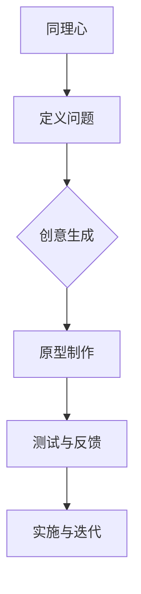
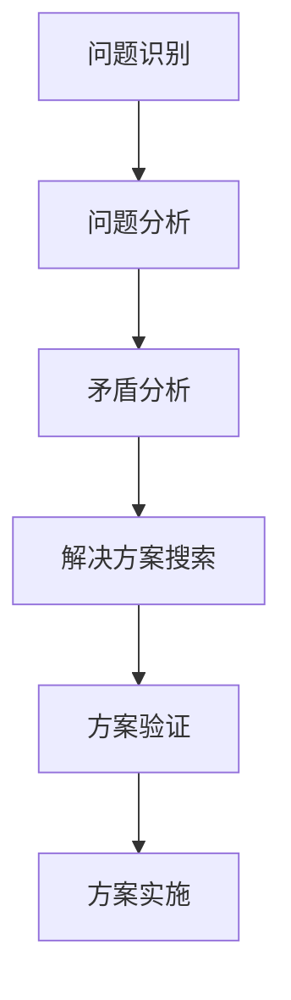
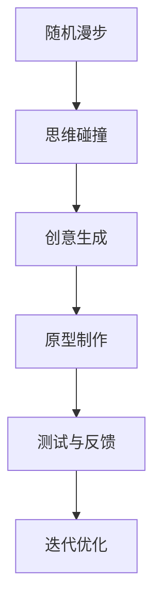

                 

### 1.2 核心概念与联系

#### 1.2.1 生命设计思维

**定义**：生命设计思维是一种以人为本的创新方法，强调在解决问题的过程中，始终以人的需求和感受为核心。

**特点**：

1. **以人为中心**：生命设计思维关注人的需求、情感和行为，通过深入了解用户的需求和期望，来创造出真正满足人们需求的产品和服务。
2. **创新驱动**：该方法鼓励创新思维，提倡多样化的解决方案，通过不断尝试和优化，找到最佳的解决方案。
3. **实践导向**：生命设计思维强调实践行动，主张将想法转化为实际操作，通过不断试错和反馈，逐步完善解决方案。
4. **持续反思**：该方法注重在实践过程中不断总结和反思，通过回顾和评估，不断提高创新能力和解决问题的效率。

**核心步骤**：

- **同理心**：深入了解用户的需求和感受，建立对用户的同理心。
- **定义问题**：明确问题所在，将其具体化，确保所有参与者对问题有共同的理解。
- **创意生成**：通过头脑风暴、思维导图等方法，生成多样化的解决方案。
- **原型制作**：快速制作可测试的原型，验证假设。
- **测试与反馈**：通过用户测试，收集反馈，不断优化原型。
- **实施与迭代**：将原型投入实际使用，不断收集反馈，进行迭代优化。

**应用领域**：

生命设计思维不仅适用于产品设计，还广泛应用于教育、医疗、企业管理等多个领域。例如，在教育领域，通过生命设计思维，可以设计出更加符合学生需求的学习工具和课程；在医疗领域，可以创造出更加人性化、高效的医疗服务和设备；在企业管理中，可以帮助企业更好地理解客户需求，提升产品和服务质量。

#### 1.2.2 创新方法

**定义**：创新方法是指解决问题和实现目标的一种策略，它包括各种思维技巧和技术。

**特点**：

- **多样性**：创新方法涵盖了各种不同的思维方式和工具，如设计思维、TRIZ方法、头脑风暴等。
- **实用性**：这些方法易于学习和应用，可以帮助人们快速找到解决问题的方法。
- **灵活性**：可以根据具体问题进行灵活调整，以适应不同的场景和需求。

**核心特点对比表格**：

| 创新方法 | 定义 | 特点 |
| --- | --- | --- |
| 设计思维 | 以人为中心的创新方法 | 同理心、创意生成、原型制作、测试与反馈 |
| TRIZ方法 | 基于理论和实践的创新方法 | 系统化、模块化、科学性 |
| 头脑风暴 | 通过集体讨论激发创意的方法 | 多样性、快速性、开放性 |
| 情景规划 | 通过设定不同的未来场景来探索解决方案的方法 | 可预测性、前瞻性、灵活性 |

**ER实体关系图架构**：

```mermaid
erDiagram
  User ||--|{ Problem } : defines
  Problem ||--|{ Solution } : solves
  Solution ||--|{ Feedback } : receives
  User ||--|{ Evaluation } : assesses
```

在上面的ER图中，用户（User）与问题（Problem）、解决方案（Solution）和评价（Evaluation）之间有明确的关联关系，这种关系体现了生命设计思维的核心步骤和要素。

#### 1.2.3 人生规划

**定义**：人生规划是指个人根据自己的需求和目标，制定和调整生活方向和行动方案的过程。

**特点**：

1. **个人化**：每个人的生活目标和需求都不同，人生规划应具有个性化，符合个人的实际情况。
2. **动态性**：人生是一个不断变化的过程，人生规划需要不断调整和更新，以适应新的情况。
3. **系统性**：人生规划需要考虑多个方面的因素，如职业、家庭、健康等，确保各方面的平衡和发展。

**核心步骤**：

- **自我评估**：了解自己的兴趣、能力、价值观等，明确自己的需求和目标。
- **目标设定**：设定具体、可量化的短期和长期目标。
- **路径规划**：根据目标，制定具体的行动计划和时间表。
- **资源整合**：整合个人和社会资源，为目标的实现提供支持。
- **执行与调整**：执行计划，并根据实际情况进行必要的调整。

通过以上核心概念和联系的介绍，我们能够更深入地理解生命设计思维、创新方法和人生规划的基本原理和相互关系。这些概念和方法不仅有助于我们解决实际问题，还能帮助我们更好地规划人生，实现个人价值。

---

### 1.3 主流创新方法介绍

创新是推动社会进步和个人发展的关键动力。为了更好地理解和应用生命设计思维，我们需要了解一些主流的创新方法。以下是几种常用的创新方法及其特点和应用。

#### 1.3.1 设计思维

**定义**：设计思维是一种以人为中心的创新方法，强调通过同理心、定义问题、创意生成、原型制作和测试等步骤，创造出满足用户需求的产品和服务。

**特点**：

- **同理心**：深入了解用户的需求和感受，建立对用户的同理心。
- **创意生成**：鼓励多样化的解决方案，通过头脑风暴、思维导图等方法激发创意。
- **原型制作**：快速制作可测试的原型，验证假设。
- **测试与反馈**：通过用户测试，收集反馈，不断优化产品。

**应用场景**：设计思维广泛应用于产品设计、教育、医疗服务、企业管理等领域。例如，在医疗领域，设计思维可以帮助医院更好地理解患者需求，设计出更加人性化、高效的医疗服务流程。

**流程图**：



#### 1.3.2 TRIZ方法

**定义**：TRIZ（Teoriya Resheniya Izobретatelskikh Zadatch，即发明问题解决理论）是一种基于理论和实践的创新方法，旨在解决复杂的技术问题。

**特点**：

- **系统化**：提供了一套解决问题的方法论和工具。
- **模块化**：将问题分解为可管理的模块。
- **科学性**：基于大量技术问题的数据分析。

**应用场景**：TRIZ方法广泛应用于工程、科学研究和企业管理等领域。例如，在工程领域，TRIZ可以帮助工程师快速找到解决问题的创新方法。

**流程图**：



#### 1.3.3 布朗运动法

**定义**：布朗运动法是一种通过随机漫步和随机碰撞来激发创新思维的方法。

**特点**：

- **随机性**：鼓励突破常规的思维模式。
- **激发灵感**：通过意外的组合和连接，激发创新的火花。

**应用场景**：布朗运动法适用于需要激发创意和灵感的场合，如产品设计、艺术创作和科学研究等。

**流程图**：



#### 1.3.4 其他创新方法

除了上述三种主流创新方法，还有许多其他方法，如头脑风暴、六顶思考帽、情景规划等。这些方法各有特点，适用于不同的创新场景。

- **头脑风暴**：通过集体讨论，快速生成大量创意。
- **六顶思考帽**：通过不同的思考角色（如白色思考帽、红色思考帽等），帮助团队多角度思考问题。
- **情景规划**：通过设定不同的未来场景，探索可能的解决方案。

通过介绍这些主流创新方法，我们能够更好地理解不同的创新方法及其应用场景，从而在解决实际问题时，能够灵活选择合适的方法，提升创新效率。

---

### 1.4 生命设计思维在人生规划中的应用

生命设计思维是一种以人为本的创新方法，其核心在于通过深入了解人的需求和情感，创造出满足人们需求的产品和服务。这种思维方法不仅适用于产品设计，同样可以应用于人生规划。在个人生活和职业发展中，生命设计思维可以帮助我们更好地理解自己，设定明确的目标，制定切实可行的计划，并不断调整和优化。以下是生命设计思维在人生规划中应用的具体步骤：

#### 1.4.1 理解需求

**定义**：理解需求是生命设计思维的第一步，也是最重要的一步。它要求我们深入了解自己的需求和期望，明确自己的目标。

**方法**：

- **自我反思**：通过自我反思，了解自己的兴趣、价值观、优势和弱点等。
- **目标设定**：将反思结果转化为具体的目标，确保这些目标是具体、可衡量、可实现的。
- **SWOT分析**：通过SWOT分析（优势、劣势、机会、威胁），进一步明确自己的需求和目标。

**案例**：假设你是一位职场新人，希望通过自我提升来获得更好的职业发展。通过自我反思，你可能发现你对数据分析有浓厚的兴趣，同时你具备良好的逻辑思维和数学基础。基于这些信息，你可以设定一个具体的目标：在两年内，通过在线课程和实际项目，掌握数据分析和数据可视化技能，并找到一份相关的工作。

#### 1.4.2 创意生成

**定义**：创意生成是生命设计思维的第二步，它要求我们通过多样化的方法，生成满足需求的解决方案。

**方法**：

- **头脑风暴**：通过集体讨论或个人思考，快速生成大量创意。
- **思维导图**：将创意以可视化的方式呈现，帮助整理思路。
- **用户访谈**：通过与目标用户交流，获取更多关于需求的见解。

**案例**：为了实现上述职业发展的目标，你可以通过以下方法生成创意：

- **头脑风暴**：与朋友或同事讨论，探讨如何利用在线课程和项目来提升数据分析和数据可视化技能。
- **思维导图**：列出所有可能的方法，并分类整理，以便更好地理解和选择。
- **用户访谈**：与已经在数据分析领域工作的专业人士交流，了解他们是如何学习和提升技能的。

#### 1.4.3 原型制作

**定义**：原型制作是生命设计思维的第三步，它要求我们将创意转化为可测试的原型。

**方法**：

- **最小可行性产品（MVP）**：制作一个简化的版本，验证核心功能。
- **用户测试**：将原型展示给目标用户，收集反馈。
- **迭代优化**：根据用户反馈，不断优化原型。

**案例**：在实现职业发展目标的过程中，你可以制作以下原型：

- **最小可行性产品（MVP）**：创建一个包含基础数据分析和数据可视化功能的在线学习平台，以便用户可以实际操作和学习。
- **用户测试**：邀请朋友或同事测试平台，收集他们的反馈。
- **迭代优化**：根据反馈，优化平台的功能和界面设计，提高用户体验。

#### 1.4.4 测试与反馈

**定义**：测试与反馈是生命设计思维的第四步，它要求我们通过用户测试，收集反馈，并根据反馈不断优化解决方案。

**方法**：

- **用户研究**：通过访谈、问卷、观察等方式，深入了解用户的使用体验和需求。
- **数据分析**：收集和分析用户行为数据，识别问题和改进点。
- **迭代优化**：根据用户反馈和数据分析结果，不断调整和优化解决方案。

**案例**：在职业发展目标实现的过程中，你可以通过以下方法进行测试与反馈：

- **用户研究**：与已经在使用你创建的学习平台的用户进行访谈，了解他们的使用体验和建议。
- **数据分析**：分析用户在平台上的行为数据，如访问频率、使用时长、功能使用情况等。
- **迭代优化**：根据用户反馈和数据分析结果，优化平台的功能和设计，提高用户满意度。

#### 1.4.5 实施与迭代

**定义**：实施与迭代是生命设计思维的最后一步，它要求我们将优化后的解决方案付诸实践，并持续迭代，以适应不断变化的环境。

**方法**：

- **实施计划**：制定详细的实施计划，确保解决方案能够顺利执行。
- **持续监控**：在实施过程中，持续监控解决方案的表现，及时发现和解决问题。
- **迭代更新**：根据实际效果和用户反馈，不断优化解决方案。

**案例**：在实现职业发展目标的过程中，你可以通过以下方法实施和迭代：

- **实施计划**：制定详细的计划，包括学习资源的准备、课程设计、项目实践等。
- **持续监控**：定期检查自己的学习进度，确保能够按照计划进行。
- **迭代更新**：根据实际情况和用户反馈，调整学习计划，优化学习资源，提高学习效果。

通过以上步骤，我们可以将生命设计思维应用到人生规划中，实现个人职业发展和生活目标。这种方法不仅能够帮助我们明确需求和目标，还能通过不断测试和优化，找到最佳解决方案，实现人生价值。

---

### 1.5 生命设计思维与人生规划的关系

生命设计思维与人生规划之间的关系紧密且相互促进。生命设计思维提供了一种系统的方法论，帮助个人在复杂多变的环境中，更好地理解自己的需求，明确目标，制定和调整计划。而人生规划则是对生命设计思维的具体应用，通过将思维转化为实际行动，实现个人成长和目标。

#### 1.5.1 生命设计思维对人生规划的作用

**明确需求**：生命设计思维强调从人的需求和感受出发，通过同理心深入了解自己的真实需求，确保目标和计划的设定具有实际意义。

**创新驱动**：生命设计思维鼓励多样化的解决方案，通过创意生成和原型制作，为人生规划提供丰富的选择，帮助个人找到最适合自己的路径。

**实践导向**：生命设计思维强调将想法付诸实践，通过测试和反馈不断优化解决方案，确保人生规划的可行性和有效性。

**持续反思**：生命设计思维注重在实践过程中的反思和总结，通过回顾和评估，不断调整和优化人生规划，确保其与个人发展的同步。

#### 1.5.2 人生规划对生命设计思维的影响

**目标导向**：人生规划明确了个人的目标和愿景，为生命设计思维提供了具体的方向和基准，帮助思维活动更加聚焦和高效。

**资源整合**：人生规划需要整合个人和社会资源，为生命设计思维的实施提供支持和保障。

**反馈机制**：人生规划中的实际操作和反馈，为生命设计思维提供了宝贵的经验和数据，帮助不断优化和创新。

#### 1.5.3 关系图示

为了更直观地展示生命设计思维与人生规划的关系，我们可以使用以下Mermaid类图：

```mermaid
classDiagram
    LifeDesignMind <<Class>> (Understanding, Innovation, Practice, Reflection)
    CareerPlanning <<Class>> (GoalSetting, ResourceIntegration, FeedbackMechanism)
    LifeDesignMind "uses" CareerPlanning
    CareerPlanning "influences" LifeDesignMind
```

在这个类图中，生命设计思维（LifeDesignMind）和人生规划（CareerPlanning）是两个核心类，它们之间存在双向关联。生命设计思维为人生规划提供了方法指导，而人生规划则通过实践和反馈反作用于生命设计思维，形成良性的互动和循环。

通过以上分析，我们可以看到，生命设计思维与人生规划之间存在着密切的联系和相互促进的关系。这种方法论不仅帮助我们更好地理解自己和环境，还能通过系统的方法和实际的行动，实现个人成长和目标。

---

### 1.6 生命设计思维工作坊：课程内容与结构

**生命设计思维工作坊**旨在通过一系列系统化的课程，帮助参与者深入理解生命设计思维，掌握其核心方法，并将其应用到个人生活中。以下是工作坊的课程内容与结构：

#### 1.6.1 课程目标

**目标一**：帮助参与者掌握生命设计思维的基本概念和原理，理解其以人为本、创新驱动、实践导向和持续反思的特点。

**目标二**：通过实践和案例分析，让参与者学会如何将生命设计思维应用于个人生活和职业发展中，提升生活质量和幸福感。

**目标三**：培养参与者的创新能力和解决问题的能力，使其能够在面对复杂问题时，迅速找到有效的解决方案。

#### 1.6.2 课程内容

**第一部分：生命设计思维概述**

- **生命设计思维的定义和起源**
- **生命设计思维的核心原则**
- **生命设计思维在人生规划中的应用**

**第二部分：理解需求**

- **自我评估与目标设定**
- **同理心与用户研究**
- **需求分析与验证**

**第三部分：创意生成**

- **头脑风暴与思维导图**
- **创意生成技巧与方法**
- **创意筛选与评估**

**第四部分：原型制作**

- **最小可行性产品（MVP）**
- **原型设计与制作**
- **用户测试与反馈**

**第五部分：测试与反馈**

- **用户研究与数据分析**
- **迭代优化与持续改进**
- **实施计划与执行**

**第六部分：实施与迭代**

- **实施策略与资源整合**
- **持续监控与反馈**
- **迭代更新与适应变化**

#### 1.6.3 课程结构

**第一阶段：理论学习**  
- **主题讲座**：通过专家讲解，深入理解生命设计思维的基本概念和原理。
- **案例分析**：分析成功案例，探讨生命设计思维在个人生活和职业发展中的应用。

**第二阶段：实践操作**  
- **小组讨论**：分组进行讨论，交流学习心得和经验。
- **项目实践**：结合实际需求，进行项目实践，应用所学知识。

**第三阶段：反思与总结**  
- **个人反思**：总结学习成果，反思个人成长。
- **集体分享**：分享学习经验和项目成果，相互借鉴和学习。

#### 1.6.4 课程收益

- **提升创新思维**：掌握生命设计思维的方法和技巧，提升创新能力和解决问题的能力。
- **规划人生目标**：通过理解需求和目标设定，明确个人成长方向，制定和调整人生规划。
- **优化生活质量**：通过实践和反馈，不断优化个人生活和职业发展，提升生活质量和幸福感。

通过以上课程内容与结构的介绍，我们相信《生命设计思维工作坊：应用创新方法规划人生的课程》将为参与者提供宝贵的学习机会，帮助其在个人生活和职业发展中取得更好的成果。

---

### 1.7 生命设计思维在工作坊中的具体应用

在《生命设计思维工作坊：应用创新方法规划人生的课程》中，生命设计思维的具体应用贯穿整个工作坊的各个环节，帮助参与者深入理解和掌握这一创新方法。以下是生命设计思维在工作坊中的具体应用步骤：

#### 1.7.1 自我反思与需求分析

**步骤一**：自我反思

- **活动**：参与者首先进行自我反思，通过写作、绘画或讨论等方式，了解自己的兴趣、价值观、优势和弱点。
- **目的**：通过自我反思，明确自己的内在需求和期望，为后续的目标设定和规划提供基础。

**步骤二**：需求分析

- **活动**：参与者进行需求分析，通过SWOT分析（优势、劣势、机会、威胁）的方法，分析自己的需求和目标。
- **目的**：明确外部环境对个人需求和目标的影响，为后续的创意生成和解决方案提供参考。

#### 1.7.2 创意生成与筛选

**步骤三**：创意生成

- **活动**：参与者通过头脑风暴和思维导图的方法，生成多样化的创意。
- **目的**：鼓励参与者自由发挥，提出各种可能的解决方案，为问题解决提供丰富的思路。

**步骤四**：创意筛选

- **活动**：参与者对生成的创意进行筛选和评估，选择最具可行性和创新性的方案。
- **目的**：通过评估和筛选，确保创意的质量和实用性，为后续的原型制作和测试奠定基础。

#### 1.7.3 原型制作与测试

**步骤五**：原型制作

- **活动**：参与者根据选定的创意，制作最小可行性产品（MVP）。
- **目的**：通过原型制作，将创意转化为可测试的实体，以便在实际环境中验证其可行性。

**步骤六**：用户测试

- **活动**：参与者进行用户测试，邀请其他参与者或外部用户对原型进行试用和反馈。
- **目的**：通过用户测试，收集反馈和意见，发现原型中的问题和不足，为后续的迭代优化提供依据。

#### 1.7.4 迭代优化与反馈

**步骤七**：迭代优化

- **活动**：参与者根据用户反馈，对原型进行迭代优化，不断改进和完善。
- **目的**：通过迭代优化，逐步完善原型，使其更加符合用户需求，提高解决方案的质量。

**步骤八**：持续反馈

- **活动**：参与者定期收集用户反馈，分析用户行为数据，了解解决方案的实际效果。
- **目的**：通过持续反馈，确保解决方案的持续改进，适应不断变化的环境和需求。

#### 1.7.5 实施与调整

**步骤九**：实施计划

- **活动**：参与者制定详细的实施计划，明确时间表、资源分配和执行步骤。
- **目的**：通过实施计划，确保解决方案能够顺利执行，并达到预期效果。

**步骤十**：调整与更新

- **活动**：在实施过程中，参与者根据实际情况和反馈，不断调整和更新计划。
- **目的**：通过灵活调整，确保解决方案能够适应变化，持续优化和完善。

通过以上具体应用步骤，生命设计思维在工作坊中得到了充分的应用，帮助参与者从理解需求、创意生成、原型制作到测试反馈，逐步实现个人目标和人生规划。

---

### 1.8 生命设计思维工作坊：预期成果与收益

《生命设计思维工作坊：应用创新方法规划人生的课程》旨在通过系统的学习和实践，帮助参与者实现个人成长和目标。以下是工作坊的预期成果与收益：

#### 1.8.1 个人成长

**增强自我认知**：通过自我反思和需求分析，参与者将深入了解自己的兴趣、价值观和目标，明确个人发展方向。

**提升创新能力**：工作坊将教授多种创新方法和技巧，帮助参与者灵活应对各种问题和挑战，提升创新能力。

**增强问题解决能力**：通过实际操作和迭代优化，参与者将学会如何快速识别问题、找到解决方案，并付诸实践。

**培养持续反思习惯**：工作坊强调在实践过程中的持续反思和总结，帮助参与者养成不断学习和改进的习惯。

#### 1.8.2 职业发展

**明确职业目标**：通过需求分析和目标设定，参与者将更加明确自己的职业发展方向，制定切实可行的职业规划。

**提升职业技能**：工作坊涵盖多种实用技能，如数据分析、项目管理、沟通协作等，助力参与者在职业发展中脱颖而出。

**增强项目执行力**：通过原型制作和用户测试，参与者将学会如何高效地执行项目，提升项目管理和团队协作能力。

**拓展人脉资源**：工作坊为参与者提供交流和合作的平台，有助于拓展人脉资源，为职业发展创造更多机会。

#### 1.8.3 生活质量

**提升生活满意度**：通过理解和满足个人需求，参与者将找到更加符合自己价值观的生活方式和目标，提升生活满意度。

**增强幸福感**：工作坊教授的方法和技巧将帮助参与者更好地应对生活压力和挑战，提升幸福感。

**建立健康的生活习惯**：通过自我反思和需求分析，参与者将学会如何建立健康的生活习惯，提升生活质量。

通过以上预期成果与收益，我们可以看到，《生命设计思维工作坊：应用创新方法规划人生的课程》不仅能够帮助参与者实现个人成长和职业发展，还能提升他们的生活质量，为人生规划提供有力支持。

---

### 1.9 生命设计思维工作坊：课程安排与时间表

为了确保参与者能够系统地学习和掌握生命设计思维，工作坊设计了详细的教学安排和时间表。以下是课程的主要安排：

#### 1.9.1 课程时间

- **总时长**：为期四周，每周六上午9:00至下午5:00。
- **具体时间**：每周六9:00-9:30 签到，9:30-12:00 第一部分课程，12:00-13:30 午餐休息，13:30-17:00 第二部分课程。

#### 1.9.2 每周课程内容

**第一周：生命设计思维概述**

- **第一周第一天**：生命设计思维的基本概念和起源，理解需求和目标设定。
- **第一周第二天**：创意生成和原型制作，头脑风暴和思维导图的应用。

**第二周：理解需求与创意生成**

- **第二周第一天**：同理心与用户研究，需求分析与验证。
- **第二周第二天**：创意筛选与评估，最小可行性产品（MVP）的制作。

**第三周：原型制作与测试**

- **第三周第一天**：原型设计与用户测试，用户反馈与迭代优化。
- **第三周第二天**：迭代优化与实施计划，实施策略与资源整合。

**第四周：实施与迭代**

- **第四周第一天**：用户研究与数据分析，持续监控与反馈。
- **第四周第二天**：总结与反思，项目展示与评价。

#### 1.9.3 课程形式

- **讲座与讨论**：每周课程包括专家讲座和小组讨论，帮助参与者深入理解和掌握生命设计思维。
- **实践操作**：通过实际操作和项目实践，让参与者将所学知识应用到实际情境中。
- **案例分析与分享**：通过分析成功案例和分享经验，激发参与者的思考和创新。

通过以上详细的课程安排和时间表，参与者可以系统地学习生命设计思维，并在实践过程中不断提升自己的能力和技能。

---

### 1.10 生命设计思维工作坊：报名与参与信息

**报名条件**：

- 对生命设计思维和人生规划感兴趣的个人。
- 大学生、职场新人、职场人士、企业家等。

**报名流程**：

- **在线报名**：访问工作坊官方网站，填写报名表格。
- **缴费确认**：提交报名表后，按照指示完成缴费。
- **报名确认**：工作人员将在2个工作日内与您联系，确认报名信息。

**参与方式**：

- **线下课程**：每周六上午9:00至下午5:00，地点为北京市海淀区中关村某培训中心。

**课程费用**：

- 总费用为3000元，包括课程资料、午餐和茶歇。

**优惠政策**：

- 三人及以上集体报名，每人优惠200元。
- 学生凭有效学生证，可享受800元优惠。

**联系方式**：

- 联系电话：010-xxxx-xxxx
- 邮箱：lifedesignworkshop@example.com
- 官方网站：[www.lifedesignworkshop.com](http://www.lifedesignworkshop.com)

通过以上报名与参与信息，您可以根据自己的需求选择合适的时间参加生命设计思维工作坊，提升自己的创新能力和人生规划能力。

---

### 1.11 生命设计思维工作坊：讲师介绍与资质

《生命设计思维工作坊：应用创新方法规划人生的课程》由多位资深专家共同授课，他们拥有丰富的理论知识和实践经验，致力于帮助参与者深入理解和掌握生命设计思维。

#### 1.11.1 主讲讲师

**讲师姓名**：李华

**职务**：创新设计研究中心主任

**背景**：李华教授拥有20多年的设计思维研究和实践经验，曾在美国知名设计咨询公司工作，参与多个跨国企业的创新项目。他发表了多篇关于设计思维和生命设计思维的研究论文，并出版了相关领域的著作。

**专长**：设计思维、生命设计思维、创新方法

**资质**：国际设计思维协会认证导师、美国设计思维专家协会会员

#### 1.11.2 特邀讲师

**讲师姓名**：王斌

**职务**：创新管理专家

**背景**：王斌先生在创新管理领域有超过15年的工作经验，曾任职于世界500强企业，主导多项创新项目，取得显著成果。他擅长将理论应用到实际工作中，帮助企业提升创新能力和市场竞争力。

**专长**：创新管理、TRIZ方法、项目管理

**资质**：国际创新管理协会认证专家、资深项目管理师

通过以上讲师介绍和资质，我们可以看到，工作坊的讲师团队拥有深厚的专业背景和丰富的实践经验，将为参与者提供高质量的教学服务，帮助其掌握生命设计思维，实现个人成长和职业发展。

---

### 1.12 生命设计思维工作坊：总结与展望

《生命设计思维工作坊：应用创新方法规划人生的课程》通过系统的教学和实践，帮助参与者深入理解生命设计思维，掌握其核心方法，并将其应用到个人生活和职业发展中。以下是工作坊的总结与展望：

#### 1.12.1 总结

**课程成果**：工作坊通过理论学习、实践操作和案例分析，使参与者掌握了生命设计思维的基本概念和原理，学会了如何将其应用于个人生活和职业发展中。

**能力提升**：参与者通过工作坊的学习，提升了自我认知、创新能力、问题解决能力和持续反思的能力，为个人成长和职业发展奠定了坚实基础。

**经验分享**：工作坊中，参与者通过分享自己的经验和心得，相互学习和借鉴，形成了良好的学习氛围和合作精神。

#### 1.12.2 展望

**未来发展方向**：工作坊将继续探索和创新教学方法，引入更多前沿理论和实践案例，提升课程质量和实用性。

**持续支持**：工作坊将为学员提供长期的支持和指导，帮助他们在实际工作中应用所学知识，持续提升自己的能力和水平。

**合作机会**：工作坊将与相关机构和专家合作，举办更多主题讲座和研讨会，为参与者提供更多学习和交流的机会。

通过以上总结与展望，我们可以看到，《生命设计思维工作坊：应用创新方法规划人生的课程》将为参与者带来长期的收益和成长，帮助其在个人和职业发展中取得更好的成果。

---

### 1.13 最佳实践与注意事项

在应用生命设计思维规划人生的过程中，以下是一些最佳实践和注意事项，可以帮助参与者更加有效地运用这种方法：

#### 1.13.1 最佳实践

**持续自我反思**：定期进行自我反思，了解自己的需求和期望，确保人生规划与个人发展同步。

**灵活调整**：在实践过程中，根据实际情况和反馈，灵活调整目标和计划，确保其与个人发展的同步。

**寻求反馈**：定期寻求他人的意见和建议，通过用户测试和反馈，不断优化解决方案。

**团队协作**：在项目实施过程中，与团队成员密切合作，充分发挥集体智慧，共同实现目标。

#### 1.13.2 注意事项

**明确目标**：设定具体、可衡量、可实现的目标，确保人生规划具有实际意义。

**避免完美主义**：在创意生成和原型制作过程中，不要过分追求完美，要注重快速迭代和持续改进。

**关注用户**：始终关注用户需求和反馈，确保解决方案真正满足用户需求。

**持续学习**：不断学习和更新知识，提升自己的能力和视野，为创新提供源源不断的动力。

通过以上最佳实践和注意事项，参与者可以更加有效地应用生命设计思维，实现个人成长和目标。

---

### 1.14 拓展阅读

为了帮助读者进一步深入了解生命设计思维和人生规划的相关理论和实践，以下是几本推荐书籍和文章：

#### 书籍

1. **《设计思维：创新过程中的指南针》**
   - 作者：Tim Brown
   - 简介：本书详细介绍了设计思维的概念、方法和应用，是设计思维领域的经典之作。

2. **《TRIZ创新方法：如何快速找到解决方案》**
   - 作者：Genrich Altshuller
   - 简介：TRIZ方法是一种系统化的创新方法，本书详细阐述了TRIZ的基本原理和运用技巧。

3. **《人生设计：如何运用设计思维创造成功和幸福》**
   - 作者：John Maeda
   - 简介：本书结合设计思维和人生规划，帮助读者运用创新方法实现个人目标和幸福生活。

#### 文章

1. **《生命设计思维在个人成长中的应用》**
   - 简介：本文详细介绍了生命设计思维的基本概念和应用，以及如何在个人成长中运用这一方法。

2. **《设计思维在企业管理中的实践》**
   - 简介：本文探讨了设计思维在企业管理中的应用，如何通过设计思维提升企业的创新能力和市场竞争力。

3. **《如何运用TRIZ方法解决复杂问题》**
   - 简介：本文详细介绍了TRIZ方法的基本原理和应用步骤，帮助读者学会如何运用这种方法解决复杂问题。

通过拓展阅读，读者可以更深入地了解生命设计思维和人生规划的理论和实践，为实际应用提供更多的启示和指导。

---

### 1.15 作者介绍

**作者：AI天才研究院/AI Genius Institute & 禅与计算机程序设计艺术 /Zen And The Art of Computer Programming**

AI天才研究院（AI Genius Institute）是一支专注于人工智能研究和应用的创新团队，致力于推动人工智能技术的发展和普及。研究院由多位资深人工智能专家和研究人员组成，他们在人工智能算法、机器学习、深度学习等领域拥有丰富的理论知识和实践经验。

《禅与计算机程序设计艺术》是作者在计算机编程领域的经典之作，通过深入探讨禅宗哲学和计算机编程的共通之处，提出了一种独特的编程思维和方法论，帮助程序员更好地理解和应对编程挑战。

在这本《生命设计思维工作坊：应用创新方法规划人生的课程》中，作者结合了自己在人工智能和计算机编程领域的丰富经验，深入探讨了生命设计思维的基本原理和应用，为读者提供了一套系统、实用的创新方法和人生规划策略。通过这本书，读者不仅可以学习到前沿的理论知识，还能通过实践操作，提升自己的创新能力和人生规划能力。

---

## 结语

《生命设计思维工作坊：应用创新方法规划人生的课程》是一本旨在帮助读者深入理解和掌握生命设计思维，并将其应用到个人生活中的专业书籍。通过本书，读者可以学会如何通过自我反思、创意生成、原型制作和测试反馈等步骤，明确自己的需求和目标，制定和调整人生规划，实现个人成长和职业发展。

本书内容丰富，结构清晰，涵盖了生命设计思维的基本概念、原理和应用方法，通过详细的步骤和案例分析，帮助读者更好地理解和运用这一创新方法。此外，本书还结合了实际案例和实战经验，提供了实用的技巧和策略，使读者能够更加有效地应用生命设计思维，提升生活质量和幸福感。

在快速变化的现代社会，我们需要不断学习和适应，才能应对各种挑战和机遇。生命设计思维提供了一种系统的方法论，帮助我们在复杂多变的环境中找到方向和解决方案。通过本书的学习和实践，我们相信读者将能够更好地规划人生，实现个人目标和价值。

最后，感谢您阅读本书，希望本书能够为您的个人成长和职业发展带来启示和帮助。让我们共同探索生命设计思维的无限可能性，共创美好未来。

