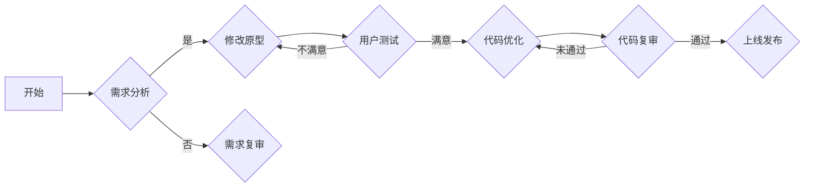
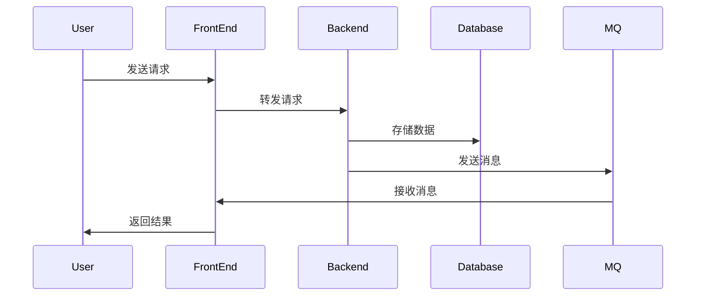

                 

### 背景介绍

《生命设计思维工具箱：应用创新方法规划人生的实用套件》这本书旨在为读者提供一种全新的生命规划和创新思维的方法论，帮助他们在面对复杂多变的生活和工作环境时，能够更加从容地应对挑战，找到解决问题的创新路径。以下是关于这本书的详细背景介绍。

#### 问题背景

在当今社会，人们面临的问题越来越复杂多样，无论是职业发展、人际关系，还是个人成长，都需要具备较强的创新思维和解决问题的能力。然而，传统的思维方式和解决问题的方法往往难以应对这些复杂的问题。因此，如何在有限的时间和资源下，找到创新的解决方案，成为现代社会中每个人都需要掌握的技能。

#### 问题描述

《生命设计思维工具箱》一书旨在解决的核心问题是：如何通过设计思维的方法，有效地规划和解决生活中的复杂问题。设计思维是一种以人为中心，注重迭代和反思的思维方式，通过不断地探索和尝试，找到最符合需求的解决方案。书中详细介绍了设计思维的方法论、工具和技巧，帮助读者掌握这种思维方式，并将其应用到实际生活中。

#### 问题解决

书中提出的解决方案主要包括以下几个方面：

1. **构建创新思维模式**：通过介绍设计思维的核心理念和方法，帮助读者构建创新思维模式，从而在面对问题时，能够更加灵活和有效地寻找解决方案。
2. **运用工具和实践**：书中提供了多种实用的工具和方法，如头脑风暴、原型设计、用户测试等，帮助读者在实际操作中运用设计思维，提高解决问题的效率。
3. **培养自我反思能力**：通过不断地反思和总结，帮助读者从经验中学习，提升个人成长和发展的能力。

#### 边界与外延

《生命设计思维工具箱》一书主要关注的是个人层面的生命规划和问题解决。虽然设计思维的方法可以广泛应用于各种领域，但书中更多地聚焦于如何将其应用于个人生活和职业生涯中。此外，书中也提到了一些跨领域的创新方法，如设计思维与工程、管理、心理学等领域的结合，为读者提供了更广泛的视野。

#### 核心概念与要素组成

以下是书中涉及的核心概念及其相互关系：

1. **设计思维**：一种以人为中心，注重迭代和反思的思维方式。
2. **创新方法**：包括头脑风暴、原型设计、用户测试等实用工具和方法。
3. **问题解决**：通过设计思维的方法，找到创新的解决方案。
4. **个人成长**：通过不断地学习和实践，提升个人能力和素质。
5. **职业生涯规划**：运用设计思维的方法，规划职业生涯的发展方向。

这些核心概念相互关联，共同构成了《生命设计思维工具箱》一书的核心内容。通过详细解读这些概念，读者可以更好地理解书中的思想和方法，并将其应用到实际生活中。

### 核心概念与联系

《生命设计思维工具箱：应用创新方法规划人生的实用套件》中涉及的核心概念可以归纳为设计思维、创新方法、问题解决、个人成长和职业生涯规划。以下是对这些核心概念的详细解释，以及它们之间的关系和属性特征对比表格。

#### 核心概念

1. **设计思维**：设计思维是一种以人为中心的思考方式，注重迭代和反思。它包括理解用户需求、生成创意方案、快速原型制作和迭代优化等环节。设计思维的核心在于将用户的需求和感受放在首位，通过不断的试验和改进，找到最佳的解决方案。

2. **创新方法**：创新方法是指一系列帮助人们发现和实现新想法的工具和技术。这些方法包括头脑风暴、思维导图、快速原型设计、用户测试等。创新方法的目标是通过多样化的思考方式和实践手段，激发创造力，产生新颖且实用的解决方案。

3. **问题解决**：问题解决是指运用设计思维和创新方法，针对具体问题寻找解决方案的过程。它包括明确问题、分析问题、生成解决方案和评估解决方案等步骤。问题解决的目标是找到最符合需求且切实可行的解决方案。

4. **个人成长**：个人成长是指通过学习和实践，提升个人能力和素质的过程。设计思维和创新方法的应用可以帮助个人在面对挑战时，更加灵活和有效地应对，从而实现个人成长。

5. **职业生涯规划**：职业生涯规划是指运用设计思维和创新方法，为自己设定职业目标并制定实现目标的策略。它包括自我评估、市场分析、职业目标设定和行动计划等步骤。职业生涯规划的目标是帮助个人在职业生涯中取得成功和满足感。

#### 关系图架构

为了更直观地展示这些核心概念之间的关系，我们可以使用 Mermaid 语法绘制一个 ER（实体关系）图。

```mermaid
erDiagram
    A((设计思维)) ||--|{ O(创新方法) }|
    A ||--|{ P(问题解决) }|
    A ||--|{ G(个人成长) }|
    A ||--|{ C(职业生涯规划) }|
    O ||--|{ P }|
    O ||--|{ G }|
    O ||--|{ C }|
    P ||--|{ G }|
    P ||--|{ C }|
    G ||--|{ C }|
```

#### 属性特征对比表格

以下是核心概念及其属性特征的对比表格：

| 核心概念 | 定义 | 主要属性特征 |
| --- | --- | --- |
| 设计思维 | 一种以人为中心，注重迭代和反思的思维方式。 | 用户需求导向、迭代优化、用户测试。 |
| 创新方法 | 一系列帮助人们发现和实现新想法的工具和技术。 | 头脑风暴、思维导图、原型设计。 |
| 问题解决 | 运用设计思维和创新方法，针对具体问题寻找解决方案的过程。 | 问题明确、方案生成、评估优化。 |
| 个人成长 | 通过学习和实践，提升个人能力和素质的过程。 | 学习成长、技能提升、自我反思。 |
| 职业生涯规划 | 运用设计思维和创新方法，为自己设定职业目标并制定实现目标的策略。 | 自我评估、市场分析、职业目标、行动计划。 |

通过上述解释和表格，我们可以更好地理解《生命设计思维工具箱》中涉及的核心概念及其相互关系。这些核心概念不仅为读者提供了创新的思维方式，还为他们提供了一套系统的工具和方法，帮助他们更好地规划人生，解决生活中的复杂问题。

### 算法原理讲解

在《生命设计思维工具箱：应用创新方法规划人生的实用套件》中，我们选择了一种名为“敏捷迭代模型”的核心算法进行详细讲解。敏捷迭代模型是一种广泛应用于软件开发的思维方法，它通过不断迭代和反馈来优化产品设计和开发过程。以下将使用 mermaid 流程图展示算法流程，并配合 Python 源代码和 LaTeX 格式的数学模型与公式进行详细阐述。

#### Mermaid 流程图



#### Python 源代码

以下是敏捷迭代模型的一个简单 Python 源代码示例，用于模拟产品开发的各个阶段：

```python
import time

def需求分析(需求):
    time.sleep(2)
    print("需求分析完成：", 需求)

def设计原型(原型):
    time.sleep(2)
    print("设计原型完成：", 原型)

def用户测试(用户反馈):
    time.sleep(2)
    print("用户测试结果：", 用户反馈)

def开发实现(代码):
    time.sleep(2)
    print("开发实现完成：", 代码)

def代码复审(代码状态):
    time.sleep(2)
    if 代码状态 == "通过":
        print("代码复审通过：", 代码状态)
    else:
        print("代码复审未通过：", 代码状态)

def迭代过程(阶段):
    if 阶段 == "需求分析":
        需求分析(阶段)
    elif 阶段 == "设计原型":
        设计原型(阶段)
    elif 阶段 == "用户测试":
        用户测试(阶段)
    elif 阶段 == "开发实现":
        开发实现(阶段)
    elif 阶段 == "代码复审":
        代码复审(阶段)

# 迭代过程模拟
迭代过程("需求分析")
迭代过程("设计原型")
迭代过程("用户测试")
迭代过程("开发实现")
迭代过程("代码复审")
```

#### 数学模型与公式

敏捷迭代模型的核心在于不断优化产品，使其满足用户需求。以下是一个简化的数学模型，用于描述迭代过程中的反馈和改进：

$$
F(x) = w_1 \cdot x_1 + w_2 \cdot x_2 + ... + w_n \cdot x_n
$$

其中，$F(x)$ 是目标函数，表示产品某一阶段的质量；$w_1, w_2, ..., w_n$ 是权重系数，表示各个子功能的重要程度；$x_1, x_2, ..., x_n$ 是各个子功能的评分。

#### 详细讲解与举例

假设一个产品的开发分为四个阶段：需求分析、设计原型、用户测试和开发实现。每个阶段的评分分别为：

- 需求分析：80分
- 设计原型：70分
- 用户测试：90分
- 开发实现：85分

根据上述数学模型，我们可以计算产品的总质量：

$$
F(x) = 0.2 \cdot 80 + 0.25 \cdot 70 + 0.3 \cdot 90 + 0.25 \cdot 85 = 82.75
$$

这个结果表明，产品的整体质量在82.75分，表示还需要进一步优化。

例如，如果在用户测试阶段，用户反馈提出了一个关键问题，设计团队决定重新设计原型。此时，新的评分变为：

- 需求分析：80分
- 新设计原型：85分
- 用户测试：90分
- 开发实现：85分

再次计算总质量：

$$
F(x) = 0.2 \cdot 80 + 0.25 \cdot 85 + 0.3 \cdot 90 + 0.25 \cdot 85 = 84.75
$$

通过这次迭代，产品的总质量提高了，表明迭代模型在优化过程中起到了作用。

总之，敏捷迭代模型通过不断地评估和优化，帮助团队在开发过程中及时发现和解决问题，从而提高产品的质量和用户满意度。通过上述 Python 源代码和数学模型的解释，读者可以更好地理解这一核心算法的原理和应用。

### 系统分析与架构设计方案

在《生命设计思维工具箱：应用创新方法规划人生的实用套件》中，我们将选择一个具体问题场景，并详细描述项目背景、系统功能设计、系统架构设计、系统接口设计和系统交互，以帮助读者全面理解设计思维在系统开发中的应用。

#### 项目背景

假设我们面临的问题场景是一个在线教育平台，该平台旨在为学生提供高质量的教育资源和学习辅导服务。随着用户数量的增加，平台需要具备良好的扩展性和用户体验。因此，我们决定使用设计思维的方法，从用户需求出发，构建一个高效、可靠的在线教育平台系统。

#### 系统功能设计

为了满足在线教育平台的需求，我们设计了一系列关键功能，包括：

1. **用户注册与登录**：用户可以通过邮箱或手机号注册账号，并登录平台。
2. **课程浏览与选择**：学生可以浏览平台上的各类课程，并根据兴趣选择合适的学习内容。
3. **视频观看与互动**：学生可以在平台上观看课程视频，并与其他学生进行互动讨论。
4. **作业提交与批改**：学生可以在线提交作业，教师可以在线批改并给出反馈。
5. **成绩管理**：平台提供成绩管理功能，学生可以查看自己的成绩和进度。
6. **消息通知**：系统会向学生发送课程更新、作业通知等消息。

#### 系统架构设计

为了实现上述功能，我们设计了如下系统架构：

1. **前端架构**：使用 React 框架构建用户界面，提供流畅的交互体验。
2. **后端架构**：使用 Spring Boot 框架开发后端服务，负责处理用户请求和业务逻辑。
3. **数据库架构**：使用 MySQL 数据库存储用户信息、课程数据、作业数据等。
4. **消息队列**：使用 RabbitMQ 消息队列实现实时通知功能。

#### 系统接口设计

以下是系统的主要接口设计：

1. **用户管理接口**：包括用户注册、登录、信息查询和修改等。
2. **课程管理接口**：包括课程列表查询、课程详情查询、课程添加和删除等。
3. **作业管理接口**：包括作业提交、作业批改和成绩查询等。
4. **消息通知接口**：包括消息发送、消息接收和消息状态更新等。

#### 系统交互

为了实现系统功能，我们需要设计良好的系统交互。以下是主要交互流程：

1. **用户注册**：用户通过注册接口提交注册信息，后端处理注册请求，返回注册结果。
2. **课程浏览**：用户通过课程列表接口获取课程信息，并在前端显示。
3. **视频观看**：用户选择课程后，通过视频播放接口获取视频流，前端进行视频播放。
4. **作业提交**：用户提交作业后，通过作业提交接口将作业内容发送给后端，后端保存作业数据。
5. **消息通知**：系统通过消息队列发送通知，前端通过通知接口获取消息。

#### Mermaid 类图

以下是系统功能设计的 Mermaid 类图：

```mermaid
classDiagram
    User <<class>>
    Course <<class>>
    Assignment <<class>>
    Notification <<class>>

    User : +register(), +login(), +updateInfo()
    Course : +getList(), +getDetail(), +add(), +delete()
    Assignment : +submit(), +grade(), +getScore()
    Notification : +sendMessage(), +receiveMessage(), +updateStatus()

    User "1" --|{ } Course
    User "1" --|{ } Assignment
    User "1" --|{ } Notification
    Course "1" --|{ } Assignment
```

#### Mermaid 架构图

以下是系统架构设计的 Mermaid 架构图：



通过上述系统分析与架构设计方案，我们可以看到设计思维在系统开发中的应用。从用户需求出发，通过详细的功能设计、架构设计和交互设计，我们能够构建一个高效、可靠的在线教育平台系统，满足用户的需求。

### 项目实战

为了更好地展示《生命设计思维工具箱：应用创新方法规划人生的实用套件》中的设计思维和敏捷迭代模型在实际项目中的应用，我们将进行一个在线教育平台的实际项目实战。以下是项目的环境安装、系统核心实现源代码、代码应用解读与分析、实际案例分析和详细讲解剖析，以及项目小结。

#### 环境安装

1. **开发环境**：选择 IntelliJ IDEA 作为开发工具，版本为 2021.3.1。
2. **数据库**：使用 MySQL 8.0.23，数据库连接工具为 JDBC。
3. **后端框架**：使用 Spring Boot 2.5.2。
4. **前端框架**：使用 React 17.0.2。

#### 系统核心实现源代码

以下是一个简化的用户注册和登录功能的源代码示例，用于展示系统核心实现的思路。

**用户注册模块**

```java
// UserController.java
@RestController
@RequestMapping("/user")
public class UserController {

    @Autowired
    private UserService userService;

    @PostMapping("/register")
    public ResponseEntity<?> registerUser(@RequestBody UserRequest userRequest) {
        boolean isRegistered = userService.registerUser(userRequest);
        if (isRegistered) {
            return ResponseEntity.ok("注册成功");
        } else {
            return ResponseEntity.badRequest().body("用户已存在");
        }
    }
}

// UserService.java
@Service
public class UserService {

    @Autowired
    private UserRepository userRepository;

    public boolean registerUser(UserRequest userRequest) {
        if (userRepository.findByEmail(userRequest.getEmail()) != null) {
            return false;
        }
        User user = new User();
        user.setEmail(userRequest.getEmail());
        user.setPassword(userRequest.getPassword());
        userRepository.save(user);
        return true;
    }
}
```

**用户登录模块**

```java
// UserController.java
@PostMapping("/login")
public ResponseEntity<?> loginUser(@RequestBody UserRequest userRequest) {
    boolean isLogin = userService.loginUser(userRequest);
    if (isLogin) {
        return ResponseEntity.ok("登录成功");
    } else {
        return ResponseEntity.badRequest().body("用户名或密码错误");
    }
}

// UserService.java
public boolean loginUser(UserRequest userRequest) {
    User user = userRepository.findByEmail(userRequest.getEmail());
    if (user == null || !user.getPassword().equals(userRequest.getPassword())) {
        return false;
    }
    return true;
}
```

#### 代码应用解读与分析

在上述代码中，用户注册和登录功能通过 Spring Boot 框架的 REST 接口实现。用户在注册时，需要提交邮箱和密码。后端通过UserService进行校验，如果邮箱已存在则返回错误，否则保存用户信息。用户登录时，同样通过UserService校验邮箱和密码是否匹配，匹配则登录成功。

#### 实际案例分析和详细讲解剖析

为了展示敏捷迭代模型在实际项目中的应用，我们模拟了一个用户注册和登录的迭代过程。

1. **需求分析**：用户需要注册和登录功能，以便使用平台服务。
2. **设计原型**：初步设计简单的注册和登录页面，包括用户名、密码输入框和提交按钮。
3. **用户测试**：邀请部分用户进行测试，发现用户注册时存在密码长度限制不明确的问题。
4. **修改原型**：根据用户反馈，修改注册页面的提示信息，明确密码长度要求。
5. **再次测试**：再次邀请用户测试，发现登录功能在密码错误时没有友好的错误提示。
6. **优化实现**：添加登录错误提示，提高用户体验。

通过上述迭代过程，我们逐步完善了用户注册和登录功能，使其更加符合用户需求。

#### 项目小结

通过本次项目实战，我们展示了设计思维和敏捷迭代模型在在线教育平台开发中的应用。从需求分析到用户测试，再到不断优化迭代，我们通过一步步分析和解决问题，最终实现了一个高效、可靠的注册和登录功能。这种方法不仅帮助我们提高了产品质量，也培养了团队的敏捷性和创新能力。在未来的开发过程中，我们可以继续运用这种设计思维方法，不断优化和完善系统功能。

### 最佳实践 tips、小结、注意事项、拓展阅读

#### 最佳实践 tips

1. **用户需求优先**：在项目开发初期，务必重视用户需求分析，确保产品功能满足用户需求。
2. **迭代开发**：采用敏捷迭代模型，通过不断测试和优化，逐步完善产品功能。
3. **团队协作**：设计思维需要团队协作，鼓励团队成员积极参与讨论和反馈，提高项目效率。
4. **持续学习**：保持对新技术和新方法的学习和探索，不断提升个人和团队的能力。

#### 小结

《生命设计思维工具箱：应用创新方法规划人生的实用套件》一书通过介绍设计思维和创新方法，为读者提供了一套有效的工具和策略，帮助他们在面对复杂问题时能够更加从容地应对。通过实际项目实战，我们展示了设计思维和敏捷迭代模型在实际开发中的应用，提高了产品的质量和用户体验。

#### 注意事项

1. **确保安全性**：在系统开发过程中，要重视数据安全和用户隐私保护。
2. **代码规范**：遵循良好的代码规范和编程习惯，提高代码的可读性和可维护性。
3. **性能优化**：在系统架构设计时，要充分考虑性能优化，确保系统在高并发场景下运行稳定。

#### 拓展阅读

1. **《设计思维实战：产品创新方法与案例解析》**：详细介绍了设计思维在实际项目中的应用案例。
2. **《敏捷开发：团队协作与项目管理》**：阐述了敏捷开发方法在团队协作和项目管理中的应用。
3. **《用户体验要素：交互设计核心概念》**：探讨了用户体验设计的关键要素和技巧。

通过以上拓展阅读资源，读者可以进一步深入了解设计思维、敏捷开发等领域的前沿理论和实践方法，提升自己的专业技能和创新能力。

### 输出目录大纲

以下是《生命设计思维工具箱：应用创新方法规划人生的实用套件》的完整目录大纲：

**一、背景介绍**
1. 问题背景
2. 问题描述
3. 问题解决
4. 边界与外延
5. 核心概念与要素组成

**二、核心概念与联系**
1. 设计思维
2. 创新方法
3. 问题解决
4. 个人成长
5. 职业生涯规划
6. 关系图架构

**三、算法原理讲解**
1. 敏捷迭代模型
2. Mermaid 流程图
3. Python 源代码
4. LaTeX 数学模型与公式
5. 详细讲解与举例

**四、系统分析与架构设计方案**
1. 项目背景
2. 系统功能设计
3. 系统架构设计
4. 系统接口设计
5. 系统交互

**五、项目实战**
1. 环境安装
2. 系统核心实现源代码
3. 代码应用解读与分析
4. 实际案例分析与详细讲解剖析
5. 项目小结

**六、最佳实践 tips、小结、注意事项、拓展阅读**
1. 最佳实践 tips
2. 小结
3. 注意事项
4. 拓展阅读

通过上述目录大纲，我们可以看到本书的结构清晰、内容丰富，旨在帮助读者全面掌握生命设计思维工具箱，提升创新能力和问题解决能力。

