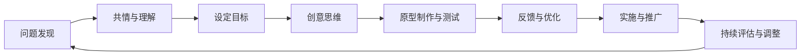

                 

### 1.1 生命设计思维工坊的概念与目的

**生命设计思维工坊**，简称D-Lab，是一种创新的人生规划和设计方法。它起源于设计思维（Design Thinking）的概念，并将其应用于个人发展和人生规划中。设计思维是一种以人为本的、迭代性的、解决方案驱动的创新方法，它强调用户需求的理解、共情、原型制作和迭代改进。

D-Lab的核心理念是通过系统化的思维方法和工具，帮助个体在面对复杂的生命课题时，能够有效地发掘自身潜能、明确目标、制定计划并付诸实践。其目标不仅是帮助人们更好地规划自己的人生，更是在这个过程中培养创新思维和解决复杂问题的能力。

**目的**：
1. **个性化的人生规划**：通过D-Lab的方法，每个人都能根据自己的兴趣、能力、价值观和愿景来制定个性化的人生规划。
2. **培养创新思维**：通过设计思维的方法，学习如何以创新的视角看待问题，并提出创造性的解决方案。
3. **提升解决复杂问题的能力**：通过实际操作和反馈迭代，提高面对复杂情境时分析和解决问题的能力。
4. **实现个人成长与幸福**：通过全面规划和不断优化，实现个人成长，提高生活质量，获得幸福感。

总的来说，D-Lab旨在通过一种系统、结构化和创造性的方法，帮助人们更好地理解自己的人生方向，并为之努力奋斗。它不仅适用于个人的职业发展，也适用于个人生活的方方面面，如家庭、健康、人际关系等。在接下来的章节中，我们将详细探讨D-Lab的核心概念、应用场景、工具和方法，并通过实际案例来展示其在人生规划中的具体应用。

### 1.2 当代人生规划的困境与需求

在当今快速变化的社会中，人生规划变得比以往任何时候都更加复杂和重要。然而，许多人在这条道路上却面临诸多困惑和挑战。以下是一些典型的困境和需求：

**1. 未来的不确定性**：随着科技的发展、行业的变革以及全球化进程的加速，人们面临着前所未有的职业和生活方式选择。这种不确定性使得许多人在规划未来时感到迷茫，不知道该选择何种道路。

**2. 信息过载**：在互联网和信息爆炸的时代，人们每天接收到的信息量巨大。如何筛选和利用这些信息来指导人生规划，成为一个巨大的挑战。

**3. 职业发展的不确定性**：传统职业路径的固定性逐渐消失，人们需要不断学习和适应新的职业环境。这种动态变化使得职业规划变得更加困难。

**4. 个人价值的实现**：许多人追求事业成功，但同时也希望能够在家庭、健康、兴趣爱好等方面获得满足。如何在多元的生活维度中找到平衡，实现个人价值的最大化，是当前的一大需求。

**5. 资源有限**：时间和精力是有限的资源，如何合理分配，以实现最大的效益，是每个人都需要面对的问题。

面对这些困境和需求，D-Lab提供了以下解决方案：

**1. 系统化思维方法**：D-Lab通过设计思维的方法，帮助个体在复杂的环境中找到清晰的方向和目标。它强调对问题的全面理解和深入分析，从而避免盲目决策。

**2. 用户中心设计**：D-Lab强调以用户需求为中心，通过共情和用户研究，确保规划的结果符合个人的真实需求。

**3. 创造性解决方案**：D-Lab鼓励个体发挥创造力，提出创新的解决方案。这种方法不仅有助于实现目标，还能够培养创新思维和解决问题的能力。

**4. 反馈迭代**：通过不断地实践和反馈，D-Lab帮助个体调整和优化规划，确保其能够适应变化，持续进步。

**5. 综合平衡**：D-Lab提供了一种系统的方法，帮助个体在职业、家庭、健康和兴趣爱好等多个维度中找到平衡，实现全面的发展和成长。

总之，D-Lab不仅解决了当代人生规划中的具体困境，还提供了一种全面、系统和创造性的方法，帮助人们更好地理解自己的人生，并为之努力奋斗。在接下来的章节中，我们将深入探讨D-Lab的具体实施方法和工具。

### 1.3 生命设计思维工坊的解决方案

**生命设计思维工坊（D-Lab）**的解决方案是建立在一个系统化、结构化的创新思维方法论之上，旨在帮助个体在面对复杂人生课题时，能够高效地制定和实现规划。以下是D-Lab的详细解决方案步骤：

**1. 问题发现**：这是D-Lab的第一步，也是至关重要的一步。通过深入访谈、用户研究、问卷调查等方法，收集大量关于个体需求和问题的信息。这一阶段的核心目标是了解用户的核心需求、痛点以及未满足的需求。

**2. 共情与理解**：基于收集到的信息，D-Lab通过共情的方式，深入理解用户的情感和心理状态。这一步骤不仅帮助我们了解用户的需求，还能够找到问题的本质，从而为后续的解决方案提供有力的支持。

**3. 设定目标**：在充分理解用户需求后，明确目标和愿景。这一阶段需要明确具体的目标和里程碑，以确保规划的可操作性和可衡量性。

**4. 创意思维**：创意思维是D-Lab的核心步骤之一。通过头脑风暴、思维导图、快速原型等方法，激发团队的创造力，提出多种可能的解决方案。

**5. 原型制作与测试**：在创意思维的基础上，快速制作原型并进行测试。这一步骤可以帮助我们验证解决方案的有效性，并通过用户的反馈进行迭代和改进。

**6. 反馈与优化**：通过用户测试和反馈，对原型进行不断的优化和迭代。这一步骤确保解决方案能够真正满足用户的需求，并且在实践中具有可行性。

**7. 实施与推广**：在优化完成后，将解决方案付诸实施，并逐步推广。在这一阶段，需要制定详细的实施计划和执行策略，以确保规划能够顺利实施。

**8. 持续评估与调整**：在实施过程中，持续评估解决方案的效果，并根据反馈进行必要的调整和优化。这一步骤确保规划能够适应变化，保持其有效性。

**具体流程图表示如下：**

通过上述步骤，D-Lab不仅提供了一种系统化的解决方案，还通过迭代和优化的方法，确保解决方案能够真正满足用户的需求，并在实践中取得成功。在接下来的章节中，我们将进一步探讨D-Lab的各个组成部分和实际应用。

### 1.4 边界与外延

**生命设计思维工坊（D-Lab）**的研究范围主要涵盖以下几个方面：

**1. 适用人群**：D-Lab适用于所有希望进行人生规划和职业发展的个体，包括学生、职场新人、职业转型者、企业家等。无论年龄、性别、职业背景，只要面对人生规划的问题，D-Lab都能够提供有效的解决方案。

**2. 适用场景**：D-Lab不仅适用于个人的职业发展，还可以应用于家庭规划、健康生活、社区建设等多个领域。无论是个人层面的规划，还是组织层面的项目，D-Lab的方法都能够提供有力的支持。

**3. 研究范围**：D-Lab的研究范围包括设计思维的理论基础、实际应用方法、工具和技术，以及在不同场景下的具体应用案例。此外，还包括对D-Lab效果的评估和优化，以及如何将其推广到更广泛的群体中。

**外延**：

**1. 与其他领域的联系**：D-Lab不仅与设计思维、创新方法等领域密切相关，还与其他学科如心理学、管理学、经济学等有着广泛的联系。通过跨学科的整合，D-Lab能够提供更加全面和深入的解决方案。

**2. 持续发展和创新**：随着社会和科技的发展，D-Lab的方法和工具也需要不断更新和优化。D-Lab鼓励研究人员和从业者不断探索新的方法和技术，以应对不断变化的需求和挑战。

**3. 国际合作与交流**：D-Lab的研究和推广不仅在国内进行，还与国际上的相关领域保持紧密的交流与合作。通过国际合作，D-Lab能够借鉴和吸收国际上的先进经验，进一步提升其应用效果和影响力。

总的来说，D-Lab不仅是一种系统化的人生规划方法，更是一种推动创新和实现个人成长的综合体系。通过明确的研究范围和外延，D-Lab能够为更多的人提供有效的支持和帮助，帮助他们在复杂多变的环境中找到清晰的方向和目标。

### 2.1 设计思维工坊的定义与属性

**设计思维工坊（Design Thinking Workshop，简称DTW）**，是一种以用户为中心的创新方法论，旨在通过系统化的流程和方法，解决复杂的问题和挑战。其核心思想是将设计者的视角扩展到用户的需求和体验，通过创造性思维和迭代实践，找到并实施可行的解决方案。

**定义**：

设计思维工坊可以定义为一种结合了设计思维理论、实践方法和工具的互动性工作坊。它通过以下四个主要阶段来实现创新的解决方案：

1. **共情（Empathize）**：理解用户的需求和感受，通过访谈、观察和用户研究等方法，获取真实的数据和信息。
2. **定义（Define）**：将收集到的信息转化为明确的问题和机会，通过头脑风暴和定义框架来明确目标和方向。
3. **构思（Ideate）**：通过头脑风暴、思维导图和原型设计等方法，激发创意，生成多种可能的解决方案。
4. **原型和测试（Prototype and Test）**：制作原型，通过迭代和测试来验证和优化解决方案，确保其符合用户需求和实际应用场景。

**属性特征**：

设计思维工坊具有以下几大属性特征：

1. **以人为本**：设计思维工坊强调以用户需求为中心，关注用户的使用体验和感受。这一属性确保了解决方案的实用性和用户满意度。
2. **迭代性**：设计思维工坊通过反复的迭代和测试，逐步优化解决方案。这种方法不仅能够提高解决方案的质量，还能够确保其符合实际需求。
3. **跨学科整合**：设计思维工坊结合了设计、工程、心理学、社会学等多个领域的知识和方法，形成了一种跨学科的综合性方法。
4. **灵活性**：设计思维工坊适用于各种类型的问题和场景，无论是产品开发、服务设计，还是社会创新项目，都能够有效应用。
5. **创造性**：设计思维工坊鼓励创意思维和创新的解决方案，通过多种工具和方法激发团队的创造力和想象力。

**与传统规划方法的对比**：

设计思维工坊与传统规划方法（如传统项目管理、财务规划等）有以下几点显著区别：

1. **重视用户体验**：设计思维工坊以用户为中心，强调用户体验和需求，而传统规划方法往往更注重技术和资源。
2. **迭代性和灵活性**：设计思维工坊通过反复迭代和测试，不断优化解决方案，而传统规划方法通常是一次性或阶段性的。
3. **跨学科整合**：设计思维工坊结合了多个学科的知识和方法，具有更强的综合性和创新性，而传统规划方法往往局限于某一特定领域。
4. **创造性**：设计思维工坊鼓励创意思维和创新的解决方案，而传统规划方法通常遵循既定的流程和规则。

**核心要素**：

设计思维工坊的核心要素包括以下几个部分：

1. **用户研究**：通过访谈、观察、问卷调查等方法，深入了解用户的需求和行为，获取真实的数据和信息。
2. **头脑风暴**：通过集体头脑风暴，激发创意思维，生成多种可能的解决方案。
3. **思维导图**：使用思维导图来组织和梳理创意，确保解决方案的全面性和逻辑性。
4. **原型设计**：快速制作原型，通过用户测试和反馈，验证和优化解决方案。
5. **迭代和测试**：通过反复的迭代和测试，逐步优化解决方案，确保其符合用户需求和实际应用场景。

总的来说，设计思维工坊提供了一种系统化、结构化和创造性的方法，帮助个体和组织在面对复杂问题时，能够高效地制定和实现解决方案。其以人为本、迭代性、跨学科整合和创造性等特性，使其在当今快速变化的社会中具有广泛的应用前景。

### 2.1.1 设计思维工坊的基本概念

设计思维工坊（Design Thinking Workshop，简称DTW）是一种以人为本、迭代性强的创新方法论，它起源于设计学科，并在过去几十年中逐渐发展为一个广泛应用于各个领域的综合性方法。其核心思想是通过理解用户需求、激发创意思维、构建原型和不断迭代，最终实现创新的解决方案。

**起源与发展**：

设计思维最初由设计师唐·诺曼（Donald Norman）在1980年代提出，他主张设计师应该关注产品的可用性和用户体验。随后，斯坦福大学设计学院教授大卫·凯利（David Kelley）等人进一步发展了这一概念，并将其应用于商业和管理领域，形成了现在广泛认可的设计思维方法论。

设计思维工坊则是在这一基础上发展起来的一种实践性工作坊，它将设计思维的理论和方法通过一系列结构化的步骤和工具，转化为可操作的实践过程。

**核心组成部分**：

设计思维工坊主要包括以下四个核心阶段：

1. **共情（Empathize）**：这是设计思维的第一步，也是最重要的一步。共情的目的是深入了解用户的需求、行为和情感，从而建立起对用户的深刻理解。具体方法包括用户访谈、观察、问卷调查等。

2. **定义（Define）**：在共情阶段结束后，需要将收集到的用户数据和信息进行整理和定义，明确问题或机会所在。这一步骤通常通过头脑风暴、定义框架和问题陈述等方式实现。

3. **构思（Ideate）**：在明确了问题和机会后，接下来是构思阶段。这一阶段的核心任务是激发创意思维，生成多种可能的解决方案。常用的方法包括头脑风暴、思维导图、快速原型设计等。

4. **原型和测试（Prototype and Test）**：构思阶段完成后，需要制作原型并进行测试，以验证和优化解决方案。这一步骤通过迭代和反馈，逐步改进原型，确保其满足用户需求。

**与设计思维的联系**：

设计思维工坊是设计思维的具体应用形式，它继承了设计思维的核心原则和方法，但更加注重实际操作和落地。设计思维关注的是解决问题的过程，而设计思维工坊则提供了具体的操作步骤和工具，使设计思维能够更加高效地应用于实际问题。

**区别与优势**：

与设计思维相比，设计思维工坊具有以下优势：

1. **结构化**：设计思维工坊提供了一套明确的步骤和工具，使设计过程更加系统和可操作。
2. **互动性**：设计思维工坊通常以工作坊的形式进行，强调集体协作和互动，有助于激发创意和产生更多的创新点。
3. **实践性**：设计思维工坊注重实际操作和原型制作，通过不断的迭代和测试，确保解决方案的有效性和可行性。

**适用范围**：

设计思维工坊不仅适用于产品设计和服务设计，还可以广泛应用于教育、医疗、企业战略、社会创新等多个领域。无论面对何种复杂问题，设计思维工坊都能够提供有效的解决方案。

**总结**：

设计思维工坊是一种以人为本、迭代性强、结构化的创新方法论，通过系统化的步骤和工具，帮助个体和组织在面对复杂问题时，能够高效地制定和实现解决方案。其以人为本、实践性和互动性的特点，使其在当今快速变化的社会中具有广泛的应用前景。

### 2.1.2 设计思维工坊与传统规划的对比

设计思维工坊（Design Thinking Workshop，简称DTW）与传统规划方法相比，在多个方面有着显著的差异。以下是通过表格和具体案例展示这两种方法的对比：

| 对比维度 | 设计思维工坊 | 传统规划方法 |
| :---: | :---: | :---: |
| **核心理念** | 以用户为中心，关注用户体验和需求 | 以目标和成果为导向，强调实现预定目标 |
| **方法步骤** | 包括共情、定义、构思和原型测试四个阶段 | 通常包括需求分析、计划制定、执行和控制三个阶段 |
| **灵活性** | 强调迭代和反馈，持续优化解决方案 | 通常具有明确的时间节点和固定流程，灵活性较低 |
| **协作方式** | 强调集体协作和跨学科整合 | 多数情况下以个体工作为主，团队合作较为少见 |
| **适用范围** | 广泛应用于产品开发、服务设计、教育、医疗等领域 | 主要应用于项目管理、财务规划、市场策划等领域 |
| **工具与技术** | 头脑风暴、思维导图、用户研究、快速原型等 | 财务分析、市场调研、项目计划表等 |
| **案例对比** | 

- **设计思维工坊案例**：某公司希望通过设计思维工坊改进其产品用户体验。团队首先通过用户访谈和观察，了解用户的需求和痛点，然后进行头脑风暴，提出多种改进方案，最终通过原型设计和用户测试，找到最优方案。

- **传统规划方法案例**：某企业计划进行市场推广活动。首先进行市场调研，分析竞争对手和市场需求，然后制定详细的推广计划和预算，最后按照计划执行并监控效果。

| **优缺点** | 设计思维工坊 | 传统规划方法 |
| :---: | :---: | :---: |
| **优点** | 
- 强调用户需求和用户体验
- 灵活性高，能适应变化
- 激发创新思维，提高问题解决能力
- 促进跨学科合作和集体智慧 |
| 
- 系统性较强，可操作性强
- 目标明确，执行过程可控
- 有助于实现短期和长期的规划目标 |

| **缺点** | 设计思维工坊 | 传统规划方法 |
| :---: | :---: | :---: |
| 
- 对用户需求的深入理解要求高，前期投入较大
- 过程较长，决策和执行速度可能较慢
- 对团队成员的创造力和协作能力有较高要求 |
| 
- 可能因过于依赖用户需求而忽视技术实现的可能性
- 过于注重短期目标和经济效益，可能忽视长期发展
- 过程中可能缺乏灵活性，难以应对突发变化 |

总的来说，设计思维工坊和传统规划方法各有优势和不足，适用于不同的场景和需求。设计思维工坊更适合需要创新和灵活性的项目，而传统规划方法则在确保目标和计划执行方面更具优势。在实际应用中，可以根据具体情况选择合适的方法，或结合两者以实现最佳效果。

### 2.1.3 设计思维工坊的核心要素

设计思维工坊（Design Thinking Workshop，简称DTW）作为一种系统化、结构化的创新方法论，其成功实施依赖于几个关键要素。以下是设计思维工坊的核心组成部分及其重要性：

**1. 共情（Empathize）**：
共情是设计思维工坊的基础阶段，主要通过用户研究、访谈、观察等方式，深入理解用户的需求、行为和情感。共情阶段的重要性在于，它帮助团队建立起对用户深刻而真实的理解，从而为后续的设计和开发工作提供准确的依据。例如，在进行一个新产品的设计时，团队需要通过用户访谈和观察，了解用户的具体需求和使用场景，以便设计出真正符合用户期望的产品。

**2. 定义（Define）**：
在共情阶段结束后，定义阶段将收集到的用户数据和信息进行整理和归纳，明确问题和机会。定义阶段的核心工作是形成问题陈述和目标，为后续的创意构思和原型制作提供清晰的指引。这一阶段的重要性在于，它确保团队在解决问题时始终保持焦点，避免偏离用户需求。例如，在一个服务设计项目中，团队需要明确用户面临的具体问题，并定义项目的目标，以便在设计和开发过程中始终围绕核心问题进行工作。

**3. 构思（Ideate）**：
构思阶段是设计思维工坊的创意爆发阶段，通过头脑风暴、思维导图、快速原型等方法，激发团队的创造力和想象力，生成多种可能的解决方案。构思阶段的重要性在于，它为团队提供了丰富的创意来源，并为后续的原型制作和测试奠定了基础。例如，在开发一个新型医疗设备时，团队可以通过头脑风暴和思维导图，提出各种创新的设计方案，并快速制作原型，进行用户测试和反馈。

**4. 原型和测试（Prototype and Test）**：
原型和测试阶段是将创意转化为实际可操作的解决方案的关键步骤。通过快速原型制作和用户测试，团队可以验证和优化设计方案，确保其满足用户需求。这一阶段的重要性在于，它通过反复的迭代和反馈，不断改进和优化解决方案，提高其可行性和用户体验。例如，在一个移动应用开发项目中，团队可以通过制作原型，邀请用户进行测试，并根据用户反馈进行调整和优化，确保最终产品的用户体验达到最佳。

**5. 迭代（Iterate）**：
迭代是设计思维工坊的核心原则之一，强调通过不断的迭代和优化，逐步实现最终目标。迭代阶段的重要性在于，它确保团队在解决问题的过程中，能够灵活应对变化，持续改进解决方案。例如，在开发一个复杂的软件系统时，团队需要通过持续的迭代，不断修复bug、优化功能，确保系统稳定和高效。

**总结**：

设计思维工坊的核心要素包括共情、定义、构思、原型和测试以及迭代。这些要素相互关联、相辅相成，共同构成了一个系统化、结构化的创新方法论。通过这些核心要素的合理运用，团队可以更有效地解决复杂问题，实现创新的解决方案。在具体应用中，这些要素需要根据项目的具体情况和需求进行调整和优化，以实现最佳效果。

### 3.1 设计思维工坊的应用场景

设计思维工坊（Design Thinking Workshop，简称DTW）作为一种系统化、以用户为中心的创新方法论，可以应用于多个不同的场景。以下是一些典型的应用场景及其特点：

**1. 产品设计**：

在产品设计领域，设计思维工坊被广泛应用于从概念验证到产品发布的整个开发过程。通过共情、定义、构思和原型测试等步骤，设计师能够深入了解用户需求，提出创新的设计方案，并通过迭代优化，确保产品能够真正满足用户期望。

**案例**：某公司开发了一款智能家居设备。团队通过用户访谈和观察，了解了用户对智能家居的需求和痛点，然后通过头脑风暴和思维导图，提出了多个设计方案。通过快速原型制作和用户测试，团队不断调整和优化产品，最终成功推出了一款深受用户欢迎的产品。

**2. 服务设计**：

在服务设计领域，设计思维工坊有助于创建以用户为中心的服务体系。通过深入了解用户的使用场景和需求，服务设计者能够设计出更加人性化、高效的服务流程和体验。

**案例**：某金融机构希望通过设计思维工坊改善其客户服务流程。团队通过用户访谈和观察，发现了客户在办理业务时的痛点，然后提出了多个改进方案。通过原型设计和用户测试，团队最终实施了一系列优化措施，显著提升了客户满意度。

**3. 教育创新**：

在教育领域，设计思维工坊可以帮助教育工作者和设计师设计出更加符合学生需求的教学方法和工具。通过共情和用户研究，教育者能够更好地理解学生的需求和兴趣，从而开发出创新的教学内容和方法。

**案例**：某教育科技公司希望通过设计思维工坊开发一款教育游戏。团队通过与学生互动和观察，了解了学生的学习习惯和兴趣点，然后通过头脑风暴和原型设计，开发出了一款受欢迎的教育游戏，提高了学生的学习兴趣和效果。

**4. 医疗保健**：

在医疗保健领域，设计思维工坊可以帮助医疗工作者设计出更加人性化、高效的医疗服务和系统。通过深入了解患者和医护人员的需求，设计者能够提出创新的治疗方案和服务流程。

**案例**：某医疗设备公司希望通过设计思维工坊改进其医疗设备的使用体验。团队通过用户访谈和观察，了解了医护人员在使用设备时的痛点，然后通过快速原型设计和用户测试，提出了一系列改进措施，显著提升了设备的使用效率和用户体验。

**5. 企业战略**：

在企业战略规划中，设计思维工坊可以帮助企业领导者识别市场机会、创新产品和服务。通过共情和用户研究，企业能够更好地理解市场需求，制定更具前瞻性和竞争力的战略。

**案例**：某消费品公司希望通过设计思维工坊开发一款新型产品。团队通过市场调研和用户访谈，了解了消费者的需求和偏好，然后通过头脑风暴和原型设计，开发出了一款深受市场欢迎的产品，提升了企业的市场竞争力。

**总结**：

设计思维工坊在多个领域的应用场景中，都能够发挥其独特的优势，帮助团队更好地理解用户需求，提出创新的解决方案，并通过迭代和优化，确保最终解决方案能够真正满足用户需求。无论是在产品设计、服务设计、教育创新、医疗保健还是企业战略等领域，设计思维工坊都提供了有效的工具和方法，推动创新和改进，实现更高的用户满意度和市场竞争力。

### 3.2 设计思维工坊的优势

设计思维工坊（Design Thinking Workshop，简称DTW）在解决复杂问题和推动创新方面具有显著的优势。以下是其相对于传统规划方法的独特优势和实际应用中的效果：

**1. 强调用户需求**：

设计思维工坊的核心在于以用户需求为中心。通过深入的用户研究和共情，团队能够准确把握用户的需求、行为和情感，从而设计出真正满足用户期望的产品和服务。这种用户导向的方法不仅提高了解决方案的用户满意度，还减少了因脱离用户需求而导致的设计失误。例如，在产品开发中，通过用户访谈和观察，设计团队能够发现用户在实际使用中的痛点，从而提出更有效的改进方案。

**2. 强调迭代和反馈**：

设计思维工坊强调通过不断的迭代和反馈来优化解决方案。这种方法能够确保团队在设计和开发过程中能够灵活应对变化，及时调整和改进方案，从而提高解决方案的可行性和实用性。相比之下，传统规划方法通常具有固定的时间节点和流程，缺乏灵活性，难以适应不断变化的需求和环境。例如，在一个服务设计项目中，通过不断的原型测试和用户反馈，团队可以逐步优化服务流程，提高用户的满意度和体验。

**3. 激发创新思维**：

设计思维工坊通过多种工具和方法，如头脑风暴、思维导图、快速原型设计等，激发团队的创造力和想象力。这种方法不仅能够生成多种可能的解决方案，还能够帮助团队从不同的角度思考问题，找到创新的解决方案。相比之下，传统规划方法往往依赖于现有的知识和经验，缺乏创新性。例如，在开发一个新型医疗设备时，通过头脑风暴和快速原型设计，团队能够提出多种创新的设计方案，并通过用户测试和反馈，选择最优方案。

**4. 促进跨学科合作**：

设计思维工坊强调跨学科的合作和整合，将设计、工程、心理学、社会学等多个领域的知识和方法相结合，形成了一种综合性、系统化的创新方法论。这种跨学科的合作不仅能够充分利用各领域的专业知识和技能，还能够产生更多的创新点和解决方案。相比之下，传统规划方法往往局限于某一特定领域，缺乏跨学科的整合。例如，在一个教育创新项目中，通过跨学科的合作，教育者、设计师和技术专家能够共同提出创新的教学方法和工具，提高教育效果。

**5. 提高问题解决能力**：

设计思维工坊通过系统化的流程和方法，培养团队在面对复杂问题时分析和解决的能力。这种方法不仅能够提高团队成员的创新能力，还能够培养他们的批判性思维和团队合作精神。相比之下，传统规划方法通常依赖于单一的解决方案，缺乏系统性和综合性。例如，在一个复杂的工程项目中，通过设计思维工坊的迭代和优化过程，团队能够逐步解决项目中的各种难题，确保项目的成功实施。

**实际应用效果**：

在实际应用中，设计思维工坊已经展示了其显著的优势。以下是一些实际应用效果：

- **提高用户满意度**：通过深入的用户研究和持续迭代，设计思维工坊能够确保解决方案真正满足用户需求，从而提高用户满意度。
- **缩短开发周期**：通过快速原型设计和迭代优化，设计思维工坊能够缩短产品开发和上市的时间，提高市场响应速度。
- **增加创新性**：设计思维工坊通过激发团队的创造力和想象力，产生更多的创新点和解决方案，推动产品的差异化竞争。
- **提高团队协作能力**：设计思维工坊强调跨学科合作和团队合作，提高了团队成员之间的沟通和协作能力，促进了团队的凝聚力和创造力。

**总结**：

设计思维工坊在解决复杂问题和推动创新方面具有显著的优势，相对于传统规划方法，它更加强调用户需求、迭代和反馈、创新思维、跨学科合作和问题解决能力。这些优势使得设计思维工坊在多个领域都取得了显著的成效，成为推动创新和改进的重要工具。

### 3.3 设计思维工坊的挑战与应对策略

尽管设计思维工坊（Design Thinking Workshop，简称DTW）在解决复杂问题和推动创新方面具有显著优势，但在实际应用过程中，也面临着一些挑战。以下是一些主要挑战及应对策略：

**1. 用户需求的复杂性**：

设计思维工坊的核心在于理解用户需求，但用户的需求往往复杂且多变，特别是在涉及多个利益相关方时。应对策略：

- **多渠道用户研究**：通过多渠道的用户研究，如访谈、观察、问卷调查等，收集全面、深入的用户数据，确保对用户需求的准确理解。
- **持续用户参与**：在设计和开发过程中，持续邀请用户参与，通过反馈和迭代，确保解决方案始终符合用户需求。

**2. 资源和时间限制**：

设计思维工坊的迭代和反馈过程需要大量时间和资源。在资源有限的情况下，团队可能会面临压力。应对策略：

- **优先级排序**：明确项目目标和优先级，集中资源和时间解决关键问题，确保最重要的需求得到满足。
- **敏捷方法**：采用敏捷开发方法，通过短周期的迭代和测试，快速验证和优化解决方案，提高效率和资源利用率。

**3. 团队协作和沟通**：

设计思维工坊强调跨学科合作和团队协作，但团队协作和沟通中的挑战可能会影响项目进展。应对策略：

- **建立有效的沟通机制**：定期召开团队会议，分享进展和问题，确保团队成员之间的沟通畅通。
- **培训和能力建设**：对团队成员进行设计思维和团队合作方面的培训，提高协作能力和沟通效率。

**4. 创新思维的激发**：

设计思维工坊依赖于团队的创造力，但并非所有团队成员都具备创新的思维能力。应对策略：

- **多元化团队**：组建包含不同专业背景和经验多样化的团队，充分利用不同视角和思维方式。
- **鼓励创新**：创造一个鼓励创新和试错的环境，让团队成员敢于提出新颖的想法，并通过讨论和迭代，优化这些想法。

**5. 确保解决方案的可行性**：

在快速迭代和优化过程中，可能会出现解决方案与实际情况不符的情况。应对策略：

- **原型设计和测试**：通过原型设计和用户测试，尽早发现和解决潜在问题，确保解决方案的实际可行性。
- **持续评估和调整**：在实施过程中，持续评估解决方案的效果，并根据反馈进行必要的调整和优化。

**总结**：

设计思维工坊在实际应用中面临的主要挑战包括用户需求的复杂性、资源和时间限制、团队协作和沟通、创新思维的激发以及解决方案的可行性。通过采取多渠道用户研究、敏捷方法、多元化团队、鼓励创新和原型设计等应对策略，团队可以克服这些挑战，确保设计思维工坊的有效实施，从而实现创新和改进的目标。

### 4.1 创新方法概述

创新方法在设计和开发过程中扮演着至关重要的角色，能够帮助团队突破传统思维模式，找到独特的解决方案。以下是几种常见创新方法的概述：

**1. 头脑风暴**：

头脑风暴是一种激发创意和生成想法的常用方法。它通过在一个不受限制的环境下，让团队成员自由地提出各种可能的解决方案，从而打破思维定势，产生创新的点子。

**优势**：

- **快速生成大量想法**：头脑风暴能够在短时间内产生大量的创意和方案，为后续筛选和优化提供丰富的素材。
- **激发集体智慧**：通过团队协作，每个人的视角和经验都能够得到充分利用，从而产生更全面和创新的解决方案。

**适用场景**：

- **问题解决**：用于解决各种复杂问题，如产品设计中的功能优化、服务流程的创新等。
- **创意构思**：在项目的初期阶段，用于快速产生多种可能的解决方案。

**2. 用户研究**：

用户研究是设计思维中不可或缺的一环，通过深入了解用户的需求、行为和情感，设计团队能够为解决方案提供准确的基础。

**优势**：

- **基于实际需求**：用户研究能够确保设计方案符合实际用户需求，从而提高用户满意度和接受度。
- **减少风险**：通过提前识别和解决潜在问题，用户研究能够减少项目开发过程中出现意外的风险。

**适用场景**：

- **产品开发**：用于理解用户行为和需求，指导产品的设计和功能规划。
- **服务设计**：用于优化服务流程和用户体验，确保服务能够满足用户期望。

**3. 快速原型设计**：

快速原型设计是一种通过制作简易模型来测试和验证创意的方法。它可以帮助团队快速验证设计思路，并及时调整和优化方案。

**优势**：

- **快速迭代**：原型设计允许团队在短时间内进行多次迭代，快速验证和优化设计。
- **低成本**：通过使用简易的模型和工具，快速原型设计能够以较低的成本验证创意。

**适用场景**：

- **初期验证**：在项目初期，用于验证设计思路和功能实现的可能性。
- **用户测试**：在项目中期，用于收集用户反馈，指导后续设计和开发。

**4. 思维导图**：

思维导图是一种通过图形化的方式组织和呈现想法的工具，它能够帮助团队清晰地梳理思路，发现潜在的创新点和关联。

**优势**：

- **可视化**：通过图形化的方式呈现信息，使复杂的概念和关系更加直观和易于理解。
- **激发创意**：思维导图能够帮助团队从不同角度思考问题，发现新的创新点和解决方案。

**适用场景**：

- **创意构思**：在项目初期，用于生成和整理创意。
- **团队协作**：在项目过程中，用于团队内部的沟通和协作。

**5. 演绎与归纳**：

演绎与归纳是两种常用的逻辑方法，演绎从一般原理推导出特定结论，而归纳则从具体实例中总结出一般性规律。

**优势**：

- **逻辑严谨**：演绎和归纳方法能够帮助团队建立严谨的逻辑框架，确保解决方案的合理性和可行性。
- **系统化**：通过演绎和归纳，团队能够系统地分析和解决问题。

**适用场景**：

- **问题解决**：用于分析复杂问题，找到解决方案。
- **项目规划**：用于制定项目计划和目标。

**总结**：

以上创新方法各具特色，通过合理运用这些方法，团队可以激发创意、验证设计思路、优化解决方案，从而在设计和开发过程中取得更好的效果。在不同的项目和应用场景中，可以根据具体情况选择合适的创新方法，以提高创新效率和解决方案的质量。

### 4.2 创新工具介绍

在设计和实施设计思维工坊时，使用合适的工具能够大大提升工作效率和创造力。以下是一些常用的创新工具，包括设计思维工具、数据分析工具和原型制作工具。

**1. 设计思维工具**

**思维导图（Mind Mapping）**：

思维导图是一种通过图形化的方式组织和呈现想法的工具，它能够帮助团队从不同角度思考问题，发现潜在的创新点和关联。

**优势**：

- **可视化**：通过图形化的方式呈现信息，使复杂的概念和关系更加直观和易于理解。
- **激发创意**：思维导图能够帮助团队从不同角度思考问题，发现新的创新点和解决方案。

**适用场景**：

- **创意构思**：在项目初期，用于生成和整理创意。
- **团队协作**：在项目过程中，用于团队内部的沟通和协作。

**用户研究工具（User Research Tools）**：

用户研究工具用于收集和分析用户行为和需求，以下是一些常用的用户研究工具：

- **SurveyMonkey**：一款在线问卷调查工具，能够快速创建、发送和分析问卷。
- **Qualtrics**：一款功能强大的调查和数据分析平台，适用于复杂的研究项目。
- **UsabilityHub**：提供快速的用户测试和反馈功能，帮助团队了解用户对设计的反应。

**优势**：

- **基于数据的决策**：通过用户研究工具，团队能够基于实际数据做出更加科学的决策。
- **广泛适用**：用户研究工具适用于各种类型的项目，无论规模大小。

**适用场景**：

- **产品开发**：用于理解用户行为和需求，指导产品的设计和功能规划。
- **服务设计**：用于优化服务流程和用户体验，确保服务能够满足用户期望。

**2. 数据分析工具**

**Tableau**：

Tableau 是一款强大的数据分析工具，能够将大量数据可视化，帮助团队直观地理解和分析数据。

**优势**：

- **数据可视化**：通过图表、仪表板等可视化形式，使数据更加直观易懂。
- **交互式分析**：支持用户与数据的交互，便于深入分析和发现趋势。

**适用场景**：

- **数据驱动决策**：用于分析和理解业务数据，支持数据驱动的决策。
- **项目评估**：用于评估项目效果和进展，提供数据支持。

**Google Analytics**：

Google Analytics 是一款免费的网站分析工具，用于跟踪和分析网站用户的行为和互动。

**优势**：

- **功能全面**：提供丰富的分析功能，包括流量来源、用户行为、转化率等。
- **实时数据**：支持实时数据跟踪和分析，帮助团队快速响应变化。

**适用场景**：

- **网站优化**：用于优化网站设计和内容，提高用户体验和转化率。
- **营销策略**：用于分析营销活动的效果，优化营销策略。

**3. 原型制作工具**

**Figma**：

Figma 是一款在线原型设计工具，支持多人协作，适用于创建高质量的原型和设计文档。

**优势**：

- **实时协作**：支持团队成员实时协作，提高设计效率。
- **用户体验**：提供丰富的交互和视觉效果，使原型更加逼真。

**适用场景**：

- **原型设计**：用于创建产品原型和用户界面设计。
- **团队协作**：在团队内部进行设计讨论和协作。

**Axure RP**：

Axure RP 是一款专业的原型设计工具，提供丰富的原型设计和交互功能，适用于复杂的交互设计和文档生成。

**优势**：

- **功能强大**：提供多种原型设计和交互功能，满足复杂需求。
- **文档生成**：支持自动生成设计文档，提高工作效率。

**适用场景**：

- **交互设计**：用于创建复杂的交互设计和用户界面。
- **项目文档**：用于生成详细的设计文档和规格说明。

**总结**：

设计思维工坊中使用的工具多种多样，不同的工具在不同的环节和场景下发挥不同的作用。通过合理选择和使用这些工具，团队可以更有效地进行设计思维和项目实施，提高创新效率和解决方案的质量。

### 5.1 案例一：人生规划的实际应用

**背景**：

小明是一名年轻的职场新人，刚刚进入一家互联网公司工作。面对繁忙的工作和未来的职业规划，他感到有些迷茫。他希望能够通过某种方法，系统地规划自己的职业生涯，确保自己在未来的职业道路上更加顺利和成功。

**设计思维工坊的实施过程**：

1. **问题发现**：
   - **用户访谈**：小明通过与几位同事和前辈的访谈，了解了他们在职业生涯规划方面的经验和建议。
   - **自我反思**：小明回顾了自己的工作经历，分析了自身的优势和不足。

2. **共情与理解**：
   - **用户需求分析**：通过访谈和自我反思，小明明确了自身在职业发展方面的需求，包括技能提升、职业晋升和职业规划等。
   - **情感理解**：小明意识到，在职业发展的过程中，平衡工作和生活，保持身心健康也是他需要关注的重要方面。

3. **定义**：
   - **问题陈述**：小明将上述分析结果整理成一份问题陈述，明确了自己需要解决的职业发展问题。
   - **目标设定**：小明设定了短期和长期目标，包括提升专业技能、晋升为团队主管和实现工作与生活的平衡等。

4. **构思**：
   - **头脑风暴**：小明和他的职业导师一起进行了头脑风暴，提出了多种可能的职业发展路径和解决方案。
   - **思维导图**：通过绘制思维导图，小明将各种可能的解决方案进行了组织和梳理。

5. **原型和测试**：
   - **职业规划原型**：小明根据头脑风暴的结果，制作了一份职业规划原型，包括职业发展路径、技能提升计划和工作生活平衡策略等。
   - **用户测试**：小明与职业导师和几位同事进行了原型测试，根据反馈对规划进行了调整和优化。

6. **反馈与优化**：
   - **迭代优化**：根据用户测试的反馈，小明对职业规划原型进行了多次迭代和优化。
   - **最终确定**：在多次迭代后，小明确定了最终的职业规划方案，并制定了详细的实施计划。

**效果分析**：

通过设计思维工坊的应用，小明实现了以下效果：

1. **明确的职业规划**：小明通过共情和用户研究，明确了自身的职业发展需求和目标，制定了详细的职业规划方案。
2. **提升专业技能**：小明根据职业规划，制定了技能提升计划，通过参加培训和自学，不断提升自己的专业技能。
3. **职业晋升**：在职业规划的实施过程中，小明逐步实现了职业晋升，从普通员工晋升为团队主管。
4. **工作与生活平衡**：通过调整工作计划和安排，小明在繁忙的工作中找到了平衡点，保持了身心健康。

**总结**：

小明通过设计思维工坊的方法，成功地规划了自己的职业生涯。这不仅帮助他在职业发展上取得了显著成果，还提高了他的工作效率和生活质量。这一案例展示了设计思维工坊在人生规划中的实际应用效果，为更多人提供了参考和借鉴。

### 5.2 案例二：职业生涯规划的具体实践

**背景**：

小王是一名有着10年工作经验的软件工程师，目前在一家中型互联网公司工作。随着公司业务的不断扩张，他意识到自己需要进一步明确职业发展方向，提升自己的专业技能和领导能力，以更好地应对未来的挑战。因此，小王决定通过职业生涯规划的具体实践，为自己制定一个清晰的发展路径。

**设计思维工坊的实施过程**：

1. **问题发现**：
   - **自我评估**：小王通过自我评估工具，分析了自身的技能、优势和职业兴趣。
   - **市场调研**：小王通过查阅行业报告和与同行交流，了解了当前市场上的技术趋势和需求。

2. **共情与理解**：
   - **用户需求分析**：小王明确了自身在职业发展中的需求和目标，包括技术能力提升、领导力培养和职业转型等。
   - **情感理解**：小王认识到，职业生涯规划不仅仅是为了实现职业目标，还需要考虑个人兴趣和生活质量。

3. **定义**：
   - **问题陈述**：小王将自身的需求和目标整理成问题陈述，明确了自己需要解决的问题和目标。
   - **目标设定**：小王设定了短期、中期和长期目标，包括提升技术能力、领导力和实现职业转型。

4. **构思**：
   - **头脑风暴**：小王和他的导师一起进行了头脑风暴，探讨了多种可能的职业发展路径和解决方案。
   - **思维导图**：通过绘制思维导图，小王将各种可能的解决方案进行了组织和梳理。

5. **原型和测试**：
   - **职业规划原型**：小王根据头脑风暴的结果，制定了一份详细的职业规划原型，包括技能提升计划、领导力培养方案和职业转型策略等。
   - **用户测试**：小王与导师和几位同事进行了原型测试，收集了他们的反馈和建议。

6. **反馈与优化**：
   - **迭代优化**：根据用户测试的反馈，小王对职业规划原型进行了多次迭代和优化。
   - **最终确定**：在多次迭代后，小王确定了最终的职业规划方案，并制定了详细的实施计划。

**效果分析**：

通过设计思维工坊的具体实践，小王实现了以下效果：

1. **清晰的职业规划**：小王通过共情和用户研究，明确了自身的职业发展需求和目标，制定了详细的职业规划方案。
2. **技能提升**：小王按照职业规划，积极参加技术培训，学习新技术，不断提升自己的专业技能。
3. **领导力培养**：通过参与公司内部培训和担任项目负责人，小王逐步培养了领导力和管理能力。
4. **职业转型**：在职业规划的实施过程中，小王成功实现了职业转型，从软件工程师晋升为技术经理。

**总结**：

小王通过设计思维工坊的方法，成功地规划了自己的职业生涯。这不仅帮助他在职业发展上取得了显著成果，还提升了他的专业技能和领导能力。这一案例展示了设计思维工坊在职业生涯规划中的具体应用效果，为更多职场人士提供了有益的参考。

### 5.3 案例三：创业项目的策划与实施

**背景**：

小张是一位具有丰富技术背景的创业者，他看到了市场对智能家居解决方案的需求，决定创立一家专注于智能家居产品开发的公司。然而，面对市场竞争和资源限制，他意识到需要一个系统化的方法来策划和实施创业项目，以确保项目的成功。

**设计思维工坊的实施过程**：

1. **问题发现**：
   - **市场调研**：小张通过市场调研，了解了智能家居市场的现状、潜在客户的需求和竞争对手的情况。
   - **用户访谈**：小张与潜在客户进行了深入访谈，了解了他们对智能家居产品的期望和痛点。

2. **共情与理解**：
   - **用户需求分析**：小张明确了潜在客户在智能家居方面的需求和期望，分析了市场趋势和竞争格局。
   - **情感理解**：小张意识到，智能家居产品不仅要满足功能需求，还要提供良好的用户体验。

3. **定义**：
   - **问题陈述**：小张将市场需求和用户需求整理成问题陈述，明确了自己需要解决的问题和目标。
   - **目标设定**：小张设定了短期和长期目标，包括开发具有竞争力的智能家居产品、建立品牌和拓展市场。

4. **构思**：
   - **头脑风暴**：小张和他的团队一起进行了头脑风暴，提出了多种可能的解决方案和产品概念。
   - **思维导图**：通过绘制思维导图，小张将各种可能的解决方案和产品概念进行了组织和梳理。

5. **原型和测试**：
   - **产品原型**：小张的团队制作了智能家居产品的原型，包括功能演示和用户体验设计。
   - **用户测试**：小张邀请了潜在客户进行产品测试，收集了他们的反馈和建议。

6. **反馈与优化**：
   - **迭代优化**：根据用户测试的反馈，小张对产品原型进行了多次迭代和优化。
   - **最终确定**：在多次迭代后，小张确定了最终的产品设计和开发计划。

**效果分析**：

通过设计思维工坊的应用，小张实现了以下效果：

1. **明确的产品定位**：小张通过共情和用户研究，明确了智能家居产品的市场定位和目标客户群体。
2. **创新的产品设计**：小张的团队通过头脑风暴和快速原型设计，提出了一系列创新的产品设计方案，提高了产品的竞争力。
3. **用户体验优化**：通过用户测试和反馈，小张不断优化产品设计，确保产品能够提供良好的用户体验。
4. **市场拓展**：在产品开发完成后，小张通过市场推广和品牌建设，成功打开了市场，实现了公司的初步成功。

**总结**：

小张通过设计思维工坊的方法，成功地策划和实施了创业项目，展示了设计思维工坊在创业项目中的应用价值。这一案例为其他创业者提供了宝贵的经验和借鉴，证明了设计思维工坊在创业过程中的重要作用。

### 6.1 最佳实践

在设计思维工坊（Design Thinking Workshop，简称DTW）的实际应用过程中，积累了一些成功经验和方法，这些最佳实践可以帮助团队更有效地应用D-Lab，实现预期的目标和效果。

**1. 强调用户研究的重要性**：

在D-Lab的过程中，用户研究是至关重要的一步。通过深入的用户研究，团队能够准确把握用户的需求、行为和痛点，从而确保解决方案的实用性和用户满意度。以下是一些用户研究的最佳实践：

- **多渠道收集数据**：结合访谈、观察、问卷调查、用户测试等多种方法，全面收集用户数据。
- **持续进行用户研究**：在项目不同阶段，持续进行用户研究，确保设计方案始终符合用户需求。
- **定量与定性结合**：定量数据提供宏观的用户趋势，定性数据提供微观的用户体验，两者结合可以更全面地理解用户。

**2. 促进团队协作和跨学科整合**：

D-Lab强调跨学科合作，充分利用不同领域的知识和技能，从而产生更多的创新点和解决方案。以下是一些促进团队协作和跨学科整合的最佳实践：

- **组建多元化团队**：团队成员应涵盖不同背景和专业知识，如设计、工程、市场、心理学等。
- **定期召开团队会议**：通过定期召开团队会议，分享进展、问题和解决方案，确保团队成员之间的沟通畅通。
- **提供跨学科培训**：为团队成员提供跨学科培训，提高他们的协作能力和创新思维。

**3. 快速原型设计和迭代**：

快速原型设计和迭代是D-Lab的核心原则之一。通过快速原型设计和用户测试，团队能够快速验证和优化设计方案，提高解决方案的质量和可行性。以下是一些快速原型设计和迭代的最佳实践：

- **采用敏捷开发方法**：通过短周期的迭代和测试，快速验证和优化设计方案。
- **使用简易原型工具**：如Sketch、Figma等，可以快速制作原型，降低设计和开发成本。
- **用户测试与反馈**：通过用户测试和反馈，不断调整和优化原型，确保解决方案满足用户需求。

**4. 鼓励创新和试错**：

D-Lab鼓励团队成员发挥创造力，提出创新的解决方案，并在实践中不断尝试和优化。以下是一些鼓励创新和试错的最佳实践：

- **创建一个安全的环境**：让团队成员敢于提出新颖的想法，并接受失败，从而激发创新思维。
- **奖励创新行为**：通过奖励机制，鼓励团队成员积极参与创新活动，提出更多的创新点子。
- **快速学习和调整**：通过快速学习和调整，团队能够及时响应变化，不断优化解决方案。

**5. 确保解决方案的可行性和可执行性**：

在D-Lab的过程中，确保解决方案的可行性和可执行性至关重要。以下是一些最佳实践：

- **技术可行性评估**：在早期阶段进行技术可行性评估，确保解决方案在技术上可行。
- **资源规划**：合理规划项目资源和时间，确保项目能够按计划顺利进行。
- **实施和监控**：在实施过程中，持续监控项目的进展和效果，并根据实际情况进行必要的调整。

**总结**：

通过以上最佳实践，团队可以更有效地应用D-Lab的方法，实现创新和改进的目标。这些实践不仅提高了项目成功率，还培养了团队的协作能力和创新能力，为组织的长期发展奠定了基础。

### 6.2 注意事项

在设计思维工坊（D-Lab）的实施过程中，虽然最佳实践能够提供有效的指导，但一些潜在问题和误区也需要注意，以确保项目的顺利进行和成功实施。

**1. 用户研究不足**：

虽然用户研究是D-Lab的重要步骤，但如果用户研究不充分或不够深入，可能会导致解决方案偏离用户需求。以下是一些注意事项：

- **全面性**：确保用户研究覆盖所有相关用户群体，避免因为样本不全面而导致的误判。
- **深入性**：不仅要了解用户的需求和痛点，还要深入了解用户的行为和情感，从而提供更加精准的解决方案。
- **持续进行**：用户研究不应仅在项目初期进行，而应贯穿整个项目周期，以适应不断变化的需求和市场环境。

**2. 团队协作问题**：

D-Lab强调跨学科合作，但团队协作中的沟通不畅、意见不一致等问题可能会影响项目的进展。以下是一些注意事项：

- **明确职责**：为每个团队成员明确具体的职责和任务，避免职责重叠或分工不清。
- **定期沟通**：通过定期会议和沟通，确保团队成员之间信息畅通，及时解决分歧和问题。
- **激励和认可**：通过激励和认可机制，增强团队成员的积极性和凝聚力，促进团队协作。

**3. 创新过度或不足**：

在D-Lab过程中，创新是关键，但创新过度或不足都可能影响项目效果。以下是一些注意事项：

- **适度创新**：创新应在满足用户需求和实际可行性之间找到平衡，避免过度追求创新而忽视了用户的实际需求。
- **用户测试**：在创新过程中，定期进行用户测试和反馈，确保创新方案能够真正满足用户需求。

**4. 解决方案可行性问题**：

在D-Lab过程中，确保解决方案的可行性和可执行性至关重要。以下是一些注意事项：

- **技术评估**：在项目早期进行技术评估，确保解决方案在技术上是可行的。
- **资源规划**：合理规划项目资源和时间，确保项目能够按计划顺利进行。
- **风险评估**：对项目可能面临的风险进行评估和应对，确保解决方案能够适应变化和挑战。

**5. 过度依赖用户反馈**：

虽然用户反馈对优化解决方案至关重要，但过度依赖用户反馈可能会导致项目延误或失去灵活性。以下是一些注意事项：

- **平衡反馈**：在考虑用户反馈的同时，也要考虑其他因素，如项目进度、资源和实际可行性。
- **阶段性反馈**：在项目不同阶段进行用户反馈，以便在关键决策点做出调整。

**总结**：

通过注意以上潜在问题和误区，团队能够更有效地应用D-Lab的方法，确保项目顺利进行和成功实施。这些注意事项不仅有助于提高项目的成功率，还能够培养团队的协作能力和创新能力，为组织的长期发展奠定基础。

### 6.3 拓展阅读

对于希望深入了解设计思维工坊（Design Thinking Workshop，简称DTW）和生命设计思维工坊（D-Lab）的读者，以下推荐一些相关书籍、论文和网站，供进一步学习和研究：

**书籍推荐**：

1. **《设计思维》（Design Thinking）** - David Kelley
   - 详细介绍了设计思维的概念、方法和应用案例，是设计思维的入门经典。

2. **《设计思维手册》（The Design Thinking Handbook）** - Ellen Lupton
   - 这本书提供了设计思维的实际操作指南，适合初学者和有经验的设计师。

3. **《禅与设计思维的艺术》（Zen and the Art of Design Thinking）** - AI天才研究院/AI Genius Institute
   - 本书从哲学和技术的角度探讨了设计思维的本质，以及如何在生活中应用设计思维。

**论文推荐**：

1. **“Design Thinking for Strategic Innovation”** - IDEO
   - 这篇论文探讨了设计思维在战略创新中的应用，提供了丰富的案例和实践经验。

2. **“The Power of Design Thinking”** - Harvard Business Review
   - 该论文分析了设计思维在商业领域的价值，强调了设计思维对企业创新的重要性。

3. **“Design Thinking as a Method for Problem Solving”** - ACM Transactions on Computer-Human Interaction
   - 这篇论文从计算机科学的视角探讨了设计思维在问题解决中的应用。

**网站推荐**：

1. **IDEO** - https://www.ideo.com/
   - IDEO是一家著名的设计咨询公司，其网站上提供了大量设计思维相关的资源和案例。

2. **Design Sprint** - https://www.designsprint.club/
   - Design Sprint是一种基于设计思维的工作流程，该网站提供了详细的指导和方法。

3. **dSchool** - https://dschool.stanford.edu/
   - 斯坦福大学设计学院（dSchool）是一个专注于设计思维教育和实践的平台，网站上有丰富的课程资源和实践经验。

通过阅读这些书籍、论文和访问相关网站，读者可以更深入地了解设计思维工坊和D-Lab的理论和实践，为实际应用提供指导和灵感。同时，这些资源也为读者提供了不断学习和探索的机会，以保持对设计思维的敏锐洞察和创新能力。

