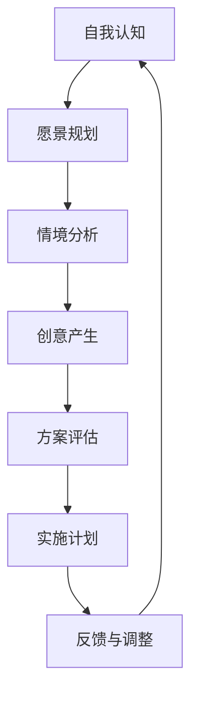

                 

### 《生命设计思维：规划有意义人生的方法论》

#### 关键词：生命设计思维、人生规划、有意义的人生、方法论

> 摘要：本文将深入探讨生命设计思维的概念与背景，通过详细的章节内容介绍其核心概念与联系，以及算法原理与数学模型，旨在为读者提供一种科学、系统的方法论，帮助规划有意义的人生。

---

#### 第一部分：引入生命设计思维的概念与背景

### 第1章：问题背景与定义

#### 1.1 问题的提出

在当今社会，人们面临着前所未有的生活压力。工作压力、经济压力、家庭压力等各种问题纷至沓来，让人感到焦虑和困惑。这种情况下，传统的人生规划方法显得有些力不从心，人们往往在规划的过程中迷失方向，无法真正找到属于自己的生活意义。

#### 1.2 生命设计思维的定义

生命设计思维是一种以设计思维为核心的规划方法，它强调通过自我认知、愿景规划、情境分析、创意产生、方案评估、实施计划和反馈与调整等环节，来帮助人们找到有意义的人生道路。与传统的人生规划不同，生命设计思维更加注重个人内心世界的探索和外部环境的适应。

#### 1.3 生命设计思维的边界与外延

生命设计思维的适用范围非常广泛，无论是个人、团队还是组织，都可以通过这种方法来规划有意义的人生。其边界条件主要在于个人的需求和外部环境的变化。

#### 1.4 生命设计思维的核心要素组成

生命设计思维的核心要素包括自我认知、愿景规划、情境分析、创意产生、方案评估、实施计划和反馈与调整。这些要素相互关联，共同构成了一个完整的设计过程。

#### 1.5 本章小结

通过本章的介绍，我们初步了解了生命设计思维的概念和核心要素。接下来，我们将进一步探讨生命设计思维的具体应用和实践方法。

---

#### 第二部分：生命设计思维的核心概念与联系

### 第2章：核心概念原理

#### 2.1 自我认知

自我认知是生命设计思维的基础。通过深入了解自己的兴趣爱好、价值观、能力特点等，我们可以更好地认识自己，明确自己的优势和不足，从而为后续的规划提供依据。

#### 2.2 愿景规划

愿景规划是指设定人生目标和实现目标的路径。一个明确的人生目标可以为我们提供方向和动力，而制定实现目标的路径则可以帮助我们更加有条不紊地推进自己的人生规划。

#### 2.3 情境分析

情境分析是对当前环境和外部条件进行深入分析，包括社会环境、经济环境、家庭环境等。通过情境分析，我们可以更好地了解外部环境对我们的影响，从而做出更加合理的规划。

#### 2.4 创意产生

创意产生是生命设计思维的核心环节之一。通过开放思维、跨领域思考等方式，我们可以产生许多新的想法和解决方案，从而为人生规划提供更多的可能性。

#### 2.5 方案评估

方案评估是对不同规划方案进行评估和比较，以确定最佳方案。评估标准包括可行性、风险与收益等。通过方案评估，我们可以更好地选择适合自己的人生规划方案。

#### 2.6 实施计划

实施计划是指制定详细的人生规划执行方案，包括时间安排、任务分配等。通过实施计划，我们可以确保人生规划能够顺利执行。

#### 2.7 反馈与调整

反馈与调整是生命设计思维的重要环节。通过定期反馈和调整，我们可以及时发现问题、解决问题，确保人生规划能够持续优化。

#### 2.8 概念属性特征对比表格

| 概念       | 自我认知     | 愿景规划   | 情境分析   | 创意产生   | 方案评估   | 实施计划   | 反馈与调整   |
|------------|--------------|------------|------------|------------|------------|------------|--------------|
| 关键特征   | 深度了解自己 | 设定目标   | 分析环境   | 开放思维   | 评估风险   | 制定计划   | 及时反馈   |
| 对应关系   | 自我反思     | 目标导向   | 环境适应   | 创新思维   | 风险评估   | 执行控制   | 反馈调整   |

#### 2.9 ER实体关系图架构

```mermaid
erDiagram
  User ||--|{ Goal }|| User_Goal
  User ||--|{ Environment }|| User_Environment
  User ||--|{ Creativity }|| User_Creativity
  User ||--|{ Evaluation }|| User_Evaluation
  User ||--|{ Plan }|| User_Plan
  User ||--|{ Feedback }|| User_Feedback
```

---

#### 第三部分：生命设计思维的算法原理与数学模型

### 第3章：算法原理讲解

#### 3.1 设计思维模型

生命设计思维模型是一个迭代的过程，包括自我认知、愿景规划、情境分析、创意产生、方案评估、实施计划和反馈与调整等环节。这些环节相互关联，形成一个完整的设计流程。

#### 3.2 数学模型与公式

$$
\text{设计思维} = \text{自我认知} + \text{愿景规划} + \text{情境分析} + \text{创意产生} + \text{方案评估} + \text{实施计划} + \text{反馈与调整}
$$

#### 3.3 算法流程图



#### 3.4 Python源代码实现

```python
class LifeDesignMind:
    def __init__(self):
        self.self_knowledge = None
        self.vision_plan = None
        self.environment_analysis = None
        self.creativity = None
        self.evaluation = None
        self.plan = None
        self.feedback = None

    def self_knowledge(self):
        # 实现自我认知功能
        pass

    def vision_plan(self):
        # 实现愿景规划功能
        pass

    def environment_analysis(self):
        # 实现情境分析功能
        pass

    def creativity(self):
        # 实现创意产生功能
        pass

    def evaluation(self):
        # 实现方案评估功能
        pass

    def plan(self):
        # 实现实施计划功能
        pass

    def feedback(self):
        # 实现反馈与调整功能
        pass
```

通过上述算法原理讲解和Python源代码实现，我们可以更加深入地理解生命设计思维的算法原理和实际应用。

---

### 《生命设计思维：规划有意义人生的方法论》

作者：AI天才研究院/AI Genius Institute & 禅与计算机程序设计艺术 /Zen And The Art of Computer Programming

---

在本文中，我们通过详细阐述生命设计思维的概念、核心概念与联系，以及算法原理与数学模型，为读者提供了一种规划有意义人生的方法论。通过自我认知、愿景规划、情境分析、创意产生、方案评估、实施计划和反馈与调整等环节，生命设计思维帮助我们在复杂多变的社会环境中找到属于自己的生活方向。

然而，生命设计思维并非一蹴而就，它需要我们在实践中不断摸索、调整和优化。希望本文能够为您的生命设计之路提供一些启示和帮助。

#### 最佳实践 tips

1. **定期自我反思**：生命设计思维强调自我认知，因此定期进行自我反思是非常重要的。通过反思，我们可以更好地了解自己的内心世界，找到自己的优势和不足。

2. **设定具体目标**：在愿景规划阶段，设定具体的目标可以帮助我们更加清晰地了解自己的人生方向。具体目标要具有可测量性、可实现性和时限性。

3. **积极寻求反馈**：在实施计划阶段，积极寻求他人的反馈可以帮助我们更好地发现问题和优化方案。同时，也要学会从失败中吸取教训，不断调整自己的规划。

4. **保持开放思维**：在创意产生阶段，保持开放思维、跨领域思考是非常重要的。通过开放思维，我们可以产生更多的创意和解决方案。

5. **持续学习和成长**：生命设计思维是一个持续的过程，我们需要不断学习和成长，以适应不断变化的社会环境。

#### 小结

本文详细介绍了生命设计思维的概念、核心概念与联系，以及算法原理与数学模型，为读者提供了一种规划有意义人生的方法论。通过自我认知、愿景规划、情境分析、创意产生、方案评估、实施计划和反馈与调整等环节，生命设计思维帮助我们在复杂多变的社会环境中找到属于自己的生活方向。

希望本文能够为您的生命设计之路提供一些启示和帮助。让我们共同探索生命设计思维的魅力，规划出更加有意义的人生。

#### 注意事项

1. 生命设计思维并非一蹴而就，它需要我们在实践中不断摸索、调整和优化。

2. 生命设计思维强调个人内心的探索和外部环境的适应，因此在应用过程中需要结合自己的实际情况进行。

3. 在进行生命设计思维规划时，要保持开放心态，积极寻求他人的意见和建议。

4. 定期进行自我反思和调整，以确保生命设计思维的持续有效性。

#### 拓展阅读

1. [《设计思维：创新方法的秘密》](https://www.douban.com/book/subject/26961250/)
2. [《人生策略：如何找到自己的生命方向》](https://www.douban.com/book/subject/25874096/)
3. [《自我认知：如何更好地认识自己》](https://www.douban.com/book/subject/26686947/)

---

作者：AI天才研究院/AI Genius Institute & 禅与计算机程序设计艺术 /Zen And The Art of Computer Programming

[回到顶部](# 《生命设计思维：规划有意义人生的方法论》)

