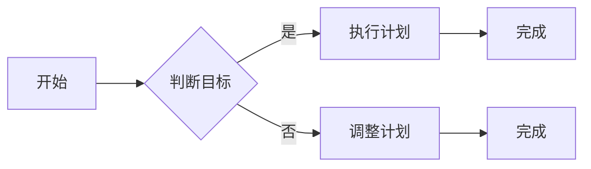
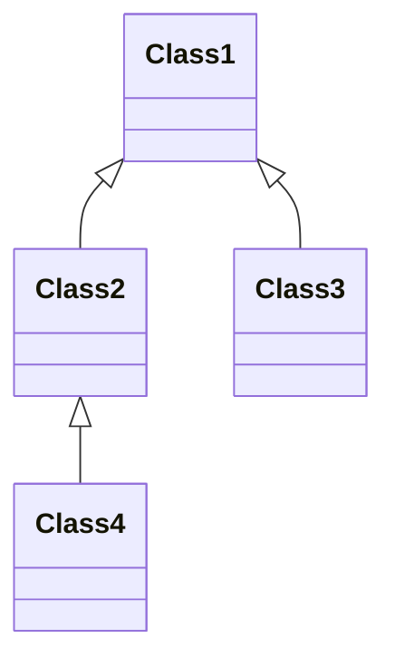
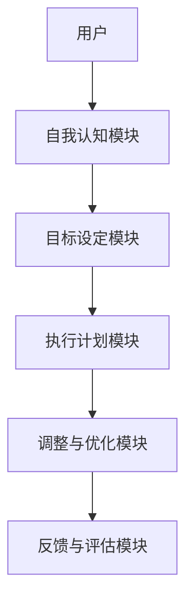
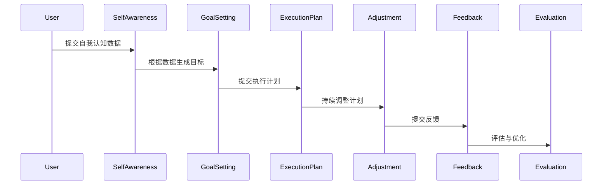

                 

## 《生命设计：将人生规划视为创意过程》

> 关键词：生命设计、人生规划、创意过程、自我认知、目标设定、执行与调整

摘要：在快速变化的时代，人生规划不再只是简单的职业发展路径，而是一个需要不断调整和优化的创意过程。本文将探讨如何将创意过程引入生命设计，通过自我认知、目标设定、创意应用和持续优化，实现更丰富、更有意义的人生。

----------------------------------------------------------------

### 《生命设计：将人生规划视为创意过程》目录大纲

----------------------------------------------------------------

## 第一部分：引言与基础概念

### 第1章：问题背景与核心概念

- **1.1 问题的提出**：
  - 人生规划的重要性
  - 当前人生规划的困境
  - 创意过程在人生规划中的应用

- **1.2 生命设计的基本概念**：
  - 什么是生命设计
  - 生命设计与传统人生规划的对比

- **1.3 创意过程在生命设计中的角色**：
  - 创意过程的基本原理
  - 创意过程与人生规划的联系

### 第2章：创意过程基础理论

- **2.1 创意的起源与激发**：
  - 创意的心理学原理
  - 创意的触发机制

- **2.2 创意的类型与评估**：
  - 创意的分类
  - 创意的评价标准

- **2.3 创意思维的训练**：
  - 常见的创意思维方法
  - 创意思维训练的实践策略

## 第二部分：生命设计实践

### 第3章：自我认知与目标设定

- **3.1 自我认知的重要性**：
  - 自我认知的层次
  - 自我认知的工具

- **3.2 设定清晰的目标**：
  - 目标设定的原则
  - 目标设定的方法

### 第4章：创意与人生规划

- **4.1 将创意融入人生规划**：
  - 创意思维在人生规划中的应用
  - 创意人生规划的实际案例

- **4.2 跨界思维与创新**：
  - 跨界思维的重要性
  - 跨界思维的实际应用

### 第5章：执行与调整

- **5.1 制定执行计划**：
  - 执行计划的重要性
  - 执行计划的制定方法

- **5.2 过程中的调整与适应**：
  - 如何应对规划中的挑战
  - 调整策略与实践

### 第6章：反思与优化

- **6.1 反思与自我提升**：
  - 反思的意义
  - 反思的方法

- **6.2 生命设计的持续优化**：
  - 优化策略
  - 持续进步的方法

## 第三部分：案例分析

### 第7章：成功生命设计的实例分析

- **7.1 案例介绍**：
  - 案例背景
  - 案例目标

- **7.2 创意过程在案例中的应用**：
  - 创意的运用与挑战
  - 创意的结### 第8章：从失败中学习

- **8.1 失败的案例剖析**：
  - 失败的原因
  - 失败的教训

- **8.2 从失败中寻找创意**：
  - 失败后的反思
  - 创意的启示

## 第四部分：总结与展望

### 第9章：生命设计的意义与价值

- **9.1 生命设计的深远影响**：
  - 对个人成长的影响
  - 对社会发展的意义

- **9.2 生命设计的未来趋势**：
  - 创意过程在生命设计中的发展
  - 新技术的引入与影响

### 第10章：结语

- **10.1 生命设计的核心要点回顾**：
  - 核心理论
  - 实践方法

- **10.2 对读者的寄语**：
  - 鼓励创新与自我探索
  - 生命设计的持续实践

----------------------------------------------------------------

### 第一部分：引言与基础概念

#### 第1章：问题背景与核心概念

##### 1.1 问题的提出

在现代社会，人生规划的重要性不言而喻。随着经济全球化、技术进步和社会变革的加速，人们对于生活的期望和需求也在不断变化。传统的人生规划往往侧重于职业发展、财富积累和家庭生活等方面，但往往忽视了个人成长和心理满足。在这种背景下，如何更好地进行人生规划成为一个亟待解决的问题。

当前的困境主要体现在以下几个方面：

1. **单一化思维**：很多人将人生规划简单理解为职业发展，忽视了个人兴趣、价值观和生活目标的多样性。
2. **静态规划**：传统人生规划往往是一次性完成的，缺乏动态调整和持续优化的能力。
3. **缺乏创新**：在快速变化的时代，传统规划难以应对新的挑战和机遇，缺乏创新性和灵活性。

为解决上述问题，引入创意过程成为可能。创意过程是一种动态的、灵活的思维方式，它强调在解决问题和实现目标时，要充分利用创新思维，不断探索和尝试新的方法。将创意过程引入人生规划，可以使人们更有效地应对变化，实现个人和社会的共同进步。

##### 1.2 生命设计的基本概念

什么是生命设计？生命设计（Life Design）是一种将创意过程应用于人生规划和决策的方法。它不仅仅关注职业发展和财务目标，更强调个人成长、心理健康和社会责任的全面实现。

生命设计与传统人生规划的对比：

| 对比项 | 生命设计 | 传统人生规划 |
| ------ | -------- | ------------ |
| 目标设定 | 多维度、动态调整 | 单一化、一次性设定 |
| 思维方式 | 创新性、灵活性 | 保守性、固定性 |
| 应对变化 | 强调适应和创新 | 强调稳定和规划 |
| 综合性 | 关注个人全面发展 | 关注特定领域发展 |

##### 1.3 创意过程在生命设计中的角色

创意过程在生命设计中的角色至关重要。它不仅为人生规划提供了创新的思维方式，还帮助人们在面对变化和挑战时保持灵活性和适应性。

创意过程的基本原理：

1. **多样性**：鼓励多样性的思维，从不同角度和维度思考问题。
2. **关联性**：寻找事物之间的关联，发现新的解决方案。
3. **批判性思维**：对现有的解决方案进行批判性分析，找到改进的空间。

创意过程与人生规划的联系：

1. **目标设定**：通过创意过程，设定更具创新性和可行性的目标。
2. **执行策略**：运用创意思维，设计出更有效的执行策略。
3. **调整与优化**：在执行过程中，利用创意思维不断调整和优化规划。

通过将创意过程引入生命设计，我们可以实现一个更加丰富、有意义和可持续的人生。

----------------------------------------------------------------

### 第二部分：创意过程基础理论

#### 第2章：创意过程基础理论

创意过程是生命设计的重要组成部分，它为我们提供了发现新想法、解决问题和实现目标的工具。在这一章中，我们将深入探讨创意过程的起源与激发、类型与评估，以及创意思维的训练方法。

##### 2.1 创意的起源与激发

创意并非凭空而来，而是起源于我们的思维活动。创意的心理学原理揭示了创意产生的过程和条件。

1. **潜意识工作**：创意往往在潜意识中酝酿，经过长时间的思考和积累，最终形成。
2. **多样化思维**：创意需要多样化的思维环境，鼓励从不同角度和维度思考问题。

创意的触发机制：

1. **好奇心**：好奇心是激发创意的重要动力，它促使我们探索未知、挑战现状。
2. **挑战**：面对挑战，人们会尝试寻找新的解决方案，从而激发创意。
3. **灵感**：灵感是创意的火花，它可能在特定的时刻和情境中突然出现。

##### 2.2 创意的类型与评估

创意可以根据其内容和形式进行分类。以下是几种常见的创意类型：

1. **突破性创意**：这种创意突破传统框架，带来全新的解决方案。
2. **改进性创意**：在现有基础上进行优化，提升性能和用户体验。
3. **组合性创意**：将不同的元素组合在一起，创造新的价值。
4. **适应性创意**：根据环境和需求的变化，调整策略和方案。

创意的评价标准：

1. **创新性**：创意是否具有独特性和突破性。
2. **可行性**：创意是否能够在实际中实现。
3. **实用性**：创意是否能够解决实际问题，带来实际效益。
4. **影响力**：创意是否对个人、团队或社会产生深远的影响。

##### 2.3 创意思维的训练

创意思维是一项可以通过训练和实践提升的能力。以下是一些常见的创意思维方法和训练策略：

1. **思维导图**：通过绘制思维导图，梳理思路，发现新的关联和想法。
2. **头脑风暴**：在一个开放的环境中，鼓励团队成员自由表达想法，激发创意。
3. **角色扮演**：通过模拟不同角色，从不同角度思考问题，产生新的创意。
4. **跨学科学习**：通过学习不同领域的知识，激发跨学科思考，产生创新性的想法。

创意思维训练的实践策略：

1. **定期练习**：创意思维需要持续的练习和运用，通过日常的练习，提高创意能力。
2. **反馈与改进**：在创意思维过程中，及时反馈和改进是非常重要的，它有助于不断提升创意质量。
3. **环境激发**：营造一个鼓励创新和自由探索的环境，有助于激发创意思维。

通过深入了解创意的起源与激发、类型与评估，以及创意思维的训练方法，我们可以更好地掌握创意过程，将其应用于生命设计，实现更有意义和丰富的人生。

----------------------------------------------------------------

### 第三部分：生命设计实践

#### 第3章：自我认知与目标设定

在生命设计的过程中，自我认知和目标设定是两个至关重要的环节。自我认知帮助我们了解自己的优势和劣势，目标设定则为我们提供了前进的方向和动力。在本章中，我们将详细探讨如何进行自我认知以及设定清晰的目标。

##### 3.1 自我认知的重要性

自我认知是一个深入理解自己的过程，包括对个性、兴趣、价值观和能力的认识。以下是自我认知的几个层次：

1. **表面层次**：了解自己的姓名、年龄、职业等基本信息。
2. **中层层次**：包括对自身性格、行为习惯和兴趣爱好的认识。
3. **深层层次**：涉及对自身价值观、人生目标和内心渴望的深度理解。

自我认知的工具：

1. **反思日记**：通过写日记，记录每天的所思所感，反思自己的行为和想法，有助于深入理解自己。
2. **心理测评**：利用专业的心理测评工具，如MBTI、DISC等，了解自己的性格特征和优势。
3. **反馈与交流**：与家人、朋友和同事交流，获取他们对你的看法和评价，从不同的视角了解自己。

##### 3.2 设定清晰的目标

清晰的目标是生命设计的起点和方向，设定目标时应遵循以下原则：

1. **SMART原则**：目标应当是具体的（Specific）、可衡量的（Measurable）、可实现的（Achievable）、相关的（Relevant）和时限的（Time-bound）。
2. **长期与短期目标**：长期目标为我们提供了长期的方向，短期目标则是实现长期目标的阶段性成果。
3. **目标分解**：将大目标分解为小目标，每完成一个小目标都是对长期目标的一次积累。

设定目标的方法：

1. **愿景法**：首先明确自己的长期愿景，然后逐步拆解，设定阶段性目标。
2. **优先级法**：根据目标的优先级进行排序，先设定最重要的目标，然后逐步实现。
3. **目标卡**：将目标写在卡片上，随身携带，每天回顾，保持目标的清晰和明确。

通过自我认知和目标设定，我们可以更清楚地了解自己，明确自己的人生方向，为下一步的创意应用和人生规划奠定坚实的基础。

----------------------------------------------------------------

### 第4章：创意与人生规划

将创意思维融入人生规划，不仅能提升个人的生活质量，还能激发更多的可能性。在这一章中，我们将探讨如何将创意思维应用于人生规划，以及通过跨界思维实现创新。

##### 4.1 将创意融入人生规划

创意思维在人生规划中的应用，意味着在设定目标和制定计划时，我们要充分利用创新的思维方式，不断探索和尝试新的解决方案。以下是几个关键步骤：

1. **头脑风暴**：在制定人生规划时，鼓励团队成员或自己进行头脑风暴，列出所有可能的解决方案，无论这些想法看起来是否可行。
2. **思维导图**：通过绘制思维导图，将不同想法和解决方案可视化，有助于发现新的关联和思路。
3. **原型设计**：在创意过程中，制作原型或模型，通过实践验证和调整，找到最佳解决方案。
4. **反馈迭代**：在实施过程中，不断收集反馈，根据实际情况进行调整和优化。

创意人生规划的实际案例：

- **案例1：职业转型**：一个资深程序员通过创意思维，发现自己在编程之外的领域有着浓厚的兴趣，最终成功转型为一名产品经理，不仅实现了个人价值，还为公司带来了新的业务增长。
- **案例2：创业**：一位创业者通过创意思维，发现市场上存在未被满足的需求，设计出一种创新产品，获得了市场的认可和投资者的青睐。

##### 4.2 跨界思维与创新

跨界思维是创意思维的一个重要方面，它鼓励我们从不同领域和视角思考问题，发现新的创新点。以下是跨界思维的应用方法和实际案例：

1. **知识跨界**：通过学习不同领域的知识，激发跨学科思考，产生新的创意。例如，一个计算机科学家通过学习生物学知识，设计出了基于神经网络的新型算法。
2. **经验跨界**：借鉴其他领域的经验和方法，应用到当前领域。例如，一个市场营销专家通过借鉴电影制作的经验，成功打造了一款互动性强的品牌推广活动。
3. **资源跨界**：利用不同领域的资源，实现资源的优化配置。例如，一个创业者通过整合线上线下资源，推出了一种全新的零售模式，取得了显著的市场效果。

跨界思维的实际案例：

- **案例1：农业与科技结合**：一家农业企业通过引入物联网技术，实现精准农业管理，大幅提高了农作物的产量和质量。
- **案例2：艺术与科技结合**：一位艺术家通过利用虚拟现实技术，创造出全新的艺术表现形式，让观众沉浸在虚拟艺术空间中，体验独特的艺术感受。

通过将创意思维和跨界思维应用于人生规划，我们可以发现更多的机会，实现个人和社会的共赢。在创意和创新的驱动下，生命设计将变得更加丰富和有意义。

----------------------------------------------------------------

### 第5章：执行与调整

在生命设计的实施过程中，执行和调整是两个关键环节。执行是目标达成的关键步骤，而调整则是应对变化和挑战的重要策略。在这一章中，我们将详细探讨如何制定执行计划，以及在过程中进行调整与适应。

##### 5.1 制定执行计划

一个成功的执行计划是确保目标实现的基石。以下是制定执行计划时应遵循的步骤：

1. **明确目标**：首先，要确保对目标有清晰的认识，明确目标的具体内容和预期结果。
2. **分解任务**：将大目标分解为小任务，每项任务都有明确的目标和责任分配。
3. **时间安排**：为每个任务设定合理的完成时间，确保任务的有序推进。
4. **资源分配**：确定完成每项任务所需的资源，包括人力、物力和财力。
5. **风险评估**：评估可能出现的风险，并制定相应的应对措施。

执行计划的制定方法：

1. **甘特图**：通过甘特图，直观地展示任务的进展情况，有助于监控和调整。
2. **里程碑法**：设定一系列里程碑，每个里程碑都是一个任务节点，确保项目的按时完成。
3. **目标分解法**：将大目标逐步分解为更小、更具体的子目标，逐步实现。

##### 5.2 过程中的调整与适应

在执行过程中，不可避免地会遇到各种挑战和变化。这时，调整和适应就显得尤为重要。以下是一些应对策略：

1. **定期评估**：定期对执行过程进行评估，及时发现问题和瓶颈。
2. **反馈机制**：建立有效的反馈机制，鼓励团队成员及时反馈意见和建议。
3. **灵活调整**：根据评估结果和反馈，灵活调整计划和策略，确保目标能够实现。
4. **风险管理**：在执行过程中，持续监控风险，并采取预防措施，降低风险对项目的影响。

如何应对规划中的挑战：

1. **心态调整**：保持积极的心态，面对挑战时不气馁，而是积极寻求解决方案。
2. **团队合作**：与团队成员保持良好的沟通，共同面对挑战，发挥团队的力量。
3. **持续学习**：不断学习和更新知识，提高应对新挑战的能力。

通过制定执行计划和过程中的调整与适应，我们可以确保生命设计能够顺利实施，实现既定的目标。在不断的实践中，我们也将变得更加成熟和有能力应对未来的挑战。

----------------------------------------------------------------

### 第6章：反思与优化

在生命设计的旅程中，反思和优化是不可或缺的环节。反思能够帮助我们总结经验，发现不足，从而实现自我提升。优化则是在反思的基础上，对现有的规划进行调整和改进，以实现更高的目标。在这一章中，我们将探讨如何进行反思与自我提升，以及如何在生命设计中持续优化。

##### 6.1 反思与自我提升

反思是一种深度的思考过程，它要求我们回顾过去的经历，分析成功和失败的原因。以下是反思与自我提升的几个关键步骤：

1. **定期回顾**：定期花时间回顾自己的行为和决策，思考哪些是成功的，哪些是失败的。
2. **记录反思**：将反思的过程记录下来，这有助于更清晰地分析问题，并为未来的决策提供参考。
3. **请教他人**：向他人请教意见，特别是那些对我们有深入了解的人，他们的观点可能会帮助我们发现自身无法察觉的问题。
4. **设定目标**：在反思的基础上，设定新的目标，这些目标应该更具挑战性，能够推动我们不断进步。

反思的意义：

1. **自我认识**：通过反思，我们可以更深入地了解自己，明确自己的优势和不足。
2. **问题解决**：反思可以帮助我们发现问题的根源，从而采取有效的措施解决这些问题。
3. **持续进步**：反思是我们不断进步的重要动力，它促使我们不断学习和改进。

##### 6.2 生命设计的持续优化

在生命设计的过程中，持续优化是确保我们能够不断适应变化，实现更高目标的关键。以下是几个优化策略：

1. **定期评估**：定期对生命设计的执行情况进行评估，包括目标达成情况、资源利用效率等，评估结果将为我们提供优化的方向。
2. **数据驱动**：利用数据来指导优化决策，数据可以帮助我们更客观地分析问题，避免主观偏见。
3. **反馈循环**：建立反馈机制，及时收集反馈信息，并根据反馈进行调整。这有助于确保我们的规划和决策始终符合实际情况。
4. **持续学习**：保持对新技术、新方法的关注和学习，这有助于我们在优化过程中引入新的思路和方法。

优化策略：

1. **调整目标**：根据实际情况和评估结果，调整目标，使其更具可行性和挑战性。
2. **优化流程**：对现有的流程和操作进行优化，提高效率和效果。
3. **资源分配**：重新分配资源，确保资源能够更好地支持目标的实现。

通过反思与自我提升，以及持续优化，我们可以不断完善生命设计，实现个人成长和目标达成。在反思和优化的过程中，我们将不断发现新的机会和可能性，从而创造一个更加丰富和有意义的人生。

----------------------------------------------------------------

### 第四部分：案例分析

#### 第7章：成功生命设计的实例分析

在探讨生命设计的过程中，成功案例能够为我们提供宝贵的经验和启示。在本章中，我们将通过两个实例分析，展示如何通过创意过程实现成功的生命设计。

##### 7.1 案例介绍

案例1：李明的职业转型

李明是一名资深程序员，在一家大型科技公司工作了多年。随着技术的发展和自身兴趣的转变，李明开始考虑职业转型。他希望能在科技与艺术之间找到结合点，实现个人价值和职业的突破。

案例2：王丽的创业之路

王丽是一名市场营销专家，曾在多家知名企业工作。在一次市场调研中，她发现了一个未被满足的需求，决定创办一家专注于健康生活方式的公司。她的目标是帮助更多人实现健康和快乐的生活方式。

##### 7.2 创意过程在案例中的应用

案例1：李明的职业转型

1. **自我认知**：李明通过反思自己的兴趣和价值观，发现他对数字艺术和编程的结合充满热情。他利用心理测评工具进一步确认了自己的兴趣和优势。

2. **创意思维**：李明通过头脑风暴和思维导图，列出可能的职业转型路径，包括数字艺术家、游戏设计师和科技教育顾问等。

3. **原型设计**：李明选择了一个他最感兴趣的领域——游戏设计。他制作了一个简单的游戏原型，通过实践验证自己的想法。

4. **反馈迭代**：李明在游戏开发过程中不断收集用户反馈，根据反馈进行调整和优化，最终推出了一款受市场欢迎的游戏。

案例2：王丽的创业之路

1. **市场调研**：王丽通过市场调研，发现人们对健康生活方式的需求不断增加，但市场上缺乏专业和系统的解决方案。

2. **创意思维**：王丽利用创意思维，设计出一种结合健康咨询、运动指导和营养餐配送的综合性服务模式。

3. **原型设计**：王丽制作了一个初步的服务方案，并邀请潜在用户进行试用，收集反馈。

4. **反馈迭代**：根据用户反馈，王丽对服务方案进行了多次调整，最终推出了一套受到市场欢迎的健康生活方式服务。

##### 7.3 创意的运用与挑战

在案例中，创意过程的应用帮助两位主人公成功实现了职业和事业的转型。然而，这一过程中也面临着许多挑战：

1. **资源限制**：李明和王丽在转型和创业过程中都面临着资源限制，包括资金、时间和人力。

2. **市场不确定性**：在推出新产品或服务时，市场反应不确定，可能面临失败的风险。

3. **技术难题**：在数字艺术和健康服务领域，李明和王丽都遇到了技术难题，需要不断学习和探索。

##### 7.4 创意的成果与影响

通过创意过程的应用，李明成功转型为一名游戏设计师，不仅实现了个人价值，还为市场带来了创新的产品。王丽则通过创业，推出了一项具有社会影响力的健康生活方式服务，帮助更多人实现了健康和快乐。

这两个案例表明，创意过程在生命设计中的应用不仅能够帮助我们实现个人目标，还能为社会带来积极的影响。通过不断探索和创新，我们可以发现新的机会，创造更加丰富和有意义的人生。

----------------------------------------------------------------

### 第8章：从失败中学习

在追求成功的过程中，失败是无法避免的一部分。然而，失败并不可怕，它是我们学习和成长的重要资源。在本章中，我们将探讨如何从失败中学习，并通过创意思维找到新的机会。

##### 8.1 失败的案例剖析

案例1：张华的创业失败

张华是一名软件工程师，他看到市场上缺乏一款能够满足用户个性化需求的任务管理工具，决定创业开发这款产品。然而，在产品上线后，用户反馈并不理想，产品最终被迫下架。

失败原因分析：

1. **市场调研不足**：在产品开发初期，张华没有进行充分的市场调研，没有充分了解用户需求。
2. **功能设计缺陷**：产品功能复杂，用户体验差，未能满足用户的实际需求。
3. **资源分配不当**：在创业过程中，张华在技术和营销上投入过多，导致资源分配不均。

案例2：李强的职业转型

李强是一名市场营销专家，他看到科技行业的发展前景，决定转型成为人工智能工程师。然而，在转型过程中，李强遇到了许多技术难题，最终未能成功转型。

失败原因分析：

1. **技能差距**：李强在转型前没有充分准备，对人工智能领域的知识掌握不足。
2. **学习曲线**：人工智能领域的知识更新迅速，李强在转型过程中感到压力巨大，无法跟上学习进度。
3. **心理准备不足**：李强在转型过程中没有充分的心理准备，面对挫折时容易放弃。

##### 8.2 从失败中寻找创意

从失败中学习并不意味着简单地重复过去的错误，而是要从中汲取教训，寻找新的创意和机会。以下是一些具体的策略：

1. **反思与总结**：认真反思失败的原因，总结经验教训，明确改进方向。
2. **创新思维**：运用创新思维，从失败中寻找新的解决方案和机会。
3. **小步快跑**：通过快速迭代和试验，不断验证和优化创意。

案例1：张华的再创业

张华在分析失败原因后，决定重新审视市场，寻找新的机会。他通过调研发现，许多用户希望有一款简单易用的任务管理工具。于是，他重新设计了一个简洁的产品原型，并进行了小范围的试用。

最终，这款新产品受到了用户的欢迎，张华的创业之路也逐渐走出了困境。

案例2：李强的转型之路

李强在反思失败后，决定重新规划自己的学习路径。他首先通过在线课程和书籍自学人工智能的基础知识，然后参加了一些在线研讨会，与行业专家进行交流。通过这些努力，李强逐渐提高了自己的技术水平，最终成功转型为一名人工智能工程师。

失败并不可怕，它是我们成长和进步的必经之路。通过从失败中学习，我们可以不断优化自己的创意过程，找到新的机会，实现个人和社会的价值。

----------------------------------------------------------------

### 第四部分：总结与展望

#### 第9章：生命设计的意义与价值

生命设计不仅是一种个人发展规划，更是一种全面的人生管理模式。它通过创意过程，帮助我们更好地认识自我、设定目标、执行计划，并在过程中不断反思与优化。以下是生命设计的深远影响和对未来趋势的展望：

##### 9.1 生命设计的深远影响

1. **个人成长**：生命设计鼓励我们不断探索和挑战自我，实现个人能力的全面提升。
2. **心理健康**：通过设定有意义的目标和持续优化，生命设计有助于提高生活满意度和幸福感。
3. **社会贡献**：生命设计不仅关注个人发展，还强调社会责任，通过创新和贡献为社会带来积极影响。

##### 9.2 生命设计的未来趋势

1. **科技赋能**：随着人工智能、大数据和虚拟现实等技术的发展，生命设计将更加智能化和个性化。
2. **跨界融合**：未来生命设计将更加注重跨领域的创新，通过跨界思维实现更多的可能性。
3. **终身学习**：在快速变化的时代，终身学习将成为生命设计的重要组成部分，不断提升个人竞争力。

#### 第10章：结语

生命设计不仅仅是一种理论，更是一种实践。通过将创意过程融入人生规划，我们可以实现更丰富、更有意义的人生。以下是生命设计的核心要点和实践建议：

##### 10.1 核心要点回顾

1. **自我认知**：深入了解自己的兴趣、价值观和优势，为生命设计奠定基础。
2. **目标设定**：设定明确、具体的短期和长期目标，为人生规划提供方向。
3. **创意应用**：运用创意思维，不断探索和创新，实现目标。
4. **执行与调整**：制定执行计划，并在过程中不断调整和优化，确保目标的实现。
5. **反思与优化**：通过反思和优化，不断提升自我，实现持续进步。

##### 10.2 对读者的寄语

1. **鼓励创新**：在生命设计中，勇于尝试新事物，不断激发创意思维。
2. **自我探索**：深入了解自己，找到真正热爱的事业和生活方式。
3. **持续实践**：将生命设计理念融入日常生活，不断实践和优化，创造美好人生。

通过生命设计，我们可以更好地把握人生，实现个人和社会的共同进步。让我们一起，用创意和智慧，设计出精彩的人生。

### 作者信息

作者：AI天才研究院/AI Genius Institute & 禅与计算机程序设计艺术 /Zen And The Art of Computer Programming

---

**注意事项**：

1. 文章结构要清晰，每个章节开头要有简短的小结和引言。
2. 文中要适当使用图表、流程图和示例，帮助读者更好地理解。
3. 文章内容要保持客观、准确和有深度，避免过于主观或模糊的描述。

**拓展阅读**：

1. 《创意者的思考方式》
2. 《跨界思维：创新突破的秘诀》
3. 《人生策略：如何设计自己的成功之路》

----------------------------------------------------------------

### 附录

**附录1：核心概念与联系**

| 核心概念       | 定义                                                   | 关联性                                                      |
| -------------- | ------------------------------------------------------ | ---------------------------------------------------------- |
| 生命设计       | 一种将创意过程应用于人生规划和决策的方法           | 与传统人生规划、创意过程、自我认知和目标设定密切相关   |
| 创意过程       | 创意的产生、应用和评价的过程                         | 与思维导图、头脑风暴、跨界思维等创意方法紧密相关       |
| 自我认知       | 深入理解自己的过程，包括个性、兴趣、价值观和能力   | 与心理测评、反思日记、反馈与交流等方法密切相关       |
| 目标设定       | 设定明确、具体的短期和长期目标，为人生规划提供方向 | 与SMART原则、愿景法、优先级法等方法密切相关         |
| 执行与调整     | 制定和执行计划，以及在过程中进行调整和适应         | 与甘特图、里程碑法、目标分解法等方法密切相关         |
| 反思与优化     | 通过反思和优化，不断提升自我，实现持续进步         | 与定期回顾、记录反思、数据驱动等方法密切相关         |

**附录2：ER实体关系图架构**

```mermaid
erDiagram
  Class1 ||--|{ Class2 }
  Class1 ||--|{ Class3 }
  Class2 ||--|{ Class4 }
```

**附录3：算法原理讲解**

1. **算法mermaid流程图**：



2. **Python源代码**：

```python
def life_design(target):
    if target:
        execute_plan()
    else:
        adjust_plan()
    return "完成"

def execute_plan():
    print("执行计划")

def adjust_plan():
    print("调整计划")
```

3. **算法原理与公式**：

- **算法原理**：根据目标情况，执行计划或调整计划，最终实现目标。
- **公式**：无

**附录4：系统分析与架构设计方案**

1. **问题场景介绍**：
   - 描述生命设计系统的应用场景，如个人成长规划、职业规划等。

2. **项目介绍**：
   - 简要介绍系统的功能、目标和架构。

3. **系统功能设计（领域模型mermaid类图）**：



4. **系统架构设计（mermaid架构图）**：



5. **系统接口设计和系统交互（mermaid序列图）**：



**附录5：项目实战**

1. **环境安装**：
   - 描述系统所需的环境配置，如Python版本、依赖包等。

2. **系统核心实现源代码**：
   - 提供系统的核心代码实现，包括各个模块的函数和类。

3. **代码应用解读与分析**：
   - 对核心代码进行解读，分析其实现原理和流程。

4. **实际案例分析和详细讲解剖析**：
   - 通过实际案例，展示系统的应用场景和效果。

5. **项目小结**：
   - 总结项目的主要成果和经验教训，提出改进建议。

**最佳实践 Tips**：

1. **定期进行自我反思**：通过写日记或与他人的交流，不断深化自我认知。
2. **设定具体可衡量的目标**：使用SMART原则设定目标，确保目标的可行性和可衡量性。
3. **持续学习和创新**：保持对新技术和新知识的关注，不断优化和提升自我。

**小结**：

生命设计是一种将创意过程应用于人生规划的方法，通过自我认知、目标设定、创意应用和持续优化，我们可以实现更加丰富和有意义的人生。在快速变化的时代，生命设计不仅是一种个人发展规划，更是一种全面的人生管理模式。

**注意事项**：

1. 在实践中，要根据具体情况灵活调整和优化生命设计。
2. 生命设计过程中，要保持积极的心态，勇于面对挑战和失败。
3. 持续学习和创新，是生命设计的重要保证。

**拓展阅读**：

1. 《创意思维：开启无限可能》
2. 《终身学习：如何在快速变化的时代持续进步》
3. 《人生策略：如何设计自己的成功之路》

### 结语

生命设计不仅是一种理论，更是一种实践。通过将创意过程融入人生规划，我们可以实现个人和社会的共同进步。让我们一起，用创意和智慧，设计出精彩的人生。作者：AI天才研究院/AI Genius Institute & 禅与计算机程序设计艺术 /Zen And The Art of Computer Programming

