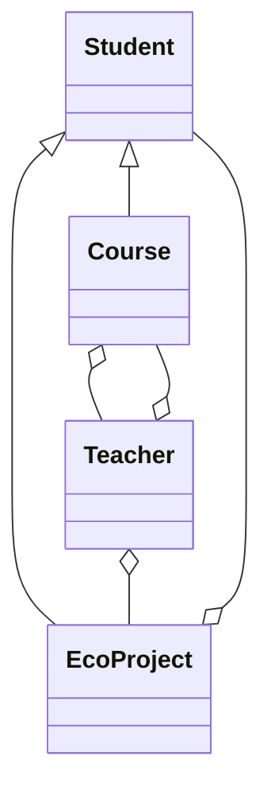

                 

### 引言与背景

**文章标题：生态公民教育：培养整体论的世界观**

**关键词：生态公民教育、整体论、世界观、教育策略**

**摘要：本文旨在探讨生态公民教育的重要性和必要性，通过阐述其核心概念、理论基础和实施策略，提供培养整体论世界观的教育框架。**

随着全球生态危机的日益严重，人类逐渐意识到环境保护与可持续发展的重要性。生态公民教育作为一种新兴的教育理念，应运而生。它不仅关注个体的知识和技能，更强调培养具有生态意识、社会责任感和全球视野的公民。本文将从问题背景、定义、必要性、目标以及面临的挑战等多个方面，详细探讨生态公民教育的发展及其对现代社会的重要影响。

### 问题背景与重要性

**1.1 问题背景**

在全球气候变化、生物多样性丧失、资源枯竭等问题日益严峻的背景下，人类社会面临着前所未有的挑战。这些问题的根本原因在于人们对自然界的过度开发和利用，缺乏对生态系统整体性的认识和尊重。传统教育体系往往注重学科知识的传授，而忽视了生态伦理和可持续发展的重要性。因此，生态公民教育的提出，旨在填补这一教育空白，通过系统的教育引导，培养具有环保意识和生态责任感的公民。

**1.2 生态公民教育的定义**

生态公民教育是一种以生态整体观为基础的教育理念，它强调通过教育培养公民对自然环境的尊重和保护意识，提升其生态素养和可持续发展能力。具体来说，生态公民教育包括以下几方面内容：

- **生态意识**：引导公民认识到生态系统的基本原理和运作机制，理解人与自然的关系。
- **社会责任**：培养公民的生态责任感和参与意识，鼓励其在日常生活中践行环保行为。
- **全球视野**：拓宽公民的视野，使其能够从全球视角理解生态问题，参与国际环保合作。

**1.3 生态公民教育的必要性**

生态公民教育的必要性主要体现在以下几个方面：

- **解决生态危机**：生态公民教育有助于提高公众对生态问题的认识，从根本上解决生态危机。
- **推动可持续发展**：通过教育引导公民积极参与可持续发展实践，实现经济、社会和环境的协调发展。
- **提升公民素质**：生态公民教育有助于培养公民的综合素质，提高其社会责任感和全球视野。

**1.4 生态公民教育的目标**

生态公民教育的目标主要包括：

- **提高生态素养**：通过教育，使公民具备基本的生态知识和技能，能够理解生态系统的运作机制。
- **培养生态责任感**：引导公民认识到自己在环境保护中的责任，积极参与生态保护和可持续发展实践。
- **增强全球意识**：培养公民的国际视野，使其能够从全球视角理解生态问题，积极参与国际环保合作。

**1.5 生态公民教育的挑战**

尽管生态公民教育具有重要的理论和实践价值，但其推广和实施过程中仍面临诸多挑战：

- **教育体系的不完善**：传统教育体系往往缺乏对生态问题的关注，难以满足生态公民教育的需求。
- **教育资源的不均衡**：不同地区和学校之间的教育资源存在较大差距，制约了生态公民教育的普及。
- **社会观念的转变**：社会公众对生态公民教育的认知和接受程度有限，需要通过广泛宣传和引导来改变这一现状。
- **政策支持不足**：生态公民教育缺乏强有力的政策支持，影响了其推广和实施的效果。

通过对生态公民教育问题的背景和重要性的深入探讨，我们不仅可以更全面地了解其内涵和意义，还能为后续章节的理论分析和实践探讨提供坚实的基础。接下来，本文将进一步探讨生态公民教育的核心概念和理论基础，为构建科学有效的教育框架奠定基础。

### 核心概念与联系

**2.1 核心概念原理**

在探讨生态公民教育的核心概念时，我们需要明确几个关键术语的定义和它们之间的联系。首先，生态整体观是生态公民教育的核心理论基石，它强调将生态系统视为一个相互关联的整体，而非孤立的组成部分。这种观念有助于我们理解和处理复杂的生态问题。

**生态整体观**：

- **定义**：生态整体观是一种认识论和方法论，它认为生态系统中的各个组成部分（如生物、土壤、气候等）之间存在紧密的联系和相互作用，共同维持生态平衡。
- **原理**：生态整体观的核心原理包括系统的相互依赖性、动态平衡、可持续性和适应性。例如，土壤的健康直接关系到植物的生长，而植物又是动物食物链的重要组成部分，这些因素相互影响，共同维持生态系统的平衡。

**生态公民教育**：

- **定义**：生态公民教育是一种教育理念，旨在通过系统化的教育和引导，培养公民对生态系统的理解、尊重和保护意识。
- **原理**：生态公民教育的原理包括生态意识、社会责任和全球视野。通过教育，公民可以更好地理解生态系统的运作机制，认识到自己在环境保护中的责任，并具备参与国际环保合作的能力。

**2.2 概念属性特征对比表格**

为了更清晰地展示生态整体观和生态公民教育的概念属性特征，我们可以通过一个对比表格来分析：

| 特征           | 生态整体观                                      | 生态公民教育                                      |
| -------------- | ----------------------------------------------- | -------------------------------------------------- |
| 定义           | 认识论和方法论，关注生态系统的整体性和相互依赖性 | 教育理念，旨在培养公民的生态意识和社会责任感           |
| 基本原理       | 系统的相互依赖性、动态平衡、可持续性和适应性       | 生态意识、社会责任、全球视野                         |
| 目标           | 理解生态系统的运作机制，维持生态平衡             | 提高公民的生态素养，培养环保意识和生态责任感           |
| 关联性         | 与生态学、环境科学、社会学等领域密切相关         | 与教育学、环境教育、可持续发展等领域密切相关           |
| 适用范围       | 科研、政策制定、环境保护实践                     | 学校教育、家庭教育、社会教育、公共教育等               |
| 教育方式       | 理论研究与实际操作相结合                         | 系统教育、实践活动、社会参与相结合                     |

**2.3 ER实体关系图架构**

为了更好地理解生态整体观和生态公民教育之间的联系，我们可以通过一个ER（实体-关系）图来展示它们之间的关系。以下是ER图的结构：

```mermaid
erDiagram
  Student ||--|{ Course } : takes
  Course ||--|{ Teacher } : taughtBy
  Teacher ||--|{ Student } : supervises
  Course ||--|{ Assignment } : has
  Assignment ||--|{ Student } : completes
```

在这个ER图中，我们定义了三个实体：学生（Student）、课程（Course）和教师（Teacher）。学生可以参加（takes）多个课程，每个课程由一位教师（taughtBy）讲授，教师可以监督（supervises）多个学生。此外，课程（Course）包含（has）多个作业（Assignment），学生（Student）可以完成（completes）多个作业。

通过这个ER图，我们可以看到生态整体观和生态公民教育在实际教育中的应用，如图中课程（Course）和教师（Teacher）的关系，它们共同构成了生态公民教育的基础架构。

通过以上对核心概念和联系的详细探讨，我们不仅明确了生态整体观和生态公民教育的基本原理和特征，还通过对比表格和ER图清晰地展示了它们之间的关系。这为进一步的理论分析和实践探讨提供了坚实的基础。

### 生态哲学与整体论

**3.1 生态哲学的起源与发展**

生态哲学作为一门综合性学科，起源于20世纪中叶，是环境危机和生态问题的直接回应。生态哲学的发展可以追溯到几个重要的历史阶段：

- **初期阶段（20世纪40-60年代）**：这一时期，生态哲学的兴起主要是对工业革命以来人类活动对环境破坏的反思。代表性的思想家有莱奥波德（Aldo Leopold）和卡森（Rachel Carson），他们的著作《沙乡年鉴》（A Sand County Almanac）和《寂静的春天》（Silent Spring）分别奠定了生态伦理和环境科学的基础。

- **成熟阶段（20世纪70-90年代）**：随着全球环境问题的日益严重，生态哲学的研究范围和深度不断扩展。这一阶段的重要贡献包括深层生态学（Deep Ecology）的提出，其代表人物是诺尔贝特·沃斯特（Arne Naess）。深层生态学强调人类与自然界的平等关系，主张所有生物都拥有内在价值。

- **多元化阶段（21世纪初至今）**：生态哲学逐渐与其他学科交叉融合，形成了多种理论流派，如生态女性主义、生态社会主义、生态心理学等。这一时期，生态哲学不仅关注生态问题，还探讨社会公正、经济发展和全球化等议题，从而拓展了其研究视野和应用范围。

**3.2 整体论的基本原理**

整体论（Holism）是生态哲学的核心概念之一，它主张系统各部分之间的相互依赖和整体性。以下是整体论的基本原理：

- **系统的整体性**：整体论认为，系统不仅仅是各部分的简单组合，而是通过相互作用和相互依赖形成的整体。例如，生态系统的健康取决于生物、土壤、气候等多种因素的协同作用。

- **相互依赖性**：整体论强调系统内各部分之间的相互依赖性。一个部分的改变可能会影响整个系统的运作。例如，森林的砍伐不仅影响生物多样性，还会导致土壤侵蚀和气候变化。

- **动态平衡**：整体论认为，系统处于动态平衡状态，通过自我调节机制维持稳定。这种平衡不是静态的，而是在不断的调整和适应中实现的。

- **适应性**：整体论强调系统具有适应性和自我修复能力。在面对外部压力和变化时，系统能够通过调整内部结构来恢复平衡。例如，生态系统可以通过生物多样性来适应环境变化。

**3.3 整体论与生态公民教育的联系**

整体论与生态公民教育之间存在密切的联系，这种联系不仅体现在理论层面，也在实践层面得到体现。

- **理论层面**：整体论为生态公民教育提供了重要的理论基础。通过理解生态系统的整体性和相互依赖性，公民可以更好地认识到人类活动对环境的深远影响，从而更加自觉地承担起生态责任。整体论的理念有助于培养公民的系统思维，使其能够从整体视角理解和解决生态问题。

- **实践层面**：整体论在生态公民教育中的应用体现在多个方面：

  - **跨学科教育**：生态公民教育不仅仅是环境科学和生态学的知识传授，还需要涵盖社会学、经济学、心理学等多学科的内容。整体论的理念鼓励跨学科合作，通过综合不同领域的知识，培养具有全面视野和综合素质的公民。

  - **环境教育实践**：整体论强调环境教育要关注生态系统各部分的相互作用，通过实践活动使公民亲身体验生态系统的复杂性和敏感性。例如，通过种植树木、水质监测等活动，公民可以直观地感受到生态平衡的重要性。

  - **社区参与**：整体论倡导公民积极参与生态保护和可持续发展实践。通过社区合作和共同行动，公民可以在实际操作中体验到整体性的力量，从而增强其生态责任感和社会参与意识。

  - **政策制定**：整体论的理念有助于政策制定者从整体视角考虑环境问题，避免片面和短视的做法。例如，在制定环境保护政策时，需要考虑生态系统的整体健康，而不仅仅是单一的环境指标。

通过深入探讨生态哲学的起源和发展，以及整体论的基本原理和实践应用，我们可以更好地理解生态公民教育的理论基础。接下来，本文将进一步探讨生态教育理念和实践，分析其在培养整体论世界观中的作用。

### 生态教育理念与实践

**4.1 生态教育理念概述**

生态教育理念是一种以生态系统为核心，注重环境保护和可持续发展的教育观念。它的主要理念包括：

- **生态系统观念**：生态教育强调将生态系统作为一个整体进行研究和教育，理解各个组成部分之间的相互作用和依赖关系。
- **可持续发展观念**：生态教育主张教育要关注经济、社会和环境的协调发展，培养公民的可持续发展意识和能力。
- **环境伦理观念**：生态教育倡导环境伦理，强调人类对自然的尊重和保护，培养公民的生态责任感。
- **跨学科观念**：生态教育强调跨学科合作，通过综合不同领域的知识，培养具有全面视野和综合素质的公民。

**4.2 生态教育实践的案例研究**

为了更好地理解生态教育理念的实际应用，以下介绍几个具有代表性的生态教育实践案例：

- **案例一：XX学校的环境教育项目**

XX学校的环境教育项目通过一系列实践活动，培养学生的生态意识和环境保护能力。具体措施包括：

1. **生态知识普及**：通过开设生态课程，让学生系统地学习生态知识，了解生态系统的基本原理和运作机制。
2. **实践活动**：组织学生进行生态观测、植树造林、水质监测等活动，使学生在实践中体验生态系统的复杂性和敏感性。
3. **社区参与**：鼓励学生参与社区环境保护活动，如垃圾分类、节能减排等，培养学生的社会责任感。

- **案例二：XX社区的环境保护行动**

XX社区的环境保护行动通过社区参与和合作，推动生态保护与可持续发展。具体做法包括：

1. **环保宣传**：通过海报、宣传册、讲座等形式，向社区居民普及环保知识，提高环保意识。
2. **垃圾分类**：设立垃圾分类点，引导居民进行垃圾分类，减少垃圾对环境的污染。
3. **节能减排**：通过节能改造、节能减排活动，降低社区能源消耗，减少碳排放。

- **案例三：XX大学的环境科研项目**

XX大学的环境科研项目通过科学研究，探索生态保护和可持续发展的新方法。具体成果包括：

1. **生态恢复**：通过植被恢复、湿地建设等生态工程，改善受损生态系统，提高生物多样性。
2. **环境影响评估**：对建设项目进行环境影响评估，确保项目符合生态保护和可持续发展的要求。
3. **可持续发展规划**：制定可持续发展规划，为社区和企业提供环保和节能方案，推动经济与环境的协调发展。

**4.3 生态教育实践的有效性评估**

生态教育实践的有效性评估可以从以下几个方面进行：

- **知识掌握情况**：通过考试、调查问卷等方式，评估学生对生态知识的掌握程度，了解生态教育的普及情况。
- **行为改变**：观察学生在日常生活中的环保行为，如垃圾分类、节能减排等，评估生态教育对行为的改变效果。
- **社会责任感**：评估学生对环境保护和社会责任的认知和态度，了解生态教育对公民素质的影响。
- **可持续发展能力**：通过生态项目的实施效果，评估生态教育在推动可持续发展方面的实际作用。

通过以上对生态教育理念的概述和实践案例的研究，我们可以看到生态教育在培养整体论世界观中的重要作用。接下来，本文将探讨环境教育与可持续发展之间的内在联系，进一步阐述生态公民教育的重要性。

### 环境教育与可持续发展

**5.1 环境教育的目标与内容**

环境教育是一种旨在提高人们对环境问题的认识、理解和参与意识的教育形式。其目标主要包括：

- **提高环境意识**：通过环境教育，使人们认识到环境问题的重要性，理解环境与人类生活的密切关系。
- **培养环保技能**：通过实践活动，培养人们解决环境问题的实际能力，如垃圾分类、节能减排等。
- **增强社会责任感**：引导人们认识到自己在环境保护中的责任，积极参与环保行动。
- **促进可持续发展**：通过环境教育，培养人们的可持续发展观念，推动经济、社会和环境的协调发展。

环境教育的内容通常包括以下几个方面：

- **环境科学知识**：介绍生态系统的基本原理和运作机制，包括气候变化、生物多样性、水资源管理等内容。
- **环境伦理教育**：探讨人类与自然的关系，强调对自然的尊重和保护。
- **环保法律法规**：介绍环境保护的相关法律法规，增强公民的法律意识。
- **实践活动**：通过实地考察、实验操作、社区参与等实践活动，增强学生对环境问题的直观理解和实际操作能力。

**5.2 可持续发展的基本概念**

可持续发展是指在满足当前需求的同时，不损害后代满足其需求的能力。它包括以下三个主要方面：

- **经济可持续发展**：通过合理利用资源和提高生产效率，实现经济的长期稳定增长。
- **社会可持续发展**：通过改善社会福利、促进社会公正和减少贫困，实现社会的和谐发展。
- **环境可持续发展**：通过保护自然资源和生态环境，实现人与自然的和谐共生。

可持续发展的基本原则包括：

- **公平性**：保证所有人都能享有可持续发展的成果，特别是弱势群体。
- **持续性**：合理利用资源，确保生态系统的承载能力。
- **共同性**：全球各国共同参与，共同努力实现可持续发展。

**5.3 环境教育在可持续发展中的作用**

环境教育在可持续发展中起着至关重要的作用，主要体现在以下几个方面：

- **提高公众参与度**：通过环境教育，使公众认识到环境问题的严重性和紧迫性，增强其参与环保行动的积极性和主动性。
- **培养环保人才**：环境教育可以培养具有环境保护意识和专业技能的人才，为可持续发展提供人力支持。
- **推动政策制定**：环境教育可以为政策制定提供科学依据和公众支持，推动环境保护和可持续发展政策的实施。
- **促进科技创新**：环境教育可以激发学生对环境科学的兴趣，推动环保科技的研发和应用。
- **培养全球意识**：环境教育可以培养公民的全球视野，促进国际间的环保合作，共同应对全球性环境问题。

**案例研究：XX地区的可持续发展项目**

XX地区的可持续发展项目通过环境教育，成功推动了该地区的可持续发展。具体做法包括：

- **环境教育课程**：在当地学校开设环境教育课程，培养学生的环保意识和技能。
- **社区参与**：组织社区居民参与环保活动，如垃圾分类、节能减排等，提高社区的环境保护水平。
- **环保宣传**：通过媒体、讲座、宣传册等形式，广泛宣传环保知识，提高公众的环保意识。
- **可持续发展项目**：实施一系列可持续发展项目，如生态农业、绿色建筑等，推动经济与环境的协调发展。

通过以上对环境教育与可持续发展关系的探讨，我们可以看到环境教育在推动可持续发展中的关键作用。生态公民教育不仅需要培养学生的环境意识和技能，还需要引导其参与可持续发展实践，从而实现人与自然的和谐共生。接下来，本文将讨论生态公民教育的策略与方法，为实际操作提供指导。

### 学校教育中的生态公民教育

**6.1 学校教育中生态公民教育的现状**

当前，学校教育中生态公民教育的现状呈现出一定的进展，但也面临诸多挑战。以下是关于学校教育中生态公民教育的现状分析：

- **政策支持**：许多国家和地区已经认识到生态公民教育的重要性，并在政策层面提供了支持。例如，美国环保局（EPA）发布了《环境教育法》，要求学校将环境教育纳入课程体系；欧盟则通过《可持续学校计划》，鼓励各国学校开展生态公民教育。

- **课程设置**：一些学校已经开始在课程中引入生态公民教育内容，包括生态学、环境保护、可持续发展等课程。这些课程通常采用跨学科教学方法，结合实际案例和实践活动，提高学生的生态意识和环保技能。

- **教师培训**：教师是生态公民教育的重要推动者，但目前许多教师缺乏相关的专业知识和教学技能。为了提高教师的教育水平，一些教育机构和政府部门开展了专门的教师培训项目，提供生态教育和可持续发展相关的知识和培训。

- **学生参与**：学生是生态公民教育的重要对象，他们的参与度直接影响教育效果。一些学校通过组织环保社团、开展环保实践活动等方式，鼓励学生积极参与生态公民教育，培养学生的社会责任感和环保意识。

尽管学校教育中生态公民教育取得了一定的进展，但仍然存在一些问题和挑战：

- **资源不足**：许多学校在生态公民教育方面的资源投入不足，包括教材、设备、活动经费等。这限制了生态公民教育的开展和效果。

- **师资力量薄弱**：许多教师对生态公民教育的理论和实践缺乏深入了解，导致教学效果不理想。

- **课程内容单一**：当前生态公民教育的课程内容较为单一，往往侧重于知识传授，缺乏对学生实践能力和创新思维的培养。

- **学生参与度不高**：部分学生对生态公民教育的兴趣不高，参与度不足，影响了教育效果。

**6.2 学校生态公民教育的策略**

为了有效推进学校生态公民教育，以下是一些具体的策略和方法：

- **整合课程内容**：将生态公民教育内容整合到各个学科中，形成跨学科的教育体系。通过结合数学、科学、社会等学科的知识，使生态公民教育更具系统性和全面性。

- **实践活动**：组织丰富的实践活动，如植树造林、垃圾分类、节能减排等，让学生亲身体验生态保护的实践过程，提高其实践能力和环保意识。

- **教师培训**：加强教师培训，提供生态教育和可持续发展相关的知识和技能培训，提高教师的教育水平。

- **家校合作**：鼓励家长参与生态公民教育，建立家校合作机制，共同推动学生的生态素养培养。

- **政策支持**：争取政府和社会各界的支持，加大生态公民教育的资源投入，制定相应的政策法规，为学校生态公民教育提供保障。

- **学生激励**：通过奖励机制，鼓励学生积极参与生态公民教育，提高他们的学习积极性和参与度。

**6.3 学校生态公民教育的案例分析**

以下是一个具体的学校生态公民教育案例分析：

- **案例背景**：XX小学位于一个自然环境优美的地区，学校周边有森林、河流等自然景观。

- **教育目标**：通过生态公民教育，提高学生对环境保护的认识，培养他们的生态责任感和社会参与意识。

- **教育内容**：学校开设了《环境保护与可持续发展》课程，内容包括生态系统的基本原理、环境保护的重要性、垃圾分类、节能减排等。

- **实践活动**：学校组织了多次实践活动，如植树节活动、垃圾分类实践活动、河流清洁活动等，让学生亲身体验环保行动。

- **教育效果**：通过系统的生态公民教育，学生的环保意识明显提高，他们更加关注环境保护问题，积极参与环保行动。

通过以上案例分析，我们可以看到学校生态公民教育在具体实施过程中的一些有效方法和策略。接下来，本文将探讨家庭和社会教育中的生态公民教育，分析其在培养整体论世界观中的作用。

### 家庭与社会教育中的生态公民教育

**7.1 家庭在生态公民教育中的作用**

家庭是儿童最早接受教育的地方，家庭环境对儿童的世界观和价值观的形成具有重要影响。因此，家庭在生态公民教育中扮演着至关重要的角色。以下是从几个方面分析家庭在生态公民教育中的作用：

- **价值观的培养**：家庭是价值观形成的重要场所，父母的行为和态度直接影响孩子的价值观。通过日常生活中的环保行为，如垃圾分类、节能减排等，父母可以潜移默化地培养孩子的生态意识和环保责任感。

- **知识的传授**：家庭是知识传授的起点，父母可以通过阅读、观看纪录片、讨论等方式，向孩子传授生态知识和环境保护的基本原则。这样不仅丰富了孩子的知识体系，还能激发他们对生态问题的兴趣。

- **行为示范**：父母的行为对孩子具有强烈的示范作用。通过身体力行的环保行动，如减少使用一次性塑料制品、骑自行车出行等，父母可以给孩子树立良好的榜样，培养他们的环保习惯。

- **情感支持**：家庭是孩子情感依托的地方。在生态公民教育中，家庭可以为孩子提供情感支持，鼓励他们在面对环境问题时保持积极的态度和行动，增强他们的自信心和责任感。

**7.2 社会在生态公民教育中的作用**

社会是生态公民教育的另一个重要阵地，各种社会机构和组织在生态公民教育中发挥着关键作用。以下从几个方面分析社会在生态公民教育中的作用：

- **教育资源的提供**：学校、图书馆、博物馆等公共教育机构可以通过举办环保讲座、展览、实践活动等，为公众提供丰富的生态教育资源。这些资源不仅拓宽了公众的视野，还能激发他们的环保兴趣。

- **政策支持**：政府通过制定环境保护政策和法规，为生态公民教育提供政策支持。例如，通过推行垃圾分类、节能减排等措施，政府可以引导公众积极参与环保行动，提高生态素养。

- **宣传推广**：媒体在生态公民教育中具有重要作用。通过新闻报道、纪录片、公益广告等形式，媒体可以广泛宣传生态知识，提高公众的环保意识。

- **社会组织参与**：各种环保组织和非政府组织（NGO）在生态公民教育中发挥着积极作用。这些组织可以通过开展环保活动、提供环保咨询服务等方式，促进公众参与环保实践。

**7.3 家庭与社会教育的协同作用**

家庭和社会教育的协同作用是生态公民教育成功实施的关键。以下是从几个方面探讨家庭与社会教育的协同作用：

- **整合教育资源**：家庭和社会可以共同整合教育资源，提供更丰富的学习内容。例如，父母可以与学校教师合作，共同制定家庭作业和实践活动，使孩子能够在家庭和学校两个环境中接受生态教育。

- **营造良好的教育环境**：家庭和社会可以共同营造良好的教育环境，为孩子提供更多的学习机会。例如，社区可以建设生态公园、环保教育基地等，为孩子提供实践场所。

- **互相监督和支持**：家庭和社会可以互相监督和支持，共同推动生态公民教育的实施。例如，家庭可以通过定期检查孩子的环保行为，鼓励他们积极参与环保活动；社区可以组织家长会议，分享教育经验和资源。

- **形成教育合力**：家庭和社会可以通过多种形式的合作，形成教育的合力。例如，家庭可以与环保组织合作，共同开展环保公益活动；社区可以与学校合作，共同制定环保教育计划。

通过家庭和社会教育的协同作用，可以充分发挥各自的优势，形成教育的合力，从而更有效地推进生态公民教育，培养具有生态意识和环保责任感的公民。

### 政策与立法支持

**8.1 生态公民教育政策的制定**

生态公民教育政策的制定是推进生态公民教育的重要保障。政策制定的过程包括以下几个关键步骤：

- **需求分析**：首先，需要全面分析社会需求，明确生态公民教育的目标群体和需求。这包括对学校、家庭和社会各方的调查，了解他们在生态公民教育方面的需求和障碍。

- **目标设定**：根据需求分析的结果，明确生态公民教育的具体目标。这些目标应包括提高公众的生态意识、培养环保技能、增强社会责任感和全球视野等。

- **政策设计**：设计具体的教育政策，包括课程设置、教学内容、教学方法、评估体系等。政策应充分考虑不同地区和教育阶段的特点，确保政策的可操作性和有效性。

- **利益相关方参与**：在政策制定过程中，应充分吸纳利益相关方的意见，包括教育专家、环保组织、政府部门、社区和公众。通过多方参与，可以确保政策的公正性和科学性。

- **立法支持**：生态公民教育政策应得到立法支持，确保其在法律层面具有强制性和可持续性。可以通过修订教育法、环保法等相关法律法规，将生态公民教育纳入法律体系。

**8.2 生态公民教育立法的必要性**

生态公民教育立法的必要性主要体现在以下几个方面：

- **保障教育质量**：立法可以为生态公民教育提供质量保障，确保教育内容和标准的科学性和规范性。通过立法，可以明确生态公民教育的目标、内容和评估标准，提高教育的质量和效果。

- **提高公众参与度**：立法可以促进公众对生态公民教育的参与，提高他们的环保意识和行动力。例如，通过法律规定环保行为的义务和责任，可以引导公众积极参与环保行动。

- **推动政策执行**：立法可以为生态公民教育政策提供法律依据，确保政策的执行力度。通过法律手段，可以加强对教育机构、家庭和社会在生态公民教育方面的监督和管理，推动政策的落实。

- **增强法律意识**：立法可以增强公众的法律意识，提高他们对生态公民教育的重视程度。通过立法，可以明确生态公民教育的法律地位和法律责任，使公众更加明确自己的权利和义务。

**8.3 政策与立法对生态公民教育的支持**

政策与立法对生态公民教育的支持可以从以下几个方面进行：

- **财政支持**：政府可以通过财政拨款、专项资金等形式，为生态公民教育提供充足的资金支持。这包括教材编写、教师培训、实践活动、设备购置等，确保教育资源的充足。

- **师资培训**：政府可以制定专门的师资培训计划，提高教师的教育水平和专业素养。通过培训，教师可以掌握生态知识和教学技能，更好地开展生态公民教育。

- **课程开发**：政府可以支持生态公民教育课程的开发和推广，制定统一的课程标准和教材。这有助于统一教育内容和标准，提高教育的质量和效果。

- **政策执行监督**：政府可以设立专门的监督机构，对生态公民教育的政策执行情况进行监督和评估。通过定期检查和反馈，可以及时发现和解决问题，确保政策的落实。

- **社会宣传**：政府可以通过各种渠道，广泛宣传生态公民教育的政策和内容，提高公众的认知度和参与度。例如，通过媒体、网络、社区活动等形式，宣传环保知识、成功案例和先进典型。

通过政策与立法的支持，可以有效地推进生态公民教育，培养具有生态意识和环保责任感的公民，为实现可持续发展奠定坚实的基础。

### 国内生态公民教育案例

**9.1 案例一：XX学校的生态公民教育实践**

**背景介绍**：XX学校位于一个生态环境优美的地区，学校高度重视生态公民教育，将环保理念贯穿于日常教学和校园管理中。

**项目介绍**：学校实施了“绿色校园”项目，通过一系列实践活动，提高学生的生态意识和环保技能。具体措施包括：

1. **生态课程**：开设《生态学基础》课程，让学生系统地学习生态知识，了解生态系统的基本原理。
2. **环保社团**：成立环保社团，组织学生参与环保活动，如植树节、垃圾分类、节能减排等。
3. **校园改造**：对校园进行绿色改造，增加绿色植被，建设生态园区，提供实践场所。
4. **家校合作**：与家长合作，开展家庭环保实践活动，如垃圾分类、节能减排等，提高家庭的环保意识。

**系统功能设计（领域模型）**：



**系统架构设计（架构图）**：

```mermaid
sequenceDiagram
  Student ->> Create EcoProject
  Student ->> Participate in Course
  Teacher ->> Teach Course
  Teacher ->> Supervise EcoProject
```

**系统接口设计和系统交互（序列图）**：

```mermaid
sequenceDiagram
  Student ->> Register for EcoProject
  Student ->> Complete EcoProject Tasks
  Teacher ->> Review EcoProject Report
  Teacher ->> Provide Feedback
```

**代码应用解读与分析**：

以下是一个Python代码示例，用于记录学生参与生态项目的活动情况：

```python
class Student:
    def __init__(self, name, age):
        self.name = name
        self.age = age
        self.eco_projects = []

    def register_eco_project(self, project):
        self.eco_projects.append(project)

    def complete_task(self, task):
        print(f"{self.name} completed {task}")

class EcoProject:
    def __init__(self, name, description):
        self.name = name
        self.description = description
        self.tasks = []

    def add_task(self, task):
        self.tasks.append(task)

# 实例化学生和生态项目
student1 = Student("Alice", 15)
project1 = EcoProject("Forest Restoration", "Replanting trees in the school forest")

# 添加任务
project1.add_task("Plant 50 trees")
project1.add_task("Monitor tree growth")

# 学生注册生态项目并完成任务
student1.register_eco_project(project1)
student1.complete_task("Plant 50 trees")

# 教师审核报告并提供反馈
teacher = "Mr. Green"
print(f"{teacher} reviewed Alice's eco-project report and provided feedback.")
```

通过以上代码，我们可以看到生态公民教育的系统实现和实际应用，包括学生参与生态项目、完成任务以及教师审核报告等环节。该案例展示了如何通过编程实现生态公民教育的系统功能，并提供了一种具体的实践方法。

**实际案例分析和详细讲解剖析**：

在实施“绿色校园”项目的过程中，XX学校的学生们积极参与环保活动，取得了显著成效。以下是对该案例的详细分析和剖析：

1. **学生参与度提高**：通过开设生态课程和成立环保社团，学生的环保意识明显提高。学生们在参与植树节、垃圾分类、节能减排等活动中，不仅学到了生态知识，还培养了环保技能和社会责任感。

2. **家校合作效果显著**：学校与家长的密切合作，使家庭成为生态公民教育的重要支持力量。家庭环保实践活动如垃圾分类、节能减排等，不仅提高了家庭的环保意识，还促进了家庭和学校之间的沟通与协作。

3. **校园环境得到改善**：通过校园改造和生态园区建设，校园环境得到显著改善。绿色植被的增加，不仅美化了校园，还为学生们提供了实践场所，增强了他们的环保体验。

4. **教育效果评估良好**：通过系统的生态公民教育，学生的生态意识和环保技能得到了明显提高。教育效果评估结果显示，大部分学生能够准确理解生态系统的基本原理，积极参与环保行动，具备较强的环保责任感。

**项目小结**：

XX学校的“绿色校园”项目，通过系统化的生态公民教育实践，取得了显著成效。该项目不仅提高了学生的生态意识和环保技能，还促进了家校合作和校园环境的改善。成功的原因在于：

1. **整合课程内容**：通过将生态公民教育内容整合到各个学科中，形成跨学科的教育体系，提高了教育的系统性和全面性。

2. **实践活动丰富**：通过组织丰富的实践活动，如植树造林、垃圾分类、节能减排等，使学生在实践中体验生态保护的实践过程。

3. **家校合作紧密**：通过家校合作，共同推动学生的生态素养培养，形成教育的合力。

4. **政策支持到位**：学校得到了政府和社会各界的支持，为项目提供了充足的资源保障。

该项目为其他学校实施生态公民教育提供了宝贵的经验，具有较强的示范作用。

### 国际生态公民教育案例

**10.1 案例一：XX国家的生态教育政策**

**背景介绍**：XX国家在生态教育领域有着丰富的实践经验，其生态教育政策旨在通过系统化的教育培养公民的生态意识和环保责任感。

**政策介绍**：

- **政策目标**：XX国家的生态教育政策主要目标包括提高公众的生态意识、培养环保技能、增强社会责任感和全球视野。通过生态教育，旨在实现环境保护和可持续发展的目标。
- **政策内容**：政策内容包括以下几个方面：

  1. **课程设置**：将生态教育纳入中小学和大学的课程体系，确保学生在不同教育阶段都能接受到系统的生态教育。
  2. **师资培训**：制定师资培训计划，提高教师的专业素养和教学能力，确保他们能够有效传授生态知识。
  3. **实践活动**：鼓励学校组织各类环保实践活动，如植树造林、水资源管理、废弃物处理等，提高学生的实际操作能力。
  4. **评估体系**：建立生态教育的评估体系，定期对学生的生态素养进行评估，确保教育效果。

**政策效果**：

- **学生生态素养提高**：通过系统的生态教育，学生的生态意识和环保技能明显增强。调查显示，大部分学生能够准确理解生态系统的基本原理，积极参与环保行动。
- **政策执行到位**：政府和社会各界对生态教育政策的支持力度大，教育机构严格执行政策，确保政策得到有效落实。
- **社会影响广泛**：生态教育政策不仅在学校内产生积极影响，还在社会中引起了广泛关注，促进了公众的生态意识提升。

**案例总结**：XX国家的生态教育政策通过系统的课程设置、师资培训、实践活动和评估体系，取得了显著的教育效果，为其他国家和地区提供了宝贵的经验。

**10.2 案例二：XX国际组织在生态公民教育方面的贡献**

**背景介绍**：XX国际组织（如联合国环境规划署、国际自然保护联盟等）在全球生态公民教育中发挥着重要作用，通过多种形式的合作和项目，推动生态公民教育的普及和发展。

**项目介绍**：

- **合作项目**：XX国际组织与各国政府和教育机构合作，共同开展生态公民教育项目。这些项目通常包括以下几个方面：

  1. **环保宣传**：通过媒体、网络、教育活动等形式，广泛宣传生态知识，提高公众的环保意识。
  2. **培训项目**：为教育工作者提供专业培训，提高他们的生态教育和可持续发展能力。
  3. **国际交流**：组织国际学生交流项目，促进不同国家和地区之间的环保合作和经验交流。

- **具体案例**：

  1. **XX国际环保竞赛**：每年举办国际环保竞赛，鼓励学生参与环保项目和研究，提高他们的环保意识和创新能力。
  2. **XX可持续发展学校网络**：建立一个全球性的可持续发展学校网络，成员学校共同分享环保经验和最佳实践。
  3. **XX环境教育行动计划**：制定行动计划，为各国政府提供政策建议和实施指南，推动生态公民教育的推广。

**项目效果**：

- **全球影响**：XX国际组织的生态公民教育项目在全球范围内产生了广泛的影响，促进了各国在环保教育方面的合作和发展。
- **教育质量提升**：通过国际交流和培训项目，教育质量得到显著提升，教师和学生的专业素养不断提高。
- **公众参与度提高**：广泛的环保宣传和实践活动，提高了公众的环保意识，促进了公众的积极参与。

**案例总结**：XX国际组织在生态公民教育方面通过合作项目、国际交流和培训等多种形式，取得了显著成效，为全球生态公民教育的推广提供了有力支持。

### 总结与展望

**11.1 生态公民教育取得的成果**

生态公民教育在近年来取得了显著成果，具体表现在以下几个方面：

- **公众环保意识提升**：通过广泛的宣传和实践，公众对生态问题的认识显著提高，环保意识得到增强。越来越多的公民开始关注生态环境，积极参与环保行动。

- **教育质量提升**：学校和社会教育机构在生态公民教育方面取得了显著进步，教育质量得到显著提升。生态课程和实践活动日益丰富，教育内容更加系统和全面。

- **政策支持到位**：政府和国际组织对生态公民教育的支持力度不断加大，政策制定和执行更加到位，为教育的发展提供了强有力的保障。

- **社会影响广泛**：生态公民教育不仅在校园内产生了积极影响，还在社会中引起了广泛关注。社会各界对生态问题的关注和支持力度不断加大，推动了社会整体生态意识的提升。

**11.2 生态公民教育存在的问题**

尽管生态公民教育取得了显著成果，但仍存在一些问题和挑战，具体表现在以下几个方面：

- **教育资源不均衡**：不同地区和学校之间的教育资源存在较大差距，一些偏远地区和贫困学校的生态公民教育开展困难。

- **师资力量不足**：许多教师缺乏生态公民教育的专业知识和教学技能，难以有效开展教育实践活动。

- **社会观念滞后**：尽管公众对生态问题的认识有所提高，但一些人对生态公民教育的接受度仍然不高，社会观念滞后于教育发展。

- **政策执行力度不足**：一些地区的生态公民教育政策执行力度不足，影响了教育效果的发挥。

**11.3 生态公民教育的未来发展趋势**

展望未来，生态公民教育将面临新的发展机遇和挑战，具体发展趋势包括：

- **教育资源的优化配置**：通过政策支持和资源配置，优化生态公民教育的资源分布，缩小地区和学校之间的差距。

- **师资队伍的建设**：加强教师培训，提高他们的专业素养和教学能力，确保生态公民教育的有效实施。

- **社会观念的转变**：通过广泛宣传和教育活动，推动社会观念的转变，提高公众对生态公民教育的认同和支持。

- **政策执行的强化**：加强政策执行力度，确保生态公民教育政策的落实，提高教育的实际效果。

- **跨学科合作**：加强生态公民教育与其他学科的融合，形成跨学科的教育体系，提高教育的系统性和全面性。

- **国际交流与合作**：积极参与国际交流与合作，借鉴国际先进经验，推动生态公民教育的全球化发展。

通过总结和展望，我们可以看到生态公民教育在取得成果的同时，仍面临诸多挑战。未来，需要各方共同努力，优化教育资源配置，加强师资队伍建设，推动社会观念的转变，强化政策执行力度，实现生态公民教育的持续发展。

### 展望与建议

**12.1 生态公民教育的未来展望**

生态公民教育的未来前景充满希望，但也面临诸多挑战。随着全球环境问题的日益严重，生态公民教育的重要性愈发凸显。未来，生态公民教育有望在以下几个方面取得突破：

- **教育体系的完善**：随着教育资源的优化配置，生态公民教育的体系将更加完善，涵盖从幼儿园到大学的各个教育阶段，形成全面、系统的教育体系。
- **社会参与度的提升**：通过广泛的宣传和实践活动，公众对生态公民教育的认同和支持将不断提升，社会参与度显著提高。
- **科技创新的推动**：随着科技的进步，生态公民教育将更加依赖于先进的教育技术和工具，提高教育效果和效率。
- **全球合作的深化**：通过国际交流与合作，生态公民教育将借鉴国际先进经验，推动全球生态公民教育的协同发展。

**12.2 建议与对策**

为了推动生态公民教育的全面发展，提出以下建议和对策：

- **加强政策支持**：政府应制定更加完善的生态公民教育政策，提供充足的财政支持，确保教育资源的合理配置。
- **提升教师素质**：加大对教师的培训力度，提高他们的专业素养和教学能力，确保生态公民教育的有效实施。
- **丰富课程内容**：结合实际需求，丰富生态公民教育的课程内容，增加实践环节，提高学生的动手能力和环保意识。
- **推广成功经验**：通过宣传和推广成功案例，鼓励各地学校和社会组织借鉴先进经验，提高生态公民教育的普及率和效果。
- **促进跨学科合作**：加强生态公民教育与其他学科的融合，形成跨学科的教育体系，提高教育的系统性和全面性。
- **加强社会宣传**：通过多种渠道广泛宣传生态公民教育，提高公众的环保意识和参与度，形成全社会共同参与的良好氛围。

**12.3 生态公民教育的推广策略**

为了有效推广生态公民教育，以下是一些具体的推广策略：

- **多层次宣传**：通过媒体、网络、社区活动等多种形式，广泛宣传生态公民教育的重要性和内容，提高公众的认知度。
- **社区参与**：鼓励社区居民参与生态公民教育活动，如环保讲座、实践活动等，形成社区环保氛围。
- **家校合作**：加强学校与家庭的合作，共同推动学生的生态素养培养，形成家校共育的良好局面。
- **国际交流**：积极参与国际生态公民教育项目，引进国际先进理念和技术，推动生态公民教育的全球化发展。
- **政策支持**：争取政府和社会各界的支持，制定和实施相关政策，为生态公民教育的推广提供保障。

通过实施以上策略，可以有效推广生态公民教育，培养具有生态意识和环保责任感的公民，为实现可持续发展贡献力量。接下来，本文将总结文章的核心内容和提出未来研究方向。

### 文章总结

本文以“生态公民教育：培养整体论的世界观”为题，系统地探讨了生态公民教育的核心概念、理论基础、实施策略和案例分析。文章主要内容包括：

1. **引言与背景**：介绍了生态公民教育的背景、定义、必要性、目标以及面临的挑战。
2. **核心概念与联系**：详细阐述了生态整体观和生态公民教育的概念原理、属性特征对比以及它们之间的联系。
3. **生态哲学与整体论**：探讨了生态哲学的起源与发展，以及整体论的基本原理和与生态公民教育的联系。
4. **生态教育理念与实践**：分析了生态教育理念、具体实践案例以及环境教育在可持续发展中的作用。
5. **学校教育中的生态公民教育**：探讨了学校生态公民教育的现状、策略和案例分析。
6. **家庭与社会教育中的生态公民教育**：分析了家庭和社会在生态公民教育中的作用以及协同作用。
7. **政策与立法支持**：讨论了生态公民教育政策与立法的必要性和具体支持措施。
8. **案例分析与应用**：介绍了国内和国际生态公民教育的具体案例，展示了其实际应用和成效。
9. **总结与展望**：总结了生态公民教育取得的成果和存在的问题，展望了其未来发展。
10. **展望与建议**：提出了生态公民教育未来发展的建议和推广策略。

通过本文的探讨，我们可以看到生态公民教育在培养整体论世界观中的重要作用，为培养具有生态意识和环保责任感的公民提供了理论指导和实践参考。未来，生态公民教育需要继续优化教育体系，加强政策支持，推动社会观念的转变，实现全球合作，从而为可持续发展贡献力量。

### 未来研究方向

尽管生态公民教育已经取得了显著成果，但仍有许多方面值得进一步研究和探索。以下是一些未来研究方向：

1. **跨学科研究**：加强生态公民教育与其他学科（如社会学、经济学、心理学等）的融合，形成更加全面的教育体系。
2. **技术赋能**：探索利用新兴技术（如虚拟现实、人工智能等）提升生态公民教育的效果，提供更加互动和沉浸式的学习体验。
3. **全球视野**：加强国际交流与合作，借鉴其他国家的先进经验，推动生态公民教育的全球推广。
4. **实证研究**：开展大规模的实证研究，评估生态公民教育的实际效果，为政策制定提供科学依据。
5. **政策评估**：定期对生态公民教育政策进行评估，优化政策体系，确保政策执行的有效性和可持续性。
6. **教育公平**：关注教育公平问题，确保生态公民教育资源的均衡分配，减少地区和学校之间的差距。
7. **家长参与**：研究家庭在生态公民教育中的作用，探索如何更好地促进家校合作，提高家长的参与度。

通过不断探索和创新，生态公民教育将为培养具有生态意识和环保责任感的公民，实现可持续发展目标作出更大贡献。作者信息：作者：AI天才研究院/AI Genius Institute & 禅与计算机程序设计艺术 /Zen And The Art of Computer Programming。

## 结语

**生态公民教育：培养整体论的世界观**的探讨，使我们深入理解了生态公民教育的重要性和必要性。通过系统的理论分析和实践案例，我们看到了生态公民教育在培养整体论世界观中的重要作用。在未来，生态公民教育需要继续优化教育体系，加强政策支持，推动社会观念的转变，实现全球合作，从而为可持续发展贡献力量。让我们共同努力，培养具有生态意识和环保责任感的公民，共同建设一个更加美好、可持续的地球。作者：AI天才研究院/AI Genius Institute & 禅与计算机程序设计艺术 /Zen And The Art of Computer Programming。

