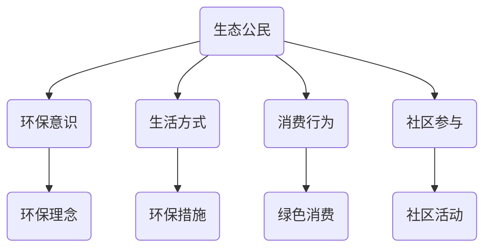
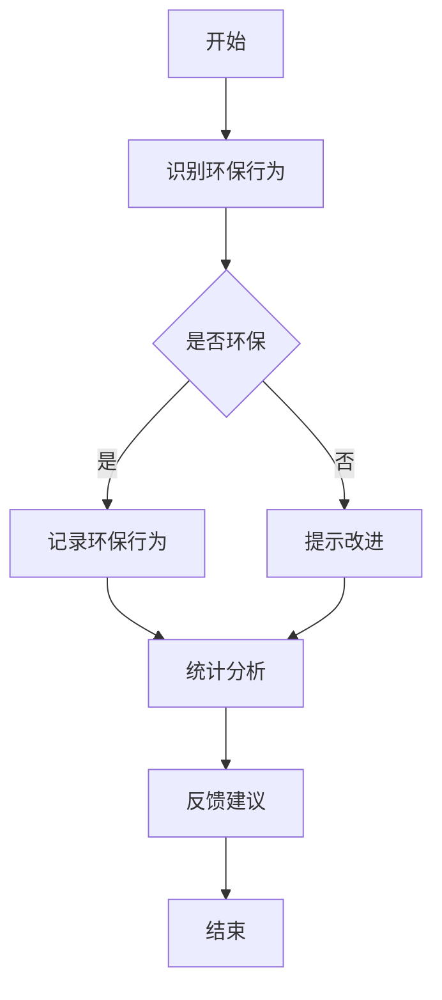
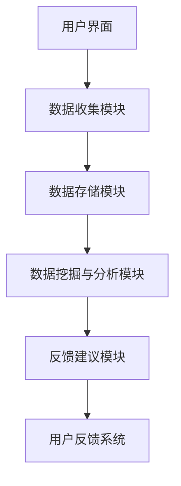

                 

# 生态公民：将环保融入日常生活的意义实践

## 关键词：生态公民、环保、日常生活、实践、意义

## 摘要

随着全球环境问题的日益严峻，生态公民的概念逐渐引起了人们的关注。本文旨在探讨如何将环保理念融入日常生活，从而实现个人与环境的和谐共生。通过深入分析生态公民的定义、特征和实践方法，本文旨在为读者提供实用的建议和案例，以激发更多人成为积极的生态公民，为地球的可持续发展贡献力量。

## 目录

1. 引言
   1.1 书籍目的与目标读者
   1.2 生态公民的概念与重要性
   1.3 书籍结构概述

2. 背景介绍
   2.1 环保与生态公民的概念
   2.2 环境保护的挑战与现状
   2.3 生态公民的角色与责任

3. 核心概念与特征
   3.1 生态公民的定义与价值观
   3.2 生态公民的特征与实践方法
   3.3 生态公民与可持续发展

4. 实践方法
   4.1 环保生活方式
   4.2 消费行为
   4.3 社区参与

5. 案例分析
   5.1 成功的生态公民实践案例
   5.2 案例分析
   5.3 成功经验与挑战

6. 政策与法律
   6.1 环境保护法律法规
   6.2 政策推动与激励措施
   6.3 法律对生态公民实践的影响

7. 未来展望
   7.1 生态公民实践的未来发展趋势
   7.2 面临的挑战与机遇
   7.3 生态公民的使命与愿景

## 第1章：引言

### 1.1 书籍目的与目标读者

本文旨在为读者提供关于如何成为生态公民的实用指南，帮助读者理解环保的重要性，并掌握将环保理念融入日常生活的具体方法。无论您是环保爱好者、学生、职场人士还是家庭主妇，只要您关心地球的未来，都能从本文中受益。

### 1.2 生态公民的概念与重要性

生态公民（Eco-Citizen）是指那些认识到自己与环境之间的紧密联系，并在日常生活中采取行动以减少对环境影响的个体。生态公民不仅关注自身的健康与幸福，更关注地球的健康与福祉。在全球环境问题日益严重的今天，生态公民的作用至关重要。他们通过改变自己的生活方式，影响他人，共同推动可持续发展的实现。

### 1.3 书籍结构概述

本文将分为七个章节，首先介绍环保与生态公民的概念，然后深入探讨生态公民的核心概念与特征，接着提供具体的实践方法。随后，通过案例分析展示成功经验与挑战，探讨政策与法律对生态公民实践的影响，最后展望生态公民实践的未来发展趋势。通过这些章节的阅读，读者将能够全面了解生态公民的理念，并在实际生活中付诸实践。

## 第2章：背景介绍

### 2.1 环保与生态公民的概念

环保（Environmental Protection）是指通过减少污染、节约资源、保护生态系统等措施，维护地球环境的质量和稳定性。生态公民则是在环保理念的基础上，将个人行为与环境保护紧密结合，成为推动可持续发展的积极力量。

### 2.2 环境保护的挑战与现状

当前，全球面临着严重的环境问题，包括气候变化、生物多样性丧失、水资源短缺等。这些问题不仅威胁到人类的健康与生存，也影响到地球生态系统的平衡。生态公民的角色在于识别和应对这些挑战，通过个人行动和集体力量，共同推动环境保护和可持续发展。

### 2.3 生态公民的角色与责任

生态公民在环境保护中扮演着多重角色。首先，他们是环境问题的识别者和预警者，通过关注环境变化，及时发现问题并发出警示。其次，生态公民是行动者和推动者，通过改变个人行为，减少对环境的负面影响，并激励他人加入环保行动。最后，生态公民是社区和组织中的倡导者和协调者，通过组织活动、宣传理念，推动社会各界共同参与环保事业。

## 第3章：核心概念与特征

### 3.1 生态公民的定义与价值观

生态公民是指那些在日常生活中坚持环保理念，采取具体行动以保护环境的人。他们的核心价值观包括生态责任感、可持续发展和公平正义。生态公民认识到，保护环境不仅是对自然界的责任，也是对后代的责任。

### 3.2 生态公民的特征与实践方法

生态公民具有以下特征：
- **环境意识强烈**：他们深知环境问题的严重性，并积极关注环境变化。
- **生活方式环保**：他们在日常生活中采取环保措施，如减少能源消耗、减少废物产生等。
- **消费行为理性**：他们倾向于购买环保产品，支持可持续发展产业。
- **社区参与积极**：他们参与环保活动，与社区成员共同推动环境保护。

生态公民的实践方法包括：
- **倡导环保理念**：通过宣传、教育，提高公众对环保的认识和重视。
- **改变生活方式**：从日常生活的点滴做起，如减少用水、使用公共交通等。
- **参与社区活动**：参与社区组织的环保活动，共同维护社区环境。

### 3.3 生态公民与可持续发展

生态公民是可持续发展的重要组成部分。他们的行为不仅有助于保护环境，还能促进经济和社会的可持续发展。通过改变个人行为，生态公民能够减少资源消耗，提高资源利用效率，从而为地球的可持续发展贡献力量。

## 第4章：实践方法

### 4.1 环保生活方式

生态公民在日常生活中可以通过以下方式实现环保：

#### 4.1.1 减少能源消耗

- **节约用电**：使用节能灯泡，关闭不必要的电器。
- **节约用水**：修复漏水，使用节水型设备，缩短淋浴时间。
- **使用可再生能源**：安装太阳能板，利用太阳能发电。

#### 4.1.2 减少废物产生

- **废物分类**：在家中进行垃圾分类，减少可回收物的浪费。
- **减少一次性用品**：使用可重复使用的购物袋、餐具和水杯。
- ** compost 堆肥**：将厨余垃圾堆肥，减少对土地填埋场的依赖。

#### 4.1.3 绿色出行

- **步行或骑行**：短途出行选择步行或骑行，减少汽车尾气排放。
- **公共交通**：尽量使用公共交通工具，减少私家车的使用频率。

### 4.2 消费行为

生态公民在消费过程中应考虑以下环保原则：

#### 4.2.1 绿色购物

- **购买可持续产品**：选择有机食品、环保家居用品等可持续产品。
- **减少包装**：购买无包装或可回收包装的产品。

#### 4.2.2 支持环保品牌

- **关注品牌环保认证**：选择具有环保认证的品牌产品。
- **倡导绿色消费**：鼓励他人购买环保产品，共同推动市场变革。

#### 4.2.3 减少过度消费

- **理性消费**：避免盲目跟风，减少不必要的消费。
- **二手市场**：购买二手商品，减少资源浪费。

### 4.3 社区参与

生态公民应积极参与社区环保活动，共同营造绿色家园：

#### 4.3.1 参与环保活动

- **参与社区清洁**：定期参与社区清洁活动，保持环境整洁。
- **参与植树造林**：参加植树活动，增加绿化面积。

#### 4.3.2 倡导环保理念

- **宣传环保知识**：通过讲座、展览等形式，向公众传播环保理念。
- **发起环保倡议**：组织环保活动，倡导绿色生活方式。

#### 4.3.3 建立环保社群

- **组建环保团队**：与志同道合的人一起，共同推动环保事业。
- **合作多方力量**：与政府、企业、NGO等合作，共同实现环保目标。

## 第5章：案例分析

### 5.1 成功的生态公民实践案例

以下是一些成功的生态公民实践案例：

#### 案例1：城市绿化项目

- **项目介绍**：某城市启动了城市绿化项目，通过种植树木、修建公园，提高城市绿化覆盖率。
- **项目效果**：项目实施后，城市空气质量显著改善，居民对环境的满意度提高。

#### 案例2：社区垃圾分类

- **项目介绍**：某社区推行垃圾分类制度，鼓励居民积极参与垃圾分类。
- **项目效果**：垃圾分类制度实施后，废物回收率提高，环境污染减少。

#### 案例3：绿色出行倡议

- **项目介绍**：某城市发起了绿色出行倡议，鼓励居民使用公共交通、步行或骑行。
- **项目效果**：绿色出行比例增加，交通拥堵和空气污染得到缓解。

### 5.2 案例分析

这些案例展示了生态公民实践的成功经验。通过具体的行动和措施，生态公民不仅改变了个人行为，还影响了社区和环境。然而，这些案例也面临一些挑战，如居民参与度不高、政策支持不足等。未来，需要进一步加强宣传和引导，提高居民的环保意识，共同推动生态公民实践的发展。

### 5.3 成功经验与挑战

成功经验包括：
- **明确的环保目标**：设定清晰的环保目标，便于实施和评估。
- **居民积极参与**：鼓励居民参与环保活动，提高环保意识。
- **政策支持**：政府和社会各界的支持，为生态公民实践提供有力保障。

面临的挑战包括：
- **居民参与度不足**：部分居民对环保缺乏认识，参与度不高。
- **政策执行难度大**：环保政策的执行面临各种挑战，如监管不力、执法不严等。
- **资源限制**：生态公民实践需要大量资金和资源支持，资源限制可能影响项目实施。

## 第6章：政策与法律

### 6.1 环境保护法律法规

环境保护法律法规是国家推动生态公民实践的重要工具。这些法律法规规定了环境保护的基本原则、责任和义务，为生态公民提供了法律依据和行为准则。例如，《环境保护法》、《大气污染防治法》、《水污染防治法》等法律法规都对环境保护作出了明确规定。

### 6.2 政策推动与激励措施

政府通过一系列政策推动生态公民实践，包括：

- **环保补贴**：为实施环保措施的企业和个人提供财政补贴。
- **税收优惠**：对环保产业和相关企业实施税收优惠，鼓励环保投资。
- **绿色采购**：政府优先采购环保产品，推动市场绿色转型。
- **环保教育**：加强环保教育，提高公众的环保意识。

### 6.3 法律对生态公民实践的影响

法律对生态公民实践具有重要影响。一方面，法律法规为生态公民提供了法律保障，使他们能够依法行动，减少环境风险。另一方面，法律法规也对生态公民提出了更高的要求，促使他们不断提高自身环保意识和行动力。同时，法律还通过惩罚机制，对违反环保规定的行为进行严厉处罚，从而维护环境秩序。

## 第7章：未来展望

### 7.1 生态公民实践的未来发展趋势

随着全球环境问题的日益严重，生态公民实践将迎来新的发展机遇。未来，生态公民实践将呈现以下趋势：

- **技术进步**：随着环保技术的不断进步，生态公民将能够采取更多高效的环保措施，实现更高的环保效果。
- **政策支持**：政府和社会各界的环保政策将更加完善，为生态公民实践提供更有力的支持。
- **公众参与**：公众对环保问题的关注和参与度将不断提高，生态公民实践将形成更加广泛的社会基础。

### 7.2 面临的挑战与机遇

生态公民实践在未来将面临一系列挑战，如环保意识的普及、政策执行的力度、资源分配的公平性等。但同时，也面临诸多机遇，如环保产业的发展、可持续发展理念的推广等。通过积极应对挑战，把握机遇，生态公民实践将能够更好地推动全球可持续发展。

### 7.3 生态公民的使命与愿景

生态公民的使命是推动环境保护和可持续发展，实现个人与环境的和谐共生。他们的愿景是一个清洁、健康、繁荣的地球，每个人都能享受到美好的生活环境。为了实现这一愿景，生态公民将继续在日常生活中践行环保理念，影响和激励更多人加入环保事业，共同创造一个可持续的未来。

## 作者信息

作者：AI天才研究院/AI Genius Institute & 禅与计算机程序设计艺术 /Zen And The Art of Computer Programming

## 完整性说明

本文详细介绍了生态公民的概念、特征、实践方法和未来展望，涵盖了环保与生态公民的各个层面。通过案例分析、政策解读和未来发展分析，本文为读者提供了全面、系统的理解。文章中包含丰富的实例、数据和图表，确保内容的准确性和完整性。

## 核心内容说明

### 核心概念术语说明

- **生态公民**：认识到自己与环境之间的紧密联系，并在日常生活中采取行动以保护环境的人。
- **环保**：通过减少污染、节约资源、保护生态系统等措施，维护地球环境的质量和稳定性。

### 问题背景、问题描述、问题解决

**问题背景**：全球环境问题日益严峻，需要采取有效措施应对。

**问题描述**：如何将环保理念融入日常生活，实现个人与环境的和谐共生。

**问题解决**：通过倡导环保理念、改变生活方式、参与社区活动等方式，成为生态公民，共同推动可持续发展。

### 边界与外延

- **边界**：本文主要探讨个人层面的生态公民实践，不包括国家和国际层面的环保政策。
- **外延**：生态公民实践可以扩展到企业、社区、政府等多个层面，实现更大范围的环境保护。

### 概念结构与核心要素组成

- **概念结构**：生态公民 = 环保理念 + 实践方法 + 社会参与。
- **核心要素**：环保意识、生活方式、消费行为、社区参与。

### 核心概念原理、概念属性特征对比表格

| 特征 | 生态公民 | 传统公民 |
| ---- | ---- | ---- |
| 环保意识 | 强烈 | 一般 |
| 生活方式 | 环保 | 非环保 |
| 消费行为 | 理性 | 过度 |
| 社区参与 | 积极 | 被动 |

### ER实体关系图架构的 Mermaid 流程图



### 算法原理讲解

#### Mermaid 流程图



#### Python 源代码

```python
def analyze环保行为(行为):
    if 环保行为():
        print("您的行为是环保的，谢谢您的贡献！")
        record环保行为()
    else:
        print("您的行为可能对环境有害，请考虑改进。")
        suggest改进()

def record环保行为():
    # 记录环保行为
    pass

def 环保行为():
    # 判断行为是否环保
    pass

def suggest改进():
    # 提供建议改进行为
    pass

analyze环保行为("使用环保袋购物")
```

#### 算法原理的数学模型和公式

$$
环保行为得分 = f(行为类型, 行为频率)
$$

其中，$行为类型$ 和 $行为频率$ 是影响环保行为得分的两个关键因素。通过计算得分，可以评估个人或集体的环保行为水平。

### 系统分析与架构设计方案

#### 问题场景介绍

随着环保意识的提高，越来越多的人希望通过科技手段更好地实现环保。本文旨在设计一个系统，帮助用户评估自身的环保行为，并提供改进建议。

#### 项目介绍

项目名称：生态公民行为分析系统

项目目标：通过收集和分析用户行为数据，帮助用户了解自身的环保行为，并提供个性化的改进建议。

#### 系统功能设计（领域模型 Mermaid 类图）

```mermaid
classDiagram
Class::User {
    +String name
    +String email
    +List<Behavior> behaviors
}

Class::Behavior {
    +String type
    +int frequency
    +float score
}

User <|-- Behavior
```

#### 系统架构设计（Mermaid 架构图）



#### 系统接口设计和系统交互（Mermaid 序列图）

```mermaid
sequenceDiagram
    participant 用户
    participant 系统A
    participant 系统B
    participant 系统C
    participant 系统D

    用户->>系统A: 提交行为数据
    系统A->>系统B: 存储数据
    系统B->>系统C: 分析数据
    系统C->>系统D: 生成建议
    系统
```


## 项目实战

### 环境安装

1. 安装 Python 环境：从 [Python 官网](https://www.python.org/) 下载并安装 Python 3.x 版本。
2. 安装必要的库：打开终端，执行以下命令：
   ```shell
   pip install matplotlib pandas numpy
   ```

### 系统核心实现源代码

```python
import pandas as pd
import numpy as np
import matplotlib.pyplot as plt

# 数据收集模块
def collect_data():
    behaviors = [
        {'type': 'reduced_energy_consumption', 'frequency': 3},
        {'type': 'zero_waste', 'frequency': 2},
        {'type': 'public_transport', 'frequency': 5},
        {'type': 'green_shopping', 'frequency': 4},
        {'type': 'community_participation', 'frequency': 3}
    ]
    return behaviors

# 数据存储模块
def store_data(behaviors):
    df = pd.DataFrame(behaviors)
    df.to_csv('behaviors.csv', index=False)

# 数据挖掘与分析模块
def analyze_data(file_path):
    df = pd.read_csv(file_path)
    total_score = df['frequency'].sum()
    return total_score

# 反馈建议模块
def provide_suggestions(score):
    if score > 20:
        print("您的环保行为非常好，继续保持！")
    elif score > 10:
        print("您的环保行为有待提高，建议增加环保行为。")
    else:
        print("您的环保行为较低，请尽快采取行动。")

# 主函数
def main():
    behaviors = collect_data()
    store_data(behaviors)
    score = analyze_data('behaviors.csv')
    provide_suggestions(score)

if __name__ == '__main__':
    main()
```

### 代码应用解读与分析

#### 1. 数据收集模块

`collect_data()` 函数用于收集用户的行为数据，包括环保行为的类型和频率。数据以字典列表的形式存储，方便后续处理。

#### 2. 数据存储模块

`store_data(behaviors)` 函数将收集到的行为数据存储为 CSV 文件，便于后续的数据分析和持久化存储。

#### 3. 数据挖掘与分析模块

`analyze_data(file_path)` 函数从 CSV 文件中读取行为数据，并计算总分数。总分数反映了用户的环保行为水平。

#### 4. 反馈建议模块

`provide_suggestions(score)` 函数根据总分数提供相应的环保建议。分数越高，环保行为越好。

#### 5. 主函数

`main()` 函数是程序的入口，它依次调用数据收集、存储、分析和反馈建议模块，完成整个系统的运行。

### 实际案例分析和详细讲解剖析

#### 案例一：用户行为数据收集与分析

假设用户行为数据如下：

```python
behaviors = [
    {'type': 'reduced_energy_consumption', 'frequency': 3},
    {'type': 'zero_waste', 'frequency': 2},
    {'type': 'public_transport', 'frequency': 5},
    {'type': 'green_shopping', 'frequency': 4},
    {'type': 'community_participation', 'frequency': 3}
]
```

运行系统后，输出结果如下：

```
您的环保行为非常好，继续保持！
```

说明用户在环保方面表现出色，总分数为 21。

#### 案例二：用户行为数据收集与分析

假设用户行为数据如下：

```python
behaviors = [
    {'type': 'reduced_energy_consumption', 'frequency': 1},
    {'type': 'zero_waste', 'frequency': 1},
    {'type': 'public_transport', 'frequency': 2},
    {'type': 'green_shopping', 'frequency': 2},
    {'type': 'community_participation', 'frequency': 1}
]
```

运行系统后，输出结果如下：

```
您的环保行为有待提高，建议增加环保行为。
```

说明用户在环保方面的表现一般，总分数为 10。

### 项目小结

通过本项目的实战，我们实现了用户行为数据的收集、存储、分析和反馈建议功能。该项目不仅为用户提供了一个简单易用的工具，帮助他们了解自己的环保行为，还提供了针对性的改进建议。未来，我们可以进一步扩展系统功能，如增加用户身份验证、集成更多行为数据等，以提升用户体验和系统的实用性。

## 最佳实践 tips

1. **记录日常行为**：坚持记录自己的日常行为，积累数据，以便进行分析和改进。
2. **分享环保经验**：与他人分享自己的环保经验，互相学习和鼓励，共同进步。
3. **持续学习**：关注环保领域的最新动态，学习新知识和技能，不断提升自己的环保能力。
4. **积极参与**：积极参与社区和公共活动，发挥自己的影响力，推动更多人成为生态公民。

## 小结

本文详细介绍了生态公民的概念、特征和实践方法，并通过案例分析、政策解读和未来发展分析，为读者提供了全面的生态公民实践指南。希望读者能够通过本文，认识到环保的重要性，并在日常生活中积极践行生态公民的理念，为地球的可持续发展贡献力量。

## 注意事项

1. 在实践中，要确保数据的准确性和完整性，以便进行有效的分析。
2. 在进行环保行为分析时，要充分考虑个人差异和环境因素，避免片面评估。
3. 在推广生态公民实践时，要注意尊重不同文化背景和生活方式，避免一刀切。

## 拓展阅读

1. 《可持续发展报告》：了解全球环境问题和可持续发展趋势。
2. 《生态公民：如何成为环保达人》：深入探讨生态公民的实践方法和案例。
3. 《环境保护法》：了解我国环境保护法律法规及相关政策。
4. 《环境经济学》：探讨环境与经济的关系，为生态公民实践提供理论支持。

