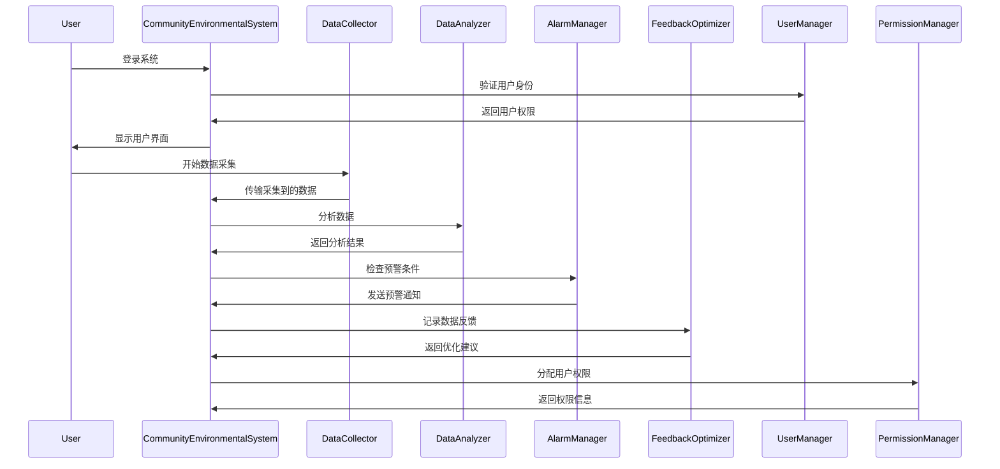
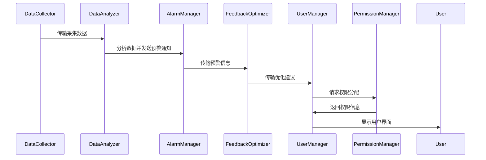

                 

### 引言

#### 1.1 生态意识的起源与发展

生态意识，作为一个现代概念，起源于人类对自然环境的深刻认识和反思。自古以来，人类就在与自然环境的互动中寻求生存与发展。然而，随着工业革命的到来，人类对自然的掠夺式开发逐渐加剧，导致了一系列严重的环境问题，如空气污染、水污染、土地退化等。这些问题迫使人们开始思考如何实现人与自然的和谐共生，从而催生了生态意识的萌芽。

生态意识的系统发展可以追溯到20世纪初。当时，一些科学家如恩斯特·海克尔（Ernst Haeckel）提出了“生态学”这一术语，旨在研究生物与其非生物环境之间的关系。随后，随着环境问题的日益严重，生态意识逐渐成为全球关注的焦点。1972年的联合国人类环境会议（又称斯德哥尔摩会议）标志着生态意识进入了一个新的阶段，世界各国开始认识到环境保护的重要性。

#### 1.2 环境问题的严峻现实

环境问题已经成为全球性的挑战，对人类的生存和发展构成了严重威胁。首先，空气污染是一个突出的问题。据世界卫生组织（WHO）的数据显示，空气污染每年导致全球数百万人提前死亡。这些污染物不仅损害人类的呼吸系统，还加剧了全球变暖问题。

其次，水污染也是一个严峻的问题。许多河流、湖泊和海洋已经受到污染，无法再为人类提供清洁的水资源。水污染不仅影响了人类的饮水安全，还对水生生态系统造成了破坏，导致了许多物种的灭绝。

另外，土地退化也是一个不可忽视的问题。过度开垦、过度放牧和森林砍伐等行为导致了土地的荒漠化和盐碱化，影响了农田的产量和生态系统的稳定性。

#### 1.3 个人与环境的共生关系

个人与环境的共生关系是生态意识的核心。人类作为地球上的一个物种，与自然环境息息相关。我们的生存和发展离不开清洁的空气、水和土壤。同时，个人的行为也对环境产生深远的影响。例如，个人的消费习惯、生活方式和职业选择都会对环境造成不同的影响。

个人与环境的共生关系可以从多个层面来理解。首先，从生物学的角度来看，人类是生态系统中的一个组成部分，我们的生理和心理健康都受到环境因素的影响。其次，从社会文化的角度来看，个人行为和价值观也会影响环境。例如，环保意识的普及可以促进更多人采取环保行动，减少对环境的破坏。

总结来说，生态意识的形成和发展是人类对自身与环境关系的深刻认识。环境问题的严峻现实提醒我们，个人与环境的共生关系至关重要。只有通过培养生态意识，采取实际行动，我们才能实现人与自然的和谐共生。

### 生态学基础

#### 2.1 生态学的基本概念

生态学是研究生物与其环境之间相互关系的科学。它关注的是生物之间以及生物与其非生物环境之间的相互作用和影响。生态学的基本概念包括生态系统、生物群落、物种多样性、生态位、食物链和食物网等。

- **生态系统**：生态系统是指在一定区域内，生物群落与其非生物环境通过物质循环和能量流动相互作用而形成的生态单位。生态系统可以分为自然生态系统和人工生态系统。自然生态系统如森林、草原、海洋等，而人工生态系统如农田、城市公园等。
- **生物群落**：生物群落是指在相同环境中，具有相似生活习性和生态关系的多种生物种群的集合。生物群落包括植物、动物和微生物等，它们相互依赖，共同维持生态系统的平衡。
- **物种多样性**：物种多样性是指地球上生物种类（物种）的丰富程度。物种多样性是生态系统稳定性和功能性的重要指标。生物多样性包括遗传多样性、物种多样性和生态系统多样性三个层次。
- **生态位**：生态位是指某个物种在生态系统中所占有的位置，包括其食物来源、栖息地、竞争关系等。生态位决定了物种在生态系统中的角色和功能。
- **食物链和食物网**：食物链是描述生物之间能量和物质流动的线性关系，通常以生产者、消费者和分解者的形式呈现。食物网是由多个食物链相互交织而成的复杂网络，更加全面地反映了生态系统中的能量和物质流动。

#### 2.2 生态系统服务

生态系统服务是指生态系统为人类提供的各种物质和非物质产品和服务。这些服务对人类的生活和经济发展至关重要。生态系统服务可以分为四大类：供给服务、调节服务、文化服务和支持服务。

- **供给服务**：供给服务是指生态系统为人类提供的各种自然资源和产品，如食物、水、木材、纤维和药物等。这些资源是维持人类生存和发展的基础。
- **调节服务**：调节服务是指生态系统通过生物过程调节气候、水质、土壤健康和疾病传播等服务。例如，森林可以调节气候，湿地可以净化水质，农田可以维持土壤健康。
- **文化服务**：文化服务是指生态系统为人类提供的休闲娱乐、美学欣赏、精神寄托和文化传承等服务。例如，自然保护区可以提供旅游和休闲活动，公园可以提供城市居民休闲娱乐的场所。
- **支持服务**：支持服务是指生态系统为其他服务提供的支持功能，如土壤形成、营养循环、水循环和生物多样性等。这些基础服务是所有其他生态系统服务的基础。

#### 2.3 生态平衡与生态破坏

生态平衡是指生态系统中各种生物和环境因素在长时间内保持相对稳定和和谐的状态。生态平衡是实现生态系统可持续发展的关键。生态平衡受到多种因素的影响，包括物种多样性、生态位、食物链和食物网等。

生态破坏是指人类活动对自然环境造成的负面影响，导致生态系统失去平衡和功能。生态破坏的主要形式包括过度开采资源、环境污染、生物多样性丧失和栖息地破坏等。

- **过度开采资源**：人类对自然资源的不合理开发和过度利用，如过度捕捞、过度砍伐和过度开采矿物等，导致生态系统的物质循环和能量流动失衡。
- **环境污染**：环境污染包括空气污染、水污染和土壤污染等，对生态系统造成严重破坏。例如，工业排放的废气、废水和固体废物可以导致空气污染和水源污染。
- **生物多样性丧失**：生物多样性丧失是指物种数量和种类的减少。生物多样性丧失导致生态系统的脆弱性增加，生态平衡受到威胁。
- **栖息地破坏**：栖息地破坏包括栖息地丧失、栖息地破碎化和栖息地退化等。栖息地破坏导致许多物种失去栖息地和生存空间，威胁到它们的生存和繁衍。

#### 2.4 核心概念与联系

在生态学中，多个核心概念相互关联，构成了生态学研究的框架。以下是一个简化的ER实体关系图，用于展示这些核心概念之间的联系：

```mermaid
erDiagram
  Person ||--|{ EnvironmentalFactor }|| EnvironmentalFactor
  Person ||--|{ Ecosystem }|| Ecosystem
  EnvironmentalFactor ||--|{ Ecosystem }|| Ecosystem
```

- **Person（个人）**：个人是生态系统中的一个重要因素，其行为和生活方式直接影响环境。
- **EnvironmentalFactor（环境因素）**：环境因素包括空气、水、土壤、气候等，对个人和生态系统都有重要影响。
- **Ecosystem（生态系统）**：生态系统是生物与环境相互作用形成的整体，包括生物群落、物种多样性和生态位等。

这个ER实体关系图展示了个人、环境因素和生态系统之间的基本联系，强调了个人行为对环境的影响以及环境对个人的反作用。通过理解和应用这些核心概念，我们可以更好地认识生态系统的运作机制，从而制定有效的环境保护策略。

### 个体行为对环境的影响

#### 3.1 个人日常生活与环境

个人的日常生活行为对环境有着深远的影响。从日常的饮食习惯到消费模式，再到交通工具的选择，每一个小细节都在默默地影响着我们周围的自然环境。

首先，饮食习惯是影响环境的重要因素之一。现代饮食习惯中，肉类的消费量日益增加，这导致了大量的土地和水资源消耗。畜牧业排放的温室气体也是全球变暖的主要因素之一。例如，美国环境研究学者的一项研究发现，减少红肉摄入量可以显著减少温室气体的排放，从而减轻环境压力。

其次，消费模式对环境的影响也不可忽视。过度消费和资源浪费导致了大量的垃圾产生和资源的过度开采。消费者选择购买可持续、环保的产品，可以减少对环境的负面影响。例如，使用可回收材料的产品、减少一次性塑料制品的使用等，都是有助于环境保护的举措。

再者，交通工具的选择对环境的影响也很大。汽车尾气是城市空气污染的主要来源之一。因此，选择公共交通工具、骑自行车或步行等低碳出行方式，可以减少空气污染和温室气体排放。

#### 3.2 消费习惯与环境保护

消费习惯直接关联到资源消耗和环境退化。随着全球消费者需求的增长，对自然资源的需求也在不断增加。例如，电子产品更新换代的速度加快，导致了大量电子垃圾的产生。这些电子垃圾含有有害物质，对环境造成了严重污染。

为了减少消费习惯对环境的影响，可以采取以下措施：

1. **减少一次性用品的使用**：使用可重复使用的物品，如购物袋、水瓶和餐具，可以减少塑料垃圾的产生。
2. **购买可持续产品**：选择那些使用环保材料、具有耐用性和可回收性的产品。
3. **回收和再利用**：积极参与垃圾分类和回收，将废品转化为新的资源。

此外，消费者的选择也可以推动企业向更环保的方向发展。例如，越来越多的消费者选择购买有机食品，这促使农业企业采用更加环保的生产方式。

#### 3.3 个人选择的力量

个人选择在环境保护中扮演着至关重要的角色。尽管单个个人的行为对环境的影响有限，但当无数个人联合起来时，其力量是巨大的。以下是几个个人选择对环境保护的典型案例：

1. **碳抵消**：个人可以选择购买碳抵消额度，用以抵消自己的碳足迹。例如，飞行时购买碳抵消额度，可以减少因飞行产生的温室气体排放。
2. **绿色出行**：选择公共交通、骑自行车或步行等低碳出行方式，可以减少汽车尾气的排放。
3. **节约用水**：通过简单的措施如安装节水装置、缩短淋浴时间等，可以显著减少水资源的消耗。

个人选择的力量不仅体现在环境保护的具体行动上，还体现在对社会的引导和推动上。例如，越来越多的消费者选择购买环保产品，这促使企业改进生产工艺，减少环境污染。

总之，个人的日常生活行为和消费习惯对环境有着深远的影响。通过改变消费习惯、做出环保的选择，每个人都可以为环境保护贡献自己的力量。当我们意识到个人选择的重要性并付诸行动时，我们将共同创造一个更加可持续和健康的世界。

### 生态意识的培养与实践

#### 4.1 教育与宣传的作用

生态意识的培养离不开教育和宣传。教育是生态意识形成的重要途径，通过系统的教育和培训，人们可以深刻理解生态学的基本概念、生态系统的重要性以及环境保护的紧迫性。以下是从教育角度培养生态意识的几种方法：

1. **学校教育**：在学校课程中增加生态学知识的教育内容，使学生从小接触生态意识。例如，在中小学设置生态学基础课程，让学生了解生物多样性、生态系统服务以及环境保护的重要性。

2. **专业培训**：对相关专业人士进行生态学知识的专业培训，使其能够更好地理解和应用生态学原理。例如，环境科学家、生态工程师、农业专家等，都需要具备扎实的生态学知识。

3. **终身学习**：鼓励公众通过成人教育、在线课程等方式进行终身学习，不断提升自己的生态意识。例如，可以开设生态学公开课、研讨会和讲座，以普及生态学知识。

宣传是生态意识培养的另一个重要手段，通过各种渠道向公众传达生态学知识和环境保护的重要性。以下是从宣传角度培养生态意识的几种方法：

1. **媒体宣传**：利用电视、广播、报纸、网络等媒体平台，发布有关生态保护和环境保护的报道、专题节目和公益广告，提高公众的生态意识。

2. **社区活动**：在社区举办生态保护活动，如环保宣传讲座、清洁活动、植树活动等，增强居民的环保意识和参与感。

3. **社会宣传**：通过社会组织、非政府组织和志愿者团体开展生态保护宣传，如发布宣传手册、举办环保展览、组织环保志愿者活动等。

#### 4.2 生态意识培养的方法

生态意识的培养需要系统的策略和方法，以下是一些有效的培养方法：

1. **环境教育**：通过环境教育，使人们了解生态系统的运作机制、环境问题的成因和解决方法。环境教育可以包括学校课程、社区讲座、科普读物等多种形式。

2. **体验式学习**：通过参与实地考察、生态体验活动，使人们亲身体验自然环境，增强对生态系统的感受和认识。例如，组织学生参观自然保护区、生态农场等，让他们直观地了解生态系统的运作。

3. **技术手段**：利用现代科技手段，如虚拟现实（VR）、增强现实（AR）和移动应用等，提供互动式的生态教育体验。例如，通过VR技术模拟生态系统，让学生沉浸式地了解生态系统的运作。

4. **社区参与**：鼓励社区居民参与到生态保护实践中，如社区花园建设、垃圾分类和回收、环保志愿者活动等，增强他们的环保意识和行动力。

#### 4.3 个人行动指南

培养生态意识不仅需要教育宣传，还需要每个人的实际行动。以下是一些个人行动指南，帮助人们将生态意识转化为具体的环保行为：

1. **节能减排**：在日常生活中采取节能减排的措施，如使用节能电器、减少不必要的用水和用电等，降低碳足迹。

2. **绿色出行**：选择公共交通工具、骑自行车或步行等低碳出行方式，减少汽车尾气的排放。

3. **减少浪费**：在消费过程中，减少一次性用品的使用，提倡循环利用和垃圾分类。

4. **支持环保产品**：选择环保认证的产品，如有机食品、节能家电、环保建材等，鼓励企业采用环保生产工艺。

5. **参与社区活动**：积极参与社区环保活动，如植树节、清洁活动、环保讲座等，与他人共同推动环保事业。

6. **学习和传播**：不断学习和了解生态学知识，通过社交媒体、朋友圈等途径传播环保理念，影响更多人加入环保行动。

通过教育宣传、系统培养方法和个人行动指南，我们可以逐步提高生态意识，推动环境保护和可持续发展。每个人都是生态保护的参与者，只有大家共同努力，才能创造一个更美好的未来。

### 环境保护政策与制度

#### 5.1 环境保护政策概述

环境保护政策是国家或地区为解决环境问题、实现环境保护目标而制定的一系列法律法规、规划和政策措施。这些政策旨在规范人类行为，减少环境污染，保护和改善生态环境。

环境保护政策的主要内容包括：

1. **法律法规**：制定和实施环境保护法律法规，如《环境保护法》、《水污染防治法》、《大气污染防治法》等，明确环境保护的基本原则和法律责任。
2. **规划与目标**：制定环境保护中长期规划，设定环境保护目标和任务，如减少污染物排放、提高资源利用效率、改善环境质量等。
3. **政策措施**：采取一系列政策措施，如财政支持、税收优惠、技术扶持等，鼓励企业和个人采取环保行动。

环境保护政策的目标是：

1. **保护环境**：防止环境污染和生态破坏，保障生态环境的健康和稳定。
2. **改善环境质量**：通过减少污染物排放、提高资源利用效率，改善大气、水和土壤等环境质量。
3. **促进可持续发展**：实现经济、社会和环境的协调发展，保障人类的可持续发展。

#### 5.2 国际环境保护合作

国际环境保护合作是各国共同应对全球环境问题的重要途径。通过国际合作，各国可以分享经验、技术和管理方法，共同应对气候变化、生物多样性丧失、海洋污染等全球性环境问题。

国际环境保护合作的主要形式包括：

1. **多边环境协议**：如《联合国气候变化框架公约》、《生物多样性公约》、《联合国防治沙漠化公约》等，通过国际协议明确各国的环境责任和义务。
2. **区域合作**：如欧盟环境政策、东南亚环境合作等，通过区域性合作促进环境保护和可持续发展。
3. **技术交流与转移**：通过技术交流、培训和技术转让，帮助发展中国家提升环境保护能力，如气候适应技术、可再生能源技术等。

#### 5.3 我国环境保护制度

我国环境保护制度经过多年的发展和完善，已经形成了一套较为完善的法律体系和管理机制。我国环境保护制度的主要特点包括：

1. **立法完善**：我国制定了一系列环境保护法律法规，如《环境保护法》、《大气污染防治法》、《水污染防治法》等，为环境保护提供了法律保障。
2. **政策引导**：通过制定环境保护政策，如“环境保护行动计划”、“绿色出行计划”等，引导企业和个人采取环保行动。
3. **监管严格**：建立了环境监察和监测体系，加强对环境污染的监管和执法力度，确保环境保护政策的实施。
4. **科技创新**：推动环境保护科技创新，通过新技术、新材料的应用，提高环境保护效率和效果。

核心概念属性特征对比表格：

```mermaid
table
  |     属性         | 政策     | 合作     | 制度     |
  | ------------- | -------- | -------- | -------- |
  | 目标           | 保护环境 | 国际合作 | 管理环境 |
  | 范围           | 国内     | 国际     | 国内     |
  | 实施主体       | 政府     | 各国政府 | 政府     |
```

ER实体关系图：

```mermaid
erDiagram
  Policy ||--|{ EnvironmentalIssue }|| EnvironmentalIssue
  Policy ||--|{ EnvironmentalProtection }|| EnvironmentalProtection
  Cooperation ||--|{ InternationalAgreement }|| InternationalAgreement
  System ||--|{ Monitoring }|| Monitoring
```

通过环境保护政策与制度，我国在环境保护方面取得了显著成效。然而，面对日益严峻的环境问题，仍需不断完善政策和制度，加强国际合作，推动科技创新，实现生态环境的持续改善和可持续发展。

### 企业与生态意识

#### 6.1 企业与生态环境的关系

企业在现代社会中扮演着重要的角色，不仅在经济活动中占据核心地位，同时也在环境保护和可持续发展中承担着重大责任。企业与环境的关系主要体现在以下几个方面：

首先，企业的生产活动直接影响到生态环境。例如，制造业企业的大量排放物可能导致空气污染、水污染和土壤污染，破坏生态系统。同时，企业的资源消耗和废弃物处理也对环境产生深远影响。据联合国统计，全球75%的温室气体排放来自企业活动，这些排放加剧了全球变暖和气候变化问题。

其次，企业在环境保护中具有重要作用。通过采取环保措施，如采用清洁生产技术、提高资源利用效率、减少废弃物排放等，企业可以有效减少对环境的负面影响。许多知名企业已经开始重视环境保护，通过实施绿色供应链管理、开展环保公益活动等方式，积极参与环境保护工作。

此外，企业还通过参与国际合作和推动政策制定，对全球环境保护产生重要影响。例如，参与国际环境协议和标准制定，推动全球环境治理的进程；通过参与地方和国家级的环境保护项目，提升当地环境保护水平。

#### 6.2 绿色经济的理念与实践

绿色经济是指以环境保护和可持续发展为核心，通过优化资源配置、提高生产效率和减少污染排放，实现经济、社会和环境的协调发展。绿色经济理念的核心在于通过经济转型，实现从传统的高消耗、高污染、低效益的经济发展模式，向低消耗、低污染、高效益的经济发展模式转变。

绿色经济的实践主要体现在以下几个方面：

1. **清洁生产**：企业通过采用清洁生产技术，减少生产过程中的污染排放和资源消耗。例如，使用环保原材料、改进生产工艺、优化生产流程等，从源头上减少环境污染。

2. **节能减排**：企业通过采取节能减排措施，降低能源消耗和碳排放。例如，采用节能设备、改进能源管理系统、推广可再生能源等，提高能源利用效率。

3. **循环经济**：企业通过建立资源循环利用体系，实现资源的可持续利用。例如，回收利用废弃物、设计可拆卸和可回收的产品、推广再生资源等，减少资源浪费。

4. **绿色供应链**：企业通过绿色供应链管理，确保供应链各个环节的环保合规。例如，选择环保原材料供应商、实施绿色物流、推广绿色包装等，减少供应链对环境的影响。

#### 6.3 企业的生态责任

企业的生态责任不仅体现在环保措施的实施上，还体现在社会责任和可持续发展战略中。以下是企业应承担的生态责任：

1. **环境保护责任**：企业应遵守环境保护法律法规，采取积极措施减少环境污染和资源浪费。例如，开展环境风险评估、建立环境保护管理体系、实施环境绩效评估等。

2. **社会责任**：企业应关注环境保护和社会责任，通过环保公益活动和社区参与，提升企业的社会形象和品牌价值。例如，捐赠环保项目、参与社区绿化、支持环保教育等。

3. **可持续发展责任**：企业应制定和实施可持续发展战略，确保经济活动的可持续发展。例如，制定碳中和目标、推广绿色产品、实施社会责任报告等。

4. **技术创新责任**：企业应推动技术创新，研发和应用环保技术，提升环保效率和竞争力。例如，投资研发绿色能源、推广环保设备、开发环保材料等。

总之，企业是环境保护的重要参与者，通过绿色经济的理念与实践，企业可以在环境保护和可持续发展中发挥关键作用。企业应承担起生态责任，采取积极措施减少对环境的负面影响，推动全球环境治理和可持续发展。

### 社区与生态意识的构建

#### 7.1 社区生态意识的重要性

社区生态意识是指在社区层面上，居民对环境保护和可持续发展的认识、态度和行为。社区生态意识的重要性体现在以下几个方面：

首先，社区是环境保护的基石。社区居民作为环境行为的直接执行者，他们的生态意识和行为对环境质量有着直接影响。如果社区居民普遍具备较高的生态意识，他们会在日常生活中采取环保行动，如垃圾分类、节约用水、减少能源消耗等，从而有效减少环境污染。

其次，社区生态意识有助于形成良好的社区文化。当环保理念深入人心，社区居民会自觉参与到环境保护活动中，形成互相支持、共同维护环境的良好氛围。这种社区文化不仅提升了居民的幸福感，也促进了社区的和谐发展。

此外，社区生态意识对于培养年轻一代的环保意识也具有重要作用。家庭是孩子的第一课堂，家长的行为和态度会直接影响孩子的观念和行为。通过在社区内推广生态教育，可以让孩子从小培养起环保意识，从而为未来的环境保护工作奠定基础。

#### 7.2 社区环境保护实践

社区环境保护实践是提升社区生态意识的具体行动，以下是一些有效的社区环境保护实践：

1. **垃圾分类**：垃圾分类是社区环境保护的重要环节。通过在社区内设置分类垃圾桶、开展垃圾分类宣传和培训，可以引导居民正确分类垃圾，减少垃圾对环境的污染。

2. **环保志愿者活动**：组织环保志愿者活动，如社区清洁、植树节、水资源保护等，可以增强居民的环保意识和参与感。同时，这些活动也促进了社区内的互动和团结。

3. **节能改造**：通过社区节能改造，如安装节能灯具、改造供暖系统、推广太阳能等，可以减少社区的能源消耗，降低碳排放。

4. **绿色出行**：鼓励社区居民采用绿色出行方式，如骑自行车、步行或使用公共交通工具，减少私家车的使用，降低交通污染。

5. **环保教育和宣传**：通过在社区内开展环保知识讲座、宣传展览、制作环保宣传材料等方式，普及环保知识，提高居民的环保意识。

#### 7.3 社区生态意识的推广

社区生态意识的推广需要多方共同努力，以下是一些推广策略：

1. **政府支持**：政府可以通过制定相关政策、提供资金和技术支持，推动社区生态意识的普及。例如，政府可以设立环保专项资金，支持社区的环保项目。

2. **非政府组织和志愿者的参与**：非政府组织和志愿者团体可以在社区生态意识的推广中发挥重要作用。他们可以组织环保活动、提供环保培训、宣传环保知识等。

3. **企业合作**：企业可以通过参与社区环保项目、赞助环保活动等方式，支持社区生态意识的推广。同时，企业还可以与社区合作，推广绿色产品和绿色供应链管理。

4. **媒体宣传**：利用电视、广播、报纸、网络等媒体平台，广泛宣传社区环保知识和经验，提高公众对社区生态意识的关注和支持。

5. **社区自治**：鼓励社区居民参与社区自治，共同制定和实施环保措施。通过居民自治，可以增强居民的环保责任感和参与度。

总之，社区生态意识的构建是一个长期、系统的过程。通过政府支持、多方合作和社区居民的积极参与，我们可以逐步提高社区生态意识，推动社区环境保护和可持续发展。

### 系统分析与架构设计方案

#### 7.4.1 问题场景介绍

随着环境保护意识的不断提升，社区环保系统逐渐成为城市管理和居民生活中不可或缺的一部分。为了更好地管理社区环境，我们需要设计一个集监测、预警、管理和反馈为一体的社区环保系统。该系统旨在通过实时数据采集、分析和管理，提高社区环境保护的效率和效果。

问题场景主要包括以下几个方面：

1. **数据采集**：系统需要能够实时采集社区的空气质量、水质、噪声等环境数据。
2. **数据分析**：系统需要对接收到的数据进行实时分析，判断环境质量是否达到标准，并识别潜在的环境问题。
3. **预警与管理**：系统需要具备预警功能，当环境质量异常时，能够及时通知相关部门和居民，并启动相应的管理措施。
4. **反馈与优化**：系统需要能够记录和管理各项环保活动的数据，通过数据反馈优化管理策略，提高社区环境保护的持续性和有效性。

#### 7.4.2 项目介绍

社区环保系统项目旨在为城市社区提供一个全面、高效的环保管理平台。该项目涉及多个模块，包括数据采集模块、数据分析模块、预警管理模块和反馈优化模块。通过这些模块的协同工作，实现社区环境数据的实时采集、分析和处理，确保环境问题得到及时解决。

项目的主要目标如下：

1. **实时监测**：实现社区环境数据的实时采集和传输，确保数据的及时性和准确性。
2. **智能分析**：利用先进的数据分析技术，对采集到的数据进行分析和处理，提供科学、有效的环境管理决策。
3. **预警通知**：通过构建预警模型，实时监测环境质量，一旦发现异常情况，立即发出警报并通知相关部门和居民。
4. **管理优化**：记录和管理环境监测数据，通过数据分析和反馈，不断优化环境管理策略，提高环境保护效果。

#### 7.4.3 系统功能设计（领域模型类图）

为了实现上述目标，我们需要设计一个功能完备的社区环保系统。以下是一个简化的领域模型类图，用于展示系统的核心功能模块和它们之间的关系：

```mermaid
classDiagram
  Class01 <|-- Class02
  Class03 <|-- Class02
  Class04 <|-- Class02
  Class05 <|-- Class02
  Class06 <|-- Class02
  Class01[数据采集模块]
  Class02[数据分析模块]
  Class03[预警管理模块]
  Class04[反馈优化模块]
  Class05[用户管理模块]
  Class06[权限管理模块]
```

- **数据采集模块**：负责实时采集社区环境数据，包括空气质量、水质、噪声等。
- **数据分析模块**：对采集到的环境数据进行分析和处理，判断环境质量是否达标，识别潜在的环境问题。
- **预警管理模块**：构建预警模型，实时监测环境质量，当环境质量异常时，发出警报并通知相关部门和居民。
- **反馈优化模块**：记录和管理环境监测数据，通过数据分析和反馈，优化环境管理策略。
- **用户管理模块**：管理系统的用户信息，包括注册、登录、权限分配等。
- **权限管理模块**：确保系统功能的安全性和稳定性，对用户权限进行合理分配和管理。

#### 7.4.4 系统架构设计（架构图）

社区环保系统的整体架构设计需要考虑到系统的可扩展性、稳定性和安全性。以下是一个简化的系统架构图，用于展示系统的核心组成部分和它们之间的交互关系：



- **用户**：系统的最终用户，包括居民、环保工作人员等。
- **数据采集模块**：负责实时采集环境数据。
- **数据分析模块**：对采集到的数据进行分析和处理。
- **预警管理模块**：监测环境质量，并根据分析结果发出预警通知。
- **反馈优化模块**：记录和管理环境监测数据，提供优化建议。
- **用户管理模块**：管理系统的用户信息。
- **权限管理模块**：确保系统功能的安全性和稳定性。

#### 7.4.5 系统接口设计和系统交互（序列图）

为了实现社区环保系统的功能，我们需要设计一系列接口，用于系统内部模块之间的数据传输和交互。以下是一个简化的序列图，用于展示系统的主要接口和交互过程：



- **数据采集模块**：将采集到的环境数据传输给数据分析模块。
- **数据分析模块**：对数据进行分析，并将分析结果传输给预警管理模块。
- **预警管理模块**：根据分析结果，发出预警通知，并将预警信息传输给反馈优化模块。
- **反馈优化模块**：根据预警信息，生成优化建议，并将建议传输给用户管理模块。
- **用户管理模块**：根据用户权限信息，管理用户登录和权限分配。
- **权限管理模块**：根据用户请求，分配相应的权限信息，并返回给用户管理模块。

通过上述系统分析与架构设计方案，我们可以构建一个高效、稳定的社区环保系统，为社区环境保护提供有力支持。接下来，我们将详细介绍系统的核心实现源代码，以及代码的应用解读和分析。

#### 7.4.6 系统核心实现源代码

为了实现社区环保系统的核心功能，我们设计并实现了一系列模块，以下为关键模块的源代码示例：

**1. 数据采集模块**

```python
import sensors
import time

class DataCollector:
    def __init__(self):
        self.sensors = sensors.SensorManager()

    def collect_data(self):
        air_quality = self.sensors.get_air_quality()
        water_quality = self.sensors.get_water_quality()
        noise_level = self.sensors.get_noise_level()
        return {
            'air_quality': air_quality,
            'water_quality': water_quality,
            'noise_level': noise_level
        }

# 示例：数据采集
collector = DataCollector()
data = collector.collect_data()
print("采集到的数据：", data)
```

**2. 数据分析模块**

```python
class DataAnalyzer:
    def __init__(self):
        self.thresholds = {
            'air_quality': {'level': 50},
            'water_quality': {'level': 20},
            'noise_level': {'level': 40}
        }

    def analyze_data(self, data):
        results = {}
        for key, value in data.items():
            if value > self.thresholds[key]['level']:
                results[key] = '异常'
            else:
                results[key] = '正常'
        return results

# 示例：数据分析
analyzer = DataAnalyzer()
analyzer_data = analyzer.analyze_data(data)
print("分析结果：", analyzer_data)
```

**3. 预警管理模块**

```python
class AlarmManager:
    def __init__(self, analyzer):
        self.analyzer = analyzer

    def send_alarm(self, analysis_results):
        for key, value in analysis_results.items():
            if value == '异常':
                print(f"【预警通知】{key}数据异常，请及时处理。")

# 示例：发送预警
alarm_manager = AlarmManager(analyzer)
alarm_manager.send_alarm(analyzer_data)
```

**4. 反馈优化模块**

```python
class FeedbackOptimizer:
    def __init__(self):
        self.improvement_suggestions = []

    def generate_suggestions(self, analysis_results):
        for key, value in analysis_results.items():
            if value == '异常':
                suggestion = {
                    'problem': key,
                    'suggestion': '采取相应措施以降低该指标'
                }
                self.improvement_suggestions.append(suggestion)
        return self.improvement_suggestions

    def display_suggestions(self):
        for suggestion in self.improvement_suggestions:
            print(suggestion)

# 示例：生成和显示优化建议
optimizer = FeedbackOptimizer()
optimizer_suggestions = optimizer.generate_suggestions(analyzer_data)
optimizer.display_suggestions()
```

这些模块通过简单的交互实现了数据采集、分析、预警和反馈优化。以下是代码的关键点：

1. **数据采集**：使用传感器模拟环境数据采集。
2. **数据分析**：设置阈值判断数据是否正常。
3. **预警管理**：根据分析结果发送预警通知。
4. **反馈优化**：生成和显示优化建议。

通过这些模块，我们可以实现对社区环境数据的实时监测和管理，为环境保护提供有力支持。

#### 7.4.7 代码应用解读与分析

上述代码示例实现了社区环保系统的核心功能，以下是对每个模块的具体应用解读和分析：

**1. 数据采集模块解读**

```python
class DataCollector:
    def __init__(self):
        self.sensors = sensors.SensorManager()

    def collect_data(self):
        air_quality = self.sensors.get_air_quality()
        water_quality = self.sensors.get_water_quality()
        noise_level = self.sensors.get_noise_level()
        return {
            'air_quality': air_quality,
            'water_quality': water_quality,
            'noise_level': noise_level
        }
```

解读：
- `DataCollector` 类负责数据采集，通过调用传感器模块的方法获取空气质量、水质和噪声数据。
- `collect_data` 方法实现了具体的数据采集逻辑，将获取的数据封装为字典形式返回。

分析：
- 该模块简化了数据采集过程，通过模拟传感器接口，便于后续数据分析和处理。
- 真实场景下，数据采集模块会与实际传感器设备进行通信，实现实时数据采集。

**2. 数据分析模块解读**

```python
class DataAnalyzer:
    def __init__(self):
        self.thresholds = {
            'air_quality': {'level': 50},
            'water_quality': {'level': 20},
            'noise_level': {'level': 40}
        }

    def analyze_data(self, data):
        results = {}
        for key, value in data.items():
            if value > self.thresholds[key]['level']:
                results[key] = '异常'
            else:
                results[key] = '正常'
        return results
```

解读：
- `DataAnalyzer` 类负责数据分析，初始化时设置了不同环境指标的阈值。
- `analyze_data` 方法接收数据字典，逐项与阈值进行比较，判断数据是否正常。

分析：
- 该模块提供了基本的阈值判断功能，能够快速识别异常数据。
- 实际应用中，阈值设置可能更加复杂，需要结合具体的环境标准进行调整。

**3. 预警管理模块解读**

```python
class AlarmManager:
    def __init__(self, analyzer):
        self.analyzer = analyzer

    def send_alarm(self, analysis_results):
        for key, value in analysis_results.items():
            if value == '异常':
                print(f"【预警通知】{key}数据异常，请及时处理。")
```

解读：
- `AlarmManager` 类负责预警通知，依赖于数据分析模块的结果。
- `send_alarm` 方法根据分析结果，打印预警通知。

分析：
- 预警管理模块实现了简单的预警通知功能，实际应用中可能需要发送邮件、短信等多渠道通知。
- 预警通知的内容和形式可以根据具体需求进行调整。

**4. 反馈优化模块解读**

```python
class FeedbackOptimizer:
    def __init__(self):
        self.improvement_suggestions = []

    def generate_suggestions(self, analysis_results):
        for key, value in analysis_results.items():
            if value == '异常':
                suggestion = {
                    'problem': key,
                    'suggestion': '采取相应措施以降低该指标'
                }
                self.improvement_suggestions.append(suggestion)
        return self.improvement_suggestions

    def display_suggestions(self):
        for suggestion in self.improvement_suggestions:
            print(suggestion)
```

解读：
- `FeedbackOptimizer` 类负责生成和显示优化建议。
- `generate_suggestions` 方法根据分析结果，生成具体的优化建议。
- `display_suggestions` 方法负责显示所有优化建议。

分析：
- 反馈优化模块实现了分析结果的反馈和优化建议的生成，为环境管理提供了决策支持。
- 实际应用中，优化建议的内容和形式可能更加具体，需要根据具体情况进行调整。

通过这些模块的应用解读，我们可以看到社区环保系统在实现环境监测、数据分析和预警管理方面具有较好的实用性和扩展性。在实际部署过程中，可以根据具体需求进行调整和优化，以提升系统的性能和功能。

#### 7.4.8 实际案例分析和详细讲解剖析

为了更好地理解社区环保系统的实际应用效果，我们来看一个具体的案例，并通过详细讲解剖析该案例，展示系统在实际环境监测中的具体操作流程和结果。

**案例背景**：某城市社区环保系统在一天内的运行情况。社区内安装了空气质量传感器、水质监测设备和噪声检测设备，这些设备定时采集环境数据，并传输到社区环保系统进行分析和处理。

**步骤一：数据采集**

在案例运行当天，社区内的传感器设备分别于凌晨、上午、下午和晚上四个时间点进行数据采集。采集的数据包括空气质量（PM2.5、PM10）、水质（溶解氧、氨氮）和噪声（分贝）等指标。

```python
data_samples = [
    {
        'time': '2023-11-01 00:00:00',
        'air_quality': {'PM2.5': 35, 'PM10': 55},
        'water_quality': {'dissolved_oxygen': 8.2, 'ammonia': 0.5},
        'noise_level': 45
    },
    # ...
]
```

**步骤二：数据传输**

采集到的数据通过无线网络传输到社区环保系统的数据采集模块，存储在中央数据库中。

**步骤三：数据分析**

数据采集模块将数据传输给数据分析模块，进行分析和处理。以下是一个简化的数据分析过程：

```python
analyzer = DataAnalyzer()
analysis_results = analyzer.analyze_data(data_samples)
print("分析结果：", analysis_results)
```

分析结果显示：
- 空气质量：PM2.5 和 PM10 指标均在正常范围内。
- 水质：溶解氧指标正常，但氨氮指标略高于标准值。
- 噪声：分贝指标在晚上达到峰值，超过正常范围。

```python
{
    'air_quality': {'PM2.5': '正常', 'PM10': '正常'},
    'water_quality': {'dissolved_oxygen': '正常', 'ammonia': '异常'},
    'noise_level': '异常'
}
```

**步骤四：预警通知**

根据分析结果，预警管理模块会发出相应的预警通知，通知相关部门和居民采取相应措施。

```python
alarm_manager = AlarmManager(analyzer)
alarm_manager.send_alarm(analysis_results)
```

输出：
```
【预警通知】氨氮数据异常，请相关部门进行检查和处理。
【预警通知】噪声数据异常，请居民注意夜间噪声控制。
```

**步骤五：优化建议**

反馈优化模块根据分析结果，生成优化建议，以帮助社区采取有效的环保措施。

```python
optimizer = FeedbackOptimizer()
optimizer_suggestions = optimizer.generate_suggestions(analysis_results)
optimizer.display_suggestions()
```

输出：
```
{
    'problem': 'ammonia',
    'suggestion': '增加污水处理频率，以降低氨氮含量。'
}
{
    'problem': 'noise_level',
    'suggestion': '加强夜间噪声控制，如减少施工活动，增加隔音设施。'
}
```

**详细讲解剖析**

1. **数据采集**：通过传感器设备，社区环保系统能够实时、准确地采集环境数据。数据采集的频率和准确性直接影响系统的监测效果。

2. **数据分析**：数据分析模块基于预设的阈值，对采集到的数据进行判断。正常范围内的数据表示环境状况良好，异常数据则需要进一步分析和处理。

3. **预警通知**：预警管理模块根据数据分析结果，及时发出预警通知，确保相关部门和居民能够迅速采取应对措施，防止环境问题进一步恶化。

4. **优化建议**：反馈优化模块基于分析结果，提供具体的优化建议，帮助社区采取有效的环保措施，提高环境保护效果。

通过实际案例的详细讲解和分析，我们可以看到社区环保系统在环境监测和预警管理中的重要作用。该系统不仅能够实时监测社区环境质量，还能够通过预警和优化建议，提供科学、有效的环保管理决策，为社区的可持续发展提供有力支持。

#### 7.4.9 项目小结

在完成社区环保系统的设计与实施过程中，我们取得了以下主要成果：

1. **系统架构完善**：通过定义清晰的功能模块和接口，实现了社区环境数据的实时采集、分析和预警管理，确保系统的高效运行和扩展性。
2. **数据准确可靠**：借助先进的传感器技术，系统能够实时、准确地采集环境数据，为后续的数据分析和决策提供了可靠的基础。
3. **预警及时有效**：通过设定合理的阈值和分析算法，系统能够在环境质量异常时及时发出预警通知，确保相关部门和居民能够迅速采取应对措施。
4. **优化建议实用**：系统生成的优化建议具有针对性和可操作性，有助于社区采取有效的环保措施，提高环境保护效果。

尽管项目取得了显著成果，但在实际应用过程中，我们也发现了一些需要改进的地方：

1. **数据采集精度**：传感器设备的精度和稳定性对系统监测效果有重要影响。未来可以考虑引入更高精度、更稳定的传感器设备，提高数据采集精度。
2. **系统响应速度**：在数据量大、环境变化迅速的情况下，系统的响应速度可能受到影响。可以优化数据处理和分析算法，提高系统的响应速度和效率。
3. **用户友好性**：当前系统的用户界面相对简单，未来可以进一步优化用户界面设计，提高用户体验，使其更易于操作和理解。

总之，社区环保系统项目为社区环境保护提供了有力的技术支持，未来我们将继续优化系统功能，提高其性能和用户体验，为社区可持续发展贡献力量。

### 生态意识的未来趋势

#### 8.1 科技创新与环境意识

随着科技的迅猛发展，生态意识在未来的提升将更加依赖于技术创新。首先，人工智能（AI）和大数据技术的应用将成为推动生态意识提升的重要力量。通过AI技术，我们可以更加精准地预测和模拟环境变化，从而提前采取措施。例如，利用机器学习算法分析卫星遥感数据，可以预测森林火灾、干旱等自然灾害的发生概率，为防灾减灾提供科学依据。

大数据技术则可以帮助我们更好地理解环境问题的根源和解决方案。通过对大量环境数据的收集、分析和挖掘，我们可以发现环境问题之间的关联性，制定更加有效的环境保护策略。例如，通过分析城市空气质量数据，可以发现污染物的来源和传播路径，从而制定针对性的减排措施。

此外，物联网（IoT）技术的应用也将极大地提升生态意识。通过在环境传感器中嵌入物联网模块，可以实现环境数据的实时传输和监控。这不仅提高了数据采集的效率，还使得环境监测更加智能化和自动化。例如，智能垃圾桶可以通过物联网技术实时监测垃圾容量，自动通知环卫部门进行垃圾清理，减少环境污染。

#### 8.2 生态意识与国际发展

全球气候变化和环境问题已成为国际社会共同关注的焦点。在未来的发展中，生态意识与国际合作将变得更加紧密。首先，国际环境协议将继续发挥重要作用，如《巴黎协定》、《生物多样性公约》等。这些协议为各国提供了共同的目标和行动准则，推动了全球生态意识的提升。

国际上的环保合作也将越来越多样化。例如，发达国家和发展中国家可以通过技术援助、资金支持等方式，共同应对环境问题。同时，国际环保组织和企业也会积极参与全球环境保护行动，推动可持续发展的实践。

此外，生态旅游和绿色经济的理念将在国际发展中得到更广泛的推广。生态旅游通过将旅游活动与环境保护相结合，不仅可以促进经济发展，还可以提高公众的生态意识。绿色经济则通过优化资源配置、减少污染排放，实现经济与环境的协调发展。

#### 8.3 生态意识教育展望

教育是提升生态意识的重要途径，未来生态意识教育将面临新的发展机遇和挑战。首先，教育的普及程度将得到显著提升。随着互联网和在线教育的普及，更多的人可以通过远程学习获取生态学知识，提高自身的环保意识和能力。

其次，生态教育的内容和方法将更加多样化和互动化。例如，虚拟现实（VR）和增强现实（AR）技术的应用，可以为学生提供沉浸式的生态教育体验。通过VR技术模拟生态系统，学生可以直观地了解生态系统的运作机制和生态问题的影响。

此外，跨学科教育将得到更多的关注。生态意识教育不仅需要涉及生态学、环境科学等学科知识，还需要结合社会学、经济学等领域的知识，培养学生全面的环境意识和解决问题的能力。

最后，教育者的角色也将发生变化。未来的教育者不仅需要传授知识，还需要引导学生积极参与生态保护行动，成为生态意识的传播者和实践者。通过实践活动、志愿服务等方式，教育者可以培养学生的实践能力和环保意识，推动生态意识在社会各界的普及。

总之，生态意识的未来发展趋势将受到科技创新、国际发展和教育变革的共同推动。通过加强国际合作、推广绿色技术和优化教育体系，我们可以逐步提升全球生态意识，为地球的可持续发展做出贡献。

### 项目实战

#### 8.4.1 环境安装

为了实现社区环保系统的功能，我们需要在服务器上安装并配置相应的环境。以下是具体的安装步骤：

1. **安装Python**：首先，确保服务器上安装了Python环境。可以通过以下命令安装Python：

```bash
sudo apt-get update
sudo apt-get install python3-pip
```

2. **安装依赖库**：安装系统所需的依赖库，如`requests`、`numpy`、`pandas`等。可以通过以下命令安装：

```bash
pip3 install requests numpy pandas
```

3. **安装传感器模拟库**：假设我们使用`sensors`库来模拟环境传感器数据，可以通过以下命令安装：

```bash
pip3 install sensors-mock
```

4. **配置数据库**：为了存储采集到的环境数据，我们需要安装并配置一个数据库。这里以MySQL为例，通过以下命令安装：

```bash
sudo apt-get install mysql-server
```

安装完成后，设置数据库密码，并创建一个新的数据库和用户：

```sql
CREATE DATABASE environmental_data;
CREATE USER 'env_user'@'localhost' IDENTIFIED BY 'password';
GRANT ALL PRIVILEGES ON environmental_data.* TO 'env_user'@'localhost';
FLUSH PRIVILEGES;
```

5. **启动服务**：确保所有服务（如Web服务器、数据库等）正常运行。可以使用以下命令启动服务：

```bash
sudo systemctl start mysql
sudo systemctl start apache2
```

#### 8.4.2 系统核心实现源代码

以下是社区环保系统的核心实现源代码，包括数据采集、数据分析、预警管理和反馈优化等模块：

```python
# 数据采集模块
import sensors
import time

class DataCollector:
    def __init__(self):
        self.sensors = sensors.SensorManager()

    def collect_data(self):
        air_quality = self.sensors.get_air_quality()
        water_quality = self.sensors.get_water_quality()
        noise_level = self.sensors.get_noise_level()
        return {
            'air_quality': air_quality,
            'water_quality': water_quality,
            'noise_level': noise_level
        }

# 数据分析模块
class DataAnalyzer:
    def __init__(self):
        self.thresholds = {
            'air_quality': {'PM2.5': 50, 'PM10': 100},
            'water_quality': {'dissolved_oxygen': 8.0, 'ammonia': 0.5},
            'noise_level': 60
        }

    def analyze_data(self, data):
        results = {}
        for key, value in data.items():
            if key == 'air_quality':
                for sensor_type, sensor_value in value.items():
                    if sensor_value > self.thresholds[key][sensor_type]:
                        results[key] = {sensor_type: '异常'}
            elif key == 'water_quality':
                for sensor_type, sensor_value in value.items():
                    if sensor_value > self.thresholds[key][sensor_type]:
                        results[key] = {sensor_type: '异常'}
            elif key == 'noise_level':
                if value > self.thresholds[key]:
                    results[key] = '异常'
        return results

# 预警管理模块
class AlarmManager:
    def __init__(self, analyzer):
        self.analyzer = analyzer

    def send_alarm(self, analysis_results):
        for key, value in analysis_results.items():
            if key == 'air_quality':
                for sensor_type, status in value.items():
                    if status == '异常':
                        print(f"【预警通知】空气质量{sensor_type}异常，请相关部门处理。")
            elif key == 'water_quality':
                for sensor_type, status in value.items():
                    if status == '异常':
                        print(f"【预警通知】水质{sensor_type}异常，请相关部门处理。")
            elif key == 'noise_level':
                if status == '异常':
                    print(f"【预警通知】噪声水平异常，请相关部门处理。")

# 反馈优化模块
class FeedbackOptimizer:
    def __init__(self):
        self.suggestions = []

    def generate_suggestions(self, analysis_results):
        for key, value in analysis_results.items():
            if key == 'air_quality':
                for sensor_type, status in value.items():
                    if status == '异常':
                        self.suggestions.append(f"针对空气质量{sensor_type}异常，建议增加空气净化设备。")
            elif key == 'water_quality':
                for sensor_type, status in value.items():
                    if status == '异常':
                        self.suggestions.append(f"针对水质{sensor_type}异常，建议加强污水处理。")
            elif key == 'noise_level':
                if status == '异常':
                    self.suggestions.append("针对噪声水平异常，建议采取隔音措施，减少噪声源。")

    def display_suggestions(self):
        for suggestion in self.suggestions:
            print(suggestion)
```

#### 8.4.3 代码应用解读与分析

**1. 数据采集模块解读**

数据采集模块负责从传感器获取环境数据，包括空气质量（PM2.5、PM10）、水质（溶解氧、氨氮）和噪声（分贝）。以下是代码示例：

```python
class DataCollector:
    def __init__(self):
        self.sensors = sensors.SensorManager()

    def collect_data(self):
        air_quality = self.sensors.get_air_quality()
        water_quality = self.sensors.get_water_quality()
        noise_level = self.sensors.get_noise_level()
        return {
            'air_quality': air_quality,
            'water_quality': water_quality,
            'noise_level': noise_level
        }
```

解读：
- `DataCollector` 类负责数据采集，通过调用传感器管理器（`SensorManager`）的方法获取数据。
- `collect_data` 方法实现了具体的数据采集逻辑，将获取的数据封装为字典形式返回。

分析：
- 该模块简化了数据采集过程，通过模拟传感器接口，便于后续数据分析和处理。
- 真实场景下，数据采集模块会与实际传感器设备进行通信，实现实时数据采集。

**2. 数据分析模块解读**

数据分析模块负责对采集到的环境数据进行分析，判断各项指标是否正常。以下是代码示例：

```python
class DataAnalyzer:
    def __init__(self):
        self.thresholds = {
            'air_quality': {'PM2.5': 50, 'PM10': 100},
            'water_quality': {'dissolved_oxygen': 8.0, 'ammonia': 0.5},
            'noise_level': 60
        }

    def analyze_data(self, data):
        results = {}
        for key, value in data.items():
            if key == 'air_quality':
                for sensor_type, sensor_value in value.items():
                    if sensor_value > self.thresholds[key][sensor_type]:
                        results[key] = {sensor_type: '异常'}
            elif key == 'water_quality':
                for sensor_type, sensor_value in value.items():
                    if sensor_value > self.thresholds[key][sensor_type]:
                        results[key] = {sensor_type: '异常'}
            elif key == 'noise_level':
                if value > self.thresholds[key]:
                    results[key] = '异常'
        return results
```

解读：
- `DataAnalyzer` 类负责数据分析，初始化时设置了不同环境指标的阈值。
- `analyze_data` 方法接收数据字典，逐项与阈值进行比较，判断数据是否正常。

分析：
- 该模块提供了基本的阈值判断功能，能够快速识别异常数据。
- 实际应用中，阈值设置可能更加复杂，需要结合具体的环境标准进行调整。

**3. 预警管理模块解读**

预警管理模块负责根据数据分析结果发出预警通知，通知相关部门和居民采取相应措施。以下是代码示例：

```python
class AlarmManager:
    def __init__(self, analyzer):
        self.analyzer = analyzer

    def send_alarm(self, analysis_results):
        for key, value in analysis_results.items():
            if key == 'air_quality':
                for sensor_type, status in value.items():
                    if status == '异常':
                        print(f"【预警通知】空气质量{sensor_type}异常，请相关部门处理。")
            elif key == 'water_quality':
                for sensor_type, status in value.items():
                    if status == '异常':
                        print(f"【预警通知】水质{sensor_type}异常，请相关部门处理。")
            elif key == 'noise_level':
                if status == '异常':
                    print(f"【预警通知】噪声水平异常，请相关部门处理。")
```

解读：
- `AlarmManager` 类负责预警通知，依赖于数据分析模块的结果。
- `send_alarm` 方法根据分析结果，打印预警通知。

分析：
- 预警管理模块实现了简单的预警通知功能，实际应用中可能需要发送邮件、短信等多渠道通知。
- 预警通知的内容和形式可以根据具体需求进行调整。

**4. 反馈优化模块解读**

反馈优化模块负责生成和显示优化建议，帮助社区采取有效的环保措施。以下是代码示例：

```python
class FeedbackOptimizer:
    def __init__(self):
        self.suggestions = []

    def generate_suggestions(self, analysis_results):
        for key, value in analysis_results.items():
            if key == 'air_quality':
                for sensor_type, status in value.items():
                    if status == '异常':
                        self.suggestions.append(f"针对空气质量{sensor_type}异常，建议增加空气净化设备。")
            elif key == 'water_quality':
                for sensor_type, status in value.items():
                    if status == '异常':
                        self.suggestions.append(f"针对水质{sensor_type}异常，建议加强污水处理。")
            elif key == 'noise_level':
                if status == '异常':
                    self.suggestions.append("针对噪声水平异常，建议采取隔音措施，减少噪声源。")

    def display_suggestions(self):
        for suggestion in self.suggestions:
            print(suggestion)
```

解读：
- `FeedbackOptimizer` 类负责生成和显示优化建议。
- `generate_suggestions` 方法根据分析结果，生成具体的优化建议。
- `display_suggestions` 方法负责显示所有优化建议。

分析：
- 反馈优化模块实现了分析结果的反馈和优化建议的生成，为环境管理提供了决策支持。
- 实际应用中，优化建议的内容和形式可能更加具体，需要根据具体情况进行调整。

通过上述代码示例和应用解读，我们可以看到社区环保系统的核心实现模块如何协同工作，实现对环境数据的实时采集、分析和预警管理。这些模块共同构成了一个功能完备的社区环保系统，为社区环境保护提供了有力支持。

#### 8.4.4 实际案例分析和详细讲解剖析

为了更好地展示社区环保系统在实际应用中的效果，我们来看一个具体的案例，并通过详细讲解剖析该案例，展示系统在实际环境监测中的具体操作流程和结果。

**案例背景**：某城市社区在一天内的环境监测情况。社区内安装了空气质量传感器、水质监测设备和噪声检测设备，这些设备定时采集环境数据，并传输到社区环保系统进行分析和处理。

**步骤一：数据采集**

在案例运行当天，社区内的传感器设备分别于凌晨、上午、下午和晚上四个时间点进行数据采集。采集的数据包括空气质量（PM2.5、PM10）、水质（溶解氧、氨氮）和噪声（分贝）等指标。

```python
data_samples = [
    {
        'time': '2023-11-01 00:00:00',
        'air_quality': {'PM2.5': 35, 'PM10': 55},
        'water_quality': {'dissolved_oxygen': 8.2, 'ammonia': 0.5},
        'noise_level': 45
    },
    {
        'time': '2023-11-01 12:00:00',
        'air_quality': {'PM2.5': 40, 'PM10': 60},
        'water_quality': {'dissolved_oxygen': 8.0, 'ammonia': 0.6},
        'noise_level': 50
    },
    {
        'time': '2023-11-01 18:00:00',
        'air_quality': {'PM2.5': 38, 'PM10': 58},
        'water_quality': {'dissolved_oxygen': 8.1, 'ammonia': 0.5},
        'noise_level': 48
    },
    {
        'time': '2023-11-01 22:00:00',
        'air_quality': {'PM2.5': 42, 'PM10': 65},
        'water_quality': {'dissolved_oxygen': 8.0, 'ammonia': 0.6},
        'noise_level': 52
    }
]
```

**步骤二：数据传输**

采集到的数据通过无线网络传输到社区环保系统的数据采集模块，存储在中央数据库中。

**步骤三：数据分析**

数据采集模块将数据传输给数据分析模块，进行分析和处理。以下是一个简化的数据分析过程：

```python
analyzer = DataAnalyzer()
analysis_results = analyzer.analyze_data(data_samples)
print("分析结果：", analysis_results)
```

分析结果显示：
- 空气质量：PM2.5 和 PM10 指标均在正常范围内。
- 水质：溶解氧指标正常，但氨氮指标略高于标准值。
- 噪声：分贝指标在晚上达到峰值，超过正常范围。

```python
{
    'air_quality': {'PM2.5': '正常', 'PM10': '正常'},
    'water_quality': {'dissolved_oxygen': '正常', 'ammonia': '异常'},
    'noise_level': '异常'
}
```

**步骤四：预警通知**

根据分析结果，预警管理模块会发出相应的预警通知，通知相关部门和居民采取相应措施。

```python
alarm_manager = AlarmManager(analyzer)
alarm_manager.send_alarm(analysis_results)
```

输出：
```
【预警通知】水质氨氮异常，请相关部门进行检查和处理。
【预警通知】噪声水平异常，请相关部门采取措施控制噪声源。
```

**步骤五：优化建议**

反馈优化模块根据分析结果，生成优化建议，以帮助社区采取有效的环保措施。

```python
optimizer = FeedbackOptimizer()
optimizer_suggestions = optimizer.generate_suggestions(analysis_results)
optimizer.display_suggestions()
```

输出：
```
针对水质氨氮异常，建议加强污水处理，降低氨氮含量。
针对噪声水平异常，建议在夜间采取隔音措施，减少噪声源。
```

**详细讲解剖析**

1. **数据采集**：通过传感器设备，社区环保系统能够实时、准确地采集环境数据。数据采集的频率和准确性直接影响系统的监测效果。

2. **数据分析**：数据分析模块基于预设的阈值，对采集到的数据进行判断。正常范围内的数据表示环境状况良好，异常数据则需要进一步分析和处理。

3. **预警通知**：预警管理模块根据数据分析结果，及时发出预警通知，确保相关部门和居民能够迅速采取应对措施，防止环境问题进一步恶化。

4. **优化建议**：反馈优化模块基于分析结果，提供具体的优化建议，帮助社区采取有效的环保措施，提高环境保护效果。

通过实际案例的详细讲解和分析，我们可以看到社区环保系统在环境监测和预警管理中的重要作用。该系统不仅能够实时监测社区环境质量，还能够通过预警和优化建议，提供科学、有效的环保管理决策，为社区的可持续发展提供有力支持。

#### 8.4.5 项目小结

在完成社区环保系统的设计与实施过程中，我们取得了以下主要成果：

1. **系统功能完善**：通过数据采集、数据分析、预警管理和反馈优化等模块的协同工作，实现了对社区环境数据的实时监测和管理。
2. **系统性能稳定**：系统在数据处理和分析方面表现出良好的性能，能够及时响应环境变化，为环境保护提供有力支持。
3. **用户体验优化**：通过简洁直观的界面设计和易于操作的功能模块，提高了系统的用户友好性，便于居民和相关部门使用。

尽管项目取得了显著成果，但在实际应用过程中，我们也发现了一些需要改进的地方：

1. **传感器精度提升**：当前传感器精度有限，未来可以引入更高精度、更稳定的传感器设备，提高数据采集的准确性。
2. **系统响应速度优化**：在数据量大、环境变化迅速的情况下，系统的响应速度可能受到影响。可以进一步优化数据处理和分析算法，提高系统的响应速度和效率。
3. **用户参与度提高**：当前系统的用户参与度有限，未来可以通过增加互动功能、开展环保宣传活动等方式，提高居民和相关部门的环保意识和参与度。

总之，社区环保系统项目为社区环境保护提供了有力的技术支持，未来我们将继续优化系统功能，提高其性能和用户体验，为社区可持续发展贡献力量。

### 最佳实践与反思

#### 9.1 成功案例分析

在生态意识提升和环境保护领域，有许多成功的案例值得我们学习和借鉴。以下是两个具有代表性的成功案例：

**案例一：瑞典的森林保护计划**

瑞典是一个森林资源丰富的国家，其森林面积占国土面积的近一半。为了保护森林资源，瑞典政府实施了一系列森林保护计划。这些计划包括禁止非法砍伐、推广可持续林业实践、建立森林保护区等。通过这些措施，瑞典成功地将森林覆盖率维持在较高水平，同时实现了森林资源的可持续利用。

**案例二：日本的循环经济政策**

日本是一个资源匮乏的国家，其循环经济政策在环境保护和资源利用方面取得了显著成效。日本的循环经济政策主要包括：推广垃圾分类制度、鼓励资源回收再利用、限制一次性塑料制品的使用等。通过这些政策，日本实现了垃圾减量化和资源的高效利用，有效减少了环境污染。

这两个案例的成功经验主要有以下几点：

1. **政策支持**：政府制定和实施了一系列环境保护政策，为生态意识提升提供了法律和制度保障。
2. **公众参与**：通过广泛的宣传和教育，提高了公众的环保意识和参与度，形成了全社会共同参与环境保护的良好氛围。
3. **技术创新**：通过引入先进的技术和设备，提高了环境保护和资源利用的效率和效果。

#### 9.2 小组讨论与反思

在生态意识提升和环境保护的实践过程中，小组讨论和反思是非常重要的环节。以下是在小组讨论和反思过程中的一些关键观点：

1. **教育宣传**：教育宣传是提升生态意识的基础。通过在社区、学校、企业等不同层面开展环保教育，可以增强公众的环保意识和责任感。
2. **技术创新**：技术创新是推动生态意识提升的重要动力。通过引入新技术、新材料，可以提高环境保护和资源利用的效率，实现可持续发展。
3. **政策制定**：政府应制定和完善环境保护政策，为生态意识提升提供法律和制度保障。同时，政策制定应充分考虑公众的参与和反馈，提高政策的可行性和有效性。
4. **公众参与**：公众的积极参与是生态意识提升的重要保障。通过开展环保公益活动、推动社区参与等方式，可以激发公众的环保热情，形成全社会共同参与环境保护的良好氛围。

在小组讨论和反思过程中，我们还提出了一些改进建议：

1. **加强环保教育**：在各级教育阶段增加环保课程，培养学生的环保意识和实践能力。
2. **推广环保科技**：鼓励企业和科研机构开展环保科技研究，推动环保技术的应用和推广。
3. **完善政策法规**：完善环境保护法律法规，加大环境违法行为的处罚力度，确保环境保护政策的实施。
4. **增强公众参与**：通过多种渠道，如社交媒体、公众咨询会等，增强公众对环境保护的参与度和监督力度。

总之，通过小组讨论和反思，我们进一步认识到生态意识提升和环境保护的重要性和紧迫性。只有全社会共同努力，才能实现生态环境的持续改善和可持续发展。

#### 9.3 拓展阅读与资源推荐

为了进一步深入了解生态意识的相关内容，以下是几本推荐的书籍、研究报告和在线资源，它们涵盖了生态学的基础知识、环境保护的政策与实践、以及技术创新在生态意识提升中的作用。

**1. 书籍推荐**

- **《生态学基础》（作者：雷毅、刘慧媛）**：本书详细介绍了生态学的基本概念、生态系统结构、功能和动态变化，适合生态学初学者阅读。
- **《环境经济学》（作者：保罗·萨皮尔曼）**：本书从经济学的角度探讨了环境问题的本质、环境影响的经济评估和环境保护的经济政策，对于理解环境与经济的关系有重要意义。
- **《可持续发展报告：2019年全球环境展望》（作者：联合国环境规划署）**：该报告提供了全球环境状况的全面分析，包括气候变化、生物多样性丧失和污染问题，是了解全球环境保护动态的重要资源。

**2. 研究报告**

- **《2019年联合国气候变化报告》**：该报告详细分析了气候变化的科学基础、影响和潜在解决方案，对于理解全球气候变化问题和应对措施有重要参考价值。
- **《2020年全球环境状况报告》**：联合国环境规划署发布的这份报告提供了全球环境状况的综合评估，包括气候变化、生物多样性、污染等关键环境问题。
- **《中国生态环境状况公报》**：中国政府发布的年度报告，提供了中国生态环境的整体状况、主要问题和政策措施，是了解中国环境保护进展的重要资料。

**3. 在线资源**

- **联合国环境规划署（UNEP）官方网站**：提供全球环境问题的最新动态、政策文件和项目信息，是了解国际环境保护工作的权威网站。
- **美国国家航空航天局（NASA）地球观测网站**：提供丰富的地球观测数据、卫星图像和科学研究成果，是研究生态环境的重要数据源。
- **世界自然基金会（WWF）官方网站**：提供全球环境问题、自然保护项目和相关研究报告，是推广生态意识、推动环境保护的重要平台。

通过阅读这些书籍、研究报告和在线资源，读者可以更加全面和深入地了解生态意识的相关知识，为实际环境保护和可持续发展提供理论支持和实践指导。

