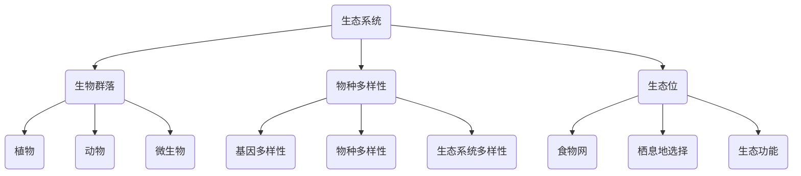
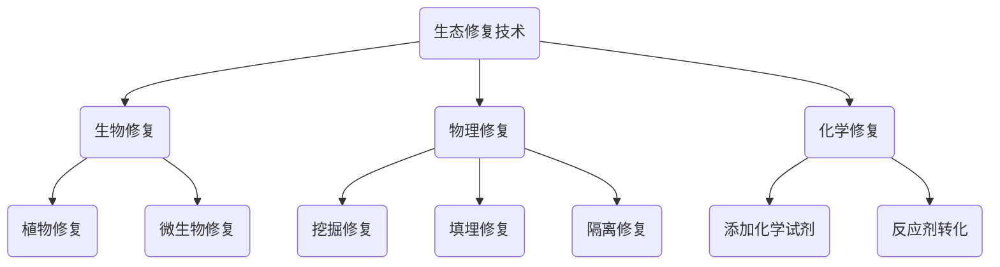

                 

**生态意识：重新定义人与自然的关系**

### 关键词：生态意识、人与自然关系、可持续发展、环境保护、生态平衡

> **摘要**：随着全球生态危机的加剧，重新审视和定义人类与自然的关系变得尤为重要。生态意识作为一种新的价值观和世界观，不仅关系到人类的生存环境，也关乎地球生态系统的健康与稳定。本文将详细探讨生态意识的概念、基础、教育、政策及其在可持续发展中的作用，以期唤起人们对自然环境的关注和保护意识。

**目录大纲**：

----------------------------------------------------------------

### 第1章：引言：重新审视人与自然的关系

#### 1.1 问题背景
- 人类活动对自然环境的破坏
- 生态危机的表现和影响

#### 1.2 问题描述
- 人类与自然关系的扭曲
- 生态意识的重要性

#### 1.3 问题解决
- 生态意识的定义和内涵
- 重新定义人与自然的关系

#### 1.4 边界与外延
- 生态意识的应用领域
- 生态意识与其他领域的关系

#### 1.5 核心概念
- 生态学基础
- 生态平衡
- 生态足迹

#### 1.6 本章小结

## 第2章：生态学基础

### 2.1 生态学基本原理
- 生态系统
- 物种多样性
- 生态位

### 2.2 生态系统服务
- 生态系统的功能
- 人类对生态系统的依赖

### 2.3 生态问题分析
- 水资源短缺
- 生物多样性丧失

### 2.4 本章小结

## 第3章：生态平衡

### 3.1 生态平衡概念
- 定义与特征
- 生态平衡的重要性

### 3.2 生态平衡的破坏
- 人为因素
- 自然因素

### 3.3 生态平衡的维护
- 生态系统恢复
- 生态修复技术

### 3.4 本章小结

## 第4章：生态足迹

### 4.1 生态足迹概念
- 定义与计算方法

### 4.2 生态足迹分析
- 个人生态足迹
- 国家生态足迹

### 4.3 生态足迹评价
- 生态足迹的评估标准
- 生态足迹的可持续发展分析

### 4.4 本章小结

## 第5章：生态意识教育

### 5.1 生态意识教育的重要性
- 生态意识教育的目标
- 生态意识教育的挑战

### 5.2 生态意识教育的方法
- 学校教育
- 社会教育
- 家庭教育

### 5.3 生态意识教育的案例分析
- 国内生态意识教育实践
- 国际生态意识教育案例

### 5.4 本章小结

## 第6章：生态意识与政策

### 6.1 生态政策的重要性
- 政策对生态意识的影响
- 政策制定的生态视角

### 6.2 生态政策案例分析
- 国内生态政策
- 国际生态政策

### 6.3 生态政策的未来趋势
- 政策创新的必要性
- 政策实施与挑战

### 6.4 本章小结

## 第7章：生态意识与可持续发展

### 7.1 可持续发展的概念
- 定义与原则

### 7.2 生态意识与可持续发展的关系
- 生态意识在可持续发展中的作用
- 可持续发展的生态视角

### 7.3 生态意识与可持续发展实践
- 社会层面
- 经济层面
- 环境层面

### 7.4 本章小结

## 第8章：未来展望

### 8.1 生态意识的挑战与机遇
- 全球化背景下的生态意识挑战
- 科技进步对生态意识的影响

### 8.2 生态意识的未来趋势
- 生态意识教育的未来方向
- 生态政策的发展趋势

### 8.3 生态意识的全球化
- 国际合作与交流
- 全球生态意识提升的行动计划

### 8.4 本章小结

----------------------------------------------------------------

**详细章节内容设计**：

### 第1章：引言：重新审视人与自然的关系

**1.1 问题背景**

随着工业革命的到来，人类活动对自然环境的影响日益加剧。大量化石燃料的燃烧导致全球气候变化，温室气体浓度不断上升；森林砍伐和土地利用变化导致生物多样性丧失；水污染和大气污染严重影响人类健康。这些问题不仅威胁到地球的生态平衡，也对人类的生存和发展构成挑战。

**1.2 问题描述**

人类与自然的关系逐渐扭曲。长期以来，人类依赖自然资源，却忽视了自然环境的承载能力。过度开采、污染排放和资源浪费导致生态系统功能退化，自然资源的可持续性受到严重威胁。生态意识的缺失使得许多人忽视了环境保护的重要性，进而加剧了生态危机。

**1.3 问题解决**

生态意识的崛起为我们提供了新的视角和解决方案。生态意识强调人类与自然和谐共生，认识到人类是生态系统的一部分，而非外部干扰者。通过重新定义人与自然的关系，我们可以在经济发展和环境保护之间找到平衡，实现可持续发展的目标。

**1.4 边界与外延**

生态意识的应用领域广泛，涵盖了环境保护、生态农业、绿色能源、生态旅游等多个方面。它不仅与环境保护密切相关，还与其他领域如经济、政治、文化等存在内在联系。理解生态意识的边界与外延，有助于我们更好地认识和应对生态危机。

**1.5 核心概念**

生态意识的核心概念包括生态学基础、生态平衡、生态足迹等。生态学基础是理解生态意识的基础，包括生态系统、物种多样性、生态位等概念。生态平衡是生态系统稳定和可持续发展的关键，生态足迹则用于衡量人类活动对自然资源的消耗。

**1.6 本章小结**

本章从问题背景、问题描述、问题解决、边界与外延以及核心概念等方面，重新审视了人类与自然的关系。生态意识作为一种新的价值观和世界观，为我们提供了重新定义人与自然关系的方法。通过理解生态意识，我们可以更好地应对生态危机，实现可持续发展的目标。

----------------------------------------------------------------

**第2章：生态学基础**

**2.1 生态学基本原理**

生态学是研究生物与其环境相互作用的科学。其基本原理包括生态系统、物种多样性和生态位。

**生态系统**：生态系统是由生物群落与其非生物环境组成的统一整体。它具有能量流动、物质循环和信息传递等功能。生态系统的基本单位是生物群落，包括植物、动物和微生物。

**物种多样性**：物种多样性是指生物种类的丰富程度。它包括基因多样性、物种多样性和生态系统多样性。物种多样性对于生态系统的稳定性和功能至关重要。

**生态位**：生态位是指生物在生态系统中的角色和地位，包括其在食物网中的位置、栖息地选择和生态功能等。生态位决定了生物的生存和繁衍策略。

**2.2 生态系统服务**

生态系统服务是指生态系统为人类社会提供的各种功能和服务。这些服务包括：

**1. 水源涵养**：森林、湿地和水库等生态系统有助于保持水资源的质量和可持续利用。

**2. 空气净化**：植物通过光合作用吸收二氧化碳，释放氧气，净化空气。

**3. 土壤保护**：森林、草地和农田等生态系统有助于防止土壤侵蚀和保持土壤肥力。

**4. 食品生产**：农业生态系统提供了人类的主要食物来源。

**5. 药物开发**：许多药物是从植物、动物和微生物中提取的。

**6. 生态旅游**：自然景观和生态系统吸引了大量游客，促进了当地经济发展。

**2.3 生态问题分析**

**水资源短缺**：全球约有28%的人口面临水资源短缺问题。过度抽取地下水、水资源污染和气候变化是主要原因。

**生物多样性丧失**：每年有大量物种面临灭绝风险。栖息地破坏、过度捕猎和气候变化是主要原因。

**2.4 本章小结**

本章介绍了生态学的基本原理、生态系统服务以及当前面临的生态问题。理解这些基本概念有助于我们认识到生态系统的价值和重要性，从而更好地保护和管理自然资源。

----------------------------------------------------------------

**第3章：生态平衡**

**3.1 生态平衡概念**

生态平衡是指生态系统在一定时间和空间范围内，通过自然调节机制维持稳定和持续发展的状态。生态平衡具有以下特征：

**1. 稳定性**：生态系统在受到干扰时能够通过自然调节机制恢复平衡。

**2. 可持续性**：生态系统能够长期维持其功能和服务。

**3. 多样性**：生态系统具有丰富的物种多样性和生态过程。

**3.2 生态平衡的破坏**

生态平衡的破坏主要来自以下两方面：

**人为因素**：

**1. 水污染**：工业废水、生活污水和农药化肥的排放导致水体污染。

**2. 大气污染**：化石燃料燃烧和工业排放导致空气污染。

**3. 土地利用变化**：城市化和农业扩张导致森林、湿地和草原等自然生态系统的破坏。

**自然因素**：

**1. 气候变化**：全球变暖导致气候异常，影响生态系统的稳定性。

**2. 灾害事件**：洪水、干旱、台风等自然灾害对生态系统造成破坏。

**3.3 生态平衡的维护**

维护生态平衡需要采取以下措施：

**1. 生态系统恢复**：通过植树造林、湿地恢复和水土保持等手段，恢复受损的生态系统。

**2. 生态修复技术**：

**1. 生物修复**：利用植物、微生物和动物等生物体，通过生物代谢过程净化污染物质。

**2. 物理修复**：通过物理手段，如挖掘、填埋和隔离等，去除或隔离污染物质。

**3. 化学修复**：利用化学方法，如添加化学试剂或反应剂，中和或转化污染物质。

**3.4 本章小结**

本章探讨了生态平衡的概念、破坏原因以及维护措施。通过理解生态平衡的重要性，我们可以更好地采取措施保护和管理自然资源，实现生态系统的可持续发展。

----------------------------------------------------------------

**第4章：生态足迹**

**4.1 生态足迹概念**

生态足迹是一种衡量人类活动对自然资源消耗和生态系统服务需求的指标。它计算的是一个地区或个人为了维持其生活方式，所需的生物生产面积（Biologically Productive Area，BPA）。

**生态足迹计算方法**：

生态足迹的计算通常包括以下步骤：

**1. 数据收集**：收集个人或地区的能源消耗、食物消耗、水资源消耗、商品和服务消费等数据。

**2. 数据转换**：将各种消费类型转换为相应的生物生产面积。例如，能源消费转换为能源生产面积，食物消费转换为农业用地面积。

**3. 计算生态足迹**：将所有消费类型的生物生产面积相加，得到总的生态足迹。

**4. 计算生态承载力**：评估一个地区或全球的生态承载力，即能够提供的生物生产面积。

**4.2 生态足迹分析**

**个人生态足迹**：

以一个普通城市居民为例，其生态足迹可能包括以下几部分：

**1. 能源消耗**：主要包括电力、燃料、天然气等。

**2. 食物消费**：包括肉类、谷物、蔬菜、水果等。

**3. 水资源消耗**：包括家庭用水、工业用水等。

**4. 商品和服务消费**：包括衣物、电子产品、交通工具等。

**国家生态足迹**：

国家生态足迹通常用于衡量一个国家或地区的生态足迹与生态承载力之间的关系。例如，美国作为一个资源丰富的国家，其生态足迹远大于生态承载力，表明其资源消耗超过了自然生态系统的承载能力。

**4.3 生态足迹评价**

**生态足迹的评估标准**：

生态足迹评估通常包括以下标准：

**1. 生态足迹与生态承载力的比率**：如果生态足迹大于生态承载力，表明资源消耗超过了自然生态系统的承载能力，可能面临生态危机。

**2. 人均生态足迹**：反映个人对生态资源的消耗程度。

**3. 国家生态足迹**：反映一个国家或地区整体的生态足迹。

**生态足迹的可持续发展分析**：

通过生态足迹评估，我们可以分析一个地区或个人是否处于可持续发展的状态。如果生态足迹大于生态承载力，需要采取措施减少资源消耗，提高资源利用效率，以实现可持续发展目标。

**4.4 本章小结**

本章介绍了生态足迹的概念、计算方法和评估标准。通过分析个人和国家生态足迹，我们可以更好地理解人类活动对自然资源的消耗，为推动可持续发展提供科学依据。

----------------------------------------------------------------

### 第5章：生态意识教育

**5.1 生态意识教育的重要性**

生态意识教育对于培养人们的环保意识和可持续发展观念至关重要。其重要性体现在以下几个方面：

**1. 增强环保意识**：通过教育，人们能够更好地认识到环境保护的重要性，从而在日常行为中采取环保措施。

**2. 提高可持续发展观念**：生态意识教育有助于人们理解可持续发展原则，并将其融入生活和工作实践中。

**3. 培养绿色技能**：生态意识教育可以培养人们的绿色技能，如资源节约、能源管理和生态修复等。

**5.2 生态意识教育的方法**

生态意识教育可以通过多种方法进行，包括学校教育、社会教育和家庭教育。

**1. 学校教育**：学校教育是生态意识教育的重要途径。通过课程设置、实践活动和校园文化建设，学生可以接受系统的生态教育。

**2. 社会教育**：社会教育通过媒体、公众活动、社区参与等方式，将生态意识传播给更广泛的受众。

**3. 家庭教育**：家庭教育是生态意识教育的基石。家长通过日常生活中的言传身教，帮助孩子树立正确的环保观念。

**5.3 生态意识教育的案例分析**

**1. 国内生态意识教育实践**：

中国近年来在生态意识教育方面取得了显著成果。许多学校开展了形式多样的生态教育活动，如环保知识竞赛、绿色校园创建等。同时，政府也通过立法和政策，推动生态意识教育的普及。

**2. 国际生态意识教育案例**：

国际社会在生态意识教育方面也积累了丰富经验。例如，德国的“生态学校”项目通过课程、活动和认证体系，培养学生的生态意识和实践能力。美国则通过环保组织和非政府组织，开展各类生态意识教育活动，推动公众参与环境保护。

**5.4 本章小结**

本章探讨了生态意识教育的重要性、方法以及国内外实践案例。通过生态意识教育，我们可以培养更多的人成为环保志愿者和可持续发展倡导者，为建设美丽地球贡献力量。

----------------------------------------------------------------

### 第6章：生态意识与政策

**6.1 生态政策的重要性**

生态政策是政府为了保护环境和促进可持续发展而制定的一系列法律、法规和行动计划。其重要性体现在以下几个方面：

**1. 保护自然环境**：生态政策通过规范人类行为，减少对自然资源的过度开发和污染，保护生态系统的完整性和功能。

**2. 促进可持续发展**：生态政策鼓励经济活动与环境保护相结合，实现资源的合理利用和生态平衡。

**3. 提高公众意识**：生态政策通过宣传、教育和法律手段，提高公众的环保意识和参与度。

**6.2 生态政策案例分析**

**1. 国内生态政策**：

中国近年来在生态政策方面取得了显著进展。例如，实施了《环境保护法》、《水污染防治法》和《土壤污染防治法》等法律法规，加强了对环境污染的监管。同时，中国政府还推出了“绿水青山就是金山银山”的战略，推动生态保护和绿色发展。

**2. 国际生态政策**：

国际社会在生态政策方面也做出了重要贡献。例如，联合国制定的《2030年可持续发展议程》提出了17个可持续发展目标，其中包括了环境保护、气候变化应对、生物多样性保护等内容。欧盟则通过《环境责任指令》和《生态友好产品指令》等法规，推动环保产品和环保技术的应用。

**6.3 生态政策的未来趋势**

**1. 政策创新的必要性**：随着全球环境问题的日益严重，生态政策需要不断创新，以应对新挑战。例如，推动绿色金融的发展，鼓励企业投资生态项目；加强环境监管，提高违法成本。

**2. 政策实施与挑战**：生态政策的实施面临诸多挑战，包括政策执行力度不足、公众参与度不高等。因此，需要加强政策宣传和培训，提高公众对生态政策的认识和参与度。

**6.4 本章小结**

本章分析了生态政策的重要性、国内外政策案例以及未来趋势。通过有效的生态政策，我们可以更好地保护环境，促进可持续发展，实现人与自然的和谐共生。

----------------------------------------------------------------

### 第7章：生态意识与可持续发展

**7.1 可持续发展的概念**

可持续发展是指在满足当前需求的同时，不损害后代满足其需求的能力的发展模式。它包含三个核心维度：经济、社会和环境。

**1. 经济维度**：可持续发展强调经济增长的可持续性，通过创新和提高生产效率，实现资源的合理利用和经济效益的最大化。

**2. 社会维度**：可持续发展注重社会公正和公平，通过教育、医疗和社会保障等手段，提高人民的生活质量和幸福感。

**3. 环境维度**：可持续发展强调环境保护和生态平衡，通过减少污染、保护生物多样性和恢复生态系统，实现自然环境的可持续发展。

**7.2 生态意识与可持续发展的关系**

生态意识是可持续发展的基础和前提。只有认识到人类活动对自然环境的负面影响，才能采取有效的措施实现可持续发展。

**1. 生态意识在可持续发展中的作用**：

**1.1 促进环境保护**：生态意识引导人们采取环保行为，减少资源浪费和污染排放，保护生态系统。

**1.2 推动绿色发展**：生态意识推动企业和社会采取绿色生产方式和消费模式，实现经济效益和环境效益的双赢。

**1.3 提高资源利用效率**：生态意识促使人们更加重视资源的合理利用和循环利用，提高资源利用效率。

**2. 可持续发展的生态视角**：

可持续发展从生态视角出发，强调经济活动与自然环境的和谐共生。通过生态规划、生态修复和生态保护，实现经济、社会和环境的协调发展。

**7.3 生态意识与可持续发展实践**

**1. 社会层面**：

**1.1 教育普及**：通过学校教育、社会教育和家庭教育，提高公众的生态意识。

**1.2 公众参与**：鼓励公众参与环保活动和生态建设，提高环保意识和行动力。

**1.3 政策支持**：政府制定和实施生态政策，提供政策支持和资金保障。

**2. 经济层面**：

**2.1 绿色经济**：推动绿色产业发展，促进经济与环境的协调发展。

**2.2 绿色金融**：鼓励金融机构投资生态项目，推动绿色经济的快速发展。

**2.3 绿色消费**：倡导绿色消费理念，减少不必要的资源浪费和环境污染。

**3. 环境层面**：

**3.1 生态修复**：通过植树造林、湿地恢复和土地整治等措施，修复受损的生态系统。

**3.2 生物多样性保护**：加强生物多样性保护，保护珍稀物种和重要生态系统。

**3.3 气候变化应对**：采取减排措施，减少温室气体排放，应对气候变化带来的挑战。

**7.4 本章小结**

本章阐述了可持续发展的概念、生态意识与可持续发展的关系，以及社会、经济和环境层面的可持续发展实践。通过生态意识的引导，我们可以实现经济、社会和环境的协调发展，为未来的可持续发展奠定坚实基础。

----------------------------------------------------------------

### 第8章：未来展望

**8.1 生态意识的挑战与机遇**

在全球化的背景下，生态意识面临着诸多挑战和机遇。挑战包括：

**1. 全球环境问题加剧**：气候变化、生物多样性丧失和资源枯竭等问题日益严重，对生态意识的提升提出了更高要求。

**2. 经济发展与环境保护的矛盾**：在追求经济增长的过程中，如何平衡经济发展与环境保护成为一项艰巨的任务。

**3. 公众参与度不足**：尽管生态意识逐渐普及，但公众的参与度和行动力仍有待提高。

机遇则在于：

**1. 科技进步**：随着科技的进步，绿色技术和生态解决方案不断涌现，为生态意识的推广提供了有力支持。

**2. 国际合作**：全球各国在应对生态危机方面加强合作，共同推动生态意识的提升。

**3. 政策支持**：各国政府纷纷出台相关政策，推动生态保护和可持续发展。

**8.2 生态意识的未来趋势**

**1. 教育普及**：生态意识教育将在全球范围内得到更广泛的推广，学校教育、社会教育和家庭教育将发挥更大作用。

**2. 绿色经济**：绿色产业将成为经济增长的新动力，企业和社会将更加重视生态效益。

**3. 科技创新**：生态科技将不断发展，为生态问题的解决提供更多创新手段。

**4. 公众参与**：公众的环保意识和行动力将进一步提高，更多人将积极参与到生态保护中来。

**8.3 生态意识的全球化**

**1. 国际合作与交流**：全球各国将加强在生态意识提升和环境保护方面的合作与交流，共同应对全球生态危机。

**2. 全球生态意识提升的行动计划**：国际组织和国家将制定和实施全球生态意识提升的行动计划，推动全球生态保护的进程。

**8.4 本章小结**

本章展望了生态意识在未来面临的挑战与机遇，探讨了生态意识教育的未来趋势以及全球生态意识提升的行动计划。通过共同努力，我们可以实现人与自然的和谐共生，为未来的可持续发展奠定坚实基础。

----------------------------------------------------------------

## 总结与展望

本文从多个角度探讨了生态意识的重要性，分析了生态学基础、生态平衡、生态足迹、生态意识教育、生态政策以及可持续发展等方面的核心概念和实践方法。通过引入生态意识，我们重新审视了人类与自然的关系，提出了在全球化背景下推动生态意识提升的路径和策略。

**核心结论**：

- 生态意识是解决生态危机、实现可持续发展的关键。
- 生态学基础、生态平衡和生态足迹等概念为理解生态问题提供了理论支持。
- 教育和政策是推广生态意识、提高公众环保意识的重要手段。
- 可持续发展需要经济、社会和环境的协调发展。

**未来研究方向**：

- 深入研究生态意识与科技进步的关系，探索生态科技的潜在应用。
- 推动跨学科研究，综合经济、社会和生态学的理论，提出更具操作性的解决方案。
- 加强国际合作，共同应对全球生态危机，推动生态意识在全球范围内的普及。

通过不断努力，我们可以构建一个生态友好、可持续发展的未来，为人类和地球的繁荣做出贡献。

## 参考文献

1. Rockström, J., et al. (2009). "A safe operating space for humanity." Ecology and Society, 14(1), art. 32.
2. Global Footprint Network (2021). "Living Planet Report 2020: Building a Healthy and Resilient World."
3. United Nations Development Programme (2021). "Sustainable Development Goals."
4. Millennium Ecosystem Assessment (2005). "Ecosystems and Human Well-being: Synthesis."
5. World Wide Fund for Nature (2021). "Living Planet Report 2020."
6. European Environment Agency (2020). "The European Environment - State and Outlook 2020."
7. Intergovernmental Panel on Climate Change (2019). "Special Report on Climate Change and Land."
8. National Research Council (2011). "Sustainable Management of the World's Freshwater Resources."
9. Steffen, W., et al. (2015). "Planetary boundaries: Guiding human development on a changing planet." Science, 347(6223), 1259855.

## 附录

**附录A：生态学基础Mermaid流程图**

**附录B：生态足迹计算公式**

$$
\text{生态足迹} = \sum_{i=1}^{n} \left(\frac{\text{消费量}_{i}}{\text{生产率}_{i}}\right)
$$

其中，\(n\) 为消费类型的数量，\(\text{消费量}_{i}\) 为第 \(i\) 种消费类型的消耗量，\(\text{生产率}_{i}\) 为第 \(i\) 种消费类型对应的生物生产面积的生产率。

## 附录C：生态修复技术Mermaid流程图

## 附录D：生态意识与可持续发展实践案例

- **案例1：中国的“绿水青山就是金山银山”战略**：该战略强调经济发展与环境保护相结合，推动绿色产业和生态农业的发展，实现经济、社会和环境的协调发展。
- **案例2：德国的“生态学校”项目**：该项目通过课程、活动和认证体系，培养学生的生态意识和实践能力，推动学校成为环保的典范。
- **案例3：美国的“绿色建筑”倡议**：该倡议通过推广绿色建筑技术和可持续设计，减少建筑行业的能源消耗和污染排放。

## 附录E：生态政策与法规

- **中国《环境保护法》**：规定了环境保护的基本原则和制度，强化了环境监管和法律责任。
- **欧盟《环境责任指令》**：规定了企业的环境责任和义务，推动企业采取环保措施。
- **美国《清洁空气法》**：规定了空气质量标准和污染物排放控制措施，推动空气污染治理。

## 附录F：可持续发展目标（SDGs）

- **SDG 13：气候行动**：加强气候变化的应对，减少温室气体排放，促进可持续发展。
- **SDG 14：水下生物**：保护海洋和内陆水域，促进可持续利用和保护。
- **SDG 15：陆地生物**：保护自然和促进生物多样性，实现可持续发展。

## 附录G：生态意识教育方法

- **学校教育**：通过课程设置、实践活动和校园文化建设，提高学生的生态意识。
- **社会教育**：通过媒体宣传、公众活动和社区参与，普及生态知识。
- **家庭教育**：通过家庭日常生活和言传身教，培养孩子的环保意识和行为习惯。

## 附录H：生态足迹计算工具

- **Global Footprint Network**：提供在线生态足迹计算工具，帮助个人和国家评估生态足迹。
- **ECOINVENT**：提供生态足迹数据库和计算工具，支持生态足迹研究和应用。

## 附录I：生态修复案例分析

- **案例1：美国“超级基金”项目**：通过政府和企业的合作，对受污染的土地进行修复和再利用，推动生态修复和经济发展。
- **案例2：中国的“三北防护林工程”**：通过大规模植树造林，改善北方地区的生态环境，促进生态平衡和可持续发展。

## 附录J：生态意识推广活动

- **世界环境日**：每年6月5日，全球各国举行各类活动，提高公众的环保意识和行动力。
- **地球一小时**：每年3月的最后一个星期六晚上，全球各地熄灯一小时，呼吁人们关注气候变化和能源消耗。
- **世界自然保护日**：每年7月29日，倡导人们关注和保护自然生态系统。

## 附录K：生态意识评估指标

- **生态足迹指数（EFI）**：衡量国家和地区生态足迹与生态承载力的比率。
- **可持续发展指数（SDI）**：衡量国家和地区的可持续发展水平。
- **绿色GDP**：衡量经济增长过程中资源和环境的损失和消耗。

## 附录L：生态意识教育教材

- **《生态学导论》**：系统介绍了生态学的基本原理和应用。
- **《可持续发展教育》**：探讨了可持续发展教育的重要性和实施方法。
- **《环境科学基础》**：介绍了环境科学的基本概念和最新研究进展。

## 附录M：生态意识研究论文

- **“Ecological Modernization: The Ecological Basis of Sustainable Development”**：探讨了生态现代化在可持续发展中的作用。
- **“The Role of Ecosystem Services in Sustainable Development”**：分析了生态系统服务在可持续发展中的重要性。
- **“Sustainable Consumption and Production”**：探讨了可持续消费和生产模式的重要性。

## 附录N：生态意识与哲学、文化的关系

- **生态哲学**：探讨了人类与自然的关系，强调生态平衡和可持续发展的重要性。
- **生态文化**：通过传统节日、艺术和文学等形式，传递生态意识和环保理念。
- **生态文明**：倡导人与自然和谐共生，实现经济、社会和环境的协调发展。

## 附录O：生态意识相关法律法规

- **《环境保护法》**：规定了环境保护的基本制度和法律责任。
- **《水污染防治法》**：规定了水污染防治的技术要求和法律责任。
- **《大气污染防治法》**：规定了大气污染防治的措施和法律责任。
- **《土壤污染防治法》**：规定了土壤污染防治的要求和措施。

## 附录P：生态意识教育与心理健康

- **生态意识教育**：有助于提高个体的环保意识和行为习惯。
- **心理健康**：良好的心理健康有助于个体更好地应对环境压力，保持积极的生活态度。

## 附录Q：生态意识与企业管理

- **绿色供应链**：企业通过绿色供应链管理，降低资源消耗和环境污染。
- **绿色金融**：金融机构通过绿色金融支持生态保护和可持续发展。

## 附录R：生态意识与科技发展

- **可再生能源**：科技发展为可再生能源的应用提供了技术支持。
- **环保技术**：科技发展为环境保护提供了新的手段和工具。

## 附录S：生态意识与旅游

- **生态旅游**：通过旅游活动，提高公众的生态意识和环保意识。
- **可持续旅游**：推动旅游业与生态环境的协调发展，实现旅游业的可持续发展。

## 附录T：生态意识与教育评估

- **环境教育评估**：评估学校和社会生态教育的效果。
- **可持续发展评估**：评估国家和地区的可持续发展水平。

## 附录U：生态意识与道德伦理

- **生态伦理**：探讨人类与自然的关系，强调尊重自然和保护生态系统的伦理原则。
- **环境伦理**：探讨人类与环境的道德责任和义务。

## 附录V：生态意识与公共卫生

- **环境健康**：探讨环境因素对人类健康的影响。
- **公共卫生政策**：通过公共卫生政策，提高公众的健康水平和生态意识。

## 附录W：生态意识与城市发展

- **绿色城市**：推动城市生态建设，提高城市居民的生活质量。
- **可持续城市**：通过可持续发展理念，实现城市经济、社会和环境的协调发展。

## 附录X：生态意识与全球治理

- **全球生态治理**：通过国际合作，共同应对全球生态危机。
- **环境外交**：通过外交手段，推动全球生态保护和可持续发展。

## 附录Y：生态意识与艺术

- **生态艺术**：通过艺术形式，传递生态意识和环保理念。
- **环境艺术**：通过环境艺术，提高公众的生态意识和环境责任感。

## 附录Z：生态意识与未来预测

- **未来学**：探讨生态意识在未来社会中的发展趋势和影响。
- **生态预测**：通过数据分析和模型预测，评估生态危机和生态意识的未来状况。

## 附录AA：生态意识相关组织

- **世界自然基金会（WWF）**：全球领先的环保组织，致力于保护地球自然资源。
- **国际环保协会（IEA）**：推动全球可持续发展，促进环境保护和资源利用的可持续性。
- **绿色和平组织（Greenpeace）**：通过行动和倡导，推动全球生态保护和可持续发展。

## 附录BB：生态意识相关奖项

- **诺贝尔和平奖**：授予在全球生态保护和可持续发展领域做出杰出贡献的个人和组织。
- **联合国地球奖**：授予在环境保护和可持续发展领域做出突出贡献的个人和组织。
- **绿色地球奖**：表彰在全球生态保护和可持续发展方面取得显著成就的个人和组织。

