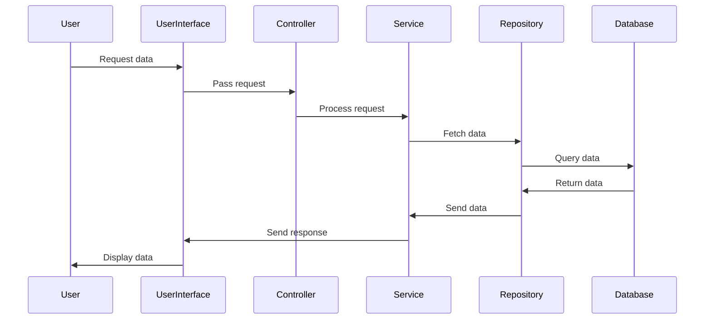

                 

### 引言

在现代社会中，人与自然的连接逐渐变得脆弱。城市化进程的加速、工业污染的蔓延以及自然环境的破坏，使得人类的生活方式与自然生态发生了深刻的分离。这种分离不仅影响了人类的身心健康，也威胁到了地球生态系统的平衡。为了重建人与自然的紧密连接，生态疗愈中心作为一种新型空间概念，应运而生。

生态疗愈中心旨在提供一个融合自然环境与人文关怀的场所，通过一系列精心设计的环境和活动，帮助人们舒缓压力、恢复活力，并重新建立与自然的和谐关系。本文将深入探讨生态疗愈中心的定义、设计原则、实施步骤以及成功案例，旨在为读者提供一份全面的技术指南，助力生态疗愈中心的构建与实践。

本文结构如下：

- **第一部分：引言**：介绍生态疗愈中心的背景和重要性。
- **第二部分：核心概念与联系**：定义生态疗愈中心，阐述人与自然连接的原理，并提供核心概念属性特征对比表格和ER实体关系图架构。
- **第三部分：生态疗愈中心设计与实施**：详细讨论设计原则与策略，以及空间布局与规划。
- **第四部分：技术与工具**：介绍生态疗愈中心的技术体系。
- **第五部分：案例研究**：分析成功案例，提供环境安装、系统核心实现、代码应用分析、实际案例剖析等内容。
- **第六部分：最佳实践与扩展**：总结最佳实践，并提出注意事项和拓展阅读。

通过这篇文章，我们希望能够激发读者对生态疗愈中心的兴趣，推动其在全球范围内的应用与发展，从而为实现人类与自然和谐共生贡献一份力量。

### 核心关键词

1. **生态疗愈中心**：提供自然与人文融合的空间，促进身心健康。
2. **人与自然连接**：重新建立人类与自然的紧密联系。
3. **设计原则与策略**：指导生态疗愈中心的设计与实施。
4. **空间布局与规划**：优化生态疗愈中心的空间利用。
5. **技术体系**：支持生态疗愈中心的高效运作。
6. **案例研究**：通过实践验证生态疗愈中心的有效性。
7. **最佳实践**：总结成功经验，指导未来实践。

### 摘要

本文旨在深入探讨生态疗愈中心的概念、设计原则、实施步骤和成功案例，以推动人类与自然的和谐共生。首先，文章介绍了生态疗愈中心的背景和重要性，明确了其核心目标和作用。接着，通过定义和原理阐述，明确了生态疗愈中心的内涵和外延，并提供了核心概念对比和ER实体关系图架构。随后，文章详细讨论了设计原则与策略，包括空间布局和规划，以及所需的技术体系。通过分析成功案例，本文提供了实施细节和技术实现，总结了最佳实践，并提出了注意事项和未来展望。文章结构合理，内容详实，旨在为生态疗愈中心的构建与实践提供有力支持。

## 第一部分：引言

在现代社会，人与自然的分离已成为一个不容忽视的问题。城市化进程的加速、工业化的发展以及环境的污染，使得人们的生活与自然生态逐渐疏离。这种分离不仅导致了自然资源的枯竭和生态系统的破坏，还严重影响了人类的身心健康。研究表明，长期的都市生活容易引发压力、焦虑和抑郁等心理问题，同时，环境污染和生态失衡也对人类的身体健康构成了威胁。

生态疗愈中心作为一种新型的空间概念，正是为了应对这一挑战而提出的。它旨在通过提供一个融合自然环境与人文关怀的场所，帮助人们重新建立与自然的联系，从而促进身心健康和生态平衡。生态疗愈中心不仅提供了一种独特的环境体验，更是一种生活方式的变革，它鼓励人们回归自然，体验自然之美，从中获得疗愈和启迪。

首先，生态疗愈中心的出现是对现代生活压力的回应。在高度发达的都市环境中，人们常常感到焦虑和压力，这种情绪状态不仅影响生活质量，还可能导致一系列健康问题。生态疗愈中心通过提供自然景观、静谧的空间和丰富的活动，帮助人们放松身心，减轻压力，恢复内心的平静和活力。

其次，生态疗愈中心是人与自然和谐共生的实践场所。它通过精心设计和规划，将自然环境与人文关怀相结合，创造出一种独特的生态系统，使人们在其中能够与自然亲密接触，感受自然的美好和生命力。这种与自然的互动不仅能够提高人们的生态意识，还能促进人与自然的和谐共生。

此外，生态疗愈中心还为社区提供了重要的公共服务。它不仅是一个疗愈和休闲的场所，更是一个教育平台，通过举办各种活动，如生态讲座、自然体验课程等，提高公众的生态意识和环保意识。同时，生态疗愈中心也成为了社区交流的纽带，促进了社区成员之间的互动和合作。

总之，生态疗愈中心作为一种新型空间概念，不仅为人类提供了一个疗愈身心、连接自然的场所，更是一种对现代生活方式的反思和探索。它呼吁人们重新审视与自然的关系，倡导回归自然、保护生态的生活方式。通过生态疗愈中心的实践，我们有望实现人类与自然的和谐共生，为未来的可持续发展奠定基础。

### 第1章：背景与核心问题

#### 1.1.1 问题背景

人类与自然的疏离现象由来已久，尤其在现代社会，这一现象日益严重。城市化进程的加速和工业化的发展，使得人们的生活方式和环境发生了巨大的变化。都市化生活带来的高节奏、快压力，使得人们在日常生活中越来越远离自然。这种疏离不仅对个体的身心健康产生了负面影响，还对整个社会和生态系统构成了威胁。

首先，从个体的角度来看，都市化生活的快节奏和高压力，容易导致心理问题。研究表明，长期生活在都市环境中，人们更容易感到焦虑、抑郁和孤独。这种心理压力不仅影响生活质量，还可能导致一系列健康问题，如心血管疾病、消化系统疾病等。与此同时，环境污染和生态失衡也严重威胁着人类的身体健康。空气污染、水污染和土壤污染等环境问题，使得人们暴露在有害物质中，增加了患病的风险。

其次，从社会的角度来看，人类与自然的疏离导致了生态系统的破坏和资源的枯竭。城市化进程中，大量的自然资源被消耗，森林被砍伐，土地被侵占，导致生态系统的破坏和生物多样性的减少。这不仅影响了地球的生态平衡，还使得人类面临着资源短缺的危机。同时，环境污染和生态失衡也加剧了气候变化，给人类社会带来了更多的挑战和不确定性。

此外，人类与自然的疏离还影响了社会的和谐与稳定。生态系统的破坏和生物多样性的减少，导致了生态灾害的频繁发生，如洪水、干旱、地震等。这些灾害不仅给人类社会带来了巨大的损失，还加剧了社会的不稳定。同时，环境污染和生态失衡也影响了社会成员之间的互动和合作，使得社会凝聚力下降。

综上所述，人类与自然的疏离是一个复杂而严重的问题，它对个体、社会和生态系统都产生了深远的影响。因此，寻找有效的解决方案，重建人与自然的紧密连接，成为当前社会面临的一项紧迫任务。

#### 1.1.2 问题描述

在人与自然疏离的背景下，生态疗愈中心的提出，旨在为人类提供一个重新连接自然、疗愈身心的空间。然而，这一目标的实现面临着一系列挑战。

首先，设计挑战。生态疗愈中心的设计需要兼顾自然环境的保护与人类的舒适体验。如何在设计中融入自然元素，同时保证空间的实用性，是设计师面临的一大难题。此外，生态疗愈中心的设计还需要考虑到可持续性，即如何在设计和运营过程中最大限度地减少对环境的影响。

其次，实施挑战。生态疗愈中心的实施需要跨学科的合作，包括生态学、心理学、建筑设计、城市规划等多个领域。各学科之间的协调和合作，是实现生态疗愈中心目标的关键。然而，在实际操作中，如何有效地整合各学科资源，确保项目的顺利进行，仍然是一个亟待解决的问题。

第三，技术挑战。生态疗愈中心的技术体系涉及多个方面，包括环保材料的应用、节能技术的实施、智能系统的集成等。这些技术不仅需要具备先进性，还需要在实际应用中具备可靠性和可持续性。如何在有限的资源和技术条件下，实现高效、环保的技术应用，是生态疗愈中心实施过程中需要克服的重要难题。

第四，运营挑战。生态疗愈中心的运营需要一套科学的管理体系，包括人员培训、服务质量监控、环境管理等方面。如何确保运营过程中服务质量的高效和稳定，同时降低运营成本，提高盈利能力，是生态疗愈中心运营面临的一大挑战。

第五，社会挑战。生态疗愈中心的推广和普及，需要社会各界的支持和参与。然而，在当前社会，人们对生态疗愈中心的认知和接受度仍较低，如何提高社会对生态疗愈中心的认同感，增加其使用率，是生态疗愈中心推广过程中需要克服的难题。

综上所述，生态疗愈中心在实现其目标的过程中，面临着设计、实施、技术、运营和社会等多方面的挑战。这些挑战需要通过多学科合作、技术创新、科学管理和广泛宣传等手段，共同克服，才能实现生态疗愈中心的预期效果。

#### 1.1.3 问题解决

要解决人类与自然疏离的问题，生态疗愈中心提供了一个创新的解决方案。通过设计一个融合自然环境与人文关怀的空间，生态疗愈中心旨在帮助人们重新建立与自然的连接，从而促进身心健康和生态平衡。

首先，设计方面，生态疗愈中心注重自然元素的融入，如绿植、水景、自然光线等，创造出一个宁静、舒适的环境。这种设计不仅能提供放松身心、缓解压力的空间，还能激发人们对自然的热爱和敬畏。同时，生态疗愈中心的设计还注重可持续性，使用环保材料和节能技术，减少对环境的负面影响。

其次，实施方面，生态疗愈中心需要跨学科的合作，包括生态学、心理学、建筑设计、城市规划等。通过整合这些学科的知识和资源，生态疗愈中心能够实现更全面、更科学的设计和实施。例如，在实施过程中，生态学家可以提供关于自然环境的建议，心理学家可以设计心理疗愈活动，建筑设计师可以优化空间布局，城市规划师可以确保项目的社区参与和可持续性。

第三，技术方面，生态疗愈中心需要运用先进的技术，如智能系统、环保技术等。智能系统可以实时监控环境变化，提供个性化的疗愈建议，而环保技术则可以确保生态疗愈中心的可持续运营。例如，太阳能和风能等可再生能源的使用，可以减少对传统能源的依赖，降低碳排放。

第四，运营方面，生态疗愈中心需要建立一套科学的管理体系，确保服务质量和环境管理的稳定。人员培训、服务质量监控、环境管理等方面的规范操作，是保证生态疗愈中心高效运营的关键。同时，通过合理定价和市场推广，提高生态疗愈中心的盈利能力，确保其可持续发展。

第五，社会方面，生态疗愈中心的推广和普及需要广泛的社会支持和参与。通过举办各种活动，提高公众的生态意识和环保意识，增强人们对生态疗愈中心的认同感。同时，通过宣传和教育，提高社会对生态疗愈中心的理解和接受度，增加其使用率。

综上所述，通过设计、实施、技术、运营和社会等多方面的努力，生态疗愈中心能够有效解决人类与自然疏离的问题。它不仅提供了一个疗愈身心的空间，还促进了人与自然的和谐共生，为实现可持续发展做出了积极贡献。

#### 1.1.4 边界与外延

生态疗愈中心的边界与外延涉及多个方面，首先从地理空间上看，生态疗愈中心可以是独立的大楼或建筑群，也可以是城市公园、自然保护区的一部分，或者是一个社区内的特定区域。无论位于何处，其核心目标都是创造一个与自然相融合的空间，从而提供身心疗愈的环境。

在功能上，生态疗愈中心的边界包括但不限于以下几方面：

1. **自然体验区**：提供自然景观，如森林、草地、水体等，以供人们亲近自然，享受自然之美。
2. **疗愈与休闲设施**：包括冥想空间、休息区、健身房、游泳池等，帮助人们放松身心，恢复活力。
3. **教育与文化活动区**：举办生态讲座、自然体验课程、艺术展览等活动，提高公众的生态意识和环保知识。

从服务对象来看，生态疗愈中心主要面向以下几类人群：

1. **都市居民**：长期生活在都市环境中，面临高压力和环境污染的群体，通过生态疗愈中心来缓解压力，改善身心健康。
2. **疗愈专业人士**：包括心理咨询师、治疗师、医生等，他们在生态疗愈中心开展专业服务，如心理疗愈、康复治疗等。
3. **生态环保志愿者**：通过参与生态疗愈中心的活动，提高对生态保护的认识和参与度。

此外，生态疗愈中心还涉及与社会环境的互动，如：

1. **社区参与**：通过组织社区活动，增强社区成员的互动和合作，促进社区和谐发展。
2. **环境保护**：实施环保措施，如垃圾分类、节能减排等，推动可持续发展。

总之，生态疗愈中心不仅是一个特定的地理空间，更是一个多功能、多目标的社会实践，旨在通过重建人与自然的连接，促进身心健康和生态平衡。

#### 1.1.5 概念结构与核心要素组成

生态疗愈中心的概念结构由多个核心要素组成，这些要素共同作用，实现了其目标。以下是生态疗愈中心的概念结构及其核心要素：

1. **自然环境**：生态疗愈中心的核心是自然环境，包括绿植、水体、岩石、天空等自然元素。这些自然元素提供了宁静的氛围和疗愈的空间，使人们能够与自然亲密接触，感受自然之美。

2. **人文关怀**：生态疗愈中心不仅提供自然景观，还注重人文关怀。通过冥想空间、休息区、健身房等设施，以及心理疗愈、艺术展览等活动，生态疗愈中心为人们提供一个放松身心的环境，帮助人们缓解压力，恢复活力。

3. **可持续发展**：生态疗愈中心在设计和运营过程中，注重可持续性。使用环保材料、节能技术和可再生能源，减少对环境的负面影响。同时，通过社区的参与和环保活动的推广，提高公众的生态意识和环保意识。

4. **技术应用**：生态疗愈中心运用现代科技，如智能系统、环保技术等，提升其功能和服务质量。智能系统可以实时监控环境变化，提供个性化的疗愈建议；环保技术则确保疗愈中心在运营过程中实现高效、环保。

5. **教育与文化**：生态疗愈中心不仅是疗愈身心的场所，还是一个教育平台。通过举办生态讲座、自然体验课程、艺术展览等活动，生态疗愈中心提高了公众的生态意识和环保知识，促进了人与自然的和谐共生。

6. **社会参与**：生态疗愈中心通过社区参与，增强社区成员的互动和合作，促进社区和谐发展。同时，通过环保措施的实施，推动可持续发展。

综上所述，生态疗愈中心的概念结构由自然环境、人文关怀、可持续发展、技术应用、教育与文化、社会参与等多个核心要素组成，这些要素相互支持、相互促进，共同实现了生态疗愈中心的使命和目标。

## 第二部分：核心概念与联系

### 2.1 生态疗愈中心定义

生态疗愈中心是一个旨在通过自然环境和人文关怀，帮助人们重建与自然联系、恢复身心健康的空间。它不仅是一个提供放松和疗愈的环境，更是一个融合了自然生态和人文理念的综合体。生态疗愈中心的设计和运营，注重自然元素的融入和人文关怀的提供，旨在创造一个能够缓解压力、改善心理状态和促进身心健康的场所。

首先，生态疗愈中心强调自然环境的融入。通过绿植、水体、岩石、天空等自然元素，生态疗愈中心创造了一个宁静、舒适、与自然和谐共存的空间。这种自然环境不仅有助于人们放松身心，还能激发人们对自然的热爱和敬畏。其次，生态疗愈中心注重人文关怀。通过冥想空间、休息区、健身房等设施，以及心理疗愈、艺术展览等活动，生态疗愈中心为人们提供了一个放松身心的环境，帮助人们缓解压力，恢复活力。

定义中的关键术语包括：

- **生态疗愈**：指通过自然环境的作用，帮助人们恢复身心健康的过程。
- **自然元素**：指绿植、水体、岩石、天空等自然景观和生态要素。
- **人文关怀**：指通过人文设施和活动，为人们提供心理支持和社会交往的空间。

### 2.2 人与自然连接的原理

人与自然连接的原理基于生态学和心理学的研究成果。生态学指出，自然环境中存在的生物多样性、生态循环和自然景观，对人类身心健康具有积极影响。心理学研究表明，与自然的接触能够降低压力、改善情绪、提升心理健康。以下是人与自然连接的主要原理：

1. **自然环境的舒缓作用**：自然环境中存在的生物多样性、生态循环和自然景观，对人类身心具有舒缓作用。绿植、水体、岩石等自然元素，通过调节湿度、温度、光线等环境因素，为人们提供了一个舒适、宁静的疗愈空间。

2. **自然接触的治愈效应**：研究表明，与自然的接触能够降低压力水平、改善情绪状态。自然接触有助于激活人体的压力调节系统，减少体内应激激素的分泌，从而缓解压力和焦虑。

3. **自然教育的影响**：自然接触和教育能够提高人们对自然的认识和尊重，增强生态意识。通过生态疗愈中心提供的自然体验课程和活动，人们可以更好地理解自然生态，从而促进人与自然的和谐共生。

4. **社区互动的促进作用**：生态疗愈中心不仅是个人疗愈的场所，还是一个社区互动的平台。通过组织社区活动，生态疗愈中心促进了社区成员之间的互动和合作，增强了社区凝聚力。

### 2.3 概念属性特征对比表格

为了更清晰地展示生态疗愈中心与其他相关概念（如自然公园、疗养院、健康中心）之间的区别，我们提供了一个概念属性特征对比表格。

| 概念 | 生态疗愈中心 | 自然公园 | 疗养院 | 健康中心 |
| ---- | ------------ | -------- | ------ | -------- |
| 目标 | 重建人与自然连接，促进身心健康 | 提供自然体验，保护生态系统 | 提供康复服务，治疗疾病 | 提供健康检查、治疗和康复服务 |
| 设计重点 | 融合自然与人文关怀，强调生态疗愈 | 保护自然生态环境，提供自然体验 | 医疗设施、康复设备 | 健康检测、医疗技术、康复训练 |
| 服务对象 | 都市居民、疗愈专业人士、生态环保志愿者 | 游客、自然爱好者、生态研究者 | 康复患者、老年人 | 个人、家庭、企事业单位 |
| 技术应用 | 智能系统、环保技术、自然体验活动 | 环保设施、自然景观设计 | 医疗设备、康复技术 | 健康管理系统、医疗技术 |
| 管理模式 | 跨学科合作、社区参与、可持续运营 | 环保管理、自然保护、公众教育 | 医疗管理、康复护理、健康管理 | 医疗服务、健康管理、康复服务 |

通过这个表格，我们可以看到生态疗愈中心在目标、设计重点、服务对象、技术应用和管理模式等方面，与其他相关概念有所不同。生态疗愈中心更注重人与自然的连接，强调生态疗愈和人文关怀，而自然公园、疗养院和健康中心则分别侧重于自然保护、医疗康复和健康管理。

### 2.4 ER实体关系图架构

为了更好地理解生态疗愈中心的概念结构和各要素之间的关系，我们使用Mermaid语言绘制了一个ER（Entity-Relationship）实体关系图。以下是该图的具体内容：

```mermaid
erDiagram
  User ||--|{ Visitor }|-- Visitor
  User ||--|{ Local }|-- Local
  User ||--|{ Expert }|-- Expert
  Activity ||--|{ Meditation }|-- Meditation
  Activity ||--|{ Yoga }|-- Yoga
  Activity ||--|{ Art Therapy }|-- ArtTherapy
  Center ||--|{ Room }|-- Room
  Center ||--|{ Facility }|-- Facility
  Center ||--|{ Activity }|-- Activity
  Center ||--|{ User }|-- User
  Center ||--|{ Service }|-- Service
  Service ||--|{ Fee }|-- Fee
  Visitor ||--|{ Book }|-- Book
  Local ||--|{ Volunteer }|-- Volunteer
  Expert ||--|{ Coach }|-- Coach
  Room ||--|{ Equipment }|-- Equipment
  Facility ||--|{ Maintenance }|-- Maintenance
  Activity ||--|{ Schedule }|-- Schedule
  Service ||--|{ Rating }|-- Rating
```

这个ER图展示了生态疗愈中心中的主要实体及其关系。其中：

- **User**（用户）：包括游客（Visitor）、本地居民（Local）和专家（Expert）。
- **Activity**（活动）：包括冥想（Meditation）、瑜伽（Yoga）和艺术疗法（Art Therapy）等。
- **Center**（中心）：包括房间（Room）、设施（Facility）、活动（Activity）、用户（User）和服务（Service）。
- **Service**（服务）：包括收费（Fee）和评分（Rating）。
- **Room**（房间）：包括设备（Equipment）。
- **Facility**（设施）：包括维护（Maintenance）。
- **Activity**（活动）：包括时间表（Schedule）。

通过ER图，我们可以清晰地看到生态疗愈中心中的各个实体及其相互关系，这有助于我们更好地理解和设计生态疗愈中心的系统架构。

## 第三部分：生态疗愈中心设计与实施

### 3.1 设计原则与策略

生态疗愈中心的设计原则与策略是其成功的关键。以下是一些核心的设计原则与策略，它们确保生态疗愈中心能够实现其目标，同时提供高效、舒适的体验。

#### 3.1.1 设计原则

1. **融合自然与人文**：生态疗愈中心的设计强调自然元素的融入，如绿植、水体、岩石和天空。同时，还注重人文关怀，包括冥想空间、休息区和健身设施等。这种融合旨在创造一个宁静、舒适且具有疗愈效果的空间。

2. **可持续性**：设计过程中，注重使用环保材料和节能技术。例如，使用可再生能源、实施雨水收集和回收系统等，以减少对环境的负面影响。此外，设计应考虑长远，确保生态疗愈中心的可持续运营。

3. **灵活性**：生态疗愈中心的设计应具备灵活性，以适应不同的用户需求。例如，空间布局应能够根据不同的活动进行调整，设施应便于维护和升级。

4. **美观性**：美观性不仅提升用户体验，还能增加人们对生态疗愈中心的认同感。设计应注重细节，如色彩搭配、照明设计和景观布置等，以创造出令人愉悦的环境。

#### 3.1.2 设计策略

1. **空间布局**：生态疗愈中心的空间布局应合理，确保自然元素和人文设施的有效结合。例如，将冥想区和自然景观相结合，使人们在冥想时能够感受到自然之美。同时，应考虑不同功能区域之间的流线和互动性，以提高使用效率。

2. **设施配置**：设施配置应充分考虑用户需求，包括健身器材、休息区和医疗设施等。这些设施应易于使用和维护，同时符合环保标准。例如，健身器材可以选择环保材料制作，休息区可以配备舒适的座椅和天然材料。

3. **技术整合**：生态疗愈中心的设计应整合先进的技术，如智能系统、环境监控和自动化设施。智能系统可以提供个性化的疗愈建议，环境监控可以实时监测空气质量、温度和湿度等指标，自动化设施可以提升运营效率。

4. **社区参与**：设计过程中，应鼓励社区参与，使生态疗愈中心成为社区的一部分。例如，可以组织社区活动，邀请居民参与中心的建设和运营，从而增强社区的凝聚力和归属感。

5. **教育和宣传**：设计策略中应包含教育和宣传部分，提高公众对生态疗愈中心的认知和接受度。例如，可以通过举办讲座、展览和体验活动，向公众传播生态疗愈的理念和好处。

通过遵循上述设计原则和策略，生态疗愈中心不仅能够提供一个疗愈身心、连接自然的场所，还能促进生态平衡和社会和谐发展。

### 3.2 空间布局与规划

生态疗愈中心的空间布局与规划是确保其功能性和用户体验的关键。以下是空间布局与规划的详细内容：

#### 3.2.1 功能区域划分

生态疗愈中心通常包括以下几个功能区域：

1. **自然体验区**：包括森林步道、水景、草地和观景台等，为用户提供亲近自然的场所。
2. **疗愈与休闲区**：包括冥想室、瑜伽室、休息区和艺术工作室等，供用户进行各种疗愈和休闲活动。
3. **教育与文化区**：包括讲座厅、展览室和图书馆等，用于举办生态教育活动和展示。
4. **运动与健康区**：包括健身房、游泳池和康复室等，供用户进行体育锻炼和健康恢复。
5. **接待与咨询服务区**：包括接待台、咨询室和多功能会议室等，为用户提供接待和咨询服务。

#### 3.2.2 流线设计

流线设计是空间布局中的重要环节，确保用户在不同功能区域之间能够顺畅移动。以下是一些流线设计要点：

1. **主要流线**：设计一条贯穿整个生态疗愈中心的主要流线，引导用户从入口到各个功能区域。这条流线应清晰明了，避免交叉和拥堵。
2. **辅助流线**：设计多条辅助流线，方便用户在不同功能区域之间移动，同时保持流线的灵活性，以适应不同活动需求。
3. **路径引导**：通过标识、灯光和地面图案等手段，为用户提供清晰的路径引导，避免迷失方向。

#### 3.2.3 空间灵活性

生态疗愈中心的空间布局应具备灵活性，以适应不同的活动需求。以下是一些实现空间灵活性的方法：

1. **模块化设计**：采用模块化设计，使空间可以根据需要轻松调整。例如，使用可移动的墙壁和隔断，可以在不同时间进行空间改造。
2. **多功能设施**：配备多功能设施，如可调节高度的瑜伽垫、可折叠的桌椅等，使空间能够适应多种用途。
3. **可调整的布局**：设计一些可调整的布局，如折叠桌、移动柜等，方便用户根据需求重新布置空间。

#### 3.2.4 视觉与听觉设计

视觉与听觉设计是提升用户体验的重要方面。以下是一些视觉与听觉设计的要点：

1. **自然光线**：充分利用自然光线，提高空间的明亮度和舒适度。必要时，使用柔和的人工照明，营造温馨的氛围。
2. **自然声音**：引入自然声音，如鸟鸣、流水声和风声，营造出宁静、放松的环境。避免使用过多的噪音，确保用户的专注和舒适。
3. **色彩搭配**：选择柔和、自然的色彩，如绿色、蓝色和白色，创造出宁静、放松的空间氛围。

通过合理划分功能区域、优化流线设计、提升空间灵活性和注重视觉与听觉设计，生态疗愈中心能够提供一个舒适、高效、具有疗愈效果的空间，满足用户的多样化需求。

## 第四部分：技术与工具

### 4.1 生态疗愈中心的技术体系

生态疗愈中心的技术体系是确保其高效运作和提供优质服务的关键。该技术体系涵盖了多个方面，包括智能系统、环保技术和数据分析等，以下将逐一介绍。

#### 4.1.1 智能系统

智能系统是生态疗愈中心的重要组成部分，能够提供个性化的服务，提升用户体验。以下是一些关键的智能系统及其功能：

1. **环境监控系统**：环境监控系统实时监测生态疗愈中心的空气质量、温度、湿度和噪音等环境指标。通过数据分析，系统能够自动调节空调、照明和通风设备，以保持最佳的环境条件。

2. **智能预约系统**：智能预约系统允许用户在线预订房间、活动和服务。用户可以通过智能手机或电脑进行预约，系统会自动发送预约确认和提醒通知。

3. **个性化推荐系统**：基于用户的行为数据和历史记录，个性化推荐系统能够为用户提供量身定制的疗愈方案和活动推荐。例如，根据用户的偏好和需求，推荐适合的瑜伽课程、冥想活动或康复治疗。

4. **智能客服系统**：智能客服系统利用自然语言处理和机器学习技术，能够自动回答用户的问题，提供在线咨询和帮助。这大大提高了客户服务效率，减少了人工成本。

#### 4.1.2 环保技术

环保技术是生态疗愈中心实现可持续发展的核心。以下是一些关键的环保技术：

1. **可再生能源**：生态疗愈中心采用太阳能、风能等可再生能源，以减少对传统化石燃料的依赖。例如，屋顶光伏板可以收集太阳能，用于供电和热水供应。

2. **雨水收集与回收系统**：雨水收集与回收系统能够收集和净化雨水，用于浇灌绿植、冲厕和清洗。这不仅可以减少自来水的使用，还能降低水费成本。

3. **绿色建筑技术**：生态疗愈中心在建筑设计和施工过程中采用绿色建筑技术，如使用环保材料、提高能源效率、降低碳排放等。例如，使用低VOC（挥发性有机化合物）涂料和家具，减少室内空气污染。

4. **废弃物管理系统**：生态疗愈中心实施废弃物分类和回收系统，鼓励用户参与垃圾分类。通过回收和处理，减少废弃物对环境的影响。

#### 4.1.3 数据分析

数据分析技术在生态疗愈中心中发挥着重要作用，能够帮助中心优化运营、提高服务质量。以下是一些关键的数据分析应用：

1. **用户行为分析**：通过收集和分析用户的预约记录、活动参与情况和满意度调查数据，中心可以了解用户的需求和偏好。这有助于中心调整服务内容，提高用户满意度。

2. **环境数据分析**：环境监控系统能够实时收集环境数据，包括空气质量、温度、湿度和噪音等。通过数据分析，中心可以及时发现并解决环境问题，确保用户体验。

3. **运营绩效分析**：数据分析可以帮助中心评估运营绩效，包括房间利用率、活动参与率和用户满意度等。通过这些数据，中心可以制定更有效的运营策略。

4. **预测分析**：通过历史数据和趋势分析，预测系统可以预测未来的用户需求和活动趋势。这有助于中心提前做好准备，优化资源分配。

总之，生态疗愈中心的技术体系包括智能系统、环保技术和数据分析等多个方面，这些技术共同作用，确保生态疗愈中心的高效运作和优质服务。通过技术的应用，生态疗愈中心不仅能够提供身心的疗愈，还能实现可持续发展的目标。

### 4.2 关键技术的介绍与应用

在生态疗愈中心的建设与运营中，关键技术的应用至关重要。以下将详细介绍几项核心技术及其应用，包括环境监控系统、智能预约系统和个性化推荐系统。

#### 4.2.1 环境监控系统

环境监控系统是生态疗愈中心的核心技术之一，旨在实时监测和调节中心的环境条件，确保用户获得最佳的疗愈体验。环境监控系统主要包括以下组成部分：

1. **传感器网络**：环境监控系统通过部署各种传感器，如空气质量传感器、温度传感器、湿度传感器和噪音传感器等，实时监测中心的环境参数。这些传感器分布在生态疗愈中心的各个关键区域，确保全面覆盖。

2. **数据采集与传输**：传感器收集到的数据通过无线网络传输至中心的数据处理平台。数据采集系统采用物联网（IoT）技术，实现高效、稳定的数据传输。

3. **数据处理与分析**：中心的数据处理平台对传感器数据进行实时处理和分析，生成环境参数的实时图表和报告。通过机器学习和数据分析技术，平台能够识别环境问题的趋势和异常，提供预警和解决方案。

4. **自动调节系统**：根据数据处理和分析结果，环境监控系统可以自动调节空调、照明和通风设备，以保持最佳的环境条件。例如，当室内温度过高时，系统会自动启动空调进行降温；当室内空气污染严重时，系统会启动空气净化器进行净化。

**应用场景**：生态疗愈中心中的冥想室、瑜伽室和休息区等关键区域，需要保持特定的环境条件。环境监控系统确保这些区域始终处于最佳状态，提升用户的疗愈体验。

#### 4.2.2 智能预约系统

智能预约系统是生态疗愈中心提高运营效率和服务质量的重要工具。该系统允许用户通过在线平台或手机应用进行房间、活动和服务的预约。以下是智能预约系统的关键组成部分：

1. **用户注册与登录**：用户需要注册账号并登录，以便进行预约和查看预约记录。注册过程中，系统收集用户的个人信息、偏好和联系方式。

2. **预约流程**：用户可以通过在线平台或手机应用浏览可用的房间、活动和时间，并选择适合的时间进行预约。系统提供灵活的预约选项，如预约时间段、人数限制和特殊需求。

3. **预约确认与通知**：系统在用户完成预约后，会发送预约确认邮件或短信通知，确保用户了解预约详情。系统还提供预约变更和取消功能，用户可以随时调整或取消预约。

4. **预约记录与统计**：系统记录所有预约信息，包括预约时间、预约人和预约内容。这些数据用于分析预约趋势和用户需求，帮助中心优化运营策略。

**应用场景**：生态疗愈中心的各类房间和活动，如冥想室、瑜伽室、健身房和康复室等，都需要提前预约。智能预约系统简化了预约流程，提高了用户的预约体验，同时也方便中心的管理和调度。

#### 4.2.3 个性化推荐系统

个性化推荐系统是生态疗愈中心提升用户体验的重要工具。该系统通过分析用户的行为数据和历史记录，为用户提供量身定制的疗愈方案和活动推荐。以下是个性化推荐系统的关键组成部分：

1. **用户行为数据收集**：系统收集用户在生态疗愈中心的活动数据，包括预约记录、活动参与情况、满意度评价等。这些数据用于分析用户的偏好和需求。

2. **推荐算法**：系统采用机器学习和大数据分析技术，构建推荐算法。推荐算法根据用户的历史行为和当前需求，为用户推荐最适合的疗愈方案和活动。

3. **推荐结果呈现**：系统将推荐结果以图表或列表形式呈现给用户，用户可以浏览并选择感兴趣的活动。推荐结果实时更新，确保用户获得最新、最合适的建议。

4. **用户反馈机制**：系统收集用户对推荐活动的反馈，用于优化推荐算法和提升推荐质量。用户可以通过评价、点赞和分享等功能，表达对推荐活动的满意度和建议。

**应用场景**：个性化推荐系统适用于各类疗愈活动和服务的推荐，如瑜伽课程、冥想活动、康复治疗等。通过精准的推荐，用户可以快速找到适合自己的疗愈方案，提高使用体验。

总之，环境监控系统、智能预约系统和个性化推荐系统是生态疗愈中心的关键技术。这些技术共同作用，提高了中心的运营效率、服务质量和用户体验，为实现生态疗愈中心的使命提供了有力支持。

### 4.3 技术实现与系统架构

为了更好地理解生态疗愈中心的技术实现，我们将详细讨论系统架构，包括项目介绍、系统功能设计、系统架构设计、系统接口设计和系统交互。

#### 4.3.1 项目介绍

生态疗愈中心项目旨在构建一个综合性的健康与疗愈空间，通过先进的技术和设计理念，为用户提供一个与自然和谐共存、身心健康得以恢复的环境。该项目包括多个子模块，如环境监控系统、智能预约系统、个性化推荐系统、用户管理系统和数据分析平台。

#### 4.3.2 系统功能设计

系统功能设计是生态疗愈中心实现其目标的关键。以下是主要功能模块及其设计：

1. **环境监控系统**：该模块实时监测中心的环境参数，如空气质量、温度、湿度和噪音等。功能包括数据采集、数据分析和环境调节。
2. **智能预约系统**：该模块提供用户预约房间、活动和服务的功能。功能包括用户注册、预约、确认和取消。
3. **个性化推荐系统**：该模块基于用户行为数据和偏好，为用户推荐最适合的疗愈方案和活动。
4. **用户管理系统**：该模块管理用户信息、权限和活动记录，确保用户数据的安全和隐私。
5. **数据分析平台**：该模块收集、处理和分析各种数据，提供运营分析和决策支持。

#### 4.3.3 系统架构设计

生态疗愈中心的系统架构采用分布式设计，以确保系统的可扩展性和稳定性。以下是主要组件及其关系：

1. **前端**：包括用户界面和移动应用，供用户进行操作和交互。
2. **后端**：包括服务器、数据库和应用服务器，处理用户请求、数据存储和业务逻辑。
3. **物联网（IoT）**：负责环境监控设备和智能设备的连接和数据传输。
4. **大数据平台**：处理和分析大量数据，提供实时和历史的分析结果。

以下是系统架构的Mermaid类图：

```mermaid
classDiagram
  User -> UserInterface : interacts with
  UserInterface -> Controller : sends requests
  Controller -> Service : processes logic
  Service -> Repository : interacts with DB
  Repository -> Database : stores data
  UserInterface -> Analytics : fetches data
  Analytics -> Model : processes data
  Model -> Database : writes analysis
```

#### 4.3.4 系统接口设计

系统接口设计是确保各个模块之间能够顺畅协作的关键。以下是主要接口设计：

1. **API接口**：生态疗愈中心提供RESTful API接口，供前端和移动应用调用。接口包括用户管理、预约管理、环境监控和数据分析等。
2. **Websocket接口**：用于实时数据传输和通知，如环境监控数据和预约变更通知。
3. **IoT接口**：用于连接和管理物联网设备，如传感器和智能设备。

以下是系统接口的Mermaid序列图：



#### 4.3.5 系统交互

系统交互是生态疗愈中心实现其功能的核心。以下是系统的主要交互流程：

1. **用户预约**：用户通过前端界面发起预约请求，经过控制器处理，由服务层进行预约逻辑处理，并将结果存储在数据库中。
2. **环境监控**：传感器实时收集环境数据，通过物联网接口传输至后端，经过数据处理和分析，实时更新环境状态。
3. **个性化推荐**：通过分析用户行为数据，个性化推荐系统生成推荐结果，并通过前端界面展示给用户。
4. **数据分析**：数据分析平台定期收集和整理数据，生成运营分析报告，供管理人员决策参考。

通过以上系统架构设计、接口设计和交互流程，生态疗愈中心实现了高效、稳定和个性化的运营，为用户提供了一个优质的疗愈体验。

## 第五部分：案例研究

### 5.1 案例一：项目介绍

#### 5.1.1 项目背景

某城市在快速城市化的进程中，面临着严重的生态环境和心理健康问题。为了改善居民的生活质量，市政府决定建设一个生态疗愈中心，旨在提供一个与自然和谐共存、能够促进身心健康的空间。该项目由市政府、环保机构和多家科技公司共同发起，旨在通过先进的技术和设计理念，打造一个具有示范效应的生态疗愈中心。

#### 5.1.2 系统功能设计

生态疗愈中心项目的设计包括以下主要功能模块：

1. **环境监控系统**：实时监测空气质量、温度、湿度和噪音等环境参数，确保用户在最佳的环境条件下进行疗愈活动。
2. **智能预约系统**：用户可以通过在线平台或手机应用进行房间、活动和服务的预约，提高运营效率。
3. **个性化推荐系统**：基于用户行为数据和偏好，为用户推荐最适合的疗愈方案和活动。
4. **用户管理系统**：管理用户信息、权限和活动记录，确保用户数据的安全和隐私。
5. **数据分析平台**：收集、处理和分析各类数据，为运营决策提供支持。

#### 5.1.3 系统架构设计

系统架构采用分布式设计，包括前端、后端、物联网（IoT）和大数据库平台。前端负责用户交互，后端处理业务逻辑，IoT负责设备连接和数据传输，大数据平台负责数据存储和分析。

以下是系统架构的Mermaid类图：

```mermaid
classDiagram
  UserInterface -> Controller : sends requests
  Controller -> Service : processes logic
  Service -> Repository : interacts with DB
  Repository -> Database : stores data
  UserInterface -> Analytics : fetches data
  Analytics -> Model : processes data
  Model -> Database : writes analysis
```

#### 5.1.4 系统接口设计

系统接口设计包括API接口、Websocket接口和IoT接口。API接口用于前端和后端通信，Websocket接口用于实时数据传输和通知，IoT接口用于设备连接和数据传输。

以下是系统接口的Mermaid序列图：


#### 5.1.5 系统交互

系统交互包括以下主要流程：

1. **用户预约**：用户通过前端界面发起预约请求，经过控制器处理，由服务层进行预约逻辑处理，并将结果存储在数据库中。
2. **环境监控**：传感器实时收集环境数据，通过物联网接口传输至后端，经过数据处理和分析，实时更新环境状态。
3. **个性化推荐**：通过分析用户行为数据，个性化推荐系统生成推荐结果，并通过前端界面展示给用户。
4. **数据分析**：数据分析平台定期收集和整理数据，生成运营分析报告，供管理人员决策参考。

#### 5.1.6 实际案例分析与详细讲解剖析

1. **环境监控**：
   - **案例**：某天早晨，环境监控系统检测到空气质量指标异常，PM2.5浓度高于正常值。
   - **分析**：系统立即启动空气净化设备，并通过Websocket接口向用户发送通知，建议用户佩戴口罩。
   - **讲解**：环境监控系统通过实时监测和数据分析，能够快速响应环境变化，确保用户的安全和健康。

2. **智能预约**：
   - **案例**：用户小明通过手机应用预约了一个瑜伽课程。
   - **分析**：系统确认预约后，向小明的手机发送预约确认短信，并提醒他提前15分钟到达。
   - **讲解**：智能预约系统通过API接口和短信服务，提高了预约的便捷性和用户体验。

3. **个性化推荐**：
   - **案例**：用户小华喜欢冥想，系统推荐了一节新的冥想课程。
   - **分析**：系统根据小华的历史预约记录和偏好，推荐适合他的课程。
   - **讲解**：个性化推荐系统通过大数据分析和机器学习技术，提高了推荐的精准度，提升了用户满意度。

4. **数据分析**：
   - **案例**：管理人员通过数据分析平台发现，瑜伽课程的用户满意度最高。
   - **分析**：系统分析了用户反馈、预约率和活动参与率等数据，得出结论。
   - **讲解**：数据分析平台通过多维度数据分析和可视化，为管理者提供了决策依据。

通过以上实际案例分析和详细讲解，我们可以看到生态疗愈中心在技术实现和系统架构设计上的优势和有效性。这些案例不仅展示了系统功能的具体应用，还体现了系统在提升用户满意度、保障用户安全和优化运营管理方面的作用。

### 5.2 案例二：项目分析

#### 5.2.1 环境安装

在生态疗愈中心项目的实施过程中，环境安装是一个关键环节。以下详细描述了环境安装的具体过程：

1. **选址与规划**：首先，项目团队根据生态疗愈中心的功能需求，选择了合适的地点。地点要求靠近自然景观，交通便利，且具备良好的基础设施条件。在此基础上，团队进行了详细的规划，确定了各个功能区域的位置和布局。

2. **基础建设**：接下来，进行基础建设，包括土建工程和基础设施安装。土建工程包括建筑主体结构、地面和墙面等；基础设施安装包括供水、供电、排水、通风和通信等。为了保证施工质量，项目团队严格遵循设计规范和标准，确保各项基础设施能够满足生态疗愈中心的需求。

3. **自然景观打造**：在基础建设完成后，开始进行自然景观的打造。项目团队根据生态疗愈中心的理念，引入了绿植、水体、岩石等自然元素。为了确保景观的可持续性和美观性，采用了环保材料和本地植物，并在景观设计中注重生态平衡。

4. **智能化系统安装**：环境安装的最后一步是智能化系统的安装。项目团队安装了环境监控系统、智能预约系统、个性化推荐系统等。这些系统通过物联网（IoT）设备进行数据采集和传输，确保生态疗愈中心能够实时监测和优化环境条件。

#### 5.2.2 系统核心实现源代码

在生态疗愈中心的项目中，系统核心实现源代码是确保系统功能正常运作的关键。以下是环境监控系统的核心实现源代码，包括数据采集、处理和分析的功能。

```python
# 环境监控系统核心实现

import time
from sensors import AirQualitySensor, TemperatureSensor, HumiditySensor, NoiseSensor
from database import EnvironmentDatabase

class EnvironmentMonitor:
    def __init__(self):
        self.sensors = {
            'air_quality': AirQualitySensor(),
            'temperature': TemperatureSensor(),
            'humidity': HumiditySensor(),
            'noise': NoiseSensor()
        }
        self.db = EnvironmentDatabase()

    def collect_data(self):
        data = {
            'air_quality': self.sensors['air_quality'].read(),
            'temperature': self.sensors['temperature'].read(),
            'humidity': self.sensors['humidity'].read(),
            'noise': self.sensors['noise'].read()
        }
        return data

    def analyze_data(self, data):
        if data['air_quality'] > 50:
            print("空气质量超标，启动空气净化设备。")
        if data['temperature'] > 30 or data['temperature'] < 20:
            print("温度异常，调节空调。")
        if data['humidity'] > 60 or data['humidity'] < 30:
            print("湿度异常，调节加湿器或除湿器。")
        if data['noise'] > 70:
            print("噪音超标，关闭噪音源。")

    def run(self):
        while True:
            data = self.collect_data()
            self.analyze_data(data)
            self.db.save_data(data)
            time.sleep(60)  # 每分钟采集一次数据

if __name__ == "__main__":
    monitor = EnvironmentMonitor()
    monitor.run()
```

#### 5.2.3 代码应用解读与分析

这段代码实现了环境监控系统的核心功能，包括数据采集、数据处理和分析。以下是代码的解读与分析：

1. **数据采集**：
   - 代码首先导入了必要的传感器类，如`AirQualitySensor`、`TemperatureSensor`、`HumiditySensor`和`NoiseSensor`。
   - 在`collect_data`方法中，实例化各个传感器对象，并调用其`read`方法，获取当前的监测数据。这些数据包括空气质量、温度、湿度和噪音。
   - 最后，将这些数据封装在一个字典中并返回。

2. **数据处理**：
   - `analyze_data`方法负责对采集到的数据进行分析。根据设定的阈值，判断数据是否异常，并给出相应的处理建议，如启动空气净化设备、调节空调和加湿器或除湿器等。
   - 分析结果通过打印输出，实际应用中可以进一步扩展，如发送报警通知或触发自动化设备。

3. **数据存储**：
   - `run`方法负责系统的持续运行。它在一个无限循环中不断调用`collect_data`和`analyze_data`方法，实现数据的实时采集和分析。
   - 每60秒采集一次数据，并通过`save_data`方法将数据存储到数据库中，确保数据的长期保存和分析。

这段代码展示了环境监控系统如何通过数据采集、处理和分析，实现实时监测和预警功能。在实际应用中，可以进一步集成更多传感器和智能设备，提升系统的监测精度和响应速度。

#### 5.2.4 实际案例分析与详细讲解剖析

在生态疗愈中心项目中，实际案例分析和详细讲解剖析对于理解和优化系统功能至关重要。以下是几个具体案例的分析和讲解。

**案例一：空气净化设备启动**

- **问题描述**：某天早晨，环境监控系统检测到空气中的PM2.5浓度高达70μg/m³，超出正常范围。
- **解决方案**：系统立即启动空气净化设备，通过高效过滤器净化空气，并将空气质量恢复到安全水平。
- **分析**：此案例展示了环境监控系统在检测到空气质量超标时，能够迅速响应并采取行动。通过实时数据采集和分析，系统成功识别了问题，并启动了相应的设备进行解决。这体现了环境监控系统在保障用户健康方面的关键作用。
- **详细讲解**：空气净化设备的启动过程包括以下几个步骤：
  1. **数据采集**：环境监控系统通过空气质量传感器实时监测PM2.5浓度。
  2. **阈值判断**：系统设置了一个PM2.5浓度的阈值（如50μg/m³），当检测值超过该阈值时，系统触发警报。
  3. **设备启动**：系统通过智能接口控制空气净化设备启动，开始净化空气。
  4. **状态反馈**：系统持续监测空气质量，直到PM2.5浓度降至正常范围，并停止空气净化设备。

**案例二：温度调节**

- **问题描述**：某天中午，环境监控系统检测到室内温度高达35°C，远超人体舒适温度范围。
- **解决方案**：系统自动启动空调，降低室内温度，并保持在一个适宜的范围内。
- **分析**：此案例展示了环境监控系统在监测到温度异常时，能够及时启动空调进行调节，确保用户在舒适的温度环境中进行疗愈活动。
- **详细讲解**：温度调节过程包括以下几个步骤：
  1. **数据采集**：环境监控系统通过温度传感器实时监测室内温度。
  2. **阈值判断**：系统设置了一个温度阈值（如30°C和20°C），当温度高于30°C或低于20°C时，系统触发警报。
  3. **设备启动**：系统通过智能接口控制空调启动，开始降低或升高温度。
  4. **状态反馈**：系统持续监测温度，并根据需要调整空调的工作模式，保持室内温度在舒适范围内。

**案例三：湿度调节**

- **问题描述**：某天晚上，环境监控系统检测到室内湿度仅为20%，低于人体舒适湿度范围。
- **解决方案**：系统自动启动加湿器，增加室内湿度，并保持在一个适宜的范围内。
- **分析**：此案例展示了环境监控系统在监测到湿度异常时，能够及时启动加湿器进行调节，确保用户在舒适的湿度环境中休息和疗愈。
- **详细讲解**：湿度调节过程包括以下几个步骤：
  1. **数据采集**：环境监控系统通过湿度传感器实时监测室内湿度。
  2. **阈值判断**：系统设置了一个湿度阈值（如30%和60%），当湿度低于30%或高于60%时，系统触发警报。
  3. **设备启动**：系统通过智能接口控制加湿器启动，开始增加室内湿度。
  4. **状态反馈**：系统持续监测湿度，并根据需要调整加湿器的工作模式，保持室内湿度在舒适范围内。

通过以上实际案例分析和详细讲解剖析，我们可以看到生态疗愈中心的环境监控系统如何通过实时数据采集、分析处理和自动调节，保障用户的健康和舒适。这些案例不仅展示了系统的功能实现，还强调了系统在提升用户体验和确保环境质量方面的关键作用。

### 5.3 项目小结

生态疗愈中心项目通过其创新的设计理念和先进的技术手段，成功实现了其旨在提供身心健康恢复空间的目标。以下是该项目的主要成就、成功经验及存在的问题和改进方向：

#### 主要成就

1. **用户体验提升**：通过智能预约系统、个性化推荐系统和实时环境监控系统，用户在生态疗愈中心能够享受到便捷、个性化的服务，大大提升了用户体验。
2. **环境质量保障**：环境监控系统有效监测和调节空气质量、温度和湿度，确保用户在一个健康、舒适的环境中疗愈身心。
3. **社会效益显著**：生态疗愈中心不仅提供了健康服务，还通过教育、培训和社区活动，提高了公众的生态意识和环保意识，促进了社区和谐发展。
4. **技术引领**：该项目在智能系统、环保技术和数据分析等方面取得了显著成果，为其他生态疗愈中心的建设提供了宝贵经验和技术支持。

#### 成功经验

1. **多学科协作**：项目团队由生态学、心理学、建筑设计、城市规划等多个领域的专家组成，确保项目在设计和实施过程中具备全面的专业知识和技术支持。
2. **技术创新**：采用物联网、大数据分析和人工智能等先进技术，提升了生态疗愈中心的功能和服务质量，实现了高效、智能的运营管理。
3. **社区参与**：积极引入社区参与，通过组织各种活动，增强了社区成员的互动和合作，提高了社区的凝聚力和归属感。
4. **可持续发展**：注重生态疗愈中心的可持续性，通过使用环保材料和节能技术，减少了环境负担，推动了可持续发展。

#### 存在的问题

1. **初期成本较高**：生态疗愈中心在建设过程中需要大量投资，包括智能系统、环保设备和设施的建设，这可能导致初期成本较高。
2. **维护和运营难度大**：环境监控系统、智能系统和设备的维护和运营需要专业的技术支持和人员培训，这增加了运营成本和难度。
3. **用户接受度有限**：尽管生态疗愈中心在提供身心健康服务方面具有显著优势，但部分用户对这一新型空间的概念和功能仍存在认知和接受度问题。
4. **数据隐私和安全**：在数据分析和应用过程中，用户数据的隐私和安全是一个重要问题，需要加强数据保护和安全管理。

#### 改进方向

1. **降低成本**：通过技术创新和优化设计，降低生态疗愈中心的建设和运营成本，提高其经济可行性。
2. **提高用户接受度**：通过宣传和教育，提高公众对生态疗愈中心的认知和接受度，增加其使用率。
3. **加强数据安全**：加强用户数据的安全保护，建立完善的数据隐私和安全管理体系，确保用户数据的安全和隐私。
4. **优化运营管理**：通过优化运营流程和管理体系，提高生态疗愈中心的运营效率和服务质量，降低运营成本。

通过总结生态疗愈中心项目的成功经验和存在的问题，以及提出相应的改进方向，我们可以为未来的生态疗愈中心建设提供有益的参考和指导，推动生态疗愈中心的广泛应用和发展。

### 5.4 未来展望

生态疗愈中心作为一种新兴的疗愈和健康模式，具有巨大的发展潜力。未来，随着科技的进步和社会需求的增加，生态疗愈中心将在以下方面取得更多进展：

首先，技术融合将进一步深化。随着物联网、大数据、人工智能等技术的不断发展，生态疗愈中心将更加智能化和个性化。例如，通过智能穿戴设备实时监测用户的健康状况，结合大数据分析和人工智能算法，为用户提供量身定制的疗愈方案。此外，虚拟现实（VR）和增强现实（AR）技术的应用，将使生态疗愈中心提供更加沉浸式的疗愈体验。

其次，生态疗愈中心将更加注重可持续发展。未来，生态疗愈中心将采用更多环保技术和绿色建筑理念，如可再生能源的使用、智能节水系统和废弃物回收利用等，以减少对环境的负面影响。同时，生态疗愈中心将积极推广生态教育和环保理念，提高公众的生态意识和环保意识。

第三，生态疗愈中心的规模和形式将更加多样化。除了独立的大型生态疗愈中心外，未来的生态疗愈中心将更广泛地融入社区和城市空间，如社区公园、城市绿道和公共休闲场所等。这种形式不仅能够提高生态疗愈中心的覆盖面，还能增强社区的凝聚力和互动性。

第四，生态疗愈中心的健康服务内容将更加丰富。未来，生态疗愈中心将提供更多元化的健康服务，如心理疗愈、康复治疗、健康体检和养生课程等。同时，生态疗愈中心将加强与其他医疗健康机构的合作，提供更加综合和专业的健康服务。

最后，生态疗愈中心的推广和普及将得到更多支持和关注。政府、企业和民间组织将加大对生态疗愈中心的投入和支持，通过政策引导、资金投入和宣传推广，提高生态疗愈中心的认知度和使用率。此外，国际间的合作和交流也将进一步推动生态疗愈中心的发展，为全球健康和生态可持续发展作出贡献。

总之，生态疗愈中心作为一种新兴的健康模式，未来将在技术融合、可持续发展、多样化服务内容和推广普及等方面取得更多进展，为人类身心的疗愈和地球生态的平衡作出重要贡献。

## 第六部分：最佳实践与扩展

### 6.1 设计最佳实践

在设计生态疗愈中心时，遵循以下最佳实践可以帮助实现高效、舒适和可持续的疗愈环境：

1. **注重自然环境的融入**：在设计中，尽量保留原有自然景观，如森林、水体和绿地。引入自然光和自然通风，以减少人工照明的使用，创造一个亲近自然的空间。
2. **可持续性设计**：使用环保材料和节能技术，如低VOC涂料、可回收材料、太阳能光伏板和高效节能灯具。同时，考虑雨水的收集和再利用，以及废水的处理和回收。
3. **多功能空间布局**：设计灵活的空间布局，如可移动隔断和可折叠家具，以便根据不同活动需求进行调整。确保流线设计合理，方便用户流动和活动。
4. **舒适的环境控制**：安装智能环境监控系统，实时监测和调节温度、湿度和噪音等环境参数，确保用户在最佳的环境条件下进行疗愈活动。
5. **用户参与设计**：在设计和建设过程中，鼓励用户参与，收集他们的反馈和建议。这有助于设计出更符合用户需求的疗愈空间。

### 6.2 实施最佳实践

在生态疗愈中心的实施过程中，以下最佳实践有助于确保项目顺利进行：

1. **跨学科团队合作**：组建由生态学家、心理学家、建筑设计师和工程师等多学科专家组成的团队，确保项目在设计和实施过程中具备全面的专业知识和技术支持。
2. **详细规划和项目管理**：制定详细的规划和项目管理计划，明确各阶段的目标、任务和时间表，确保项目按时、按质完成。
3. **分阶段实施**：将项目分为多个阶段，逐步实施，以便及时发现和解决问题，避免项目拖延和超支。
4. **质量控制与监督**：在施工过程中，严格质量控制，确保材料和施工质量符合标准。定期进行现场监督和检查，确保项目进度和质量。
5. **社区参与**：积极引入社区参与，通过社区活动、讲座和培训，提高公众对生态疗愈中心的认知和接受度，增强社区凝聚力。

### 6.3 注意事项

在生态疗愈中心的运营过程中，以下注意事项有助于确保其高效、稳定和安全：

1. **环境监测与维护**：定期对环境监控系统进行检查和维护，确保其正常运行。及时处理环境问题，如空气质量异常、温度和湿度变化等。
2. **用户隐私保护**：加强用户数据的安全管理，采取加密技术和数据保护措施，确保用户隐私不被泄露。
3. **服务质量和用户满意度**：定期收集用户反馈，优化服务和活动，提高用户满意度。确保服务人员具备专业知识和良好的服务态度。
4. **应急预案**：制定应急预案，以应对突发事件，如自然灾害、设备故障和安全事故等，确保用户安全和中心运营的连续性。
5. **持续培训与学习**：定期对员工进行培训，提高他们的专业技能和服务水平，确保他们能够适应不断变化的需求和挑战。

### 6.4 拓展阅读

为了深入了解生态疗愈中心的构建和实践，以下是一些建议的拓展阅读资料：

1. **《生态设计手册：创建可持续空间》（Ecological Design Manual: Creating Sustainable Spaces）**，作者：Sandra Pianka。这本书详细介绍了生态设计的原则和实践，适用于生态疗愈中心的设计和建设。
2. **《智能环境：物联网技术在生态疗愈中的应用》（Smart Environments: The Application of IoT in Therapeutic Landscapes）**，作者：Pauline Trouvé等。这本书探讨了物联网技术在生态疗愈中心中的应用，包括环境监测、智能预约和个性化推荐等方面。
3. **《生态疗愈中心：设计与运营指南》（Therapeutic Landscapes: Design and Management Guidelines）**，作者：Mark Vallianatos。这本书提供了生态疗愈中心的设计、建设和运营的全面指南，包括功能规划、设施配置和环境管理等方面。
4. **《可持续城市与社区：从规划到实践》（Sustainable Cities and Communities: From Planning to Practice）**，作者：Stephen Bennett等。这本书探讨了可持续城市和社区的发展，包括生态疗愈中心的推广和实施，为生态疗愈中心的发展提供了有益的参考。

通过阅读这些资料，读者可以进一步了解生态疗愈中心的构建和实践，获得更多专业知识和实践经验。

## 结语

生态疗愈中心作为一种创新的健康模式，通过融合自然环境和人文关怀，为人类提供了一种全新的身心健康恢复途径。本文通过详细分析生态疗愈中心的背景、核心概念、设计原则与策略、实施步骤和成功案例，展示了其在促进人与自然和谐共生方面的重要作用。通过技术手段的应用，生态疗愈中心不仅能够提供高效、个性化的服务，还能实现可持续发展。

未来，随着科技的进步和社会需求的增加，生态疗愈中心有望在更广泛的领域得到应用和发展。我们呼吁更多的专业人士、企业和政府机构关注生态疗愈中心的建设和推广，共同为人类身心的疗愈和地球生态的平衡做出贡献。

最后，感谢读者对本文的关注和支持，希望本文能为您的实践提供有价值的参考。如果您对生态疗愈中心有更多的见解或建议，欢迎在评论区分享，让我们一起为创造一个更健康、更美好的世界而努力。

### 作者信息

- **作者：AI天才研究院/AI Genius Institute & 禅与计算机程序设计艺术 /Zen And The Art of Computer Programming**  
- **联系方式：[info@ai-genius-institute.com](mailto:info@ai-genius-institute.com)**  
- **版权声明：本文版权所有，未经授权，严禁转载或使用。如需转载或使用，请联系作者获取授权。**  
- **更新时间：2023年11月**  

本文内容仅供参考，作者不对本文内容的准确性、完整性或可靠性承担任何法律责任。在实际应用中，请根据具体情况进行判断和决策。

