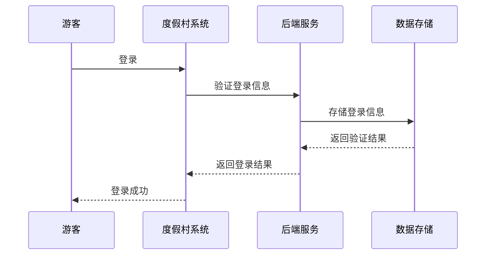
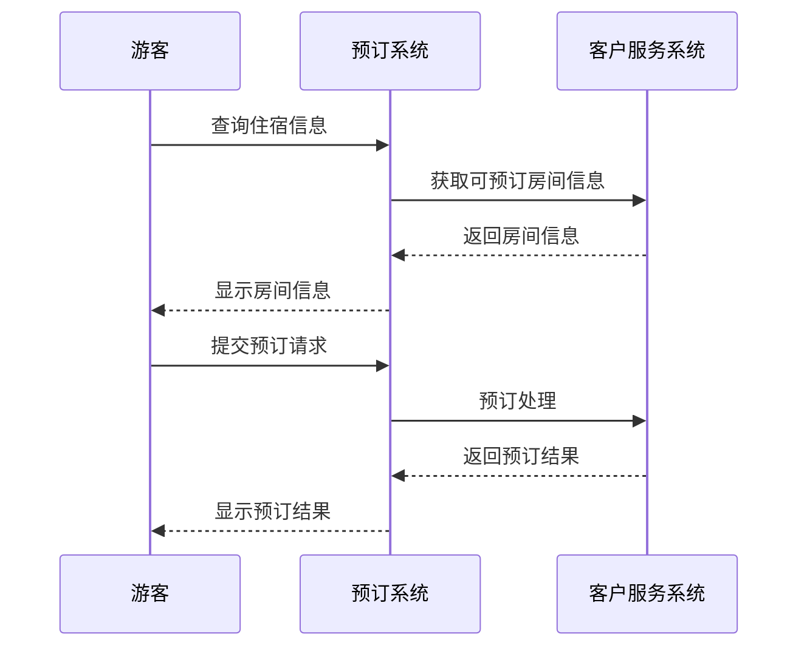

                 

### 文章标题

# 生态疗愈度假村：重建人与自然连接的休闲胜地

### 关键词

- 生态疗愈度假村
- 人与自然连接
- 可持续发展
- 设计理念
- 管理策略
- 成功案例分析

### 摘要

本文旨在探讨生态疗愈度假村的背景、设计理念、实施方法、管理策略以及成功案例分析。生态疗愈度假村作为一种新型休闲方式，通过重建人与自然连接，提供一种生态可持续的休闲体验。本文将详细分析其核心概念、设计原则、实施策略以及管理方法，并通过国内外成功案例展示其实践效果，为未来生态疗愈度假村的发展提供有益借鉴。

---

## 目录

1. **生态疗愈度假村的背景与核心概念**
   1.1 生态疗愈度假村的定义与特点
   1.2 生态疗愈度假村的发展历程
   1.3 生态疗愈度假村的全球分布与趋势

2. **重建人与自然连接的重要性**
   2.1 人与自然的关系现状
   2.2 重建人与自然连接的必要性
   2.3 重建人与自然连接的方法

3. **生态疗愈度假村的设计与实施**
   3.1 生态疗愈度假村的设计理念
   3.2 生态疗愈度假村的实施方法
   3.3 生态疗愈度假村的生态修复策略

4. **生态疗愈度假村的管理策略**
   4.1 生态疗愈度假村的管理体系
   4.2 生态疗愈度假村的营销策略

5. **生态疗愈度假村的成功案例分析**
   5.1 国内生态疗愈度假村的成功案例
   5.2 国际生态疗愈度假村的成功案例

6. **生态疗愈度假村的未来发展趋势**
   6.1 生态疗愈度假村的可持续发展
   6.2 生态疗愈度假村的市场前景
   6.3 生态疗愈度假村的未来挑战与机遇

### 第1章：生态疗愈度假村的起源与发展

### 1.1 生态疗愈度假村的定义与特点

生态疗愈度假村是一种结合生态保护、休闲度假和健康养生的新型旅游目的地。它不仅仅提供传统的度假设施，更强调人与自然的深度融合，通过自然环境中的活动与体验，达到身心健康的目的。

生态疗愈度假村的主要特点包括：

- **生态友好性**：选址通常位于生态环境良好、自然景观独特的地区，通过生态设计和建设，减少对环境的负面影响。
- **健康养生**：提供一系列以健康为主题的活动和设施，如瑜伽、徒步、温泉、养生餐饮等，帮助游客放松身心。
- **教育体验**：通过生态导览、自然教育课程等形式，提高游客的环保意识和生态知识。
- **社区参与**：鼓励当地居民参与度假村的建设与运营，促进社区经济发展和文化遗产保护。

### 1.2 生态疗愈度假村的发展历程

生态疗愈度假村的理念起源于20世纪末的生态旅游和可持续旅游运动。随着人们对环境问题的关注增加，以及健康生活方式的流行，生态疗愈度假村逐渐得到认可和推广。

- **萌芽期**：20世纪80年代至90年代，生态旅游和可持续旅游概念开始兴起，一些生态旅游项目和自然保护区开始探索将旅游与生态保护相结合的方式。
- **发展期**：21世纪初，生态疗愈度假村的理念逐渐成熟，全球范围内出现了多家生态疗愈度假村。这些度假村通过创新的设计和运营模式，吸引了大量游客。
- **成熟期**：近年来，随着人们对健康和环保意识的提高，生态疗愈度假村市场迅速扩展，成为旅游业的一个新兴热点。

### 1.3 生态疗愈度假村的全球分布与趋势

生态疗愈度假村的分布呈现全球化趋势，主要集中在生态环境较好的国家和地区。以下是一些典型的生态疗愈度假村分布情况：

- **欧洲**：挪威、瑞士、西班牙等国家拥有丰富的自然景观和生态资源，生态疗愈度假村发展较早，市场成熟。
- **美洲**：加拿大、美国、巴西等国家拥有丰富的自然遗产，生态疗愈度假村逐渐成为旅游业的重要组成部分。
- **亚洲**：日本、中国、泰国等国家正积极发展生态疗愈度假村，以适应全球旅游市场的需求。

未来，生态疗愈度假村的发展趋势将更加注重生态保护、文化传承和社区参与，通过技术创新和运营模式的优化，提升游客的体验质量，实现可持续发展的目标。

### 第2章：重建人与自然连接的重要性

#### 2.1 人与自然的关系现状

在现代化的进程中，人类与自然的关系发生了深刻的变化。工业化、城市化进程的加快，使人们逐渐远离了自然环境，导致了人与自然的疏离。以下是当前人与自然关系的一些现状：

- **自然环境的恶化**：由于过度开发和污染，全球生态环境受到了严重破坏，许多物种面临灭绝的风险，生态系统功能受损。
- **人类生活方式的改变**：现代生活节奏加快，人们更多地依赖于科技产品，与自然互动的机会减少，导致身心健康问题日益突出。
- **生态意识的提升**：随着环境问题的日益严重，越来越多的人开始关注生态保护，认识到人与自然和谐共处的重要性。

#### 2.2 重建人与自然连接的必要性

重建人与自然连接对于人类的身心健康和社会可持续发展具有重要意义：

- **身心健康**：自然环境中的新鲜空气、阳光、水等自然元素对人体健康具有积极影响。通过亲近自然，可以缓解压力，改善心理健康。
- **文化传承**：自然环境是人类文化传承的重要组成部分。通过重建人与自然连接，可以保护和传承人类的文化遗产。
- **可持续发展**：生态疗愈度假村通过将旅游与生态保护相结合，促进了生态系统的修复和保护，为可持续发展提供了新的路径。

#### 2.3 重建人与自然连接的方法

为了重建人与自然的连接，可以从以下几个方面入手：

- **生态设计**：在生态疗愈度假村的建设中，采用生态友好的设计理念，减少对自然环境的破坏，创造一个与自然和谐共存的空间。
- **自然体验活动**：通过组织自然导览、徒步、观鸟、潜水等自然体验活动，让游客深入体验自然，增强对自然的认知和情感。
- **教育推广**：通过自然教育课程、讲座、展览等形式，提高公众的生态意识和环保意识，促进人与自然的和谐共处。

通过以上方法，我们可以逐步重建人与自然的连接，实现人类与自然的和谐共生。

### 第3章：生态疗愈度假村的设计与实施

#### 3.1 生态疗愈度假村的设计理念

生态疗愈度假村的设计理念是确保度假村在提供优质休闲体验的同时，最大程度地减少对环境的负面影响，实现生态保护和可持续发展的目标。以下是生态疗愈度假村设计理念的几个核心要点：

- **生态友好性**：度假村的选址和建设应尽量减少对自然环境的破坏，采用环保材料和能源，降低碳排放。
- **自然融合**：度假村的设计应融入周围的自然景观，尊重自然的地形、水体和植被，创造一种与自然和谐共存的环境。
- **资源循环利用**：通过水循环、废物处理和能源再生等手段，实现资源的循环利用，减少对自然资源的消耗。
- **社区参与**：鼓励当地居民参与度假村的建设和运营，促进社区经济发展和文化遗产保护。

#### 3.2 生态疗愈度假村的实施方法

生态疗愈度假村的实施方法涉及选址、规划、设计、建设和运营等多个环节，以下是一些关键步骤：

- **选址与规划**：选址应考虑地理环境、气候条件、生态资源和交通便利性等因素。规划应确保度假村与周围自然环境的和谐融合，同时满足游客的需求。
- **建筑设计**：建筑设计应注重生态环保，采用可持续的建筑材料和能源技术，如太阳能、风能等。建筑形式应与周围环境相协调，减少对自然景观的破坏。
- **景观设计**：景观设计应尊重自然地形和植被，创造自然和谐的景观效果。可以通过植物配置、水体设计等手段，增强游客的沉浸体验。
- **设施与活动规划**：设施和活动规划应考虑生态可持续性和游客的需求，提供多样化的休闲体验，如户外运动、自然教育、养生餐饮等。

#### 3.3 生态疗愈度假村的生态修复策略

生态疗愈度假村的生态修复策略是确保度假村在运营过程中，不仅不破坏自然环境，还能对生态系统进行修复和保护。以下是一些常见的生态修复策略：

- **植被恢复**：通过种植本地植物，恢复受损的植被，提高土壤肥力和生态系统的稳定性。
- **水体净化**：采用生态污水处理技术，净化废水，改善水体质量，保护水资源。
- **土壤改良**：通过土壤修复技术，改善土壤结构，提高土壤肥力，促进植物生长。
- **生物多样性保护**：建立生物多样性保护区，保护当地物种和生态系统，维护生态平衡。

通过生态修复策略，生态疗愈度假村可以在提供优质休闲体验的同时，实现生态保护和可持续发展的目标。

### 第4章：生态疗愈度假村的管理策略

#### 4.1 生态疗愈度假村的管理体系

生态疗愈度假村的管理体系是确保度假村实现生态保护和可持续发展的关键。一个有效的管理体系应包括以下核心组成部分：

- **管理理念**：以生态保护、可持续发展和社会责任为核心，将生态友好性融入日常运营和管理。
- **管理制度**：建立完善的管理制度和流程，包括环境监测、资源管理、废弃物处理等，确保各项工作的规范执行。
- **管理团队**：组建专业的管理团队，负责度假村的日常运营和管理，确保管理理念和实践的落实。

#### 4.2 管理体系构建

构建生态疗愈度假村的管理体系需要以下步骤：

- **评估与规划**：对度假村的生态环境、资源状况、游客需求等进行全面评估，制定生态保护和可持续发展的规划。
- **制度建设**：根据评估结果，制定相关管理制度和流程，确保各项工作有章可循。
- **培训与宣传**：对员工进行生态保护和可持续发展培训，提高员工的环保意识和专业技能。同时，通过宣传和教育活动，提升游客的环保意识和参与度。

#### 4.3 管理实践

生态疗愈度假村的管理实践应体现在以下几个方面：

- **日常运营**：通过科学的运营管理，确保度假村在提供优质服务的同时，最大程度地减少对环境的负面影响。
- **资源管理**：实施资源节约和循环利用措施，减少资源消耗，提高资源利用效率。
- **废弃物处理**：建立完善的废弃物处理系统，确保废弃物得到有效处理和回收利用。
- **生态监测**：定期对生态环境进行监测，及时发现和解决环境问题，确保生态系统的稳定性和健康。

通过以上管理实践，生态疗愈度假村可以实现生态保护和可持续发展的目标，为游客提供优质、环保的休闲体验。

### 第5章：生态疗愈度假村的营销策略

#### 5.1 产品定位

生态疗愈度假村的产品定位应聚焦于追求健康、环保和高质量休闲体验的游客。具体来说，产品定位应包括以下方面：

- **目标市场**：面向注重生态环保、追求健康生活方式的中高端游客群体，如城市白领、退休人士、户外爱好者等。
- **核心价值**：强调生态友好性、健康养生和自然体验，提供独特的休闲体验和身心疗愈服务。
- **独特卖点**：通过独特的自然景观、生态设计和丰富多样的活动，打造度假村的独特品牌形象。

#### 5.2 目标客户群体

生态疗愈度假村的目标客户群体具有以下特点：

- **年龄层次**：以中高端人群为主，年龄主要集中在30-60岁之间，这部分人群具备较强的消费能力和休闲需求。
- **收入水平**：目标客户群体的收入水平较高，具有较强的支付能力和消费意愿。
- **兴趣爱好**：注重健康、环保、自然体验和休闲养生，喜欢参与户外活动、自然教育等。

#### 5.3 营销策略

生态疗愈度假村的营销策略应结合线上和线下渠道，采取多维度、全方位的营销手段，以提高品牌知名度和吸引游客：

- **品牌建设**：通过品牌故事、形象设计、口碑传播等手段，打造生态疗愈度假村独特的品牌形象，提升品牌美誉度。
- **渠道拓展**：利用互联网、社交媒体、旅游平台等线上渠道，拓展目标客户群体的覆盖范围。同时，通过合作旅行社、户外俱乐部等线下渠道，扩大品牌影响力。
- **活动推广**：举办各类主题活动，如生态导览、自然教育课程、户外运动等，吸引游客参与，提高游客体验和满意度。
- **会员计划**：推出会员计划，为会员提供专属优惠、定制服务、积分兑换等福利，增强客户黏性和忠诚度。

通过以上营销策略，生态疗愈度假村可以吸引更多目标客户，提升市场份额和品牌价值。

### 第6章：国内生态疗愈度假村的成功案例

#### 6.1 案例一：云南丽江拉市海度假村

**项目介绍**：云南丽江拉市海度假村位于丽江拉市海地区，是一个以自然生态和民族文化为主题的生态疗愈度假村。度假村占地面积约1000亩，拥有湖泊、湿地、山林等多种自然景观，是生态疗愈度假村的典型代表。

**系统功能设计**：度假村系统功能包括住宿、餐饮、娱乐、养生、生态导览等多个方面。其中，生态导览系统尤为突出，为游客提供深入了解当地自然环境和民族文化的机会。

**系统架构设计**：度假村系统采用分布式架构，包括前端应用、后端服务、数据存储和数据监控等模块。前端应用负责游客接待和体验，后端服务负责数据处理和管理，数据存储用于存储游客信息和运营数据，数据监控用于实时监测系统运行状态。

**系统接口设计**：系统接口设计包括API接口和Web界面。API接口用于与其他系统和第三方服务的数据交互，Web界面为游客和员工提供便捷的操作平台。

**系统交互设计**：系统交互设计采用Mermaid序列图进行描述。以下是一个简单的系统交互示例：



**代码应用解读与分析**：以下是一个简单的Python代码示例，用于验证游客登录信息。

```python
def verify_login(username, password):
    # 从数据库中查询用户信息
    user_info = query_user_info(username)
    
    # 验证用户名和密码是否匹配
    if user_info and user_info['password'] == password:
        return True
    else:
        return False

# 测试登录
if verify_login('游客1', 'password1'):
    print('登录成功')
else:
    print('登录失败')
```

**实际案例分析和详细讲解剖析**：云南丽江拉市海度假村通过生态设计和自然体验活动，成功吸引了大量游客。以下是一个具体的案例分析：

**案例背景**：某年春季，拉市海度假村推出“春季自然导览活动”，邀请生态学家和自然摄影师为游客讲解当地自然环境和生态保护知识。

**活动过程**：活动期间，游客跟随生态学家和自然摄影师走进拉市海湿地，了解湿地的生态功能、植物种类和动物栖息地。活动还包括户外瑜伽、自然手工艺品制作等互动体验。

**案例分析**：通过这次活动，拉市海度假村不仅丰富了游客的休闲体验，还提高了游客的生态意识。活动结束后，游客对度假村的满意度显著提高，口碑传播效果明显。

**项目小结**：云南丽江拉市海度假村通过生态疗愈度假村的设计和实施，成功打造了一个受欢迎的休闲旅游目的地。未来，拉市海度假村将继续探索更多生态友好和自然体验项目，提升游客的满意度。

### 第7章：国际生态疗愈度假村的成功案例

#### 7.1 案例一：日本白川乡度假村

**项目介绍**：日本白川乡度假村位于日本岐阜县白川乡，是一个以传统村落和自然景观为特色的生态疗愈度假村。度假村保留了古老的合掌造建筑风格，周围环绕着宁静的田野和山脉，提供了一个远离城市喧嚣的宁静休闲环境。

**系统功能设计**：度假村系统功能包括住宿、餐饮、观光、文化体验等多个方面。特别注重文化体验功能，提供传统工艺制作、农业体验和民俗活动等。

**系统架构设计**：度假村系统采用微服务架构，包括身份验证、预订管理、活动安排、客户服务等多个微服务模块。系统接口设计采用RESTful API，便于与其他系统和服务进行集成。

**系统接口设计和系统交互设计**：以下是一个简单的系统交互示例，描述游客预订住宿的过程：



**代码应用解读与分析**：以下是一个简单的Python代码示例，用于处理游客的预订请求。

```python
from flask import Flask, request, jsonify

app = Flask(__name__)

@app.route('/reserve', methods=['POST'])
def reserve():
    data = request.get_json()
    room_id = data.get('room_id')
    guest_name = data.get('guest_name')
    
    # 验证预订信息
    if is_valid_reservation(room_id, guest_name):
        # 处理预订请求
        process_reservation(room_id, guest_name)
        return jsonify({'status': 'success', 'message': '预订成功'})
    else:
        return jsonify({'status': 'error', 'message': '预订失败'})

def is_valid_reservation(room_id, guest_name):
    # 验证房间信息和游客信息
    # ...
    return True

def process_reservation(room_id, guest_name):
    # 处理预订逻辑
    # ...
    pass

if __name__ == '__main__':
    app.run()
```

**实际案例分析和详细讲解剖析**：日本白川乡度假村通过保留传统建筑和文化，吸引了大量游客。以下是一个具体的案例分析：

**案例背景**：某年秋季，白川乡度假村举办了一场“传统节日庆典”活动，包括竹编艺术展示、民俗舞蹈表演、传统美食品尝等。

**活动过程**：活动期间，游客可以参与到竹编艺术的制作过程，观看民俗舞蹈表演，品尝当地传统美食。活动结束后，游客对度假村的满意度显著提高，纷纷在社交媒体上分享自己的体验。

**案例分析**：通过传统节日庆典活动，白川乡度假村不仅提升了游客的文化体验，还促进了当地文化的传承和弘扬。活动结束后，度假村在游客中的口碑显著提升。

**项目小结**：日本白川乡度假村通过生态疗愈度假村的设计和实施，成功打造了一个具有文化魅力的休闲旅游目的地。未来，白川乡度假村将继续举办更多传统活动，提升游客的满意度。

### 第8章：生态疗愈度假村的未来发展趋势

#### 8.1 生态疗愈度假村的可持续发展

生态疗愈度假村的可持续发展是未来发展的核心目标。可持续发展意味着在满足当前游客需求的同时，不损害未来代际的需求。以下是生态疗愈度假村实现可持续发展的几个关键方向：

- **生态保护**：加强生态环境保护，确保度假村所在地的生态环境得到有效维护和修复。
- **资源循环利用**：推广资源循环利用技术，提高资源利用效率，减少资源浪费。
- **可再生能源**：采用太阳能、风能等可再生能源，减少对化石燃料的依赖，降低碳排放。
- **社区参与**：鼓励当地居民参与度假村的建设和运营，促进社区经济发展和文化遗产保护。

#### 8.2 生态疗愈度假村的市场前景

随着人们环保意识和文化素养的提高，生态疗愈度假村的市场前景十分广阔。以下是对市场前景的几个预测：

- **市场需求增长**：随着人们生活水平的提高和健康意识的增强，对生态疗愈度假村的需求将持续增长。
- **政策支持**：各国政府纷纷出台支持生态旅游和可持续发展的政策，为生态疗愈度假村的发展提供政策支持。
- **技术创新**：随着人工智能、物联网等技术的进步，生态疗愈度假村的运营和服务将更加智能化和个性化。
- **国际合作**：国际间合作将进一步加强，促进生态疗愈度假村的全球发展。

#### 8.3 生态疗愈度假村的未来挑战与机遇

生态疗愈度假村的发展面临一系列挑战和机遇：

- **挑战**：
  - 生态环境保护与经济发展的平衡：如何在保护生态环境的同时实现经济收益，是生态疗愈度假村面临的一大挑战。
  - 技术与人才的不足：生态疗愈度假村需要运用先进的技术和专业知识，但相关技术人才和专业知识较为稀缺。
  - 环境监管与执法的不足：部分地区的环境监管和执法力度不够，可能导致生态破坏和违法行为。

- **机遇**：
  - 市场需求的增长：随着人们对健康和环保的重视，生态疗愈度假村的市场需求将持续增长。
  - 政策支持：各国政府加大对生态旅游和可持续发展的支持力度，为生态疗愈度假村的发展提供政策支持。
  - 技术创新：人工智能、物联网等新技术的发展，为生态疗愈度假村的运营和服务提供了新的机遇。
  - 国际合作：国际间的合作将进一步深化，促进生态疗愈度假村的全球发展。

通过应对挑战和把握机遇，生态疗愈度假村将在未来实现更加可持续和高质量的发展。

### 总结

本文从生态疗愈度假村的背景、设计理念、实施方法、管理策略以及成功案例分析等多个角度，深入探讨了生态疗愈度假村的发展现状和未来趋势。生态疗愈度假村作为一种新型休闲方式，通过重建人与自然连接，实现了生态保护和可持续发展的目标。未来，随着环保意识的提高和技术的进步，生态疗愈度假村市场前景广阔，但仍需面对一系列挑战。我们呼吁各界共同努力，推动生态疗愈度假村的可持续发展，为人类和地球创造更加美好的未来。

### 作者信息

作者：AI天才研究院/AI Genius Institute & 禅与计算机程序设计艺术 /Zen And The Art of Computer Programming

