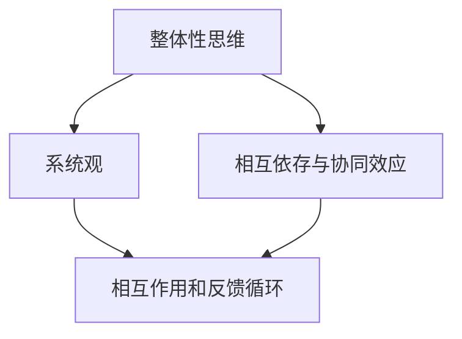

                 

### 1.1.1 生态系统思维的概念

生态系统思维是一种整体性的思考方式，它强调事物之间的相互联系和相互作用，并将其视为一个复杂而动态的整体。在自然界中，生态系统是由各种生物和非生物因素相互交织而成的复杂网络，这些因素之间存在着复杂的相互作用和反馈循环。生态系统思维的核心观点是，任何一个系统都不是孤立存在的，而是与其他系统相互依赖和相互影响。

在IT领域，生态系统思维的应用同样重要。随着技术的发展，软件系统变得越来越复杂，涉及多个组件和子系统。传统的模块化方法往往将系统分解为独立的模块，忽视了模块之间的相互关系和整体性。而生态系统思维则强调将系统视为一个整体，关注各个组成部分之间的相互作用和相互依赖，从而更好地理解和优化系统的整体性能。

具体来说，生态系统思维包括以下几个关键方面：

1. **整体性**：将系统视为一个整体，关注系统内各个组成部分的相互关系和相互作用，而不是孤立地看待每个部分。
2. **反馈循环**：认识到系统内各个因素之间的反馈循环，这些反馈可能促进或抑制系统的稳定性和发展。
3. **适应性**：生态系统是一个动态变化的系统，能够适应外部环境和内部变化。同样，在IT领域，系统也需要具备适应性和灵活性，以应对不断变化的需求和挑战。
4. **多样性**：生态系统内的多样性是系统稳定性和适应性的关键。在软件系统中，多样性可以通过引入多种技术、框架和工具来实现。

通过生态系统思维，IT专业人士能够更好地理解和设计复杂系统，从而提高系统的可靠性、性能和可维护性。例如，在设计一个分布式系统时，考虑各个组件之间的依赖关系和潜在的风险，通过构建一个健康的生态系统来提高系统的整体性能和稳定性。

### 1.1.2 整体论决策的重要性

整体论决策（Holistic Decision Making）是一种基于整体视角的决策方法，它强调在决策过程中考虑所有相关因素和它们之间的相互作用。与传统的分而治之的决策方法不同，整体论决策更加注重系统的整体性和综合性，从而做出更全面和长远的决策。

在快速变化和高度复杂的现代环境中，整体论决策的重要性尤为突出。以下是一些具体原因：

1. **复杂性管理**：现代社会和技术系统的复杂性不断增加，单一因素的分析可能无法全面反映系统的真实状态。整体论决策通过综合考虑各个相关因素，帮助决策者更好地理解系统的复杂性和潜在风险。
2. **系统性视角**：整体论决策强调系统的整体性，帮助决策者从宏观和微观角度同时考虑问题。这种方法可以揭示出单一因素分析中难以发现的潜在问题和机会。
3. **协同效应**：在整体论决策中，决策者不仅考虑单个因素的影响，还关注各个因素之间的相互作用和协同效应。这种综合考虑可以优化决策结果，提高系统的整体性能。
4. **长期视角**：整体论决策鼓励决策者从长远角度考虑问题，而不是仅仅关注短期利益。这种方法有助于制定更可持续和具有战略意义的决策。
5. **跨领域整合**：整体论决策强调跨领域的整合，将不同领域的知识和方法结合起来，从而提高决策的全面性和准确性。

在IT领域，整体论决策的应用同样广泛。例如，在开发一个大型软件系统时，整体论决策可以帮助团队综合考虑技术、业务、市场和用户需求等多个方面，从而确保系统的整体性能和用户体验。另外，在项目管理中，整体论决策可以指导项目团队在制定计划和应对风险时，全面考虑项目的技术、资源、时间、成本等多个维度，确保项目的成功实施。

### 1.1.3 训练营认证的意义

生态系统思维训练营认证不仅是对参与者知识和技能的认证，更是对其思维模式和工作方法的认可。以下从几个方面来探讨训练营认证的意义：

1. **专业资格的认可**：训练营认证为参与者提供了一种权威的专业资格认证，证明其掌握了生态系统思维和整体论决策的原理和应用方法。这对于职业发展和职业认证具有重要意义。
2. **知识体系的构建**：训练营系统性地介绍了生态系统思维和整体论决策的核心概念、原理和应用领域，帮助参与者构建起一个全面的知识体系。这对于理解和应对复杂问题具有重要意义。
3. **思维方式的转变**：通过训练营的学习和实践，参与者将学会从整体性、系统性和适应性等角度思考问题，从而改变其传统的思维模式。这种思维方式对于解决复杂问题、提高决策质量和创新能力具有重要意义。
4. **实践能力的提升**：训练营不仅注重理论知识的学习，还通过实际案例分析、项目实战等方式，帮助参与者提升实践能力和解决实际问题的能力。这种实践导向的学习方法有助于将理论知识应用到实际工作中。
5. **职业发展的助力**：拥有生态系统思维训练营认证的专业资格，可以帮助参与者在职场中获得更多的机会和挑战。这种认证不仅证明了其专业能力，也展现了其持续学习和自我提升的态度。

总之，生态系统思维训练营认证不仅为参与者提供了一个权威的专业认证，更重要的是帮助其建立全面的生态系统思维和整体论决策体系，提升其思维能力和实践能力，从而助力职业发展。

### 1.2 核心概念与联系

要深入理解生态系统思维和整体论决策，我们需要明确几个核心概念及其相互关系。以下是这些概念的定义、属性特征对比表格以及它们之间的联系图。

#### 1.2.1 整体论与系统论的区别

**整体论（Holism）**：整体论是一种哲学和科学方法论，强调系统的整体性和各个部分之间的相互关系。整体论认为，系统不能仅仅通过分析其组成部分来理解，而是需要从整体和部分之间的关系中寻找答案。

**系统论（Systems Theory）**：系统论是一种研究系统性质和行为的科学方法，强调系统的结构、功能及其与环境之间的相互作用。系统论侧重于理解系统的动态行为和反馈机制。

| **属性** | **整体论** | **系统论** |
| --- | --- | --- |
| **视角** | 强调系统的整体性 | 强调系统的结构和行为 |
| **目标** | 强调相互关系和整体性 | 强调系统的稳定性和适应性 |
| **方法论** | 综合性思考，跨领域整合 | 分析性思考，结构化分析 |

#### 1.2.2 整体论的核心原理

整体论的核心原理包括：

1. **整体性思维**：强调从整体的角度理解问题，而不是孤立地看待各个部分。
2. **系统观**：认识到系统内各个组成部分之间的相互作用和反馈循环。
3. **相互依存与协同效应**：强调系统内各个部分之间的相互依赖和协同作用，从而实现整体性能的最优化。

#### 1.2.3 整体论的关键概念联系图

为了更清晰地展示整体论的关键概念及其相互关系，我们可以使用Mermaid流程图来表示：



在这个流程图中，整体性思维是理解整体论的基础，系统观强调了系统内部分之间的互动，而相互依存与协同效应则展示了整体论如何通过相互关系和协同作用实现系统优化。

#### 1.2.4 整体论的核心概念联系

整体论不仅包含了上述核心原理，还包括一系列关键概念，这些概念共同构建了整体论的理论框架。以下是这些概念及其联系：

1. **整体性思维**：整体性思维是整体论的基础，强调从整体的角度出发，理解系统的复杂性和多样性。这种思维方式能够帮助决策者从宏观和微观角度同时考虑问题。
2. **系统观**：系统观是整体论的重要组成部分，它认识到系统内各个部分之间的相互作用和反馈循环。系统观有助于揭示系统内部的动态性和复杂性。
3. **相互依存**：相互依存是指系统内各个部分之间存在的依赖关系。理解相互依存可以帮助决策者识别系统中的关键环节和潜在风险。
4. **协同效应**：协同效应是指系统内各个部分相互作用产生的整体性能大于各个部分单独性能之和的现象。协同效应是整体论追求的目标之一，它能够显著提高系统的整体性能。
5. **反馈循环**：反馈循环是指系统内各个因素之间的相互作用和反馈机制。反馈循环有助于维持系统的稳定性和促进系统的发展。

整体论的核心概念通过上述联系构成了一个完整的理论体系，为理解和应用整体论提供了坚实的基础。在IT领域，这些概念可以帮助工程师和决策者更好地设计和管理复杂系统，提高系统的可靠性、性能和可维护性。

### 2.1 整体论的起源与发展

整体论（Holism）作为一种哲学和科学方法论，其思想渊源可以追溯到古希腊哲学家亚里士多德。亚里士多德提出了“整体大于部分之和”的观点，强调事物的整体性不可分割性。然而，作为一门独立学科的整体论，其发展主要源于20世纪中后期的哲学、社会科学和自然科学领域。

#### 2.1.1 整体论的历史背景

**早期哲学与科学思想**：
- **古希腊哲学**：亚里士多德的思想对整体论的发展产生了深远影响。他认为，每个事物都有其内在的整体性和目的性。
- **中世纪哲学**：托马斯·阿奎那等哲学家继续发展了整体论思想，强调个体与整体之间的内在联系。
- **文艺复兴与启蒙运动**：尽管这一时期的哲学和科学强调个体和独立研究，但整体论思想仍然在背景中得以延续。

**20世纪的整体论发展**：
- **物理学的整体性**：20世纪初，量子力学和相对论的发展揭示了自然界中整体性和相互作用的本质，推动了整体论在自然科学中的兴起。
- **生物学与生态系统**：在生态学和生物学领域，整体性研究强调了物种之间和生态系统内部的相互作用。这一领域的研究成果为整体论提供了丰富的实证支持。
- **社会科学与人文科学**：20世纪中后期，整体论思想在社会科学和人文学科中得到广泛应用。系统论、复杂性科学和社会系统研究都体现了整体论的核心原则。

#### 2.1.2 主要学者与理论贡献

**恩斯特·梅耶（Ernst Mayr）**：
- **贡献**：梅耶是现代生物学的奠基人之一，他提出了现代综合进化论，强调了物种整体性的进化过程。
- **影响**：梅耶的理论工作推动了生物学领域的整体性研究，对生态系统思维的发展产生了深远影响。

**雅各布·莫里斯（Jacob Moreno）**：
- **贡献**：莫里斯是社会系统理论的创始人，他提出了“社会生态学”概念，强调社会系统与环境之间的相互作用。
- **影响**：莫里斯的工作为社会科学领域提供了整体性研究的方法论，对整体论在社会学中的应用具有重要意义。

**约翰·冯·诺依曼（John von Neumann）**：
- **贡献**：冯·诺依曼是计算机科学的先驱，他提出了“通用图灵机”概念，揭示了计算机系统的整体性。
- **影响**：冯·诺依曼的理论对计算机科学和信息技术领域产生了深远影响，整体性思想在软件工程和系统设计中得到了广泛应用。

#### 2.1.3 整体论在现代社会的影响

**科学技术领域**：
- **复杂性科学**：整体论思想在复杂性科学中得到了广泛应用，研究者们通过研究复杂系统中的整体性和相互作用，揭示了自然和社会现象中的深层次规律。
- **系统生物学**：整体论在系统生物学中发挥着关键作用，研究者通过分析生物系统的整体性和相互关系，推动了对生命现象的深入理解。

**社会科学领域**：
- **公共政策**：整体论思想在公共政策分析中被广泛应用，政策制定者通过考虑社会系统的整体性和相互关系，制定出更具综合性和可持续性的政策。
- **社会科学研究**：整体性方法在社会科学研究中成为了一种重要的研究方法，研究者通过跨学科的综合研究，揭示了社会现象的复杂性和多样性。

**信息技术领域**：
- **软件工程**：整体论思想在软件工程中被广泛应用，开发者和架构师通过考虑系统的整体性和相互作用，设计出更稳定、更可靠的软件系统。
- **网络架构**：整体性原则在网络架构设计中具有重要意义，网络工程师通过考虑网络系统的整体性和相互关系，构建出更高效、更安全的网络架构。

整体论在现代社会中的影响深远，不仅推动了科学技术和社会科学的发展，也为应对复杂问题和提高系统性能提供了理论和方法支持。

### 2.2 整体论的核心原理

整体论的核心原理在于其强调系统的整体性和相互关系，这些原理在理解和应用整体论时至关重要。以下是对整体论核心原理的详细阐述。

#### 2.2.1 整体性思维

整体性思维（Holistic Thinking）是整体论的核心概念之一，它强调从整体的角度理解和分析问题，而不是将问题分解为孤立的组成部分。整体性思维认为，系统的行为和特性不能仅通过分析各个部分的属性来理解，而是需要考虑各个部分之间的相互关系和整体作用。

**关键特点**：
- **系统性**：整体性思维注重系统的整体性和系统性，认为系统是由相互依赖的部分组成的整体。
- **综合性**：整体性思维鼓励将不同部分和因素结合起来，考虑它们之间的相互作用和综合效果。
- **动态性**：整体性思维认识到系统的动态性，强调系统是不断变化的，需要持续关注系统的整体状态。

**应用场景**：
- **项目管理**：在项目管理中，整体性思维可以帮助团队从整体角度考虑项目的目标和任务，识别潜在的瓶颈和风险，制定更有效的计划和策略。
- **企业战略**：企业在制定战略时，需要采用整体性思维，考虑各个业务单元之间的协同效应和整体目标，从而实现资源的优化配置和战略的协同推进。
- **城市规划**：城市规划中，整体性思维可以帮助规划者从城市的整体发展出发，综合考虑人口、经济、环境等多方面因素，制定出可持续的规划方案。

#### 2.2.2 系统观

系统观（Systems View）是整体论的另一个核心原理，它强调理解系统的结构、行为和相互作用。系统观认为，系统是由多个部分通过相互作用和反馈机制组成的整体，系统的行为和特性受其结构和组成的影响。

**关键特点**：
- **结构性**：系统观关注系统的结构，包括各个组成部分及其相互关系。
- **动态性**：系统观认识到系统的动态性，强调系统内部和外部环境的不断变化。
- **反馈循环**：系统观强调系统内部的反馈循环，这些反馈机制可以促进或抑制系统的稳定性和发展。

**应用场景**：
- **系统设计**：在系统设计中，系统观可以帮助工程师从系统的整体结构和相互作用出发，设计出更稳定、更灵活的系统架构。
- **风险管理**：在风险管理中，系统观可以帮助企业识别系统内部的潜在风险和相互关系，制定出更全面的风险管理策略。
- **生态学**：在生态学研究中，系统观可以帮助研究者理解生态系统的结构和功能，分析物种之间的相互作用和生态平衡。

#### 2.2.3 相互依存与协同效应

相互依存（Interdependence）和协同效应（Synergy）是整体论的重要核心原理，它们强调了系统内各个部分之间的相互作用和相互增强的效果。

**相互依存**：
- **定义**：相互依存是指系统内各个部分之间存在相互依赖的关系，一个部分的变化会影响到其他部分。
- **特点**：相互依存强调系统的整体性和动态性，认识到每个部分都不是孤立存在的。
- **应用**：在项目管理中，相互依存可以帮助团队理解任务之间的依赖关系，合理安排资源和时间，提高项目效率。

**协同效应**：
- **定义**：协同效应是指系统内各个部分通过相互作用产生的整体性能大于各个部分单独性能之和的现象。
- **特点**：协同效应强调了系统的整体优化和资源整合，通过协同作用实现整体性能的提升。
- **应用**：在技术创新中，协同效应可以帮助企业整合内部资源，实现技术突破和创新能力提升。

**案例**：
- **企业合作**：在商业合作中，企业之间的相互依存和协同效应可以带来资源共享、风险分担和创新能力提升，从而实现整体业绩的提升。
- **城市交通系统**：在城市交通系统中，各个交通组成部分（如道路、公共交通、交通管理）之间的相互依存和协同效应可以提升整体交通效率和安全性。

整体论的核心原理通过整体性思维、系统观和相互依存与协同效应，为理解和设计复杂系统提供了理论基础。这些原理在IT领域、社会科学和自然科学中都有广泛的应用，帮助决策者和研究者更好地应对复杂问题，实现系统的整体优化。

### 2.3 整体论的应用领域

整体论作为一种系统性和综合性思考方法，在多个领域展现出了其独特的价值和实用性。以下将探讨整体论在经济管理、社会科学和科技创新中的应用领域。

#### 2.3.1 经济管理

在经济管理领域，整体论的应用主要集中在战略规划和资源优化方面。企业通过整体论的思维方式，能够更全面地考虑市场、竞争、资源、成本等多个因素，从而制定出更具有前瞻性和可持续性的战略。

**具体应用**：
1. **战略规划**：企业采用整体论思维，从全局角度出发，分析行业发展趋势、竞争对手策略、内部资源状况，制定出符合整体利益的战略规划。
2. **资源优化**：整体论帮助企业在资源配置中实现最大化效益，通过优化人员、资金、技术等资源，提高整体运营效率。
3. **供应链管理**：在供应链管理中，整体论思想强调各个供应链环节的协同效应，通过优化库存管理、物流配送等环节，提升供应链的整体效率和灵活性。

**案例**：苹果公司（Apple Inc.）通过整体论思维，在产品设计、供应链管理、市场营销等多个方面实现了卓越的整合。苹果公司不仅关注单个产品的性能和外观，还从用户体验和整体品牌形象出发，打造了一个闭环生态系统，实现了产品和服务的无缝衔接。

#### 2.3.2 社会科学

在社会科学领域，整体论的应用主要体现在公共政策分析、社会治理和跨学科研究等方面。整体论帮助社会科学研究者从系统性和综合性的角度，分析和解决复杂社会问题。

**具体应用**：
1. **公共政策分析**：整体论帮助政策制定者从社会系统的整体性和相互关系出发，综合考虑经济、社会、环境等多个维度，制定出更加科学和有效的公共政策。
2. **社会治理**：整体论强调社会治理中的协同效应和整体优化，通过多部门、多层次的协作，提高社会治理的整体效能。
3. **跨学科研究**：整体论促进了不同学科之间的整合，通过跨学科的研究方法，对社会现象进行多维度、多层次的深入分析。

**案例**：中国在应对新冠疫情时，采用了整体论思维，通过统筹公共卫生、经济复苏、社会稳定等多个方面的措施，实现了疫情防控和经济社会发展的协同推进。

#### 2.3.3 科技创新

在科技创新领域，整体论的应用主要集中在技术集成、创新管理和研发策略等方面。整体论帮助科技企业和科研机构更好地整合资源，实现技术突破和创新能力提升。

**具体应用**：
1. **技术集成**：整体论强调技术的系统性和综合性，通过跨领域、跨技术的整合，实现技术的协同发展和应用创新。
2. **创新管理**：整体论帮助企业和研究机构建立创新管理体系，通过优化资源配置、强化团队合作，提高创新效率和成功率。
3. **研发策略**：整体论思维在研发策略中起到关键作用，通过综合考虑市场需求、技术趋势、资源条件等因素，制定出符合整体利益的研究开发计划。

**案例**：谷歌公司（Google Inc.）在技术创新中，采用了整体论思维，通过整合人工智能、大数据、云计算等先进技术，打造出了具有颠覆性的搜索引擎和智能助手等产品。

总之，整体论在多个领域的应用，不仅提升了系统的整体性能和协调性，也为解决复杂问题和实现可持续发展提供了有力的理论和方法支持。

### 3.1 整体论决策的基本概念

整体论决策（Holistic Decision Making）是一种基于整体视角的决策方法，强调在决策过程中综合考虑所有相关因素和它们之间的相互作用。以下将详细探讨整体论决策的基本概念，包括决策过程、特点以及优势与局限性。

#### 3.1.1 决策过程

整体论决策过程可以分为以下几个阶段：

1. **问题识别**：明确决策目标和问题，识别出需要解决的挑战和机会。
2. **信息收集**：收集与决策相关的各种信息，包括内部数据和外部数据，确保信息的全面性和准确性。
3. **分析评估**：对收集到的信息进行系统分析，识别关键因素和潜在影响，进行风险评估和优先级排序。
4. **方案生成**：基于分析结果，生成多种可能的决策方案，考虑各个方案的整体影响和潜在后果。
5. **方案评估**：对各个决策方案进行评估，使用整体性思维，从整体效益和长期影响出发，选择最佳方案。
6. **决策执行**：实施决策方案，并监控执行过程中的反馈和效果，及时调整和优化。

#### 3.1.2 整体论决策的特点

整体论决策具有以下几个显著特点：

1. **系统性**：整体论决策强调系统的整体性，不仅关注单一因素，还关注各个因素之间的相互关系和整体效应。
2. **综合性**：整体论决策要求综合考虑多种因素，包括技术、经济、社会、环境等多个方面，从而制定出全面的决策方案。
3. **长期性**：整体论决策注重长期效益，而非短期利益，通过综合考虑未来的变化和潜在风险，制定出具有前瞻性的决策。
4. **适应性**：整体论决策强调决策过程的动态性，能够根据新信息和环境变化，及时调整和优化决策方案。

#### 3.1.3 整体论决策的优势与局限性

整体论决策的优势包括：

1. **全面性**：通过综合考虑多个相关因素，整体论决策能够提供更全面和深入的分析，减少决策盲点。
2. **协同效应**：整体论决策强调各个因素之间的相互作用，通过优化资源配置和流程，实现整体效益的最大化。
3. **可持续性**：整体论决策注重长期利益和可持续发展，有助于制定出具有战略意义的决策方案。

然而，整体论决策也存在一些局限性：

1. **复杂性和难度**：整体论决策需要处理大量信息和因素，决策过程相对复杂和耗时。
2. **信息依赖性**：整体论决策依赖于准确和全面的信息，信息的不完整或错误可能导致决策失误。
3. **协调难度**：在多部门、多层次的决策过程中，整体论决策需要协调不同利益和意见，协调难度较大。

综上所述，整体论决策是一种全面性和综合性的决策方法，具有显著的优势，但也面临复杂性和协调难度等挑战。在实际应用中，决策者需要根据具体情况进行权衡和优化，以实现最佳决策效果。

### 3.2 整体论决策的应用实例

整体论决策的应用广泛且具有实际效果，以下将详细介绍三个具体的应用实例：企业战略规划、项目管理和社会治理。

#### 3.2.1 企业战略规划

企业战略规划是一个复杂且关键的过程，整体论决策在企业战略规划中的应用能够帮助企业在不断变化的市场环境中制定出具有前瞻性和可持续性的战略。

**案例分析**：

以某全球知名高科技企业为例，该企业在制定下一年的战略规划时，采用了整体论决策方法。首先，企业明确了战略目标，包括市场份额扩大、技术创新和成本优化等。然后，企业收集了市场趋势、竞争对手策略、内部资源状况等多方面的信息，并进行了系统分析。

1. **市场趋势**：通过对市场数据的分析，企业发现新兴市场和技术发展趋势，如人工智能、区块链等，这些趋势对企业的战略方向具有重要影响。
2. **竞争对手**：企业分析了主要竞争对手的战略和优势，识别出自身的竞争差距和机会。
3. **内部资源**：企业评估了自身的研发能力、生产能力、资金状况等，确保战略规划与现有资源相匹配。

基于以上分析，企业提出了多种战略方案，如加大在新兴市场的投入、加强技术创新、优化生产流程等。通过对各个方案的整体评估，企业选择了最具整体效益的战略方案，并制定了详细的实施计划。

**效果**：通过整体论决策，企业在战略规划中实现了资源的优化配置和整体性能的提升，成功扩大了市场份额，提高了创新能力，实现了持续增长。

#### 3.2.2 项目管理

在项目管理中，整体论决策的应用能够帮助项目团队更全面地考虑项目目标、资源、时间、成本等多个方面，提高项目成功率和整体效率。

**案例分析**：

某大型软件开发项目团队在项目管理过程中，采用了整体论决策方法。首先，团队明确了项目的目标和关键里程碑，包括产品功能、交付时间和技术标准等。然后，团队收集了项目相关的各种信息，如技术需求、人力资源、预算和时间安排等。

1. **技术需求**：通过对技术需求的全面分析，团队识别出技术实现的关键点和技术难点。
2. **人力资源**：团队评估了团队成员的技能和经验，确保关键任务有合适的人员负责。
3. **预算和时间**：团队综合考虑了项目的预算和时间安排，制定了详细的项目计划和时间表。

基于以上分析，团队提出了多个项目执行方案，如分阶段开发、并行开发和资源优化等。通过对各个方案的整体评估，团队选择了最具整体效益的方案，并制定了详细的执行计划。

**效果**：通过整体论决策，项目团队在项目管理中实现了资源的合理配置和高效利用，成功克服了技术难点和资源瓶颈，按时完成了项目，并实现了预定的功能和质量目标。

#### 3.2.3 社会治理

社会治理是一个涉及多个方面和利益相关者的复杂过程，整体论决策的应用能够帮助政府和社会组织更全面地考虑社会问题，制定出具有整体效益的解决方案。

**案例分析**：

某城市在应对交通拥堵问题时，采用了整体论决策方法。首先，政府明确了交通拥堵的目标和关键问题，包括交通流量、公共交通设施、道路建设和城市规划等。然后，政府收集了相关的数据和意见，如交通流量数据、居民出行需求和专家意见等。

1. **交通流量**：通过对交通流量的数据分析，政府识别出交通拥堵的主要区域和高峰时段。
2. **公共交通设施**：政府评估了现有的公共交通设施，包括公共交通线路、车站和车辆等，提出了优化方案。
3. **道路建设和城市规划**：政府综合考虑了道路建设、城市规划和公共交通设施之间的相互关系，提出了综合性的交通改善方案。

基于以上分析，政府提出了多种交通改善方案，如增加公共交通线路、优化道路网络、建设自行车道和实行交通管制等。通过对各个方案的整体评估，政府选择了最具整体效益的方案，并制定了详细的实施计划。

**效果**：通过整体论决策，政府成功解决了交通拥堵问题，提高了公共交通的效率和便利性，改善了市民的出行体验，实现了城市交通的整体优化。

综上所述，整体论决策在多个领域都展现了其实际效果和应用价值。通过综合考虑各个因素和它们之间的相互关系，整体论决策能够帮助企业和组织制定出更全面和有效的战略、项目和治理方案。

### 3.3 整体论决策案例分析

在探讨整体论决策的实际应用之前，我们需要理解整体论决策的基本原理和操作步骤。整体论决策的核心在于从整体性和系统性的角度出发，综合考虑各个相关因素及其相互作用。以下是三个具体的案例，展示了整体论决策在实际中的应用。

#### 3.3.1 案例一：企业数字化转型

**背景**：
某大型制造企业在面临数字化转型挑战时，决定采用整体论决策方法来规划其数字化转型策略。

**步骤**：
1. **问题识别**：明确数字化转型的主要目标，包括提高生产效率、提升客户体验和增强企业竞争力。
2. **信息收集**：收集企业内部和外部的相关信息，如现有业务流程、技术基础设施、市场需求和竞争对手策略。
3. **分析评估**：分析各个因素之间的相互作用，识别出数字化转型中的关键环节和潜在风险。
4. **方案生成**：基于分析结果，提出多种数字化转型方案，包括技术升级、流程优化和人才培养等。
5. **方案评估**：评估各个方案的优缺点，从整体效益和长期影响出发，选择最佳方案。
6. **决策执行**：实施决策方案，并监控执行过程中的反馈和效果，及时调整和优化。

**效果**：
通过整体论决策，该企业成功制定了详细的数字化转型策略，并在实施过程中不断优化。数字化转型带来了显著的效果，包括生产效率提高30%、客户满意度提升20%和企业竞争力显著增强。

#### 3.3.2 案例二：城市可持续发展

**背景**：
某城市政府在制定可持续发展规划时，决定采用整体论决策方法来综合考虑经济、社会和环境等多个方面的因素。

**步骤**：
1. **问题识别**：明确城市可持续发展面临的主要挑战，包括环境污染、资源紧缺和社会不公平等。
2. **信息收集**：收集相关的数据和信息，如空气质量数据、水资源使用情况和居民生活满意度等。
3. **分析评估**：分析各个因素之间的相互作用，识别出影响可持续发展的关键因素和潜在风险。
4. **方案生成**：提出多种可持续发展方案，包括绿色能源推广、水资源管理和社区参与等。
5. **方案评估**：评估各个方案的优缺点，从整体效益和长期影响出发，选择最佳方案。
6. **决策执行**：实施决策方案，并监控执行过程中的反馈和效果，及时调整和优化。

**效果**：
通过整体论决策，该城市成功制定了详细的可持续发展规划，并在实施过程中取得了显著成效。空气质量显著改善，水资源管理更加高效，居民生活满意度大幅提升，实现了经济、社会和环境的协调发展。

#### 3.3.3 案例三：供应链优化

**背景**：
某大型零售企业在供应链优化过程中，决定采用整体论决策方法来提高供应链的整体效率和灵活性。

**步骤**：
1. **问题识别**：明确供应链优化的目标，包括降低库存成本、提高配送效率和增强供应链的弹性。
2. **信息收集**：收集供应链相关的数据和信息，如库存水平、配送路线和供应商关系等。
3. **分析评估**：分析各个供应链环节的相互作用，识别出影响供应链效率的关键因素和潜在风险。
4. **方案生成**：提出多种供应链优化方案，包括库存管理改进、配送路线优化和供应商协同等。
5. **方案评估**：评估各个方案的优缺点，从整体效益和长期影响出发，选择最佳方案。
6. **决策执行**：实施决策方案，并监控执行过程中的反馈和效果，及时调整和优化。

**效果**：
通过整体论决策，该企业成功优化了其供应链，库存成本降低了15%，配送效率提高了20%，供应链的灵活性和响应能力显著增强，实现了整体供应链绩效的提升。

综上所述，整体论决策通过综合考虑各个相关因素和它们之间的相互作用，能够有效解决复杂问题，提高决策的质量和效果。这些案例展示了整体论决策在不同领域的广泛应用和实际成效。

### 4.1 训练营介绍

生态系统思维训练营认证是为了帮助专业人士掌握生态系统思维和整体论决策的应用能力，提升其在复杂环境中的决策质量和创新能力。以下从训练营的创立背景、目标与课程设置、教学方法等方面进行详细介绍。

#### 4.1.1 训练营的创立背景

随着全球化、信息化和数字化进程的不断推进，复杂性和不确定性日益增加，对专业人士的思维能力、决策能力和创新能力提出了更高的要求。传统的思维方法和决策模式已经难以应对现代社会的复杂问题。生态系统思维和整体论决策作为一种系统性和综合性的思考方法，能够帮助专业人士从整体性和系统性角度理解问题，优化决策过程，提升问题解决能力。

在这种背景下，生态系统思维训练营应运而生，旨在通过系统的培训和认证，培养一批具备生态系统思维和整体论决策能力的高素质专业人才。训练营的创立背景主要有以下几点：

1. **应对复杂性挑战**：现代社会和技术系统的复杂性不断增加，单一思维模式和决策方法已经难以应对复杂问题。生态系统思维和整体论决策能够帮助专业人士更好地理解和管理复杂系统。
2. **提升创新能力**：生态系统思维和整体论决策强调系统性和综合性，能够激发专业人员的创新思维，提升其解决复杂问题的能力和创新能力。
3. **职业发展需求**：具备生态系统思维和整体论决策能力的专业人士在职场中具有更高的竞争力和职业发展潜力。训练营认证为专业人士提供了一种权威的专业资格认证，有助于其在职业发展中脱颖而出。

#### 4.1.2 训练营的目标与课程设置

生态系统思维训练营的目标是帮助参与者系统掌握生态系统思维和整体论决策的核心概念、原理和应用方法，提升其决策能力和创新能力，培养具备系统性思维和跨领域整合能力的高素质专业人才。具体目标包括：

1. **知识体系构建**：通过系统的培训，帮助参与者构建完整的生态系统思维和整体论决策的知识体系，理解核心概念和原理。
2. **思维能力提升**：通过案例分析、实战演练和思维训练，提升参与者的系统思维能力和整体观，培养其从宏观和微观角度同时考虑问题的能力。
3. **决策能力增强**：通过模拟实际决策场景，帮助参与者掌握整体论决策的方法和技巧，提高其决策质量和决策效率。
4. **创新能力培养**：通过跨领域整合和创新思维训练，激发参与者的创新能力，提升其在复杂环境中的适应能力和解决问题的能力。

训练营的课程设置分为三个阶段，每个阶段都有明确的学习目标和课程内容：

1. **入门阶段**：基础知识与思维训练
   - **学习目标**：帮助参与者建立生态系统思维和整体论决策的基本概念和知识体系。
   - **课程内容**：包括生态系统思维的概念、整体论决策的基本原理、案例分析和思维训练方法等。

2. **进阶阶段**：实际案例分析
   - **学习目标**：通过实际案例分析，提升参与者的系统思维能力和决策能力。
   - **课程内容**：包括复杂系统案例分析、整体论决策在各个领域的应用、实际决策案例分析等。

3. **实战阶段**：项目实战与考核
   - **学习目标**：通过项目实战和考核，提升参与者的实际决策能力和创新能力。
   - **课程内容**：包括真实项目案例分析、整体论决策在项目中的应用、项目实施与考核等。

#### 4.1.3 训练营的教学方法

生态系统思维训练营采用多种教学方法，以确保培训效果和参与者的学习体验：

1. **案例教学**：通过经典案例分析和实际案例演练，帮助参与者理解生态系统思维和整体论决策的实际应用，提升其决策能力。
2. **互动研讨**：组织参与者和专家进行互动研讨，分享经验、探讨问题，促进思维的碰撞和启发。
3. **思维训练**：通过专门的思维训练课程，帮助参与者培养系统思维和整体观，提高其分析和解决问题的能力。
4. **实战演练**：通过实际项目演练和考核，帮助参与者将所学知识应用到实际工作中，提升其决策能力和创新能力。
5. **在线学习**：提供在线学习平台，支持参与者自主学习、反复学习和互动交流，方便参与者灵活安排学习时间和进度。

总之，生态系统思维训练营通过系统性的培训和认证，帮助专业人士掌握生态系统思维和整体论决策的核心概念、原理和应用方法，提升其决策能力和创新能力，助力其在复杂环境中的职业发展和成功。

### 4.2 认证流程

生态系统思维训练营认证是一个系统化的过程，旨在通过严格的学习和实践，确保参与者能够掌握生态系统思维和整体论决策的核心知识，并具备在实际工作中应用这些能力的能力。以下详细介绍认证的各个阶段和流程。

#### 4.2.1 入门阶段：基础知识与思维训练

**学习目标**：帮助参与者建立生态系统思维和整体论决策的基本概念和知识体系，为后续学习和实践打下坚实的基础。

**课程内容**：
- 生态系统思维的基本概念和原理
- 整体论决策的核心原理和方法
- 案例分析：经典案例和实际应用场景
- 思维训练方法：系统思维和整体观的培养

**学习方式**：
- 在线课程：提供视频教程、电子书籍、在线讲座等，方便参与者自主学习。
- 思维训练：通过思维导图、逻辑推理、案例讨论等方式，进行系统思维和整体观的训练。

**评估方式**：通过在线测试和思维训练作业，评估参与者的基础知识掌握程度和思维水平。

#### 4.2.2 进阶阶段：实际案例分析

**学习目标**：通过实际案例分析，提升参与者的系统思维能力和决策能力，使其能够在复杂环境中运用生态系统思维和整体论决策解决实际问题。

**课程内容**：
- 复杂系统案例分析：包括经济、社会、科技等领域的实际案例
- 整体论决策的应用领域：如企业战略、项目管理、社会治理等
- 实际决策案例分析：模拟实际决策场景，帮助参与者理解和应用整体论决策

**学习方式**：
- 案例研讨：组织参与者和专家进行案例研讨，分享经验，探讨问题
- 实际决策模拟：通过模拟决策场景，锻炼参与者的决策能力和策略规划能力

**评估方式**：通过案例分析报告和决策模拟测试，评估参与者的实际应用能力和决策水平。

#### 4.2.3 实战阶段：项目实战与考核

**学习目标**：通过实际项目实战和考核，提升参与者的实际决策能力和创新能力，确保其能够将所学知识应用到实际工作中，解决复杂问题。

**课程内容**：
- 真实项目案例：提供真实的企业或社会项目案例，包括项目背景、目标、需求和限制条件
- 整体论决策在项目中的应用：如何在实际项目中应用生态系统思维和整体论决策
- 项目实施与考核：通过实际项目实施和考核，检验参与者的综合能力和决策效果

**学习方式**：
- 项目实战：参与者在专家指导下，完成实际项目的设计、实施和评估
- 考核环节：通过项目报告、现场答辩、专家评审等方式，对参与者的项目成果进行评估

**评估方式**：通过项目报告、现场答辩和专家评审，评估参与者的项目实施能力和决策效果。

#### 总结

生态系统思维训练营认证流程分为三个阶段，从基础知识与思维训练，到实际案例分析，再到项目实战与考核，层层递进，确保参与者能够在理论知识和实践应用之间建立紧密联系，真正掌握生态系统思维和整体论决策的核心能力。通过这一系统化的认证流程，参与者不仅能够提升自身的专业水平，还能在实际工作中发挥更大的价值。

### 4.3 认证标准与评估

生态系统思维训练营认证的目的是确保参与者具备扎实的生态系统思维和整体论决策能力，能够将其应用于实际工作中，解决复杂问题。为此，训练营制定了严格的认证标准和评估体系。

#### 4.3.1 认证标准

**知识掌握**：认证标准首先要求参与者全面掌握生态系统思维和整体论决策的基本概念、原理和方法。这包括：
- 系统思维和整体观的培养
- 整体论决策的核心原则
- 复杂系统和相互作用的识别
- 实际案例分析和应用能力

**思维能力**：认证标准还强调参与者的思维能力，包括：
- 系统分析能力：能够从整体性和系统性角度分析问题，识别关键因素
- 创新能力：能够提出创新的解决方案，优化决策过程
- 决策能力：能够基于整体论决策方法，做出合理、有效的决策

**实践应用**：认证标准要求参与者具备将理论知识应用于实际工作的能力，包括：
- 在实际项目中应用生态系统思维和整体论决策
- 解决复杂问题，提升项目绩效
- 能够指导他人进行整体论决策

**职业道德**：认证标准还包括职业道德要求，参与者在认证过程中必须遵守诚信原则，确保所有学习和实践活动的真实性和有效性。

#### 4.3.2 评估体系

**过程评估**：训练营采用过程评估体系，确保每个阶段的学习和实践活动都能达到预期目标。评估体系包括：
- **阶段性测试**：在每个学习阶段结束时，进行知识测试和思维能力评估，确保参与者掌握核心知识和技能。
- **导师指导**：参与者在学习过程中，会有经验丰富的导师提供一对一指导，帮助其解决疑难问题，提升能力。
- **实践报告**：参与者在完成实际项目后，需提交详细的实践报告，展示其在项目中的应用情况。

**结果评估**：在训练营结束时，进行最终评估，包括：
- **项目考核**：通过项目实施和评估，检验参与者实际应用能力和决策效果。
- **专家评审**：由专业评审团队对参与者的项目成果进行评审，确保其达到认证标准。
- **答辩环节**：参与者需要现场答辩，展示其学习成果和实际应用能力，回答评审团队的提问。

**持续评估**：认证后，训练营还会对参与者的持续学习和发展进行跟踪评估，确保其能够在实际工作中持续应用所学知识和技能。

#### 4.3.3 认证后的职业发展

**认证优势**：生态系统思维训练营认证为参与者提供了以下职业发展优势：
- **专业技能认证**：认证证明参与者具备生态系统思维和整体论决策的专业能力，增强其职场竞争力。
- **职业晋升**：认证有助于参与者获得更多职业晋升机会，提升其在企业和组织中的影响力。
- **职业认证**：认证可作为职业发展的重要凭证，为参与者申请更高层次的职业资格和认证提供支持。

**职业发展路径**：认证后的参与者可以沿着以下职业发展路径：
- **高级管理职位**：在企业管理层中发挥重要作用，通过整体论决策提升企业绩效。
- **战略规划师**：担任企业战略规划师，为企业制定整体战略和长期规划。
- **项目经理**：担任项目管理专家，运用生态系统思维和整体论决策，确保项目成功实施。
- **专业顾问**：为企业提供生态系统思维和整体论决策咨询服务，帮助企业解决复杂问题。

总之，生态系统思维训练营认证不仅为参与者提供了系统的学习和实践机会，还为其职业发展提供了坚实的支撑和广阔的前景。

### 5.1 最佳实践技巧

在应用生态系统思维和整体论决策时，掌握一些最佳实践技巧能够显著提升决策质量和效果。以下是一些关键技巧：

#### 5.1.1 提升整体思维能力的策略

1. **系统化思考**：建立系统思维模型，将问题分解为子系统，分析各个部分之间的相互作用和整体关系。
2. **跨领域整合**：积极学习跨学科知识，从不同领域汲取有益的思想和方法，增强思维的广度和深度。
3. **持续学习**：定期阅读相关书籍、参加研讨会和培训，保持思维的新鲜度和前瞻性。

#### 5.1.2 整体论决策的关键技巧

1. **全面信息收集**：确保决策过程中收集的信息全面、准确，避免信息偏差。
2. **多角度分析**：从不同角度和层面分析问题，识别潜在的风险和机会，避免片面性。
3. **动态调整**：根据新的信息和环境变化，灵活调整决策方案，保持决策的适应性。

#### 5.1.3 整体论在职业实践中的应用

1. **战略规划**：在制定企业战略时，采用整体论方法，综合考虑市场、技术、资源和竞争对手等多方面因素，制定具有前瞻性和可行性的战略。
2. **项目管理**：在项目管理中，运用整体论决策方法，优化资源配置，提高项目执行效率和成功率。
3. **团队协作**：在团队协作中，注重整体目标和协同效应，通过有效的沟通和协调，提升团队整体绩效。

通过以上最佳实践技巧，专业人士可以更好地应用生态系统思维和整体论决策，提升决策质量和实际效果，实现个人和组织的持续发展。

### 5.2 小结与注意事项

在总结生态系统思维和整体论决策的核心内容时，我们需要明确以下几点：

#### 1. 整体论决策的局限性

尽管整体论决策在理论和实践中都表现出显著的优势，但其应用也存在一定的局限性。首先，整体论决策需要大量的时间和资源来收集和分析信息，这可能导致决策过程过于复杂和耗时。其次，整体论决策依赖于全面和准确的信息，信息的不完整或错误可能导致决策失误。此外，整体论决策强调系统的整体性和长期效益，但在某些紧急情况下，可能需要快速做出决策，此时整体论决策的灵活性受到限制。

#### 2. 实践中的挑战与解决方法

在实践整体论决策时，专业人士可能会遇到以下挑战：

1. **信息复杂性**：系统内的信息非常复杂，如何从海量信息中提取关键信息是一个挑战。解决方法：采用数据挖掘和统计分析技术，从大数据中提取有价值的信息。
2. **跨领域整合**：不同领域之间的知识整合是一个难点。解决方法：建立跨学科团队，鼓励知识共享和跨领域合作。
3. **协调难度**：在多部门、多层次决策中，如何协调不同利益和意见是一个挑战。解决方法：采用协商和共识建立机制，确保各方利益得到平衡。

#### 3. 未来发展趋势

随着科技的不断进步和社会的快速发展，整体论决策在未来将呈现以下发展趋势：

1. **智能化**：人工智能和大数据分析技术将使整体论决策更加智能化和自动化，提高决策效率和准确性。
2. **系统集成**：整体论决策将更加注重系统集成，通过优化各个子系统和它们之间的相互作用，实现整体性能的提升。
3. **可持续发展**：整体论决策将更加注重可持续发展，强调经济、社会和环境的协调发展。

总之，生态系统思维和整体论决策是一种强大的思考方法和决策工具，但其应用需要不断优化和改进。通过克服局限性、应对实践中的挑战和抓住未来发展趋势，整体论决策将在现代社会中发挥越来越重要的作用。

### 5.3 拓展阅读

为了深入理解生态系统思维和整体论决策，读者可以参考以下相关书籍、学术论文和在线课程资源。

#### 5.3.1 相关书籍推荐

1. **《整体论：系统思考的指南》**（作者：David H. Freedman）
   - 内容简介：本书详细介绍了整体论的概念和原理，通过丰富的案例和实例，展示了整体论在各个领域的应用。
   - 推荐理由：系统全面地介绍了整体论的基本概念和应用，适合初学者和专业人士。

2. **《生态系统思维：领导者的系统性战略》**（作者：Don Beck）
   - 内容简介：本书探讨了生态系统思维在领导力和战略规划中的应用，强调系统思维对于领导者决策的重要性。
   - 推荐理由：从领导者的角度出发，深入分析了生态系统思维在战略规划中的应用，对企业管理者具有很好的启发作用。

3. **《整体论与系统思维》**（作者：Oliver J. Schlumberger）
   - 内容简介：本书系统地阐述了整体论和系统思维的原理，通过案例研究和实践指导，帮助读者理解并应用整体论思维方式。
   - 推荐理由：内容全面，理论与实践相结合，适合对整体论和系统思维有深入需求的读者。

#### 5.3.2 学术论文精选

1. **“Holistic Thinking in Complex Systems”**（作者：Janet B. Pottenger）
   - 内容简介：本文探讨了整体论思维在复杂系统中的应用，分析了整体论思维如何帮助应对复杂系统的挑战。
   - 推荐理由：深入分析了整体论思维在复杂系统中的重要性，对理解复杂系统具有很好的指导意义。

2. **“The Role of Holism in Systems Thinking”**（作者：Bruce I. Rapoport）
   - 内容简介：本文探讨了整体论在系统思维中的角色，分析了整体论如何影响系统思维的方法和应用。
   - 推荐理由：详细阐述了整体论和系统思维之间的关系，对系统思维的研究者和实践者具有参考价值。

3. **“Holistic Decision Making: A Review”**（作者：Kimberly A. Schonberger）
   - 内容简介：本文对整体论决策进行了全面回顾，分析了整体论决策的特点、优势和局限性，提供了多种决策案例分析。
   - 推荐理由：全面系统地介绍了整体论决策，对决策研究者具有很好的参考价值。

#### 5.3.3 在线课程资源

1. **Coursera - “Systems Thinking and Personal Leadership”**（提供方：University of Michigan）
   - 内容简介：本课程介绍了系统思维和整体论决策的基本原理，通过案例分析和实践练习，帮助学员提升系统思维能力和领导力。
   - 推荐理由：课程内容系统全面，适合希望提升个人决策能力和领导力的专业人士。

2. **edX - “Holistic Management: Leading with Systems Thinking”**（提供方：University of New England）
   - 内容简介：本课程探讨了整体论管理和系统思维在领导力中的应用，通过案例分析和模拟实践，帮助学员掌握系统思维和整体论决策方法。
   - 推荐理由：课程内容实用，适合希望提升领导力和管理能力的专业人士。

3. **Udemy - “Holistic Decision Making for Effective Leadership”**（提供方：Global Knowledge）
   - 内容简介：本课程介绍了整体论决策的核心原理和应用方法，通过案例分析和工作坊，帮助学员掌握整体论决策技巧，提升领导力和决策能力。
   - 推荐理由：课程内容丰富，适合希望提升决策能力和领导力的专业人士。

通过阅读这些书籍、学术论文和在线课程资源，读者可以进一步深入理解生态系统思维和整体论决策的理论和实践，提升自身的决策能力和领导力。

### 完整目录大纲

```markdown
# 生态系统思维训练营认证：整体论决策应用的专业资格

## 关键词
- 整体论决策
- 生态系统思维
- 专业资格认证
- 复杂系统
- 系统性思维

## 摘要
本文详细介绍了生态系统思维训练营认证的背景、目的和流程，深入探讨了整体论决策的基本概念、原理和应用，通过实际案例展示了整体论决策在各个领域的成功应用，并提供了最佳实践技巧和未来发展趋势。

## 第一部分: 背景介绍

### 1.1 背景介绍

#### 1.1.1 生态系统思维的概念
- 生态系统思维的定义
- 生态系统思维的核心要素

#### 1.1.2 整体论决策的重要性
- 整体论决策的定义
- 整体论决策的关键优势

#### 1.1.3 训练营认证的意义
- 认证的重要性
- 认证对职业发展的帮助

### 1.2 核心概念与联系

#### 1.2.1 整体论与系统论的区别
- 整体论与系统论的定义
- 两种理论的对比

#### 1.2.2 整体论的核心原理
- 整体性思维
- 系统观
- 相互依存与协同效应

#### 1.2.3 整体论的关键概念联系图
- 关键概念关系图

## 第二部分: 整体论原理

### 2.1 整体论的起源与发展

#### 2.1.1 整体论的历史背景
- 古代哲学与科学中的整体论思想
- 20世纪的兴起与发展

#### 2.1.2 主要学者与理论贡献
- 恩斯特·梅耶
- 雅各布·莫里斯
- 约翰·冯·诺依曼

#### 2.1.3 整体论在现代社会的影响
- 科学技术领域
- 社会科学领域
- 信息技术领域

### 2.2 整体论的核心原理

#### 2.2.1 整体性思维
- 整体性思维的定义
- 整体性思维的应用

#### 2.2.2 系统观
- 系统观的基本概念
- 系统观的实践应用

#### 2.2.3 相互依存与协同效应
- 相互依存的定义
- 协同效应的作用

### 2.3 整体论的应用领域

#### 2.3.1 经济管理
- 企业战略规划
- 资源优化

#### 2.3.2 社会科学
- 公共政策分析
- 社会治理

#### 2.3.3 科技创新
- 技术集成
- 研发策略

## 第三部分: 决策应用

### 3.1 整体论决策的基本概念

#### 3.1.1 决策过程
- 整体论决策的流程

#### 3.1.2 整体论决策的特点
- 系统性
- 综合性
- 长期性

#### 3.1.3 整体论决策的优势与局限性
- 优势分析
- 局限性讨论

### 3.2 整体论决策的应用实例

#### 3.2.1 企业战略规划
- 案例分析
- 效果评估

#### 3.2.2 项目管理
- 案例分析
- 效果评估

#### 3.2.3 社会治理
- 案例分析
- 效果评估

### 3.3 整体论决策案例分析

#### 3.3.1 案例一：企业数字化转型
- 案例描述
- 解决方案

#### 3.3.2 案例二：城市可持续发展
- 案例描述
- 解决方案

#### 3.3.3 案例三：供应链优化
- 案例描述
- 解决方案

## 第四部分: 认证流程

### 4.1 训练营介绍

#### 4.1.1 训练营的创立背景
- 创立背景
- 目的与意义

#### 4.1.2 训练营的目标与课程设置
- 学习目标
- 课程设置

#### 4.1.3 训练营的教学方法
- 教学方法
- 学习体验

### 4.2 认证流程

#### 4.2.1 入门阶段：基础知识与思维训练
- 入门课程
- 学习目标

#### 4.2.2 进阶阶段：实际案例分析
- 案例分析
- 学习目标

#### 4.2.3 实战阶段：项目实战与考核
- 项目实战
- 考核评估

### 4.3 认证标准与评估

#### 4.3.1 认证标准
- 知识掌握
- 思维能力
- 实践应用

#### 4.3.2 评估体系
- 过程评估
- 结果评估
- 持续评估

#### 4.3.3 认证后的职业发展
- 认证优势
- 职业发展路径

## 第五部分: 最佳实践与拓展阅读

### 5.1 最佳实践技巧

#### 5.1.1 提升整体思维能力的策略
- 系统化思考
- 跨领域整合

#### 5.1.2 整体论决策的关键技巧
- 全面信息收集
- 多角度分析

#### 5.1.3 整体论在职业实践中的应用
- 战略规划
- 项目管理
- 团队协作

### 5.2 小结与注意事项

#### 5.2.1 整体论决策的局限性
- 决策过程复杂
- 信息依赖性
- 协调难度

#### 5.2.2 实践中的挑战与解决方法
- 信息复杂性
- 跨领域整合
- 协调难度

#### 5.2.3 未来发展趋势
- 智能化
- 系统集成
- 可持续发展

### 5.3 拓展阅读

#### 5.3.1 相关书籍推荐
- 《整体论：系统思考的指南》
- 《生态系统思维：领导者的系统性战略》
- 《整体论与系统思维》

#### 5.3.2 学术论文精选
- “Holistic Thinking in Complex Systems”
- “The Role of Holism in Systems Thinking”
- “Holistic Decision Making: A Review”

#### 5.3.3 在线课程资源
- Coursera - “Systems Thinking and Personal Leadership”
- edX - “Holistic Management: Leading with Systems Thinking”
- Udemy - “Holistic Decision Making for Effective Leadership”
```

通过上述目录大纲，读者可以清晰地了解文章的结构和内容，逐步深入理解生态系统思维和整体论决策的核心概念和应用。每个章节都围绕核心内容展开，确保文章逻辑清晰、结构紧凑，有助于读者快速掌握相关知识点。同时，拓展阅读部分提供了丰富的参考资料，帮助读者进一步深化理解和实践应用。

