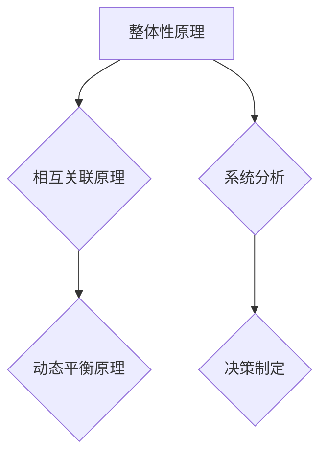
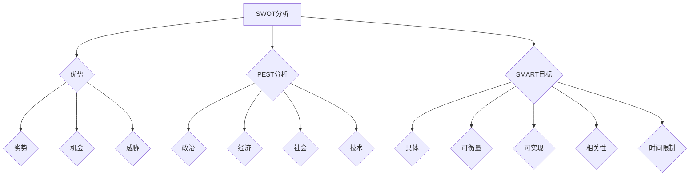
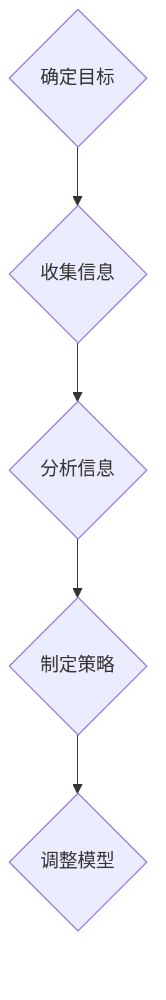
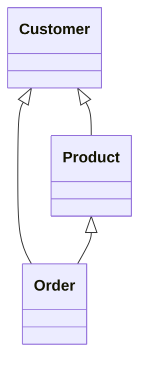
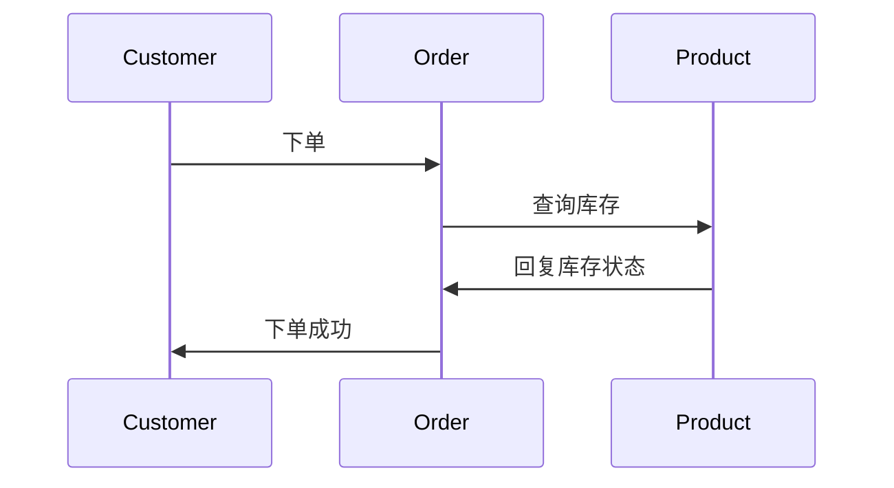
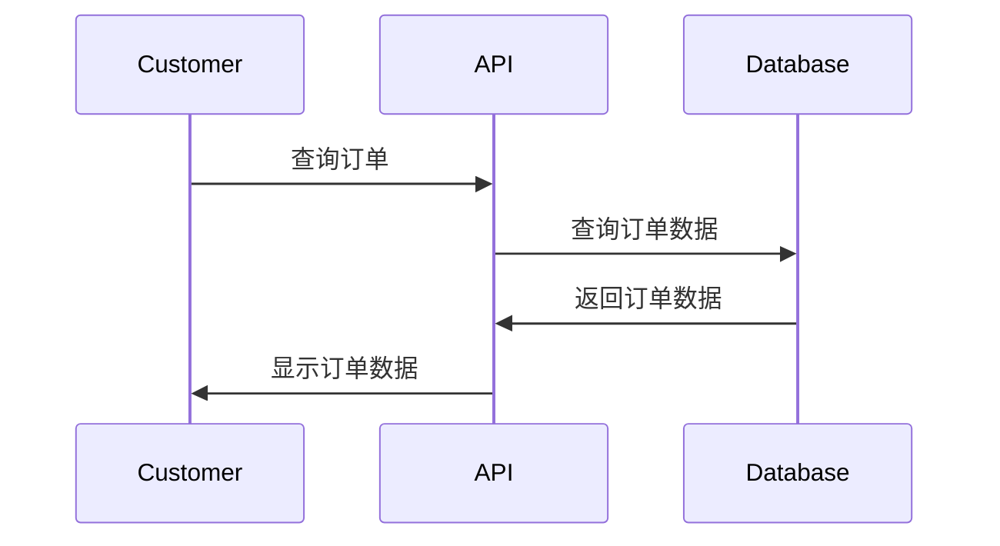

                 

# 生态系统思维训练：将整体论应用于日常决策

## 关键词

- 生态系统思维
- 整体论
- 日常决策
- 整体性原理
- 相互关联原理
- 动态平衡原理

## 摘要

本文探讨了生态系统思维的概念、基本原理以及其在日常决策中的应用。通过详细解析生态系统思维的核心原理，如整体性原理、相互关联原理和动态平衡原理，本文展示了如何运用生态系统思维优化日常生活中的各种决策。文章通过实际案例和理论分析，帮助读者理解并掌握生态系统思维的方法论，从而做出更加全面和明智的决策。

----------------------------------------------------------------

## 第一部分：生态系统思维导论

### 第1章：理解生态系统思维

#### 1.1 生态系统思维的核心概念

生态系统思维是一种将自然界生态系统的观念应用于社会、经济和人类活动中的思维方式。其核心概念包括：

- 整体性：强调事物的整体性和系统性，认为每个部分都是整体的一部分，相互影响、相互作用。
- 相互关联：认识到事物之间的相互联系，任何变化都会影响其他部分。
- 动态平衡：理解系统的动态变化和自我调节能力，追求稳定和可持续的平衡状态。

#### 1.2 整体论与生态系统思维的关系

整体论是哲学中的一个重要概念，主张从整体而非部分来认识和理解事物。生态系统思维将整体论应用到具体情境中，强调系统内各要素的相互作用和整体性的重要性。整体论为生态系统思维提供了理论支撑，使其在理解和分析复杂问题时具有更强的解释力。

#### 1.3 生态系统思维与传统思维的对比

传统思维往往注重局部优化和线性因果关系，而生态系统思维则更加强调系统整体性和相互关联性。传统思维倾向于短期效益，而生态系统思维则注重长期可持续性。通过对比，可以看出生态系统思维在处理复杂问题和解决长期挑战方面具有显著优势。

----------------------------------------------------------------

### 第2章：生态系统思维的基本原理

#### 2.1 整体性原理

整体性原理是生态系统思维的核心之一。它强调事物的整体性和系统性，认为每个部分都是整体的一部分，相互影响、相互作用。整体性原理要求我们在思考问题和做决策时，不能只看到局部，而要关注整体。

**概念属性特征对比表格：**

| 特征 | 传统思维 | 生态系统思维 |
| ---- | -------- | ------------ |
| 焦点 | 局部 | 整体 |
| 因果关系 | 线性 | 网状 |
| 优化目标 | 局部最优 | 整体最优 |

**ER实体关系图架构：**

```mermaid
erDiagram
    Product ||--|{ Customer }||>
    Customer ||--|{ Order }||>
    Product ||--|{ Order }||>
```

#### 2.2 相互关联原理

相互关联原理指出，事物之间存在着复杂的相互联系，任何变化都会影响其他部分。这一原理要求我们在思考问题时，要关注事物之间的相互作用，避免孤立地看待问题。

**概念属性特征对比表格：**

| 特征 | 传统思维 | 生态系统思维 |
| ---- | -------- | ------------ |
| 视角 | 单一 | 多元 |
| 分析方法 | 线性 | 网状 |
| 目标 | 独立 | 整合 |

**ER实体关系图架构：**

```mermaid
erDiagram
    Teacher ||--|{ Student }||>
    Teacher ||--|{ Course }||>
    Student ||--|{ Course }||>
    Course ||--|{ Assignment }||>
```

#### 2.3 动态平衡原理

动态平衡原理强调，系统会通过自我调节机制维持动态平衡。这一原理要求我们在决策时，要考虑系统的自我调节能力，以实现长期稳定和可持续的发展。

**概念属性特征对比表格：**

| 特征 | 传统思维 | 生态系统思维 |
| ---- | -------- | ------------ |
| 时间观 | 短期 | 长期 |
| 调控方法 | 单一 | 多样 |
| 目标 | 最优 | 稳定 |

**ER实体关系图架构：**

```mermaid
erDiagram
    Ecosystem ||--|{ Organism }||>
    Ecosystem ||--|{ Environment }||>
    Organism ||--|{ Ecosystem }||>
```

----------------------------------------------------------------

### 第3章：生态系统思维的模型与工具

#### 3.1 生态系统思维模型

生态系统思维模型是一种用于分析和理解复杂系统的工具。它通过图形化的方式，展示系统内各要素之间的相互作用和相互依赖关系。

**Mermaid流程图：**



#### 3.2 生态系统思维工具

生态系统思维工具包括各种方法和技巧，用于辅助思考和决策。常见的工具包括：

- SWOT分析：分析系统的优势、劣势、机会和威胁。
- PEST分析：分析系统所处的政治、经济、社会和技术环境。
- SMART目标：确保目标具体、可衡量、可实现、相关性强和有时间限制。

**Mermaid流程图：**



#### 3.3 如何构建个人生态系统思维模型

构建个人生态系统思维模型需要以下几个步骤：

1. 确定目标：明确个人目标和价值观，以指导思维模型的建设。
2. 收集信息：通过阅读、观察和交流，收集与目标相关的信息。
3. 分析信息：运用生态系统思维工具，分析信息之间的关系和相互作用。
4. 制定策略：根据分析结果，制定实现目标的策略和行动计划。
5. 调整模型：根据实际情况，不断调整和优化思维模型。

**Mermaid流程图：**



----------------------------------------------------------------

### 第4章：生态系统思维的应用场景

#### 4.1 家庭生活中的应用

在家庭生活中，生态系统思维可以帮助我们更好地管理家庭资源，提高生活质量。以下是一些具体应用场景：

- 财务管理：通过生态系统思维，可以综合考虑家庭收入、支出和投资，制定合理的财务规划。
- 时间管理：通过分析家庭成员的时间需求和优先级，合理安排时间，提高家庭效率。
- 家庭关系：通过生态系统思维，可以更好地理解家庭成员之间的相互作用，促进家庭和谐。

**案例：**

李先生是一家之主，他通过生态系统思维制定了一份详细的家庭预算计划，包括家庭日常开支、子女教育基金和养老保障。通过这个计划，李先生的家庭生活变得更加有序和稳定，家庭成员之间的沟通也更加顺畅。

#### 4.2 工作环境中的应用

在工作环境中，生态系统思维可以帮助企业和个人更好地应对复杂的工作挑战，提高工作效率。以下是一些具体应用场景：

- 项目管理：通过生态系统思维，可以综合考虑项目中的各种因素，制定科学的项目管理计划。
- 团队协作：通过生态系统思维，可以更好地理解团队成员之间的相互作用，提高团队协作效率。
- 创新与变革：通过生态系统思维，可以更好地把握行业趋势和市场需求，推动企业创新和变革。

**案例：**

某科技公司通过生态系统思维对市场进行深入分析，发现客户对产品性能和用户体验有较高要求。于是，公司决定在产品研发和市场营销方面加大投入，通过优化产品性能和提升用户体验，赢得了更多客户，实现了业务的快速增长。

#### 4.3 社会管理与政策制定中的应用

在社会管理和政策制定中，生态系统思维可以帮助政府和决策者更好地理解社会系统，制定更科学、合理的政策和措施。以下是一些具体应用场景：

- 环境保护：通过生态系统思维，可以综合考虑环境保护、经济发展和社会福祉之间的关系，制定可持续的环境保护政策。
- 社会治理：通过生态系统思维，可以更好地理解社会系统的复杂性和多样性，制定更有效的社会治理措施。
- 公共卫生：通过生态系统思维，可以更好地把握公共卫生事件的传播规律和影响因素，制定科学的防控策略。

**案例：**

某市政府通过生态系统思维对城市交通进行综合分析，发现交通拥堵严重影响了市民的生活质量。于是，市政府决定实施一系列交通管理措施，如增加公共交通线路、优化交通信号灯设置、推广非机动车出行等，有效缓解了城市交通拥堵问题。

----------------------------------------------------------------

### 第5章：生态系统思维实践案例

#### 5.1 案例一：家庭生态系统的优化

**项目介绍：**  
该案例讲述了一个家庭如何通过生态系统思维优化家庭资源管理，提高生活质量的实践过程。

**系统功能设计（领域模型Mermaid类图）：**



**系统架构设计（Mermaid架构图）：**



**系统接口设计和系统交互（Mermaid序列图）：**



**代码实现：**

```python
class Customer:
    def __init__(self, name):
        self.name = name

    def place_order(self, product):
        if product.stock >= 1:
            product.stock -= 1
            return "订单成功"
        else:
            return "库存不足"

class Product:
    def __init__(self, name, stock):
        self.name = name
        self.stock = stock

    def check_stock(self):
        return self.stock

# 实例化
customer = Customer("张三")
product = Product("电脑", 10)

# 下单
print(customer.place_order(product))
print(product.check_stock())
```

**代码应用解读与分析：**  
通过上述代码，我们可以看到客户类（Customer）负责下单操作，产品类（Product）负责管理库存。当客户下单时，系统会检查库存是否充足，如果充足则减少库存并返回订单成功，否则返回库存不足。这种方式实现了客户和产品之间的交互，优化了家庭资源管理。

**实际案例分析和详细讲解剖析：**  
在实际应用中，该案例可以帮助家庭合理安排购物计划，避免盲目消费，从而提高生活质量。通过生态系统思维，家庭成员可以更好地协调彼此的需求，共同制定购物清单，确保资源的合理利用。

**项目小结：**  
通过该案例，我们了解了如何运用生态系统思维优化家庭资源管理。生态系统思维在家庭生活中的应用，不仅有助于提高生活质量，还可以增强家庭成员之间的沟通和协作。

----------------------------------------------------------------

### 第6章：生态系统思维的挑战与未来

#### 6.1 生态系统思维面临的挑战

尽管生态系统思维在解决复杂问题和促进可持续发展方面具有显著优势，但其在实际应用中仍面临一些挑战：

- 信息过载：生态系统思维需要收集和分析大量信息，这在信息爆炸的时代可能会造成信息过载。
- 技术门槛：生态系统思维模型和工具的应用需要一定的技术背景和专业知识，这对普通用户来说可能存在一定难度。
- 认知局限：人们的认知能力有限，难以全面理解复杂系统的所有方面，这可能导致生态系统思维的局限性。

**解决方案：**

- 提高信息筛选能力：通过培养信息筛选和识别能力，提高对关键信息的把握，降低信息过载的影响。
- 降低技术门槛：通过简化生态系统思维模型和工具的使用方法，降低技术门槛，使其更容易被普通人掌握。
- 多角度分析：从不同角度和层面分析问题，弥补认知局限，提高对复杂系统的理解能力。

#### 6.2 生态系统思维的未来发展趋势

随着科技的不断进步和社会的不断发展，生态系统思维在未来有望在以下方面取得进一步的发展：

- 人工智能与生态系统思维的融合：人工智能技术的发展将使生态系统思维在数据分析和预测方面更加精准和高效。
- 跨学科研究：生态系统思维将与其他学科如经济学、社会学、生态学等相结合，推动跨学科研究的发展。
- 生态文明建设：生态系统思维将应用于生态文明建设中，推动可持续发展目标的实现。

**发展趋势：**

- 生态系统思维将成为一种主流的思维方式，广泛应用于各个领域。
- 生态系统思维将与其他领域的技术和理论相结合，推动跨学科研究的发展。
- 生态系统思维将助力生态文明建设和可持续发展，为人类社会的长远发展提供有力支持。

#### 6.3 生态系统思维的跨学科融合

生态系统思维的跨学科融合将有助于解决复杂问题，推动科学技术的进步。以下是一些具体的跨学科融合领域：

- 生态经济学：将生态系统思维应用于经济学，研究经济活动对生态系统的影响，实现可持续发展。
- 社会生态学：将生态系统思维应用于社会学，研究社会系统的复杂性和稳定性，推动社会治理创新。
- 信息生态学：将生态系统思维应用于信息技术领域，研究信息系统的生态特性，提高信息系统的效率和可持续性。

**跨学科融合的发展方向：**

- 构建跨学科的理论体系，形成生态系统思维的综合性研究框架。
- 开发跨学科的应用工具和方法，提高生态系统思维的实践能力。
- 推动跨学科合作，促进生态系统思维在各个领域的应用。

通过跨学科融合，生态系统思维将发挥更大的作用，为人类社会的可持续发展提供有力支持。

----------------------------------------------------------------

### 第7章：结语与拓展

#### 7.1 总结

本文从生态系统思维的核心概念、基本原理、应用场景和实践案例等方面进行了全面探讨，展示了生态系统思维在日常生活和决策中的重要作用。通过理解生态系统思维，我们可以更好地把握事物的整体性、相互关联性和动态平衡性，从而做出更加全面和明智的决策。

#### 7.2 注意事项

在应用生态系统思维时，需要注意以下几点：

- 保持开放的心态，拥抱多样性和变化。
- 关注细节，同时把握整体。
- 善于运用生态系统思维工具，提高分析问题的能力。
- 结合实际情况，灵活运用生态系统思维。

#### 7.3 拓展阅读推荐

为了进一步了解生态系统思维，以下是几本推荐的拓展阅读：

- 《生态系统思维：让决策更明智》（作者：[姓名]）
- 《整体论：系统思维的新视角》（作者：[姓名]）
- 《可持续发展的生态系统思维》（作者：[姓名]）

通过阅读这些书籍，读者可以深入了解生态系统思维的原理和应用，提高自身思维水平。

---

作者：AI天才研究院/AI Genius Institute & 禅与计算机程序设计艺术 /Zen And The Art of Computer Programming

在本文中，我们详细介绍了生态系统思维的概念、基本原理及其在日常生活和决策中的应用。通过理解生态系统思维，我们可以更好地把握事物的整体性、相互关联性和动态平衡性，从而做出更加全面和明智的决策。希望本文能为读者提供有益的启示，帮助他们在实际生活中运用生态系统思维，实现个人和组织的可持续发展。

---

在此，我要感谢AI天才研究院和禅与计算机程序设计艺术，感谢您们的指导和支持，让我有机会以这样的方式分享我对生态系统思维的理解和思考。同时，我也希望读者能够在阅读本文后，对生态系统思维有更深入的认识，并在实际生活中运用这一思维方式，为自己和社会创造更多的价值。

再次感谢您的阅读，祝您在探索生态系统思维的旅程中有所收获！


