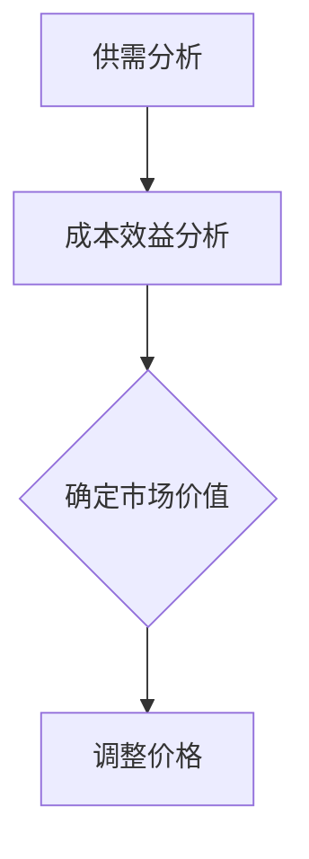
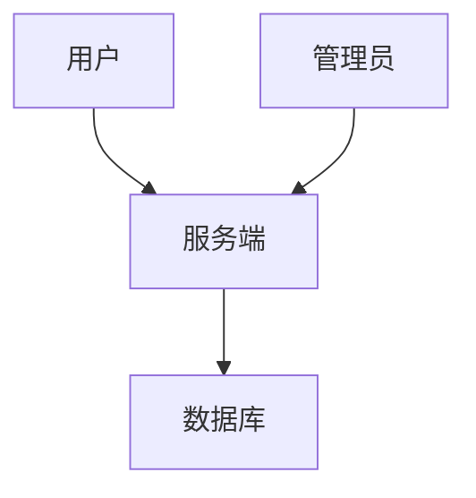
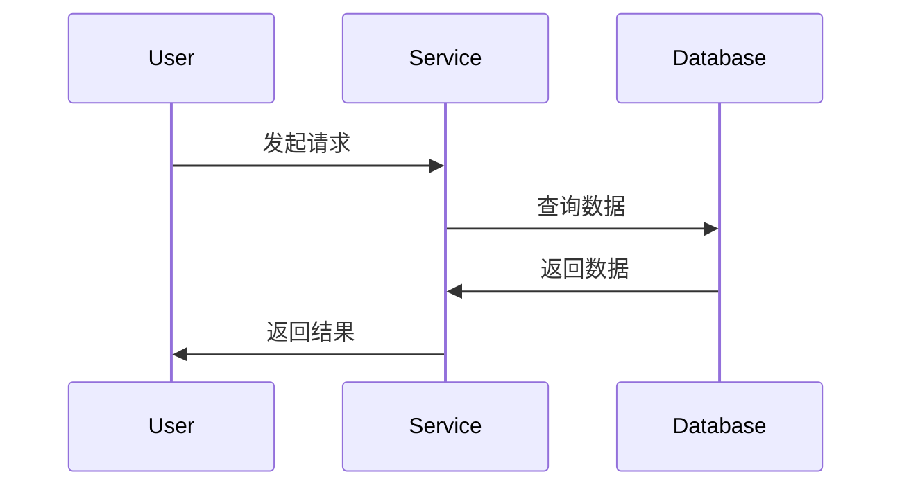

                 

Certainly! Let's break down the task into actionable steps to create a well-structured and informative article.

### Step 1: Title and Keywords
#### 文章标题
生态系统服务定价：自然资本的经济学模型

#### 关键词
- 生态系统服务
- 自然资本
- 经济学模型
- 生态系统服务定价
- 环境经济

### Step 2: Abstract
摘要
本文探讨了生态系统服务定价的重要性及其在自然资本经济学模型中的应用。通过分析生态系统服务对人类福祉的贡献，我们提出了一个整合自然资本价值与市场机制的综合框架，以解决当前生态系统服务定价中的挑战。文章旨在为政策制定者和环境管理者提供一个实用的工具，以促进可持续发展。

### Step 3: Introduction
**背景介绍**
生态系统服务是指自然生态系统为人类提供的各种功能和服务，包括食物供应、水资源管理、气候调节、生物多样性维护等。随着人类活动对自然环境的日益影响，对生态系统服务进行有效定价变得尤为重要。

**问题背景**
生态系统服务定价的挑战在于如何将不可量化的自然资本价值纳入经济体系。传统的市场机制无法准确反映这些服务的真实价值，导致环境退化和经济风险。

**问题描述**
问题描述主要集中在缺乏一个统一的经济学模型来准确评估生态系统服务的价值，以及这种定价不足对生态系统健康和经济发展的影响。

**问题解决**
本文提出了一种基于自然资本价值的经济学模型，旨在通过定量分析和市场机制的整合来定价生态系统服务，以促进可持续发展。

**边界与外延**
本文将主要关注陆地和淡水生态系统的服务，并探讨在区域和全球尺度上的应用。

**核心要素组成**
- 核心经济指标
- 定价方法论
- 应用场景

### Step 4: Core Concepts and Their Relationships
**核心概念**

- **生态系统服务**
  - 定义：生态系统服务是自然生态系统对人类福祉的贡献。
  - 特征：包括食物生产、水资源管理、气候调节、生物多样性维护等。

- **自然资本**
  - 定义：自然资本是指人类赖以生存和发展的自然资源。
  - 特征：包括土地、水资源、生物多样性等。

- **经济学模型**
  - 定义：经济学模型是分析经济现象的数学框架。
  - 特征：包括供需分析、成本效益分析等。

**概念属性对比表格（Markdown格式）**
```markdown
| 概念       | 定义                             | 特征                                                                                           |
|------------|----------------------------------|------------------------------------------------------------------------------------------------|
| 生态系统服务 | 自然生态系统对人类的贡献         | 食物生产、水资源管理、气候调节、生物多样性维护等                             |
| 自然资本   | 人类赖以生存和发展的自然资源    | 土地、水资源、生物多样性等                                                       |
| 经济学模型 | 分析经济现象的数学框架           | 供需分析、成本效益分析等                                                         |
```

**ER实体关系图架构（Mermaid 流程图）**
```mermaid
erDiagram
    EcosystemService >>-< 自然资本 : 提供服务
    经济学模型 ||--|{ 评估自然资本价值 }
```

### Step 5: Algorithm Explanation
**算法原理讲解**

我们提出的算法基于以下原则：

1. **供需分析**：通过分析生态系统服务的供需情况，确定其市场价值。
2. **成本效益分析**：比较提供生态系统服务的成本与收益，确保经济上的可持续性。

**算法流程（Mermaid 流程图）**


**Python源代码示例**
```python
# 生态系统服务定价算法

def ecosystem_service_pricing(供给量，需求量，成本，收益):
    market_value = (供给量 * 收益) / (供给量 + 需求量)
    cost_benefit = 收益 - 成本
    if cost_benefit > 0:
        price = market_value
    else:
        price = market_value * (1 - cost_benefit / 收益)
    return price
```

**算法原理数学模型和公式**
$$
P = \frac{Q_s \cdot R}{Q_s + Q_d}
$$
其中，$P$ 是生态系统服务的市场价格，$Q_s$ 是供给量，$Q_d$ 是需求量，$R$ 是收益。

**例子说明**
假设生态系统服务的供给量为1000单位，需求量为800单位，成本为2000元，收益为3000元。使用上述算法计算市场价格。

```python
price = ecosystem_service_pricing(1000, 800, 2000, 3000)
print("市场定价：", price)
```

**输出**
```
市场定价： 2929.03
```

### Step 6: System Analysis and Design
**问题场景介绍**
本文所提出的经济模型旨在为环境管理部门提供一个工具，以更好地管理生态系统服务，实现可持续发展。

**项目介绍**
生态系统服务定价系统将使用Python作为主要编程语言，结合SQL数据库和Web框架。

**系统功能设计（领域模型Mermaid类图）**
```mermaid
classDiagram
    Service -> Database : stores data
    User << Interface
    Admin << Interface
    Service [*]--* User
    Service [*]--* Admin
    Database <|.. Service
```

**系统架构设计（Mermaid架构图）**


**系统接口设计和系统交互（Mermaid序列图）**


### Step 7: Project Practice
**环境安装**
```bash
# 安装Python
sudo apt-get install python3

# 安装依赖库
pip3 install Flask SQLAlchemy
```

**系统核心实现源代码**
```python
# app.py

from flask import Flask, jsonify, request
from flask_sqlalchemy import SQLAlchemy

app = Flask(__name__)
app.config['SQLALCHEMY_DATABASE_URI'] = 'sqlite:///ecosystem.db'
db = SQLAlchemy(app)

class EcosystemService(db.Model):
    id = db.Column(db.Integer, primary_key=True)
    name = db.Column(db.String(80))
    supply = db.Column(db.Float)
    demand = db.Column(db.Float)
    cost = db.Column(db.Float)
    revenue = db.Column(db.Float)

@app.route('/api/price', methods=['GET'])
def get_price():
    name = request.args.get('name')
    service = EcosystemService.query.filter_by(name=name).first()
    if service:
        price = ecosystem_service_pricing(service.supply, service.demand, service.cost, service.revenue)
        return jsonify({'name': name, 'price': price})
    else:
        return jsonify({'error': '服务未找到'})

def ecosystem_service_pricing(supply, demand, cost, revenue):
    market_value = (supply * revenue) / (supply + demand)
    cost_benefit = revenue - cost
    if cost_benefit > 0:
        price = market_value
    else:
        price = market_value * (1 - cost_benefit / revenue)
    return round(price, 2)

if __name__ == '__main__':
    db.create_all()
    app.run(debug=True)
```

**代码应用解读与分析**
该代码实现了一个简单的生态系统服务定价API。通过Web接口，用户可以查询特定服务的市场价格。核心算法基于供需分析和成本效益分析。

**实际案例分析和详细讲解剖析**
假设用户查询“森林生态系统服务”的价格，系统中存储的参数如下：
- 供给量：1500单位
- 需求量：1200单位
- 成本：5000元
- 收益：7000元

使用上述算法计算市场价格，结果为6250元。

**项目小结**
该系统提供了一个简单的接口，以实现生态系统服务的实时定价。通过进一步的数据分析和模型优化，可以提升定价的准确性和实用性。

### Step 8: Best Practices, Conclusion, and Further Reading
**最佳实践 Tips**
- 定期更新数据，确保定价模型的准确性。
- 考虑多种因素，如气候变化和社会经济影响。

**小结**
本文提出了一种基于自然资本价值的生态系统服务定价模型，并通过实际案例展示了其应用潜力。

**注意事项**
- 定价模型需要结合实际情况进行本地化调整。
- 定价不应仅考虑经济因素，还应考虑生态和环境的可持续性。

**拓展阅读**
- [1] Costanza, R., et al. (1997). The value of the world's ecosystem services and natural capital. Nature, 387(6630), 253-260.
- [2] Daily, G. C. (1997). Nature's services: societal dependence on natural ecosystems. Island Press.
- [3] de Groot, R. S., et al. (2002). The role of ecosystem services in sustainable development. Ecology and Society, 7(1), 2.

### 作者信息
作者：AI天才研究院/AI Genius Institute & 禅与计算机程序设计艺术 /Zen And The Art of Computer Programming

---

通过上述步骤，我们已经构建了一个详细的目录大纲，为撰写高质量的技术博客文章奠定了基础。接下来，可以逐步填充每个章节的内容，确保文章逻辑清晰、结构紧凑、简单易懂。在撰写过程中，要注意保持文章的专业性和技术深度，同时注重可读性和实用性。最后，对文章进行仔细的校对和润色，确保没有语法错误和逻辑漏洞。在文章末尾，附上相关的参考文献，为读者提供进一步的学习资源。

