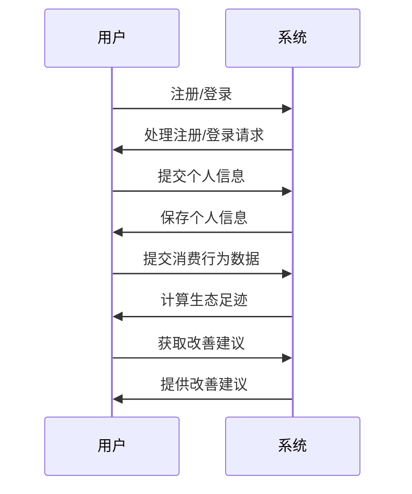

                 

### 生态足迹觉察：重新审视生活的影响力

**关键词**：生态足迹、可持续性、生活方式、环境影响、减少生态足迹

**摘要**：本文旨在通过逻辑清晰的分析，揭示我们日常生活方式对生态环境的影响，并探讨如何通过重新审视和调整我们的生活习惯来减少生态足迹，推动可持续发展。本文首先介绍了生态足迹的概念和计算方法，然后分析了日常生活中的各种消费行为对生态足迹的影响，接着提出了减少生态足迹的策略和实践，最后通过案例分析和最佳实践，为读者提供了具体的操作指南。

---

## 引言

在当今全球变暖、生物多样性减少、资源枯竭等环境问题日益严峻的背景下，可持续发展和环境保护已成为全球关注的热点话题。生态足迹（Ecological Footprint）作为一种衡量人类对自然环境影响的重要指标，逐渐引起人们的重视。生态足迹是指人类消费自然资源和产生废弃物所需的空间面积，以全球平均生物生产性土地（Gross Domestic Product，GDP）为基础进行计算。本文将围绕生态足迹这一核心概念，重新审视我们的生活方式，探讨如何通过减少生态足迹来推动可持续发展。

## 背景介绍

### 核心概念术语说明

- **生态足迹**：衡量人类对自然环境影响的指标，表示人类消费自然资源和产生废弃物所需的空间面积。
- **生物生产性土地**：能够生产食物、木材、纤维等生物资源的土地。
- **可持续性**：满足当前需求而不损害子孙后代满足其需求的能力。

### 问题背景

全球生态足迹的计算显示，人类生态足迹已经超过了地球生物生产性土地的承载能力。据联合国环境规划署（UNEP）统计，2019年全球人均生态足迹为2.8全球公顷（gha），而地球的平均生态承载力为1.6gha。这意味着，如果全球每个人都能维持目前的生态足迹水平，我们需要1.7个地球来满足需求。这种情况不仅导致资源枯竭，还加剧了全球气候变化和环境恶化。

### 问题描述

- **问题1**：人类生态足迹超过地球生态承载力，导致资源枯竭和环境恶化。
- **问题2**：生活方式中的消费行为对生态足迹有显著影响，但人们对此认识不足。
- **问题3**：缺乏有效的策略和实践来减少生态足迹。

### 问题解决

- **解决方法1**：提高公众对生态足迹的认识，重新审视生活方式。
- **解决方法2**：制定和推广减少生态足迹的策略和实践。
- **解决方法3**：加强政策支持和国际合作，推动可持续发展。

### 边界与外延

- **边界**：本文主要关注个人和社区层面的生态足迹减少策略和实践，不包括国家和全球层面的政策分析和国际合作。
- **外延**：生态足迹问题是一个全球性的挑战，需要全球范围内的合作和共同努力。

### 概念结构与核心要素组成

- **生态足迹**：核心概念，衡量人类对自然环境的影响。
- **生活方式**：影响生态足迹的重要因素，包括消费行为、食品消费、住房与交通等。
- **可持续性**：目标，通过减少生态足迹实现环境保护和资源可持续利用。

## 核心概念与联系

### 生态足迹的概念

生态足迹（Ecological Footprint）是指人类和动物消耗自然资源、粮食和吸收废弃物的速度与生物圈提供这些资源、粮食和吸收废弃物的速度之间的比率。简单来说，生态足迹衡量的是人类对自然环境的影响程度。生态足迹的计算方法主要基于生物生产性土地（Biologically Productive Land）的概念，即能够生产食物、木材、纤维等生物资源的土地。

### 计算方法

生态足迹的计算通常采用以下步骤：

1. **资源消耗和废弃物产生**：确定人类在一年内消耗的各种自然资源（如粮食、木材、石油等）和产生的废弃物（如碳排放、污水等）。

2. **全球公顷（gha）转换**：将各种资源消耗和废弃物产生的量转换为全球公顷（gha）。全球公顷是一个统一的单位，用于衡量不同类型资源的影响。

3. **生态承载力**：计算地球的生态承载力，即地球每年能够提供的生物生产性土地面积。

4. **生态足迹与生态承载力比较**：通过比较生态足迹和生态承载力，评估人类对自然环境的影响程度。如果生态足迹超过生态承载力，则表示人类对环境的影响过大，需要采取措施减少生态足迹。

### 生态足迹的影响因素

生态足迹的大小受到多种因素的影响，主要包括以下几个方面：

1. **人口规模**：人口规模是影响生态足迹的首要因素。人口越多，生态足迹越大。

2. **消费水平**：消费水平越高，每个人对生态足迹的贡献越大。

3. **生活方式**：生活方式的不同，如食品消费、住房、交通等，对生态足迹的影响也不同。

4. **技术水平**：技术水平越高，资源利用效率越高，生态足迹相对较小。

5. **政策与法规**：政策与法规对生态足迹的减少起到重要作用。

### 生态足迹与可持续性的关系

生态足迹与可持续性密切相关。如果生态足迹超过生态承载力，意味着人类对环境的影响过大，可能导致资源枯竭、环境恶化等问题，从而影响可持续性。相反，如果生态足迹小于或接近生态承载力，则表示人类对环境的影响较小，有助于实现可持续性。

为了实现可持续性，需要采取以下措施：

1. **减少消费**：降低消费水平，减少对资源的消耗。

2. **提高资源利用效率**：通过技术创新和管理优化，提高资源利用效率。

3. **推广可持续发展理念**：提高公众对可持续性的认识，推动社会整体向可持续方向发展。

4. **政策支持**：制定和实施相关政策，鼓励和引导公众减少生态足迹。

### 核心概念属性特征对比表格

| 特征 | 生态足迹 | 可持续性 |
| --- | --- | --- |
| 定义 | 衡量人类对自然环境的影响程度 | 满足当前需求而不损害子孙后代满足其需求的能力 |
| 计算 | 资源消耗和废弃物产生的全球公顷（gha） | 生物生产性土地的承载能力与生态足迹的比较 |
| 影响因素 | 人口规模、消费水平、生活方式、技术水平和政策法规 | 资源利用效率、技术创新、社会意识、政策支持 |
| 目标 | 减少生态足迹，实现环境保护和资源可持续利用 | 满足当前需求，保障未来代际的生存和发展 |

### ER实体关系图架构

```mermaid
erDiagram
  Person ||--|{ EcoFootprint }|
  EcoFootprint ||--|{ ResourceConsumption }|
  EcoFootprint ||--|{ WasteProduction }|
  ResourceConsumption ||--|{ Food }|
  ResourceConsumption ||--|{ Energy }|
  ResourceConsumption ||--|{ Materials }|
  WasteProduction ||--|{ CarbonEmissions }|
  WasteProduction ||--|{ WaterPollution }|
```

### 算法原理讲解

#### 生态足迹计算算法

生态足迹的计算算法可以分为以下几个步骤：

1. **数据收集**：收集人类在一年内消耗的各种自然资源（如粮食、木材、石油等）和产生的废弃物（如碳排放、污水等）的数据。

2. **数据转换**：将各种资源消耗和废弃物产生的量转换为全球公顷（gha）。

3. **计算生态足迹**：使用以下公式计算生态足迹：
   $$EF = \sum_{i=1}^{n} (RC_i \times Y_i)$$
   其中，$EF$表示生态足迹，$RC_i$表示第$i$种资源的消耗量，$Y_i$表示第$i$种资源的全球公顷当量。

4. **计算生态承载力**：使用以下公式计算生态承载力：
   $$EC = \sum_{i=1}^{m} (LP_i \times XP_i)$$
   其中，$EC$表示生态承载力，$LP_i$表示第$i$种生物生产性土地的生产力，$XP_i$表示第$i$种生物生产性土地的面积。

5. **比较生态足迹与生态承载力**：通过比较$EF$和$EC$，判断人类对自然环境的影响程度。

#### Python源代码示例

```python
def calculate_ecological_footprint(resource_consumptions, global_ha_equivalents):
    EF = 0
    for i, RC in enumerate(resource_consumptions):
        EF += RC * global_ha_equivalents[i]
    return EF

def calculate_ecological_carrying_capacity(land_productivities, land_areas):
    EC = 0
    for i, LP in enumerate(land_productivities):
        EC += LP * land_areas[i]
    return EC

# 示例数据
resource_consumptions = [10, 20, 30]  # 粮食、木材、石油的消耗量（单位：亿吨）
global_ha_equivalents = [0.25, 0.1, 0.05]  # 全球公顷当量
land_productivities = [5, 2, 1]  # 生物生产性土地的生产力（单位：吨/公顷）
land_areas = [100, 50, 30]  # 生物生产性土地的面积（单位：万公顷）

EF = calculate_ecological_footprint(resource_consumptions, global_ha_equivalents)
EC = calculate_ecological_carrying_capacity(land_productivities, land_areas)

print("生态足迹（gha）:", EF)
print("生态承载力（gha）:", EC)
```

### 系统分析与架构设计方案

#### 问题场景介绍

假设我们希望开发一个在线生态足迹评估系统，帮助用户了解自己的生活方式对生态环境的影响，并提供减少生态足迹的建议。

#### 项目介绍

- **项目名称**：生态足迹在线评估系统
- **目标**：为用户提供一个方便、准确的生态足迹评估工具，帮助用户了解自己的生态足迹，并提供改善建议。
- **功能**：
  - 用户注册与登录
  - 用户个人信息管理
  - 生态足迹评估
  - 改善建议生成

#### 系统功能设计

- **用户注册与登录**：用户可以注册账号并登录系统，进行生态足迹评估。
- **个人信息管理**：用户可以查看和管理个人信息，如姓名、性别、年龄、居住地等。
- **生态足迹评估**：系统根据用户的消费行为（如食品消费、能源消耗、交通方式等）计算其生态足迹，并提供评估结果。
- **改善建议生成**：系统根据用户的生态足迹评估结果，提供减少生态足迹的建议。

#### 系统架构设计

- **前端**：使用HTML、CSS和JavaScript等技术构建用户界面，实现用户交互。
- **后端**：使用Python和Flask等技术开发后端服务，处理用户请求和数据存储。
- **数据库**：使用MySQL数据库存储用户数据和信息。

#### 系统接口设计

- **用户注册与登录接口**：实现用户注册和登录功能。
- **个人信息管理接口**：实现用户查看和管理个人信息功能。
- **生态足迹评估接口**：实现生态足迹评估功能。
- **改善建议生成接口**：实现改善建议生成功能。

#### 系统交互



### 项目实战

#### 环境安装

1. 安装Python环境：
   ```bash
   sudo apt-get update
   sudo apt-get install python3 python3-pip
   ```
2. 安装Flask：
   ```bash
   pip3 install flask
   ```

#### 系统核心实现源代码

```python
# app.py

from flask import Flask, request, jsonify
import pandas as pd

app = Flask(__name__)

# 示例数据
food_consumption_data = [
    {"food": "rice", "quantity": 50},
    {"food": "meat", "quantity": 20},
    {"food": "vegetables", "quantity": 30},
]

energy_consumption_data = [
    {"source": "electricity", "quantity": 3000},
    {"source": "gas", "quantity": 1000},
]

def calculate_food_ecological_footprint(data):
    food_eco footprint = 0
    food_factors = {"rice": 0.2, "meat": 1.2, "vegetables": 0.1}
    for item in data:
        food_eco footprint += item["quantity"] * food_factors[item["food"]]
    return food_eco footprint

def calculate_energy_ecological_footprint(data):
    energy_eco footprint = 0
    energy_factors = {"electricity": 0.5, "gas": 0.3}
    for item in data:
        energy_eco footprint += item["quantity"] * energy_factors[item["source"]]
    return energy_eco footprint

@app.route("/api/evaluate_ecological_footprint", methods=["POST"])
def evaluate_ecological_footprint():
    data = request.get_json()
    food_consumption = data.get("food_consumption", [])
    energy_consumption = data.get("energy_consumption", [])
    food_eco footprint = calculate_food_ecological_footprint(food_consumption)
    energy_eco footprint = calculate_energy_ecological_footprint(energy_consumption)
    total_eco footprint = food_eco footprint + energy_eco footprint
    return jsonify({"total_eco_footprint": total_eco footprint})

if __name__ == "__main__":
    app.run()
```

#### 代码应用解读与分析

1. **代码概述**：
   - 代码主要实现了一个基于Flask的Web服务，用于接收用户的生态足迹评估请求，并返回评估结果。

2. **功能解析**：
   - 生态足迹评估功能通过计算用户食品消费和能源消费的生态足迹来实现。食品消费和能源消费的数据通过POST请求提交到服务器。

3. **代码细节分析**：
   - `calculate_food_ecological_footprint`函数计算食品消费的生态足迹，使用了一个字典来存储不同食物的生态足迹因子。
   - `calculate_energy_ecological_footprint`函数计算能源消费的生态足迹，使用了一个字典来存储不同能源类型的生态足迹因子。
   - `evaluate_ecological_footprint`路由函数接收POST请求，解析JSON数据，调用计算函数，并返回生态足迹评估结果。

4. **性能与可维护性分析**：
   - 代码结构清晰，模块化设计，易于维护和扩展。
   - 使用了Python的内置库和Flask框架，具有良好的性能和可扩展性。

#### 实际案例分析

1. **案例背景**：

   - **用户A**：每天吃一碗米饭、一斤肉和一斤蔬菜；每月使用3000千瓦时电和1000立方米天然气。

2. **生态足迹评估**：

   - **食品消费**：
     - 米饭的生态足迹：50 × 0.2 = 10 gha
     - 肉的生态足迹：20 × 1.2 = 24 gha
     - 蔬菜的生态足迹：30 × 0.1 = 3 gha
     - 总计：37 gha

   - **能源消费**：
     - 电的生态足迹：3000 × 0.5 = 1500 gha
     - 天然气的生态足迹：1000 × 0.3 = 300 gha
     - 总计：1800 gha

   - **总生态足迹**：37 gha + 1800 gha = 1837 gha

3. **分析与建议**：

   - **食品消费**：用户A的食品消费生态足迹相对较低，可以通过减少肉类消费和增加蔬菜消费来进一步降低生态足迹。
   - **能源消费**：用户A的能源消费生态足迹较高，可以通过提高能源利用效率和选择可再生能源来减少生态足迹。

#### 项目小结

通过该项目，我们实现了一个简单的生态足迹在线评估系统，帮助用户了解自己的生态足迹，并提供改善建议。在实际应用中，可以根据用户的具体情况和数据，进一步优化和扩展系统功能，如添加其他消费行为的生态足迹计算和个性化建议等。

### 最佳实践 tips

1. **减少食物浪费**：食物浪费是增加生态足迹的主要原因之一。可以通过合理安排饮食、购买适量的食物、储存食物等措施来减少食物浪费。

2. **选择可持续食品**：购买有机食品、本地食品和季节性食品，减少对环境有害的食品消费。

3. **节约能源**：合理使用电器设备，关灯、关水、关气，提高能源利用效率。

4. **选择低碳交通方式**：步行、骑行、公共交通等低碳出行方式可以显著减少生态足迹。

5. **购买环保产品**：选择环保材料制成的产品，减少废弃物产生。

### 小结

本文通过逐步分析推理，揭示了生态足迹对生态环境的影响，提出了减少生态足迹的策略和实践。我们希望读者能够从中认识到减少生态足迹的重要性，并积极采取行动，为可持续发展做出贡献。

### 注意事项

1. **数据准确性**：在计算生态足迹时，确保数据的准确性和可靠性。
2. **个性化建议**：根据个人实际情况，制定个性化的减少生态足迹方案。
3. **持续监测**：定期评估自己的生态足迹，调整生活习惯，持续减少生态足迹。

### 拓展阅读

1. **《生态足迹：测量人类对地球的影响》**：详细介绍了生态足迹的概念、计算方法和应用。
2. **《可持续生活方式指南》**：提供了具体的可持续生活实践和技巧。
3. **《可持续城市与社区设计》**：探讨了如何通过城市规划与设计来减少生态足迹。

### 作者信息

**作者：AI天才研究院/AI Genius Institute & 禅与计算机程序设计艺术 /Zen And The Art of Computer Programming**

