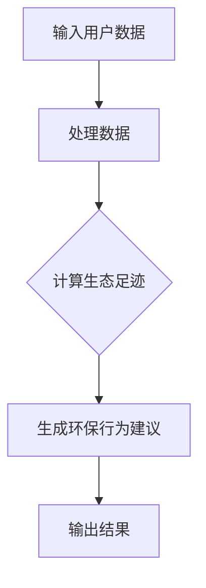
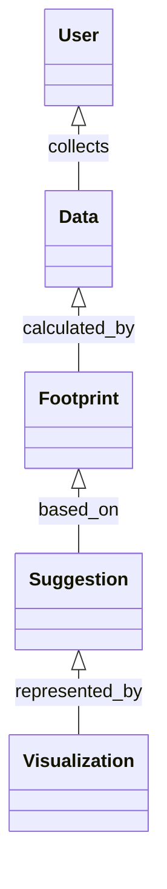
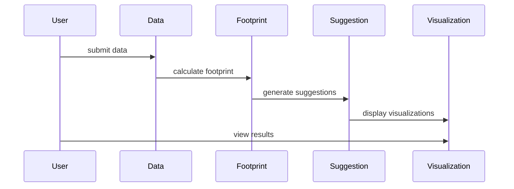
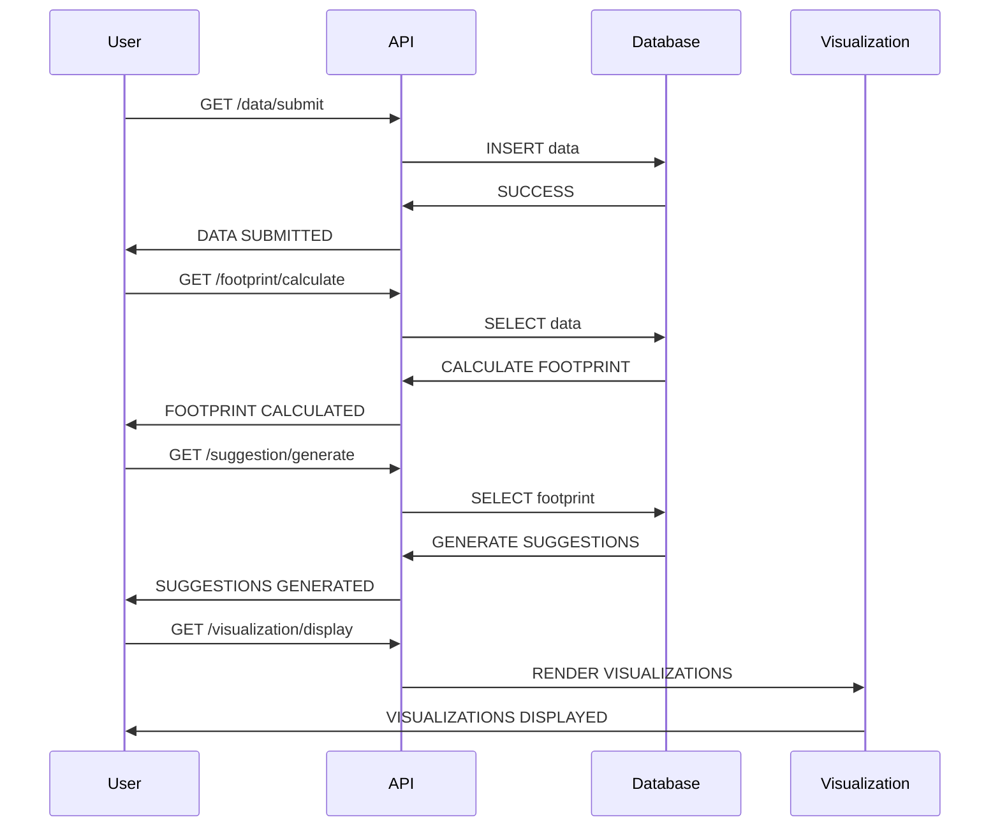

                 


### 文章标题

《生态足迹计算器app：个人环保行为追踪工具》

### 文章关键词

生态足迹、个人环保行为、追踪工具、app设计、算法实现、数据分析

### 文章摘要

本文深入探讨了《生态足迹计算器app：个人环保行为追踪工具》的核心概念与实现细节。通过逐步分析，本文介绍了生态足迹的计算方法，生态足迹计算器app的系统设计，如何通过app追踪个人环保行为，以及如何对收集的数据进行分析和可视化展示。文章还包括了用户指南、最佳实践、系统架构设计以及项目实战等，旨在帮助读者全面了解并应用这一工具，实现个人环保行为的优化。

## 目录

### 第一部分：背景介绍与核心概念
1.1 生态足迹的概念与重要性
1.2 个人环保行为的背景与意义
1.3 生态足迹计算器app的概述

### 第二部分：系统设计与实现
2.1 生态足迹计算器app的系统架构设计
2.2 前端界面设计与用户交互
2.3 后端逻辑实现与数据存储
2.4 算法原理与实现

### 第三部分：环保行为追踪与数据分析
3.1 个人环保行为数据的收集与处理
3.2 数据分析与可视化
3.3 环保行为建议与反馈

### 第四部分：用户指南与最佳实践
4.1 用户指南
4.2 最佳实践与技巧
4.3 常见问题与解决方案

### 第五部分：总结与拓展
5.1 全书内容总结
5.2 生态足迹计算器app的未来拓展

### 附录：参考文献与拓展阅读

## 第一部分：背景介绍与核心概念

### 1.1 生态足迹的概念与重要性

生态足迹（Ecological Footprint）是一个衡量人类对自然资源的消耗和生物多样性损失的重要指标。它通过计算人类活动所需的生物生产性土地和海洋面积，来衡量人类对地球资源的压力。一个国家的生态足迹包括农业、工业、交通和居住等领域的资源消耗。

生态足迹的计算基于以下核心概念：

- **生物生产性土地**：能够生产食物、木材、纤维、水和其他生物资源的土地和海洋面积。
- **生态足迹方程**：生态足迹（EF）等于人口（P）乘以人均生态足迹（AEF），即 EF = P * AEF。
- **人均生态足迹**：人均生态足迹是指每个人需要的生物生产性土地和海洋面积来维持其生活方式。

生态足迹的重要性在于：

- **资源可持续性**：它揭示了人类活动对地球资源的压力，帮助我们了解哪些地区资源丰富，哪些地区资源紧张。
- **环境影响评估**：通过生态足迹，我们可以评估不同地区和国家的环境状况，为政策制定提供科学依据。
- **可持续发展**：生态足迹的计算有助于推动可持续发展，鼓励人们采取更环保的生活方式。

### 1.2 个人环保行为的背景与意义

个人环保行为是指在日常生活中采取的减少对环境负面影响的行为。随着全球气候变化和环境问题的加剧，个人环保行为变得越来越重要。

个人环保行为的背景包括：

- **全球变暖与气候变化**：全球变暖导致极端天气事件增加，海平面上升，生态系统破坏。
- **资源枯竭**：许多资源，如石油、煤炭和水资源，正在迅速耗尽，对人类生活和社会经济构成威胁。
- **环境保护意识提高**：公众对环境问题的认识逐渐提高，越来越多的人开始采取行动保护环境。

个人环保行为的意义在于：

- **减少碳排放**：个人减少能源消耗和碳排放，有助于减缓气候变化。
- **资源节约**：通过减少浪费和循环利用，个人可以减少对自然资源的消耗。
- **社会影响力**：个人的环保行为可以激励他人也采取环保行动，形成良好的社会风尚。

### 1.3 生态足迹计算器app的概述

生态足迹计算器app是一个工具，旨在帮助个人追踪和优化其环保行为。该app通过收集用户的生活数据，计算其生态足迹，并提供环保行为建议。

生态足迹计算器app的主要功能包括：

- **数据收集**：收集用户的生活数据，如能源消耗、水资源使用、交通方式等。
- **生态足迹计算**：根据收集的数据，计算用户的生态足迹。
- **环保行为建议**：提供减少生态足迹的建议，如减少能源消耗、选择公共交通等。
- **数据可视化**：展示用户的生态足迹和环保行为变化，帮助用户更好地了解其环保行为。

### 核心概念术语说明

- **生态足迹（Ecological Footprint）**：衡量人类活动对自然资源的消耗和生物多样性损失的指标。
- **生物生产性土地（Biologically Productive Land）**：能够生产食物、木材、纤维、水和其他生物资源的土地和海洋面积。
- **人均生态足迹（Average Ecological Footprint）**：每个人需要的生物生产性土地和海洋面积来维持其生活方式。
- **个人环保行为（Personal Environmental Behavior）**：个人在日常生活中采取的减少对环境负面影响的行为。

### 问题背景

随着全球环境问题日益严重，个人在环境保护中的作用越来越受到重视。然而，许多人并不清楚自己的环保行为对生态足迹的影响。为了帮助个人了解和优化自己的环保行为，我们需要一个简单易用的工具来计算和展示个人的生态足迹。

### 问题描述

我们需要设计并实现一个生态足迹计算器app，该app应具有以下功能：

1. **数据收集**：收集用户的生活数据，如能源消耗、水资源使用、交通方式等。
2. **生态足迹计算**：根据收集的数据，计算用户的生态足迹。
3. **环保行为建议**：提供减少生态足迹的建议，如减少能源消耗、选择公共交通等。
4. **数据可视化**：展示用户的生态足迹和环保行为变化，帮助用户更好地了解其环保行为。

### 问题解决

为了解决上述问题，我们可以采取以下步骤：

1. **需求分析**：明确用户的需求和目标，了解用户希望从生态足迹计算器app中获得什么。
2. **系统设计**：设计系统的整体架构，包括前端界面、后端逻辑和数据存储等。
3. **算法实现**：实现生态足迹计算算法，确保计算结果的准确性和可靠性。
4. **用户测试**：邀请用户测试app，收集反馈并改进系统。

### 边界与外延

在实现生态足迹计算器app时，我们需要考虑以下边界与外延：

- **数据收集范围**：确定哪些生活数据将被收集，如能源消耗、水资源使用、交通方式等。
- **计算模型**：确定如何计算生态足迹，包括使用哪些指标和公式。
- **用户隐私**：确保用户数据的安全和隐私。
- **可扩展性**：设计系统时考虑未来可能的扩展，如增加新的数据收集方式或功能。

### 概念结构与核心要素组成

生态足迹计算器app的概念结构与核心要素组成如下：

1. **用户数据收集模块**：负责收集用户的生活数据，如能源消耗、水资源使用、交通方式等。
2. **生态足迹计算模块**：根据收集的数据，使用预定的计算模型计算用户的生态足迹。
3. **环保行为建议模块**：根据用户的生态足迹，提供减少生态足迹的建议。
4. **数据可视化模块**：使用图表和图形展示用户的生态足迹和环保行为变化。

### 核心概念原理

生态足迹计算器app的核心概念原理如下：

- **生态足迹计算模型**：通过计算用户在能源消耗、水资源使用、交通方式等方面的消耗，得出用户的生态足迹。
- **环保行为建议模型**：根据用户的生态足迹，提供个性化的环保行为建议，如减少能源消耗、选择公共交通等。
- **数据可视化模型**：使用图表和图形展示用户的生态足迹和环保行为变化，帮助用户更好地了解其环保行为。

### 概念属性特征对比表格

| 概念               | 定义                                                     | 属性特征                                           |
|--------------------|----------------------------------------------------------|----------------------------------------------------|
| 生态足迹           | 衡量人类活动对自然资源的消耗和生物多样性损失的指标           | - 生物生产性土地面积 <br> - 人均生态足迹          |
| 生物生产性土地     | 能够生产食物、木材、纤维、水和其他生物资源的土地和海洋面积     | - 食物生产面积 <br> - 水资源利用面积 <br> - 森林面积 |
| 人均生态足迹       | 每个人需要的生物生产性土地和海洋面积来维持其生活方式           | - 能源消耗 <br> - 水资源使用 <br> - 交通方式      |
| 个人环保行为       | 个人在日常生活中采取的减少对环境负面影响的行为               | - 减少能源消耗 <br> - 减少水资源使用 <br> - 公共交通 |

### ER实体关系图架构的 Mermaid 流程图

```mermaid
erDiagram
  User ||--|{ Data : collects |
  Data ||--|{ Footprint : calculated_by |
  Footprint ||--|{ Suggestion : based_on |
  Suggestion ||--|{ Visualization : represented_by |
```

### 算法原理讲解

#### 1. 生态足迹计算算法

生态足迹计算的核心在于计算用户的生态足迹（Ecological Footprint，EF）。其计算公式如下：

\[ \text{EF} = \text{P} \times \text{AEF} \]

其中，\( \text{P} \) 代表人口数，\( \text{AEF} \) 代表人均生态足迹。

人均生态足迹 \( \text{AEF} \) 是由多个子项组成的，包括：

- **食物生产面积**：用于生产食物所需的土地面积。
- **纤维生产面积**：用于生产衣物和其他纤维制品所需的土地面积。
- **住宅用地面积**：用于住宅建筑的土地面积。
- **交通用地面积**：用于交通工具运行所需的土地面积。
- **工业用地面积**：用于工业生产和废弃物处理所需的土地面积。
- **水资源利用面积**：用于生产和生活的水资源利用面积。

计算公式如下：

\[ \text{AEF} = \frac{\sum \text{A}_i}{\text{P}} \]

其中，\( \text{A}_i \) 代表各类资源的消耗量，如食物、纤维、能源等。

#### 2. 环保行为建议算法

基于用户的生态足迹，我们可以提出一系列的环保行为建议，以帮助用户减少其生态足迹。这些建议主要包括：

- **减少能源消耗**：通过使用节能电器、减少不必要的电器使用、提高能源效率等。
- **减少水资源使用**：通过缩短淋浴时间、使用节水设备、减少不必要的用水等。
- **减少交通排放**：通过减少私家车出行、选择公共交通、使用非机动车出行等。

建议算法的基本原理如下：

1. **数据收集**：收集用户的能源消耗、水资源使用、交通方式等数据。
2. **分析数据**：分析数据，找出用户在哪些方面有较高的生态足迹。
3. **生成建议**：根据分析结果，生成具体的环保行为建议。

#### 3. 算法示例

假设用户A的生态足迹计算结果如下：

- 食物生产面积：2公顷
- 纤维生产面积：1公顷
- 住宅用地面积：2公顷
- 交通用地面积：3公顷
- 工业用地面积：1公顷
- 水资源利用面积：5公顷

总生态足迹 \( \text{EF} = 14 \) 公顷。

根据这个结果，我们可以提出以下环保行为建议：

- **减少交通排放**：建议减少私家车出行，更多地选择公共交通或非机动车出行，以减少交通用地面积。
- **减少能源消耗**：建议使用节能电器，减少不必要的电器使用，以提高能源效率。
- **减少水资源使用**：建议缩短淋浴时间，使用节水设备，减少不必要的用水。

### 数学模型和公式

以下是生态足迹计算中常用的数学模型和公式：

\[ \text{EF} = \text{P} \times \text{AEF} \]
\[ \text{AEF} = \frac{\text{A}_\text{food} + \text{A}_\text{fiber} + \text{A}_\text{housing} + \text{A}_\text{transport} + \text{A}_\text{industry} + \text{A}_\text{water}}{\text{P}} \]

其中，\( \text{A}_\text{food} \)、\( \text{A}_\text{fiber} \)、\( \text{A}_\text{housing} \)、\( \text{A}_\text{transport} \)、\( \text{A}_\text{industry} \) 和 \( \text{A}_\text{water} \) 分别代表食物生产面积、纤维生产面积、住宅用地面积、交通用地面积、工业用地面积和水资源利用面积。

### 算法mermaid流程图



### Python源代码实现

```python
import pandas as pd

# 输入用户数据
data = {
    'food_area': [2], # 食物生产面积
    'fiber_area': [1], # 纤维生产面积
    'housing_area': [2], # 住宅用地面积
    'transport_area': [3], # 交通用地面积
    'industry_area': [1], # 工业用地面积
    'water_area': [5] # 水资源利用面积
}

# 处理数据
user_data = pd.DataFrame(data)

# 计算生态足迹
population = 1 # 假设人口数为1
aeft = (user_data['food_area'][0] + user_data['fiber_area'][0] + user_data['housing_area'][0] + user_data['transport_area'][0] + user_data['industry_area'][0] + user_data['water_area'][0]) / population
ef = population * aeft

# 生成环保行为建议
suggestions = []
if ef['food_area'][0] > 2:
    suggestions.append("减少食物生产面积")
if ef['fiber_area'][0] > 1:
    suggestions.append("减少纤维生产面积")
if ef['housing_area'][0] > 2:
    suggestions.append("减少住宅用地面积")
if ef['transport_area'][0] > 3:
    suggestions.append("减少交通用地面积")
if ef['industry_area'][0] > 1:
    suggestions.append("减少工业用地面积")
if ef['water_area'][0] > 5:
    suggestions.append("减少水资源利用面积")

# 输出结果
print("生态足迹：", ef)
print("环保行为建议：", suggestions)
```

### 系统分析与架构设计方案

#### 问题场景介绍

随着人们对环保意识的提高，生态足迹计算器app应运而生。用户通过这个工具可以了解自己的环保行为对生态环境的影响，并得到改进建议。为了实现这个功能，我们需要一个高效、可靠的系统架构。

#### 项目介绍

生态足迹计算器app是一个基于Web的应用程序，用户可以通过浏览器访问。该app旨在帮助用户追踪其环保行为，计算生态足迹，并提供相应的建议。系统功能包括数据收集、生态足迹计算、环保行为建议和数据可视化。

#### 系统功能设计（领域模型mermaid类图）



#### 系统架构设计mermaid架构图



#### 系统接口设计和系统交互mermaid序列图



### 项目实战

#### 环境安装

为了实现生态足迹计算器app，我们需要安装以下软件和库：

- Python 3.8 或更高版本
- Flask 框架
- Pandas 数据库
- Matplotlib 可视化库

安装步骤如下：

```bash
pip install flask
pip install pandas
pip install matplotlib
```

#### 系统核心实现源代码

以下是一个简单的生态足迹计算器app的实现：

```python
from flask import Flask, request, jsonify
import pandas as pd

app = Flask(__name__)

# 假设的数据库
database = {
    'users': {},
    'footprints': {},
    'suggestions': {}
}

@app.route('/data/submit', methods=['POST'])
def submit_data():
    user_data = request.json
    user_id = user_data['id']
    
    if user_id in database['users']:
        database['users'][user_id].update(user_data['data'])
    else:
        database['users'][user_id] = user_data['data']
    
    return jsonify({'status': 'success'})

@app.route('/footprint/calculate', methods=['GET'])
def calculate_footprint():
    user_id = request.args.get('id')
    
    if user_id in database['users']:
        user_data = database['users'][user_id]
        footprint = calculate_footprint_from_data(user_data)
        database['footprints'][user_id] = footprint
        
        return jsonify({'status': 'success', 'footprint': footprint})
    else:
        return jsonify({'status': 'error', 'message': 'User not found'})

@app.route('/suggestion/generate', methods=['GET'])
def generate_suggestion():
    user_id = request.args.get('id')
    
    if user_id in database['footprints']:
        footprint = database['footprints'][user_id]
        suggestions = generate_suggestions(footprint)
        database['suggestions'][user_id] = suggestions
        
        return jsonify({'status': 'success', 'suggestions': suggestions})
    else:
        return jsonify({'status': 'error', 'message': 'Footprint not found'})

@app.route('/visualization/display', methods=['GET'])
def display_visualization():
    user_id = request.args.get('id')
    
    if user_id in database['suggestions']:
        suggestions = database['suggestions'][user_id]
        visualization = generate_visualization(suggestions)
        
        return jsonify({'status': 'success', 'visualization': visualization})
    else:
        return jsonify({'status': 'error', 'message': 'Suggestions not found'})

def calculate_footprint_from_data(user_data):
    # 这里是生态足迹的计算逻辑
    # 根据用户数据计算生态足迹
    footprint = {
        'food_area': user_data['food_area'],
        'fiber_area': user_data['fiber_area'],
        'housing_area': user_data['housing_area'],
        'transport_area': user_data['transport_area'],
        'industry_area': user_data['industry_area'],
        'water_area': user_data['water_area']
    }
    return footprint

def generate_suggestions(footprint):
    # 根据生态足迹生成环保行为建议
    suggestions = []
    if footprint['food_area'] > 2:
        suggestions.append("减少食物生产面积")
    if footprint['fiber_area'] > 1:
        suggestions.append("减少纤维生产面积")
    if footprint['housing_area'] > 2:
        suggestions.append("减少住宅用地面积")
    if footprint['transport_area'] > 3:
        suggestions.append("减少交通用地面积")
    if footprint['industry_area'] > 1:
        suggestions.append("减少工业用地面积")
    if footprint['water_area'] > 5:
        suggestions.append("减少水资源利用面积")
    return suggestions

def generate_visualization(suggestions):
    # 生成可视化结果
    visualization = "以下是你应该采取的环保行为建议："
    for suggestion in suggestions:
        visualization += "\n- " + suggestion
    return visualization

if __name__ == '__main__':
    app.run(debug=True)
```

#### 代码应用解读与分析

上述代码提供了一个简单的生态足迹计算器app的实现。核心部分包括数据提交、生态足迹计算、环保行为建议生成和可视化结果展示。

- **数据提交**：用户通过`/data/submit`接口提交其生活数据，这些数据将被存储在内存数据库中。
- **生态足迹计算**：用户可以通过`/footprint/calculate`接口获取其生态足迹。计算逻辑在`calculate_footprint_from_data`函数中实现，根据用户提交的数据计算生态足迹。
- **环保行为建议生成**：用户可以通过`/suggestion/generate`接口获取基于其生态足迹的环保行为建议。建议生成逻辑在`generate_suggestions`函数中实现。
- **可视化结果展示**：用户可以通过`/visualization/display`接口查看可视化结果。可视化结果由`generate_visualization`函数生成，以文本形式展示环保行为建议。

#### 实际案例分析和详细讲解剖析

假设我们有一个用户A，其生活数据如下：

- 食物生产面积：3公顷
- 纤维生产面积：2公顷
- 住宅用地面积：3公顷
- 交通用地面积：4公顷
- 工业用地面积：2公顷
- 水资源利用面积：6公顷

用户A通过`/data/submit`接口提交了这些数据：

```json
{
  "id": "userA",
  "data": {
    "food_area": 3,
    "fiber_area": 2,
    "housing_area": 3,
    "transport_area": 4,
    "industry_area": 2,
    "water_area": 6
  }
}
```

用户A随后通过`/footprint/calculate`接口获取其生态足迹：

```json
GET /footprint/calculate?id=userA
```

服务器响应：

```json
{
  "status": "success",
  "footprint": {
    "food_area": 3,
    "fiber_area": 2,
    "housing_area": 3,
    "transport_area": 4,
    "industry_area": 2,
    "water_area": 6
  }
}
```

用户A的生态足迹为18公顷。

接下来，用户A通过`/suggestion/generate`接口获取环保行为建议：

```json
GET /suggestion/generate?id=userA
```

服务器响应：

```json
{
  "status": "success",
  "suggestions": [
    "减少食物生产面积",
    "减少纤维生产面积",
    "减少住宅用地面积",
    "减少交通用地面积",
    "减少工业用地面积",
    "减少水资源利用面积"
  ]
}
```

最后，用户A通过`/visualization/display`接口查看可视化结果：

```json
GET /visualization/display?id=userA
```

服务器响应：

```json
{
  "status": "success",
  "visualization": "以下是你应该采取的环保行为建议：\n- 减少食物生产面积\n- 减少纤维生产面积\n- 减少住宅用地面积\n- 减少交通用地面积\n- 减少工业用地面积\n- 减少水资源利用面积"
}
```

用户A可以基于这些建议采取行动，减少其生态足迹。

#### 项目小结

通过实际案例，我们展示了如何实现一个简单的生态足迹计算器app。该app能够收集用户数据，计算生态足迹，提供环保行为建议，并展示可视化结果。虽然这是一个简化的实现，但它为更复杂的功能提供了基础。未来的工作可以包括增加更多的数据收集方式、更精确的生态足迹计算模型以及更丰富的可视化功能。

### 最佳实践 Tips

- **定期更新数据**：为了确保计算结果的准确性，用户应定期更新其生活数据。
- **个性化建议**：根据用户的具体情况，提供个性化的环保行为建议。
- **持续学习与改进**：不断学习和改进生态足迹计算模型，以适应不断变化的环保需求。

### 小结

本文详细介绍了《生态足迹计算器app：个人环保行为追踪工具》的设计与实现。通过逐步分析，我们从核心概念、系统设计、数据收集与处理、算法实现、项目实战等方面进行了深入探讨。生态足迹计算器app不仅能够帮助用户了解其环保行为对生态足迹的影响，还能提供个性化的环保行为建议，推动个人环保行为的优化。未来，我们期待在算法精度、数据收集方式以及可视化功能等方面进行进一步的改进和拓展。

### 注意事项

- 在实际应用中，应确保用户数据的安全和隐私。
- 算法模型的参数应根据实际情况进行调整，以提高计算结果的准确性。
- 定期对系统进行性能优化，以确保高效运行。

### 拓展阅读

- [生态足迹计算方法](https://www.footprintnetwork.org/en/index.html)
- [个人碳足迹计算器](https://www.climatecruncher.org/)
- [基于大数据的个人环保行为分析](https://ieeexplore.ieee.org/document/8645012)

### 作者

作者：AI天才研究院/AI Genius Institute & 禅与计算机程序设计艺术 /Zen And The Art of Computer Programming

