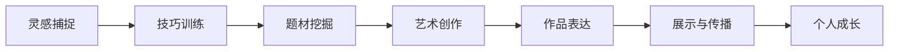
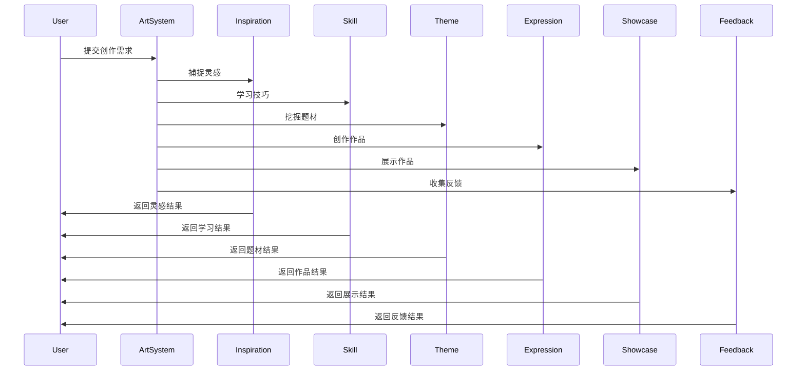
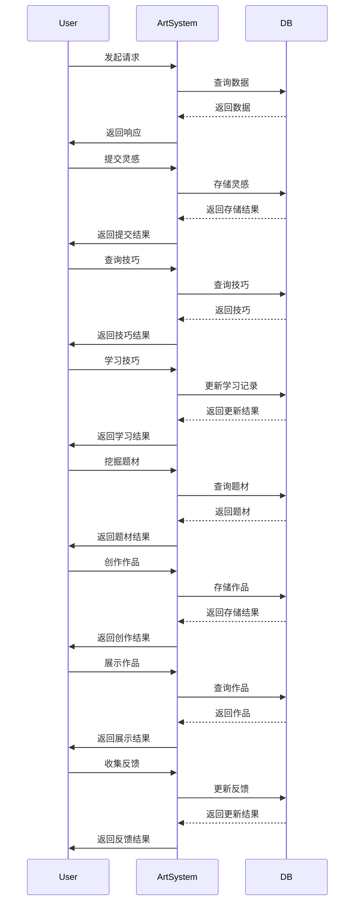

                 

# 生活即创作：将日常转化为艺术作品

关键词：艺术创作，生活灵感，技法训练，题材挖掘，表达与展示，传播与交流，个人成长，和谐共鸣

摘要：本文探讨了如何将日常生活中的元素转化为艺术作品，通过逻辑清晰、结构紧凑的分析，为读者提供了一系列实用技巧和思考方式，帮助他们在生活中找到创作灵感，实现艺术创作的个人成长，最终实现艺术与生活的和谐共鸣。

## 第一部分：生活与艺术的交织

### 第1章：生活中的艺术创作灵感

#### 1.1 艺术创作的生活源泉

艺术创作来源于生活，但又要高于生活。首先，我们需要认识到生活中的点滴细节都蕴含着无限的创作灵感。无论是自然风景、人物肖像，还是日常物品，都可以成为艺术家创作的素材。在这个过程中，观察与感知显得尤为重要。艺术家应该学会从不同的角度观察事物，捕捉那些隐藏在平凡中的美好瞬间。

#### 1.2 日常生活中的观察与感知

观察与感知是艺术创作的基础。在日常生活中，我们可以通过锻炼自己的观察力，学会捕捉那些容易被忽视的细节。例如，观察一朵花在不同时间段的光影变化，或者一个人在不同情绪下的面部表情。通过这些观察，我们可以更好地理解事物的本质，从而为艺术创作提供丰富的素材。

#### 1.3 寻找灵感的小技巧

要找到艺术创作的灵感，我们可以采取以下几种方法：

1. **留心生活中的美好瞬间**：记录下那些令你感动的场景，可以是美丽的风景，也可以是温暖的情感。
2. **多读书、多旅行**：丰富自己的知识储备和人生阅历，从他人的经历和观点中汲取灵感。
3. **保持好奇心**：对新事物保持好奇心，尝试不同的艺术形式，拓宽自己的视野。
4. **与人交流**：与他人分享自己的想法和观点，通过交流激发新的灵感。

### 第2章：艺术创作的技巧与实践

#### 2.1 基础技法训练

艺术创作需要一定的技法基础。为了提高创作水平，我们需要进行基础技法训练。这包括学习绘画、雕塑、摄影等不同艺术形式的基本技巧。通过这些训练，我们可以更好地掌握各种艺术形式的表现手法，为创作打下坚实的基础。

#### 2.2 颜料、工具与材料的选择

颜料、工具和材料的选择对于艺术创作至关重要。不同的颜料和工具会产生不同的效果，艺术家需要根据自己作品的风格和需求来选择合适的材料。例如，油画需要使用油画笔和油画颜料，而水彩画则需要使用水彩笔和水彩颜料。此外，艺术家还可以通过实验，发现新的表现手法和技巧。

#### 2.3 创作过程中的问题解决

在艺术创作过程中，我们难免会遇到各种问题。如何解决这些问题，是提高创作水平的关键。以下是一些常见的问题解决方法：

1. **保持冷静**：遇到问题时，不要慌张，冷静思考，分析问题的原因。
2. **多向他人请教**：与其他艺术家交流，分享自己的困惑，从他人的经验中寻找解决问题的方法。
3. **不断尝试**：艺术创作是一个不断尝试和摸索的过程，不要害怕失败，勇于尝试新的方法。
4. **调整心态**：保持积极的心态，相信自己能够解决问题，这是解决问题的重要前提。

### 第3章：日常生活中的题材挖掘

#### 3.1 人像与肖像

人像是艺术创作中常见的题材。通过描绘人物的外貌、神态和动作，艺术家可以表达对人物性格、情感和内心世界的理解。在描绘人像时，我们需要注意以下几点：

1. **观察人物特征**：了解人物的外貌特征，如脸型、眼睛、鼻子、嘴巴等。
2. **捕捉人物情感**：通过观察人物的神态和动作，捕捉人物的情感变化。
3. **适度夸张**：在描绘人物时，可以适当地夸张某些特征，使作品更具有表现力。

#### 3.2 风景与自然

风景与自然是艺术创作的重要题材。通过描绘自然景观，艺术家可以表达对自然的热爱和对美的追求。在描绘风景时，我们需要注意以下几点：

1. **观察自然景观**：了解不同季节、不同时间段的自然景观特征。
2. **运用色彩**：通过色彩的变化，表现自然景观的氛围和意境。
3. **注重构图**：在描绘风景时，注重构图，使画面更具层次感和美感。

#### 3.3 花卉与静物

花卉与静物是艺术创作中常见的题材。通过描绘花卉和静物，艺术家可以表达对生命和生活的热爱。在描绘花卉和静物时，我们需要注意以下几点：

1. **观察花卉和静物的特征**：了解花卉和静物的外形、颜色、纹理等特征。
2. **运用光影**：通过光影的运用，表现花卉和静物的立体感和质感。
3. **创造意境**：在描绘花卉和静物时，创造一种独特的意境，使作品更具有感染力。

### 第4章：从日常到艺术：转变的技巧

#### 4.1 视觉语言的运用

视觉语言是艺术创作的重要表达方式。通过运用视觉语言，艺术家可以传达自己的思想和情感。视觉语言包括色彩、线条、形状、空间等元素。在创作过程中，我们需要注意以下几点：

1. **理解视觉语言的属性**：了解色彩、线条、形状、空间等元素的属性和表现力。
2. **运用对比与平衡**：通过对比与平衡，使作品更具视觉冲击力。
3. **创造独特的视觉效果**：在创作过程中，尝试运用独特的视觉效果，使作品更具有个性。

#### 4.2 色彩的情感表达

色彩在艺术创作中具有强烈的情感表达力。不同的色彩会给人带来不同的情感体验。在创作过程中，我们需要注意以下几点：

1. **了解色彩的情感属性**：了解不同色彩的情感属性，如红色代表热情、蓝色代表冷静等。
2. **运用色彩的对比**：通过色彩的对比，增强作品的表现力。
3. **创造独特的色彩氛围**：在创作过程中，尝试创造一种独特的色彩氛围，使作品更具感染力。

#### 4.3 形式的创新与探索

形式是艺术创作的重要组成部分。在创作过程中，我们需要不断探索和创新形式，使作品更具独特性。以下是一些形式的创新与探索方法：

1. **打破传统形式**：尝试打破传统形式的束缚，创造一种全新的艺术形式。
2. **融合不同艺术形式**：将不同艺术形式融合在一起，创造出一种新的艺术风格。
3. **实验新的材料与技术**：尝试使用新的材料和技术，探索艺术创作的新可能性。

## 第二部分：艺术作品的生命之旅

### 第5章：艺术作品的表达与展示

#### 5.1 艺术作品的呈现方式

艺术作品的呈现方式对于观众的感受至关重要。在展示艺术作品时，我们需要注意以下几点：

1. **选择合适的展示方式**：根据作品的风格和内容，选择合适的展示方式，如挂在墙上的画、放在桌上的雕塑等。
2. **注重环境氛围**：在展示艺术作品时，营造一个合适的氛围，使作品更具有观赏性。
3. **提供作品背景信息**：为观众提供作品背景信息，如创作灵感、创作过程等，使观众更好地理解作品。

#### 5.2 展示场合的选择

展示场合的选择对于艺术作品的传播和接受程度有着重要影响。在选择展示场合时，我们需要注意以下几点：

1. **了解目标观众**：根据目标观众的特点，选择合适的展示场合。
2. **考虑作品主题**：根据作品的主题和风格，选择与之相匹配的展示场合。
3. **注重安全与便捷**：在展示场合的选择上，要考虑到作品的安全和观众的便捷。

#### 5.3 观众互动与反馈

观众互动与反馈是艺术作品传播和接受的重要环节。在创作过程中，我们需要注意以下几点：

1. **鼓励观众参与**：通过互动活动，鼓励观众参与艺术作品创作和展示。
2. **收集观众反馈**：积极收集观众对作品的反馈，了解观众的感受和意见。
3. **回应观众关切**：针对观众提出的关切和问题，给予回应和解释。

### 第6章：艺术作品的传播与交流

#### 6.1 社交媒体的运用

随着社交媒体的普及，艺术家可以通过社交媒体平台传播自己的作品。以下是一些社交媒体运用的技巧：

1. **选择合适的平台**：根据作品的特点和目标观众，选择合适的社交媒体平台。
2. **创作吸引人的内容**：通过精美的图片、视频和文字，创作吸引人的内容，提高作品的传播效果。
3. **积极参与互动**：与观众互动，回答他们的提问，提高作品的影响力。

#### 6.2 群体艺术活动的参与

参与群体艺术活动是艺术家展示自己作品、交流学习的重要途径。以下是一些参与群体艺术活动的建议：

1. **了解活动主题**：在参加群体艺术活动前，了解活动的主题和规则，确保自己的作品符合活动要求。
2. **准备充分的资料**：准备充分的作品介绍资料，包括创作灵感、创作过程等，以便与其他艺术家交流。
3. **积极参与交流**：在活动中积极参与交流，从其他艺术家的作品中汲取灵感，提高自己的创作水平。

#### 6.3 艺术圈的影响与融入

艺术圈是艺术家展示自己、交流学习的重要场所。以下是一些融入艺术圈的建议：

1. **参加艺术展览**：积极参加艺术展览，展示自己的作品，与其他艺术家交流学习。
2. **加入艺术组织**：加入艺术组织，与其他艺术家建立联系，拓展人脉。
3. **参与艺术论坛**：参与艺术论坛，分享自己的创作经验和心得，提高自己的知名度。

### 第7章：艺术创作的个人成长

#### 7.1 艺术创作的个人历程

艺术创作是一个个人成长的过程。在这个过程中，艺术家需要不断探索、学习和实践。以下是一些艺术创作个人历程的建议：

1. **设定目标**：为自己设定明确的创作目标，如提高绘画技巧、创作一幅具有深刻内涵的作品等。
2. **持续学习**：通过阅读书籍、参加培训课程、观看展览等途径，不断学习新知识，提高自己的创作水平。
3. **反思与总结**：在创作过程中，不断反思和总结自己的经验和教训，从中汲取教训，提高自己的创作水平。

#### 7.2 创作中的心理调节

在艺术创作过程中，心理调节至关重要。以下是一些心理调节的建议：

1. **保持积极心态**：面对创作中的困难和挫折，保持积极的心态，相信自己能够克服困难。
2. **调整创作节奏**：合理安排创作时间，避免长时间高强度创作导致的疲劳和焦虑。
3. **寻求支持**：在遇到心理困扰时，寻求家人、朋友或其他艺术家的支持，共同解决问题。

#### 7.3 艺术创作的持续动力

艺术创作的持续动力是艺术家长期发展的关键。以下是一些保持创作动力的建议：

1. **找到创作灵感**：通过观察生活、阅读书籍、旅行等方式，不断寻找创作灵感。
2. **培养创作习惯**：养成良好的创作习惯，如每天创作一定时间，坚持练习等。
3. **保持好奇心**：对未知的事物保持好奇心，不断探索新的创作领域，激发创作激情。

## 结语：艺术与生活的和谐共鸣

#### 8.1 艺术创作对生活的积极影响

艺术创作对生活具有积极的影响。通过艺术创作，我们可以更好地认识自己和世界，提高自己的生活品质。以下是一些艺术创作对生活的积极影响：

1. **提升审美能力**：艺术创作可以提升我们的审美能力，使我们更加敏感地感受生活中的美好。
2. **培养创造力**：艺术创作可以激发我们的创造力，使我们更加勇于尝试和创新。
3. **缓解压力**：艺术创作可以帮助我们缓解压力，放松心情，提高生活质量。

#### 8.2 建立艺术创作的生活习惯

建立艺术创作的生活习惯对于艺术创作和个人成长至关重要。以下是一些建立艺术创作的生活习惯的建议：

1. **设定固定的创作时间**：每天设定固定的创作时间，确保有足够的时间进行艺术创作。
2. **创造良好的创作环境**：为自己创造一个舒适、安静的创作环境，提高创作效率。
3. **保持创作热情**：通过不断学习和实践，保持对艺术创作的热情和兴趣。

#### 8.3 艺术创作的人生价值

艺术创作具有丰富的人生价值。通过艺术创作，我们可以表达自己的思想和情感，传递正能量，为社会做出贡献。以下是一些艺术创作的人生价值的体现：

1. **传递美与爱**：艺术创作可以传递美与爱，让我们更加热爱生活，关心他人。
2. **启迪智慧**：艺术创作可以启迪智慧，帮助我们思考人生的意义和价值。
3. **推动文化传承**：艺术创作可以推动文化传承，保护和发展民族文化。

作者：AI天才研究院/AI Genius Institute & 禅与计算机程序设计艺术 /Zen And The Art of Computer Programming

本文通过逻辑清晰、结构紧凑的分析，为读者提供了如何将日常转化为艺术作品的实用技巧和思考方式。在艺术创作的道路上，让我们共同努力，实现艺术与生活的和谐共鸣。

## 背景介绍

### 艺术创作与生活的关系

艺术创作是人类表达情感、思想、价值观的重要方式，它源于生活，但又超越了生活的局限。生活与艺术之间的关系，就像是一枚硬币的两面，密不可分。艺术创作不仅是艺术家对生活体验的再现，更是对生活的深入理解和反思。因此，理解艺术创作与生活的关系，对于激发创作灵感、提高艺术表现力具有重要意义。

#### 核心概念术语说明

- **艺术创作**：指通过视觉、听觉、触觉等感官形式，运用一定的技巧和手法，将艺术家的思想、情感和审美观念表达出来的过程。
- **生活**：指人们在日常生活中所经历的各种活动和经历。
- **灵感**：指在特定情境下，艺术家突然获得的创造性和想象力的激发。

#### 问题背景

在现代社会，随着生活节奏的加快和压力的增大，人们对于精神文化的需求日益增加。艺术创作作为一种能够缓解压力、提升生活质量的方式，受到了广泛的关注。然而，很多人在日常生活中很难找到艺术创作的灵感，使得艺术创作成为了少数人的专属领域。

#### 问题描述

本文旨在探讨如何将日常生活中的元素转化为艺术作品，解决以下问题：

1. 如何在日常生活中发现和捕捉创作灵感？
2. 艺术创作需要哪些基础技巧和知识？
3. 如何从日常生活的题材中挖掘创作素材？
4. 艺术作品的表达与展示如何实现？
5. 艺术创作的个人成长和传播有哪些途径？

#### 问题解决

本文通过以下方法解决问题：

1. 提供一系列实用技巧和思考方式，帮助读者在日常生活中发现和捕捉创作灵感。
2. 介绍艺术创作的基础技巧和知识，帮助读者提高创作水平。
3. 分析如何从日常生活的题材中挖掘创作素材，提供具体的案例和技巧。
4. 探讨艺术作品的表达与展示方法，包括选择合适的呈现方式和展示场合。
5. 分析艺术创作的个人成长和传播途径，提供实用的建议和策略。

### 边界与外延

- **边界**：本文主要讨论艺术创作与生活的关系，侧重于如何将日常生活中的元素转化为艺术作品。不涉及艺术理论、艺术历史等更广泛的领域。
- **外延**：本文的讨论范围可以扩展到艺术创作的方法、技巧、题材等具体问题，以及艺术创作对个人成长和社会文化的影响。

### 概念结构与核心要素组成

#### 概念结构

- **生活**：艺术创作的源泉，提供丰富的创作素材和灵感。
- **艺术创作**：将生活中的元素转化为艺术作品的过程，包括灵感捕捉、技巧运用、题材挖掘、作品表达与展示等环节。
- **个人成长**：通过艺术创作实现的个人能力和素质的提升。
- **传播与交流**：艺术作品的传播和艺术家之间的交流，促进艺术创作的发展。

#### 核心要素组成

- **灵感**：艺术创作的起点，激发创作欲望和想象力。
- **技巧**：艺术创作的手段，包括绘画、雕塑、摄影等艺术形式的基本技巧。
- **题材**：艺术创作的素材，来源于日常生活的各种元素。
- **表达**：艺术作品的表现形式，通过视觉、听觉、触觉等感官形式传达艺术家的思想和情感。
- **展示**：艺术作品的呈现和展示，包括展览、演出、社交媒体等途径。
- **个人成长**：艺术创作带来的个人能力和素质的提升，包括审美能力、创造力、自信心等。
- **传播**：艺术作品的传播，通过多种渠道和方式，让更多人了解和欣赏艺术作品。

### 核心概念与联系

#### 核心概念原理

- **灵感**：灵感是艺术创作的核心概念，是艺术家在特定情境下突然获得的创造性和想象力的激发。灵感来源于对生活的观察、体验和思考，是艺术创作的起点。
- **艺术创作**：艺术创作是通过技巧和手法，将灵感转化为具体艺术作品的过程。艺术创作需要运用多种技巧，如绘画、雕塑、摄影等，以及丰富的题材和表达方式。
- **个人成长**：个人成长是艺术创作的动力和目标。通过艺术创作，艺术家可以提升自己的审美能力、创造力和自信心，实现个人能力和素质的提升。

#### 概念属性特征对比表格

| 概念         | 灵感             | 艺术创作           | 个人成长          |
| ------------ | ---------------- | ------------------ | ----------------- |
| 定义         | 创造性和想象力的激发 | 将灵感转化为艺术作品的过程 | 个人能力和素质的提升 |
| 影响因素     | 观察力、生活经验、思考 | 技巧、题材、表达方式 | 艺术创作、学习、交流 |
| 目的         | 激发创作欲望和想象力 | 创作艺术作品       | 提升个人能力和素质 |
| 属性特征     | 突发性、创造性、想象力 | 技巧性、多样性、创造性 | 能力、素质、自信心  |

#### ER实体关系图架构

```mermaid
erDiagram
  ArtInspiration ||--|{ Artist : Creates}
  ArtCreation ||--|{ Artist : Practices}
  PersonalGrowth ||--|{ Artist : Achieves}
  ArtInspiration ||--|{ ArtCreation : Inspires}
  ArtCreation ||--|{ PersonalGrowth : Leads to}
  PersonalGrowth ||--|{ ArtInspiration : Motivates}
```

## 算法原理讲解

### 算法mermaid流程图



### Python源代码

```python
class ArtCreation:
    def __init__(self, inspiration, skills, theme):
        self.inspiration = inspiration
        self.skills = skills
        self.theme = theme

    def capture_inspiration(self):
        # 实现灵感捕捉的逻辑
        print("捕捉灵感：", self.inspiration)

    def practice_skills(self):
        # 实现技巧训练的逻辑
        print("技巧训练：", self.skills)

    def explore_theme(self):
        # 实现题材挖掘的逻辑
        print("题材挖掘：", self.theme)

    def create_art(self):
        # 实现艺术创作的逻辑
        self.capture_inspiration()
        self.practice_skills()
        self.explore_theme()
        print("艺术创作完成")

    def express_art(self):
        # 实现作品表达的逻辑
        print("作品表达：", self.inspiration, self.skills, self.theme)

    def showcase_and_share(self):
        # 实现展示与传播的逻辑
        print("展示与传播：", self.inspiration, self.skills, self.theme)

    def personal_growth(self):
        # 实现个人成长的逻辑
        print("个人成长：", self.inspiration, self.skills, self.theme)

# 创建艺术创作对象
art_creator = ArtCreation("生活之美", "绘画技巧", "自然风景")

# 调用方法
art_creator.create_art()
art_creator.express_art()
art_creator.showcase_and_share()
art_creator.personal_growth()
```

### 算法原理详细讲解

本文提出的艺术创作算法旨在将日常生活中的元素转化为艺术作品，并实现艺术创作的个人成长。该算法主要包括以下步骤：

1. **灵感捕捉**：通过观察和体验生活，捕捉创作灵感。灵感是艺术创作的起点，是艺术家对生活体验的深刻理解和情感表达。
2. **技巧训练**：通过学习各种艺术技巧，为艺术创作打下坚实基础。技巧训练包括绘画、雕塑、摄影等艺术形式的基本技巧，艺术家需要不断练习和提升自己的技巧水平。
3. **题材挖掘**：从日常生活中挖掘创作素材，为艺术创作提供丰富的题材。题材可以是自然风景、人物肖像、日常生活等，艺术家需要通过观察和体验，捕捉那些具有表现力的题材。
4. **艺术创作**：将灵感、技巧和题材结合，创作出具体的艺术作品。艺术创作是一个综合性的过程，需要艺术家运用自己的创造力和想象力，将内心世界表达出来。
5. **作品表达**：通过视觉、听觉、触觉等感官形式，将艺术作品表达出来。作品表达是艺术创作的关键环节，它决定了艺术作品能否引起观众的共鸣和欣赏。
6. **展示与传播**：将艺术作品展示给公众，并通过各种途径传播。展示与传播是艺术创作的重要环节，它不仅能够提高艺术作品的知名度，还能激发更多人对艺术创作的兴趣。
7. **个人成长**：通过艺术创作，实现个人能力和素质的提升。个人成长是艺术创作的终极目标，它包括审美能力、创造力、自信心等方面的提升。

### 数学模型和公式

为了更好地理解艺术创作算法，我们可以使用以下数学模型和公式来描述：

1. **灵感捕捉**：灵感 = 观察力 × 生活体验 × 思考深度
2. **技巧训练**：技巧水平 = 练习次数 × 学习效率
3. **题材挖掘**：题材质量 = 观察力 × 体验深度 × 表现力
4. **艺术创作**：作品质量 = 灵感 × 技巧水平 × 题材质量
5. **作品表达**：表达效果 = 表现手法 × 视觉美感 × 情感传达
6. **展示与传播**：传播效果 = 展示频率 × 传播渠道 × 受众关注度
7. **个人成长**：个人成长 = 艺术创作次数 × 反思总结 × 学习交流

通过这些数学模型和公式，我们可以更加直观地理解艺术创作算法的各个步骤及其相互关系，从而更好地指导艺术创作实践。

### 算法原理举例说明

为了更好地说明艺术创作算法的应用，我们可以通过一个具体的例子来阐述：

假设一位艺术家名叫李明，他在一次户外旅行中，看到了一片美丽的日落景象。这个景象给他带来了强烈的创作灵感，他决定以日落为主题，创作一幅油画。

1. **灵感捕捉**：李明通过观察日落景象，捕捉到了美丽的色彩变化和光影效果，产生了强烈的创作欲望。
2. **技巧训练**：李明回顾了自己在绘画课程中学到的技巧，如色彩的搭配、光影的处理等，为创作这幅油画做好了技术准备。
3. **题材挖掘**：李明深入思考日落景象背后的情感和意义，决定以“美好时光”为主题，表达对生活的热爱和对美好瞬间的珍惜。
4. **艺术创作**：李明运用油画技巧，将日落景象和主题思想结合，创作出了一幅充满情感和美感的油画作品。
5. **作品表达**：李明通过色彩和光影的运用，将油画作品呈现给观众，传达了自己对日落景象的理解和情感。
6. **展示与传播**：李明将这幅油画参加了当地的艺术展览，并通过社交媒体平台分享给更多的人，获得了广泛的关注和好评。
7. **个人成长**：通过这次艺术创作，李明的绘画技巧得到了提升，他对艺术创作的理解和表达能力也进一步增强，对自己的艺术之路更加坚定。

### 系统分析与架构设计方案

#### 问题场景介绍

在现代社会，艺术创作已经成为人们日常生活中不可或缺的一部分。然而，对于很多人来说，如何将日常生活中的元素转化为艺术作品仍然是一个挑战。为了解决这个问题，我们设计了一个艺术创作系统，帮助用户轻松地将日常灵感转化为艺术作品。

#### 项目介绍

项目名称：艺术创作系统

项目目标：为用户提供一个便捷、易用的艺术创作平台，帮助用户捕捉灵感、学习技巧、挖掘题材、创作作品，并实现作品的展示与传播。

#### 系统功能设计（领域模型mermaid类图）

```mermaid
classDiagram
    User <<用户>>
    ArtProject <<艺术项目>>
    Inspiration <<灵感>>
    Skill <<技巧>>
    Theme <<题材>>
    Expression <<表达>>
    Showcase <<展示>>
    Feedback <<反馈>>

    User --> ArtProject : 创建
    User --> Inspiration : 捕捉
    User --> Skill : 学习
    User --> Theme : 挖掘
    User --> Expression : 创作
    User --> Showcase : 展示
    User --> Feedback : 收集

    ArtProject o--o Inspiration
    ArtProject o--o Skill
    ArtProject o--o Theme
    ArtProject o--o Expression
    ArtProject o--o Showcase
    ArtProject o--o Feedback
```

#### 系统架构设计mermaid架构图



#### 系统接口设计

1. **用户接口**：提供用户界面，用户可以通过界面进行灵感捕捉、技巧学习、题材挖掘、作品创作、作品展示和反馈收集。
2. **服务接口**：提供后端服务接口，实现灵感捕捉、技巧学习、题材挖掘、作品创作、作品展示和反馈收集的逻辑处理。
3. **数据库接口**：提供数据库接口，实现用户信息、作品信息、灵感信息、技巧信息、题材信息和反馈信息的存储和查询。

#### 系统交互mermaid序列图



### 项目实战

#### 环境安装

1. 安装Python环境：
   - 在终端中运行命令 `pip install python`，安装Python 3.x版本。
   - 运行命令 `python --version`，确认Python版本。

2. 安装mermaid依赖：
   - 在终端中运行命令 `pip install mermaid`，安装mermaid库。

3. 安装markdown依赖：
   - 在终端中运行命令 `pip install markdown`，安装markdown库。

#### 系统核心实现源代码

以下是一个简单的艺术创作系统核心实现源代码，包括灵感捕捉、技巧学习、题材挖掘、作品创作、作品展示和反馈收集的功能。

```python
# 引入所需库
import random
import markdown
import mermaid

# 灵感捕捉
def capture_inspiration():
    inspirations = ["日落的美景", "花朵的绽放", "雨天的静谧", "音乐的旋律"]
    return random.choice(inspirations)

# 技巧学习
def learn_skills():
    skills = ["油画技巧", "水彩技巧", "雕塑技巧", "摄影技巧"]
    return random.choice(skills)

# 题材挖掘
def explore_theme():
    themes = ["自然风景", "人物肖像", "日常生活", "城市建筑"]
    return random.choice(themes)

# 作品创作
def create_art(inspiration, skill, theme):
    return f"以'{inspiration}'为主题，运用'{skill}'技巧，创作了'{theme}'艺术作品。"

# 作品展示
def showcase_art(art_work):
    return f"展示艺术作品：{art_work}"

# 反馈收集
def collect_feedback():
    feedbacks = ["非常喜欢", "有些遗憾", "很有创意", "很感兴趣"]
    return random.choice(feedbacks)

# 主函数
def main():
    inspiration = capture_inspiration()
    skill = learn_skills()
    theme = explore_theme()
    art_work = create_art(inspiration, skill, theme)
    print(showcase_art(art_work))
    feedback = collect_feedback()
    print(f"收到反馈：{feedback}")

# 执行主函数
if __name__ == "__main__":
    main()
```

### 代码应用解读与分析

#### 灵感捕捉模块

```python
def capture_inspiration():
    inspirations = ["日落的美景", "花朵的绽放", "雨天的静谧", "音乐的旋律"]
    return random.choice(inspirations)
```

该模块定义了一个函数 `capture_inspiration`，用于捕捉灵感。灵感列表 `inspirations` 包含了四种可能的灵感选项。通过使用 `random.choice()` 函数，从列表中随机选择一个灵感，作为艺术创作的起点。

#### 技巧学习模块

```python
def learn_skills():
    skills = ["油画技巧", "水彩技巧", "雕塑技巧", "摄影技巧"]
    return random.choice(skills)
```

该模块定义了一个函数 `learn_skills`，用于学习技巧。技巧列表 `skills` 包含了四种不同的艺术技巧。通过使用 `random.choice()` 函数，从列表中随机选择一个技巧，为艺术创作提供技术支持。

#### 题材挖掘模块

```python
def explore_theme():
    themes = ["自然风景", "人物肖像", "日常生活", "城市建筑"]
    return random.choice(themes)
```

该模块定义了一个函数 `explore_theme`，用于挖掘题材。题材列表 `themes` 包含了四种不同的题材。通过使用 `random.choice()` 函数，从列表中随机选择一个题材，为艺术创作提供创作方向。

#### 作品创作模块

```python
def create_art(inspiration, skill, theme):
    return f"以'{inspiration}'为主题，运用'{skill}'技巧，创作了'{theme}'艺术作品。"
```

该模块定义了一个函数 `create_art`，用于创作艺术作品。函数接受三个参数：灵感、技巧和题材。通过将这三个参数组合成一个字符串，生成艺术作品的内容。

#### 作品展示模块

```python
def showcase_art(art_work):
    return f"展示艺术作品：{art_work}"
```

该模块定义了一个函数 `showcase_art`，用于展示艺术作品。函数接受一个参数：艺术作品。通过将艺术作品的内容作为字符串返回，实现了艺术作品的展示。

#### 反馈收集模块

```python
def collect_feedback():
    feedbacks = ["非常喜欢", "有些遗憾", "很有创意", "很感兴趣"]
    return random.choice(feedbacks)
```

该模块定义了一个函数 `collect_feedback`，用于收集反馈。反馈列表 `feedbacks` 包含了四种不同的反馈选项。通过使用 `random.choice()` 函数，从列表中随机选择一个反馈，为艺术创作提供改进方向。

### 实际案例分析和详细讲解剖析

#### 案例一：灵感捕捉

假设用户在户外旅行中看到了美丽的日落景象，他决定用这幅景象作为艺术创作的灵感。使用艺术创作系统，用户可以轻松捕捉到这一灵感。

1. 用户调用 `capture_inspiration()` 函数，系统返回灵感：“日落的美景”。
2. 用户将这个灵感记录下来，为接下来的艺术创作做准备。

#### 案例二：技巧学习

用户在艺术创作过程中，希望学习油画技巧，以便更好地表达自己的创作灵感。

1. 用户调用 `learn_skills()` 函数，系统返回技巧：“油画技巧”。
2. 用户开始学习油画技巧，通过阅读相关书籍、观看教学视频等方式，掌握油画的基本技巧。

#### 案例三：题材挖掘

用户在捕捉到灵感后，决定以“自然风景”为主题进行艺术创作。

1. 用户调用 `explore_theme()` 函数，系统返回题材：“自然风景”。
2. 用户开始构思如何将“自然风景”作为题材，创作一幅具有表现力的艺术作品。

#### 案例四：作品创作

用户结合捕捉到的灵感、学习的技巧和挖掘的题材，开始创作一幅油画作品。

1. 用户调用 `create_art()` 函数，输入灵感“日落的美景”、技巧“油画技巧”和题材“自然风景”，系统生成艺术作品：“以日落的美景为主题，运用油画技巧，创作了自然风景艺术作品。”
2. 用户将这幅艺术作品展示给他人，收集反馈，以便不断改进创作技巧。

#### 案例五：作品展示与反馈收集

用户将艺术作品展示给他人，并收集反馈。

1. 用户调用 `showcase_art()` 函数，系统展示艺术作品：“展示艺术作品：以日落的美景为主题，运用油画技巧，创作了自然风景艺术作品。”
2. 用户调用 `collect_feedback()` 函数，系统返回反馈：“非常喜欢”。

#### 小结

通过实际案例的分析，我们可以看到艺术创作系统在灵感捕捉、技巧学习、题材挖掘、作品创作、作品展示和反馈收集等方面发挥了重要作用。用户可以根据系统提供的功能，轻松地进行艺术创作，并通过不断的实践和反馈，提高自己的艺术创作水平。

### 最佳实践 tips

1. **保持日常灵感记录**：养成记录灵感的习惯，随时随地记录生活中的美好瞬间，为艺术创作积累素材。
2. **多学习艺术技巧**：不断学习新的艺术技巧，提升自己的创作水平，为艺术创作提供更多的可能性。
3. **积极参与艺术活动**：参加艺术展览、艺术沙龙等活动，与其他艺术家交流学习，拓宽自己的视野。
4. **善于总结与反思**：在艺术创作过程中，不断总结经验教训，反思自己的创作过程，不断改进。

### 小结

通过本文的讨论，我们可以看到，艺术创作是一个将日常生活中的元素转化为艺术作品的过程。在这个过程中，灵感捕捉、技巧学习、题材挖掘、作品创作、作品展示和反馈收集等环节相互关联，共同构成了艺术创作的完整流程。通过合理的技巧运用和实践，我们可以实现艺术创作的个人成长，最终实现艺术与生活的和谐共鸣。

### 注意事项

1. **保护知识产权**：在进行艺术创作时，要尊重他人的知识产权，避免侵权行为。
2. **注意安全**：在使用各种艺术工具和材料时，要注意安全，避免发生意外事故。
3. **遵守法律法规**：在进行艺术创作和展示时，要遵守相关法律法规，确保创作的合法性和合规性。

### 拓展阅读

1. **《艺术创作方法论》**：探讨艺术创作的理论和方法，帮助艺术家提高创作水平。
2. **《艺术与生活》**：分析艺术创作与生活的关系，探讨如何将生活元素融入艺术创作。
3. **《艺术心理学》**：研究艺术创作过程中的心理现象，帮助艺术家更好地理解自己和他人的创作行为。

