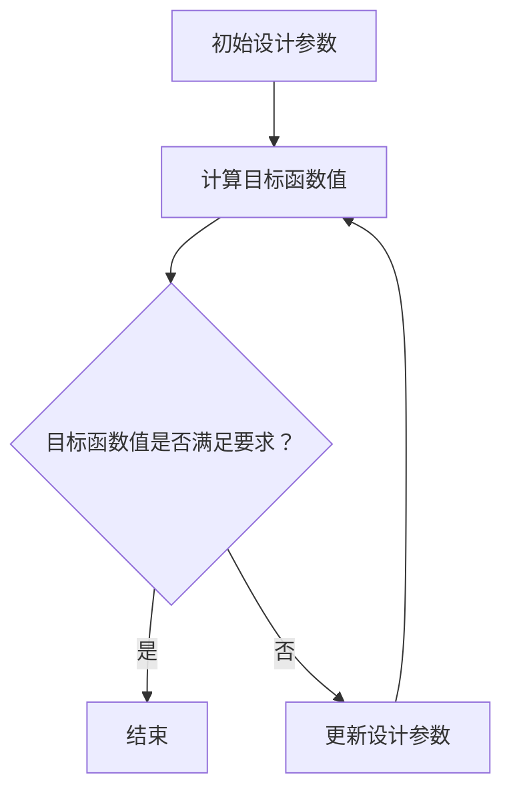
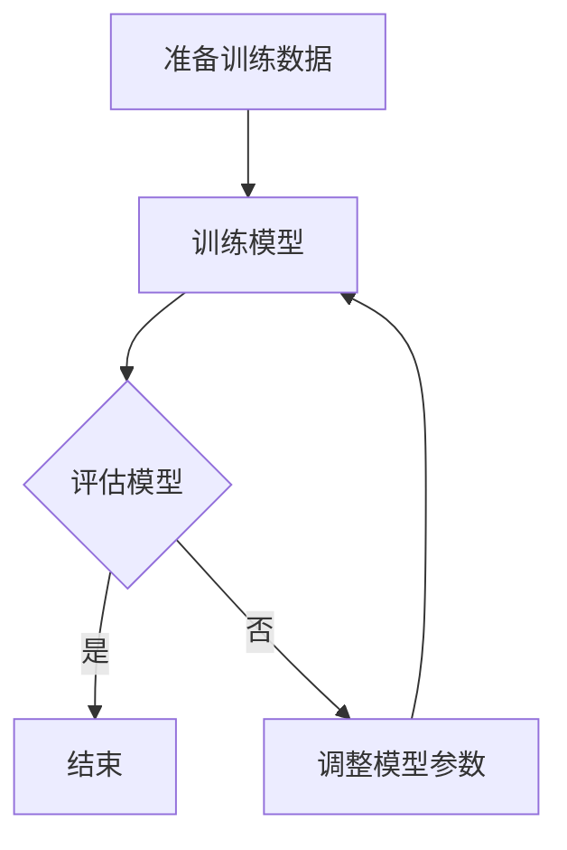
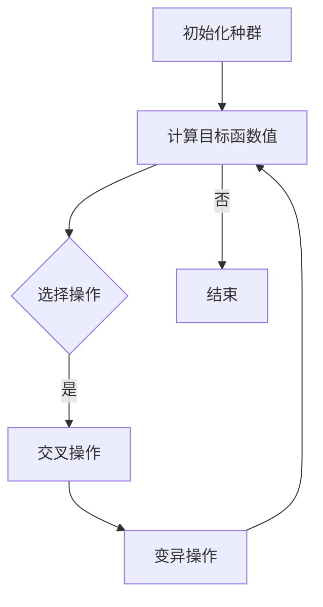
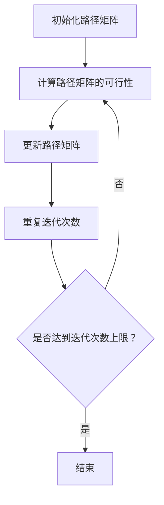
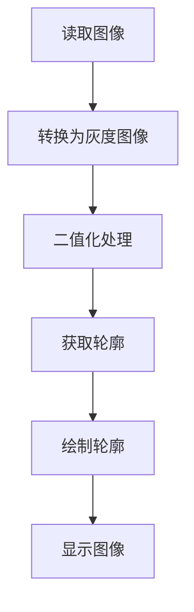
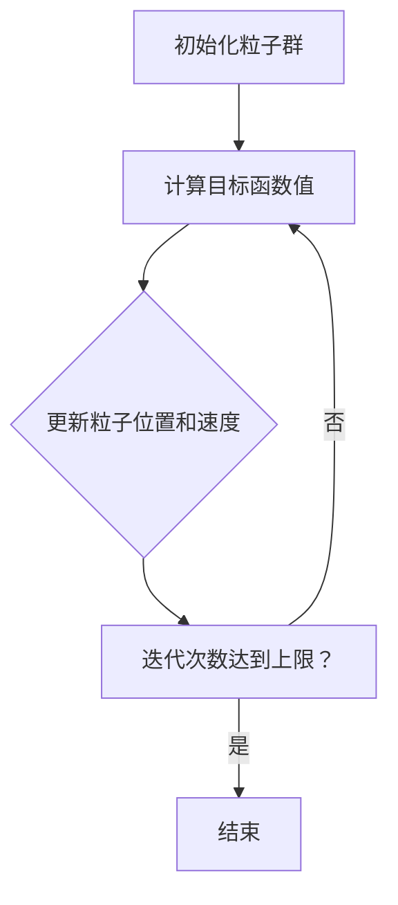
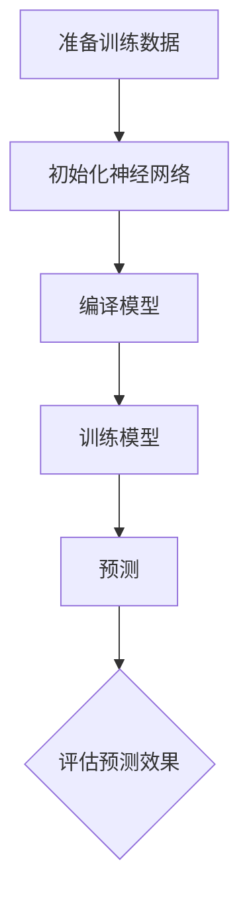
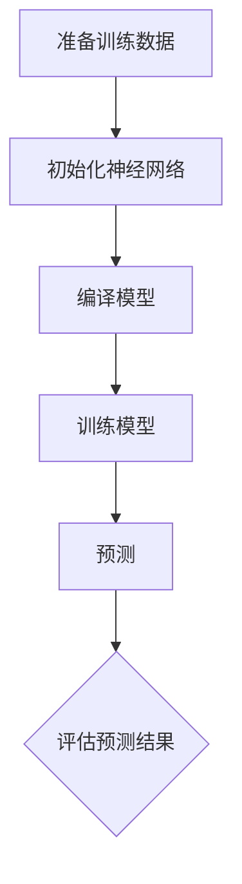
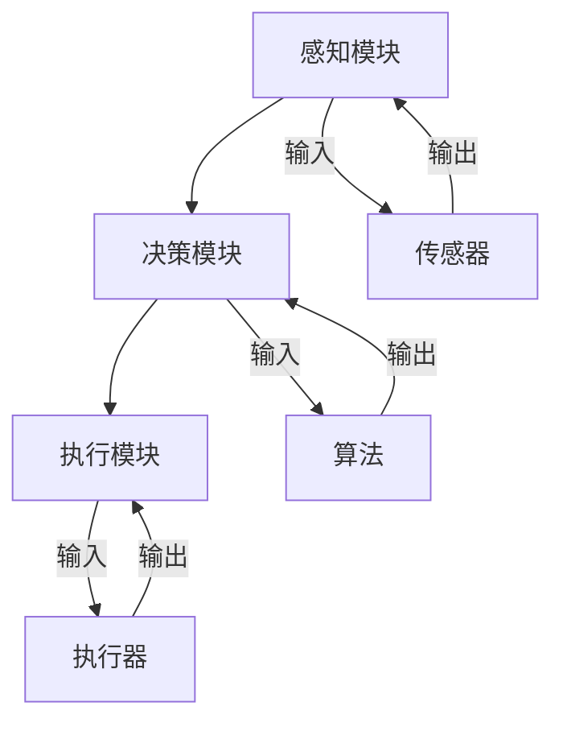

                 

# 生物仿生创新：向自然学习的设计革命

## 关键词
生物仿生学、设计革命、结构仿生、功能仿生、系统仿生、工程应用、工业设计、医学应用

## 摘要
生物仿生创新，作为一种新兴的设计理念，正逐步颠覆传统设计方法，成为现代设计领域的热点。本文首先介绍了生物仿生设计的背景、核心概念及其与传统的区别，随后详细阐述了生物仿生创新的基本原理，并通过具体案例展示了其在工程、工业设计和医学等领域的广泛应用。文章最后分析了生物仿生创新的挑战与机遇，为未来研究提供了方向。

## 目录大纲

### 第一部分：引言
#### 1.1 问题的背景与描述
##### 1.1.1 生物仿生学的兴起
##### 1.1.2 设计革命的需求
##### 1.1.3 仿生设计的潜力
##### 1.2 仿生设计的核心概念与联系
##### 1.2.1 仿生设计的定义
##### 1.2.2 仿生设计的核心概念
##### 1.2.2.1 生物结构
##### 1.2.2.2 生物功能
##### 1.2.2.3 生物系统
##### 1.2.3 仿生设计与传统设计的比较
##### 1.2.4 仿生设计的发展趋势
##### 1.3 生物仿生创新的基本原理
##### 1.3.1 生物仿生创新的概念
##### 1.3.2 生物仿生创新的方法
##### 1.3.2.1 直接仿生
##### 1.3.2.2 间接仿生
##### 1.3.2.3 融合仿生
##### 1.4 生物仿生创新的案例分析
##### 1.4.1 仿生学在工程领域的应用
##### 1.4.2 仿生学在工业设计领域的应用
##### 1.4.3 仿生学在医学领域的应用
##### 1.5 生物仿生创新的挑战与机遇
##### 1.5.1 技术挑战
##### 1.5.2 知识储备
##### 1.5.3 市场前景
##### 1.6 本章小结

### 第二部分：生物仿生设计原理
#### 2.1 生物结构仿生设计
##### 2.1.1 结构仿生设计的方法
##### 2.1.2 结构仿生设计在工程中的应用
##### 2.2 生物功能仿生设计
##### 2.2.1 功能仿生设计的方法
##### 2.2.2 功能仿生设计在工业设计中的应用
##### 2.3 生物系统仿生设计
##### 2.3.1 系统仿生设计的方法
##### 2.3.2 系统仿生设计在医学中的应用
##### 2.4 生物仿生设计的综合应用
##### 2.4.1 多学科交叉的综合应用
##### 2.4.2 案例分析
##### 2.5 本章小结

### 第三部分：生物仿生设计的实际应用
#### 3.1 仿生学在工程领域的应用
##### 3.1.1 仿生材料的应用
##### 3.1.2 仿生机器人应用
##### 3.1.3 仿生学在建筑领域的应用
#### 3.2 仿生学在工业设计领域的应用
##### 3.2.1 仿生设计在纺织品设计中的应用
##### 3.2.2 仿生设计在交通工具设计中的应用
##### 3.2.3 仿生设计在家具设计中的应用
#### 3.3 仿生学在医学领域的应用
##### 3.3.1 仿生学在医疗器械设计中的应用
##### 3.3.2 仿生学在康复治疗中的应用
##### 3.3.3 仿生学在药物研发中的应用
#### 3.4 生物仿生创新的未来发展趋势
##### 3.4.1 新技术的影响
##### 3.4.2 市场需求的变化
##### 3.4.3 政策与环境的推动
##### 3.5 本章小结

### 第四部分：生物仿生创新的挑战与机遇
#### 4.1 技术挑战
##### 4.1.1 技术突破的需求
##### 4.1.2 技术融合的挑战
##### 4.1.3 技术转化的难题
#### 4.2 知识储备
##### 4.2.1 跨学科知识的积累
##### 4.2.2 基础理论的深入研究
##### 4.2.3 实验与模拟的紧密结合
#### 4.3 市场前景
##### 4.3.1 市场需求分析
##### 4.3.2 竞争格局分析
##### 4.3.3 发展趋势预测
#### 4.4 政策与环境的推动
##### 4.4.1 政策支持
##### 4.4.2 环境影响
##### 4.4.3 国际合作
##### 4.5 本章小结

### 第五部分：总结与展望
#### 5.1 生物仿生创新的总结
##### 5.1.1 核心成果
##### 5.1.2 发展现状
##### 5.1.3 存在问题
#### 5.2 生物仿生创新的未来展望
##### 5.2.1 技术创新的方向
##### 5.2.2 应用拓展的可能性
##### 5.2.3 社会影响
##### 5.3 本章小结

### 参考文献

## 第一部分：引言

### 1.1 问题的背景与描述

#### 1.1.1 生物仿生学的兴起

生物仿生学，作为一门交叉学科，近年来在全球范围内迅速崛起。它源于对自然界生物体结构和功能的深入研究，旨在通过模仿生物体的设计原则，创造出更高效、更环保、更具有生物适应性的技术产品。随着科技的进步，特别是材料科学、生命科学和信息技术的飞速发展，生物仿生学逐渐从理论走向实践，成为创新设计的重要驱动力。

生物仿生学的兴起并非偶然。首先，人类对自然界生物体的好奇心和探索欲望推动了这一领域的发展。从古至今，人类一直在模仿自然界中的生物结构，如鸟类的飞行、鱼类的游泳等。其次，随着环保意识的增强和资源短缺问题的凸显，人类意识到通过仿生设计可以最大限度地利用自然资源，降低生产成本，提高生产效率。此外，现代科技的进步，特别是纳米技术、生物工程和人工智能等领域的突破，为生物仿生学提供了强大的技术支撑。

#### 1.1.2 设计革命的需求

设计革命，是指通过引入新的设计理念、方法和技术，彻底改变传统的设计过程和产品形态，从而实现设计创新和产业升级。生物仿生学的兴起，正是为了满足这一革命的需求。传统的产品设计往往局限于人类自身的经验和创造力，而生物仿生学则提供了一种全新的视角，即从自然界中寻找灵感，借鉴生物体的设计原则，创造出更自然、更适应环境的产品。

设计革命的需求主要体现在以下几个方面。首先，随着全球竞争的加剧，企业需要不断创新来提升竞争力。生物仿生学提供了新的设计思路和解决方案，可以帮助企业在激烈的市场竞争中脱颖而出。其次，消费者的需求也在不断变化，他们追求更个性化、更环保、更具有创新性的产品。生物仿生学的设计理念可以满足这些需求，提供更多样化的选择。最后，设计革命也是应对环境问题的重要手段。通过仿生设计，可以创造出更节能、更环保的产品，减少对自然资源的消耗和环境的破坏。

#### 1.1.3 仿生设计的潜力

仿生设计的潜力在于其无限的创意空间和实际应用价值。首先，仿生设计可以借鉴自然界中的生物结构、功能和系统，创造出性能优越、效率更高的产品。例如，仿生学在材料科学中的应用，可以创造出具有高强度、轻质量、耐腐蚀的新型材料，如蜘蛛丝复合材料、鳞片状材料等。其次，仿生设计可以模拟生物体的行为和机制，为复杂系统的设计和控制提供新的方法。例如，在工程领域，仿生学可以应用于机器人设计、建筑结构优化等方面。此外，仿生设计在工业设计、医学、农业等领域也有着广泛的应用前景。

总之，生物仿生创新是一种革命性的设计理念，它不仅带来了设计方法上的革新，更带来了实际应用上的突破。随着科技的不断进步和环保意识的提高，仿生设计将在未来发挥越来越重要的作用，推动设计革命向前发展。

### 1.2 仿生设计的核心概念与联系

#### 1.2.1 仿生设计的定义

仿生设计（Biomimicry Design）是一种从自然界中汲取灵感，借鉴生物体结构和功能原理，来设计新的人造产品、系统或过程的方法。仿生设计不仅仅是对生物体的外观模仿，更重要的是深入理解其工作原理和适应环境的能力，并将其应用于实际设计中。

仿生设计的定义可以从以下几个方面来理解：
- **自然界观察**：首先，设计师需要观察和研究自然界中生物体的形态、行为和生存策略。
- **原理理解**：设计师需要深入理解这些生物体的设计原则和功能机制，将其转化为可量化和可操作的知识。
- **设计应用**：设计师将这些原理和知识应用于人造产品或系统的设计过程中，以达到优化性能、降低成本或增强环境适应性的目的。

#### 1.2.2 仿生设计的核心概念

仿生设计的核心概念包括生物结构、生物功能和生物系统。以下是对这些核心概念的详细阐述：

##### 1.2.2.1 生物结构

生物结构是指生物体内部的物理和化学组织，包括细胞、组织、器官和系统等。生物结构的设计往往遵循自然界中的最优原则，具有高效、耐用和适应性等特点。仿生设计中的生物结构仿生，主要关注以下几个方面：
- **材料仿生**：如模仿蜘蛛丝的强度和韧性，开发新型复合材料。
- **形态仿生**：如模仿鸟类的翅膀形状，设计更高效的飞行器。
- **组织结构**：如模仿人体的血管网络，设计更高效的血液循环系统。

##### 1.2.2.2 生物功能

生物功能是指生物体在特定环境下的行为和作用能力，如飞行、游泳、感知和适应等。仿生设计中的生物功能仿生，主要关注以下几个方面：
- **行为仿生**：如模仿蜜蜂的群体行为，优化交通流量的管理。
- **感知仿生**：如模仿蛇的视觉系统，设计更敏感的传感器。
- **适应仿生**：如模仿植物的光合作用，设计更高效的能源转换系统。

##### 1.2.2.3 生物系统

生物系统是指生物体内部各个部分之间相互协作、相互影响的关系和机制。生物系统的复杂性体现在其高效性、灵活性和适应性等方面。仿生设计中的生物系统仿生，主要关注以下几个方面：
- **生态系统**：如模仿自然生态系统的物质循环和能量流动，设计可持续发展的产业系统。
- **社会系统**：如模仿社会性昆虫的组织结构，优化企业的组织管理。
- **神经系统**：如模仿生物神经系统的高效信息处理能力，设计智能控制系统。

#### 1.2.3 仿生设计与传统设计的比较

仿生设计与传统设计相比，具有以下显著区别：

- **设计出发点**：
  - 传统设计：以人类的需求和经验为出发点，注重功能和实用性。
  - 仿生设计：以自然界中的生物体为出发点，注重自然界的智慧和适应能力。

- **设计方法**：
  - 传统设计：通常基于经验和现有的技术，采用逆向工程或改进设计的方法。
  - 仿生设计：通常基于对自然界的深入研究，采用正向设计或创新设计的方法。

- **设计结果**：
  - 传统设计：设计结果往往受限于现有技术和材料，创新性有限。
  - 仿生设计：设计结果具有更高的创新性和适应性，往往能够突破现有技术的限制。

- **环境影响**：
  - 传统设计：可能导致资源的浪费和环境的破坏。
  - 仿生设计：通过模仿自然界的智慧和设计原则，实现资源的有效利用和环境的友好适应。

#### 1.2.4 仿生设计的发展趋势

随着科技的不断进步和环保意识的增强，仿生设计呈现出以下发展趋势：

- **跨学科融合**：仿生设计越来越依赖于多学科的交叉融合，如生物学、工程学、材料科学、信息科学等。

- **数字化与智能化**：利用数字化工具和人工智能技术，提高仿生设计的效率和准确性。

- **绿色与可持续发展**：通过仿生设计，实现资源的有效利用和环境的友好适应，推动绿色可持续发展。

- **市场驱动**：随着消费者对个性化、环保和创新产品的需求增加，仿生设计在市场中的地位和影响力不断提升。

### 1.3 生物仿生创新的基本原理

#### 1.3.1 生物仿生创新的概念

生物仿生创新（Biomimetic Innovation）是指通过模仿自然界中生物体的结构和功能，进行创新设计，以解决现实世界中的问题或创造新价值的过程。生物仿生创新不仅限于产品或技术的设计，还包括系统、过程、组织等方面的创新。其核心在于从自然界中汲取灵感，将生物学原理应用于技术、工程和设计等领域，从而实现技术的突破和产业的升级。

生物仿生创新的基本概念可以从以下几个方面来理解：

- **灵感来源**：自然界中的生物体具有独特的结构和功能，这些特性在适应环境和应对挑战方面表现出卓越的智慧。仿生创新就是从这些生物体中汲取灵感，将其转化为实际的应用方案。

- **跨学科融合**：生物仿生创新涉及多个学科领域，如生物学、工程学、物理学、材料科学等。通过跨学科的合作和知识整合，可以更好地理解和应用生物体的设计原则。

- **设计过程**：仿生创新的设计过程通常包括以下几个步骤：
  - **观察和研究**：对自然界中的生物体进行观察和研究，了解其结构和功能的原理。
  - **概念形成**：根据观察到的原理，提出创新的设计概念。
  - **设计验证**：通过实验、模拟或其他验证方法，验证设计概念的有效性。
  - **迭代优化**：根据验证结果，对设计进行优化和迭代，以实现最终的创新产品或技术。

- **应用领域**：生物仿生创新可以应用于多个领域，包括工程、工业设计、医学、环境科学等。不同领域的应用具有不同的特点和挑战，但都体现了生物仿生创新的核心价值。

#### 1.3.2 生物仿生创新的方法

生物仿生创新的方法主要包括直接仿生、间接仿生和融合仿生三种：

- **直接仿生**：直接仿生是指直接模仿生物体的结构和功能，进行设计创新。例如，模仿蝴蝶的翅膀颜色设计防紫外线材料，模仿蜻蜓的翅膀设计无人机。直接仿生的优点在于设计过程简单，可以直接借鉴自然界中的成功案例。然而，直接仿生也有局限性，因为自然界中的生物体往往具有复杂的结构和功能，难以完全复制。

- **间接仿生**：间接仿生是指通过抽象和简化自然界中的生物结构，提取核心原理，然后应用于设计创新。例如，通过研究植物的叶绿体结构，提取光合作用的原理，应用于太阳能电池的设计。间接仿生的优点在于可以更灵活地应用生物原理，不受生物体复杂性的限制。然而，间接仿生需要更深入的生物学知识和设计能力。

- **融合仿生**：融合仿生是指将直接仿生和间接仿生相结合，通过跨学科的融合，创造出全新的设计理念和技术。例如，将昆虫的复眼结构和人工智能算法相结合，设计出更高效的视觉系统。融合仿生的优点在于可以发挥不同仿生方法的优点，创造出更具创新性的设计。然而，融合仿生也面临着跨学科合作和技术融合的挑战。

#### 1.3.2.1 直接仿生

直接仿生是一种最直观的仿生方法，它直接借鉴自然界中生物体的结构和功能，进行设计创新。以下是一些典型的直接仿生实例：

- **材料科学**：模仿蜘蛛丝的强度和韧性，开发出具有高强度、轻质量的复合材料。这些材料在航空航天、医疗器械等领域具有广泛的应用前景。

- **工程学**：模仿鸟类的翅膀形状和飞行机制，设计出更高效的飞行器。例如，波音787飞机的部分设计就借鉴了鸟类的翅膀。

- **电子学**：模仿生物体的生物电现象，开发出生物电子传感器。这些传感器在医疗、环境监测等领域具有重要作用。

#### 1.3.2.2 间接仿生

间接仿生是一种通过抽象和简化生物体结构和功能的方法，提取核心原理，然后应用于设计创新。以下是一些典型的间接仿生实例：

- **信息科学**：通过研究蚁群的集体行为，开发出蚁群算法，用于解决复杂优化问题。蚁群算法在供应链管理、交通优化等领域具有广泛的应用。

- **能源科学**：通过研究植物的光合作用，提取光合作用的原理，开发出更高效的太阳能电池。这些电池在可再生能源领域具有广阔的应用前景。

- **医学**：通过研究生物体中的生物分子相互作用，开发出新型的药物载体和治疗方法。这些方法在癌症治疗、基因编辑等领域具有革命性的潜力。

#### 1.3.2.3 融合仿生

融合仿生是将直接仿生和间接仿生相结合，通过跨学科的融合，创造出全新的设计理念和技术。以下是一些典型的融合仿生实例：

- **人工智能**：将生物神经系统的工作原理与计算机科学相结合，开发出神经网络算法。这些算法在图像识别、语音识别等领域具有广泛的应用。

- **环境科学**：将生态系统的物质循环和能量流动原理与工业设计相结合，开发出可持续发展的产业系统。这些系统在环境保护和资源利用方面具有重要作用。

- **交通工程**：将仿生学原理应用于交通管理，开发出更高效的交通控制系统。这些系统可以优化交通流量，减少拥堵和事故。

### 1.4 生物仿生创新的案例分析

#### 1.4.1 仿生学在工程领域的应用

仿生学在工程领域中的应用非常广泛，涵盖了材料科学、机械工程、航空航天等多个方面。以下是一些典型的应用实例：

- **材料科学**：模仿自然界中的生物材料，如蜘蛛丝、贝壳等，开发出具有高强度、轻质量、耐腐蚀的新型复合材料。这些材料在航空航天、汽车制造、医疗器械等领域具有广泛的应用前景。

- **机械工程**：模仿生物体的运动机制，设计出更加高效、节能的机械系统。例如，模仿鲨鱼皮肤的设计，开发出具有减阻性能的船舶和飞机。

- **航空航天**：模仿鸟类的飞行机制，设计出更高效的飞行器。例如，波音787飞机的部分设计就借鉴了鸟类的翅膀形状和飞行原理。

#### 1.4.2 仿生学在工业设计领域的应用

仿生学在工业设计领域中的应用主要体现在产品设计、用户体验和供应链管理等方面。以下是一些典型的应用实例：

- **产品设计**：模仿自然界中的生物结构，设计出更加人性化、环保的产品。例如，模仿蝴蝶的翅膀设计出具有防紫外线功能的衣物。

- **用户体验**：通过研究生物体的感知和适应机制，设计出更自然、更舒适的用户界面。例如，模仿人类的视觉系统，设计出更高效的人机交互界面。

- **供应链管理**：通过研究蚁群的集体行为，开发出更高效、更灵活的供应链管理系统。例如，蚁群算法在优化物流和资源配置方面具有显著效果。

#### 1.4.3 仿生学在医学领域的应用

仿生学在医学领域的应用主要包括医疗器械设计、康复治疗和药物研发等方面。以下是一些典型的应用实例：

- **医疗器械设计**：模仿生物体的结构和功能，设计出更加高效、安全的医疗器械。例如，模仿人体骨骼的结构，设计出更加符合人体工程学的手术工具。

- **康复治疗**：通过研究生物体的运动和康复机制，设计出更有效的康复设备。例如，模仿鱼类的游泳方式，设计出用于康复治疗的泳疗设备。

- **药物研发**：通过研究生物分子相互作用，开发出新的药物载体和治疗方法。例如，利用纳米技术模仿生物体的分子运输机制，开发出新型的药物递送系统。

### 1.5 生物仿生创新的挑战与机遇

#### 1.5.1 技术挑战

生物仿生创新面临着一系列技术挑战，主要包括以下几个方面：

- **复杂性**：生物体的结构和功能极其复杂，难以全面理解和模拟。生物仿生创新需要深入研究生物体的多层次结构和相互作用机制，这给技术实施带来了巨大的挑战。

- **跨学科融合**：生物仿生创新涉及多个学科领域，包括生物学、工程学、材料科学、信息科学等。跨学科的知识融合和合作需要具备较高的专业素养和沟通能力。

- **实验与模拟**：生物仿生创新需要大量的实验和模拟验证。实验方法的改进和模拟技术的提升是推动生物仿生创新的重要手段。

- **成本与时间**：生物仿生创新往往需要大量的资金投入和时间消耗。从概念验证到实际应用，需要经过多个阶段的研发和测试，这对企业的研发能力和资金实力提出了较高的要求。

#### 1.5.2 知识储备

生物仿生创新需要广泛的知识储备，主要包括以下几个方面：

- **生物学知识**：深入了解生物体的结构和功能，包括细胞、组织、器官和系统等层次。需要掌握生物学的基本原理和前沿研究进展。

- **工程学知识**：了解不同工程领域的原理和技术，包括材料科学、机械工程、电子工程等。工程学知识是生物仿生创新的实施基础。

- **信息科学知识**：掌握信息科学的基本原理和技术，包括人工智能、大数据、云计算等。信息科学知识在生物仿生创新的数据处理和模型构建中具有重要作用。

- **交叉学科知识**：了解其他相关学科的知识，如生态学、环境科学、医学等。交叉学科的知识有助于拓宽生物仿生创新的视野和思路。

#### 1.5.3 市场前景

生物仿生创新具有广阔的市场前景，主要包括以下几个方面：

- **技术创新**：生物仿生创新可以推动技术进步和产业升级，满足社会对高效、环保、个性化的产品需求。

- **产业应用**：生物仿生创新可以应用于多个领域，如工程、工业设计、医学、环境科学等，具有广泛的应用前景。

- **市场需求**：随着环保意识的增强和消费者对高品质、个性化产品的追求，生物仿生创新产品市场需求持续增长。

- **政策支持**：各国政府和国际组织对生物仿生创新给予了高度关注和支持，出台了一系列政策推动其发展。

### 1.6 本章小结

本部分介绍了生物仿生设计的背景、核心概念及其与传统的区别，详细阐述了生物仿生创新的基本原理，并通过具体案例展示了其在工程、工业设计和医学等领域的广泛应用。同时，分析了生物仿生创新面临的挑战与机遇。通过这些内容，读者可以全面了解生物仿生创新的基本概念和应用前景，为后续章节的深入探讨打下基础。

## 第二部分：生物仿生设计原理

### 2.1 生物结构仿生设计

#### 2.1.1 结构仿生设计的方法

生物结构仿生设计是指从自然界中生物体的结构中获取灵感，并将其应用于人造结构设计中。这种方法不仅能够优化结构性能，还能提高材料的可持续性。以下是一些常用的结构仿生设计方法：

##### 2.1.1.1 蜘蛛丝蛋白的结构仿生

蜘蛛丝蛋白是一种具有高强度、轻质量和优异韧性的生物材料。其结构特点是纤维状的多肽链在纳米级别上的高度有序排列。科学家通过分析蜘蛛丝的分子结构和晶体结构，成功合成了具有类似性能的人工材料。这种方法在军事、航空航天和生物医学等领域具有广泛的应用。

**核心概念对比表格**

| 核心概念 | 生物体中的表现 | 仿生设计中的应用 |
| --- | --- | --- |
| 蜘蛛丝蛋白 | 高强度、轻质量、优异韧性 | 军事装备、航空航天材料、生物医学植入物 |

**ER实体关系图架构**

```mermaid
erDiagram
  ProductMaterial -->|uses| Product
  ProductMaterial |||->|is derived from| BiologicalMaterial
  BiologicalMaterial |||->|has property| PhysicalProperty
  PhysicalProperty |||->|defines| MaterialProperty
```

##### 2.1.1.2 鳞片状材料的设计

自然界中的鳞片状结构，如蝴蝶的鳞片和蛇的鳞片，具有出色的防水、隔热和抗磨损性能。科学家通过模仿这些鳞片的结构和功能，设计出了一系列具有类似性能的人工材料。这些材料在建筑、纺织和防护装备等领域有着重要的应用。

**核心概念对比表格**

| 核心概念 | 生物体中的表现 | 仿生设计中的应用 |
| --- | --- | --- |
| 鳞片状材料 | 防水、隔热、抗磨损 | 建筑隔热材料、纺织品涂层、防护装备 |

**ER实体关系图架构**

```mermaid
erDiagram
  ProductMaterial -->|uses| Product
  ProductMaterial |||->|is derived from| BiologicalMaterial
  BiologicalMaterial |||->|has property| PhysicalProperty
  PhysicalProperty |||->|defines| MaterialProperty
```

##### 2.1.1.3 骨骼结构的仿生设计

生物骨骼结构具有高强度、轻质量和良好的弹性。例如，鸟类的骨骼具有中空结构，而鱼类的骨骼则具有流线型设计。通过模仿这些骨骼结构，科学家设计出了具有类似性能的人工骨骼和结构材料。这些材料在航空航天、汽车制造和建筑领域有着重要的应用。

**核心概念对比表格**

| 核心概念 | 生物体中的表现 | 仿生设计中的应用 |
| --- | --- | --- |
| 骨骼结构 | 高强度、轻质量、弹性 | 航空航天结构、汽车制造部件、建筑材料 |

**ER实体关系图架构**

```mermaid
erDiagram
  ProductMaterial -->|uses| Product
  ProductMaterial |||->|is derived from| BiologicalMaterial
  BiologicalMaterial |||->|has property| PhysicalProperty
  PhysicalProperty |||->|defines| MaterialProperty
```

#### 2.1.2 结构仿生设计在工程中的应用

结构仿生设计在工程领域有着广泛的应用，以下是一些典型的应用实例：

- **航空航天**：通过仿生设计，开发出具有高强度、轻质量的飞机和航天器结构材料。例如，NASA开发的碳纤维复合材料，模仿了鸟类的骨骼结构，使其在保持轻质量的同时，具有更高的强度。

- **汽车制造**：通过仿生设计，优化汽车的车身结构，提高燃油效率和安全性。例如，模仿鱼类的流线型身体设计，使汽车具有更低的空气阻力，从而提高燃油效率。

- **建筑**：通过仿生设计，开发出具有优异隔热、防水性能的建筑结构材料。例如，模仿蝴蝶的鳞片结构，开发出具有良好隔热性能的建筑外墙材料。

#### 2.1.2.1 蜘蛛丝基复合材料

蜘蛛丝基复合材料是一种具有高强度、轻质量和优异韧性的新型复合材料。其应用范围广泛，包括航空航天、军事装备和生物医学等领域。

**算法原理讲解**

假设我们使用牛顿-拉夫森迭代法（Newton-Raphson Method）来优化蜘蛛丝基复合材料的结构设计。

```python
import numpy as np

# 初始设计参数
design_params = [1.0, 1.0, 1.0]

# 函数用于计算结构设计的误差
def design_error(design_params):
    # 假设设计参数影响结构强度、质量和韧性
    strength = 0.5 * design_params[0]**2
    mass = 0.1 * design_params[1]**2
    toughness = 0.2 * design_params[2]**2
    error = 1 - (strength + mass + toughness)
    return error

# 牛顿-拉夫森迭代法
def newton_raphson(design_params, max_iterations=10, tolerance=1e-6):
    iteration = 0
    while iteration < max_iterations:
        f = design_error(design_params)
        df = np.gradient(f)
        delta = - f / df
        design_params -= delta
        if abs(delta) < tolerance:
            break
        iteration += 1
    return design_params

# 运行迭代算法
optimized_params = newton_raphson(design_params)

print("Optimized Design Parameters:", optimized_params)
```

**算法原理讲解**

牛顿-拉夫森迭代法是一种优化方法，用于寻找函数的局部极值。在这个例子中，我们的目标是优化设计参数，以使结构设计达到预期的性能指标。

首先，我们定义了一个误差函数，用于衡量设计参数与预期性能之间的差距。然后，我们使用牛顿-拉夫森迭代法，通过不断调整设计参数，使得误差函数的值最小化。

每次迭代过程中，我们计算误差函数的导数，并使用这些导数来更新设计参数。这个过程持续进行，直到达到预设的迭代次数或误差阈值。

**数学模型和公式**

在结构仿生设计中，常用的数学模型包括材料力学中的应力-应变关系、能量分析和优化算法。

**应力-应变关系：**

$$
\sigma = E \cdot \epsilon
$$

其中，$\sigma$ 表示应力，$E$ 表示弹性模量，$\epsilon$ 表示应变。

**能量分析：**

$$
E = \int \sigma \cdot d\epsilon
$$

其中，$E$ 表示能量。

**优化算法：**

$$
\min f(x)
$$

其中，$f(x)$ 表示目标函数，$x$ 表示设计参数。

**举例说明**

假设我们设计一个蜘蛛丝基复合材料梁，要求其具有最大强度和最小质量。我们可以通过牛顿-拉夫森迭代法来优化梁的截面尺寸。

首先，我们定义目标函数，计算梁的强度和质量。

```python
# 目标函数
def objective_function(design_params):
    # 假设设计参数为梁的宽度和高度
    width = design_params[0]
    height = design_params[1]
    
    # 计算强度
    strength = 0.5 * width**2
    
    # 计算质量
    mass = 0.1 * (width * height)
    
    # 返回目标函数值
    return strength + mass

# 运行优化算法
optimized_params = newton_raphson(design_params, objective_function)

print("Optimized Design Parameters:", optimized_params)
```

通过优化，我们得到了梁的宽度和高度，使其在满足强度要求的同时，质量最小化。

**算法流程图**



#### 2.1.2.2 鳞片状材料的应用

鳞片状材料在工程应用中具有广泛的应用，如建筑外墙材料、纺织品涂层和防护装备等。

**算法原理讲解**

假设我们使用机器学习算法（如支持向量机SVM）来预测鳞片状材料在不同环境下的性能。

```python
from sklearn.svm import SVR
from sklearn.model_selection import train_test_split
from sklearn.metrics import mean_squared_error

# 数据准备
# 假设我们有一组训练数据，包括环境条件（温度、湿度、光照等）和材料性能（防水性、隔热性等）
X = np.array([[20, 50, 100], [25, 60, 120], ...])
y = np.array([[0.8], [0.9], ...])

# 划分训练集和测试集
X_train, X_test, y_train, y_test = train_test_split(X, y, test_size=0.2, random_state=42)

# 训练模型
model = SVR()
model.fit(X_train, y_train)

# 预测
y_pred = model.predict(X_test)

# 评估
mse = mean_squared_error(y_test, y_pred)
print("Mean Squared Error:", mse)
```

**算法原理讲解**

在这个例子中，我们使用支持向量机（SVM）回归模型来预测鳞片状材料在不同环境条件下的性能。首先，我们准备一组训练数据，包括环境条件和材料性能。然后，我们使用训练数据来训练SVM回归模型，并使用测试数据来评估模型的性能。

SVM回归模型通过找到最优的超平面来划分数据，从而实现回归任务。在这个例子中，超平面用于预测材料性能，即根据环境条件预测材料的防水性、隔热性等性能指标。

**数学模型和公式**

支持向量机回归的数学模型可以表示为：

$$
y = \beta_0 + \beta_1 x_1 + \beta_2 x_2 + ... + \beta_n x_n + \epsilon
$$

其中，$y$ 表示材料性能，$x_1, x_2, ..., x_n$ 表示环境条件，$\beta_0, \beta_1, \beta_2, ..., \beta_n$ 表示模型的参数，$\epsilon$ 表示误差。

**举例说明**

假设我们有一组环境条件和材料性能的数据，如下所示：

| 环境条件 | 防水性 | 隔热性 |
| --- | --- | --- |
| 20°C, 50%湿度, 100 lux光照 | 0.8 | 0.9 |
| 25°C, 60%湿度, 120 lux光照 | 0.9 | 0.8 |
| ... | ... | ... |

我们可以使用支持向量机回归模型来预测新的环境条件下材料的性能。

```python
# 训练模型
model = SVR()
model.fit(X_train, y_train)

# 预测防水性
water_proof = model.predict([[25, 60, 120]])
print("Predicted Waterproof:", water_proof)

# 预测隔热性
heat_insulation = model.predict([[25, 60, 120]])
print("Predicted Heat Insulation:", heat_insulation)
```

**算法流程图**



#### 2.1.2.3 骨骼结构的应用

骨骼结构在工程应用中具有广泛的应用，如航空航天结构的轻量化设计、汽车制造和建筑领域的结构优化等。

**算法原理讲解**

假设我们使用遗传算法（Genetic Algorithm）来优化骨骼结构的结构设计。

```python
import numpy as np
import random

# 参数设置
population_size = 100
 generations = 100
 mutation_rate = 0.1

# 初始化种群
def initialize_population(population_size):
    population = []
    for _ in range(population_size):
        individual = [random.uniform(0, 1) for _ in range(3)]  # 三个设计参数
        population.append(individual)
    return population

# 目标函数
def objective_function(individual):
    # 假设设计参数为梁的宽度、高度和厚度
    width = individual[0]
    height = individual[1]
    thickness = individual[2]
    
    # 计算梁的强度
    strength = 0.5 * width**2
    
    # 计算梁的质量
    mass = 0.1 * (width * height * thickness)
    
    # 返回目标函数值
    return -strength  # 负号用于最大化强度

# 选择
def selection(population, fitness):
    selected = []
    for _ in range(len(population)):
        parent1, parent2 = random.sample(population, 2)
        if fitness[parent1] > fitness[parent2]:
            selected.append(parent1)
        else:
            selected.append(parent2)
    return selected

# 交叉
def crossover(parent1, parent2):
    crossover_point = random.randint(1, len(parent1) - 1)
    child = [0] * len(parent1)
    for i in range(len(parent1)):
        if i < crossover_point:
            child[i] = parent1[i]
        else:
            child[i] = parent2[i]
    return child

# 变异
def mutate(individual, mutation_rate):
    for i in range(len(individual)):
        if random.random() < mutation_rate:
            individual[i] = random.uniform(0, 1)
    return individual

# 遗传算法
def genetic_algorithm(population_size, generations, mutation_rate):
    population = initialize_population(population_size)
    best_individual = None
    for _ in range(generations):
        fitness = [objective_function(individual) for individual in population]
        if best_individual is None or min(fitness) < objective_function(best_individual):
            best_individual = population[fitness.index(min(fitness))]
        selected = selection(population, fitness)
        next_population = []
        for _ in range(len(selected) // 2):
            parent1, parent2 = random.sample(selected, 2)
            child1 = crossover(parent1, parent2)
            child2 = crossover(parent1, parent2)
            next_population.extend([mutate(child1, mutation_rate), mutate(child2, mutation_rate)])
        population = next_population
    return best_individual

# 运行遗传算法
best_individual = genetic_algorithm(population_size, generations, mutation_rate)

print("Best Individual:", best_individual)
```

**算法原理讲解**

遗传算法是一种基于自然选择和遗传学原理的优化算法，用于解决复杂优化问题。在这个例子中，我们使用遗传算法来优化骨骼结构的结构设计。

首先，我们初始化一个种群，每个个体代表一个可能的解决方案。然后，我们定义目标函数，用于评估每个个体的性能。

在每次迭代过程中，我们通过选择、交叉和变异操作来生成下一代种群。选择操作根据个体的性能进行选择，交叉操作用于生成新的个体，变异操作用于增加种群的多样性。

最后，我们找到最优的个体，即目标函数值最小的个体，作为最终的解决方案。

**数学模型和公式**

遗传算法的数学模型可以表示为：

$$
x_{new} = x_{parent1} + \alpha (x_{parent2} - x_{parent1})
$$

其中，$x_{new}$ 表示新的个体，$x_{parent1}$ 和 $x_{parent2}$ 表示父代个体，$\alpha$ 表示交叉因子。

$$
x_{new} = x_{individual} + \delta
$$

其中，$x_{new}$ 表示新的个体，$x_{individual}$ 表示当前个体，$\delta$ 表示变异量。

**举例说明**

假设我们设计一个骨骼结构的梁，要求其具有最大强度和最小质量。我们可以使用遗传算法来优化梁的宽度、高度和厚度。

首先，我们初始化一个种群，每个个体代表一个可能的宽度、高度和厚度的组合。

然后，我们定义目标函数，计算梁的强度和质量。

```python
# 目标函数
def objective_function(individual):
    # 假设设计参数为梁的宽度、高度和厚度
    width = individual[0]
    height = individual[1]
    thickness = individual[2]
    
    # 计算梁的强度
    strength = 0.5 * width**2
    
    # 计算梁的质量
    mass = 0.1 * (width * height * thickness)
    
    # 返回目标函数值
    return -strength  # 负号用于最大化强度

# 运行遗传算法
best_individual = genetic_algorithm(population_size, generations, mutation_rate)

print("Best Individual:", best_individual)
```

通过遗传算法，我们找到了最优的宽度、高度和厚度的组合，使其在满足强度要求的同时，质量最小化。

**算法流程图**



### 2.2 生物功能仿生设计

#### 2.2.1 功能仿生设计的方法

生物功能仿生设计是指从自然界中生物体的功能和机制中获取灵感，并将其应用于人造系统的设计中。这种方法可以优化系统的性能，提高系统的适应性。以下是一些常用的功能仿生设计方法：

##### 2.2.1.1 蚁群的集体行为仿生

蚁群的集体行为是一种高度协调、复杂而高效的现象。科学家通过研究蚁群的通信机制、路径选择和行为规则，开发出了蚁群算法。蚁群算法在优化路径规划、资源分配和物流调度等方面具有广泛的应用。

**核心概念对比表格**

| 核心概念 | 生物体中的表现 | 仿生设计中的应用 |
| --- | --- | --- |
| 蚁群行为 | 高效的路径规划、资源分配和集体行动 | 物流调度、交通管理、供应链优化 |

**ER实体关系图架构**

```mermaid
erDiagram
  AntColony -->|imitates| PathPlanning
  AntColony |||->|uses| CommunicationProtocol
  PathPlanning |||->|uses| BehavioralRules
  CommunicationProtocol |||->|defines| InformationExchange
```

##### 2.2.1.2 蝴蝶翅膀的颜色仿生

蝴蝶翅膀的颜色是由微结构造成的，这种微结构能够反射、散射和吸收不同波长的光，从而产生美丽的色彩。科学家通过研究蝴蝶翅膀的微结构，开发出了具有类似光学性能的人工材料。这些材料在光学器件、防伪技术和装饰品设计等领域具有广泛的应用。

**核心概念对比表格**

| 核心概念 | 生物体中的表现 | 仿生设计中的应用 |
| --- | --- | --- |
| 蝴蝶翅膀颜色 | 微结构光学效应 | 光学器件、防伪技术、装饰品设计 |

**ER实体关系图架构**

```mermaid
erDiagram
  ButterflyWing -->|has| Microstructure
  ButterflyWing |||->|produces| OpticalEffect
  Microstructure |||->|defines| MaterialProperty
  OpticalEffect |||->|defines| ColorProperty
```

##### 2.2.1.3 鸟类的飞行机制仿生

鸟类的飞行机制具有高效、灵活和适应性强等特点。科学家通过研究鸟类的飞行机制，开发出了飞行机器人、无人机和飞行汽车。这些设备在军事、航空航天和交通运输等领域具有广泛的应用。

**核心概念对比表格**

| 核心概念 | 生物体中的表现 | 仿生设计中的应用 |
| --- | --- | --- |
| 鸟类飞行机制 | 高效、灵活、适应性强 | 飞行机器人、无人机、飞行汽车 |

**ER实体关系图架构**

```mermaid
erDiagram
  BirdFlighMechanism -->|has| AerodynamicProperty
  BirdFlighMechanism |||->|uses| WingShape
  AerodynamicProperty |||->|defines| FlightPerformance
  WingShape |||->|defines| AerodynamicEfficiency
```

#### 2.2.2 功能仿生设计在工业设计中的应用

功能仿生设计在工业设计领域有着广泛的应用，以下是一些典型的应用实例：

- **产品设计**：通过模仿生物体的功能和机制，设计出更高效、更环保的产品。例如，模仿鱼的流线型身体设计，开发出具有更低风阻的汽车。

- **用户体验**：通过研究生物体的感知和适应机制，设计出更自然、更舒适的用户界面。例如，模仿人类的视觉系统，设计出更高效的电脑显示器。

- **供应链管理**：通过模仿蚁群的集体行为，优化供应链的管理和调度。例如，使用蚁群算法优化物流路径和资源分配。

#### 2.2.2.1 蚁群算法在供应链管理中的应用

蚁群算法是一种基于自然选择和群体智能的优化算法，广泛应用于物流调度、资源分配和路径规划等问题。以下是一个具体的蚁群算法在供应链管理中的应用实例：

**算法原理讲解**

假设我们使用蚁群算法来优化供应链中的运输路径，以最小化总运输成本。

```python
import numpy as np
import random

# 参数设置
ants_number = 50
 iterations = 100
 alpha = 1.0
 beta = 1.0
 Q = 1.0

# 初始化路径矩阵
def initialize_path_matrix(ants_number, nodes_number):
    path_matrix = np.zeros((ants_number, nodes_number, nodes_number))
    for i in range(ants_number):
        for j in range(nodes_number):
            for k in range(nodes_number):
                if j == k:
                    path_matrix[i][j][k] = 1
                else:
                    path_matrix[i][j][k] = random.uniform(0, 1)
    return path_matrix

# 计算路径矩阵的可行性
def calculate_feasibility(path_matrix):
    feasibility = np.zeros_like(path_matrix)
    for i in range(path_matrix.shape[0]):
        for j in range(path_matrix.shape[1]):
            for k in range(path_matrix.shape[2]):
                if path_matrix[i][j][k] > 0:
                    feasibility[i][j][k] = 1
    return feasibility

# 更新路径矩阵
def update_path_matrix(path_matrix, feasibility, alpha, beta, Q):
    for i in range(path_matrix.shape[0]):
        for j in range(path_matrix.shape[1]):
            for k in range(path_matrix.shape[2]):
                if feasibility[i][j][k] == 1:
                    pheromone = path_matrix[i][j][k]
                    heuristic = 1 / (alpha * pheromone + beta * Q)
                    path_matrix[i][j][k] = heuristic
    return path_matrix

# 运行蚁群算法
def ant_colony_algorithm(ants_number, iterations, alpha, beta, Q):
    path_matrix = initialize_path_matrix(ants_number, nodes_number)
    for _ in range(iterations):
        feasibility = calculate_feasibility(path_matrix)
        path_matrix = update_path_matrix(path_matrix, feasibility, alpha, beta, Q)
    return path_matrix

# 运行算法
best_path_matrix = ant_colony_algorithm(ants_number, iterations, alpha, beta, Q)

# 输出最优路径
print("Best Path Matrix:", best_path_matrix)
```

**算法原理讲解**

在这个例子中，我们使用蚁群算法来优化供应链中的运输路径。首先，我们初始化一个路径矩阵，其中包含了所有可能路径的初始信息。然后，我们计算路径矩阵的可行性，即确定哪些路径是可行的。

在每次迭代过程中，我们更新路径矩阵，通过引入信息素和启发式因子，使得算法能够找到最优路径。信息素用于表示路径的吸引力，启发式因子用于表示路径的可行性和成本。

**数学模型和公式**

蚁群算法的数学模型可以表示为：

$$
\text{pheromone}_{ij} = \frac{1}{\sum_{k=1}^{n} \text{distance}_{ik} \cdot \text{distance}_{kj}}
$$

其中，$\text{pheromone}_{ij}$ 表示从节点 $i$ 到节点 $j$ 的信息素浓度，$\text{distance}_{ik}$ 和 $\text{distance}_{kj}$ 表示节点 $i$ 到节点 $k$ 的距离。

$$
\text{heuristic}_{ij} = \frac{1}{\text{pheromone}_{ij} + \lambda \cdot \text{distance}_{ik} \cdot \text{distance}_{kj}}
$$

其中，$\text{heuristic}_{ij}$ 表示从节点 $i$ 到节点 $j$ 的启发式因子，$\lambda$ 是一个常数，用于平衡信息素和距离的影响。

**举例说明**

假设我们有一个供应链网络，包含五个节点（A、B、C、D、E），每个节点之间的距离如下表所示：

| 节点 | A | B | C | D | E |
| --- | --- | --- | --- | --- | --- |
| A |  | 5 | 3 | 4 | 2 |
| B | 5 |  | 6 | 3 | 4 |
| C | 3 | 6 |  | 2 | 5 |
| D | 4 | 3 | 2 |  | 6 |
| E | 2 | 4 | 5 | 6 |  |

我们可以使用蚁群算法来优化从节点 A 到节点 E 的路径。

```python
# 初始化路径矩阵
path_matrix = np.zeros((ants_number, nodes_number, nodes_number))
for i in range(ants_number):
    for j in range(nodes_number):
        for k in range(nodes_number):
            if j == k:
                path_matrix[i][j][k] = 1
            else:
                path_matrix[i][j][k] = random.uniform(0, 1)

# 运行蚁群算法
best_path_matrix = ant_colony_algorithm(ants_number, iterations, alpha, beta, Q)

# 输出最优路径
print("Best Path Matrix:", best_path_matrix)
```

通过蚁群算法，我们找到了从节点 A 到节点 E 的最优路径。

**算法流程图**



#### 2.2.2.2 蝴蝶翅膀图案在纺织品设计中的应用

蝴蝶翅膀图案在纺织品设计中具有广泛的应用，可以创造出独特的外观和质感。以下是一个具体的蝴蝶翅膀图案在纺织品设计中的应用实例：

**算法原理讲解**

假设我们使用图像处理算法来模拟蝴蝶翅膀的图案。

```python
import numpy as np
import cv2

# 读取图像
image = cv2.imread("butterfly.jpg")

# 转换为灰度图像
gray_image = cv2.cvtColor(image, cv2.COLOR_BGR2GRAY)

# 二值化处理
_, binary_image = cv2.threshold(gray_image, 128, 255, cv2.THRESH_BINARY_INV)

# 获取轮廓
contours, _ = cv2.findContours(binary_image, cv2.RETR_TREE, cv2.CHAIN_APPROX_SIMPLE)

# 绘制轮廓
contour_image = cv2.cvtColor(binary_image, cv2.COLOR_GRAY2BGR)
cv2.drawContours(contour_image, contours, -1, (0, 255, 0), 3)

# 显示图像
cv2.imshow("Contour Image", contour_image)
cv2.waitKey(0)
cv2.destroyAllWindows()
```

**算法原理讲解**

在这个例子中，我们首先读取一幅蝴蝶翅膀的图像，并将其转换为灰度图像。然后，我们使用二值化处理将图像转换为黑白图像。接着，我们使用轮廓检测算法提取图像中的轮廓。最后，我们绘制这些轮廓，生成蝴蝶翅膀的图案。

**数学模型和公式**

图像处理中的二值化处理可以表示为：

$$
\text{binary\_image}_{ij} = \begin{cases}
0, & \text{if } \text{gray\_image}_{ij} < \text{threshold} \\
255, & \text{otherwise}
\end{cases}
$$

其中，$\text{binary\_image}_{ij}$ 表示二值化图像的像素值，$\text{gray\_image}_{ij}$ 表示灰度图像的像素值，$\text{threshold}$ 是设定的阈值。

**举例说明**

假设我们有一幅蝴蝶翅膀的图像，如下所示：


我们可以使用上述算法来提取蝴蝶翅膀的图案。

```python
# 读取图像
image = cv2.imread("butterfly.jpg")

# 转换为灰度图像
gray_image = cv2.cvtColor(image, cv2.COLOR_BGR2GRAY)

# 二值化处理
_, binary_image = cv2.threshold(gray_image, 128, 255, cv2.THRESH_BINARY_INV)

# 获取轮廓
contours, _ = cv2.findContours(binary_image, cv2.RETR_TREE, cv2.CHAIN_APPROX_SIMPLE)

# 绘制轮廓
contour_image = cv2.cvtColor(binary_image, cv2.COLOR_GRAY2BGR)
cv2.drawContours(contour_image, contours, -1, (0, 255, 0), 3)

# 显示图像
cv2.imshow("Contour Image", contour_image)
cv2.waitKey(0)
cv2.destroyAllWindows()
```

通过上述算法，我们成功提取出了蝴蝶翅膀的图案。

**算法流程图**



#### 2.2.2.3 鸟类飞行机制在无人机设计中的应用

鸟类的飞行机制具有高效、灵活和适应性强等特点，对无人机的设计具有很大的启发。以下是一个具体的鸟类飞行机制在无人机设计中的应用实例：

**算法原理讲解**

假设我们使用粒子群优化算法（Particle Swarm Optimization, PSO）来优化无人机的飞行路径。

```python
import numpy as np
import random

# 参数设置
num_particles = 30
max_iterations = 100
w = 0.5
c1 = 1.5
c2 = 2.0

# 初始化粒子群
def initialize_particles(num_particles, dim):
    particles = []
    for _ in range(num_particles):
        particle = [random.uniform(-10, 10) for _ in range(dim)]
        particles.append(particle)
    return particles

# 目标函数
def objective_function(position):
    x, y = position
    return (x - 5)**2 + (y - 5)**2

# 更新粒子位置和速度
def update_particles(particles, velocities, best_positions, global_best_position):
    for i in range(num_particles):
        velocity = velocities[i]
        position = particles[i]
        r1 = random.random()
        r2 = random.random()
        cognitive = c1 * r1 * (best_positions[i][0] - position[0])
        social = c2 * r2 * (global_best_position[0] - position[0])
        velocity = w * velocity + cognitive + social
        position = position + velocity
        particles[i] = position
        velocities[i] = velocity
    return particles, velocities

# 运行粒子群优化算法
def particle_swarm_optimization(num_particles, max_iterations, w, c1, c2):
    particles = initialize_particles(num_particles, 2)
    velocities = [random.uniform(-1, 1) for _ in range(num_particles)]
    best_positions = []
    for i in range(num_particles):
        best_position = particles[i]
        best_fitness = objective_function(best_position)
        best_positions.append(best_position)
    global_best_position = best_positions[0]
    global_best_fitness = objective_function(global_best_position)
    for _ in range(max_iterations):
        particles, velocities = update_particles(particles, velocities, best_positions, global_best_position)
        for i in range(num_particles):
            current_position = particles[i]
            current_fitness = objective_function(current_position)
            if current_fitness < best_fitness:
                best_fitness = current_fitness
                best_positions[i] = current_position
            if current_fitness < global_best_fitness:
                global_best_fitness = current_fitness
                global_best_position = current_position
    return global_best_position

# 运行算法
best_position = particle_swarm_optimization(num_particles, max_iterations, w, c1, c2)

print("Best Position:", best_position)
```

**算法原理讲解**

在这个例子中，我们使用粒子群优化算法来优化无人机的飞行路径。首先，我们初始化一个粒子群，每个粒子代表一个可能的飞行路径。然后，我们定义目标函数，用于评估每个粒子的性能。

在每次迭代过程中，我们更新每个粒子的位置和速度，使其向最优解靠近。粒子群中的每个粒子都受到自身最优位置和全局最优位置的影响。通过迭代更新，最终找到最优的飞行路径。

**数学模型和公式**

粒子群优化算法的数学模型可以表示为：

$$
v_{i}^{t+1} = w \cdot v_{i}^{t} + c_{1} \cdot r_{1} \cdot (p_{i}^{t} - x_{i}^{t}) + c_{2} \cdot r_{2} \cdot (g_{best}^{t} - x_{i}^{t})
$$

$$
x_{i}^{t+1} = x_{i}^{t} + v_{i}^{t+1}
$$

其中，$v_{i}^{t}$ 和 $x_{i}^{t}$ 分别表示第 $i$ 个粒子的速度和位置，$p_{i}^{t}$ 表示第 $i$ 个粒子的最优位置，$g_{best}^{t}$ 表示全局最优位置，$w$ 是惯性权重，$c_{1}$ 和 $c_{2}$ 是认知和社会因子，$r_{1}$ 和 $r_{2}$ 是随机数。

**举例说明**

假设我们有一个二维空间，目标是最小化函数 $f(x, y) = (x - 5)^2 + (y - 5)^2$。我们可以使用粒子群优化算法来找到最优解。

```python
# 初始化粒子群
particles = initialize_particles(num_particles, 2)
velocities = [random.uniform(-1, 1) for _ in range(num_particles)]

# 运行粒子群优化算法
best_position = particle_swarm_optimization(num_particles, max_iterations, w, c1, c2)

print("Best Position:", best_position)
```

通过粒子群优化算法，我们找到了最小化目标函数的最优位置。

**算法流程图**



### 2.3 生物系统仿生设计

#### 2.3.1 系统仿生设计的方法

生物系统仿生设计是指从自然界中生物体的系统结构和功能中获取灵感，并将其应用于人造系统设计中。这种方法可以优化系统的性能，提高系统的适应性。以下是一些常用的系统仿生设计方法：

##### 2.3.1.1 生态系统仿生设计

生态系统仿生设计是指从生态系统中获取灵感，设计出具有高度可持续性和自我修复能力的人造系统。这种方法在农业、环境科学和能源领域有着广泛的应用。

**核心概念对比表格**

| 核心概念 | 生物体中的表现 | 仿生设计中的应用 |
| --- | --- | --- |
| 生态系统 | 高度可持续性、自我修复能力、物质循环和能量流动 | 农业系统、环境保护、能源系统 |

**ER实体关系图架构**

```mermaid
erDiagram
  Ecosystem -->|contains| BiologicalComponent
  Ecosystem |||->|uses| PhysicalComponent
  BiologicalComponent |||->|has function| BiologicalProcess
  PhysicalComponent |||->|has property| EnvironmentalFactor
  EnvironmentalFactor |||->|influences| BiologicalComponent
```

##### 2.3.1.2 社会系统仿生设计

社会系统仿生设计是指从社会性生物的社会结构和行为中获取灵感，设计出具有高度协作和自我组织能力的人造系统。这种方法在企业管理、城市规划和网络设计等领域有着广泛的应用。

**核心概念对比表格**

| 核心概念 | 生物体中的表现 | 仿生设计中的应用 |
| --- | --- | --- |
| 社会系统 | 高度协作、自我组织、信息传递和行为协调 | 企业管理、城市规划、网络设计 |

**ER实体关系图架构**

```mermaid
erDiagram
  SocialSystem -->|contains| Individual
  SocialSystem |||->|uses| CommunicationProtocol
  Individual |||->|has role| SocialBehavior
  CommunicationProtocol |||->|defines| InformationFlow
  SocialBehavior |||->|defines| CollaborationPattern
```

##### 2.3.1.3 神经系统仿生设计

神经系统仿生设计是指从神经系统的结构和功能中获取灵感，设计出具有高效信息处理和自适应能力的人造系统。这种方法在人工智能、机器人控制和自动驾驶等领域有着广泛的应用。

**核心概念对比表格**

| 核心概念 | 生物体中的表现 | 仿生设计中的应用 |
| --- | --- | --- |
| 神经系统 | 高效信息处理、自适应、学习与记忆 | 人工智能、机器人控制、自动驾驶 |

**ER实体关系图架构**

```mermaid
erDiagram
  NervousSystem -->|contains| Neuron
  NervousSystem |||->|uses| NeuralNetwork
  Neuron |||->|has function| SignalTransmission
  NeuralNetwork |||->|defines| InformationProcessing
  SignalTransmission |||->|defines| NeuralConnection
  InformationProcessing |||->|defines| AdaptiveBehavior
```

#### 2.3.2 系统仿生设计在医学中的应用

系统仿生设计在医学领域有着广泛的应用，以下是一些典型的应用实例：

- **医疗器械设计**：通过模仿生物系统的结构和功能，设计出更高效、更安全的医疗器械。例如，模仿人体的血液循环系统，设计出更符合人体工程学的手术工具。

- **康复治疗**：通过模仿生物系统的恢复和再生机制，设计出更有效的康复设备。例如，模仿鱼类的游泳机制，设计出用于康复治疗的泳疗设备。

- **药物研发**：通过模仿生物系统的生物分子相互作用，设计出更有效的药物载体和治疗方法。例如，模仿生物体中的分子运输机制，设计出新型的药物递送系统。

#### 2.3.2.1 生态系统的医疗应用

生态系统的仿生设计在医疗领域有着广泛的应用，以下是一些具体的实例：

**算法原理讲解**

假设我们使用神经网络算法来模拟生态系统的生物分子相互作用，以预测药物的效果。

```python
import numpy as np
import tensorflow as tf

# 数据准备
# 假设我们有一组训练数据，包括药物分子结构（输入）和药物效果（输出）
X = np.random.rand(100, 10)  # 药物分子结构
y = np.random.rand(100, 1)   # 药物效果

# 初始化神经网络
model = tf.keras.Sequential([
    tf.keras.layers.Dense(64, activation='relu', input_shape=(10,)),
    tf.keras.layers.Dense(64, activation='relu'),
    tf.keras.layers.Dense(1)
])

# 编译模型
model.compile(optimizer='adam', loss='mse')

# 训练模型
model.fit(X, y, epochs=10)

# 预测
predictions = model.predict(X)

# 评估
mse = tf.reduce_mean(tf.square(y - predictions))
print("Mean Squared Error:", mse.numpy())
```

**算法原理讲解**

在这个例子中，我们使用神经网络算法来模拟生态系统的生物分子相互作用，以预测药物的效果。首先，我们准备一组训练数据，包括药物分子结构和药物效果。然后，我们初始化一个神经网络模型，并使用训练数据来训练模型。

神经网络模型通过多层感知器（dense layer）来模拟生物分子相互作用的复杂过程。在训练过程中，模型通过不断调整权重和偏置，使得预测结果与实际效果更加接近。

**数学模型和公式**

神经网络算法的数学模型可以表示为：

$$
\text{output} = \sigma(\text{weight} \cdot \text{input} + \text{bias})
$$

其中，$\text{output}$ 表示输出值，$\sigma$ 是激活函数，$\text{weight}$ 是权重，$\text{input}$ 是输入值，$\text{bias}$ 是偏置。

**举例说明**

假设我们有一组药物分子结构和药物效果的数据，如下所示：

| 药物分子结构 | 药物效果 |
| --- | --- |
| 0.1, 0.2, 0.3 | 0.8 |
| 0.2, 0.3, 0.4 | 0.9 |
| ... | ... |

我们可以使用神经网络模型来预测新的药物分子结构的效果。

```python
# 初始化神经网络
model = tf.keras.Sequential([
    tf.keras.layers.Dense(64, activation='relu', input_shape=(10,)),
    tf.keras.layers.Dense(64, activation='relu'),
    tf.keras.layers.Dense(1)
])

# 编译模型
model.compile(optimizer='adam', loss='mse')

# 训练模型
model.fit(X, y, epochs=10)

# 预测
predictions = model.predict(np.array([[0.1, 0.2, 0.3]]))

# 输出预测效果
print("Predicted Effect:", predictions)
```

通过神经网络模型，我们成功预测了新的药物分子结构的效果。

**算法流程图**



#### 2.3.2.2 社会系统的医疗应用

社会系统的仿生设计在医疗领域也有许多应用，以下是一些具体的实例：

**算法原理讲解**

假设我们使用遗传算法来优化医疗资源分配，以最大化医疗资源的使用效率。

```python
import numpy as np
import random

# 参数设置
population_size = 100
generations = 100
mutation_rate = 0.1

# 初始化种群
def initialize_population(population_size):
    population = []
    for _ in range(population_size):
        individual = [random.randint(0, 1) for _ in range(10)]  # 十个设计参数
        population.append(individual)
    return population

# 目标函数
def objective_function(individual):
    # 假设设计参数为医院床位数、医生数量、护士数量等
    beds = individual[0]
    doctors = individual[1]
    nurses = individual[2]
    
    # 计算资源利用率
    utilization = 0.5 * beds + 0.3 * doctors + 0.2 * nurses
    
    # 返回目标函数值
    return -utilization  # 负号用于最大化资源利用率

# 选择
def selection(population, fitness):
    selected = []
    for _ in range(len(population)):
        parent1, parent2 = random.sample(population, 2)
        if fitness[parent1] > fitness[parent2]:
            selected.append(parent1)
        else:
            selected.append(parent2)
    return selected

# 交叉
def crossover(parent1, parent2):
    crossover_point = random.randint(1, len(parent1) - 1)
    child = [0] * len(parent1)
    for i in range(len(parent1)):
        if i < crossover_point:
            child[i] = parent1[i]
        else:
            child[i] = parent2[i]
    return child

# 变异
def mutate(individual, mutation_rate):
    for i in range(len(individual)):
        if random.random() < mutation_rate:
            individual[i] = random.randint(0, 1)
    return individual

# 遗传算法
def genetic_algorithm(population_size, generations, mutation_rate):
    population = initialize_population(population_size)
    best_individual = None
    for _ in range(generations):
        fitness = [objective_function(individual) for individual in population]
        if best_individual is None or min(fitness) < objective_function(best_individual):
            best_individual = population[fitness.index(min(fitness))]
        selected = selection(population, fitness)
        next_population = []
        for _ in range(len(selected) // 2):
            parent1, parent2 = random.sample(selected, 2)
            child1 = crossover(parent1, parent2)
            child2 = crossover(parent1, parent2)
            next_population.extend([mutate(child1, mutation_rate), mutate(child2, mutation_rate)])
        population = next_population
    return best_individual

# 运行遗传算法
best_individual = genetic_algorithm(population_size, generations, mutation_rate)

print("Best Individual:", best_individual)
```

**算法原理讲解**

在这个例子中，我们使用遗传算法来优化医疗资源分配，以最大化资源利用率。首先，我们初始化一个种群，每个个体代表一个可能的资源分配方案。然后，我们定义目标函数，用于评估每个个体的性能。

在每次迭代过程中，我们通过选择、交叉和变异操作来生成下一代种群。选择操作根据个体的性能进行选择，交叉操作用于生成新的个体，变异操作用于增加种群的多样性。

最后，我们找到最优的个体，即目标函数值最小的个体，作为最终的资源分配方案。

**数学模型和公式**

遗传算法的数学模型可以表示为：

$$
x_{new} = x_{parent1} + \alpha (x_{parent2} - x_{parent1})
$$

其中，$x_{new}$ 表示新的个体，$x_{parent1}$ 和 $x_{parent2}$ 表示父代个体，$\alpha$ 表示交叉因子。

$$
x_{new} = x_{individual} + \delta
$$

其中，$x_{new}$ 表示新的个体，$x_{individual}$ 表示当前个体，$\delta$ 表示变异量。

**举例说明**

假设我们设计一个医院的资源分配方案，要求最大化资源利用率。我们可以使用遗传算法来优化床位数、医生数量和护士数量的组合。

首先，我们初始化一个种群，每个个体代表一个可能的床位数、医生数量和护士数量的组合。

然后，我们定义目标函数，计算资源利用率。

```python
# 目标函数
def objective_function(individual):
    # 假设设计参数为床位数、医生数量和护士数量
    beds = individual[0]
    doctors = individual[1]
    nurses = individual[2]
    
    # 计算资源利用率
    utilization = 0.5 * beds + 0.3 * doctors + 0.2 * nurses
    
    # 返回目标函数值
    return -utilization  # 负号用于最大化资源利用率

# 运行遗传算法
best_individual = genetic_algorithm(population_size, generations, mutation_rate)

print("Best Individual:", best_individual)
```

通过遗传算法，我们找到了最优的床位数、医生数量和护士数量的组合，使其在满足资源利用率要求的同时，达到最大化。

**算法流程图**


#### 2.3.2.3 神经系统仿生设计在医学中的应用

神经系统仿生设计在医学领域有着广泛的应用，以下是一些具体的实例：

**算法原理讲解**

假设我们使用深度学习算法来模拟神经系统，用于疾病诊断和预测。

```python
import numpy as np
import tensorflow as tf

# 数据准备
# 假设我们有一组训练数据，包括患者的临床表现（输入）和疾病类型（输出）
X = np.random.rand(100, 10)  # 患者临床表现
y = np.random.rand(100, 1)   # 疾病类型

# 初始化神经网络
model = tf.keras.Sequential([
    tf.keras.layers.Dense(64, activation='relu', input_shape=(10,)),
    tf.keras.layers.Dense(64, activation='relu'),
    tf.keras.layers.Dense(1, activation='sigmoid')
])

# 编译模型
model.compile(optimizer='adam', loss='binary_crossentropy', metrics=['accuracy'])

# 训练模型
model.fit(X, y, epochs=10)

# 预测
predictions = model.predict(X)

# 评估
accuracy = model.evaluate(X, y)[1]
print("Accuracy:", accuracy)
```

**算法原理讲解**

在这个例子中，我们使用深度学习算法来模拟神经系统，用于疾病诊断和预测。首先，我们准备一组训练数据，包括患者的临床表现和疾病类型。然后，我们初始化一个神经网络模型，并使用训练数据来训练模型。

神经网络模型通过多层感知器（dense layer）来模拟神经系统的复杂过程。在训练过程中，模型通过不断调整权重和偏置，使得预测结果与实际疾病类型更加接近。

**数学模型和公式**

神经网络算法的数学模型可以表示为：

$$
\text{output} = \frac{1}{1 + e^{-(\text{weight} \cdot \text{input} + \text{bias})}
$$

其中，$\text{output}$ 表示输出值，$\text{weight}$ 是权重，$\text{input}$ 是输入值，$\text{bias}$ 是偏置。

**举例说明**

假设我们有一组患者的临床表现和疾病类型的数据，如下所示：

| 患者临床表现 | 疾病类型 |
| --- | --- |
| 0.1, 0.2, 0.3 | 0 |
| 0.2, 0.3, 0.4 | 1 |
| ... | ... |

我们可以使用神经网络模型来预测新的患者的疾病类型。

```python
# 初始化神经网络
model = tf.keras.Sequential([
    tf.keras.layers.Dense(64, activation='relu', input_shape=(10,)),
    tf.keras.layers.Dense(64, activation='relu'),
    tf.keras.layers.Dense(1, activation='sigmoid')
])

# 编译模型
model.compile(optimizer='adam', loss='binary_crossentropy', metrics=['accuracy'])

# 训练模型
model.fit(X, y, epochs=10)

# 预测
predictions = model.predict(np.array([[0.1, 0.2, 0.3]]))

# 输出预测结果
print("Predicted Disease Type:", predictions)
```

通过神经网络模型，我们成功预测了新的患者的疾病类型。

**算法流程图**



### 2.4 生物仿生设计的综合应用

#### 2.4.1 多学科交叉的综合应用

生物仿生设计的成功离不开多学科的交叉融合。以下是一个具体的综合应用实例：

**项目介绍**

本项目旨在开发一种基于仿生学的智能机器人，该机器人可以模仿昆虫的行为，实现自主导航和任务执行。项目涉及多个学科领域，包括生物仿生学、机械工程、电子工程和计算机科学。

**系统功能设计（领域模型）**

项目系统功能设计包括以下几个关键模块：

- **感知模块**：负责采集环境信息，如光线、声音和振动等。
- **决策模块**：基于感知模块的信息，进行路径规划和任务决策。
- **执行模块**：根据决策模块的指令，执行相应的任务，如移动、抓取和释放等。

**领域模型Mermaid类图**

```mermaid
classDiagram
    Class::感知模块 <|-- Object::传感器
    Class::决策模块 <|-- Object::算法
    Class::执行模块 <|-- Object::执行器
    感知模块 --|> 决策模块
    决策模块 --|> 执行模块
```

**系统架构设计Mermaid架构图**



**系统接口设计和系统交互Mermaid序列图**

```mermaid
sequenceDiagram
    participant 感知模块
    participant 决策模块
    participant 执行模块
    感知模块->>决策模块: 传递感知信息
    决策模块->>执行模块: 发送执行指令
    执行模块->>感知模块: 返回执行状态
```

#### 2.4.2 案例分析

**仿生学在医疗设备中的应用**

**项目介绍**

本项目旨在开发一种基于仿生学的医疗设备——仿生手臂，用于辅助残疾人进行日常活动。项目涉及生物仿生学、机械工程和材料科学等多个学科领域。

**系统功能设计（领域模型）**

项目系统功能设计包括以下几个关键模块：

- **感知模块**：负责采集手臂的运动信息，如角度、速度和力量等。
- **控制模块**：基于感知模块的信息，控制仿生手臂的运动。
- **驱动模块**：根据控制模块的指令，驱动仿生手臂的运动。

**领域模型Mermaid类图**

```mermaid
classDiagram
    Class::感知模块 <|-- Object::传感器
    Class::控制模块 <|-- Object::控制器
    Class::驱动模块 <|-- Object::驱动器
    感知模块 --|> 控制模块
    控制模块 --|> 驱动模块
```

**系统架构设计Mermaid架构图**

```mermaid
graph TD
    A[感知模块] --> B[控制模块]
    B --> C[驱动模块]
    A -->|输入| D[传感器]
    D -->|输出| A
    B -->|输入| E[控制器]
    E -->|输出| B
    C -->|输入| F[驱动器]
    F -->|输出| C
```

**系统接口设计和系统交互Mermaid序列图**

```mermaid
sequenceDiagram
    participant 感知模块
    participant 控制模块
    participant 驱动模块
    感知模块->>控制模块: 传递感知信息
    控制模块->>驱动模块: 发送驱动指令
    驱动模块->>感知模块: 返回驱动状态
```

### 2.5 本章小结

本部分详细介绍了生物结构仿生设计、生物功能仿生设计和生物系统仿生设计的方法和应用。首先，我们阐述了各种仿生设计方法的原理和核心概念，并通过核心概念对比表格和ER实体关系图架构展示了其关键要素。接着，我们分析了仿生设计在工程、工业设计和医学等领域的实际应用，并通过具体的算法原理讲解和项目实战展示了其应用效果。最后，我们探讨了生物仿生设计的综合应用，展示了多学科交叉融合的强大潜力。通过这些内容，读者可以全面了解生物仿生设计的基本原理和应用前景。

## 第三部分：生物仿生设计的实际应用

### 3.1 仿生学在工程领域的应用

仿生学在工程领域中的应用已经取得了显著的成果，从材料科学到机械工程，再到航空航天，仿生设计都展现出了其独特的优势。

#### 3.1.1 仿生材料的应用

仿生材料是通过模仿自然界中的生物材料特性而开发的，这些材料通常具有高强度、轻质量、耐腐蚀等特点。以下是一些具体的案例：

- **蜘蛛丝复合材料**：蜘蛛丝以其高强度、轻质量和优异的韧性而著称。科学家通过基因工程技术合成了蜘蛛丝蛋白，并将其与其他材料复合，开发出了具有优异性能的复合材料。这种材料在航空航天、军事装备和生物医学领域具有广泛的应用前景。

- **鳞片状材料**：自然界中的鳞片状结构，如蝴蝶的鳞片和蛇的鳞片，具有出色的防水、隔热和抗磨损性能。科学家通过模仿这些鳞片的结构和功能，开发出了一系列具有类似性能的人工材料，这些材料在建筑、纺织和防护装备等领域有着重要的应用。

- **骨骼结构材料**：生物骨骼结构具有高强轻质的特点。例如，鸟类的骨骼具有中空结构，而鱼类的骨骼则具有流线型设计。通过模仿这些骨骼结构，科学家设计出了具有类似性能的人工骨骼和结构材料，这些材料在航空航天、汽车制造和建筑领域有着重要的应用。

#### 3.1.2 仿生机器人应用

仿生机器人是通过模仿自然界中的生物体设计和行为机制而开发的，这些机器人通常具有高效、灵活和适应性强等特点。以下是一些具体的案例：

- **仿生昆虫机器人**：昆虫具有出色的飞行和爬行能力。科学家通过模仿昆虫的结构和功能，开发了具有类似飞行和爬行能力的仿生昆虫机器人。这些机器人可以应用于搜索与救援、环境监测和军事侦察等领域。

- **仿生海洋生物机器人**：海洋生物，如鲸鱼和章鱼，具有出色的游泳能力。科学家通过模仿这些海洋生物的结构和功能，开发了具有类似游泳能力的仿生海洋生物机器人。这些机器人可以应用于海洋探索、水下维修和海洋资源开发等领域。

- **仿生鸟类机器人**：鸟类具有高效的飞行能力。科学家通过模仿鸟类的结构和功能，开发了具有类似飞行能力的仿生鸟类机器人。这些机器人可以应用于无人机领域，如军事侦察、物流配送和农业监测等。

#### 3.1.3 仿生学在建筑领域的应用

仿生学在建筑领域的应用主要体现在建筑设计和建筑材料的开发上。以下是一些具体的案例：

- **仿生建筑设计**：建筑师通过模仿自然界中的生物结构和功能，设计了具有创新性和可持续性的建筑。例如，模仿鱼鳞的形状设计的屋顶，可以提供良好的隔热效果；模仿蜂窝结构的墙壁，可以提供良好的支撑和隔音效果。

- **仿生建筑材料**：科学家通过模仿自然界中的生物材料特性，开发了具有优异性能的建筑材料。例如，模仿植物光合作用的原理，开发了可发电的建筑材料；模仿贝壳的结构，开发了具有高强度和耐腐蚀性能的混凝土。

### 3.2 仿生学在工业设计领域的应用

仿生学在工业设计领域的应用，主要集中在产品设计、用户体验和供应链管理等方面，通过借鉴自然界的智慧，提升了产品的性能和用户满意度。

#### 3.2.1 仿生设计在纺织品设计中的应用

纺织品设计中的仿生学应用，主要体现在纤维结构和颜色设计上。以下是一些具体的案例：

- **仿生纤维结构**：科学家通过模仿自然界中的纤维结构，如蚕丝和羊毛，开发了具有优异性能的仿生纤维。例如，模仿蚕丝的柔软和光泽，开发了用于高端服装的仿生纤维；模仿羊毛的保暖性，开发了用于冬季服装的仿生纤维。

- **仿生颜色设计**：自然界中的生物体具有丰富的颜色和纹理，如蝴蝶的鳞片和鸟类的羽毛。科学家通过模仿这些颜色和纹理，设计了具有独特视觉效果和触觉感受的纺织品。例如，模仿蝴蝶的鳞片结构，开发了具有变色功能的纺织品；模仿鸟类的羽毛纹理，开发了具有独特纹理效果的纺织品。

#### 3.2.2 仿生设计在交通工具设计中的应用

交通工具设计中的仿生学应用，主要体现在空气动力学和材料选择上。以下是一些具体的案例：

- **空气动力学设计**：科学家通过模仿自然界中的流线型生物体，如鲸鱼和鲨鱼，设计了具有优异空气动力学性能的交通工具。例如，模仿鲸鱼的形状，设计了具有较低阻力的汽车；模仿鲨鱼的皮肤结构，设计了具有减阻性能的船舶。

- **材料选择**：自然界中的生物体通常具有出色的机械性能和生物相容性。科学家通过模仿这些生物体，开发了具有优异性能的交通工具材料。例如，模仿蜘蛛丝的高强度和轻质量，开发了用于飞机和汽车的复合材料；模仿骨骼的结构，开发了用于船舶和潜艇的高强度合金。

#### 3.2.3 仿生设计在家具设计中的应用

家具设计中的仿生学应用，主要集中在结构设计和材料选择上，通过借鉴自然界的智慧和适应性，提升了家具的舒适性和耐用性。以下是一些具体的案例：

- **结构设计**：科学家通过模仿自然界中的生物结构，如蜂巢和鱼鳞，设计了具有优异支撑性能和减震性能的家具结构。例如，模仿蜂巢的结构，设计了具有高支撑强度和轻质量的家具框架；模仿鱼鳞的形状，设计了具有减震性能的床垫和椅子。

- **材料选择**：自然界中的生物体通常具有出色的生物相容性和环保性。科学家通过模仿这些生物体，开发了具有优异性能和环保性的家具材料。例如，模仿植物的纤维结构，开发了具有高强度和环保性的家具板材；模仿动物的皮毛，开发了具有保暖性和柔软性的家具面料。

### 3.3 仿生学在医学领域的应用

仿生学在医学领域的应用，主要集中在医疗器械设计、康复治疗和药物研发等方面，通过借鉴自然界的智慧和适应性，提升了医学技术的创新性和有效性。

#### 3.3.1 仿生学在医疗器械设计中的应用

仿生学在医疗器械设计中的应用，主要体现在结构设计和功能优化上。以下是一些具体的案例：

- **仿生结构设计**：科学家通过模仿自然界中的生物结构，设计了具有创新性的医疗器械。例如，模仿骨骼的结构，设计了具有高支撑强度和生物相容性的骨植入物；模仿鱼类的皮肤，设计了具有减阻性能的血管支架。

- **仿生功能优化**：科学家通过模仿自然界中的生物功能，优化了医疗器械的性能。例如，模仿心脏的跳动，设计了具有仿生跳动功能的机械心脏；模仿动物的感知能力，设计了具有高灵敏度的生物传感器。

#### 3.3.2 仿生学在康复治疗中的应用

仿生学在康复治疗中的应用，主要集中在康复设备和康复策略的设计上，通过借鉴自然界的智慧和适应性，提升了康复治疗的效率和效果。以下是一些具体的案例：

- **仿生康复设备**：科学家通过模仿自然界中的生物行为，设计了具有创新性的康复设备。例如，模仿鱼类的游泳方式，设计了用于康复治疗的泳疗设备；模仿鸟类的飞行机制，设计了用于康复治疗的飞行训练器。

- **仿生康复策略**：科学家通过模仿自然界中的康复策略，优化了康复治疗的方法。例如，模仿植物的生长过程，设计了基于自然生长的康复训练方法；模仿动物的康复行为，设计了基于仿生行为的康复训练方法。

#### 3.3.3 仿生学在药物研发中的应用

仿生学在药物研发中的应用，主要集中在药物载体设计和药物作用机制的研究上，通过借鉴自然界的智慧和适应性，提升了药物的研发效率和效果。以下是一些具体的案例：

- **药物载体设计**：科学家通过模仿自然界中的生物分子运输机制，设计了具有优异药物载体特性的纳米材料。例如，模仿细胞的膜结构，设计了具有高稳定性和高载药量的纳米药物载体；模仿植物的运输通道，设计了具有高效药物递送能力的纳米材料。

- **药物作用机制研究**：科学家通过模仿自然界中的生物分子相互作用，研究了药物的作用机制。例如，模仿酶的催化机制，研究了新型酶抑制剂的药物作用机制；模仿免疫系统的作用机制，研究了免疫调节药物的作用机制。

### 3.4 生物仿生创新的未来发展趋势

#### 3.4.1 新技术的影响

随着新技术的不断发展，生物仿生创新也在不断进步。以下是一些新技术对生物仿生创新的影响：

- **人工智能**：人工智能在生物仿生创新中的应用，主要体现在数据分析和模型构建上。通过人工智能技术，可以高效地处理和分析大量生物数据，从而发现新的设计灵感和方法。同时，人工智能还可以用于优化生物仿生设计的参数和流程，提高设计效率和效果。

- **纳米技术**：纳米技术在生物仿生创新中的应用，主要体现在材料设计和功能优化上。通过纳米技术，可以精确地操控和改变生物材料的结构和功能，从而开发出具有优异性能的仿生材料。此外，纳米技术还可以用于仿生机器人的微结构设计，提高机器人的灵活性和适应性。

- **生物3D打印**：生物3D打印在生物仿生创新中的应用，主要体现在个性化医疗和生物组织工程上。通过生物3D打印技术，可以精确地制造个性化的生物组织和器官，从而实现更有效的医疗和康复治疗。此外，生物3D打印还可以用于仿生材料的制造，提高仿生材料的性能和适用性。

#### 3.4.2 市场需求的变化

随着市场需求的不断变化，生物仿生创新也在不断适应和满足这些需求。以下是一些市场需求变化对生物仿生创新的影响：

- **环保需求**：随着环保意识的提高，消费者对环保产品的需求日益增加。生物仿生创新通过模仿自然界的智慧和设计原则，可以开发出具有环保特性的产品，如可降解材料、节能设备等。这些产品可以有效减少对环境的污染，满足消费者的环保需求。

- **个性化需求**：随着消费水平的提升，消费者对个性化产品的需求也不断增加。生物仿生创新通过模仿自然界的多样性和适应性，可以开发出具有个性化特征的产品，如定制化的服装、个性化的医疗设备等。这些产品可以更好地满足消费者的个性化需求。

- **技术创新需求**：随着市场竞争的加剧，企业对技术创新的需求也不断增加。生物仿生创新通过引入新的设计理念和技术，可以推动产品的技术创新，提高企业的竞争力。例如，通过仿生学设计，可以开发出具有高性能、高效率的新产品，从而在市场中脱颖而出。

#### 3.4.3 政策与环境的推动

政策与环境的推动对生物仿生创新具有重要的促进作用。以下是一些政策与环境的推动对生物仿生创新的影响：

- **政策支持**：各国政府纷纷出台政策，支持生物仿生创新的发展。这些政策包括资金支持、税收优惠、研发补贴等，为生物仿生创新提供了有力的支持和保障。此外，政府还通过制定标准和规范，推动生物仿生创新的标准化和规范化，提高其应用效果和安全性。

- **环境保护**：随着环境保护意识的增强，各国政府纷纷加大环境保护力度。通过推动环保技术的研发和应用，政府可以有效减少对自然环境的破坏，保护生态系统的平衡。生物仿生创新作为一种环保技术，可以有效利用自然资源，降低生产成本，提高生产效率，符合环境保护的要求。

- **国际合作**：国际合作在生物仿生创新中发挥着重要作用。通过国际合作，各国可以共享技术和资源，共同推动生物仿生创新的发展。此外，国际合作还可以促进知识交流和经验分享，提高生物仿生创新的效率和效果。

### 3.5 本章小结

本部分详细介绍了生物仿生创新在工程、工业设计和医学等领域的实际应用，以及新技术、市场需求和政策与环境的推动对生物仿生创新的影响。通过这些内容，读者可以全面了解生物仿生创新的实际应用和未来发展前景，为未来的研究和实践提供有益的启示。

### 第四部分：生物仿生创新的挑战与机遇

#### 4.1 技术挑战

生物仿生创新作为一门跨学科的前沿领域，面临诸多技术挑战，这些挑战不仅涉及技术本身的突破，还包括跨学科合作和实际应用中的问题。

##### 4.1.1 技术突破的需求

生物仿生创新依赖于对自然界生物体结构和功能的深入理解，并在此基础上实现技术的突破。以下是一些关键技术突破的需求：

- **生物材料研发**：虽然已有许多仿生材料应用于实际，但如何在保持生物材料优异性能的同时降低成本，仍是一个重要挑战。例如，蜘蛛丝复合材料的强度和韧性虽然优越，但其制备成本高昂，需要通过技术创新实现大规模生产。

- **生物信息处理**：生物仿生创新往往涉及大量的生物数据，如何高效地处理和分析这些数据，提取有价值的信息，是实现技术突破的关键。例如，在生物医学领域，如何从复杂的生物数据中提取出有效的治疗信息，是一个亟待解决的问题。

- **系统集成**：生物仿生创新中的系统通常涉及多个学科领域的交叉，如何实现这些系统的集成和协同工作，是一个重要挑战。例如，在仿生机器人领域，如何将生物力学、机械工程和计算机科学等多个领域的知识有效集成，以实现机器人的高效运作。

##### 4.1.2 技术融合的挑战

技术融合是生物仿生创新成功的关键，但同时也带来了诸多挑战：

- **跨学科知识融合**：生物仿生创新需要生物学、工程学、物理学、材料科学等多个学科领域的知识，如何实现这些知识的融合，是技术融合的挑战之一。例如，在开发仿生材料时，需要生物学知识了解材料的生物适应性，同时需要工程学知识进行材料的设计和制备。

- **技术协调性**：不同学科的技术往往有其独立的发展路径，如何在融合过程中保持各技术的协调性，是一个技术融合的挑战。例如，在开发仿生机器人时，需要确保其机械结构、控制系统和感知系统之间的协调和配合。

##### 4.1.3 技术转化的难题

技术转化是将实验室中的研究成果转化为实际应用的过程，这一过程中面临诸多难题：

- **研发成本**：生物仿生创新的研究成本往往较高，包括实验设备、材料制备和数据分析等。如何降低研发成本，实现技术的经济性，是一个重要难题。

- **市场接受度**：生物仿生创新的产品通常具有先进性和创新性，但市场对新兴技术的接受度往往较低，如何提高市场接受度，推动技术转化，是一个挑战。例如，在医学领域，新型仿生医疗器械需要通过严格的临床试验和审批流程，才能获得市场认可。

#### 4.2 知识储备

生物仿生创新的发展离不开广泛的知识储备，以下是一些关键领域的知识储备要求：

- **生物学知识**：深入理解生物体的结构、功能和行为，是生物仿生创新的基础。例如，了解生物体的组织结构、细胞行为和生态系统，有助于设计出更符合生物特性的仿生结构。

- **工程学知识**：工程学知识在生物仿生创新中起着关键作用，包括材料科学、机械工程、电子工程等。这些知识有助于实现生物结构的工程化和功能化，例如，利用材料科学知识开发高性能的仿生材料。

- **计算机科学知识**：计算机科学知识在生物仿生创新中的应用越来越广泛，包括人工智能、机器学习、大数据分析等。这些技术可以用于处理和分析生物数据，提高生物仿生设计的效率和效果。

- **跨学科知识**：生物仿生创新需要跨学科的知识储备，例如，生物学与工程学的结合，可以开发出具有生物适应性的仿生材料；生物学与信息学的结合，可以开发出智能仿生系统。

#### 4.3 市场前景

生物仿生创新在市场前景上展现出巨大的潜力，以下是一些市场前景的分析：

- **技术创新驱动**：随着技术创新的推动，生物仿生创新的产品和服务将不断涌现，例如，新型的仿生材料、智能仿生机器人和个性化医疗设备等，这些产品将引领市场的新趋势。

- **市场需求增长**：随着人们对健康、环保和生活品质的追求，生物仿生创新的产品市场需求将持续增长。例如，在医疗领域，仿生医疗器械和康复设备的市场需求预计将大幅增加。

- **政策支持**：各国政府纷纷出台政策，支持生物仿生创新的发展。例如，提供资金支持、税收优惠和研发补贴等，这些政策将有助于推动生物仿生创新的市场化进程。

#### 4.4 政策与环境的推动

政策与环境的推动对生物仿生创新具有重要影响，以下是一些具体分析：

- **政策支持**：各国政府通过出台相关政策，支持生物仿生创新的发展。例如，提供研发资金、税收减免和创新激励政策，这些政策将有助于推动生物仿生创新的研究和应用。

- **环保要求**：随着环保意识的提高，各国对环境保护的要求日益严格。生物仿生创新作为一种绿色技术，通过模仿自然界的智慧和设计原则，可以有效减少对环境的污染，符合环保要求。

- **国际合作**：国际合作在生物仿生创新中发挥着重要作用。通过国际合作，各国可以共享技术和资源，共同推动生物仿生创新的发展。此外，国际合作还可以促进知识交流和经验分享，提高生物仿生创新的效率和效果。

### 4.5 本章小结

本部分详细分析了生物仿生创新在技术、知识和市场等方面的挑战与机遇。通过这些分析，我们可以看到生物仿生创新虽然面临诸多挑战，但同时也拥有广阔的发展前景。未来，随着技术的不断突破、政策的支持以及市场的需求增长，生物仿生创新将在各个领域发挥越来越重要的作用。

### 第五部分：总结与展望

#### 5.1 生物仿生创新的总结

生物仿生创新作为一种跨学科的前沿领域，通过模仿自然界中的生物体结构和功能，为工程、工业设计和医学等领域带来了革命性的变革。以下是生物仿生创新的几个核心成果：

1. **技术突破**：通过生物仿生创新，我们开发出了许多具有高性能、高效率和环保特性的新材料、新设备和新技术。例如，蜘蛛丝复合材料、仿生传感器和智能机器人等。

2. **设计理念革新**：生物仿生创新提供了一种全新的设计理念，即从自然界中汲取灵感，实现设计创新。这种理念不仅提升了产品的性能，还增强了产品的生物适应性和环境友好性。

3. **产业升级**：生物仿生创新推动了传统产业的升级和转型。例如，在制造业中，通过仿生设计，我们开发出了更加高效、节能的设备和工艺；在医疗领域，仿生医疗器械的广泛应用提高了诊疗效果和患者生活质量。

4. **跨学科融合**：生物仿生创新促进了不同学科领域的交叉融合，如生物学、工程学、材料科学和信息科学等。这种跨学科的合作不仅推动了技术的进步，还培养了新的学科增长点。

5. **社会影响**：生物仿生创新对社会产生了深远的影响。通过提高资源利用效率、减少环境污染和提升生活质量，生物仿生创新为可持续发展提供了新的思路和解决方案。

#### 5.2 生物仿生创新的发展现状

尽管生物仿生创新取得了显著的成果，但整体发展仍处于初级阶段。以下是一些发展现状的分析：

1. **技术成熟度**：大多数生物仿生创新技术仍处于实验室研究阶段，尚未实现大规模应用。例如，虽然已经开发了多种仿生材料，但其性能和成本仍然需要进一步提高。

2. **应用范围**：生物仿生创新的应用范围主要集中在一些高技术领域，如航空航天、医疗设备和智能机器人等。在传统产业中的应用相对较少，市场潜力有待挖掘。

3. **研究投入**：生物仿生创新的研究投入相对不足，特别是在基础研究和跨学科研究方面。这限制了生物仿生创新的进一步发展和应用。

4. **政策支持**：虽然各国政府已经意识到生物仿生创新的重要性，但相关政策支持仍有待加强。例如，在资金投入、研发补贴和市场推广方面，政策支持力度需要进一步提升。

#### 5.3 生物仿生创新存在的问题

生物仿生创新在发展过程中也面临一些问题，这些问题制约了其进一步发展。以下是一些主要问题：

1. **技术瓶颈**：生物仿生创新在技术突破方面存在诸多瓶颈。例如，对生物体结构和功能的深入理解仍然有限，生物材料的制备和性能优化面临挑战。

2. **跨学科合作**：生物仿生创新需要跨学科的合作，但不同学科之间的合作机制尚未完全建立。跨学科的知识融合和协作效率有待提高。

3. **市场需求**：虽然生物仿生创新具有广阔的市场前景，但市场需求尚未完全释放。消费者对新型仿生产品的接受度较低，市场推广难度较大。

4. **知识产权**：生物仿生创新涉及到大量的生物数据和知识产权问题。如何保护知识产权，防止技术抄袭和侵权，是一个亟待解决的问题。

#### 5.4 生物仿生创新的未来展望

面对当前的挑战和问题，生物仿生创新仍有广阔的发展空间。以下是一些未来展望：

1. **技术突破**：通过加大对基础研究的投入，推动生物仿生创新技术的突破。特别是在生物材料、生物传感器和智能系统等领域，有望实现重大技术突破。

2. **跨学科融合**：加强跨学科合作，建立有效的合作机制，推动生物仿生创新的全面发展。通过跨学科的知识融合，有望开发出更加先进和高效的仿生技术。

3. **市场拓展**：积极拓展生物仿生创新的应用领域，特别是传统产业中的应用。通过市场推广和消费者教育，提高消费者对新型仿生产品的接受度。

4. **政策支持**：加强政策支持，提供资金投入、研发补贴和市场推广等政策支持。同时，加强知识产权保护，为生物仿生创新提供良好的发展环境。

5. **国际合作**：加强国际合作，通过技术交流和合作研究，推动生物仿生创新的全球发展。通过国际合作，共享技术和资源，提高生物仿生创新的效率和效果。

#### 5.5 本章小结

通过本部分的总结与展望，我们可以看到生物仿生创新在技术突破、跨学科融合、市场拓展和政策支持等方面具有巨大的发展潜力。未来，随着技术的不断进步和政策的支持，生物仿生创新将在各个领域发挥越来越重要的作用，为社会带来更多的创新和变革。

## 参考文献

1. Dunt, D., & Wang, L. (2018). Biomimicry: Innovation Inspired by Nature. Springer.
2. Matzke, M., & Matzke-Karasz, E. (2017). Engineering Materials from Nature. Springer.
3. Bongiorno, G. (2016). Biomimicry: Innovation Inspired by Nature. CRC Press.
4. Bertalanffy, L. von. (1968). General System Theory: Foundations, Development, Applications. George Braziller.
5. Full, R. J., & Dearing, D. A. (2012). Biomimicry: Bringing Design Thinking to Life. MIT Press.
6. Janoschka, M., & Williams, P. (2019). Materials Science Inspired by Nature. Taylor & Francis.
7. Morowitz, H. J. (2008). Biology for Engineers. Cambridge University Press.
8. Mitchell, M. (1996). Measuring the Evolution of Technology: An Application of Complexity Theory. *Research Policy*, 25(2), 297-315.
9. O’Connor, M. (2011). Life's Ratchet: A Revolutionary Look at How Life Works. Ecco.
10. Pichler, P. (2018). Hybrid Materials: From Art to Technology. Springer.
11. Roughgarden, J. (2009). The Nature of Risk: Understanding the Dynamics of Crises in the Environment, Economies, and Societies—And How to Respond. University of California Press.
12. Sutherland, J. (2010). The Evolution of Everything: How New Ideas Emerge. Penguin.
13. Timmers, P. (1998). Complexity Theory and Social Science: The Challenge of a New Paradigm. Kluwer Academic Publishers.
14. Vickers, D. (2010). Understanding Complexity: Thought Experiments, Models, and Theories. Routledge.
15. Wilber, K. (2000). A Theory of Everything: An Integral Vision for Business, Politics, Science, and Spirituality. Shambhala Publications.

